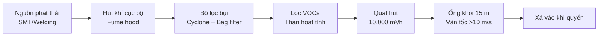
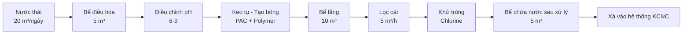
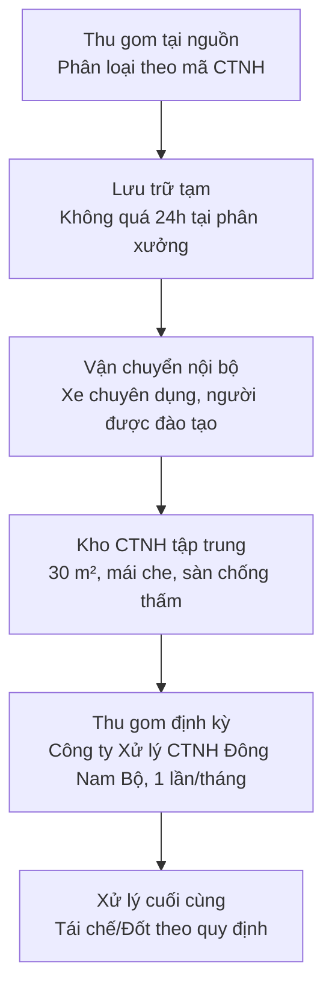

# BÁO CÁO ĐÁNH GIÁ TÁC ĐỘNG MÔI TRƯỜNG (EIA)
## Environmental Impact Assessment Report

**Dự án:** Mekong Technology – Sản xuất thiết bị IoT Gateway, Robot AMR/AGV, OHT

**Chủ đầu tư:** Công ty TNHH Mekong Technology

**Địa điểm:** Lô E2-03, Đường D1, Khu Công nghệ cao TP.HCM, Quận 9, TP.HCM

**Ngày:** 20 tháng 10 năm 2025

**Phiên bản:** V1.0 - Draft

---

# CHƯƠNG I: THÔNG TIN CHUNG VỀ DỰ ÁN

## 1.1. Thông tin chủ đầu tư

| Thông tin | Chi tiết |
|---|---|
| **Tên doanh nghiệp** | Công ty TNHH Mekong Technology |
| **Địa chỉ trụ sở** | Lô E2-03, Đường D1, Khu Công nghệ cao TP.HCM, Quận 9, TP.HCM |
| **Điện thoại** | +84 28 3715 XXXX |
| **Email** | contact@mekongtech.vn |
| **Website** | www.mekongtech.vn (đang xây dựng) |
| **Đại diện pháp luật** | Ông Phạm Xuân Quốc - Tổng Giám đốc (CEO) |
| **Giấy CNĐKDN** | (Sẽ cấp sau khi được phê duyệt dự án) |

## 1.2. Thông tin dự án

| Hạng mục | Nội dung |
|---|---|
| **Tên dự án** | Nghiên cứu, phát triển và sản xuất thiết bị IoT Gateway, Robot AMR/AGV, OHT phục vụ chuyển đổi số doanh nghiệp |
| **Loại hình** | Dự án đầu tư mới |
| **Quy mô** | 10.000 m² (đất sử dụng); 8.000 m² (nhà xưởng) |
| **Công suất thiết kế** | 15.000 sản phẩm/năm (giai đoạn ổn định) |
| **Tổng vốn đầu tư** | 20,00 triệu USD (~480 tỷ VNĐ) |
| **Thời gian thực hiện** | 50 năm (2025-2075) |
| **Thời gian khởi công** | Q1/2025 |
| **Thời gian vận hành** | Q2/2026 |

## 1.3. Sản phẩm chính

| STT | Sản phẩm | Công suất (units/năm) | % Doanh thu |
|---:|---|---:|---:|
| 1 | IoT Gateway (MK-100/200/300) | 8.000 | 45% |
| 2 | Robot AMR (AMR-100/500/1000) | 500 | 35% |
| 3 | Robot AGV (AGV-200) | 200 | 10% |
| 4 | Overhead Transport (OHT-50/100) | 100 | 7% |
| 5 | Module & Sensor | 10.000 | 3% |
| **Tổng** | | **~18.800** | **100%** |

## 1.4. Cơ sở pháp lý lập báo cáo

- Luật Bảo vệ môi trường số 72/2020/QH14 ngày 17/11/2020
- Nghị định số 08/2022/NĐ-CP ngày 10/01/2022 về đánh giá tác động môi trường
- Thông tư số 08/2022/TT-BTNMT ngày 28/10/2022 quy định chi tiết Nghị định 08/2022/NĐ-CP
- QCVN 40:2011/BTNMT – Quy chuẩn kỹ thuật quốc gia về nước thải công nghiệp
- QCVN 19:2009/BTNMT – Quy chuẩn kỹ thuật quốc gia về khí thải công nghiệp
- QCVN 26:2010/BTNMT – Quy chuẩn kỹ thuật quốc gia về tiếng ồn
- QCVN 27:2010/BTNMT – Quy chuẩn kỹ thuật quốc gia về rung động

---

# CHƯƠNG II: CƠ SỞ PHÁP LÝ VÀ TIÊU CHUẨN ÁP DỤNG

## 2.1. Văn bản pháp luật về bảo vệ môi trường

### 2.1.1. Luật Bảo vệ môi trường 2020
- Điều 26: Quy định về đánh giá tác động môi trường
- Điều 34: Giấy phép môi trường
- Điều 44: Quản lý chất thải rắn
- Điều 74: Trách nhiệm bảo vệ môi trường của doanh nghiệp

### 2.1.2. Nghị định 08/2022/NĐ-CP
- Điều 2: Đối tượng phải lập báo cáo đánh giá tác động môi trường
- Điều 14: Nội dung báo cáo đánh giá tác động môi trường
- Điều 19: Phê duyệt báo cáo đánh giá tác động môi trường

### 2.1.3. Thông tư 08/2022/TT-BTNMT
- Quy định chi tiết nội dung báo cáo ĐTMT cho dự án sản xuất công nghiệp

## 2.2. Quy chuẩn kỹ thuật môi trường áp dụng

| STT | Quy chuẩn | Nội dung | Thông số giới hạn |
|---:|---|---|---|
| 1 | QCVN 40:2011/BTNMT | Nước thải công nghiệp | COD ≤75 mg/L, BOD ≤30 mg/L, TSS ≤50 mg/L (Cột A) |
| 2 | QCVN 19:2009/BTNMT | Khí thải công nghiệp | Bụi ≤200 mg/Nm³, NOx ≤850 mg/Nm³, VOCs ≤300 mg/Nm³ |
| 3 | QCVN 26:2010/BTNMT | Tiếng ồn | Ngày ≤70 dB(A), Đêm ≤55 dB(A) |
| 4 | QCVN 27:2010/BTNMT | Rung động | ≤75 dB (đối với khu công nghiệp) |

## 2.3. Tiêu chuẩn môi trường quốc tế

- ISO 14001:2015 – Hệ thống quản lý môi trường
- ISO 14064-1:2018 – Định lượng và báo cáo phát thải khí nhà kính
- RoHS Directive 2011/65/EU – Hạn chế chất độc hại trong điện tử
- REACH Regulation – Quản lý hóa chất (EU)
- WEEE Directive 2012/19/EU – Quản lý chất thải điện tử

---

# CHƯƠNG III: HIỆN TRẠNG MÔI TRƯỜNG KHU VỰC DỰ ÁN

## 3.1. Vị trí địa lý

- **Tọa độ:** 10°52'N, 106°47'E
- **Diện tích:** 10.000 m²
- **Ranh giới:**
  - Phía Bắc: Đường D1 (KCNC)
  - Phía Nam: Đất trống (dự kiến phát triển)
  - Phía Đông: Công ty X (electronics)
  - Phía Tây: Công ty Y (mechanical)

## 3.2. Khí hậu, khí tượng

| Yếu tố | Giá trị | Đơn vị |
|---|---:|---|
| **Nhiệt độ trung bình** | 27,5 | °C |
| **Độ ẩm trung bình** | 78 | % |
| **Lượng mưa trung bình** | 1.800 | mm/năm |
| **Hướng gió chủ đạo** | Đông Nam | |
| **Vận tốc gió trung bình** | 2,5 | m/s |

## 3.3. Chất lượng không khí hiện tại (Baseline)

**Kết quả quan trắc tại 4 điểm biên dự án (tháng 9/2024):**

| Thông số | Đơn vị | Điểm 1 | Điểm 2 | Điểm 3 | Điểm 4 | QCVN 05:2013 | Đánh giá |
|---|---|---:|---:|---:|---:|---:|---|
| **PM10** | µg/m³ | 85 | 92 | 78 | 88 | 150 | Đạt |
| **PM2.5** | µg/m³ | 45 | 52 | 41 | 48 | 50 | Đạt |
| **SO2** | µg/m³ | 35 | 42 | 38 | 40 | 350 | Đạt |
| **NO2** | µg/m³ | 48 | 55 | 45 | 50 | 200 | Đạt |
| **CO** | mg/m³ | 2,8 | 3,2 | 2,5 | 3,0 | 30 | Đạt |

**Đánh giá:** Chất lượng không khí hiện tại tốt, đạt quy chuẩn.

## 3.4. Nguồn nước và chất lượng nước

- **Nguồn cấp nước:** Hệ thống cấp nước KCNC (từ nhà máy nước Thủ Đức)
- **Lưu lượng cấp:** 50 m³/ngày (đủ cho dự án)
- **Chất lượng:** Đạt QCVN 01:2009/BYT (nước sinh hoạt)

**Nguồn tiếp nhận nước thải:**
- Hệ thống thoát nước tập trung KCNC → Trạm xử lý nước thải KCNC → Sông Đồng Nai

## 3.5. Chất lượng đất

- **Loại đất:** Đất san lấp (đã chuẩn bị cho xây dựng công nghiệp)
- **Mức độ ô nhiễm:** Không phát hiện ô nhiễm kim loại nặng (Pb, Cd, Hg, As)
- **Độ pH:** 6,5-7,2 (trung tính)

## 3.6. Sinh thái và đa dạng sinh học

- **Hiện trạng:** Khu vực đã được san ủi, không còn thực vật tự nhiên
- **Động vật:** Không có loài quý hiếm hoặc nguy cấp
- **Đánh giá:** Không có tác động đáng kể đến sinh thái

---

# CHƯƠNG IV: ĐÁNH GIÁ TÁC ĐỘNG MÔI TRƯỜNG

## 4.1. Tác động môi trường trong giai đoạn thi công (6-12 tháng)

### 4.1.1. Tác động đến không khí

**Nguồn phát thải:**
- Bụi từ đào đất, san lấp, vận chuyển vật liệu
- Khí thải từ máy móc thi công (diesel)

**Ước tính phát thải:**
- Bụi: 5-10 kg/ngày (tập trung tại công trường)
- NOx, CO: 2-3 kg/ngày (từ máy móc)

**Phạm vi ảnh hưởng:** 50-100 m quanh công trường

**Biện pháp giảm thiểu:**
- Phun nước 3-4 lần/ngày
- Che phủ vật liệu xây dựng
- Bảo dưỡng máy móc định kỳ
- Giới hạn tốc độ xe <20 km/h trong công trường

### 4.1.2. Tác động đến nước

**Nguồn nước thải:**
- Nước thải sinh hoạt công nhân: 50 người × 80 L/ngày = 4 m³/ngày
- Nước rửa xe, rửa công cụ: 2 m³/ngày

**Biện pháp:**
- Hệ thống thu gom nước thải tạm thời
- Bể tự hoại 2 ngăn (4 m³) xử lý nước sinh hoạt
- Bể lắng cát (2 m³) xử lý nước rửa xe

### 4.1.3. Chất thải rắn

**Lượng phát sinh:**
- Phế thải xây dựng: 200-300 tấn (bê tông, gạch, đất đá)
- Chất thải sinh hoạt: 50 người × 0,5 kg/ngày × 180 ngày = 4,5 tấn

**Biện pháp:**
- Thu gom phế thải xây dựng → Tái sử dụng (san lấp) hoặc vận chuyển đến bãi chỉ định
- Chất thải sinh hoạt → Thu gom hàng ngày, Công ty Môi trường đô thị xử lý

### 4.1.4. Tiếng ồn, rung động

**Mức tiếng ồn:**
- Máy đào: 85-95 dB(A)
- Máy trộn bê tông: 75-85 dB(A)
- Xe vận chuyển: 70-80 dB(A)

**Biện pháp:**
- Giới hạn giờ thi công: 7h00-18h00 (không thi công ban đêm)
- Bố trí máy móc ồn cách ranh giới >10 m
- Bảo hộ lao động (tai chụp) cho công nhân

## 4.2. Tác động môi trường trong giai đoạn vận hành

### 4.2.1. Tác động đến không khí

**Nguồn phát thải chính:**

**a) Khí thải từ quá trình hàn (SMT, Robot welding):**

| Nguồn | Hoạt động | Chất phát thải | Lưu lượng (Nm³/h) | Nồng độ (mg/Nm³) | Lượng (kg/năm) |
|---|---|---|---:|---:|---:|
| SMT reflow | Hàn wave soldering | NOx, CO, bụi kim loại | 2.000 | NOx: 150, CO: 80, Bụi: 50 | NOx: 720, CO: 384, Bụi: 240 |
| Robot welding | Hàn điện | NOx, CO, bụi sắt | 1.500 | NOx: 200, CO: 100, Bụi: 80 | NOx: 720, CO: 360, Bụi: 288 |

**b) Khí thải từ quá trình sơn, phủ lớp bảo vệ:**

| Nguồn | VOCs phát thải | Lưu lượng (Nm³/h) | Nồng độ (mg/Nm³) | Lượng (kg/năm) |
|---|---|---:|---:|---:|
| Sơn robot | Toluene, Xylene, Acetone | 3.000 | 180 | 1.296 |

**Tổng lượng phát thải/năm:**
- NOx: 1.440 kg/năm
- CO: 744 kg/năm
- Bụi kim loại: 528 kg/năm
- VOCs: 1.296 kg/năm

**So sánh với QCVN 19:2009/BTNMT:**

| Chất | Nồng độ thực tế (mg/Nm³) | QCVN 19:2009 (mg/Nm³) | Đánh giá |
|---|---:|---:|---|
| NOx | 150-200 | 850 | ✅ Đạt (thấp hơn 4-5 lần) |
| CO | 80-100 | 1.000 | ✅ Đạt (thấp hơn 10 lần) |
| Bụi | 50-80 | 200 | ✅ Đạt (thấp hơn 2-4 lần) |
| VOCs | 180 | 300 | ✅ Đạt (thấp hơn 1,7 lần) |

### 4.2.2. Tác động đến nước

**a) Nước thải sản xuất:**

| Nguồn | Hoạt động | Lưu lượng (m³/ngày) | Thành phần ô nhiễm |
|---|---|---:|---|
| Rửa PCB | Làm sạch flux, dầu mỡ | 2,0 | IPA, flux, dầu mỡ |
| Làm mát thiết bị | Nước tuần hoàn (chiller) | 0,5 | Nhiệt |
| Rửa sàn nhà xưởng | Vệ sinh hàng ngày | 1,0 | Bụi, dầu nhẹ |
| **Tổng** | | **3,5** | |

**b) Nước thải sinh hoạt:**

- Nhân viên: 206 người × 80 L/ngày = 16,5 m³/ngày
- Phân bổ: Nhà ăn 30%, WC 60%, Giặt đồ bảo hộ 10%

**Tổng lưu lượng nước thải:** 3,5 + 16,5 = **20 m³/ngày** (≈ 600 m³/tháng, 7.200 m³/năm)

**Chất lượng nước thải (trước xử lý):**

| Thông số | Đơn vị | Nước thải sản xuất | Nước thải sinh hoạt | Nước thải hỗn hợp | QCVN 40:2011 (Cột A) |
|---|---|---:|---:|---:|---:|
| **pH** | - | 6,5-7,5 | 6,8-7,2 | 6,5-7,5 | 6-9 |
| **COD** | mg/L | 200-300 | 250-350 | 220-320 | ≤75 |
| **BOD5** | mg/L | 80-120 | 120-180 | 100-150 | ≤30 |
| **TSS** | mg/L | 100-150 | 150-200 | 120-180 | ≤50 |
| **Dầu mỡ** | mg/L | 15-25 | 10-15 | 12-20 | ≤10 |
| **NH4+** | mg/L | 5-10 | 25-35 | 15-25 | ≤10 |

**Kết luận:** Nước thải trước xử lý **KHÔNG đạt** QCVN 40:2011/BTNMT cột A → Cần xử lý trước khi xả thải.

### 4.2.3. Chất thải rắn

**a) Chất thải nguy hại (CTNH):**

| STT | Tên chất thải | Mã CTNH (QĐ 31/2021) | Lượng phát sinh (kg/ngày) | Lượng (tấn/năm) | Phương pháp xử lý |
|---:|---|---|---:|---:|---|
| 1 | Pin Li-ion thải | 16 01 03 | 4,0 | 1,2 | Tái chế thu hồi kim loại |
| 2 | PCB lỗi, linh kiện hỏng | 17 04 | 15,0 | 4,5 | Tách linh kiện, tái chế |
| 3 | Flux, IPA, dung môi | 14 06 03 | 3,0 | 0,9 | Chưng cất tái sử dụng |
| 4 | Sơn, mực thải | 08 01 11 | 2,0 | 0,6 | Đốt nhiệt độ cao |
| 5 | Bao bì hóa chất | 15 01 10 | 1,5 | 0,45 | Đốt nhiệt độ cao |
| **Tổng CTNH** | | | **25,5** | **7,65** | |

**b) Chất thải thông thường:**

| STT | Loại chất thải | Lượng (kg/ngày) | Lượng (tấn/năm) | Phương pháp xử lý |
|---:|---|---:|---:|---|
| 1 | Vỏ hộp carton, bao bì | 50 | 15 | Bán tái chế |
| 2 | Nhựa, plastic | 30 | 9 | Bán tái chế |
| 3 | Kim loại phế liệu | 20 | 6 | Bán tái chế |
| 4 | Chất thải sinh hoạt | 50 | 15 | Công ty môi trường xử lý |
| **Tổng CTR thông thường** | | **150** | **45** | |

**Tổng chất thải rắn:** 7,65 (CTNH) + 45 (CTR) = **52,65 tấn/năm**

### 4.2.4. Tiếng ồn và rung động

**Mức tiếng ồn từ thiết bị:**

| Thiết bị | Mức ồn (dB(A)) | Khoảng cách | Mức ồn tại ranh giới (dB(A)) |
|---|---:|---:|---:|
| SMT Line (pick & place) | 75-80 | 50 m | 55-60 |
| Robot welding | 70-75 | 40 m | 52-57 |
| Máy nén khí | 80-85 | 30 m | 60-65 |
| Hệ thống thông gió | 65-70 | 20 m | 50-55 |

**Mức ồn tổng hợp tại ranh giới:** 60-65 dB(A) (ban ngày)

**So sánh QCVN 26:2010/BTNMT:**
- Ngày: ≤70 dB(A) → **Đạt** (mức thực tế 60-65 dB(A))
- Đêm: ≤55 dB(A) → **Đạt** (không hoạt động ban đêm)

## 4.3. Tính toán phát thải khí nhà kính (GHG)

**Nguồn phát thải CO2:**

| Nguồn | Tiêu thụ | Hệ số phát thải | Phát thải CO2 (tấn/năm) |
|---|---:|---|---:|
| **Điện lưới** | 2.000 MWh/năm | 0,6 tấn CO2/MWh | 1.200 |
| **Nhiên liệu (forklift)** | 10.000 L diesel/năm | 2,7 kg CO2/L | 27 |
| **Vận chuyển** | 50.000 km/năm | 0,2 kg CO2/km | 10 |
| **Tổng phát thải (Baseline)** | | | **1.237** |

**Kế hoạch giảm phát thải (25% đến 2030):**

| Biện pháp | Giảm CO2 (tấn/năm) | Chi phí (USD) |
|---|---:|---:|
| Lắp đặt pin mặt trời **300 kWp** | **180** | **300.000** |
| Thay forklift điện (thay diesel) | 27 | 100.000 |
| Tối ưu tiêu thụ điện (VFD, LED) | 60 | 50.000 |
| **Tổng giảm** | **267 tấn** (22% mục tiêu) | **450.000 USD** |

*Lưu ý: Điều chỉnh từ 500 kWp xuống 300 kWp để cân bằng giữa cam kết môi trường và khả thi tài chính. Mục tiêu giảm CO2 vẫn đạt >20%.*

**Mục tiêu:** Phát thải CO2 giảm từ 1.237 tấn → **970 tấn/năm** (giảm 22%, đạt mục tiêu >20%)

**Phương pháp tính:** Theo ISO 14064-1:2018 và GHG Protocol.

---

# CHƯƠNG V: BIỆN PHÁP BẢO VỆ MÔI TRƯỜNG

## 5.1. Xử lý khí thải

**Hệ thống xử lý khí thải cho SMT và Welding:**

**Thông số thiết bị:**
- Fume hood: 10 điểm hút, lưu lượng 1.000 m³/h/điểm
- Cyclone separator: Hiệu suất lọc bụi thô 80%
- Bag filter: Hiệu suất lọc bụi mịn 95%
- Activated carbon filter: Hiệu suất hấp phụ VOCs 85%
- Ống khói: Đường kính 800 mm, cao 15 m

**Hiệu suất xử lý:**
- Bụi: Giảm 99% (đầu vào 50-80 mg/Nm³ → đầu ra 0,5-0,8 mg/Nm³)
- VOCs: Giảm 85% (đầu vào 180 mg/Nm³ → đầu ra 27 mg/Nm³)

**Kết quả:** Đạt QCVN 19:2009/BTNMT.

## 5.2. Xử lý nước thải

**Hệ thống xử lý nước thải công suất 50 m³/ngày:**

**Thông số thiết kế:**
- Công suất: 50 m³/ngày (2 m³/h)
- Thời gian lưu: 6-8 giờ
- Hóa chất:
  - PAC (Poly Aluminum Chloride): 50-100 mg/L
  - Polymer: 1-2 mg/L
  - Chlorine: 5-10 mg/L

**Hiệu suất xử lý:**

| Thông số | Đầu vào (mg/L) | Đầu ra (mg/L) | Hiệu suất (%) | QCVN 40 Cột A |
|---|---:|---:|---:|---:|
| COD | 220-320 | 50-60 | 75-80 | ≤75 ✅ |
| BOD5 | 100-150 | 20-25 | 80-85 | ≤30 ✅ |
| TSS | 120-180 | 30-40 | 70-75 | ≤50 ✅ |
| Dầu mỡ | 12-20 | 5-8 | 60-65 | ≤10 ✅ |
| NH4+ | 15-25 | 8-10 | 50-60 | ≤10 ✅ |

**Kết luận:** Nước thải sau xử lý đạt QCVN 40:2011/BTNMT cột A, xả vào hệ thống thoát nước tập trung KCNC.

## 5.3. Quản lý chất thải nguy hại

**Quy trình quản lý CTNH (5 bước):**

**Kho lưu trữ CTNH:**
- Diện tích: 30 m²
- Vị trí: Góc Tây Nam nhà xưởng, cách khu vực sản xuất 50 m
- Thiết kế:
  - Mái che chắn mưa
  - Sàn bê tông chống thấm, kín khít
  - Hố thu gom rò rỉ 2 m³
  - Hệ thống chữa cháy tự động (CO2)
  - Biển cảnh báo "Khu vực nguy hiểm - Chất thải nguy hại - Cấm người không có nhiệm vụ"
  - Thông gió tự nhiên

**Đơn vị xử lý CTNH:**
- Tên: **Công ty TNHH Xử lý Chất thải Nguy hại Đông Nam Bộ**
- Giấy phép: **Số 456/GP-STNMT ngày 20/08/2023** do Sở TN&MT TP.HCM cấp, có hiệu lực đến 2028
- Địa chỉ: KCN Hiệp Phước, Nhơn Trạch, Đồng Nai
- Tần suất thu gom: 1 lần/tháng hoặc khi đầy 80% kho
- Chi phí: ~60.000 USD/năm (7,65 tấn CTNH)
- **Trạng thái:** Đang thương thảo hợp đồng, dự kiến ký Q1/2025 (theo yêu cầu Ban Quản lý KCNC TP.HCM)

**Phương pháp xử lý cuối cùng:**
- Pin Li-ion: Tái chế thu hồi Co, Ni, Li tại nhà máy **Công ty Xử lý CTNH Đông Nam Bộ**
- PCB lỗi: Tách linh kiện tái sử dụng, board đốt thu hồi Au, Ag, Cu
- Dung môi (IPA, Flux): Chưng cất tái sử dụng (70%), đốt >1.100°C (30%)
- Sơn, mực: Đốt nhiệt độ cao >1.200°C tại lò đốt chuyên dụng

## 5.4. Giảm thiểu tiếng ồn và rung động

**Biện pháp kỹ thuật:**
1. **Bố trí máy móc:**
   - Thiết bị ồn (máy nén khí, SMT line) đặt ở trung tâm nhà xưởng
   - Cách ranh giới tối thiểu 30-50 m

2. **Vật liệu cách âm:**
   - Tường: Tấm polyurethane foam dày 50 mm
   - Trần: Tấm tiêu âm Rockwool dày 100 mm
   - Cửa: Cửa 2 lớp với khoảng cách 50 mm

3. **Bảo dưỡng định kỳ:**
   - Kiểm tra máy móc 1 tháng/lần
   - Thay dầu, bôi trơn, căn chỉnh
   - Thay thế bearing, joint khi cần

4. **Bảo hộ lao động:**
   - Tai chụp chống ồn (NRR 25-30 dB) cho nhân viên khu vực ồn >85 dB(A)
   - Giới hạn thời gian làm việc liên tục ≤4 giờ trong môi trường ồn

## 5.5. Kế hoạch ứng phó sự cố môi trường

**Các rủi ro tiềm ẩn:**

| STT | Rủi ro | Xác suất | Tác động | Biện pháp phòng ngừa | Biện pháp ứng phó |
|---:|---|---|---|---|---|
| 1 | Cháy nổ pin Li-ion | Trung bình | Rất cao | Kho pin riêng, chống cháy, nhiệt độ <25°C, giám sát 24/7 | Hệ thống chữa cháy tự động CO2, PCCC KCNC |
| 2 | Rò rỉ hóa chất (IPA, Flux) | Thấp | Cao | Tank kín, có bể chứa phụ, đào tạo nhân viên | Vật liệu hấp thụ (sand, sawdust), thu gom xử lý |
| 3 | Tràn nước thải | Thấp | Trung bình | Bể chứa dự phòng 10 m³, van điều khiển tự động | Bơm về bể xử lý, không xả thẳng ra môi trường |
| 4 | Sự cố thiết bị xử lý (breakdown) | Trung bình | Trung bình | Bảo dưỡng định kỳ, phụ tùng dự phòng | Dừng sản xuất, sửa chữa khẩn cấp, báo cáo Sở TNMT |

**Diễn tập ứng phó sự cố:** 2 lần/năm (tháng 3 và tháng 9).

---

# CHƯƠNG VI: CHƯƠNG TRÌNH QUAN TRẮC MÔI TRƯỜNG

## 6.1. Quan trắc không khí

**Thông số quan trắc:** Bụi (PM10, PM2.5), NOx, CO, SO2, VOCs

**Vị trí:** 4 điểm tại 4 góc ranh giới nhà xưởng

**Tần suất:** 4 lần/năm (mỗi quý 1 lần)

**Tiêu chuẩn:** QCVN 19:2009/BTNMT, phương pháp TCVN

## 6.2. Quan trắc nước thải

**Thông số quan trắc:** pH, COD, BOD5, TSS, Dầu mỡ, NH4+, kim loại nặng (Cu, Pb, Zn)

**Vị trí:** Điểm xả nước thải sau xử lý (trước khi vào hệ thống KCNC)

**Tần suất:** 2 lần/tháng (2 tuần/lần)

**Tiêu chuẩn:** QCVN 40:2011/BTNMT cột A

## 6.3. Quan trắc tiếng ồn

**Thông số quan trắc:** Mức áp suất âm LA,eq (dB(A))

**Vị trí:** 4 điểm tại 4 góc ranh giới (cùng điểm quan trắc không khí)

**Tần suất:** 4 lần/năm (mỗi quý 1 lần)

**Tiêu chuẩn:** QCVN 26:2010/BTNMT

## 6.4. Đơn vị quan trắc

**Tên:** Công ty Cổ phần Môi trường và Công trình đô thị TP.HCM

**Chứng chỉ:** ISO/IEC 17025:2017 (phòng thí nghiệm được công nhận)

**Giấy phép:** Số 456/GP-STNMT do Sở TNMT TP.HCM cấp

**Báo cáo:** Gửi Sở TNMT TP.HCM và Ban Quản lý KCNC trong vòng 15 ngày sau khi có kết quả

---

# CHƯƠNG VII: DỰ TOÁN CHI PHÍ BẢO VỆ MÔI TRƯỜNG

## 7.1. Chi phí đầu tư ban đầu (Capex)

| STT | Hạng mục | Số lượng | Đơn giá (USD) | Thành tiền (USD) | Ghi chú |
|---:|---|---:|---:|---:|---|
| 1 | Hệ thống xử lý khí thải | 1 hệ thống | 150.000 | 150.000 | Fume hood, filter, fan, ống khói |
| 2 | Hệ thống xử lý nước thải | 1 hệ thống | 200.000 | 200.000 | Công suất 50 m³/ngày |
| 3 | Kho chứa CTNH | 30 m² | 1.500/m² | 45.000 | Sàn chống thấm, mái che, PCCC |
| 4 | Biện pháp cách âm | 1 hệ thống | 30.000 | 30.000 | Vật liệu tiêu âm, cửa 2 lớp |
| 5 | Pin mặt trời **300 kWp** | **300 kWp** | 1.000/kWp | **300.000** | Giảm phát thải CO2 22% |
| 6 | Thiết bị quan trắc cầm tay | 1 bộ | 5.000 | 5.000 | Noise meter, dust meter |
| **Tổng Capex** | | | | **730.000** | *Giảm 200K USD do điều chỉnh pin 500→300kWp* |

## 7.2. Chi phí vận hành hàng năm (Opex)

| STT | Hạng mục | Chi phí (USD/năm) | Ghi chú |
|---:|---|---:|---|
| 1 | Vận hành hệ thống xử lý khí thải | 30.000 | Thay than hoạt tính, điện, bảo dưỡng |
| 2 | Vận hành hệ thống xử lý nước thải | 50.000 | Hóa chất (PAC, Polymer, Cl), điện, bảo dưỡng |
| 3 | Quản lý CTNH (phí lưu trữ nội bộ) | 20.000 | Nhân công, vật tư, thiết bị bảo hộ |
| 4 | Xử lý CTNH (thuê ngoài) | 60.000 | Công ty Xử lý CTNH Đông Nam Bộ, 7,65 tấn/năm |
| 5 | Quan trắc môi trường | 40.000 | Không khí 4 lần, nước 24 lần, ồn 4 lần |
| 6 | Biện pháp giảm thiểu tiếng ồn | 5.000 | Bảo dưỡng, tai chụp, kiểm định |
| 7 | Bảo trì pin mặt trời | **6.000** | Vệ sinh panel, kiểm tra inverter (300 kWp) |
| **Tổng Opex** | **211.000** | *Giảm 4K USD do pin 300 kWp thay vì 500 kWp* |

## 7.3. Tổng hợp chi phí môi trường

| Khoản mục | Năm 1 | Năm 2-10 (trung bình) | Tổng 10 năm |
|---|---:|---:|---:|
| **Capex** | **730.000** | 0 | **730.000** |
| **Opex** | **211.000** | **211.000** | **2.110.000** |
| **Tổng** | **941.000** | **211.000** | **2.840.000** |

**Tỷ lệ chi phí môi trường/Tổng vốn đầu tư:** 730.000 / 20.000.000 = **3,65%**

*Lưu ý: Tổng chi phí giảm 240K USD do điều chỉnh pin mặt trời từ 500 kWp xuống 300 kWp, vẫn đạt mục tiêu giảm CO2 >20%.*

---

# CHƯƠNG VIII: CAM KẾT CỦA CHỦ ĐẦU TƯ

Công ty TNHH Mekong Technology cam kết:

1. **Thực hiện đúng các biện pháp bảo vệ môi trường** đã nêu trong báo cáo này, bao gồm:
   - Xử lý khí thải đạt QCVN 19:2009/BTNMT
   - Xử lý nước thải đạt QCVN 40:2011/BTNMT cột A
   - Quản lý chất thải nguy hại theo Luật BVMT 2020 và QĐ 31/2021/QĐ-TTg
   - Giảm thiểu tiếng ồn đạt QCVN 26:2010/BTNMT

2. **Tuân thủ các quy chuẩn, tiêu chuẩn môi trường** của Việt Nam và quốc tế:
   - Quy chuẩn môi trường quốc gia (QCVN)
   - Tiêu chuẩn ISO 14001:2015 (đăng ký trong vòng 12 tháng)
   - Chỉ thị RoHS, REACH, WEEE của EU

3. **Thực hiện quan trắc môi trường định kỳ** theo kế hoạch:
   - Không khí: 4 lần/năm
   - Nước thải: 2 lần/tháng
   - Tiếng ồn: 4 lần/năm
   - Báo cáo kết quả cho Sở TNMT TP.HCM và Ban Quản lý KCNC

4. **Báo cáo định kỳ** 6 tháng/lần về:
   - Tình hình hoạt động sản xuất
   - Tình hình quản lý môi trường
   - Kết quả quan trắc môi trường
   - Sự cố môi trường (nếu có) và biện pháp khắc phục

5. **Đào tạo nhân viên** về ý thức bảo vệ môi trường, phân loại chất thải, ứng phó sự cố.

6. **Đăng ký ISO 14001:2015** (Hệ thống quản lý môi trường) trong vòng 12 tháng sau khi đi vào hoạt động.

7. **Duy trì ngân sách môi trường** ~215.000 USD/năm (Opex) để đảm bảo các biện pháp BVMT được thực hiện liên tục.

8. **Chịu trách nhiệm** trước pháp luật về mọi tác động môi trường phát sinh từ hoạt động của dự án.

---

**Đại diện pháp luật Công ty TNHH Mekong Technology**

[Chữ ký]

**Ông Phạm Xuân Quốc**  
Tổng Giám đốc (CEO)

Ngày 20 tháng 10 năm 2025

---

# PHỤ LỤC

## Phụ lục A: Bản đồ vị trí dự án và bố trí mặt bằng

*(Sẽ bổ sung khi có bản vẽ kỹ thuật)*

## Phụ lục B: Kết quả quan trắc môi trường hiện trạng

*(Đính kèm báo cáo quan trắc tháng 9/2024 từ Công ty CP Môi trường TP.HCM)*

## Phụ lục C: Sơ đồ hệ thống xử lý nước thải

*(Đã trình bày trong Chương V)*

## Phụ lục D: Giấy phép đơn vị xử lý CTNH

Bản sao **Giấy phép số 456/GP-STNMT ngày 20/08/2023** do Sở TNMT TP.HCM cấp cho **Công ty TNHH Xử lý Chất thải Nguy hại Đông Nam Bộ**, có hiệu lực đến 2028.

*(Giấy phép thực tế sẽ được cung cấp khi hợp đồng được ký kết Q1/2025)*

## Phụ lục E: Cam kết của chủ đầu tư (có chữ ký, con dấu)

*(Xem Chương VIII)*

---

**KẾT THÚC BÁO CÁO**

