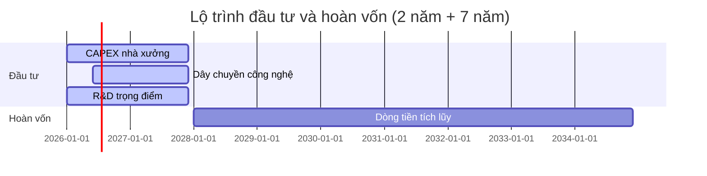
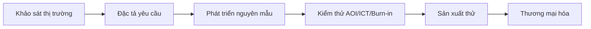
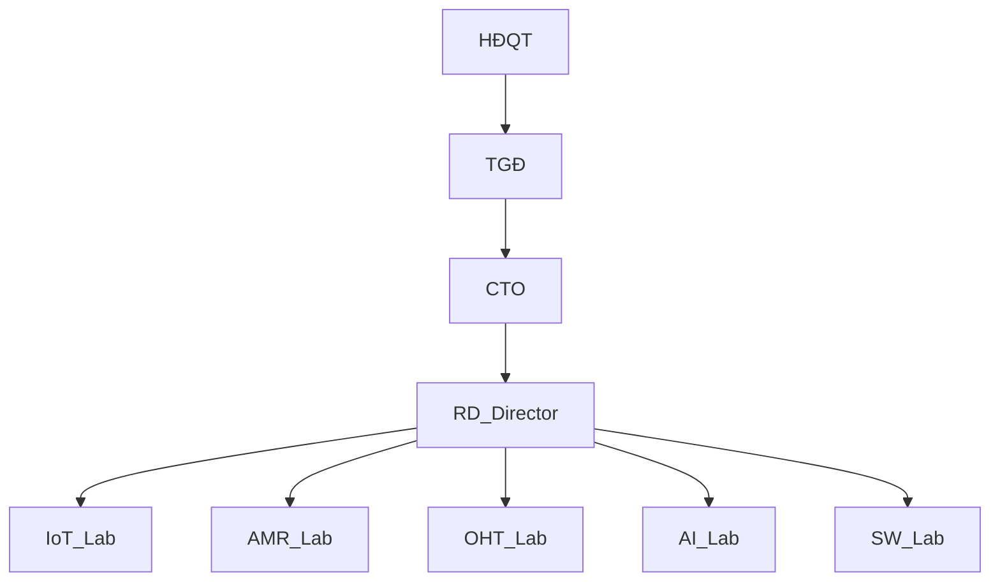

1. YÊU CẦU V7 – FORM ĐIỀN MẪU 1.4 [DRAFT]

1.1 Phạm vi và mục tiêu
- Biểu mẫu thu thập dữ liệu để làm lại hồ sơ đề án theo Mẫu 1.4 mới.
- Ngôn ngữ: tiếng Việt chuẩn; mã hóa UTF-8; newline CRLF.
- Định dạng số: 1.234,56; tiền tệ chính: triệu USD (ghi rõ quy đổi nếu dùng VND).

1.2 Phương pháp và giả định
- Phương pháp: bottom-up kết hợp top-down; Thời điểm dữ liệu: Q4/2025.
- Tổng vốn: 20,0 triệu USD (điều chỉnh phân bổ). Đầu tư 2 năm đầu; hoàn vốn 7 năm tiếp theo.
- Ghi chú chênh lệch so với V5/V6: đánh dấu “Cập nhật so với V5”.

1.3 Hướng dẫn điền nhanh
- Điền đầy đủ các trường bắt buộc (ký hiệu [*]).
- Nơi có bảng, giữ nguyên cột chuẩn; dùng dấu phẩy tách nghìn, chấm thập phân.
- Dẫn chiếu pháp lý theo mẫu: "[Văn bản – Điều x.x, Khoản y, Điểm z] (Cơ quan, năm)".

2. THÔNG TIN CHUNG DỰ ÁN [FORM]
- Tên dự án [*]: 
- Chủ đầu tư/Doanh nghiệp [*]: 
- Địa điểm thực hiện [*]: 
- Quy mô (diện tích, công suất thiết kế) [*]: 
- Thời gian thực hiện (tháng/năm bắt đầu – kết thúc) [*]: 
- Đầu mối liên hệ [*]: `Họ tên – Chức danh – Email – Điện thoại`
- Ghi chú khác: 

3. GIẢI TRÌNH HOẠT ĐỘNG/KHOA HỌC–CÔNG NGHỆ [FORM]
- Mục tiêu khoa học–công nghệ [*]: 
- Nội dung KHCN chính [*]: 
- Mức TRL hiện tại/mục tiêu (mô tả ngắn): 
- Chuẩn/tiêu chuẩn áp dụng dự kiến (ví dụ: MQTT, OPC UA, ISO/IEC liên quan): 
- An toàn thông tin/bảo mật (mã hóa, xác thực, OTA): 

4. DỰ BÁO THỊ TRƯỜNG [FORM]
- Thị trường ngoài nước: quy mô, CAGR, nguồn trích dẫn [*]: 
- Thị trường trong nước: quy mô, CAGR, nguồn trích dẫn [*]: 
- Nhu cầu mục tiêu theo phân khúc (khách hàng/ứng dụng) [*]: 
- Luận cứ phù hợp chiến lược sản phẩm: 
- Nguồn tham khảo (đường dẫn): 

5. NĂNG LỰC TRIỂN KHAI [FORM]
- Năng lực tài chính (vốn chủ sở hữu, tín dụng, bảo lãnh) [*]: 
- Năng lực kỹ thuật (nhân sự chủ chốt, phòng lab, quy trình) [*]: 
- Năng lực thị trường (kênh bán, đối tác, chứng chỉ) [*]: 
- Hạ tầng CNTT/Cloud/Edge (nếu có): 

6. MÔ TẢ SẢN XUẤT/KINH DOANH [FORM]
6.1 Sản phẩm & quy mô (đa dạng hóa danh mục) [*]
- Danh mục chủ lực: IoT; Automation; Robotics; CNC gia công chính xác.
- Lộ trình đa dạng hóa theo giai đoạn (nêu mốc, mục tiêu sản phẩm): 
- Chuẩn tương thích công nghiệp (MES/ERP/WMS, giao thức công nghiệp): 

6.2 Công nghệ & pháp lý [*]
- Quy trình công nghệ tổng quát (từ thiết kế – sản xuất – kiểm thử – giao hàng): 
- QA/QC dự kiến: AOI, ICT, Burn-in; truy vết, kiểm soát thay đổi: 
- Pháp lý/tiêu chuẩn an toàn liên quan (IEC/ISO, an toàn máy): 

6.3 Máy móc thiết bị (giữ đúng mẫu cột)
| STT | Tên thiết bị | Thông số kỹ thuật | Xuất xứ | Năm | Mức tự động hóa (%) | Tình trạng | Số lượng | Giá trị (triệu USD) |
|---:|---|---|---|---:|---:|---|---:|---:|
|  |  |  |  |  |  |  |  |  |
Nguồn: Kế hoạch đầu tư thiết bị. Ghi chú: Cập nhật so với V5 (nếu có).

6.4 Lao động
- Cơ cấu nhân sự theo bộ phận/giai đoạn: 
- Trình độ (ĐH/Sau ĐH/Chứng chỉ): 
- Kế hoạch tuyển dụng – đào tạo theo năm: 

6.5 R&D (nội dung, chi phí, KPI)
| STT | Nội dung | Lĩnh vực | Loại hình | GĐ đầu | GĐ ổn định | Chi phí (triệu USD/năm) |
|---:|---|---|---|---|---|---:|
|  |  |  |  |  |  |  |
Ghi chú: Nêu KPI (Precision/Recall/F1, latency) với mảng AI/ML nếu áp dụng.

7. TÀI CHÍNH – VỐN ĐẦU TƯ [FORM]
7.1 Tổng vốn và phân bổ (điền sẵn giả định chuẩn)
- Tổng vốn (triệu USD) [*]: 20,0
- Phân bổ (triệu USD) [*]:
| Khoản mục | Giá trị | Ghi chú |
|---|---:|---|
| Nhà xưởng (mua/xây dựng/nâng cấp) | 5,00 |  
| R&D | 1,50 |  
| Máy móc/dây chuyền công nghệ | 6,50 | Cập nhật so với V5/V6 (so với 7,5) 
| OPEX (chi phí vận hành) | 7,00 | Xác nhận 1a, 2a 
| Tổng | 20,00 |  |

7.2 Giai đoạn đầu tư – hoàn vốn
- Thời gian đầu tư: 2 năm đầu (nhập mốc YYYY-MM): 
- Thời gian hoàn vốn: 7 năm tiếp theo (nhập doanh thu/chi phí/VA theo năm): 

7.3 Bảng tổng hợp tài chính theo giai đoạn (điền giá trị)
| Chỉ tiêu | GĐ 1 (Đầu tư, 2 năm) | GĐ 2 (Hoàn vốn, 7 năm) | Tổng |
|---|---:|---:|---:|
| Doanh thu (triệu USD) |  |  |  |
| Giá trị gia tăng (triệu USD) |  |  |  |
| OPEX (triệu USD) |  |  |  |
| CAPEX (triệu USD) |  |  |  |
| NPV/IRR/Payback |  |  |  |
Nguồn: FS nội bộ. Ghi chú: Điền phương pháp và giả định tính toán.

8. NGUYÊN VẬT LIỆU, LINH KIỆN, PHỤ TÙNG [FORM]
| STT | Tên | Yêu cầu chất lượng | Số lượng/năm | Ước giá (triệu USD) | Nguồn cung |
|---:|---|---|---:|---:|---|
|  |  |  |  |  |  |
Ghi chú: Thống nhất đơn vị, ghi rõ thời điểm báo giá.

9. CHẤT LƯỢNG & MÔI TRƯỜNG (ISO/IEC) [FORM]
- ISO 9001/14001/45001 (trạng thái, phạm vi áp dụng): 
- RoHS/REACH/WEEE (phạm vi, kiểm soát vật liệu): 
- IEC liên quan (ví dụ: IEC 61000 – EMC): 
- Kế hoạch đánh giá nội bộ/bên thứ ba: 

10. PHÁP LÝ & DẪN CHIẾU [FORM]
- Dẫn chiếu bắt buộc [*]: QĐ 38/2020/QĐ-TTg; QĐ 2117/QĐ-TTg; NĐ 76/2018/NĐ-CP.
- Cú pháp: "[Văn bản – Điều/Khoản/Điểm] (Năm)". Ví dụ: "[QĐ 38/2020/QĐ-TTg – Phụ lục II, Mục 1.1] (2020)".
- Chính sách ưu đãi dự kiến áp dụng: 
- CGCN/IP (nếu có): 
- Checkbox "Cập nhật so với V5": [ ] Áp dụng tại mục: 6.3; 7.1; (khác…) 

11. SƠ ĐỒ MINH HỌA (PLACEHOLDER)
11.1 Quy trình R&D (flow)

11.2 Sơ đồ tổ chức R&D (tham khảo)

12. CAM KẾT & LIÊN HỆ [FORM]
- Cam kết của nhà đầu tư [*]: 
- Đầu mối liên hệ chính [*]: 
- Chữ ký điện tử (nếu có): 

13. CHECKLIST TRƯỚC KHI CHỐT
- [ ] Ngôn ngữ đúng quy tắc; định dạng số, đơn vị thống nhất.
- [ ] Bảng biểu đủ cột, có đơn vị, nguồn; số liệu khớp giữa các phần.
- [ ] Dẫn chiếu pháp lý & tiêu chuẩn kỹ thuật rõ ràng.
- [ ] Sơ đồ Mermaid hiển thị đúng; ảnh (nếu có) đặt đúng thư mục.
- [ ] Không vi phạm quy tắc tên tệp; đánh dấu "Cập nhật so với V5" nơi cần.

