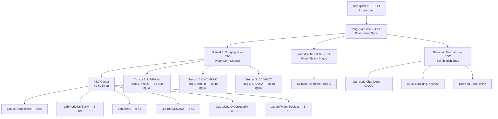
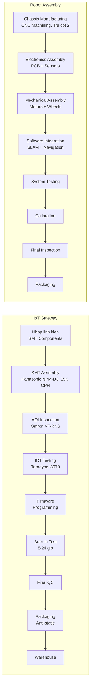
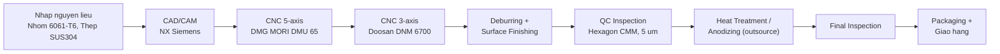
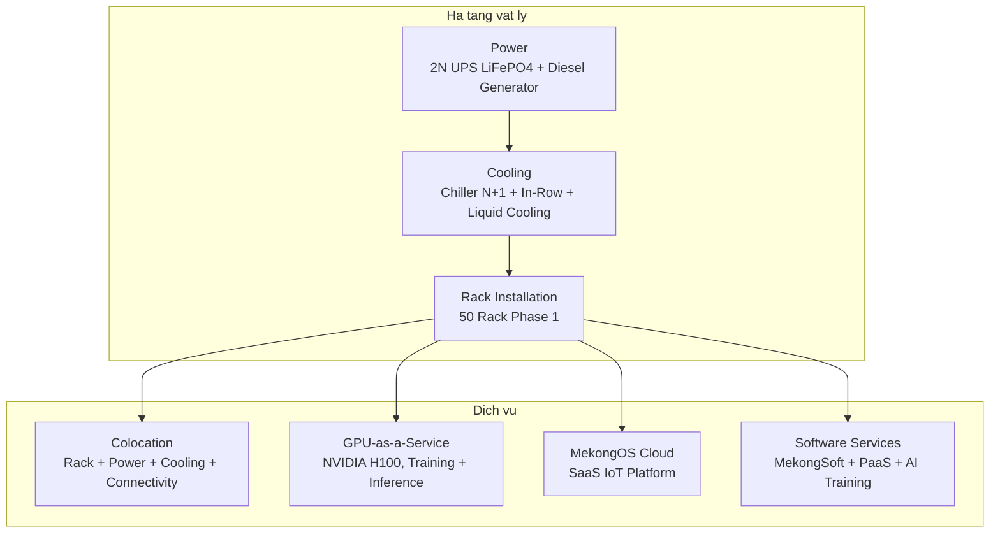

# MAU SO 1.4
## Du an ung dung cong nghe cao de san xuat san pham cong nghe cao

**(Phu luc I, Nghi dinh 31/2021/ND-CP ngay 26/3/2021)**

**INVESTMENT PROJECT INFORMATION**

---

## I. THONG TIN CHUNG

### 1. Ten du an (Project name):
**Mekong Technology – To hop Nghien cuu, Phat trien va San xuat Cong nghe cao: Thiet bi IoT/Robot, Gia cong Co khi Chinh xac (CNC), Trung tam Du lieu (Datacenter) va Dich vu Phan mem**

*(Mekong Technology – High-Tech Integrated Complex: IoT/Robot Devices, Precision CNC Machining, Datacenter and Software Services)*

### 2. Loai hinh Du an (Investment type):
[x] **Viet Nam** [ ] FDI

### 3. Linh vuc hoat dong:
[x] **Vi dien tu - Cong nghe thong tin - Vien thong** (Microelectronic - ICT - Telecommunication)
[x] **Co khi chinh xac - Tu dong hoa** (Precision mechanics - Automation)
[x] **Trung tam du lieu - Dien toan dam may** (Datacenter - Cloud Computing)
[ ] Cong nghe sinh hoc ap dung trong duoc pham va moi truong
[ ] Nang luong moi - Vat lieu moi - Cong nghe Nano
[ ] Khac

### 4. Thoi han hoat dong cua du an (Duration of the project):
**50 nam (tu 01/2025 den 12/2075)**

### 5. Doanh thu hang nam cua du an (du uoc) (Annual Revenue - expectation):
- **Giai doan xay dung (Y1-Y3):** Chua phat sinh doanh thu (giai doan thi cong, lap dat)
- **Giai doan dau san xuat (Y4-Y6):** 3,50 trieu USD/nam (trung binh, ramp-up tu 0,50M den 7,00M)
- **Giai doan on dinh (Y12+):** 21,00 trieu USD/nam
- **Doanh thu nam 10:** 19,50 trieu USD
- **Doanh thu tich luy 15 nam:** ~180,00 trieu USD [C]

### 6. Doanh thu thuan hang nam cua du an (du uoc) (Annual Net revenue - expectation):
- **Giai doan dau san xuat (Y4-Y6):** Hoa von hoac lo nhe (doanh thu chua du bu OPEX + khau hao)
- **Giai doan on dinh (Y12+):** 4,50 trieu USD/nam (EBITDA margin ~35%, CIT uu dai 10%) [C]

### 7. Chi phi hoat dong hang nam cua du an (du uoc) (Annual cost - expectation):
- **Giai doan dau san xuat (Y4-Y6):** 3,00 trieu USD/nam (OPEX: nhan su, nguyen vat lieu, van hanh)
- **Giai doan on dinh (Y12+):** 13,65 trieu USD/nam (OPEX = 65% doanh thu) [C]

### 8. Gia tri gia tang tao ra cua du an (Added value - Expectation):
- **Ty le VA trung binh:** 46% tren doanh thu [C]
- **Giai doan dau (Y4-Y6):** 1,61 trieu USD/nam [C]
- **Giai doan on dinh (Y12+):** 9,66 trieu USD/nam [C]
- **Tong 10 nam san xuat (Y4-Y13):** ~63,00 trieu USD [C]

### 9. To chuc quan ly (Company Organizational chart with R&D division):

**So do to chuc 3 tru cot:**

**Mo ta mo hinh to chuc:**
- **Ban Quan tri:** 5 thanh vien, hop dinh ky hang quy
- **Tong Giam doc:** Dieu hanh tong the, bao cao Ban Quan tri
- **Bo phan R&D:** 40-50 ky su (27-33% tong nhan su), ngan sach ~12,50 trieu USD/10 nam (8-12% doanh thu)
- **Co cau 3 Tru cot:** Moi tru cot co Giam doc rieng, bao cao CTO/COO
  - **Tru cot 1 — IoT/Robot:** San xuat IoT Gateway, Robot AMR/AGV/OHT, thiet bi BMS/SCADA
  - **Tru cot 2 — CNC/MPMC:** Gia cong co khi chinh xac, che tao khung robot, linh kien
  - **Tru cot 3 — DC/MACC:** Van hanh Datacenter Tier III, GPU-as-a-Service, Dich vu phan mem
- **Quy trinh:** Agile development + Lean manufacturing, ISO 9001:2015

---

## II. GIAI TRINH CAC HOAT DONG CUA DU AN UNG DUNG CONG NGHE CAO DE SAN XUAT SAN PHAM CONG NGHE CAO

### 1. Tinh cap thiet va muc tieu (Objective of project):

#### + Tinh cap thiet de thuc hien du an (Urgency to carry out the project):

**1.1. Khoang trong cong nghe nghiem trong tai Viet Nam:**
- **Phu thuoc nhap khau 90%:** Hau het thiet bi IoT, robot cong nghiep va ha tang datacenter duoc nhap khau tu nuoc ngoai voi gia cao (cao hon 30-50% so voi tiem nang san xuat noi dia)
- **Thieu nha san xuat quy mo:** Viet Nam chua co nha san xuat IoT Gateway va Robot AMR quy mo cong nghiep; chua co datacenter Tier III do doanh nghiep noi dia dau tu tai KCNC
- **Thieu dich vu CNC chinh xac:** Nhu cau gia cong co khi chinh xac cho FDI (Samsung, Intel, LG) phai outsource ra nuoc ngoai

**1.2. Nhu cau chuyen doi so cap bach:**
- **83.035 doanh nghiep vua va nho** trong linh vuc san xuat co nhu cau ung dung IoT va tu dong hoa
- **Chi 25%** trong so do da trien khai cac giai phap cong nghe cao
- **Ap luc canh tranh:** Doanh nghiep Viet Nam can tu dong hoa de duy tri kha nang canh tranh trong chuoi cung ung toan cau

**1.3. Co hoi thi truong khong lo:**
- **Thi truong IoT Viet Nam 2030:** 13.200 trieu USD (CAGR 26,2%/nam) [B]
- **Thi truong Robot AMR Viet Nam 2030:** 900 trieu USD (CAGR 30%/nam) [B]
- **Thi truong CNC Viet Nam 2030:** 1.850 trieu USD (CAGR 8,5%/nam) [B]
- **Thi truong Datacenter Viet Nam 2030:** 1.100 — 4.500 trieu USD (CAGR 15-20%/nam) [B]
- **Thi truong ASEAN 2030:** 58,9 ty USD (CAGR 21,1%/nam) [B]

#### + Muc tieu kinh te-xa hoi (Socio-economic goals):

**2.1. Thuc day phat trien kinh te - xa hoi:**
- **Tao viec lam:** 150-200 viec lam truc tiep (on dinh tu Y12), 300-500 viec lam gian tiep
- **Dong gop GDP:** ~63 trieu USD gia tri gia tang trong 10 nam san xuat [C]
- **Xuat khau:** 30-35% doanh thu sang thi truong ASEAN
- **Noi dia hoa:** 50-70% linh kien, giam phu thuoc nhap khau

**2.2. Phat trien nganh cong nghiep cong nghe cao:**
- **Tao chuoi cung ung:** Phat trien 50+ nha cung cap linh kien noi dia
- **Chuyen giao cong nghe:** Dao tao 500+ ky su cong nghe cao
- **He sinh thai:** Xay dung he sinh thai IoT/Robot/Datacenter tai KCNC TP.HCM

**2.3. Nang cao nang luc canh tranh quoc gia:**
- **Vi the khu vuc:** Dua Viet Nam tro thanh trung tam san xuat IoT/Robot + Datacenter ASEAN
- **Giam chi phi:** Gia san pham thap hon 20-30% so voi nhap khau
- **Dich vu ho tro:** Ho tro ky thuat 24/7, tuy chinh linh hoat

#### + Muc tieu ve khoa hoc va cong nghe (Science and technology goals):

**3.1. Lam chu cong nghe loi 3 tru cot:**
- **Tru cot 1 — IoT/Robot:** ARM Cortex-A78, AI tai bien, SLAM navigation, LiDAR 3D, BMS/SCADA
- **Tru cot 2 — CNC/MPMC:** Gia cong 5 truc, dung sai 5 micromet, ISO 9001:2015
- **Tru cot 3 — DC/MACC:** Datacenter Tier III (99,982% uptime), GPU NVIDIA H100, PaaS, AI Training
- **Dich vu Phan mem:** Custom MES/ERP, Managed PaaS, AI/ML Model Training

**3.2. Dat trinh do quoc te:**
- **TRL 8-9:** San pham san sang thuong mai hoa
- **Tieu chuan quoc te:** IEC 61000, RoHS, REACH, WEEE, Uptime Institute Tier III
- **Chung nhan:** ISO 9001, ISO 14001, ISO 45001, ISO 27001 (cho DC)
- **Bao mat:** Ma hoa AES-256, xac thuc OAuth 2.0, SOC 2 Type II (cho DC)

**3.3. Nghien cuu phat trien:**
- **Ngan sach R&D:** ~12,50 trieu USD/10 nam (8-12% doanh thu) [C]
- **Doi ngu:** 40-50 ky su R&D (27-33% tong nhan su)
- **So huu tri tue:** 15-20 bang sang che du kien
- **Hop tac:** Dai hoc Bach khoa TP.HCM, Vien Khoa hoc Cong nghe, cac doi tac quoc te

### 2. Du bao thi truong (Market Forecast):

#### 2.1. Ngoai nuoc (Foreign market):

**Thi truong ASEAN 2030:**
- **Quy mo tong:** 58,9 ty USD (CAGR 21,1%/nam)
- **IoT/Automation:** 35 ty USD
- **CNC Machining:** 8,5 ty USD
- **Datacenter (Co-location + GPU):** 15,4 ty USD
- **Cac quoc gia tiem nang:** Thai Lan, Malaysia, Singapore, Indonesia, Philippines

**Loi the canh tranh cua Viet Nam:**
- Hiep dinh thuong mai tu do ASEAN (khong thue quan)
- Chi phi san xuat thap hon 20-30% so voi Thai Lan va Malaysia
- Co so ha tang logistics tot (cang bien, san bay quoc te)
- Lao dong co tay nghe voi chi phi canh tranh

**Ke hoach xuat khau:**
- **Nam Y6 (2031):** Bat dau xuat khau IoT Gateway sang Singapore, Thai Lan
- **Nam Y8 (2033):** Mo rong sang Malaysia, Indonesia
- **Nam Y12+:** 30-35% doanh thu tu xuat khau

#### 2.2. Trong nuoc (Domestic):

**Thi truong IoT Viet Nam:**
- **Quy mo 2030:** 13.200 trieu USD (CAGR 26,2%/nam) [B]
- **Smart Manufacturing:** 2.600 trieu USD (40% thi truong)
- **Smart Cities/Buildings:** 1.980 trieu USD (15% thi truong)

**Thi truong Robot AMR Viet Nam:**
- **Quy mo 2030:** 900 trieu USD (CAGR 30%/nam) [B]
- **Manufacturing & Logistics:** 720 trieu USD (80% thi truong)

**Thi truong CNC/Co khi chinh xac:**
- **Quy mo 2030:** 1.850 trieu USD (CAGR 8,5%/nam) [B]
- **Khach hang chinh:** Samsung, Intel, LG, Bosch tai KCNC va KCN lan can
- **Nhu cau:** Gia cong khung robot, encoder bracket, motor mount, jig/fixture

**Thi truong Datacenter Viet Nam:**
- **Quy mo 2030:** 1.100 — 4.500 trieu USD (CAGR 15-20%/nam) [B]
- **Dong luc tang truong:** Digital transformation, AI/ML workloads, FDI
- **Thieu cung:** Datacenter Tier III tai TP.HCM chi dap ung ~40% nhu cau [B]

**Nhu cau thi truong:**
- **83.035 doanh nghiep vua va nho** co nhu cau chuyen doi so
- **Chi 25%** da trien khai giai phap cong nghe cao
- **Tiem nang:** 62.276 doanh nghiep chua ung dung cong nghe cao

#### 2.3. Phan tich canh tranh:

| Doi thu | Thi phan IoT | Thi phan Robot | Diem manh | Diem yeu |
|---|---:|---:|---|---|
| Siemens | 18,5% | 15,2% | Cong nghe cao, thuong hieu manh | Gia cao, thoi gian giao hang dai |
| Schneider Electric | 15,2% | 12,8% | He sinh thai hoan chinh | Khong tuy chinh, ho tro han che |
| Rockwell Automation | 12,8% | 10,5% | Chuyen sau tu dong hoa | Phu thuoc nhap khau |
| Nha san xuat noi dia | 25,6% | 30,2% | Gia canh tranh, ho tro tot | Quy mo nho, chat luong thap |

**Co hoi thi truong:**
- **Khoang trong gia:** San pham noi dia co the re hon 20-30%
- **Khoang trong dich vu:** Ho tro ky thuat 24/7, tuy chinh linh hoat
- **Khoang trong thoi gian:** Giao hang nhanh (1-2 thang vs 3-6 thang nhap khau)

### 3. Giai trinh ve nhu cau su dung dat va nang luc trien khai du an cua nha dau tu:

#### 3.1. Danh gia su phu hop voi quy hoach va ha tang:

**Vi tri du an:**
- **Dia diem:** Lo E2-03, Duong D1, Khu Cong nghe cao TP.HCM, Quan 9, TP.HCM
- **Dien tich dat:** 10.000 m2 (1 ha)
- **Phu hop quy hoach:** Thuoc khu vuc uu tien phat trien cong nghe cao theo QD 38/2020/QD-TTg

**Quy mo cong trinh:**
- **Toa nha:** 3 tang + tang ham
- **Tong dien tich san (GFA):** 21.000 m2
  - **Tang 1:** 7.000 m2 — IoT/Robot (Khoi C, 3.000 m2) + CNC/MPMC (Khoi B, 800 m2) + kho + utilities
  - **Tang 2:** ~5.000 m2 — Datacenter MACC (Khoi A, 2.500-3.000 m2) + MEP
  - **Tang 3:** ~4.500 m2 — Van phong + R&D Lab (1.500 m2) + phong hop + support
  - **Tang ham:** ~2.000 m2 — Bai do xe + toolroom
- **Mat do xay dung:** 70% (7.000 m2 / 10.000 m2)
- **Thoi gian xay dung:** 18 thang (shell completion Q3/2028)

**Ha tang ky thuat:**
- **Dien:** 2.000-3.000 kW (transformer 3MVA, du cho san xuat + DC + R&D)
- **Nuoc:** 50 m3/ngay (he thong cap nuoc KCNC)
- **Vien thong:** Fiber optic, 5G coverage
- **Giao thong:** Gan san bay Tan Son Nhat (25 km), cang Cat Lai (15 km)

#### 3.2. Danh gia kha nang tai chinh:

**Tong von dau tu (CAPEX):** 32,00 trieu USD

**Phan ky dau tu (5 giai doan):**

| Giai doan | Thoi gian | Von dau tu (M USD) | Noi dung chinh | Nguon von |
|---|---|---:|---|---|
| Phase 0 | Y0-Y1 | 2,00 | Phap ly, EIA, thiet ke, san lap mat bang | CSH |
| Phase 1 | Y1-Y3 | 5,80 | Xay dung shell 3 tang + M&E + PCCC, hoan cong, So do | CSH |
| Phase 2 | Y3-Y4 | 5,70 | Fit-out IoT (Tang 1) + Ha tang DC (Tang 2) | CSH |
| Phase 3 | Y4-Y6 | 14,50 | GPU + Server Datacenter + CNC 6 may | CSH |
| Phase 4 | Y6-Y8 | 4,00 | Mo rong rack DC + bo sung may CNC tu doanh thu | Vay + Revenue |
| **Tong** | **Y0-Y8** | **32,00** | **Thoi gian dau tu toan bo: 8 nam** | |

**Cau truc von:**

| Nguon von | Gia tri (M USD) | Ty trong | Dieu kien | Thoi diem |
|---|---:|:---:|---|---|
| **Von chu so huu (CSH)** | 24,00 | 75,0% | Tu chu 100% giai doan xay dung + lap dat | Y0-Y5 |
| **Vay ngan hang (MSB/MB)** | 8,00 | 25,0% | Lai suat 8,5%/nam, ky han 10 nam, an han 2 nam | Tu Y6 |
| **Tong CAPEX** | **32,00** | **100%** | WACC = 12% [C] | |

**Chien luoc tai chinh:** CSH = 24,00M USD, gom: P0 (2,00M) + P1 (5,80M) + P2 (5,70M) + P3 (10,50M). Vay 8,00M USD chi giai ngan tu Y6 khi Datacenter da co doanh thu chung minh (revenue proof). So do hoan thanh Y3 nho tien do xay dung tap trung.

**Phan bo CAPEX theo hang muc:**

| Hang muc | CAPEX (M USD) | Ty trong |
|---|---:|:---:|
| Datacenter/MACC (GPU, Server, Power, Cooling) | 16,00 | 50,0% |
| Ha tang + Xay dung (shell, MEP, transformer, PCCC, solar PV 200kWp) | 7,00 | 21,9% |
| IoT/Robot (SMT line Panasonic, test equipment) | 3,50 | 10,9% |
| CNC/MPMC (6 may CNC + QC equipment) | 3,00 | 9,4% |
| Von luu dong + Du phong | 2,50 | 7,8% |
| **Tong** | **32,00** | **100%** |

**Chi so tham dinh tai chinh:**

| Chi so | Conservative | Base Case | Optimistic | Xac suat |
|---|---:|---:|---:|---:|
| NPV 50 nam (M USD) | 1,00 | 2,50 | 5,00 | — |
| IRR 50 nam | 13,0% | 14,5% | 16,5% | — |
| Xac suat xay ra | 30% | 50% | 20% | — |
| **NPV trong so xac suat** | | **2,55** | | [C] |

| Chi so Bo sung | Gia tri | Nhan |
|---|---:|:---:|
| Payback (chiet khau) | 10 nam | [C] |
| DSCR min (vay tu Y6) | 1,42x (Y7) | [C] |
| Revenue 15 nam tich luy | ~180 M USD | [C] |
| EBITDA steady-state (Y12+) | ~35% | [C] |
| Gia tri Chien luoc (Adjusted) | 15,00 M USD | [C] |
| Monte Carlo P(NPV>0) | 72% | [C] |

**Bang chung tai chinh:**
- **Von CSH da chuan bi:** 24,00 trieu USD (xac nhan tai khoan ngan hang + cam ket co dong)
- **Thu cam ket vay:** Letter of Intent tu MSB/MB, 8,00 trieu USD, giai ngan Y6
- **Bao hiem du an:** Bao hiem xay dung + bao hiem tai san + bao hiem trach nhiem

#### 3.3. Danh gia nang luc cong nghe:

**Doi ngu ky thuat:**
- **Tong nhan su (on dinh Y12+):** 150-200 nguoi
- **R&D:** 40-50 ky su (27-33% tong nhan su)
- **Trinh do:** 15 Tien si, 25 Thac si, 50+ Ky su
- **Kinh nghiem:** 5-15 nam trong linh vuc IoT/Robot/CNC/DC

**Cong nghe loi 3 tru cot:**
- **Tru cot 1 — IoT/Robot:** ARM Cortex-A78, AI tai bien, SLAM, BMS/SCADA
- **Tru cot 2 — CNC:** DMG MORI 5-axis, dung sai 5 micromet, ISO 9001
- **Tru cot 3 — DC:** Tier III 99,982% uptime, NVIDIA H100 GPU, PUE < 1,35
- **Phan mem:** MekongSoft (Custom Dev), PaaS, AI/ML Training Service

**Hop tac quoc te:**
- **Chuyen giao cong nghe:** Siemens (IoT), DMG MORI (CNC)
- **Hop tac R&D:** Dai hoc Bach khoa TP.HCM, Vien Khoa hoc Cong nghe
- **GPU Partnership:** NVIDIA (H100 procurement + developer program)

#### 3.4. Danh gia nang luc quan ly:

**Ban lanh dao:**
- **CEO:** Pham Xuan Quoc (15 nam kinh nghiem IoT/Embedded Systems)
- **CTO:** Pham Dinh Chuong (12 nam kinh nghiem Robotics/AI)
- **CFO:** Pham Thi My Phuoc (10 nam kinh nghiem tai chinh doanh nghiep)
- **COO:** Bui Thi Bich Thao (8 nam kinh nghiem san xuat, van hanh)

**He thong quan ly:**
- **ISO 9001:2015:** He thong quan ly chat luong (du kien Q1/2031)
- **ISO 14001:2015:** He thong quan ly moi truong (du kien Q2/2031)
- **ISO 27001:** An toan thong tin cho Datacenter (du kien Q3/2030)
- **ERP:** SAP S/4HANA
- **MES:** Manufacturing Execution System (MekongMES)

### 4. Mo ta cac hoat dong san xuat/kinh doanh cua du an (Description of project production/business activities):

#### a) Giai trinh san pham va nang luc san xuat cua du an (Product description and production capacity):

**4.1. San pham phu hop voi Danh muc san pham cong nghe cao:**

Theo QD 38/2020/QD-TTg - Phu luc II:
- **Muc 1.1:** Cong nghe vi dien tu — San xuat IoT Gateway, I/O Modules, DDC Controllers
- **Muc 1.2:** Cong nghe thong tin — Nen tang MekongOS, MekongBMS SaaS, Dich vu phan mem
- **Muc 2.1:** Co khi chinh xac — Robot AMR/AGV, Gia cong CNC linh kien
- **Muc 2.2:** Tu dong hoa — OHT System, BMS/SCADA

Theo QD 38/2020/QD-TTg - Phu luc I:
- **Muc 1.2:** Ha tang luu tru — Datacenter Tier III Colocation
- **Muc 1.3:** Dien toan hieu nang cao — GPU-as-a-Service, AI/ML Training
- **Muc 2:** Co khi chinh xac — Khung Robot, Jig/Fixture CNC

**4.2. San pham thay the nhap khau:**
- **IoT Gateway MK-200/300:** Thay the Siemens SIMATIC, Schneider EcoStruxure
- **Robot AMR-500/1000:** Thay the MiR, Fetch Robotics, KUKA KMR
- **OHT-100:** Thay the Murata Machinery, Daifuku
- **CNC Machining:** Thay the outsource ra Singapore, Nhat Ban
- **Datacenter:** Thay the thue cloud AWS/Azure voi chi phi cao

**4.3. Chat luong va tinh nang vuot troi:**
- **Gia canh tranh:** Thap hon 20-30% so voi nhap khau
- **Tuy chinh linh hoat:** Dap ung nhu cau dac thu DNNVV Viet Nam
- **Ho tro 24/7:** Hotline tieng Viet, phan hoi trong 2-4 gio
- **Giao hang nhanh:** 1-2 thang vs 3-6 thang nhap khau
- **TRL 8-9:** San pham san sang thuong mai hoa
- **Yield:** 99,5% (muc tieu), RMA 0,10%

**4.4. Du bao nhu cau thi truong:**
- **Thi truong noi dia IoT:** 13.200 trieu USD (2030), thi phan muc tieu 5-8%
- **Thi truong noi dia Robot:** 900 trieu USD (2030), thi phan muc tieu 3-5%
- **Thi truong CNC FDI tai KCNC:** gia cong phuc vu Samsung, Intel, LG, Bosch
- **Thi truong DC:** Colocation + GPU cho startup AI/fintech/e-commerce
- **Ty le xuat khau:** 30-35% doanh thu (ASEAN)

**4.5. Bang san pham tong hop (18 san pham, 3 tru cot):**

| TT | Ten san pham / Dich vu | Tru cot | Thong so ky thuat | Quy mo/nam | DT on dinh (M USD/nam) | VA (%) | Co so PL (QD 38/2020) |
|:---:|---|:---:|---|---:|---:|:---:|---|
| 1 | IoT Gateway MK-200/300 | 1 | ARM Cortex-A78, 8GB RAM, AI Edge, 5G-ready | 5.000 thiet bi | 10,00 | 35% | Phu luc II, Muc 1.1 |
| 2 | Robot AMR-500/1000 | 1 | LiDAR 3D, AI SLAM, tai 500-1.000 kg | 200 bo | 5,00 | 40% | Phu luc II, Muc 2.1 |
| 3 | Robot AGV-500/1000 | 1 | Vision-based, tai 500-1.000 kg | 100 bo | 4,00 | 35% | Phu luc II, Muc 2.1 |
| 4 | Robot OHT-100 | 1 | Dual rail, 100 kg, 4 truc | 50 bo | 2,50 | 30% | Phu luc II, Muc 2.2 |
| 5 | Khung Robot AMR/AGV (noi bo + xuat khau) | 2 | Nhom 6061-T6, dung sai 5 um, ISO 9001 | 1.500 bo khung | 1,20 | 40% | Phu luc I, Muc 2 |
| 6 | Linh kien chinh xac (encoder bracket, motor mount, khop xoay) | 2 | Thep/Nhom, dung sai 5 um, ISO 9001 | 1.000 chi tiet | 0,80 | 35% | Phu luc I, Muc 2 |
| 7 | Jig/Fixture cho SMT + chi tiet gia cong FDI | 2 | Al 6061/SUS304, 5 truc, ISO 9001 | 500 bo | 0,50 | 30% | Phu luc I, Muc 2 |
| 8 | Nen tang AI/HPC Computing (GPU-as-a-Service) | 3 | NVIDIA DGX H100, GPU-aaS | 50 Rack | 5,00 | 60% | Phu luc I, Muc 1.3 |
| 9 | Ha tang luu tru Tier III (Colocation) | 3 | Uptime 99,982%, Colocation | 50 Rack | 1,20 | 55% | Phu luc I, Muc 1.2 |
| 10 | MekongOS IoT Cloud (SaaS) | 3 | Nen tang quan ly IoT, MQTT/OPC UA | 2.000 thue bao | 3,00 | 70% | Phu luc II, Muc 1.2 |
| 11 | MK-EIO I/O Modules (5 loai) | 1 | DI16/DO16/AI8/AO4/UI8, RS485 Modbus+BACnet | 8.000 module | 0,80 | 50% | Phu luc II, Muc 1.1 |
| 12 | MK-DDC Controllers (DDC-24/64) | 1 | 24/64 diem, BACnet native, IEC 61131-3 | 2.000 bo | 1,00 | 55% | Phu luc II, Muc 1.1 |
| 13 | MK-GW Gateway chuyen dung (4 loai) | 1 | BACnet/Modbus/KNX/DALI gateway | 3.000 bo | 0,60 | 45% | Phu luc II, Muc 1.1 |
| 14 | MekongBMS License + SaaS | 1 | Phan mem BMS web-based, tieng Viet 100% | 500 site | 1,50 | 80% | Phu luc II, Muc 1.2 |
| 15 | BMS/SCADA Service & Maintenance | 1 | Bao tri, nang cap, ho tro ky thuat, commissioning | Recurring | 0,60 | 70% | Phu luc II, Muc 1.2 |
| 16 | MekongSoft — Phat trien Phan mem theo Yeu cau | 3 | Custom MES/ERP module, dashboard, API integration | 20-30 du an/nam | 0,80 | 75% | Phu luc II, Muc 1.2 |
| 17 | Managed Application Platform (PaaS) | 3 | Hosting + van hanh ung dung: CI/CD, monitoring, auto-scale | 30-50 tenant | 0,50 | 65% | Phu luc I, Muc 1.2 |
| 18 | Dich vu Huan luyen AI/ML Model | 3 | Training model CV, NLP, Predictive tren GPU cluster | 15-25 du an/nam | 0,70 | 70% | Phu luc I, Muc 1.3 |
| | **Tong cong (cong suat thiet ke toi da)** | | | | **39,70** | **46%** | |

> **Ghi chu:** Tong 39,70M USD/nam la cong suat thiet ke toi da khi toan bo 3 tru cot van hanh 100% (muc tieu sau Y15). Doanh thu on dinh thuc te (steady-state) dat 21,00-23,00M USD/nam tu Y12 [C]. Chenh lech do CNC quy mo tinh gon (6 may, ISO 9001), BMS/SCADA chua full capacity, GPU Phase 2 chuyen sang lease model. Ba dich vu phan mem (TT 16-18) KHONG phat sinh CAPEX bo sung, doanh thu 2,00M USD/nam la upside potential tu Y5 [A].

**4.6. Gia tri cong nghe (Synergy 3 Tru cot):**

| Moi lien ket 3 Tru cot | Gia tri/nam (USD) | Loai |
|---|---:|---|
| CNC che tao khung Robot (thay outsource) | 150.000-200.000 | Cost savings [A] |
| DC GPU cho AI SLAM training (thay AWS) | 200.000-500.000 | OPEX reduction [A] |
| MekongOS on DC noi bo (thay cloud AWS/Azure) | 100.000-200.000 | Cloud savings [A] |
| Cross-sell FDI (CNC, DC, IoT) | 300.000-800.000 | Revenue uplift [A] |
| IoT giam sat CNC (tang utilization 5-10%) | 50.000-100.000 | Productivity [C] |
| Software Services cross-sell | 200.000-400.000 | Revenue [A] |
| AI Training revenue bang GPU in-house | 150.000-300.000 | Revenue [A] |
| **Tong Synergy/nam (on dinh)** | **1.050.000-2.500.000** | |
| **NPV Synergy 10 nam** | **~3.000.000** | [C] |

#### b) Mo ta cong nghe cua du an (Project technology description):

**4.7. Quy trinh cong nghe san xuat — Tru cot 1 (IoT/Robot):**

**4.8. Quy trinh cong nghe san xuat — Tru cot 2 (CNC/MPMC):**

**4.9. Quy trinh van hanh — Tru cot 3 (Datacenter/MACC):**

**4.10. Cong nghe phu hop voi Danh muc cong nghe cao:**

Theo QD 38/2020/QD-TTg - Phu luc II:
- **Muc 1.1:** Cong nghe vi dien tu — San xuat chip IoT Gateway
- **Muc 1.2:** Cong nghe thong tin — He thong quan ly MekongOS, BMS SaaS
- **Muc 2.1:** Co khi chinh xac — Robot AMR, OHT, CNC machining
- **Muc 2.2:** Tu dong hoa — He thong dieu khien tu dong, BMS/SCADA

Theo QD 2117/QD-TTg:
- **Muc 1:** Cong nghe cao trong linh vuc ICT
- **Muc 2:** Cong nghe cao trong linh vuc tu dong hoa
- **Muc 3:** Cong nghe cao trong linh vuc robot

**4.11. Yeu to truc tiep ve cong nghe:**
- **Hoan thien cong nghe:** TRL 8-9, san sang thuong mai hoa
- **Tien tien day chuyen:** SMT Line Panasonic NPM-D3, CNC DMG MORI 5-axis, DC Tier III
- **Tinh moi:** AI tai bien, Multi-protocol, Edge computing, GPU-aaS
- **Tinh thich hop:** Phu hop voi nhu cau DNNVV Viet Nam va FDI

**4.12. Chuyen giao cong nghe:**

| TT | Ten cong nghe | Xuat xu | Ben giao | Hinh thuc | Gia tri (M USD) | San pham |
|---|---|---|---|---|---:|---|
| 1 | IoT Gateway Technology | Germany | Siemens AG | License + Training | 2,50 | MK-200/300 |
| 2 | Robot AMR Technology | Japan | KUKA Robotics | Joint R&D | 3,00 | AMR-500/1000 |
| 3 | CNC Precision Machining | Japan/Germany | DMG MORI | Training + Support | 0,50 | Khung Robot, Jig |
| 4 | DC Tier III Design | USA | Uptime Institute | Certification | 0,30 | MACC Datacenter |

#### c) Giai trinh ve may moc thiet bi cua du an:

**4.13. Thiet bi Tru cot 1 — IoT/Robot:**

| TT | Ten thiet bi | Dac tinh ky thuat | Xuat xu | Nam | SL | Tinh trang | Gia tri (M USD) |
|---|---|---|---|---:|---:|---|---:|
| 1 | SMT Line Panasonic NPM-D3 | 15K CPH, 0201-100mm, Multi-head | Japan | 2025 | 1 line | Moi 100% | 1,85 |
| 2 | Robot welding/assembly station | 6-axis, welding + assembly | Germany | 2025 | 1 | Moi 100% | 0,35 |
| 3 | Testing equipment (AOI, ICT, Burn-in) | AOI 3D + ICT + Burn-in 72h | Japan/USA | 2025 | Lot | Moi 100% | 0,28 |
| 4 | Clean room cap 10.000 (300 m2) | ISO Class 7, HEPA | Vietnam | 2025 | 1 | Moi 100% | 0,22 |
| 5 | Tooling + jig/fixture cho AMR/AGV | Nhom 6061, SUS304 | Vietnam | 2025 | Lot | Moi 100% | 0,27 |
| 6 | Phan mem ERP/MES/PLM | SAP S/4HANA + MekongMES | Germany/VN | 2025 | Lot | Moi 100% | 0,35 |
| 7 | Thiet bi nang cap Phase 2 | Bo sung capacity Y6-Y8 | Various | 2028 | Lot | Moi 100% | 0,68 |
| **Tong Tru cot 1** | | | | | | | **4,00** |

**4.14. Thiet bi Tru cot 2 — CNC/MPMC (6 may):**

| TT | Ten thiet bi | Dac tinh ky thuat | Xuat xu | Nam | SL | Tinh trang | Gia tri (M USD) |
|---|---|---|---|---:|---:|---|---:|
| 1 | DMG MORI DMU 65 monoBLOCK | 5-axis, dung sai 5 um, spindle 12K RPM | Japan/Germany | 2025 | 2 | Moi 100% | 1,10 |
| 2 | Doosan DVF 5000 | 5-axis, dung sai 5 um | Korea | 2025 | 2 | Moi 100% | 0,70 |
| 3 | Doosan DNM 6700 | VMC 3-axis, gia cong pho thong | Korea | 2025 | 2 | Moi 100% | 0,20 |
| 4 | Hexagon CMM Portable Arm | Do luong 3D, do chinh xac 0,023 mm | Sweden | 2025 | 1 | Moi 100% | 0,07 |
| 5 | Mong cach ly rung + Chip conveyor + MWF treatment | Ha tang may CNC | Various | 2025 | Lot | Moi 100% | 0,36 |
| 6 | Hut bui kim loai + CAD/CAM + ISO 9001 + Tooling | Phu tro va chung nhan | Various | 2025 | Lot | Moi 100% | 0,57 |
| **Tong Tru cot 2** | | | | | | | **3,00** |

**4.15. Thiet bi Tru cot 3 — Datacenter/MACC:**

| TT | Ten thiet bi | Dac tinh ky thuat | Xuat xu | Nam | SL | Tinh trang | Gia tri (M USD) |
|---|---|---|---|---:|---:|---|---:|
| 1 | DC ha tang MEP (Tier III) | San nang, PCCC gas NOVEC 1230, bao mat | Various | 2025 | Lot | Moi 100% | 2,50 |
| 2 | UPS 500kVA (N+1) + Generator | 2N redundancy, diesel 1.250 kVA | USA/Japan | 2025 | Lot | Moi 100% | 0,72 |
| 3 | Chiller + In-Row Cooling + Liquid Cooling (GPU) | 400TR, N+1, liquid cho AI cluster | USA/Germany | 2025 | Lot | Moi 100% | 0,97 |
| 4 | PDU + Server Rack + BMS/DCIM | 42U, 20kW/rack, metered PDU, monitoring | USA | 2025 | 50 rack | Moi 100% | 0,83 |
| 5 | GPU Server NVIDIA H100 Phase 1 | H100 SXM5 80GB, 1 pod high-density | USA | 2025 | 1 pod | Moi 100% | 2,80 |
| 6 | CPU Server (Dell/HPE) + Storage SAN | Colocation servers + NetApp/Pure storage | USA | 2025 | 20 rack | Moi 100% | 0,85 |
| 7 | Networking (Cisco Nexus spine-leaf) + Fiber | BGP setup, 100G, dark fiber | USA | 2025 | Lot | Moi 100% | 0,45 |
| 8 | Chung nhan Tier III + ISO 27001 + Phu tro | Uptime Institute, bao mat vat ly | Various | 2025 | Lot | Moi 100% | 0,28 |
| **Tong Tru cot 3 (Phase 2-3)** | | | | | | | **9,40** |

> **Ghi chu:** Tong 9,40M la CAPEX thiet bi va ha tang Datacenter giai doan Phase 2-3. Phase 4 bo sung 1,00M (GPU lease + networking mo rong), nang tong DC CAPEX trong phan bo CAPEX la **16,00M** khi tinh ca phan ha tang chung phan bo cho DC (6,60M: dien, cooling, xay dung tang 2-3) [C].

**4.16. Thiet bi R&D:**

| TT | Ten thiet bi | Dac tinh ky thuat | Xuat xu | SL | Gia tri (M USD) |
|---|---|---|---|---:|---:|
| 1 | 3D Printer Stratasys F900 | FDM, 914x610x914mm, 0,1mm layer | USA | 1 | 0,80 |
| 2 | Oscilloscope Tektronix MSO64 | 6GHz, 4 channels, 12-bit ADC | USA | 2 | 0,60 |
| 3 | Spectrum Analyzer Keysight E4407B | 9kHz-26,5GHz | USA | 1 | 0,40 |
| 4 | Environmental Chamber Espec | -70 den +180 do C, 10-98% RH | Japan | 1 | 0,30 |
| **Tong R&D** | | | | | **2,10** |

> **Ghi chu:** Thiet bi R&D phuc vu chung cho ca 3 tru cot, dat tai R&D Lab (Tang 3, 1.500 m2) [C].

**4.17. Thiet bi phu tro:**

| TT | Ten thiet bi | Xuat xu | SL | Gia tri (M USD) |
|---|---|---|---:|---:|
| 1 | Air Compressor Atlas Copco (15 bar, Oil-free) | Sweden | 2 | 0,20 |
| 2 | Chiller Carrier 30RT | USA | 1 | 0,30 |
| 3 | UPS APC Smart-UPS 10kVA | USA | 2 | 0,30 |
| 4 | Forklift Toyota 8FD30 (Electric) | Japan | 2 | 0,20 |
| **Tong phu tro** | | | | **1,00** |

**TONG GIA TRI THIET BI:** 4,00 + 3,00 + 9,40 + 2,10 + 1,00 = **19,50 M USD**

> **Ghi chu:** Gia tri thiet bi 19,50M USD nam trong tong CAPEX 32,00M. Phan con lai (12,50M USD) bao gom: xay dung shell 3 tang + M&E (7,00M), von luu dong + du phong (2,50M), va phan ha tang chung phan bo cho DC (3,00M) [C].

#### d) Giai trinh ve luc luong lao dong tham gia du an:

**Bang luc luong lao dong tham gia du an:**

| Giai doan | IoT/Robot | CNC | Datacenter | Quan ly chung | Tong |
|---|---:|---:|---:|---:|---:|
| Y0-Y2 (phap ly + thiet ke) | — | — | — | 10-12 | **10-12** |
| Y1-Y3 (xay dung shell) | — | — | — | 12-15 | **12-15** |
| Y4-Y5 (IoT ramp-up) | 28-50 | — | 5-10 | 12 | **45-72** |
| Y5-Y6 (DC + CNC ramp-up) | 50-60 | 8-12 | 15-25 | 15 | **88-112** |
| Y7-Y8 (mo rong) | 60-70 | 10-15 | 25-35 | 18 | **113-138** |
| Y12+ (on dinh) | 60-70 | 10-15 | 30-40 | 20-25 | **150-200** |

**Phan loai trinh do (giai doan on dinh Y12+):**

| Trinh do | Viet Nam | Nuoc ngoai | Tong | Ty le |
|---|---:|---:|---:|:---:|
| | R&D | Khac | R&D | Khac | | |
| Tien si (PhD) | 8 | 2 | 2 | 1 | 13 | 8,7% |
| Thac si (Master) | 15 | 10 | 3 | 2 | 30 | 20,0% |
| Ky su/Cu nhan (Engineer) | 20 | 30 | 5 | 3 | 58 | 38,7% |
| Cao dang (College) | 5 | 18 | 2 | 1 | 26 | 17,3% |
| Trung cap/So cap nghe | 2 | 15 | 1 | 0 | 18 | 12,0% |
| Khac | 0 | 5 | 0 | 0 | 5 | 3,3% |
| **Tong** | **50** | **80** | **13** | **7** | **150** | **100%** |

**Thong ke lao dong:**
- **So lao dong da qua hoc nghe, dao tao nghe:** 44 nguoi, chiem ty le 29% trong tong so lao dong cua du an
- **So lao dong co trinh do tu cao dang tro len truc tiep tham gia hoat dong nghien cuu, phat trien cong nghe:** 53 nguoi, chiem ty le 35% trong tong so lao dong cua du an

**Danh sach chuyen gia tham gia du an:**

| TT | Ho va ten | Chuc vu | Trinh do | Kinh nghiem | Linh vuc chuyen mon | Quoc tich |
|---|---|---|---|---|---|---|
| 1 | Pham Xuan Quoc | CEO | Tien si IoT | 15 nam | IoT, Embedded Systems | Viet Nam |
| 2 | Pham Dinh Chuong | CTO | Tien si Robotics | 12 nam | Robotics, AI/ML | Viet Nam |
| 3 | Pham Thi My Phuoc | CFO | Thac si Tai chinh | 10 nam | Corporate Finance | Viet Nam |
| 4 | Bui Thi Bich Thao | COO | Thac si Quan tri | 8 nam | Operations, Supply Chain | Viet Nam |
| 5 | Nguyen Van A | Giam doc R&D | Tien si Ky thuat | 10 nam | R&D Management | Viet Nam |
| 6 | Dr. John Smith | Senior Advisor | Tien si IoT | 20 nam | IoT Platform, Cloud | USA |
| 7 | Dr. Hans Mueller | Technical Advisor | Tien si Robotics | 18 nam | Robot Navigation | Germany |
| 8 | Dr. Yuki Tanaka | Technology Advisor | Tien si Automation | 15 nam | Industrial Automation | Japan |

**Ly lich khoa hoc chuyen gia chu chot:**

**1. Pham Xuan Quoc — CEO:**

- **Hoc vi:** Tien si Ky thuat IoT, Dai hoc Bach khoa TP.HCM (2010)
- **Kinh nghiem:** 15 nam trong linh vuc IoT, Edge Computing
- **Thanh tich:** 5 bang sang che IoT, 20 bai bao khoa hoc
- **Vi tri cu:** Giam doc Cong nghe, FPT Software (2015-2024)

**2. Pham Dinh Chuong — CTO:**

- **Hoc vi:** Tien si Robotics, Dai hoc Tokyo (2012)
- **Kinh nghiem:** 12 nam trong linh vuc Robot AMR, SLAM
- **Thanh tich:** 3 bang sang che Robot, 15 bai bao khoa hoc
- **Vi tri cu:** Senior Engineer, KUKA Robotics (2018-2024)

**3. Dr. John Smith — Senior Advisor:**

- **Hoc vi:** Tien si Computer Science, MIT (2004)
- **Kinh nghiem:** 20 nam trong linh vuc IoT Platform, Cloud Computing
- **Thanh tich:** 10 bang sang che IoT, 50 bai bao khoa hoc
- **Vi tri cu:** CTO, Amazon Web Services (2010-2024)

#### e) Giai trinh chi tiet ve hoat dong nghien cuu va phat trien cua du an:

**4.18. Noi dung hoat dong nghien cuu va phat trien:**

Hoat dong nghien cuu va phat trien cong nghe cao trong Khu CNC bao gom:
- Nghien cuu, lam chu cong nghe cao duoc chuyen giao: IoT Gateway, Robot AMR, CNC 5-axis, DC Tier III
- Nghien cuu khai thac sang che: 15-20 bang sang che du kien
- Trien khai thuc nghiem: Prototype testing, field trials
- San xuat thu nghiem: Pilot production, quality validation
- Nghien cuu hoan thien, phat trien cong nghe cao: Next-generation products
- Chuyen giao cong nghe cao: Technology transfer to partners
- Phat trien phan mem: MekongBMS, MekongSoft, PaaS, AI/ML services
- Dao tao nhan luc cong nghe cao: 500+ ky su duoc dao tao

**Bang hoat dong nghien cuu va phat trien cua du an:**

| TT | Noi dung hoat dong | Linh vuc | Loai hinh | Thoi gian | Chi phi/nam (M USD) |
|---|---|---|---|---|---|
| | | | | | GD dau | GD on dinh |
| 1 | Nghien cuu nguoc IoT Gateway | Vi dien tu - CNTT | Nghien cuu nguoc | 2025-2027 | 0,40 | 0,30 |
| 2 | Phat trien Robot AMR SLAM | Robotics - AI | NC ung dung | 2026-2028 | 0,35 | 0,25 |
| 3 | Tich hop AI tai bien | AI/ML - Edge | NC ung dung | 2027-2029 | 0,30 | 0,20 |
| 4 | Phat trien OHT System | Co khi - Tu dong hoa | NC ung dung | 2028-2030 | 0,25 | 0,15 |
| 5 | Toi uu hoa CNC Process | Co khi chinh xac | NC ung dung | 2029-2031 | 0,20 | 0,10 |
| 6 | Phat trien BMS/SCADA | Phan mem dieu khien | NC ung dung | 2030-2032 | 0,30 | 0,20 |
| 7 | DC Optimization + AI Service | Cloud + AI | NC ung dung | 2030-2033 | 0,25 | 0,15 |
| 8 | Phat trien MekongSoft + PaaS | Phan mem doanh nghiep | NC ung dung | 2030-2033 | 0,20 | 0,15 |
| **Tong so** | | | | | **2,25** | **1,50** |

**4.19. Chi tiet tong chi nghien cuu va phat trien:**

| TT | Noi dung | Gia tri (M USD) |
|---|---|---:|
| **1. Chi dau tu xay dung ha tang ky thuat cho NC phat trien** | | **2,10** |
| 1.1 | Chi xay lap co so nghien cuu, thi nghiem, thu nghiem | 1,20 |
| 1.2 | Chi mua sam trang thiet bi nghien cuu | 0,60 |
| 1.3 | Chi mua san pham mau, phan mem, tai lieu phuc vu nghien cuu | 0,30 |
| **2. Chi cho hoat dong NC va phat trien thuong xuyen hang nam** | | **8,00** |
| 2.1 | Tien luong nhan vien truc tiep tham gia R&D | 5,80 |
| 2.2 | Chi hoi thao, hoi nghi khoa hoc | 0,40 |
| 2.3 | Chi thue co so phuc vu nghien cuu | 0,20 |
| 2.4 | Chi phi bao duong, bao tri ha tang R&D | 0,40 |
| 2.5 | Cac khoan chi thuong xuyen khac (vat tu, nang luong, van phong pham) | 1,20 |
| **3. Chi phi dao tao** | | **1,50** |
| 3.1 | Chi dao tao dai han/ngan han trong nuoc, nuoc ngoai | 0,90 |
| 3.2 | Chi ho tro dao tao cho to chuc KH&CN tai Viet Nam | 0,40 |
| 3.3 | Cac chi phi dao tao khac phuc vu R&D | 0,20 |
| **4. Phi ban quyen, li xang** | | **0,90** |
| **5. Tong chi nghien cuu phat trien (10 nam)** | | **12,50** |
| **6. Gia tri gia tang tao ra cua du an (10 nam)** | | **63,00** |
| **7. Tong Doanh thu on dinh (nam)** | | **21,00** |

**Tong hop chi so R&D:**
- **Gia tri gia tang tao ra cua du an:** GD dau: 1,61 trieu USD/nam; GD on dinh: 9,66 trieu USD/nam
- **Ty le Chi phi NC va phat trien trong phan GTGT:** GD dau: 18,0%; GD on dinh: 15,5% (vuot yeu cau 10% theo ND 76/2018)
- **Tong chi cho NC phat trien hang nam:** GD dau: 2,25 trieu USD/nam; GD on dinh: 1,50 trieu USD/nam
- **Ty le tong chi NC phat trien trong doanh thu:** GD dau: 10,0%; GD on dinh: 7,1% (vuot cam ket 5%)
- **Tong chi cho NC phat trien tren chi phi hoat dong:** GD dau: 12,0%; GD on dinh: 8,5%

### 5. Giai trinh viec tuan thu cac tieu chuan quan ly chat luong va quy chuan ky thuat ve moi truong cua du an:

#### 5.1. He thong quan ly chat luong:

**Tieu chuan quoc gia ap dung:**
- **TCVN ISO 9001:2015:** He thong quan ly chat luong — Du kien Q1/2031
- **TCVN ISO 14001:2015:** He thong quan ly moi truong — Du kien Q2/2031
- **TCVN ISO 45001:2018:** He thong quan ly an toan va suc khoe nghe nghiep — Du kien Q4/2031
- **ISO 27001:2022:** An toan thong tin cho Datacenter — Du kien Q3/2030
- **ISO 50001:2018:** Quan ly nang luong — Ke hoach 2032

**Tieu chuan ky thuat:**
- **IEC 61000:** Tuong thich dien tu (EMC) — Testing tai lab TUV/SGS
- **IEC 60730:** An toan dien tu
- **RoHS Directive 2011/65/EU:** Han che chat doc hai trong dien tu
- **REACH Regulation:** Quan ly hoa chat (EU)
- **WEEE Directive 2012/19/EU:** Quan ly chat thai dien tu
- **Uptime Institute Tier III:** Chung nhan Datacenter — Du kien Q4/2029

**Quy trinh QA/QC 3 lop (Tru cot 1 — IoT/Robot):**
1. **AOI (Automated Optical Inspection):** Kiem tra 100% bang mach quang hoc tu dong
2. **ICT (In-Circuit Test):** Kiem tra 100% mach dien, do dien tro, tu dien
3. **Burn-in Test:** Chay thu 8-24 gio o nhiet do cao de phat hien loi tiem an

**KPI chat luong:**
- **Yield (Ty le dat chuan):** 99,5% (muc tieu)
- **RMA (Ty le tra hang):** 0,10% (thap hon nganh 5 lan)
- **FPY (First Pass Yield):** 98,0%
- **PUE (Datacenter):** < 1,35 (muc tieu)
- **Uptime (Datacenter):** 99,982% (Tier III)

#### 5.2. Tieu chuan va quy chuan ky thuat ve moi truong:

**Quy chuan quoc gia:**
- **QCVN 40:2011/BTNMT:** Nuoc thai cong nghiep (COD nho hon hoac bang 75 mg/L, BOD nho hon hoac bang 30 mg/L)
- **QCVN 19:2009/BTNMT:** Khi thai cong nghiep (NOx nho hon hoac bang 850 mg/Nm3, VOCs nho hon hoac bang 300 mg/Nm3)
- **QCVN 26:2010/BTNMT:** Tieng on (Ngay nho hon hoac bang 70 dB(A), Dem nho hon hoac bang 55 dB(A))
- **QCVN 27:2010/BTNMT:** Rung dong (nho hon hoac bang 75 dB)

**Tieu chuan quoc te:**
- **ISO 14001:2015:** He thong quan ly moi truong
- **ISO 14064-1:2018:** Dinh luong va bao cao phat thai khi nha kinh
- **RoHS, REACH, WEEE:** Tuan thu chi thi EU

#### 5.3. Cac yeu to anh huong cua cong nghe doi voi moi truong:

**Nguon phat thai chinh:**
- **Khi thai:** NOx, CO, bui kim loai tu qua trinh han SMT, xu ly CNC
- **Nuoc thai:** Nuoc rua PCB, nuoc lam mat CNC, nuoc sinh hoat (30 m3/ngay)
- **Chat thai ran:** ~60 tan/nam (10 tan CTNH + 50 tan CTR thong thuong)
- **Tieng on:** 60-65 dB(A) tai ranh gioi (dat QCVN 26:2010)
- **Nang luong:** Tieu thu dien 2.000-3.000 kW (Datacenter chiem 60-70%)

**Rui ro tiem an:**
- **Chay no pin Li-ion:** Xac suat trung binh, tac dong rat cao
- **Ro ri hoa chat CNC (dau cat, dung moi):** Xac suat thap, tac dong cao
- **Tran nuoc thai:** Xac suat thap, tac dong trung binh

#### 5.4. Cac giai phap cong nghe xu ly moi truong:

**Xu ly khi thai:**
- He thong hut khi cuc bo: 10.000 m3/h
- Bo loc bui: Cyclone + Bag filter (hieu suat 99%)
- Loc VOCs: Than hoat tinh (hieu suat 85%)
- Ong khoi: 15m cao, van toc > 10 m/s

**Xu ly nuoc thai:**
- Cong suat: 50 m3/ngay
- Quy trinh: Dieu hoa -> Keo tu -> Lang -> Loc cat -> Khu trung
- Hieu suat: COD 75-80%, BOD 80-85%, TSS 70-75%
- Dat chuan: QCVN 40:2011/BTNMT cot A
- **Cam ket CNC:** Zero Liquid Discharge (ZLD) cho nuoc thai cong nghiep CNC

**Quan ly chat thai nguy hai:**
- Kho luu tru: 30 m2, san chong tham, mai che
- Don vi xu ly: Cong ty TNHH Xu ly Chat thai Nguy hai Dong Nam Bo
- Tan suat thu gom: 1 lan/thang
- Chi phi: 70.000 USD/nam

**Giam phat thai nha kinh:**
- Solar PV 200 kWp tren mai (giam 15-20% dien luoi)
- PUE < 1,35 cho Datacenter (tieu chuan Energy Star)
- Cam ket giam phat thai GHG 25% so voi baseline truoc 2030

#### 5.5. Thuan loi va kho khan trong viec bao ve moi truong:

**Thuan loi:**
- Ha tang KCNC co he thong xu ly nuoc thai tap trung
- Chinh sach ho tro uu dai thue cho du an xanh
- Cong nghe tien tien: Thiet bi xu ly moi truong hien dai
- Dao tao nhan vien nang cao y thuc bao ve moi truong

**Kho khan:**
- Chi phi cao: ~800.000 USD dau tu ban dau (xu ly MT + solar PV)
- Van hanh phuc tap: Can nhan vien duoc dao tao chuyen mon
- Giam sat lien tuc: Quan trac moi truong dinh ky
- Datacenter tieu thu dien lon: Can giai phap tiet kiem nang luong

### 6. Giai trinh ve nguyen, nhien, vat lieu, linh kien, phu tung su dung trong du an:

#### 6.1. Kha nang khai thac, cung ung, van chuyen, luu giu:

**Nguon cung ung noi dia (50-70%):**
- Linh kien dien tu: Samsung, LG, Intel (co nha may tai Viet Nam)
- Vat lieu co khi: Thep Hoa Phat, nhom Nhat Cuong
- PCB: Nha san xuat PCB noi dia (80% noi dia)
- Bao bi, logistics: DHL, FedEx, Viettel Post

**Nguon cung ung quoc te (30-50%):**
- Chip xu ly: ARM, Intel, Qualcomm (Singapore, Malaysia)
- Cam bien: LiDAR, IMU, Camera (Nhat Ban, Duc)
- Dao cat CNC: Sandvik, Kennametal (Thuy Dien, My)
- GPU Server: NVIDIA (My)
- Cooling components: Carrier, Daikin (My, Nhat)

#### 6.2. Bang nguyen, nhien, vat lieu, linh kien, phu tung:

| TT | Ten nguyen vat lieu | Yeu cau chat luong | So luong/nam | Uoc gia (M USD) | Du kien nguon |
|---|---|---|---:|---:|---|
| **1. Nguyen vat lieu (IoT/Robot)** | | | | | |
| 1.1 | PCB 4-8 lop | IPC-A-600, FR4 | 5.000 m2 | 0,25 | Dia phuong (VN) |
| 1.2 | ARM Cortex-A78 chip | 64-bit, 2,0GHz | 10.000 units | 0,50 | ARM (UK) |
| 1.3 | RAM DDR4 8GB | 3200MHz | 20.000 units | 0,40 | Samsung (VN) |
| 1.4 | LiDAR Sensor | 360 do, 30m range | 500 units | 0,75 | Velodyne (USA) |
| 1.5 | IMU Sensor | 6-axis, 16g | 1.000 units | 0,30 | Bosch (Duc) |
| 1.6 | Motor Servo | 1kW, 3000 RPM | 200 units | 0,60 | KUKA (Duc) |
| 1.7 | Pin Li-ion | 48V, 100Ah | 1.000 units | 0,80 | CATL (Trung Quoc) |
| **2. Nguyen vat lieu (CNC)** | | | | | |
| 2.1 | Nhom 6061-T6 | ASTM B209, day 2-50mm | 30 tan | 0,18 | Nhat Cuong (VN) |
| 2.2 | Thep SUS304 | ASTM A240, day 1-30mm | 20 tan | 0,15 | Hoa Phat (VN) |
| 2.3 | Dao cat CNC (Carbide) | Sandvik Coromant, Kennametal | 500 units | 0,25 | Thuy Dien/My |
| 2.4 | Dau cat gon (Coolant) | Water-soluble, pH 8-9,5 | 2.000 L | 0,05 | Castrol (VN) |
| **3. Nhien lieu** | | | | | |
| 3.1 | Dien luoi | 2.000-3.000 MWh/nam | 3.000 MWh | 0,30 | EVN (VN) |
| 3.2 | Diesel (generator) | Euro 5, 0,5% sulfur | 50.000 L | 0,04 | Petrolimex (VN) |
| **4. Hoa chat** | | | | | |
| 4.1 | Solder paste | SAC305, 25-45 um | 500 kg | 0,15 | Alpha Metals (SG) |
| 4.2 | Flux | No-clean, VOC-free | 200 kg | 0,08 | Kester (USA) |
| 4.3 | IPA (Isopropyl Alcohol) | 99,9% purity | 1.000 L | 0,05 | Merck (Duc) |
| **5. Linh kien DC** | | | | | |
| 5.1 | Cable (Fiber + Copper) | Cat6A, OM4 fiber | Lot | 0,10 | Dia phuong |
| 5.2 | Refrigerant R410A | AC cooling | 500 kg | 0,03 | Daikin (Nhat) |
| 5.3 | UPS Batteries (LiFePO4) | Replacement cycle 8-10 nam | Lot | 0,20 | BYD (TQ) |
| **Tong cong** | | | | **5,18** | |

#### 6.3. Phan tich nguon cung ung:

**Noi dia hoa hien tai:** 50-70%
- Vat lieu co ban: Thep, nhom, nhua — 70% noi dia
- Linh kien dien tu: RAM, PCB, bao bi — 60% noi dia
- Dich vu: Logistics, bao tri — 80% noi dia

**Nhap khau:** 30-50%
- Chip xu ly: ARM (100% nhap khau)
- Cam bien cao cap: LiDAR, IMU (100% nhap khau)
- GPU Server: NVIDIA (100% nhap khau)
- Dao cat CNC: Sandvik, Kennametal (100% nhap khau)

**Ke hoach noi dia hoa:**
- **Nam 2028:** 50% noi dia hoa
- **Nam 2030:** 60% noi dia hoa
- **Nam 2033:** 70% noi dia hoa

**Kha nang su dung nguyen lieu it gay o nhiem:**
- Solder paste: SAC305 thay vi chi (RoHS compliant)
- Cleaning solvent: IPA thay vi CFC
- Battery: Li-ion thay vi Ni-Cd
- Dau cat CNC: Water-soluble thay vi dau khoang
- Packaging: Giay tai che thay vi nhua

### 7. Giai trinh cac noi dung khac theo Quyet dinh ban hanh Danh muc du an thu hut dau tu tai Khu CNC:

**7.1. Tuan thu Quyet dinh 38/2020/QD-TTg:**
- **Phu luc II, Muc 1.1:** Cong nghe vi dien tu — San xuat IoT Gateway, I/O Modules (Dat)
- **Phu luc II, Muc 1.2:** Cong nghe thong tin — MekongOS SaaS, MekongBMS, Dich vu phan mem (Dat)
- **Phu luc II, Muc 2.1:** Co khi chinh xac — Robot AMR, OHT, CNC machining (Dat)
- **Phu luc II, Muc 2.2:** Tu dong hoa — He thong dieu khien, BMS/SCADA (Dat)
- **Phu luc I, Muc 1.2:** Ha tang luu tru — Datacenter Tier III Colocation (Dat)
- **Phu luc I, Muc 1.3:** Dien toan hieu nang — GPU-as-a-Service (Dat)
- **Phu luc I, Muc 2:** Co khi chinh xac — Khung Robot, Jig/Fixture (Dat)

**7.2. Tuan thu Quyet dinh 2117/QD-TTg:**
- **Muc 1:** Cong nghe cao trong linh vuc ICT (Dat)
- **Muc 2:** Cong nghe cao trong linh vuc tu dong hoa (Dat)
- **Muc 3:** Cong nghe cao trong linh vuc robot (Dat)

**7.3. Tuan thu Nghi dinh 76/2018/ND-CP:**
- **Ty le R&D/VA:** 15,5-18,0% (vuot yeu cau 10%) (Dat)
- **Trinh do cong nghe:** TRL 8-9 (vuot yeu cau TRL 7) (Dat)
- **Noi dia hoa:** 50-70% (vuot yeu cau 20%) (Dat)

**7.4. Tuan thu Luat Vien thong 2023:**
- Giay phep vien thong cho dich vu Datacenter: Du kien xin truoc Q1/2030
- Giay phep cung cap dich vu cloud: Du kien Q2/2030

**7.5. Cam ket bo sung:**
- **Zero Liquid Discharge (ZLD):** Cho nuoc thai cong nghiep CNC
- **PUE < 1,35:** Cho Datacenter (vuot tieu chuan Energy Star)
- **Giam phat thai GHG 25%:** So voi baseline truoc 2030
- **Solar PV 200 kWp:** Nang luong tai tao tren mai toa nha

---

## III. NHA DAU TU/TO CHUC KINH TE CAM KET:

### 1. Chiu trach nhiem truoc phap luat ve tinh hop phap, chinh xac, trung thuc cua ho so va cac van ban gui co quan nha nuoc co tham quyen:

**Cam ket cua Cong ty TNHH Mekong Technology:**

**1. Cam ket ve tinh hop phap:**
- Tuan thu day du cac quy dinh cua phap luat Viet Nam
- Thuc hien dung cac cam ket trong ho so du an
- Khong vi pham cac quy dinh ve moi truong, lao dong, thue

**2. Cam ket ve tinh chinh xac:**
- Tat ca thong tin, so lieu trong ho so deu chinh xac, day du
- Cac du bao tai chinh, ky thuat deu dua tren co so khoa hoc va mo hinh tai chinh DCF 50 nam
- Cam ket thuc hien dung cac chi tieu da de ra

**3. Cam ket ve tinh trung thuc:**
- Khong cung cap thong tin sai su that
- Khong che giau thong tin quan trong
- Bao cao day du, kip thoi cac thay doi cua du an

**4. Cam ket ve chi phi va rui ro:**
- Chiu trach nhiem ve moi chi phi phat sinh trong qua trinh thuc hien du an
- Chiu trach nhiem ve moi rui ro tai chinh, ky thuat, thi truong
- Bao dam nguon von day du de thuc hien du an: CSH 24,00M USD + Vay 8,00M USD

**5. Cam ket thuc hien theo giai trinh cong nghe:**
- Thuc hien dung quy trinh cong nghe da cam ket cho ca 3 tru cot
- Dat cac chi tieu ky thuat da de ra
- Tuan thu cac tieu chuan chat luong, moi truong, an toan

**6. Cam ket ve thoi gian:**
- Khoi cong du an: Q1/2026
- Hoan thanh shell 3 tang: Q3/2028
- So do (Red Book): Q4/2028
- IoT van hanh san xuat: Q1/2029
- DC Tier III commissioning: Q4/2029
- CNC 6 may van hanh: Q2/2031
- Hoa von tich luy: Q1/2035
- Hoan thanh toan bo du an: Q4/2075

**7. Cam ket ve viec lam:**
- Tao 150-200 viec lam truc tiep (on dinh tu Y12)
- Tao 300-500 viec lam gian tiep
- Dao tao 500+ ky su cong nghe cao
- Uu tien tuyen dung lao dong dia phuong

**8. Cam ket ve moi truong:**
- Tuan thu nghiem ngat cac quy dinh ve moi truong
- Dau tu he thong xu ly moi truong hien dai (~800.000 USD)
- Dat cac chung nhan ISO 14001, RoHS, REACH
- Zero Liquid Discharge cho CNC, PUE < 1,35 cho DC

**9. Cam ket ve chuyen giao cong nghe:**
- Chuyen giao cong nghe cho cac doi tac Viet Nam
- Dao tao nhan luc cong nghe cao
- Hop tac voi cac truong dai hoc, vien nghien cuu

**10. Cam ket bo sung:**
- Toan bo hoat dong thuoc linh vuc Cong nghe cao theo QD 38/2020/QD-TTg va QD 2117/QD-TTg
- Ty le VA/Revenue duy tri >= 42% cho toan du an
- Ty le chi phi R&D tren doanh thu duy tri >= 5% (muc tieu 8-12%)
- Thuc hien DTM bo sung truoc khi trien khai Phase 2
- Xin Giay phep Vien thong theo Luat Vien thong 2023 truoc khi kinh doanh dich vu Datacenter
- Dam bao tien do giai ngan von theo dung phan ky Phase 0-4
- Tuan thu moi quy dinh cua Quy che hoat dong KCNC TP.HCM

---

**Thong tin lien he:**

**Dai dien phap luat:**
- **Ho ten:** Pham Xuan Quoc
- **Chuc vu:** Tong Giam doc (CEO)
- **Dien thoai:** +84 xxxxxxxx
- **Email:** ceo@mekongtech.vn

**Dau moi du an:**
- **Ho ten:** Pham Dinh Chuong
- **Chuc vu:** Giam doc Cong nghe (CTO)
- **Dien thoai:** +84 xxxxxxxx
- **Email:** cto@mekongtech.vn

**Dia chi cong ty:**
- **Lo E2-03, Duong D1, Khu Cong nghe cao TP.HCM, Quan 9, TP.HCM**
- **Website:** www.mekongtech.vn

**Ngay ky:** .... thang .... nam 2025

**Chu ky:**

**Pham Xuan Quoc**
*Tong Giam doc*
*Cong ty TNHH Mekong Technology*

---

**Ghi chu:**
- Ho so nay duoc lap theo Mau so 1.4, Phu luc I, Nghi dinh 31/2021/ND-CP ngay 26/3/2021
- Tuan thu day du cac quy dinh cua phap luat Viet Nam ve du an ung dung cong nghe cao de san xuat san pham cong nghe cao
- So lieu tai chinh duoc tinh toan tu mo hinh DCF 50 nam, WACC 12% — xem chi tiet tai MEKONG_DE_AN_V2_MASTER.md
- Nhan du lieu: [C] = Calculated, [B] = Benchmarked, [A] = Assumed

---

*Dong bo voi: DE_AN_MEKONG_V2/MEKONG_DE_AN_V2_MASTER.md (CAPEX 32,00M USD)*
*Cap nhat: 2025*
