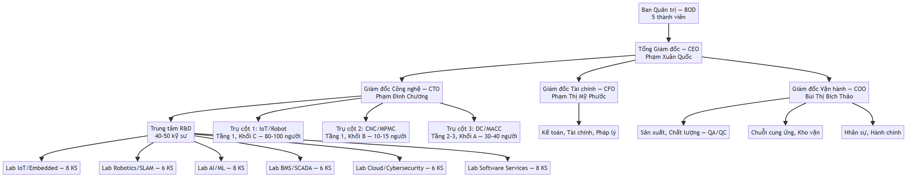
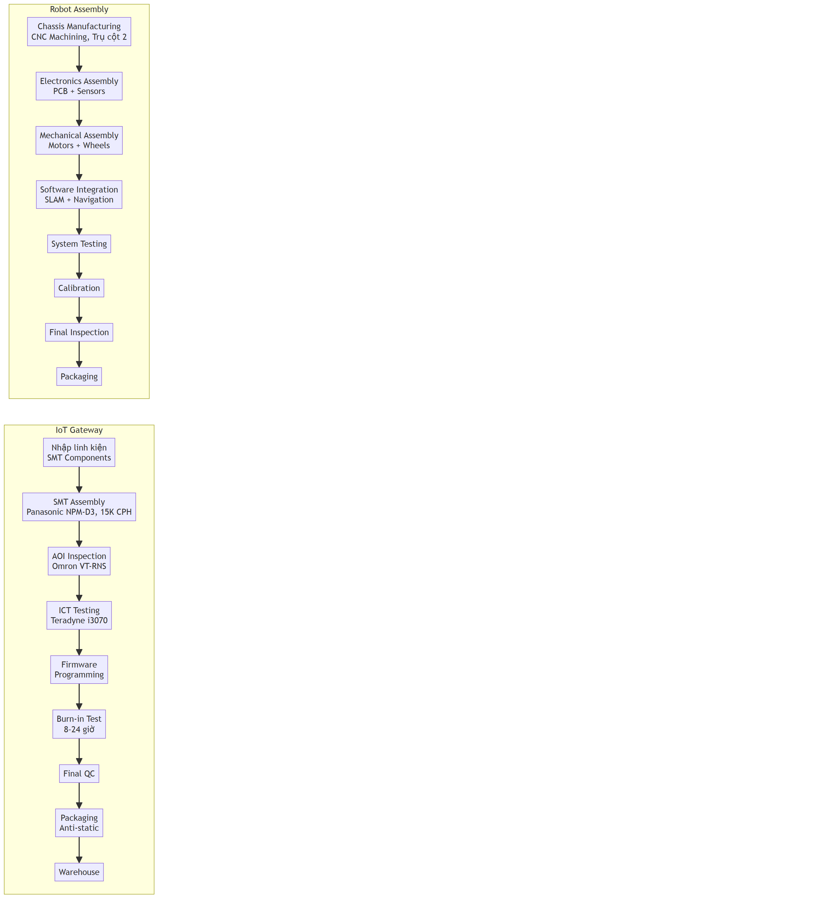
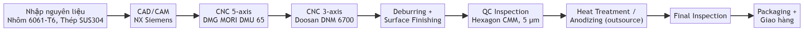
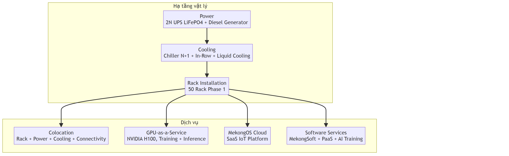

# MẪU SỐ 1.4
## Dự án ứng dụng công nghệ cao để sản xuất sản phẩm công nghệ cao

**(Phụ lục I, Nghị định 31/2021/NĐ-CP ngày 26/3/2021)**

**INVESTMENT PROJECT INFORMATION**

---

## I. THÔNG TIN CHUNG

### 1. Tên dự án (Project name):

**Mekong Technology – Tổ hợp Nghiên cứu, Phát triển và Sản xuất Công nghệ cao: Thiết bị IoT/Robot, Gia công Cơ khí Chính xác (CNC), Trung tâm Dữ liệu (Datacenter) và Dịch vụ Phần mềm.**

*(Mekong Technology – High-Tech Integrated Complex: IoT/Robot Devices, Precision CNC Machining, Datacenter and Software Services.)*

### 2. Loại hình Dự án (Investment type):

☑ **Việt Nam** ☐ FDI

### 3. Lĩnh vực hoạt động (Fields of activities):

☑ **Vi điện tử - Công nghệ thông tin - Viễn thông** (Microelectronic – ICT – Telecommunication)
☑ **Cơ khí chính xác – Tự động hóa** (Precision mechanics – Automation)
☑ **Trung tâm dữ liệu – Điện toán đám mây** (Datacenter – Cloud Computing)
☐ Công nghệ sinh học áp dụng trong dược phẩm và môi trường (Biotechnology applied for Pharmaceuticals and Environment)
☐ Năng lượng mới – Vật liệu mới – Công nghệ Nano (New Energy – Advanced Materials – Nanotechnology)
☐ Khác (Others)

### 4. Thời hạn hoạt động của dự án (Duration of the project):

**50 năm (từ 01/2025 đến 12/2075).**

### 5. Doanh thu hàng năm của dự án (dự ước) (Annual Revenue – expectation):

- **Giai đoạn xây dựng (Y1–Y3):** Chưa phát sinh doanh thu (giai đoạn thi công, lắp đặt).
- **Giai đoạn đầu sản xuất (Y4–Y6):** 3,50 triệu USD/năm (trung bình, ramp-up từ 0,50M đến 7,00M).
- **Giai đoạn ổn định (Y12+):** 21,00 triệu USD/năm.
- **Doanh thu năm 10:** 19,50 triệu USD.
- **Doanh thu tích lũy 15 năm:** ~180,00 triệu USD [C].

### 6. Doanh thu thuần hàng năm của dự án (dự ước) (Annual Net revenue – expectation):

- **Giai đoạn đầu sản xuất (Y4–Y6):** Hòa vốn hoặc lỗ nhẹ (doanh thu chưa đủ bù OPEX + khấu hao).
- **Giai đoạn ổn định (Y12+):** 4,50 triệu USD/năm (EBITDA margin ~35%, CIT ưu đãi 10%) [C].

### 7. Chi phí hoạt động hàng năm của dự án (dự ước) (Annual cost – expectation):

- **Giai đoạn đầu sản xuất (Y4–Y6):** 3,00 triệu USD/năm (OPEX: nhân sự, nguyên vật liệu, vận hành).
- **Giai đoạn ổn định (Y12+):** 13,65 triệu USD/năm (OPEX = 65% doanh thu) [C].

### 8. Giá trị gia tăng tạo ra của dự án (Added value – Expectation):

- **Tỷ lệ VA trung bình:** 46% trên doanh thu [C].
- **Giai đoạn đầu (Y4–Y6):** 1,61 triệu USD/năm [C].
- **Giai đoạn ổn định (Y12+):** 9,66 triệu USD/năm [C].
- **Tổng 10 năm sản xuất (Y4–Y13):** ~63,00 triệu USD [C].

### 9. Tổ chức quản lý (trình bày sơ đồ và mô tả mô hình tổ chức, điều hành của dự án, lưu ý làm rõ bộ phận R&D) (Company Organizational chart with R&D division):

**Sơ đồ tổ chức 3 trụ cột:**

**Mô tả mô hình tổ chức:**

- **Ban Quản trị:** 5 thành viên, họp định kỳ hàng quý.
- **Tổng Giám đốc:** Điều hành tổng thể, báo cáo Ban Quản trị.
- **Bộ phận R&D:** 40–50 kỹ sư (27–33% tổng nhân sự), ngân sách ~12,50 triệu USD/10 năm (8–12% doanh thu).
- **Cơ cấu 3 Trụ cột:** Mỗi trụ cột có Giám đốc riêng, báo cáo CTO/COO.
  - **Trụ cột 1 — IoT/Robot:** Sản xuất IoT Gateway, Robot AMR/AGV/OHT, thiết bị BMS/SCADA.
  - **Trụ cột 2 — CNC/MPMC:** Gia công cơ khí chính xác, chế tạo khung robot, linh kiện.
  - **Trụ cột 3 — DC/MACC:** Vận hành Datacenter Tier III, GPU-as-a-Service, Dịch vụ phần mềm.

- **Quy trình:** Agile development + Lean manufacturing, ISO 9001:2015.

---

## II. GIẢI TRÌNH CÁC HOẠT ĐỘNG CỦA DỰ ÁN ỨNG DỤNG CÔNG NGHỆ CAO ĐỂ SẢN XUẤT SẢN PHẨM CÔNG NGHỆ CAO

### 1. Tính cấp thiết và mục tiêu (Objective of project):

#### + Tính cấp thiết để thực hiện dự án (Urgency to carry out the project):

**1.1. Khoảng trống công nghệ nghiêm trọng tại Việt Nam:**

- **Phụ thuộc nhập khẩu 90%:** Hầu hết thiết bị IoT, robot công nghiệp và hạ tầng datacenter được nhập khẩu từ nước ngoài với giá cao (cao hơn 30–50% so với tiềm năng sản xuất nội địa).
- **Thiếu nhà sản xuất quy mô:** Việt Nam chưa có nhà sản xuất IoT Gateway và Robot AMR quy mô công nghiệp; chưa có datacenter Tier III do doanh nghiệp nội địa đầu tư tại KCNC.
- **Thiếu dịch vụ CNC chính xác:** Nhu cầu gia công cơ khí chính xác cho FDI (Samsung, Intel, LG) phải outsource ra nước ngoài.

**1.2. Nhu cầu chuyển đổi số cấp bách:**

- **83.035 doanh nghiệp vừa và nhỏ** trong lĩnh vực sản xuất có nhu cầu ứng dụng IoT và tự động hóa.
- **Chỉ 25%** trong số đó đã triển khai các giải pháp công nghệ cao.
- **Áp lực cạnh tranh:** Doanh nghiệp Việt Nam cần tự động hóa để duy trì khả năng cạnh tranh trong chuỗi cung ứng toàn cầu.

**1.3. Cơ hội thị trường khổng lồ:**

- **Thị trường IoT Việt Nam 2030:** 13.200 triệu USD (CAGR 26,2%/năm) [B].
- **Thị trường Robot AMR Việt Nam 2030:** 900 triệu USD (CAGR 30%/năm) [B].
- **Thị trường CNC Việt Nam 2030:** 1.850 triệu USD (CAGR 8,5%/năm) [B].
- **Thị trường Datacenter Việt Nam 2030:** 1.100 – 4.500 triệu USD (CAGR 15–20%/năm) [B].
- **Thị trường ASEAN 2030:** 58,9 tỷ USD (CAGR 21,1%/năm) [B].

#### + Mục tiêu kinh tế – xã hội (Socio-economic goals):

**2.1. Thúc đẩy phát triển kinh tế – xã hội:**

- **Tạo việc làm:** 150–200 việc làm trực tiếp (ổn định từ Y12), 300–500 việc làm gián tiếp.
- **Đóng góp GDP:** ~63 triệu USD giá trị gia tăng trong 10 năm sản xuất [C].
- **Xuất khẩu:** 30–35% doanh thu sang thị trường ASEAN.
- **Nội địa hóa:** 50–70% linh kiện, giảm phụ thuộc nhập khẩu.

**2.2. Phát triển ngành công nghiệp công nghệ cao:**

- **Tạo chuỗi cung ứng:** Phát triển 50+ nhà cung cấp linh kiện nội địa.
- **Chuyển giao công nghệ:** Đào tạo 500+ kỹ sư công nghệ cao.
- **Hệ sinh thái:** Xây dựng hệ sinh thái IoT/Robot/Datacenter tại KCNC TP.HCM.

**2.3. Nâng cao năng lực cạnh tranh quốc gia:**

- **Vị thế khu vực:** Đưa Việt Nam trở thành trung tâm sản xuất IoT/Robot + Datacenter ASEAN.
- **Giảm chi phí:** Giá sản phẩm thấp hơn 20–30% so với nhập khẩu.
- **Dịch vụ hỗ trợ:** Hỗ trợ kỹ thuật 24/7, tùy chỉnh linh hoạt.

#### + Mục tiêu về khoa học và công nghệ (Science and technology goals):

**3.1. Làm chủ công nghệ lõi 3 trụ cột:**

- **Trụ cột 1 — IoT/Robot:** ARM Cortex-A78, AI tại biên, SLAM navigation, LiDAR 3D, BMS/SCADA.
- **Trụ cột 2 — CNC/MPMC:** Gia công 5 trục, dung sai 5 micromet, ISO 9001:2015.
- **Trụ cột 3 — DC/MACC:** Datacenter Tier III (99,982% uptime), GPU NVIDIA H100, PaaS, AI Training.
- **Dịch vụ Phần mềm:** Custom MES/ERP, Managed PaaS, AI/ML Model Training.

**3.2. Đạt trình độ quốc tế:**

- **TRL 8–9:** Sản phẩm sẵn sàng thương mại hóa.
- **Tiêu chuẩn quốc tế:** IEC 61000, RoHS, REACH, WEEE, Uptime Institute Tier III.
- **Chứng nhận:** ISO 9001, ISO 14001, ISO 45001, ISO 27001 (cho DC).
- **Bảo mật:** Mã hóa AES-256, xác thực OAuth 2.0, SOC 2 Type II (cho DC).

**3.3. Nghiên cứu phát triển:**

- **Ngân sách R&D:** ~12,50 triệu USD/10 năm (8–12% doanh thu) [C].
- **Đội ngũ:** 40–50 kỹ sư R&D (27–33% tổng nhân sự).
- **Sở hữu trí tuệ:** 15–20 bằng sáng chế dự kiến.
- **Hợp tác:** Đại học Bách khoa TP.HCM, Viện Khoa học Công nghệ, các đối tác quốc tế.

### 2. Dự báo thị trường (Market Forecast):

#### 2.1. Ngoài nước (Foreign market):

**Thị trường ASEAN 2030:**

- **Quy mô tổng:** 58,9 tỷ USD (CAGR 21,1%/năm).
- **IoT/Automation:** 35 tỷ USD.
- **CNC Machining:** 8,5 tỷ USD.
- **Datacenter (Co-location + GPU):** 15,4 tỷ USD.
- **Các quốc gia tiềm năng:** Thái Lan, Malaysia, Singapore, Indonesia, Philippines.

**Lợi thế cạnh tranh của Việt Nam:**

- Hiệp định thương mại tự do ASEAN (không thuế quan).
- Chi phí sản xuất thấp hơn 20–30% so với Thái Lan và Malaysia.
- Cơ sở hạ tầng logistics tốt (cảng biển, sân bay quốc tế).
- Lao động có tay nghề với chi phí cạnh tranh.

**Kế hoạch xuất khẩu:**

- **Năm Y6 (2031):** Bắt đầu xuất khẩu IoT Gateway sang Singapore, Thái Lan.
- **Năm Y8 (2033):** Mở rộng sang Malaysia, Indonesia.
- **Năm Y12+:** 30–35% doanh thu từ xuất khẩu.

#### 2.2. Trong nước (Domestic):

**Thị trường IoT Việt Nam:**

- **Quy mô 2030:** 13.200 triệu USD (CAGR 26,2%/năm) [B].
- **Smart Manufacturing:** 2.600 triệu USD (40% thị trường).
- **Smart Cities/Buildings:** 1.980 triệu USD (15% thị trường).

**Thị trường Robot AMR Việt Nam:**

- **Quy mô 2030:** 900 triệu USD (CAGR 30%/năm) [B].
- **Manufacturing & Logistics:** 720 triệu USD (80% thị trường).

**Thị trường CNC/Cơ khí chính xác:**

- **Quy mô 2030:** 1.850 triệu USD (CAGR 8,5%/năm) [B].
- **Khách hàng chính:** Samsung, Intel, LG, Bosch tại KCNC và KCN lân cận.
- **Nhu cầu:** Gia công khung robot, encoder bracket, motor mount, jig/fixture.

**Thị trường Datacenter Việt Nam:**

- **Quy mô 2030:** 1.100 – 4.500 triệu USD (CAGR 15–20%/năm) [B].
- **Động lực tăng trưởng:** Digital transformation, AI/ML workloads, FDI.
- **Thiếu cung:** Datacenter Tier III tại TP.HCM chỉ đáp ứng ~40% nhu cầu [B].

**Nhu cầu thị trường:**

- **83.035 doanh nghiệp vừa và nhỏ** có nhu cầu chuyển đổi số.
- **Chỉ 25%** đã triển khai giải pháp công nghệ cao.
- **Tiềm năng:** 62.276 doanh nghiệp chưa ứng dụng công nghệ cao.

#### 2.3. Phân tích cạnh tranh (Competitive analysis):

| Đối thủ | Thị phần IoT | Thị phần Robot | Điểm mạnh | Điểm yếu |
| --- | ---: | ---: | --- | --- |
| Siemens | 18,5% | 15,2% | Công nghệ cao, thương hiệu mạnh | Giá cao, thời gian giao hàng dài |
| Schneider Electric | 15,2% | 12,8% | Hệ sinh thái hoàn chỉnh | Không tùy chỉnh, hỗ trợ hạn chế |
| Rockwell Automation | 12,8% | 10,5% | Chuyên sâu tự động hóa | Phụ thuộc nhập khẩu |
| Nhà sản xuất nội địa | 25,6% | 30,2% | Giá cạnh tranh, hỗ trợ tốt | Quy mô nhỏ, chất lượng thấp |

**Cơ hội thị trường:**

- **Khoảng trống giá:** Sản phẩm nội địa có thể rẻ hơn 20–30%.
- **Khoảng trống dịch vụ:** Hỗ trợ kỹ thuật 24/7, tùy chỉnh linh hoạt.
- **Khoảng trống thời gian:** Giao hàng nhanh (1–2 tháng vs 3–6 tháng nhập khẩu).

### 3. Giải trình về nhu cầu sử dụng đất và năng lực triển khai dự án của nhà đầu tư (Justification of land use demand and investor's implementation capacity):

#### 3.1. Đánh giá sự phù hợp với quy hoạch và hạ tầng:

**Vị trí dự án:**

- **Địa điểm:** Lô E2-03, Đường D1, Khu Công nghệ cao TP.HCM, Quận 9, TP.HCM.
- **Diện tích đất:** 10.000 m² (1 ha).
- **Phù hợp quy hoạch:** Thuộc khu vực ưu tiên phát triển công nghệ cao theo QĐ 38/2020/QĐ-TTg.

**Quy mô công trình:**

- **Tòa nhà:** 3 tầng + tầng hầm.
- **Tổng diện tích sàn (GFA):** 21.000 m².
  - **Tầng 1:** 7.000 m² — IoT/Robot (Khối C, 3.000 m²) + CNC/MPMC (Khối B, 800 m²) + kho + utilities.
  - **Tầng 2:** ~5.000 m² — Datacenter MACC (Khối A, 2.500–3.000 m²) + MEP.
  - **Tầng 3:** ~4.500 m² — Văn phòng + R&D Lab (1.500 m²) + phòng họp + support.
  - **Tầng hầm:** ~2.000 m² — Bãi đỗ xe + toolroom.

- **Mật độ xây dựng:** 70% (7.000 m² / 10.000 m²).
- **Thời gian xây dựng:** 18 tháng (shell completion Q3/2028).

**Hạ tầng kỹ thuật:**

- **Điện:** 2.000–3.000 kW (transformer 3MVA, đủ cho sản xuất + DC + R&D).
- **Nước:** 50 m³/ngày (hệ thống cấp nước KCNC).
- **Viễn thông:** Fiber optic, 5G coverage.
- **Giao thông:** Gần sân bay Tân Sơn Nhất (25 km), cảng Cát Lái (15 km).

#### 3.2. Đánh giá khả năng tài chính (Financial capability assessment):

**Tổng vốn đầu tư (CAPEX):** 32,00 triệu USD.

**Phân kỳ đầu tư (5 giai đoạn):**

| Giai đoạn | Thời gian | Vốn đầu tư (M USD) | Nội dung chính | Nguồn vốn |
| --- | --- | ---: | --- | --- |
| Phase 0 | Y0–Y1 | 2,00 | Pháp lý, EIA, thiết kế, san lấp mặt bằng | CSH |
| Phase 1 | Y1–Y3 | 5,80 | Xây dựng shell 3 tầng + M&E + PCCC, hoàn công, Sổ đỏ | CSH |
| Phase 2 | Y3–Y4 | 5,70 | Fit-out IoT (Tầng 1) + Hạ tầng DC (Tầng 2) | CSH |
| Phase 3 | Y4–Y6 | 14,50 | GPU + Server Datacenter + CNC 6 máy | CSH |
| Phase 4 | Y6–Y8 | 4,00 | Mở rộng rack DC + bổ sung máy CNC từ doanh thu | Vay + Revenue |
| **Tổng** | **Y0–Y8** | **32,00** | **Thời gian đầu tư toàn bộ: 8 năm** | |

**Cấu trúc vốn:**

| Nguồn vốn | Giá trị (M USD) | Tỷ trọng | Điều kiện | Thời điểm |
| --- | ---: | :---: | --- | --- |
| **Vốn chủ sở hữu (CSH)** | 24,00 | 75,0% | Tự chủ 100% giai đoạn xây dựng + lắp đặt | Y0–Y5 |
| **Vay ngân hàng (MSB/MB)** | 8,00 | 25,0% | Lãi suất 8,5%/năm, kỳ hạn 10 năm, ân hạn 2 năm | Từ Y6 |
| **Tổng CAPEX** | **32,00** | **100%** | WACC = 12% [C] | |

**Chiến lược tài chính:** CSH = 24,00M USD, gồm: P0 (2,00M) + P1 (5,80M) + P2 (5,70M) + P3 (10,50M). Vay 8,00M USD chỉ giải ngân từ Y6 khi Datacenter đã có doanh thu chứng minh (revenue proof). Sổ đỏ hoàn thành Y3 nhờ tiến độ xây dựng tập trung.

**Phân bổ CAPEX theo hạng mục:**

| Hạng mục | CAPEX (M USD) | Tỷ trọng |
| --- | ---: | :---: |
| Datacenter/MACC (GPU, Server, Power, Cooling) | 16,00 | 50,0% |
| Hạ tầng + Xây dựng (shell, MEP, transformer, PCCC, solar PV 200kWp) | 7,00 | 21,9% |
| IoT/Robot (SMT line Panasonic, test equipment) | 3,50 | 10,9% |
| CNC/MPMC (6 máy CNC + QC equipment) | 3,00 | 9,4% |
| Vốn lưu động + Dự phòng | 2,50 | 7,8% |
| **Tổng** | **32,00** | **100%** |

**Chỉ số thẩm định tài chính:**

| Chỉ số | Conservative | Base Case | Optimistic | Xác suất |
| --- | ---: | ---: | ---: | ---: |
| NPV 50 năm (M USD) | 1,00 | 2,50 | 5,00 | — |
| IRR 50 năm | 13,0% | 14,5% | 16,5% | — |
| Xác suất xảy ra | 30% | 50% | 20% | — |
| **NPV trọng số xác suất** | | **2,55** | | [C] |

| Chỉ số Bổ sung | Giá trị | Nhãn |
| --- | ---: | :---: |
| Payback (chiết khấu) | 10 năm | [C] |
| DSCR min (vay từ Y6) | 1,42x (Y7) | [C] |
| Revenue 15 năm tích lũy | ~180 M USD | [C] |
| EBITDA steady-state (Y12+) | ~35% | [C] |
| Giá trị Chiến lược (Adjusted) | 15,00 M USD | [C] |
| Monte Carlo P(NPV>0) | 72% | [C] |

**Bằng chứng tài chính:**

- **Vốn CSH đã chuẩn bị:** 24,00 triệu USD (xác nhận tài khoản ngân hàng + cam kết cổ đông).
- **Thư cam kết vay:** Letter of Intent từ MSB/MB, 8,00 triệu USD, giải ngân Y6.
- **Bảo hiểm dự án:** Bảo hiểm xây dựng + bảo hiểm tài sản + bảo hiểm trách nhiệm.

#### 3.3. Đánh giá năng lực công nghệ (Technology capability assessment):

**Đội ngũ kỹ thuật:**

- **Tổng nhân sự (ổn định Y12+):** 150–200 người.
- **R&D:** 40–50 kỹ sư (27–33% tổng nhân sự).
- **Trình độ:** 15 Tiến sĩ, 25 Thạc sĩ, 50+ Kỹ sư.
- **Kinh nghiệm:** 5–15 năm trong lĩnh vực IoT/Robot/CNC/DC.

**Công nghệ lõi 3 trụ cột:**

- **Trụ cột 1 — IoT/Robot:** ARM Cortex-A78, AI tại biên, SLAM, BMS/SCADA.
- **Trụ cột 2 — CNC:** DMG MORI 5-axis, dung sai 5 micromet, ISO 9001.
- **Trụ cột 3 — DC:** Tier III 99,982% uptime, NVIDIA H100 GPU, PUE < 1,35.
- **Phần mềm:** MekongSoft (Custom Dev), PaaS, AI/ML Training Service.

**Hợp tác quốc tế:**

- **Chuyển giao công nghệ:** Siemens (IoT), DMG MORI (CNC).
- **Hợp tác R&D:** Đại học Bách khoa TP.HCM, Viện Khoa học Công nghệ.
- **GPU Partnership:** NVIDIA (H100 procurement + developer program).

#### 3.4. Đánh giá năng lực quản lý (Management capability assessment):

**Ban lãnh đạo:**

- **CEO:** Phạm Xuân Quốc (15 năm kinh nghiệm IoT/Embedded Systems).
- **CTO:** Phạm Đình Chương (12 năm kinh nghiệm Robotics/AI).
- **CFO:** Phạm Thị Mỹ Phước (10 năm kinh nghiệm tài chính doanh nghiệp).
- **COO:** Bùi Thị Bích Thảo (8 năm kinh nghiệm sản xuất, vận hành).

**Hệ thống quản lý:**

- **ISO 9001:2015:** Hệ thống quản lý chất lượng (dự kiến Q1/2031).
- **ISO 14001:2015:** Hệ thống quản lý môi trường (dự kiến Q2/2031).
- **ISO 27001:** An toàn thông tin cho Datacenter (dự kiến Q3/2030).
- **ERP:** SAP S/4HANA.
- **MES:** Manufacturing Execution System (MekongMES).

### 4. Mô tả các hoạt động sản xuất/kinh doanh của dự án (Description of project production/business activities):

#### a) Giải trình sản phẩm và năng lực sản xuất của dự án (Product description and production capacity):

**4.1. Sản phẩm phù hợp với Danh mục sản phẩm công nghệ cao:**

Theo QĐ 38/2020/QĐ-TTg – Phụ lục II:

- **Mục 1.1:** Công nghệ vi điện tử — Sản xuất IoT Gateway, I/O Modules, DDC Controllers.
- **Mục 1.2:** Công nghệ thông tin — Nền tảng MekongOS, MekongBMS SaaS, Dịch vụ phần mềm.
- **Mục 2.1:** Cơ khí chính xác — Robot AMR/AGV, Gia công CNC linh kiện.
- **Mục 2.2:** Tự động hóa — OHT System, BMS/SCADA.

Theo QĐ 38/2020/QĐ-TTg – Phụ lục I:

- **Mục 1.2:** Hạ tầng lưu trữ — Datacenter Tier III Colocation.
- **Mục 1.3:** Điện toán hiệu năng cao — GPU-as-a-Service, AI/ML Training.
- **Mục 2:** Cơ khí chính xác — Khung Robot, Jig/Fixture CNC.

**4.2. Sản phẩm thay thế nhập khẩu:**

- **IoT Gateway MK-200/300:** Thay thế Siemens SIMATIC, Schneider EcoStruxure.
- **Robot AMR-500/1000:** Thay thế MiR, Fetch Robotics, KUKA KMR.
- **OHT-100:** Thay thế Murata Machinery, Daifuku.
- **CNC Machining:** Thay thế outsource ra Singapore, Nhật Bản.
- **Datacenter:** Thay thế thuê cloud AWS/Azure với chi phí cao.

**4.3. Chất lượng và tính năng vượt trội:**

- **Giá cạnh tranh:** Thấp hơn 20–30% so với nhập khẩu.
- **Tùy chỉnh linh hoạt:** Đáp ứng nhu cầu đặc thù DNNVV Việt Nam.
- **Hỗ trợ 24/7:** Hotline tiếng Việt, phản hồi trong 2–4 giờ.
- **Giao hàng nhanh:** 1–2 tháng vs 3–6 tháng nhập khẩu.
- **TRL 8–9:** Sản phẩm sẵn sàng thương mại hóa.
- **Yield:** 99,5% (mục tiêu), RMA 0,10%.

**4.4. Dự báo nhu cầu thị trường:**

- **Thị trường nội địa IoT:** 13.200 triệu USD (2030), thị phần mục tiêu 5–8%.
- **Thị trường nội địa Robot:** 900 triệu USD (2030), thị phần mục tiêu 3–5%.
- **Thị trường CNC FDI tại KCNC:** gia công phục vụ Samsung, Intel, LG, Bosch.
- **Thị trường DC:** Colocation + GPU cho startup AI/fintech/e-commerce.
- **Tỷ lệ xuất khẩu:** 30–35% doanh thu (ASEAN).

**4.5. Bảng sản phẩm tổng hợp (18 sản phẩm, 3 trụ cột):**

| TT | Tên sản phẩm / Dịch vụ | Trụ cột | Thông số kỹ thuật | Quy mô/năm | DT ổn định (M USD/năm) | VA (%) | Cơ sở PL (QĐ 38/2020) |
| :---: | --- | :---: | --- | ---: | ---: | :---: | --- |
| 1 | IoT Gateway MK-200/300 | 1 | ARM Cortex-A78, 8GB RAM, AI Edge, 5G-ready | 5.000 thiết bị | 10,00 | 35% | Phụ lục II, Mục 1.1 |
| 2 | Robot AMR-500/1000 | 1 | LiDAR 3D, AI SLAM, tải 500–1.000 kg | 200 bộ | 5,00 | 40% | Phụ lục II, Mục 2.1 |
| 3 | Robot AGV-500/1000 | 1 | Vision-based, tải 500–1.000 kg | 100 bộ | 4,00 | 35% | Phụ lục II, Mục 2.1 |
| 4 | Robot OHT-100 | 1 | Dual rail, 100 kg, 4 trục | 50 bộ | 2,50 | 30% | Phụ lục II, Mục 2.2 |
| 5 | Khung Robot AMR/AGV (nội bộ + xuất khẩu) | 2 | Nhôm 6061-T6, dung sai 5 µm, ISO 9001 | 1.500 bộ khung | 1,20 | 40% | Phụ lục I, Mục 2 |
| 6 | Linh kiện chính xác (encoder bracket, motor mount, khớp xoay) | 2 | Thép/Nhôm, dung sai 5 µm, ISO 9001 | 1.000 chi tiết | 0,80 | 35% | Phụ lục I, Mục 2 |
| 7 | Jig/Fixture cho SMT + chi tiết gia công FDI | 2 | Al 6061/SUS304, 5 trục, ISO 9001 | 500 bộ | 0,50 | 30% | Phụ lục I, Mục 2 |
| 8 | Nền tảng AI/HPC Computing (GPU-as-a-Service) | 3 | NVIDIA DGX H100, GPU-aaS | 50 Rack | 5,00 | 60% | Phụ lục I, Mục 1.3 |
| 9 | Hạ tầng lưu trữ Tier III (Colocation) | 3 | Uptime 99,982%, Colocation | 50 Rack | 1,20 | 55% | Phụ lục I, Mục 1.2 |
| 10 | MekongOS IoT Cloud (SaaS) | 3 | Nền tảng quản lý IoT, MQTT/OPC UA | 2.000 thuê bao | 3,00 | 70% | Phụ lục II, Mục 1.2 |
| 11 | MK-EIO I/O Modules (5 loại) | 1 | DI16/DO16/AI8/AO4/UI8, RS485 Modbus+BACnet | 8.000 module | 0,80 | 50% | Phụ lục II, Mục 1.1 |
| 12 | MK-DDC Controllers (DDC-24/64) | 1 | 24/64 điểm, BACnet native, IEC 61131-3 | 2.000 bộ | 1,00 | 55% | Phụ lục II, Mục 1.1 |
| 13 | MK-GW Gateway chuyên dụng (4 loại) | 1 | BACnet/Modbus/KNX/DALI gateway | 3.000 bộ | 0,60 | 45% | Phụ lục II, Mục 1.1 |
| 14 | MekongBMS License + SaaS | 1 | Phần mềm BMS web-based, tiếng Việt 100% | 500 site | 1,50 | 80% | Phụ lục II, Mục 1.2 |
| 15 | BMS/SCADA Service & Maintenance | 1 | Bảo trì, nâng cấp, hỗ trợ kỹ thuật, commissioning | Recurring | 0,60 | 70% | Phụ lục II, Mục 1.2 |
| 16 | MekongSoft — Phát triển Phần mềm theo Yêu cầu | 3 | Custom MES/ERP module, dashboard, API integration | 20–30 dự án/năm | 0,80 | 75% | Phụ lục II, Mục 1.2 |
| 17 | Managed Application Platform (PaaS) | 3 | Hosting + vận hành ứng dụng: CI/CD, monitoring, auto-scale | 30–50 tenant | 0,50 | 65% | Phụ lục I, Mục 1.2 |
| 18 | Dịch vụ Huấn luyện AI/ML Model | 3 | Training model CV, NLP, Predictive trên GPU cluster | 15–25 dự án/năm | 0,70 | 70% | Phụ lục I, Mục 1.3 |
| | **Tổng cộng (công suất thiết kế tối đa)** | | | | **39,70** | **46%** | |

> **Ghi chú:** Tổng 39,70M USD/năm là công suất thiết kế tối đa khi toàn bộ 3 trụ cột vận hành 100% (mục tiêu sau Y15). Doanh thu ổn định thực tế (steady-state) đạt 21,00–23,00M USD/năm từ Y12 [C]. Chênh lệch do CNC quy mô tinh gọn (6 máy, ISO 9001), BMS/SCADA chưa full capacity, GPU Phase 2 chuyển sang lease model. Ba dịch vụ phần mềm (TT 16–18) KHÔNG phát sinh CAPEX bổ sung, doanh thu 2,00M USD/năm là upside potential từ Y5 [A].

**4.6. Giá trị cộng hưởng công nghệ (Synergy 3 Trụ cột):**

| Mối liên kết 3 Trụ cột | Giá trị/năm (USD) | Loại |
| --- | ---: | --- |
| CNC chế tạo khung Robot (thay outsource) | 150.000–200.000 | Cost savings [A] |
| DC GPU cho AI SLAM training (thay AWS) | 200.000–500.000 | OPEX reduction [A] |
| MekongOS on DC nội bộ (thay cloud AWS/Azure) | 100.000–200.000 | Cloud savings [A] |
| Cross-sell FDI (CNC, DC, IoT) | 300.000–800.000 | Revenue uplift [A] |
| IoT giám sát CNC (tăng utilization 5–10%) | 50.000–100.000 | Productivity [C] |
| Software Services cross-sell | 200.000–400.000 | Revenue [A] |
| AI Training revenue bằng GPU in-house | 150.000–300.000 | Revenue [A] |
| **Tổng Synergy/năm (ổn định)** | **1.050.000–2.500.000** | |
| **NPV Synergy 10 năm** | **~3.000.000** | [C] |

#### b) Mô tả công nghệ của dự án (Project technology description):

**4.7. Quy trình công nghệ sản xuất — Trụ cột 1 (IoT/Robot):**

**4.8. Quy trình công nghệ sản xuất — Trụ cột 2 (CNC/MPMC):**

**4.9. Quy trình vận hành — Trụ cột 3 (Datacenter/MACC):**

**4.10. Công nghệ phù hợp với Danh mục công nghệ cao:**

Theo QĐ 38/2020/QĐ-TTg – Phụ lục II:

- **Mục 1.1:** Công nghệ vi điện tử — Sản xuất chip IoT Gateway.
- **Mục 1.2:** Công nghệ thông tin — Hệ thống quản lý MekongOS, BMS SaaS.
- **Mục 2.1:** Cơ khí chính xác — Robot AMR, OHT, CNC machining.
- **Mục 2.2:** Tự động hóa — Hệ thống điều khiển tự động, BMS/SCADA.

Theo QĐ 2117/QĐ-TTg:

- **Mục 1:** Công nghệ cao trong lĩnh vực ICT.
- **Mục 2:** Công nghệ cao trong lĩnh vực tự động hóa.
- **Mục 3:** Công nghệ cao trong lĩnh vực robot.

**4.11. Yếu tố trực tiếp về công nghệ:**

- **Hoàn thiện công nghệ:** TRL 8–9, sẵn sàng thương mại hóa.
- **Tiên tiến dây chuyền:** SMT Line Panasonic NPM-D3, CNC DMG MORI 5-axis, DC Tier III.
- **Tính mới:** AI tại biên, Multi-protocol, Edge computing, GPU-aaS.
- **Tính thích hợp:** Phù hợp với nhu cầu DNNVV Việt Nam và FDI.

**4.12. Chuyển giao công nghệ (Technology transfer):**

| TT | Tên công nghệ | Xuất xứ | Bên giao | Hình thức | Giá trị (M USD) | Sản phẩm |
| --- | --- | --- | --- | --- | ---: | --- |
| 1 | IoT Gateway Technology | Germany | Siemens AG | License + Training | 2,50 | MK-200/300 |
| 2 | Robot AMR Technology | Japan | KUKA Robotics | Joint R&D | 3,00 | AMR-500/1000 |
| 3 | CNC Precision Machining | Japan/Germany | DMG MORI | Training + Support | 0,50 | Khung Robot, Jig |
| 4 | DC Tier III Design | USA | Uptime Institute | Certification | 0,30 | MACC Datacenter |

#### c) Giải trình về máy móc thiết bị của dự án (Justification of machinery and equipment):

**4.13. Thiết bị Trụ cột 1 — IoT/Robot:**

| TT | Tên thiết bị | Đặc tính kỹ thuật | Xuất xứ | Năm | SL | Tình trạng | Giá trị (M USD) |
| --- | --- | --- | --- | ---: | ---: | --- | ---: |
| 1 | SMT Line Panasonic NPM-D3 | 15K CPH, 0201–100mm, Multi-head | Japan | 2025 | 1 line | Mới 100% | 1,85 |
| 2 | Robot welding/assembly station | 6-axis, welding + assembly | Germany | 2025 | 1 | Mới 100% | 0,35 |
| 3 | Testing equipment (AOI, ICT, Burn-in) | AOI 3D + ICT + Burn-in 72h | Japan/USA | 2025 | Lot | Mới 100% | 0,28 |
| 4 | Clean room cấp 10.000 (300 m²) | ISO Class 7, HEPA | Vietnam | 2025 | 1 | Mới 100% | 0,22 |
| 5 | Tooling + jig/fixture cho AMR/AGV | Nhôm 6061, SUS304 | Vietnam | 2025 | Lot | Mới 100% | 0,27 |
| 6 | Phần mềm ERP/MES/PLM | SAP S/4HANA + MekongMES | Germany/VN | 2025 | Lot | Mới 100% | 0,35 |
| 7 | Thiết bị nâng cấp Phase 2 | Bổ sung capacity Y6–Y8 | Various | 2028 | Lot | Mới 100% | 0,68 |
| **Tổng Trụ cột 1** | | | | | | | **4,00** |

**4.14. Thiết bị Trụ cột 2 — CNC/MPMC (6 máy):**

| TT | Tên thiết bị | Đặc tính kỹ thuật | Xuất xứ | Năm | SL | Tình trạng | Giá trị (M USD) |
| --- | --- | --- | --- | ---: | ---: | --- | ---: |
| 1 | DMG MORI DMU 65 monoBLOCK | 5-axis, dung sai 5 µm, spindle 12K RPM | Japan/Germany | 2025 | 2 | Mới 100% | 1,10 |
| 2 | Doosan DVF 5000 | 5-axis, dung sai 5 µm | Korea | 2025 | 2 | Mới 100% | 0,70 |
| 3 | Doosan DNM 6700 | VMC 3-axis, gia công phổ thông | Korea | 2025 | 2 | Mới 100% | 0,20 |
| 4 | Hexagon CMM Portable Arm | Đo lường 3D, độ chính xác 0,023 mm | Sweden | 2025 | 1 | Mới 100% | 0,07 |
| 5 | Móng cách ly rung + Chip conveyor + MWF treatment | Hạ tầng máy CNC | Various | 2025 | Lot | Mới 100% | 0,36 |
| 6 | Hút bụi kim loại + CAD/CAM + ISO 9001 + Tooling | Phụ trợ và chứng nhận | Various | 2025 | Lot | Mới 100% | 0,57 |
| **Tổng Trụ cột 2** | | | | | | | **3,00** |

**4.15. Thiết bị Trụ cột 3 — Datacenter/MACC:**

| TT | Tên thiết bị | Đặc tính kỹ thuật | Xuất xứ | Năm | SL | Tình trạng | Giá trị (M USD) |
| --- | --- | --- | --- | ---: | ---: | --- | ---: |
| 1 | DC hạ tầng MEP (Tier III) | Sàn nâng, PCCC gas NOVEC 1230, bảo mật | Various | 2025 | Lot | Mới 100% | 2,50 |
| 2 | UPS 500kVA (N+1) + Generator | 2N redundancy, diesel 1.250 kVA | USA/Japan | 2025 | Lot | Mới 100% | 0,72 |
| 3 | Chiller + In-Row Cooling + Liquid Cooling (GPU) | 400TR, N+1, liquid cho AI cluster | USA/Germany | 2025 | Lot | Mới 100% | 0,97 |
| 4 | PDU + Server Rack + BMS/DCIM | 42U, 20kW/rack, metered PDU, monitoring | USA | 2025 | 50 rack | Mới 100% | 0,83 |
| 5 | GPU Server NVIDIA H100 Phase 1 | H100 SXM5 80GB, 1 pod high-density | USA | 2025 | 1 pod | Mới 100% | 2,80 |
| 6 | CPU Server (Dell/HPE) + Storage SAN | Colocation servers + NetApp/Pure storage | USA | 2025 | 20 rack | Mới 100% | 0,85 |
| 7 | Networking (Cisco Nexus spine-leaf) + Fiber | BGP setup, 100G, dark fiber | USA | 2025 | Lot | Mới 100% | 0,45 |
| 8 | Chứng nhận Tier III + ISO 27001 + Phụ trợ | Uptime Institute, bảo mật vật lý | Various | 2025 | Lot | Mới 100% | 0,28 |
| **Tổng Trụ cột 3 (Phase 2–3)** | | | | | | | **9,40** |

> **Ghi chú:** Tổng 9,40M là CAPEX thiết bị và hạ tầng Datacenter giai đoạn Phase 2–3. Phase 4 bổ sung 1,00M (GPU lease + networking mở rộng), nâng tổng DC CAPEX trong phân bổ CAPEX là **16,00M** khi tính cả phần hạ tầng chung phân bổ cho DC (6,60M: điện, cooling, xây dựng tầng 2–3) [C].

**4.16. Thiết bị R&D:**

| TT | Tên thiết bị | Đặc tính kỹ thuật | Xuất xứ | SL | Giá trị (M USD) |
| --- | --- | --- | --- | ---: | ---: |
| 1 | 3D Printer Stratasys F900 | FDM, 914×610×914mm, 0,1mm layer | USA | 1 | 0,80 |
| 2 | Oscilloscope Tektronix MSO64 | 6GHz, 4 channels, 12-bit ADC | USA | 2 | 0,60 |
| 3 | Spectrum Analyzer Keysight E4407B | 9kHz–26,5GHz | USA | 1 | 0,40 |
| 4 | Environmental Chamber Espec | -70 đến +180 °C, 10–98% RH | Japan | 1 | 0,30 |
| **Tổng R&D** | | | | | **2,10** |

> **Ghi chú:** Thiết bị R&D phục vụ chung cho cả 3 trụ cột, đặt tại R&D Lab (Tầng 3, 1.500 m²) [C].

**4.17. Thiết bị phụ trợ:**

| TT | Tên thiết bị | Xuất xứ | SL | Giá trị (M USD) |
| --- | --- | --- | ---: | ---: |
| 1 | Air Compressor Atlas Copco (15 bar, Oil-free) | Sweden | 2 | 0,20 |
| 2 | Chiller Carrier 30RT | USA | 1 | 0,30 |
| 3 | UPS APC Smart-UPS 10kVA | USA | 2 | 0,30 |
| 4 | Forklift Toyota 8FD30 (Electric) | Japan | 2 | 0,20 |
| **Tổng phụ trợ** | | | | **1,00** |

**TỔNG GIÁ TRỊ THIẾT BỊ:** 4,00 + 3,00 + 9,40 + 2,10 + 1,00 = **19,50 M USD**.

> **Ghi chú:** Giá trị thiết bị 19,50M USD nằm trong tổng CAPEX 32,00M. Phần còn lại (12,50M USD) bao gồm: xây dựng shell 3 tầng + M&E (7,00M), vốn lưu động + dự phòng (2,50M), và phần hạ tầng chung phân bổ cho DC (3,00M) [C].

#### d) Giải trình về lực lượng lao động tham gia dự án (Justification of project labor force):

**Bảng lực lượng lao động tham gia dự án:**

| Giai đoạn | IoT/Robot | CNC | Datacenter | Quản lý chung | Tổng |
| --- | ---: | ---: | ---: | ---: | ---: |
| Y0–Y2 (pháp lý + thiết kế) | — | — | — | 10–12 | **10–12** |
| Y1–Y3 (xây dựng shell) | — | — | — | 12–15 | **12–15** |
| Y4–Y5 (IoT ramp-up) | 28–50 | — | 5–10 | 12 | **45–72** |
| Y5–Y6 (DC + CNC ramp-up) | 50–60 | 8–12 | 15–25 | 15 | **88–112** |
| Y7–Y8 (mở rộng) | 60–70 | 10–15 | 25–35 | 18 | **113–138** |
| Y12+ (ổn định) | 60–70 | 10–15 | 30–40 | 20–25 | **150–200** |

**Phân loại trình độ (giai đoạn ổn định Y12+):**

| Trình độ | Việt Nam | | Nước ngoài | | Tổng | Tỷ lệ |
| --- | ---: | ---: | ---: | ---: | ---: | :---: |
| | R&D | Khác | R&D | Khác | | |
| Tiến sĩ (PhD) | 8 | 2 | 2 | 1 | 13 | 8,7% |
| Thạc sĩ (Master) | 15 | 10 | 3 | 2 | 30 | 20,0% |
| Kỹ sư/Cử nhân (Engineer) | 20 | 30 | 5 | 3 | 58 | 38,7% |
| Cao đẳng (College) | 5 | 18 | 2 | 1 | 26 | 17,3% |
| Trung cấp/Sơ cấp nghề | 2 | 15 | 1 | 0 | 18 | 12,0% |
| Khác | 0 | 5 | 0 | 0 | 5 | 3,3% |
| **Tổng** | **50** | **80** | **13** | **7** | **150** | **100%** |

**Thống kê lao động:**

- **Số lao động đã qua học nghề, đào tạo nghề:** 44 người, chiếm tỷ lệ 29% trong tổng số lao động của dự án.
- **Số lao động có trình độ từ cao đẳng trở lên trực tiếp tham gia hoạt động nghiên cứu, phát triển công nghệ:** 53 người, chiếm tỷ lệ 35% trong tổng số lao động của dự án.

**Danh sách chuyên gia tham gia dự án:**

| TT | Họ và tên | Chức vụ | Trình độ | Kinh nghiệm | Lĩnh vực chuyên môn | Quốc tịch |
| --- | --- | --- | --- | --- | --- | --- |
| 1 | Phạm Xuân Quốc | CEO | Kỹ sư Điện – Điện tử | 20 năm | IoT, Embedded Systems, BMS/SCADA | Việt Nam |
| 2 | Phạm Đình Chương | CTO kiêm R&D Director | Kỹ sư Điện tử Truyền thông; Kỹ sư Hệ thống Điện | 12 năm | Robotics, AI/ML, Automation | Việt Nam |
| 3 | Phạm Thị Mỹ Phước | CFO | Thạc sĩ Tài chính | 10 năm | Corporate Finance | Việt Nam |
| 4 | Bùi Thị Bích Thảo | COO | Thạc sĩ Quản trị | 8 năm | Operations, Supply Chain | Việt Nam |
| 5 | Nguyễn Văn A | Giám đốc R&D | Tiến sĩ Kỹ thuật | 10 năm | R&D Management | Việt Nam |

**Lý lịch khoa học chuyên gia chủ chốt:**

**1. Phạm Xuân Quốc — CEO:**

- **Học vị:** Kỹ sư Điện – Điện tử, Đại học Sư phạm Kỹ thuật TP.HCM (SPKT HCM).
- **Kinh nghiệm:** 20 năm trong lĩnh vực IoT, Embedded Systems, BMS/SCADA, Edge Computing.
- **Vai trò:** Tổng Giám đốc, chịu trách nhiệm toàn bộ chiến lược kinh doanh và phát triển dự án.

**2. Phạm Đình Chương — CTO kiêm R&D Director:**

- **Học vị:**
  - Kỹ sư Điện tử Truyền thông, Đại học Sư phạm Kỹ thuật TP.HCM (SPKT HCM).
  - Kỹ sư Hệ thống Điện, Đại học Tôn Đức Thắng.
- **Kinh nghiệm:** 12 năm trong lĩnh vực Robotics, AI/ML, Automation, hệ thống điện.
- **Vai trò:** Giám đốc Công nghệ kiêm Giám đốc R&D, chịu trách nhiệm toàn bộ hoạt động nghiên cứu phát triển và công nghệ 3 trụ cột.

#### e) Giải trình chi tiết về hoạt động nghiên cứu và phát triển của dự án (Detailed justification of R&D activities):

**4.18. Nội dung hoạt động nghiên cứu và phát triển:**

Hoạt động nghiên cứu và phát triển công nghệ cao trong Khu CNC bao gồm:

- Nghiên cứu, làm chủ công nghệ cao được chuyển giao: IoT Gateway, Robot AMR, CNC 5-axis, DC Tier III.
- Nghiên cứu khai thác sáng chế: 15–20 bằng sáng chế dự kiến.
- Triển khai thực nghiệm: Prototype testing, field trials.
- Sản xuất thử nghiệm: Pilot production, quality validation.
- Nghiên cứu hoàn thiện, phát triển công nghệ cao: Next-generation products.
- Chuyển giao công nghệ cao: Technology transfer to partners.
- Phát triển phần mềm: MekongBMS, MekongSoft, PaaS, AI/ML services.
- Đào tạo nhân lực công nghệ cao: 500+ kỹ sư được đào tạo.

**Bảng hoạt động nghiên cứu và phát triển của dự án:**

| TT | Nội dung hoạt động | Lĩnh vực | Loại hình | Thời gian | Chi phí/năm (M USD) | |
| --- | --- | --- | --- | --- | ---: | ---: |
| | | | | | GĐ đầu | GĐ ổn định |
| 1 | Nghiên cứu ngược IoT Gateway | Vi điện tử - CNTT | Nghiên cứu ngược | 2025–2027 | 0,40 | 0,30 |
| 2 | Phát triển Robot AMR SLAM | Robotics - AI | NC ứng dụng | 2026–2028 | 0,35 | 0,25 |
| 3 | Tích hợp AI tại biên | AI/ML - Edge | NC ứng dụng | 2027–2029 | 0,30 | 0,20 |
| 4 | Phát triển OHT System | Cơ khí - Tự động hóa | NC ứng dụng | 2028–2030 | 0,25 | 0,15 |
| 5 | Tối ưu hóa CNC Process | Cơ khí chính xác | NC ứng dụng | 2029–2031 | 0,20 | 0,10 |
| 6 | Phát triển BMS/SCADA | Phần mềm điều khiển | NC ứng dụng | 2030–2032 | 0,30 | 0,20 |
| 7 | DC Optimization + AI Service | Cloud + AI | NC ứng dụng | 2030–2033 | 0,25 | 0,15 |
| 8 | Phát triển MekongSoft + PaaS | Phần mềm doanh nghiệp | NC ứng dụng | 2030–2033 | 0,20 | 0,15 |
| **Tổng số** | | | | | **2,25** | **1,50** |

**4.19. Chi tiết tổng chi nghiên cứu và phát triển:**

| TT | Nội dung | Giá trị (M USD) |
| --- | --- | ---: |
| **1. Chi đầu tư xây dựng hạ tầng kỹ thuật cho NC phát triển** | | **2,10** |
| 1.1 | Chi xây lắp cơ sở nghiên cứu, thí nghiệm, thử nghiệm | 1,20 |
| 1.2 | Chi mua sắm trang thiết bị nghiên cứu | 0,60 |
| 1.3 | Chi mua sản phẩm mẫu, phần mềm, tài liệu phục vụ nghiên cứu | 0,30 |
| **2. Chi cho hoạt động NC và phát triển thường xuyên hàng năm** | | **8,00** |
| 2.1 | Tiền lương nhân viên trực tiếp tham gia R&D | 5,80 |
| 2.2 | Chi hội thảo, hội nghị khoa học | 0,40 |
| 2.3 | Chi thuê cơ sở phục vụ nghiên cứu | 0,20 |
| 2.4 | Chi phí bảo dưỡng, bảo trì hạ tầng R&D | 0,40 |
| 2.5 | Các khoản chi thường xuyên khác (vật tư, năng lượng, văn phòng phẩm) | 1,20 |
| **3. Chi phí đào tạo** | | **1,50** |
| 3.1 | Chi đào tạo dài hạn/ngắn hạn trong nước, nước ngoài | 0,90 |
| 3.2 | Chi hỗ trợ đào tạo cho tổ chức KH&CN tại Việt Nam | 0,40 |
| 3.3 | Các chi phí đào tạo khác phục vụ R&D | 0,20 |
| **4. Phí bản quyền, li-xăng** | | **0,90** |
| **5. Tổng chi nghiên cứu phát triển (10 năm)** | | **12,50** |
| **6. Giá trị gia tăng tạo ra của dự án (10 năm)** | | **63,00** |
| **7. Tổng Doanh thu ổn định (năm)** | | **21,00** |

**Tổng hợp chỉ số R&D:**

- **Giá trị gia tăng tạo ra của dự án:** GĐ đầu: 1,61 triệu USD/năm; GĐ ổn định: 9,66 triệu USD/năm.
- **Tỷ lệ Chi phí NC và phát triển trong phần GTGT:** GĐ đầu: 18,0%; GĐ ổn định: 15,5% (vượt yêu cầu 10% theo NĐ 76/2018).
- **Tổng chi cho NC phát triển hàng năm:** GĐ đầu: 2,25 triệu USD/năm; GĐ ổn định: 1,50 triệu USD/năm.
- **Tỷ lệ tổng chi NC phát triển trong doanh thu:** GĐ đầu: 10,0%; GĐ ổn định: 7,1% (vượt cam kết 5%).
- **Tổng chi cho NC phát triển trên chi phí hoạt động:** GĐ đầu: 12,0%; GĐ ổn định: 8,5%.

### 5. Giải trình việc tuân thủ các tiêu chuẩn quản lý chất lượng và quy chuẩn kỹ thuật về môi trường của dự án (Justification of compliance with quality management standards and environmental technical regulations):

#### 5.1. Hệ thống quản lý chất lượng:

**Tiêu chuẩn quốc gia áp dụng:**

- **TCVN ISO 9001:2015:** Hệ thống quản lý chất lượng — Dự kiến Q1/2031.
- **TCVN ISO 14001:2015:** Hệ thống quản lý môi trường — Dự kiến Q2/2031.
- **TCVN ISO 45001:2018:** Hệ thống quản lý an toàn và sức khỏe nghề nghiệp — Dự kiến Q4/2031.
- **ISO 27001:2022:** An toàn thông tin cho Datacenter — Dự kiến Q3/2030.
- **ISO 50001:2018:** Quản lý năng lượng — Kế hoạch 2032.

**Tiêu chuẩn kỹ thuật:**

- **IEC 61000:** Tương thích điện từ (EMC) — Testing tại lab TÜV/SGS.
- **IEC 60730:** An toàn điện tử.
- **RoHS Directive 2011/65/EU:** Hạn chế chất độc hại trong điện tử.
- **REACH Regulation:** Quản lý hóa chất (EU).
- **WEEE Directive 2012/19/EU:** Quản lý chất thải điện tử.
- **Uptime Institute Tier III:** Chứng nhận Datacenter — Dự kiến Q4/2029.

**Quy trình QA/QC 3 lớp (Trụ cột 1 — IoT/Robot):**

1. **AOI (Automated Optical Inspection):** Kiểm tra 100% bảng mạch quang học tự động.
2. **ICT (In-Circuit Test):** Kiểm tra 100% mạch điện, đo điện trở, tụ điện.
3. **Burn-in Test:** Chạy thử 8–24 giờ ở nhiệt độ cao để phát hiện lỗi tiềm ẩn.

**KPI chất lượng:**

- **Yield (Tỷ lệ đạt chuẩn):** 99,5% (mục tiêu).
- **RMA (Tỷ lệ trả hàng):** 0,10% (thấp hơn ngành 5 lần).
- **FPY (First Pass Yield):** 98,0%.
- **PUE (Datacenter):** < 1,35 (mục tiêu).
- **Uptime (Datacenter):** 99,982% (Tier III).

#### 5.2. Tiêu chuẩn và quy chuẩn kỹ thuật về môi trường:

**Quy chuẩn quốc gia:**

- **QCVN 40:2011/BTNMT:** Nước thải công nghiệp (COD ≤ 75 mg/L, BOD ≤ 30 mg/L).
- **QCVN 19:2009/BTNMT:** Khí thải công nghiệp (NOx ≤ 850 mg/Nm³, VOCs ≤ 300 mg/Nm³).
- **QCVN 26:2010/BTNMT:** Tiếng ồn (Ngày ≤ 70 dB(A), Đêm ≤ 55 dB(A)).
- **QCVN 27:2010/BTNMT:** Rung động (≤ 75 dB).

**Tiêu chuẩn quốc tế:**

- **ISO 14001:2015:** Hệ thống quản lý môi trường.
- **ISO 14064-1:2018:** Định lượng và báo cáo phát thải khí nhà kính.
- **RoHS, REACH, WEEE:** Tuân thủ chỉ thị EU.

#### 5.3. Các yếu tố ảnh hưởng của công nghệ đối với môi trường:

**Nguồn phát thải chính:**

- **Khí thải:** NOx, CO, bụi kim loại từ quá trình hàn SMT, xử lý CNC.
- **Nước thải:** Nước rửa PCB, nước làm mát CNC, nước sinh hoạt (30 m³/ngày).
- **Chất thải rắn:** ~60 tấn/năm (10 tấn CTNH + 50 tấn CTR thông thường).
- **Tiếng ồn:** 60–65 dB(A) tại ranh giới (đạt QCVN 26:2010).
- **Năng lượng:** Tiêu thụ điện 2.000–3.000 kW (Datacenter chiếm 60–70%).

**Rủi ro tiềm ẩn:**

- **Cháy nổ pin Li-ion:** Xác suất trung bình, tác động rất cao.
- **Rò rỉ hóa chất CNC (dầu cắt, dung môi):** Xác suất thấp, tác động cao.
- **Tràn nước thải:** Xác suất thấp, tác động trung bình.

#### 5.4. Các giải pháp công nghệ xử lý môi trường:

**Xử lý khí thải:**

- Hệ thống hút khí cục bộ: 10.000 m³/h.
- Bộ lọc bụi: Cyclone + Bag filter (hiệu suất 99%).
- Lọc VOCs: Than hoạt tính (hiệu suất 85%).
- Ống khói: 15m cao, vận tốc > 10 m/s.

**Xử lý nước thải:**

- Công suất: 50 m³/ngày.
- Quy trình: Điều hòa → Keo tụ → Lắng → Lọc cát → Khử trùng.
- Hiệu suất: COD 75–80%, BOD 80–85%, TSS 70–75%.
- Đạt chuẩn: QCVN 40:2011/BTNMT cột A.
- **Cam kết CNC:** Zero Liquid Discharge (ZLD) cho nước thải công nghiệp CNC.

**Quản lý chất thải nguy hại:**

- Kho lưu trữ: 30 m², sàn chống thấm, mái che.
- Đơn vị xử lý: Công ty TNHH Xử lý Chất thải Nguy hại Đông Nam Bộ.
- Tần suất thu gom: 1 lần/tháng.
- Chi phí: 70.000 USD/năm.

**Giảm phát thải nhà kính:**

- Solar PV 200 kWp trên mái (giảm 15–20% điện lưới).
- PUE < 1,35 cho Datacenter (tiêu chuẩn Energy Star).
- Cam kết giảm phát thải GHG 25% so với baseline trước 2030.

#### 5.5. Thuận lợi và khó khăn trong việc bảo vệ môi trường:

**Thuận lợi:**

- Hạ tầng KCNC có hệ thống xử lý nước thải tập trung.
- Chính sách hỗ trợ ưu đãi thuế cho dự án xanh.
- Công nghệ tiên tiến: Thiết bị xử lý môi trường hiện đại.
- Đào tạo nhân viên nâng cao ý thức bảo vệ môi trường.

**Khó khăn:**

- Chi phí cao: ~800.000 USD đầu tư ban đầu (xử lý MT + solar PV).
- Vận hành phức tạp: Cần nhân viên được đào tạo chuyên môn.
- Giám sát liên tục: Quan trắc môi trường định kỳ.
- Datacenter tiêu thụ điện lớn: Cần giải pháp tiết kiệm năng lượng.

### 6. Giải trình về nguyên, nhiên, vật liệu, linh kiện, phụ tùng sử dụng trong dự án (Justification of raw materials, fuels, components used in the project):

#### 6.1. Khả năng khai thác, cung ứng, vận chuyển, lưu giữ:

**Nguồn cung ứng nội địa (50–70%):**

- Linh kiện điện tử: Samsung, LG, Intel (có nhà máy tại Việt Nam).
- Vật liệu cơ khí: Thép Hòa Phát, nhôm Nhật Cường.
- PCB: Nhà sản xuất PCB nội địa (80% nội địa).
- Bao bì, logistics: DHL, FedEx, Viettel Post.

**Nguồn cung ứng quốc tế (30–50%):**

- Chip xử lý: ARM, Intel, Qualcomm (Singapore, Malaysia).
- Cảm biến: LiDAR, IMU, Camera (Nhật Bản, Đức).
- Dao cắt CNC: Sandvik, Kennametal (Thụy Điển, Mỹ).
- GPU Server: NVIDIA (Mỹ).
- Cooling components: Carrier, Daikin (Mỹ, Nhật).

#### 6.2. Bảng nguyên, nhiên, vật liệu, linh kiện, phụ tùng:

| TT | Tên nguyên vật liệu | Yêu cầu chất lượng | Số lượng/năm | Ước giá (M USD) | Dự kiến nguồn |
| --- | --- | --- | ---: | ---: | --- |
| **1. Nguyên vật liệu (IoT/Robot)** | | | | | |
| 1.1 | PCB 4–8 lớp | IPC-A-600, FR4 | 5.000 m² | 0,25 | Địa phương (VN) |
| 1.2 | ARM Cortex-A78 chip | 64-bit, 2,0GHz | 10.000 units | 0,50 | ARM (UK) |
| 1.3 | RAM DDR4 8GB | 3200MHz | 20.000 units | 0,40 | Samsung (VN) |
| 1.4 | LiDAR Sensor | 360 độ, 30m range | 500 units | 0,75 | Velodyne (USA) |
| 1.5 | IMU Sensor | 6-axis, 16g | 1.000 units | 0,30 | Bosch (Đức) |
| 1.6 | Motor Servo | 1kW, 3000 RPM | 200 units | 0,60 | KUKA (Đức) |
| 1.7 | Pin Li-ion | 48V, 100Ah | 1.000 units | 0,80 | CATL (Trung Quốc) |
| **2. Nguyên vật liệu (CNC)** | | | | | |
| 2.1 | Nhôm 6061-T6 | ASTM B209, dày 2–50mm | 30 tấn | 0,18 | Nhật Cường (VN) |
| 2.2 | Thép SUS304 | ASTM A240, dày 1–30mm | 20 tấn | 0,15 | Hòa Phát (VN) |
| 2.3 | Dao cắt CNC (Carbide) | Sandvik Coromant, Kennametal | 500 units | 0,25 | Thụy Điển/Mỹ |
| 2.4 | Dầu cắt gọn (Coolant) | Water-soluble, pH 8–9,5 | 2.000 L | 0,05 | Castrol (VN) |
| **3. Nhiên liệu** | | | | | |
| 3.1 | Điện lưới | 2.000–3.000 MWh/năm | 3.000 MWh | 0,30 | EVN (VN) |
| 3.2 | Diesel (generator) | Euro 5, 0,5% sulfur | 50.000 L | 0,04 | Petrolimex (VN) |
| **4. Hóa chất** | | | | | |
| 4.1 | Solder paste | SAC305, 25–45 µm | 500 kg | 0,15 | Alpha Metals (SG) |
| 4.2 | Flux | No-clean, VOC-free | 200 kg | 0,08 | Kester (USA) |
| 4.3 | IPA (Isopropyl Alcohol) | 99,9% purity | 1.000 L | 0,05 | Merck (Đức) |
| **5. Linh kiện DC** | | | | | |
| 5.1 | Cable (Fiber + Copper) | Cat6A, OM4 fiber | Lot | 0,10 | Địa phương |
| 5.2 | Refrigerant R410A | AC cooling | 500 kg | 0,03 | Daikin (Nhật) |
| 5.3 | UPS Batteries (LiFePO4) | Replacement cycle 8–10 năm | Lot | 0,20 | BYD (TQ) |
| **Tổng cộng** | | | | **5,18** | |

#### 6.3. Phân tích nguồn cung ứng:

**Nội địa hóa hiện tại:** 50–70%.

- Vật liệu cơ bản: Thép, nhôm, nhựa — 70% nội địa.
- Linh kiện điện tử: RAM, PCB, bao bì — 60% nội địa.
- Dịch vụ: Logistics, bảo trì — 80% nội địa.

**Nhập khẩu:** 30–50%.

- Chip xử lý: ARM (100% nhập khẩu).
- Cảm biến cao cấp: LiDAR, IMU (100% nhập khẩu).
- GPU Server: NVIDIA (100% nhập khẩu).
- Dao cắt CNC: Sandvik, Kennametal (100% nhập khẩu).

**Kế hoạch nội địa hóa:**

- **Năm 2028:** 50% nội địa hóa.
- **Năm 2030:** 60% nội địa hóa.
- **Năm 2033:** 70% nội địa hóa.

**Khả năng sử dụng nguyên liệu ít gây ô nhiễm:**

- Solder paste: SAC305 thay vì chì (RoHS compliant).
- Cleaning solvent: IPA thay vì CFC.
- Battery: Li-ion thay vì Ni-Cd.
- Dầu cắt CNC: Water-soluble thay vì dầu khoáng.
- Packaging: Giấy tái chế thay vì nhựa.

### 7. Giải trình các nội dung khác theo Quyết định ban hành Danh mục dự án thu hút đầu tư tại Khu CNC (Justification of other contents as per the Decision on investment attraction project list at SHTP):

**7.1. Tuân thủ Quyết định 38/2020/QĐ-TTg:**

- **Phụ lục II, Mục 1.1:** Công nghệ vi điện tử — Sản xuất IoT Gateway, I/O Modules (Đạt).
- **Phụ lục II, Mục 1.2:** Công nghệ thông tin — MekongOS SaaS, MekongBMS, Dịch vụ phần mềm (Đạt).
- **Phụ lục II, Mục 2.1:** Cơ khí chính xác — Robot AMR, OHT, CNC machining (Đạt).
- **Phụ lục II, Mục 2.2:** Tự động hóa — Hệ thống điều khiển, BMS/SCADA (Đạt).
- **Phụ lục I, Mục 1.2:** Hạ tầng lưu trữ — Datacenter Tier III Colocation (Đạt).
- **Phụ lục I, Mục 1.3:** Điện toán hiệu năng — GPU-as-a-Service (Đạt).
- **Phụ lục I, Mục 2:** Cơ khí chính xác — Khung Robot, Jig/Fixture (Đạt).

**7.2. Tuân thủ Quyết định 2117/QĐ-TTg:**

- **Mục 1:** Công nghệ cao trong lĩnh vực ICT (Đạt).
- **Mục 2:** Công nghệ cao trong lĩnh vực tự động hóa (Đạt).
- **Mục 3:** Công nghệ cao trong lĩnh vực robot (Đạt).

**7.3. Tuân thủ Nghị định 76/2018/NĐ-CP:**

- **Tỷ lệ R&D/VA:** 15,5–18,0% (vượt yêu cầu 10%) (Đạt).
- **Trình độ công nghệ:** TRL 8–9 (vượt yêu cầu TRL 7) (Đạt).
- **Nội địa hóa:** 50–70% (vượt yêu cầu 20%) (Đạt).

**7.4. Tuân thủ Luật Viễn thông 2023:**

- Giấy phép viễn thông cho dịch vụ Datacenter: Dự kiến xin trước Q1/2030.
- Giấy phép cung cấp dịch vụ cloud: Dự kiến Q2/2030.

**7.5. Cam kết bổ sung:**

- **Zero Liquid Discharge (ZLD):** Cho nước thải công nghiệp CNC.
- **PUE < 1,35:** Cho Datacenter (vượt tiêu chuẩn Energy Star).
- **Giảm phát thải GHG 25%:** So với baseline trước 2030.
- **Solar PV 200 kWp:** Năng lượng tái tạo trên mái tòa nhà.

---

## III. NHÀ ĐẦU TƯ/TỔ CHỨC KINH TẾ CAM KẾT (Investor/Economic Organization Commitments):

### 1. Chịu trách nhiệm trước pháp luật về tính hợp pháp, chính xác, trung thực của hồ sơ và các văn bản gửi cơ quan nhà nước có thẩm quyền (Legal responsibility for the legality, accuracy and truthfulness of documents submitted to competent state authorities):

**Cam kết của Công ty TNHH Mekong Technology:**

**1. Cam kết về tính hợp pháp:**

- Tuân thủ đầy đủ các quy định của pháp luật Việt Nam.
- Thực hiện đúng các cam kết trong hồ sơ dự án.
- Không vi phạm các quy định về môi trường, lao động, thuế.

**2. Cam kết về tính chính xác:**

- Tất cả thông tin, số liệu trong hồ sơ đều chính xác, đầy đủ.
- Các dự báo tài chính, kỹ thuật đều dựa trên cơ sở khoa học và mô hình tài chính DCF 50 năm.
- Cam kết thực hiện đúng các chỉ tiêu đã đề ra.

**3. Cam kết về tính trung thực:**

- Không cung cấp thông tin sai sự thật.
- Không che giấu thông tin quan trọng.
- Báo cáo đầy đủ, kịp thời các thay đổi của dự án.

**4. Cam kết về chi phí và rủi ro:**

- Chịu trách nhiệm về mọi chi phí phát sinh trong quá trình thực hiện dự án.
- Chịu trách nhiệm về mọi rủi ro tài chính, kỹ thuật, thị trường.
- Bảo đảm nguồn vốn đầy đủ để thực hiện dự án: CSH 24,00M USD + Vay 8,00M USD.

**5. Cam kết thực hiện theo giải trình công nghệ:**

- Thực hiện đúng quy trình công nghệ đã cam kết cho cả 3 trụ cột.
- Đạt các chỉ tiêu kỹ thuật đã đề ra.
- Tuân thủ các tiêu chuẩn chất lượng, môi trường, an toàn.

**6. Cam kết về thời gian:**

- Khởi công dự án: Q1/2026.
- Hoàn thành shell 3 tầng: Q3/2028.
- Sổ đỏ (Red Book): Q4/2028.
- IoT vận hành sản xuất: Q1/2029.
- DC Tier III commissioning: Q4/2029.
- CNC 6 máy vận hành: Q2/2031.
- Hòa vốn tích lũy: Q1/2035.
- Hoàn thành toàn bộ dự án: Q4/2075.

**7. Cam kết về việc làm:**

- Tạo 150–200 việc làm trực tiếp (ổn định từ Y12).
- Tạo 300–500 việc làm gián tiếp.
- Đào tạo 500+ kỹ sư công nghệ cao.
- Ưu tiên tuyển dụng lao động địa phương.

**8. Cam kết về môi trường:**

- Tuân thủ nghiêm ngặt các quy định về môi trường.
- Đầu tư hệ thống xử lý môi trường hiện đại (~800.000 USD).
- Đạt các chứng nhận ISO 14001, RoHS, REACH.
- Zero Liquid Discharge cho CNC, PUE < 1,35 cho DC.

**9. Cam kết về chuyển giao công nghệ:**

- Chuyển giao công nghệ cho các đối tác Việt Nam.
- Đào tạo nhân lực công nghệ cao.
- Hợp tác với các trường đại học, viện nghiên cứu.

**10. Cam kết bổ sung:**

- Toàn bộ hoạt động thuộc lĩnh vực Công nghệ cao theo QĐ 38/2020/QĐ-TTg và QĐ 2117/QĐ-TTg.
- Tỷ lệ VA/Revenue duy trì ≥ 42% cho toàn dự án.
- Tỷ lệ chi phí R&D trên doanh thu duy trì ≥ 5% (mục tiêu 8–12%).
- Thực hiện ĐTM bổ sung trước khi triển khai Phase 2.
- Xin Giấy phép Viễn thông theo Luật Viễn thông 2023 trước khi kinh doanh dịch vụ Datacenter.
- Đảm bảo tiến độ giải ngân vốn theo đúng phân kỳ Phase 0–4.
- Tuân thủ mọi quy định của Quy chế hoạt động KCNC TP.HCM.

---

**Thông tin liên hệ:**

**Đại diện pháp luật:**

- **Họ tên:** Phạm Xuân Quốc.
- **Chức vụ:** Tổng Giám đốc (CEO).
- **Điện thoại:** +84 xxxxxxxx.
- **Email:** ceo@mekongtech.vn.

**Đầu mối dự án:**

- **Họ tên:** Phạm Đình Chương.
- **Chức vụ:** Giám đốc Công nghệ (CTO).
- **Điện thoại:** +84 xxxxxxxx.
- **Email:** cto@mekongtech.vn.

**Địa chỉ công ty:**

- **Lô E2-03, Đường D1, Khu Công nghệ cao TP.HCM, Quận 9, TP.HCM.**
- **Website:** www.mekongtech.vn.

**Ngày ký:** .... tháng .... năm 2025.

**Chữ ký:**

**Phạm Xuân Quốc**
*Tổng Giám đốc*
*Công ty TNHH Mekong Technology*

---

**Ghi chú:**

- Hồ sơ này được lập theo Mẫu số 1.4, Phụ lục I, Nghị định 31/2021/NĐ-CP ngày 26/3/2021.
- Tuân thủ đầy đủ các quy định của pháp luật Việt Nam về dự án ứng dụng công nghệ cao để sản xuất sản phẩm công nghệ cao.
- Số liệu tài chính được tính toán từ mô hình DCF 50 năm, WACC 12% — xem chi tiết tại MEKONG_DE_AN_V2_MASTER.md.
- Nhãn dữ liệu: [C] = Calculated, [B] = Benchmarked, [A] = Assumed.

---

*Đồng bộ với: DE_AN_MEKONG_V2/MEKONG_DE_AN_V2_MASTER.md (CAPEX 32,00M USD).*
*Cập nhật: 2025.*
