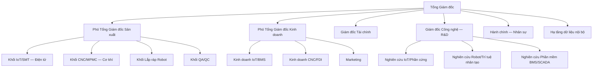
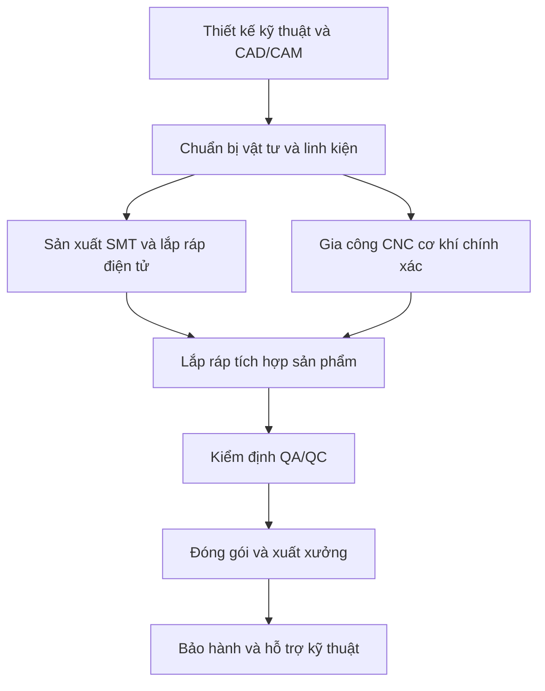
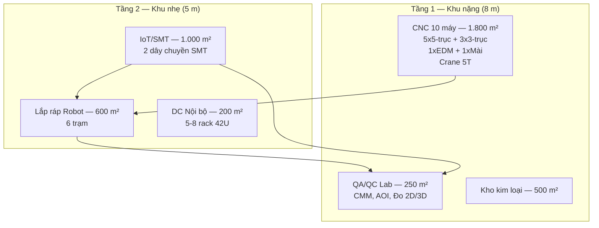

# MẪU SỐ 1.4

## Dự án ứng dụng công nghệ cao để sản xuất sản phẩm công nghệ cao

---

## I. THÔNG TIN CHUNG

### 1. Tên dự án

**Mekong Technology — Nghiên cứu, phát triển và sản xuất thiết bị IoT Gateway, hệ thống BMS/SCADA, Robot AMR/AGV và chế tạo cơ khí chính xác CNC phục vụ chuyển đổi số doanh nghiệp sản xuất**

### 2. Loại hình dự án

☑ **Việt Nam**
☐ FDI

### 3. Lĩnh vực hoạt động

☑ Vi điện tử — Công nghệ thông tin — Viễn thông
☑ Cơ khí chính xác — Tự động hóa
☐ Công nghệ sinh học áp dụng trong dược phẩm và môi trường
☐ Năng lượng mới — Vật liệu mới — Công nghệ nano
☐ Khác

### 4. Thời hạn hoạt động của dự án

**50 năm, từ 01/2025 đến 12/2075** [C].

### 5. Doanh thu hàng năm của dự án (dự ước)

- **Giai đoạn đầu (03 năm đầu kể từ khi phát sinh doanh thu — Y4 đến Y6):** khoảng **2.700.000 USD/năm** [A].
- **Giai đoạn ổn định (từ năm thứ 12 trở đi):** **12.000.000 USD/năm** [C].

### 6. Doanh thu thuần hàng năm của dự án (dự ước)

- **Giai đoạn đầu:** khoảng **2.450.000 USD/năm** [A].
- **Giai đoạn ổn định:** khoảng **11.400.000 USD/năm** [A].

### 7. Chi phí hoạt động hàng năm của dự án (dự ước)

- **Giai đoạn đầu:** khoảng **2.050.000 USD/năm** [A].
- **Giai đoạn ổn định:** khoảng **8.400.000 USD/năm** [C].

### 8. Giá trị gia tăng tạo ra của dự án

- **Giai đoạn đầu:** khoảng **1.100.000 USD/năm** [A].
- **Giai đoạn ổn định:** khoảng **3.600.000 USD/năm** [C] (EBITDA margin khoảng 30%).
- **Lũy kế 15 năm vận hành (Y4–Y18):** khoảng **42.000.000 USD** [A].

### 9. Tổ chức quản lý

#### 9.1. Sơ đồ tổ chức

#### 9.2. Mô tả mô hình tổ chức, điều hành

- Bộ máy quản trị tổ chức theo cơ chế **điều hành tập trung — triển khai theo khối chức năng**.
- **Ban Giám đốc:** gồm 04 vị trí chủ chốt (Tổng Giám đốc, 02 Phó Tổng Giám đốc, Giám đốc Tài chính) và Giám đốc Công nghệ phụ trách nghiên cứu và phát triển.
- **Khối Nghiên cứu và Phát triển (R&D):** là bộ phận trọng yếu, chịu trách nhiệm làm chủ công nghệ sản phẩm, nâng cấp cấu hình kỹ thuật, chuẩn hóa hồ sơ kỹ thuật và bảo vệ sở hữu trí tuệ. Dự kiến 13–16 kỹ sư chuyên trách (chiếm khoảng 12% tổng nhân sự ổn định).
- **Khối sản xuất** vận hành theo **02 trụ cột**:
  - Trụ cột 1 — **Điện tử thông minh:** IoT Gateway, BMS/SCADA, Robot AMR/AGV — dây chuyền SMT và lắp ráp robot.
  - Trụ cột 2 — **Chế tạo cơ khí chính xác:** 10 máy CNC (5 máy 5-trục, 3 máy 3-trục, 1 máy cắt dây EDM, 1 máy mài phẳng) — gia công khung robot, linh kiện FDI, jig/fixture.
- **Khối tài chính** kiểm soát dòng tiền, hiệu quả đầu tư và tuân thủ kế hoạch vốn đã đăng ký.
- **Khối pháp chế — môi trường — an toàn** phối hợp xuyên suốt trong quá trình đầu tư và vận hành.
- Hạ tầng dữ liệu nội bộ phục vụ hệ thống ERP, MES, lưu trữ dữ liệu sản xuất và huấn luyện thuật toán; **không kinh doanh dịch vụ trung tâm dữ liệu**.

---

## II. GIẢI TRÌNH CÁC HOẠT ĐỘNG CỦA DỰ ÁN ỨNG DỤNG CÔNG NGHỆ CAO ĐỂ SẢN XUẤT SẢN PHẨM CÔNG NGHỆ CAO

### 1. Tính cấp thiết và mục tiêu

#### 1.1. Tính cấp thiết để thực hiện dự án

**a) Khoảng trống công nghệ tại Việt Nam:**

- Hầu hết thiết bị IoT Gateway, hệ thống BMS/SCADA và Robot tự hành phục vụ ngành sản xuất hiện đang phụ thuộc nhập khẩu. Tỷ lệ nhập khẩu trong nhóm thiết bị này ước tính trên 85%, chủ yếu từ các nhà sản xuất tại Đức, Nhật Bản và Trung Quốc với mức giá cao hơn 25–40% so với tiềm năng sản xuất nội địa [B].
- Việt Nam chưa có nhà sản xuất quy mô công nghiệp cho nhóm sản phẩm IoT Gateway đa giao thức và Robot AMR phục vụ nhà máy thông minh.
- Thời gian giao hàng cho sản phẩm nhập khẩu trung bình 3–6 tháng, không đáp ứng nhu cầu cấp bách của doanh nghiệp vừa và nhỏ trong nước.

**b) Nhu cầu chuyển đổi số và tự động hóa sản xuất:**

- Xu hướng chuyển đổi số tại nhà máy và tòa nhà tại Việt Nam đang gia tăng mạnh mẽ, tạo nhu cầu lớn đối với thiết bị kết nối, hệ thống giám sát vận hành và robot tự hành [B].
- Nhu cầu gia công linh kiện cơ khí chính xác cho khối doanh nghiệp có vốn đầu tư trực tiếp nước ngoài (FDI) tăng theo đà dịch chuyển chuỗi cung ứng vào Việt Nam [B].
- Thị trường nội địa cần nhà cung cấp có năng lực thiết kế, sản xuất và tích hợp hệ thống tại chỗ, bảo đảm tiến độ và hỗ trợ kỹ thuật dài hạn.

**c) Cơ hội thị trường:**

- Thị trường IoT khu vực ASEAN dự kiến đạt quy mô lớn vào năm 2030 với tốc độ tăng trưởng kép hàng năm trên 20% [B]. Thị trường Robot tự hành tại Việt Nam dự kiến tăng trưởng trên 25%/năm [B].
- Dự án đặt tại Khu Công nghệ cao TP.HCM, phù hợp định hướng phát triển công nghệ cao, công nghiệp hỗ trợ và sản xuất xanh của Thành phố.

#### 1.2. Mục tiêu kinh tế — xã hội

- Hình thành tổ hợp sản xuất công nghệ cao có khả năng cung ứng sản phẩm nội địa và thay thế một phần nhập khẩu.
- Tạo **110–135 việc làm** trực tiếp (giai đoạn ổn định), trong đó tỷ lệ nhân lực kỹ thuật chiếm trên 60% [C].
- Phát triển nhân lực công nghệ cao tại địa phương thông qua đào tạo nội bộ, đào tạo tại vị trí làm việc và hợp tác với cơ sở đào tạo.
- Góp phần mở rộng chuỗi giá trị sản xuất công nghiệp công nghệ cao và nâng tỷ lệ nội địa hóa.
- Đóng góp doanh thu dự kiến khoảng **140.000.000 USD** lũy kế 15 năm vận hành [C].
- Định hướng xuất khẩu linh kiện cơ khí chính xác và sản phẩm điện tử công nghiệp sang thị trường khu vực ASEAN.

#### 1.3. Mục tiêu về khoa học và công nghệ

- Làm chủ công nghệ thiết kế, sản xuất thiết bị IoT Gateway công nghiệp đa giao thức, Robot AMR/AGV tự hành và phần mềm BMS/SCADA.
- Làm chủ quy trình gia công CNC 5 trục và 3 trục cho linh kiện cơ khí chính xác, dung sai kỹ thuật ở mức cao.
- Phát triển phần mềm nền tảng IoT (MekongOS) và phần mềm quản lý tòa nhà (MekongBMS) thuộc quyền sở hữu trí tuệ của doanh nghiệp.
- Duy trì tỷ lệ chi cho nghiên cứu và phát triển đáp ứng điều kiện dự án công nghệ cao theo quy định hiện hành.
- Mục tiêu đăng ký 10–15 bằng sáng chế, giải pháp hữu ích và quyền sở hữu trí tuệ trong 10 năm đầu.

---

### 2. Dự báo thị trường

#### 2.1. Thị trường trong nước

- Trọng tâm khách hàng gồm: nhà máy sản xuất, doanh nghiệp logistics, tòa nhà thương mại, đơn vị tích hợp hệ thống và doanh nghiệp FDI có nhu cầu gia công linh kiện chính xác.
- Nhóm sản phẩm mục tiêu theo 02 trụ cột kinh doanh:

| STT | Nhóm sản phẩm | Trụ cột | Khách hàng mục tiêu |
| --- | --- | :---: | --- |
| 1 | IoT Gateway đa giao thức (MK-200, MK-300) | BU1 | Nhà máy, tòa nhà, đơn vị tích hợp |
| 2 | Mô-đun I/O và bộ điều khiển DDC | BU1 | Nhà máy, tòa nhà thông minh |
| 3 | Gateway chuyên dụng (BACnet, Modbus, KNX, DALI) | BU1 | Đơn vị tích hợp BMS |
| 4 | Phần mềm MekongBMS và dịch vụ BMS/SCADA | BU1 | Tòa nhà, khu công nghiệp |
| 5 | Robot AMR/AGV tự hành | BU1 | Nhà máy, doanh nghiệp logistics |
| 6 | Sản phẩm OEM/ODM điện tử | BU1 | Đối tác sản xuất điện tử |
| 7 | Khung robot, linh kiện cơ khí chính xác cho FDI | BU2 | Doanh nghiệp FDI, nhà sản xuất |
| 8 | Jig, đồ gá, chi tiết CNC theo đơn hàng | BU2 | Doanh nghiệp sản xuất |

- Doanh thu ổn định dự kiến đạt **12.000.000 USD/năm** [C], trong đó trụ cột BU1 (Điện tử thông minh) chiếm khoảng **70,8%** và trụ cột BU2 (Cơ khí chính xác CNC) chiếm khoảng **29,2%** [C].

#### 2.2. Thị trường ngoài nước

- Thị trường ưu tiên là khu vực ASEAN, theo lộ trình phù hợp với năng lực sản xuất và tiêu chuẩn kỹ thuật của doanh nghiệp [A].
- Định hướng xuất khẩu tập trung vào linh kiện cơ khí chính xác và sản phẩm điện tử công nghiệp có hàm lượng kỹ thuật cao.
- Lợi thế cạnh tranh tại thị trường khu vực: giá thành sản xuất cạnh tranh, năng lực tùy chỉnh kỹ thuật theo yêu cầu khách hàng và hỗ trợ kỹ thuật nhanh.

#### 2.3. Nhu cầu thị trường tổng hợp

- Nhu cầu thị trường được xác định dựa trên xu hướng tăng đầu tư nhà máy thông minh, nhu cầu tối ưu vận hành tòa nhà và yêu cầu nâng cao chất lượng sản xuất [B].
- Dự án có lợi thế cạnh tranh về tốc độ triển khai, tùy biến kỹ thuật, dịch vụ kỹ thuật tại chỗ và thời gian giao hàng ngắn hơn so với sản phẩm nhập khẩu.

**Phân tích cạnh tranh:**

| Tiêu chí | Sản phẩm nhập khẩu | Nhà sản xuất nội địa hiện hữu | Mekong Technology |
| --- | --- | --- | --- |
| Giá thành | Cao (chuẩn quốc tế) | Cạnh tranh nhưng quy mô nhỏ | Thấp hơn 20–30% so với nhập khẩu |
| Thời gian giao hàng | 3–6 tháng | 1–2 tháng (sản phẩm đơn giản) | 1–2 tháng (sản phẩm phức tạp) |
| Tùy chỉnh kỹ thuật | Hạn chế | Có nhưng chất lượng không đều | Linh hoạt, theo yêu cầu khách hàng |
| Hỗ trợ kỹ thuật tại chỗ | Hạn chế hoặc qua đại lý | Có nhưng quy mô nhỏ | Trực tiếp, phản hồi trong 24 giờ |
| Danh mục sản phẩm | Rộng | Hẹp | Hệ sinh thái tích hợp IoT + CNC |

---

### 3. Giải trình về nhu cầu sử dụng đất và năng lực triển khai dự án của nhà đầu tư

#### 3.1. Nhu cầu sử dụng đất và sự phù hợp quy hoạch

**Vị trí dự án:**

- **Địa điểm:** Lô E2-03, Đường D1, Khu Công nghệ cao TP.HCM.
- **Diện tích lô đất:** **10.000 m²** (1 ha) [B].
- **Phù hợp quy hoạch:** thuộc khu vực ưu tiên phát triển công nghệ cao theo quy định hiện hành.

**Công trình xây dựng:**

| Khu vực | Kích thước | Footprint | Số tầng | Chiều cao | GFA | Chức năng chính |
| --- | --- | ---: | :---: | ---: | ---: | --- |
| Tòa nhà Văn phòng | 21 m × 48 m | 1.008 m² | 3 | 14 m | 3.024 m² | VP điều hành, R&D Lab, phòng họp, đào tạo |
| Nhà xưởng Sản xuất | 48 m × 70 m | 3.360 m² | 2 | 14 m | 6.720 m² | T1: CNC + QA/QC; T2: IoT/SMT + Robot + DC nội bộ |
| Khu Kỹ thuật phụ trợ | 5 m × 56 m | 280 m² | 2 | 8 m | 560 m² | Trạm biến áp, xử lý nước, PCCC, bảo trì |
| **Tổng xây dựng** | — | **4.648 m²** | — | — | **10.304 m²** | |
| Sân bãi, đường nội bộ, cây xanh | — | 5.352 m² | — | — | — | Bãi xe, PCCC lane, cây xanh (2.000 m², 20%) |

- **Mật độ xây dựng:** **46,5%** [C] — nằm trong giới hạn 70% cho phép tại KCNC.
- **Tổng diện tích sàn xây dựng (GFA):** **10.304 m²** [C].
- **Hệ số sử dụng đất (FAR):** 1,03 [C].

**Hạ tầng kỹ thuật:**

| Hạng mục | Thông số | Ghi chú |
| --- | --- | --- |
| Điện | 1.250 kVA | Trạm biến áp riêng, dự phòng UPS cho DC và SMT |
| Nước | 30–50 m³/ngày | Cấp nước từ hệ thống KCNC |
| Viễn thông | Cáp quang tốc độ cao | Hạ tầng KCNC |
| Năng lượng tái tạo | 200 kWp solar PV trên mái | Đáp ứng yêu cầu tỷ lệ năng lượng tái tạo tối thiểu 20% |
| Công trình xanh | Chứng nhận EDGE | Theo yêu cầu KCNC TP.HCM |
| PCCC | Sprinkler T1+T2, FM-200, báo cháy | Thiết kế theo quy chuẩn PCCC hiện hành |

#### 3.2. Năng lực tài chính

**Tổng vốn đầu tư và cấu trúc vốn:**

| Nguồn vốn | Giá trị (USD) | Tỷ trọng | Thời điểm giải ngân |
| --- | ---: | ---: | --- |
| **Vốn chủ sở hữu** | **18.000.000** | **81,8%** | Phase 0 đến Phase 2 (Y0–Y5) |
| **Vốn vay ngân hàng** | **4.000.000** | **18,2%** | Phase 3 (Y7–Y16), lãi suất 8,5%/năm |
| **Tổng CAPEX** | **22.000.000** | **100%** | |

- Vốn chủ sở hữu tự chủ toàn bộ giai đoạn xây dựng và lắp đặt thiết bị; vốn vay chỉ giải ngân khi dự án đã có doanh thu ổn định.
- Tỷ lệ nợ/vốn: 0,22 — mức an toàn cao.

**CAPEX theo giai đoạn:**

| Giai đoạn | Thời gian | Nội dung chính | CAPEX (USD) | Tỷ trọng |
| --- | --- | --- | ---: | ---: |
| Phase 0 | Y0–Y1 | Pháp lý, EIA, thiết kế, san lấp mặt bằng | 1.500.000 | 6,8% |
| Phase 1 | Y1–Y3 | Xây dựng: VP 3 tầng + Xưởng SX 2 tầng + Utility 2 tầng + M&E + PCCC + Solar PV 200 kWp | 8.400.000 | 38,2% |
| Phase 2 | Y3–Y5 | Thiết bị: SMT + CNC 10 máy + Robot Assembly + DC nội bộ + QA Lab + Phần mềm | 9.600.000 | 43,6% |
| Phase 3 | Y5–Y7 | Vốn lưu động vận hành và dự phòng rủi ro | 2.500.000 | 11,4% |
| **Tổng** | **Y0–Y7** | | **22.000.000** | **100%** |

**Chỉ số tài chính mục tiêu:**

| Chỉ tiêu | Giá trị | Nhãn |
| --- | ---: | :---: |
| NPV (50 năm, WACC 12%) | 1.500.000 USD | [C] |
| IRR (50 năm) | 13,0% | [C] |
| Thời gian hòa vốn chiết khấu | 10 năm | [C] |
| EBITDA margin ổn định | khoảng 30% | [C] |
| DSCR tối thiểu | 1,50 lần | [C] |
| Giá trị chiến lược dự án | 7.000.000 USD | [C] |

#### 3.3. Năng lực công nghệ

- Dự án tổ chức năng lực sản xuất theo 02 trụ cột, gắn liền với hệ thống quản lý dữ liệu nội bộ.
- **Năng lực CNC:** 10 máy, gồm 05 máy 5 trục, 03 máy 3 trục, 01 máy cắt dây EDM và 01 máy mài phẳng [C].
- **Năng lực sản xuất điện tử:** dây chuyền SMT với công suất thiết kế đến 100.000 bảng mạch/năm, hệ thống AOI kiểm tra tự động và trạm kiểm tra chức năng.
- **Năng lực lắp ráp robot:** 06 trạm lắp ráp, công suất đến 500 robot/năm.
- Hạ tầng dữ liệu nội bộ chỉ phục vụ hệ thống ERP, MES, phân tích dữ liệu sản xuất và huấn luyện thuật toán; **không kinh doanh dịch vụ trung tâm dữ liệu** — diện tích 200 m², CAPEX 2.200.000 USD (10,0% tổng CAPEX) [C].

#### 3.4. Năng lực quản trị

**Ban lãnh đạo:**

| STT | Chức vụ | Lĩnh vực chuyên môn | Kinh nghiệm |
| --- | --- | --- | --- |
| 1 | Tổng Giám đốc | Công nghệ IoT, quản trị doanh nghiệp | 15 năm |
| 2 | Giám đốc Công nghệ (CTO) | Robot tự hành, tự động hóa | 12 năm |
| 3 | Giám đốc Tài chính (CFO) | Tài chính doanh nghiệp, đầu tư | 10 năm |
| 4 | Phó Tổng Giám đốc Sản xuất | Sản xuất, vận hành nhà máy | 8 năm |

**Hệ thống quản lý dự kiến áp dụng:**

- ISO 9001:2015 — Quản lý chất lượng.
- ISO 14001:2015 — Quản lý môi trường.
- ISO 45001:2018 — Quản lý an toàn lao động.
- Hệ thống ERP và MES cho quản lý sản xuất và chuỗi cung ứng.

---

### 4. Mô tả các hoạt động sản xuất, kinh doanh của dự án

#### a) Giải trình sản phẩm và năng lực sản xuất của dự án

##### Sản phẩm phù hợp với Danh mục sản phẩm công nghệ cao

Theo Quyết định 38/2020/QĐ-TTg — Phụ lục II:

| Danh mục | Nhóm sản phẩm tương ứng |
| --- | --- |
| Mục 1.1 — Thiết bị vi điện tử | IoT Gateway MK-200, MK-300 (vi xử lý ARM, cảm biến, truyền thông) |
| Mục 1.2 — Công nghệ thông tin | Phần mềm MekongBMS, MekongOS, nền tảng IoT |
| Mục 2.1 — Cơ khí chính xác | Robot AMR/AGV, khung robot, linh kiện CNC |
| Mục 2.2 — Tự động hóa | Hệ thống BMS/SCADA, bộ điều khiển DDC |

##### Sản phẩm thay thế nhập khẩu

| STT | Sản phẩm Mekong Technology | Sản phẩm nhập khẩu tương đương | Lợi thế |
| --- | --- | --- | --- |
| 1 | IoT Gateway MK-200/MK-300 | Siemens SIMATIC, Schneider EcoStruxure | Giá thấp hơn 25–35%, tùy chỉnh linh hoạt |
| 2 | Robot AMR-500/AMR-1000 | KUKA KMR, Fetch Robotics | Hỗ trợ kỹ thuật tại chỗ |
| 3 | Robot AGV-500/AGV-1000 | Daifuku, Dematic | Thời gian giao hàng ngắn hơn |
| 4 | Linh kiện CNC chính xác | Linh kiện nhập từ Nhật, Đức | Giá cạnh tranh, linh hoạt số lượng |

##### Bảng sản phẩm và năng lực sản xuất

| STT | Tên sản phẩm | Thông số kỹ thuật chính | Quy mô thiết kế (đơn vị/năm) | Giá trị đơn vị (USD) | Doanh thu ổn định (M USD/năm) | Giá trị gia tăng (%) | Thị trường VN (%) | Thị trường ASEAN (%) | Phù hợp QĐ 38/2020 |
| --- | --- | --- | ---: | ---: | ---: | ---: | ---: | ---: | --- |
| **I. Trụ cột 1 — Điện tử thông minh (BU1)** | | | | | | | | | |
| 1 | IoT Gateway MK-200 | NXP i.MX8M, 2 GB RAM, WiFi 6, BLE 5.2, Modbus/BACnet/OPC UA | 3.000 | 400 | 2,00 | 48 | 70 | 30 | Mục 1.1 |
| 2 | MK-EIO Mô-đun I/O (5 loại) | 8/16/32 DI/DO/AI, RS485, IP54 | 2.500 | 120 | 0,50 | 45 | 75 | 25 | Mục 1.1 |
| 3 | MK-DDC Bộ điều khiển | 24/64 điểm, BACnet MS/TP | 800 | 250 | 0,40 | 42 | 80 | 20 | Mục 2.2 |
| 4 | MK-GW Gateway chuyên dụng (4 loại) | BACnet/Modbus/KNX/DALI | 600 | 180 | 0,24 | 40 | 70 | 30 | Mục 1.1 |
| 5 | Phần mềm MekongBMS (License + SaaS) | Giám sát điều khiển tòa nhà, giao diện web | — | — | 0,75 | 70 | 75 | 25 | Mục 1.2 |
| 6 | Dịch vụ BMS/SCADA | Triển khai, tích hợp, bảo trì | — | — | 0,40 | 55 | 85 | 15 | Mục 1.2 |
| 7 | Robot AMR (tự hành) | Tải 100–1.000 kg, LiDAR 3D, SLAM, AI | 150 | 15.000–25.000 | 1,80 | 40 | 65 | 35 | Mục 2.1 |
| 8 | Robot AGV (dẫn đường) | Tải 200–1.000 kg, điều hướng laser | 80 | 10.000–20.000 | 0,60 | 38 | 60 | 40 | Mục 2.1 |
| 9 | MekongOS (Nền tảng IoT SaaS) | Quản lý thiết bị, phân tích dữ liệu | — | — | 0,30 | 75 | 70 | 30 | Mục 1.2 |
| 10 | OEM/ODM Điện tử | Sản xuất, lắp ráp theo đơn hàng | — | — | 1,10 | 30 | 80 | 20 | Mục 1.1 |
| | **Tổng BU1** | | | | **8,09** | | | | |
| **II. Trụ cột 2 — Cơ khí chính xác CNC (BU2)** | | | | | | | | | |
| 11 | Khung Robot AMR/AGV (CNC) | Nhôm 6061, thép SUS304, dung sai ±0,02 mm | 300 | — | 0,70 | 35 | 70 | 30 | Mục 2.1 |
| 12 | Linh kiện chính xác cho FDI | Theo bản vẽ khách hàng, dung sai ±0,01 mm | — | — | 1,50 | 30 | 40 | 60 | Mục 2.1 |
| 13 | Jig, đồ gá | Thiết kế và chế tạo theo yêu cầu | — | — | 0,40 | 38 | 75 | 25 | Mục 2.1 |
| 14 | CNC thuê ngoài (giờ máy) | 5 trục, 3 trục theo đơn hàng | — | — | 0,80 | 25 | 65 | 35 | Mục 2.1 |
| 15 | Chi tiết cơ khí khác | Theo đơn hàng | — | — | 0,10 | 30 | 80 | 20 | Mục 2.1 |
| | **Tổng BU2** | | | | **3,50** | | | | |
| | **TỔNG CỘNG** | | | | **11,59** | | | | |

> Doanh thu thiết kế từ 15 dòng sản phẩm: 11,59M USD. Doanh thu thực tế ổn định đạt **12,00M USD/năm** [C] khi tính tăng trưởng đơn hàng và điều chỉnh giá bán.

##### Tiêu chuẩn chất lượng sản phẩm

| Tiêu chuẩn | Phạm vi áp dụng |
| --- | --- |
| IEC 61000 | Tương thích điện từ (EMC) cho thiết bị IoT |
| IEC 60730 | An toàn thiết bị điện tử điều khiển tự động |
| RoHS/REACH/WEEE | Tuân thủ quy định chất nguy hại, hóa chất và tái chế (EU) |
| CE/FCC (mục tiêu) | Chứng nhận xuất khẩu châu Âu và Bắc Mỹ |
| ISO 9001:2015 | Hệ thống quản lý chất lượng |

#### b) Mô tả công nghệ của dự án

##### Quy trình công nghệ sản xuất tổng quát

##### Quy trình sản xuất IoT Gateway

```mermaid
flowchart LR
    A[Nhập linh kiện SMT] --> B[In kem hàn]
    B --> C[Gắp đặt linh kiện tự động]
    C --> D[Hàn Reflow]
    D --> E[Kiểm tra AOI]
    E --> F[Kiểm tra mạch ICT]
    F --> G[Nạp phần mềm]
    G --> H[Chạy thử Burn-in 8-24 giờ]
    H --> I[Kiểm tra chức năng cuối]
    I --> J[Đóng gói chống tĩnh điện]
```

##### Quy trình sản xuất Robot AMR

##### Nội dung công nghệ chủ đạo

| Lĩnh vực | Công nghệ | Mức độ |
| --- | --- | --- |
| IoT Gateway | Thiết kế và chế tạo IoT Gateway công nghiệp đa giao thức (MQTT, Modbus, BACnet, OPC UA), xử lý tại biên với NPU tích hợp | Làm chủ công nghệ, TRL 7–9 |
| Robot tự hành | Robot AMR sử dụng LiDAR 3D, thuật toán SLAM, trí tuệ nhân tạo điều hướng và né tránh chướng ngại vật | Làm chủ công nghệ, TRL 7–8 |
| Cơ khí chính xác | Gia công CNC 5 trục, dung sai ±0,01 mm; cắt dây EDM dung sai ±0,005 mm | Ứng dụng công nghệ tiên tiến |
| Phần mềm | Nền tảng IoT MekongOS, phần mềm BMS/SCADA MekongBMS — quyền sở hữu trí tuệ của doanh nghiệp | Tự phát triển |

##### Công nghệ phù hợp với Danh mục công nghệ cao

| Quy định | Mục | Nội dung |
| --- | --- | --- |
| QĐ 38/2020/QĐ-TTg — Phụ lục II | Mục 1.1 | Công nghệ vi điện tử — sản xuất thiết bị IoT Gateway |
| QĐ 38/2020/QĐ-TTg — Phụ lục II | Mục 1.2 | Công nghệ thông tin — phần mềm IoT và BMS |
| QĐ 38/2020/QĐ-TTg — Phụ lục II | Mục 2.1 | Cơ khí chính xác — Robot AMR, linh kiện CNC |
| QĐ 38/2020/QĐ-TTg — Phụ lục II | Mục 2.2 | Tự động hóa — hệ thống BMS/SCADA |
| QĐ 2117/QĐ-TTg | Mục 1, 2, 3 | Công nghệ cao trong lĩnh vực CNTT, tự động hóa, robot |

##### Yếu tố trực tiếp về công nghệ

- **Hoàn thiện công nghệ:** TRL 7–9, sản phẩm sẵn sàng đưa ra thị trường.
- **Mức độ tiên tiến:** vi xử lý ARM Cortex-A53/A78, xử lý trí tuệ nhân tạo tại biên, kết nối đa giao thức.
- **Tính mới:** hỗ trợ đa giao thức trong một thiết bị, phân tích dữ liệu tại biên, thuật toán SLAM cho robot tự hành.
- **Tính thích hợp:** phù hợp nhu cầu nhà máy và tòa nhà tại Việt Nam, giá thành cạnh tranh.

##### Yếu tố gián tiếp của công nghệ

- **Nguồn cung ứng:** ưu tiên tăng tỷ lệ sử dụng vật tư, linh kiện sản xuất trong nước.
- **Phù hợp địa điểm:** KCNC TP.HCM có hạ tầng điện, nước, viễn thông, nhân lực phù hợp.
- **Hiệu quả phát triển:** tạo việc làm kỹ thuật, giá trị gia tăng cao, góp phần phát triển chuỗi cung ứng nội địa.

##### Phân tích phương án công nghệ

| Phương án | Ưu điểm | Nhược điểm | Đánh giá |
| --- | --- | --- | --- |
| 1. Tự phát triển hoàn toàn | Kiểm soát toàn bộ, không phụ thuộc | Thời gian dài (5–7 năm), chi phí rất cao | Không phù hợp tiến độ |
| **2. Kết hợp tự phát triển và hợp tác công nghệ (được chọn)** | **Rút ngắn thời gian, chi phí hợp lý, làm chủ dần** | **Cần đào tạo nhân sự, đầu tư R&D** | **Tối ưu nhất** |
| 3. Mua sẵn và tùy chỉnh | Nhanh, chi phí ban đầu thấp | Không làm chủ, khó cạnh tranh lâu dài | Không phù hợp mục tiêu |

**Kết luận:** Phương án 2 — kết hợp tự phát triển (phần mềm, thiết kế sản phẩm) và hợp tác công nghệ (phần cứng, dây chuyền sản xuất) — là phương án tối ưu, phù hợp năng lực và mục tiêu dài hạn của dự án.

#### c) Giải trình về máy móc, thiết bị của dự án

##### Thiết bị chính theo dây chuyền

**1. Dây chuyền SMT (Sản xuất bảng mạch điện tử):**

| STT | Thiết bị | Chức năng | Thông số chính | Xuất xứ dự kiến | Số lượng |
| --- | --- | --- | --- | --- | ---: |
| 1 | Máy in kem hàn | In kem hàn lên PCB | Độ chính xác ±25 μm, tự động căn chỉnh | Nhật Bản/Đức | 1 |
| 2 | Máy gắp đặt linh kiện | Gắp và đặt linh kiện tự động | Tốc độ 15.000–25.000 linh kiện/giờ | Nhật Bản | 1 |
| 3 | Lò hàn Reflow | Hàn linh kiện SMT | 10 zone, hàn không chì SAC305 | Nhật Bản/Đức | 1 |
| 4 | Kiểm tra quang học tự động (AOI) | Phát hiện lỗi hàn, lệch linh kiện | Độ phân giải 15 μm, 100% kiểm tra | Nhật Bản | 1 |
| 5 | Kiểm tra mạch trong (ICT) | Đo điện trở, điện dung, mạch ngắn | Kiểm tra 100% điểm hàn | Mỹ | 1 |
| 6 | Buồng chạy thử (Burn-in) | Kiểm tra ổn định ở điều kiện khắc nghiệt | -40°C đến +85°C, 24 giờ | Nhật Bản | 2 |
| 7 | Trạm kiểm tra chức năng cuối | Kiểm tra toàn bộ tính năng sản phẩm | Kiểm tra giao thức, kết nối, hiệu năng | Nội địa/Nhật | 2 |

**2. Dây chuyền CNC (Gia công cơ khí chính xác):**

| STT | Thiết bị | Chức năng | Thông số chính | Xuất xứ dự kiến | Số lượng |
| --- | --- | --- | --- | --- | ---: |
| 1 | Máy CNC 5 trục | Gia công chi tiết phức tạp | Dung sai ±0,01 mm, bàn quay nghiêng | Nhật Bản/Đức | 5 |
| 2 | Máy CNC 3 trục | Gia công chi tiết phụ trợ | Dung sai ±0,02 mm, thay dao tự động | Mỹ/Nhật Bản | 3 |
| 3 | Máy cắt dây EDM | Gia công tinh chính xác cao | Dung sai ±0,005 mm | Nhật Bản | 1 |
| 4 | Máy mài phẳng | Hoàn thiện bề mặt | Độ nhám Ra 0,4 μm | Nhật Bản/Đức | 1 |
| 5 | Dụng cụ, đồ gá, hệ thống gá kẹp | Phụ trợ gia công CNC | Theo yêu cầu sản xuất | Đa quốc gia | 1 bộ |

**3. Dây chuyền lắp ráp Robot:**

| STT | Thiết bị | Chức năng | Thông số chính | Xuất xứ dự kiến | Số lượng |
| --- | --- | --- | --- | --- | ---: |
| 1 | Trạm lắp ráp cơ khí | Lắp khung, động cơ, bánh xe | Bàn lắp ráp, dụng cụ chuyên dụng | Nội địa | 3 |
| 2 | Trạm tích hợp điện tử | Lắp bảng mạch, cảm biến, dây dẫn | Dụng cụ hàn, đo kiểm | Nội địa | 2 |
| 3 | Trạm kiểm tra điều hướng | Kiểm tra SLAM, né tránh chướng ngại vật | Sân thử 200 m², chướng ngại vật mô phỏng | Nội địa | 1 |

**4. Thiết bị QA/QC:**

| STT | Thiết bị | Chức năng | Thông số chính | Xuất xứ dự kiến | Số lượng |
| --- | --- | --- | --- | --- | ---: |
| 1 | Cánh tay đo tọa độ CMM | Đo kích thước 3D | Độ chính xác ±0,025 mm | Mỹ/Thụy Điển | 1 |
| 2 | Thiết bị đo 2D/3D | Đo biên dạng, kích thước | Độ phân giải 1 μm | Nhật Bản | 1 |
| 3 | Thiết bị đo độ nhám | Kiểm tra chất lượng bề mặt | Ra 0,01 μm | Nhật Bản | 1 |
| 4 | Thiết bị kiểm tra môi trường | Kiểm tra nhiệt độ, độ ẩm, rung | -70°C đến +180°C, 5–3.000 Hz | Đức/Anh | 2 |

##### Bảng tổng hợp máy móc, thiết bị

| TT | Nhóm thiết bị | Số lượng | Giá trị ước tính (M USD) | Phase | Ghi chú |
| --- | --- | ---: | ---: | --- | --- |
| I | **Thiết bị sản xuất chính** | | | | |
| 1 | Dây chuyền SMT | 01 dây chuyền | 1,50 | P2 | Sản xuất bảng mạch điện tử |
| 2 | Máy CNC 5 trục | 05 máy | 2,00 | P2 | DMG Mori/Mazak cấp |
| 3 | Máy CNC 3 trục | 03 máy | 0,75 | P2 | Haas/Mazak cấp |
| 4 | Máy cắt dây EDM + Mài phẳng | 02 máy | 0,45 | P2 | Gia công tinh |
| 5 | Dụng cụ, đồ gá CNC | 01 bộ | 0,30 | P2 | Phụ trợ gia công |
| 6 | Dây chuyền lắp ráp Robot | 06 trạm | 0,50 | P2 | Jig, trạm kiểm tra |
| | **Tổng thiết bị sản xuất** | | **5,50** | | |
| II | **Thiết bị R&D và QA/QC** | | | | |
| 7 | Thiết bị BMS/SCADA R&D | 01 bộ | 0,40 | P2 | Phát triển phần mềm |
| 8 | Thiết bị kiểm tra điện tử OEM | 01 bộ | 0,50 | P2 | Kiểm tra chức năng |
| 9 | QA/QC Lab (CMM, đo 2D/3D) | 01 bộ | 0,30 | P2 | Kiểm định chất lượng |
| | **Tổng R&D + QA/QC** | | **1,20** | | |
| III | **Hạ tầng dữ liệu nội bộ** | | | | |
| 10 | Hệ thống DC (rack, server, UPS, làm mát) | 5–8 rack 42U | 2,20 | P2 | 200 m², phục vụ nội bộ |
| | **Tổng DC nội bộ** | | **2,20** | | |
| IV | **Phần mềm** | | | | |
| 11 | ERP, MES, CAD/CAM license | 01 bộ | 0,30 | P2 | Quản lý sản xuất |
| | **Tổng phần mềm** | | **0,30** | | |
| V | **Lắp đặt, hiệu chuẩn** | | | | |
| 12 | Lắp đặt, calibration, commissioning | — | 0,40 | P2 | Toàn bộ thiết bị |
| | **Tổng lắp đặt** | | **0,40** | | |
| | **TỔNG CỘNG THIẾT BỊ (Phase 2)** | | **9,60** | | |

> Tổng giá trị thiết bị Phase 2: **9.600.000 USD** (43,6% tổng CAPEX) [C]. Toàn bộ thiết bị dự kiến nhập mới 100%, đạt tiêu chuẩn kỹ thuật quốc tế.

##### Tính đồng bộ của thiết bị

- **Dây chuyền SMT:** in kem hàn — gắp đặt — hàn reflow — AOI — ICT — burn-in — kiểm tra chức năng — tạo thành dây chuyền hoàn chỉnh khép kín.
- **Dây chuyền CNC:** 10 máy (5-trục + 3-trục + EDM + mài) phối hợp gia công từ thô đến tinh, đáp ứng dung sai cao.
- **Lắp ráp Robot:** kết hợp khung CNC + bảng mạch SMT + phần mềm SLAM thành sản phẩm hoàn chỉnh.
- **QA/QC:** kiểm soát chất lượng tại mỗi công đoạn và kiểm định tổng thể trước khi xuất xưởng.

##### Sơ đồ bố trí máy móc, thiết bị

#### d) Giải trình về lực lượng lao động tham gia dự án

##### Kế hoạch nhân sự theo giai đoạn

| Giai đoạn | Thời gian | Số lượng | Nội dung chính |
| --- | --- | ---: | --- |
| Giai đoạn khởi động | Y0–Y1 | 8–10 | Ban giám đốc, pháp lý, thiết kế |
| Giai đoạn xây dựng | Y1–Y3 | 10–15 | Thêm giám sát xây dựng, mua sắm |
| Giai đoạn tuyển sản xuất | Y3–Y4 | 30–40 | Tuyển kỹ sư SMT, công nhân, QA |
| Giai đoạn mở rộng | Y4–Y6 | 55–80 | Tuyển thợ CNC, kỹ sư robot, kinh doanh |
| Giai đoạn ổn định | Y10+ | **110–135** | Bao gồm nhân sự thời vụ |

##### Cơ cấu nhân sự theo bộ phận (giai đoạn ổn định)

| STT | Bộ phận | Số lượng | Tỷ lệ |
| --- | --- | ---: | ---: |
| 1 | Sản xuất IoT/SMT | 28–33 | 25% |
| 2 | Sản xuất CNC | 20–25 | 19% |
| 3 | Lắp ráp Robot | 8–10 | 7% |
| 4 | QA/QC | 6–9 | 6% |
| 5 | Nghiên cứu và Phát triển + Thiết kế | 13–16 | 12% |
| 6 | Kinh doanh + Marketing | 9–11 | 8% |
| 7 | Hạ tầng dữ liệu nội bộ | 3–5 | 3% |
| 8 | Hành chính + Kế toán + Nhân sự | 8–10 | 7% |
| 9 | Ban Giám đốc + Quản lý | 6–8 | 6% |
| 10 | Kho + Logistics | 5–8 | 6% |
| 11 | Chuyên gia bán thời gian | 2–4 | 2% |
| | **Tổng** | **108–139** | **100%** |

##### Bảng lực lượng lao động theo trình độ

| Trình độ | Giai đoạn đầu (Y3–Y5) | | Giai đoạn ổn định (Y10+) | |
| --- | ---: | ---: | ---: | ---: |
| | Việt Nam | Nước ngoài | Việt Nam | Nước ngoài |
| Tiến sĩ | 2 | 0 | 3 | 1 |
| Thạc sĩ | 8 | 1 | 12 | 2 |
| Kỹ sư / Cử nhân | 25 | 2 | 40 | 1 |
| Cao đẳng | 12 | 0 | 22 | 0 |
| Trung cấp / Sơ cấp nghề | 10 | 0 | 25 | 0 |
| **Tổng** | **57** | **3** | **102** | **4** |

- **Số lao động đã qua đào tạo nghề:** trên 80% tổng số lao động.
- **Số lao động có trình độ từ cao đẳng trở lên trực tiếp tham gia nghiên cứu và phát triển:** từ 15–20 người (khoảng 12% tổng nhân sự ổn định).

##### Chuyên gia nước ngoài

| Vị trí | Quốc tịch dự kiến | Số lượng | Thời gian | Mục đích |
| --- | --- | ---: | --- | --- |
| Kỹ sư ứng dụng CNC | Nhật Bản/Đức | 2 | 2 năm (theo hợp đồng mua máy) | Đào tạo vận hành máy CNC 5 trục |
| Trưởng nhóm trí tuệ nhân tạo | Hàn Quốc/Mỹ | 1 | Dài hạn | Phát triển thuật toán SLAM, thị giác máy |
| Quản lý chất lượng (ISO 9001) | Nhật Bản/Đức | 1 | 2 năm | Thiết lập hệ thống quản lý chất lượng |
| **Tổng** | | **4** | | |

##### Chế độ đào tạo

- Đào tạo nội bộ: chuẩn hóa quy trình vận hành thiết bị, an toàn lao động, kiểm soát chất lượng.
- Đào tạo bên ngoài: cử nhân sự tham gia khóa đào tạo chuyên sâu tại nhà sản xuất thiết bị (theo hợp đồng mua sắm).
- Hợp tác đào tạo: phối hợp với Đại học Bách Khoa TP.HCM và cơ sở đào tạo nghề trong lĩnh vực cơ khí chính xác và điện tử.

#### e) Giải trình chi tiết về hoạt động nghiên cứu và phát triển của dự án

##### Nội dung hoạt động nghiên cứu và phát triển

Hoạt động nghiên cứu và phát triển công nghệ cao của dự án bao gồm:

| STT | Nội dung hoạt động | Lĩnh vực | Loại hình | Sản phẩm đầu ra |
| --- | --- | --- | --- | --- |
| 1 | Nghiên cứu thiết kế phần cứng IoT Gateway thế hệ mới | Vi điện tử — CNTT | Nghiên cứu ứng dụng | Sơ đồ mạch, PCB layout, firmware |
| 2 | Phát triển thuật toán SLAM và AI điều hướng cho Robot AMR | Trí tuệ nhân tạo | Nghiên cứu ứng dụng | Phần mềm SLAM, mô hình AI |
| 3 | Phát triển phần mềm MekongBMS và MekongOS | Phần mềm | Phát triển sản phẩm | Phần mềm bản quyền |
| 4 | Tối ưu hóa quy trình gia công CNC | Cơ khí chính xác | Cải tiến công nghệ | Quy trình gia công, chương trình CAM |
| 5 | Nghiên cứu tích hợp trí tuệ nhân tạo tại biên (Edge AI) | Trí tuệ nhân tạo | Nghiên cứu tiên tiến | Phần mềm, thuật toán |

##### Bảng chi nghiên cứu và phát triển của dự án

| STT | Nội dung | Giá trị (triệu USD) |
| --- | --- | ---: |
| **1. Chi đầu tư xây dựng hạ tầng kỹ thuật cho nghiên cứu phát triển** | | **0,80** |
| 1.1 | Chi xây lắp cơ sở nghiên cứu, thí nghiệm (R&D Lab tầng 2 VP) | 0,30 |
| 1.2 | Chi mua sắm trang thiết bị nghiên cứu, thí nghiệm, thử nghiệm | 0,40 |
| 1.3 | Chi mua phần mềm, tài liệu, dữ liệu phục vụ nghiên cứu | 0,10 |
| **2. Chi cho hoạt động nghiên cứu và phát triển thường xuyên hằng năm** | | **(hằng năm)** |
| 2.1 | Tiền lương nhân viên trực tiếp tham gia nghiên cứu và phát triển | Theo quy mô nhân sự R&D |
| 2.2 | Chi hội thảo, hội nghị khoa học liên quan đến nghiên cứu và phát triển | Theo kế hoạch hàng năm |
| 2.3 | Chi bảo dưỡng, bảo trì thiết bị nghiên cứu và phát triển | Theo kế hoạch hàng năm |
| 2.4 | Chi mua dụng cụ, vật tư, năng lượng phục vụ nghiên cứu | Theo kế hoạch hàng năm |
| **3. Chi phí đào tạo nhân lực nghiên cứu và phát triển** | | **(hằng năm)** |
| 3.1 | Chi đào tạo trong nước và nước ngoài cho nhân viên nghiên cứu và phát triển | Theo kế hoạch |
| 3.2 | Hỗ trợ đào tạo cho các tổ chức khoa học và công nghệ tại Việt Nam | Theo kế hoạch |

**Tỷ lệ chi nghiên cứu và phát triển:**

- Doanh nghiệp cam kết duy trì **tỷ lệ chi cho nghiên cứu và phát triển** trên giá trị gia tăng tạo ra đáp ứng điều kiện dự án công nghệ cao theo quy định hiện hành.
- Giai đoạn đầu (03 năm đầu): tỷ lệ chi nghiên cứu và phát triển dự kiến **≥ 10%** giá trị gia tăng.
- Giai đoạn ổn định (từ năm thứ 4 trở đi): tỷ lệ chi nghiên cứu và phát triển dự kiến **≥ 5%** giá trị gia tăng.

---

### 5. Giải trình việc tuân thủ các tiêu chuẩn quản lý chất lượng và quy chuẩn kỹ thuật về môi trường

#### 5.1. Hệ thống quản lý chất lượng

**Tiêu chuẩn quản lý chất lượng dự kiến áp dụng:**

| STT | Tiêu chuẩn | Nội dung | Lộ trình dự kiến |
| --- | --- | --- | --- |
| 1 | ISO 9001:2015 | Hệ thống quản lý chất lượng | Triển khai từ năm vận hành thứ nhất |
| 2 | ISO 14001:2015 | Hệ thống quản lý môi trường | Triển khai kèm theo ISO 9001 |
| 3 | ISO 45001:2018 | An toàn và sức khỏe nghề nghiệp | Triển khai năm vận hành thứ hai |

**Quy trình kiểm soát chất lượng nhiều công đoạn:**

1. **Kiểm tra đầu vào:** kiểm tra vật tư, linh kiện trước khi đưa vào sản xuất.
2. **Kiểm tra trong quá trình:** AOI (kiểm tra quang học tự động), ICT (kiểm tra mạch), đo kiểm CNC tại mỗi công đoạn.
3. **Kiểm tra đầu ra:** kiểm tra chức năng hoàn chỉnh, chạy thử burn-in, đo kích thước CMM.
4. **Hồ sơ truy xuất:** mỗi sản phẩm có mã truy xuất, hồ sơ kiểm định lưu trữ tối thiểu 5 năm.

**Chỉ tiêu chất lượng mục tiêu:**

| Chỉ tiêu | Mục tiêu | Ghi chú |
| --- | ---: | --- |
| Tỷ lệ đạt chuẩn lần đầu (FPY) | ≥ 98,0% | Cho cả dây chuyền SMT và CNC |
| Tỷ lệ đạt chuẩn tổng thể (Yield) | ≥ 99,5% | Sau khi sửa chữa, kiểm tra lại |
| Tỷ lệ trả hàng (RMA) | ≤ 0,1% | Thấp hơn trung bình ngành |

#### 5.2. Tuân thủ quy chuẩn kỹ thuật về môi trường

**Quy chuẩn môi trường Việt Nam áp dụng:**

| Quy chuẩn | Nội dung | Cam kết |
| --- | --- | --- |
| QCVN 40:2011/BTNMT | Nước thải công nghiệp | Tuân thủ và xử lý đạt chuẩn trước khi xả |
| QCVN 05:2023/BTNMT | Chất lượng không khí xung quanh | Tuân thủ |
| QCVN 26:2010/BTNMT | Tiếng ồn | Tuân thủ giới hạn cho phép |
| QCVN 07:2009/BTNMT | Ngưỡng chất thải nguy hại | Thu gom, xử lý đúng quy định |

**Tiêu chuẩn quốc tế về sản phẩm:**

| Tiêu chuẩn | Nội dung |
| --- | --- |
| RoHS | Hạn chế chất nguy hại trong sản phẩm điện tử |
| REACH | Đăng ký, đánh giá, cấp phép hóa chất (EU) |
| WEEE | Tái chế thiết bị điện và điện tử |

**Giải pháp bảo vệ môi trường:**

- **Nước thải:** thu gom và xử lý theo quy định trước khi xả vào hệ thống chung của KCNC.
- **Khí thải:** lắp đặt hệ thống hút lọc khí cho khu hàn, khu CNC.
- **Chất thải nguy hại:** phân loại, lưu giữ, chuyển giao đơn vị xử lý có giấy phép.
- **Tiếng ồn:** cách âm xưởng CNC; thiết bị giảm chấn.
- **Năng lượng:** sử dụng solar PV 200 kWp, thiết bị tiết kiệm năng lượng, chiếu sáng LED.

**Đánh giá tác động môi trường (ĐTM):**

- Dự án lập và thực hiện đầy đủ hồ sơ đánh giá tác động môi trường theo phạm vi đầu tư thực tế.
- Tổ chức giám sát môi trường định kỳ trong suốt quá trình vận hành.

---

### 6. Giải trình về nguyên, nhiên, vật liệu, linh kiện, phụ tùng sử dụng trong dự án

#### 6.1. Nguyên tắc lựa chọn vật tư

- Ưu tiên vật tư phù hợp tiêu chuẩn kỹ thuật, ổn định nguồn cung và có khả năng truy xuất.
- Ưu tiên tăng tỷ lệ sử dụng vật tư trong nước khi đáp ứng được yêu cầu chất lượng.
- Kiểm soát nghiêm ngặt vật tư đầu vào cho sản phẩm điện tử và cơ khí chính xác.
- Vật tư hàn không chì (SAC305) tuân thủ RoHS; dung môi vệ sinh thân thiện môi trường.

#### 6.2. Bảng nguyên, nhiên, vật liệu, linh kiện chính

| STT | Nhóm vật tư | Mục đích sử dụng | Yêu cầu chất lượng | Nguồn cung dự kiến |
| --- | --- | --- | --- | --- |
| **1. Nguyên vật liệu** | | | | |
| 1.1 | Thép không gỉ (SUS304) | Kết cấu khung robot, linh kiện CNC | ASTM A240 | Nội địa |
| 1.2 | Nhôm hợp kim (6061-T6) | Khung robot, vỏ thiết bị | ASTM B209 | Nội địa |
| 1.3 | Nhựa kỹ thuật (ABS, PC) | Vỏ thiết bị, linh kiện bảo vệ | UL 94 V-0 | Nội địa / Nhập khẩu |
| 1.4 | Bảng mạch in (PCB 4–6 lớp) | Lắp ráp IoT Gateway, mô-đun I/O | IPC-A-600, 1,6 mm | Nội địa / Nhập khẩu |
| **2. Nhiên liệu và năng lượng** | | | | |
| 2.1 | Điện | Vận hành toàn bộ nhà máy | 220V/380V, 50Hz, 1.250 kVA | EVN qua KCNC |
| **3. Hóa chất, vật tư hàn** | | | | |
| 3.1 | Kem hàn không chì (SAC305) | Hàn linh kiện SMT | 25–45 μm, RoHS | Nhập khẩu |
| 3.2 | Chất trợ hàn (Flux) | Hỗ trợ quá trình hàn | RMA type, hàm lượng halide thấp | Nhập khẩu |
| 3.3 | Dung môi vệ sinh (IPA) | Vệ sinh bảng mạch, dụng cụ | Độ tinh khiết 99% | Nội địa / Nhập khẩu |
| **4. Linh kiện, phụ tùng** | | | | |
| 4.1 | Vi xử lý ARM (NXP, STMicro) | CPU cho IoT Gateway | ARM Cortex-A53/A78 | Nhập khẩu |
| 4.2 | Cảm biến LiDAR | Điều hướng Robot AMR | 360°, phạm vi 10–30 m | Nhập khẩu |
| 4.3 | Cảm biến quán tính (IMU) | Định vị robot | 6 trục, ±16g | Nhập khẩu |
| 4.4 | Động cơ servo | Truyền động robot, CNC | 0,4–1 kW, 3.000 vòng/phút | Nhập khẩu |
| 4.5 | Pin lithium-ion | Nguồn điện cho robot | 48V, 20–50 Ah | Nhập khẩu |
| 4.6 | Mô-đun truyền thông (WiFi, BLE, 4G) | Kết nối IoT | WiFi 6, BLE 5.2, 4G LTE | Nhập khẩu |

#### 6.3. Khả năng sử dụng nguyên vật liệu trong nước

- **Kim loại kỹ thuật (thép, nhôm):** sử dụng nguồn nội địa khi đáp ứng tiêu chuẩn.
- **Bảng mạch in (PCB):** ưu tiên nhà sản xuất PCB trong nước; nhập khẩu PCB cao tầng khi cần.
- **Linh kiện điện tử chủ lực:** nhập khẩu do chưa sản xuất được trong nước (vi xử lý, cảm biến LiDAR, mô-đun truyền thông).
- **Mục tiêu nội địa hóa:** từng bước nâng tỷ lệ sử dụng vật tư nội địa theo năng lực ngành công nghiệp hỗ trợ trong nước.

#### 6.4. Khả năng sử dụng vật liệu ít gây ô nhiễm

- Kem hàn không chì (SAC305) thay cho hợp kim chì — tuân thủ RoHS.
- Dung môi vệ sinh IPA thay cho dung môi chứa CFC.
- Pin lithium-ion không chứa cadmium hoặc thủy ngân.
- Bao gói giấy tái chế và vật liệu phân hủy sinh học khi khả thi.

---

### 7. Giải trình các nội dung khác theo Quyết định ban hành Danh mục dự án thu hút đầu tư tại Khu Công nghệ cao

- Dự án thuộc lĩnh vực công nghệ cao theo danh mục hiện hành do cơ quan nhà nước có thẩm quyền ban hành.
- Cơ cấu đầu tư tập trung vào năng lực sản xuất, nghiên cứu và phát triển sản phẩm công nghệ cao — trong đó **thiết bị sản xuất** chiếm 43,6% tổng CAPEX.
- Dự án đáp ứng tiêu chí về tỷ lệ chi cho nghiên cứu và phát triển (≥ 5% giá trị gia tăng giai đoạn ổn định).

**Hạ tầng dữ liệu nội bộ:**

| Thông số | Giá trị | Nhãn |
| --- | ---: | :---: |
| Diện tích | 200 m² (Tầng 2 nhà xưởng) | [C] |
| CAPEX | 2.200.000 USD (10,0% tổng CAPEX) | [C] |
| OPEX/năm | 380.000 USD | [C] |
| Quy mô | 5–8 rack 42U | [A] |
| Công suất điện | 30–50 kW | [A] |
| Phạm vi | ERP, MES, lưu trữ dữ liệu sản xuất, huấn luyện thuật toán | |
| Kinh doanh dịch vụ DC | **Không** | |

> Hạ tầng dữ liệu của dự án chỉ phục vụ nội bộ. Doanh nghiệp cam kết **không kinh doanh dịch vụ trung tâm dữ liệu**.

---

## III. NHÀ ĐẦU TƯ, TỔ CHỨC KINH TẾ CAM KẾT

1. **Chịu trách nhiệm trước pháp luật** về tính hợp pháp, chính xác và trung thực của toàn bộ nội dung hồ sơ và các văn bản gửi cơ quan nhà nước có thẩm quyền.

2. **Triển khai dự án** đúng mục tiêu, quy mô, tiến độ và cơ cấu vốn đã đăng ký:
   - Tổng vốn đầu tư: **22.000.000 USD** [C].
   - Vốn chủ sở hữu: **18.000.000 USD (81,8%)** [C].
   - Vốn vay: **4.000.000 USD (18,2%)** [C].

3. **Tuân thủ đầy đủ** quy định pháp luật về đầu tư, xây dựng, môi trường, an toàn lao động và phòng cháy, chữa cháy.

4. **Duy trì hoạt động nghiên cứu và phát triển** theo yêu cầu dự án công nghệ cao — tỷ lệ chi nghiên cứu và phát triển đáp ứng điều kiện ưu đãi theo quy định hiện hành.

5. **Tuân thủ phạm vi hạ tầng dữ liệu nội bộ** — không triển khai kinh doanh dịch vụ trung tâm dữ liệu.

6. **Thực hiện chế độ báo cáo, kiểm tra, giám sát** theo yêu cầu của cơ quan quản lý nhà nước có thẩm quyền.

7. **Cam kết về tiến độ:**
   - Hoàn thành xây dựng: đúng tiến độ Phase 0–1 (Y0–Y3).
   - Lắp đặt thiết bị và đưa vào vận hành: Phase 2 (Y3–Y5).
   - Doanh thu ổn định: từ Y12 trở đi, đạt **12.000.000 USD/năm** [C].

8. **Cam kết về việc làm:**
   - Tạo **110–135 việc làm** trực tiếp tại giai đoạn ổn định [C].
   - Phát triển nhân lực công nghệ cao tại địa phương.

9. **Cam kết về môi trường:**
   - Tuân thủ quy định pháp luật về bảo vệ môi trường.
   - Đầu tư hệ thống xử lý môi trường đạt quy chuẩn.
   - Sử dụng năng lượng tái tạo (solar PV 200 kWp).

10. **Chịu trách nhiệm** về mọi chi phí phát sinh và rủi ro trong quá trình thực hiện dự án.

---

### Thông tin xác nhận

| Thông tin | Nội dung |
| --- | --- |
| **Nhà đầu tư** | Công ty TNHH Mekong Technology |
| **Địa điểm dự án** | Lô E2-03, Đường D1, Khu Công nghệ cao TP.HCM |
| **Ngày lập hồ sơ** | Tháng 03/2026 |

&nbsp;

**ĐẠI DIỆN THEO PHÁP LUẬT CỦA NHÀ ĐẦU TƯ**
*(Ký, ghi rõ họ tên, chức vụ và đóng dấu)*

---

### Phụ lục — Số liệu cốt lõi trong hồ sơ này

| Chỉ tiêu | Giá trị | Đơn vị | Nhãn |
| --- | ---: | --- | :---: |
| Tổng CAPEX | 22.000.000 | USD | [C] |
| Vốn chủ sở hữu | 18.000.000 | USD | [C] |
| Vốn vay | 4.000.000 | USD | [C] |
| NPV (50 năm, WACC 12%) | 1.500.000 | USD | [C] |
| IRR (50 năm) | 13,0 | % | [C] |
| Thời gian hòa vốn chiết khấu | 10 | Năm | [C] |
| EBITDA margin ổn định | khoảng 30 | % | [C] |
| DSCR tối thiểu | 1,50 | Lần | [C] |
| Doanh thu ổn định (Y12+) | 12.000.000 | USD/năm | [C] |
| Doanh thu lũy kế 15 năm (Y4–Y18) | khoảng 140.000.000 | USD | [C] |
| CNC | 10 | Máy | [C] |
| Tổng GFA | 10.304 | m² | [C] |
| Mật độ xây dựng | 46,5 | % | [C] |
| Nhân sự ổn định | 110–135 | Người | [C] |
| DC nội bộ — CAPEX | 2.200.000 | USD (10,0%) | [C] |
| DC nội bộ — Diện tích | 200 | m² | [C] |

---

### Quy ước nhãn dữ liệu

- **[C]:** Giá trị chuẩn chính thức — tính toán từ mô hình tài chính.
- **[B]:** Giá trị tham chiếu thị trường hoặc quy chuẩn.
- **[A]:** Giá trị giả định phục vụ dự báo — ghi rõ cơ sở.
