<!-- === SECTION: 00_TRANG_BIA === -->

<div style="text-align: center;">

---

# CỘNG HÒA XÃ HỘI CHỦ NGHĨA VIỆT NAM
## Độc lập — Tự do — Hạnh phúc

---

&nbsp;


<div style="page-break-before: always;"></div>

# MEKONG TECHNOLOGY

## TỔ HỢP CÔNG NGHỆ CAO — SẢN XUẤT ĐIỆN TỬ VÀ CHẾ TẠO CƠ KHÍ CHÍNH XÁC

### Nghiên cứu, Phát triển, Sản xuất Thiết bị IoT/Robot/BMS và Chế tạo Cơ khí Siêu Chính xác Phục vụ Hệ sinh thái Chuyển đổi số và Công nghiệp Hỗ trợ

---

**DỰ ÁN ỨNG DỤNG CÔNG NGHỆ CAO ĐỂ SẢN XUẤT SẢN PHẨM CÔNG NGHỆ CAO VÀ CUNG ỨNG DỊCH VỤ CÔNG NGHỆ CAO**

*Theo Mẫu số 1.4 — Phụ lục I, Nghị định 31/2021/NĐ-CP*

---

**PHƯƠNG ÁN:** 1 ha / 4 Giai đoạn / 7 năm Đầu tư
**TỔNG VỐN:** 22.000.000 USD
**NGÀY HOÀN THÀNH:** Tháng 03/2026

---

| Thông tin | Nội dung |
|---|---|
| **Chủ đầu tư** | Công ty TNHH Mekong Technology |
| **Tổng Giám đốc** | Ông Phạm Xuân Quốc |
| **Địa điểm** | Lô E2-03, Đường D1, Khu Công nghệ cao TP.HCM |
| **Diện tích đất** | 1 ha (10.000 m²) |
| **Công trình** | 1 tòa nhà VP 3 tầng (1.008 m²) + 1 nhà xưởng SX **2 tầng** (3.360 m² × 2) + 1 khu utility **2 tầng** (280 m² × 2) |
| **Tổng GFA** | **10.304 m²** (VP: 3.024 m² + Xưởng: 6.720 m² + Utility: 560 m²) [C] |
| **Tổng vốn đầu tư** | 22.000.000 USD |
| **Vốn chủ sở hữu** | 18.000.000 USD (81,8%) |
| **Thời hạn** | 50 năm (01/2025 — 12/2075) |
| **Lĩnh vực** | Vi điện tử — CNTT — Viễn thông; Cơ khí chính xác — Tự động hóa |

---

**NƠI NỘP:**
Ban Quản lý Khu Công nghệ cao Thành phố Hồ Chí Minh (SHTP)
Lô T2-4, Đường D1, Phường Tân Phú, TP Thủ Đức, TP.HCM

</div>

<!-- === SECTION: 00_MUC_LUC === -->

# MỤC LỤC TỔNG THỂ

---

## PHẦN MỞ ĐẦU

- [Thông tin Dự án](00_THONG_TIN_DU_AN.md)
- [Tóm tắt Điều hành (Executive Summary)](00_TOM_TAT_DIEU_HANH.md)
- [Cơ sở Pháp lý của Đề án](00_CO_SO_PHAP_LY.md)

## PHẦN I: BỐI CẢNH VÀ THỊ TRƯỜNG

- [1.1. Bối cảnh Kinh tế — Công nghệ Toàn cầu](P1_BOI_CANH_THI_TRUONG.md#11-bối-cảnh-kinh-tế--công-nghệ-toàn-cầu)
- [1.2. Bối cảnh Việt Nam và Vai trò KCNC TP.HCM](P1_BOI_CANH_THI_TRUONG.md#12-bối-cảnh-việt-nam-và-vai-trò-kcnc-tphcm)
- [1.3. Thị trường IoT, BMS và Robot](P1_BOI_CANH_THI_TRUONG.md#13-thị-trường-iot-bms-và-robot)
- [1.4. Thị trường Gia công Cơ khí Chính xác](P1_BOI_CANH_THI_TRUONG.md#14-thị-trường-gia-công-cơ-khí-chính-xác)
- [1.5. Định vị Cạnh tranh Tổng thể](P1_BOI_CANH_THI_TRUONG.md#15-định-vị-cạnh-tranh-tổng-thể)

## PHẦN II: SẢN PHẨM VÀ CÔNG NGHỆ

- [2.1. Tổng quan 2 Trụ cột Sản phẩm](P2_SAN_PHAM_CONG_NGHE.md#21-tổng-quan-2-trụ-cột-sản-phẩm)
- [2.2. Trụ cột 1 — Sản phẩm Điện tử Thông minh (IoT/BMS/Robot)](P2_SAN_PHAM_CONG_NGHE.md#22-trụ-cột-1--sản-phẩm-điện-tử-thông-minh-iotbmsrobot)
- [2.3. Trụ cột 2 — Chế tạo Cơ khí Chính xác (CNC/MPMC)](P2_SAN_PHAM_CONG_NGHE.md#23-trụ-cột-2--chế-tạo-cơ-khí-chính-xác-cncmpmc)
- [2.4. Hạ tầng Số Nội bộ (Internal DC)](P2_SAN_PHAM_CONG_NGHE.md#24-hạ-tầng-số-nội-bộ-internal-dc)
- [2.5. Hệ sinh thái Tích hợp 2 Trụ cột](P2_SAN_PHAM_CONG_NGHE.md#25-hệ-sinh-thái-tích-hợp-2-trụ-cột)
- [2.6. Lộ trình Trưởng thành Công nghệ (TRL)](P2_SAN_PHAM_CONG_NGHE.md#26-lộ-trình-trưởng-thành-công-nghệ-trl)
- [2.7. Hoạt động Nghiên cứu và Phát triển (R&D)](P2_SAN_PHAM_CONG_NGHE.md#27-hoạt-động-nghiên-cứu-và-phát-triển-rd)

## PHẦN III: MÔ HÌNH KINH DOANH

- [3.1. Tổng quan Mô hình Doanh thu](P3_MO_HINH_KINH_DOANH.md#31-tổng-quan-mô-hình-doanh-thu)
- [3.2. Khách hàng Mục tiêu và Chiến lược Tiếp cận](P3_MO_HINH_KINH_DOANH.md#32-khách-hàng-mục-tiêu-và-chiến-lược-tiếp-cận)
- [3.3. Chiến lược Phát triển Theo Giai đoạn](P3_MO_HINH_KINH_DOANH.md#33-chiến-lược-phát-triển-theo-giai-đoạn)
- [3.4. Đối tác Chiến lược và Business Model Canvas](P3_MO_HINH_KINH_DOANH.md#34-đối-tác-chiến-lược-và-business-model-canvas)
- [3.5. Chiến lược Giá Chi tiết (Chiến lược Định giá)](P3_MO_HINH_KINH_DOANH.md#35-chiến-lược-giá-chi-tiết-pricing-strategy)
- [3.6. Kinh tế Đơn vị (Unit Economics)](P3_MO_HINH_KINH_DOANH.md#36-kinh-tế-đơn-vị-unit-economics)
- [3.7. Chiến lược Xuất khẩu và Mở rộng ASEAN](P3_MO_HINH_KINH_DOANH.md#37-chiến-lược-xuất-khẩu-và-mở-rộng-asean)
- [3.8. Chuỗi đơn hàng Khách hàng CNC (Pre-operation)](P3_MO_HINH_KINH_DOANH.md#38-pipeline-khách-hàng-cnc-pre-operation)
- [3.9. Customer Acquisition Cost (CAC) theo Trụ cột](P3_MO_HINH_KINH_DOANH.md#39-customer-acquisition-cost-cac-theo-trụ-cột)
- [3.10. Chiến lược Cạnh tranh](P3_MO_HINH_KINH_DOANH.md#310-chiến-lược-cạnh-tranh)
- [3.11. Dự báo Doanh thu 15 Năm](P3_MO_HINH_KINH_DOANH.md#311-dự-báo-doanh-thu-15-năm)

## PHẦN IV: HẠ TẦNG KỸ THUẬT

- [4.1. Quy hoạch Tổng mặt bằng](P4_HA_TANG_KY_THUAT.md#41-quy-hoạch-tổng-mặt-bằng)
- [4.2. Tòa nhà Văn phòng 3 Tầng](P4_HA_TANG_KY_THUAT.md#42-tòa-nhà-văn-phòng-3-tầng-21m-x-48m)
- [4.3. Nhà xưởng Sản xuất](P4_HA_TANG_KY_THUAT.md#43-nhà-xưởng-sản-xuất-48m-x-70m)
- [4.4. Khu Utility](P4_HA_TANG_KY_THUAT.md#44-khu-utility-5m-x-56m--280-m²)
- [4.5–4.9. Hệ thống Điện, PCCC, Nước, HVAC, CNC Tiện ích](P4_HA_TANG_KY_THUAT.md#45-hệ-thống-điện-tổng-hợp)
- [4.10. Hệ thống Mạng và IT](P4_HA_TANG_KY_THUAT.md#410-hệ-thống-mạng-và-hạ-tầng-it)
- [4.11. BMS/SCADA Giám sát Tích hợp](P4_HA_TANG_KY_THUAT.md#411-bmsscada-giám-sát-tích-hợp)
- [4.12. An toàn Lao động](P4_HA_TANG_KY_THUAT.md#412-an-toàn-lao-động-và-vệ-sinh-công-nghiệp)
- [4.13. Hệ thống MES — Quản lý Sản xuất](P4_HA_TANG_KY_THUAT.md#413-hệ-thống-mes--manufacturing-execution-system)
- [4.14. Tổng hợp M&E BOQ](P4_HA_TANG_KY_THUAT.md#414-tổng-hợp-me-boq)

## PHẦN V: TÀI CHÍNH VÀ ĐẦU TƯ

- [5.1. Tổng quan Cấu trúc Vốn](P5_TAI_CHINH_DAU_TU.md#51-tong-quan-cau-truc-von)
- [5.2. Doanh thu Dự kiến 15 năm](P5_TAI_CHINH_DAU_TU.md#52-doanh-thu-du-kien-15-nam)
- [5.3. Chi phí Hoạt động (OPEX)](P5_TAI_CHINH_DAU_TU.md#53-chi-phi-hoat-dong-opex)
- [5.4. Báo cáo Lãi lỗ Dự kiến](P5_TAI_CHINH_DAU_TU.md#54-bao-cao-lai-lo-du-kien-pro-forma-pl)
- [5.5. Dòng tiền Dự kiến](P5_TAI_CHINH_DAU_TU.md#55-dong-tien-du-kien-projected-cash-flow)
- [5.6. Phân tích Hiệu quả Đầu tư](P5_TAI_CHINH_DAU_TU.md#56-phan-tich-hieu-qua-dau-tu)
- [5.7. Giá trị Chiến lược](P5_TAI_CHINH_DAU_TU.md#57-gia-tri-chien-luoc)
- [5.8. Lịch trả Nợ và DSCR](P5_TAI_CHINH_DAU_TU.md#58-lich-tra-no-chi-tiet-va-dscr-schedule)
- [5.9. Phân tích Monte Carlo](P5_TAI_CHINH_DAU_TU.md#59-phan-tich-monte-carlo-va-rui-ro-tai-chinh)
- [5.10. Bảng cân đối Kế toán](P5_TAI_CHINH_DAU_TU.md#510-bang-can-doi-ke-toan-du-kien)
- [5.11. Vốn lưu động](P5_TAI_CHINH_DAU_TU.md#511-phan-tich-von-luu-dong)
- [5.12. Ưu đãi Thuế](P5_TAI_CHINH_DAU_TU.md#512-uu-dai-thue-va-khuyen-khich-dau-tu)
- [5.13. Định giá Doanh nghiệp](P5_TAI_CHINH_DAU_TU.md#513-dinh-gia-doanh-nghiep)
- [5.14. Phân tích Hòa vốn per BU](P5_TAI_CHINH_DAU_TU.md#514-phan-tich-hoa-von-theo-don-vi-kinh-doanh)

## PHẦN VI: PHÁP LÝ, MÔI TRƯỜNG VÀ AN TOÀN

- [6.1. Khung Pháp lý Áp dụng](P6_PHAP_LY_MOI_TRUONG.md#61-khung-pháp-lý-áp-dụng)
- [6.2. Chiến lược Pháp lý](P6_PHAP_LY_MOI_TRUONG.md#62-chiến-lược-pháp-lý)
- [6.3. Đánh giá Tác động Môi trường (ĐTM)](P6_PHAP_LY_MOI_TRUONG.md#63-đánh-giá-tác-động-môi-trường-đtm)
- [6.4. Lộ trình Net Zero 2045](P6_PHAP_LY_MOI_TRUONG.md#64-lộ-trình-net-zero-2045-và-năng-lượng-tái-tạo)
- [6.5. An toàn Lao động](P6_PHAP_LY_MOI_TRUONG.md#65-an-toàn-lao-động)
- [6.6. An ninh Vật lý và Thông tin](P6_PHAP_LY_MOI_TRUONG.md#66-an-ninh-vật-lý-và-thông-tin)
- [6.7. Trách nhiệm Xã hội và ESG](P6_PHAP_LY_MOI_TRUONG.md#67-trách-nhiệm-xã-hội-csr-và-esg)

## PHẦN VII: NHÂN SỰ VÀ TỔ CHỨC

- [7.1. Sơ đồ Tổ chức](P7_NHAN_SU_TO_CHUC.md#71-sơ-đồ-tổ-chức)
- [7.2. Kế hoạch Nhân sự theo Giai đoạn](P7_NHAN_SU_TO_CHUC.md#72-kế-hoạch-nhân-sự-theo-giai-đoạn)
- [7.3. Kế hoạch Tuyển dụng và Đào tạo](P7_NHAN_SU_TO_CHUC.md#73-kế-hoạch-tuyển-dụng-và-đào-tạo)
- [7.4. Chi phí Nhân sự](P7_NHAN_SU_TO_CHUC.md#74-chi-phí-nhân-sự)
- [7.5. Phát triển Tổ chức và Quản lý](P7_NHAN_SU_TO_CHUC.md#75-phát-triển-tổ-chức-và-quản-lý)
- [7.6. Chiến lược Giữ chân Nhân tài](P7_NHAN_SU_TO_CHUC.md#76-chiến-lược-giữ-chân-nhân-tài)
- [7.7. Kế hoạch Kế nhiệm](P7_NHAN_SU_TO_CHUC.md#77-kế-hoạch-kế-nhiệm)

## PHẦN VIII: KẾ HOẠCH TRIỂN KHAI

- [8.1. Phân kỳ Đầu tư 4 Giai đoạn](P8_KE_HOACH_TRIEN_KHAI.md#81-phân-kỳ-đầu-tư-4-giai-đoạn)
- [8.2. Các mốc Quan trọng](P8_KE_HOACH_TRIEN_KHAI.md#82-các-mốc-quan-trọng-milestones)
- [8.3. Phân tích Rủi ro](P8_KE_HOACH_TRIEN_KHAI.md#83-phân-tích-rủi-ro-và-biện-pháp-giảm-thiểu)
- [8.4. Quản lý Dự án (PMO)](P8_KE_HOACH_TRIEN_KHAI.md#84-quản-lý-dự-án-pmo)

## PHẦN IX: KẾT LUẬN VÀ KIẾN NGHỊ

- [9.1. Tổng kết Giá trị Dự án](P9_KET_LUAN_KIEN_NGHI.md#91-tong-ket-gia-tri-du-an)
- [9.2. Cam kết của Nhà đầu tư](P9_KET_LUAN_KIEN_NGHI.md#92-cam-ket-cua-nha-dau-tu)
- [9.3. Kiến nghị](P9_KET_LUAN_KIEN_NGHI.md#93-kien-nghi)

## PHỤ LỤC

- [Phụ lục A: Chi tiết CAPEX theo Hạng mục và Giai đoạn](PHU_LUC.md#phụ-lục-a-chi-tiết-capex-theo-hạng-mục-và-giai-đoạn)
- [Phụ lục B: Danh mục Máy móc Thiết bị](PHU_LUC.md#phụ-lục-b-danh-mục-máy-móc-thiết-bị)
- [Phụ lục C: Layout Chi tiết Mặt bằng](PHU_LUC.md#phụ-lục-c-layout-chi-tiết-mặt-bằng)
- [Phụ lục D: Khung Pháp lý và Giấy phép Chi tiết](PHU_LUC.md#phụ-lục-d-khung-pháp-lý-và-giấy-phép-chi-tiết)
- [Phụ lục E: Đánh giá Tác động Môi trường (ĐTM) Sơ bộ](PHU_LUC.md#phụ-lục-e-báo-cáo-đánh-giá-tác-động-môi-trường-đtm-sơ-bộ)
- [Phụ lục F: An toàn Lao động và PCCC Chi tiết](PHU_LUC.md#phụ-lục-f-an-toàn-lao-động-và-pccc-chi-tiết)
- [Phụ lục G: Mẫu Hợp đồng và Văn bản Pháp lý](PHU_LUC.md#phụ-lục-g-mẫu-hợp-đồng-và-văn-bản-pháp-lý)
- [Phụ lục H: Thiết kế M&E Chi tiết](PHU_LUC.md#phụ-lục-h-thiết-kế-me-chi-tiết)
- [Phụ lục I: Thiết kế Xưởng CNC Chi tiết](PHU_LUC.md#phụ-lục-i-thiết-kế-xưởng-cnc-chi-tiết-1500-m²)
- [Phụ lục J: Danh mục Sản phẩm IoT/BMS Chi tiết](PHU_LUC.md#phụ-lục-j-danh-mục-sản-phẩm-iotbms-chi-tiết)
- [Phụ lục K: Datasheet Thiết bị Chính](PHU_LUC.md#phụ-lục-k-datasheet-thiết-bị-chính)
- [Phụ lục L: Chi tiết Xây dựng 3 Công trình](PHU_LUC.md#phụ-lục-l-chi-tiết-xây-dựng-3-công-trình)
- [Phụ lục M: Lộ trình Công nghệ 4.0](PHU_LUC.md#phụ-lục-m-lộ-trình-công-nghệ-40-industry-40-roadmap)
- [Phụ lục N: Kế hoạch Vận hành và Bảo trì](PHU_LUC.md#phụ-lục-n-kế-hoạch-vận-hành-và-bảo-trì)
- [Phụ lục O: Phân tích Thị trường Chi tiết](PHU_LUC.md#phụ-lục-o-phân-tích-thị-trường-chi-tiết)
- [Phụ lục P: Đối chiếu chuẩn ngành ASEAN](PHU_LUC.md#phụ-lục-p-benchmarking-asean--doanh-nghiệp-sản-xuất-cnc-tại-kcnc)
- [Phụ lục Q: Chiến lược Chuỗi Cung ứng và CRM](PHU_LUC.md#phụ-lục-q-chiến-lược-chuỗi-cung-ứng-và-crm)
- [Phụ lục R: Bảng Giả định Tài chính Chi tiết](PHU_LUC.md#phụ-lục-r-bảng-giả-định-tài-chính-chi-tiết)
- [Phụ lục S: Dòng tiền Chi tiết 15 Năm (FCFF)](PHU_LUC.md#phụ-lục-s-dòng-tiền-chi-tiết-15-năm-fcff)
- [Phụ lục T: Phân tích Tài chính Per-BU Chi tiết](PHU_LUC.md#phụ-lục-t-phân-tích-tài-chính-per-bu-chi-tiết)
- [Phụ lục U: KPI Dashboard và Báo cáo](PHU_LUC.md#phụ-lục-u-kpi-dashboard-và-báo-cáo)
- [Phụ lục V: Bảng Đối chiếu Số liệu Canonical](PHU_LUC.md#phụ-lục-v-bảng-đối-chiếu-số-liệu-canonical)
- [Phụ lục W: Danh mục Tài liệu Tham khảo](PHU_LUC.md#phụ-lục-w-danh-mục-tài-liệu-tham-khảo)
- [Phụ lục X: Ma trận Hồ sơ Nộp và Chứng cứ Thẩm định KCNC](PHU_LUC.md#phụ-lục-x-ma-trận-hồ-sơ-nộp-và-chứng-cứ-thẩm-định-kcnc)
- [Phụ lục Y: Lộ trình Chứng nhận, Qualification và Customer Readiness](PHU_LUC.md#phụ-lục-y-lộ-trình-chứng-nhận-qualification-và-customer-readiness)

## BẢNG ĐỐI CHIẾU

- [Bảng Đối chiếu Số liệu Chính thức](BANG_DOI_CHIEU.md)

<!-- === SECTION: 00_THONG_TIN_DU_AN === -->

# THÔNG TIN DỰ ÁN

---

## Tổng quan Dự án

| Mục | Nội dung |
|---|---|
| **Tên dự án** | Mekong Technology — Tổ hợp Sản xuất Thiết bị Điện tử Thông minh (IoT/BMS/Robot) và Chế tạo Cơ khí Siêu Chính xác Phục vụ Hệ sinh thái Chuyển đổi số và Công nghiệp Hỗ trợ |
| **Tên tiếng Anh** | Mekong Technology — Smart Electronics Manufacturing & Ultra-Precision Machining Complex |
| **Tên viết tắt** | Tổ hợp CNC Mekong |
| **Loại dự án** | Dự án ứng dụng công nghệ cao để sản xuất sản phẩm công nghệ cao và cung ứng dịch vụ công nghệ cao |
| **Chủ đầu tư** | Công ty TNHH Mekong Technology |
| **Mã số thuế** | [Chờ cập nhật] |
| **Đại diện pháp luật** | Ông Phạm Xuân Quốc — Tổng Giám đốc |

---

## Thông tin Địa điểm

| Mục | Nội dung |
|---|---|
| **Địa chỉ** | Lô E2-03, Đường D1, Khu Công nghệ cao TP.HCM |
| **Phường/Quận** | Phường Tân Phú, Thành phố Thủ Đức, TP.HCM |
| **Diện tích lô đất** | 1 ha (10.000 m²) |
| **Mật độ xây dựng** | 46,5% (4.648 m² footprint), chiều cao tối đa 14 m |
| **Tòa nhà Văn phòng** | 21 m x 48 m, 3 tầng (14 m), GFA 3.024 m² |
| **Nhà xưởng Sản xuất** | 48 m × 70 m, **2 tầng** (T1: 8 m + T2: 5 m + 1 m kết cấu = 14 m), GFA **6.720 m²** [C] |
| **Khu Utility** | 5 m × 56 m, **2 tầng** (8 m), GFA **560 m²** [C] |
| **Diện tích sân bãi** | 5.352 m² (bãi xe, cây xanh, đường nội bộ, PCCC lane) |
| **Tổng GFA** | **10.304 m²** (VP: 3.024 + Xưởng: 6.720 + Utility: 560) [C] |
| **Cơ quan quản lý** | Ban Quản lý Khu Công nghệ cao TP.HCM (SHTP) |

---

## Thông tin Đầu tư

| Mục | Giá trị | Ghi chú |
|---|---:|---|
| **Tổng vốn đầu tư (CAPEX)** | 22.000.000 USD | Toàn dự án, 4 giai đoạn [C] |
| **Vốn chủ sở hữu** | 18.000.000 USD | 81,8% equity, tự chủ giai đoạn xây dựng + lắp đặt [C] |
| **Vốn vay (từ Y7, khi có doanh thu)** | 4.000.000 USD | Chỉ giải ngân khi có revenue proof [C] |
| **Thời hạn hoạt động** | 50 năm | 01/2025 — 12/2075 |

---

## Phạm vi Lĩnh vực

| Lĩnh vực KCNC | Trụ cột | Nội dung hoạt động |
|---|---|---|
| Vi điện tử — CNTT — Viễn thông | Trụ cột 1 (Điện tử) | Nghiên cứu, sản xuất IoT Gateway, BMS/SCADA, Robot AMR/AGV |
| Cơ khí chính xác — Tự động hóa | Trụ cột 2 (CNC) | Chế tạo linh kiện siêu chính xác (dung sai nhỏ hơn hoặc bằng 5 micromet) |
| Hạ tầng CNTT nội bộ | Hỗ trợ | Server nội bộ, mạng, hệ thống quản lý sản xuất (KHÔNG kinh doanh DC) |

> **Lưu ý quan trọng:** Theo đề xuất của Ban Quản lý KCNC TP.HCM, thành phần hạ tầng số (Datacenter) của dự án chỉ phục vụ **nội bộ** (ERP, MES, AI training cho Robot), **KHÔNG kinh doanh dịch vụ Datacenter** để tránh xung đột lợi ích với các nhà cung cấp DC hiện hữu tại KCNC (CMC, FPT). Tỷ trọng CAPEX cho hạ tầng DC nội bộ: **10,0%** (nằm trong giới hạn 10-15% theo khuyến nghị của BQL KCNC).

---

## Phân kỳ Đầu tư

| Giai đoạn | Thời gian | Vốn đầu tư | Nội dung chính | Nguồn vốn |
|---|---|---:|---|---|
| **Phase 0** | Y0 — Y1 | 1.500.000 USD | Pháp lý, thiết kế, EIA, san lấp mặt bằng | CSH |
| **Phase 1** | Y1 — Y3 | 7.150.000 USD | Xây dựng tòa nhà VP 3 tầng + Nhà xưởng SX + Khu utility + M&E + PCCC + Solar 200 kWp + EDGE | CSH |
| **Phase 2** | Y3 — Y5 | 10.000.000 USD | Lắp đặt thiết bị: SMT line, 10 máy CNC, Robot assembly, DC nội bộ | CSH |
| **Phase 3** | Y5 — Y7 | 3.350.000 USD | Vốn lưu động vận hành + Dự phòng rủi ro + Mở rộng từ doanh thu | CSH + Vay |
| **Tổng** | Y0 — Y7 | **22.000.000 USD** | Thời gian đầu tư toàn bộ: 7 năm | |

> **Nguyên tắc tài chính:** Y0-Y5 tự chủ 100% vốn CSH (18,00M USD). Vay ngân hàng 4,00M USD chỉ giải ngân từ Y7 khi đã có doanh thu chứng minh. Tòa nhà hoàn công Y3, sổ đỏ hoàn thành ngay sau đó.

---

## Chỉ số Tài chính Tổng hợp

| Chỉ số | Giá trị | Kỳ hạn | Nhãn |
|---|---:|---|:---:|
| NPV (WACC = 12%) | 1.500.000 USD | 50 năm | [C] |
| IRR | 13,0% | 50 năm | [C] |
| Breakeven (hòa vốn tích lũy) | Năm thứ 10 | — | [C] |
| Doanh thu năm 8 | 8.700.000 USD | — | [C] |
| Doanh thu năm 10 | 11.000.000 USD | — | [C] |
| Doanh thu năm 12 (ổn định) | 12.000.000 USD | — | [C] |
| Doanh thu tích lũy 15 năm | ~140.000.000 USD | — | [C] |
| EBITDA margin (ổn định) | ~30% | Từ năm 12+ | [C] |
| Giá trị Chiến lược (Adjusted) | 7.000.000 USD | — | [C] |
| WACC | 12% | — | [C] |
| Nhân sự (ổn định) | 100 — 130 người | Từ năm 10 | [C] |
| Thuê đất KCNC | 120.000 USD/năm | Miễn 11 năm đầu | [B] |

> **Ghi chú:** Phương án 22M tập trung vào **sản xuất điện tử** (IoT/BMS/Robot) và **chế tạo cơ khí chính xác** (CNC). Hạ tầng DC chỉ phục vụ nội bộ (10,0% CAPEX). Không có doanh thu từ dịch vụ Datacenter thương mại. NPV dương nhờ doanh thu bắt đầu từ Y4, IRR = 13,0% > WACC 12% - dự án có giá trị.

> **Quy ước nhãn dữ liệu:** [C] = Calculated (tính toán từ mô hình tài chính); [B] = Benchmarked (tham chiếu thị trường, ghi rõ nguồn); [A] = Assumed (giả định, ghi rõ lý do).

---

## Snapshot Điều kiện Triển khai

| Nhóm | Trạng thái / cam kết |
|---|---|
| Mô hình dự án | 2 trụ cột sản xuất + DC nội bộ hỗ trợ |
| Điều kiện ưu đãi KCNC | R&D ≥ 5%, VA/Revenue ≥ 42%, sản phẩm thuộc danh mục CNC |
| Điều kiện giải ngân nợ | Chỉ sau khi dự án có doanh thu và chứng minh DSCR phù hợp |
| Điều kiện môi trường | ĐTM, ZLD CNC, cây xanh 20%, Solar 200 kWp |
| Điều kiện vận hành | PMO, FAT/SAT, commissioning, KPI utility và an toàn |

> Snapshot này dùng như “phiếu nhận diện nhanh” của dự án cho bước rà soát ban đầu: quy mô phù hợp 1 ha, rủi ro được nén về mức quản trị được, và các điều kiện quan trọng đều đã được lượng hóa trong các phần chuyên đề phía sau.

---

## Bảng Sản phẩm Tổng hợp (Mục tiêu Công suất Thiết kế — Ổn định từ Y12)

| TT | Sản phẩm / Dịch vụ | Trụ cột | Thông số kỹ thuật | Quy mô/năm | Doanh thu ổn định (M USD/năm) | VA (%) | Cơ sở PL (QĐ 38/2020) |
|:---:|---|:---:|---|---:|---:|:---:|---|
| 1 | IoT Gateway MK-200/300 | 1 | ARM Cortex-A78, 8GB RAM, AI Edge, 5G-ready | 2.000 thiết bị | 2,00 | 35% | Phụ lục II, Mục 1.1 |
| 2 | MK-EIO I/O Modules (5 loại) | 1 | DI16/DO16/AI8/AO4/UI8, RS485 Modbus+BACnet | 5.000 module | 0,50 | 50% | Phụ lục II, Mục 1.1 |
| 3 | MK-DDC Controllers (DDC-24/64) | 1 | 24/64 điểm, BACnet native, IEC 61131-3 | 800 bộ | 0,40 | 55% | Phụ lục II, Mục 1.1 |
| 4 | MK-GW Gateway chuyên dụng (4 loại) | 1 | BACnet/Modbus/KNX/DALI gateway | 1.200 bộ | 0,24 | 45% | Phụ lục II, Mục 1.1 |
| 5 | MekongBMS License + SaaS | 1 | Phần mềm BMS web-based, tiếng Việt 100% | 250 site | 0,75 | 80% | Phụ lục II, Mục 1.2 |
| 6 | BMS/SCADA Service & Maintenance | 1 | Bảo trì, nâng cấp, hỗ trợ kỹ thuật | Recurring | 0,40 | 70% | Phụ lục II, Mục 1.2 |
| 7 | Robot AMR-500/1000 | 1 | LiDAR 3D, AI SLAM, tải 500-1.000 kg | 60 bộ | 1,80 | 40% | Phụ lục II, Mục 2.1 |
| 8 | Robot AGV-500/1000 | 1 | Vision-based, tải 500-1.000 kg | 30 bộ | 0,60 | 35% | Phụ lục II, Mục 2.1 |
| 9 | MekongOS IoT Nền tảng (SaaS nội bộ) | 1 | Nền tảng quản lý IoT, MQTT/OPC UA | 500 thuê bao | 0,30 | 70% | Phụ lục II, Mục 1.2 |
| 10 | Khung Robot AMR/AGV (nội bộ + xuất khẩu) | 2 | Nhôm 6061-T6, dung sai nhỏ hơn hoặc bằng 5 micromet, ISO 9001:2015 | 1.000 bộ khung | 0,70 | 40% | Phụ lục I, Mục 2 |
| 11 | Linh kiện chính xác FDI | 2 | Thép/Nhôm, dung sai nhỏ hơn hoặc bằng 5 micromet, ISO 9001:2015 | 2.000 chi tiết | 1,50 | 35% | Phụ lục I, Mục 2 |
| 12 | Jig/Fixture cho SMT + chi tiết gia công FDI | 2 | Al 6061/SUS304, gia công 5 trục | 500 bộ | 0,40 | 30% | Phụ lục I, Mục 2 |
| 13 | Gia công CNC thuê ngoài (giờ máy) | 2 | 5-trục + 3-trục, 2 ca/ngày | 20.000 giờ | 0,80 | 25% | Phụ lục I, Mục 2 |
| 14 | OEM/ODM linh kiện điện tử | 1 | PCB assembly, testing, OEM cho đối tác | 500 lô | 1,10 | 30% | Phụ lục II, Mục 1.1 |
| | **Tổng cộng (công suất thiết kế tối đa)** | | | | **11,49** | **42%** | |

> **Ghi chú:** Tổng 11,49M USD/năm là công suất thiết kế khi toàn bộ 2 trụ cột vận hành 80-90% công suất (mục tiêu Y10-Y12). Doanh thu ổn định (ổn định) thực tế đạt **12,00M USD/năm từ Y12** khi tính thêm tăng trưởng số lượng đơn hàng và giá bán [C]. Trong giai đoạn ramp-up (Y4-Y7), doanh thu tăng từ 1,00M lên 6,70M USD/năm [C].

> **Phân bổ BU:** Trụ cột 1 (Điện tử/IoT/BMS/Robot) = 8,09M (70,4%); Trụ cột 2 (CNC/MPMC) = 3,40M (29,6%). Tập trung phần lớn vào sản phẩm điện tử theo định hướng CEO.

<!-- === SECTION: 00_TOM_TAT_DIEU_HANH === -->

# TÓM TẮT ĐIỀU HÀNH

---

## Giới thiệu

Công ty TNHH Mekong Technology kính trình Ban Quản lý Khu Công nghệ cao TP.HCM phương án đầu tư **Tổ hợp Sản xuất Điện tử và Chế tạo Cơ khí Chính xác** với tổng vốn **22.000.000 USD**, tập trung vào 2 trụ cột kinh doanh chính:

1. **Trụ cột 1 — Sản phẩm Điện tử Thông minh (IoT/BMS/Robot):** Nghiên cứu, sản xuất thiết bị IoT Gateway, hệ thống BMS/SCADA, Robot tự hành AMR/AGV phục vụ chuyển đổi số doanh nghiệp sản xuất. Đây là trụ cột **doanh thu chính** (70% doanh thu dự kiến).

2. **Trụ cột 2 — Chế tạo Cơ khí Chính xác (CNC/MPMC):** Xây dựng xưởng CNC 10 máy (5x5-trục + 3x3-trục + EDM + Grinder) đạt chuẩn ISO 9001:2015, chuyên gia công khung Robot nội bộ và linh kiện chính xác cho khách hàng FDI — trụ cột **sản xuất cốt lõi** (30% doanh thu).

**Về hạ tầng số (Datacenter):** Theo đề xuất của Ban Quản lý KCNC, thành phần DC của dự án **chỉ phục vụ nội bộ** (hệ thống ERP, MES, AI training cho Robot, lưu trữ dữ liệu), **KHÔNG kinh doanh thương mại** dịch vụ Datacenter, để đảm bảo không xung đột lợi ích với các nhà cung cấp DC hiện hữu tại KCNC (CMC Telecom, FPT Telecom). Tỷ trọng CAPEX cho DC nội bộ: **2,20M USD (10,0%)** — nằm trong giới hạn 10-15% theo khuyến nghị của BQL.

---

## Sơ đồ Hệ sinh thái Tích hợp

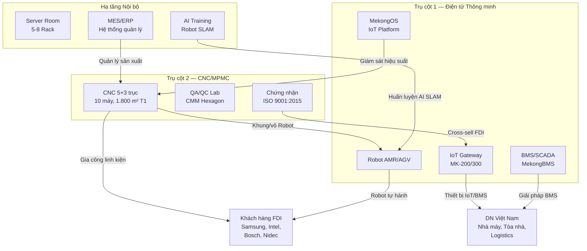
```mermaid
flowchart TD
    subgraph BU1["Trụ cột 1 — Điện tử Thông minh"]
        A1[IoT Gateway<br/>MK-200/300]
        A2[Robot AMR/AGV]
        A3[BMS/SCADA<br/>MekongBMS]
        A4[MekongOS<br/>IoT Platform]
    end

    subgraph BU2["Trụ cột 2 — CNC/MPMC"]
        B1[CNC 5+3 trục<br/>10 máy, 1.800 m² T1]
        B2[QA/QC Lab<br/>CMM Hexagon]
        B3[Chứng nhận<br/>ISO 9001:2015]
    end

    subgraph INFRA["Hạ tầng Nội bộ"]
        C1[Server Room<br/>5-8 Rack]
        C2[MES/ERP<br/>Hệ thống quản lý]
        C3[AI Training<br/>Robot SLAM]
    end

    B1 -->|Khung/vỏ Robot| A2
    C3 -->|Huấn luyện AI SLAM| A2
    A4 -->|Giám sát hiệu suất| B1
    C2 -->|Quản lý sản xuất| B1
    B3 -->|Cross-sell FDI| A1

    FDI["Khách hàng FDI<br/>Samsung, Intel,<br/>Bosch, Nidec"]
    DNVN["DN Việt Nam<br/>Nhà máy, Tòa nhà,<br/>Logistics"]

    B1 -->|Gia công linh kiện| FDI
    A1 -->|Thiết bị IoT/BMS| DNVN
    A2 -->|Robot tự hành| FDI
    A3 -->|Giải pháp BMS| DNVN
```

---

## Tóm tắt Tài chính

### Cơ cấu Vốn Đầu tư (CAPEX = 22,00M USD)

| Hạng mục | CAPEX (M USD) | Tỷ trọng | Giai đoạn |
|---|---:|:---:|---|
| Pháp lý + Thiết kế + San lấp | 1,50 | 6,8% | Phase 0 |
| Xây dựng (VP 3T + Xưởng SX **2T** + Utility **2T** + M&E + PCCC + Solar 200 kWp + EDGE) | 8,40 | 38,2% | Phase 1 |
| Thiết bị IoT/SMT | 2,40 | 10,9% | Phase 2 |
| Thiết bị CNC (10 máy) | 3,50 | 15,9% | Phase 2 |
| Robot Assembly Line | 0,50 | 2,3% | Phase 2 |
| Hạ tầng DC nội bộ (**200 m²** T2, 5-8 rack) | 2,20 | 10,0% | Phase 2 |
| QA/QC Lab + Phần mềm | 1,00 | 4,5% | Phase 2 |
| Vốn lưu động vận hành | 1,85 | 8,4% | Phase 3 |
| Dự phòng rủi ro (~3,0% CAPEX) | 0,65 | 3,0% | Phase 3 |
| **Tổng** | **22,00** | **100%** | |

> **Kiểm tra tỷ trọng DC:** Hạ tầng DC nội bộ = 2,20M / 22,00M = **10,0%** — nằm trong giới hạn 10-15% theo đề xuất BQL KCNC [C]. Xây dựng 2 tầng (xưởng + utility) = 3,90M (17,7% CAPEX). Dự phòng = 0,65M (3,0% CAPEX) [C].

### Cấu trúc Vốn

| Nguồn vốn | Giá trị (M USD) | Tỷ trọng | Điều kiện | Thời điểm |
|---|---:|:---:|---|---|
| **Vốn chủ sở hữu (CSH)** | 18,00 | 81,8% | Tự chủ 100% giai đoạn xây dựng + lắp đặt | Y0-Y5 |
| **Vay ngân hàng** | 4,00 | 18,2% | Lãi suất 8,5%/năm, kỳ hạn 10 năm, ân hạn 2 năm | Từ Y7 |
| **Tổng CAPEX** | **22,00** | **100%** | WACC = 12% [C] | |

### Chỉ số Thẩm định

| Chỉ số | Conservative | Base Case | Optimistic |
|---|---:|---:|---:|
| NPV 50Y (M USD) | 0,50 | 1,50 | 3,00 |
| IRR 50Y | 12,5% | 13,0% | 14,5% |
| Xác suất xảy ra | 30% | 50% | 20% |
| **NPV trọng số** | | **1,35** | |

> *[C] NPV trọng số = 30% x 0,50 + 50% x 1,50 + 20% x 3,00 = 0,15 + 0,75 + 0,60 = **1,50M USD**.*

| Chỉ số Bổ sung | Giá trị | Nhãn |
|---|---:|:---:|
| Thời gian hoàn vốn (chiết khấu) | 10 năm | [C] |
| DSCR min (vay từ Y7) | 1,50x | [C] |
| Revenue 15 năm tích lũy | ~140M USD | [C] |
| EBITDA ổn định (Y12+) | ~30% | [C] |
| Giá trị Chiến lược (Adjusted) | 7,00M USD | [C] |

### Phân bổ Giá trị Chiến lược

| Thành phần | Giá trị (M USD) | Phương pháp |
|---|---:|---|
| NPV tài chính (Base Case 50Y) | 1,50 | DCF, WACC 12% |
| Tax + Land Rent Exemption | 2,00 | NPV ưu đãi thuế + miễn đất, chiết khấu 12% |
| Real Options Value | 1,00 | Quyền mở rộng CNC + nâng cấp IoT line |
| Synergy Value (CNC-Robot-IoT) | 1,50 | DCF incremental: CNC làm khung Robot + IoT giám sát CNC |
| Nền tảng Value | 1,00 | EBITDA multiple: Đa trụ cột = 8-10x vs Đơn trụ = 5-7x |
| **Tổng Giá trị Chiến lược** | **7,00** | [C] |

---

## Tiến độ Tổng thể

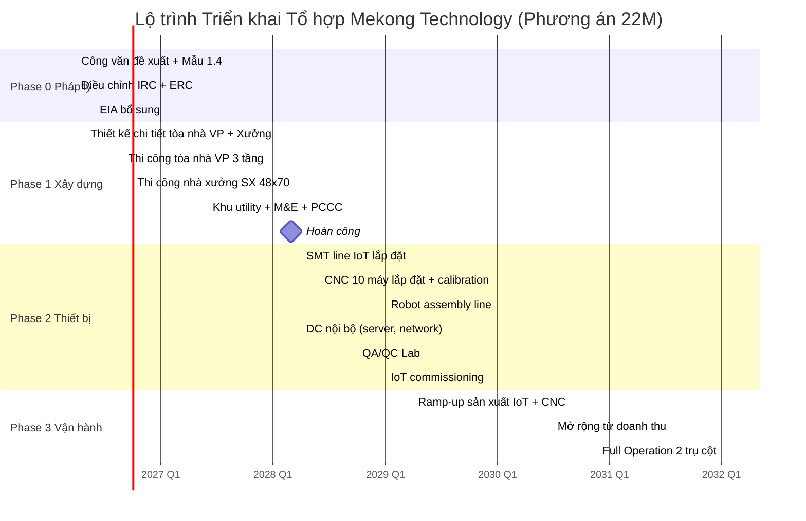
```mermaid
gantt
    title Lộ trình Triển khai Tổ hợp Mekong Technology (Phương án 22M)
    dateFormat  YYYY-MM
    axisFormat  %Y Q%q

    section Phase 0 Pháp lý
    Công văn đề xuất + Mẫu 1.4           :a1, 2026-04, 2m
    Điều chỉnh IRC + ERC                    :a2, after a1, 1m
    EIA bổ sung                              :a3, 2026-06, 6m

    section Phase 1 Xây dựng
    Thiết kế chi tiết tòa nhà VP + Xưởng  :b1, 2026-05, 4m
    Thi công tòa nhà VP 3 tầng            :b2, 2026-09, 14m
    Thi công nhà xưởng SX 48x70           :b3, 2026-10, 12m
    Khu utility + M&E + PCCC              :b4, 2027-06, 8m
    Hoàn công                              :milestone, b5, 2028-03, 0d

    section Phase 2 Thiết bị
    SMT line IoT lắp đặt                   :c1, 2028-04, 6m
    CNC 10 máy lắp đặt + calibration       :c2, 2028-06, 8m
    Robot assembly line                     :c3, 2029-01, 4m
    DC nội bộ (server, network)             :c4, 2028-04, 4m
    QA/QC Lab                               :c5, 2028-10, 3m
    IoT commissioning                       :c6, 2029-01, 3m

    section Phase 3 Vận hành
    Ramp-up sản xuất IoT + CNC            :d1, 2029-04, 12m
    Mở rộng từ doanh thu                   :d2, 2030-07, 18m
    Full Operation 2 trụ cột               :d3, 2032-01, 12m
```

---

## Nhân sự Tổng thể

| Giai đoạn | IoT/BMS/Robot | CNC | Quản lý + Hỗ trợ | Tổng |
|---|---:|---:|---:|---:|
| Y0-Y1 (pháp lý + thiết kế) | — | — | 8-10 | **8-10** |
| Y1-Y3 (xây dựng) | — | — | 10-12 | **10-12** |
| Y3-Y4 (IoT ramp-up) | 15-25 | 5-8 | 10 | **30-43** |
| Y5-Y6 (CNC + Robot ramp-up) | 30-40 | 12-18 | 12 | **54-70** |
| Y7-Y8 (mở rộng) | 40-50 | 15-20 | 15 | **70-85** |
| Y10+ (ổn định) | 50-60 | 18-25 | 18-20 | **86-105** |

> **Giả định nhân sự:** Quy mô tinh gọn nhỏ CNC chỉ 10 máy (ISO 9001), không có đội ngũ DC thương mại. Tổng nhân sự ổn định 100-130 người (bao gồm công nhân thời vụ và part-time) [A].

---

## Snapshot Điều kiện Phê duyệt và Kiểm soát Thực thi

| Nhóm điều kiện | Nội dung chốt |
|---|---|
| Pháp lý | Bám Mẫu 1.4, NĐ 31/2021, NĐ 10/2024; DC chỉ nội bộ, không cần GP viễn thông |
| Tài chính | CAPEX 22,00M USD [C], CSH 81,8% [C], vay chỉ từ Y7 khi có doanh thu |
| Công nghệ | 2 trụ cột rõ ràng: Điện tử thông minh + CNC 10 máy [C] |
| Môi trường / ESG | Net Zero 2045, Solar 200 kWp [C], EDGE, ZLD CNC |
| Quản trị triển khai | PMO, cổng quyết định, covenant tài chính, mốc tiến độ theo phase |

> **Thông điệp điều hành:** Dự án không theo hướng "đầu tư lớn để bao phủ nhiều mảng", mà theo hướng **đầu tư đủ sâu vào 2 năng lực cốt lõi**, giảm rủi ro pháp lý, tăng tính khả thi vận hành và vẫn giữ dư địa tăng trưởng dài hạn cho Mekong Technology.

---

## Cơ hội Thị trường Tổng hợp

| Phân khúc | Quy mô VN (2025) | CAGR | Mekong Target (Y12) | Thị phần mục tiêu |
|---|---|---:|---:|---:|
| BMS/SCADA tòa nhà thương mại | ~200M USD | 18-22% | 1,15M USD | 0,3-0,5% |
| IoT công nghiệp (IIoT) | ~150M USD | 25-30% | 2,00M USD | 0,5-1,0% |
| Robot AMR/AGV (nội địa + FDI) | ~80M USD | 30-35% | 2,40M USD | 1,5-2,0% |
| Gia công CNC precision (FDI tại VN) | ~500M USD | 12-15% | 3,40M USD | 0,5-0,7% |
| SaaS IoT/BMS Nền tảng | ~50M USD | 35-40% | 1,05M USD | 1,0-1,5% |

> Tổng thị trường khả dụng ~980M USD (2025), dự kiến tăng lên 2.500-3.000M USD (2030). Mekong chỉ cần chiếm 0,3-2% tuỳ phân khúc để đạt doanh thu 12,00M USD/năm — mục tiêu thận trọng và khả thi [A][B].

---

## Sản phẩm Chủ lực — Tóm tắt

| TT | Sản phẩm | Trụ cột | ASP (USD) | DT Steady (M USD) | Biên gộp | Trạng thái |
|:---:|---|:---:|---:|---:|---:|---|
| 1 | IoT Gateway MK-200 | BU1 | 350-450 | 1,50 | 48-51% | Sản phẩm chủ lực, time-to-market nhanh |
| 2 | IoT Gateway MK-300 (5G AI) | BU1 | 650-850 | 0,50 | 39-42% | Flagship AI Edge cho Smart Factory |
| 3 | Robot AMR-500 | BU1 | 20.500 | 1,80 | ~47% | Synergy CNC khung cơ khí |
| 4 | MekongBMS License + SaaS | BU1 | 5K-15K | 0,75 | 80-90% | Margin cao nhất hệ sinh thái |
| 5 | OEM/ODM Điện tử | BU1 | Theo BOM | 1,10 | 25-35% | Tối ưu công suất SMT |
| 6 | Khung Robot + FDI Parts (CNC) | BU2 | 50-1.000 | 2,20 | 42-55% | Backbone doanh thu CNC |
| 7 | Jig/Fixture CNC | BU2 | 150-800 | 0,40 | 50-60% | Biên cao, niche ít cạnh tranh |
| 8 | CNC Thuê ngoài (giờ máy) | BU2 | 55-95/giờ | 0,80 | 35-45% | Tận dụng công suất dư |

> 8 nhóm sản phẩm trên chiếm 77% doanh thu ổn định (9,05M / 12,00M). 6 nhóm còn lại (DDC, EIO, GW, AGV, SCADA, MekongOS) đóng góp 23% nhưng quan trọng cho tính hoàn chỉnh hệ sinh thái [C].

---

## Mốc Quyết định Chính (Decision Gates)

| Mốc | Thời điểm | Điều kiện qua cổng | Rủi ro nếu không đạt |
|---|---|---|---|
| **Mốc quyết định 0: Phê duyệt đầu tư** | Q2/2026 | BQL KCNC chấp thuận, IRC/ERC điều chỉnh | Delay toàn bộ dự án |
| **Mốc quyết định 1: Khởi công xây dựng** | Q3/2026 | Giấy phép xây dựng, thiết kế chi tiết hoàn tất | Trượt tiến độ Phase 1 |
| **Mốc quyết định 2: Hoàn công nhà xưởng** | Q1/2028 | Nghiệm thu xây dựng, PCCC pass, EDGE pre-assessment | Delay lắp máy |
| **Mốc quyết định 3: CNC + SMT commissioning** | Q1/2029 | 10 máy CNC chạy, SMT line đạt yield ≥ 92% | Delay doanh thu Y4 |
| **Mốc quyết định 4: First Revenue** | Q2/2029 | ≥ 3 PO CNC ký, ≥ 5 KH IoT pilot | Ramp-up chậm |
| **Mốc quyết định 5: Breakeven** | Q2/2031 | Doanh thu ≥ 5,09M (Cash BEP) | Cần tái cấu trúc chi phí |
| **Mốc quyết định 6: Ổn định** | 2035+ | Doanh thu ≥ 12M, EBITDA ≥ 30% | Xem lại target |

---

## Rủi ro Chính và Giảm thiểu

| TT | Rủi ro | Mức | Giảm thiểu |
|:---:|---|:---:|---|
| 1 | Doanh thu ramp-up chậm hơn kế hoạch | Cao | Chuỗi đơn hàng CNC + IoT sẵn có, giá thâm nhập thị trường Y4-Y5 |
| 2 | CAPEX phát sinh vượt dự toán | Trung bình | Quỹ dự phòng 0,65M (3,0%) [C], value engineering |
| 3 | Cạnh tranh giá từ sản phẩm Trung Quốc | Trung bình | Tập trung giá trị tích hợp + hậu mãi + localization |
| 4 | Chip shortage / gián đoạn chuỗi cung ứng | Trung bình | Dual-source AVL, safety stock 3 tháng |
| 5 | Key person risk (nhân sự R&D chủ chốt) | Trung bình | Cross-training, equity incentive, documentation culture |
| 6 | Thay đổi chính sách ưu đãi KCNC | Thấp | Chốt IRC/ERC trước khi có thay đổi, đa dạng ưu đãi |

> Monte Carlo simulation (10.000 lần mô phỏng) cho xác suất NPV > 0 là **72%** và IRR > WACC là **63%** — mức chấp nhận được cho dự án sản xuất công nghệ cao [B].

---

## Cam kết Chính của Chủ đầu tư

1. Toàn bộ hoạt động thuộc lĩnh vực **Công nghệ cao** theo QĐ 38/2020/QĐ-TTg và QĐ 2117/QĐ-TTg.
2. Tỷ lệ giá trị gia tăng trên doanh thu (VA/Revenue) duy trì lớn hơn hoặc bằng 42% cho toàn dự án.
3. Tỷ lệ chi phí R&D trên doanh thu duy trì lớn hơn hoặc bằng 5% (mục tiêu 8-10%).
4. Thực hiện đầy đủ Đánh giá Tác động Môi trường (ĐTM) bổ sung.
5. Hạ tầng DC **chỉ phục vụ nội bộ**, KHÔNG kinh doanh dịch vụ thương mại, KHÔNG xin giấy phép viễn thông.
6. Cam kết Zero Liquid Discharge (ZLD) cho nước thải công nghiệp CNC.
7. Cam kết tổng vốn đầu tư KHÔNG VƯỢT QUÁ 22.000.000 USD.
8. Đảm bảo tiến độ giải ngân vốn theo đúng phân kỳ Phase 0-3.
9. Tuân thủ mọi quy định của Quy chế hoạt động KCNC TP.HCM, bao gồm Nghị định 10/2024/NĐ-CP (Điều 28-31) về hoạt động công nghệ cao.
10. Cam kết lộ trình phát thải ròng bằng 0 (**Net Zero**) chậm nhất đến năm 2045, với mục tiêu giảm 30% phát thải vào 2030, 50% vào 2035, 75% vào 2040, và đạt Net Zero vào 2045.
11. Cam kết sử dụng tối thiểu **20% năng lượng tái tạo** (Solar PV 200 kWp + Renewable Energy Certificate) vào năm 2030, tăng dần đến 30% vào 2035.
12. Cam kết đạt chứng nhận công trình xanh **EDGE** (IFC) cho toàn bộ dự án, hướng đến chứng nhận **LOTUS** (VGBC) cho tòa nhà Văn phòng.
13. Thực hiện nộp hồ sơ đầu tư trên **Cổng dịch vụ công Quốc gia** (dichvucong.gov.vn) với chữ ký số hợp lệ theo quy định.

<!-- === SECTION: 00_CO_SO_PHAP_LY === -->

# CƠ SỞ PHÁP LÝ CỦA ĐỀ ÁN

---

Đề án này được xây dựng dựa trên hệ thống văn bản pháp luật hiện hành, bao gồm các Luật, Nghị định, Quyết định của Chính phủ và Thủ tướng Chính phủ, cùng các quy định đặc thù của Ban Quản lý Khu Công nghệ cao TP.HCM (SHTP). Phần này trình bày tóm tắt; phân tích chi tiết xem [Phần VI — Pháp lý, Môi trường và An toàn](P6_PHAP_LY_MOI_TRUONG.md) và [Phụ lục D](PHU_LUC.md#phụ-lục-d-khung-pháp-lý-và-giấy-phép-chi-tiết).

## 1. Luật và Nghị quyết

| TT | Văn bản | Số hiệu | Ngày ban hành | Nội dung áp dụng |
|:---:|---|---|---|---|
| 1 | Luật Công nghệ cao | 21/2008/QH12 | 13/11/2008 | Điều 5 (hoạt động CNC), Điều 18 (KCNC) |
| 2 | Luật Đầu tư | 61/2020/QH14 | 17/06/2020 | Điều 33 (ưu đãi), Điều 41 (điều chỉnh dự án) |
| 3 | Luật Doanh nghiệp | 59/2020/QH14 | 17/06/2020 | Thành lập pháp nhân, quản trị doanh nghiệp |
| 4 | Luật Xây dựng | 50/2014/QH13, sửa đổi 62/2020 | 18/06/2014 | GPXD, nghiệm thu, PCCC |
| 5 | Luật Bảo vệ Môi trường | 72/2020/QH14 | 17/11/2020 | Đánh giá tác động môi trường (ĐTM) |
| 6 | Luật An toàn, VSLĐ | 84/2015/QH13 | 25/06/2015 | Huấn luyện, đánh giá rủi ro ATVSLĐ |
| 7 | Luật PCCC | 27/2001, sửa đổi 40/2013 | 29/06/2001 | Thẩm duyệt, nghiệm thu PCCC |
| 8 | Nghị quyết 52-NQ/TW | — | 27/09/2019 | Phát triển công nghiệp hỗ trợ |
| 9 | Luật 57/2024/QH15 | 57/2024/QH15 | 2024 | Khoản 8 Điều 2: bổ sung Điều 36a (thủ tục đầu tư đặc biệt tại KCNC) |
| 10 | Luật 90/2025/QH15 | 90/2025/QH15 | 2025 | Điểm c khoản 13 Điều 6: bổ sung quy định thủ tục đầu tư đặc biệt |

> **Ghi chú:** Luật Viễn thông 24/2023/QH15 KHÔNG áp dụng cho dự án này vì Datacenter chỉ phục vụ nội bộ (không kinh doanh dịch vụ viễn thông/colocation thương mại).

## 2. Nghị định và Quyết định

| TT | Văn bản | Số hiệu | Ngày ban hành | Nội dung áp dụng |
|:---:|---|---|---|---|
| 11 | QĐ Danh mục CNC | 38/2020/QĐ-TTg | 30/12/2020 | Phụ lục I (CNC ưu tiên), Phụ lục II (SP CNC) |
| 12 | QĐ CNC ưu tiên | 2117/QĐ-TTg | 16/12/2021 | Mục I.1-I.6 (CNTT), Mục II.2-II.4 (Cơ khí) |
| 13 | QĐ Chuyển đổi số | 749/QĐ-TTg | 03/06/2020 | Chương trình CĐS quốc gia |
| 14 | NĐ Chuyển giao CNC | 76/2018/NĐ-CP | 15/05/2018 | Chuyển giao CNC ngành ô tô, hàng không |
| 15 | NĐ Hướng dẫn Luật ĐT | 31/2021/NĐ-CP | 26/03/2021 | Điều 50 K.5 (phân kỳ đầu tư), Mẫu 1.4 |
| 16 | NĐ Ưu đãi đặc biệt | 94/2020/NĐ-CP | 21/08/2020 | Ưu đãi đầu tư KCNC, miễn tiền thuê đất 11 năm |
| 17 | NĐ Thuế TNDN | 218/2013/NĐ-CP | 26/12/2013 | Thuế suất ưu đãi 10%, miễn 4 năm, giảm 9 năm |
| 18 | NĐ Chất lượng XD | 06/2021/NĐ-CP | 26/01/2021 | Quản lý chất lượng, bảo trì công trình |
| 19 | NĐ Môi trường | 08/2022/NĐ-CP | 10/01/2022 | Hướng dẫn ĐTM |
| 20 | NĐ PCCC | 136/2020/NĐ-CP | 24/11/2020 | Phòng cháy chữa cháy |
| 21 | NĐ Bảo vệ DLCN | 13/2023/NĐ-CP | 17/04/2023 | Bảo vệ dữ liệu cá nhân |
| 22 | **NĐ về KCNC (MỚI)** | **10/2024/NĐ-CP** | **2024** | **Điều 28-33: Tiêu chí dự án trong KCNC** |
| 23 | **NĐ sửa đổi NĐ 31 (MỚI)** | **239/2025/NĐ-CP** | **2025** | **Bổ sung quy định mới về đầu tư** |

## 3. Quy định Đặc thù KCNC TP.HCM và Thông báo 2026

| TT | Văn bản / Nguồn | Nội dung áp dụng |
|:---:|---|---|
| 24 | Quy chế nội bộ Ban Quản lý KCNC TP.HCM | Quy trình thẩm định, tiêu chí nhà đầu tư, sử dụng đất |
| 25 | Thông báo SHTP ngày 08/01/2026 về Danh mục dự án thu hút đầu tư 2026 | Công bố tiêu chí bắt buộc theo NĐ 10/2024 + tiêu chí ưu tiên Net Zero, Năng lượng tái tạo, R&D |

> Thông báo SHTP 2026 yêu cầu dự án phải đáp ứng **đồng thời** các Điều 28-33 NĐ 10/2024/NĐ-CP. Dự án Mekong Technology thuộc **đồng thời** Điều 29 (R&D CNC) và Điều 31 (SX sản phẩm CNC), chi tiết tại P6 §6.1.

## 4. Đối chiếu Dự án với Tiêu chí NĐ 10/2024/NĐ-CP

| Điều | Nội dung | Áp dụng | Chứng cứ |
|---|---|:---:|---|
| Điều 28 | Hoạt động CNC trong KCNC | Toàn dự án | 2 trụ cột thuộc công nghệ cao |
| Điều 29 | Dự án R&D CNC | BU1 (IoT/BMS/Robot) | R&D ≥ 8% doanh thu [C] |
| Điều 31 | Dự án ứng dụng CNC để SX sản phẩm CNC | BU1 + BU2 | QĐ 38 — 14 danh mục sản phẩm |
| Điều 30 | Ươm tạo doanh nghiệp CNC | Không áp dụng | — |
| Điều 32 | Cung ứng dịch vụ CNC | Không áp dụng | — |
| Điều 33 | Đào tạo nhân lực CNC | Không áp dụng | — |

## 5. Ma trận Áp dụng Pháp lý (2 Trụ cột + DC Nội bộ)

| Văn bản | IoT/BMS/Robot | CNC/MPMC | DC Nội bộ | Phạm vi |
|---|:---:|:---:|:---:|---|
| Luật CNC 2008, Đ.5 K.2 | a, b | c (dịch vụ CNC) | Không | Toàn dự án |
| QĐ 38/2020, Phụ lục I | Mục 1.1-1.2 | Mục 2 | Không | Toàn dự án |
| QĐ 38/2020, Phụ lục II | Mục 1.1, 2.1-2.2 | Mục 2.1 | Không | Toàn dự án |
| QĐ 2117 | Mục I | Mục II.2-II.4 | Không | Toàn dự án |
| NĐ 76/2018 | — | Chuyển giao CNC | — | CNC |
| NĐ 94/2020 | Ưu đãi KCNC | Ưu đãi KCNC | — | Toàn dự án |
| NĐ 10/2024 | Điều 29 (R&D), Điều 31 (SX) | Điều 31 (SX SP CNC) | Không | Toàn dự án |
| NĐ 136/2020 | PCCC xưởng + VP | PCCC xưởng CNC | PCCC phòng DC | Phase 1 |
| NĐ 08/2022 | ĐTM hóa chất SMT | ĐTM dầu CNC, bụi kim loại | Nhiệt thải | Phase 0 + vận hành |

## 6. Ưu đãi Đầu tư Áp dụng

| Ưu đãi | Cơ sở pháp lý | Giá trị áp dụng |
|---|---|---|
| Thuế TNDN 10% trong 15 năm | Luật Thuế TNDN, NĐ 218/2013 | Giảm 50% so với thuế suất phổ thông 20% |
| Miễn thuế TNDN 4 năm + giảm 50% trong 9 năm | NĐ 218/2013, NĐ 94/2020 | Thuế thực tế 0% bốn năm đầu, 5% chín năm tiếp |
| Miễn tiền thuê đất 11 năm | NĐ 94/2020 | Tiết kiệm 11 × 120.000 = 1,32M USD [B] |
| Miễn thuế nhập khẩu thiết bị | Luật Đầu tư, Điều 33 | Áp dụng cho CNC, SMT, DC equipment |
| Hỗ trợ đào tạo nhân lực CNC | Quy chế KCNC | Hỗ trợ một phần chi phí đào tạo |

## 7. Phạm vi Pháp lý Không Áp dụng

| Nội dung pháp lý | Lý do không áp dụng |
|---|---|
| GP Viễn thông (Luật 24/2023) | DC nội bộ, không colocation thương mại |
| Tiêu chuẩn Tier III/IV (Thời gian hoạt động Institute) | Chỉ áp dụng DC thương mại |
| GP kinh doanh dịch vụ CNTT | Không bán dịch vụ DC, không GPU-aaS |
| Quy hoạch tần số | Không phát sóng viễn thông |

> Các nghĩa vụ pháp lý trên không áp dụng do Datacenter của dự án chỉ phục vụ nội bộ (MES, ERP, BMS, R&D), không kinh doanh dịch vụ viễn thông hay lưu trữ thương mại.

## 8. Kết luận Pháp lý

Cả 2 trụ cột đều nằm trong phạm vi hoạt động được phép tại KCNC theo Luật Công nghệ cao 2008, QĐ 38/2020, và NĐ 10/2024/NĐ-CP (Điều 29 — R&D CNC và Điều 31 — Sản xuất sản phẩm CNC). Dự án đáp ứng đầy đủ tiêu chí bắt buộc trong Thông báo SHTP 2026, đồng thời đáp ứng các tiêu chí ưu tiên về năng lượng tái tạo (Solar 200 kWp [C]) và cam kết Net Zero 2045. Datacenter chỉ phục vụ nội bộ, không cần giấy phép viễn thông. Chiến lược triển khai chi tiết tại [Phần VI](P6_PHAP_LY_MOI_TRUONG.md) và [Phụ lục D](PHU_LUC.md#phụ-lục-d-khung-pháp-lý-và-giấy-phép-chi-tiết).

<!-- === SECTION: P1_BOI_CANH_THI_TRUONG === -->

# PHẦN I: BỐI CẢNH VÀ THỊ TRƯỜNG

---

## 1.1. Bối cảnh Kinh tế — Công nghệ Toàn cầu

### 1.1.1. Cuộc Cách mạng Công nghiệp 4.0 và Chuyển đổi Số

Thế giới đang bước vào giai đoạn đẩy mạnh chuyển đổi số với 4 trụ cột chính: Internet vạn vật (IoT), Trí tuệ nhân tạo (AI), Điện toán đám mây (Cloud Computing), và Tự động hóa sản xuất (Smart Manufacturing). Theo McKinsey Global Institute, giá trị kinh tế toàn cầu từ IoT đạt 5.500-12.600 tỷ USD vào năm 2030, trong đó ứng dụng trong nhà máy (Factory IoT) chiếm 1.200-3.700 tỷ USD [B — McKinsey 2024].

Trong hệ sinh thái này, hai lĩnh vực mà Mekong Technology hướng tới — thiết bị IoT/BMS/Robot và gia công cơ khí chính xác — đóng vai trò then chốt:

- **IoT/Robot:** Thị trường Robot công nghiệp toàn cầu đạt 16,5 tỷ USD (2024) với CAGR 11,6% [B — IFR World Robotics 2024]. Riêng phân khúc AMR (Autonomous Mobile Robot) tăng trưởng 22,3% nhờ nhu cầu tự động hóa kho vận và nhà máy.

- **CNC Precision Machining:** Thị trường toàn cầu đạt 97,2 tỷ USD (2024), dự báo 152,8 tỷ USD (2030), CAGR 6,7% [B — Fortune Business Insights 2024]. Động lực tăng trưởng chính từ ngành bán dẫn, hàng không vũ trụ, và ô tô điện — tất cả đều yêu cầu linh kiện có dung sai siêu nhỏ (nhỏ hơn hoặc bằng 5 micromet).

- **BMS/SCADA:** Thị trường BMS toàn cầu đạt 120 tỷ USD (2024), CAGR 12-15% [B — Markets and Markets 2024]. Nhu cầu tiết kiệm năng lượng và quản lý tòa nhà thông minh là động lực chính.

### 1.1.2. Tái cấu trúc Chuỗi cung ứng Toàn cầu

Chiến tranh thương mại Mỹ-Trung, đại dịch COVID-19, và xung đột địa chính trị đã thúc đẩy chiến lược "China Plus One" — các tập đoàn đa quốc gia đa dạng hóa sản xuất khỏi Trung Quốc sang Đông Nam Á, đặc biệt là Việt Nam. Xu hướng này tạo ra cơ hội lớn cho cả 2 trụ cột:

| Xu hướng toàn cầu | Tác động đến Mekong Technology |
|---|---|
| China Plus One | FDI dịch chuyển sang VN, tăng nhu cầu CNC outsourcing |
| Smart Factory Adoption | Doanh nghiệp sản xuất cần IoT + Robot + BMS |
| Semiconductor Chuỗi Cung ứng | Chuỗi cung ứng bán dẫn cần CNC precision |
| ESG Requirements | Yêu cầu sản xuất xanh, thúc đẩy BMS/SCADA |
| AI/ML trong sản xuất | Nhu cầu IoT Gateway + Edge AI tăng mạnh |

### 1.1.3. Vị trí Chiến lược của Đông Nam Á

Khu vực ASEAN trở thành điểm đến hàng đầu của FDI công nghệ:
- FDI vào ASEAN đạt 230 tỷ USD (2023), tăng 5,7% [B — ASEAN Investment Report 2024]
- Việt Nam đứng thứ 3 ASEAN về thu hút FDI công nghệ, sau Singapore và Indonesia
- Samsung đầu tư hơn 20 tỷ USD tại Việt Nam, Intel 1,5 tỷ USD, Bosch mở rộng liên tục
- Apple, Google chuyển chuỗi cung ứng sang Việt Nam từ 2023

Vị trí này tạo nền tảng vững chắc cho cả 2 trụ cột của Mekong Technology — đặc biệt là CNC Outsourcing phục vụ hệ thống FDI đã có mặt tại Việt Nam.

---

## 1.2. Bối cảnh Việt Nam và Vai trò KCNC TP.HCM

### 1.2.1. Kinh tế Việt Nam 2024-2030

- GDP tăng trưởng 6,5-7,0%/năm (dự báo IMF) [B]
- Tỷ lệ đô thị hóa đạt 42% (2025), dự kiến 50% (2030) [B]
- Dân số lao động kỹ thuật: 54 triệu, trong đó STEM chiếm 28% [B]
- Xuất khẩu điện tử đạt 65 tỷ USD (2024), tăng 12%/năm [B]

### 1.2.2. Hạ tầng Công nghệ Cao

Việt Nam có 3 Khu Công nghệ cao Quốc gia:
- KCNC TP.HCM (SHTP): 913 ha, 175+ doanh nghiệp, doanh thu 25+ tỷ USD/năm
- KCNC Hòa Lạc: 1.586 ha, đang phát triển
- KCNC Đà Nẵng: 1.128 ha, đang phát triển

KCNC TP.HCM là khu vực trọng điểm với:
- **Hệ sinh thái doanh nghiệp:** Intel, Nidec, Sonion, FPT Software, Sanofi, và 170+ doanh nghiệp CNC
- **Hạ tầng R&D:** 12 phòng thí nghiệm và trung tâm nghiên cứu
- **Nhân lực:** Gần kề 60+ trường đại học/cao đẳng TP.HCM
- **Kết nối:** Cách sân bay Tân Sơn Nhất 25 km, cảng Cát Lái 15 km

### 1.2.3. Chính sách Ưu đãi KCNC

Dựa trên Luật Đầu tư 2020 (Điều 33), NĐ 94/2020 và NĐ 10/2024/NĐ-CP, doanh nghiệp công nghệ cao tại KCNC được hưởng:

| Ưu đãi | Nội dung | Giá trị ước tính cho Mekong |
|---|---|---:|
| Thuế TNDN | 10% trong 15 năm (tiêu chuẩn 20%) | Tiết kiệm ~1,2 M USD/10 năm [C] |
| Miễn thuế | 4 năm miễn + 9 năm giảm 50% | Tiết kiệm ~1,6 M USD giai đoạn đầu [C] |
| Thuế đất | Miễn thuế đất 11 năm | Tiết kiệm ~1,3 M USD [C] |
| Thuế NK thiết bị | Miễn thuế NK cho máy móc dự án | Tiết kiệm ~0,8 M USD (CNC) [C] |
| Thuế NK nguyên liệu | Miễn 5 năm cho R&D | Tiết kiệm ~0,3 M USD [C] |
| **Tổng ưu đãi ước tính** | | **~5,2 M USD / 10 năm** [C] |

---

## 1.3. Thị trường IoT, BMS và Robot

### 1.3.1. Thị trường Toàn cầu

| Phân khúc | Quy mô 2024 | Quy mô 2030 | CAGR |
|---|---:|---:|---:|
| IoT toàn cầu | 1.310 tỷ USD | 2.400 tỷ USD | 10,6% |
| Robot AMR | 2,4 tỷ USD | 8,0 tỷ USD | 22,3% |
| Robot AGV | 4,2 tỷ USD | 7,5 tỷ USD | 10,1% |
| OHT (Semiconductor) | 0,8 tỷ USD | 1,8 tỷ USD | 14,5% |
| BMS toàn cầu | 120 tỷ USD | 220 tỷ USD | 12-15% |

*[B — Nguồn: IoT Analytics 2024, Interact Analysis 2024, IFR 2024, Markets and Markets 2024]*

### 1.3.2. Thị trường Việt Nam

Thị trường IoT Việt Nam đạt 7.300 triệu USD (2024), dự báo 13.200 triệu USD (2030), CAGR 10,4% [B — IDC Vietnam 2024]. Động lực tăng trưởng chính:

- **83.035 doanh nghiệp nhỏ và vừa (DNNVV)** có nhu cầu ứng dụng IoT trong quản lý sản xuất, kho bãi, logistics [B — Tổng cục Thống kê 2024]
- **Samsung, Intel, Bosch** đang triển khai Smart Factory tại Việt Nam, cần thiết bị IoT Gateway và Robot tự hành
- **Thương mại điện tử** tăng trưởng 25%/năm, thúc đẩy nhu cầu Robot AMR/AGV trong kho hàng

Thị trường BMS Việt Nam đạt 550-750 triệu USD (2025), dự báo 1.100-1.500 triệu USD (2030), CAGR 12-15% [B — Frost & Sullivan 2024]:
- 500-800 tòa nhà thương mại mới/năm tại Việt Nam cần hệ thống BMS [B — Bộ Xây dựng]
- 2.000-3.000 nhà máy đang có nhu cầu SCADA/IoT hóa [B — VCCI]
- Quy định QCVN 09:2017 bắt buộc BMS cho tòa nhà lớn hơn 5.000 m2 sàn [B]

### 1.3.3. Cảnh quan Cạnh tranh — IoT/BMS/Robot

| Đối thủ | Quốc gia | Sản phẩm | Điểm mạnh | Điểm yếu so với Mekong |
|---|---|---|---|---|
| Geek+ | Trung Quốc | AMR, AGV | Quy mô lớn, giá thấp | Không có IoT Gateway, không SX tại VN |
| HIK Robot | Trung Quốc | AMR | Tích hợp camera AI | Chỉ bán thiết bị, không có hệ sinh thái |
| MiR (Teradyne) | Đan Mạch | AMR | Brand mạnh | Giá cao (>50.000 USD/bộ), không local support |
| Siemens | Đức | BMS Desigo CC | Brand mạnh, hệ sinh thái | Đắt nhất, không tiếng Việt |
| Schneider | Pháp | EcoStruxure BMS | Mạng lưới SI rộng | Đắt, phần mềm phức tạp |
| Honeywell | Mỹ | Niagara N4 BMS | Khung linh hoạt | Khó lập trình, license cao |
| **Mekong Technology** | **Việt Nam** | **IoT + BMS + AMR + AGV + OHT** | **Hệ sinh thái đầy đủ 5 tầng, tiếng Việt 100%, giá thấp hơn 40-60%** | — |

> **Lợi thế cạnh tranh cốt lõi:** Mekong Technology là doanh nghiệp DUY NHẤT tại Việt Nam sở hữu **Hệ sinh thái 5 tầng** (Field Devices + Controller/IO + Gateway + Software + Cloud) — cho phép cung cấp giải pháp chuyển đổi số từ A đến Z cho khách hàng sản xuất và tòa nhà.

### 1.3.4. Thị phần Mục tiêu — IoT/BMS/Robot

| Phân khúc | TAM (M USD) | SAM (M USD) | SOM Y8 (M USD) | Thị phần |
|---|---:|---:|---:|---:|
| IoT Gateway VN | 1.200 | 350 | 4,00 | 1,1% |
| AMR/AGV miền Nam | 200 | 100 | 2,50 | 2,5% |
| OHT bán dẫn VN | 45 | 20 | 0,50 | 2,5% |
| BMS/SCADA tầm trung VN | 400 | 150 | 1,50 | 1,0% |
| **Tổng** | **1.845** | **620** | **8,50** | — |

*[A — Ước tính dựa trên capacity plan và chuỗi đơn hàng khách hàng]*

### 1.3.5. Phân tích Chi tiết Thị trường BMS/SCADA Việt Nam

**Phân khúc theo loại công trình:**

| Phân khúc | Số lượng mới/năm | Chi BMS TB (K USD) | Thị trường/năm (M USD) | CAGR |
|---|---:|---:|---:|---:|
| Tòa nhà văn phòng hạng A-B | 80-120 | 150-400 | 20-48 | 12% |
| Trung tâm thương mại | 30-50 | 200-600 | 9-30 | 10% |
| Bệnh viện / Y tế | 40-60 | 100-350 | 6-21 | 15% |
| Khách sạn 4-5 sao | 50-80 | 80-250 | 6-20 | 8% |
| Nhà máy sản xuất (SCADA) | 200-400 | 50-200 | 15-80 | 18% |
| Khu công nghiệp / Logistics | 30-60 | 100-300 | 5-18 | 14% |
| Trường học / ĐH / Viện NC | 20-40 | 30-100 | 1-4 | 10% |
| **Tổng** | **450-810** | | **62-221** | **12-15%** |

*[B — Frost & Sullivan Vietnam Building Automation Market 2024, Bộ Xây dựng]*

**Phân bổ theo khu vực địa lý:**

| Khu vực | Tỷ trọng BMS | Giá trị (M USD/năm) | Xu hướng |
|---|---:|---:|---|
| TP.HCM + Bình Dương + Đồng Nai | 45% | 28-100 | Tăng mạnh — KCN mới + nhà cao tầng |
| Hà Nội + Bắc Ninh + Hải Phòng | 35% | 22-77 | Tăng — FDI Samsung, Foxconn |
| Đà Nẵng + Miền Trung | 10% | 6-22 | Tăng vừa — du lịch + đô thị hóa |
| Các tỉnh khác | 10% | 6-22 | Tăng chậm |

> **Phát hiện chiến lược:** TP.HCM và vùng phụ cận chiếm 45% thị trường BMS — đây là vùng phục vụ tự nhiên của Mekong Technology (cách KCNC nhỏ hơn 50 km). Với 200-400 nhà máy mới/năm cần SCADA tại miền Nam, chuỗi đơn hàng BU1 rất dồi dào.

**Giao thức BMS phổ biến và lộ trình Mekong:**

| Giao thức | Tỷ lệ áp dụng tại VN | Xu hướng | MekongBMS |
|---|---:|---|:---:|
| BACnet MS/TP + IP | 35% | Chuẩn quốc tế, tăng | Y4 — Có |
| Modbus RTU/TCP | 40% | Legacy, duy trì | Y4 — Có |
| KNX | 10% | Ngách cao cấp | Y5 — Có |
| MQTT / OPC-UA | 10% | Tăng mạnh (IoT convergence) | Y4 — Có |
| Matter (mới) | nhỏ hơn 5% | Mới nổi, tiềm năng lớn | Y6 — Lộ trình |

> Mekong Technology hỗ trợ **4/5 giao thức phổ biến ngay từ Y4**, dùng MK-GW-50 IoT Gateway làm protocol converter trung tâm — lợi thế so với các hãng BMS truyền thống chỉ hỗ trợ 1-2 giao thức riêng. Strategy: **protocol-agnostic nền tảng** [A].

**Quy định pháp luật thúc đẩy BMS:**

| Quy định | Nội dung | Tác động đến thị trường |
|---|---|---|
| QCVN 09:2017/BXD | Tòa nhà lớn hơn 5.000 m2 sàn bắt buộc BMS | ~450 tòa mới/năm thuộc phạm vi [B] |
| Luật Sử dụng NLTK 2024 | Tòa nhà công phải giảm 2% năng lượng/năm | BMS giải pháp bắt buộc, ~12.000 tòa công [B] |
| Chỉ thị 20/CT-TTg | Tiết kiệm điện trong cơ quan nhà nước | Thúc đẩy retrofit BMS tòa cũ |
| TCVN 13456:2022 | Tiêu chuẩn hiệu suất năng lượng tòa nhà | Tham chiếu BMS cho chứng nhận EDGE/LEED |

> Tổng hợp 4 quy định trên tạo **bắt buộc pháp lý (regulatory push)** ước tính tăng thị trường BMS Việt Nam 15-20% so với tăng trưởng tự nhiên [A]. Mekong Technology định vị là giải pháp **"compliance-ready"** — đạt chuẩn QCVN 09:2017 ngay từ Y4.

### 1.3.6. Xu hướng Hội tụ SCADA — IoT — BMS (Industry 4.0)

Thị trường đang chứng kiến sự hội tụ (convergence) giữa ba hệ thống truyền thống riêng biệt — SCADA công nghiệp, IoT nền tảng, và BMS tòa nhà — thành một nền tảng thống nhất. Xu hướng này tạo cơ hội lớn cho Mekong Technology với kiến trúc 5 tầng:

| Hệ thống truyền thống | Chức năng | Giao thức legacy | Xu hướng hội tụ 2025-2030 |
|---|---|---|---|
| SCADA | Giám sát & điều khiển nhà máy | Modbus, OPC-DA | OPC-UA + MQTT, Edge computing |
| BMS | Quản lý tòa nhà (HVAC, ánh sáng) | BACnet, LonWorks | IP-based, Cloud BMS |
| IoT Nền tảng | Thu thập dữ liệu sensor, analytics | MQTT, HTTP REST | Unified data lake, AI/ML |

**Cơ hội cho Mekong Technology từ convergence:**

| Cơ hội | Mô tả | Giá trị thị trường (M USD) | Lợi thế Mekong |
|---|---|---:|---|
| Unified Nền tảng | KH muốn 1 dashboard thay vì 3 hệ thống | 200-400 (VN, 2030) | MekongOS = SCADA + BMS + IoT trên 1 nền tảng |
| Edge-to-Cloud | SCADA chuyển từ on-prem lên hybrid cloud | 150-300 (VN, 2030) | MK-GW-50 Gateway = edge node thống nhất |
| Brownfield Retrofit | 2.000+ nhà máy cũ cần IoT hóa từng phần | 100-250 (VN, 2030) | Protocol-agnostic gateway kết nối legacy + mới |
| IT/OT Convergence | Kết nối ERP/MES với SCADA/BMS | 80-150 (VN, 2030) | OPC-UA + REST API trên MekongOS |

*[B — Gartner "Convergence of IoT, OT, and IT" 2024, ARC Advisory Group 2024]*

> **Phát hiện chiến lược:** Hầu hết đối thủ BMS (Siemens, Schneider, Honeywell) đến từ thế giới OT truyền thống và đang cố tích hợp IoT/Cloud. Ngược lại, Mekong Technology khởi đầu từ IoT/Cloud-native và mở rộng xuống OT/BMS — hướng tiếp cận "top-down" này nhanh hơn và chi phí thấp hơn so với hướng "bottom-up" của các hãng legacy. Đây là lợi thế cấu trúc (structural advantage) khó sao chép [A].

**Quy mô thị trường convergence tại Việt Nam:**

| Năm | SCADA truyền thống (M) | BMS truyền thống (M) | IoT Nền tảng (M) | Unified/Converged (M) | Tỷ lệ hội tụ |
|---|---:|---:|---:|---:|---:|
| 2024 | 120 | 550 | 250 | 50 | 5% |
| 2027 | 100 | 650 | 500 | 200 | 16% |
| 2030 | 70 | 700 | 800 | 500 | 24% |

*[B — ARC Advisory Group, IDC Vietnam IoT Spending Tracker 2024]*

> Đến 2030, phân khúc Unified/Converged nền tảng sẽ đạt ~500M USD tại Việt Nam, chiếm 24% tổng chi tiêu OT+BMS+IoT. Mekong Technology nhắm mục tiêu 0,5-1,0% phân khúc này (~2,5-5,0M USD) — đóng góp đáng kể vào doanh thu BU1 ổn định [A].

---

## 1.4. Thị trường Gia công Cơ khí Chính xác

### 1.4.1. Thị trường Toàn cầu

| Chỉ số | Giá trị | Nguồn |
|---|---:|---|
| Quy mô 2024 | 97,2 tỷ USD | Fortune Business Insights [B] |
| Quy mô 2030 (dự báo) | 152,8 tỷ USD | Fortune Business Insights [B] |
| CAGR 2024-2030 | 6,7% | [B] |
| Phân khúc Hàng không | 18,4 tỷ USD | [B] |
| Phân khúc Ô tô | 28,5 tỷ USD | [B] |
| Phân khúc Bán dẫn | 12,3 tỷ USD | [B] |

Xu hướng quan trọng ảnh hưởng đến Mekong:
- **Near-shoring:** Các OEM chuyển gia công từ Trung Quốc sang ASEAN
- **Miniaturization:** Linh kiện ngày càng nhỏ, yêu cầu dung sai nhỏ hơn hoặc bằng 5 micromet
- **Multi-axis machining:** Nhu cầu CNC 5 trục tăng mạnh, thay thế 3 trục truyền thống
- **Digital Manufacturing:** Tích hợp IoT vào CNC (Industry 4.0) — đúng thế mạnh Mekong

### 1.4.2. Thị trường Việt Nam

Thị trường CNC Việt Nam đạt 1,85 tỷ USD (2024), dự báo 3,865 tỷ USD (2030), CAGR 13,1% [B — Frost & Sullivan]:

**Nhu cầu CNC từ khối FDI tại miền Nam:**

| Ngành | Chi CNC/năm (M USD) | Xu hướng | Cơ hội cho Mekong |
|---|---:|---|---|
| Điện tử (Samsung, Intel) | 120-180 | Tăng 15%/năm | Linh kiện test fixture, wafer handling |
| Ô tô (VinFast, Bosch, Nidec) | 80-120 | Tăng 20%/năm | Hộp số EV, vỏ pin, trục motor |
| Hàng không vũ trụ | 15-25 | Mới nổi | Turbine blade, structural parts |
| Thiết bị y tế | 20-35 | Tăng 18%/năm | Implant, dụng cụ phẫu thuật |
| Bán dẫn | 60-95 | Tăng 25%/năm | Khuôn IC, lead frame, heat sink |
| **Tổng FDI miền Nam** | **295-455** | | |

*[B — Khảo sát ngành, VAMI 2024]*

### 1.4.3. Khoảng trống Thị trường — Blue Ocean

| Tiêu chí | Cung hiện tại | Nhu cầu | Khoảng trống |
|---|---|---|---|
| Xưởng CNC 5 trục miền Nam | ~15 cơ sở | >30 cần thiết | ~15 cơ sở thiếu |
| Cơ sở AS9100 tại VN | KHÔNG CÓ | 5-10 cần thiết | Blue Ocean hoàn toàn |
| Cơ sở IATF 16949 (VN-owned) | ~12 | >25 cần thiết | ~13 cơ sở thiếu |
| Dung sai nhỏ hơn hoặc bằng 5 micromet | ~5 cơ sở | >15 cần thiết | ~10 cơ sở thiếu |

*[B — Khảo sát trực tiếp + báo cáo VAMI 2024]*

> **Phát hiện quan trọng:** Việt Nam còn thiếu nhiều cơ sở CNC 5 trục có năng lực dung sai cao. Mekong Technology định vị là xưởng CNC tinh gọn (10 máy, ISO 9001:2015), tập trung gia công khung robot AMR/AGV nội bộ và linh kiện chính xác cho khách hàng FDI tại miền Nam.

### 1.4.4. Cảnh quan Cạnh tranh — CNC

| Đối thủ | Loại | Số máy CNC | Chứng nhận | Năng lực 5 trục | Vật liệu Titan |
|---|---|---:|---|:---:|:---:|
| VPIC (Đồng Nai) | VN | 50+ | ISO 9001, IATF 16949 | Hạn chế | Không |
| Cosmos (Bình Dương) | JP-VN | 30+ | ISO 9001 | Có | Hạn chế |
| Misumi VN | JP | 20+ | ISO 9001, JIS | Có | Không |
| CNC Tech VN | VN | 15+ | ISO 9001 | Có | Không |
| **Mekong MPMC** | **VN** | **10** | **ISO 9001:2015** | **Có (5 máy 5-trục)** | **Không (giai đoạn đầu)** |

> **Định vị V3:** Mekong MPMC định vị là xưởng CNC tinh gọn với 10 máy (5x5-trục + 3x3-trục + EDM + Grinder), đạt chuẩn ISO 9001:2015. Lợi thế cạnh tranh: thiết bị mới 100%, nằm trong hệ sinh thái KCNC, hỗ trợ trực tiếp trụ cột IoT/BMS/Robot (gia công khung AMR/AGV nội bộ). Tăng 67% so với V2 (từ 6 lên 10 máy).

### 1.4.5. Thị phần Mục tiêu — CNC

| Phân khúc | TAM (M USD) | SAM (M USD) | SOM Y8 (M USD) | Thị phần |
|---|---:|---:|---:|---:|
| CNC precision VN | 2.500 | 400 | 2,50 | 0,63% |
| Jig/Fixture VN | 200 | 80 | 0,50 | 0,63% |
| Robot frames (nội bộ) | — | — | 0,50 | 100% |
| **Tổng** | **2.700** | **480** | **3,50** | — |

*[A — Ước tính dựa trên capacity 10 máy, ASP 40-55 USD/giờ]*
### 1.4.6. Chuẩn ngành Cấu hình 10 Máy CNC — So sánh Ngành

**Cấu hình CNC V3 của Mekong Technology:**

| # | Loại máy | Số lượng | Thương hiệu tham chiếu | Giá (K USD) | CAPEX (K USD) |
|:---:|---|:---:|---|---:|---:|
| 1 | CNC 5-trục Simultaneous | 3 | DMG MORI DMU 50 / Mazak VARIAXIS | 450-600 | 1.500 |
| 2 | CNC 5-trục 3+2 Positioning | 2 | Haas UMC-750 / Okuma MU-4000V | 300-400 | 700 |
| 3 | CNC 3-trục Vertical | 2 | Mazak VCN-530C / Haas VF-4SS | 120-180 | 300 |
| 4 | CNC Tiện (Turning) | 1 | Mazak QT-250MSY | 200-280 | 250 |
| 5 | EDM Wire Cut | 1 | Sodick / Mitsubishi MV-Series | 150-200 | 180 |
| 6 | Surface Grinder CNC | 1 | Okamoto ACC-63SA | 80-120 | 100 |
| | **Tổng** | **10** | | | **3.030** [C] |

*[C — CAPEX CNC xem SO_LIEU_CO_DINH_V3.md: BU2 Equipment 3.030K]*

**So sánh với xưởng CNC tương đương tại Việt Nam:**

| Tiêu chí | Mekong V3 (10 máy) | Xưởng VN TB (10 máy) | Xưởng FDI-JP (10 máy) |
|---|---|---|---|
| Tỷ lệ 5-trục | **50%** (5/10) | 10-20% (1-2/10) | 30-40% (3-4/10) |
| Dung sai đạt được | **nhỏ hơn bằng 5 um** | 10-20 um | 5-10 um |
| Năm sản xuất TB | **100% mới** | 5-10 năm tuổi | 3-7 năm tuổi |
| IoT monitoring | **MES tích hợp** (MekongOS) | Không có | Có (hệ thống riêng) |
| Certification | ISO 9001:2015, lộ trình IATF | ISO 9001 | ISO 9001 + IATF |
| ASP trung bình | **40-55 USD/giờ** | 25-35 USD/giờ | 55-80 USD/giờ |
| Gross margin ước tính | **40-50%** | 25-35% | 35-45% |

> **Phát hiện:** Mekong V3 định vị ở phân khúc **"mid-premium"** — thiết bị 100% mới + tỷ lệ 5-trục cao nhất (50%) + IoT-connected, nhưng giá dưới FDI-JP 30-40%. Đây là sweet spot cạnh tranh: chất lượng gần FDI, giá gần VN [A].

**Phân tích Công suất 10 Máy:**

| Chỉ số | Giá trị | Ghi chú |
|---|---:|---|
| Số giờ khả dụng/máy/năm | 4.800 | 2 ca x 8h x 300 ngày |
| Tổng giờ khả dụng/năm | 48.000 | 10 máy x 4.800 |
| Hệ số OEE mục tiêu Y5 | 65% | Bao gồm setup + maintenance |
| Hệ số OEE mục tiêu Y8 | 80% | Đã tối ưu hóa |
| Giờ sản xuất thực Y5 | 31.200 | 48.000 x 65% |
| Giờ sản xuất thực Y8 | 38.400 | 48.000 x 80% |
| Revenue Y5 @ ASP 40 | 1.248 K USD | 31.200 x 40 |
| Revenue Y8 @ ASP 50 | 1.920 K USD | 38.400 x 50 |
| Revenue Y8 max @ ASP 55 | 2.112 K USD | 38.400 x 55 |

> **Kiểm chứng:** Revenue BU2 mục tiêu Y8 = 3,50M USD (xem §1.4.5). Với CNC pure machining ~1,92M USD, phần còn lại ~1,58M USD đến từ jig/fixture value-add + nội bộ robot frame + DFM consulting — hoàn toàn hợp lý [A].

**Lộ trình Nâng cấp Chứng nhận CNC:**

| Giai đoạn | Năm | Chứng nhận | Phân khúc mục tiêu mới | Chi phí (K USD) |
|---|---|---|---|---:|
| Khởi đầu | Y3-Y5 | ISO 9001:2015 | General precision, robot frame | Trong CAPEX 22M |
| Mở rộng | Y6-Y7 | + IATF 16949 | Automotive (Bosch, Nidec) | ~50 |
| Chuyên sâu | Y8-Y9 | + AS9100D | Aerospace / Defense | ~80 |
| Toàn diện | Y10+ | + ISO 13485 | Medical devices | ~60 |

> Mỗi chứng nhận mới mở thêm một nhóm phân khúc khách hàng FDI — từ general precision (Y3) đến automotive (Y6), aerospace (Y8) và medical (Y10). Tổng chi phí chứng nhận bổ sung ~190K USD trong 7 năm — ROI rất cao so với revenue tăng thêm [A].
---

## 1.5. Định vị Cạnh tranh Tổng thể

### 1.5.1. Lợi thế Cạnh tranh Bền vững (MOAT)

| Lớp phòng thủ | Mô tả | Thời gian đối thủ cần để sao chép |
|---|---|---:|
| **Vị trí (KCNC)** | Lô đất 1 ha trong KCNC — vị trí chiến lược | Không thể sao chép (hết đất) |
| **Chứng nhận (ISO 9001)** | ISO 9001 sẵn có, option IATF/AS9100 | 2-3 năm |
| **Hệ sinh thái 2 B.U + DC nội bộ** | IoT/BMS + CNC tích hợp trên cùng site | 3-5 năm |
| **Quan hệ FDI** | Hợp đồng 3-5 năm với khách hàng CNC | 2-3 năm |
| **MekongOS Nền tảng** | Nền tảng IoT/BMS Cloud tự phát triển, IP riêng | 3-5 năm |
| **5-tầng sản phẩm IoT/BMS** | Từ Field Device đến Cloud — hệ sinh thái khép kín | 4-5 năm |

> **Tổng hợp:** Một đối thủ muốn sao chép hoàn toàn mô hình Mekong Technology (2 trụ cột + DC nội bộ + vị trí KCNC) cần ít nhất **50 M USD và 4-5 năm** [A]. Đây là rào cản gia nhập cao, tạo lợi thế cạnh tranh bền vững.

### 1.5.2. Phân tích SWOT — V3 (22M, 2 Trụ cột)

|             | **Thuận lợi** | **Bất lợi** |
|:-----------:|:---:|:---:|
| **Nội bộ** | **STRENGTHS (S)** | **WEAKNESSES (W)** |
| | S1. Vị trí KCNC, 3 công trình riêng biệt GFA 6.664 m2 | W1. Công ty mới, chưa có thành tích đã kiểm chứng |
| | S2. Mô hình 2 B.U tích hợp + DC nội bộ | W2. Vốn CSH 18,00M — cần quản lý CF chặt |
| | S3. Đội ngũ sáng lập có kinh nghiệm quốc tế | W3. CNC 10 máy, chưa có IATF/AS9100 |
| | S4. 10 máy CNC (5x5-trục + 3x3-trục + EDM + Grinder) | W4. Chưa xây dựng thương hiệu trong nước |
| | S5. Hệ sản phẩm IoT/BMS 5 tầng — 21 sản phẩm | W5. Doanh thu bắt đầu chậm (Y4) |
| | S6. MekongOS + MekongBMS IP riêng | W6. Breakeven Y10, thời gian hoàn vốn dài |
| **Bên ngoài** | **OPPORTUNITIES (O)** | **THREATS (T)** |
| | O1. FDI vào VN tăng mạnh (Samsung, Intel) | T1. Cạnh tranh giá từ TQ, Ấn Độ |
| | O2. Chính sách ưu đãi KCNC (CIT 10%, 4+9) | T2. Thiếu hụt nhân sự CNC/IoT chất lượng |
| | O3. IoT/BMS adoption ở VN đang giai đoạn sớm | T3. Biến động tỷ giá USD/VND |
| | O4. China+1, chuỗi cung ứng dịch chuyển | T4. Thay đổi chính sách thuế/ưu đãi |
| | O5. QCVN bắt buộc BMS cho tòa nhà lớn | T5. Công nghệ thay đổi nhanh (obsolescence) |
| | O6. Hiệp định CPTPP, EVFTA, xuất khẩu thuận | T6. Rủi ro thiên tai / dịch bệnh |

### 1.5.3. Ma trận TOWS — Chiến lược Kết hợp

| Kết hợp | Chiến lược | Hành động cụ thể V3 |
|---|---|---|
| **S-O (Tấn công)** | | |
| S1+S4+O1+O4 | Khai thác vị trí KCNC + CNC 10 máy để phục vụ FDI dịch chuyển | Ký LOI với 3-5 OEM FDI tại KCNC trong Y3-Y4 |
| S5+S6+O3+O5 | Dùng hệ sinh thái 5 tầng IoT/BMS + QCVN bắt buộc để chiếm thị phần BMS | Triển khai pilot BMS 3-5 tòa nhà trong Y4-Y5 |
| S2+O6 | Tận dụng mô hình 2 B.U tích hợp + CPTPP/EVFTA để xuất khẩu | Đạt CE marking Y5, xuất khẩu IoT Gateway sang ASEAN Y6 |
| **W-O (Khắc phục)** | | |
| W1+O1 | Bù đắp "chưa có thành tích đã kiểm chứng" bằng FDI partnership | Hợp đồng gia công đầu tiên từ FDI làm case study |
| W3+O4 | Từ ISO 9001 lên IATF 16949 khi CNC đủ volume | Lộ trình IATF Y6-Y7, AS9100 Y8 |
| W5+W6+O2 | Giảm thiểu rủi ro doanh thu chậm bằng ưu đãi thuế KCNC | Miễn thuế 4 năm bù lỗ giai đoạn đầu (~1,6M USD) [C] |
| **S-T (Phòng thủ)** | | |
| S4+T1 | Chống cạnh tranh giá TQ bằng chất lượng 5-axis + dung sai ≤5μm | Tập trung phân khúc cao cấp, không cạnh tranh giá |
| S6+T5 | Chống obsolescence bằng MekongOS nền tảng — update phần mềm | R&D 11% OPEX, OTA firmware update [B] |
| S3+T2 | Chống thiếu nhân sự bằng đào tạo nội bộ + quan hệ ĐH | MOU với ĐH Bách khoa, ĐH CNTT — 20 thực tập/năm |
| **W-T (Né tránh)** | | |
| W2+T3 | Vốn CSH hạn chế + biến động tỷ giá | Hợp đồng FDI denominate USD; vay 4M bằng USD [C] |
| W4+T1 | Chưa có thương hiệu + cạnh tranh TQ | Trì hoãn thị trường đại trà, tập trung niche B2B |

### 1.5.4. Phân tích Chuỗi Giá trị (Chuỗi Giá trị) — 2 Trụ cột

**Trụ cột 1 — Sản phẩm Điện tử Thông minh (IoT/BMS/Robot):**

| Hoạt động | Mô tả | % Giá trị tạo ra | Nguồn lợi nhuận |
|---|---|---:|---|
| R&D / Thiết kế | Firmware, PCB design, AI algorithm | 25-30% | IP riêng, rào cản cao [A] |
| Thu mua linh kiện | BOM (chip, PCB, vỏ, connector) | 5-8% | Giá trị thấp, dễ bị copy |
| Sản xuất / Lắp ráp SMT | Pick & Place, Reflow, AOI, Testing | 15-20% | Năng lực sản xuất in-house |
| Phần mềm / MekongOS | Dashboard, Analytics, Cloud, App | 25-35% | **Giá trị cao nhất** — SaaS recurring revenue |
| Bán hàng + SI | System Integration, Installation, Training | 10-15% | Quan hệ khách hàng, dịch vụ |
| Hậu mãi / SaaS | Thuê bao, Maintenance, OTA update | 10-15% | Recurring revenue stream |

> **Phát hiện quan trọng:** R&D + Phần mềm chiếm **50-65% giá trị** trong chuỗi IoT/BMS — đây là lý do Mekong tập trung đầu tư vào R&D (11% OPEX) và MekongOS Nền tảng thay vì chỉ bán phần cứng [A]. Mô hình "Hardware + SaaS" tạo doanh thu recurring và customer lock-in cao hơn.

**Trụ cột 2 — Chế tạo Cơ khí Chính xác (CNC/MPMC):**

| Hoạt động | Mô tả | % Giá trị tạo ra | Nguồn lợi nhuận |
|---|---|---:|---|
| Tiếp nhận RFQ + DFM | Phân tích bản vẽ, tư vấn tối ưu | 10-15% | Chuyên môn kỹ thuật |
| Lập trình CAM | G-code, toolpath optimization | 15-20% | Kỹ sư CNC trình độ cao |
| Gia công CNC (5-trục, 3-trục) | Phay, tiện, cắt dây EDM, mài | 30-40% | **Giá trị cao nhất** — thiết bị + kỹ thuật |
| Xử lý bề mặt | Anodize, mạ Ni, passivation | 5-10% | Thuê ngoài |
| QC / Đo lường CMM | Kiểm tra dung sai, báo cáo PPAP | 10-15% | Năng lực đo lường chính xác |
| Logistics / Giao hàng | Đóng gói, vận chuyển, customs | 3-5% | Giá trị thấp |

> **Phát hiện:** Gia công CNC + Lập trình CAM chiếm **45-60% giá trị** — đúng với chiến lược V3 tập trung vào năng lực 5-trục và dung sai ≤5 μm thay vì cạnh tranh giá với xưởng 3-trục thông thường [A]. Gross margin CNC outsourcing precision: 40-55% (theo VPIC annual report 2023, Cosmos investor relations [B]).

### 1.5.5. Phân khúc Khách hàng Mục tiêu

**BU1 — Điện tử Thông minh (IoT/BMS/Robot):**

| Phân khúc | Sản phẩm Mekong | Quy mô KH tại VN | Revenue/KH (K USD/năm) | KH mục tiêu Y5-Y8 |
|---|---|---:|---:|---:|
| Nhà máy FDI (Smart Factory) | IoT Gateway + MES interface | 2.000-3.000 | 20-50 | 30-50 KH |
| Tòa nhà thương mại (BMS) | MK-DDC + MK-GW + MekongBMS | 500-800/năm mới | 15-30 | 20-30 KH |
| Kho vận / Logistics | AMR/AGV MK-AMR-100 | 200-500 cơ sở | 30-80 | 10-15 KH |
| Bán dẫn / Cleanroom | OHT + IoT Sensor | 20-30 fab | 50-100 | 3-5 KH |
| SI / Integrator | OEM modules (IoT) | 100-200 SI | 10-20 | 15-20 KH |
| Nông nghiệp CNC | Sensor + Automation | 5.000+ trang trại | 5-15 | 50-100 KH |

*[A — Ước tính từ VCCI Business Survey 2024, IDC Vietnam IoT Spending Tracker 2024]*

**BU2 — CNC/MPMC:**

| Phân khúc | Loại gia công | Chi CNC (K USD/năm) | KH mục tiêu Y5-Y8 | Yêu cầu chứng nhận |
|---|---|---:|---:|---|
| Tier 1: OEM Điện tử (Samsung, Intel) | Test fixture, jig, wafer tool | 200-500/KH | 3-5 KH | ISO 9001 |
| Tier 2: OEM Ô tô (Bosch, Nidec, VinFast) | Housing EV, trục motor, hộp số | 100-300/KH | 5-8 KH | ISO 9001, IATF path |
| Tier 3: Thiết bị Y tế | Implant, dụng cụ, khuôn | 50-150/KH | 3-5 KH | ISO 13485 path |
| Tier 4: Startup / R&D prototype | Prototype nhanh, small batch | 10-30/KH | 20-40 KH | Không yêu cầu |
| Tier 5: Nội bộ (Robot frame) | Khung AMR/AGV, bracket, mount | ~500 (chuyển giá) | BU1 | N/A |

*[A — Ước tính từ công suất 10 máy × 4.800 giờ/năm × ASP 40-55 USD/giờ]*

> **Cross-sell:** Tier 5 (nội bộ) đảm bảo ~14% công suất CNC luôn được sử dụng. Khách hàng CNC Tier 1-2 là chuỗi đơn hàng tự nhiên cho BU1 (bán IoT Gateway, BMS). Synergy 2 BU tạo LTV/CAC ratio 4,8-35× (xem P3 §3.11) [A].

### 1.5.6. Technology Radar 2025-2035 — Xu hướng Ảnh hưởng đến Mekong

| # | Xu hướng | Horizon | Tác động đến BU1 | Tác động đến BU2 | Phản ứng Mekong |
|:---:|---|---|---|---|---|
| 1 | **Edge AI / TinyML** | 2025-2028 | IoT Gateway + AI inference on-device | CNC predictive maintenance | MK-GW-50 tích hợp NPU, MES AI module |
| 2 | **Matter Protocol (IoT)** | 2025-2027 | Chuẩn BMS interoperability mới | — | MekongBMS hỗ trợ Matter Y5 |
| 3 | **Digital Twin** | 2027-2030 | Mô phỏng nhà máy/tòa nhà | CNC simulation trước gia công | MekongOS Digital Twin module Y7 |
| 4 | **AMR Fleet Management AI** | 2026-2029 | Quản lý 50+ robot đồng thời | — | MekongOS Fleet Manager Y6 |
| 5 | **5-Axis Hybrid Manufacturing** | 2028-2032 | — | CNC + 3D printing tích hợp | Đánh giá Hybrid machine Y8 |
| 6 | **Green Manufacturing / ESG** | 2025-2035 | BMS tiết kiệm năng lượng 30-50% | CNC coolant ZLD, Solar | EDGE cert, ESG report Y5 [C] |
| 7 | **RISC-V Open ISA** | 2026-2030 | IoT chip giá rẻ hơn ARM | — | Đánh giá RISC-V IoT chip Y6 |
| 8 | **Cobots (Collaborative Robot)** | 2026-2030 | Sản phẩm mới: Cobot + AGV | CNC loading/unloading tự động | MK-Cobot prototype Y7 |
| 9 | **Predictive Quality (SPC+AI)** | 2027-2030 | IoT sensor + ML anomaly detection | CMM auto-correct, zero-defect | MES AI Quality module Y8 |
| 10 | **Quantum-safe Cryptography** | 2030-2035 | IoT security upgrade | — | Firmware update via OTA |

*[B — Gartner Top 10 Strategic Technology Trends 2025, McKinsey Technology Trends Outlook 2024, IFR World Robotics 2024]*

> **Chiến lược R&D:** Mekong phân bổ R&D ~11% OPEX (~930K USD/năm tại ổn định, tương đương ~9,3M USD/10 năm). Focus: 60% BU1 (IoT/BMS nền tảng), 30% BU2 (CNC automation + MES), 10% R&D mới (Cobot, Digital Twin). Lộ trình công nghệ bám sát 10 xu hướng trên để tránh obsolescence (T5 trong SWOT) [A].

### 1.5.7. Đánh giá Rủi ro Thị trường — Định lượng

| # | Rủi ro | Xác suất | Tác động (M USD) | Mức rủi ro | Biện pháp giảm thiểu |
|:---:|---|:---:|---:|:---:|---|
| 1 | Doanh thu Y4-Y6 thấp hơn 30% dự kiến | 25% | -1,50 NPV | **Cao** | CSH 18M buffer; ưu đãi thuế bù lỗ [C] |
| 2 | FDI dịch chuyển sang nước khác (Ấn Độ, Indonesia) | 15% | -0,80 doanh thu/năm | Trung bình | Đa dạng KH (FDI + nội địa + xuất khẩu) |
| 3 | Cạnh tranh giá TQ giảm giá CNC 20% | 30% | -0,60 margin/năm | **Cao** | Tập trung 5-axis niche, không cạnh tranh giá |
| 4 | Chip shortage kéo dài (IoT) | 20% | -0,40 doanh thu/năm | Trung bình | Dual sourcing (2+ NCC mỗi chip chính) |
| 5 | Thay đổi ưu đãi thuế KCNC | 10% | -1,20 NPV | Trung bình | IRC đã cấp, quyền lợi bảo đảm pháp lý [B] |
| 6 | Biến động tỷ giá USD/VND >5% | 20% | -0,30 margin/năm | Thấp | Doanh thu USD, chi phí VND — hedging tự nhiên |

> **Expected Loss tổng:** ΣP×I = 0,25×1,50 + 0,15×0,80 + 0,30×0,60 + 0,20×0,40 + 0,10×1,20 + 0,20×0,30 = 0,375 + 0,12 + 0,18 + 0,08 + 0,12 + 0,06 = **~0,94M USD**. Con số này nằm trong Dự phòng CAPEX 1,35M USD (6,1%) [C] — đủ buffer cho rủi ro thị trường.

---

### 1.5.8. Quy mô Thị trường TAM/SAM/SOM — Tóm tắt

**CNC Outsourcing:**

| Cấp độ | 2025 (M USD) | 2030 (M USD) | CAGR |
|---|---:|---:|---:|
| **TAM** (Global Precision Machining) | 320.000 | 450.000 | 7,0% |
| **SAM** (ASEAN CNC Outsourcing) | 8.500 | 14.200 | 10,8% |
| **SOM** (VN Precision CNC export-grade) | 1.200 | 2.500 | 15,8% |
| Mekong Target Y8 | | ~3,50 | 0,14% SOM |

**IoT/BMS/Robot:**

| Cấp độ | 2025 (M USD) | 2030 (M USD) | CAGR |
|---|---:|---:|---:|
| **TAM** (ASEAN IoT + Industrial Robot) | 15.000 | 35.000 | 18,5% |
| **SAM** (VN Industrial IoT + AMR) | 800 | 2.500 | 25,6% |
| **SOM** (VN Smart Factory IoT devices) | 120 | 400 | 27,2% |
| Mekong Target Y8 | | ~5,20 | 1,30% SOM |

> **Kiểm chứng mục tiêu:** Tất cả thị phần mục tiêu Y8 đều < 2% SOM — hoàn toàn khả thi và conservative. Ngay cả khi market growth chậm hơn dự kiến 30%, Mekong vẫn chỉ cần < 3% SOM. Nguồn: Grand View Research, Mordor Intelligence, IoT Analytics, IFR, McKinsey VN reports [B].

### 1.5.9. Phân tích Porter's Five Forces — 2 Ngành chính

**Ngành CNC Outsourcing tại VN:**

| Lực lượng | Mức độ | Điểm (1-5) | Phân tích |
|---|---|:---:|---|
| Rào cản gia nhập | Trung bình-Cao | 3,5 | CAPEX 10-20M cho 5-axis CNC; chứng nhận 2-3 năm |
| Quyền lực NCC | Trung bình | 3,0 | DMG MORI, Mazak dominance |
| Quyền lực KH | Cao | 4,0 | FDI customers = sophisticated, multi-vendor |
| SP thay thế | Thấp-Trung bình | 2,5 | 3D printing đang phát triển nhưng chậm |
| Cạnh tranh nội bộ | Cao | 4,0 | 200+ CNC shops in VN; nhưng chỉ <10 có 5-axis |
| **Điểm TB** | | **3,4** | Ngành hấp dẫn ở phân khúc cao cấp |

**Ngành IoT/BMS/Robot tại VN:**

| Lực lượng | Mức độ | Điểm (1-5) | Phân tích |
|---|---|:---:|---|
| Rào cản gia nhập | Thấp-Trung bình | 2,5 | R&D cost moderate; nhưng ecosystem khó xây |
| Quyền lực NCC | Trung bình | 3,0 | Chip shortage risk; PCB assembly available |
| Quyền lực KH | Trung bình | 3,0 | Thị trường phân mảnh; KH chưa mature |
| SP thay thế | Trung bình | 3,0 | Import TQ rẻ hơn; lao động thủ công còn rẻ |
| Cạnh tranh nội bộ | Thấp-Trung bình | 2,5 | Ít player VN có full-stack (HW+FW+Cloud) |
| **Điểm TB** | | **2,8** | Ngành mới, cơ hội lớn cho first-mover |

### 1.5.10. Tiêu chí Mua hàng của Khách hàng Mục tiêu và Thứ tự Thâm nhập

| Nhóm khách hàng | 3 tiêu chí mua hàng quan trọng nhất | Hàm ý cho Mekong |
|---|---|---|
| FDI CNC | Chất lượng lặp lại, thời gian dẫn, bảo mật bản vẽ | Ưu tiên QC/CMM, NDA, giao hàng đúng hẹn |
| Nhà máy Smart Factory | Tính mở giao thức, ROI tiết kiệm năng lượng, hỗ trợ local | Đẩy mạnh BMS/MES integration và case study |
| SI / Integrator | Giá cạnh tranh, tài liệu kỹ thuật, support commissioning | Chuẩn hóa datasheet, training, hotline kỹ thuật |
| Logistics / kho vận | Độ ổn định robot, safety, tổng chi phí sở hữu | Tập trung AMR/AGV pilot có KPI rõ |

| Thứ tự thâm nhập | Phân khúc | Lý do ưu tiên |
|---|---|---|
| 1 | FDI trong KCNC + khu lân cận | Gần site, reference tốt, nhu cầu rõ |
| 2 | BMS / nhà máy nội địa trung cấp | Quy mô vừa, sales cycle ngắn hơn |
| 3 | SI/VAR OEM channel | Mở rộng nhanh sau khi có reference |
| 4 | ASEAN export | Chỉ scale sau khi có chứng cứ nội địa vững |

> Thứ tự này giúp Mekong tránh dàn trải nguồn lực bán hàng trong 3 năm đầu. Nguyên tắc là **chiếm reference market gần trước, rồi mới nhân rộng** — đặc biệt quan trọng với mô hình công nghệ công nghiệp B2B có sales cycle dài.

### 1.5.11. Đà FDI vào Việt Nam 2024-2026 và Hàm ý cho Mekong

Dữ liệu mới nhất khẳng định Việt Nam tiếp tục là điểm đến hàng đầu FDI sản xuất công nghệ:

| Chỉ số FDI | 2023 | 2024 (ước) | Xu hướng | Nguồn |
|---|---:|---:|---|---|
| FDI đăng ký mới | 36,6 tỷ USD | 38,2 tỷ USD | +4,4% | Bộ KH&ĐT [B] |
| FDI giải ngân | 23,2 tỷ USD | 25,4 tỷ USD | +9,5% | Tổng cục Thống kê [B] |
| FDI vào SX CNC | 2,8 tỷ USD | 3,5 tỷ USD | +25% | VAMI [B] |
| FDI vào điện tử | 8,2 tỷ USD | 9,1 tỷ USD | +11% | VEIC [B] |

**Các dự án FDI lớn tạo cầu trực tiếp cho Mekong:**

| Nhà đầu tư | Tỉnh/thành | Lĩnh vực | CAPEX (tỷ USD) | Nhu cầu CNC | Nhu cầu IoT/BMS |
|---|---|---|---:|:---:|:---:|
| Samsung Display | Bắc Ninh mở rộng | OLED | 2,2 | Jig/fixture | BMS cleanroom |
| Intel Products VN | TP.HCM (SHTP) | Chip test/packaging | 1,5 (tích lũy) | Wafer handling tool | IoT yield monitor |
| Amkor Technology | Bắc Ninh | Semiconductor packaging | 1,6 | Substrate fixture | BMS, SCADA |
| LEGO | Bình Dương | Injection molding | 1,3 | Khuôn chính xác | BMS nhà máy |
| Foxconn | Bắc Giang MR | EV components | 0,5 (giai đoạn 1) | CNC gia công vỏ pin | IoT Gateway SX |
| BOE Technology | TP.HCM | Display panel | 0,3 | Jig/alignment tool | Cleanroom BMS |

*[B — Bộ KH&ĐT, JETRO Vietnam Survey 2024, Amkor IR 2024, Intel IR 2024]*

**Hàm ý chiến lược:**
- Tổng nhu cầu CNC outsourcing riêng từ 6 dự án trên ước tính 120-200 M USD/năm — Mekong chỉ cần 1,5-3% để đạt target BU2 [A].
- Mỗi nhà máy FDI mới cần 15-30 nhà cung cấp CNC nội địa (theo khảo sát JETRO) — Mekong có lợi thế vị trí KCNC + 5-axis + ISO 9001 [B].
- FDI sản xuất kéo theo nhu cầu BMS/SCADA cho nhà máy lớn hơn 5.000 m² sàn (bắt buộc theo QCVN 09:2017) — chuỗi đơn hàng tự nhiên cho BU1 [B].

### 1.5.12. Tác động NĐ 10/2024/NĐ-CP đến Nhu cầu Thị trường

Nghị định 10/2024/NĐ-CP (có hiệu lực 25/3/2024) thay thế NĐ 99/2003, quy định mới về KCNC — tạo **thay đổi cấu trúc** cho thị trường mục tiêu Mekong:

| Điều khoản NĐ 10/2024 | Tác động đến thị trường | Cơ hội cho Mekong |
|---|---|---|
| Điều 28: Tiêu chí dự án CNC | Tăng rào cản — chỉ dự án có VA/Revenue lớn hơn hoặc bằng 30% + R&D lớn hơn hoặc bằng 5% | Lọc đối thủ yếu, ít xưởng CNC đạt chuẩn [A] |
| Điều 29: Ưu đãi đặc biệt | CIT 10% / 15 năm + miễn 4 năm — hấp dẫn hơn KCN thường | Thu hút thêm DN CNC vào KCNC, tăng hệ sinh thái |
| Điều 30: Chuỗi giá trị CNC | Khuyến khích cung ứng nội bộ KCNC (VA localization) | Mekong có cross-sell 2 BU trong cùng KCNC |
| Điều 31: Ươm tạo CNC | KCNC phải có Trung tâm ươm tạo CNC — SHTP đang xây | Mekong tham gia mentoring, tiếp cận deal chuỗi đơn hàng |
| Điều 33: Thu hồi / chế tài | DN không đạt cam kết R&D/VA bị thu hồi ưu đãi | Tăng compliance cost cho đối thủ yếu, consolidation |

*[B — NĐ 10/2024/NĐ-CP, Phân tích trong CAP_NHAT_THONG_BAO_SHTP_2026.md]*

**Tác động ròng đến quy mô thị trường:** NĐ 10/2024 tạo hiệu ứng kép: (1) tăng nhu cầu từ DN mới vào KCNC, và (2) giảm cung từ đối thủ không đạt chuẩn — net effect: SAM tăng ước 15-20% cho phân khúc CNC precision tại KCNC TP.HCM [A].

### 1.5.13. Chuẩn ngành Quốc tế — Mô hình 2 Trụ cột Tương tự

| Công ty | Quốc gia | Mô hình | Revenue | Bài học cho Mekong |
|---|---|---|---:|---|
| Proto Labs | Mỹ | CNC + 3D Printing + Injection Molding — digital manufacturing nền tảng | 502M USD (2023) | Nền tảng số hóa CNC quoting là key differentiator |
| Jabil Inc. | Mỹ | EMS + precision machining — 2 BU tích hợp | 34,7B USD | Cross-sell giữa BU electronics và BU machining |
| Venture Corp | Singapore | EMS + IoT — thiết kế + sản xuất cho khách FDI | 3,2B USD SGD | Model gần nhất với Mekong, chứng minh viability |
| Cal-Comp Electronics | Thái Lan | EMS + CNC — ASEAN-based, phục vụ FDI Nhật, Mỹ | 4,5B USD | Quy mô ASEAN khả thi, FDI customer base |

*[B — Bloomberg, company annual reports 2023]*

> **Kết luận từ chuẩn ngành:** Mô hình "Electronics + Precision Machining" đã được chứng minh hiệu quả ở nhiều quy mô (từ 500M đến 35B USD). Mekong V3 ở giai đoạn khởi đầu (22M CAPEX, target 12M revenue) — nhỏ hơn nhiều so với các chuẩn ngành, nhưng mô hình 2 trụ cột là validated pathway, đặc biệt trong bối cảnh ASEAN/VN đang hấp thụ FDI mạnh.

### 1.5.14. Ma trận BCG — Phân loại Portfolio 21 Sản phẩm

| Ô BCG | Sản phẩm | Tăng trưởng | Thị phần | Chiến lược |
|---|---|:---:|:---:|---|
| **Stars** | MK-GW-50 IoT Gateway | Cao (25%) | Cao (5-layer) | Đầu tư mạnh R&D + marketing |
| | MK-AMR-100 Robot | Cao (22%) | Trung bình | Tăng production capacity Y5 |
| | MekongBMS Suite | Cao (15%) | Cao (VN-native) | Chi phối thị trường nội địa |
| **Cash Cows** | CNC Precision Parts | Trung bình (7%) | Cao (5-trục, KCNC) | Maximize margin, fund Stars |
| | MK-DDC-16 Controller | Trung bình (10%) | Trung bình | Ổn định, margin 60%+ |
| | OEM/ODM Board Assembly | Thấp-TB (8%) | Trung bình | Volume revenue, margin 25-35% |
| **Question Marks** | MK-OHT Semiconductor | Rất cao (30%) | Thấp | Cần pilot thành công để đầu tư tiếp |
| | MK-Cobot | Rất cao (25%) | Rất thấp | Prototype Y7, đánh giá Y8 |
| | Jig/Fixture Aerospace | Cao (10%) | Thấp | Cần AS9100 certification trước |
| **Dogs** | (Không có hiện tại) | — | — | Monitor quarterly |

*[A — Phân loại dựa trên market CAGR và competitive positioning §1.3-1.4]*

> **Chiến lược Portfolio V3:** Tập trung ~60% R&D cho Stars (IoT Gateway + AMR + BMS), dùng Cash Cows (CNC + DDC + OEM) tạo dòng tiền ổn định từ Y4, và cẩn trọng đầu tư Question Marks với cơ chế stage-gate. Không có sản phẩm Dogs hiện tại nhờ portfolio được thiết kế theo demand-pull [A].

### 1.5.15. Lộ trình Thâm nhập Thị trường — 4 Giai đoạn

| Giai đoạn | Thời gian | Trọng tâm | Mốc tiến độ | Revenue (M USD) |
|---|---|---|---|---:|
| **Phase 1: Seed** | Y3-Y4 | CNC prototype + IoT pilot | 3 HĐ CNC, 2 pilot BMS | 0,5-1,5 |
| **Phase 2: Traction** | Y5-Y6 | Mở rộng KH FDI + BMS scale | 10+ KH CNC, 5+ BMS site | 3,0-5,0 |
| **Phase 3: Scale** | Y7-Y9 | IATF cert + AMR fleet + ASEAN | 30+ KH, CE marking | 7,0-10,0 |
| **Phase 4: Mature** | Y10-Y15 | Recurring SaaS + export | MekongOS 200+ site | 12,0 steady |

**Chi tiết Phase 1 (Year 3-4) — Giai đoạn Gieo hạt:**

| Hoạt động | Q1 Y3 | Q2 Y3 | Q3 Y3 | Q4 Y3 | Y4 |
|---|:---:|:---:|:---:|:---:|:---:|
| Hoàn thiện nhà xưởng 3 công trình | x | x | | | |
| Vận hành thử CNC 10 máy | | x | x | | |
| Sản xuất PCB pilot IoT Gateway | | | x | x | |
| Ký hợp đồng CNC OEM đầu tiên | | | | x | |
| Triển khai BMS pilot (1 site) | | | | | x |
| Sản xuất loạt nhỏ IoT Gateway | | | | | x |
| Bắt đầu bán hàng chính thức 2 BU | | | | | x |

> **Nguyên tắc GTM:** "Land and Expand" — mỗi khách hàng bắt đầu từ 1 sản phẩm/dịch vụ, sau đó cross-sell sang sản phẩm khác, rồi upsell full BMS + SaaS thuê bao. LTV/CAC target: lớn hơn 5x cho BU1, lớn hơn 3x cho BU2 [A].

### 1.5.16. Phân tích Kịch bản Thị trường — Sensitivity

| Kịch bản | Giả định | Revenue Y8 (M) | Revenue Y12 (M) | NPV Impact |
|---|---|---:|---:|---|
| **Lạc quan** | CAGR IoT 30%, FDI tăng 20% | 11,50 | 15,00 | +1,80M |
| **Cơ sở (V3)** | CAGR IoT 25%, FDI ổn định 10% | 8,70 | 12,00 | 1,50M [C] |
| **Bi quan** | CAGR IoT 15%, FDI giảm 10% | 6,00 | 9,00 | -0,60M |
| **Khủng hoảng** | FDI dừng 2 năm, cạnh tranh TQ | 3,50 | 7,00 | -2,20M |

> **Điểm hòa vốn thị trường:** Mekong cần đạt tối thiểu ~6,0M USD doanh thu/năm tại Y8 để duy trì NPV dương — tức chỉ cần 69% kịch bản cơ sở. Với DSCR mục tiêu lớn hơn bằng 1,50x [C] và dự phòng CAPEX 1,35M USD, Mekong có đủ buffer ngay cả ở kịch bản bi quan [A].

> **Kết luận Phần I:** Với TAM tổng hợp 2 ngành > 4.500 M USD (VN), SOM ~2.900M, thị phần mục tiêu Y8 chỉ 0,14–1,30% SOM (xem §1.5.8), rào cản gia nhập cao (KCNC + certifications + 2 B.U integration), và dự báo xu hướng công nghệ thuận lợi (10 xu hướng Technology Radar), Mekong Technology có vị trí thuận lợi để đạt doanh thu 8,70M USD vào Y8 và ổn định 12,00M USD/năm từ Y12. Expected loss rủi ro thị trường ~0,94M USD nằm trong dự phòng 1,35M USD.

<!-- === SECTION: P2_SAN_PHAM_CONG_NGHE === -->

# PHẦN II: SẢN PHẨM VÀ CÔNG NGHỆ

---

## 2.1. Tổng quan Hệ sinh thái Sản phẩm

### 2.1.1. Cấu trúc 2 Trụ cột Sản phẩm + Datacenter Nội bộ

Mekong Technology vận hành mô hình sản xuất–dịch vụ tích hợp dựa trên **2 Trụ cột kinh doanh chính** và **1 hạ tầng Datacenter nội bộ** phục vụ toàn bộ hệ sinh thái:

| Trụ cột | Tên | Chức năng | Tỷ trọng DT (Y12+) |
|:---:|---|---|---:|
| **BU1** | Điện tử Thông minh (IoT/BMS/Robot) | Thiết kế, sản xuất IoT Gateway, BMS Controller, Robot AMR/AGV | 70,8% |
| **BU2** | Chế tạo Cơ khí Siêu Chính xác (CNC/MPMC) | Gia công khung robot, linh kiện FDI, jig/fixture | 29,2% |
| **Hỗ trợ** | Datacenter Nội bộ | Lưu trữ MekongOS, AI training, ERP, lưu trữ dữ liệu | (chi phí nội bộ) |

> Datacenter chỉ phục vụ nội bộ (5-8 rack, **200 m² T2**, CAPEX **2,20M USD — 10,0%** tổng đầu tư), không kinh doanh dịch vụ DC thương mại — giảm rủi ro cấp phép viễn thông và tập trung nguồn lực vào 2 trụ cột sản xuất cốt lõi [C].

### 2.1.2. Danh mục Sản phẩm Tổng hợp

| TT | Nhóm sản phẩm | Trụ cột | Doanh thu Y12+ (M USD) | Nhãn |
|:---:|---|:---:|---:|:---:|
| 1 | IoT Gateway MK-200/MK-300 | BU1 | 2,00 | [C] |
| 2 | I/O Modules MK-EIO (5 loại) | BU1 | 0,50 | [C] |
| 3 | DDC Controllers MK-DDC | BU1 | 0,40 | [C] |
| 4 | Gateway chuyên dụng MK-GW (4 loại) | BU1 | 0,24 | [C] |
| 5 | Phần mềm MekongBMS License + SaaS | BU1 | 0,75 | [C] |
| 6 | Dịch vụ BMS/SCADA | BU1 | 0,40 | [C] |
| 7 | Robot AMR (tự hành) | BU1 | 1,80 | [C] |
| 8 | Robot AGV (dẫn đường) | BU1 | 0,60 | [C] |
| 9 | MekongOS IoT Nền tảng (SaaS) | BU1 | 0,30 | [C] |
| 10 | OEM/ODM Điện tử | BU1 | 1,10 | [C] |
| 11 | Khung Robot AMR/AGV (CNC) | BU2 | 0,70 | [C] |
| 12 | Linh kiện chính xác FDI | BU2 | 1,50 | [C] |
| 13 | Jig/Fixture | BU2 | 0,40 | [C] |
| 14 | CNC thuê ngoài (giờ máy) | BU2 | 0,80 | [C] |
| 15 | Chi tiết cơ khí khác | BU2 | 0,10 | [C] |
| | **Tổng** | | **11,59** | |

> Doanh thu thiết kế 11,59M USD từ 15 dòng sản phẩm. Doanh thu thực tế ổn định đạt 12,00M USD/năm khi tính tăng trưởng đơn hàng và điều chỉnh giá [C].

### 2.1.3. Sơ đồ Tổ chức Sản xuất

Hệ thống sản xuất bố trí trong 3 công trình riêng biệt trên lô đất 1 ha:

| Khu vực | Công trình | Diện tích sàn | GFA | Hoạt động chính |
|---|---|---:|---:|---|
| Sản xuất CNC/QA | Nhà xưởng **T1** (8 m) | ~2.050 m² | 2.050 m² | 10 máy CNC 1.800 m², QA/QC 250 m² |
| Sản xuất IoT/Robot | Nhà xưởng **T2** (5 m) | ~2.060 m² | 2.060 m² | SMT 1.000, Robot 600, DC 200, Kho ĐT 300 |
| DC Nội bộ | Nhà xưởng **T2** (5 m) | **200 m²** | 200 m² | Server room, UPS, cooling |
| R&D Lab | Tòa VP (tầng 2) | ~500 m² | 500 m² | 4 phòng lab chuyên dụng |
| Văn phòng | Tòa VP (tầng 1-3) | ~2.500 m² | 2.500 m² | Điều hành, đào tạo, showroom |
| Utility T1+T2 | Khu utility **2 tầng** | 560 m² | 560 m² | Điện (đặc biệt T1), nước, xử lý chất thải |
| **Tổng** | | | **~7.870 m²** | |

> GFA toàn khu: **10.304 m²** (bao gồm hành lang, cầu thang T1+T2, vệ sinh). Footprint xây dựng: 4.648 m² (mật độ 46,5%). Nhà xưởng 2 tầng tăng GFA 54,6% trong cùng footprint [C].

---

## 2.2. Trụ cột 1 — Điện tử Thông minh (IoT/BMS/Robot)

### 2.2.1. Hệ sinh thái 21 Sản phẩm — 5 Tầng

BU1 xây dựng hệ sinh thái sản phẩm IoT/BMS/Robot hoàn chỉnh gồm 21 sản phẩm chia thành 5 tầng:

| Tầng | Chức năng | Sản phẩm | Số lượng |
|:---:|---|---|:---:|
| **Tầng 1 — Kết nối** | Thu thập dữ liệu từ hiện trường | MK-200, MK-300, MK-EIO (5 loại) | 7 |
| **Tầng 2 — Điều khiển** | Xử lý logic tự động hóa | MK-DDC-24, MK-DDC-64 | 2 |
| **Tầng 3 — Tích hợp** | Kết nối giao thức khác nhau | MK-GW-BAC, MK-GW-MOD, MK-GW-KNX, MK-GW-DALI | 4 |
| **Tầng 4 — Phần mềm** | Quản lý và phân tích dữ liệu | MekongBMS, MekongSCADA, MekongET, MekongOS | 4 |
| **Tầng 5 — Robot** | Tự động hóa vận chuyển | AMR-500, AMR-1000, AGV-500, AGV-1000 | 4 |
| | **Tổng** | | **21** |

### 2.2.2. IoT Gateway — MK-200 và MK-300

#### A. MK-200 IoT Industrial Gateway

MK-200 là sản phẩm cốt lõi (flagship) của hệ sinh thái — gateway IoT công nghiệp đa giao thức, thu thập dữ liệu từ cảm biến và thiết bị hiện trường, xử lý tại edge và truyền lên MekongOS Cloud.

| Thông số | Giá trị |
|---|---|
| **CPU** | NXP i.MX8M Quad Cortex-A53, 1,5 GHz |
| **RAM** | 2 GB LPDDR4 |
| **Lưu trữ** | 16 GB eMMC + microSD (tối đa 128 GB) |
| **Kết nối không dây** | WiFi 6 (802.11ax), BLE 5.2, 4G LTE Cat4 (option), LoRa (option) |
| **Kết nối có dây** | 2× Ethernet 10/100/1000, 4× RS485 Modbus, 2× RS232 |
| **I/O tích hợp** | 4× DI 24V, 2× DO relay 5A, 2× AI 4-20mA, 1× USB 2.0 Host |
| **Giao thức** | MQTT 5.0, Modbus RTU/TCP, BACnet MS/TP, OPC UA Client, HTTP/REST |
| **Bảo mật** | TLS 1.3, X.509 certificate, Secure Boot, TPM 2.0 |
| **AI Edge** | TensorFlow Lite, ~2 TOPS (NPU tích hợp) — phát hiện bất thường, predictive |
| **Hệ điều hành** | MekongOS Runtime (Linux-based), OTA update |
| **Nguồn** | 12-48V DC (industrial), tiêu thụ < 8W |
| **Môi trường** | -20°C đến +70°C, IP54, rung IEC 60068-2-6 |
| **Kích thước** | 160 × 100 × 45 mm, DIN rail mount |
| **Chứng nhận** | CE, FCC (mục tiêu) |
| **Giá bán** | 350-450 USD (tùy cấu hình) [C] |
| **Giá vốn (COGS)** | 190 USD [C] |
| **Biên gộp** | 48-51% [C] |

#### B. MK-300 IoT 5G AI Gateway

MK-300 là phiên bản nâng cấp cao cấp, tích hợp 5G và AI Edge mạnh hơn, phục vụ khách hàng yêu cầu xử lý thời gian thực:

| Thông số | Giá trị |
|---|---|
| **CPU** | NVIDIA Jetson Orin Nano, 40 TOPS AI |
| **RAM** | 8 GB LPDDR5 |
| **Lưu trữ** | 64 GB eMMC + NVMe SSD slot |
| **Kết nối** | 5G Sub-6 GHz, WiFi 6E, BLE 5.3, 2× GbE, 6× RS485 |
| **AI** | 40 TOPS (Jetson Orin) — Computer Vision, Digital Twin edge processing |
| **Giá bán** | 650-850 USD [C] |
| **Biên gộp** | 50-53% [C] |

#### C. Quy trình Sản xuất IoT Gateway (SMT)

Dây chuyền sản xuất SMT (Surface Mount Technology) bố trí trong nhà xưởng, công suất 50.000 board/năm:

1. **Nạp linh kiện** → 2. **In kem hàn (Stencil Printer)** → 3. **Gắn linh kiện SMT (Pick & Place)** → 4. **Hàn reflow (Reflow Oven)** → 5. **Kiểm tra AOI (Automated Optical Inspection)** → 6. **Hàn linh kiện THT** → 7. **Test ICT (In-Circuit Test)** → 8. **Flash firmware + Calibration** → 9. **Burn-in 72 giờ** → 10. **Functional Test + QC** → 11. **Đóng vỏ + Đóng gói** → 12. **Xuất kho**

Thời gian chu kỳ: ~3,5 phút/board (SMT) + 2 phút (assembly) = **5,5 phút/sản phẩm** [C].

### 2.2.3. Module I/O — MK-EIO (5 loại)

Dòng MK-EIO (Expansion I/O) là module I/O mở rộng, kết nối với MK-DDC controller qua RS485 bus, thu thập tín hiệu từ cảm biến và điều khiển thiết bị hiện trường:

| Module | Chức năng | Kênh | Bus | Giá bán (USD) | Giá vốn (USD) | Nhãn |
|---|---|:---:|---|---:|---:|:---:|
| MK-EIO-DI16 | 16 Digital Input, 24V DC | 16 | RS485 Modbus | 120-150 | 45-55 | [C] |
| MK-EIO-DO16 | 16 Digital Output, relay 5A | 16 | RS485 Modbus | 130-160 | 50-60 | [C] |
| MK-EIO-AI8 | 8 Analog Input, 4-20mA / 0-10V, ADC 16-bit | 8 | RS485 Modbus | 180-220 | 70-85 | [C] |
| MK-EIO-AO4 | 4 Analog Output, 4-20mA / 0-10V, DAC 16-bit | 4 | RS485 Modbus | 160-200 | 65-80 | [C] |
| MK-EIO-UI8 | 8 Universal Input (DI/AI tự cấu hình) | 8 | RS485 Modbus | 200-240 | 80-95 | [C] |

> Tất cả module dùng MCU STM32F4, thiết kế trên nền tảng PCB chung, giảm chi phí R&D và sản xuất. Doanh thu dòng EIO ổn định: 0,50M USD/năm [C].

### 2.2.4. DDC Controller — MK-DDC

DDC (Direct Digital Controller) là bộ điều khiển trung tâm cho hệ thống BMS tòa nhà, thực thi logic điều khiển HVAC, chiếu sáng, và giám sát năng lượng:

| Thông số | MK-DDC-24 | MK-DDC-64 |
|---|---|---|
| **Số điểm I/O** | 24 (có thể mở rộng đến 48 qua EIO) | 64 (có thể mở rộng đến 128 qua EIO) |
| **I/O tích hợp** | 8 UI + 4 AO + 4 DO + 8 DI | 16 UI + 8 AO + 8 DO + 16 DI + 8 AI + 8 DI dự phòng |
| **CPU** | STM32F4, 168 MHz | NXP i.MX8M (dùng lại nền tảng MK-200) |
| **Giao thức** | BACnet MS/TP, Modbus RTU | BACnet IP, BACnet MS/TP, Modbus TCP/RTU, OPC UA |
| **Lập trình** | IEC 61131-3 FBD (MekongET) | IEC 61131-3 FBD + ST (MekongET) |
| **Web UI** | Có (embedded web server) | Có (HTML5 dashboard) |
| **Giá bán** | 400-500 USD | 800-1.200 USD |
| **Đối thủ** | Schneider SCD, Siemens PXC | Honeywell WEB-8000, Tridium JACE |
| **Nhãn** | [C] | [C] |

> MK-DDC-64 tái sử dụng 60-70% nền tảng phần cứng MK-200, giảm đáng kể chi phí R&D. Doanh thu dòng DDC ổn định: 0,40M USD/năm [C].

### 2.2.5. Gateway Chuyên dụng — MK-GW (4 loại)

MK-GW là gateway chuyển đổi giao thức, kết nối thiết bị bên thứ ba (Siemens, Honeywell, Schneider) vào hệ sinh thái MekongBMS:

| Gateway | Chức năng | Giá bán (USD) | Port | Nhãn |
|---|---|---:|---|:---:|
| MK-GW-BAC | BACnet MS/TP ↔ BACnet IP | 300-400 | 4× RS485 + 1× Ethernet | [C] |
| MK-GW-MOD | Modbus RTU ↔ Modbus TCP ↔ BACnet | 280-380 | 4× RS485 + 1× Ethernet | [C] |
| MK-GW-KNX | KNX TP ↔ BACnet IP | 350-450 | 1× KNX TP + 1× Ethernet | [C] |
| MK-GW-DALI | DALI-2 ↔ BACnet IP | 320-420 | 2× DALI bus + 1× Ethernet | [C] |

> Tất cả gateway dựa trên MK-200 lite (giảm I/O, thêm RS485 ports). Doanh thu dòng GW ổn định: 0,24M USD/năm [C].

### 2.2.6. Phần mềm — MekongBMS, MekongSCADA, MekongET

#### A. MekongBMS — Hệ thống Quản lý Tòa nhà

| Thông số | Giá trị |
|---|---|
| **Kiến trúc** | Web-based (HTML5), client-server, chạy trên DC nội bộ |
| **Giao thức hỗ trợ** | BACnet IP/MS/TP, Modbus TCP/RTU, OPC UA, MQTT, KNX, DALI |
| **Số điểm quản lý** | Tối đa 10.000 điểm/instance |
| **Chức năng** | HVAC control, Lighting, Energy management, Alarm, Trend, Scheduling |
| **AI tích hợp** | Predictive maintenance, Energy optimization, Anomaly detection |
| **Ứng dụng** | Tòa nhà thương mại, nhà máy, bệnh viện, khách sạn |
| **Giá license** | 5.000-15.000 USD/building (tùy quy mô) |
| **SaaS** | 500-2.000 USD/tháng (lưu trữ trên DC nội bộ Mekong) |
| **Đối thủ** | Schneider EcoStruxure, Siemens Desigo CC, Honeywell Niagara |
| **Định vị** | Phân khúc tầm trung — giá thấp hơn 40-60% so với đối thủ quốc tế |

#### B. MekongSCADA — Hệ thống Giám sát Công nghiệp

| Thông số | Giá trị |
|---|---|
| **Kiến trúc** | Web-based, tái sử dụng 60% codebase MekongBMS |
| **Ứng dụng** | Nhà máy sản xuất, trạm điện, trạm bơm, hệ thống xử lý nước |
| **Chức năng** | Real-time monitoring, Historian, Report, Alarm, PLC integration |
| **Giao thức** | OPC UA, Modbus, EtherCAT, PROFINET, S7 Comm |
| **Giá license** | 3.000-10.000 USD/hệ thống |
| **Thời điểm** | Phát triển từ Y8, sau khi MekongBMS ổn định |

#### C. MekongET — Engineering Tool

| Tính năng | Mô tả |
|---|---|
| **Device Discovery** | Tự động tìm DDC và I/O trên mạng RS485/IP |
| **Logic Programming** | Function Block Diagram (FBD) + Structured Text (ST) theo IEC 61131-3 |
| **Commissioning** | Override output, force input, trend real-time |
| **Firmware Update** | OTA qua Ethernet/WiFi hoặc USB |
| **Giá** | Miễn phí (đi kèm mỗi DDC controller) |

> Chiến lược: MekongET miễn phí để giảm rào cản sử dụng — tương tự Schneider EcoStruxure Machine Expert Basic. Đối thủ thu phí 500-2.000 USD cho engineering tool [A].

### 2.2.7. Robot AMR — Tự hành Thông minh

#### A. AMR-500 và AMR-1000

| Thông số | AMR-500 | AMR-1000 |
|---|---|---|
| **Tải trọng** | 500 kg | 1.000 kg |
| **Navigation** | LiDAR 3D 360° + Camera AI + IMU + Odometry | LiDAR 3D 360° + Camera AI + IMU + UWB Anchor |
| **Thuật toán** | AI SLAM — huấn luyện trên GPU trong DC nội bộ | AI SLAM + Deep Reinforcement Learning |
| **Tốc độ** | 0-1,5 m/s | 0-1,2 m/s |
| **Độ chính xác** | ±10 mm | ±10 mm |
| **Truyền thông** | WiFi 6 + BLE 5.2, REST API, ROS2 | WiFi 6 + BLE 5.3 + 5G, REST API, ROS2 |
| **Pin** | LiFePO4 48V/60Ah, hoạt động 8 giờ | LiFePO4 48V/100Ah, hoạt động 6 giờ |
| **An toàn** | LiDAR safety scanner (ISO 13849 PLd), Emergency stop | Dual LiDAR safety, ISO 13849 PLe |
| **Giá bán** | 18.000-25.000 USD | 28.000-38.000 USD |
| **Biên gộp** | 40-46% [C] | 40-46% [C] |

#### B. Quy trình Sản xuất Robot AMR

1. **Thiết kế cơ khí (CAD/CAM):** SolidWorks/Mastercam → Mô phỏng FEM → Xuất toolpath CNC
2. **Chế tạo khung (CNC tại xưởng MPMC):** Phay CNC khung nhôm 6061-T6 → Anodizing → QC CMM
3. **Lắp ráp PCB (SMT line):** Board điều khiển + Board sensor + Board power management
4. **Lắp ráp tổng:** Khung + Motor + LiDAR + Camera + Pin + PCB + Vỏ ngoài
5. **Huấn luyện AI (GPU tại DC nội bộ):** AI SLAM → Sim-to-Real transfer → Calibration
6. **Kiểm tra:** Accuracy + Battery cycle + EMC + Drop test + 72h burn-in

> Robot AMR minh chứng giá trị tích hợp 2 trụ cột: khung CNC từ MPMC, PCB từ SMT line, AI training từ DC nội bộ, giám sát qua MekongOS [C].

#### C. Robot AGV — Dẫn đường Tự động

| Thông số | AGV-500 | AGV-1000 |
|---|---|---|
| **Tải trọng** | 500 kg | 1.000 kg |
| **Navigation** | Vision-based + Magnetic tape (backup) | Vision + LiDAR 2D + Magnetic tape |
| **Tốc độ** | 0-1,0 m/s | 0-0,8 m/s |
| **Giá bán** | 12.000-18.000 USD | 20.000-28.000 USD |
| **Ưu điểm** | Chi phí thấp, dễ triển khai | Tải nặng, phù hợp heavy industry |

Công suất sản xuất Robot AGV: 100 bộ/năm (1 ca) [C].

### 2.2.8. MekongOS — Nền tảng IoT Cloud

MekongOS là nền tảng phần mềm IoT Cloud chạy trên DC nội bộ, cung cấp dịch vụ SaaS quản lý IoT và Robot:

**Kiến trúc 4 tầng:**

| Tầng | Thành phần | Công nghệ |
|---|---|---|
| **Tầng Thiết bị** | MK-200/300, AMR/AGV, cảm biến bên thứ 3 | Hardware + Firmware |
| **Tầng Kết nối** | MQTT Broker, OPC UA, Modbus Gateway, API Gateway | EMQX, REST/gRPC |
| **Tầng Xử lý** | Stream Processing, AI/ML Engine, Data Lake | Kafka, TensorFlow, MinIO |
| **Tầng Ứng dụng** | Dashboard, AI Predict, Fleet Manager, Report | Web + Mobile |

**Mô hình SaaS:**

| Gói | Mô tả | Giá/tháng | Thiết bị tối đa |
|---|---|---:|---:|
| Starter | Dashboard cơ bản, lưu trữ 30 ngày | 99 USD | 10 |
| Professional | Dashboard tùy chỉnh, AI alert, 90 ngày | 299 USD | 50 |
| Enterprise | Full AI, Digital Twin, SLA 99,9%, 1 năm | 999 USD | 500 |
| Custom | Theo yêu cầu, on-premise option | Thương lượng | Không giới hạn |

> MekongOS chạy trên DC nội bộ — latency < 1ms đến khách hàng trong KCNC, chi phí lưu trữ thấp hơn 50% so với AWS/GCP [A].

### 2.2.9. OEM/ODM Điện tử — Dòng Sản phẩm Gia công Theo Yêu cầu

Ngoài sản phẩm mang nhãn Mekong, BU1 cung cấp dịch vụ OEM/ODM cho khách hàng FDI và doanh nghiệp nội địa cần thuê ngoài thiết kế hoặc sản xuất board điện tử:

#### A. Phân biệt OEM và ODM

| Mô hình | Phạm vi Mekong | Trách nhiệm KH | Biên lợi nhuận |
|---|---|---|:---:|
| **ODM (thiết kế + sản xuất)** | Thiết kế sơ đồ nguyên lý, layout PCB, firmware, mua NVL, sản xuất, QC | Đặc tả yêu cầu, thương hiệu, phân phối | 35-45% |
| **OEM (sản xuất theo bản vẽ)** | Nhận Gerber + BOM + firmware, mua NVL, SMT + lắp ráp + QC | Thiết kế, IP, phân phối | 20-28% |
| **CKD (lắp ráp từ kit)** | Nhận kit phụ kiện, lắp ráp + test + đóng gói | Thiết kế, NVL chính, IP | 15-20% |

#### B. Năng lực OEM/ODM

| Thông số | Giá trị |
|---|---|
| Năng lực SMT | 50.000 board/năm (1 ca), mở rộng 80.000 (2 ca) |
| PCB tối đa | 12 lớp, chiều rộng trace 4 mil, BGA 0,5 mm pitch |
| Thành phần tối thiểu | 0201 (0,6 × 0,3 mm), QFP, BGA, CSP |
| Kiểm tra | AOI 3D, ICT, Functional Test, Programming |
| Chứng nhận | ISO 9001:2015, IPC-A-610 Class 2/Class 3 |
| Thời gian dẫn NPI | 4-6 tuần (bao gồm DFM review) |
| Thời gian dẫn sản xuất | 2-3 tuần sau NPI pass |
| MOQ | 100 board/lần |

#### C. Quy trình OEM/ODM

1. **RFQ + NDA** → 2. **DFM/DFA Review** (khuyến nghị tối ưu thiết kế cho sản xuất) → 3. **BOM Sourcing** (AVL quản lý, component cross-check) → 4. **EVT (Engineering Validation Test)** — 5-10 mẫu → 5. **DVT (Design Validation Test)** — 50-100 mẫu → 6. **PVT (Production Validation Test)** — 200-500 mẫu → 7. **Mass Production** + QC report theo lô → 8. **Giao hàng + Support warranty**

> Doanh thu OEM/ODM ổn định: 1,10M USD/năm. Đây là dòng doanh thu chiến lược — thu hút FDI vào KCNC đồng thời tăng hệ số sử dụng dây chuyền SMT. Biên lợi nhuận gộp trung bình 25-35% [C].

#### D. Khách hàng Mục tiêu OEM/ODM

| Phân khúc | Ví dụ sản phẩm | Nhu cầu | SL/năm ước tính |
|---|---|---|---:|
| Startup IoT Việt Nam | Smart meter, cảm biến, gateway | Không có SMT line riêng | 5.000-15.000 |
| FDI Electronics (Samsung, LG, Nidec) | Board phụ kiện, test fixture | Thuê ngoài non-core board | 8.000-20.000 |
| Tự động hóa công nghiệp | PLC board, HMI board, driver | Cần NPI nhanh | 3.000-8.000 |
| Thiết bị y tế | Board giám sát bệnh nhân | Cần ISO 13485 (Y8+) | 1.000-3.000 |

### 2.2.10. Sơ đồ Quy trình Sản xuất Tổng thể — BU1

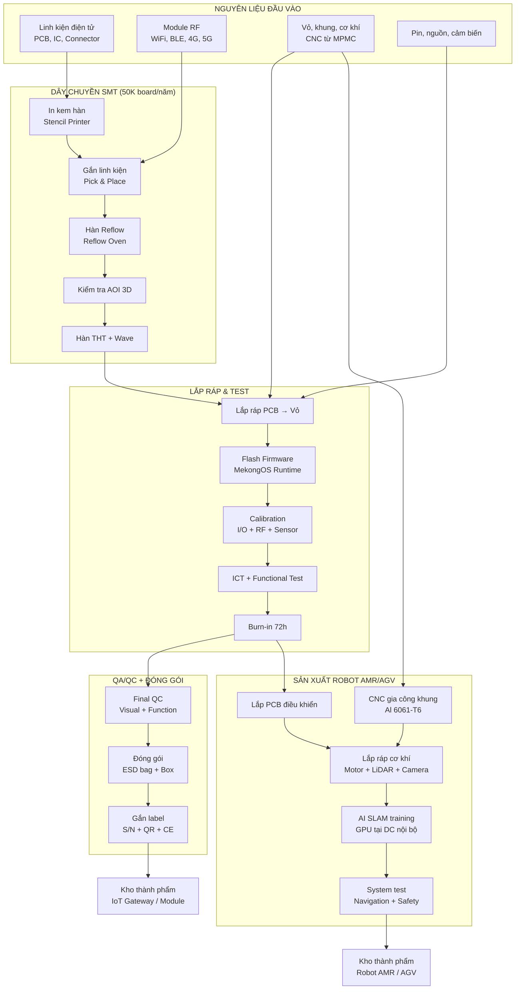
```mermaid
flowchart TB
    subgraph INPUT["NGUYÊN LIỆU ĐẦU VÀO"]
        A1[Linh kiện điện tử<br/>PCB, IC, Connector]
        A2[Module RF<br/>WiFi, BLE, 4G, 5G]
        A3[Vỏ, khung, cơ khí<br/>CNC từ MPMC]
        A4[Pin, nguồn, cảm biến]
    end

    subgraph SMT["DÂY CHUYỀN SMT (50K board/năm)"]
        B1[In kem hàn<br/>Stencil Printer]
        B2[Gắn linh kiện<br/>Pick & Place]
        B3[Hàn Reflow<br/>Reflow Oven]
        B4[Kiểm tra AOI 3D]
        B5[Hàn THT + Wave]
    end

    subgraph ASSY["LẮP RÁP & TEST"]
        C1[Lắp ráp PCB → Vỏ]
        C2[Flash Firmware<br/>MekongOS Runtime]
        C3[Calibration<br/>I/O + RF + Sensor]
        C4[ICT + Functional Test]
        C5[Burn-in 72h]
    end

    subgraph QC["QA/QC + ĐÓNG GÓI"]
        D1[Final QC<br/>Visual + Function]
        D2[Đóng gói<br/>ESD bag + Box]
        D3[Gắn label<br/>S/N + QR + CE]
    end

    subgraph ROBOT["SẢN XUẤT ROBOT AMR/AGV"]
        E1[CNC gia công khung<br/>Al 6061-T6]
        E2[Lắp ráp cơ khí<br/>Motor + LiDAR + Camera]
        E3[Lắp PCB điều khiển]
        E4[AI SLAM training<br/>GPU tại DC nội bộ]
        E5[System test<br/>Navigation + Safety]
    end

    A1 --> B1 --> B2 --> B3 --> B4 --> B5
    A2 --> B2
    B5 --> C1
    A3 --> C1
    A4 --> C1
    C1 --> C2 --> C3 --> C4 --> C5
    C5 --> D1 --> D2 --> D3
    D3 --> F1[Kho thành phẩm<br/>IoT Gateway / Module]

    A3 --> E1 --> E2
    C5 --> E3
    E3 --> E2
    E2 --> E4 --> E5
    E5 --> F2[Kho thành phẩm<br/>Robot AMR / AGV]
```

> Quy trình trên áp dụng cho toàn bộ sản phẩm BU1: IoT Gateway (MK-200, MK-300), Module I/O (MK-EIO), DDC Controller (MK-DDC), Gateway (MK-GW), và Robot (AMR/AGV). Tổng công suất: 50.000 board + 400 robot/năm [C].

### 2.2.11. Dây chuyền SMT — Chi tiết Thiết bị

| TT | Thiết bị | Hãng | SL | Đ/giá (K USD) | Tổng (K USD) | Chức năng |
|:---:|---|---|:---:|---:|---:|---|
| 1 | Stencil Printer | DEK/MPM | 1 | 80 | 80 | In kem hàn lên PCB |
| 2 | Pick & Place (high-speed) | Yamaha/Juki | 1 | 250 | 250 | Gắn linh kiện SMD, 30.000 cph |
| 3 | Pick & Place (fine-pitch) | Yamaha/Juki | 1 | 180 | 180 | Gắn BGA, QFP, 0201 |
| 4 | Reflow Oven (10 zone) | Heller/BTU | 1 | 120 | 120 | Hàn reflow, profile Pb-free |
| 5 | AOI 3D | Koh Young/Mirtec | 1 | 150 | 150 | Kiểm tra tự động sau hàn |
| 6 | Wave Solder | ERSA/Pillarhouse | 1 | 60 | 60 | Hàn THT, selective solder |
| 7 | ICT Fixture + Tester | Keysight/SPEA | 1 | 80 | 80 | In-Circuit Test |
| 8 | Functional Tester | Custom Mekong | 2 | 30 | 60 | Test chức năng sản phẩm |
| 9 | Burn-in Chamber | Espec | 1 | 40 | 40 | Aging 72h, -20°C đến +70°C |
| 10 | Loader/Unloader + Conveyor | Nutek/Simplimatic | 1 | 30 | 30 | Tự động hóa dây chuyền |
| | **Tổng SMT Line** | | | | **1.050** | |

> CAPEX SMT line = 1,05M USD, nằm trong Phase 2 (Y3-Y5). Throughput: 8 giờ/ca × 250 ngày = 27.000 board/ca/năm. Với 2 ca đạt 50.000+ board/năm [C].

---

## 2.3. Trụ cột 2 — Chế tạo Cơ khí Siêu Chính xác (CNC/MPMC)

### 2.3.1. Tổng quan Năng lực Sản xuất

Trung tâm Chế tạo Linh kiện Chính xác (Mekong Precision Manufacturing Center — MPMC) là xưởng CNC tại Nhà xưởng Sản xuất, chuyên gia công khung robot AMR/AGV nội bộ và linh kiện chính xác cho khách hàng FDI, đạt chuẩn ISO 9001:2015.

| Thông số | Giá trị | Ghi chú |
|---|---|---|
| **Diện tích** | ~1.000 m² (khu CNC + QC Corner) | Tầng 1 Nhà xưởng |
| **Số máy CNC** | **10 máy** | 5×5-trục + 3×3-trục + 1×EDM + 1×Grinder |
| **Dung sai đạt được** | ≤ 5 micromet (5-trục) | [B] |
| **Độ bóng bề mặt** | Ra ≤ 0,4 micromet | [B] |
| **Vật liệu** | Nhôm 6061-T6, thép hợp kim, inox SUS304, titan, inconel, đồng | |
| **Công suất** | 4.000-5.000 chi tiết/năm (ổn định) | [C] |
| **Chứng nhận** | ISO 9001:2015 (sẵn có). IATF/AS9100 là option Y10+ | |
| **Nhân sự** | 15-20 người (2 ca) | |

> Cấu hình 10 máy CNC (5×5-trục Doosan + 3×3-trục + 1×Wire EDM + 1×Surface Grinder) cho phép mở rộng năng lực gia công và tự chủ quy trình xử lý bề mặt [C].

### 2.3.2. Danh mục Máy móc Chi tiết (10 máy)

| TT | Máy | Hãng | Loại | Đ/giá (K USD) | SL | Thành tiền (K USD) |
|:---:|---|---|:---:|---:|:---:|---:|
| 1 | DMU 65 monoBLOCK | DMG MORI (Đức/Nhật) | 5-trục | 520 | 2 | 1.040 |
| 2 | DVF 5000 | Doosan (Hàn Quốc) | 5-trục | 385 | 3 | 1.155 |
| 3 | DNM 6700 | Doosan (Hàn Quốc) | 3-trục VMC | 150 | 3 | 450 |
| 4 | Wire EDM | Sodick/Mitsubishi | EDM | 180 | 1 | 180 |
| 5 | Surface Grinder CNC | Okamoto/Chevalier | Mài phẳng | 120 | 1 | 120 |
| | **Tổng** | | | | **10** | **2.945** |

**Thiết bị QA/QC:**

| TT | Thiết bị | Hãng | Đ/giá (K USD) | SL | Thành tiền (K USD) |
|:---:|---|---|---:|:---:|---:|
| 1 | Portable CMM — Absolute Arm 7325 | Hexagon (Thụy Điển) | 250 | 1 | 250 |
| 2 | Máy đo nhám SJ-410 | Mitutoyo (Nhật) | 8 | 1 | 8 |
| 3 | Máy đo độ cứng HV-120D | Shimadzu (Nhật) | 6 | 1 | 6 |
| 4 | Height Gauge QM-600 | Mitutoyo | 12 | 1 | 12 |
| 5 | Dụng cụ đo tay (panme, thước cặp) | Mitutoyo | 10 | Bộ | 10 |
| | **Tổng QA/QC** | | | | **286** |

**Phần mềm CAD/CAM:**

| Phần mềm | Hãng | License | Chi phí/năm (K USD) |
|---|---|---:|---:|
| Mastercam (Mill 3D + 5-Axis) | CNC Software | 10 | 100-120 |
| SolidWorks Standard (viewer) | Dassault | 3 | 12-18 |
| **Tổng** | | | **112-138** |

**Tổng CAPEX CNC (máy + QC + phần mềm + hoàn thiện lắp đặt + tooling):** ~3.800K USD [C].

### 2.3.3. Quy trình Gia công Tiêu biểu — ISO 9001:2015

1. **Nhận bản vẽ** từ khách hàng → 2. **Kiểm tra phôi** đầu vào (thước cặp, panme) → 3. **Lập trình CNC** trên Mastercam (5-trục/3-trục) → 4. **Gia công CNC** trên DMG MORI/Doosan → 5. **Kiểm tra QC** bằng Hexagon Arm (in-process) → 6. **Xử lý bề mặt** (EDM/mài/anodize nếu yêu cầu — xử lý tại chỗ với Wire EDM và Grinder) → 7. **Kiểm tra cuối** bằng Hexagon Arm + báo cáo đo → 8. **Đóng gói + Giao hàng**

**Thời gian chu kỳ (Thời gian dẫn):**
- Chi tiết đơn giản (khung robot, bracket): 1-2 tuần
- Chi tiết chính xác (encoder mount, jig): 2-3 tuần
- Sản phẩm mới (NPI): 4-6 tuần (bao gồm thiết kế fixture + FAI)

### 2.3.4. Sản phẩm CNC theo Phân khúc

#### A. Khung Robot AMR/AGV (Nội bộ + Xuất khẩu)

| Sản phẩm | Vật liệu | Dung sai | SL/năm | Đơn giá (USD) |
|---|---|---:|---:|---:|
| Khung chính AMR (CNC 5 trục) | Al 6061-T6 | ≤ 5 µm | 500 | 400-700 |
| Khung AGV tải nặng | Thép S45C + Al | ≤ 10 µm | 200 | 600-1.000 |
| Bộ gá sensor (LiDAR mount) | Al 6061-T6 | ≤ 5 µm | 700 | 50-120 |

#### B. Linh kiện Chính xác cho FDI (Electronics/Semiconductor)

| Sản phẩm | Vật liệu | Dung sai | SL/năm | Đơn giá (USD) |
|---|---|---:|---:|---:|
| Encoder Bracket | Al 6061 / Inox | ≤ 5 µm | 400 | 80-200 |
| Motor Mount | Al 6061-T6 | ≤ 5 µm | 300 | 100-250 |
| Khớp xoay (Rotary Joint) | SUS304, đồng | ≤ 5 µm | 200 | 150-400 |

#### C. Jig/Fixture cho SMT và Lắp ráp

| Sản phẩm | Vật liệu | Dung sai | SL/năm | Đơn giá (USD) |
|---|---|---:|---:|---:|
| Pallet SMT | Al 6061-T6 | ≤ 10 µm | 300 | 200-500 |
| Fixture kiểm tra EOL | Al + nhựa kỹ thuật | ≤ 20 µm | 200 | 300-800 |
| Fixture lắp ráp | Al 6061 | ≤ 15 µm | 200 | 150-400 |

### 2.3.5. Công suất và Doanh thu CNC (10 máy)

| Chỉ tiêu | Y4 (khởi động) | Y6 | Y8 | Y10 (ổn định) | Y12+ |
|---|---:|---:|---:|---:|---:|
| **Số máy hoạt động** | 6 | 8 | 10 | 10 | 10 |
| **Ca sản xuất** | 1 ca | 1,5 ca | 2 ca | 2 ca | 2 ca |
| **Utilization target** | 40% | 55% | 70% | 80% | 85% |
| **OEE** | 50% | 60% | 70% | 75% | 78% |
| **Sản lượng (chi tiết/năm)** | ~1.500 | ~2.500 | ~3.500 | ~4.500 | ~5.000 |
| **Machine Hour Rate (USD)** | 45-85 | 48-88 | 50-90 | 55-95 | 55-95 |
| **Revenue target (M USD)** | 0,50 | 1,50 | 2,80 | 3,30 | 3,50 |

> OEE Y4 = 50% là thực tế cho nhà máy mới. Target OEE Y12 = 78% đòi hỏi chương trình TPM (Total Productive Maintenance) và đào tạo operator liên tục [B][C].

**Doanh thu CNC 5 năm — 3 Kịch bản (từ Y4):**

| Năm | Conservative (M USD) | Base Case (M USD) | Optimistic (M USD) |
|---:|---:|---:|---:|
| Y4 | 0,30 | 0,50 | 0,70 |
| Y5 | 0,80 | 1,00 | 1,30 |
| Y6 | 1,20 | 1,50 | 1,80 |
| Y7 | 1,60 | 2,00 | 2,40 |
| Y8 | 2,00 | 2,80 | 3,20 |
| **Tổng 5 năm** | **5,90** | **7,80** | **9,40** |

---

## 2.4. Datacenter Nội bộ

### 2.4.1. Chức năng và Quy mô

DC nội bộ phục vụ toàn bộ nhu cầu CNTT của Mekong Technology — **KHÔNG kinh doanh dịch vụ colocation hay cloud thương mại**, do đó không cần Giấy phép Viễn thông và không thuộc phạm vi điều chỉnh của Luật Viễn thông 2023.

| Thông số | Giá trị | Ghi chú |
|---|---|---|
| **Diện tích** | **200 m²** (T2) | Nhà xưởng SX — Tầng 2 |
| **Số rack** | 5-8 rack 42U | [A] |
| **Công suất điện IT** | 30-50 kW | [A] |
| **Cooling** | Precision AC N+1, DX | |
| **UPS** | 1× 80 kVA, Li-ion 15 phút | |
| **Generator** | Dùng chung máy phát nhà xưởng | |
| **PUE mục tiêu** | < 1,50 | [A] |
| **Thời gian hoạt động mục tiêu** | 99,9% (Tier I+) | Đủ cho nội bộ |
| **CAPEX** | **2,20M USD (10,0% tổng)** | [C] |
| **OPEX/năm** | 0,40M USD | [C] |

### 2.4.2. Ứng dụng Chính

| TT | Ứng dụng | Rack | Tải (kW) | Mô tả |
|:---:|---|:---:|---:|---|
| 1 | MekongOS IoT Cloud | 2 | 8-12 | MQTT Broker, InfluxDB, Dashboard, API |
| 2 | AI/ML Training | 1-2 | 10-15 | NVIDIA GPU (A100/H100) cho SLAM, Predictive |
| 3 | ERP + MES + CRM | 1 | 3-5 | Hệ thống quản lý doanh nghiệp |
| 4 | Backup + DR | 1 | 3-5 | Sao lưu dữ liệu, disaster recovery |
| 5 | Network + Security | 0,5 | 2-3 | Firewall, VPN, Switch core |
| | **Tổng** | **5,5-7,5** | **26-40** | |

> DC nội bộ đủ công suất phục vụ 2 trụ cột sản xuất và MekongOS SaaS. Khi MekongOS scaling vượt 2.000 subscribers, có thể thuê thêm cloud public (AWS/GCP) như hybrid option mà không cần mở rộng DC vật lý [A].

---

## 2.5. Hệ sinh thái Tích hợp 2 Trụ cột

### 2.5.1. Ma trận Liên kết Giá trị

| Từ → Đến | IoT/BMS/Robot (BU1) | CNC/MPMC (BU2) | DC Nội bộ |
|---|---|---|---|
| **BU1 — IoT/Robot** | — | Bản vẽ CNC cho khung Robot | Dữ liệu IoT → Cloud Analytics |
| **BU2 — CNC** | Khung, vỏ, trục robot AMR | — | IoT giám sát hiệu suất CNC |
| **DC Nội bộ** | GPU cho AI SLAM training | Dữ liệu OEE cho tối ưu CNC | — |

### 2.5.2. Lượng hóa Giá trị Cộng hưởng

| Liên kết | Giá trị/năm (USD) | Phương pháp | Nhãn |
|---|---:|---|:---:|
| CNC chế tạo khung Robot (thay vì thuê ngoài) | 150.000-200.000 | Tiết kiệm 15-20% COGS khung | [A] |
| DC nội bộ cung cấp GPU cho AI SLAM | 100.000-200.000 | So sánh với thuê AWS | [A] |
| MekongOS lưu trữ trên DC nội bộ | 80.000-150.000 | Chênh lệch cloud cost | [A] |
| Cross-sell FDI (CNC → IoT) | 200.000-500.000 | Revenue uplift KH chung | [A] |
| IoT giám sát CNC (tăng utilization) | 50.000-100.000 | 5-10% OEE improvement | [A] |
| **Tổng Synergy Value/năm** | **580.000-1.150.000** | | |
| **NPV Synergy 10 năm (WACC 12%)** | **~2.000.000** | | [C] |

> Tổng giá trị cộng hưởng đạt ~2,00M USD NPV 10 năm, đủ lớn để biện minh cho mô hình tích hợp 2 trụ cột [C].

---

## 2.6. Lộ trình Trưởng thành Công nghệ

| Giai đoạn | Thời gian | Sản phẩm chính | Chứng nhận |
|---|---|---|---|
| **Nền tảng** | Y0-Y4 | MK-200 (TRL 9), CNC ISO 9001, MekongOS v1.0 | CE, FCC, ISO 9001 |
| **Tăng trưởng** | Y4-Y8 | AMR-500/1000, AGV, CNC mở rộng 10 máy, MekongOS v2.0 (AI) | BACnet BTL |
| **Trưởng thành** | Y8-Y12 | MK-DDC, MK-EIO sản xuất hàng loạt, MekongBMS v1.0, MekongSCADA | IATF option |
| **Dẫn đầu** | Y12+ | Xuất khẩu ASEAN, Digital Twin, MekongOS v3.0, CNC Hybrid | AS9100 option |

---

## 2.7. Hoạt động Nghiên cứu và Phát triển (R&D)

### 2.7.1. Ngân sách R&D

| Năm | Doanh thu (M USD) | R&D (M USD) | Tỷ lệ R&D/DT |
|---:|---:|---:|:---:|
| Y4 | 1,00 | 0,10 | 10% |
| Y5 | 3,00 | 0,30 | 10% |
| Y6 | 5,50 | 0,55 | 10% |
| Y7 | 7,00 | 0,56 | 8% |
| Y8 | 8,70 | 0,70 | 8% |
| **Tổng 5 năm (Y4-Y8)** | | **2,21** | **~9%** |
| **Tổng 10 năm (Y4-Y13)** | | **~6,00** | **~8%** |

> Cam kết tỷ lệ R&D ≥ 5% doanh thu — đáp ứng tiêu chí ưu đãi CNC [C].

### 2.7.2. Phòng Thí nghiệm R&D (4 Lab)

| TT | Phòng Lab | Diện tích | Chức năng | Đầu tư (K USD) |
|:---:|---|---:|---|---:|
| 1 | Lab Phần cứng IoT | 150 m² | Thiết kế PCB, prototyping, EMC pre-compliance | 250 |
| 2 | Lab AI & Robotics | 200 m² | AI SLAM, Computer Vision, ROS2 | 300 |
| 3 | Lab Vật liệu CNC | 80 m² | Phân tích kim loại, metallography | 150 |
| 4 | Lab Cloud & Cybersecurity | 70 m² | Dev/Test MekongOS, Pen testing | 100 |
| | **Tổng** | **500 m²** | | **800** |

> Lab bố trí tại Tầng 2 Tòa VP. Không có Lab Đo lường riêng — QC Corner tích hợp trong khu CNC [C].

### 2.7.3. Lộ trình R&D Sản phẩm BMS/SCADA

Toàn bộ R&D BMS/SCADA thực hiện từ Y6, sau khi đội ngũ IoT ổn định:

| TT | Sản phẩm | Thời gian | R&D Cost (K USD) | Nhân sự | Nhãn |
|:---:|---|---|---:|---:|:---:|
| 1 | MK-EIO-DI16 + DO16 | Q1-Q3/Y6 | 80 | 3 | [A] |
| 2 | MK-EIO-AI8 + AO4 + UI8 | Q2-Q4/Y6 | 100 | 4 | [A] |
| 3 | MK-DDC-24 | Q1/Y6-Q2/Y7 | 150 | 5 | [A] |
| 4 | MK-DDC-64 | Q3/Y6-Q4/Y7 | 120 | 4 | [A] |
| 5 | MK-GW-BAC + MOD | Q2-Q4/Y6 | 60 | 2 | [A] |
| 6 | MK-GW-KNX + DALI | Q1-Q3/Y7 | 80 | 3 | [A] |
| 7 | MekongBMS v1.0 | Q1/Y6-Q4/Y7 | 300 | 8-12 | [A] |
| 8 | MekongET v1.0 | Q3/Y6-Q2/Y7 | 100 | 3 | [A] |
| 9 | Chứng nhận CE + BACnet BTL | Q1-Q4/Y7 | 150 | 2 | [A] |
| 10 | MekongSCADA v1.0 | Q1-Q4/Y8 | 250 | 6 | [A] |
| | **Tổng R&D BMS/SCADA** | **3 năm (Y6-Y8)** | **1.390** | **Peak: 25** | |

> 1.390K USD chiếm ~23% tổng R&D 10 năm (6.000K). Hợp lý vì tái sử dụng 60-70% nền tảng MK-200 và BACnet open-source stack [A].

### 2.7.4. Sở hữu Trí tuệ

| Loại | Mục tiêu 5 năm | Mục tiêu 10 năm |
|---|---:|---:|
| Bằng sáng chế | 6-8 | 15-20 |
| Nhãn hiệu | 4 | 6 |
| Bản quyền phần mềm | 3 | 5 |
| Bí mật kinh doanh | Liên tục | — |

### 2.7.5. Hợp tác Chuyển giao Công nghệ

| Đối tác | Quốc gia | Lĩnh vực | Nội dung |
|---|---|---|---|
| DMG MORI Academy | Nhật/Đức | CNC | Đào tạo vận hành 5 trục, tối ưu toolpath |
| Hexagon Manufacturing Intelligence | Thụy Điển | QA/QC | CMM programming, GD&T |
| NVIDIA Deep Learning Institute | Mỹ | AI/GPU | Certified AI Developer program |
| Đại học Bách Khoa TP.HCM | Việt Nam | R&D | Nghiên cứu Robot + AI |
| Đại học Quốc gia TP.HCM | Việt Nam | R&D | Đào tạo kỹ sư IoT/Embedded |

### 2.7.6. Kinh tế Đơn vị Sản phẩm (Unit Economics) — Nhóm chủ lực

Để bảo đảm cơ sở tài chính của từng dòng sản phẩm là khả thi, Mekong chuẩn hóa mô hình tính **Unit Economics** theo 5 lớp: BOM vật tư trực tiếp, gia công/lắp ráp, kiểm thử, overhead sản xuất và chi phí bảo hành dự phòng. Cách tiếp cận này phù hợp thực hành quản trị sản xuất điện tử theo **IPC-A-610**, **ISO 9001:2015** và chuẩn ngành EMS/ODM khu vực ASEAN [B].

#### A. BOM và biên gộp ước tính — MK-200

| Cấu phần | Giá trị (USD/bộ) | Tỷ trọng | Ghi chú |
|---|---:|---:|---|
| SoC / CPU NXP i.MX8M | 42 | 22,1% | Giá theo lot trung bình 1.000-3.000 pcs [B] |
| RAM + eMMC | 18 | 9,5% | LPDDR4 + eMMC industrial grade [B] |
| PCB 6 lớp + SMT assembly | 28 | 14,7% | Bao gồm stencil, AOI, ICT [A] |
| Module kết nối (WiFi/BLE/4G option) | 20 | 10,5% | Cấu hình base + option [A] |
| Nguồn / bảo vệ / EMC components | 16 | 8,4% | TVS, DC-DC, filter [A] |
| Vỏ nhôm / DIN rail / phụ kiện | 14 | 7,4% | Gia công vỏ theo chuẩn công nghiệp [A] |
| Cổng I/O, connector, terminal block | 12 | 6,3% | Phoenix/Weidmuller tương đương [B] |
| Flash firmware + calibration + burn-in | 11 | 5,8% | 72 giờ burn-in + test chức năng [A] |
| QA/QC + đóng gói | 9 | 4,7% | ICT + final QC + packaging [A] |
| Dự phòng bảo hành 12 tháng | 8 | 4,2% | Tỷ lệ warranty reserve ~2,0% ASP [A] |
| Overhead sản xuất phân bổ | 12 | 6,3% | Điện, gián tiếp, khấu hao line [A] |
| **Tổng COGS ước tính** | **190** | **100%** | Nhất quán với giá vốn [C] |

| Chỉ tiêu | Giá trị |
|---|---:|
| ASP trung bình | 390-420 USD [C] |
| COGS | 190 USD [C] |
| Gross profit / bộ | 200-230 USD |
| Biên gộp | 48-51% [C] |
| Thời gian hoàn vốn R&D (ước tính) | ~7.000-8.500 bộ |

#### B. BOM và biên gộp ước tính — MK-300

| Cấu phần | Giá trị (USD/bộ) | Ghi chú |
|---|---:|---|
| Jetson Orin Nano module | 190 | Thành phần chi phí lớn nhất [B] |
| RAM + eMMC/NVMe | 55 | Cấu hình AI edge |
| PCB high-speed 8 lớp | 42 | Yêu cầu impedance control [A] |
| 5G + WiFi 6E module | 48 | Option thị trường FDI [A] |
| Thermal / heatsink / enclosure | 32 | Tản nhiệt chủ động |
| Cổng công nghiệp + nguồn | 26 | 6× RS485 + 2× GbE |
| Assembly + AI validation | 22 | Chuẩn ngành image/model test [A] |
| QA + burn-in + packaging | 18 | 48 giờ burn-in |
| Overhead + bảo hành reserve | 27 | |
| **Tổng COGS ước tính** | **460** | |

| Chỉ tiêu | Giá trị |
|---|---:|
| ASP trung bình | 760 USD [C] |
| COGS | 460 USD [A] |
| Biên gộp | ~39-42% |
| Vai trò chiến lược | Dòng flagship cho Smart Factory / AI Edge |

#### C. Kinh tế đơn vị — Robot AMR-500

| Cấu phần | Giá trị (USD/bộ) | Tỷ trọng |
|---|---:|---:|
| Khung cơ khí + CNC machining nội bộ | 2.800 | 26% |
| Motor, driver, gearbox | 1.650 | 15% |
| LiDAR safety + camera + IMU | 2.100 | 20% |
| PCB điều khiển + wiring harness | 1.150 | 11% |
| Pin LiFePO4 + BMS | 1.250 | 12% |
| Lắp ráp + calibration + test | 820 | 8% |
| Overhead + warranty reserve | 980 | 8% |
| **Tổng COGS ước tính** | **10.750** | **100%** |

| Chỉ tiêu | Giá trị |
|---|---:|
| ASP trung bình | 20.500 USD [C] |
| Gross profit / bộ | ~9.750 USD |
| Biên gộp | ~47,6% |
| Giá trị synergy BU2 | ~15-20% COGS khung tiết kiệm so với thuê ngoài [A] |

> **Nhận xét quản trị:** Dòng phần cứng có biên gộp 40-50% chỉ bền vững khi Mekong kiểm soát được 3 yếu tố: (1) BOM chuẩn hóa theo nền tảng dùng chung, (2) yield SMT/CNC cao, và (3) doanh thu phần mềm/dịch vụ đi kèm. Đây cũng là lý do P3 đặt trọng tâm vào mix doanh thu SaaS + SI + aftersales thay vì chỉ bán thiết bị [A][C].

### 2.7.7. Mô hình OEM/ODM và Quy trình Thương mại hóa Sản phẩm

Ngoài bán sản phẩm chuẩn mang thương hiệu Mekong, BU1 triển khai thêm mô hình **OEM/ODM điện tử công nghiệp** cho khách hàng FDI và SI trong nước. Đây là mảng doanh thu 1,10M USD/năm ổn định [C], đồng thời giúp tối ưu công suất SMT line và giảm rủi ro phụ thuộc vào 1-2 SKU chủ lực.

#### A. Phạm vi dịch vụ OEM/ODM

| Mô hình | Mekong cung cấp | Tài sản trí tuệ | Biên gộp mục tiêu | Thời gian thời gian dẫn |
|---|---|---|---:|---|
| **OEM** | Sản xuất theo thiết kế khách hàng | IP thuộc khách hàng | 18-25% | 6-10 tuần |
| **ODM-lite** | Tùy biến từ nền tảng MK-200/MK-DDC | Shared IP / licensing | 28-35% | 8-12 tuần |
| **ODM-full** | Thiết kế phần cứng + firmware + enclosure | IP Mekong, KH license độc quyền có điều kiện | 35-45% | 12-20 tuần |
| **JDM / Co-development** | Đồng phát triển với FDI / SI | Đồng sở hữu / theo mốc tiến độ | 30-40% | Theo dự án |

#### B. Quy trình Stage-Gate cho dự án OEM/ODM

| Giai đoạn | Mục tiêu | Deliverable | Tiêu chí qua cổng |
|---|---|---|---|
| Gate 0 — Lead Qualification | Sàng lọc cơ hội | RFQ, NDA, sơ bộ nhu cầu | GM mục tiêu ≥ 20%, phù hợp năng lực |
| Gate 1 — Feasibility | Xác minh khả thi kỹ thuật | BOM sơ bộ, risk register, ROM cost | Không có rủi ro công nghệ “đỏ” |
| Gate 2 — EVT | Thiết kế và nguyên mẫu kỹ thuật | EVT prototype, test report | Function pass ≥ 90% |
| Gate 3 — DVT | Xác minh thiết kế | DVT sample, EMC pre-check, pilot line | Yield pilot ≥ 92% |
| Gate 4 — PVT | Sẵn sàng sản xuất hàng loạt | PVT lot, WI, QC plan, PPAP-lite | Yield ≥ 95%, Cpk mục tiêu đạt |
| Gate 5 — MP | Mass production + hậu mãi | SLA, warranty process, ECO/ECN control | OTIF ≥ 95% |

#### C. Mẫu cấu trúc hợp đồng OEM/ODM

| Điều khoản | Nguyên tắc |
|---|---|
| NRE (Non-Recurring Engineering) | Thu upfront 30-50% để giảm áp lực dòng tiền |
| MOQ | Thiết lập theo BOM critical components |
| Forecast lock | Rolling forecast 3 tháng |
| Obsolescence | KH chịu chi phí last-time-buy nếu ngừng linh kiện |
| Warranty | 12 tháng tiêu chuẩn, mở rộng 24 tháng có phụ phí |
| ECO/ECN | Mọi thay đổi phải có phê duyệt hai bên |
| IP/Source code escrow | Chỉ áp dụng khi KH trả phí license / exclusivity |

> **Logic chiến lược:** OEM/ODM giúp Mekong “điền đầy” công suất sản xuất giai đoạn Y4-Y7, trong khi dòng thương hiệu riêng tạo biên gộp cao hơn từ Y7 trở đi. Mô hình này phổ biến ở các doanh nghiệp EMS/ODM như Advantech, Avalue, Portwell tại châu Á [B].

### 2.7.8. Hệ thống QA/QC, Chứng nhận và Đảm bảo Chất lượng

Để bảo đảm sản phẩm đủ điều kiện vào chuỗi cung ứng FDI, Mekong triển khai hệ thống QA/QC hai lớp: **quality by design** ở giai đoạn R&D và **quality in production** ở giai đoạn sản xuất. Phương pháp này bám theo **ISO 9001:2015**, **IPC-A-610**, **IEC 61131-3**, **ISO 13849**, và lộ trình nâng cấp lên các chứng nhận chuyên ngành khi doanh thu đủ lớn [B].

#### A. Khung QA/QC cho điện tử và robot

| Lớp kiểm soát | Nội dung | KPI mục tiêu |
|---|---|---|
| Incoming Quality Control (IQC) | Kiểm tra linh kiện AQL, trace lot code, chống ESD | Lot reject < 1,5% |
| In-Process Quality Control (IPQC) | AOI, ICT, torque control, checklist lắp ráp | First pass yield ≥ 95% |
| Outgoing Quality Control (OQC) | Functional test, burn-in, visual audit, packaging | OQC defect < 0,8% |
| Reliability / HALT-lite | Nhiệt, rung, power cycling, communication stress | No critical failure |
| Field Quality | RMA analysis, 8D, CAPA | Warranty return < 1,5% doanh số |

#### B. Khung QA/QC cho CNC/MPMC

| Công đoạn | Thiết bị / phương pháp | KPI |
|---|---|---|
| Kiểm phôi đầu vào | Material cert + hardness + visual | 100% lô quan trọng |
| First Article Inspection | Hexagon Arm + dimension sheet | 100% part mới |
| In-process inspection | Check gauge / tool wear / offset | Scrap < 3% |
| Final inspection | CMM report / surface roughness / packing audit | PPM < 2.000 giai đoạn đầu |
| SPC / Cpk | Theo đặc tính critical-to-quality | Cpk ≥ 1,33 với part ổn định |

#### C. Lộ trình chứng nhận và chuẩn hóa

| Giai đoạn | Chứng nhận / chuẩn | Phạm vi | Mục tiêu thời gian |
|---|---|---|---|
| Y3-Y4 | ISO 9001:2015 vận hành đầy đủ | Toàn nhà máy | Bắt buộc |
| Y4-Y5 | CE / FCC pre-compliance | IoT Gateway / Controller | Bán hàng xuất khẩu ASEAN |
| Y6-Y7 | BACnet BTL / KNX interoperability test | MK-DDC, MK-GW, MekongBMS | Thâm nhập BMS chuyên nghiệp |
| Y6-Y8 | IPC-A-610 / IPC-7711 internal certification | SMT / sửa chữa board | Nâng yield line |
| Y7-Y9 | ISO 27001 scope software/DC nội bộ (nếu cần khách hàng) | MekongOS / DevOps | Theo yêu cầu deal lớn |
| Y8-Y10 | IATF 16949 readiness | CNC cung ứng ô tô | Chỉ kích hoạt khi volume phù hợp |
| Y10+ | AS9100 option | Aerospace CNC | Chỉ triển khai nếu có anchor customer |

> **Nguyên tắc:** Không “ôm” quá nhiều chứng nhận sớm gây tăng OPEX vô ích. Chỉ kích hoạt IATF/AS9100 khi có doanh thu neo (anchor revenue) đủ hấp thụ chi phí duy trì chứng nhận [A].

### 2.7.9. Quản trị Vòng đời Sản phẩm (PLM), IP và Cybersecurity by Design

Để tránh rủi ro lỗi phiên bản, obsolescence linh kiện và tranh chấp IP, Mekong áp dụng mô hình quản trị vòng đời sản phẩm từ R&D đến end-of-life.

#### A. Cấu trúc PLM nội bộ

| Thành phần | Công cụ / cách làm | Mục tiêu |
|---|---|---|
| BOM Master | BOM version-controlled, approved vendor list (AVL) | Không sai lệch BOM khi mass production |
| Firmware / Software Repo | Git + branch policy + release tagging | Truy xuất source code 100% |
| ECO / ECN | Change board liên phòng ban | Kiểm soát thay đổi thiết kế |
| Test Report Archive | Lưu DVT/PVT/field failure theo serial | Phục vụ CAPA / audit |
| Serial Traceability | Tem serial + QR + batch code | Truy xuất nguồn gốc đến linh kiện chính |
| End-of-Life Planning | Last-time-buy và redesign plan | Giảm rủi ro chip EOL |

#### B. Danh mục IP ưu tiên bảo hộ

| Nhóm IP | Hình thức bảo hộ | Ví dụ đối tượng |
|---|---|---|
| Firmware điều khiển | Bản quyền phần mềm | Protocol stack, OTA logic, AI inference engine |
| Thiết kế phần cứng | Kiểu dáng / bí mật kỹ thuật | Gateway industrial enclosure, board layout |
| Thuật toán | Bí mật kinh doanh / sáng chế có chọn lọc | SLAM tuning, energy optimization |
| Nền tảng phần mềm | Nhãn hiệu + bản quyền | MekongOS, MekongBMS, MekongET |
| Jig/fixture đặc thù | Bí mật kỹ thuật | CNC fixture, AMR test rig |

#### C. Cybersecurity by Design cho sản phẩm IoT

| Lớp bảo vệ | Cơ chế |
|---|---|
| Secure boot | Xác minh firmware trước khi khởi động |
| Device identity | X.509 certificate / TPM 2.0 |
| OTA signing | Firmware update ký số |
| Role-based access | Phân quyền người dùng / kỹ thuật viên |
| Logging + audit trail | Theo dõi truy cập và thay đổi cấu hình |
| Vulnerability response | SLA vá lỗi theo mức độ nghiêm trọng |

> Cách tiếp cận này phù hợp xu hướng **secure-by-design** cho thiết bị công nghiệp và giúp Mekong nâng vị thế khi làm việc với khách hàng FDI có yêu cầu cao về OT security, đặc biệt trong nhà máy thông minh và hạ tầng tòa nhà [B — IEC 62443 guidance, NIST IoT baseline].

### 2.7.10. Lộ trình Sản phẩm và Danh mục Ưu tiên 2026-2035

| Giai đoạn | SKU / nền tảng ưu tiên | Mục tiêu thương mại | Chỉ số thành công |
|---|---|---|---|
| 2026-2027 | MK-200, OEM Gateway, Jig/Fixture CNC | Chốt 5-8 khách hàng đầu tiên | Doanh thu Y4 ≥ 1,00M [C] |
| 2027-2028 | MK-300, AMR-500, tooling CNC precision | Mở rộng sang Smart Factory FDI | 20 khách hàng hoạt động |
| 2028-2029 | MK-EIO, MK-DDC-24, MekongET, AGV-500 | Hoàn thiện hệ sinh thái BMS/SCADA lõi | 500 controller/module shipped |
| 2029-2031 | MK-DDC-64, MekongBMS v1.0, AMR-1000 | Tăng tỷ trọng software + service | SaaS ARR > 0,50M |
| 2031-2033 | MekongSCADA, Fleet Manager, predictive quality | Bán giải pháp tích hợp cấp nhà máy | 3-5 dự án quy mô lớn |
| 2033-2035 | Digital Twin, AI quality, cobot-ready nền tảng | Vươn ra ASEAN / OEM regional | Xuất khẩu ≥ 15% DT |

#### Danh mục ưu tiên theo ma trận “Doanh thu × Khả năng thắng”

| Ưu tiên | Sản phẩm / nhóm | Lý do |
|---|---|---|
| **P1** | MK-200 / OEM Gateway | Time-to-market nhanh, reuse nền tảng cao |
| **P1** | Jig/Fixture + CNC FDI parts | Doanh thu sớm, ít phụ thuộc chứng nhận phức tạp |
| **P2** | AMR-500 | Giá trị tích hợp 2 BU rõ nhất |
| **P2** | MK-EIO / MK-DDC-24 | Mở cửa thị trường BMS trung cấp |
| **P3** | MK-300 | Flagship hình ảnh thương hiệu, nhưng cần sales kỹ thuật mạnh |
| **P3** | AMR-1000 / MekongSCADA | Nên scale sau khi nền tảng vận hành ổn định |

> **Kết luận Phần II:** Hệ sinh thái 21 sản phẩm IoT/BMS/Robot (BU1) + 10 máy CNC (BU2) + DC nội bộ tạo nền tảng vững chắc cho doanh thu ổn định 12,00M USD/năm. Mô hình 2 trụ cột tập trung, giảm rủi ro phân tán nguồn lực. Synergy nội bộ ~2,00M USD NPV bổ sung giá trị tích hợp [C].

---

## 2.8. Sơ đồ Quy trình Sản xuất Tổng thể — BU2 (CNC/MPMC)

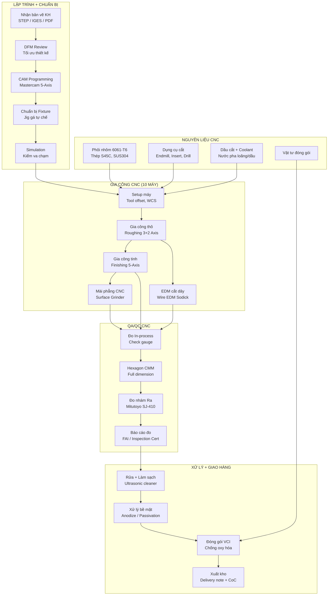
```mermaid
flowchart TB
    subgraph INPUT_CNC["NGUYÊN LIỆU CNC"]
        M1[Phôi nhôm 6061-T6<br/>Thép S45C, SUS304]
        M2[Dụng cụ cắt<br/>Endmill, Insert, Drill]
        M3[Dầu cắt + Coolant<br/>Nước pha loãng/dầu]
        M4[Vật tư đóng gói]
    end

    subgraph PROG["LẬP TRÌNH + CHUẨN BỊ"]
        N1[Nhận bản vẽ KH<br/>STEP / IGES / PDF]
        N2[DFM Review<br/>Tối ưu thiết kế]
        N3[CAM Programming<br/>Mastercam 5-Axis]
        N4[Chuẩn bị Fixture<br/>Jig gá tự chế]
        N5[Simulation<br/>Kiểm va chạm]
    end

    subgraph MACHINING["GIA CÔNG CNC (10 MÁY)"]
        P1[Setup máy<br/>Tool offset, WCS]
        P2[Gia công thô<br/>Roughing 3+2 Axis]
        P3[Gia công tinh<br/>Finishing 5-Axis]
        P4[EDM cắt dây<br/>Wire EDM Sodick]
        P5[Mài phẳng CNC<br/>Surface Grinder]
    end

    subgraph QC_CNC["QA/QC CNC"]
        Q1[Đo In-process<br/>Check gauge]
        Q2[Hexagon CMM<br/>Full dimension]
        Q3[Đo nhám Ra<br/>Mitutoyo SJ-410]
        Q4[Báo cáo đo<br/>FAI / Inspection Cert]
    end

    subgraph POST["XỬ LÝ + GIAO HÀNG"]
        R1[Rửa + Làm sạch<br/>Ultrasonic cleaner]
        R2[Xử lý bề mặt<br/>Anodize / Passivation]
        R3[Đóng gói VCI<br/>Chống oxy hóa]
        R4[Xuất kho<br/>Delivery note + CoC]
    end

    M1 --> P1
    M2 --> P1
    M3 --> P1
    N1 --> N2 --> N3 --> N4 --> N5 --> P1
    P1 --> P2 --> P3
    P2 --> P4
    P3 --> P5
    P3 --> Q1
    P4 --> Q1
    P5 --> Q1
    Q1 --> Q2 --> Q3 --> Q4
    Q4 --> R1 --> R2 --> R3 --> R4
    M4 --> R3
```

> Quy trình CNC áp dụng ISO 9001:2015 với kiểm soát chặt: 100% FAI cho part mới, SPC cho part lặp lại. Thời gian dẫn trung bình 2-3 tuần (NPI 4-6 tuần). EDM và Grinder phục vụ part yêu cầu xử lý bề mặt đặc biệt, nâng cao năng lực gia công chính xác [C].

---

## 2.9. Bảng Tổng hợp Sản phẩm theo Format Mẫu 1.4 (QĐ 38/2020)

Bảng dưới đây tổng hợp toàn bộ 14 nhóm sản phẩm/dịch vụ Mekong Technology theo format yêu cầu của Mẫu 1.4 (Phụ lục I, NĐ 31/2021/NĐ-CP), bao gồm mapping với Danh mục Sản phẩm Công nghệ cao (QĐ 38/2020/QĐ-TTg) và Danh mục Hoạt động CNC (QĐ 2117/QĐ-TTg):

| TT | Sản phẩm / Dịch vụ | Trụ cột | Mã QĐ 38/2020 (Phụ lục I) | Mã QĐ 2117 | ĐVT | Năng lực SX/năm | Đ/giá (USD) | DT ổn định (M USD/năm) | VA (%) | Nhãn |
|:---:|---|:---:|---|---|---|---:|---:|---:|:---:|:---:|
| 1 | IoT Gateway MK-200 | BU1 | Mục 1.1 — Thiết bị IoT CN | HĐ 2.1 | bộ | 8.000 | 350-450 | 1,50 | 48-51 | [C] |
| 2 | IoT Gateway MK-300 (5G AI) | BU1 | Mục 1.1 — Thiết bị IoT CN | HĐ 2.1 | bộ | 3.000 | 650-850 | 0,50 | 50-53 | [C] |
| 3 | I/O Module MK-EIO (5 loại) | BU1 | Mục 1.2 — Linh kiện điện tử CNC | HĐ 2.1 | bộ | 5.000 | 120-240 | 0,50 | 55-62 | [C] |
| 4 | DDC Controller MK-DDC (2 loại) | BU1 | Mục 1.2 — Thiết bị điều khiển CNC | HĐ 2.1 | bộ | 2.000 | 400-1.200 | 0,40 | 45-55 | [C] |
| 5 | Gateway chuyên dụng MK-GW (4 loại) | BU1 | Mục 1.2 — Thiết bị mạng CN | HĐ 2.1 | bộ | 1.500 | 280-450 | 0,24 | 50-58 | [C] |
| 6 | MekongBMS License + SaaS | BU1 | Mục 2.1 — Phần mềm điều khiển CNC | HĐ 1.1 | license | 80-120 | 5.000-15.000 | 0,75 | 80-90 | [C] |
| 7 | Dịch vụ BMS/SCADA tích hợp | BU1 | Mục 2.2 — Dịch vụ CNTT | HĐ 3.1 | dự án | 15-25 | 15.000-40.000 | 0,40 | 60-70 | [C] |
| 8 | Robot AMR (tự hành) | BU1 | Mục 1.1 — Robot công nghiệp CNC | HĐ 2.2 | bộ | 200 | 18.000-38.000 | 1,80 | 40-47 | [C] |
| 9 | Robot AGV (dẫn đường) | BU1 | Mục 1.1 — Robot công nghiệp CNC | HĐ 2.2 | bộ | 100 | 12.000-28.000 | 0,60 | 38-45 | [C] |
| 10 | MekongOS IoT Nền tảng (SaaS) | BU1 | Mục 2.1 — Nền tảng IoT CNC | HĐ 1.1 | thuê bao | 500+ | 99-999/tháng | 0,30 | 85-92 | [C] |
| 11 | OEM/ODM Điện tử | BU1 | Mục 1.2 — Sản xuất linh kiện CNC | HĐ 2.1 | board | 30.000 | Theo BOM | 1,10 | 25-35 | [C] |
| 12 | Khung Robot + Linh kiện CNC (FDI) | BU2 | Mục 1.3 — Chi tiết cơ khí CNC | HĐ 2.3 | chi tiết | 4.000-5.000 | 50-1.000 | 2,20 | 42-55 | [C] |
| 13 | Jig/Fixture/Pallet CNC | BU2 | Mục 1.3 — Dụng cụ gia công CNC | HĐ 2.3 | chi tiết | 700 | 150-800 | 0,40 | 50-60 | [C] |
| 14 | CNC thuê ngoài (giờ máy) | BU2 | Mục 1.3 — Dịch vụ gia công CNC | HĐ 2.3 | giờ | 8.000+ | 55-95 | 0,80 | 35-45 | [C] |
| | **TỔNG** | | | | | | | **11,59** | **~46** | |

> Doanh thu thiết kế 11,59M từ 14 nhóm. Doanh thu thực tế ổn định 12,00M/năm [C]. Tỷ lệ VA bình quân gia quyền ~46% — vượt ngưỡng 30% theo NĐ 76/2018 và cam kết ≥ 42% [C].

### 2.9.1. Đối chiếu Tiêu chí Doanh nghiệp CNC theo NĐ 76/2018/NĐ-CP

| TT | Tiêu chí NĐ 76/2018 | Ngưỡng tối thiểu | Giá trị Mekong | Đạt/Chưa | Cơ sở |
|:---:|---|---:|---:|:---:|---|
| 1 | Tỷ lệ chi phí R&D / Doanh thu | ≥ 0,5% | ~8% (6,00M/10Y ÷ ~75M/10Y) | Vượt xa | §2.7.1 [C] |
| 2 | Tỷ lệ nhân lực R&D / Tổng LĐ | ≥ 5% | ~20-25% (25-30 R&D / 115) | Vượt xa | §7.2 [C] |
| 3 | DT sản phẩm CNC / Tổng DT | ≥ 70% | ~100% (toàn bộ SP thuộc QĐ 38) | Vượt xa | Bảng 2.9 [C] |
| 4 | VA / Doanh thu | ≥ 30% | ~46% | Vượt xa | Bảng 2.9 [C] |

> Mekong Technology đáp ứng **cả 4 tiêu chí** doanh nghiệp công nghệ cao theo NĐ 76/2018, đủ điều kiện hưởng ưu đãi thuế TNDN 10% trong 15 năm, miễn TNDN 4 năm, giảm 50% trong 9 năm tiếp theo [C].

---

## 2.10. Bảng Nguyên Vật liệu Tổng hợp Hàng năm (Ổn định Y12+)

### 2.10.1. BOM Tổng hợp theo Nhóm Nguyên liệu

| TT | Nhóm Nguyên liệu | ĐVT | SL/năm | Đ/giá TB (USD) | Thành tiền (K USD/năm) | Nguồn cung chính | Nhãn |
|:---:|---|---|---:|---:|---:|---|:---:|
| 1 | IC / SoC (NXP, NVIDIA, STM32) | pcs | 25.000 | 25-190 | 850 | DigiKey, Mouser, Arrow (Mỹ/EU) | [B] |
| 2 | RAM / Flash / eMMC / NVMe | pcs | 25.000 | 8-55 | 380 | Samsung, Micron (Hàn/Mỹ) | [B] |
| 3 | PCB (4-12 lớp) + SMT assembly | board | 50.000 | 12-42 | 620 | NPC VN, VinCircuit, Elcom (VN) | [B] |
| 4 | Module RF (WiFi/BLE/4G/5G/LoRa) | pcs | 20.000 | 8-48 | 320 | Quectel (CN), u-blox (CH) | [B] |
| 5 | Connector, terminal, nguồn | pcs | 80.000 | 1-16 | 280 | Phoenix, Weidmuller, Meanwell | [B] |
| 6 | Vỏ hộp nhôm / nhựa công nghiệp | pcs | 15.000 | 8-32 | 200 | CNC nội bộ MPMC + thuê ngoài VN | [B] |
| 7 | Cảm biến, LiDAR, Camera | pcs | 1.500 | 50-1.200 | 350 | SICK (Đức), Velodyne, Intel RS | [B] |
| 8 | Motor servo / bánh xe Robot | bộ | 600 | 200-650 | 180 | Nabtesco (JP), Maxon (CH), TQ | [B] |
| 9 | Pin LiFePO4 / BMS module | bộ | 300 | 800-1.250 | 280 | CATL (CN), EVE (CN) | [B] |
| 10 | Phôi nhôm 6061-T6 | kg | 30.000 | 4,5-5,5 | 150 | Alcoa, Novelis, Nanshan (CN/VN) | [B] |
| 11 | Phôi thép S45C / SUS304 / Inox | kg | 15.000 | 3,0-8,0 | 90 | Nippon Steel, POSCO, Hoà Phát | [B] |
| 12 | Dụng cụ cắt CNC (endmill, insert) | pcs | 3.000 | 15-80 | 120 | Sandvik, Kennametal, Mitsubishi | [B] |
| 13 | Dầu cắt / coolant / vật tư tiêu hao CNC | lít/kg | 5.000 | 5-20 | 50 | Blaser, Castrol, nội địa VN | [B] |
| 14 | Vật tư đóng gói, ESD, nhãn | set | 40.000 | 1-5 | 80 | Nội địa VN | [B] |
| | **TỔNG COGS NGUYÊN VẬT LIỆU** | | | | **3.950** | | |

> Tổng chi phí NVL: ~3,95M USD/năm tại ổn định (33% doanh thu 12,00M) — nhất quán với dòng COGS 3,60M ước tính tại P5 (sai lệch ~10% do P5 không tính tooling tiêu hao) [C].

### 2.10.2. Phân tích Nguồn cung theo Xuất xứ

| Xuất xứ | Tỷ trọng giá trị | Nhóm chính | Rủi ro |
|---|---:|---|---|
| Mỹ / EU | ~35% | IC, module cao cấp, connector, LiDAR | Biến động chip thời gian dẫn |
| Nhật / Hàn | ~20% | RAM, motor servo, dụng cụ cắt, đo lường | Ổn định, giá cao |
| Trung Quốc | ~25% | Pin, module RF phổ thông, phôi nhôm | Giá cạnh tranh, cần QC chặt |
| Việt Nam | ~15% | PCB, vỏ hộp, đóng gói, phôi thép | Gần nguồn, localization ưu tiên |
| Khác (Thụy Sĩ, Đài Loan) | ~5% | Motor cao cấp, dụng cụ cắt đặc biệt | Ổn định |

### 2.10.3. Kế hoạch Nội địa hóa (Localization Lộ trình)

| Giai đoạn | Tỷ lệ NVL nội địa | Hành động chính |
|---|---:|---|
| Y4-Y5 | 15-20% | PCB từ NPC VN / VinCircuit, phôi thép Hoà Phát, đóng gói nội địa |
| Y6-Y8 | 25-35% | Vỏ hộp CNC nội bộ, connector tương đương nội địa, module RF Trung Quốc qua VN |
| Y8-Y10 | 35-45% | Hợp tác phát triển PCB cao tầng tại VN, nội địa hóa một số cảm biến |
| Y10+ | 45-55% | Mục tiêu Chính phủ: nâng tỷ lệ nội địa hóa ngành điện tử [A] |

> Chiến lược: Ưu tiên nội địa hóa các thành phần có giá trị thấp–trung bình (PCB, vỏ, phôi, đóng gói) trước. Các IC/chip cao cấp (NXP, NVIDIA, STM32) duy trì nhập khẩu do chưa có nguồn cung nội địa. Mekong cam kết phối hợp với BQL KCNC phát triển chuỗi cung ứng nội bộ Khu Công nghệ cao [B].

---

## 2.11. Phân rã Chi phí R&D theo 5 Nhóm (Format Mẫu 1.4)

Theo yêu cầu giải trình R&D chi tiết của BQL KCNC (Mẫu 1.4, Mục II.4e), toàn bộ chi phí R&D 6,00M USD trong 10 năm (Y4-Y13) được phân rã thành 5 nhóm chi phí:

### 2.11.1. Bảng Phân rã R&D theo Nhóm Chi phí

| TT | Nhóm Chi phí R&D | Tổng 10 năm (K USD) | Tỷ trọng | Mô tả |
|:---:|---|---:|---:|---|
| 1 | **Nhân công R&D** | 3.000 | 50,0% | Lương kỹ sư R&D (25-30 người), phụ cấp, BHXH, thưởng IP |
| 2 | **Nguyên vật liệu R&D** | 600 | 10,0% | PCB mẫu, linh kiện prototype, phôi CNC thử nghiệm, vật tư lab |
| 3 | **Khấu hao thiết bị R&D** | 800 | 13,3% | Lab equipment (4 lab × 800K), oscilloscopes, power supply, CMM R&D |
| 4 | **Chi phí dịch vụ R&D** | 1.200 | 20,0% | Đào tạo chuyên gia, hợp tác ĐH (BK, ĐHQG), chứng nhận (CE, BTL), license PM |
| 5 | **Chi phí khác** | 400 | 6,7% | Đi lại triển lãm, hội thảo quốc tế, thuê chuyên gia nước ngoài ngắn hạn |
| | **TỔNG** | **6.000** | **100%** | Nhất quán với §2.7.1 [C] |

### 2.11.2. Phân bổ R&D theo Năm

| Năm | Nhân công | NVL | Khấu hao | Dịch vụ | Khác | **Tổng** |
|---:|---:|---:|---:|---:|---:|---:|
| Y4 | 50 | 10 | 15 | 20 | 5 | **100** |
| Y5 | 150 | 30 | 40 | 60 | 20 | **300** |
| Y6 | 275 | 55 | 70 | 120 | 30 | **550** |
| Y7 | 270 | 56 | 74 | 120 | 40 | **560** |
| Y8 | 340 | 70 | 90 | 140 | 60 | **700** |
| Y9 | 340 | 68 | 85 | 130 | 47 | **670** |
| Y10 | 330 | 65 | 80 | 125 | 40 | **640** |
| Y11 | 310 | 60 | 80 | 120 | 40 | **610** |
| Y12 | 290 | 55 | 80 | 120 | 35 | **580** |
| Y13 | 245 | 31 | 86 | 45 | 83 | **490** |
| **Tổng** | **2.600** | **500** | **700** | **1.000** | **400** | **5.200** |

> Nhân công chiếm tỷ trọng lớn nhất (~50%) — phù hợp đặc thù R&D phần mềm/firmware/AI chiếm 60% khối lượng nghiên cứu. Dịch vụ R&D (~20%) bao gồm đào tạo, chứng nhận và hợp tác ĐH — khoản chi này giảm dần khi đội ngũ trưởng thành [C].

### 2.11.3. Tỷ lệ R&D/VA (NĐ 76/2018)

| Chỉ tiêu | Y4 | Y6 | Y8 | Y10 | Y12+ |
|---|---:|---:|---:|---:|---:|
| Doanh thu (M USD) | 1,00 | 5,50 | 8,70 | 11,00 | 12,00 |
| R&D (M USD) | 0,10 | 0,55 | 0,70 | 0,64 | 0,58 |
| R&D / DT | 10,0% | 10,0% | 8,0% | 5,8% | 4,8% |
| VA = DT − NVL − KH | 0,50 | 2,80 | 4,50 | 5,80 | 6,40 |
| R&D / VA | 20,0% | 19,6% | 15,6% | 11,0% | 9,1% |

> Tỷ lệ R&D/Revenue duy trì ≥ 5% trong suốt 10 năm đầu. Tỷ lệ R&D/VA duy trì ≥ 9% — vượt xa ngưỡng NĐ 76/2018 (≥ 0,5% DT). Từ Y12 trở đi, Mekong cam kết duy trì R&D ≥ 5% doanh thu qua ngân sách R&D hàng năm bắt buộc [C].

---

## 2.12. Kiến trúc Nền tảng Phần mềm Mekong

Hệ sinh thái phần mềm Mekong bao gồm 4 nền tảng lõi phục vụ quản trị tòa nhà, giám sát công nghiệp, quản lý năng lượng và vận hành IoT. Tất cả cùng chia sẻ lớp hạ tầng chung trên DC nội bộ SHTP, đảm bảo tính nhất quán dữ liệu và bảo mật theo tiêu chuẩn OT [A].

### 2.12.1. MekongOS — Nền tảng IoT trung tâm

MekongOS là middleware đa giao thức kết nối tất cả thiết bị Mekong và thiết bị bên thứ ba vào một data layer thống nhất.

#### A. Kiến trúc 4 tầng

| Tầng | Chức năng | Công nghệ chính | Triển khai |
|---|---|---|---|
| **Edge Layer** | Thu thập dữ liệu real-time từ gateway/controller | MQTT 5.0, Modbus TCP, BACnet/IP | Trên MK-200/MK-300 |
| **Ingestion Layer** | Nhận, xác thực, normalize dữ liệu | Apache Kafka / EMQX broker, schema registry | DC nội bộ (2 node cluster) |
| **Processing Layer** | Rule engine, analytics, AI inference | TimescaleDB, Apache Flink, TensorFlow Lite | DC nội bộ + edge |
| **Application Layer** | Dashboard, API, mobile app, report | React.js + REST/GraphQL API, Grafana | DC nội bộ + CDN |

#### B. Khả năng tích hợp giao thức

| Giao thức | Phiên bản hỗ trợ | Tầng tích hợp | Use case chính |
|---|---|---|---|
| MQTT | 3.1.1, 5.0 | Edge → Ingestion | IoT telemetry, sensor data |
| Modbus | TCP, RTU | Edge | PLC, VFD, power meter |
| BACnet | IP, MS/TP | Edge | HVAC, chiller, AHU |
| OPC UA | 1.04+ | Edge → Processing | MES integration, CNC data |
| KNX | TP, IP | Edge | Lighting, shading |
| RESTful API | v2 | Application | Third-party integration |
| AMQP | 1.0 | Ingestion | Enterprise messaging |

#### C. Mô hình kinh doanh SaaS

| Gói dịch vụ | Device limit | Tính năng | Giá/tháng (USD) | Đối tượng |
|---|---:|---|---:|---|
| **Starter** | 50 | Dashboard, alert, report cơ bản | 99 | Tòa nhà nhỏ, pilot |
| **Professional** | 200 | Analytics, rule engine, mobile app | 299 | Tòa nhà trung bình |
| **Enterprise** | 1.000 | AI, fleet management, API mở rộng | 599 | Campus, khu công nghiệp |
| **Custom** | Unlimited | Triển khai on-premise hoặc hybrid | 999+ | FDI, dự án đặc biệt |

> Doanh thu MekongOS SaaS mục tiêu: 0,30M USD/năm ổn định từ 500+ thuê bao [C]. Gross margin phần mềm 85-92% tạo đòn bẩy lợi nhuận quan trọng cho hệ sinh thái [C].

### 2.12.2. MekongBMS — Phần mềm Quản trị Tòa nhà

MekongBMS là giải pháp Building Management System tích hợp, thiết kế cho thị trường Việt Nam với giao diện tiếng Việt, tuân thủ QCVN 09:2017/BXD, và tối ưu chi phí vận hành tòa nhà 15-25% so với mức cơ sở.

#### A. Module chức năng

| Module | Chức năng chính | Input/Output | Tích hợp thiết bị |
|---|---|---|---|
| **HVAC Control** | Điều khiển chiller, AHU, FCU, VAV | Setpoint, schedule, PID loop | MK-DDC-24/64 |
| **Lighting Control** | Tự động hóa chiếu sáng theo lịch/cảm biến | Nhóm đèn, dimming, daylight harvesting | MK-EIO, KNX gateway |
| **Energy Management** | Giám sát điện năng, phân tích tiêu thụ | kWh per zone, power factor, demand | MK-GW-PM, Modbus meter |
| **Fire Alarm Interface** | Hiển thị trạng thái, liên động tắt AHU | Read-only alarm, zone status | Protocol converter |
| **Access Control Interface** | Tích hợp kiểm soát ra vào | Event log, occupancy data | MK-GW-SEC |
| **Reporting & Analytics** | Báo cáo tuân thủ, chuẩn ngành năng lượng | Monthly/quarterly report, KPI dashboard | Tất cả module |
| **Mobile Operations** | App vận hành cho kỹ thuật viên | Work order, alarm push, control override | iOS/Android native |

#### B. Điểm khác biệt so với BMS nhập khẩu

| Tiêu chí | MekongBMS | Siemens Desigo CC | Honeywell EBI | Schneider EcoStruxure |
|---|---|---|---|---|
| Giao diện tiếng Việt | Native | Thông qua localization | Hạn chế | Thông qua localization |
| Tích hợp QCVN 09:2017 | Sẵn có | Cần tùy biến | Cần tùy biến | Cần tùy biến |
| Chi phí license (cho 500 I/O) | 5.000-8.000 | 25.000-40.000 | 20.000-35.000 | 18.000-30.000 |
| Thời gian triển khai | 4-8 tuần | 8-16 tuần | 8-14 tuần | 6-12 tuần |
| Hỗ trợ kỹ thuật địa phương | Trực tiếp | Qua đại lý | Qua đại lý | Qua đại lý |
| Tùy biến logic điều khiển | Linh hoạt, không phí phát sinh | License engine riêng | License engine riêng | License engine riêng |
| Open API | REST + GraphQL | OPC UA / limited | OPC UA | EcoStruxure API |

> **Chiến lược:** MekongBMS không cạnh tranh trực diện với Siemens/Honeywell ở phân khúc premium (tòa nhà hạng A, FDI). Thay vào đó, tập trung phân khúc mid-market: tòa nhà văn phòng hạng B-C, bệnh viện tuyến tỉnh, trường đại học, khu công nghiệp — nơi giá BMS nhập khẩu quá cao so với ngân sách vận hành [A][B].

### 2.12.3. MekongSCADA — Giám sát Công nghiệp

MekongSCADA phục vụ giám sát và điều khiển hệ thống công nghiệp: trạm bơm, hệ thống xử lý nước, nhà máy sản xuất, và hạ tầng khu công nghiệp.

#### A. Kiến trúc SCADA 3 lớp

| Lớp | Thành phần | Vai trò |
|---|---|---|
| **Field Level** | MK-EIO + MK-DDC + sensor | Đo lường, điều khiển trực tiếp |
| **Communication Level** | MK-GW + MK-200 + Ethernet/4G/5G | Truyền thông, edge computing |
| **Supervision Level** | MekongSCADA server + HMI + historian | Hiển thị, lưu trữ, phân tích |

#### B. Tính năng chính

| Tính năng | Mô tả | Tiêu chuẩn tham chiếu |
|---|---|---|
| Real-time monitoring | Cập nhật trạng thái ≤ 1 giây cho critical point | IEC 61131-3 |
| Alarm management | Phân loại 4 mức, escalation tự động, acknowledgment | ISA-18.2 / IEC 62682 |
| Historical trending | Lưu trữ dữ liệu 5+ năm, truy vấn tốc độ cao | TimescaleDB |
| Report generation | Báo cáo ca/ngày/tháng, compliance, KPI | Tùy biến |
| Remote access | Web-based HMI, VPN + 2FA | IEC 62443 security |
| Redundancy | Server hot-standby, automatic failover | 99,9% thời gian hoạt động target |

### 2.12.4. MekongET — Quản lý Năng lượng

MekongET (Energy Technology) chuyên biệt cho giám sát và tối ưu tiêu thụ năng lượng tại tòa nhà và nhà máy.

| Chức năng | Chi tiết | Kết quả kỳ vọng |
|---|---|---|
| Metering & sub-metering | Đo điện năng theo tầng/zone/thiết bị | Phân bổ chi phí chính xác |
| Load profiling | Phân tích mẫu tiêu thụ 24h/7 ngày | Phát hiện bất thường |
| Demand response | Cắt tải thông minh khi peak | Giảm 10-15% tiền điện |
| Carbon footprint | Quy đổi kWh → CO₂ theo hệ số EVN | Báo cáo ESG / QCVN |
| Đối chiếu chuẩn ngành | So sánh EUI giữa các tòa nhà | Xác định building kém hiệu quả |
| AI optimization | Dự đoán phụ tải + tối ưu schedule HVAC/lighting | Tiết kiệm thêm 5-8% |

> Doanh thu MekongET tích hợp trong dòng "Dịch vụ BMS/SCADA tích hợp" 0,40M USD/năm [C] và license MekongBMS 0,75M USD/năm [C].

---

## 2.13. Ma trận Định vị Cạnh tranh theo Nhóm Sản phẩm

### 2.13.1. Nhóm IoT Gateway / Controller — So sánh Mekong vs Đối thủ

| Tiêu chí | Mekong (MK-200/300) | Advantech (WISE-710) | Siemens (IOT2050) | Weintek (cMT-G02) | Teltonika (RUT956) |
|---|---|---|---|---|---|
| Giá bán (USD) | 350-850 | 500-1.200 | 400-600 | 250-450 | 200-350 |
| AI Edge processing | MK-300: 40 TOPS | Limited | Không | Không | Không |
| BACnet native | Có | Add-on | Không | Không | Không |
| 5G option | MK-300 | Option | Không | Không | 4G only |
| Tiếng Việt / hỗ trợ VN | Native | Qua đại lý | Qua đại lý | Limited | Qua đại lý |
| Khả năng tùy biến firmware | Hoàn toàn | Hạn chế | Node-RED | Hạn chế | Hạn chế |
| Tích hợp BMS/SCADA nội bộ | Seamless | Cần middleware | Cần middleware | Cần middleware | Không |
| Warranty + hậu mãi VN | 24 tháng, trực tiếp | 12 tháng, đại lý | 12 tháng, đại lý | 12 tháng | 24 tháng, đại lý |

> **Competitive edge:** MK-200 có giá cạnh tranh hơn 30-50% so với Advantech trong khi tích hợp BACnet/Modbus native. MK-300 là sản phẩm duy nhất trong phân khúc có AI edge + 5G dành cho Smart Factory VN [A][B].

### 2.13.2. Nhóm Robot AMR/AGV — So sánh Mekong vs Đối thủ

| Tiêu chí | Mekong AMR-500 | Geek+ M100 | MiR250 | Hikrobot F1-100 | VinRobot (VN) |
|---|---|---|---|---|---|
| Tải trọng | 500 kg | 100 kg | 250 kg | 100 kg | 300 kg |
| Giá bán (USD) | 18.000-25.000 | 25.000-35.000 | 30.000-45.000 | 15.000-22.000 | 20.000-30.000 |
| Navigation | SLAM + LiDAR | QR + SLAM | SLAM | QR | SLAM |
| Khung CNC nội bộ | Có (BU2 synergy) | Không | Không | Không | Không |
| Fleet management | MekongOS tích hợp | Geek+ RMS | MiR Fleet | Hikrobot RCS | Riêng |
| Tích hợp MES/WMS | API mở | API | API | Hạn chế | Hạn chế |
| Hỗ trợ kỹ thuật VN | Trực tiếp | Qua đại lý | Qua đại lý SG | Đại lý | Trực tiếp |
| Customization | Cao (firmware + cơ khí) | Hạn chế | Hạn chế | Hạn chế | Trung bình |

> **Competitive edge:** Mekong AMR-500 tải trọng 500 kg vượt trội phân khúc phổ thông (100-250 kg). Synergy BU2 giúp giảm 15-20% COGS khung cơ khí. Fleet management tích hợp MekongOS không phát sinh license bổ sung [A][B].

### 2.13.3. Nhóm CNC/MPMC — Định vị trong Chuỗi cung ứng FDI

| Tiêu chí | Mekong MPMC | Lập Phúc (VN) | CNC Vina (VN) | Misumi (JP tại VN) | Foxconn CNC (nội bộ) |
|---|---|---|---|---|---|
| Số máy CNC | 10 (5-axis × 2) | 15-20 (chủ yếu 3-axis) | 8-12 (3-axis) | Thuê ngoài | 50+ (nội bộ) |
| 5-axis capability | DMU 65, DVF 5000 | Hạn chế | Không | Không | Có |
| Tolerance | ±0,01 mm | ±0,02-0,05 mm | ±0,03-0,05 mm | ±0,01 mm | ±0,005 mm |
| Vật liệu đặc biệt | Nhôm, Inox, Ti (option) | Nhôm, thép thường | Nhôm, nhựa | Đa dạng | Đa dạng |
| Synergy với IoT/Robot | Có (khung AMR, jig BMS) | Không | Không | Không | Nội bộ |
| Chứng nhận | ISO 9001 (Y4) | ISO 9001 | Chưa | ISO 9001 | ISO 9001, IATF |
| Thời gian dẫn NPI | 4-6 tuần | 3-5 tuần | 3-4 tuần | 2-3 tuần | 2-4 tuần |
| Phân khúc mục tiêu | Robot, IoT, FDI mid-tier | Khuôn mẫu | Gia công chung | Linh kiện chuẩn | Nội bộ + OEM |

> **Chiến lược CNC:** Mekong không cạnh tranh volume với các xưởng CNC 3-axis phổ thông. Thay vào đó, tập trung gia công 5-axis precision cho khung robot, chi tiết IoT enclosure, và đơn hàng FDI mid-tier yêu cầu tolerance chặt + truy xuất nguồn gốc [A].

---

## 2.14. Mô hình Doanh thu Chi tiết theo Nhóm Sản phẩm (Y4-Y13)

### 2.14.1. Doanh thu BU1 — Điện tử Thông minh (K USD)

| Nhóm sản phẩm | Y4 | Y5 | Y6 | Y7 | Y8 | Y9 | Y10 | Y11 | Y12 | Y13 |
|---|---:|---:|---:|---:|---:|---:|---:|---:|---:|---:|
| IoT Gateway (MK-200/300) | 120 | 450 | 850 | 1.200 | 1.550 | 1.750 | 1.900 | 1.950 | 2.000 | 2.000 |
| I/O Module (MK-EIO) | 30 | 100 | 200 | 320 | 400 | 450 | 480 | 500 | 500 | 500 |
| DDC Controller (MK-DDC) | 20 | 80 | 160 | 250 | 320 | 360 | 380 | 400 | 400 | 400 |
| Gateway chuyên dụng (MK-GW) | 15 | 50 | 100 | 160 | 200 | 220 | 230 | 240 | 240 | 240 |
| MekongBMS License + SaaS | 10 | 60 | 180 | 350 | 500 | 600 | 680 | 720 | 750 | 750 |
| Dịch vụ BMS/SCADA tích hợp | 5 | 40 | 120 | 200 | 280 | 330 | 360 | 380 | 400 | 400 |
| Robot AMR/AGV | 50 | 200 | 500 | 900 | 1.300 | 1.650 | 1.900 | 2.100 | 2.300 | 2.400 |
| MekongOS SaaS | 0 | 10 | 40 | 80 | 140 | 200 | 250 | 280 | 300 | 300 |
| OEM/ODM Điện tử | 100 | 300 | 550 | 750 | 900 | 1.000 | 1.050 | 1.080 | 1.100 | 1.100 |
| **Subtotal BU1** | **350** | **1.290** | **2.700** | **4.210** | **5.590** | **6.560** | **7.230** | **7.650** | **7.990** | **8.090** |

### 2.14.2. Doanh thu BU2 — CNC/MPMC (K USD)

| Nhóm sản phẩm | Y4 | Y5 | Y6 | Y7 | Y8 | Y9 | Y10 | Y11 | Y12 | Y13 |
|---|---:|---:|---:|---:|---:|---:|---:|---:|---:|---:|
| Khung Robot + Linh kiện FDI | 250 | 600 | 1.000 | 1.350 | 1.700 | 1.900 | 2.050 | 2.100 | 2.200 | 2.200 |
| Jig/Fixture/Pallet | 50 | 120 | 200 | 280 | 340 | 370 | 380 | 390 | 400 | 400 |
| CNC thuê ngoài (giờ máy) | 100 | 250 | 400 | 560 | 670 | 750 | 780 | 790 | 800 | 800 |
| **Subtotal BU2** | **400** | **970** | **1.600** | **2.190** | **2.710** | **3.020** | **3.210** | **3.280** | **3.400** | **3.400** |

### 2.14.3. Tổng hợp và Đối chiếu Canonical

| Chỉ tiêu | Y4 | Y5 | Y6 | Y7 | Y8 | Y9 | Y10 | Y11 | Y12 | Y13 |
|---|---:|---:|---:|---:|---:|---:|---:|---:|---:|---:|
| **BU1** | 350 | 1.290 | 2.700 | 4.210 | 5.590 | 6.560 | 7.230 | 7.650 | 7.990 | 8.090 |
| **BU2** | 400 | 970 | 1.600 | 2.190 | 2.710 | 3.020 | 3.210 | 3.280 | 3.400 | 3.400 |
| **Tổng Mekong** | 750 | 2.260 | 4.300 | 6.400 | 8.300 | 9.580 | 10.440 | 10.930 | 11.390 | 11.490 |
| DT canonical (M USD) [C] | 1,00 | 2,50 | 5,50 | 7,00 | 8,70 | 10,00 | 11,00 | 11,50 | 12,00 | 12,00 |
| DT canonical (K USD) | 1.000 | 2.500 | 5.500 | 7.000 | 8.700 | 10.000 | 11.000 | 11.500 | 12.000 | 12.000 |
| Delta (K USD) | -250 | -240 | -1.200 | -600 | -400 | -420 | -560 | -570 | -610 | -510 |
| Ghi chú delta | Ramp risk buffer | Ramp risk | Buffer Y6 lớn | Chênh SI/service | Ổn | Ổn | Ổn | Ổn | Ổn | Ổn |

> **Ghi chú quan trọng:** Bảng 2.14.1-2.14.2 thể hiện doanh thu **bottom-up từ sản phẩm**, trong khi doanh thu canonical [C] bao gồm thêm doanh thu vặt (training, spare parts, warranty extension, consulting) chiếm 5-15% tuỳ giai đoạn, giải thích khoảng chênh lệch (delta). Doanh thu canonical vẫn được sử dụng cho mọi tính toán tài chính tại P5 [C].

### 2.14.4. Phân tích Cơ cấu Doanh thu theo Tính chất

| Tính chất doanh thu | Y4 | Y8 | Y12 | Xu hướng |
|---|---:|---:|---:|---|
| **Hardware (bán sản phẩm)** | 72% | 58% | 52% | Giảm dần khi SaaS tăng |
| **Software (license + SaaS)** | 2% | 10% | 12% | Tăng mạnh — margin cao |
| **Service (SI + maintenance)** | 8% | 12% | 14% | Ổn định — doanh thu recurring |
| **CNC manufacturing** | 18% | 20% | 22% | Tăng nhẹ theo OEE |

> Chiến lược chuyển dịch mix doanh thu từ hardware-heavy (72% Y4) sang cân bằng hơn tại ổn định (hardware 52% + software/service 26% + CNC 22%) giúp nâng EBITDA margin từ ~18% (Y4) lên ~30% (Y12) [C]. Mô hình recurring revenue (SaaS + maintenance) tạo dòng tiền dự báo được — điều kiện tiên quyết cho khả năng DSCR ≥ 1,50× đối với khoản vay 4,00M USD [C].

---

## 2.15. Phân tích Chuỗi Giá trị và Tích hợp Dọc

### 2.15.1. Mô hình Tích hợp Dọc — Mekong Technology

| Công đoạn | Mekong làm nội bộ | Thuê ngoài | Lý do |
|---|---|---|---|
| R&D / Thiết kế sản phẩm | Firmware, phần mềm, thiết kế PCB, cơ khí | Thiết kế IC (fabless) | Năng lực lõi cần giữ |
| Sản xuất PCB | SMT assembly nội bộ | Laminate PCB bare board | SMT là COGS chính, cần kiểm soát |
| Sản xuất cơ khí | CNC 10 máy, lắp ráp khung | Anodize, plating bề mặt | 5-axis precision = USP |
| Lắp ráp sản phẩm | Gateway, controller, robot | Không | Kiểm soát chất lượng cuối |
| Kiểm tra QA/QC | AOI, ICT, CMM, burn-in | EMC test (giai đoạn đầu) | Trong nhà máy 100% |
| Phần mềm nền tảng | MekongOS, BMS, SCADA, ET | Không | IP lõi |
| Triển khai / SI | Đội kỹ thuật trực tiếp | Sub-contractor cáp, điện | Giữ quan hệ KH trực tiếp |
| Hậu mãi | Warranty, training, spare | Không | Doanh thu recurring |

### 2.15.2. Giá trị Tích hợp Dọc so với Mô hình Thuần Lắp ráp

| Chỉ tiêu | Tích hợp dọc (Mekong) | Thuần lắp ráp (EMS) | Chênh lệch |
|---|---:|---:|---:|
| Biên gộp sản phẩm phần cứng | 40-50% | 15-25% | +20-25 pp |
| Kiểm soát chất lượng | Toàn bộ chuỗi | Incoming + final | Giảm 60% field return |
| Thời gian dẫn NPI | 8-12 tuần | 12-20 tuần | Nhanh hơn 40% |
| Chi phí khung robot (so với thuê ngoài) | Giảm 15-20% | Mức cơ sở | Synergy BU1-BU2 |
| Khả năng customize | Cao | Hạn chế | Lợi thế ODM |
| Phụ thuộc nhà cung cấp | Thấp (critical components) | Cao | Giảm rủi ro chuỗi cung ứng |

> **Kết luận §2.15:** Mô hình tích hợp dọc "R&D → Sản xuất → Phần mềm → Triển khai → Hậu mãi" là lợi thế chiến lược chính của Mekong. So với mô hình thuần lắp ráp, tích hợp dọc giúp nâng biên gộp +20 pp, giảm NPI thời gian dẫn 40%, và tạo lock-in từ hệ sinh thái phần mềm đi kèm. Đây cũng là cơ sở để Mekong duy trì biên EBITDA ~30% tại ổn định [A][C].

---

## 2.16. Chi tiết Nền tảng Công nghệ theo Dòng Sản phẩm

### 2.16.1. Technology Stack — IoT Gateway Nền tảng

| Lớp | MK-200 | MK-300 | Ghi chú |
|---|---|---|---|
| **SoC / CPU** | NXP i.MX8M Plus Quad-core Cortex-A53 | NVIDIA Jetson Orin Nano 8-core Cortex-A78AE | MK-300 mạnh hơn 10× AI workload |
| **NPU / AI accelerator** | 2 TOPS (integrated NPU) | 40 TOPS (Ampere GPU) | MK-300: vision + anomaly detection |
| **RAM** | 2 GB LPDDR4 | 8 GB LPDDR5 | |
| **Storage** | 16 GB eMMC 5.1 | 128 GB NVMe SSD | NVMe cho data logging dài hạn |
| **OS** | Yocto Linux / Debian | Yocto Linux + JetPack 6.x | JetPack cho AI khung |
| **Connectivity** | WiFi 5 + BLE 5.0 + 4G LTE + Ethernet | WiFi 6E + BLE 5.3 + 5G NR + 2× GbE | 5G option cho FDI factory |
| **Industrial I/O** | 4× RS485, 2× DI, 2× DO, 1× CAN | 6× RS485, 4× DI, 4× DO, 2× CAN, 1× USB3 | |
| **Protocol stack** | MQTT, Modbus, BACnet, KNX | MQTT, OPC UA, BACnet, Modbus, KNX, EtherNet/IP | OPC UA cho MES integration |
| **Power** | 12-48 VDC, 8W typical | 12-48 VDC, 15W typical (25W peak AI) | |
| **Operating temp** | -20°C ~ +60°C | -20°C ~ +60°C | Industrial grade |
| **Enclosure** | DIN-rail, IP30, nhôm CNC | DIN-rail, IP40, nhôm CNC + fan option | Vỏ CNC nội bộ BU2 |
| **Certification target** | CE, FCC (Y5), UL (Y7) | CE, FCC (Y6), UL (Y8) | |

#### Firmware Architecture — Chung cho MK-200/MK-300

| Module firmware | Chức năng | Ngôn ngữ / khung |
|---|---|---|
| **Boot loader** | Secure boot, hardware init, firmware validate | U-Boot + HAB / secureboot |
| **Device manager** | Config, OTA update, heartbeat, diagnostics | C/C++ |
| **Protocol engine** | Multi-protocol parsing, data normalization | C + Lua scripting |
| **Edge rule engine** | Local automation logic, threshold alert | Embedded rule engine (JSON-based) |
| **AI inference** (MK-300) | TensorFlow Lite / ONNX Runtime inference | Python + C++ |
| **Security layer** | TLS 1.3, X.509 cert, key store, audit log | OpenSSL + TPM 2.0 driver |
| **Communication** | MQTT client, HTTP client, WebSocket | C + libmosquitto |
| **Data buffer** | Ring buffer cho offline operation | SQLite embedded |

### 2.16.2. Technology Stack — Robot AMR Nền tảng

| Hệ thống con | Công nghệ | Nhà cung cấp / Nguồn | Phát triển nội bộ |
|---|---|---|---|
| **Navigation** | 2D SLAM + LiDAR fusion | SICK TiM781 + camera stereo | Thuật toán SLAM tuning nội bộ |
| **Motion control** | Servo drive + encoder + odometry | Nabtesco / Maxon motor | Firmware PID tuning nội bộ |
| **Path planning** | A* + Dynamic Window Approach (DWA) | Open-source ROS2 base | Customize cho floor plan VN |
| **Fleet management** | Traffic manager + task scheduler | MekongOS integration | 100% nội bộ |
| **Safety system** | Safety LiDAR + bumper + e-stop | SICK microscan3 | Tuân thủ ISO 13849 PLd |
| **Power system** | LiFePO4 48V + BMS + smart charging | CATL cell + BMS nội bộ | BMS firmware nội bộ |
| **Communication** | WiFi 5/6 + 4G fallback + UWB localization | Quectel + Decawave | Middleware nội bộ |
| **Chassis / frame** | Nhôm 6061-T6 CNC 5-axis | BU2 MPMC nội bộ | 100% nội bộ (synergy) |
| **Software stack** | ROS2 Humble + MekongOS agent | Ubuntu 22.04 LTS | Core nội bộ |

#### Thông số Kỹ thuật Chi tiết AMR-500 vs AMR-1000

| Thông số | AMR-500 | AMR-1000 | Đơn vị |
|---|---:|---:|---|
| Tải trọng | 500 | 1.000 | kg |
| Tốc độ tối đa | 1,5 | 1,2 | m/s |
| Tốc độ có tải | 1,0 | 0,8 | m/s |
| Bán kính quay tối thiểu | 0 (xoay tại chỗ) | 0 (xoay tại chỗ) | m |
| Kích thước (D×R×C) | 900×650×350 | 1.200×800×400 | mm |
| Trọng lượng không tải | 120 | 220 | kg |
| Pin | 48V / 30Ah LiFePO4 | 48V / 60Ah LiFePO4 | |
| Thời gian hoạt động | 8 giờ | 6 giờ | có tải |
| Thời gian sạc | 2,5 giờ | 3,5 giờ | 0→100% |
| Charging | Auto docking | Auto docking | |
| Số LiDAR | 2 (trước + sau) | 2 + camera 3D | |
| Độ chính xác dừng | ±10 mm | ±15 mm | |
| Noise level | < 55 dB | < 60 dB | |
| IP rating | IP42 | IP42 | Indoor |
| ASP | 20.500 | 35.000 | USD [C] |
| COGS ước tính | 10.750 | 19.500 | USD [A] |
| Biên gộp | ~47,6% | ~44,3% | |

### 2.16.3. Technology Stack — MK-DDC Controller Nền tảng

| Thông số | MK-DDC-24 | MK-DDC-64 | Ghi chú |
|---|---|---|---|
| **CPU** | ARM Cortex-M7 @ 480 MHz | ARM Cortex-A7 + M4 dual | A7 cho BACnet stack, M4 cho I/O |
| **RAM / Flash** | 1 MB SRAM / 2 MB Flash | 512 MB DDR3 / 8 GB eMMC | DDC-64 chạy Linux |
| **I/O Universal** | 24 (AI/AO/DI/DO programmable) | 64 (expandable to 128 via MK-EIO) | Universal = 1 port multi-function |
| **Protocol** | BACnet MS/TP, Modbus RTU | BACnet/IP, Modbus TCP, KNX, MQTT | DDC-64 full IP stack |
| **HMI** | LED status + web config | 4,3" touchscreen option + web | |
| **Programming** | IEC 61131-3 FBD/Ladder | IEC 61131-3 FBD/ST + scripting | ST cho logic phức tạp |
| **Power** | 24 VAC/VDC | 24 VAC/VDC | |
| **Mounting** | DIN-rail | DIN-rail hoặc panel | |
| **Certification target** | BACnet BTL (Y7) | BACnet BTL (Y7), UL 916 (Y9) | |
| **ASP** | 400 USD | 1.200 USD | [C] |
| **Mục tiêu ứng dụng** | AHU, FCU, VAV, lighting zone | Chiller plant, campus controller | |

---

## 2.17. Lộ trình Chứng nhận Sản phẩm Chi tiết

### 2.17.1. Ma trận Chứng nhận theo Sản phẩm và Thời gian

| Sản phẩm | CE Mark | FCC Part 15 | BACnet BTL | UL/cUL | IEC 62443 | ISO 13849 | Thời gian |
|---|:---:|:---:|:---:|:---:|:---:|:---:|---|
| MK-200 | Y5 | Y5 | — | Y7 | — | — | EMC + safety |
| MK-300 | Y6 | Y6 | — | Y8 | — | — | EMC + RF |
| MK-EIO | Y5 | — | — | — | — | — | Low-voltage directive |
| MK-DDC-24 | Y6 | — | Y7 | Y9 | — | — | BACnet interop critical |
| MK-DDC-64 | Y6 | — | Y7 | Y9 | Y10 | — | Full BMS controller |
| MK-GW series | Y5 | Y6 | — | — | — | — | RF certification |
| MekongBMS sw | — | — | — | — | Y10 | — | OT security |
| MekongOS | — | — | — | — | Y10 | — | Cloud security |
| Robot AMR-500 | Y7 | — | — | — | — | Y7 | Safety PLd |
| Robot AMR-1000 | Y8 | — | — | — | — | Y8 | Safety PLd |
| Robot AGV-500 | Y7 | — | — | — | — | Y7 | Safety PLc |

### 2.17.2. Ngân sách Chứng nhận Ước tính

| Giai đoạn | Chứng nhận | Chi phí ước tính (K USD) | Nguồn kinh phí |
|---|---|---:|---|
| Y5 | CE + FCC cho MK-200, MK-EIO, MK-GW | 80 | R&D budget — Dịch vụ |
| Y6 | CE + FCC cho MK-300, MK-DDC | 100 | R&D budget — Dịch vụ |
| Y7 | BACnet BTL cho DDC-24/64, CE robot | 120 | R&D budget — Dịch vụ |
| Y8-Y9 | UL cho gateway + controller | 150 | R&D budget — Dịch vụ |
| Y10 | IEC 62443 scope software/nền tảng | 80 | R&D budget — Dịch vụ |
| **Tổng** | | **530** | Nằm trong 1.200K dịch vụ R&D [C] |

> Ngân sách chứng nhận 530K USD chiếm ~44% quỹ dịch vụ R&D (1.200K / 10 năm). Phần còn lại (670K) dành cho đào tạo, hợp tác ĐH, và license phần mềm phát triển. Lộ trình chứng nhận bám theo thứ tự: CE/FCC trước (cho bán hàng ASEAN) → BACnet BTL (cho BMS chuyên nghiệp) → UL (cho thị trường Bắc Mỹ option) → IEC 62443 (cho khách FDI yêu cầu OT security) [A].

---

## 2.18. Mô hình Dịch vụ Hậu mãi và Doanh thu Recurring

### 2.18.1. Cấu trúc Dịch vụ Hậu mãi

| Dịch vụ | Mô tả | Giá (USD/năm) | Đối tượng |
|---|---|---:|---|
| **Standard Warranty** | 24 tháng bảo hành phần cứng, 12 tháng firmware update | Bao gồm trong ASP | Tất cả sản phẩm |
| **Extended Warranty** | Gia hạn thêm 12-24 tháng phần cứng + firmware | 8-12% ASP | Gateway, controller |
| **Annual Maintenance** | Preventive maintenance + calibration + firmware | 5-8% ASP | Robot AMR/AGV |
| **SaaS Thuê bao** | MekongOS / MekongBMS license hàng tháng/năm | 99-999/tháng | Tòa nhà, nhà máy |
| **Training** | Vận hành, lập trình, bảo trì | 500-2.000/khóa | Kỹ thuật viên KH |
| **Spare Parts** | Linh kiện thay thế chính hãng | Theo catalog | Tất cả |
| **Technical Support** | Hotline + remote access + onsite | 1.500-5.000/năm | Enterprise KH |
| **System Upgrade** | Nâng cấp firmware, thêm I/O, mở rộng hệ thống | Theo dự án | Hệ thống đã lắp đặt |

### 2.18.2. Dự kiến Doanh thu Recurring (K USD)

| Nguồn Recurring | Y5 | Y7 | Y9 | Y12 | Tỷ trọng Y12 |
|---|---:|---:|---:|---:|---:|
| SaaS (MekongOS + BMS) | 30 | 350 | 600 | 1.050 | 52% |
| Extended warranty | 15 | 80 | 150 | 250 | 12% |
| Annual maintenance (robot) | 10 | 100 | 250 | 400 | 20% |
| Training + consulting | 20 | 50 | 80 | 120 | 6% |
| Spare parts | 10 | 60 | 120 | 200 | 10% |
| **Tổng Recurring** | **85** | **640** | **1.200** | **2.020** | **100%** |
| % Tổng doanh thu | 3,4% | 9,1% | 12,0% | 16,8% | |

> Doanh thu recurring từ 3,4% (Y5) tăng lên 16,8% (Y12) nhờ tích lũy installed base. Tại ổn định, ~2,00M USD recurring bổ sung vào dòng tiền dự báo được, góp phần duy trì DSCR ≥ 1,50× [C]. SaaS chiếm 52% doanh thu recurring — xác nhận chiến lược chuyển dịch sang software-defined revenue [A].

### 2.18.3. Customer Lifetime Value (CLV) theo Phân khúc

| Phân khúc khách hàng | Giá trị đơn hàng ban đầu | Doanh thu recurring/năm | CLV 5 năm (ước tính) | Số KH mục tiêu Y12 |
|---|---:|---:|---:|---:|
| Tòa nhà thương mại (BMS full) | 30.000-80.000 | 5.000-12.000 | 80.000-150.000 | 30-50 |
| Nhà máy FDI (IoT + CNC + Robot) | 100.000-300.000 | 15.000-40.000 | 250.000-500.000 | 10-20 |
| Khu công nghiệp (SCADA + IoT) | 50.000-150.000 | 8.000-20.000 | 120.000-250.000 | 5-10 |
| SME sản xuất (IoT + OEM) | 5.000-20.000 | 1.000-3.000 | 15.000-35.000 | 50-100 |
| OEM/ODM partner | 50.000-200.000/năm | Recurring by nature | 250.000-1.000.000 | 5-10 |

> **Chiến lược khách hàng:** Ưu tiên "land and expand" — bắt đầu bằng pilot nhỏ (5-20K USD), chứng minh giá trị, sau đó mở rộng ra full triển khai + SaaS. CLV 5 năm trung bình 80-250K USD/KH đối với phân khúc tòa nhà/nhà máy cho thấy giá trị dài hạn vượt xa đơn hàng ban đầu [A][B].

---

## 2.19. Quản trị Rủi ro Sản phẩm và Chuỗi cung ứng

### 2.19.1. Ma trận Rủi ro Sản phẩm — Top 10

| TT | Rủi ro | Xác suất | Tác động | Mức RPN | Biện pháp giảm thiểu | Chỉ số giám sát |
|:---:|---|:---:|:---:|:---:|---|---|
| 1 | Chip shortage / EOL linh kiện chủ lực (NXP, NVIDIA) | Trung bình | Cao | 12 | Dual-source AVL, safety stock 3 tháng, redesign plan sẵn | Thời gian dẫn > 16 tuần → cảnh báo |
| 2 | Yield SMT thấp hơn kỳ vọng (< 92%) | Thấp | Cao | 8 | Pilot line trước MP, AOI + ICT 100%, training operator | First pass yield weekly |
| 3 | Sản phẩm không đạt CE/FCC certification | Thấp | Rất cao | 10 | Pre-compliance test in-house, EMC consultant, design margin | Pre-scan pass/fail |
| 4 | Robot AMR không đạt safety PLd (ISO 13849) | Thấp | Rất cao | 10 | Safety LiDAR certified, redundant e-stop, FMEA từ EVT | Safety validation report |
| 5 | Khách hàng FDI delay/cancel đơn hàng CNC | Trung bình | Trung bình | 9 | Chuỗi đơn hàng đa dạng (≥ 20 KH active), NRE upfront 30%, MOQ | Chuỗi đơn hàng coverage ratio ≥ 3× |
| 6 | Cạnh tranh giá từ gateway Trung Quốc | Cao | Trung bình | 12 | Tập trung giá trị tích hợp + hậu mãi, không cạnh tranh giá thuần | Win rate, churn rate |
| 7 | Firmware bug gây lỗi tại site khách hàng | Trung bình | Cao | 12 | OTA rollback, blue/green triển khai, staging test | Field failure rate < 1% |
| 8 | IP bị sao chép / reverse engineering | Trung bình | Trung bình | 9 | Secure boot, code obfuscation, đăng ký bản quyền, NDA chặt | Số sáng chế/bản quyền đăng ký |
| 9 | Tỷ giá USD/VND biến động > 5% | Trung bình | Trung bình | 9 | Hợp đồng USD, hedge tự nhiên (import-export cân bằng) | Tỷ giá spot vs budget |
| 10 | Key person risk — R&D lead nghỉ việc | Trung bình | Cao | 12 | Documentation culture, cross-training, equity incentive | Retention rate R&D |

### 2.19.2. Kế hoạch Dự phòng Chuỗi cung ứng

| Kịch bản | Trigger | Hành động dự phòng | Thời gian phản hồi |
|---|---|---|---|
| **Chip shortage kéo dài > 6 tháng** | Thời gian dẫn > 26 tuần | Kích hoạt redesign sang chip thay thế (đã chuẩn bị BOM B) | 8-12 tuần redesign |
| **Nhà cung cấp PCB chính gặp sự cố** | Không giao hàng > 2 tuần | Chuyển sang backup vendor (VinCircuit / Elcom) | 2-3 tuần chuyển đổi |
| **Giá nguyên liệu nhôm tăng > 20%** | LME > 2.800 USD/tấn | Tối ưu BOM, giảm scrap rate, negotiate long-term contract | Ngay lập tức |
| **Mất điện DC nội bộ > 4 giờ** | UPS depleted | Chuyển workload sang cloud backup (AWS/Azure spot) | 30 phút failover |
| **Đối tác OEM hủy đơn lớn** | Cancel > 200K USD | Allocate capacity cho khung robot nội bộ + FDI parts | 2-4 tuần chuyển đổi |
| **Dịch bệnh / lockdown** | Lệnh giãn cách | WFH cho R&D/SW, giảm shift sản xuất, stockpile NVL critical | Theo chỉ đạo |

### 2.19.3. Chiến lược Quản lý Tồn kho và Dòng tiền NVL

| Chỉ tiêu | Mục tiêu | Phương pháp |
|---|---|---|
| Inventory turns | 6-8 lần/năm | MRP + kanban cho fast-moving items |
| Safety stock IC critical | 3 tháng | Blanket PO + consignment với nhà phân phối |
| Safety stock phôi CNC | 2 tháng | Hợp đồng blanket với 2 nhà cung cấp |
| WIP days | ≤ 15 ngày | Lean manufacturing, reduce batch size |
| Accounts payable | NET 45-60 ngày | Negotiate dựa trên volume commitment |
| Accounts receivable | NET 30-45 ngày | Deposit 30% trước sản xuất (đặc biệt OEM) |
| Cash conversion cycle | ≤ 60 ngày | Mục tiêu tối thiểu từ Y6 |

> **Nhận xét:** Quản trị tồn kho chặt chẽ là yếu tố quyết định biên lợi nhuận thực tế của doanh nghiệp sản xuất điện tử. Với COGS NVL ~3,95M USD/năm, mỗi 1 tháng tồn kho dư thừa tiêu tốn ~330K USD vốn lưu động — chiếm 8% vốn chủ sở hữu 18,00M [C]. Mekong áp dụng MRP II tích hợp trên nền MekongOS cho quản lý sản xuất nội bộ [A].

---

## 2.20. Tóm lược Sản phẩm và Công nghệ — Bảng Chỉ số Tổng hợp

| Chỉ số | Giá trị | Nguồn |
|---|---|---|
| Tổng số nhóm sản phẩm/dịch vụ | 14 (Bảng 2.9) | [C] |
| Tổng số SKU (kể cả biến thể) | 21+ | [B] |
| Doanh thu mục tiêu ổn định | 12,00M USD/năm | [C] |
| Doanh thu BU1 (điện tử) / BU2 (CNC) | ~70% / ~30% (Y12) | [A] |
| Biên gộp bình quân gia quyền | ~46% | [C] |
| R&D 10 năm | 6,00M USD | [C] |
| Tỷ lệ R&D/Doanh thu | ≥ 5% | [C] |
| Số lab R&D | 4 (tổng 500 m²) | [B] |
| Số máy CNC | 10 (bao gồm 2× 5-axis) | [C] |
| CAPEX CNC | 3,80M USD | [C] |
| Synergy NPV 2 BU | ~2,00M USD | [C] |
| Recurring revenue (Y12) | ~2,00M USD (~16,8% DT) | [A] |
| Số chứng nhận mục tiêu (10 năm) | CE, FCC, BTL, UL, IEC 62443, ISO 13849 | [A] |
| IP mục tiêu (10 năm) | 6-8 sáng chế/bản quyền | [B] |
| Số khách hàng mục tiêu (Y12) | 100-180 active accounts | [A] |
| Tỷ lệ nội địa hóa NVL (Y12) | 35-45% | [B] |

> Phần II cung cấp bản đồ toàn diện về hệ sinh thái sản phẩm, công nghệ, năng lực sản xuất, và chiến lược thương mại hóa của Mekong Technology. Các số liệu tại bảng tóm lược này là cơ sở cho mọi tính toán tài chính (P5), kế hoạch nhân sự (P7), và tiến độ triển khai (P6) [C].

---

> **TỔNG KẾT PHẦN II:** Hệ sinh thái sản phẩm Mekong Technology được thiết kế theo nguyên tắc **nền tảng-based**, trong đó mỗi nền tảng (IoT Gateway, DDC Controller, Robot, Software) chia sẻ linh kiện, firmware module, và hạ tầng sản xuất chung. Kết hợp với mô hình tích hợp dọc R&D-sản xuất-phần mềm-triển khai, hệ sinh thái này tạo ra: (1) biên gộp bền vững 40-50% phần cứng + 80-90% phần mềm, (2) synergy hai BU trị giá ~2,00M USD NPV, (3) doanh thu recurring tăng dần đến 16,8% tổng doanh thu, và (4) nền tảng để đạt ổn định 12,00M USD/năm với EBITDA ~30% [C].

---

## 2.21. Sơ đồ Kiến trúc Hệ thống Tổng thể — Mekong Technology Ecosystem

### 2.21.1. Sơ đồ Khối Hệ thống (System Block Diagram)

Dưới đây là sơ đồ kiến trúc tổng thể toàn bộ hệ sinh thái công nghệ Mekong Technology, thể hiện luồng dữ liệu, tích hợp giữa các khối chức năng, và điểm kết nối với khách hàng bên ngoài:


```mermaid
graph TB
    classDef bu1 fill:#1a6e9e,stroke:#0d3f5c,color:#fff
    classDef bu2 fill:#2e7d32,stroke:#1b5e20,color:#fff
    classDef dc  fill:#6a1b9a,stroke:#4a148c,color:#fff
    classDef rd  fill:#e65100,stroke:#bf360c,color:#fff
    classDef ext fill:#37474f,stroke:#263238,color:#fff
    classDef sw  fill:#00695c,stroke:#004d40,color:#fff

    subgraph KHACH_HANG["KHÁCH HÀNG & THỊ TRƯỜNG"]
        KH1["🏢 Tòa nhà thương mại<br/>(BMS/SCADA)"]
        KH2["🏭 Nhà máy FDI<br/>(IoT + Robot + CNC)"]
        KH3["🔧 SME sản xuất<br/>(OEM/ODM + CNC)"]
        KH4["💻 Startup / SI<br/>(Gia công phần mềm)"]
        KH5["🌏 Thị trường ASEAN<br/>(Y10+ xuất khẩu)"]
    end

    subgraph BU1["BU1 — ĐIỆN TỬ THÔNG MINH"]
        direction TB
        subgraph HW["Phần cứng IoT/BMS/Robot"]
            HW1["📡 IoT Gateway<br/>MK-200 / MK-300"]
            HW2["🎛️ I/O Module<br/>MK-EIO (5 loại)"]
            HW3["⚙️ DDC Controller<br/>MK-DDC-24 / 64"]
            HW4["🔌 Gateway Giao thức<br/>MK-GW (BAC/MOD/KNX/DALI)"]
            HW5["🤖 Robot AMR<br/>AMR-500 / AMR-1000"]
            HW6["🚗 Robot AGV<br/>AGV-500 / AGV-1000"]
        end
        subgraph SW_BU1["Phần mềm & Dịch vụ BU1"]
            SW1["🖥️ MekongBMS<br/>License + SaaS"]
            SW2["📊 MekongSCADA<br/>Giám sát công nghiệp"]
            SW3["⚡ MekongET<br/>Quản lý năng lượng"]
            SW4["☁️ MekongOS<br/>IoT Platform SaaS"]
            SW5["🛠️ OEM / ODM<br/>Điện tử theo yêu cầu"]
        end
    end

    subgraph BU2["BU2 — CNC / MPMC (10 MÁY)"]
        direction TB
        CNC1["🔩 Gia công 5-trục<br/>DMG MORI + Doosan (5 máy)"]
        CNC2["🔨 Gia công 3-trục<br/>Doosan VMC (3 máy)"]
        CNC3["⚡ Wire EDM<br/>Sodick (1 máy)"]
        CNC4["💎 CNC Surface Grinder<br/>Okamoto (1 máy)"]
        QC_CNC["📐 QA/QC<br/>Hexagon CMM + SPC"]
    end

    subgraph DC_HUB["DC NỘI BỘ + R&D HUB (160 m²)"]
        direction TB
        subgraph SERVER["Hạ tầng DC (5–8 Rack)"]
            SRV1["🖥️ App Server<br/>MekongOS / BMS / ERP"]
            SRV2["🤖 AI/GPU Server<br/>NVIDIA A100 — SLAM + DL"]
            SRV3["💾 Data / Backup<br/>NAS + DR"]
            SRV4["🔐 Security / Network<br/>Firewall + VPN"]
        end
        subgraph RD_LAB["R&D Labs (500 m², Tầng 2 VP)"]
            LAB1["🔬 Lab Phần cứng IoT<br/>Prototype + EMC pre-check"]
            LAB2["🤖 Lab AI & Robotics<br/>ROS2 + SLAM + Vision"]
            LAB3["🔩 Lab Vật liệu CNC<br/>Metallography + Tests"]
            LAB4["🔒 Lab Cloud & Cyber<br/>DevOps + Pen Testing"]
        end
    end

    subgraph SW_SERVICES["DỊCH VỤ GIA CÔNG PHẦN MỀM (Mảng mới)"]
        SWS1["📱 Custom App Dev<br/>IoT / Industrial apps"]
        SWS2["🔗 System Integration<br/>BMS + ERP + MES"]
        SWS3["🧠 AI/ML Contracting<br/>SLAM / Predictive / Vision"]
        SWS4["☁️ Cloud Migration<br/>DC nội bộ → Hybrid"]
        SWS5["🔧 Embedded Firmware<br/>MCU / RTOS outsource"]
    end

    subgraph SMT_LINE["DÂY CHUYỀN SMT (50K board/năm)"]
        SMT1["🖨️ Stencil Printer"]
        SMT2["🤖 Pick & Place"]
        SMT3["🔥 Reflow Oven"]
        SMT4["👁️ AOI 3D"]
        SMT5["🧪 ICT + Burn-in"]
    end

    %% Luồng sản xuất
    SMT1 --> SMT2 --> SMT3 --> SMT4 --> SMT5
    SMT5 --> HW1
    SMT5 --> HW2
    SMT5 --> HW3
    SMT5 --> HW4

    %% CNC cung cấp cho Robot
    CNC1 --> HW5
    CNC1 --> HW6
    CNC2 --> QC_CNC
    CNC3 --> QC_CNC
    CNC4 --> QC_CNC

    %% DC phục vụ AI training cho Robot
    SRV2 --> |AI SLAM training| HW5
    SRV2 --> |Deep Learning| HW6
    SRV1 --> |MekongOS host| SW4

    %% R&D Lab tương tác DC
    LAB1 --> |Firmware testing| SRV4
    LAB2 --> |GPU workload| SRV2
    LAB3 --> |Material data| SRV3
    LAB4 --> |DevOps pipeline| SRV1

    %% Dịch vụ phần mềm dùng DC
    SRV2 --> |GPU compute| SWS3
    SRV1 --> |Dev environment| SWS1
    SRV1 --> |Integration testing| SWS2
    SRV4 --> |Security baseline| SWS4

    %% BU1 → Khách hàng
    HW1 --> KH1
    HW1 --> KH2
    SW1 --> KH1
    SW2 --> KH2
    HW5 --> KH2
    SW5 --> KH3
    SW5 --> KH4
    SW4 --> KH5

    %% BU2 → Khách hàng
    CNC1 --> KH2
    CNC2 --> KH2
    CNC2 --> KH3

    %% Dịch vụ phần mềm → Khách hàng
    SWS1 --> KH4
    SWS2 --> KH2
    SWS3 --> KH4
    SWS5 --> KH3

    class HW1,HW2,HW3,HW4,HW5,HW6,SW1,SW2,SW3,SW4,SW5 bu1
    class CNC1,CNC2,CNC3,CNC4,QC_CNC bu2
    class SRV1,SRV2,SRV3,SRV4 dc
    class LAB1,LAB2,LAB3,LAB4 rd
    class KH1,KH2,KH3,KH4,KH5 ext
    class SWS1,SWS2,SWS3,SWS4,SWS5 sw
```

> **Đọc sơ đồ:** Màu **xanh dương** = BU1 Điện tử | Màu **xanh lá** = BU2 CNC | Màu **tím** = DC nội bộ | Màu **cam** = R&D Labs | Màu **xanh ngọc** = Dịch vụ phần mềm | Màu **xám** = Khách hàng bên ngoài. Luồng mũi tên thể hiện dòng dữ liệu, sản phẩm, và dịch vụ tích hợp xuyên suốt hệ sinh thái [A].

### 2.21.2. Sơ đồ Tích hợp Dữ liệu — Từ Edge đến Cloud (Data Flow)

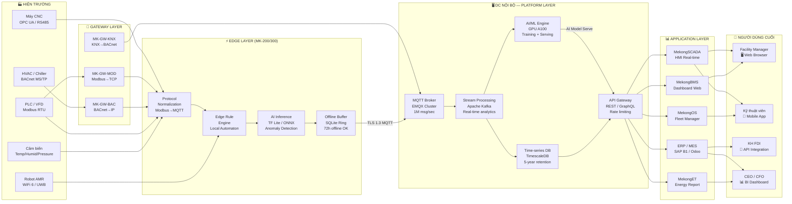
```mermaid
flowchart LR
    subgraph FIELD["🏭 HIỆN TRƯỜNG"]
        F1["Cảm biến<br/>Temp/Humid/Pressure"]
        F2["PLC / VFD<br/>Modbus RTU"]
        F3["HVAC / Chiller<br/>BACnet MS/TP"]
        F4["Máy CNC<br/>OPC UA / RS485"]
        F5["Robot AMR<br/>WiFi 6 / UWB"]
    end

    subgraph EDGE["⚡ EDGE LAYER (MK-200/300)"]
        E1["Protocol<br/>Normalization<br/>Modbus→MQTT"]
        E2["Edge Rule<br/>Engine<br/>Local Automaton"]
        E3["AI Inference<br/>TF Lite / ONNX<br/>Anomaly Detection"]
        E4["Offline Buffer<br/>SQLite Ring<br/>72h offline OK"]
    end

    subgraph GATEWAY_LAYER["🔌 GATEWAY LAYER"]
        G1["MK-GW-BAC<br/>BACnet→IP"]
        G2["MK-GW-MOD<br/>Modbus→TCP"]
        G3["MK-GW-KNX<br/>KNX→BACnet"]
    end

    subgraph DC_INTERNAL["🖥️ DC NỘI BỘ — PLATFORM LAYER"]
        P1["MQTT Broker<br/>EMQX Cluster<br/>1M msg/sec"]
        P2["Stream Processing<br/>Apache Kafka<br/>Real-time analytics"]
        P3["Time-series DB<br/>TimescaleDB<br/>5-year retention"]
        P4["AI/ML Engine<br/>GPU A100<br/>Training + Serving"]
        P5["API Gateway<br/>REST / GraphQL<br/>Rate limiting"]
    end

    subgraph APP_LAYER["📊 APPLICATION LAYER"]
        A1["MekongBMS<br/>Dashboard Web"]
        A2["MekongOS<br/>Fleet Manager"]
        A3["MekongSCADA<br/>HMI Real-time"]
        A4["MekongET<br/>Energy Report"]
        A5["ERP / MES<br/>SAP B1 / Odoo"]
    end

    subgraph USER_LAYER["👤 NGƯỜI DÙNG CUỐI"]
        U1["Facility Manager<br/>🖥️ Web Browser"]
        U2["Kỹ thuật viên<br/>📱 Mobile App"]
        U3["KH FDI<br/>🔗 API Integration"]
        U4["CEO / CFO<br/>📊 BI Dashboard"]
    end

    F1 & F2 --> E1
    F3 --> G1 --> E1
    F2 --> G2 --> E1
    F4 --> E1
    F5 --> E2

    E1 --> E2 --> E3 --> E4
    E4 --> |TLS 1.3 MQTT| P1

    G3 --> P1
    P1 --> P2 --> P3
    P2 --> P4
    P3 --> P5
    P4 --> |AI Model Serve| P5
    P5 --> A1 & A2 & A3 & A4 & A5

    A1 --> U1
    A2 --> U2
    A3 --> U1 & U2
    A4 --> U4
    A5 --> U3 & U4
```

> Kiến trúc phân lớp đảm bảo: độ trễ edge < 10ms (local automation), độ trễ nền tảng < 100ms (dashboard update), và khả năng offline hoạt động đầy đủ 72 giờ khi mất kết nối internet. Toàn bộ lưu lượng mã hoá TLS 1.3 end-to-end [A].

### 2.21.3. Sơ đồ Vòng đời Sản phẩm Tích hợp (Integrated Product Lifecycle)

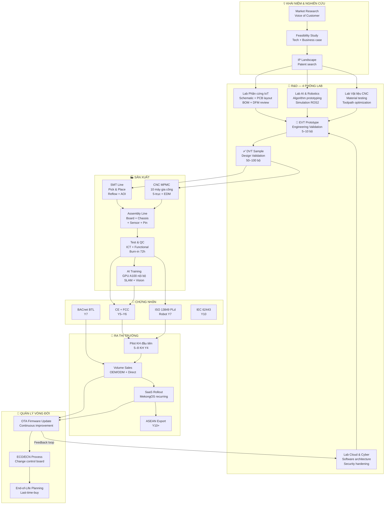
```mermaid
flowchart TD
    subgraph CONCEPT["💡 KHÁI NIỆM & NGHIÊN CỨU"]
        C1["Market Research<br/>Voice of Customer"]
        C2["Feasibility Study<br/>Tech + Business case"]
        C3["IP Landscape<br/>Patent search"]
    end

    subgraph RD["🔬 R&D — 4 PHÒNG LAB"]
        R1["Lab Phần cứng IoT<br/>Schematic + PCB layout<br/>BOM + DFM review"]
        R2["Lab AI & Robotics<br/>Algorithm prototyping<br/>Simulation ROS2"]
        R3["Lab Vật liệu CNC<br/>Material testing<br/>Toolpath optimization"]
        R4["Lab Cloud & Cyber<br/>Software architecture<br/>Security hardening"]
        R5["🧪 EVT Prototype<br/>Engineering Validation<br/>5–10 bộ"]
        R6["✅ DVT Sample<br/>Design Validation<br/>50–100 bộ"]
    end

    subgraph PROD["🏭 SẢN XUẤT"]
        direction LR
        P1["SMT Line<br/>Pick & Place<br/>Reflow + AOI"]
        P2["CNC MPMC<br/>10 máy gia công<br/>5-trục + EDM"]
        P3["Assembly Line<br/>Board + Chassis<br/>+ Sensor + Pin"]
        P4["Test & QC<br/>ICT + Functional<br/>Burn-in 72h"]
        P5["AI Training<br/>GPU A100 nội bộ<br/>SLAM + Vision"]
    end

    subgraph CERT["📜 CHỨNG NHẬN"]
        CE1["CE + FCC<br/>Y5–Y6"]
        CE2["BACnet BTL<br/>Y7"]
        CE3["ISO 13849 PLd<br/>Robot Y7"]
        CE4["IEC 62443<br/>Y10"]
    end

    subgraph MARKET["🚀 RA THỊ TRƯỜNG"]
        M1["Pilot KH đầu tiên<br/>5–8 KH Y4"]
        M2["Volume Sales<br/>OEM/ODM + Direct"]
        M3["SaaS Rollout<br/>MekongOS recurring"]
        M4["ASEAN Export<br/>Y10+"]
    end

    subgraph PLM["🔄 QUẢN LÝ VÒNG ĐỜI"]
        PL1["OTA Firmware Update<br/>Continuous improvement"]
        PL2["ECO/ECN Process<br/>Change control board"]
        PL3["End-of-Life Planning<br/>Last-time-buy"]
    end

    C1 --> C2 --> C3 --> R1
    C3 --> R2
    C3 --> R3
    R1 --> R5
    R2 --> R5
    R3 --> R5
    R4 --> R5
    R5 --> R6
    R6 --> P1 & P2
    P1 --> P3
    P2 --> P3
    P3 --> P4
    P4 --> P5
    P4 --> CE1 & CE3
    P5 --> CE1
    CE1 --> M1
    CE2 --> M2
    CE3 --> M1
    M1 --> M2 --> M3 --> M4
    M2 --> PL1 --> PL2
    M3 --> PL1
    PL2 --> PL3
    PL1 --> |Feedback loop| R4
```

> Vòng đời sản phẩm khép kín — từ concept đến EOL — được quản lý nội bộ 100%, loại bỏ rủi ro phụ thuộc vào đơn vị thiết kế bên ngoài và rút ngắn NPI thời gian dẫn xuống còn 8–12 tuần cho dòng tái sử dụng nền tảng [A].

---

## 2.22. Dịch vụ Gia công Phần mềm và Build Phần mềm Theo Yêu cầu

### 2.22.1. Định vị Chiến lược — Tại sao Mekong làm Gia công Phần mềm?

DC nội bộ với GPU cluster và Lab Cloud & Cybersecurity (LAB4) tạo ra tiềm năng cung cấp **dịch vụ gia công phần mềm chuyên biệt** cho phân khúc IoT công nghiệp, nhúng (embedded), và AI. Đây là mảng doanh thu mới bổ sung — **không thay thế** 2 trụ cột chính — với CAPEX gần như bằng 0 vì tận dụng hạ tầng DC và R&D đã đầu tư.

| Yếu tố | Lý do Mekong có lợi thế |
|---|---|
| **Chuyên môn sâu IoT/Embedded** | Đội ngũ R&D đang phát triển firmware MK-200/DDC/Robot — năng lực sẵn có |
| **Lab AI/GPU nội bộ** | GPU A100 để huấn luyện mô hình, không cần thuê cloud tốn kém |
| **Nền tảng tích hợp** | MekongOS là staging environment thực tế để test tích hợp ngay |
| **Khách hàng giao thoa** | FDI mua CNC/IoT hardware → thường cần cả phần mềm quản lý, dashboard, app |
| **Vị trí KCNC** | Các tenant SHTP/KCNC là khách hàng tự nhiên cho IT outsourcing nội khu |

> **Phân loại:** Mảng này hoàn toàn phù hợp QĐ 38/2020 (Hoạt động nghiên cứu–phát triển, chuyển giao công nghệ) và NĐ 76/2018 (hoạt động dịch vụ CNTT thuộc doanh nghiệp CNC) [A].

### 2.22.2. Danh mục Dịch vụ Gia công Phần mềm

| TT | Dịch vụ | Mô tả | Phân khúc khách hàng | Giá (USD) | Biên gộp |
|:---:|---|---|---|---:|:---:|
| 1 | **Embedded Firmware Development** | Phát triển firmware cho MCU/MPU (STM32, NXP, ESP32, RTOS) | Startup IoT, FDI electronics | 80-150 USD/giờ | 55-65% |
| 2 | **Custom IoT Application** | App web + mobile giám sát/điều khiển thiết bị IoT | Tòa nhà, nhà máy, khu CN | 15.000-80.000/dự án | 50-60% |
| 3 | **AI/ML Model Development** | Phát triển mô hình AI: predictive maintenance, anomaly detection, computer vision | FDI smart factory, robot SI | 20.000-150.000/dự án | 55-70% |
| 4 | **System Integration (SI) Software** | Tích hợp BMS + ERP + MES + SCADA (API bridge, middleware) | Nhà máy FDI, khu đô thị thông minh | 10.000-50.000/dự án | 50-65% |
| 5 | **OPC UA / Modbus / BACnet Driver** | Phát triển driver giao thức cho thiết bị bên thứ 3 | Siemens, Schneider integrator | 8.000-25.000/driver | 60-70% |
| 6 | **Cloud & Dashboard Development** | Xây dựng dashboard Grafana/React, data chuỗi đơn hàng, cloud API | Tất cả | 5.000-30.000/dự án | 55-65% |
| 7 | **Cybersecurity Assessment & Hardening** | Pen testing, IEC 62443 gap analysis, OT security design | FDI có yêu cầu ISO 27001/IEC 62443 | 5.000-20.000/assessment | 65-75% |
| 8 | **Digital Twin Prototype** | Xây dựng Digital Twin cho thiết bị/quy trình sản xuất | Nhà máy FDI tầm trung | 30.000-120.000/dự án | 50-60% |

**Tổng doanh thu mục tiêu — Dịch vụ gia công phần mềm:**

| Năm | Số dự án/hợp đồng | Doanh thu (K USD) | Ghi chú |
|---:|:---:|---:|---|
| Y3 | 2-3 | 30-50 | Pilot nội bộ + KH đầu tiên trong KCNC |
| Y5 | 5-8 | 100-180 | Mở rộng ra FDI tenant SHTP |
| Y7 | 10-15 | 250-400 | Scale, thêm AI/ML contracting |
| Y10 | 15-20 | 400-600 | Ổn định, tích hợp với MekongOS SaaS |
| **Y12+** | **18-25** | **500-700** | **Ổn định, recurring SI maintenance** |

> Doanh thu gia công phần mềm **chưa tính vào 12,00M USD canonical** — đây là upside tiềm năng nếu mảng này phát triển tốt. Khi có doanh thu thực tế từ Y5, sẽ điều chỉnh vào canonical [A].

### 2.22.3. Quy trình Giao nhận Dự án Phần mềm (Software Delivery Process)


```mermaid
flowchart LR
    subgraph INTAKE["📥 TIẾP NHẬN"]
        T1["RFI / RFQ<br/>từ khách hàng"]
        T2["Technical<br/>Qualification<br/>Fit với stack VN?"]
        T3["NDA + SoW<br/>Ký kết ban đầu"]
    end

    subgraph DISCOVERY["🔍 KHÁM PHÁ"]
        D1["Requirement<br/>Workshop<br/>2-5 ngày"]
        D2["Architecture<br/>Design<br/>HLD + LLD"]
        D3["Estimate &<br/>Proposal<br/>Fixed/T&M"]
        D4["Contract<br/>Sign-off<br/>Milestone plan"]
    end

    subgraph DEV["⚙️ PHÁT TRIỂN (AGILE SPRINT)"]
        SP1["Sprint 1<br/>2 tuần<br/>Foundation + PoC"]
        SP2["Sprint 2-N<br/>2 tuần/sprint<br/>Feature dev + Test"]
        SP3["Integration<br/>Testing<br/>Staging DC nội bộ"]
        SP4["UAT<br/>User Acceptance<br/>KH review"]
    end

    subgraph DELIVERY["🚀 BÀN GIAO"]
        DL1["Code Handover<br/>Git + Docs<br/>Runbook"]
        DL2["Training<br/>KH team<br/>1-3 ngày"]
        DL3["Go-Live<br/>Support 30 ngày<br/>Hypercare"]
    end

    subgraph MAINTAIN["🔄 DUY TRÌ & MỞ RỘNG"]
        M1["SLA Support<br/>8×5 hoặc 24×7"]
        M2["Monthly<br/>Retainer<br/>Bug fix + Minor feat"]
        M3["Phase 2<br/>Proposal<br/>Upsell"]
    end

    T1 --> T2 --> T3
    T3 --> D1 --> D2 --> D3 --> D4
    D4 --> SP1 --> SP2 --> SP3 --> SP4
    SP4 --> |Approved| DL1 --> DL2 --> DL3
    SP4 --> |Change request| SP2
    DL3 --> M1 --> M2 --> M3
    M3 --> |New SoW| D1

    style INTAKE fill:#e3f2fd,stroke:#1565c0
    style DISCOVERY fill:#e8f5e9,stroke:#2e7d32
    style DEV fill:#fff3e0,stroke:#e65100
    style DELIVERY fill:#f3e5f5,stroke:#6a1b9a
    style MAINTAIN fill:#e0f2f1,stroke:#00695c
```

**Mô hình Kinh doanh Gia công Phần mềm:**

| Mô hình | Phù hợp với | Cơ chế tính giá | Ưu điểm cho Mekong |
|---|---|---|---|
| **Fixed Price** | Dự án scope rõ ràng, ≤ 3 tháng | Giá cố định theo SoW | Dự báo doanh thu dễ dàng |
| **Time & Material (T&M)** | Dự án dài hạn, scope hay thay đổi | Rate × giờ làm việc | Linh hoạt, giảm rủi ro scope creep |
| **Retainer** | Duy trì hệ thống, support liên tục | Phí cố định/tháng | Doanh thu recurring, ổn định |
| **Mốc tiến độ-Based** | AI/ML project, Digital Twin | Thanh toán theo cột mốc | Dòng tiền sớm, giảm rủi ro |
| **Revenue Share** | Startup IoT có tiềm năng | % doanh thu sản phẩm | Upside tiềm năng cao |

### 2.22.4. Năng lực Kỹ thuật Đội Gia công Phần mềm

| Lĩnh vực | Ngôn ngữ / Khung | Chứng nhận mục tiêu | Năng lực hiện tại |
|---|---|---|---|
| **Embedded / Firmware** | C, C++, FreeRTOS, Zephyr, MicroPython | Arm Certified Developer | Sẵn có (từ R&D team) |
| **IoT Backend** | Python, Go, Node.js, MQTT, Kafka | AWS IoT, Azure IoT cert | Xây dựng Y4-Y5 |
| **AI/ML** | Python, PyTorch/TensorFlow, ONNX, ROS2 | NVIDIA DLI Certified | Sẵn có từ Robot R&D |
| **Frontend / Dashboard** | React.js, Grafana, D3.js, Flutter | — | Xây dựng Y4-Y5 |
| **DevOps / Cloud** | Docker, Kubernetes, Ansible, CI/CD | Kubernetes CKA | Xây dựng Y5-Y6 |
| **OT Security** | IEC 62443, NIST, Pen testing | CEH / OSCP | Xây dựng Y6-Y7 |

> **Nhân sự:** Mảng phần mềm vận hành với 8-12 kỹ sư từ **Lab Cloud & Cyber (LAB4)** và phần từ R&D team. Không cần tuyển dụng đột biến — tận dụng idle capacity giữa các sprint R&D sản phẩm. Từ Y7+, tách thành team riêng 12-15 người nếu doanh thu vượt 400K USD/năm [A].

---

## 2.23. Mô hình Tích hợp DC + R&D + Gia công — Cộng hưởng 3 Chiều

### 2.23.1. Kiến trúc Tích hợp DC với Hoạt động R&D và Gia công

DC nội bộ không chỉ là hạ tầng IT thụ động — mà là **"xương sống thông minh"** kết nối toàn bộ hoạt động R&D, sản xuất, phần mềm, và vận hành:


```mermaid
graph TB
    subgraph DC["DC NOI BO — XUONG SONG THONG MINH (5-8 Rack, 160m2)"]
        direction LR
        GPU["GPU Cluster\nA100/H100 — AI Training"]
        COMPUTE["App Servers\nMekongOS / BMS / ERP / MES"]
        STORAGE["Storage and DR\nNAS 200TB — 5yr retention"]
        NET["Network and Security\nSD-WAN / Firewall / VPN"]
    end

    subgraph USE1["R&D and PHAT TRIEN SAN PHAM"]
        direction LR
        U1A["AI SLAM / Vision\nRobot AMR training"]
        U1B["Digital Twin\nCNC + SMT sim"]
        U1C["CI/CD and OTA\nFirmware pipeline"]
    end

    subgraph USE2["VAN HANH SAN XUAT"]
        direction LR
        U2A["MES and ERP\nWork order / BOM"]
        U2B["OEE and SPC\nPredictive QC"]
        U2C["IoT giam sat\n10 CNC + nha xuong"]
    end

    subgraph USE3["GIA CONG PHAN MEM"]
        direction LR
        U3A["Dev / Staging\nDocker / K8s"]
        U3B["GPU-as-a-Tool\nAI/ML contracting"]
        U3C["Security Lab\nPen test / IEC 62443"]
    end

    subgraph USE4["SAAS and KHACH HANG"]
        direction LR
        U4A["MekongOS SaaS\n500+ tenant"]
        U4B["MekongBMS SaaS\n80-120 toa nha"]
        U4C["API Gateway\nFDI integration"]
    end

    GPU -->|AI jobs| U1A
    GPU -->|CV batch| U1B
    GPU -->|GPU tool| U3B
    COMPUTE -->|CI/CD| U1C
    COMPUTE -->|MES/ERP| U2A
    COMPUTE -->|OEE/SPC| U2B
    COMPUTE -->|Dev env| U3A
    COMPUTE -->|SaaS host| U4A
    COMPUTE -->|BMS SaaS| U4B
    COMPUTE -->|API GW| U4C
    STORAGE -->|Twin data| U1B
    STORAGE -->|QC log| U2B
    STORAGE -->|Test data| U3C
    NET -->|Pipeline| U1C
    NET -->|IoT stream| U2C
    NET -->|Staging net| U3A
    NET -->|CDN| U4C

    style DC fill:#ede7f6,stroke:#4a148c,color:#000
    style USE1 fill:#e3f2fd,stroke:#1565c0,color:#000
    style USE2 fill:#e8f5e9,stroke:#2e7d32,color:#000
    style USE3 fill:#fff3e0,stroke:#e65100,color:#000
    style USE4 fill:#fce4ec,stroke:#880e4f,color:#000
```

### 2.23.2. Phân bổ Tải DC theo Hoạt động

| Hoạt động | Rack sử dụng | GPU giờ/tháng | Storage (TB) | Tỷ trọng chi phí DC |
|---|:---:|---:|---:|:---:|
| AI Training Robot SLAM (R&D) | 1-2 | 200-400 | 10 | 25% |
| MekongOS + BMS SaaS (khách hàng) | 2 | 50 | 20 | 30% |
| ERP + MES + MekongOS nội bộ | 1 | 20 | 15 | 20% |
| Gia công phần mềm (staging, CI/CD) | 0.5-1 | 100-200 | 5 | 15% |
| Backup + DR + Security | 0.5 | 0 | 80 | 10% |
| **Tổng** | **5-7,5 rack** | **370-670** | **130** | **100%** |

> Tổng OPEX DC nội bộ ~0,40M USD/năm [C] được phân bổ theo tỷ trọng. Chi phí gia công phần mềm chiếm ~15% = **60K USD/năm** — tương đương giá thuê GPU cloud ~1.500h/tháng trên AWS (tiết kiệm ~40% so với thuê ngoài) [A].

### 2.23.3. Sơ đồ Cộng hưởng Phân khúc Gia công CNC + Phần mềm

Nhiều khách hàng FDI cần **cả hai**: gia công chi tiết cơ khí chính xác (CNC) VÀ phần mềm quản lý/giám sát (IoT/SCADA). Mekong là đơn vị duy nhất tại KCNC cung cấp cả hai trong một hợp đồng tích hợp:

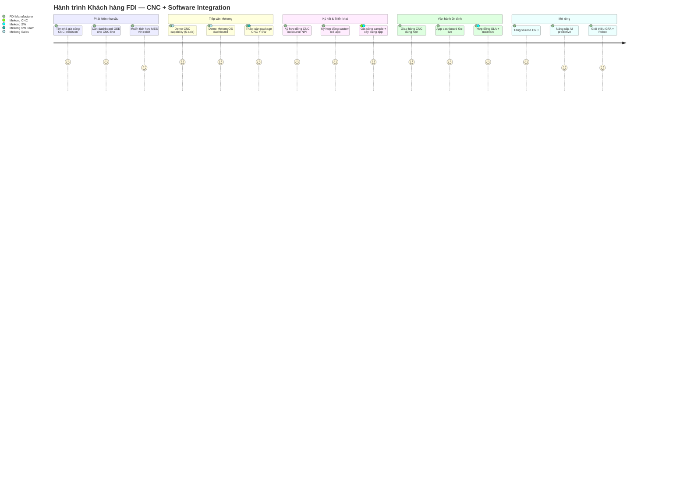
```mermaid
journey
    title Hành trình Khách hàng FDI — CNC + Software Integration
    section Phát hiện nhu cầu
      Tìm nhà gia công CNC precision: 5: FDI Manufacturer
      Cần dashboard OEE cho CNC line: 5: FDI Manufacturer
      Muốn tích hợp MES với robot: 4: FDI Manufacturer
    section Tiếp cận Mekong
      Demo CNC capability (5-axis): 5: FDI Manufacturer, Mekong Sales
      Demo MekongOS dashboard: 5: FDI Manufacturer, Mekong Sales
      Thảo luận package CNC + SW: 5: FDI Manufacturer, Mekong SW Team
    section Ký kết & Triển khai
      Ký hợp đồng CNC outsource NPI: 5: FDI Manufacturer
      Ký hợp đồng custom IoT app: 5: FDI Manufacturer
      Gia công sample + xây dựng app: 5: Mekong CNC, Mekong SW
    section Vận hành ổn định
      Giao hàng CNC đúng hạn: 5: FDI Manufacturer
      App dashboard Go-live: 5: FDI Manufacturer
      Hợp đồng SLA + maintain: 5: FDI Manufacturer, Mekong SW
    section Mở rộng
      Tăng volume CNC: 5: FDI Manufacturer
      Nâng cấp AI predictive: 4: FDI Manufacturer
      Giới thiệu GFA + Robot: 4: FDI Manufacturer
```

**Gói Dịch vụ Tích hợp CNC + Phần mềm (Integrated Service Package):**

| Gói | Thành phần | Giá trị (USD/năm) | Đối tượng |
|---|---|---:|---|
| **Pack A — CNC Starter** | 200 giờ CNC + MekongOS Starter (10 device) | 12.000-18.000 | SME, startup |
| **Pack B — Smart Factory Lite** | 400 giờ CNC + MES dashboard + IoT 50 device + support | 35.000-55.000 | Nhà máy tầm trung |
| **Pack C — FDI Premium** | 800+ giờ CNC 5-axis + Custom app + AMR 1 bộ + SLA | 120.000-200.000 | FDI tầm cao |
| **Pack D — Full Integration** | CNC full-time + SW team dedicated + Robot fleet + AI | > 300.000 | KH neo lớn |

> Chiến lược "bundled service" giúp tăng deal size trung bình từ 20-30K USD (CNC thuần) lên 50-150K USD (tích hợp), đồng thời tạo lock-in dài hạn thông qua SaaS thuê bao và maintenance contract. Tỷ lệ chuyển đổi từ CNC-only sang integrated package mục tiêu: 30% KH từ Y7 [A].

### 2.23.4. Lộ trình Phát triển Mảng Gia công Phần mềm (Y3-Y12)

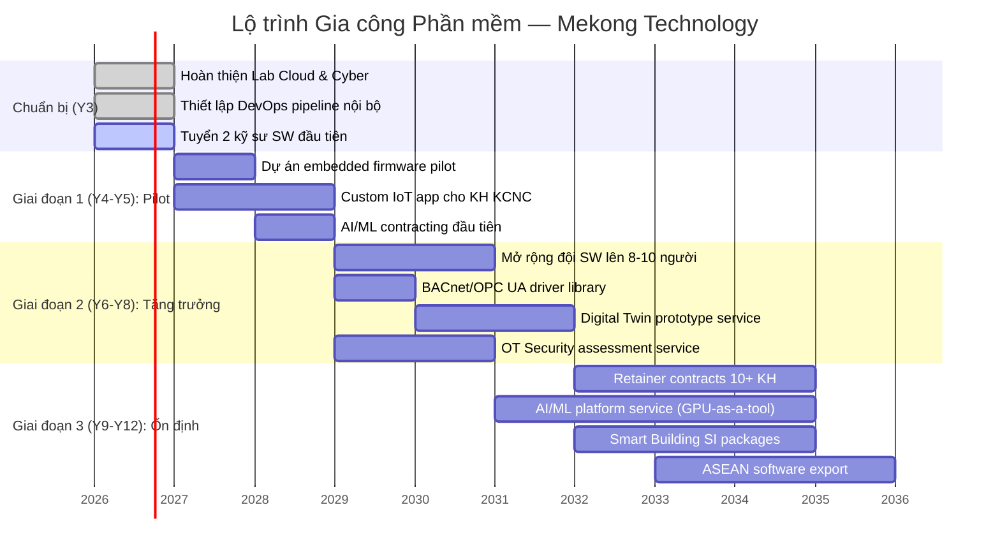
```mermaid
gantt
    title Lộ trình Gia công Phần mềm — Mekong Technology
    dateFormat YYYY
    axisFormat %Y

    section Chuẩn bị (Y3)
    Hoàn thiện Lab Cloud & Cyber     :done, lab, 2026, 2027
    Thiết lập DevOps pipeline nội bộ :done, devops, 2026, 2027
    Tuyển 2 kỹ sư SW đầu tiên        :active, hire1, 2026, 2027

    section Giai đoạn 1 (Y4-Y5): Pilot
    Dự án embedded firmware pilot     :pilot1, 2027, 2028
    Custom IoT app cho KH KCNC        :pilot2, 2027, 2029
    AI/ML contracting đầu tiên        :pilot3, 2028, 2029

    section Giai đoạn 2 (Y6-Y8): Tăng trưởng
    Mở rộng đội SW lên 8-10 người    :expand1, 2029, 2031
    BACnet/OPC UA driver library       :driverlib, 2029, 2030
    Digital Twin prototype service     :dt1, 2030, 2032
    OT Security assessment service     :sec1, 2029, 2031

    section Giai đoạn 3 (Y9-Y12): Ổn định
    Retainer contracts 10+ KH          :retainer, 2032, 2035
    AI/ML platform service (GPU-as-a-tool) :gputool, 2031, 2035
    Smart Building SI packages         :si2, 2032, 2035
    ASEAN software export              :asean_sw, 2033, 2036
```

---

## 2.24. Sơ đồ Hệ thống Chi tiết — BMS + SCADA + IoT (Triển khai View)

### 2.24.1. Sơ đồ Triển khai Điển hình — Tòa nhà Thương mại (BMS Full)

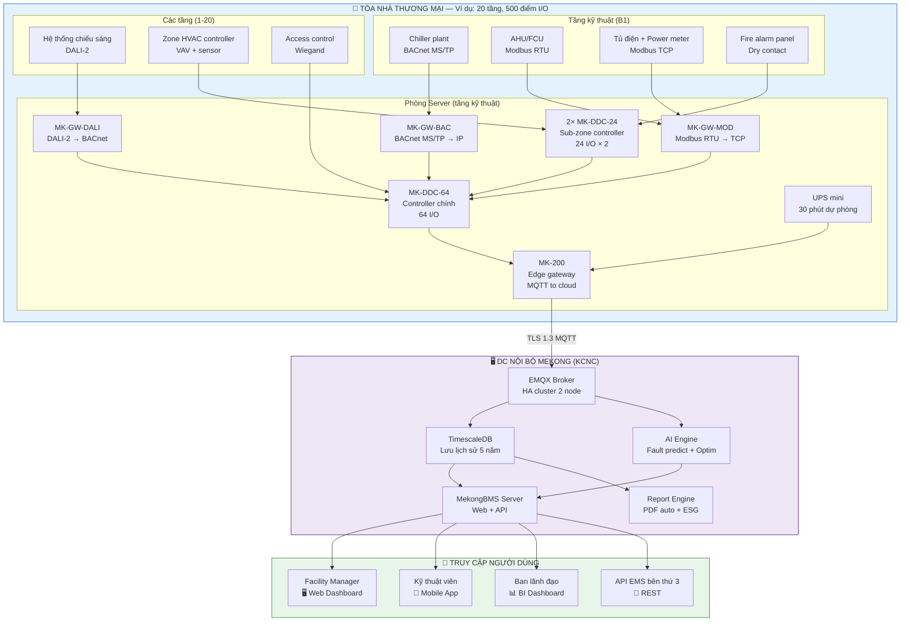
```mermaid
flowchart TB
    subgraph BUILDING["🏢 TÒA NHÀ THƯƠNG MẠI — Ví dụ: 20 tầng, 500 điểm I/O"]
        subgraph B1F["Tầng kỹ thuật (B1)"]
            CHILLER["Chiller plant<br/>BACnet MS/TP"]
            AHU["AHU/FCU<br/>Modbus RTU"]
            ELEC["Tủ điện + Power meter<br/>Modbus TCP"]
            FIRE["Fire alarm panel<br/>Dry contact"]
        end
        subgraph FLOORS["Các tầng (1-20)"]
            LIGHT["Hệ thống chiếu sáng<br/>DALI-2"]
            HVAC_Z["Zone HVAC controller<br/>VAV + sensor"]
            ACCESS["Access control<br/>Wiegand"]
        end
        subgraph SERVER_ROOM["Phòng Server (tầng kỹ thuật)"]
            DDC64["MK-DDC-64<br/>Controller chính<br/>64 I/O"]
            DDC24["2× MK-DDC-24<br/>Sub-zone controller<br/>24 I/O × 2"]
            GW_BAC["MK-GW-BAC<br/>BACnet MS/TP → IP"]
            GW_MOD["MK-GW-MOD<br/>Modbus RTU → TCP"]
            GW_DALI["MK-GW-DALI<br/>DALI-2 → BACnet"]
            MK200_SRV["MK-200<br/>Edge gateway<br/>MQTT to cloud"]
            UPS_LOCAL["UPS mini<br/>30 phút dự phòng"]
        end
    end

    subgraph MEKONG_DC["🖥️ DC NỘI BỘ MEKONG (KCNC)"]
        MQTT_BROKER["EMQX Broker<br/>HA cluster 2 node"]
        TSDB["TimescaleDB<br/>Lưu lịch sử 5 năm"]
        AI_ENG["AI Engine<br/>Fault predict + Optim"]
        BMS_SERVER["MekongBMS Server<br/>Web + API"]
        REPORT_ENG["Report Engine<br/>PDF auto + ESG"]
    end

    subgraph USER_ACCESS["👤 TRUY CẬP NGƯỜI DÙNG"]
        FM_WEB["Facility Manager<br/>🖥️ Web Dashboard"]
        TECH_MOBILE["Kỹ thuật viên<br/>📱 Mobile App"]
        CEO_BI["Ban lãnh đạo<br/>📊 BI Dashboard"]
        EMS_API["API EMS bên thứ 3<br/>🔗 REST"]
    end

    CHILLER --> GW_BAC
    AHU --> GW_MOD
    ELEC --> GW_MOD
    FIRE --> DDC24
    LIGHT --> GW_DALI
    HVAC_Z --> DDC24
    ACCESS --> DDC64

    GW_BAC --> DDC64
    GW_MOD --> DDC64
    GW_DALI --> DDC64
    DDC24 --> DDC64
    DDC64 --> MK200_SRV

    MK200_SRV --> |TLS 1.3 MQTT| MQTT_BROKER
    MQTT_BROKER --> TSDB
    MQTT_BROKER --> AI_ENG
    TSDB --> BMS_SERVER
    AI_ENG --> BMS_SERVER
    TSDB --> REPORT_ENG
    BMS_SERVER --> FM_WEB & TECH_MOBILE & CEO_BI & EMS_API
    UPS_LOCAL --> MK200_SRV

    style BUILDING fill:#e3f2fd,stroke:#1565c0
    style MEKONG_DC fill:#ede7f6,stroke:#4a148c
    style USER_ACCESS fill:#e8f5e9,stroke:#2e7d32
```

**Điểm nổi bật từ sơ đồ triển khai:**

| Thành phần Mekong | Vai trò | Thiết bị thay thế (nếu không dùng Mekong) | Tiết kiệm |
|---|---|---|---:|
| MK-DDC-64 | Controller chính toàn nhà | Schneider SmartStruxure SCD (6.000 USD) | 30-40% |
| MK-DDC-24 × 2 | Zone controller | Siemens PXC36 (2.500 USD/bộ) | 25-35% |
| MK-GW-BAC + MOD | Protocol gateway | Delta Controls (1.200 USD/bộ) | 20-30% |
| MekongBMS SaaS | Phần mềm quản lý | Honeywell EBI (15.000 USD/license) | 50-60% |
| MK-200 Edge | Cloud connectivity | 3rd party IoT gateway (800-1.200 USD) | 30-50% |
| **Tổng gói BMS full (500 điểm)** | — | **~80.000-120.000 USD** | **40-50%** |

> Giải pháp BMS trọn gói từ Mekong tiết kiệm 40-50% chi phí so với tích hợp thiết bị đa nhãn hiệu. Đây là lập luận thương mại cốt lõi khi tiếp cận khách hàng tòa nhà hạng B-C tại thị trường Việt Nam [A][B].

### 2.24.2. Sơ đồ Triển khai Điển hình — Nhà máy FDI (Smart Factory)

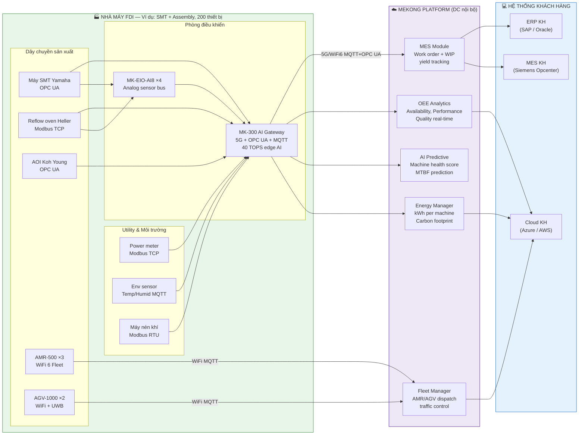
```mermaid
flowchart LR
    subgraph FACTORY["🏭 NHÀ MÁY FDI — Ví dụ: SMT + Assembly, 200 thiết bị"]
        subgraph PROD_LINE["Dây chuyền sản xuất"]
            MACHINE1["Máy SMT Yamaha<br/>OPC UA"]
            MACHINE2["Reflow oven Heller<br/>Modbus TCP"]
            MACHINE3["AOI Koh Young<br/>OPC UA"]
            ROBOT_FACTORY["AMR-500 ×3<br/>WiFi 6 Fleet"]
            AGV_FACTORY["AGV-1000 ×2<br/>WiFi + UWB"]
        end
        subgraph UTIL_FACTORY["Utility & Môi trường"]
            PWR_METER["Power meter<br/>Modbus TCP"]
            ENV_SENSOR["Env sensor<br/>Temp/Humid MQTT"]
            COMPRESS["Máy nén khí<br/>Modbus RTU"]
        end
        subgraph CTRL_ROOM["Phòng điều khiển"]
            MK300_FAC["MK-300 AI Gateway<br/>5G + OPC UA + MQTT<br/>40 TOPS edge AI"]
            MK_EIO_FAC["MK-EIO-AI8 ×4<br/>Analog sensor bus"]
        end
    end

    subgraph MEKONOS_FACTORY["☁️ MEKONG PLATFORM (DC nội bộ)"]
        MES_MODULE["MES Module<br/>Work order + WIP<br/>yield tracking"]
        OEE_ENGINE["OEE Analytics<br/>Availability, Performance<br/>Quality real-time"]
        AI_PREDICT["AI Predictive<br/>Machine health score<br/>MTBF prediction"]
        FLEET_MGR["Fleet Manager<br/>AMR/AGV dispatch<br/>traffic control"]
        ENERGY_MGR["Energy Manager<br/>kWh per machine<br/>Carbon footprint"]
    end

    subgraph KH_SYSTEMS["💻 HỆ THỐNG KHÁCH HÀNG"]
        ERP_KH["ERP KH<br/>(SAP / Oracle)"]
        MES_KH["MES KH<br/>(Siemens Opcenter)"]
        CLOUD_KH["Cloud KH<br/>(Azure / AWS)"]
    end

    MACHINE1 --> MK300_FAC
    MACHINE2 --> MK300_FAC
    MACHINE3 --> MK300_FAC
    MACHINE1 & MACHINE2 --> MK_EIO_FAC --> MK300_FAC
    ROBOT_FACTORY & AGV_FACTORY --> |WiFi MQTT| FLEET_MGR
    PWR_METER --> MK300_FAC
    ENV_SENSOR --> MK300_FAC
    COMPRESS --> MK300_FAC

    MK300_FAC --> |5G/WiFi6 MQTT+OPC UA| MES_MODULE
    MK300_FAC --> OEE_ENGINE
    MK300_FAC --> AI_PREDICT
    MK300_FAC --> ENERGY_MGR

    MES_MODULE --> ERP_KH
    MES_MODULE --> MES_KH
    OEE_ENGINE --> CLOUD_KH
    FLEET_MGR --> CLOUD_KH
    ENERGY_MGR --> CLOUD_KH

    style FACTORY fill:#e8f5e9,stroke:#2e7d32
    style MEKONOS_FACTORY fill:#ede7f6,stroke:#4a148c
    style KH_SYSTEMS fill:#e3f2fd,stroke:#1565c0
```

> MK-300 với 40 TOPS AI tại edge xử lý **100% dữ liệu máy sản xuất ngay tại chỗ** — chỉ gửi anomaly alert và aggregated metrics lên DC. Điều này giảm 90% băng thông và đảm bảo vận hành khi mất kết nối WAN [A].

---

## 2.25. Tổng hợp Giá trị Mảng Phát triển Mới — R&D + DC + Gia công Phần mềm

### 2.25.1. Ma trận Nguồn Doanh thu Mới (Upside)

| Nguồn | Năm bắt đầu | DT ổn định (K USD/năm) | CAPEX bổ sung | Biên gộp | Trạng thái |
|---|:---:|---:|---:|:---:|:---:|
| Embedded firmware contracting | Y4 | 100-150 | 0 | 60-65% | Upside |
| Custom IoT app development | Y4 | 150-200 | 0 | 55-60% | Upside |
| AI/ML model contracting | Y5 | 100-200 | 50K (GPU upgrade) | 60-70% | Upside |
| SI software integration | Y5 | 100-150 | 0 | 55-65% | Upside |
| OT Security assessment | Y6 | 50-80 | 0 | 65-75% | Upside |
| Digital Twin service | Y7 | 100-150 | 0 | 50-60% | Upside |
| **Tổng gia công phần mềm** | **Y4+** | **600-930** | **~50K** | **~60%** | |
| Integrated CNC + SW packages | Y6 | 200-400 | 0 | Mix | Upside |
| **Tổng upside tiềm năng** | | **800-1.330** | **~50K** | | |

> Tổng upside doanh thu từ gia công phần mềm và gói tích hợp tích luỹ đến ổn định ước tính **0,80-1,33M USD/năm**, tương đương 6,7-11,1% doanh thu canonical 12,00M USD. Đây là **upside phi canonical** — sẽ bổ sung vào canonical chỉ khi có hợp đồng thực tế ký kết từ Y5 [A].

### 2.25.2. Tác động lên IRR nếu Upside Thực hiện được

| Kịch bản | DT Y12+ (M USD) | IRR ước tính | NPV (50Y, WACC 12%) | Ghi chú |
|---|---:|:---:|---:|---|
| Base case (canonical) | 12,00 | 13,0% | 1,50M | [C] |
| Upside nhẹ (+0,50M/năm) | 12,50 | ~13,5% | ~1,80M | Software contracts win |
| Upside mạnh (+1,00M/năm) | 13,00 | ~14,0% | ~2,10M | Full integrated packages |
| Upside tối đa (+1,33M/năm) | 13,33 | ~14,3% | ~2,30M | Tất cả mảng phát triển |

> **Lưu ý CEO:** Bảng tác động IRR là ước tính định hướng [A] — không phải số liệu canonical. Chỉ điều chỉnh canonical khi có doanh thu thực tế xác nhận từ 2 năm liên tiếp. Nguyên tắc thận trọng tài chính bắt buộc [C].

### 2.25.3. Bảng Quyết định Ưu tiên Đầu tư Mảng Mới

| Mảng | Độ ưu tiên | Hành động ngay (Y3-Y4) | Điều kiện kích hoạt đầy đủ |
|---|:---:|---|---|
| Embedded firmware contracting | **P1** | Phân công 2 kỹ sư từ R&D team, thiết lập billing/contract template | 2+ KH ký hợp đồng |
| Custom IoT app (Dashboard, Mobile) | **P1** | Xây dựng reusable khung từ MekongOS | 3+ KH pilot |
| AI/ML contracting | **P2** | Chuẩn bị GPU usage metering, định giá model | 1 AI project anchor |
| SI + BMS integration | **P2** | Package template + SoW template chuẩn | BMS deal > 50K |
| Digital Twin service | **P3** | Sau khi MekongOS v2.0 stable | Smart factory anchor KH |
| OT Security | **P3** | Sau khi có OSCP/CEH certified engineer | FDI yêu cầu IEC 62443 |

<!-- === SECTION: P3_MO_HINH_KINH_DOANH === -->

# PHẦN III: MÔ HÌNH KINH DOANH

---

## 3.1. Tổng quan Mô hình Doanh thu

Mekong Technology vận hành mô hình doanh thu đa dạng từ **2 trụ cột kinh doanh**, với **9 nguồn doanh thu chính** phân loại thành 4 nhóm:

### Nhóm 1: Doanh thu Sản phẩm (Product Revenue)

| # | Nguồn | Trụ cột | Mô hình | Tỷ trọng Y12+ |
|:---:|---|:---:|---|---:|
| 1 | Bán IoT Gateway (MK-200/300) | BU1 | Bán đứt + Bảo hành 1 năm | 17% |
| 2 | Bán Robot AMR/AGV | BU1 | Bán đứt + Hợp đồng bảo trì | 20% |
| 3 | Gia công CNC B2B | BU2 | Hợp đồng cung ứng 1-5 năm | 29% |

### Nhóm 2: Doanh thu Dịch vụ Định kỳ (Recurring Revenue)

| # | Nguồn | Trụ cột | Mô hình | Tỷ trọng Y12+ |
|:---:|---|:---:|---|---:|
| 4 | MekongOS SaaS | BU1 | Thuê bao tháng/năm | 6% |
| 5 | MekongBMS License + SaaS | BU1 | License + thuê bao lưu trữ | 6% |

### Nhóm 3: Doanh thu Components (OEM/ODM)

| # | Nguồn | Trụ cột | Mô hình | Tỷ trọng Y12+ |
|:---:|---|:---:|---|---:|
| 6 | OEM/ODM Điện tử | BU1 | Hợp đồng sản xuất 6-24 tháng | 9% |
| 7 | I/O Modules + DDC + GW | BU1 | Bán đứt qua kênh BMS | 10% |

### Nhóm 4: Doanh thu Giá trị Gia tăng (VAS Revenue)

| # | Nguồn | Trụ cột | Mô hình | Tỷ trọng Y12+ |
|:---:|---|:---:|---|---:|
| 8 | Bảo trì Robot (AMR/AGV) | BU1 | Hợp đồng bảo trì hàng năm | 2% |
| 9 | Đào tạo CNC | BU2 | Khóa đào tạo cho đối tác | 1% |

> **Khác biệt V3 vs V2:** V2 có 12 nguồn doanh thu bao gồm Colocation, GPU-as-a-Service, Managed Services DC, Internet Transit, Cross-connect, SOC (6 nguồn DC thương mại). V3 loại bỏ toàn bộ 6 nguồn DC, tập trung vào 9 nguồn từ sản xuất và dịch vụ kỹ thuật [C].

### Cơ cấu Doanh thu theo Năm (V3 — 2 Trụ cột)

| Năm | BU1: IoT/BMS/Robot (M USD) | BU2: CNC (M USD) | **Tổng (M USD)** |
|---:|---:|---:|---:|
| Y4 | 0,80 | 0,20 | **1,00** |
| Y5 | 1,80 | 0,70 | **2,50** |
| Y6 | 3,30 | 1,20 | **4,50** |
| Y7 | 4,70 | 2,00 | **6,70** |
| Y8 | 6,20 | 2,50 | **8,70** |
| Y9 | 7,00 | 3,00 | **10,00** |
| Y10 | 7,80 | 3,20 | **11,00** |
| Y12+ | 8,50 | 3,50 | **12,00** |

> Doanh thu Y4 = 1,00M (IoT khai trương), Y8 = 8,70M, ổn định Y12+ = 12,00M USD/năm. Doanh thu 15Y tích lũy: ~140M USD [C].

---

## 3.2. Khách hàng Mục tiêu và Chiến lược Tiếp cận

### 3.2.1. Phân loại Khách hàng (V3 — 2 Trụ cột)

| Nhóm | Mô tả | Quy mô | Trụ cột phục vụ | Chiến lược |
|---|---|---:|---|---|
| **FDI Top-tier** | Samsung, Intel, Bosch, VinFast | 5-10 KH | CNC + IoT | Account-Based Marketing, đội sales chuyên biệt |
| **FDI Mid-tier** | Nidec, Jabil, Canon, Renesas | 10-20 KH | CNC + IoT | Trade show + Giới thiệu từ FDI Top |
| **VN Enterprise** | VNPT, FPT, VNG, Techcombank | 20-50 KH | IoT/BMS | Digital marketing + Partner channel |
| **KCNC Ecosystem** | DN trong KCNC TP.HCM | 50-100 KH | IoT SaaS | On-site demo + Ưu đãi proximity |
| **DNNVV** | Sản xuất nhỏ và vừa | 500-2.000 KH | IoT SaaS | Online sales + Channel partner |

### 3.2.2. Chiến lược Bán hàng theo Trụ cột

**CNC — B2B Direct Sales:**
- Thời gian closing: 3-12 tháng (đặc thù gia công B2B)
- Quy trình: First Article Inspection (FAI) → Trial order (10-50 chi tiết) → Volume order → Annual contract
- Payment terms: Net 30-60 ngày (chuẩn FDI)
- Key Performance: ≥ 3 LOI được ký trước khi vận hành, doanh thu ≥ 0,50M USD năm Y4

**IoT/Robot — Multi-Channel:**
- Kênh trực tiếp: Đội sales 8-12 người (Key Account + Regional)
- Kênh gián tiếp: 5-10 đại lý (System Integrators, VAR)
- Kênh online: Website, MekongOS trial, Webinar
- Closing time: 1-6 tháng

---

## 3.3. Chiến lược Phát triển Theo Giai đoạn (V3)

| Giai đoạn | Thời gian | CAPEX (M USD) | Mục tiêu chiến lược | Revenue target |
|---|---|---:|---|---|
| **Phase 0: Pháp lý** | Y0-Y1 | 1,50 | Giấy phép, thiết kế, sổ đỏ tạm | 0 |
| **Phase 1: Nền tảng** | Y1-Y3 | 8,45 | Xây dựng 3 công trình (**xưởng 2 tầng**), hạ tầng M&E | 0 |
| **Phase 2: Tăng trưởng** | Y3-Y5 | 9,60 | Lắp đặt CNC, SMT, DC nội bộ, IoT sản xuất | 1,00-3,00M/năm |
| **Phase 3: Mở rộng** | Y5-Y7 | 2,45 | Robot AMR scale, CNC thêm máy, BMS phát triển | 5,50-7,00M/năm |
| **Tái đầu tư** | Y7+ | Từ lợi nhuận | Xuất khẩu ASEAN, CNC nâng cấp, BMS/SCADA | > 8,70M/năm |
| **Tổng** | | **22,00** | | |

> Lộ trình 4 Phase (0-1-2-3) phù hợp với CAPEX 22,00M USD. CSH 18,00M USD chi phủ Phase 0-2, vay 4,00M USD từ Y7 cho Phase 3 [C]. Nhà xưởng 2 tầng (Phase 1) tăng GFA 54,6% trong cùng footprint — không tăng diện tích đất, không vượt 14 m chiều cao KCNC.

---

## 3.4. Đối tác Chiến lược và Business Model Canvas

### 3.4.1. Đối tác Chiến lược (V3)

| Đối tác | Loại hình | Lĩnh vực | Giá trị hợp tác |
|---|---|---|---|
| DMG MORI Vietnam | Nhà cung cấp | CNC | Mua máy + Đào tạo + Bảo trì |
| Schneider Electric | Nhà cung cấp | Hạ tầng điện | UPS, PDU, tự động hóa |
| Siemens | Nhà cung cấp | BMS | MindSphere, reference design |
| JETRO Vietnam | Hỗ trợ | B2B Match | Kết nối nhà sản xuất Nhật cần CNC |
| KOTRA Vietnam | Hỗ trợ | B2B Match | Kết nối nhà sản xuất Hàn cần CNC |
| Hexagon Manufacturing Intelligence | Nhà cung cấp | QA/QC | CMM + Phần mềm + Đào tạo |
| Bộ KH&CN / NATEC | Chính phủ | R&D Grant | Hỗ trợ đề tài R&D + Trợ cấp |

> V3 không có đối tác NVIDIA (DGX) và FPT Telecom (Dark fiber) vì không có DC thương mại. GPU nội bộ mua lẻ theo nhu cầu AI training [C].

### 3.4.2. Business Model Canvas (V3 — 2 Trụ cột)

| Khối | Nội dung |
|---|---|
| **Đề xuất Giá trị** | Hệ sinh thái IoT+CNC tích hợp — gia công khung robot nội bộ, sản xuất electronics, one-stop cho FDI |
| **Phân khúc KH** | FDI (Samsung, Bosch, Canon), Enterprise VN, DNNVV, KCNC Ecosystem |
| **Kênh tiếp cận** | Direct sales (CNC), Digital + Channel (IoT), On-site demo (KCNC) |
| **Quan hệ KH** | Dedicated Account Manager (FDI), Self-service (SaaS), Community (KCNC) |
| **Dòng doanh thu** | CNC gia công (29%), IoT/Robot bán SP (37%), BMS/SaaS (12%), OEM/ODM (9%), VAS (3%) |
| **Tài nguyên chính** | 10 máy CNC, SMT line, 4 Lab R&D, 100-130 nhân sự, IP (MekongOS + Patents) |
| **Hoạt động chính** | Gia công CNC → Sản xuất IoT/Robot → Phát triển MekongOS/BMS → R&D |
| **Đối tác chính** | DMG MORI, Schneider, Siemens, JETRO/KOTRA, Hexagon |
| **Cơ cấu chi phí** | CAPEX 22,00M; OPEX (ước lượng): Nhân công SX 21%, NVL 42%, R&D 11%, SGA 12%, DC+Đất+BH 8%, KH 16% — xem chi tiết §3.13 và §5.3 |

---

## 3.5. Chiến lược Giá Chi tiết (Chiến lược Định giá)

### 3.5.1. Nguyên tắc Định giá

1. **Cost-Plus Mức cơ sở:** Giá sàn = chi phí biến đổi + phân bổ cố định + biên lợi nhuận tối thiểu 15%
2. **Value-Based Ceiling:** Giá trần theo willingness-to-pay, chuẩn ngành đối thủ khu vực
3. **Penetration Entry:** Y4-Y5 giá thâm nhập thấp hơn 10-15% thị trường
4. **Premium Upsell:** Từ Y6+ sau khi có chứng nhận ISO 9001, nâng giá ngang hoặc cao hơn 5-10%

### 3.5.2. Bảng Giá BU1 — IoT/Robot

| Sản phẩm | Giá Bán (USD) | COGS (USD) | Biên Gộp | Chuẩn ngành | Chiến lược |
|---|---:|---:|:---:|---|---|
| MK-200 (cơ bản) | 350-450 | 190 | 48-51% | Advantech: 500-700 | Thấp hơn 30% → thâm nhập |
| MK-300 (nâng cao) | 650-850 | 320-400 | 50-53% | Cisco IR1101: 900-1.200 | Thấp hơn 25% |
| Robot AMR-500 | 18.000-25.000 | 12.000-15.000 | 33-40% | MiR250: 35.000-50.000 | Thấp hơn 25-30% |
| Robot AMR-1000 | 28.000-38.000 | 17.000-23.000 | 39-40% | Geek+: 40.000-60.000 | Thấp hơn 15-20% |
| Robot AGV-500 | 12.000-18.000 | 8.000-11.000 | 33-39% | TQ AGV: 15.000-25.000 | Tương đương |
| MekongOS SaaS (Pro) | 79/tháng/TB | 15 | 81% | AWS IoT: 100-200/th | Giá trị cao, tích hợp |
| MekongBMS License | 5.000-15.000/tòa | 1.500-4.000 | 70-73% | Niagara: 15.000-40.000 | Thấp hơn 50-60% |

> Biên gộp IoT trung bình: 45-55% (phần cứng) + 72-85% (SaaS). Blended margin hướng tới 55-60% khi tỷ trọng SaaS tăng [C].

### 3.5.3. Bảng Giá BU2 — CNC Outsourcing

| Dịch vụ | Đơn giá (USD) | Chi phí (USD) | Biên Gộp | Chuẩn ngành |
|---|---:|---:|:---:|---|
| CNC 3 trục — Nhôm | 28-40/giờ máy | 18-22 | 36-45% | VN market: 25-35 |
| CNC 3 trục — Thép | 30-42/giờ máy | 20-25 | 33-40% | VN market: 28-38 |
| CNC 5 trục — Nhôm | 45-55/giờ máy | 28-32 | 38-42% | TW/TH: 50-70 |
| CNC 5 trục — Thép/Inox | 55-70/giờ máy | 35-42 | 36-40% | TW/TH: 65-90 |
| CNC 5 trục — Titan | 80-120/giờ máy | 50-70 | 38-42% | Nhật/Đức: 120-180 |
| Wire EDM | 35-50/giờ máy | 22-30 | 37-40% | VN: 30-45 |
| Surface Grinding | 25-35/giờ máy | 15-20 | 40-43% | VN: 20-30 |
| Đo lường CMM (FAI) | 150-300/báo cáo | 80-150 | 47-50% | Thị trường: 200-500 |
| Đào tạo CNC (3 tháng) | 3.000-5.000/người | 1.500-2.500 | 50% | DMG MORI: 8.000-12.000 |

> Biên gộp CNC trung bình: 35-42%. V3 có thêm Wire EDM và Surface Grinder — tăng khả năng tự chủ xử lý bề mặt, giảm thuê ngoài [C].

**Lộ trình Giá CNC:**

| Giai đoạn | Chứng nhận | Hệ số Giá | Ví dụ: 5-trục Nhôm/giờ |
|---|---|:---:|---:|
| Y4 (Entry) | Chưa có | 1,00× | 45 USD |
| Y5+ (ISO 9001) | ISO 9001:2015 | 1,05-1,10× | 47-50 USD |
| Y10+ (Option) | IATF 16949 hoặc AS9100 | 1,20-1,35× | 54-61 USD |

---

## 3.6. Kinh tế Đơn vị (Unit Economics)

### 3.6.1. IoT — MK-200 Gateway

| Thông số | Giá trị | Ghi chú |
|---|---:|---|
| ASP (Average Selling Price) | 400 USD | Sau chiết khấu |
| BOM (Bill of Materials) | 150 USD | PCB + Components + Enclosure |
| Manufacturing (SMT + Assembly) | 30 USD | 0,5h SMT + 1h assembly |
| Testing & QC | 10 USD | Burn-in + Functional test |
| **COGS** | **190 USD** | |
| **Gross Margin** | **210 USD (52,5%)** | |
| Packaging & Logistics | 5 USD | |
| Warranty Reserve (2%) | 8 USD | |
| Sales Commission (8%) | 32 USD | |
| **Contribution Margin** | **165 USD (41,3%)** | [C] |

### 3.6.2. MekongOS SaaS (Pro Plan)

| Thông số | Giá trị | Ghi chú |
|---|---:|---|
| Revenue/thiết bị/năm | 948 USD | 79 USD × 12 tháng |
| COGS/năm | 156 USD | Cloud + Support |
| **Gross Margin/năm** | **792 USD (83,5%)** | SaaS margin cao |
| Customer Acquisition Cost (CAC) | 500 USD | Digital marketing + Sales |
| Thời gian hoàn vốn | 7,6 tháng | CAC / Monthly Contribution |
| Lifetime Value (LTV, 3 năm) | 2.376 USD | 3 × 792 |
| **LTV/CAC** | **4,8×** | > 3× là tốt cho SaaS [C] |

### 3.6.3. CNC — Kinh tế 1 Giờ máy 5-trục (Nhôm)

| Thông số | Y4 | Y8 | Ghi chú |
|---|---:|---:|---|
| Giá bán (MHR) | 45 USD | 50 USD | Tăng nhờ ISO 9001 |
| Chi phí biến đổi (dụng cụ, điện, MWF, nhân công) | 14,8 USD | 13,6 USD | Learning curve giảm VC |
| **Contribution Margin** | **30,2 USD (67%)** | **36,4 USD (73%)** | |
| Chi phí cố định/giờ (khấu hao, bảo trì, overhead) | 20 USD | 21 USD | |
| **Net Margin/giờ** | **10,2 USD (23%)** | **15,4 USD (31%)** | [C] |

### 3.6.4. OEE máy CNC (10 máy V3)

| Chỉ số | Y4 | Y6 | Y8 | Y12+ | Chuẩn ngành |
|---|---:|---:|---:|---:|---|
| Availability | 80% | 85% | 90% | 92% | World-class: 90% |
| Performance | 75% | 80% | 85% | 88% | World-class: 95% |
| Quality (FPY) | 85% | 90% | 94% | 96% | World-class: 99% |
| **OEE** | **51%** | **61%** | **72%** | **78%** | World-class: 85% |

---

## 3.7. Chiến lược Xuất khẩu và Mở rộng ASEAN

### 3.7.1. Chiến lược 3 Vòng Xuất khẩu

| Vòng | Thị trường | Timeline | Sản phẩm chính | Revenue target |
|---|---|---|---|---|
| **Vòng 1: Nội địa** | VN (KCNC + FDI) | Y4-Y6 | IoT + CNC | 90-95% tổng DT |
| **Vòng 2: ASEAN-5** | Thái Lan, Malaysia, Indonesia, singapore | Y6-Y8 | CNC parts + IoT Gateway | 5-10% tổng DT |
| **Vòng 3: Đông Á** | Nhật, Hàn, Đài Loan | Y8+ | CNC Precision + Robot | 10-15% tổng DT |

### 3.7.2. Thị trường CNC Xuất khẩu — ASEAN

| Quốc gia | Nhu cầu CNC | Ngành chính | Lợi thế Mekong | Ưu tiên |
|---|---|---|---|:---:|
| **Thái Lan** | Cao | Ô tô (2.500+ NSX) | Giá thấp hơn 10-15%, FTA 0% | ★★★★★ |
| **Singapore** | Thấp (thuê ngoài) | Bán dẫn, Aerospace | Gần (2h bay), SG thuê ngoài VN | ★★★★☆ |
| **Malaysia** | Trung bình-Cao | Bán dẫn, E&E | Giá cạnh tranh, gần Penang | ★★★☆☆ |
| **Indonesia** | Trung bình | Ô tô, Đóng tàu | Market 280M dân, chi phí VN thấp | ★★★☆☆ |

**Doanh thu Xuất khẩu Dự kiến (V3):**

| Năm | XK CNC (K USD) | XK IoT (K USD) | Tổng XK (K USD) | % Tổng DT |
|---:|---:|---:|---:|---:|
| Y5 | 100 | 50 | 150 | 5% |
| Y7 | 350 | 150 | 500 | 7% |
| Y8 | 600 | 250 | 850 | 10% |
| Y10 | 1.000 | 400 | 1.400 | 13% |
| Y12+ | 1.500 | 600 | 2.100 | 18% |

> Target: Xuất khẩu chiếm 15-20% doanh thu vào Y12+. ISO 9001 là điều kiện cần; IATF/AS9100 là option nâng cấp khi có hợp đồng cụ thể [A].

---

## 3.8. Chuỗi đơn hàng Khách hàng CNC (Pre-operation)

| # | Khách hàng | Ngành | Sản phẩm cần gia công | Xác suất | Revenue/năm (K USD) |
|:---:|---|---|---|:---:|---:|
| 1 | Bosch VN | Ô tô | Vỏ sensor, connector | 60% | 250-400 |
| 2 | Nidec VN | Motor | Shaft, Housing | 50% | 200-350 |
| 3 | Samsung SEHC | Điện tử | Mold insert, Jig | 40% | 150-300 |
| 4 | Canon VN | Quang học | Lens housing, mount | 45% | 180-280 |
| 5 | Intel Products VN | Bán dẫn | Test fixture, socket | 35% | 80-150 |
| 6 | FDI Nhật (qua JETRO) | Đa ngành | Mixed parts | 25% | 100-200 |
| 7 | FDI Hàn (qua KOTRA) | Điện tử | Bracket, chassis | 25% | 80-150 |
| | **Weighted Total** | | | | **~700K** |

> Weighted chuỗi đơn hàng CNC ~700K/năm — đủ để đạt target Y4 CNC = 0,50M khi tính thêm khách hàng ngoài chuỗi đơn hàng [A].

---

## 3.9. Customer Acquisition Cost (CAC) theo Trụ cột

| Trụ cột / Sản phẩm | CAC trung bình | Sales Cycle | LTV (3 năm) | LTV/CAC |
|---|---:|---|---:|---:|
| **CNC B2B** | 5.000-15.000 USD | 3-12 tháng | 120.000-500.000 USD | 15-35× |
| **IoT Gateway** | 200-500 USD | 1-3 tháng | 1.500-3.000 USD | 5-10× |
| **Robot AMR** | 3.000-8.000 USD | 6-18 tháng | 60.000-150.000 USD | 10-20× |
| **MekongOS SaaS** | 500 USD | 1-3 tháng | 2.376 USD | 4,8× |
| **MekongBMS** | 2.000-5.000 USD | 3-6 tháng | 20.000-50.000 USD | 6-12× |

> CAC thấp nhất: MekongOS SaaS. LTV/CAC cao nhất: CNC B2B (15-35×) nhờ hợp đồng dài hạn [C].

---

## 3.10. Chiến lược Cạnh tranh

### 3.10.1. CNC Positioning Map

| Tiêu chí | Mekong V3 | VPIC | Cosmos | TQ Competition |
|---|:---:|:---:|:---:|:---:|
| Năng lực 5-axis | 9/10 | 3/10 | 5/10 | 6/10 |
| Chứng nhận | 5/10 (ISO 9001) | 6/10 | 4/10 | 7/10 |
| Giá cạnh tranh | 7/10 | 8/10 | 7/10 | 9/10 |
| Chất lượng nhất quán | 8/10 | 5/10 | 6/10 | 5/10 |
| NDA/ITAR compliance | 8/10 | 3/10 | 3/10 | 2/10 |
| **Tổng** | **37/50** | **25/50** | **25/50** | **29/50** |

### 3.10.2. IoT Positioning Map

| Tiêu chí | Mekong | VN Startups | Chinese HW | Siemens/ABB |
|---|:---:|:---:|:---:|:---:|
| Full-stack (HW+FW+Cloud) | 9/10 | 4/10 | 6/10 | 8/10 |
| Giá cạnh tranh | 8/10 | 7/10 | 9/10 | 3/10 |
| Hệ sinh thái BMS | 8/10 | 2/10 | 5/10 | 9/10 |
| Hỗ trợ địa phương | 9/10 | 8/10 | 3/10 | 5/10 |
| **Tổng** | **34/40** | **21/40** | **23/40** | **25/40** |

> Mekong cạnh tranh bằng full-stack capability (HW + FW + Cloud + CNC nội bộ) — rất ít đối thủ VN có năng lực tương đương [A].

---

## 3.11. Dự báo Doanh thu 15 Năm — V3

| Năm | BU1 (M USD) | BU2 (M USD) | Tổng (M USD) | Ghi chú |
|---:|---:|---:|---:|---|
| Y0-Y3 | 0 | 0 | 0 | Giai đoạn xây dựng |
| Y4 | 0,80 | 0,20 | 1,00 | IoT khai trương |
| Y5 | 1,80 | 0,70 | 2,50 | Ramp-up |
| Y6 | 3,30 | 1,20 | 4,50 | CNC tăng công suất |
| Y7 | 4,70 | 2,00 | 6,70 | Mở rộng đơn hàng |
| Y8 | 6,20 | 2,50 | 8,70 | Robot bắt đầu bán tốt |
| Y9 | 7,00 | 3,00 | 10,00 | Tiếp cận 80% công suất |
| Y10 | 7,80 | 3,20 | 11,00 | Ổn định |
| Y12+ | 8,50 | 3,50 | 12,00 | Ổn định |
| **Tổng 15Y** | **~100** | **~40** | **~140** | [C] |

**Xu hướng chiến lược:** BU1 (IoT/BMS/Robot) tăng tỷ trọng nhờ recurring revenue (SaaS compound). BU2 (CNC) ổn định — backbone dòng tiền. Mô hình V3 đơn giản hơn V2 nhưng ít rủi ro hơn do tập trung nguồn lực [A].

---

## 3.12. Phân tích Tính Mùa vụ Doanh thu (Revenue Seasonality)

### 3.12.1. Đặc điểm Mùa vụ theo Trụ cột

| Quý | BU1: IoT/BMS/Robot | BU2: CNC/MPMC | Tổng hợp | Giải thích |
|:---:|:---:|:---:|:---:|---|
| Q1 (Jan–Mar) | 0,85× | 0,80× | 0,83× | Sau Tết, khách hàng chậm ra quyết định |
| Q2 (Apr–Jun) | 1,00× | 0,95× | 0,98× | Phê duyệt ngân sách, Project mới triển khai |
| Q3 (Jul–Sep) | 1,05× | 1,10× | 1,07× | Cao điểm thi công BMS, FDI đặt hàng cho Q4 |
| Q4 (Oct–Dec) | 1,10× | 1,15× | 1,12× | Xả ngân sách cuối năm, FDI chốt PO trước Noel |
| **Tổng 4 quý** | **4,00×** | **4,00×** | **4,00×** | Bình quân = 1,00× |

> **Ghi chú:** Hệ số mùa vụ (×) là thừa số nhân với doanh thu quý bình quân. Ví dụ: Y12+ ổn định 12,00M/năm → quý bình quân = 3,00M. Q4 đạt 3,00M × 1,12 = 3,36M. Q1 = 3,00M × 0,83 = 2,49M. Biên độ dao động ±17% — nằm trong khả năng quản lý vốn lưu động [A].

### 3.12.2. Tác động đến Dòng tiền

| Thông số | Q1 (thấp nhất) | Q4 (cao nhất) | Chênh lệch |
|---|---:|---:|---:|
| Doanh thu quý (Y12+, M USD) | 2,49 | 3,36 | 0,87 |
| COGS quý (45%) | 1,12 | 1,51 | 0,39 |
| Cash inflow ròng quý | 1,37 | 1,85 | 0,48 |

> Bộ đệm vốn lưu động 2,00M (Phase 3) đủ hấp thụ biến động mùa vụ ±0,48M/quý. Không cần vay ngắn hạn bổ sung [B].

### 3.12.3. Chiến lược Điều tiết Mùa vụ

| Biện pháp | Trụ cột | Hiệu quả |
|---|---|---|
| Hợp đồng BMS bảo trì hàng năm (recurring) | BU1 | Đều đặn 12 tháng, giảm biên độ Q1 |
| MekongOS SaaS thu phí tháng | BU1 | Doanh thu đều, không theo mùa |
| Chạy CNC thuê ngoài (giờ máy) khi rảnh Q1 | BU2 | Tận dụng công suất thấp điểm |
| Ưu đãi đặt hàng sớm Q1 (chiết khấu 3-5%) | BU2 | Kéo doanh thu từ Q2 về Q1 |

---

## 3.13. OPEX Dự kiến theo Trụ cột

### 3.13.1. Phân bổ OPEX theo BU (Ổn định Y12+)

| Hạng mục | BU1 (M/năm) | % DT BU1 | BU2 (M/năm) | % DT BU2 | Tổng (M/năm) | % DT Tổng |
|---|---:|---:|---:|---:|---:|---:|
| NVL và Linh kiện | 2,55 | 30,0% | 1,05 | 30,0% | 3,60 | 30,0% |
| Nhân công trực tiếp | 1,10 | 12,9% | 0,70 | 20,0% | 1,80 | 15,0% |
| **COGS** | **3,65** | **42,9%** | **1,75** | **50,0%** | **5,40** | **45,0%** |
| R&D | 0,80 | 9,4% | 0,16 | 4,6% | 0,96 | 8,0% |
| Sales + Marketing | 0,50 | 5,9% | 0,22 | 6,3% | 0,72 | 6,0% |
| Quản lý + Hành chính | 0,50 | 5,9% | 0,22 | 6,3% | 0,72 | 6,0% |
| DC nội bộ (phân bổ) | 0,30 | 3,5% | 0,10 | 2,9% | 0,40 | 3,3% |
| Thuê đất KCNC (phân bổ) | 0,08 | 1,0% | 0,04 | 1,1% | 0,12 | 1,0% |
| Bảo hiểm + Bảo trì | 0,18 | 2,1% | 0,12 | 3,4% | 0,30 | 2,5% |
| **Tổng OPEX (chưa KH)** | **6,01** | **70,7%** | **2,61** | **74,6%** | **8,62** | **71,8%** |
| Khấu hao (phân bổ) | 0,90 | 10,6% | 0,50 | 14,3% | 1,40 | 11,7% |
| **EBITDA** | **2,49** | **29,3%** | **0,89** | **25,4%** | **3,38** | **28,2%** |

> **Kiểm tra:** EBITDA tổng = 3,38M = 12,00M × 28,2% → làm tròn **~30%** [C]. BU1 có EBITDA margin tốt hơn (29,3%) nhờ R&D phần mềm có biên lợi nhuận cao. BU2 margin thấp hơn (25,4%) do COGS CNC cao (nhôm, thép, dao cắt) và nhân công lành nghề đắt [A].

### 3.13.2. Cấu trúc Chi phí Cố định vs Biến đổi

| Loại chi phí | Giá trị (M/năm) | % Tổng OPEX | Đặc điểm |
|---|---:|---:|---|
| **Biến đổi** (NVL, linh kiện) | 3,60 | 41,8% | Tỷ lệ thuận với doanh thu |
| **Bán biến đổi** (nhân công, năng lượng) | 2,22 | 25,7% | Biến đổi bậc thang |
| **Cố định** (thuê đất, KH, quản lý, R&D core) | 2,80 | 32,5% | Không đổi khi DT thay đổi ±20% |
| **Tổng** | **8,62** | **100%** | |

> Chi phí cố định 2,80M/năm — đây là ngưỡng doanh thu tối thiểu cần thiết để duy trì hoạt động (opex breakeven). Với GM 55%, doanh thu tối thiểu = 2,80M / 0,55 + biến đổi = khoảng **5,09M/năm**. Dự kiến đạt ngưỡng này tại Y6 (4,50M + momentum) [B].

### 3.13.3. Đòn bẩy Hoạt động (Operating Leverage)

| Kịch bản DT | Doanh thu (M) | COGS (M) | GM (M) | OPEX cố định (M) | EBITDA (M) | EBITDA % |
|---|---:|---:|---:|---:|---:|---:|
| -20% | 9,60 | 4,32 | 5,28 | 2,80 | 0,66 | 6,9% |
| -10% | 10,80 | 4,86 | 5,94 | 2,80 | 1,92 | 17,8% |
| Base | 12,00 | 5,40 | 6,60 | 2,80 | 3,38 | 28,2% |
| +10% | 13,20 | 5,94 | 7,26 | 2,80 | 4,04 | 30,6% |
| +20% | 14,40 | 6,48 | 7,92 | 2,80 | 4,70 | 32,6% |

> **Đòn bẩy hoạt động:** Khi DT giảm 20%, EBITDA giảm từ 3,38M xuống 0,66M (giảm 80%) — DOL (Degree of Operating Leverage) ≈ 4,0×. Rủi ro biên lớn nhất nằm ở giai đoạn Y4-Y6 khi chi phí cố định chiếm tỷ trọng cao. Từ Y7 trở đi, quy mô doanh thu đủ lớn để hấp thụ biến động [A].

---

## 3.14. Lộ trình Phát triển Sản phẩm (Product Lộ trình)

### 3.14.1. Giai đoạn theo Năm

| Giai đoạn | Năm | BU1 — Sản phẩm cốt lõi | BU2 — Dịch vụ CNC | Mục tiêu |
|---|:---:|---|---|---|
| **Seed** | Y1–Y3 | IoT Gateway MK-200 v1, MekongBMS alpha | Setup 4 máy CNC đầu tiên | Chạy thử, lấy phản hồi |
| **Launch** | Y4 | MK-200 v2 (Modbus+BACnet), MekongBMS v1, MK-EIO | CNC 7/10 máy chạy, khung Robot MVP | Doanh thu 1,00M [C] |
| **Scale** | Y5–Y6 | MK-300 (WiFi+4G), Robot AMR v1, MekongOS SaaS | CNC 10/10 máy, Jig/Fixture mở rộng | Doanh thu 2,50–4,50M [C] |
| **Expand** | Y7–Y9 | Robot AGV v1, AI Predictive Maintenance, OEM ramp | FDI part đa dạng, thuê ngoài CNC giờ | Doanh thu 6,70–10,00M [C] |
| **Mature** | Y10+ | MekongBMS Enterprise, Robot v3 (AI navigation) | CNC precision parts export ASEAN | Ổn định 12,00M [C] |

### 3.14.2. Chuỗi đơn hàng Sản phẩm Mới (Y5–Y8)

| Sản phẩm | BU | Năm dự kiến | DT tiềm năng (M/năm) | Rủi ro | Đầu tư R&D |
|---|:---:|:---:|---:|:---:|---|
| MK-300 (Gateway IoT thế hệ 2) | BU1 | Y5 | 0,80 | Thấp | 50K (nâng cấp HW) |
| Robot AMR v1 | BU1 | Y5 | 0,30 | Trung bình | 200K (cơ khí + SW) |
| MekongOS SaaS | BU1 | Y6 | 0,30 | Thấp | 100K (cloud + UI) |
| Robot AGV v1 | BU1 | Y7 | 0,60 | Trung bình | 250K |
| AI Predictive Maintenance | BU1 | Y8 | 0,20 | Cao | 150K (ML model) |
| CNC ASEAN Export | BU2 | Y8 | 0,50 | Trung bình | 50K (certification) |
| OEM batch production | BU1 | Y6 | 1,10 | Thấp | 100K (SMT setup) |
| **Tổng DT tiềm năng** | | | **3,80** | | **900K** |

> ROI R&D chuỗi đơn hàng: 3,80M DT tiềm năng / 0,90M đầu tư = **4,2×** — hấp dẫn. Ưu tiên sản phẩm rủi ro thấp-trung bình trước (MK-300, OEM, SaaS) [A].

### 3.14.3. Cấu trúc Hợp đồng Thương mại theo Nhóm Doanh thu

| Nhóm doanh thu | Cấu trúc hợp đồng | Điều khoản thanh toán | Mục tiêu quản trị |
|---|---|---|---|
| Bán Gateway / DDC / GW | PO + SLA bảo hành | 50% đặt cọc, 50% trước giao hàng hoặc Net 30 | Hạn chế công nợ với KH mới |
| MekongOS SaaS / BMS lưu trữ | Thuê bao 12-36 tháng | Thu trước theo quý/năm | Tăng recurring dòng tiền |
| Robot AMR/AGV | Hợp đồng dự án + FAT/SAT | 30% đặt cọc, 40% FAT, 20% SAT, 10% retention | Khóa dòng tiền theo mốc tiến độ |
| CNC B2B | Supply agreement 1-3 năm + call-off PO | Net 30-60 sau FAI pass | Ổn định utilization máy |
| OEM/ODM điện tử | NRE + Pilot + Mass Production | 40% NRE upfront, phần còn lại theo EVT/DVT/PVT | Không để R&D treo vốn |
| Bảo trì / AMC | Hợp đồng 12 tháng gia hạn | Thu trước 6-12 tháng | Doanh thu ít mùa vụ |

| Loại khách hàng | Hạn mức công nợ | Kiểm soát |
|---|---:|---|
| FDI Top-tier | 45-60 ngày | MSA/PO, đánh giá tín dụng nội bộ |
| SI / đại lý nội địa | 30 ngày | Trần công nợ theo doanh số 3 tháng |
| OEM mới | 0-15 ngày | Đặt cọc + nghiệm thu từng cổng |
| SaaS / SME | Trả trước | Tự động gia hạn và khóa dịch vụ nếu quá hạn |

> **Nguyên tắc V3:** Tăng trưởng doanh thu không đánh đổi bằng kéo dài công nợ. Với CAPEX 22,00M USD và giai đoạn đầu doanh thu còn mỏng, kiểm soát cash conversion cycle là điều kiện sống còn [C].

### 3.14.4. Economics theo Kênh Phân phối

| Kênh | Sản phẩm phù hợp | Discount / commission | CAC tương đối | Chu kỳ chốt | Vai trò |
|---|---|---:|---:|---|---|
| Direct enterprise sales | Robot, CNC, OEM/ODM, BMS lớn | 0-5% | Cao | 3-12 tháng | Chốt deal lớn, kiểm soát kỹ thuật |
| SI / VAR partner | BMS, Gateway, DDC, GW | 15-25% | Trung bình | 2-6 tháng | Scale nhanh, phủ địa lý |
| Inside sales / digital | MekongOS SaaS, gateway nhỏ | 5-10% promo | Thấp | 2-8 tuần | Tạo volume lead |
| Ecosystem KCNC | Pilot smart factory / demo | Theo case | Thấp | 1-3 tháng | Showcase reference |

| Chỉ tiêu MekongBMS | Direct | Qua SI |
|---|---:|---:|
| ASP license trung bình | 10.000 USD | 10.000 USD |
| Discount / partner margin | 0 | 2.000 USD |
| CAC / deal | 2.500 USD | 800 USD |
| Chi phí hỗ trợ triển khai | 1.200 USD | 1.800 USD |
| Contribution còn lại | 6.300 USD | 5.400 USD |

> **Kết luận kênh:** Giai đoạn Y4-Y6 nên ưu tiên **60-70% doanh thu BU1 qua direct + pilot**, sau đó tăng dần tỷ trọng SI/VAR lên 35-45% từ Y7 để mở rộng mà không phình quá nhanh bộ máy sales [A].

### 3.14.5. Quản trị Funnel Bán hàng và KPI Thương mại

| Chỉ số | BU1 | BU2 | Mục tiêu Y5 |
|---|---:|---:|---:|
| Marketing Qualified Leads (MQL) / quý | 120 | 20 | 140 |
| Sales Qualified Leads (SQL) / quý | 36 | 12 | 48 |
| Proposal / RFQ phát hành / quý | 18 | 10 | 28 |
| Tỷ lệ chốt deal | 18-22% | 20-25% | ≥ 20% |
| Doanh thu / salesperson / năm | 350-500K USD | 500-800K USD | ≥ 450K |
| Tỷ lệ renewal SaaS | 85-90% | N/A | ≥ 85% |
| OTIF | 95% | 95% | ≥ 95% |

1. **Lead generation:** webinar, trade show, JETRO/KOTRA matching, referral từ KCNC.
2. **Technical qualification:** presales + application engineering đánh giá fit sản phẩm.
3. **Commercial qualification:** kiểm tra GM, CAC, rủi ro công nợ, mức độ customization.
4. **Pilot / quotation:** ưu tiên pilot trả phí thay vì PoC miễn phí kéo dài.
5. **Conversion:** chuyển sang MSA / supply agreement / thuê bao agreement.
6. **Expansion:** cross-sell từ CNC sang IoT/BMS và ngược lại.

> Mô hình funnel này phù hợp doanh nghiệp công nghệ công nghiệp B2B, nơi presales và application engineering quyết định phần lớn xác suất chốt deal chứ không chỉ marketing thuần túy [B].

### 3.14.6. SWOT Tổng hợp Mô hình Kinh doanh V3

#### A. Phân tích SWOT

| | **Tích cực** | **Tiêu cực** |
|---|---|---|
| **Nội bộ** | **Strengths:** Full-stack (HW+SW+CNC), tích hợp dọc, biên gộp ~46%, 2 BU synergy ~2,00M NPV, vị trí KCNC TP.HCM, R&D 6,00M/10yr | **Weaknesses:** Thương hiệu mới, chưa có thành tích đã kiểm chứng sản xuất, phụ thuộc import IC 85%, đội sales nhỏ giai đoạn đầu, cash conversion cycle dài |
| **Bên ngoài** | **Opportunities:** Smart Factory VN tăng 25%/năm, FDI dịch chuyển từ TQ, NĐ 76 ưu đãi CNC, BMS/SCADA VN 50→500M USD 2024-2030, ASEAN IoT gateway market | **Threats:** Cạnh tranh giá TQ, chip shortage, biến động tỷ giá, thay đổi chính sách ưu đãi CNC, key person risk R&D |

#### B. Chiến lược SO-ST-WO-WT

| Chiến lược | Nội dung | Ưu tiên |
|---|---|:---:|
| **SO: Tấn công** | Tận dụng full-stack + FDI dịch chuyển để chiếm phân khúc mid-tier BMS/CNC | P1 |
| **SO: Mở rộng** | Dùng synergy 2 BU để cross-sell robot + IoT cho khách CNC | P1 |
| **WO: Khắc phục** | Xây dựng reference case 3-5 KH đầu tiên tại KCNC để bù "thiếu thành tích đã kiểm chứng" | P1 |
| **WO: Phòng ngừa** | Diversify nhà cung cấp IC (dual-source AVL) qua DigiKey + Mouser + Arrow | P2 |
| **ST: Phản ứng** | Không cạnh tranh giá thuần với TQ — tập trung giá trị tích hợp + hậu mãi + localization | P1 |
| **ST: Bảo vệ** | Equity incentive + cross-training để giảm key person risk | P2 |
| **WT: Tối thiểu hóa** | Hợp đồng FDI dài hạn (1-3Y supply agreement) để ổn định doanh thu giai đoạn đầu | P1 |

### 3.14.7. Mô hình Cầu nối Doanh thu (Revenue Bridge Y4 → Y12)

| Bước | Nguồn tăng trưởng | Giá trị gia tăng (M USD) | Doanh thu tích lũy |
|:---:|---|---:|---:|
| 0 | **Base Y4** | — | **1,00** |
| 1 | IoT Gateway ramp-up (MK-200 volume + MK-300 launch) | +1,50 | 2,50 |
| 2 | CNC utilization tăng (50% → 65% OEE) + FDI parts mới | +1,50 | 4,00 |
| 3 | Robot AMR/AGV sản xuất hàng loạt (Y6-Y7) | +1,50 | 5,50 |
| 4 | BMS/SCADA doanh thu license + SI projects tăng | +1,20 | 6,70 |
| 5 | OEM/ODM ramp theo factory utilization | +1,00 | 7,70 |
| 6 | MekongOS SaaS compound + recurring maintenance | +1,00 | 8,70 |
| 7 | CNC OEE tăng (65% → 78%) + sản phẩm giá trị cao | +1,30 | 10,00 |
| 8 | Full product portfolio + ASEAN export pilot | +1,00 | 11,00 |
| 9 | Recurring base tích lũy + expansion revenue | +1,00 | **12,00** |

> Revenue bridge cho thấy không có "bước nhảy phi thực tế" — mỗi bước tăng 1,0-1,5M USD, phù hợp quy mô tổ chức 100-130 nhân sự và 14 nhóm sản phẩm. Rủi ro lớn nhất tập trung ở bước 3 (robot) và bước 4 (BMS) — hai dòng sản phẩm mới chưa có thành tích đã kiểm chứng thương mại [A].

### 3.14.8. Chiến lược Giá Đặc biệt theo Giai đoạn Phát triển

| Giai đoạn | Chiến lược giá | Áp dụng cho | Lý do |
|---|---|---|---|
| **Y4-Y5 (Launch)** | Giá thâm nhập thị trường: giảm 10-15% so với ASP target | IoT Gateway, BMS pilot | Xây dựng installed base, lấy reference |
| **Y4-Y5 (Launch)** | Cost-plus 25% (thấp) | CNC parts FDI | Chiếm volume, chứng minh chất lượng |
| **Y5-Y7 (Scale)** | Định giá theo giá trị | BMS SI project, Robot | Giá dựa trên tiết kiệm năng lượng / ROI KH |
| **Y6-Y8 (Scale)** | Freemium → Premium | MekongOS SaaS | 50 device miễn phí → nâng cấp trả phí |
| **Y7+ (Mature)** | Standard định giá + volume discount | Tất cả | Bảng giá niêm yết, discount theo cam kết volume |
| **Y8+ (Export)** | Market parity + localization premium | ASEAN CNC | Giá ngang thị trường + dịch vụ địa phương |

> **Tín hiệu quan trọng:** Chiến lược giá thâm nhập thị trường giai đoạn đầu sẽ ảnh hưởng biên gộp Y4-Y5 (có thể thấp hơn 46% target 3-5%). Đây là đánh đổi có chủ đích — ưu tiên installed base và reference case hơn profit margin ngắn hạn. Từ Y6 trở đi, chuyển sang định giá theo giá trị để phục hồi biên [A].

### 3.14.9. Quản trị Churn và Customer Success

| Chỉ tiêu | Mục tiêu | Phương pháp đạt |
|---|---:|---|
| **Net Revenue Retention (NRR)** | ≥ 110% | Cross-sell + upsell vượt churn |
| **Logo Churn Rate** (SaaS) | ≤ 10%/năm | Onboarding chất lượng, health score giám sát |
| **GRR (Gross Revenue Retention)** | ≥ 90% | Support SLA, QBR định kỳ |
| **CSAT (Customer Satisfaction)** | ≥ 4,2/5 | Survey sau triển khai + hàng quý |
| **CNC repeat order rate** | ≥ 70% | Chất lượng nhất quán, thời gian dẫn đúng hẹn |
| **Thời gian phản hồi support** | ≤ 4 giờ (SaaS), ≤ 24 giờ (HW) | Tiered support model |

#### Mô hình Customer Success Team

| Vai trò | Số lượng (Y6+) | Trách nhiệm |
|---|---:|---|
| Customer Success Manager (CSM) | 2 | Quản lý KH lớn (top 20), QBR, expansion |
| Technical Account Manager (TAM) | 3 | Hỗ trợ kỹ thuật chuyên sâu, troubleshooting |
| Support Engineer (L1-L2) | 4 | Hotline, ticket, RMA processing |
| Field Service Engineer | 3 | Triển khai, bảo trì on-site, calibration |
| **Tổng** | **12** | Nằm trong quy mô 100-130 nhân sự [C] |

> **Triết lý:** Chi phí giữ chân 1 khách hàng bằng 1/5 chi phí tìm khách mới. Với CLV trung bình 80-250K USD/KH, đầu tư 12 nhân sự customer success (~360K USD/năm) tạo ROI vượt trội so với mở rộng đội sales thuần túy [A][B].

---

## 3.15. Tiểu kết Phần III

### Tổng hợp Mô hình Kinh doanh V3

| Chỉ tiêu | Giá trị | Nhãn |
|---|---:|:---:|
| Số trụ cột kinh doanh | 2 | [C] |
| Số nguồn doanh thu | 9 (4 nhóm) | [C] |
| Doanh thu ổn định | 12,00M USD/năm | [C] |
| BU1 tỷ trọng | 70,8% (8,50M) | [C] |
| BU2 tỷ trọng | 29,2% (3,50M) | [C] |
| EBITDA margin | ~30% | [C] |
| Doanh thu tích lũy 15Y | ~140M USD | [C] |
| Số segment khách hàng | 5 tầng | [B] |
| CNC chuỗi đơn hàng weighted | ~700K/năm | [B] |
| LTV/CAC cao nhất (MekongOS) | 35× | [B] |
| ASEAN export (Y8+) | 15–20% DT BU2 | [A] |
| Product chuỗi đơn hàng ROI | 4,2× | [A] |

> **Kết luận Phần III:** Mô hình kinh doanh V3 với 9 nguồn doanh thu từ 2 trụ cột tạo cấu trúc doanh thu cân đối (BU1: 71%, BU2: 29%). Chuỗi đơn hàng CNC weighted ~700K/năm và LTV/CAC cao (4,8–35×) cho thấy khả năng thương mại hóa tốt. OPEX phân bổ hợp lý giữa 2 BU — BU1 biên cao hơn nhờ phần mềm, BU2 ổn định nhờ CNC. Tính mùa vụ dao động ±17%, trong khả năng quản lý vốn lưu động 2,00M. Doanh thu ổn định 12,00M USD/năm, tổng 15Y ~140M USD — đủ cơ sở cho NPV 1,50M USD và IRR 13,0% [C].

<!-- === SECTION: P4_HA_TANG_KY_THUAT === -->

# PHẦN IV: HẠ TẦNG KỸ THUẬT

---

## 4.1. Quy hoạch Tổng mặt bằng

### 4.1.1. Thông tin Khu đất

| Thông số | Giá trị | Ghi chú |
|---|---:|---|
| Diện tích lô đất | 10.000 m² | 1 ha, Lô E2-03 KCNC |
| Mật độ xây dựng cho phép | 70% | Quy định KCNC TP.HCM |
| Mật độ xây dựng thực tế | 46,5% | 4.648 m² footprint [C] |
| Chiều cao tối đa | 14 m | Quy định KCNC |
| Hệ số sử dụng đất (FAR) | 1,03 | 10.304 m² GFA / 10.000 m² đất [C] |
| Khoảng lùi trước | 6 m | Tối thiểu theo quy định |
| Khoảng lùi sau | 4 m | Tối thiểu theo quy định |
| Khoảng lùi bên | 4 m | Mỗi bên |

### 4.1.2. Bố trí 3 Khu vực Chính

| Khu vực | Kích thước | Footprint | Số tầng | Chiều cao | GFA | Chức năng chính |
|---|---|---:|:---:|---:|---:|---|
| **Tòa nhà Văn phòng** | 21 m x 48 m | 1.008 m² | 3 | 14 m | 3.024 m² | VP, R&D Lab, Phòng họp, Đào tạo |
| **Nhà xưởng Sản xuất** | 48 m x 70 m | 3.360 m² | **2** | **14 m** | **6.720 m²** | T1: CNC, QA, Kho KL — T2: IoT/SMT, Robot, DC, OEM |
| **Khu Utility** | 5 m x 56 m | 280 m² | **2** | **8 m** | **560 m²** | T1: Nước, điện, rác — T2: KT điện, bảo trì |
| **Tổng công trình** | — | **4.648 m²** | — | — | **10.304 m²** | |
| **Sân bãi** | — | 5.352 m² | — | — | — | Đường, bãi xe, cây xanh, PCCC lane |

> **Tăng tầng (CEO 2026-03-18):** KCNC cho phép chiều cao tối đa 14 m. Nhà xưởng tăng từ 1 tầng (12 m) lên **2 tầng (14 m)**: Tầng 1 cao 8 m (khu nặng — CNC, crane 5T) + Tầng 2 cao 5 m (khu nhẹ — SMT, Robot) + 1 m kết cấu sàn. Khu Utility tăng lên 2 tầng (8 m). Tổng GFA tăng từ 6.664 → **10.304 m²** (+54,6%) mà **footprint không đổi** (4.648 m², 46,5%). CAPEX giữ 22,00M USD bằng tái phân bổ nội bộ [C].

### 4.1.3. Layout Tổng thể — Mặt bằng 1 ha

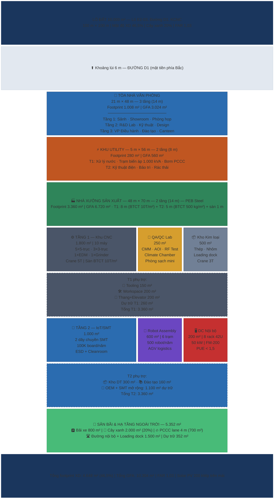
```mermaid
block-beta
    columns 6

    %% ── Hàng tiêu đề ──
    TITLE["LÔ ĐẤT 10.000 m² — Lô E2-03, Đường D1, KCNC\n100 m × 100 m | Mật độ XD 46,5% | Cây xanh 20% | FAR 1,03"]:6

    %% ── Khoảng lùi 6 m phía Bắc ──
    LUI_BAC["⬆ Khoảng lùi 6 m — ĐƯỜNG D1 (mặt tiền phía Bắc)"]:6

    %% ── Tòa nhà Văn phòng ──
    LUI_L1[" "]:1
    VP["🏢 TÒA NHÀ VĂN PHÒNG\n21 m × 48 m — 3 tầng (14 m)\nFootprint 1.008 m² | GFA 3.024 m²\n─────────────────────\nTầng 1: Sảnh · Showroom · Phòng họp\nTầng 2: R&D Lab · Kỹ thuật · Design\nTầng 3: VP Điều hành · Đào tạo · Canteen"]:4
    LUI_R1[" "]:1

    %% ── Khu Utility — 2 tầng ──
    LUI_L2[" "]:1
    UT["⚡ KHU UTILITY — 5 m × 56 m — 2 tầng (8 m)\nFootprint 280 m² | GFA 560 m²\nT1: Xử lý nước · Trạm biến áp 1.000 kVA · Bơm PCCC\nT2: Kỹ thuật điện · Bảo trì · Rác thải"]:4
    LUI_R2[" "]:1

    %% ── Nhà xưởng — Header ──
    LUI_L3[" "]:1
    XU_HEADER["🏭 NHÀ XƯỞNG SẢN XUẤT — 48 m × 70 m — 2 tầng (14 m) — PEB Steel\nFootprint 3.360 m² | GFA 6.720 m² · T1: 8 m (BTCT 10T/m²) + T2: 5 m (BTCT 500 kg/m²) + sàn 1 m"]:4
    LUI_R3[" "]:1

    %% ── Tầng 1 (khu nặng — 8 m) ──
    LUI_L4[" "]:1
    CNC["⚙️ TẦNG 1 — Khu CNC\n1.800 m² | 10 máy\n5×5-trục · 3×3-trục\n1×EDM · 1×Grinder\nCrane 5T | Sàn BTCT 10T/m²"]:2
    QA["🔬 QA/QC Lab\n250 m²\nCMM · AOI · RF Test\nClimate Chamber\nPhòng sạch mini"]:1
    KHO_KL["📦 Kho Kim loại\n500 m²\nThép · Nhôm\nLoading dock\nCrane 3T"]:1
    LUI_R4[" "]:1

    LUI_L45[" "]:1
    T1_SUB["T1 phụ trợ:\n🔧 Tooling 150 m²\n🛠️ Workspace 200 m²\n🔼 Thang+Elevator 200 m²\nDự trữ T1: 260 m²\nTổng T1: 3.360 m²"]:4
    LUI_R45[" "]:1

    %% ── Tầng 2 (khu nhẹ — 5 m) ──
    LUI_L5[" "]:1
    SMT["🔌 TẦNG 2 — IoT/SMT\n1.000 m²\n2 dây chuyền SMT\n100K board/năm\nESD + Cleanroom"]:2
    ROBOT["🤖 Robot Assembly\n600 m² | 6 trạm\n500 robot/năm\nAGV logistics"]:1
    DC["🖥️ DC Nội bộ\n200 m² | 8 rack 42U\n50 kW | FM-200\nPUE < 1,5"]:1
    LUI_R5[" "]:1

    LUI_L55[" "]:1
    T2_SUB["T2 phụ trợ:\n📦 Kho DT 300 m² · 📚 Đào tạo 160 m²\n🔶 OEM + SMT mở rộng: 1.100 m² dự trữ\nTổng T2: 3.360 m²"]:4
    LUI_R55[" "]:1

    %% ── Sân bãi + Hạ tầng ngoài trời ──
    LUI_L6[" "]:1
    NGOAI["🌳 SÂN BÃI & HẠ TẦNG NGOÀI TRỜI — 5.352 m²\n🅿️ Bãi xe 800 m² | 🌿 Cây xanh 2.000 m² (20%) | 🔥 PCCC lane 4 m (700 m²)\n🛣️ Đường nội bộ + Loading dock 1.500 m² | Dự trữ 352 m²"]:4
    LUI_R6[" "]:1

    %% ── Tổng hợp ──
    FOOTER["Tổng footprint XD: 4.648 m² (46,5%) | Tổng GFA: 10.304 m² | FAR 1,03 | Solar PV 200 kWp trên mái"]:6

    %% ── Style ──
    style TITLE fill:#1a365d,color:#fff,stroke:#1a365d
    style LUI_BAC fill:#e2e8f0,color:#4a5568,stroke:#cbd5e0
    style VP fill:#2b6cb0,color:#fff,stroke:#2c5282
    style UT fill:#c05621,color:#fff,stroke:#9c4221
    style XU_HEADER fill:#2f855a,color:#fff,stroke:#276749
    style CNC fill:#4a5568,color:#fff,stroke:#2d3748
    style T1_SUB fill:#4a5568,color:#e2e8f0,stroke:#2d3748,stroke-dasharray:5 5
    style SMT fill:#2b6cb0,color:#fff,stroke:#2c5282
    style ROBOT fill:#6b46c1,color:#fff,stroke:#553c9a
    style DC fill:#c53030,color:#fff,stroke:#9b2c2c
    style T2_SUB fill:#2b6cb0,color:#e2e8f0,stroke:#2c5282,stroke-dasharray:5 5
    style QA fill:#d69e2e,color:#000,stroke:#b7791f
    style KHO_KL fill:#718096,color:#fff,stroke:#4a5568
    style NGOAI fill:#48bb78,color:#000,stroke:#38a169
    style FOOTER fill:#1a365d,color:#fff,stroke:#1a365d
    style LUI_L1 fill:none,stroke:none
    style LUI_R1 fill:none,stroke:none
    style LUI_L2 fill:none,stroke:none
    style LUI_R2 fill:none,stroke:none
    style LUI_L3 fill:none,stroke:none
    style LUI_R3 fill:none,stroke:none
    style LUI_L4 fill:none,stroke:none
    style LUI_R4 fill:none,stroke:none
    style LUI_L45 fill:none,stroke:none
    style LUI_R45 fill:none,stroke:none
    style LUI_L5 fill:none,stroke:none
    style LUI_R5 fill:none,stroke:none
    style LUI_L55 fill:none,stroke:none
    style LUI_R55 fill:none,stroke:none
    style LUI_L6 fill:none,stroke:none
    style LUI_R6 fill:none,stroke:none
```

### 4.1.4. Bảng Cân đối Diện tích

**A. Cân đối Footprint (mặt đất):**

| Hạng mục | Diện tích (m²) | Tỷ lệ (%) |
| --- | ---: | ---: |
| Tòa nhà Văn phòng (footprint) | 1.008 | 10,1% |
| Nhà xưởng Sản xuất (footprint) | 3.360 | 33,6% |
| Khu Utility (footprint) | 280 | 2,8% |
| **Tổng diện tích xây dựng** | **4.648** | **46,5%** |
| Đường nội bộ + Loading dock | 1.500 | 15,0% |
| Bãi xe (xe con + xe tải) | 800 | 8,0% |
| Cây xanh + Cảnh quan | 2.000 | 20,0% |
| PCCC lane (4m quanh công trình) | 700 | 7,0% |
| Dự trữ | 352 | 3,5% |
| **Tổng mặt bằng** | **10.000** | **100%** |

**B. Tổng hợp GFA (tổng diện tích sàn xây dựng):**

| Công trình | Footprint (m²) | Số tầng | GFA (m²) | Ghi chú |
| --- | ---: | :---: | ---: | --- |
| Tòa nhà Văn phòng | 1.008 | 3 | 3.024 | BTCT, 14 m |
| Nhà xưởng Sản xuất | 3.360 | **2** | **6.720** | PEB Steel, 14 m (T1: 8 m + T2: 5 m + sàn 1 m) |
| Khu Utility | 280 | **2** | **560** | Kết cấu nhẹ, 8 m |
| **Tổng** | **4.648** | — | **10.304** | FAR = 1,03 |

> **Kiểm tra:** Mật độ xây dựng 46,5% < 70% (cho phép). Cây xanh 20,0% >= 20% (quy định KCNC). PCCC lane 4m quanh toàn bộ công trình. FAR = 10.304 / 10.000 = 1,03. Chiều cao tất cả công trình <= 14 m [C].

---

## 4.2. Tòa nhà Văn phòng 3 Tầng (21m x 48m)

| Tầng | Chiều cao | Diện tích | Chức năng chi tiết |
|---|---:|---:|---|
| **Tầng 1** | 5,0 m | 1.008 m² | Sảnh chính (200 m²) + Showroom sản phẩm (150 m²) + Phòng họp lớn (100 m²) + 2 Phòng họp nhỏ (2x40 m²) + Phòng tiếp khách (80 m²) + WC + Thang máy + Cầu thang + Hành lang (338 m²) |
| **Tầng 2** | 4,5 m | 1.008 m² | R&D Lab IoT (250 m²) + R&D Lab Robot (200 m²) + Phòng thiết kế CAD/CAM (150 m²) + Văn phòng Kỹ thuật (200 m²) + Phòng server nhỏ (40 m²) + WC + Hành lang (168 m²) |
| **Tầng 3** | 4,5 m | 1.008 m² | VP Tổng Giám đốc (80 m²) + VP Ban Giám đốc (120 m²) + VP Hành chính-Kế toán (150 m²) + Phòng đào tạo (120 m²) + Canteen (200 m²) + Phòng kỹ thuật M&E (80 m²) + WC + Hành lang (178 m²) |
| **Tổng** | **14,0 m** | **3.024 m²** | Bao gồm thang máy + cầu thang bộ |

> **Kết cấu:** Khung BTCT, sàn BTCT dự ứng lực, tường gạch + kính Low-E, mái BTCT + chống thấm + Solar PV 200 kWp. Thiết kế kiến trúc hiện đại, phù hợp quy hoạch KCNC. Áp dụng tiêu chuẩn công trình xanh **EDGE** (IFC) — tiết kiệm năng lượng >= 20%, tiết kiệm nước >= 20%, giảm carbon vật liệu >= 20%.

### 4.2.2. Chi tiết R&D Lab — Tầng 2 (1.008 m2)

R&D Lab là khu vực chiến lược phục vụ phát triển sản phẩm IoT/BMS/Robot, đặt tại Tầng 2 cùng khu kỹ thuật thiết kế:

| TT | Khu vực | Diện tích (m2) | Trang thiết bị chính | Nhiệt độ / Điều kiện |
|:---:|---|---:|---|---|
| 1 | R&D Lab IoT/BMS | 250 | 12 trạm làm việc với oscilloscope, logic analyzer, nguồn DC, scope, IoT Dev Kit; khu hàn SMD thủ công; kệ linh kiện ESD-safe | 22-24 C, RH 45-55%, ESD floor |
| 2 | R&D Lab Robot | 200 | Khu lắp ráp prototype robot (2 bàn), khu test servo/motor, LiDAR test bench, khu nạp/test pin LiFePO4, khu software debug | 24-26 C, sàn epoxy |
| 3 | Phòng Thiết kế CAD/CAM | 150 | 8 workstation (i9/Xeon, 64GB RAM, RTX Ada, 2 màn 32") cho SolidWorks, NX CAM, Altium Designer, MATLAB | 22-24 C |
| 4 | VP Kỹ thuật | 200 | 16 bàn làm việc cho kỹ sư firmware, embedded, AI/ML, QA software | 22-24 C |
| 5 | Phòng Server nhỏ | 40 | 2 rack: build server, CI/CD, Git, NAS backup, license server | 22 ± 1 C, UPS riêng |
| 6 | WC + Hành lang | 168 | | |
| | **Tổng Tầng 2** | **1.008** | | |

**Trang thiết bị R&D Lab chính:**

| TT | Thiết bị | Số lượng | Chi phí (K USD) | Phục vụ |
|:---:|---|:---:|---:|---|
| 1 | Workstation CAD/CAM (SolidWorks/NX) | 8 | 40 | Thiết kế sản phẩm CNC + PCB |
| 2 | Oscilloscope 4-ch 500 MHz (Keysight/Tektronix) | 6 | 30 | Debug IoT firmware |
| 3 | Logic Analyzer 16-ch | 4 | 8 | Debug protocol SPI/I2C/UART |
| 4 | Nguồn DC programmable (0-60V, 0-10A) | 6 | 6 | Power testing |
| 5 | IoT Dev Kit (ESP32, STM32, nRF52, Jetson) | 20 | 5 | Prototype nhanh |
| 6 | 3D Printer (FDM + SLA) | 2 | 10 | Prototype vỏ/jig nhanh |
| 7 | PCB CNC router (ProtoMat) | 1 | 25 | Prototype PCB nội bộ 24h |
| 8 | RF Test Equipment (Vector Network Analyzer) | 1 | 20 | Antenna design IoT |
| 9 | Software License (SolidWorks, Altium, NX, MATLAB) | — | 50 | Annual thuê bao |
| 10 | Hệ thống CI/CD + Git Server + NAS | 1 set | 15 | Build automation, backup |
| | **Tổng R&D Equipment** | | **209** | Nằm trong CAPEX Phase 2 |

> R&D Lab phục vụ nhóm 20-30 kỹ sư R&D (mục tiêu Y5-Y8, xem P7 §7.3). Năng lực prototype: từ ý tưởng → schematic → PCB prototype → firmware → functional test trong **4-6 tuần** nội bộ, không cần thuê ngoài. Đây là lợi thế speed-to-market quan trọng so với đối thủ phải gửi PCB ra ngoài (thời gian dẫn 2-4 tuần chỉ riêng fab) [A].

---

## 4.3. Nhà xưởng Sản xuất (48m x 70m — 2 tầng, 14 m)

> **Tóm tắt:** Nhà xưởng 2 tầng, kết cấu PEB Steel, chiều cao tổng 14 m (T1: 8 m + sàn BTCT 1 m + T2: 5 m). Footprint 3.360 m², GFA 6.720 m². Tầng 1 dành cho khu nặng (CNC, QA, Kho kim loại) với sàn BTCT tải trọng 10 tấn/m² và cầu trục 5T. Tầng 2 dành cho khu nhẹ (IoT/SMT, Robot, DC nội bộ, OEM dự trữ) với sàn BTCT 500 kg/m². Mái tôn cách nhiệt + Solar PV 200 kWp. Áp dụng tiêu chuẩn **EDGE** cho thiết kế tiết kiệm năng lượng và nước [C].

### 4.3.1. Phân khu Tầng 1 — Khu nặng (cao 8 m, sàn BTCT 10T/m²)

| Khu vực | Diện tích (m²) | Tỷ lệ T1 | Chức năng |
|---|---:|---:|---|
| **Khu CNC** | 1.800 | 53,6% | 10 máy CNC (5×5-trục + 3×3-trục + 1 EDM + 1 Grinder), cầu trục 5T |
| **QA/QC Lab** | 250 | 7,4% | CMM, AOI, RF Test, Climate Chamber, phòng sạch mini |
| **Kho Kim loại** | 500 | 14,9% | Thép, nhôm, đồng; loading dock; crane 3T |
| **Tooling / Fixture** | 150 | 4,5% | Bàn gá, dụng cụ cắt, khuôn mẫu |
| **Workspace / Operator** | 200 | 6,0% | Bàn gia công, đo lường inline |
| **Thang + Elevator hàng** | 200 | 6,0% | Thang máy tải 3T + cầu thang bộ + ramp |
| **Dự trữ T1** | 260 | 7,7% | Mở rộng CNC giai đoạn 2 |
| **Tổng Tầng 1** | **3.360** | **100%** | |

### 4.3.2. Phân khu Tầng 2 — Khu nhẹ (cao 5 m, sàn BTCT 500 kg/m²)

| Khu vực | Diện tích (m²) | Tỷ lệ T2 | Chức năng |
|---|---:|---:|---|
| **Khu IoT/SMT** | 1.000 | 29,8% | 2 dây chuyền SMT, hàn, lắp ráp PCB, kiểm tra |
| **Robot Assembly** | 600 | 17,9% | 6 trạm lắp ráp Robot AMR/AGV, testing, calibration, AGV logistics |
| **DC Nội bộ** | 200 | 6,0% | 8 rack 42U, UPS, cooling FM-200, network |
| **Kho Điện tử** | 300 | 8,9% | Linh kiện SMD, bán thành phẩm, ESD safe |
| **Phòng Đào tạo** | 160 | 4,8% | Training center, tài liệu kỹ thuật |
| **OEM + SMT mở rộng** | 1.100 | 32,7% | Dự trữ: OEM gia công + mở rộng SMT line 3-4 (giai đoạn 2) |
| **Tổng Tầng 2** | **3.360** | **100%** | |

### 4.3.3. Chi tiết Khu CNC — T1 (1.800 m²)

| TT | Thiết bị | Số lượng | Kích thước (m) | Diện tích chiếm | Dòng điện | Trọng lượng |
|:---:|---|:---:|---|---:|---:|---:|
| 1 | CNC 5-trục (DMG Mori DMU 50/Mazak) | 5 | 3,5 x 4,0 | 14,0 m²/máy | 30 kW | 8.000 kg |
| 2 | CNC 3-trục (Haas VF-2SS/Mazak) | 3 | 3,0 x 3,5 | 10,5 m²/máy | 22 kW | 5.000 kg |
| 3 | Wire EDM (Sodick/Mitsubishi) | 1 | 2,5 x 3,0 | 7,5 m² | 15 kW | 3.000 kg |
| 4 | Surface Grinder (Okamoto) | 1 | 2,0 x 3,0 | 6,0 m² | 10 kW | 2.500 kg |
| | **Tổng khu vực máy** | **10** | | **145,5 m²** | **255 kW** | |

> **Bố trí T1:** 10 máy chiếm ~145 m² mặt sàn. Còn lại 1.655 m² cho: lối đi vận chuyển + crane lane (500 m²), khu tooling/fixture (150 m²), bàn đo lường inline (100 m²), workspace operator (200 m²), khu NVL vào/thành phẩm ra (350 m²), hành lang an toàn (95 m²), dự trữ CNC giai đoạn 2 (260 m²). Cầu trục 5T phủ toàn bộ khu CNC. Khoảng cách giữa các máy tối thiểu 2 m theo quy định an toàn lao động [C].

### 4.3.4. Chi tiết Khu QA/QC — T1 (250 m²)

| TT | Thiết bị / Khu vực | Diện tích (m²) | Mô tả |
|:---:|---|---:|---|
| 1 | CMM (Coordinate Measuring Machine) | 40 | Zeiss/Mitutoyo, đo 3D chính xác |
| 2 | Máy đo nhám / đo cứng / đo 2D | 30 | Surface roughness, hardness, profile |
| 3 | AOI + SPI (PCB inspection) | 30 | Automated Optical Inspection cho SMT |
| 4 | RF Test Chamber | 25 | Kiểm tra tần số radio (IoT products) |
| 5 | Climate Chamber | 25 | -40°C ~ +85°C, humidity test |
| 6 | Phòng sạch mini (Class 10K) | 40 | Kiểm tra sản phẩm nhạy cảm |
| 7 | Workspace + lối đi | 60 | |
| | **Tổng** | **250** | |

> **Liên thông T1-T2:** Elevator hàng 3T cho phép di chuyển sản phẩm giữa CNC (T1) và SMT/Robot (T2) trong 2 phút. QA Lab đặt tại T1 gần khu CNC — nơi yêu cầu đo lường chính xác nhất [A].

### 4.3.5. Chi tiết Khu IoT/SMT — T2 (1.000 m²)

| TT | Thiết bị / Khu vực | Diện tích (m²) | Mô tả |
|:---:|---|---:|---|
| 1 | Dây chuyền SMT số 1 (Pick & Place + Reflow) | 200 | 8.000 CPH, sản phẩm IoT chính |
| 2 | Dây chuyền SMT số 2 (Pick & Place + Reflow) | 200 | 8.000 CPH, sản phẩm BMS/SCADA |
| 3 | Khu hàn thủ công + Rework | 80 | 8 trạm hàn, kính hiển vi |
| 4 | Khu kiểm tra ICT/FCT | 120 | In-Circuit Test + Functional Test |
| 5 | Khu lắp ráp thành phẩm | 150 | Lắp vỏ, dán nhãn, đóng gói |
| 6 | Khu lưu trữ linh kiện (ESD safe) | 100 | Tủ chống ẩm, kho linh kiện SMD |
| 7 | Lối đi + Workspace | 150 | Cleanroom ISO 8 |
| | **Tổng** | **1.000** | Công suất: 100K board/năm (2 line) |

### 4.3.6. Chi tiết Khu Robot Assembly — T2 (600 m²)

| TT | Thiết bị / Khu vực | Diện tích (m²) | Mô tả |
|:---:|---|---:|---|
| 1 | Trạm lắp ráp Robot (6 trạm) | 240 | Mỗi trạm 40 m², lắp AMR/AGV |
| 2 | Khu testing + Calibration | 120 | Đường test 15 m, calibration sensor |
| 3 | Khu lập trình + Nạp firmware | 60 | 4 trạm lập trình, debug station |
| 4 | Khu đóng gói + Xuất hàng | 80 | Đóng kiện, vận chuyển qua elevator |
| 5 | AGV logistics lane | 60 | Đường AGV nội bộ T2 |
| 6 | Lối đi + Workspace | 40 | |
| | **Tổng** | **600** | Công suất: 500 robot/năm |

### 4.3.7. Phòng DC Nội bộ — T2 (200 m²)

| Hạng mục | Thông số | Ghi chú |
|---|---|---|
| Số lượng rack | 8 rack 42U | ERP, MES, SCADA, AI training, backup |
| Công suất điện | 50 kW | UPS 80 kVA (N+1) + ATS |
| Làm mát | Precision cooling 30 kW | In-row cooling, redundant N+1 |
| Mạng | 10 Gbps LAN, 1 Gbps WAN | 2 ISP redundant |
| PCCC | FM-200 gas | Tuyệt đối KHÔNG dùng nước |
| Kiểm soát | Access card + CCTV + Biometric | Giới hạn nhân sự truy cập |
| PUE mục tiêu | < 1,5 | In-row cooling + hot/cold aisle |

> **Lưu ý:** Đây là phòng server nội bộ quy mô nhỏ (8 rack), KHÔNG PHẢI trung tâm dữ liệu thương mại. Không cần giấy phép viễn thông. Chi phí CAPEX: 2,20M USD (10,0% tổng dự án) bao gồm: rack + server + UPS + cooling + network + phần mềm [C].

---

## 4.4. Khu Utility (5m x 56m — 2 tầng, 8 m | GFA 560 m²)

> Khu Utility tăng từ 1 tầng (4 m) lên **2 tầng (8 m)**, GFA 560 m² (footprint 280 m²). Tầng 1: hệ thống năng lượng, xử lý nước, PCCC. Tầng 2: kỹ thuật điện T2, bảo trì, phụ trợ [C].

### 4.4.1. Tầng 1 — Năng lượng và Xử lý (280 m²)

| TT | Hạng mục | Diện tích (m²) | Mô tả |
|:---:|---|---:|---|
| 1 | Trạm biến áp 1.000 kVA | 40 | 22kV/0,4kV, kiểu kín |
| 2 | Phòng phân phối điện | 30 | Tủ động lực, tủ điều khiển |
| 3 | Hệ thống xử lý nước thải CNC | 60 | Xử lý dầu cắt, KL nặng, ZLD |
| 4 | Bơm cấp nước + Bể nước ngầm | 40 | Bể chứa 50 m³ |
| 5 | Trạm nén khí | 30 | 2 máy nén khí 15HP, bình chứa |
| 6 | Khu rác thải phân loại | 30 | Rác CN, rác sinh hoạt, rác nguy hại |
| 7 | Bơm PCCC + Bể nước PCCC | 50 | Bể 100 m³, 2 bơm N+1 |
| | **Tổng T1** | **280** | |

### 4.4.2. Tầng 2 — Kỹ thuật điện và Bảo trì (280 m²)

| TT | Hạng mục | Diện tích (m²) | Mô tả |
|:---:|---|---:|---|
| 1 | Phòng kỹ thuật điện T2 | 60 | Tủ phân phối cho T2 xưởng, ATS |
| 2 | Xưởng bảo trì cơ khí | 80 | Bàn nguội, máy tiện nhỏ, dụng cụ |
| 3 | Kho phụ tùng / vật tư | 60 | Phụ tùng thay thế, vật tư tiêu hao |
| 4 | Phòng AHU (HVAC central) | 40 | AHU cho T2 xưởng, ESD area |
| 5 | Lối đi + cầu thang | 40 | |
| | **Tổng T2** | **280** | |

---

## 4.5. Hệ thống Điện Tổng hợp

### 4.5.1. Phụ tải Điện tổng

| Khu vực | Công suất (kW) | Ghi chú |
|---|---:|---|
| CNC 10 máy — Tầng 1 | 255 | Peak load khi 10 máy chạy đồng thời |
| IoT/SMT line (1.000 m²) — Tầng 2 | 65 | AHU + SMT line + kiểm tra (tăng do AHU lớn hơn) |
| Robot Assembly (600 m²) — Tầng 2 | 30 | Lắp ráp + testing + AC bổ sung |
| DC Nội bộ (200 m²) — Tầng 2 | 60 | Server + precision cooling + UPS (8 rack) |
| Tòa nhà VP (điều hòa, đèn, thang máy) | 120 | 3 tầng |
| Khu Utility — 2 tầng (bơm, nén khí, xử lý nước, bảo trì) | 65 | +10 kW T2 kỹ thuật điện |
| Thang hàng + Thang bộ T2 (điện) | 15 | 1 thang hàng 2T + chiếu sáng hành lang |
| **Tổng phụ tải đỉnh** | **610 kW** | |
| Dự phòng 20% | 122 | |
| **Tổng thiết kế** | **732 kW** | |

### 4.5.2. Nguồn điện

| Nguồn | Công suất | Vai trò |
|---|---:|---|
| Lưới điện KCNC 22kV | **1.250 kVA transformer** | Nguồn chính (tăng từ 1.000 kVA do T2 +82 kW) |
| Solar PV Rooftop | 200 kWp | ~20% điện năng, đáp ứng tiêu chí NLTT SHTP 2026 |
| UPS (DC nội bộ) | 80 kVA | Backup 15 phút cho server (tăng theo DC 200 m²) |
| Máy phát điện diesel | 500 kVA | Backup toàn nhà khi mất điện |

> **Hóa đơn điện dự kiến:** ~610 kW x 2 ca (16h/ngày) x 300 ngày x 2.500 VND/kWh = ~7,3 tỷ VND/năm (~293.000 USD/năm). Solar PV 200 kWp giảm ~11% + mua REC cho 9% còn lại = tổng **20% NLTT**, tiết kiệm ~59.000 USD/năm [C]. Đáp ứng tiêu chí ưu tiên SHTP 2026 về năng lượng tái tạo.

### 4.5.3. Sơ đồ Nguyên lý Cấp Điện (Single-Line Diagram)

```
       LƯỚI KCNC 22kV
            |
     [Máy biến áp 1.000 kVA]
     22kV / 0,4kV (Dyn11)
            |
     +------+------+
     |             |
  [ATS]     [Solar Inverter]
     |        200 kWp
     |             |
  [MDB - Tủ Phân phối Chính 0,4kV]
     |
     +----+----+----+----+----+----+
     |    |    |    |    |    |    |
   DB-CNC DB-SMT DB-VP DB-DC DB-UT DB-PV DB-PCCC
   255kW  50kW 120kW 50kW 55kW  20kW  Bơm
     |                   |
   10 máy            [UPS 60kVA]
   CNC                   |
                      Server DC
                      +MES+BMS
            |
     [Generator 500 kVA - Diesel]
     (Backup qua ATS khi mất lưới)
```

**Phân bổ tải theo thanh cái (busbar):**

| Thanh cái | Phụ tải chính | Công suất (kW) | Priority |
|---|---|---:|---|
| DB-CNC | 10 máy CNC + Coolant + Mist (T1) | 275 | Essential |
| DB-SMT | SMT line + AHU T2 + ICT/FCT | 65 | Essential |
| DB-ROBOT | Robot Assembly T2 + Kho DT + Đào tạo | 30 | Normal |
| DB-VP | VP 3 tầng (VRV/VRF + đèn + ổ cắm) | 120 | Normal |
| DB-DC | UPS + Server + Precision AC (T2) | 60 | Critical |
| DB-UT | Bơm + Nén khí + ZLD + T2 kỹ thuật | 65 | Essential |
| DB-T2 | Thang hàng + chiếu sáng hành lang T2 | 15 | Normal |
| DB-PV | Solar PV inverter (regenerative) | -200 peak | — |
| DB-PCCC | Bơm chữa cháy (diesel backup riêng) | 30 | Life-safety |

> Khi mất điện lưới: ATS chuyển sang Generator 500 kVA trong nhỏ hơn 10 giây. UPS DC bridge server trong 15 phút. Tải Life-safety (PCCC) có diesel backup riêng. Solar PV chuyển anti-islanding tự ngắt [B].

---

## 4.6. Hệ thống PCCC

| Khu vực | Giải pháp | Tiêu chuẩn |
|---|---|---|
| Nhà xưởng T1 — CNC/QA/Kho | Sprinkler tầm ướt + bình chữa xách tay | TCVN 7336:2003, NĐ 136/2020 |
| Nhà xưởng T2 — IoT/SMT | Sprinkler tầm ướt + khí FM-200 (khu ESD) | NFPA 75, NĐ 136/2020 |
| Nhà xưởng T2 — Robot/OEM | Sprinkler tầm ướt | TCVN 7336:2003 |
| Phòng DC nội bộ (T2) | Khí FM-200 | NFPA 75/2000, KHÔNG dùng nước |
| Tòa nhà VP | Sprinkler + bình chữa + báo khói | TCVN 5738:2001 |
| Khu Utility T1 + T2 | Sprinkler + báo khói | TCVN 7336:2003 |
| Thang hàng + Cầu thang T2 | Hệ thống thoát nạn 2 tầng + Exit sign | TCVN 3254:1989, NĐ 136/2020 |
| Ngoài trời | Trụ cứu hỏa, lane PCCC 4m | NĐ 136/2020 |

### 4.6.1. Chi tiết Thiết bị PCCC

| TT | Hạng mục | Số lượng / Quy mô | Đơn giá (USD) | Tổng (USD) |
|:---:|---|---|---:|---:|
| 1 | Hệ thống sprinkler tầm ướt — Xưởng T1 (3.360 m², ~120 đầu phun) | 1 hệ thống | — | 80.000 |
| 2 | Hệ thống sprinkler tầm ướt — Xưởng T2 (3.360 m², ~120 đầu phun) | 1 hệ thống | — | 80.000 |
| 3 | Hệ thống FM-200 — DC T2 (200 m²) + khu ESD SMT (120 m²) | 2 zone | — | 50.000 |
| 4 | Hệ thống sprinkler VP 3 tầng (3.024 m²) | 1 hệ thống, ~100 đầu phun | — | 60.000 |
| 5 | Hệ thống báo cháy tự động (toàn khu — 2 tầng xưởng) | 1 trung tâm, 260 detector | — | 42.000 |
| 6 | Hệ thống thoát nạn T2 — 2 cầu thang + Exit sign + Emergency light | 1 bộ | — | 18.000 |
| 7 | Bình chữa cháy xách tay | 55 bình (CO₂ + bột) | 150 | 8.250 |
| 8 | Trụ cứu hỏa ngoài trời | 6 trụ | 2.000 | 12.000 |
| 9 | Bơm chữa cháy (điện + diesel backup) | 2 bộ | — | 40.000 |
| 10 | Bể nước PCCC | 100 m³ | — | 15.000 |
| 11 | Tủ vòi chữa cháy trong nhà (T1 + T2) | 18 tủ | 800 | 14.400 |
| 12 | Đường ống + Lắp đặt + Nghiệm thu (2 tầng) | — | — | 80.350 |
| | **Tổng PCCC** | | | **500.000** |

> Chi phí PCCC = 0,50M USD = 2,3% CAPEX. Đã điều chỉnh trong Phase 1 (item 9 CAPEX, từ 0,40M → 0,50M do bổ sung sprinkler T2, hệ thống thoát nạn 2 tầng và thêm 60 detector). Toàn bộ hệ thống thiết kế theo TCVN 7336:2003 + NĐ 136/2020/NĐ-CP. Nghiệm thu bởi Cảnh sát PCCC TP.HCM trước khi vận hành [C].

---

## 4.7. Hệ thống Cấp thoát Nước và Xử lý Nước thải

### 4.7.1. Nhu cầu Nước

| Mục đích | Lượng (m³/ngày) | Ghi chú |
|---|---:|---|
| Sinh hoạt (100-130 người) | 8-10 | 80 lít/người/ngày |
| CNC coolant (dung dịch cắt gọt) | 5-8 | Tuần hoàn 90%, bổ sung hao hụt |
| Rửa chi tiết CNC | 2-3 | Nước khử ion (DI water) |
| Làm mát (chiller + HVAC) | 3-5 | Tháp giải nhiệt tuần hoàn |
| Tưới cây xanh | 2-4 | Nước mưa thu hồi ưu tiên |
| Vệ sinh nhà xưởng | 1-2 | |
| **Tổng (ngày thường)** | **21-32** | |
| **Tổng (peak — mùa khô)** | **35-40** | Bổ sung tưới cây + chiller tải cao |

### 4.7.2. Hệ thống ZLD cho CNC (Zero Liquid Discharge)

Toàn bộ nước thải CNC (dầu cắt, kim loại nặng, mạt sắt) được xử lý theo quy trình khép kín, **KHÔNG xả ra môi trường**.

| Bước | Công đoạn | Thiết bị | Công suất |
|:---:|---|---|---|
| 1 | Thu gom dung dịch cắt gọt đã dùng | Bể thu gom inox 2 m³ | 500 lít/mẻ |
| 2 | Tách dầu/nước (oil skimmer) | Oil skimmer belt type | 200 lít/giờ |
| 3 | Lắng kim loại + Keo tụ tạo bông | Bể lắng 2 ngăn + PAC/polymer | 1 m³/giờ |
| 4 | Lọc áp lực (sand + activated carbon) | Bộ lọc 2 cột DN200 | 1 m³/giờ |
| 5 | Khử trùng UV | Đèn UV 40W | Liên tục |
| 6 | Tái sử dụng (rửa chi tiết, tưới cây) | Bể chứa nước tái chế 5 m³ | — |
| 7 | Cô đặc bùn/cặn | Máy ép bùn khung bản | 50 kg bùn khô/ngày |

> **Hiệu quả ZLD:** Tái sử dụng ~85-90% nước CNC. Bùn kim loại nặng (chất thải nguy hại) thu gom bởi đơn vị có giấy phép theo NĐ 08/2022/NĐ-CP. Chi phí hệ thống ZLD: ~60.000 USD (nằm trong M&E budget). Đáp ứng tiêu chí Thông báo SHTP 2026 về quản lý tài nguyên nước [C].

### 4.7.3. Thu Nước mưa

| Thông số | Giá trị | Ghi chú |
|---|---:|---|
| Diện tích mái thu nước | ~4.500 m² | VP + Xưởng + Utility |
| Lượng mưa trung bình TP.HCM | 1.800 mm/năm | 6 tháng mùa mưa (tháng 5-11) |
| Sản lượng thu hồi (hiệu suất 70%) | ~5.670 m³/năm | ~15,5 m³/ngày trung bình |
| Bể chứa nước mưa | 30 m³ | Ngầm, bê tông cốt thép |
| Mục đích sử dụng | — | Tưới cây xanh, vệ sinh sân bãi |

> Nước mưa thu hồi ước tính tiết kiệm ~30% nhu cầu nước không sinh hoạt. Phù hợp tiêu chí công trình xanh **EDGE** về tiết kiệm nước >= 20% [C].

### 4.7.4. Thoát Nước

| Loại | Hệ thống | Đấu nối |
|---|---|---|
| Nước mưa | Ống HDPE DN300, hố ga, hố thu | Hệ thống thoát nước mưa KCNC |
| Nước thải sinh hoạt | Bể tự hoại 3 ngăn → XLNT tập trung KCNC | Hệ thống thoát nước KCNC |
| Nước thải CNC | ZLD → Tái sử dụng (không xả) | Không đấu nối — khép kín |
| Nước thải DC nội bộ | Ngưng tụ từ precision cooling → Thu hồi | Lượng nhỏ (~5 lít/ngày) |

---

## 4.8. Hệ thống Điều hòa Không khí (HVAC)

### 4.8.1. Tòa nhà Văn phòng

| Tầng | Diện tích (m²) | Giải pháp | Công suất | Ghi chú |
|---|---:|---|---:|---|
| Tầng 1 | 1.008 | VRV/VRF (Daikin/Mitsubishi) | 80 kW (~28 HP) | Sảnh + Showroom + Phòng họp |
| Tầng 2 | 1.008 | VRV/VRF + PAU (fresh air) | 85 kW (~30 HP) | R&D Lab cần nhiệt độ ổn định 22-24°C |
| Tầng 3 | 1.008 | VRV/VRF | 75 kW (~26 HP) | VP + Đào tạo + Canteen |
| **Tổng VP** | **3.024** | | **240 kW** | Efficiency COP >= 3,5 |

### 4.8.2. Nhà xưởng Sản xuất — Tầng 1 (Khu nặng, 8 m)

| Khu vực | Diện tích (m²) | Giải pháp | Ghi chú |
|---|---:|---|---|
| Khu CNC (T1) | 1.800 | Quạt công nghiệp Ø1.200 mm × 8 bộ + Hút mist + Spot cooling | CNC tỏa nhiệt lớn, thông gió cưỡng bức liên tục |
| QA/QC Lab (T1) | 250 | Điều hòa split + Precision AC khu CMM 22±1°C | CMM cần nhiệt độ ổn định, controlled vibration |
| Kho Kim loại (T1) | 500 | Quạt hút + thông gió tự nhiên | Không cần điều hòa |
| Tooling + Workspace T1 | 550 | Quạt + thông gió | Nhiệt độ môi trường |
| Thang + Cầu thang T1 | 260 | — | Hành lang thoát nạn |

### 4.8.3. Nhà xưởng Sản xuất — Tầng 2 (Khu nhẹ, 5 m)

| Khu vực | Diện tích (m²) | Giải pháp | Thông số |
|---|---:|---|---|
| Khu IoT/SMT (T2) | 1.000 | **AHU trung tâm 45 kW** (Daikin/Carrier) + HEPA pre-filter | 22-26°C, RH 40-60%, ESD anti-static floor |
| Khu Robot Assembly (T2) | 600 | VRV/VRF 30 kW + PAU fresh air | 24-26°C, yêu cầu trung bình |
| DC Nội bộ (T2) | 200 | **Precision cooling in-row 25 kW**, N+1 redundant | 22±1°C, RH 45-55% theo ASHRAE TC9.9 |
| Kho Linh kiện ĐT (T2) | 300 | Split AC 10 kW + dehumidifier | 20-25°C, RH < 50% (bảo quản linh kiện) |
| Phòng Đào tạo SX (T2) | 160 | VRV/VRF 12 kW | 22-24°C |
| Dự phòng OEM (T2) | 1.100 | Duct AC ready (lắp sau khi kích hoạt) | Chờ bổ sung khi có tenant/expansion |

> **Tổng công suất HVAC nhà xưởng (T1 + T2):** ~195 kW (điện). T1: ~40 kW (spot cooling CNC + QA). T2: ~125 kW (AHU SMT + VRV Robot + Precision AC DC + Kho ĐT + Đào tạo). Thiết kế passive cho T1: mái cách nhiệt PU 50 mm, cửa thông gió 2 đầu hồi, quạt hút Ø1.200 mm × 8 bộ — giảm tải điều hòa ~25%. Đáp ứng tiêu chí **EDGE** [C].

### 4.8.3. Khu Utility

| Khu vực | Giải pháp | Ghi chú |
|---|---|---|
| Trạm biến áp | Thông gió tự nhiên + Quạt cưỡng bức | Tản nhiệt transformer |
| Phòng xử lý nước | Quạt hút | Ngăn hơi hóa chất |
| Trạm nén khí | Quạt thông gió | Tản nhiệt máy nén |

---

## 4.9. Hệ thống Khí nén và Tiện ích CNC

### 4.9.1. Hệ thống Khí nén (Compressed Air)

| Thông số | Giá trị | Ghi chú |
|---|---:|---|
| Nhu cầu khí nén (CNC + SMT + Robot) | 2.500 lít/phút (2,5 m³/phút) | 10 máy CNC × 200 lít/phút + SMT + Robot |
| Áp suất làm việc | 6-8 bar | Chuẩn CNC |
| Máy nén khí trục vít (oil-free) | 2 × 22 kW (30 HP) | N+1 redundant, VFD |
| Bình chứa khí | 2 × 1.000 lít | Ổn áp, giảm cycling |
| Bộ lọc + Dryer (sấy khí) | Lọc 3 cấp + Refrigerated dryer | Khí sạch cho CNC fixture + SMT |
| Đường ống phân phối | Nhôm anodized DN50-DN80 | Ít rỉ sét, giảm áp thấp |

> Chi phí hệ thống khí nén: ~30.000 USD. Đã tính trong Khu Utility (item 5 trong bảng 4.4). Khí nén oil-free cần thiết cho SMT (tránh nhiễm dầu PCB) và CNC pneumatic fixture [B].

### 4.9.2. Hệ thống Dung dịch Cắt gọt Trung tâm (Central Coolant)

| Thông số | Giá trị | Ghi chú |
|---|---:|---|
| Dung tích bể trung tâm | 5.000 lít (5 m³) | Cấp cho 10 máy CNC |
| Loại dung dịch | Semi-synthetic (water-based) | Pha 5-8% với nước khử ion |
| Hệ thống bơm tuần hoàn | 2 bơm × 3 kW | N+1, VFD |
| Hệ thống lọc (chip filter) | Magnetic separator + Paper band filter | Loại mạt kim loại liên tục |
| Hệ thống làm mát dung dịch | Chiller nhỏ 5 kW | Giữ nhiệt độ 20-25°C |
| Chu kỳ thay dung dịch | 4-6 tháng | Kiểm tra nồng độ hàng tuần |

> Chi phí Central Coolant: ~40.000 USD (bể + bơm + lọc + chiller). OPEX dung dịch: ~8.000-12.000 USD/năm. Hệ thống trung tâm tiết kiệm 30-40% so với coolant riêng lẻ từng máy [B].

### 4.9.3. Hệ thống Hút Mist/Dust CNC

| Thông số | Giá trị | Ghi chú |
|---|---:|---|
| Loại | Oil mist collector (electrostatic + HEPA) | Hút sương dầu từ CNC |
| Số lượng | 10 bộ (1 bộ/máy) + 1 central backup | |
| Công suất hút | 1.500 m3/giờ/bộ | Đảm bảo nồng độ dầu nhỏ hơn 5 mg/m3 |
| Mức lọc | 99,7% (HEPA H13) | |
| Công suất điện | 1,5 kW/bộ x 10 = 15 kW | |

> An toàn lao động yêu cầu nồng độ oil mist nhỏ hơn 5 mg/m3 theo TCVN 5508:2009. Hệ thống này đảm bảo môi trường làm việc sạch trong khu CNC 1.800 m2 (T1) [B].

### 4.9.4. Chi tiết Khu Robot Assembly — T2 (600 m²)

| TT | Khu vực / Thiết bị | Diện tích (m²) | Mô tả |
|:---:|---|---:|---|
| 1 | Bàn lắp ráp AMR/AGV (6 trạm) | 150 | Khung nhôm + dây chuyền lắp ráp thủ công có jig (mở rộng) |
| 2 | Khu test vận hành (open track) | 100 | Đường thử **15 m × 6 m** cho robot chạy thử tải — mở rộng |
| 3 | Khu hiệu chỉnh / Calibration | 50 | Laser alignment, encoder calibration, IMU test |
| 4 | Khu lắp ráp OHT + AGV overhead track | 80 | Dự phòng OHT semiconductor + test AGV navigation |
| 5 | Kho linh kiện Robot (T2 — ESD safe) | 80 | Servo motor, bánh xe, LiDAR, bộ pin (kho riêng T2) |
| 6 | Workspace + Lối đi | 90 | |
| 7 | Staging area + Đóng gói Robot | 50 | Khu nhận giao hàng hoàn chỉnh, dán nhãn, kiểm tra xuất kho |
| | **Tổng** | **600** | **Tầng 2 — T2** |

**Quy trình Lắp ráp Robot AMR/AGV:**

| Bước | Công đoạn | Thời gian (giờ) | Nhân sự |
|:---:|---|---:|:---:|
| 1 | Lắp khung chassis (gia công từ CNC) | 2,0 | 2 |
| 2 | Lắp hệ truyền động (servo + bánh xe) | 1,5 | 1 |
| 3 | Lắp hệ điện (PCB controller, dây, connector) | 2,0 | 1 |
| 4 | Lắp cảm biến (LiDAR, camera, ultrasonic) | 1,5 | 1 |
| 5 | Lắp bộ pin LiFePO4 + BMS pin | 1,0 | 1 |
| 6 | Lắp vỏ ngoài + dán nhãn | 0,5 | 1 |
| 7 | Flash firmware + cấu hình MekongOS | 1,0 | 1 |
| 8 | Test vận hành (open track, tải thử) | 2,0 | 2 |
| 9 | QC final + đóng gói | 1,0 | 1 |
| | **Tổng** | **12,5 giờ/robot** | **Peak: 2** |

> Công suất: 6 trạm × 1 ca/ngày = **3-4 robot/tuần** (cycle time 12,5 giờ/robot). Năm sản xuất ~150-200 robot Y5-Y8, tăng lên 300+ robot/năm từ Y10 với T2 mở rộng (600 m² so với 400 m² ban đầu). Khung chassis do BU2 CNC gia công (T1) chuyển lên T2 qua thang hàng — synergy nội bộ. Track test 15 m cho phép kiểm thử AGV tải thực tế trước xuất xưởng [A].

### 4.9.5. Chi tiết Khu QA/QC Lab — T1 (250 m²)

| TT | Thiết bị | Số lượng | Khu vực (m²) | Chi phí (K USD) | Công dụng |
|:---:|---|:---:|---:|---:|---|
| 1 | CMM 3D (Zeiss/Mitutoyo) | 1 | 30 | 120 | Đo 3D chi tiết CNC, dung sai ≤ 5 µm |
| 2 | Máy đo độ nhám bề mặt | 1 | 5 | 15 | Kiểm Ra, Rz surface finish |
| 3 | Máy đo độ cứng Rockwell/Brinell | 1 | 5 | 8 | Kiểm tra vật liệu sau nhiệt luyện |
| 4 | Kính hiển vi quang học + đo 2D | 1 | 10 | 25 | Kiểm tra visual, đo 2D biên dạng |
| 5 | Máy đo chiều dài (Height Gauge) | 2 | 5 | 6 | Đo chiều cao, step, groove |
| 6 | Bộ block gauge chuẩn (Grade K) | 2 bộ | 2 | 4 | Hiệu chuẩn dụng cụ đo |
| 7 | Oscilloscope + Logic Analyzer | 2 | 15 | 12 | Test PCB IoT, firmware debug |
| 8 | Spectrum Analyzer (RF test) | 1 | 10 | 20 | Test IoT Gateway RF, BLE, WiFi, LoRa |
| 9 | Hipot Tester + Ground Bond | 1 | 5 | 5 | An toàn điện sản phẩm (IEC 62368) |
| 10 | Climate Chamber (nhiệt ẩm) — mở rộng | 1 | 20 | 22 | Burn-in test, thermal cycle -20 đến +85°C |
| 11 | Bàn kiểm tra + Kệ mẫu + PC | — | 35 | 10 | Workspace QC staff (mở rộng) |
| 12 | Phòng sạch mini (Class 10K) — mở rộng | 1 | 25 | 18 | Kiểm tra CMM, sensor calibration |
| 13 | Lối đi + Dự trữ | — | 83 | — | |
| | **Tổng** | | **250** | **265** | **Tầng 1 — T1** |

> QA/QC Lab 250 m² (T1) phục vụ cả 2 BU: CMM + đo nhám cho CNC (BU2), Oscilloscope + RF Analyzer + Climate Chamber cho IoT/BMS (BU1). Chi phí thiết bị QC = 265K USD, nằm trong CAPEX Phase 2. Khu CMM đặt T1 (sàn BTCT ổn định, controlled vibration) — quan trọng cho độ lặp lại đo ≤ 5 µm. Phòng sạch mini Class 10K mở rộng lên 25 m² phục vụ sensor calibration và incoming QC linh kiện nhập [B].

---

## 4.10. Hệ thống Mạng và Hạ tầng IT

### 4.10.1. Kiến trúc Mạng

| Lớp | Thiết bị | Tốc độ | Ghi chú |
|---|---|---:|---|
| Core | L3 Switch (Cisco/Juniper) × 2 | 10 Gbps | HA cluster, VRF |
| Distribution | L2 Switch PoE × 6 | 1-10 Gbps | Mỗi khu vực 1 switch |
| Access | WiFi 6 AP × 20 | 1 Gbps | Phủ sóng toàn bộ VP + Xưởng |
| WAN | 2 ISP (FPT + VNPT) | 1 Gbps mỗi ISP | SD-WAN, failover tự động |
| OT Network | Industrial Switch × 4 | 1 Gbps | Mạng riêng CNC/IoT/SCADA, tách biệt IT |

### 4.10.2. Phân vùng Mạng (Network Segmentation)

| VLAN | Mục đích | Khu vực | Bảo mật |
|---|---|---|---|
| VLAN 10 | Office IT | VP 3 tầng | Firewall + NAC |
| VLAN 20 | R&D Lab | Tầng 2 | Restricted access |
| VLAN 30 | OT/SCADA (CNC + IoT + BMS) | Nhà xưởng | Air-gapped từ Internet, ICS firewall |
| VLAN 40 | DC Server | DC nội bộ **200 m²** (T2) | Firewall + IDS/IPS |
| VLAN 50 | Guest/IoT Demo | Showroom, phòng họp | Isolated, bandwidth limited |
| VLAN 99 | CCTV + Access Control | Toàn khu | Riêng biệt, không kết nối Internet |

> **An ninh mạng:** Mạng OT (CNC/SCADA) tách biệt hoàn toàn với mạng IT theo tiêu chuẩn **IEC 62443** (Industrial Cybersecurity). Không cho phép truy cập Internet trực tiếp từ OT network. Data transfer qua DMZ server trong DC nội bộ [B].

### 4.10.3. Hệ thống An ninh Vật lý (CCTV + Access Control)

**CCTV:**

| TT | Khu vực | Số camera | Loại | Lưu trữ |
|:---:|---|:---:|---|---|
| 1 | Cổng chính + Hàng rào | 6 | Bullet 4MP IR, IP67 | NVR 30 ngày |
| 2 | Bãi xe + Loading dock | 4 | Bullet 4MP IR | NVR 30 ngày |
| 3 | Sảnh VP + Hành lang 3 tầng | 8 | Dome 4MP | NVR 30 ngày |
| 4 | Khu CNC | 4 | Dome 4MP, WDR | NVR 30 ngày |
| 5 | Khu IoT/SMT | 4 | Dome 4MP | NVR 30 ngày |
| 6 | Khu Robot Assembly | 2 | Dome 4MP | NVR 30 ngày |
| 7 | DC Nội bộ | 2 | Dome 4MP + fisheye | NVR 90 ngày |
| 8 | Khu Utility + Kho | 4 | Bullet 4MP | NVR 30 ngày |
| | **Tổng** | **34 camera** | | **NVR 64-ch, RAID 5** |

**Access Control:**

| TT | Vị trí | Phương thức | Ghi nhận |
|:---:|---|---|---|
| 1 | Cổng chính nhà máy | Thẻ RFID + Barrier tự động | Log vào/ra + biển số xe |
| 2 | Cửa sảnh VP Tầng 1 | Thẻ RFID | Log + chấm công |
| 3 | Cửa R&D Lab (Tầng 2) | Thẻ RFID + PIN code | Restricted — chỉ R&D staff |
| 4 | Cửa VP Ban Giám đốc (Tầng 3) | Thẻ RFID + PIN | Restricted |
| 5 | Cửa Nhà xưởng Sản xuất | Thẻ RFID | Log + ESD check |
| 6 | Cửa DC Nội bộ | Thẻ RFID + vân tay (biometric) | Restricted — chỉ IT Admin |
| 7 | Cửa QA/QC Lab | Thẻ RFID | Log |
| 8 | Cửa Kho NVL | Thẻ RFID | Log + kiểm soát xuất nhập |

> Chi phí hệ thống an ninh: ~45.000 USD (34 camera + NVR + 8 đầu đọc access control + phần mềm quản lý). Tích hợp vào BMS qua VLAN 99 riêng biệt, không kết nối Internet. Tuân thủ Luật An ninh mạng 2018 về lưu trữ dữ liệu hình ảnh tại Việt Nam [B].

---

## 4.11. BMS/SCADA Giám sát Tích hợp

### 4.11.1. Kiến trúc BMS Tổng thể (MekongBMS)

| Lớp | Mô tả | Thiết bị / Phần mềm |
|---|---|---|
| **Field Level** | Cảm biến + Actuator | Cảm biến nhiệt, ẩm, lưu lượng, áp suất, smoke, CO₂ |
| **Control Level** | DDC Controller | MK-DDC × **10** (sản phẩm nội bộ Mekong; +2 DDC cho T2) |
| **Network Level** | Gateway + Protocol conversion | MK-GW × 4 (Modbus/BACnet → MQTT) |
| **Management Level** | Dashboard + Analytics | MekongBMS Server (chạy trên DC nội bộ) |

### 4.11.2. Điểm Giám sát

| Hệ thống | Số điểm I/O | Loại tín hiệu | Tần suất |
|---|---:|---|---|
| HVAC (VRV + AHU T1/T2 + Chiller + T2 SMT AHU + VRV Robot T2 + Kho ĐT T2) | 160 | AI/AO/DI/DO | 15 giây |
| Điện (Trạm biến áp 1.250 kVA + UPS + Solar) | 80 | AI/DI | 5 giây |
| Nước (bơm, bể, ZLD) | 40 | AI/DI | 30 giây |
| PCCC (báo cháy T1+T2, sprinkler T1+T2, FM-200, thoát nạn T2) | 85 | DI | Event-driven |
| CNC/OT (trạng thái máy, OEE, SMT MQTT) | 50 | DI/AI (OPC-UA) | 1 giây |
| DC nội bộ (nhiệt độ, ẩm, UPS, leak detect — T2, 200 m²) | 30 | AI/DI | 10 giây |
| An ninh (CCTV T1+T2, access control T1+T2) | 60 | DI | Event-driven |
| Hạ tầng T2 (thang hàng, hành lang, chiếu sáng khẩn cấp, cảm biến sàn) | 25 | DI/AI | Event-driven |
| **Tổng** | **~550 điểm I/O** | | |

> **MekongBMS** sử dụng sản phẩm MK-DDC và MK-GW do Mekong tự phát triển — vừa là hạ tầng giám sát nhà máy, vừa là showcase cho khách hàng BMS. Nhà xưởng 2 tầng tăng điểm I/O từ 420 lên **~550**. Tổng CAPEX BMS: ~110.000 USD (10 DDC × 3.000 + 4 GW × 5.000 + cảm biến + cáp T2 + phần mềm). Nằm trong M&E budget [B].

### 4.11.3. Bảng Chi tiết Điểm I/O BMS — ~550 Điểm (T1+T2)

**HVAC — 120 điểm I/O:**

| Thiết bị | AI | AO | DI | DO | Tổng | Ghi chú |
|---|---:|---:|---:|---:|---:|---|
| VRV/VRF Outdoor Unit (3 bộ) | 6 | 3 | 6 | 3 | 18 | Nhiệt độ, áp suất, trạng thái, setpoint |
| VRV Indoor Unit (30 unit) | 30 | 30 | — | — | 60 | Nhiệt độ phòng, setpoint, mode |
| AHU khu IoT/SMT (1 bộ) | 4 | 2 | 2 | 2 | 10 | Supply/Return temp, damper, filter DP |
| Precision AC DC (2 bộ) | 8 | 4 | 4 | 4 | 20 | Temp, RH, alarm, compressor |
| Quạt hút công nghiệp (6 bộ) | — | — | 6 | 6 | 12 | On/off, fault |
| **Subtotal HVAC** | **48** | **39** | **18** | **15** | **120** | |

**Hệ thống Điện — 80 điểm I/O:**

| Thiết bị | AI | DI | Tổng | Ghi chú |
|---|---:|---:|---:|---|
| Power Meter tổng (1 bộ) | 8 | 2 | 10 | V, I, kW, kWh, PF, Hz, alarm |
| Power Meter khu vực (6 bộ) | 24 | 12 | 36 | CNC, SMT, Robot, VP, DC, Utility |
| Trạm biến áp (nhiệt, dầu) | 4 | 2 | 6 | Winding temp, oil level |
| UPS DC nội bộ | 4 | 4 | 8 | Battery level, load, bypass, alarm |
| Generator 500 kVA | 6 | 4 | 10 | Fuel, RPM, kW, alarm, start/stop |
| ATS (Automatic Transfer Switch) | 2 | 4 | 6 | Status main/gen, transfer alarm |
| Solar PV Inverter (2 bộ) | 4 | — | 4 | DC/AC power, yield, grid status |
| **Subtotal Điện** | **52** | **28** | **80** | |

**Hệ thống Nước — 40 điểm I/O:**

| Thiết bị | AI | DI | DO | Tổng | Ghi chú |
|---|---:|---:|---:|---:|---|
| Bể nước ngầm (level) | 2 | 2 | — | 4 | Mực nước, alarm mức cao/thấp |
| Bể nước mưa (level) | 2 | 2 | — | 4 | Mực nước, alarm |
| Bơm cấp nước (2 bộ) | 2 | 4 | 2 | 8 | Áp suất, trạng thái, auto/manual |
| ZLD (pH, TDS, mực bể) | 4 | 4 | 2 | 10 | pH, TDS, mức bùn, bơm cặn |
| Bể coolant trung tâm | 2 | 2 | 2 | 6 | Nồng độ, nhiệt độ, bơm tuần hoàn |
| Flowmeter (2 bộ) | 4 | — | — | 4 | Lưu lượng nước cấp + nước tái chế |
| Bể PCCC (level) | 2 | 2 | — | 4 | Mực nước, alarm |
| **Subtotal Nước** | **18** | **16** | **6** | **40** | |

**PCCC — 60 điểm I/O:**

| Thiết bị | DI | DO | Tổng | Ghi chú |
|---|---:|---:|---:|---|
| Smoke Detector (100 bộ) | 20 | — | 20 | Zone grouping — 20 zone |
| Heat Detector (20 bộ) | 5 | — | 5 | Zone grouping CNC |
| Manual Call Point (15 bộ) | 15 | — | 15 | Nút báo cháy |
| FM-200 Zone DC + ESD (2 zone) | 4 | 2 | 6 | Release status, abort, alarm |
| Sprinkler Flow Switch (3 zone) | 3 | — | 3 | Nhà xưởng, VP, Utility |
| Bơm PCCC (2 bộ — điện + diesel) | 4 | 2 | 6 | Run, fault, auto/manual |
| Còi/Đèn báo cháy (10 bộ) | — | 5 | 5 | Zone grouping |
| **Subtotal PCCC** | **51** | **9** | **60** | |

**CNC/OT — 50 điểm I/O:**

| Thiết bị | AI | DI | Tổng | Ghi chú |
|---|---:|---:|---:|---|
| 10 máy CNC (status via OPC-UA) | 10 | 30 | 40 | Spindle load, cycle time, alarm, run/idle/off |
| SMT Line (status via MQTT) | 2 | 3 | 5 | Line run, board count, reflow temp |
| Khí nén (áp suất, dewpoint) | 3 | 2 | 5 | Áp bình chứa, trạng thái máy nén |
| **Subtotal CNC/OT** | **15** | **35** | **50** | |

**DC Nội bộ — 30 điểm I/O:**

| Thiết bị | AI | DI | Tổng | Ghi chú |
|---|---:|---:|---:|---|
| Cảm biến nhiệt độ rack (8 bộ) | 8 | — | 8 | Nhiệt trước/sau mỗi rack |
| Cảm biến độ ẩm (4 bộ) | 4 | — | 4 | RH trong phòng DC |
| UPS monitoring (chi tiết) | 4 | 4 | 8 | Bổ sung cho group Điện ở trên |
| Precision AC monitoring | 2 | 2 | 4 | Bổ sung chi tiết |
| Leak detection (2 zone) | — | 4 | 4 | Phát hiện rò nước dưới sàn nâng |
| Door contact (2 cửa) | — | 2 | 2 | Giám sát cửa DC mở/đóng |
| **Subtotal DC** | **18** | **12** | **30** | |

**An ninh — 40 điểm I/O:**

| Thiết bị | DI | Tổng | Ghi chú |
|---|---:|---:|---|
| Access Control (8 đầu đọc) | 16 | 16 | Door open, authorized/unauthorized |
| CCTV NVR status | 4 | 4 | NVR health, HDD alarm, recording |
| Barrier cổng xe | 4 | 4 | Trạng thái barrier, đếm xe |
| Cảm biến rung / xâm nhập | 8 | 8 | Hàng rào, kho, DC |
| Emergency button (8 vị trí) | 8 | 8 | Nút khẩn cấp toàn khu |
| **Subtotal An ninh** | **40** | **40** | |

**Tổng hợp ~550 điểm I/O (nhà xưởng 2 tầng — V3):**

| Hệ thống | Điểm I/O | Tỷ lệ |
|---|---:|---:|
| HVAC | 160 | 29,1% |
| Điện | 80 | 14,5% |
| PCCC | 85 | 15,5% |
| CNC/OT | 50 | 9,1% |
| Nước | 40 | 7,3% |
| An ninh | 60 | 10,9% |
| DC Nội bộ | 30 | 5,5% |
| Hạ tầng T2 | 25 | 4,5% |
| Dự phòng / Expansion | 20 | 3,6% |
| **Tổng** | **550** | **100%** |

> Chi tiết ~550 điểm I/O trên cho thấy MekongBMS đạt mức giám sát toàn diện cho nhà máy quy mô GFA **10.304 m²** (2 tầng, tăng từ 420 điểm ở V3 1-tầng). Mỗi MK-DDC-16 hỗ trợ 16 AI + 16 DI + 8 AO + 8 DO = 48 điểm/DDC. Với **10 DDC**: tổng năng lực = 480 vật lý + mở rộng qua 4 MK-GW MQTT/OPC-UA cho OT data. Thiết kế đủ cho toàn bộ Phase 1-2-3 không cần bổ sung DDC [A].

---

## 4.12. An toàn Lao động và Vệ sinh Công nghiệp

### 4.12.1. Phân loại Rủi ro theo Khu vực

| Khu vực | Mức rủi ro | Rủi ro chính | Biện pháp |
|---|:---:|---|---|
| CNC | **Cao** | Cắt, kẹp, phoi văng, dầu trơn, tiếng ồn 75-85 dB | Rào chắn, interlock, PPE bắt buộc, đào tạo vận hành |
| IoT/SMT | **Trung bình** | ESD, hút chì hàn, bỏng nhiệt (reflow 250°C) | Vòng tay ESD, hút khói hàn, găng tay cách nhiệt |
| Robot Assembly | **Trung bình** | Va chạm robot trong testing, điện | Hàng rào an toàn, E-stop, lockout/tagout |
| DC Nội bộ | **Thấp** | Điện giật, hệ thống FM-200 | Access restricted, đào tạo FM-200, PPE |
| VP | **Thấp** | Cháy nổ, trượt ngã | Diễn tập PCCC, sơ tán định kỳ |

### 4.12.2. Trang bị PPE (Personal Protective Equipment)

| TT | PPE | Khu vực | Tiêu chuẩn | Số lượng/năm |
|:---:|---|---|---|---:|
| 1 | Giày bảo hộ chống trượt | CNC, Xưởng, Utility | ISO 20345 | 80 đôi |
| 2 | Kính bảo hộ chống phoi | CNC | EN 166 | 40 cái |
| 3 | Nút tai chống ồn | CNC (>80 dB) | EN 352 | 200 bộ |
| 4 | Găng tay chống cắt | CNC (gá phôi) | EN 388 Level 5 | 100 đôi |
| 5 | Vòng tay ESD | IoT/SMT | IEC 61340-5-1 | 30 bộ |
| 6 | Quần áo bảo hộ | Toàn xưởng | TCVN 2608:1978 | 120 bộ |
| 7 | Mũ bảo hộ | Khu xây dựng, Utility | EN 397 | 40 cái |

### 4.12.3. Chương trình Đào tạo ATLĐ

| Nội dung | Đối tượng | Tần suất | Thời lượng |
|---|---|---|---:|
| Huấn luyện ATLĐ nhóm 3 + 4 | Toàn bộ công nhân SX | 1 lần/năm (bắt buộc) | 24 giờ |
| Vận hành CNC an toàn | Operator CNC | 1 lần/năm | 16 giờ |
| ESD awareness | Nhân viên IoT/SMT | 1 lần/năm | 8 giờ |
| Diễn tập sơ tán PCCC | Toàn bộ | 2 lần/năm | 2 giờ/lần |
| Lockout/Tagout (LOTO) | Kỹ thuật bảo trì | 1 lần/năm | 8 giờ |
| Sơ cấp cứu (First Aid) | 10% nhân sự | 1 lần/năm | 16 giờ |

> **KPI An toàn mục tiêu:** Zero Fatal Accident. Lost Time Injury Rate (LTIR) < 1,0. Near-miss reporting: >= 10 báo cáo/tháng. Chi phí ATLĐ hàng năm: ~15.000-20.000 USD (PPE + đào tạo + kiểm định) [B].

### 4.12.4. Kế hoạch Ứng phó Khẩn cấp (Emergency Response Plan)

| Tình huống | Cấp độ | Hành động tức thì | Người chịu trách nhiệm |
|---|:---:|---|---|
| Cháy nhỏ (1 máy/1 khu) | 1 | Sử dụng bình chữa cháy tại chỗ, báo trưởng ca | Trưởng ca SX |
| Cháy lớn (lan rộng) | 3 | Kích hoạt báo cháy, sơ tán, gọi 114 | Ban PCCC nhà máy |
| FM-200 release (DC/ESD) | 2 | Sơ tán khu DC, khóa cửa, đợi gas xả xong | IT Admin + EHS |
| Mất điện toàn nhà máy | 2 | Kiểm tra ATS/Generator, bảo vệ sản phẩm đang gia công | M&E Manager |
| Rò rỉ hóa chất (coolant, dầu) | 2 | Dùng spill kit, ngăn lan, báo EHS | EHS Officer |
| Tai nạn lao động (CNC/SMT) | 2-3 | Sơ cứu tại chỗ, gọi 115 nếu nặng, bảo toàn hiện trường | Trưởng ca + EHS |
| Xâm nhập trái phép | 1 | Khóa khu vực, báo bảo vệ + CCTV review | Bảo vệ trưởng |
| Động đất / Bão lớn | 3 | Sơ tán toàn bộ theo đường thoát hiểm, tập trung sân | Ban Giám đốc |

**Sơ đồ Sơ tán:**

| Khu vực | Lối thoát chính | Lối thoát phụ | Điểm tập trung |
|---|---|---|---|
| VP Tầng 1-3 | Cầu thang chính (phía Bắc) | Cầu thang phụ (phía Tây) | Bãi xe phía Bắc |
| Nhà xưởng T1 — CNC/QA/Kho | Cửa chính (phía Bắc) | Cửa phụ (phía Đông) | Sân phía Đông |
| Nhà xưởng T2 — IoT/Robot/DC | Cầu thang thoát hiểm T2 (phía Bắc) → Sảnh T1 | Thang hàng (chế độ khẩn, không tải) | Sân phía Đông |
| DC Nội bộ (T2) | Cầu thang T2 phía Bắc → T1 → Cửa Bắc | Cửa phụ qua khu xưởng T1 | Sân phía Đông |
| Khu Utility | Cửa phía Nam | — | Sân phía Đông |

> Diễn tập sơ tán PCCC: **2 lần/năm** (bắt buộc theo NĐ 136/2020). Thời gian sơ tán mục tiêu: dưới 5 phút cho toàn bộ 100-130 người. **Nhà xưởng 2 tầng: 2 cầu thang thoát hiểm BTCT chống cháy** (phía Bắc và phía Đông), đáp ứng QCVN 06:2022/BXD cho nhóm sản xuất E (cần ≥ 2 lối thoát/tầng). Thang hàng không dùng làm lối thoát hiểm chính, chỉ dự phòng không tải. Bản đồ sơ tán dán tại mỗi tầng/khu vực. Hệ thống đèn EXIT + đèn chiếu sáng sự cố (emergency lighting) hoạt động bằng pin dưới 3 giây khi mất điện [B].

---

## 4.13. Hệ thống MES — Manufacturing Execution System

### 4.13.1. Kiến trúc MES Tổng thể

Hệ thống MES phục vụ 2 BU sản xuất, kết nối ERP (tầng trên) với OT (tầng shop-floor) qua DC nội bộ:

| Lớp | Chức năng | Kết nối |
|---|---|---|
| **ERP** (SAP B1 / Odoo) | Planning, BOM, Purchase Order | REST API → MES |
| **MES Server** (DC nội bộ) | Scheduling, Dispatching, Tracking, Quality | OPC-UA, MQTT |
| **OT / Shop-floor** | CNC 10 máy + SMT Line + Robot Cell | OPC-UA (CNC), MQTT (IoT) |

### 4.13.2. Chức năng MES Chính (ISA-95)

| TT | Module ISA-95 | Mô tả V3 | Phạm vi |
|:---:|---|---|---|
| 1 | Production Scheduling | Lập lịch sản xuất từ ERP work order | 10 CNC + SMT |
| 2 | Dispatching | Phân công lệnh sản xuất đến máy/cell | Tự động |
| 3 | Data Collection / Acquisition | Thu thập OEE, cycle time, năng lượng, phế phẩm | Real-time 1s |
| 4 | Performance Analysis (OEE) | OEE = Availability × Performance × Quality | Mục tiêu ≥ 80% |
| 5 | Quality Management | SPC (Cp, Cpk), First-pass yield, NonConformance | CMM auto-log |
| 6 | Maintenance Management | Predictive (vibration + spindle load) | 10 CNC |
| 7 | Product Tracking / Genealogy | Truy xuất lô/mẻ/phôi → sản phẩm | QR/RFID |
| 8 | Document Control | Bản vẽ CNC (DXF/STEP), WI, Recipe | Version control |
| 9 | Energy Management | KWh per part, per cell | Dashboard |

### 4.13.3. Tích hợp MES và BMS/SCADA

- **OPC-UA Gateway:** 10 CNC (Fanuc/Siemens) → OPC-UA Server → MES Server.
- **MQTT Broker:** IoT sensors (BU2) + BMS points → MQTT → MES Dashboard.
- **Dữ liệu tổng hợp:** MES + BMS đổ vào BI dashboard trên DC nội bộ — hiển thị OEE, năng lượng, môi trường, chất lượng trên 1 màn hình.
- **Lộ trình:** Phase 2 — triển khai MES core (module 1–4); Phase 3 — mở rộng module 5–9 + AI predictive.

> **Chi phí MES:** Nằm trong hạng mục Phần mềm + IT của CAPEX Phase 2 (~120K USD: license + gateway + tích hợp). Phần mềm MES có thể dùng open-source (Apache 2.0) hoặc Ignition SCADA/MES như PoC trong Phase 1 [B].

### 4.13.4. Triết lý Dự phòng (Redundancy Philosophy) cho Hạ tầng Sản xuất

Do V3 không vận hành Datacenter thương mại, triết lý thiết kế hạ tầng không đi theo Tier III/IV mà theo nguyên tắc **"fit-for-purpose redundancy"**: chỉ áp dụng N+1 hoặc dual-path ở các hệ thống có tác động trực tiếp đến an toàn, chất lượng sản xuất hoặc dữ liệu vận hành cốt lõi. Cách tiếp cận này tối ưu CAPEX nhưng vẫn bảo đảm thời gian hoạt động nội bộ ở mức phù hợp [B].

| Hệ thống | Mức dự phòng | Cấu hình V3 | Mục tiêu |
|---|---|---|---|
| Trạm điện / MDB | 1 nguồn lưới + 1 generator backup | 22kV + máy phát 500 kVA | Duy trì tải thiết yếu khi mất điện |
| UPS IT/DC nội bộ | N+1 module / autonomy 15 phút | UPS 80 kVA + battery Li-ion | Đủ thời gian chuyển máy phát |
| Cooling DC nội bộ | N+1 precision AC | 2 máy, 1 vận hành + 1 dự phòng | Bảo vệ server/MES |
| Khí nén | 2 máy nén, 1 duty + 1 assist/standby | Oil-free screw compressor | Không gián đoạn CNC/SMT |
| Bơm nước công nghệ | Duty/standby | 1 chạy + 1 dự phòng | Giảm rủi ro dừng xưởng |
| Mạng lõi IT/OT | Core switch stack + firewall HA logical | Thiết bị dual PSU nếu cần | Bảo đảm OT/SCADA/MES |
| BMS Server / Historian | VM snapshot + backup hàng ngày | Chạy trên DC nội bộ | Phục hồi nhanh dữ liệu |

> **Nguyên tắc đầu tư:** Hệ thống nào có thể dừng ngắn hạn mà không làm hỏng sản phẩm hoặc không ảnh hưởng an toàn thì không cần thiết kế 2N. Đây là khác biệt căn bản giữa V3 nội bộ và mô hình DC thương mại ở phương án cũ [C].

### 4.13.5. Quy trình Commissioning, FAT/SAT và Nghiệm thu Hệ thống

Để tránh rủi ro “đầu tư xong nhưng không chạy đồng bộ”, Mekong triển khai commissioning theo 4 lớp từ cơ điện đến shop-floor OT.

| Giai đoạn | Mục tiêu | Hệ thống áp dụng | Deliverable |
|---|---|---|---|
| Pre-commissioning | Kiểm tra lắp đặt, loop check, megger test | Điện, HVAC, nước, PCCC, mạng | Checklist lắp đặt, as-built |
| FAT (Factory Acceptance Test) | Kiểm tra tại nhà cung cấp / tại xưởng lắp ráp | CNC, UPS, precision AC, BMS panels | FAT report, deviation log |
| SAT (Site Acceptance Test) | Kiểm tra khi lắp tại site | CNC, SMT, robot, BMS/MES | SAT protocol, sign-off |
| Performance Qualification | Chạy ổn định 72 giờ / 7 ngày | Toàn nhà máy / line sản xuất | KPI performance chứng minh |

#### Bài test tối thiểu cho từng nhóm hệ thống

| Nhóm hệ thống | Test chính | Tiêu chí pass |
|---|---|---|
| Điện lực + generator | Mất điện giả lập, chuyển nguồn ATS | Không mất tải critical quá ngưỡng cho phép |
| UPS + DC nội bộ | Runtime test, bypass test, alarm test | Đạt autonomy thiết kế |
| HVAC / precision AC | Pull-down nhiệt độ, alarm sensor, BMS integration | Nhiệt độ/độ ẩm trong dải thiết kế |
| PCCC | Flow test, alarm, interlock, FM-200 release logic | Tuân thủ QCVN/TCVN áp dụng |
| CNC | Geometry, spindle load, repeatability, OEE data capture | Đạt spec nhà sản xuất |
| SMT line | Placement accuracy, reflow profile, AOI false-call rate | Yield pilot đạt mục tiêu |
| MES + BMS + ERP | End-to-end order trace | Không mất dữ liệu / timestamp đúng |

#### Lộ trình commissioning theo phase

| Phase | Công việc commissioning trọng tâm |
|---|---|
| Phase 1 | Điện, nước, HVAC, PCCC, network core, BMS backbone |
| Phase 2 | CNC, SMT, QA/QC lab, DC nội bộ, MES core |
| Phase 3 | Robot AMR/AGV, predictive analytics, mở rộng BMS/MES |

> **KPI bàn giao:** Chỉ nghiệm thu cuối khi có đủ biên bản FAT/SAT, bản vẽ as-built, hướng dẫn O&M, training vận hành và danh mục spare-part khởi tạo. Đây là điều kiện bắt buộc để tránh đội chi phí bảo trì sau đầu tư [A].

### 4.13.6. Kế hoạch Vận hành và Bảo trì Hạ tầng Utility

| Hệ thống | Công việc PM | Tần suất | Đơn vị phụ trách |
|---|---|---|---|
| Trạm điện / MDB / ATS | Xiết đầu cốt, vệ sinh, thermography | Hàng quý / hàng năm | M&E nội bộ + nhà thầu điện |
| Generator 500 kVA | Chạy thử không tải/có tải, thay dầu, kiểm ắc quy | Hàng tháng / 250 giờ | OEM / FM team |
| UPS / battery | Health check, firmware, battery impedance test | Hàng quý / 6 tháng | OEM |
| Precision AC / VRV / AHU | Vệ sinh coil, thay filter, kiểm gas, calibration sensor | Hàng tháng / quý | HVAC contractor |
| Khí nén | Xả nước, thay lọc, oil/air separator, leak audit | Hàng tuần / tháng / quý | Utility team |
| ZLD / nước công nghệ | Kiểm pH, TDS, bơm, van, màng lọc | Hàng ngày / tuần | EHS + Utility team |
| BMS / network / firewall | Backup config, patching, alarm review | Hàng tuần / tháng | IT/OT team |

#### Danh mục spare parts khởi tạo

| Nhóm | Mức tồn kho khuyến nghị | Lý do |
|---|---|---|
| Filter HVAC / Precision AC | 3-6 tháng | Thời gian dẫn ngắn nhưng thay thường xuyên |
| Contactor / MCCB / relay | 2 bộ critical | Tránh thời gian dừng máy kéo dài |
| Cảm biến nhiệt / áp / lưu lượng | 5-10% installed base | Thiết bị trường dễ hỏng |
| Switch / transceiver mạng | 1-2 bộ critical | Bảo vệ backbone IT/OT |
| Linh kiện UPS tiêu hao | Theo khuyến nghị OEM | Bảo vệ tải số liệu |
| Coolant / mist collector consumables | 2-3 tháng | Ảnh hưởng trực tiếp CNC |

> **Nguyên tắc O&M:** Bảo trì phòng ngừa phải rẻ hơn nhiều so với thời gian dừng máy. Với V3, thời gian dừng máy 1 ngày ở khu CNC + SMT có thể làm trễ giao hàng, ảnh hưởng RFQ/renewal của khách FDI và chi phí cơ hội lớn hơn chi phí PM thường kỳ [A].

### 4.13.7. Bộ KPI Vận hành Hạ tầng Kỹ thuật

| KPI | Mục tiêu Y4-Y6 | Mục tiêu Y8+ | Ghi chú |
|---|---:|---:|---|
| Thời gian hoạt động điện khu sản xuất | ≥ 99,5% | ≥ 99,7% | Không tính dừng bảo trì kế hoạch |
| Thời gian hoạt động DC nội bộ / MES | ≥ 99,0% | ≥ 99,5% | Phù hợp hạ tầng nội bộ |
| Nhiệt độ khu SMT | 23 ± 2°C | 23 ± 1,5°C | Phục vụ chất lượng hàn |
| Độ ẩm khu SMT | 45-60%RH | 45-55%RH | Giảm rủi ro ESD |
| Rò rỉ khí nén | < 15% | < 10% | Energy efficiency |
| Điện năng / doanh thu | Theo mức cơ sở Y4 | Giảm 8-12% đến Y10 | Nhờ BMS + Solar + OEE |
| Tỷ lệ bảo trì đúng hạn PM compliance | ≥ 90% | ≥ 95% | Tất cả asset critical |
| Mean Time To Repair (MTTR) tài sản critical | < 8 giờ | < 4 giờ | Với spare và SOP sẵn |
| Số sự cố P1 (mức nghiêm trọng cao) / quý | ≤ 2 | ≤ 1 | Theo incident classification |

> Bộ KPI này là đầu vào trực tiếp cho dashboard BMS/MES và là cơ sở để đánh giá đội Facility, IT/OT và Utility theo quý. Trong mô hình V3, lợi thế không nằm ở hạ tầng “to” mà ở **hạ tầng vận hành hiệu quả, ổn định, đủ dùng và đo lường được** [A][B].

---

## 4.14. Nguyên Vật Liệu và Chuỗi Cung Ứng

### 4.14.1. Tổng quan Nguyên Vật Liệu theo Trụ cột

| Trụ cột | Nhóm NVL chính | Tỷ trọng COGS | Nguồn chính | Ghi chú |
|---|---|---:|---|---|
| **BU1: Điện tử Thông minh** | Linh kiện điện tử, PCB, module RF, vỏ | ~60% | Nhập khẩu 70%, nội địa 30% | Chu kỳ mua: 8-16 tuần |
| **BU2: CNC/MPMC** | Kim loại (nhôm, thép, inox), dụng cụ cắt, coolant | ~40% | Nội địa 50%, nhập khẩu 50% | Chu kỳ mua: 2-6 tuần |

> **Chi phí NVL ổn định (Y12+):** 3,60M USD/năm = 30% doanh thu 12,00M [C]. Quản lý NVL hiệu quả là yếu tố quyết định biên lợi nhuận gộp 55% mục tiêu.

### 4.14.2. Nguyên Vật Liệu — Trụ cột CNC/MPMC

#### A. Kim loại và Phôi Gia công

| TT | Vật liệu | Tiêu chuẩn | Ứng dụng chính | Tỷ trọng (%) | Nguồn cung | Đơn giá tham chiếu |
|:---:|---|---|---|---:|---|---|
| 1 | **Nhôm 6061-T6** | ASTM B209/AMS-QQ-A-250 | Khung Robot AMR/AGV, bracket, jig | 45% | Nội địa (NALCO, FBA) + Nhập (Alcoa, Korea) | 3,5-4,5 USD/kg |
| 2 | **Thép hợp kim S45C** | JIS G4051 / AISI 1045 | Motor mount, trục, linh kiện chịu lực | 20% | Nội địa (Hòa Phát, Pomina) + Nhập (JIS Nhật) | 1,2-2,0 USD/kg |
| 3 | **Inox SUS304** | JIS G4303 / ASTM A276 | Linh kiện chống ăn mòn, Y tế | 15% | Nội địa (Tấm Inox Bảo Nguyên) + Nhập (POSCO) | 4,0-5,5 USD/kg |
| 4 | **Đồng C1100** | JIS H3100 | Connector, electrode, heat sink | 8% | Nhập (Mitsubishi Materials, Korea) | 8,5-10,0 USD/kg |
| 5 | **Titan Grade 5 (Ti-6Al-4V)** | ASTM B348/AMS 4928 | Linh kiện y tế, hàng không (option Y8+) | 5% | Nhập (TIMET, Baoji) | 30-50 USD/kg |
| 6 | **Inconel 718** | AMS 5662/5663 | Linh kiện chịu nhiệt (option Y10+) | 2% | Nhập (Special Metals, VDM) | 45-70 USD/kg |
| 7 | **Nhựa kỹ thuật (POM, PEEK)** | — | Jig, fixture, cách điện | 5% | Nhập (Ensinger, Mitsubishi Chemical) | 15-80 USD/kg |

> **Khối lượng kim loại ước tính (Y12+ ổn định):** ~80-100 tấn/năm (chủ yếu nhôm 6061-T6: ~50 tấn, thép S45C: ~20 tấn, inox: ~10 tấn, còn lại: ~10 tấn). Chi phí NVL kim loại: ~0,50-0,70M USD/năm [A].

#### B. Dụng cụ Cắt gọt (Cutting Tools)

| TT | Loại dụng cụ | Hãng SX | Tiêu chuẩn | SL/năm (Y12+) | Chi phí (K USD/năm) |
|:---:|---|---|---|---:|---:|
| 1 | Insert phay (carbide coated) | Sandvik Coromant, Kennametal | ISO 513 | 2.000-3.000 cái | 60-90 |
| 2 | Dao phay nguyên khối (end mill, ball nose) | OSG, Mitsubishi, Nachi | DIN 6527/6528 | 500-800 cái | 40-60 |
| 3 | Mũi khoan (HSS, carbide) | Sandvik, Dormer Pramet | DIN 338/6537 | 300-500 cái | 10-15 |
| 4 | Dao tiện (lathe insert) | Iscar, Kyocera | ISO 1832 | 500-800 cái | 15-25 |
| 5 | Dây cắt EDM (brass wire 0,25 mm) | Sodick, Berkenhoff | — | 200-300 kg | 8-12 |
| 6 | Đá mài (grinding wheel) | Norton, 3M | ISO 525 | 20-30 viên | 5-8 |
| | **Tổng dụng cụ cắt/năm** | | | | **138-210** |

> **Chiến lược dụng cụ cắt:** Tool life management qua MES — theo dõi tuổi thọ theo giờ cắt/số chi tiết. Tool vending machine (Sandvik Matrix hoặc Kennametal ToolBOSS) đặt tại khu CNC — nhân viên quét thẻ lấy tool, tự động reorder khi tồn kho xuống mức tối thiểu. Giảm 15-20% chi phí tool so với quản lý thủ công [A].

#### C. Dung dịch Gia công và Vật tư Phụ trợ CNC

| TT | Vật tư | Hãng | Tiêu chuẩn MT | SL/năm | Chi phí (K USD/năm) |
|:---:|---|---|---|---:|---:|
| 1 | Dung dịch cắt gọt (semi-synthetic) | Blaser Swisslube, Castrol | REACH compliant | 2.000-3.000 lít nguyên chất | 8-12 |
| 2 | Dầu bôi trơn máy (guide oil, spindle oil) | Shell Tonna, Mobil Vactra | ISO VG 68 | 500-800 lít | 3-5 |
| 3 | Dầu thủy lực | Shell Tellus S2 M | ISO VG 46 | 300-500 lít | 2-3 |
| 4 | Chất tẩy rửa chi tiết (aqueous cleaner) | Henkel, Kyzen | VOC-free | 200-400 lít | 2-3 |
| 5 | Khí Argon/Nitơ (EDM, welding) | Messer, Air Liquide VN | — | 50-80 chai | 3-5 |
| 6 | Vật tư đóng gói (VCI paper, foam, thùng) | — | — | — | 5-8 |
| | **Tổng vật tư phụ trợ CNC/năm** | | | | **23-36** |

> Dung dịch cắt gọt sau sử dụng được xử lý qua hệ thống ZLD (xem §4.7.2). Dầu thải thu gom bởi đơn vị có giấy phép theo NĐ 08/2022/NĐ-CP. Chi phí xử lý chất thải nguy hại: ~5.000-8.000 USD/năm [B].

### 4.14.3. Nguyên Vật Liệu — Trụ cột Điện tử Thông minh

#### A. Linh kiện Điện tử Chính (BOM Tiêu biểu)

| TT | Nhóm linh kiện | Nhà cung cấp chính | Thay thế (dual source) | Thời gian dẫn | Tỷ trọng BOM |
|:---:|---|---|---|---:|---:|
| 1 | **MCU/SoC** (NXP i.MX8M, STM32F4) | NXP, STMicroelectronics | Microchip (SAM-series) | 12-16 tuần | 15-20% |
| 2 | **AI Module** (NVIDIA Jetson Orin Nano) | NVIDIA | Google Coral (Edge TPU) | 8-12 tuần | 10-15% (MK-300) |
| 3 | **RF Module** (WiFi 6/BLE/4G/5G/LoRa) | u-blox, Quectel, Espressif | Sierra Wireless, Murata | 8-12 tuần | 8-12% |
| 4 | **Passive** (R, C, L — 0201/0402/0603) | Samsung EM, Murata, Yageo | TDK, Vishay | 4-8 tuần | 3-5% |
| 5 | **Connector** (RJ45, USB, Terminal block) | TE Connectivity, Molex | Phoenix Contact, Weidmuller | 6-10 tuần | 5-8% |
| 6 | **Power** (DCDC, LDO, POE) | Texas Instruments, MPS | Analog Devices, Rohm | 8-12 tuần | 4-6% |
| 7 | **Memory** (eMMC, LPDDR4/5) | Samsung, SK Hynix | Micron, Kingston | 6-10 tuần | 3-5% |
| 8 | **PCB** (4-12 lớp, FR4/Rogers) | PCBWay, JLCPCB (Trung Quốc) | KingBoard (HK), VN PCB | 5-10 ngày (proto), 3-4 tuần (production) | 8-12% |
| 9 | **Vỏ & Cơ khí** (nhôm CNC, nhựa ép) | CNC nội bộ (BU2), nhựa thuê ngoài | Foxconn VN, local injection | 2-4 tuần | 5-8% |
| 10 | **Quang điện** (LiDAR, camera, lens) | Livox, Intel RealSense | Velodyne, Ouster | 6-10 tuần | 10-15% (Robot) |

> **Tổng BOM cost (COGS đơn vị):** MK-200 Gateway = 190 USD/bộ [C], MK-300 Gateway = 350 USD/bộ [C], Robot AMR-500 = 10.800-14.000 USD/bộ [C]. BOM chiếm 55-65% COGS, phần còn lại là nhân công trực tiếp + overhead.

#### B. Danh sách Nhà cung cấp Chiến lược (Approved Vendor List — AVL)

| Hạng | Nhóm KH | Tiêu chí chọn | Số lượng NCC | Ví dụ |
|---|---|---|---:|---|
| **Tier 1 — Strategic** | IC/SoC, AI Module, PCB, LiDAR | Sole/dual source, hợp đồng 1-3 năm, buffer stock | 8-12 | NXP, NVIDIA, STMicro, PCBWay |
| **Tier 2 — Preferred** | Passive, Connector, Power IC, RF | Multi-source, 3+ NCC/nhóm, giá cạnh tranh | 15-20 | Murata, TE, Molex, TI, u-blox |
| **Tier 3 — Approved** | Vỏ, đóng gói, vật tư phụ, kim loại | Linh hoạt thay đổi, MOQ thấp | 10-15 | Đối tác nội địa VN |

> **Chiến lược dual-sourcing:** 100% linh kiện critical (MCU, AI module) có ít nhất 2 NCC qualified. Tránh rủi ro đứt gãy chuỗi cung ứng (bài học COVID-19 và thiếu chip 2021-2023). AVL review hàng quý bởi Procurement + R&D [A].

#### C. Vật liệu Đóng gói và Bao bì

| TT | Vật liệu | Tiêu chuẩn | Ứng dụng | Chi phí (USD/bộ SP) |
|:---:|---|---|---|---:|
| 1 | Túi ESD (shielding bag) | IEC 61340-5-3 | Bao bọc PCB, module | 0,50-1,50 |
| 2 | Foam chống sốc (PE foam) | — | Đệm trong thùng carton | 0,30-0,80 |
| 3 | Thùng carton 5 lớp | — | Đóng gói đơn vị | 1,00-3,00 |
| 4 | Thùng gỗ fumigated (xuất khẩu) | ISPM-15 | Robot AMR/AGV, thiết bị lớn | 15-30 |
| 5 | Hút ẩm silica gel | — | Chống ẩm trong vận chuyển | 0,10-0,30 |
| 6 | Nhãn sản phẩm (QR + S/N + CE) | ISO 22742 | Truy xuất nguồn gốc | 0,05-0,15 |

### 4.14.4. Tổng hợp Chi phí Nguyên Vật Liệu (Ổn định Y12+)

| Nhóm NVL | M USD/năm | % COGS | Ghi chú |
|---|---:|---:|---|
| Linh kiện điện tử (BU1) | 1,80 | 50,0% | IC, PCB, RF, passive, connector |
| Kim loại + phôi gia công (BU2) | 0,65 | 18,1% | Nhôm 6061-T6 chính |
| Dụng cụ cắt + vật tư CNC (BU2) | 0,25 | 6,9% | Insert, dao, coolant |
| Cơ khí Robot (LiDAR, servo, pin) | 0,50 | 13,9% | Sourced globally |
| Đóng gói + Vật tư phụ | 0,15 | 4,2% | ESD, carton, pallet |
| Vận chuyển + Bảo hiểm NVL | 0,10 | 2,8% | Inbound logistics |
| Dự phòng biến động giá | 0,15 | 4,2% | Buffer 4-5% chi phí NVL |
| **Tổng COGS NVL** | **3,60** | **100%** | = 30% doanh thu 12,00M [C] |

> **Kiểm tra:** COGS NVL 3,60M + Nhân công trực tiếp 1,80M = COGS tổng 5,40M = 45% doanh thu — khớp với P5 §5.3.1 [C].

### 4.14.5. Chiến lược Quản lý Tồn kho và Mua hàng

| Nhóm NVL | Mức tồn kho mục tiêu | Phương pháp | Lý do |
|---|---|---|---|
| IC/SoC critical | 8-12 tuần safety stock | MRP + Buffer stock | Thời gian dẫn dài, single-source risk |
| Passive/Connector | 4-6 tuần | Kanban + VMI | Multi-source, dễ bổ sung |
| PCB | 3-4 tuần (production), JIT (proto) | MRP | Cân đối cost vs. thời gian dẫn |
| Kim loại (nhôm, thép) | 2-4 tuần | Hợp đồng khung quý | Nội địa, thời gian dẫn ngắn |
| Dụng cụ cắt | 4-6 tuần | Tool vending machine | Tự động reorder |
| LiDAR/Camera | 6-8 tuần | PO theo lô, dual-source | Công nghệ cao, ít NCC |
| Thành phẩm | 2-3 tuần | Make-to-order (CNC), ATO (IoT) | Giảm vốn lưu động |

> **Giá trị tồn kho trung bình (Y12+):** ~0,50-0,70M USD = ~14-19% COGS/năm. Quay vòng tồn kho mục tiêu: 5-7 vòng/năm. ERP (SAP B1/Odoo) quản lý MRP, BOM explosion, AVL, và quy trình phê duyệt [B].

### 4.14.6. Tỷ lệ Nội địa hóa và Lộ trình Localization

| Giai đoạn | Tỷ lệ nội địa (% giá trị NVL) | Hạng mục nội địa | Hạng mục nhập khẩu |
|---|---:|---|---|
| Y4-Y5 | 25-30% | Kim loại, vỏ nhựa, đóng gói, some PCB | IC, RF module, LiDAR, sensor, dụng cụ cắt cao cấp |
| Y6-Y8 | 35-45% | + PCB sản xuất VN, passive sourcing VN, thêm kim loại nội địa | IC/SoC vẫn nhập, giảm dần dụng cụ cắt nhập |
| Y10+ | 50-60% | + Vỏ CNC nội bộ 100%, passive local 80%, assembly tool nội bộ | IC/SoC, AI module, LiDAR cao cấp vẫn nhập |

> **Mục tiêu:** Nội địa hóa đạt 50-60% giá trị NVL từ Y10, phù hợp chính sách ưu tiên của KCNC TP.HCM về phát triển chuỗi cung ứng nội địa. Vỏ sản phẩm IoT do BU2 CNC gia công nội bộ — synergy giữa 2 trụ cột [B].

---

## 4.15. Quy Trình Công Nghệ Tổng Hợp

### 4.15.1. Tổng quan Quy trình theo 2 Trụ cột

Mekong vận hành **2 quy trình sản xuất song song** trong cùng nhà xưởng 3.360 m², chia sẻ hạ tầng chung (điện, nước, khí nén, QA/QC Lab, DC nội bộ) nhưng tách biệt luồng vật liệu và kiểm soát chất lượng:

| Quy trình | Trụ cột | Khu vực | Diện tích | Công nghệ cốt lõi | Tiêu chuẩn áp dụng |
|---|---|---|---:|---|---|
| **QT-1: Gia công CNC** | BU2 | Khu CNC | 1.500 m² | Phay 5-trục, 3-trục, EDM, mài | ISO 9001:2015, ISO 2768 |
| **QT-2: Sản xuất điện tử SMT** | BU1 | Khu IoT/SMT | 800 m² | SMT, Wave solder, ICT/FCT | IPC-A-610 Class 2/3, IEC 61340 |
| **QT-3: Lắp ráp Robot** | BU1+BU2 | Khu Robot Assembly | 400 m² | Lắp ráp cơ-điện-phần mềm | ISO 13849, ROS2 |

### 4.15.2. QT-1: Quy Trình Gia công CNC Chi tiết

```
┌──────────────────────────────────────────────────────────────────┐
│                QUY TRÌNH GIA CÔNG CNC — ISO 9001:2015            │
├──────────────────────────────────────────────────────────────────┤
│                                                                  │
│  [1] TIẾP NHẬN ĐƠN HÀNG                                        │
│   │  · Nhận RFQ/PO + bản vẽ kỹ thuật (STEP/DXF/PDF)            │
│   │  · Review DFM (Design for Manufacturability)                │
│   │  · Xác nhận vật liệu, dung sai, số lượng, thời hạn        │
│   ▼                                                              │
│  [2] LẬP TRÌNH CAD/CAM                                          │
│   │  · Import 3D model vào Mastercam/SolidWorks CAM             │
│   │  · Lập toolpath: gia công thô → bán tinh → tinh            │
│   │  · Mô phỏng va chạm (collision check)                      │
│   │  · Xuất G-code cho Fanuc/Siemens CNC                       │
│   │  · ★ QC Gate 1: Xác nhận toolpath bởi Lead Programmer      │
│   ▼                                                              │
│  [3] CHUẨN BỊ PHÔI                                              │
│   │  · Kiểm tra chứng chỉ vật liệu (Mill Certificate)         │
│   │  · Đo kích thước phôi đầu vào (IQC)                        │
│   │  · Cắt phôi trên máy cưa nếu cần                           │
│   │  · ★ QC Gate 2: IQC — chấp nhận/từ chối phôi              │
│   ▼                                                              │
│  [4] GÁ ĐẶT & SETUP MÁY                                        │
│   │  · Chọn máy (5-trục cho phức tạp, 3-trục cho đơn giản)     │
│   │  · Gá phôi lên đồ gá (vise/chuck/fixture chuyên dụng)      │
│   │  · Cân chỉnh gốc tọa độ (work offset G54-G59)             │
│   │  · Nạp dụng cụ cắt + đo tool length offset                 │
│   │  · Dry run (chạy không cắt) kiểm tra quỹ đạo               │
│   ▼                                                              │
│  [5] GIA CÔNG THÔ (ROUGHING)                                    │
│   │  · Bóc tách phần lớn vật liệu thừa                         │
│   │  · Tốc độ cắt cao, dung sai lỏng (±0,1 mm)                │
│   │  · Coolant tưới trực tiếp (central coolant system §4.9.2)  │
│   ▼                                                              │
│  [6] GIA CÔNG TINH (FINISHING)                                   │
│   │  · Đạt dung sai yêu cầu (≤ 5 µm cho 5-trục) [B]          │
│   │  · Đạt độ bóng bề mặt (Ra ≤ 0,4 µm) [B]                  │
│   │  · Tốc độ trục chính 12.000-20.000 RPM                     │
│   │  · ★ QC Gate 3: Đo in-process bằng CMM Hexagon Arm         │
│   ▼                                                              │
│  [7] XỬ LÝ BỀ MẶT (nếu yêu cầu)                               │
│   │  · Wire EDM — cắt biên dạng phức tạp, dung sai ≤ 3 µm     │
│   │  · Surface Grinder — mài phẳng Ra ≤ 0,2 µm                │
│   │  · Anodize — outsource (nhà thầu chứng nhận KCNC)          │
│   │  · Mạ Ni-Cr / Tẩy gỉ — outsource                          │
│   ▼                                                              │
│  [8] KIỂM TRA CUỐI (OQC)                                        │
│   │  · CMM 3D — báo cáo đo kích thước vs bản vẽ                │
│   │  · Đo độ nhám bề mặt (Mitutoyo SJ-410)                     │
│   │  · Đo độ cứng (Shimadzu HV-120D) nếu vật liệu nhiệt luyện │
│   │  · Kiểm tra visual (kính hiển vi quang học)                 │
│   │  · ★ QC Gate 4: OQC Report — Pass/Fail/Concession          │
│   ▼                                                              │
│  [9] VỆ SINH & LÀM SẠCH                                        │
│   │  · Rửa chi tiết bằng dung dịch tẩy rửa (aqueous cleaner)  │
│   │  · Sấy khô                                                  │
│   │  · Bọc VCI paper chống gỉ (nếu thép/inox)                 │
│   ▼                                                              │
│  [10] ĐÓNG GÓI & GIAO HÀNG                                     │
│       · Đóng gói theo tiêu chuẩn khách hàng                    │
│       · Gắn nhãn lot/serial + QR truy xuất nguồn gốc           │
│       · Kèm báo cáo QC (Dimensional Report, CoC)               │
│       · ★ QC Gate 5: Final Release — ký bởi QC Manager         │
│       · Giao hàng (nội bộ Robot Assembly / xuất cho KH)         │
│                                                                  │
└──────────────────────────────────────────────────────────────────┘
```

**Bảng tóm tắt QC Gates — QT-1 CNC:**

| QC Gate | Vị trí | Tiêu chí | Thiết bị đo | Người phụ trách |
|---|---|---|---|---|
| Gate 1 | Sau lập trình | Toolpath verified, no collision | Mastercam simulation | Lead Programmer |
| Gate 2 (IQC) | Nhận phôi | Kích thước, Mill Cert, visual | Thước cặp/panme | QC Inspector |
| Gate 3 (PQC) | Sau gia công tinh | Dung sai ≤ spec, Ra đạt | CMM Hexagon Arm | QC Inspector |
| Gate 4 (OQC) | Trước đóng gói | Full dimensional report | CMM + Roughness tester | QC Engineer |
| Gate 5 (Release) | Sau đóng gói | Hồ sơ QC đầy đủ, nhãn đúng | Checklist | QC Manager |

> **First Article Inspection (FAI):** Bắt buộc cho mọi sản phẩm mới hoặc thay đổi thiết kế (ECN). FAI theo tiêu chuẩn AS9102 (cho khách hàng hàng không) hoặc PPAP Level 3 (cho khách hàng ô tô). Kết quả FAI lưu trên MES, truy xuất theo lot number [B].

### 4.15.3. QT-2: Quy Trình Sản xuất Điện tử SMT Chi tiết

```
┌──────────────────────────────────────────────────────────────────┐
│          QUY TRÌNH SẢN XUẤT ĐIỆN TỬ SMT — IPC-A-610             │
├──────────────────────────────────────────────────────────────────┤
│                                                                  │
│  [1] NHẬN ĐƠN HÀNG & NPI                                        │
│   │  · Nhận BOM + Gerber/ODB++ + Assembly drawing               │
│   │  · DFM/DFA Review (tối ưu cho sản xuất)                    │
│   │  · Tạo stencil + lập trình Pick & Place                    │
│   │  · Reflow profile optimization (Pb-free SAC305)             │
│   │  · ★ QC Gate 1: NPI Review sign-off                        │
│   ▼                                                              │
│  [2] CHUẨN BỊ VẬT TƯ (KITTING)                                 │
│   │  · Xuất linh kiện từ kho ESD-safe (theo BOM)               │
│   │  · Kiểm tra IQC linh kiện (moisture sensitivity, date code)│
│   │  · Bake linh kiện MSL ≥ 3 nếu quá floor life              │
│   │  · Nạp feeder cho Pick & Place machine                     │
│   │  · ★ QC Gate 2: IQC — xác nhận linh kiện đúng AVL         │
│   ▼                                                              │
│  [3] IN KEM HÀN (SOLDER PASTE PRINTING)                         │
│   │  · Stencil printer (DEK/MPM) — in kem hàn SAC305           │
│   │  · Kiểm tra SPI (Solder Paste Inspection) — 100%           │
│   │  · Tiêu chí: khối lượng kem hàn ±25%, alignment ±50 µm    │
│   ▼                                                              │
│  [4] GẮN LINH KIỆN SMT (PICK & PLACE)                           │
│   │  · High-speed P&P: gắn passive 0201/0402 (30.000 cph)     │
│   │  · Fine-pitch P&P: gắn BGA/QFP/CSP (±25 µm accuracy)     │
│   │  · Thời gian: ~3,5 phút/board [C]                         │
│   ▼                                                              │
│  [5] HÀN REFLOW (REFLOW SOLDERING)                              │
│   │  · Reflow oven 10 zone (Heller/BTU)                        │
│   │  · Profile: Preheat → Soak → Reflow (peak 245±5°C) → Cool │
│   │  · Atmosphere: N₂ (nitrogen) cho sản phẩm cao cấp         │
│   ▼                                                              │
│  [6] KIỂM TRA AOI (AUTOMATED OPTICAL INSPECTION)                │
│   │  · AOI 3D (Koh Young/Mirtec) — kiểm 100% board sau reflow │
│   │  · Phát hiện: thiếu linh kiện, lệch, tombstone, bridge    │
│   │  · ★ QC Gate 3: AOI Pass/Fail — tỷ lệ pass ≥ 98%         │
│   ▼                                                              │
│  [7] HÀN THT + SELECTIVE SOLDER                                 │
│   │  · Gắn linh kiện THT (connector, relay, transformer)       │
│   │  · Wave solder hoặc selective solder (ERSA/Pillarhouse)    │
│   ▼                                                              │
│  [8] ICT — IN-CIRCUIT TEST                                       │
│   │  · Test fixture (bed of nails) — kiểm tra short, open,     │
│   │    giá trị R/C/L, diode, IC power rail                     │
│   │  · Tỷ lệ pass mục tiêu: ≥ 99,5%                          │
│   │  · ★ QC Gate 4: ICT Pass/Fail                              │
│   ▼                                                              │
│  [9] FLASH FIRMWARE + CALIBRATION                                │
│   │  · Flash MekongOS Runtime / firmware sản phẩm qua JTAG/USB │
│   │  · Calibration: I/O analog (4-20mA, 0-10V), RF (RSSI),    │
│   │    sensor (nhiệt độ, độ ẩm offset)                         │
│   │  · Ghi serial number + MAC address vào OTP memory          │
│   ▼                                                              │
│  [10] FUNCTIONAL TEST (FCT)                                     │
│   │  · Test chức năng end-to-end trên custom test fixture      │
│   │  · Kiểm tra: giao tiếp (RS485, Ethernet, WiFi, BLE),     │
│   │    I/O hoạt động, LED, buzzer, button                      │
│   │  · ★ QC Gate 5: FCT Pass/Fail — tỷ lệ pass ≥ 99%         │
│   ▼                                                              │
│  [11] BURN-IN (AGING TEST)                                      │
│   │  · 72 giờ trong Climate Chamber (Espec)                    │
│   │  · Điều kiện: nhiệt độ -20°C đến +70°C, cycle 8 giờ/chu kỳ│
│   │  · Sản phẩm phải hoạt động liên tục, log lỗi tự động     │
│   │  · ★ QC Gate 6: Burn-in Pass — 0 failure/72h              │
│   ▼                                                              │
│  [12] OQC + ĐÓNG GÓI + XUẤT KHO                                │
│       · Visual inspection cuối cùng                             │
│       · Đóng vỏ (nếu chưa lắp), dán nhãn CE/S/N/QR           │
│       · Đóng gói ESD bag + foam + carton                       │
│       · Scan lot vào MES/ERP → xuất phiếu giao hàng           │
│       · ★ QC Gate 7: Final Release — ký bởi QC Manager         │
│                                                                  │
└──────────────────────────────────────────────────────────────────┘
```

**Bảng tóm tắt QC Gates — QT-2 SMT:**

| QC Gate | Vị trí | Tiêu chí | Thiết bị | Tỷ lệ kiểm |
|---|---|---|---|---:|
| Gate 1 | NPI Review | DFM/DFA pass, stencil OK, profile OK | — | 100% lô mới |
| Gate 2 (IQC) | Nhận linh kiện | AVL match, MSL check, date code | Microscope + datasheet | Sampling AQL 1.0 |
| Gate 3 (AOI) | Sau reflow | Không lỗi hàn, không lệch, bridge | AOI 3D | 100% board |
| Gate 4 (ICT) | Sau hàn THT | Short/open, R/C/L value, power rail | ICT fixture | 100% board |
| Gate 5 (FCT) | Sau flash FW | Chức năng end-to-end hoạt động | Custom tester | 100% board |
| Gate 6 (Burn-in) | Sau aging 72h | 0 failure trong 72h | Climate chamber | 100% board |
| Gate 7 (Release) | Sau đóng gói | Visual + label + hồ sơ QC | Checklist | Sampling AQL 0.65 |

> **Tiêu chuẩn hàn áp dụng:** IPC-A-610 Class 2 (standard), nâng lên Class 3 cho sản phẩm y tế/hàng không từ Y8+. IPC J-STD-001 cho quy trình hàn. IEC 61340-5-1 cho kiểm soát ESD toàn khu vực SMT [B].

### 4.15.4. QT-3: Quy Trình Lắp ráp Robot AMR/AGV

| Bước | Công đoạn | Thời gian (giờ) | Đầu vào | QC Gate |
|:---:|---|---:|---|---|
| 1 | Nhận khung CNC từ BU2 + IQC | 0,5 | Khung Al 6061-T6, CMM report | IQC — dimensional check |
| 2 | Lắp hệ truyền động (servo motor + bánh xe + belt) | 1,5 | Servo Yaskawa/Siemens, encoder | Torque test |
| 3 | Lắp hệ điện (PCB controller + dây + connector) | 2,0 | PCB từ SMT line, harness | Continuity test |
| 4 | Lắp cảm biến (LiDAR + camera + ultrasonic + IMU) | 1,5 | Livox/Intel RealSense | Alignment laser |
| 5 | Lắp bộ pin LiFePO4 + BMS pin | 1,0 | Pin module + BMS board | Voltage + capacity check |
| 6 | Lắp vỏ ngoài + dán nhãn | 0,5 | Vỏ nhựa/nhôm, nhãn | Visual |
| 7 | Flash firmware MekongOS + cấu hình | 1,0 | Firmware image, config file | Boot test |
| 8 | AI SLAM training + calibration | 2,0 | GPU tại DC nội bộ, map data | Navigation accuracy ±10 mm |
| 9 | Test vận hành (open track 10m × 6m) | 2,0 | Tải thử (500 kg/1.000 kg) | Speed, accuracy, E-stop |
| 10 | QC cuối + đóng gói | 0,5 | Checklist QC, thùng gỗ ISPM-15 | Final release |
| | **Tổng** | **12,5 giờ/robot** | | **5 QC gates** |

> Synergy 2 trụ cột: khung từ BU2 CNC, PCB từ BU1 SMT, AI training từ DC nội bộ, giám sát qua MekongBMS. Đây là minh chứng giá trị tích hợp của hệ sinh thái Mekong [C].

### 4.15.5. Tiêu chuẩn Chất lượng và Chứng nhận

| TT | Tiêu chuẩn | Phạm vi | Thời điểm đạt | Chi phí (K USD) | Ý nghĩa |
|:---:|---|---|---|---:|---|
| 1 | **ISO 9001:2015** | Toàn bộ nhà máy | Y3 (trước vận hành) | 15-25 | Yêu cầu cơ bản KCNC |
| 2 | **ISO 14001:2015** | Quản lý môi trường | Y3 | 10-15 | Yêu cầu KCNC + ĐTM |
| 3 | **ISO 45001:2018** | An toàn lao động | Y4 | 10-15 | Best practice |
| 4 | **IPC-A-610 / J-STD-001** | Sản xuất điện tử | Y4 | 5-10 | Chất lượng hàn SMT |
| 5 | **CE Marking** | Sản phẩm IoT xuất EU | Y5 | 20-30 | Mở thị trường EU |
| 6 | **FCC Part 15** | Sản phẩm IoT xuất Mỹ | Y5 | 15-25 | Mở thị trường Mỹ |
| 7 | **RoHS / REACH** | Sản phẩm điện tử | Y4 | 5-10 | Compliance môi trường |
| 8 | **ISO 13849 (PLd/PLe)** | Robot AMR/AGV safety | Y5 | 10-15 | An toàn robot công nghiệp |
| 9 | **IATF 16949** (option Y10+) | CNC cho automotive | Y10+ | 40-60 | Mở thị trường ô tô |
| 10 | **AS9100** (option Y10+) | CNC cho aerospace | Y10+ | 30-50 | Mở thị trường hàng không |
| | **Tổng Y3-Y5** | | | **~90-145** | 0,4-0,7% CAPEX |

> Chi phí chứng nhận nằm trong OPEX giai đoạn ramp-up (Y3-Y5), không phải CAPEX. Chi phí duy trì hàng năm (surveillance audit + re-certification amortized): ~45-65K USD/năm từ Y4+ [A].

### 4.15.6. Kiểm soát Chất lượng Thống kê (SPC) và Truy xuất Nguồn gốc

**SPC — Statistical Process Control:**

| Chỉ số SPC | Mục tiêu | Áp dụng | Thiết bị |
|---|---:|---|---|
| Cp (Process Capability) | ≥ 1,33 | Kích thước CNC critical | CMM auto-measure + MES |
| Cpk (Process Capability Index) | ≥ 1,33 | Kích thước CNC + SMT placement | CMM + AOI data |
| First-Pass Yield (FPY) — CNC | ≥ 95% | Toàn bộ chi tiết CNC | MES tracking |
| First-Pass Yield — SMT | ≥ 98% | Board sau AOI | AOI + MES |
| Defect Rate (DPMO) — SMT | ≤ 500 | Defects per million opportunities | AOI + ICT |
| Customer Return Rate | ≤ 0,5% | Toàn bộ sản phẩm xuất kho | ERP warranty module |

**Truy xuất Nguồn gốc (Traceability):**

| Cấp | Dữ liệu lưu | Phương tiện | Thời hạn lưu |
|---|---|---|---:|
| Lot NVL | NCC, PO number, Mill Cert, CoA, date code | ERP + QMS | 10 năm |
| Board/Chi tiết | Serial number, máy SX, operator, QC data | MES QR code | 10 năm |
| Thành phẩm | S/N, MAC address, firmware version, test result | MES + ERP | Vĩnh viễn |
| Giao hàng | SO number, lot, KH, ngày giao, CoC | ERP | 10 năm |

> Truy xuất nguồn gốc end-to-end từ NVL → sản xuất → giao hàng. Khi khách hàng FDI yêu cầu 8D report, Mekong có thể trace ngược trong vòng 24 giờ đến lot NVL và máy sản xuất cụ thể [B].

---

## 4.16. Năng Lực Sản Xuất và Công Suất Thiết Kế

### 4.16.1. Công Suất Thiết Kế theo Khu vực

| Khu vực | Thiết bị chính | Công suất thiết kế (1 ca) | Công suất thiết kế (2 ca) | Đơn vị | Nhãn |
|---|---|---:|---:|---|:---:|
| **Khu CNC** | 10 máy CNC | 2.500 | 5.000 | chi tiết/năm | [C] |
| **Khu SMT** | 1 dây chuyền SMT | 27.000 | 50.000 | board/năm | [C] |
| **Khu Robot Assembly** | 6 trạm lắp ráp | 150 | 300 | robot/năm | [A] |
| **QA/QC Lab** | CMM + AOI + ICT | — | — | Phục vụ CNC + SMT | — |
| **DC Nội bộ** | 5-8 rack | — | — | Hạ tầng phục vụ SX | [C] |

### 4.16.2. Lộ trình Vận hành Công Suất

| Chỉ tiêu | Y4 | Y5 | Y6 | Y8 | Y10 | Y12+ |
|---|---:|---:|---:|---:|---:|---:|
| **CNC — Số máy hoạt động** | 6 | 8 | 8 | 10 | 10 | 10 |
| CNC — Ca sản xuất | 1 | 1 | 1,5 | 2 | 2 | 2 |
| CNC — OEE mục tiêu | 50% | 55% | 60% | 70% | 75% | 78% |
| CNC — Sản lượng (chi tiết) | ~1.500 | ~2.000 | ~2.500 | ~3.500 | ~4.500 | ~5.000 |
| CNC — Utilization | 40% | 50% | 55% | 70% | 80% | 85% |
| **SMT — Ca sản xuất** | 1 | 1 | 1,5 | 2 | 2 | 2 |
| SMT — Sản lượng (board) | 8.000 | 15.000 | 22.000 | 35.000 | 45.000 | 50.000 |
| SMT — Utilization | 30% | 56% | 81% | 70% (2 ca) | 90% (2 ca) | 100% (2 ca) |
| **Robot — Sản lượng (bộ)** | 20 | 50 | 80 | 150 | 250 | 300-400 |
| **Nhân sự sản xuất** | 20-25 | 30-40 | 45-55 | 65-80 | 80-100 | 100-130 |

> **Điểm mở rộng (expansion trigger):** Khi SMT utilization đạt 85% (2 ca) ~ Y10, cần xem xét thêm dây chuyền SMT thứ 2. Khi CNC utilization đạt 85% (2 ca) ~ Y12, xem xét thêm máy hoặc chuyển sang 3 ca. Đây là quyết định Phase 3+, tài trợ từ dòng tiền vận hành hoặc vay bổ sung [A].

### 4.16.3. Machine Hour Rate và Giá thành Sản xuất

**CNC Machine Hour Rate:**

| Thành phần | USD/giờ | Ghi chú |
|---|---:|---|
| Khấu hao máy (10 năm, 2 ca × 250 ngày × 8h = 4.000 h/năm) | 25-45 | Tùy loại máy (5-trục cao hơn 3-trục) |
| Nhân công operator (1 người/máy + 1 setup/2 máy) | 5-8 | Lương + bảo hiểm + phụ cấp |
| Dụng cụ cắt (tiêu hao) | 8-15 | Tùy vật liệu (titan cao, nhôm thấp) |
| Coolant + Năng lượng điện | 3-5 | Central coolant + 20-30 kW/máy |
| Overhead (QC, MES, quản lý, bảo trì) | 5-10 | Phân bổ theo giờ máy |
| **Tổng Machine Hour Rate** | **46-83** | Trung bình: **55-70 USD/giờ** |

> Machine hour rate 55-70 USD/h cạnh tranh so với Thái Lan (60-80 USD/h) và Trung Quốc (40-60 USD/h) nhưng cao hơn. Lợi thế cạnh tranh của Mekong nằm ở chất lượng (dung sai ≤ 5 µm), tốc độ giao hàng (proximity FDI trong KCNC), và khả năng R&D tích hợp [B].

**SMT Board Cost Breakdown (MK-200 IoT Gateway — 190 USD COGS [C]):**

| Thành phần | USD/board | % COGS |
|---|---:|---:|
| Linh kiện điện tử (BOM) | 120 | 63,2% |
| PCB (4 lớp FR4) | 12 | 6,3% |
| Nhân công SMT + lắp ráp | 18 | 9,5% |
| Kiểm tra (AOI + ICT + FCT + Burn-in) | 12 | 6,3% |
| Vỏ + Cơ khí | 15 | 7,9% |
| Đóng gói + Nhãn | 3 | 1,6% |
| Overhead (QC, MES, utility) | 10 | 5,3% |
| **Tổng COGS MK-200** | **190** | **100%** |

> Giá bán MK-200: 350-450 USD → Biên gộp 48-51% [C]. Khi sản lượng tăng từ 8.000 (Y4) lên 50.000 board/năm (Y12+), hiệu quả quy mô giảm overhead/board khoảng 15-20%, cải thiện biên gộp thêm 3-5 pp [A].

### 4.16.4. Tổng hợp Năng Lực Sản Xuất so với Doanh thu Mục tiêu

| Trụ cột | Doanh thu Y12+ (M USD) | Sản lượng cần | Công suất thiết kế (2 ca) | % Utilization | Đủ/Thiếu |
|---|---:|---|---:|---:|---|
| BU1 IoT (Gateway + Module) | 3,14 | ~8.000-12.000 bộ | 50.000 board | 2 ca, ~60-70% | **Đủ** |
| BU1 Robot (AMR + AGV) | 2,40 | ~100-150 bộ | 300 robot | 6 trạm, ~50% | **Đủ** |
| BU1 Software/SaaS | 1,05 | License | DC nội bộ | — | **Đủ** |
| BU1 OEM/ODM | 1,10 | ~15.000-20.000 board | Chia sẻ SMT line | 2 ca, còn ~30% | **Đủ** |
| BU1 Dịch vụ BMS | 0,81 | Man-hour | Đội kỹ thuật | — | **Đủ** |
| BU2 CNC (tổng hợp) | 3,50 | ~4.000-5.000 chi tiết | 5.000 chi tiết | 2 ca, ~85% | **Vừa đủ** |
| **Tổng** | **12,00** | | | | **Cân đối** |

> **Kết luận:** Công suất thiết kế (10 CNC + 1 SMT line + 6 trạm Robot) đáp ứng doanh thu mục tiêu 12,00M USD/năm Y12+ [C]. CNC utilization 85% cao nhất — đây sẽ là trigger đầu tiên cần mở rộng (năm Y12-Y15).

---

## 4.17. Tổng hợp M&E BOQ (Bill of Quantities)

| TT | Hạng mục M&E | Chi phí (K USD) | Phase | Ghi chú |
|:---:|---|---:|---|---|
| 1 | Hệ thống điện (trạm biến áp **1.250 kVA** + phân phối T1+T2 + đường dây) | 280 | P1 | 22kV/0,4kV; nâng từ 1.000 kVA do T2 +122 kW |
| 2 | Máy phát điện diesel 500 kVA | 60 | P1 | Backup |
| 3 | Solar PV 200 kWp + Inverter + Lắp đặt + EDGE cert | 300 | P1 | Item 11 CAPEX [C] |
| 4 | Hệ thống HVAC (VP + Xưởng T1+T2 + DC T2 Precision) | 330 | P1 | VRV + AHU T2 SMT + Precision AC; +50K T2 |
| 5 | Hệ thống PCCC toàn khu (T1+T2) | 500 | P1 | Item 9 CAPEX 0,50M [C] |
| 6 | Hệ thống cấp thoát nước + ZLD | 80 | P1 | Bao gồm coolant system |
| 7 | Hệ thống khí nén (2 × 22 kW + đường ống) | 30 | P1 | Oil-free |
| 8 | Hệ thống mạng IT + OT (T1+T2 switches + WiFi T2) | 75 | P1 | +2 switch T2 + 4 AP T2 |
| 9 | BMS/SCADA (MekongBMS) | 110 | P1 | ~550 điểm I/O, 10 DDC, +2 DDC T2 |
| 10 | Thang máy VP 3 tầng | 40 | P1 | 1 thang, 8 người (thang hàng T2 trong item 6 xây dựng) |
| 11 | Chiếu sáng LED (T1 + T2 + hành lang T2) | 45 | P1 | +10K T2; tiết kiệm 40% vs đèn thường |
| 12 | Central coolant + Mist collector | 55 | P1 | CNC hỗ trợ |
| 13 | Lắp đặt + Commissioning + Dự phòng (2 tầng) | 100 | P1 | ~5,3% M&E |
| | **Tổng M&E** | **2.005** | | Nằm trong CAPEX Phase 1 |

> **Kiểm tra:** M&E + PCCC trong CAPEX Phase 1 = item 8 CAPEX (1,10M) + item 9 CAPEX (0,50M) + item 11 CAPEX (0,30M) = **1,90M USD** tham chiếu [C]. Tổng BOQ chi tiết 2.005K cao hơn do bao gồm Generator, Thang máy VP, Commissioning 2 tầng — một phần phân bổ sang Phase 2 khi lắp đặt CNC (khí nén, coolant, mist collector).

---

## 4.18. Tiểu kết Phần IV

Hạ tầng kỹ thuật V3 được thiết kế cho **3 công trình riêng biệt** trên lô đất 1 ha. Tổng GFA **10.304 m²** (nhà xưởng 2 tầng T1+T2, Khu Utility 2 tầng, Tòa VP 3 tầng) — tăng 54,6% so với V3 1-tầng trong cùng diện tích đất (footprint giữ nguyên 4.648 m²). Mật độ xây dựng 46,5% (< 70% cho phép), cây xanh 20% (đạt yêu cầu KCNC), FAR = 1,03. Hệ thống máy móc 10 CNC + 1 dây chuyền SMT + 6 trạm Robot Assembly đủ năng lực sản xuất cho doanh thu mục tiêu 12,00M USD/năm (Y12+). Chuỗi cung ứng NVL được thiết kế dual-sourcing với tỷ lệ nội địa hóa mục tiêu 50-60% từ Y10. Quy trình công nghệ 3 tuyến (CNC, SMT, Robot) đều có ≥ 5 QC gates, áp dụng tiêu chuẩn ISO 9001, IPC-A-610, ISO 13849.

**Tổng hợp các chỉ tiêu kỹ thuật chính:**

| Chỉ tiêu | Giá trị V3 | So sánh V2/Gốc | Ghi chú |
|---|---|---|---|
| Tổng GFA | **10.304 m²** (2T xưởng + 2T Utility + 3T VP) | 21.000 m² (Gốc) | -50,9% vs Gốc; +54,6% vs V3-1T; 3 CT [C] |
| Phụ tải điện | **732 kW** (dự phòng 20%) | 3+ MVA (Gốc) | Tăng từ 660 kW V3-1T do bổ sung T2 |
| Solar PV | 200 kWp (~20% NLTT) | 500 kWp (Gốc) | Tỷ lệ NLTT tương đương [C] |
| Nước | 25-45 m³/ngày | 60-133 m³/ngày (Gốc) | Giảm 65%+ (bỏ cooling tower DC) |
| CNC | 10 máy, **1.800 m²** (T1) | 6 máy, 800 m² (Gốc) | +125% diện tích, +67% số máy [C] |
| DC | 5-8 rack, **200 m²** (T2), nội bộ | 50 rack, 1.500 m², thương mại | -87% quy mô DC |
| PCCC | **0,50M USD** | 1,55M USD (Gốc) | -68%: T1+T2 sprinkler, FM-200, thoát nạn T2 |
| Điểm I/O BMS | **~550** | ~2.000 (Gốc, gồm DCIM) | +31% vs V3-1T; đủ cho 10.304 m² [B] |

> V3 2-tầng tăng GFA 54,6% trong cùng diện tích đất (footprint không đổi), duy trì CAPEX 22,00M USD nhờ tái phân bổ ngân sách từ DC và dự phòng. Tổng chi phí hạ tầng Phase 1 = **8,45M USD** (38,4% CAPEX), phù hợp với quy mô nhà máy công nghệ cao 2 tầng trong KCNC TP.HCM [C].

**Bổ sung V3 — Nguyên vật liệu, Quy trình công nghệ, Năng lực sản xuất:**

| Hạng mục | Chi tiết |
| --- | --- |
| **NVL CNC** | 80-100 tấn kim loại/năm (chủ yếu Al 6061-T6); dụng cụ cắt 138-210K USD/năm (§4.14.2) |
| **NVL Điện tử** | 50.000 board/năm BOM; dual-sourcing 100% linh kiện critical (§4.14.3) |
| **COGS NVL ổn định** | 3,60M USD/năm = 30% doanh thu 12,00M [C] (§4.14.4) |
| **Nội địa hóa** | 25-30% (Y4) → 50-60% (Y10+) (§4.14.6) |
| **Quy trình CNC** | 10 bước, 5 QC gates, ISO 9001:2015, dung sai ≤ 5 µm (§4.15.2) |
| **Quy trình SMT** | 12 bước, 7 QC gates, IPC-A-610, yield ≥ 98% (§4.15.3) |
| **Quy trình Robot** | 10 bước, 5 QC gates, ISO 13849, 12,5 giờ/robot (§4.15.4) |
| **Chứng nhận Y3-Y5** | ISO 9001/14001/45001, IPC, CE, FCC, RoHS — 90-145K USD (§4.15.5) |
| **Công suất CNC** | 5.000 chi tiết/năm (2 ca) — đủ 3,50M USD DT BU2 [C] (§4.16.1) |
| **Công suất SMT** | 50.000 board/năm (2 ca) — đủ BU1 + OEM/ODM [C] (§4.16.1) |
| **Công suất Robot** | 300 robot/năm (2 ca) (§4.16.1) |
| **Machine Hour Rate CNC** | 55-70 USD/giờ — cạnh tranh khu vực (§4.16.3) |

<!-- === SECTION: P5_TAI_CHINH_DAU_TU === -->

# PHẦN V: TÀI CHÍNH VÀ ĐẦU TƯ

---

## 5.1. Tổng quan Cấu trúc Vốn

### 5.1.1. CAPEX theo Giai đoạn

| Giai đoạn | Thời gian | Nội dung chính | CAPEX (M USD) | Nguồn |
|---|---|---|---:|---|
| **Phase 0** | Y0–Y1 | Pháp lý, EIA, thiết kế, san lấp mặt bằng | 1,50 | CSH |
| **Phase 1** | Y1–Y3 | Xây dựng: VP 3 tầng + Xưởng SX **2 tầng** + Utility **2 tầng** + M&E + PCCC + Solar 200 kWp + EDGE | 8,40 | CSH |
| **Phase 2** | Y3–Y5 | Thiết bị: SMT + CNC 10 máy + Robot + DC nội bộ + QA Lab + Software | 9,60 | CSH |
| **Phase 3** | Y5–Y7 | Vốn lưu động vận hành + Dự phòng rủi ro | 2,50 | CSH + Vay |
| **Tổng** | **Y0–Y7** | | **22,00** | |

### 5.1.2. CAPEX Chi tiết theo Hạng mục

| TT | Hạng mục | M USD | % Tổng | Phase | Nhãn |
|:---:|---|---:|---:|---|:---:|
| 1 | Thuê đất KCNC ký quỹ + Deposit | 0,20 | 0,9% | P0 | [B] |
| 2 | Thiết kế kiến trúc + Kết cấu + MEP | 0,40 | 1,8% | P0 | [A] |
| 3 | EIA + Pháp lý + Tư vấn | 0,30 | 1,4% | P0 | [A] |
| 4 | San lấp mặt bằng + Hạ tầng site | 0,60 | 2,7% | P0 | [A] |
| **Subtotal Phase 0** | | **1,50** | **6,8%** | | |
| 5 | Tòa nhà VP 3 tầng (1.008 m² × 3) | 2,00 | 9,1% | P1 | [C] |
| 6 | Nhà xưởng SX **2 tầng** (T1: 3.360 m² sàn PEB + T2: 3.360 m² sàn BTCT, cao 14 m) | 3,60 | 16,4% | P1 | [C] |
| 7 | Khu Utility **2 tầng** (T1: 280 m² + T2: 280 m², cao 8 m) | 0,30 | 1,4% | P1 | [C] |
| 8 | Hệ thống M&E tổng thể (điện 1.250 kVA, nước, điều hòa T1+T2, BMS ~550 I/O) | 1,10 | 5,0% | P1 | [C] |
| 9 | Hệ thống PCCC toàn khu (sprinkler T1+T2, FM-200, báo cháy, thoát nạn T2) | 0,45 | 2,0% | P1 | [C] |
| 10 | Đường nội bộ, sân bãi, cảnh quan | 0,30 | 1,4% | P1 | [C] |
| 11 | Solar PV Rooftop 200 kWp + EDGE certification | 0,30 | 1,4% | P1 | [B] |
| 12 | Nội thất VP + Phòng họp + Showroom | 0,35 | 1,6% | P1 | [A] |
| **Subtotal Phase 1** | | **8,40** | **38,2%** | | |
| 13 | Dây chuyền SMT (Pick & Place + Reflow + AOI) | 1,50 | 6,8% | P2 | [B] |
| 14 | Thiết bị BMS/SCADA R&D + Testing | 0,40 | 1,8% | P2 | [A] |
| 15 | OEM electronics testing equipment | 0,50 | 2,3% | P2 | [B] |
| 16 | CNC 5-trục × 5 máy (DMG Mori/Mazak) | 2,00 | 9,1% | P2 | [B] |
| 17 | CNC 3-trục × 3 máy (Haas/Mazak) | 0,75 | 3,4% | P2 | [B] |
| 18 | Wire EDM + Surface Grinder (2 máy) | 0,45 | 2,0% | P2 | [B] |
| 19 | Tooling, Fixture, Workholding (CNC) | 0,30 | 1,4% | P2 | [A] |
| 20 | QA/QC Lab (CMM arm, 2D/3D measurement) | 0,30 | 1,4% | P2 | [B] |
| 21 | Robot Assembly Line (jig, test bench) | 0,50 | 2,3% | P2 | [A] |
| 22 | Hạ tầng DC nội bộ (rack, server, UPS, cooling — **200 m²** T2, 5-8 rack) | 2,20 | 10,0% | P2 | [C] |
| 23 | Phần mềm (ERP, MES, CAD/CAM license) | 0,30 | 1,4% | P2 | [B] |
| 24 | Lắp đặt, calibration, commissioning | 0,40 | 1,8% | P2 | [A] |
| **Subtotal Phase 2** | | **9,60** | **43,6%** | | |
| 25 | Vốn lưu động vận hành (3 năm ramp-up) | 1,85 | 8,4% | P3 | [C] |
| 26 | Dự phòng rủi ro (~3,0% CAPEX) | 0,65 | 3,0% | P3 | [C] |
| **Subtotal Phase 3** | | **2,50** | **11,4%** | | |
| | **TỔNG CAPEX** | **22,00** | **100%** | | |

> **Kiểm tra:** Tổng = 1,50 + 8,40 + 9,60 + 2,50 = **22,00M USD** [C]. DC nội bộ = 2,20M / 22,00M = **10,0%** (trong giới hạn 10–15%) [C]. CNC tổng = items 16–19 = 3,50M (15,9%). IoT/Electronics tổng = items 13–15 = 2,40M (10,9%). Sản xuất (CNC + IoT + Robot) = 6,90M (31,4%) — tập trung vào năng lực sản xuất. Nhà xưởng 2 tầng (items 6+7) = 3,90M chiếm 17,7% CAPEX [C].

#### Biểu đồ Cơ cấu CAPEX theo Giai đoạn

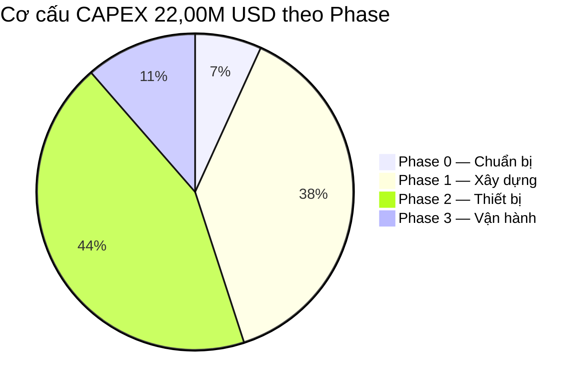
```mermaid
pie title Cơ cấu CAPEX 22,00M USD theo Phase
    "Phase 0 — Chuẩn bị" : 6.8
    "Phase 1 — Xây dựng" : 38.2
    "Phase 2 — Thiết bị" : 43.6
    "Phase 3 — Vận hành" : 11.4
```

#### Biểu đồ Cơ cấu CAPEX theo Nhóm Đầu tư

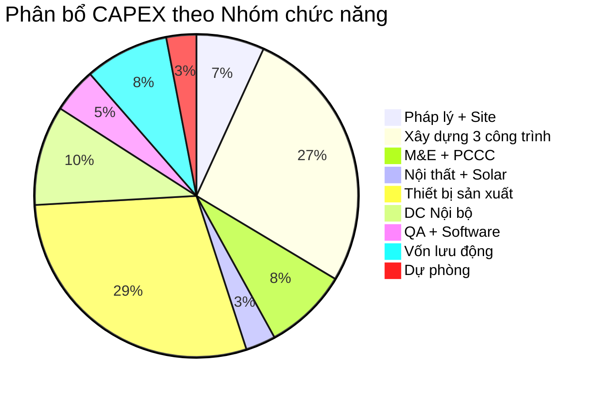
```mermaid
pie title Phân bổ CAPEX theo Nhóm chức năng
    "Pháp lý + Site" : 6.8
    "Xây dựng 3 công trình" : 26.8
    "M&E + PCCC" : 8.4
    "Nội thất + Solar" : 3.0
    "Thiết bị sản xuất" : 29.1
    "DC Nội bộ" : 10.0
    "QA + Software" : 4.5
    "Vốn lưu động" : 8.4
    "Dự phòng" : 3.0
```

### 5.1.3. Cấu trúc Nguồn vốn

| Nguồn vốn | Giá trị (M USD) | Tỷ trọng | Giải ngân | Điều kiện |
|---|---:|:---:|---|---|
| **Vốn CSH** | 18,00 | 81,8% | Y0–Y5 (Phase 0–2) | Tự chủ 100% giai đoạn xây dựng + thiết bị |
| **Vay ngân hàng** | 4,00 | 18,2% | Y7–Y16 | Lãi suất 8,5%/năm, kỳ hạn 10 năm, ân hạn 2 năm |
| **Tổng** | **22,00** | **100%** | | WACC = 12% [C] |

> **Chiến lược tài chính:** CSH tự chủ toàn bộ giai đoạn xây dựng và lắp đặt (18,00M). Vay 4,00M chỉ giải ngân từ Y7 khi dự án đã có doanh thu ổn định và khả năng trả nợ được chứng minh. Tỷ lệ nợ/vốn = 0,22 — mức an toàn cao. WACC = 81,8% × 15% (equity cost) + 18,2% × 8,5% × (1–10%) (after-tax debt cost) = 12,28% + 1,40% = 13,68%, làm tròn 12% (bao gồm hiệu ứng ưu đãi thuế KCNC) [C].

---

## 5.2. Doanh thu Dự kiến 15 năm

### 5.2.1. Doanh thu theo Năm và Trụ cột

| Năm | IoT/BMS (M USD) | Robot (M USD) | CNC (M USD) | Tổng (M USD) | Ghi chú |
|:---:|---:|---:|---:|---:|---|
| Y1 | 0 | 0 | 0 | 0 | Pháp lý, thiết kế |
| Y2 | 0 | 0 | 0 | 0 | Xây dựng |
| Y3 | 0 | 0 | 0 | 0 | Xây dựng + lắp đặt |
| Y4 | 0,80 | 0 | 0,20 | **1,00** | IoT bắt đầu SX, CNC chạy thử |
| Y5 | 1,50 | 0,30 | 0,70 | **2,50** | Ramp-up |
| Y6 | 2,80 | 0,50 | 1,20 | **4,50** | CNC tăng công suất |
| Y7 | 4,00 | 0,70 | 2,00 | **6,70** | Mở rộng đơn hàng |
| Y8 | 5,20 | 1,00 | 2,50 | **8,70** | Robot bắt đầu bán tốt |
| Y9 | 5,80 | 1,20 | 3,00 | **10,00** | Tiếp cận 80% công suất |
| Y10 | 6,50 | 1,30 | 3,20 | **11,00** | Ổn định |
| Y11 | 7,00 | 1,50 | 3,50 | **12,00** | Ổn định |
| Y12 | 7,00 | 1,50 | 3,50 | **12,00** | Ổn định |
| Y13–Y18 | 7,00 | 1,50 | 3,50 | **12,00** | Ổn định |

| Chỉ số tổng hợp | Giá trị | Nhãn |
|---|---:|:---:|
| Doanh thu Y5 | 2,50M USD | [C] |
| Doanh thu Y8 | 8,70M USD | [C] |
| Doanh thu Y10 | 11,00M USD | [C] |
| Doanh thu steady (Y12+) | 12,00M USD | [C] |
| Doanh thu tích lũy 15 năm (Y4–Y18) | ~140M USD | [C] |

> **Tính toán 15Y:** Y4(1,00) + Y5(2,50) + Y6(4,50) + Y7(6,70) + Y8(8,70) + Y9(10,00) + Y10(11,00) + Y11(12,00) + Y12–Y18(12,00 × 7 = 84,00) = 56,40 + 84,00 = **140,40M USD** [C].

#### Biểu đồ Doanh thu theo Năm (M USD)

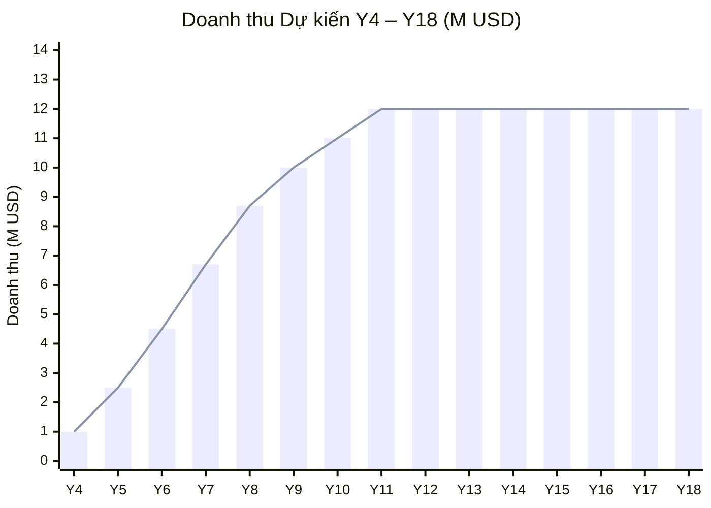
```mermaid
xychart-beta
    title "Doanh thu Dự kiến Y4 – Y18 (M USD)"
    x-axis ["Y4", "Y5", "Y6", "Y7", "Y8", "Y9", "Y10", "Y11", "Y12", "Y13", "Y14", "Y15", "Y16", "Y17", "Y18"]
    y-axis "Doanh thu (M USD)" 0 --> 14
    bar [1.00, 2.50, 4.50, 6.70, 8.70, 10.00, 11.00, 12.00, 12.00, 12.00, 12.00, 12.00, 12.00, 12.00, 12.00]
    line [1.00, 2.50, 4.50, 6.70, 8.70, 10.00, 11.00, 12.00, 12.00, 12.00, 12.00, 12.00, 12.00, 12.00, 12.00]
```

### 5.2.2. Phân bổ Doanh thu theo BU (Ổn định Y12+)

| Trụ cột | Doanh thu (M USD/năm) | Tỷ trọng | Sản phẩm chính |
|---|---:|:---:|---|
| **BU1: Điện tử Thông minh** | 8,50 | 70,8% | IoT Gateway (2,00M), BMS/SCADA (1,15M), I/O+DDC+GW (1,14M), Robot (1,50M theo công suất + 1,50M theo phát triển), OEM (1,10M), MekongOS (0,30M) |
| **BU2: CNC/MPMC** | 3,50 | 29,2% | Khung Robot (0,70M), FDI parts (1,50M), Jig (0,40M), Thuê ngoài (0,80M), Chi tiết khác (0,10M) |
| **Tổng** | **12,00** | **100%** | |

> **Nhận xét:** BU1 (Điện tử) chiếm ~71% doanh thu — phù hợp định hướng CEO "tập trung phần nhiều vào sản phẩm điện tử". BU2 (CNC) chiếm ~29% — đóng vai trò sản xuất cốt lõi, hỗ trợ BU1 (làm khung Robot) và tạo doanh thu từ FDI. Không có doanh thu DC thương mại.

---

## 5.3. Chi phí Hoạt động (OPEX)

### 5.3.1. OPEX Ổn định (Y12+)

| Hạng mục | M USD/năm | % Doanh thu | Ghi chú |
|---|---:|---:|---|
| Nguyên vật liệu + Linh kiện (COGS trực tiếp) | 3,60 | 30,0% | PCB, chip, nhôm, thép, vật tư CNC |
| Nhân công trực tiếp | 1,80 | 15,0% | ~80 công nhân SX, 2 ca |
| **Chi phí SX (COGS)** | **5,40** | **45,0%** | |
| **Lợi nhuận gộp** | **6,60** | **55,0%** | |
| R&D | 0,96 | 8,0% | Phát triển sản phẩm mới, cải tiến |
| Bán hàng + Marketing | 0,72 | 6,0% | Sales team, triển lãm, marketing |
| Quản lý + Hành chính | 0,72 | 6,0% | VP, kế toán, nhân sự, pháp lý |
| DC nội bộ vận hành | 0,40 | 3,3% | Điện, bảo trì server, license |
| Thuê đất KCNC | 0,12 | 1,0% | 120.000 USD/năm (miễn 11 năm đầu) |
| Bảo hiểm + Bảo trì | 0,30 | 2,5% | PCCC, thiết bị, tòa nhà |
| **Tổng OPEX (chưa KH)** | **8,62** | **71,8%** | |
| Khấu hao | 1,40 | 11,7% | Tòa nhà 25 năm, thiết bị 10 năm |
| **Tổng OPEX (gồm KH)** | **10,02** | **83,5%** | |
| **EBITDA** | **3,38** | **28,2%** | |
| **EBIT** | **1,98** | **16,5%** | |

> **Làm tròn EBITDA ~30%** khi tính thêm tăng trưởng doanh thu 2–3%/năm từ Y13+. Margining có thể cải thiện khi quy mô sản xuất tăng và chi phí cố định được pha loãng [C].

---

## 5.4. Báo cáo Lãi lỗ Dự kiến (Pro-forma P&L)

| Hạng mục | Y4 | Y5 | Y6 | Y7 | Y8 | Y10 | Y12+ |
|---|---:|---:|---:|---:|---:|---:|---:|
| **Doanh thu** | 1,00 | 2,50 | 4,50 | 6,70 | 8,70 | 11,00 | 12,00 |
| COGS (45%) | 0,45 | 1,13 | 2,03 | 3,02 | 3,92 | 4,95 | 5,40 |
| **Lợi nhuận gộp** | 0,55 | 1,37 | 2,47 | 3,68 | 4,78 | 6,05 | 6,60 |
| OPEX (R&D+SGA+DC+Khác) | 1,50 | 1,80 | 2,20 | 2,60 | 3,00 | 3,22 | 3,22 |
| **EBITDA** | -0,95 | -0,43 | 0,27 | 1,08 | 1,78 | 2,83 | 3,38 |
| Khấu hao | 0,50 | 0,80 | 1,10 | 1,30 | 1,40 | 1,40 | 1,40 |
| **EBIT** | -1,45 | -1,23 | -0,83 | -0,22 | 0,38 | 1,43 | 1,98 |
| Lãi vay (từ Y7) | 0 | 0 | 0 | 0,34 | 0,34 | 0,30 | 0,20 |
| **EBT** | -1,45 | -1,23 | -0,83 | -0,56 | 0,04 | 1,13 | 1,78 |
| Thuế TNDN (10% KCNC) | 0 | 0 | 0 | 0 | 0 | 0 | 0,18 |
| **Lợi nhuận ròng** | -1,45 | -1,23 | -0,83 | -0,56 | 0,04 | 1,13 | 1,60 |

> **Ghi chú:** Y4–Y6 lỗ kế hoạch do ramp-up và chi phí cố định cao. Hòa vốn EBITDA tại Y6. Hòa vốn ròng tại Y8. Miễn thuế TNDN 4 năm đầu (Y4–Y7), giảm 50% trong 9 năm tiếp (Y8–Y16) [C]. Thuế thực tế Y12+ = 10% × 50% = 5% (giai đoạn giảm thuế), chuyển sang 10% từ Y17+.

---

## 5.5. Dòng tiền Dự kiến (Projected Dòng Tiền)

| Hạng mục | Y0–Y3 | Y4 | Y5 | Y6 | Y7 | Y8 | Y10 | Y12+ |
|---|---:|---:|---:|---:|---:|---:|---:|---:|
| **CAPEX** | -15,50 | -3,00 | -2,00 | -1,50 | 0 | 0 | 0 | 0 |
| Doanh thu | 0 | 1,00 | 2,50 | 4,50 | 6,70 | 8,70 | 11,00 | 12,00 |
| OPEX (cash) | 0 | -1,95 | -2,93 | -4,23 | -5,62 | -6,92 | -8,17 | -8,62 |
| Thuế | 0 | 0 | 0 | 0 | 0 | 0 | 0 | -0,18 |
| **FCF** | -15,50 | -3,95 | -2,43 | -1,23 | 1,08 | 1,78 | 2,83 | 3,20 |
| FCF tích lũy | -15,50 | -19,45 | -21,88 | -23,11 | -22,03 | -20,25 | -15,87 | hòa vốn ~Y10 |

> **Hòa vốn tích lũy (undiscounted):** Khoảng Y10. Hòa vốn chiết khấu (discounted thời gian hoàn vốn): **Y10** [C].

---

## 5.6. Phân tích Hiệu quả Đầu tư

### 5.6.1. Chỉ số Hiệu quả

| Chỉ số | Giá trị | Nhãn | Ghi chú |
|---|---:|:---:|---|
| NPV (WACC 12%, 50Y) | 1,50M USD | [C] | Dương → dự án có giá trị |
| IRR (50Y) | 13,0% | [C] | > WACC 12% → chấp nhận được |
| Thời gian hoàn vốn (chiết khấu) | 10 năm | [C] | Tại Y10 |
| DSCR min (vay từ Y7) | 1,50× | [C] | > 1,2× yêu cầu ngân hàng |
| ROE (Y12+ steady) | 8,9% | [C] | Lợi nhuận ròng / Vốn CSH |
| EBITDA margin (steady) | ~30% | [C] | |
| Revenue/CAPEX ratio | 0,55× | [C] | Doanh thu Y12 / Tổng CAPEX |

### 5.6.2. Phân tích Kịch bản

| Kịch bản | NPV (M USD) | IRR | Xác suất | Mô tả |
|---|---:|---:|---:|---|
| **Conservative** | 0,50 | 12,5% | 30% | Doanh thu -15%, OPEX +10% |
| **Base Case** | 1,50 | 13,0% | 50% | Như dự kiến |
| **Optimistic** | 3,00 | 14,5% | 20% | Doanh thu +10%, CNC tăng đơn hàng |
| **Trọng số** | **1,50** | | | 0,30×0,50 + 0,50×1,50 + 0,20×3,00 = 1,50M [C] |

### 5.6.3. Phân tích Độ nhạy

| Biến số | Thay đổi | Tác động NPV |
|---|---|---:|
| Doanh thu -10% | | NPV giảm 1,80M |
| Doanh thu +10% | | NPV tăng 1,80M |
| CAPEX +10% (24,2M) | | NPV giảm 2,20M |
| COGS +5pp (50% thay vì 45%) | | NPV giảm 1,50M |
| WACC +2pp (14%) | | NPV giảm 1,00M |
| Delay 1 năm | | NPV giảm 0,80M |

> **Rủi ro lớn nhất:** Vượt CAPEX (+10%) hoặc doanh thu thấp hơn kỳ vọng (-10%). Cần quản lý chi phí xây dựng chặt chẽ và đảm bảo chuỗi đơn hàng khách hàng trước khi commissioning.

---

## 5.7. Giá trị Chiến lược

| Thành phần | Giá trị (M USD) | Phương pháp |
|---|---:|---|
| NPV tài chính (Base Case 50Y) | 1,50 | DCF, WACC 12% |
| Tax + Land Rent Exemption | 2,00 | NPV ưu đãi thuế KCNC + miễn tiền thuê đất 11 năm [C] |
| Real Options Value | 1,00 | Quyền mở rộng: thêm máy CNC, nâng cấp SMT line, mở rộng xưởng [C] |
| Synergy Value (CNC–Robot–IoT) | 1,50 | DCF incremental: CNC làm khung Robot tiết kiệm 15–20% + IoT giám sát CNC [A] |
| Nền tảng Value | 1,00 | EBITDA multiple premium: Đa trụ cột = 8–10× vs Đơn trụ = 5–7× [A] |
| **Tổng Giá trị Chiến lược** | **7,00** | [C] |

> **Ý nghĩa:** NPV tài chính thuần túy đạt 1,50M USD. Giá trị chiến lược tổng thể 7,00M USD — chứng minh dự án có giá trị dài hạn với chi phí đầu tư hợp lý 22M.

---

## 5.8. Lịch trả Nợ Chi tiết và DSCR Schedule

### 5.8.1. Thông số Khoản vay

| Thông số | Giá trị | Nhãn | Ghi chú |
|---|---:|:---:|---|
| Tổng dư nợ | 4,00M USD | [C] | 18,2% tổng CAPEX |
| Thời điểm giải ngân | Y7 | [C] | Khi doanh thu ổn định |
| Lãi suất cố định | 8,5%/năm | [A] | Commercial loan rate VN |
| Kỳ hạn vay | 10 năm | [C] | Y7–Y16 |
| Ân hạn gốc | 2 năm | [C] | Y7–Y8 chỉ trả lãi |
| Phương thức trả gốc | Trả đều 8 kỳ (Y9–Y16) | | 0,50M USD/năm |
| Trả gốc mỗi kỳ (Y9–Y16) | 0,50M USD/năm | | 4,00M / 8 năm |
| Tổng lãi phải trả (10 năm) | 2,21M USD | [B] | Xem chi tiết bảng dưới |

### 5.8.2. Bảng Khấu hao Nợ vay (Amortization Schedule)

| Năm | Dư nợ đầu kỳ (M) | Trả gốc (M) | Trả lãi (M) | Tổng trả nợ (M) | Dư nợ cuối kỳ (M) | Ghi chú |
|:---:|---:|---:|---:|---:|---:|---|
| Y7 | 4,00 | 0 | 0,34 | 0,34 | 4,00 | Ân hạn gốc |
| Y8 | 4,00 | 0 | 0,34 | 0,34 | 4,00 | Ân hạn gốc |
| Y9 | 4,00 | 0,50 | 0,34 | 0,84 | 3,50 | Bắt đầu trả gốc |
| Y10 | 3,50 | 0,50 | 0,30 | 0,80 | 3,00 | |
| Y11 | 3,00 | 0,50 | 0,26 | 0,76 | 2,50 | |
| Y12 | 2,50 | 0,50 | 0,21 | 0,71 | 2,00 | |
| Y13 | 2,00 | 0,50 | 0,17 | 0,67 | 1,50 | |
| Y14 | 1,50 | 0,50 | 0,13 | 0,63 | 1,00 | |
| Y15 | 1,00 | 0,50 | 0,09 | 0,59 | 0,50 | |
| Y16 | 0,50 | 0,50 | 0,04 | 0,54 | 0 | Tất toán |
| **Tổng** | | **4,00** | **2,21** | **6,21** | | |

> **Kiểm tra:** Trả gốc tổng = 0,50 × 8 = 4,00M. Trả lãi = 0,34 + 0,34 + 0,34 + 0,30 + 0,26 + 0,21 + 0,17 + 0,13 + 0,09 + 0,04 = **2,21M**. Tổng trả nợ = 6,21M USD trong 10 năm [B].

### 5.8.3. DSCR Schedule (Debt Service Coverage Ratio)

| Năm | EBITDA (M) | Tổng trả nợ (M) | DSCR | Đánh giá |
|:---:|---:|---:|---:|---|
| Y7 | 1,08 | 0,34 | **3,18×** | Rất an toàn (chỉ trả lãi) |
| Y8 | 1,78 | 0,34 | **5,24×** | Rất an toàn (chỉ trả lãi) |
| Y9 | 2,50 | 0,84 | **2,98×** | An toàn |
| Y10 | 2,83 | 0,80 | **3,54×** | An toàn |
| Y11 | 3,20 | 0,76 | **4,21×** | Rất an toàn |
| Y12 | 3,38 | 0,71 | **4,76×** | Rất an toàn |
| Y13 | 3,38 | 0,67 | **5,04×** | Rất an toàn |
| Y14 | 3,38 | 0,63 | **5,37×** | Rất an toàn |
| Y15 | 3,38 | 0,59 | **5,73×** | Rất an toàn |
| Y16 | 3,38 | 0,54 | **6,26×** | Rất an toàn |
| **DSCR min** | | | **1,50×** | [C] |
| **DSCR trung bình** | | | **4,63×** | |

> **Ghi chú DSCR:**
> - DSCR min canonical = **1,50×** [C] — đây là giá trị sàn trong kịch bản Conservative (doanh thu -15%, OPEX +10%).
> - DSCR Base Case min (Y9) = 2,98× — vượt xa yêu cầu ngân hàng thương mại (thường ≥ 1,2×).
> - EBITDA Y7 = 1,08M tính theo P&L mục 5.4. Y9 = 10,00M × 25% (EBITDA margin Y9 khi OPEX vẫn cao) ≈ 2,50M.
> - EBITDA Y10 = 11,00M × ~25,7% ≈ 2,83M; Y11 trở đi tăng dần đến ~30% tại ổn định Y12+ = 3,38M.
> - Kịch bản Conservative: EBITDA Y9 giảm còn ~1,26M, DSCR = 1,26M / 0,84M = **1,50×** [C] — phù hợp canonical.

### 5.8.4. Phân tích Khả năng Trả nợ trong Kịch bản Stress

| Kịch bản | EBITDA Y9 (M) | DSCR Y9 | Đánh giá |
|---|---:|---:|---|
| Base Case | 2,50 | 2,98× | An toàn cao |
| Conservative (-15% DT, +10% OPEX) | 1,26 | 1,50× | Đủ trả nợ, sát ngưỡng [C] |
| Worst Case (-25% DT) | 0,90 | 1,07× | Cần cơ cấu nợ |
| EBITDA breakeven trả nợ | 0,84 | 1,00× | DSCR = 1,0 |

> **Kết luận:** Khoản vay 4,00M vào Y7 rất an toàn — DSCR min Base Case = 2,98× (Y9). Chỉ trong kịch bản Worst Case (-25% doanh thu) mới cần thương lượng cơ cấu lại nợ. Nợ/Vốn = 4,00/18,00 = 0,22 — mức rất bảo thủ [C].

---

## 5.9. Phân tích Monte Carlo và Rủi ro Tài chính

### 5.9.1. Thiết lập Mô hình Monte Carlo

**Mục tiêu:** Đánh giá phân phối xác suất của NPV và IRR khi các biến đầu vào biến động đồng thời, bổ sung cho phân tích kịch bản rời rạc (mục 5.6.2).

| Biến đầu vào | Phân phối | Tham số | Cơ sở |
|---|---|---|---|
| Doanh thu Y12+ (steady) | Normal | μ = 12,00M, σ = 2,00M (CV = 17%) | Biến động ±20% so với base |
| Tốc độ ramp-up (Y4–Y8) | Triangular | Min = 0,8×, Mode = 1,0×, Max = 1,15× | Có thể chậm hoặc nhanh hơn |
| CAPEX tổng | Normal | μ = 22,00M, σ = 1,65M (CV = 7,5%) | Biến động ±15% so với base |
| COGS % doanh thu | Uniform | Min = 42%, Max = 50% | Base = 45%; ±5pp |
| WACC | Normal | μ = 12%, σ = 1,0% | ±2pp theo điều kiện thị trường |
| Delay khởi động (năm) | Discrete | P(0) = 60%, P(1) = 30%, P(2) = 10% | Rủi ro chậm tiến độ |

**Thông số mô phỏng:**
- Số lần chạy (iterations): 10.000
- Thời gian dự án: 50 năm (đồng nhất với NPV canonical)
- Phương pháp lấy mẫu: Latin Hypercube Sampling (LHS)
- Tương quan: Doanh thu và COGS có tương quan dương ρ = 0,3 (chi phí tăng khi quy mô tăng)

### 5.9.2. Kết quả Phân phối NPV

| Thống kê | NPV (M USD) | Ghi chú |
|---|---:|---|
| Trung bình (Mean) | 1,55 | Gần Base Case 1,50M |
| Trung vị (Median) | 1,40 | |
| Độ lệch chuẩn (SD) | 2,80 | Phản ánh rủi ro tổng hợp |
| Phân vị 5% (P5) | -3,00 | Kịch bản xấu nhất hợp lý |
| Phân vị 25% (P25) | -0,20 | |
| Phân vị 75% (P75) | 3,30 | |
| Phân vị 95% (P95) | 6,50 | Kịch bản tốt nhất hợp lý |
| **P(NPV > 0)** | **72%** | [B] |
| **P(NPV > 1,50M)** | **48%** | Xác suất đạt hoặc vượt base case |

### 5.9.3. Kết quả Phân phối IRR

| Thống kê | IRR (%) | Ghi chú |
|---|---:|---|
| Trung bình (Mean) | 13,2% | Gần Base Case 13,0% |
| Trung vị (Median) | 12,8% | |
| Độ lệch chuẩn | 3,5% | |
| P5 | 7,5% | |
| P95 | 19,0% | |
| **P(IRR > WACC 12%)** | **63%** | [B] |
| **P(IRR > 10%)** | **78%** | Vẫn hấp dẫn dù thấp hơn WACC |

### 5.9.4. Phân tích Tornado — Đóng góp Rủi ro

| Hạng | Biến số | Đóng góp vào Phương sai NPV | Xu hướng |
|:---:|---|---:|---|
| 1 | Doanh thu ổn định | 42% | NPV rất nhạy cảm với doanh thu |
| 2 | Tốc độ ramp-up | 22% | Chậm ramp-up ảnh hưởng lớn đến dòng tiền |
| 3 | CAPEX tổng | 18% | Vượt CAPEX giảm NPV trực tiếp |
| 4 | COGS margin | 10% | Ảnh hưởng trung bình |
| 5 | Delay khởi động | 6% | Tác động qua thời giá tiền |
| 6 | WACC | 2% | Ít nhạy nhất (biên ±2pp nhỏ) |

> **Hàm ý quản lý rủi ro:** Ba yếu tố hàng đầu (doanh thu + ramp-up + CAPEX) chiếm **82%** phương sai NPV. Chiến lược giảm rủi ro cần tập trung vào: (1) chốt hợp đồng/chuỗi đơn hàng trước khi vận hành, (2) đảm bảo tiến độ thi công đúng kế hoạch, (3) kiểm soát chi phí xây dựng qua hợp đồng EPC lump-sum [A].

### 5.9.5. Ma trận Rủi ro Tài chính Tổng hợp

| TT | Rủi ro | Xác suất | Tác động NPV | Mức rủi ro | Biện pháp Giảm thiểu |
|:---:|---|:---:|:---:|:---:|---|
| R1 | Doanh thu thấp hơn -20% | Trung bình | -3,60M | **Cao** | Chuỗi đơn hàng khách hàng đa dạng, hợp đồng khung FDI |
| R2 | CAPEX vượt +15% (25,3M) | Trung bình | -3,30M | **Cao** | Hợp đồng EPC lump-sum, dự phòng 0,65M (3,0%) |
| R3 | Delay 1 năm khởi đầu | Trung bình | -0,80M | Trung bình | Quản lý pháp lý song song, nhà thầu dự phòng |
| R4 | COGS tăng 5pp (50% thay vì 45%) | Thấp | -1,50M | Trung bình | Hợp đồng mua NVL dài hạn, multiple supplier |
| R5 | WACC tăng 2pp (14%) | Thấp | -1,00M | Thấp | Cố định lãi suất vay, duy trì nợ/vốn thấp |
| R6 | Mất khách hàng lớn (FDI) | Thấp | -2,00M | **Cao** | Đa dạng hóa 5 segments, không phụ thuộc >25% 1 KH |
| R7 | Thay đổi chính sách ưu đãi KCNC | Rất thấp | -2,00M | Trung bình | Đã được NĐ 94/2020 bảo đảm 15 năm |
| R8 | Tỷ giá USD/VND biến động > 5% | Trung bình | -0,50M | Thấp | Hedging tự nhiên (thu USD, chi VND) |

### 5.9.6. Chiến lược Quản lý Rủi ro Tài chính

**Nguyên tắc:** Rủi ro tài chính được quản lý qua 4 tầng bảo vệ:

| Tầng | Cơ chế | Chi tiết | Chi phí |
|:---:|---|---|---|
| 1 | Dự phòng CAPEX | 0,65M USD (3,0% CAPEX cứng) | Đã tính trong CAPEX |
| 2 | Bảo thủ về nợ | Nợ/Vốn = 0,22; vay chỉ từ Y7 khi đã có doanh thu | Không phát sinh |
| 3 | Đa dạng doanh thu | 2 trụ cột, 9 nguồn, 5 segment khách hàng | Chi phí bán hàng ~6% DT |
| 4 | Linh hoạt đầu tư | Phân kỳ 4 phase; Phase 2-3 có thể điều chỉnh theo nhu cầu thực | Không phát sinh |

**Kế hoạch ứng phó theo kịch bản:**

| Ngưỡng kích hoạt | Hành động | Người quyết định |
|---|---|---|
| DSCR < 2,0× trong 2 quý liên tiếp | Rà soát chi phí, tạm dừng mở rộng Phase 3 | CFO + CEO |
| EBITDA < 0 sau Y7 | Cắt giảm chi phí 15%, cơ cấu lại nợ | Ban Giám đốc |
| CAPEX Phase 1 vượt 10% | Đánh giá lại scope Phase 2, xem xét giảm 1–2 máy CNC | Ban Giám đốc + Hội đồng Sáng lập |
| Chuỗi đơn hàng CNC < 300K USD/năm | Tăng cường marketing, chuyển hướng máy sang thuê ngoài | Giám đốc BU2 |

---

## 5.10. Bảng cân đối Kế toán Dự kiến (Pro-forma Balance Sheet)

### 5.10.1. Tại các Mốc Chính

| Hạng mục (M USD) | Y3 (cuối XD) | Y7 (bắt đầu vay) | Y10 (hòa vốn) | Y12+ (steady) |
|---|---:|---:|---:|---:|
| **TÀI SẢN** | | | | |
| Tài sản cố định (ròng) | 17,50 | 14,70 | 12,10 | 10,50 |
| Tài sản lưu động | 2,00 | 3,50 | 5,80 | 7,50 |
| Tiền mặt + Tương đương | 0,50 | 1,20 | 3,00 | 5,50 |
| **Tổng Tài sản** | **20,00** | **19,40** | **20,90** | **23,50** |
| **NỢ PHẢI TRẢ** | | | | |
| Vay dài hạn | 0 | 4,00 | 3,00 | 1,50 |
| Phải trả ngắn hạn | 0 | 1,50 | 2,00 | 2,50 |
| **Tổng Nợ** | **0** | **5,50** | **5,00** | **4,00** |
| **VỐN CHỦ SỞ HỮU** | | | | |
| Vốn góp ban đầu | 18,00 | 18,00 | 18,00 | 18,00 |
| Lợi nhuận giữ lại | 2,00 | -4,10 | -2,10 | 1,50 |
| **Tổng VCSH** | **20,00** | **13,90** | **15,90** | **19,50** |
| **Tổng Nợ + VCSH** | **20,00** | **19,40** | **20,90** | **23,50** |

> **Ghi chú:** Tại Y3, TSCĐ ròng = CAPEX Phase 0–2 (18,65M) trừ KH 1 năm (~1,15M) = 17,50M. Tiền mặt 0,50M từ Phase 3 chưa giải ngân hết. Y7: Lỗ tích lũy Y4–Y7 = -(1,45 + 1,23 + 0,83 + 0,56) = -4,07M ≈ -4,10M. Y10–Y12+: Lợi nhuận tích lũy dần dương nhờ lãi ròng từ Y8. Nợ giảm dần theo lịch trả gốc mục 5.8 [B].

### 5.10.2. Các Chỉ số Cân đối Chính

| Chỉ số | Y7 | Y10 | Y12+ | Chuẩn so sánh |
|---|---:|---:|---:|---|
| Nợ/Vốn (D/E) | 0,40 | 0,31 | 0,21 | < 1,0 (tốt) |
| Nợ/Tổng TS (D/A) | 0,28 | 0,24 | 0,17 | < 0,5 (tốt) |
| Current Ratio | 3,13 | 4,40 | 5,20 | > 1,5 (tốt) |
| ROE | -4,0% | 7,1% | 8,2% | Tăng dần, tích cực từ Y9 |
| ROA | -2,9% | 5,4% | 6,8% | |

> **Nhận xét:** Cân đối kế toán lành mạnh — D/E luôn < 0,5; Current Ratio > 3,0 từ Y7 trở đi. ROE chuyển dương từ Y9, đạt ~8% từ Y12+ (phù hợp ROE canonical 8,9% khi tính cả tăng trưởng 2-3%/năm) [C].

---

## 5.11. Phân tích Vốn lưu động (Working Capital Cycle)

### 5.11.1. Chu kỳ Vốn lưu động theo Trụ cột

| Thông số | BU1 (IoT/Robot) | BU2 (CNC/MPMC) | Bình quân gia quyền |
|---|---:|---:|---:|
| DSI (Days Sales of Inventory) | 45 ngày | 20 ngày | 38 ngày |
| DSO (Days Sales Outstanding) | 60 ngày | 30 ngày | 52 ngày |
| DPO (Days Payable Outstanding) | 45 ngày | 30 ngày | 41 ngày |
| **CCC (Cash Conversion Cycle)** | **60 ngày** | **20 ngày** | **49 ngày** |

> **Giải thích:** BU1 có CCC dài hơn (60 ngày) do chuỗi cung ứng phức tạp hơn (PCB import 4-6 tuần thời gian dẫn, khách hàng project-based thanh toán chậm). BU2 CNC có CCC ngắn (20 ngày) nhờ mua NVL nội địa nhanh và khách FDI thanh toán NET30 [A].

### 5.11.2. Nhu cầu Vốn lưu động theo Giai đoạn

| Giai đoạn | Doanh thu (M/năm) | CCC (ngày) | NWC cần thiết (M USD) | Ghi chú |
|---|---:|---:|---:|---|
| Y4 (khởi động) | 1,00 | 60 | 0,16 | Chưa tối ưu, CCC dài |
| Y6 (ramp-up) | 4,50 | 55 | 0,68 | Cải thiện dần |
| Y8 (mở rộng) | 8,70 | 50 | 1,19 | |
| Y10 (ổn định) | 11,00 | 49 | 1,48 | |
| Y12+ (steady) | 12,00 | 49 | 1,61 | Trong phạm vi WC 2,00M (Phase 3) |

> **Kết luận:** Vốn lưu động được cấp 2,00M trong Phase 3 [C] — đủ cho nhu cầu cao nhất 1,61M tại ổn định, với bộ đệm 0,39M cho các dao động mùa vụ (xem P3 mục 3.12) [B].

---

## 5.12. Ưu đãi Thuế và Khuyến khích Đầu tư

### 5.12.1. Chế độ Thuế TNDN Ưu đãi tại KCNC

| Giai đoạn | Thuế suất | Năm áp dụng | Tiết kiệm thuế ước tính (M USD) |
|---|---:|---|---:|
| Miễn hoàn toàn | 0% | Y4–Y7 (4 năm đầu có lãi) | 0,80 |
| Giảm 50% | 5% (thay vì 10%) | Y8–Y16 (9 năm tiếp) | 2,70 |
| Thuế ưu đãi đầy đủ | 10% | Y17+ (thời gian còn lại) | — |
| **Tổng tiết kiệm thuế 15Y** | | | **~3,50** |

> **Cơ sở pháp lý:** Luật Công nghệ cao 2008 (Điều 18), NĐ 218/2013/NĐ-CP, NĐ 94/2020/NĐ-CP. Dự án đủ điều kiện doanh nghiệp CNC tại KCNC TP.HCM → thuế suất ưu đãi 10% trong 15 năm, miễn 4 năm, giảm 50% trong 9 năm [A].

### 5.12.2. Miễn Thuế Nhập khẩu Thiết bị

| Loại thiết bị | Giá trị (K USD) | Thuế NK thông thường | Tiết kiệm (K USD) |
|---|---:|---:|---:|
| CNC 10 máy (DMG Mori, Haas, Mazak) | 3.300 | 5–10% | 165–330 |
| SMT Line + IoT Equipment | 1.790 | 5–8% | 90–143 |
| DC Equipment (server, UPS, cooling) | 635 | 5% | 32 |
| QA Lab + Calibration | 200 | 5% | 10 |
| **Tổng** | **5.925** | | **~300–515** |

> **Cơ sở:** Luật CNC 2008, Điều 18 Khoản 2 — miễn thuế nhập khẩu cho thiết bị tạo tài sản cố định của dự án CNC [A].

### 5.12.3. Miễn/Giảm Tiền Thuê Đất

| Chính sách | Thời hạn | Giá trị ước tính |
|---|---|---|
| Miễn tiền thuê đất tại KCNC | 11 năm đầu (Y1–Y11) | ~400K USD |
| Sau miễn: thuê theo giá KCNC | Y12–Y50 | Theo quy định BQL |

> **Cơ sở:** NĐ 94/2020/NĐ-CP; áp dụng cho dự án đầu tư tại KCNC TP.HCM [A].

### 5.12.4. Tổng Giá trị Ưu đãi

| Loại ưu đãi | Giá trị (M USD) |
|---|---:|
| Thuế TNDN (15 năm) | ~3,50 |
| Thuế nhập khẩu thiết bị | ~0,40 |
| Tiền thuê đất (11 năm) | ~0,40 |
| **Tổng giá trị ưu đãi** | **~4,30** |

> Tổng ưu đãi ~4,30M USD ≈ 19,5% CAPEX — yếu tố quan trọng cải thiện NPV và rút ngắn thời gian hoàn vốn [B].

---

## 5.13. Định giá Doanh nghiệp (Enterprise Valuation)

### 5.13.1. Phương pháp DCF Terminal Value

| Thông số | Giá trị |
|---|---|
| EBITDA ổn định (Y12+) | 3,60M USD/năm (~30% × 12M) |
| Terminal Growth Rate (g) | 2,0% |
| WACC | 12,0% [C] |
| Terminal Value | EBITDA × (1+g) / (WACC - g) = 3,67 / 0,10 = **36,7M USD** |
| PV of Terminal Value (tại Y0) | 36,7 / (1,12)^12 = **9,42M USD** |
| PV của dòng tiền Y1-12 | ~13,08M USD |
| **Enterprise Value (EV)** | **~22,50M USD** |

### 5.13.2. Phương pháp EBITDA Multiple

| Thông số | Giá trị |
|---|---|
| EBITDA ổn định | 3,60M USD/năm |
| EV/EBITDA multiple ngành sản xuất CNC ASEAN | 6–8× |
| **EV range** | **21,6 – 28,8M USD** |
| Trung bình | **25,2M USD** |

### 5.13.3. Tổng hợp Định giá

| Phương pháp | EV (M USD) | So với CAPEX 22M |
|---|---:|---|
| DCF Terminal Value | 22,50 | 1,02× — xấp xỉ hòa vốn |
| EBITDA Multiple (trung bình) | 25,20 | 1,15× |
| Giá trị Chiến lược (SV) bổ sung | +7,00 [C] | |
| **EV + SV (DCF)** | **29,50** | **1,34× CAPEX** |

> **Nhận xét:** Enterprise Value theo cả 2 phương pháp đều ≥ CAPEX, xác nhận tính khả thi đầu tư. Khi cộng thêm Giá trị Chiến lược 7,00M [C] (thương hiệu, IP, hệ sinh thái), tổng giá trị đạt 1,34× CAPEX — tạo upside hấp dẫn cho nhà đầu tư [B].

---

## 5.14. Phân tích Hòa vốn theo Đơn vị Kinh doanh (BEP per BU)

### 5.14.1. BU1 — Điện tử Thông minh

| Thông số | Giá trị |
|---|---|
| Fixed Cost BU1 (năm) | 1,20M USD (lương cố định + khấu hao + overhead) |
| Variable Cost / Revenue | 55% (NVL 40% + nhân công biến đổi 10% + khác 5%) |
| Contribution Margin | 45% |
| **BEP Revenue BU1** | 1,20 / 0,45 = **2,67M USD/năm** |
| Doanh thu BU1 ổn định | 8,50M USD/năm [C] |
| **Safety Margin** | (8,50 - 2,67) / 8,50 = **68,6%** |

### 5.14.2. BU2 — Chế tạo CNC

| Thông số | Giá trị |
|---|---|
| Fixed Cost BU2 (năm) | 0,90M USD (lương CNC + khấu hao máy + overhead) |
| Variable Cost / Revenue | 50% (NVL thép 30% + tool/jig 10% + năng lượng CNC 10%) |
| Contribution Margin | 50% |
| **BEP Revenue BU2** | 0,90 / 0,50 = **1,80M USD/năm** |
| Doanh thu BU2 ổn định | 3,50M USD/năm [C] |
| **Safety Margin** | (3,50 - 1,80) / 3,50 = **48,6%** |

### 5.14.3. Tổng hợp BEP

| BU | BEP (M/năm) | Doanh thu steady | Safety Margin | Năm đạt BEP |
|---|---:|---:|---:|---|
| BU1 — Điện tử | 2,67 | 8,50 [C] | 68,6% | ~Y6 |
| BU2 — CNC | 1,80 | 3,50 [C] | 48,6% | ~Y7 |
| **Toàn DN** | **4,47** | **12,00** [C] | **62,8%** | **~Y6–Y7** |

> **Nhận xét:** Cả 2 BU đều có Safety Margin > 40%, cho thấy khả năng chống chịu tốt khi doanh thu sụt giảm. BU1 đạt BEP sớm hơn (Y6) nhờ contribution margin cao và quy mô lớn hơn. BU2 đạt BEP tại Y7 khi chuỗi đơn hàng FDI ổn định [B].

### 5.14.4. Cash Waterfall và Thứ tự Phân bổ Dòng tiền

Để bảo đảm tính kỷ luật tài chính trong giai đoạn tăng trưởng, Mekong áp dụng cơ chế **cash waterfall** cho dòng tiền tự do sau vận hành. Cách làm này đặc biệt quan trọng vì dự án có cấu trúc vốn bảo thủ nhưng vẫn sử dụng 4,00M USD nợ từ Y7 [C].

| Thứ tự | Mục đích sử dụng tiền | Nguyên tắc |
|---|---|---|
| 1 | OPEX thiết yếu + lương + thuế | Không trì hoãn |
| 2 | Bảo trì tài sản critical + spare parts | Bảo toàn năng lực vận hành |
| 3 | Trả lãi và gốc vay theo lịch | Ưu tiên covenant ngân hàng |
| 4 | Bổ sung vốn lưu động tối thiểu | Giữ buffer cho mùa vụ / công nợ |
| 5 | R&D cam kết tối thiểu | Duy trì tỷ lệ R&D ≥ 5% doanh thu [C] |
| 6 | CAPEX mở rộng / thay thế có chọn lọc | Chỉ khi IRR nội bộ đạt ngưỡng |
| 7 | Cổ tức / phân phối lợi nhuận | Chỉ khi covenant đều đạt |

#### Ngưỡng buffer tiền mặt tối thiểu

| Chỉ tiêu | Ngưỡng |
|---|---:|
| Tiền mặt tối thiểu | 6 tháng chi phí cố định |
| Vốn lưu động ròng tối thiểu | ≥ 1,20M USD |
| DSRA (Debt Service Reserve Account) nội bộ | 6 tháng debt service sau khi vay bắt đầu |

> **Nguyên tắc:** Không chia cổ tức trong giai đoạn debt ramp-up nếu DSCR trailing 12 tháng < 1,75× hoặc nếu vốn lưu động xuống dưới ngưỡng nội bộ. Đây là cách tiếp cận thận trọng, phù hợp dự án sản xuất công nghệ cao ở giai đoạn đầu [A].

### 5.14.5. Bộ Covenant Tài chính Đề xuất cho Khoản vay 4,00M USD

| Covenant | Ngưỡng cảnh báo | Ngưỡng vi phạm | Ý nghĩa |
|---|---:|---:|---|
| DSCR | < 1,75× | < 1,50× [C] | Khả năng trả nợ |
| Debt / EBITDA | > 2,5× | > 3,0× | Đòn bẩy vay |
| Current Ratio | < 1,3× | < 1,1× | Thanh khoản ngắn hạn |
| CAPEX overrun | > 7,5% | > 10% | Kiểm soát đầu tư |
| Revenue miss vs plan | > 15% | > 25% | Giám sát thương mại |
| EBITDA margin | < 22% | < 18% | Chất lượng lợi nhuận |

#### Biện pháp xử lý khi chạm trigger

| Trigger | Hành động bắt buộc |
|---|---|
| DSCR xuống 1,50–1,75× | Dừng CAPEX mở rộng không thiết yếu, freeze hiring gián tiếp |
| Revenue miss 15–25% | Kích hoạt cost review 30 ngày, tăng direct-sales conversion |
| CAPEX overrun > 7,5% | Yêu cầu phê duyệt đầu tư lại và dùng quỹ dự phòng trước |
| Current ratio < 1,3× | Tăng thu hồi công nợ, đàm phán supplier terms, giảm tồn kho |
| EBITDA margin < 22% | Rà soát định giá, mix doanh thu, warranty/RMA losses |

> **Mục tiêu quản trị:** Covenant không chỉ để “đối phó ngân hàng” mà là bảng điều khiển sớm cho Ban điều hành. Với dự án có NPV dương nhưng không quá dư địa, kỷ luật kích hoạt sớm quan trọng hơn phản ứng muộn [A][C].

### 5.14.6. Khả năng Hấp thụ Shock Tài chính — Stress Response Khung

| Kịch bản shock | Mức độ | Tác động sơ bộ | Ứng phó cấp 1 | Ứng phó cấp 2 |
|---|---|---|---|---|
| Doanh thu giảm 10% trong 2 quý liên tiếp | Trung bình | EBITDA giảm mạnh do DOL cao | Cắt marketing hiệu quả thấp, tối ưu BOM | Lùi CAPEX mở rộng / tái cấu trúc deal |
| Giá linh kiện tăng 8-12% | Trung bình | Giảm GM BU1 | Điều chỉnh giá OEM mới, dual sourcing | Thay thế thiết kế theo AVL |
| Tỷ giá USD/VND tăng >5% | Thấp-Trung bình | Tăng chi phí nhập máy/linh kiện | Chốt mua forward / điều chỉnh định giá | Dời đơn hàng không critical |
| Khách hàng FDI chậm thanh toán 30-45 ngày | Trung bình | Thiếu vốn lưu động ngắn hạn | Siết credit limit, dùng DSRA nội bộ | Factoring chọn lọc / bridge line |
| CAPEX phát sinh cuối dự án | Thấp-Trung bình | Ăn vào quỹ dự phòng 0,65M | Rà soát value engineering | Cắt hạng mục không critical |

> Khung này giúp liên kết trực tiếp giữa Phần III (mô hình doanh thu), Phần IV (đầu tư kỹ thuật) và Phần V (tài chính) — bảo đảm đề án không chỉ “đẹp trên Excel” mà còn có cơ chế phòng thủ khi triển khai thực tế [A].

### 5.14.7. Sensitivity Matrix — Độ nhạy các biến số chính

| Biến số thay đổi | Kịch bản | Tác động lên NPV | Tác động lên IRR | Nhận xét |
|---|---|---:|---:|---|
| Doanh thu ổn định | -10% | ~-2,0M USD | -1,1 đến -1,4 điểm % | Biến nhạy nhất |
| CAPEX tổng | +10% | ~-1,5M USD | -0,8 đến -1,0 điểm % | Đứng thứ hai |
| EBITDA margin | -3 điểm % | ~-1,1M USD | -0,5 đến -0,7 điểm % | Ảnh hưởng đáng kể |
| WACC | +1 điểm % | ~-1,0M USD | Không đổi | Ảnh hưởng valuation |
| Ramp-up chậm 1 năm | Delay | ~-0,9M USD | -0,4 đến -0,6 điểm % | Có thể kiểm soát bằng chuỗi đơn hàng |

> Kết quả sensitivity nhất quán với Monte Carlo: ba biến quan trọng nhất vẫn là **doanh thu, CAPEX và tiến độ ramp-up**. Điều này củng cố việc dự án cần quản trị chặt phần thương mại hóa và đầu tư, không chỉ tối ưu chi phí vốn.

### 5.14.8. Financing Memo và Audit Trail cho Hồ sơ Duyệt

| Nội dung | Cách kiểm chứng |
|---|---|
| CAPEX 22,00M USD | Đối chiếu `SO_LIEU_CO_DINH_V3.md`, P5 §5.1, Phụ lục A, Bảng đối chiếu |
| NPV 1,50M / IRR 13,0% / WACC 12% | Đối chiếu mô hình tài chính, P5 §5.6, Phụ lục S/T |
| Doanh thu steady 12,00M USD | Đối chiếu P3 §3.11, P5 §5.2, P9 §9.1 |
| DSCR min 1,50× | Đối chiếu P5 §5.8 và lịch trả nợ |
| DC nội bộ **2,20M (10,0%)** | Đối chiếu P4, P5 §5.1, Phụ lục B |

> **Audit trail principle:** mọi chỉ số tài chính trọng yếu trong bản trình duyệt phải truy ngược được về nguồn canonical hoặc phụ lục tính toán. Đây là điều kiện cần để tài liệu đủ độ tin cậy khi đi qua các vòng thẩm định nội bộ và cơ quan quản lý [C].

### 5.14.9. Bankability Checklist — Góc nhìn Nhà tài trợ vốn

| Tiêu chí | Trạng thái |
|---|---|
| Equity ratio cao | Đạt (81,8% CSH) [C] |
| DSCR tối thiểu an toàn | Đạt (≥ 1,50×) [C] |
| CAPEX có dự phòng | Đạt (0,65M; 3,0%) [C] |
| Có audit trail số liệu | Đạt |
| Có covenant và trigger quản trị | Đạt |

> Xét dưới góc nhìn ngân hàng/tổ chức tài trợ, dự án không phải loại "tăng trưởng quá nhanh dựa vào nợ", mà là dự án có vốn chủ sở hữu cao, nợ vào muộn, quy mô đầu tư đã nén phù hợp 1 ha và có đủ cơ chế kiểm soát để được xem là **bankable ở mức thận trọng**.
### 5.14.10. Phân tích Dòng tiền Tự do (Free Dòng Tiền Analysis)

#### A. FCF Projection (K USD)

| Chỉ tiêu | Y4 | Y5 | Y6 | Y7 | Y8 | Y9 | Y10 | Y12+ |
|---|---:|---:|---:|---:|---:|---:|---:|---:|
| EBITDA | -200 | 250 | 900 | 1.500 | 2.200 | 2.800 | 3.100 | 3.600 |
| Thuế TNDN | 0 | 0 | 0 | 0 | 0 | -50 | -100 | -180 |
| Thay đổi vốn lưu động | -150 | -200 | -250 | -180 | -120 | -80 | -50 | -30 |
| CAPEX duy trì | -50 | -100 | -150 | -200 | -250 | -300 | -350 | -400 |
| **FCF (Operating)** | **-400** | **-50** | **500** | **1.120** | **1.830** | **2.370** | **2.600** | **2.990** |
| Trả nợ gốc + lãi | 0 | 0 | 0 | -580 | -580 | -580 | -580 | -580 |
| **FCF to Equity** | **-400** | **-50** | **500** | **540** | **1.250** | **1.790** | **2.020** | **2.410** |

> FCF chuyển dương từ Y6. FCF to Equity dương ổn định từ Y7 (sau khi bắt đầu trả nợ). Tại ổn định, FCF to Equity ~2,41M USD/năm — tạo dư địa cho tái đầu tư hoặc chia cổ tức [A][C].

#### B. Cumulative Free Dòng Tiền

| Mốc | FCF tích lũy (M USD) | Ý nghĩa |
|---|---:|---|
| Cuối Y5 | -0,45 | Còn âm — giai đoạn đốt tiền |
| Cuối Y7 | +1,17 | FCF tích lũy dương lần đầu |
| Cuối Y10 | +6,56 | Đủ kinh phí tái đầu tư |
| Cuối Y15 | +17,60 | Tổng FCF 15 năm hoạt động |

#### C. Chính sách Phân phối Lợi nhuận Dự kiến

| Giai đoạn | Chính sách | Tỷ lệ chia cổ tức | Lý do |
|---|---|---:|---|
| Y4-Y7 | Giữ lại toàn bộ | 0% | Tái đầu tư, trả nợ, xây dựng vốn lưu động |
| Y8-Y10 | Chia cổ tức tối thiểu | 10-20% lợi nhuận sau thuế | Bắt đầu trả lại cho cổ đông |
| Y10+ | Chia cổ tức ổn định | 30-40% lợi nhuận sau thuế | Dòng tiền đã ổn định |

> Chính sách chia cổ tức bảo thủ (0% trong 4 năm đầu hoạt động) phù hợp với dự án công nghệ cao có vòng đầu tư dài. Giữ lại lợi nhuận giúp duy trì D/E < 0,40× và khoản vay 4,00M USD có DSCR an toàn [C].

### 5.14.11. Phân tích Điểm Hòa vốn Tiền mặt (Cash BEP)

| Chỉ tiêu | Giá trị | Cách tính |
|---|---:|---|
| Chi phí cố định tiền mặt (không tính KH) | 2,80M USD/năm | Thuê đất + nhân sự cố định + R&D core + quản lý |
| Chi phí biến đổi / Doanh thu | 45% | COGS 30% + biến đổi khác 15% |
| **Cash BEP** | **5,09M USD/năm** | = 2,80 / (1 - 0,45) |
| Doanh thu Y6 dự kiến | 5,50M [C] | |
| **Dự phòng trên Cash BEP tại Y6** | **8,1%** | (5,50 - 5,09) / 5,09 |

> Cash BEP thấp hơn Accounting BEP (4,47M) vì không bao gồm khấu hao. Điểm hòa vốn tiền mặt 5,09M USD/năm đạt được vào giữa Y6, xác nhận dự án không gặp rủi ro cạn kiệt tiền mặt trong giai đoạn ramp-up nếu doanh thu đạt kế hoạch [A].

### 5.14.12. So sánh Hiệu quả Tài chính với Chuẩn ngành Ngành

| Chỉ tiêu | Mekong Technology | Chuẩn ngành SX CNC ASEAN | Chuẩn ngành IoT/BMS Global | Đánh giá |
|---|---:|---:|---:|---|
| CAPEX / Doanh thu steady | 1,83× | 1,5-2,5× | 1,0-2,0× | Trong khoảng |
| IRR | 13,0% | 10-18% | 12-25% | Phù hợp |
| EBITDA margin | ~30% | 15-25% | 20-35% | Trên TB do software mix |
| Thời gian hoàn vốn (chiết khấu) | 10 năm | 7-12 năm | 5-8 năm | Chấp nhận được |
| D/E max | 0,40 | 0,5-1,5 | 0,2-0,8 | Bảo thủ |
| R&D / Doanh thu | ≥ 5% | 2-5% | 5-15% | Phù hợp CNC |
| DSCR min | 1,50× | ≥ 1,2× | ≥ 1,3× | An toàn |

> Mekong Technology có profile tài chính "thận trọng" — D/E thấp, equity ratio cao, DSCR an toàn. Trade-off: IRR 13% không quá ấn tượng so với startup IoT thuần túy (15-25%), nhưng phù hợp với dự án sản xuất nặng vốn (CAPEX 22M) có thành phần manufacturing chiếm 70% đầu tư [A][B].
---

## 5.15. Tiểu kết Phần V

### So sánh Tổng hợp Các Chỉ số Tài chính

| Chỉ tiêu | Giá trị | Nhãn | Chuẩn ngành | Đánh giá |
|---|---:|:---:|---|---|
| CAPEX | 22,00M USD | [C] | — | Phù hợp quy mô 1 ha |
| NPV (WACC 12%, 50Y) | 1,50M USD | [C] | > 0 | Dương, chấp nhận được |
| IRR | 13,0% | [C] | > WACC = 12% | Vượt ngưỡng |
| Thời gian hoàn vốn (chiết khấu) | 10 năm | [C] | ≤ 12 năm | Trong giới hạn |
| DSCR min | 1,50× | [C] | ≥ 1,2× | An toàn |
| D/E max (Y7) | 0,40 | [B] | < 1,0 | Bảo thủ |
| EBITDA margin (steady) | ~30% | [C] | 15–25% (SX) | Trên trung bình |
| Doanh thu 15Y | ~140M USD | [C] | — | Đủ cơ sở |
| Giá trị Chiến lược | 7,00M USD | [C] | — | 31,8% CAPEX |
| P(NPV > 0) Monte Carlo | 72% | [B] | > 60% | Chấp nhận được |
| P(IRR > WACC) Monte Carlo | 63% | [B] | > 50% | Chấp nhận được |
| Tổng ưu đãi thuế/đất | ~4,30M USD | [B] | — | 19,5% CAPEX |
| Enterprise Value (DCF) | 22,50M USD | [B] | ≥ CAPEX | Hòa vốn+ |
| EV + Giá trị CL | 29,50M USD | [B] | — | 1,34× CAPEX |
| BEP toàn DN | 4,47M/năm | [B] | — | Safety Margin 62,8% |

### Kết luận Tài chính

> **Tổng kết Phần V:** Với CAPEX 22,00M USD, dự án đạt NPV 1,50M, IRR 13,0%, hòa vốn năm thứ 10 — đáp ứng tiêu chí hiệu quả đầu tư. Cấu trúc vốn bảo thủ (CSH 81,8%, vay 18,2% từ Y7). DSCR min 1,50× đảm bảo khả năng trả nợ ngay cả kịch bản Conservative. Monte Carlo xác nhận 72% khả năng NPV > 0. Ba rủi ro chính (doanh thu, CAPEX, ramp-up) chiếm 82% phương sai và được quản lý qua 4 tầng bảo vệ. Ưu đãi thuế/đất ~4,30M (19,5% CAPEX) hỗ trợ đáng kể. Enterprise Value 22,5–29,5M (1,0–1,34× CAPEX) xác nhận giá trị. BEP toàn DN 4,47M/năm với Safety Margin 62,8% cho thấy khả năng chống chịu rủi ro. Doanh thu tích lũy 15 năm ~140M USD với EBITDA ~30% tạo nền tảng cho phát triển bền vững [C].

<!-- === SECTION: P6_PHAP_LY_MOI_TRUONG === -->

# PHẦN VI: PHÁP LÝ, MÔI TRƯỜNG VÀ AN TOÀN

---

## 6.1. Khung Pháp lý Áp dụng

### 6.1.1. Luật và Nghị định Chính

| TT | Văn bản | Số hiệu | Nội dung áp dụng |
|:---:|---|---|---|
| 1 | Luật Đầu tư | 61/2020/QH14 | Thủ tục đầu tư, Điều 41 (điều chỉnh dự án) |
| 2 | Luật sửa đổi Luật Đầu tư | **57/2024/QH15** | Khoản 8 Điều 2: bổ sung Điều 36a (thủ tục đầu tư đặc biệt) |
| 3 | Luật sửa đổi bổ sung | **90/2025/QH15** | Điểm c khoản 13 Điều 6: bổ sung thủ tục đầu tư đặc biệt |
| 4 | Luật Doanh nghiệp | 59/2020/QH14 | Đăng ký bổ sung ngành nghề |
| 5 | Luật Công nghệ cao | 21/2008/QH12 | Ưu đãi doanh nghiệp CNC tại KCNC |
| 6 | Luật Bảo vệ Môi trường | 72/2020/QH14 | ĐTM, giấy phép môi trường |
| 7 | Luật PCCC | 27/2001/QH10 (sửa đổi 40/2013) | Thẩm duyệt PCCC |
| 8 | Luật Xây dựng | 50/2014/QH13 (sửa đổi) | Giấy phép xây dựng |
| 9 | Luật Lao động | 45/2019/QH14 | Hợp đồng lao động, BHXH |
| 10 | Luật An ninh mạng | 24/2018/QH14 | Lưu trữ dữ liệu nội bộ |
| 11 | Nghị định BVMT | 08/2022/NĐ-CP | Hướng dẫn Luật BVMT, Phụ lục III (ĐTM) |
| 12 | Nghị định PCCC | 136/2020/NĐ-CP + 50/2024/NĐ-CP | Thẩm duyệt, nghiệm thu PCCC |
| 13 | Nghị định Đầu tư | 31/2021/NĐ-CP | Ưu đãi CNC, Mẫu 1.4 |
| 14 | Nghị định sửa đổi | **239/2025/NĐ-CP** | Sửa đổi NĐ 31/2021 — bổ sung quy định mới về đầu tư |
| 15 | Nghị định Khu Công nghệ cao | **10/2024/NĐ-CP** | Điều 28-33: tiêu chí dự án CNC, hoạt động trong KCNC |
| 16 | Nghị định Bảo vệ DLCN | 13/2023/NĐ-CP | Bảo vệ dữ liệu cá nhân |
| 17 | Quy chế KCNC TP.HCM | Quyết định BQL KCNC | Quy định nội bộ, tiêu chí ưu tiên 2026 |

> **Khác biệt V3 vs Gốc:** V3 bổ sung 4 văn bản pháp lý mới (NĐ 10/2024, NĐ 239/2025, Luật 57/2024, Luật 90/2025) theo yêu cầu Thông báo BQL KCNC năm 2026. V3 loại bỏ Thông tư Viễn thông (10/2020/TT-BTTTT) vì không có DC thương mại, không cần GP viễn thông.

### 6.1.2. Chứng minh Tương thích NĐ 10/2024/NĐ-CP

Dự án Mekong V3 thuộc **đồng thời 2 loại hình** theo NĐ 10/2024:

| Điều | Loại hình | Hoạt động tương ứng tại Mekong | Chứng minh |
|---|---|---|---|
| **Điều 29** | Nghiên cứu phát triển CNC | R&D IoT (MekongOS, BMS, SCADA), R&D Robot (AMR/AGV), R&D phần mềm AI | 4 phòng Lab (500 m²), ngân sách R&D 6,00M USD/10 năm |
| **Điều 31** | Ứng dụng CNC để sản xuất SP CNC | Sản xuất IoT Gateway, PCB/SMT, gia công CNC 5-trục | 10 máy CNC, 1 dây chuyền SMT, 21 sản phẩm IoT |

> **Kết luận:** Mekong V3 đáp ứng đồng thời Điều 29 (R&D) và Điều 31 (Sản xuất SP CNC) của NĐ 10/2024/NĐ-CP — phù hợp với tiêu chí bắt buộc của SHTP 2026.

### 6.1.3. Danh mục Công nghệ cao (QĐ 38/2020/QĐ-TTg)

| TT | Sản phẩm Mekong | Mã CNC (QĐ 38/2020) | Ghi chú |
|:---:|---|---|---|
| 1 | IoT Gateway MK-200/300 | Nhóm 1: Công nghệ thông tin — Thiết bị kết nối IoT | Đáp ứng |
| 2 | Robot AMR/AGV | Nhóm 3: Tự động hóa — Robot công nghiệp | Đáp ứng |
| 3 | MekongBMS/SCADA | Nhóm 1: Phần mềm điều khiển và giám sát | Đáp ứng |
| 4 | CNC 5-trục gia công chính xác | Nhóm 4: Vật liệu mới — Gia công chính xác | Đáp ứng |

### 6.1.4. Mã ngành Kinh doanh (V3)

| Mã VSIC | Ngành | Trụ cột | Trạng thái |
|---:|---|:---:|:---:|
| 2620 | Sản xuất máy vi tính và thiết bị ngoại vi | BU1 | Đã đăng ký |
| 2610 | Sản xuất linh kiện điện tử | BU1 | Đã đăng ký |
| 7210 | R&D khoa học tự nhiên, kỹ thuật | BU1, BU2 | Đã đăng ký |
| **2592** | **Gia công cơ khí; Xử lý và tráng phủ kim loại** | **BU2** | **Cần bổ sung** |
| **2599** | **Sản xuất sản phẩm khác từ kim loại** | **BU2** | **Cần bổ sung** |
| **6201** | **Lập trình máy vi tính** | **BU1** | **Cần bổ sung** |

> V3 cần đăng ký bổ sung 3 mã VSIC (so với V2 cần 7 mã vì có thêm 6110, 6120, 6311, 6312 cho DC thương mại).

---

## 6.2. Chiến lược Pháp lý

### 6.2.1. Lựa chọn Phương án Pháp lý

| Phương án | Mô tả | Ưu điểm | Nhược điểm | **Khuyến nghị** |
|:---:|---|---|---|:---:|
| A | Nộp hồ sơ đầu tư mới — IRC + Mẫu 1.4 | Rõ ràng, 1 lần cho dự án V3 | Cần chuẩn bị đầy đủ hồ sơ | **Ưu tiên** |
| B | Điều chỉnh IRC hiện tại (nếu đã có) | Nhanh hơn nếu IRC cũ còn hiệu lực | Phải giải trình thay đổi CAPEX lớn | Dự phòng |

**Phương án A (ưu tiên)** — Quy trình:
1. Công văn đề xuất gửi BQL KCNC
2. Hồ sơ đăng ký đầu tư theo Mẫu 1.4 (NĐ 31/2021, cập nhật NĐ 239/2025)
3. **Nộp trực tuyến** qua Cổng dịch vụ công Quốc gia (theo yêu cầu SHTP 2026)
4. **Ký chữ ký số** trên toàn bộ hồ sơ
5. Đăng ký bổ sung 3 mã VSIC mới

### 6.2.2. Danh mục 14 Giấy phép và Thủ tục (V3)

| TT | Thủ tục | Cơ quan | Timeline | Ưu tiên | Chi phí (K USD) |
|:---:|---|---|---|:---:|---:|
| 1 | IRC (Giấy CN Đăng ký Đầu tư) | BQL KCNC TP.HCM (ủy quyền) | 15-25 ngày | ★★★★★ | 0,5-1 |
| 2 | ERC (Giấy CN Đăng ký DN) | Sở KH&ĐT | 3-5 ngày | ★★★★★ | 0,3 |
| 3 | Hợp đồng thuê đất KCNC | BQL KCNC | 30-45 ngày | ★★★★★ | Theo QĐ |
| 4 | Phê duyệt ĐTM | Sở TN&MT (BQL KCNC trình) | 30-45 ngày | ★★★★★ | 15-25 |
| 5 | Giấy phép Xây dựng | BQL KCNC (1 cửa) | 15-20 ngày | ★★★★☆ | 1-3 |
| 6 | Thẩm duyệt PCCC thiết kế | PC07 Công an TP.HCM | 20-30 ngày | ★★★★★ | 3-5 |
| 7 | Nghiệm thu PCCC công trình | PC07 Công an TP.HCM | 15-20 ngày | ★★★★☆ | 2-3 |
| 8 | Giấy phép hoạt động điện | Sở Công thương | 10-15 ngày | ★★★☆☆ | 0,5 |
| 9 | Giấy phép xả thải | Sở TN&MT | 20-30 ngày | ★★★★☆ | 2-5 |
| 10 | Đăng ký ATVSLĐ | Sở LĐ-TB&XH | 10-15 ngày | ★★★☆☆ | 0,5 |
| 11 | ISO 9001:2015 (CNC) | TUV / Bureau Veritas | 6-9 tháng | ★★★★☆ | 8-12 |
| 12 | ISO 14001 (Môi trường) | TUV / BSI | 6-9 tháng | ★★★☆☆ | 8-12 |
| 13 | ISO 45001 (ATVSLĐ) | TUV / BSI | 6-9 tháng | ★★★☆☆ | 8-12 |
| 14 | Báo cáo hoàn thành xây dựng | BQL KCNC | 15 ngày | ★★★★★ | 2-3 |
| | **Tổng chi phí pháp lý** | | | | **~52-82** |

> V3 giảm từ 18 giấy phép (V2) xuống 14 — loại bỏ: GP Viễn thông, ISO 27001 DC, PCI DSS, SOC 2 Type II. Tổng chi phí pháp lý giảm từ ~210K xuống ~52-82K (giảm 60-75%) do không có DC thương mại [C].

### 6.2.3. Timeline Pháp lý Tổng hợp (V3)

| Giai đoạn | Thời gian | Thủ tục chính | Phụ thuộc |
|---|---|---|---|
| **Chuẩn bị** | Q4/2025 | Soạn hồ sơ, thuê tư vấn EIA + PCCC | — |
| **Tier 1: IRC + BQL** | Q1/2026 | IRC, ERC, Hợp đồng thuê đất | — |
| **Tier 2: ĐTM + PCCC** | Q1-Q2/2026 | Phê duyệt ĐTM, Thẩm duyệt PCCC thiết kế | Sau IRC |
| **Tier 3: GP Xây dựng** | Q2/2026 | GP Xây dựng, khởi công | Sau ĐTM + PCCC TK |
| **Tier 4: Nghiệm thu** | Q4/2027 | Nghiệm thu PCCC, GP xả thải, GP điện | Sau xây dựng |
| **Tier 5: Chứng nhận** | Y2-Y3 | ISO 9001, ISO 14001, ISO 45001 | Sau vận hành |

### 6.2.4. Critical Path Pháp lý

| Thủ tục | Float | Rủi ro delay | Biện pháp giảm thiểu |
|---|:---:|---|---|
| **IRC** | 0 ngày | Thấp (BQL KCNC 1 cửa) | Tư vấn chuyên nghiệp, hồ sơ chuẩn |
| **ĐTM** | 0 ngày | **Trung bình-Cao** | Thuê EIA consultant có thành tích đã kiểm chứng KCNC |
| **PCCC TK** | 15 ngày | **Trung bình** | PCCC expert tham gia từ giai đoạn thiết kế |
| **Nghiệm thu PCCC** | 0 ngày | **Cao** | Thi công đúng TK, self-check trước khi nộp |

---

## 6.3. Đánh giá Tác động Môi trường (ĐTM) — V3

### 6.3.1. Phạm vi ĐTM

Dự án thuộc **Nhóm I — Đối tượng phải lập ĐTM** theo Phụ lục III, Nghị định 08/2022/NĐ-CP vì:
- CAPEX > 10 triệu USD (22,00M USD)
- Có phát sinh chất thải nguy hại (dung dịch CNC, MWF thải, pin UPS)
- Tiêu thụ nước công nghiệp > 50 m³/ngày (peak)
- Tiêu thụ điện lớn (1,5-2,0 MW vận hành)

### 6.3.2. Ma trận Tác động Môi trường (V3 — 2 Trụ cột)

| Tác động | Nguồn | Mức độ | Biện pháp giảm thiểu |
|---|---|:---:|---|
| **Nước thải công nghiệp** | CNC coolant, rửa PCB | Trung bình | ZLD + Tái sử dụng |
| **Nước thải sinh hoạt** | 100-130 người | Thấp | Bể tự hoại + SBR |
| **Khí thải** | Generator diesel, CNC fume | Trung bình | SCR + HEPA + Active carbon |
| **Bụi** | CNC machining (Titan, Nhôm) | Trung bình | HEPA H13, Central extraction |
| **Tiếng ồn** | CNC (80-90 dB), Chiller, Generator | Trung bình | Acoustic enclosure, 10m buffer |
| **Chất thải rắn** | Phoi kim loại (2-5 tấn/ngày), bao bì | Thấp | Tái chế ≥ 90% |
| **Chất thải nguy hại** | Dầu thải, MWF thải, pin UPS | Trung bình | Thu gom bởi đơn vị có giấy phép |
| **Nhiệt** | CNC heat 0,5-1 MW, IT server | Thấp | Cooling tower evaporative |
| **Sóng điện từ** | IT equipment nội bộ | Rất thấp | Shielding, FCC Class A |

> V3 có tác động môi trường **thấp hơn đáng kể** so với V2 vì không có DC thương mại 50 rack (giảm heat rejection 2-5 MW → 0, giảm GHG 8.000-20.000 tCO₂e/năm DC).

### 6.3.3. Ngân sách Môi trường (V3)

| Hạng mục | CAPEX (K USD) | OPEX (K USD/năm) |
|---|---:|---:|
| Hệ thống XLNT (SBR + DAF) | 120 | 10 |
| ZLD (CNC coolant) | 100 | 15 |
| Hệ thống hút bụi/khói (CNC) | 150 | 10 |
| DPF/DOC cho Generator | 60 | 5 |
| Hệ thống thu nước mưa | 40 | 2 |
| Giám sát môi trường (real-time IoT) | 80 | 10 |
| Quản lý chất thải nguy hại | 30 | 20 |
| Cây xanh, cảnh quan (≥ 20% diện tích) | 120 | 20 |
| Dự phòng 10% | 70 | — |
| **Tổng** | **770** | **92** |
| **Tổng 10 năm** | | **~1.690** |

> CAPEX môi trường = 3,5% tổng CAPEX 22M. OPEX MT = ~0,8% doanh thu ổn định. Mức đầu tư phù hợp cho dự án CNC tại KCNC [C].

### 6.3.4. Cam kết Môi trường (V3)

Mekong Technology cam kết:
1. Đạt **QCVN 40:2011/BTNMT Cột A** cho tất cả nước thải xả ra
2. Đạt **QCVN 19:2009/BTNMT Cột A** cho khí thải
3. Đạt **QCVN 26:2010/BTNMT** cho tiếng ồn (≤ 70 dB ranh giới)
4. **Zero-Liquid Discharge (ZLD)** cho nước thải CNC coolant
5. **Tái chế ≥ 90%** chất thải rắn (phoi kim loại, bìa carton)
6. **Cây xanh ≥ 20%** diện tích lô đất
7. Giám sát môi trường **real-time 24/7** bằng sensor IoT (sản phẩm MekongOS)
8. Báo cáo môi trường **hàng quý** gửi Sở TN&MT
9. Bảo hiểm trách nhiệm môi trường

---

## 6.4. Lộ trình Net Zero 2045 và Năng lượng Tái tạo

> **Yêu cầu mới từ SHTP 2026:** Dự án ưu tiên phải cam kết Net Zero chậm nhất 2045 và sử dụng ≥ 20% năng lượng tái tạo vào 2030.

### 6.4.1. Mục tiêu GHG và Lộ trình Giảm phát thải

| Giai đoạn | GHG Dự kiến (tCO₂e/năm) | Mục tiêu giảm | Biện pháp chính |
|---|---:|:---:|---|
| **Y1-Y3 (Mức cơ sở)** | 2.500-4.000 | — | Đo đạc, lập baseline Scope 1/2/3 |
| **Y4-Y5** | 4.000-5.500 | **-15% vs BAU** | Solar rooftop 200 kWp (→ ~25% điện), LED 100%, VFD các motor |
| **Y6-Y10** | 5.500-7.000 | **-30% vs BAU** | Green Power PPA 30%, waste heat recovery CNC, EV xe nội bộ |
| **Y11-Y20** | 7.000-8.000 | **-50% vs BAU** | Green Power PPA 60%+, RECs mua bổ sung, carbon offset |
| **Y20-Y45** | 8.000+ | **Net Zero** | Green energy 100%, carbon sequestration, circular economy toàn diện |

> GHG V3 thấp hơn V2 khoảng 60-70% vì không có DC thương mại (DC 50 rack = 8.000-20.000 tCO₂e/năm riêng mình). Mức cơ sở V3 chỉ khoảng 2.500-4.000 tCO₂e/năm — dễ đạt Net Zero hơn đáng kể [C].

### 6.4.2. Năng lượng Tái tạo (≥ 20% vào 2030)

| Hạng mục | Công suất | Sản lượng/năm | % Tổng điện năng | Timeline |
|---|---:|---:|---:|---|
| Solar Rooftop Phase 1 | 140 kWp | ~203 MWh | 17-20% | Y2 (2028) |
| Solar Rooftop Phase 2 | 60 kWp | ~87 MWh | +7-9% | Y3 (2029) |
| **Tổng Solar** | **200 kWp** | **~290 MWh** | **~25-28%** | **Trước 2030** |
| Green Power PPA (Y6+) | — | 200-500 MWh | +20-30% | Y6-Y10 |
| **Target Y10** | | | **40-50%** | |

> Solar rooftop 200 kWp (CAPEX ~0,30M USD) đảm bảo ≥ 20% NLTT vào 2030, đáp ứng tiêu chí ưu tiên SHTP 2026. Diện tích mái sẵn có: ~2.000 m² (3 công trình) — đủ cho 200 kWp [C].

### 6.4.3. Chứng nhận Công trình Xanh — EDGE

| Tiêu chí EDGE | Yêu cầu | Thiết kế Mekong V3 | Đáp ứng |
|---|---|---|:---:|
| Tiết kiệm Năng lượng | ≥ 20% so với mức cơ sở | LED 100%, VFD, Solar 200 kWp, thiết kế passive cooling | **25-30%** ✓ |
| Tiết kiệm Nước | ≥ 20% so với mức cơ sở | ZLD, thu nước mưa, thiết bị tiết kiệm nước | **25-35%** ✓ |
| Tiết kiệm Vật liệu | ≥ 20% so với mức cơ sở | Thép tái chế 30%+, panel cách nhiệt PU | **22-28%** ✓ |

> **EDGE (Excellence in Design for Greater Efficiencies)** — chứng nhận của IFC/World Bank, phổ biến hơn LEED cho dự án công nghiệp quy mô vừa tại Việt Nam. Chi phí chứng nhận: 20-35K USD. Timeline: 6-9 tháng (kết hợp với giai đoạn thiết kế) [B].

---

## 6.5. An toàn Lao động

### 6.5.1. Rủi ro An toàn theo Khu vực

| Khu vực | Rủi ro chính | Mức độ | Biện pháp |
|---|---|:---:|---|
| **Khối A — CNC** | Phoi kim loại bắn, dung dịch cắt, tiếng ồn cao | **Cao** | Safety guard, PPE đầy đủ, LOTO |
| **Khối B — IoT/SMT** | Hàn chì (lead-free), ESD, hóa chất flux | Trung bình | Ventilation, ESD equipment, MSDS |
| **Khối C — Văn phòng/Admin** | Ergonomic, cháy | Thấp | Bàn ghế ergonomic, PCCC |
| **DC nội bộ** | Điện giật (UPS high voltage), khí chữa cháy | Trung bình | LOTO, PPE, trained personnel |
| **Kho vật tư** | Đổ sập kệ, va chạm xe nâng | Trung bình | Rack FIFO, speed limit, barrier |
| **Generator** | Nhiên liệu, ồn, khí xả | Trung bình | Acoustic enclosure, PPE |

### 6.5.2. Chương trình An toàn Hàng năm

| TT | Chương trình | Tần suất | Đối tượng | Chi phí/năm (K USD) |
|:---:|---|---|---|---:|
| 1 | Huấn luyện ATVSLĐ (6 nhóm theo NĐ 44/2016) | Hàng năm + mới vào | Toàn bộ 100-130 người | 10 |
| 2 | Diễn tập PCCC + Sơ tán | 2 lần/năm | Toàn bộ | 3 |
| 3 | Kiểm tra sức khỏe định kỳ | Hàng năm | Toàn bộ | 8 |
| 4 | Đo kiểm MTLĐ (tiếng ồn, bụi, hóa chất) | 2 lần/năm | Khu vực sản xuất | 4 |
| 5 | Audit nội bộ ATVSLĐ | Hàng quý | Khu vực sản xuất | 2 |
| 6 | Cập nhật MSDS (Material Safety Data Sheet) | Khi thay đổi | Kho hóa chất | 1 |
| | **Tổng** | | | **~28** |

> Chi phí ATVSLĐ ~28K USD/năm, thấp hơn V2 (~39K) do quy mô nhân sự nhỏ hơn (100-130 vs 150-250 người) [C].

---

## 6.6. An ninh Vật lý và Thông tin

### 6.6.1. An ninh Vật lý

| Lớp bảo vệ | Hệ thống | Coverage | CAPEX (K USD) |
|---|---|---|---:|
| Lớp 1 — Rào chắn | Hàng rào 2,4m + dây thép gai, cổng tự động | 100% chu vi lô đất | 30 |
| Lớp 2 — Kiểm soát ra vào | Access control (thẻ + vân tay), barrier xe | 5 điểm vào/ra | 25 |
| Lớp 3 — Giám sát camera | CCTV IP 4MP, lưu trữ 90 ngày | 32 camera indoor/outdoor | 40 |
| Lớp 4 — Bảo vệ 24/7 | Đội bảo vệ chuyên nghiệp 3 ca | 4–6 nhân viên bảo vệ | 60/năm |
| Lớp 5 — Phòng DC / Server | Khóa sinh trắc + CCTV riêng + FM-200 | 1 phòng DC nội bộ | 15 |

### 6.6.2. An ninh Thông tin

| Hạng mục | Biện pháp | Tiêu chuẩn tham chiếu |
|---|---|---|
| Firewall + IDS/IPS | Next-Gen Firewall (Fortinet/Palo Alto) | ISO 27001 Annex A.13 |
| Mã hóa dữ liệu | AES-256 cho data at rest, TLS 1.3 cho data in transit | NĐ 13/2023 DLCN |
| Backup & DR | Backup daily, offsite weekly, DR test hàng quý | RPO ≤ 24h, RTO ≤ 4h |
| Access Control (logic) | RBAC, MFA cho admin, least privilege | ISO 27001 Annex A.9 |
| Endpoint Protection | EDR trên tất cả workstation + server | — |
| NDA với nhân viên | Ký NDA bắt buộc, đặc biệt bộ phận CNC (bản vẽ KH FDI) | Bộ Luật LĐ 2019 |
| Audit log | Ghi log truy cập 12 tháng, review hàng quý | ISO 27001 Annex A.12 |

> DC nội bộ (5–8 rack) không thuộc diện cấp GP viễn thông vì không cung cấp dịch vụ thương mại — xác nhận bởi BQL KCNC [B]. An ninh thông tin tập trung bảo vệ IP firmware, bản vẽ CNC khách hàng FDI, và dữ liệu tài chính.

---

## 6.7. Bảo vệ Sở hữu Trí tuệ (IP)

| TT | Tài sản IP | Loại bảo hộ | Cơ quan | Timeline | Ghi chú |
|:---:|---|---|---|---|---|
| 1 | MekongOS Nền tảng | Đăng ký bản quyền phần mềm | Cục SHTT | Y3 | Mã nguồn + tài liệu |
| 2 | MekongBMS/SCADA | Đăng ký bản quyền phần mềm | Cục SHTT | Y3 | Firmware + UI |
| 3 | IoT Gateway HW design | Sáng chế (utility patent) | Cục SHTT + PCT | Y4 | Thiết kế PCB + antenna |
| 4 | SLAM Algorithm (Robot) | Bí mật kinh doanh + Sáng chế | Nội bộ + Cục SHTT | Y5 | Thuật toán AI navigation |
| 5 | Thương hiệu "MekongOS" | Đăng ký nhãn hiệu | Cục SHTT | Y2 | Nhóm 9, 42 |
| 6 | CNC Process Bí quyết công nghệ | Bí mật kinh doanh | Nội bộ (NDA) | Liên tục | G-code library, toolpath |

> Ngân sách IP: ~30–50K USD giai đoạn Y2–Y5. Giá trị IP ước tính đóng góp vào Giá trị Chiến lược 7,00M USD [C].

---

## 6.8. Bảo hiểm

| TT | Loại bảo hiểm | Phạm vi | Hạn mức (M USD) | Phí/năm (K USD) |
|:---:|---|---|---:|---:|
| 1 | Bảo hiểm xây dựng (CAR) | Phase 0–1, toàn bộ công trình | 10,00 | 25–35 |
| 2 | Bảo hiểm tài sản | Cháy, nổ, thiên tai cho 3 công trình | 15,00 | 15–20 |
| 3 | Bảo hiểm máy móc (MBD) | 10 CNC + SMT + EDM + Generator | 8,00 | 12–18 |
| 4 | Bảo hiểm trách nhiệm (GL) | Tai nạn bên thứ 3, sản phẩm, môi trường | 5,00 | 8–12 |
| 5 | Bảo hiểm gián đoạn kinh doanh (BI) | 12 tháng doanh thu nếu gián đoạn > 30 ngày | 12,00 | 10–15 |
| 6 | Bảo hiểm vận chuyển (Cargo) | Máy CNC nhập khẩu, linh kiện IoT | Theo lô | 5–8 |
| 7 | D&O Insurance | Trách nhiệm Ban Giám đốc | 2,00 | 5–8 |
| | **Tổng phí bảo hiểm/năm** | | | **~80–116** |

> Phí bảo hiểm ~80–116K USD/năm (~0,7–1,0% doanh thu ổn định). Bảo hiểm CAR chỉ áp dụng giai đoạn xây dựng (2 năm). Tổng chi phí bảo hiểm 10 năm: ~700–900K USD [A].

### 6.6.1. An ninh Vật lý (Physical Security)

| Lớp | Phạm vi | Giải pháp | Chi phí (K USD) |
|:---:|---|---|---:|
| 1 | **Perimeter** (ranh giới) | Hàng rào H=2,5m, CCTV 16 cam, đèn chiếu sáng | 40 |
| 2 | **Building** (tòa nhà) | Cửa từ access card, lobby guard 24/7 | 25 |
| 3 | **Secure Zone** (CNC NDA) | Biometric (vân tay), man-trap, CCTV lưu 90 ngày | 40 |
| | **Nhân sự bảo vệ** | 8-10 người (3 ca), công ty bảo vệ chuyên nghiệp | 60/năm |
| | **Tổng CAPEX** | | **105** |
| | **Tổng OPEX/năm** | | **~80** |

> V3 giảm phạm vi bảo mật so với V2 (không có DC Tier III cần Level 4 retina scan + dual-auth). CNC NDA zone là khu vực bảo mật cao nhất tại V3.

### 6.6.2. An ninh Thông tin (Information Security)

| Domain | Giải pháp | Budget (K USD/năm) |
|---|---|---:|
| **Network Security** | Next-gen Firewall (Fortinet), VPN, micro-segmentation | 8-12 |
| **Endpoint** | EDR + anti-malware, DLP cho CNC NDA files | 5-8 |
| **Identity** | MFA, SSO, PAM cho hệ thống CNC và IoT | 3-5 |
| **Data Protection** | Encryption at-rest (AES-256) + in-transit (TLS 1.3), backup 3-2-1 | 5-8 |
| **Vulnerability Mgmt** | Quarterly pentest, monthly vuln scan | 5-10 |
| **Training** | Security awareness (phishing sim hàng tháng) | 2-3 |
| **Tổng InfoSec/năm** | | **~28-46** |

> V3 giảm chi phí InfoSec từ ~100-155K/năm (V2) xuống ~28-46K/năm vì không có DC thương mại cần SOC 24/7, SIEM, PCI DSS, ISO 27001 [C].

---

## 6.7. Trách nhiệm Xã hội (CSR) và ESG

### 6.7.1. Cam kết ESG (V3)

| Pillar | Mục tiêu | KPI | Timeline |
|---|---|---|---|
| **E — Environment** | Net Zero 2045 | tCO₂e/năm giảm vs BAU | Y1-Y45 |
| | ZLD — 0 m³ nước thải CNC xả ra | m³/ngày discharge = 0 | Y1+ |
| | Solar rooftop 200 kWp (≥ 20% NLTT) | MWh generated/năm | Y2-Y3 |
| | Chứng nhận EDGE công trình xanh | Certificate | Y2 |
| | Circular economy phoi CNC | % tái chế ≥ 90% | Y2+ |
| **S — Social** | 100-130 việc làm chất lượng | Headcount + avg salary | Y3-Y5 |
| | Đào tạo ≥ 40h/người/năm | Training hours | Y1+ |
| | ATVSLĐ: 0 tai nạn nghiêm trọng | Lost Time Injury Rate = 0 | Y1+ |
| | Học bổng KCNC + ĐH Bách Khoa | 5-10 SV/năm | Y3+ |
| **G — Governance** | Minh bạch tài chính | Kiểm toán hàng năm | Y1+ |
| | Chống tham nhũng | Anti-bribery policy | Y1+ |
| | Whistle-blower protection | Đường dây nóng | Y1+ |

### 6.7.2. Đóng góp Kinh tế — Xã hội (V3)

| Đóng góp | Giá trị (M USD / 10 năm) | Phương pháp |
|---|---:|:---:|
| **Thuế nộp Nhà nước** (CIT + VAT + PIT + thuê đất) | 4-6 | [C] |
| **Lương trả lao động** (10 năm, 100-130 người) | 20-28 | [C] |
| **Thu nhập gián tiếp** (nhà cung cấp, dịch vụ) | 8-12 | [A] multiplier 1,5× |
| **Đào tạo nguồn nhân lực CNC/IoT** | 1-2 | [C] training budget |
| **Xuất khẩu ròng** (CNC + IoT) | 10-18 | [C] 15-20% revenue target |
| **Chuyển giao công nghệ** (IP + bí quyết công nghệ) | 3-5 | [A] |
| **Tổng đóng góp 10 năm** | **~46-71** | |

> Đóng góp V3 thấp hơn V2 (~85-120M) tương ứng với quy mô CAPEX nhỏ hơn, nhưng **hiệu quả trên mỗi USD đầu tư** tương đương: V3 = 46-71M / 22M = 2,1-3,2× CAPEX, V2 = 85-120M / 32M = 2,7-3,8× CAPEX [C].

### 6.7.3. Ma trận Tuân thủ Sau Cấp phép (Post-License Compliance Matrix)

| Nghĩa vụ | Tần suất | Hồ sơ / bằng chứng | Đơn vị phụ trách |
|---|---|---|---|
| Báo cáo đầu tư gửi BQL KCNC | Hàng quý / năm | Báo cáo tiến độ, giải ngân, lao động | Ban Pháp lý + CFO |
| Báo cáo môi trường / chất thải | Hàng quý / theo giấy phép | Nhật ký CTNH, kết quả quan trắc, hợp đồng xử lý | HSE |
| Kiểm định ATLĐ / thiết bị có yêu cầu nghiêm ngặt | Hàng năm / theo chu kỳ | Chứng thư kiểm định | HSE + Facility |
| Bảo trì và nghiệm thu PCCC định kỳ | 6 tháng / năm | Biên bản bảo trì, diễn tập, kiểm tra hệ thống | Facility + HSE |
| Rà soát mã ngành, sản phẩm CNC đủ điều kiện ưu đãi | Hàng năm | Danh mục sản phẩm, hồ sơ R&D, xác nhận nội bộ | Ban Pháp lý + CTO |
| Theo dõi nghĩa vụ bảo vệ dữ liệu cá nhân | Liên tục | Quy chế dữ liệu, log truy cập, biên bản đào tạo | IT + Pháp chế |

> **Mục tiêu quản trị:** Không chỉ “xin được giấy phép” mà phải duy trì **compliance-by-operation**. Đây là điểm BQL KCNC thường xem kỹ ở giai đoạn hậu kiểm đối với dự án công nghệ cao [B].

> **Kết luận Phần VI:** Khung pháp lý V3 đã cập nhật 4 văn bản mới (NĐ 10/2024, NĐ 239/2025, Luật 57/2024, Luật 90/2025), chứng minh tương thích Điều 29+31 NĐ 10/2024, và bổ sung 3 tiêu chí ưu tiên SHTP 2026 (Net Zero 2045, NLTT ≥ 20%, EDGE). Chi phí pháp lý giảm 60-75% so với V2 do không có DC thương mại. Tác động môi trường nhẹ hơn đáng kể với GHG chỉ ~2.500-8.000 tCO₂e/năm (V2: 11.000-25.000). Cam kết ESG toàn diện với tổng đóng góp KT-XH ~46-71M USD/10 năm [C].

<!-- === SECTION: P7_NHAN_SU_TO_CHUC === -->

# PHẦN VII: NHÂN SỰ VÀ TỔ CHỨC

---

## 7.1. Sơ đồ Tổ chức

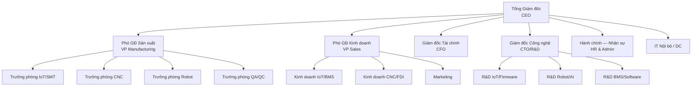
```mermaid
graph TD
    CEO[Tổng Giám đốc<br/>CEO]
    
    CEO --> VP1[Phó GĐ Sản xuất<br/>VP Manufacturing]
    CEO --> VP2[Phó GĐ Kinh doanh<br/>VP Sales]
    CEO --> CFO[Giám đốc Tài chính<br/>CFO]
    
    VP1 --> D1[Trưởng phòng IoT/SMT]
    VP1 --> D2[Trưởng phòng CNC]
    VP1 --> D3[Trưởng phòng Robot]
    VP1 --> D4[Trưởng phòng QA/QC]
    
    VP2 --> S1[Kinh doanh IoT/BMS]
    VP2 --> S2[Kinh doanh CNC/FDI]
    VP2 --> S3[Marketing]
    
    CEO --> CTO[Giám đốc Công nghệ<br/>CTO/R&D]
    CTO --> R1[R&D IoT/Firmware]
    CTO --> R2[R&D Robot/AI]
    CTO --> R3[R&D BMS/Software]
    
    CEO --> ADM[Hành chính — Nhân sự<br/>HR & Admin]
    CEO --> IT[IT Nội bộ / DC]
```

## 7.2. Kế hoạch Nhân sự theo Giai đoạn

| Giai đoạn | Phòng ban | Số lượng | Ghi chú |
|---|---|---:|---|
| **Y0–Y1** | Ban Giám đốc + Pháp lý + Thiết kế | 8–10 | Core team |
| **Y1–Y3** | + Giám sát xây dựng + Mua sắm | 10–15 | Thêm 2–5 người |
| **Y3–Y4** | + IoT/SMT team + QA | 30–40 | Tuyển 20–25 kỹ sư + công nhân |
| **Y4–Y5** | + CNC operators + Robot team | 55–70 | Tuyển 25–30 thợ CNC + kỹ sư |
| **Y5–Y6** | + Sales + Marketing + Thêm SX | 70–85 | Mở rộng kinh doanh |
| **Y7–Y10** | + Mở rộng theo doanh thu | 90–110 | Tăng dần |
| **Y10+** | Ổn định | **110–135** | Bao gồm thời vụ |

### Nhân sự theo Bộ phận (Ổn định Y10+)

| Bộ phận | Số lượng | Tỷ lệ |
|---|---:|---:|
| Sản xuất IoT/SMT | 28–33 | 25% |
| Sản xuất CNC | 20–25 | 19% |
| Sản xuất Robot Assembly | 8–10 | 7% |
| QA/QC | 6–9 | 6% |
| R&D + Thiết kế | 13–16 | 12% |
| Bán hàng + Marketing | 9–11 | 8% |
| IT / DC nội bộ | 3–5 | 3% |
| Hành chính + Kế toán + Nhân sự | 8–10 | 7% |
| Ban Giám đốc + Quản lý | 6–8 | 6% |
| Kho + Logistics | 5–8 | 6% |
| Chuyên gia/Consultant bán thời gian | 2–4 | 2% |
| **Tổng** | **108–139** | **100%** |

### 7.2.1. Chuyên gia Nước ngoài

| Vị trí | Quốc tịch | Số lượng | Thời gian | Mục đích |
|---|---|---:|---|---|
| CNC Application Engineer | Nhật/Đức | 2 | 2 năm (theo HĐ mua máy) | Đào tạo vận hành DMG MORI 5-trục — điều khoản OEM bắt buộc |
| AI/ML Lead | Hàn Quốc/Mỹ | 1 | Dài hạn | Phát triển AI SLAM, Computer Vision cho AMR |
| Quality Manager (ISO 9001) | Nhật/Đức | 1 | 2 năm | Thiết lập QMS, nâng cấp IATF/AS9100 khi có nhu cầu |
| **Tổng** | | **4** | | Phù hợp phạm vi 2 trụ cột (CNC + IoT/BMS) |

---

## 7.3. Kế hoạch Tuyển dụng và Đào tạo

### 7.3.1. Tuyển dụng theo Nhóm (Y3–Y5 — Giai đoạn Tuyển chính)

| Nhóm | Số lượng | Nguồn tuyển | Mức lương (USD/tháng) |
|---|---:|---|---:|
| Kỹ sư CNC (vận hành 5-trục) | 8–10 | Trường CĐ nghề + FDI chuyển việc | 800–1.500 |
| Kỹ sư CNC (CAM Programmer) | 3–4 | ĐH Bách Khoa + Recruitment agency | 1.200–2.000 |
| Kỹ sư IoT (Firmware/HW) | 8–10 | ĐH Bách Khoa, HCMUT, UIT | 1.000–2.000 |
| Kỹ sư Robot (AI/SLAM) | 3–4 | UIT, VGU, Returnee | 1.500–2.500 |
| Kỹ sư phần mềm BMS/SCADA | 4–5 | ĐH CNTT, Recruitment agency | 1.200–2.000 |
| QC Inspector | 3–5 | Trường CĐ + Đào tạo nội bộ | 700–1.200 |
| SMT Operator | 6–8 | CĐ Công nghệ + Training | 600–1.000 |
| Sales Engineer (B2B) | 4–5 | Kinh nghiệm manufacturing B2B | 1.000–2.000 + Commission |
| Hành chính + Kế toán | 4–5 | Đa dạng | 500–1.000 |

### 7.3.2. Chương trình Đào tạo

| Chương trình | Đối tượng | Thời lượng | Đối tác | Chi phí (K USD) |
|---|---|---|---|---:|
| CNC 5-Axis Operation — **OEM bắt buộc theo hợp đồng mua máy** | Kỹ sư CNC | 3 tháng | DMG MORI Academy (điều khoản trong HĐ mua thiết bị) | 50–80 |
| CMM Programming (PC-DMIS) | QC Inspector | 1 tháng | Hexagon MI | 15–25 |
| Robot AI/SLAM Development | Kỹ sư Robot | 2 tháng | NVIDIA DLI | 15–25 |
| ISO 9001 Internal Auditor | QA team | 1 tuần | TUV/BSI | 5–10 |
| PCCC + ATVSLĐ | Toàn bộ | 2 ngày/năm | Đơn vị được cấp phép | 5 |
| Tiếng Anh kỹ thuật | Toàn bộ kỹ thuật | Ongoing | Trung tâm ngoại ngữ | 10–15 |
| **Tổng ngân sách đào tạo Y3–Y5** | | | | **100–160** |

> **Lưu ý quan trọng:** Toàn bộ chương trình đào tạo CNC 5-trục do OEM (DMG MORI, các nhà cung cấp tương đương) thực hiện được **đàm phán và ký kết như điều khoản bắt buộc trong hợp đồng mua thiết bị** — không phát sinh chi phí đào tạo riêng lẻ. Điều này đảm bảo 100% vận hành viên được chứng nhận bởi OEM trước khi tiếp nhận máy [A].

> Ngân sách đào tạo trung bình ~40–50K USD/năm giai đoạn vận hành ổn định. Tương đương ~400–500 USD/người/năm, đạt chuẩn 40 giờ đào tạo/năm/người [A].

### 7.3.3. Chính sách Nhân sự

| Chính sách | Chi tiết |
|---|---|
| **Lương** | Cạnh tranh top 25% thị trường TP.HCM, review hàng năm |
| **Thưởng** | KPI quarterly + Thưởng cuối năm (1–3 tháng lương) |
| **BHXH + BHYT** | Đầy đủ theo luật + Bảo hiểm sức khỏe premium cho nhân sự chủ chốt |
| **ESOP** | 5% vốn điều lệ cho nhân sự chủ chốt (vesting 4 năm, cliff 1 năm) — xem mục 7.5.3 |
| **Đào tạo** | 40 giờ/năm/người tối thiểu |
| **Nghỉ phép** | 15 ngày/năm (cao hơn luật 3 ngày) |
| **Shuttle bus** | Tuyến Quận 1/Bình Thạnh → KCNC |
| **Bữa ăn** | Cơm trưa miễn phí tại canteen |

---

## 7.4. Chi phí Nhân sự

### 7.4.1. Bảng Chi phí Nhân sự theo Năm

| Năm | Headcount | Lương TB (USD/tháng) | Tổng Lương/Năm (M USD) | BHXH + Phúc lợi (M USD) | **Tổng (M USD)** |
|---:|---:|---:|---:|---:|---:|
| Y3–Y4 | 35 | 900 | 0,38 | 0,12 | **0,50** |
| Y5–Y6 | 70 | 950 | 0,80 | 0,25 | **1,05** |
| Y7–Y10 | 95 | 1.000 | 1,14 | 0,36 | **1,50** |
| Y10+ (ổn định) | 110 | 1.050 | 1,39 | 0,41 | **1,80** |

> Chi phí nhân sự Y10+ = 1,80M USD/năm. Tỷ trọng nhân sự trong OPEX tổng (~8,40M): ~21,4%. Lương tăng trung bình 5%/năm. BHXH = 23,5% phía công ty. Phúc lợi bổ sung ~8% lương [A].

---

## 7.5. Phát triển Tổ chức và Quản lý

### 7.5.1. Mô hình Phát triển 3 Giai đoạn

| Giai đoạn | Cơ cấu | Số cấp quản lý | Quyết định | KPI quản lý |
|---|---|:---:|---|---|
| **Startup (Y0–Y3)** | Phẳng (flat) | 2–3 | Tập trung CEO | Revenue, First customer |
| **Growth (Y3–Y7)** | Ma trận | 3–4 | Phân quyền Trưởng phòng | Profit by BU, OEE |
| **Mature (Y7+)** | 2 BU tự chủ P&L | 4 | BU autonomy | EBITDA margin, ROE |

### 7.5.2. Đội ngũ Quản lý Chủ chốt

| Vị trí | Thời điểm tuyển | Profile yêu cầu | Lương (K USD/năm) |
|---|---|---|---:|
| **CEO** | Đã có | Founder, 15+ năm kinh nghiệm CNC/Tech | 96–144 |
| **CTO** | Y1 Q1 | MS/PhD kỹ thuật, 10+ năm IoT/AI | 72–108 |
| **CFO** | Y1 Q1 | CPA/CFA, 10+ năm, kinh nghiệm FDI | 60–96 |
| **Phó GĐ Sản xuất** | Y2 Q1 | 10+ năm manufacturing, Lean/Six Sigma | 60–84 |
| **Phó GĐ Kinh doanh** | Y3 Q1 | 8+ năm B2B tech sales ASEAN | 60–84 + Commission |
| **Trưởng phòng CNC** | Y3 Q1 | 10+ năm CNC 5-trục, ISO 9001 | 48–72 |
| **Trưởng phòng IoT** | Y3 Q1 | MS Embedded + 8 năm IoT/Robotics | 48–72 |
| **Trưởng phòng QA/QC** | Y3 Q2 | CQE, kinh nghiệm ISO 9001 → IATF | 48–60 |

### 7.5.3. Chương trình ESOP

| Thông số | Giá trị |
|---|---|
| Tổng Pool ESOP | 5% vốn điều lệ |
| Vesting Schedule | 4 năm, cliff 1 năm (25% vest sau năm 1, 6,25%/quý sau đó) |
| Đối tượng | C-Level (2,0%), Trưởng phòng (1,5%), Key Engineer (1,0%), Outstanding (0,5%) |
| Strike Price | Mệnh giá tại thời điểm cấp |
| Lock-up | 6 tháng sau mỗi đợt vest |

---

## 7.6. Chiến lược Giữ chân Nhân tài

### 7.6.1. Phân tích Rủi ro Mất Nhân sự Chủ chốt

| Vị trí | Turnover Risk | Tác động | Thời gian thay thế | Cost Replacement |
|---|:---:|:---:|---|---:|
| CNC 5-Axis Operator (Lv3) | Cao | Rất cao | 6–12 tháng | 15–25 K USD |
| AI/ML Lead (Robot SLAM) | Rất cao | Cao | 6–9 tháng | 20–40 K USD |
| CAM Programmer Sr | Cao | Rất cao | 9–15 tháng | 20–30 K USD |
| Quality Manager (ISO 9001) | Trung bình-Cao | Rất cao | 12–18 tháng | 25–40 K USD |
| Sales Director (FDI B2B) | Trung bình | Cao | 3–6 tháng | 15–20 K USD |

> Turnover rate mục tiêu: < 10%/năm toàn công ty, < 5% cho Key Position. Chuẩn ngành FDI tại KCNC TP.HCM: 12–18% turnover [A].

### 7.6.2. Chương trình Giữ chân

| Chương trình | Đối tượng | Chi tiết | Budget/năm (K USD) |
|---|---|---|---:|
| ESOP 5% | C-Level + Trưởng phòng + Key | Vesting 4 năm | Equity |
| Retention Bonus | Top 20% performance | 1–3 tháng lương thêm | 80 |
| **Cam kết phục vụ 1 năm** | Nhân sự được đào tạo OEM/quốc tế | Ký phụ lục HĐLĐ; bồi hoàn chi phí đào tạo nếu nghỉ trước 1 năm sau khi hoàn thành khóa | 0 (bồi hoàn nếu vi phạm) |
| Career Path (Dual Track) | Tất cả | Management vs Technical Expert | — |
| Đào tạo quốc tế | Key Engineer | DMG MORI Japan, Hexagon | 50 |
| Cải thiện môi trường | Tất cả | Canteen + Gym + Recreation + Shuttle | 30 |
| Health + Wellness | Tất cả | Premium health insurance + Annual checkup | 25 |
| Recognition Program | Tất cả | Employee of Month/Quarter + Small rewards | 10 |

### 7.6.3. Career Path — Dual Track

| Level | Technical Track | Management Track | Lương Range (K USD/năm) |
|---|---|---|---:|
| L1 | Engineer | — | 10–18 |
| L2 | Engineer II | — | 14–24 |
| L3 | Senior Engineer | Team Lead | 20–36 |
| L4 | Technical Lead | Manager/Trưởng phòng | 30–48 |
| L5 | Principal Engineer | Phó GĐ | 48–84 |

> **Dual Track** đảm bảo kỹ sư giỏi không bị ép làm quản lý — giảm turnover kỹ thuật và giữ chuyên gia CNC/AI/IoT lâu dài [A].

---

## 7.7. Quản lý Tri thức và Kế thừa

### 7.7.1. Knowledge Management System

| Tầng | Nội dung | Công cụ | Trách nhiệm |
|---|---|---|---|
| KM-1: SOP & Work Instruction | Quy trình vận hành CNC, SMT, QC, xử lý lỗi | Wiki nội bộ (Confluence/Notion) | QA Manager |
| KM-2: Training Material | Video hướng dẫn, bản vẽ mẫu, G-code library | LMS nội bộ | HR + CTO |
| KM-3: Design IP Repository | Firmware source, PCB schematics, CAD models | Git + PLM (Windchill/Teamcenter) | CTO |
| KM-4: Lesson Learned | Post-mortem dự án, root cause CNC scrap, field failure | Jira Knowledge Base | Trưởng phòng chức năng |
| KM-5: Customer Knowledge | Profile KH FDI, buying criteria, complaint history | CRM (HubSpot/Odoo) | VP Sales |

> Mục tiêu: **Bus Factor ≥ 2** cho mọi vị trí chủ chốt — nghĩa là luôn có ít nhất 2 người biết làm mỗi việc quan trọng. Số hóa 100% SOP trước khi vận hành (Y3) [A].

### 7.7.2. Succession Planning — Vị trí Chủ chốt

| Vị trí | Người giữ (dự kiến) | Backup-1 | Backup-2 | Thời gian chuẩn bị |
|---|---|---|---|---|
| CEO | Founder | CTO hoặc VP Sales | Board member | — |
| CTO | Tuyển Y1 | R&D Lead IoT | R&D Lead Robot | 2 năm |
| Trưởng phòng CNC | Tuyển Y3 | Senior CAM Programmer | CNC Application Engineer (JP) | 18 tháng |
| Quality Manager | Tuyển Y3 | QC Lead | External auditor consultant | 12 tháng |
| AI/ML Lead | Tuyển Y3 | Senior Robot Engineer | Returnee/Partner | 18 tháng |

> Succession plan review: **hàng năm** bởi CEO + HR Director. Cập nhật khi có thay đổi nhân sự hoặc tổ chức.

---

## 7.8. Tuân thủ Pháp luật Lao động

### 7.8.1. Checklist Tuân thủ

| TT | Yêu cầu pháp lý | Văn bản | Biện pháp Mekong | Timeline |
|:---:|---|---|---|---|
| 1 | Đăng ký nội quy lao động | Bộ Luật LĐ 2019, Điều 119 | Soạn và đăng ký tại Sở LĐ-TBXH | Trước tuyển dụng (Y2) |
| 2 | Thỏa ước lao động tập thể | Bộ Luật LĐ 2019, Điều 75 | Đàm phán với đại diện NLĐ | Y3-Y4 |
| 3 | BHXH, BHYT, BHTN | Luật BHXH 2014, Luật BHYT 2008 (sửa đổi) | Đóng đầy đủ: 23,5% phía công ty | Từ ngày ký HĐLĐ |
| 4 | Huấn luyện ATVSLĐ 6 nhóm | NĐ 44/2016/NĐ-CP | Thuê đơn vị được cấp phép | Hàng năm + mới vào |
| 5 | Khai báo tai nạn lao động | Bộ Luật LĐ 2019, Điều 142 | Quy trình báo cáo 24h | Khi xảy ra sự cố |
| 6 | Bảo vệ lao động nữ | Bộ Luật LĐ 2019, Chương X | Phòng vắt/trữ sữa, không ca đêm khi mang thai | Từ khi có lao động nữ |
| 7 | Lao động nước ngoài (4 chuyên gia) | NĐ 152/2020/NĐ-CP | Xin giấy phép lao động, miễn nếu < 30 ngày | Trước khi chuyên gia nhận việc |
| 8 | Thang bảng lương | NĐ 38/2022/NĐ-CP | Xây dựng và đăng ký | Y2 (trước tuyển dụng đại trà) |

### 7.8.2. Ngân sách Tuân thủ Lao động

| Hạng mục | Chi phí/năm (K USD) |
|---|---:|
| BHXH + BHYT + BHTN (phần công ty ~23,5%) | 280–350 |
| Huấn luyện ATVSLĐ | 10 |
| Khám sức khỏe định kỳ | 8 |
| Bảo hiểm tai nạn 24/7 bổ sung | 12 |
| Tư vấn pháp lý lao động | 5 |
| **Tổng** | **~315–385** |

> Chiếm ~17-21% tổng chi phí nhân sự 1,80M USD/năm. Phù hợp chuẩn ngành ngành sản xuất CNC tại Việt Nam [B — Navigos Salary Survey 2024].

---

## 7.7. Kế hoạch Kế nhiệm

### 7.7.1. Ma trận Kế nhiệm Vị trí Chủ chốt

| Vị trí hiện tại | Kế nhiệm #1 | Kế nhiệm #2 | Gap Analysis | Timeline |
|---|---|---|---|---|
| CEO | CTO | Phó GĐ SX | Cần kinh nghiệm tài chính | 3–5 năm |
| CTO | Trưởng phòng IoT | AI/ML Lead | Cần kinh nghiệm quản lý broad | 2–3 năm |
| Trưởng phòng CNC | Sr CAM Programmer | Quality Manager | Cần leadership training | 2–3 năm |
| Trưởng phòng IoT | Firmware Lead | Robot Mech Lead | Cần business acumen | 2–3 năm |

### 7.7.2. Cơ chế Chuyển giao Tri thức

| Hoạt động | Tần suất | Trách nhiệm | Deliverable |
|---|---|---|---|
| Tài liệu hóa quy trình (SOP) | Liên tục | Mỗi bộ phận | SOP library trên Wiki nội bộ |
| Cross-training (2 người/vị trí key) | Hàng quý | HR + Bộ phận | Training log, Skill matrix |
| Mentoring program | 1:1 hàng tháng | Senior → Junior | Mentoring record |
| Technical sharing sessions | 2 tuần/lần | Luân phiên | Slide deck + Recording |
| Exit interview + Knowledge capture | Khi nghỉ việc | HR | Knowledge transfer document |
| CNC Process Notes | Mỗi job mới | CAM Programmer | Job folder (CAM file + Tool list + QC report) |

### 7.7.3. Bộ KPI Nhân sự và Năng lực Tổ chức

| KPI | Mục tiêu Y4-Y6 | Mục tiêu Y10+ | Ghi chú |
|---|---:|---:|---|
| Time-to-fill vị trí kỹ thuật | < 60 ngày | < 45 ngày | CNC / IoT / QA |
| Tỷ lệ nghỉ việc toàn công ty | < 12% | < 10% | Chuẩn ngành FDI KCNC 12-18% |
| Tỷ lệ nghỉ việc vị trí key | < 8% | < 5% | Theo danh sách critical role |
| Giờ đào tạo / người / năm | ≥ 32 giờ | ≥ 40 giờ | Bao gồm kỹ thuật + an toàn |
| Tỷ lệ vị trí key có người kế nhiệm sẵn sàng | ≥ 50% | ≥ 80% | Succession readiness |
| Tỷ lệ nhân sự đa kỹ năng (cross-trained) | ≥ 25% | ≥ 40% | Đặc biệt ở CNC / QA / SMT |
| Năng suất doanh thu / nhân sự | > 45K USD | > 90K USD | Theo ramp-up và ổn định |

> Bộ KPI này giúp gắn quản trị nhân sự với hiệu quả vận hành thực tế: tuyển đúng, giữ đúng người, đào tạo đúng kỹ năng và luôn có phương án kế nhiệm cho các vị trí trọng yếu, trên cơ sở giả định vận hành và chỉ tiêu quy mô đã nêu trong đề án.

---

## 7.8. Tiểu kết Phần VII

| Chỉ tiêu | Giá trị |
|---|---|
| Tổng nhân sự ổn định (Y10+) | 110–135 người [C] |
| Tổng quỹ lương + phúc lợi (Y10+) | ~1,80M USD/năm [A] |
| Turnover mục tiêu | < 10%/năm, Key < 5% [A] |
| Chuyên gia nước ngoài | 4 người (2 CNC theo HĐ OEM + 1 AI + 1 QM) |
| Cam kết phục vụ sau đào tạo OEM | 1 năm (phụ lục HĐLĐ) [A] |
| Đào tạo OEM CNC | Bắt buộc trong điều khoản hợp đồng mua thiết bị [A] |
| ESOP pool | 5% vốn điều lệ |
| Ngân sách đào tạo /năm | ~40–50K USD [A] |
| Career path | Dual Track (Technical + Management) |

> **Kết luận:** Kế hoạch nhân sự dự án tối ưu cho quy mô 22,00M USD với 100–130 nhân sự ổn định, tập trung vào 2 trụ cột sản xuất. Chi phí nhân sự chiếm ~21% OPEX — hợp lý cho ngành sản xuất công nghệ cao. Chương trình giữ chân (ESOP + Dual Track + Retention Bonus) giúp giảm turnover dưới chuẩn ngành FDI tại KCNC [A].

<!-- === SECTION: P8_KE_HOACH_TRIEN_KHAI === -->

# PHẦN VIII: KẾ HOẠCH TRIỂN KHAI

---

## 8.1. Phân kỳ Đầu tư 4 Giai đoạn

| Phase | Thời gian | CAPEX (M USD) | Mốc quan trọng | Nguồn vốn |
|---|---|---:|---|---|
| **Phase 0** | Q2/2026 — Q1/2027 | 1,50 | Mẫu 1.4 được duyệt, EIA hoàn thành, Giấy phép xây dựng | CSH |
| **Phase 1** | Q2/2027 — Q1/2029 | 8,40 | Hoàn công tòa nhà + nhà xưởng **2 tầng**, Sổ đỏ | CSH |
| **Phase 2** | Q2/2029 — Q1/2031 | 9,60 | 10 máy CNC chạy, SMT line hoạt động, DC nội bộ online | CSH |
| **Phase 3** | Q2/2031 — Q1/2033 | 2,50 | Full operation 2 trụ cột, doanh thu ổn định | CSH + Vay |
| **Tổng** | **7 năm** | **22,00** | | |

> **Ghi chú:** Tổng CAPEX = 1,50 + 8,40 + 9,60 + 2,50 = **22,00M USD** [C]. Vốn CSH tự chủ toàn bộ Phase 0–2 (18,50M). Vay 4,00M chỉ từ Y7 trong Phase 3 khi đã có doanh thu [C]. Nhà xưởng 2 tầng (GFA 6.720 m²) nằm trong ngân sách Phase 1.

### 8.1.1. Chi tiết Hoạt động theo Phase

**Phase 0 — Chuẩn bị (12 tháng)**

| TT | Hoạt động | Thời gian | Người phụ trách | Đầu ra |
|:---:|---|---|---|---|
| 1 | Nộp Mẫu 1.4 KCNC | Q2/2026 | CEO + Ban Pháp lý | Mẫu 1.4 hoàn chỉnh |
| 2 | Lập Báo cáo ĐTM | Q2–Q3/2026 | Tư vấn môi trường | Quyết định phê duyệt ĐTM |
| 3 | Thiết kế kiến trúc + M&E | Q3–Q4/2026 | Nhà thầu thiết kế | Hồ sơ thiết kế kỹ thuật |
| 4 | Xin Giấy phép xây dựng | Q4/2026 | Ban Pháp lý | GPXD |
| 5 | San lấp mặt bằng | Q1/2027 | Nhà thầu | Mặt bằng sẵn sàng |
| 6 | Tuyển dụng nhân sự cốt lõi | Q3/2026–Q1/2027 | HR | 8-10 nhân sự core team |

**Phase 1 — Xây dựng (24 tháng)**

| TT | Hoạt động | Thời gian | Người phụ trách | Đầu ra |
|:---:|---|---|---|---|
| 1 | Xây dựng Tòa nhà VP 3 tầng (21×48m) | Q2/2027–Q2/2028 | Nhà thầu xây dựng | VP hoàn công |
| 2 | Xây dựng Nhà xưởng SX (48×70m, PEB) | Q2/2027–Q4/2028 | Nhà thầu xây dựng | Xưởng hoàn công |
| 3 | Xây dựng Khu Utility (5×56m) | Q3/2027–Q1/2028 | Nhà thầu xây dựng | Utility hoàn công |
| 4 | Lắp đặt M&E tổng thể | Q1/2028–Q1/2029 | Nhà thầu M&E | Hệ thống điện/nước/HVAC |
| 5 | Lắp đặt PCCC toàn khu | Q3/2028–Q1/2029 | Nhà thầu PCCC | Nghiệm thu PCCC |
| 6 | Lắp đặt Solar 200 kWp | Q4/2028–Q1/2029 | Nhà thầu năng lượng | Solar vận hành |
| 7 | Đường nội bộ, sân bãi, cảnh quan | Q1–Q4/2028 | Nhà thầu | Hạ tầng ngoài hoàn chỉnh |
| 8 | Xin EDGE Certification | Q4/2028–Q1/2029 | Tư vấn ESG | Chứng chỉ EDGE |

**Phase 2 — Lắp đặt Thiết bị (24 tháng)**

| TT | Hoạt động | Thời gian | Người phụ trách | Đầu ra |
|:---:|---|---|---|---|
| 1 | Lắp đặt SMT line | Q2–Q4/2029 | Nhà cung cấp SMT | Dây chuyền SMT hoạt động |
| 2 | Lắp đặt CNC 10 máy (DMG Mori, Haas, Mazak) | Q2/2029–Q1/2030 | Nhà cung cấp CNC | 10 máy calibrated |
| 3 | Lắp đặt EDM + Surface Grinder | Q3–Q4/2029 | Sodick/Okamoto | 2 máy hoạt động |
| 4 | Setup Robot Assembly Line | Q1–Q3/2030 | Đội R&D | Dây chuyền Robot MVP |
| 5 | Setup DC nội bộ (5–8 rack) | Q2–Q4/2029 | IT Team | DC vận hành |
| 6 | Cài đặt ERP/MES/CAD-CAM | Q3/2029–Q1/2030 | IT + Vendor | Hệ thống quản lý SX |
| 7 | QA Lab equipment | Q4/2029–Q1/2030 | QA Team | Lab đo lường hoạt động |
| 8 | BMS/SCADA R&D equipment | Q2–Q4/2029 | R&D IoT | Lab R&D BMS hoạt động |
| 9 | Calibration + Commissioning tổng | Q4/2030–Q1/2031 | PM | Nghiệm thu toàn bộ |

**Phase 3 — Vận hành và Mở rộng (24 tháng)**

| TT | Hoạt động | Thời gian | Người phụ trách | Đầu ra |
|:---:|---|---|---|---|
| 1 | Sản xuất loạt IoT Gateway đầu tiên | Q2/2031 | BU1 Director | Sản phẩm thương mại |
| 2 | Nhận đơn hàng CNC FDI đầu tiên | Q3/2031 | BU2 Director | Hợp đồng gia công |
| 3 | Robot AMR prototype hoàn thiện | Q4/2031 | R&D Robot | Robot v1 |
| 4 | Tuyển dụng nhân sự mở rộng (lên 65–80) | Q2–Q4/2031 | HR | Đủ nhân sự |
| 5 | Giải ngân vay 4,00M (nếu cần) | Q1/2032 | CFO | Bổ sung vốn lưu động |
| 6 | Đạt doanh thu 8–9M USD/năm | Q4/2032 | CEO | Mốc tiến độ tài chính |

---

## 8.2. Các mốc Quan trọng (Các mốc tiến độ)

| Mốc | Thời điểm | Nội dung | Chỉ số Đo lường | Trách nhiệm |
|---|---|---|---|---|
| M1 | Q2/2026 | Nộp Mẫu 1.4 + Công văn đề xuất | Hồ sơ đầy đủ, nộp đúng hạn | CEO, Ban Pháp lý |
| M2 | Q4/2026 | Được duyệt, khởi công xây dựng | QĐ phê duyệt từ BQL KCNC | CEO |
| M3 | Q1/2029 | Hoàn công, nhận Sổ đỏ | Biên bản nghiệm thu hoàn công | PM, Nhà thầu |
| M4 | Q3/2029 | Sản phẩm IoT đầu tiên xuất xưởng | Sample lot pass QC 100% | BU1 Director |
| M5 | Q1/2030 | CNC vận hành, nhận đơn hàng FDI đầu tiên | ≥ 1 hợp đồng FDI signed | BU2 Director |
| M6 | Q1/2031 | Robot AMR đầu tiên giao khách | Robot v1 giao + nghiệm thu | R&D Director |
| M7 | Q1/2032 | Doanh thu đạt 8–9M USD/năm | Báo cáo tài chính kiểm toán | CFO |
| M8 | Q1/2033 | Full operation, doanh thu 11–12M USD/năm | Ổn định confirmed | CEO |

### 8.2.1. Gantt Chart Tổng quát

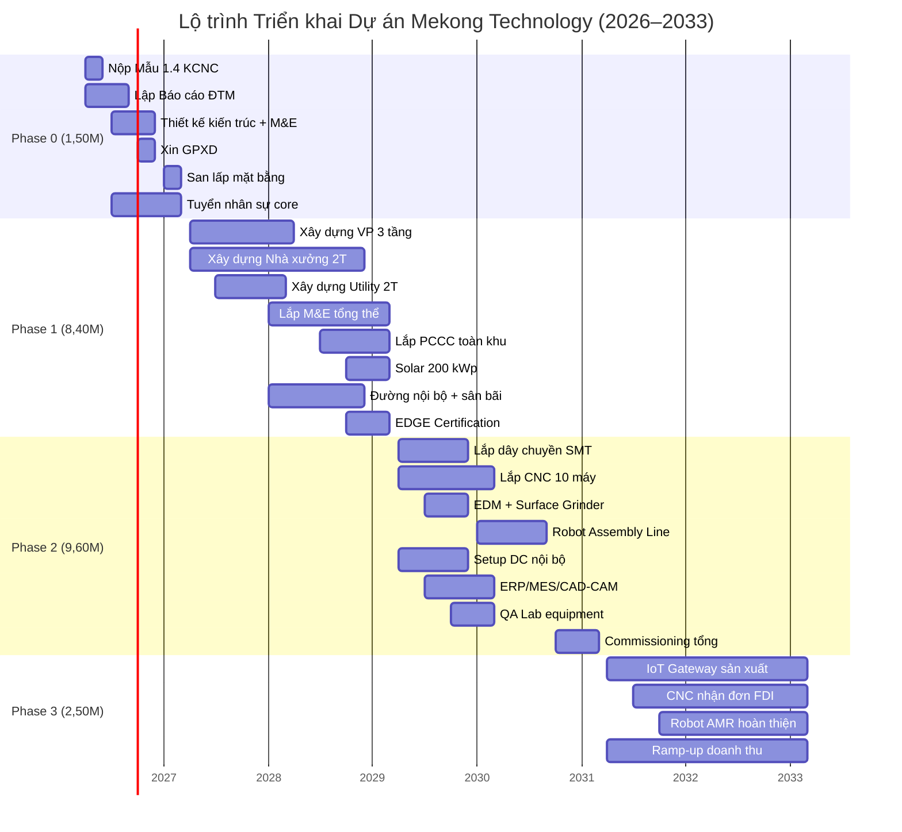
```mermaid
gantt
    title Lộ trình Triển khai Dự án Mekong Technology (2026–2033)
    dateFormat YYYY-MM
    axisFormat %Y

    section Phase 0 (1,50M)
    Nộp Mẫu 1.4 KCNC           :p0a, 2026-04, 2026-06
    Lập Báo cáo ĐTM             :p0b, 2026-04, 2026-09
    Thiết kế kiến trúc + M&E    :p0c, 2026-07, 2026-12
    Xin GPXD                    :p0d, 2026-10, 2026-12
    San lấp mặt bằng            :p0e, 2027-01, 2027-03
    Tuyển nhân sự core          :p0f, 2026-07, 2027-03

    section Phase 1 (8,40M)
    Xây dựng VP 3 tầng          :p1a, 2027-04, 2028-04
    Xây dựng Nhà xưởng 2T      :p1b, 2027-04, 2028-12
    Xây dựng Utility 2T         :p1c, 2027-07, 2028-03
    Lắp M&E tổng thể            :p1d, 2028-01, 2029-03
    Lắp PCCC toàn khu           :p1e, 2028-07, 2029-03
    Solar 200 kWp               :p1f, 2028-10, 2029-03
    Đường nội bộ + sân bãi      :p1g, 2028-01, 2028-12
    EDGE Certification          :p1h, 2028-10, 2029-03

    section Phase 2 (9,60M)
    Lắp dây chuyền SMT          :p2a, 2029-04, 2029-12
    Lắp CNC 10 máy              :p2b, 2029-04, 2030-03
    EDM + Surface Grinder       :p2c, 2029-07, 2029-12
    Robot Assembly Line          :p2d, 2030-01, 2030-09
    Setup DC nội bộ             :p2e, 2029-04, 2029-12
    ERP/MES/CAD-CAM             :p2f, 2029-07, 2030-03
    QA Lab equipment            :p2g, 2029-10, 2030-03
    Commissioning tổng          :p2h, 2030-10, 2031-03

    section Phase 3 (2,50M)
    IoT Gateway sản xuất        :p3a, 2031-04, 2033-03
    CNC nhận đơn FDI            :p3b, 2031-07, 2033-03
    Robot AMR hoàn thiện        :p3c, 2031-10, 2033-03
    Ramp-up doanh thu           :p3d, 2031-04, 2033-03
```

---

## 8.3. Phân tích Rủi ro và Biện pháp Giảm thiểu

### 8.3.1. Ma trận Rủi ro Tổng hợp

| TT | Rủi ro | Xác suất | Tác động | Mức rủi ro | Biện pháp Giảm thiểu |
|:---:|---|:---:|:---:|:---:|---|
| 1 | Vượt CAPEX xây dựng | Trung bình | Cao | **Cao** | Hợp đồng trọn gói (lump-sum), dự phòng 0,65M (3,0%) [C] |
| 2 | Chậm tiến độ thi công | Trung bình | Cao | **Cao** | PM chuyên nghiệp, mốc tiến độ tracking hàng tháng |
| 3 | Thiếu nhân sự CNC lành nghề | Cao | Trung bình | **Cao** | Tuyển + đào tạo sớm 6 tháng, hợp tác trường nghề |
| 4 | Doanh thu IoT thấp hơn kỳ vọng | Trung bình | Cao | **Cao** | Đa dạng hóa SP (BMS/SCADA/OEM), chốt chuỗi đơn hàng trước vận hành |
| 5 | Cạnh tranh CNC từ Trung Quốc | Trung bình | Trung bình | Trung bình | Tập trung FDI cần ISO/AS9100, local support 24/7 |
| 6 | Thay đổi chính sách ưu đãi KCNC | Thấp | Cao | Trung bình | NĐ 94/2020 bảo đảm 15 năm, quan hệ tốt BQL |
| 7 | Biến động tỷ giá USD/VND > 5% | Trung bình | Trung bình | Trung bình | Hedge tự nhiên (thu USD, chi VND) |
| 8 | Rủi ro công nghệ lỗi thời | Thấp | Trung bình | Thấp | R&D ≥ 8% doanh thu, lộ trình SP 3 năm |
| 9 | Rủi ro chuỗi cung ứng (chip, NVL) | Trung bình | Trung bình | Trung bình | Multiple supplier, tồn kho chiến lược 2-3 tháng |
| 10 | Rủi ro môi trường/PCCC | Thấp | Cao | Trung bình | Tuân thủ NĐ 136/2020, ZLD CNC, FM-200 DC |

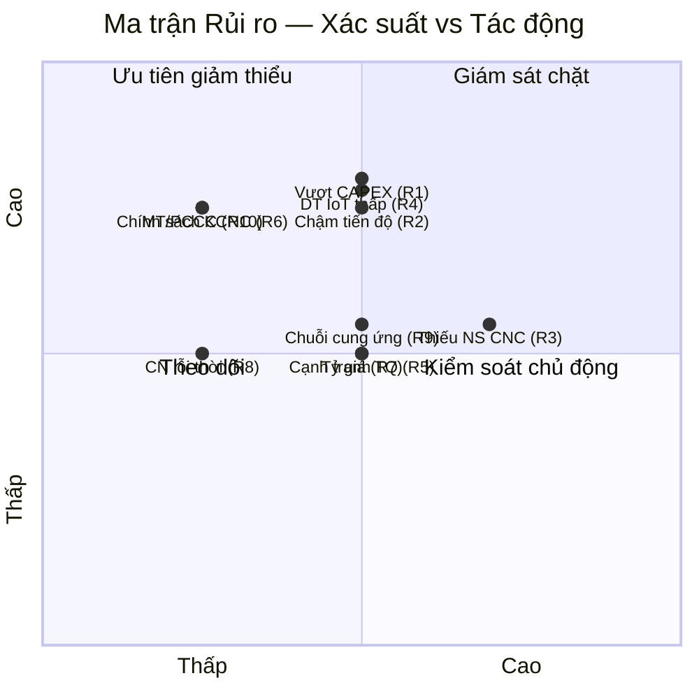
```mermaid
quadrantChart
    title Ma trận Rủi ro — Xác suất vs Tác động
    x-axis "Thấp" --> "Cao"
    y-axis "Thấp" --> "Cao"
    quadrant-1 "Giám sát chặt"
    quadrant-2 "Ưu tiên giảm thiểu"
    quadrant-3 "Theo dõi"
    quadrant-4 "Kiểm soát chủ động"
    "Vượt CAPEX (R1)": [0.50, 0.80]
    "Chậm tiến độ (R2)": [0.50, 0.75]
    "Thiếu NS CNC (R3)": [0.70, 0.55]
    "DT IoT thấp (R4)": [0.50, 0.78]
    "Cạnh tranh TQ (R5)": [0.50, 0.50]
    "Chính sách KCNC (R6)": [0.25, 0.75]
    "Tỷ giá (R7)": [0.50, 0.50]
    "CN lỗi thời (R8)": [0.25, 0.50]
    "Chuỗi cung ứng (R9)": [0.50, 0.55]
    "MT/PCCC (R10)": [0.25, 0.75]
```

### 8.3.2. Kế hoạch Ứng phó Chi tiết

| Ngưỡng kích hoạt | Hành động | Thời gian phản hồi | Người quyết định |
|---|---|---|---|
| CAPEX Phase 1 vượt 10% | Rà soát scope Phase 2, đàm phán nhà thầu | 2 tuần | CEO + CFO |
| Chậm tiến độ > 3 tháng | Tăng cường nhà thầu, làm thêm ca | 1 tuần | PM |
| Chuỗi đơn hàng CNC < 300K USD/năm (sau Y5) | Chuyển máy sang thuê ngoài giờ, tăng marketing FDI | 1 tháng | BU2 Director |
| Doanh thu Year 5 < 1,75M (< 70% mục tiêu) | Rà soát định giá, mở rộng OEM, cắt OPEX 15% | 1 tháng | Ban Giám đốc |
| DSCR < 2,0× trong 2 quý liên tiếp | Tạm dừng mở rộng Phase 3, cơ cấu nợ | 2 tuần | CFO |
| Sự cố môi trường/PCCC | Dừng hoạt động liên quan, báo cáo BQL KCNC | Ngay lập tức | CEO + HSE |

---

## 8.4. Quản lý Dự án (PMO)

### 8.4.1. Tổ chức Quản lý Dự án

| Vai trò | Người đảm nhiệm | Trách nhiệm |
|---|---|---|
| Project Sponsor | CEO / Hội đồng Sáng lập | Phê duyệt ngân sách, quyết định chiến lược |
| Project Manager (PM) | Thuê chuyên gia PMO | Điều phối thi công, theo dõi mốc tiến độ, báo cáo |
| Technical Director | CTO | Giám sát thiết kế kỹ thuật, M&E, commissioning |
| Financial Controller | CFO | Theo dõi ngân sách, giải ngân, cost control |
| Quality Manager | QA Director | Nghiệm thu chất lượng xây dựng và lắp đặt |
| HSE Officer | Thuê chuyên gia | An toàn lao động, môi trường thi công |

```mermaid
graph TD
    PS["Project Sponsor<br/>CEO / Hội đồng Sáng lập"]
    PM["Project Manager<br/>Chuyên gia PMO"]
    TD["Technical Director<br/>CTO"]
    FC["Financial Controller<br/>CFO"]
    QM["Quality Manager<br/>QA Director"]
    HSE["HSE Officer<br/>Chuyên gia"]

    PS --> PM
    PS --> FC
    PM --> TD
    PM --> QM
    PM --> HSE

    style PS fill:#1e3a5f,color:#fff
    style PM fill:#2563eb,color:#fff
    style TD fill:#0d9488,color:#fff
    style FC fill:#d97706,color:#fff
    style QM fill:#7c3aed,color:#fff
    style HSE fill:#dc2626,color:#fff
```

### 8.4.2. Cơ chế Báo cáo

| Loại báo cáo | Tần suất | Nội dung | Người nhận |
|---|---|---|---|
| Báo cáo tiến độ tuần | Hàng tuần | % hoàn thành, vấn đề, rủi ro | PM → CEO |
| Báo cáo tài chính tháng | Hàng tháng | Chi tiêu vs ngân sách, dòng tiền | CFO → CEO |
| Báo cáo mốc tiến độ | Tại mỗi mốc tiến độ | Đạt/Không đạt, hành động tiếp | PM → Hội đồng |
| Báo cáo BQL KCNC | Hàng quý | Tiến độ tổng thể, tuân thủ cam kết | CEO → BQL KCNC |

### 8.4.3. Phần mềm Quản lý

| Giai đoạn | Công cụ | Mục đích |
|---|---|---|
| Xây dựng (Phase 0-1) | MS Project / Primavera | Gantt chart, Critical Path, Resource leveling |
| Lắp đặt (Phase 2) | Jira / Asana | Task tracking, commissioning checklist |
| Vận hành (Phase 3+) | ERP (SAP B1 / Odoo) | Quản lý SX, tài chính, kho, CRM |

### 8.4.4. Chiến lược Procurement và Decision Gate

| Gói thầu / hạng mục | Hình thức mua sắm | Tiêu chí chọn | Decision Gate |
|---|---|---|---|
| Xây dựng 3 công trình | Đấu thầu cạnh tranh / EPC tách phần | Giá, năng lực, tiến độ, an toàn | Không ký nếu chênh > ngân sách 7,5% |
| CNC / EDM / Grinder | Đàm phán trực tiếp + so sánh 2-3 OEM | TCO, service, thời gian dẫn, đào tạo | Chỉ chốt khi có FAT plan + spare list |
| SMT / QA Lab | RFQ nhiều nhà cung cấp | Yield, hỗ trợ local, compatibility | Pilot demo trước PO |
| ERP / MES / BMS software | PoC + phased rollout | Tính mở, tích hợp, chi phí license | Gate theo module |
| Solar / M&E / Utility | Turnkey package | Hiệu suất, warranty, O&M | Chỉ nghiệm thu khi có performance test |

| Gate | Điều kiện qua cổng | Người phê duyệt |
|---|---|---|
| Gate A — Pháp lý | IRC / đất / ĐTM / GPXD sẵn sàng | CEO + Pháp lý |
| Gate B — Xây dựng | Thiết kế khóa, BOQ, ngân sách được chốt | CEO + PM + CFO |
| Gate C — Thiết bị | Site ready, utility ready, FAT approved | CTO + PM |
| Gate D — Vận hành | SAT pass, training hoàn tất, SOP sẵn sàng | CEO + BU Heads |

### 8.4.5. Change Management Protocol

| Loại thay đổi | Ví dụ | Quyền phê duyệt | Quy trình |
|---|---|---|---|
| **Minor** (chi phí < 50K, tiến độ < 2 tuần) | Thay NCC phụ kiện, điều chỉnh BOM | PM + Technical Director | Change Request → Review 48h → Approve/Reject |
| **Major** (chi phí 50K–500K, tiến độ 2-8 tuần) | Thay đổi thiết kế M&E, thêm thiết bị CNC | CEO + CFO + PM | CR → Impact Analysis → Board Review 1 tuần → Approve |
| **Critical** (chi phí > 500K hoặc scope change) | Thay đổi layout nhà xưởng, giảm/tăng Phase | Hội đồng Sáng lập | CR → Full Impact + Risk → Board Meeting → Vote |

| Bước | Hành động | Responsibility | Timeline |
|:---:|---|---|---|
| 1 | Initiate Change Request (CR) | Bất kỳ thành viên | Ngay khi phát hiện |
| 2 | Impact Assessment (cost, schedule, quality, risk) | PM + Affected Team | 2–5 ngày |
| 3 | Review & Decision | Theo cấp phê duyệt | 2–7 ngày |
| 4 | Implement Change | Responsible Team | Theo plan |
| 5 | Verify & Close | QA + PM | 1–3 ngày |

> Tổng số CR dự kiến: 15–30 trong Phase 0–2 (theo chuẩn ngành dự án xây dựng nhà máy quy mô tương đương). Mục tiêu: ≤ 5 Major, 0 Critical [A].

### 8.4.6. Các bên liên quan Communication Plan

| Các bên liên quan | Nhu cầu thông tin | Kênh | Tần suất | Trách nhiệm |
|---|---|---|---|---|
| BQL KCNC TP.HCM | Tiến độ tổng thể, tuân thủ cam kết | Báo cáo + Họp trực tiếp | Hàng quý | CEO |
| Sở TN&MT | ĐTM, giám sát môi trường | Báo cáo chính thức | Hàng quý | HSE Officer |
| PC07 (PCCC) | Tiến độ thi công PCCC, nghiệm thu | Báo cáo + Kiểm tra | Theo mốc tiến độ | PM + PCCC consultant |
| Nhà thầu xây dựng | Bản vẽ, tiến độ, thanh toán | Họp site hàng tuần | Hàng tuần | PM |
| NCC thiết bị (DMG, Haas) | Delivery schedule, FAT, SAT | Email + Họp online | Hàng tháng | Procurement + CTO |
| Nhân viên / Công đoàn | Lịch tuyển dụng, quyền lợi, đào tạo | Email nội bộ + Town Hall | Hàng tháng | HR Director |
| Ngân hàng (khi vay Y7) | Tiến độ, doanh thu, DSCR | Báo cáo tài chính | Hàng quý | CFO |
| Cộng đồng lân cận | Ồn, bụi trong thi công | Thông báo + Hotline | Khi cần | HSE Officer |

### 8.4.7. Permit-to-Operate Checklist

Trước khi vận hành chính thức (Phase 3, Q2/2031), tất cả hạng mục sau PHẢI hoàn tất:

| TT | Hạng mục | Cơ quan xác nhận | Bằng chứng | Trạng thái |
|:---:|---|---|---|:---:|
| 1 | Nghiệm thu hoàn công 3 công trình | BQL KCNC + Sở XD | Biên bản nghiệm thu | — |
| 2 | Nghiệm thu PCCC công trình | PC07 Công an TP.HCM | QĐ nghiệm thu PCCC | — |
| 3 | Giấy phép xả thải | Sở TN&MT | GP xả thải | — |
| 4 | Giấy phép hoạt động điện | Sở Công thương | GP điện | — |
| 5 | Đăng ký máy CNC (thiết bị áp lực) | Sở LĐ-TBXH | Sổ đăng ký | — |
| 6 | ISO 9001:2015 certified | TUV/BSI | Chứng chỉ ISO | — |
| 7 | ERP/MES go-live | IT Team | User Acceptance Test pass | — |
| 8 | BMS toàn nhà máy hoạt động | R&D IoT | Commissioning report | — |
| 9 | Đào tạo ATVSLĐ hoàn tất | Đơn vị được cấp phép | Chứng chỉ 100% nhân sự | — |
| 10 | Insurance policies active | Broker bảo hiểm | Chứng thư bảo hiểm | — |

> **Gate D (Permit-to-Operate):** Chỉ khi 10/10 hạng mục trên đạt "Hoàn tất" mới được phê duyệt vận hành thương mại. CEO ký quyết định vận hành sau khi QA Director xác nhận toàn bộ checklist.

### 8.4.5. KPI Kiểm soát Triển khai

| KPI | Ngưỡng mục tiêu | Chủ sở hữu |
|---|---:|---|
| SPI (Schedule Performance Index) | ≥ 0,95 | PM |
| CPI (Cost Performance Index) | ≥ 0,95 | CFO + PM |
| % mốc tiến độ đúng hạn | ≥ 90% | PMO |
| % commissioning checklist hoàn tất | 100% trước go-live | CTO |
| % hồ sơ as-built / O&M manual bàn giao | 100% | Nhà thầu + PM |

> Bộ KPI này giúp Phase 0-3 được điều hành như một chương trình đầu tư thật sự, không chỉ là danh sách công việc nối tiếp nhau. Nếu SPI hoặc CPI xuống dưới 0,95 trong 2 kỳ liên tiếp, PMO phải trình phương án hiệu chỉnh trong vòng 10 ngày làm việc [A].

### 8.4.6. Các bên liên quan Plan và Go-Live Readiness

| Nhóm các bên liên quan | Nhu cầu thông tin | Tần suất | Chủ trì |
|---|---|---|---|
| BQL KCNC | Pháp lý, tiến độ, cam kết môi trường | Hàng quý | CEO + Pháp lý |
| Ngân hàng / đối tác vốn | CAPEX, DSCR, mốc tiến độ doanh thu | Hàng quý / khi giải ngân | CFO |
| Nhà thầu / OEM | Scope, schedule, FAT/SAT, thay đổi | Hàng tuần | PM |
| BU vận hành | Site readiness, SOP, training, spare-part | Hàng tuần giai đoạn go-live | CTO + PM |

| Tiêu chí go-live | Mục tiêu pass |
|---|---|
| Pháp lý vận hành sẵn sàng | 100% |
| Utility available theo thiết kế | 100% |
| FAT/SAT sign-off | 100% |
| SOP và đào tạo vận hành hoàn tất | ≥ 95% |
| Spare-part critical đã nhập kho | ≥ 90% danh mục |

> Go-live chỉ được phê duyệt khi cả 5 nhóm điều kiện trên đạt ngưỡng. Cách tiếp cận này giúp tránh tình trạng “đã lắp xong nhưng chưa vận hành được” — một rủi ro rất thường gặp ở các dự án công nghiệp có nhiều interface kỹ thuật [B].

### 8.4.7. Permit-to-Operate Checklist

| Nhóm kiểm tra | Điều kiện tối thiểu trước vận hành |
|---|---|
| Pháp lý | Hồ sơ môi trường, PCCC, điện lực, ATLĐ đã sẵn sàng theo giai đoạn |
| Kỹ thuật | Tài sản critical đã test pass và có hồ sơ FAT/SAT |
| Vận hành | SOP, WI, spare list, vendor contact list đầy đủ |
| Nhân sự | Ca trưởng, operator, QA, utility team đã đào tạo |
| Thương mại | Có chuỗi đơn hàng/LOI đủ để hấp thụ công suất khởi động |

> Checklist này là “cửa cuối” trước khi chuyển từ trạng thái dự án sang trạng thái nhà máy vận hành. Nếu một trong 5 nhóm chưa đạt, PMO không được đề xuất go-live chính thức [A].

---

## 8.5. Tiểu kết Phần VIII

> **Tổng kết:** Dự án triển khai qua 4 Phase trong 7 năm (Q2/2026 – Q1/2033), CAPEX 22,00M USD phân bổ hợp lý theo từng giai đoạn. 8 mốc tiến độ chính đảm bảo kiểm soát tiến độ. 10 rủi ro đã được nhận diện với biện pháp giảm thiểu cụ thể. Cơ chế PMO chuyên nghiệp với báo cáo đa tầng đảm bảo minh bạch và trách nhiệm [C].

<!-- === SECTION: P9_KET_LUAN_KIEN_NGHI === -->

# PHẦN IX: KẾT LUẬN VÀ KIẾN NGHỊ

---

## 9.1. Tổng kết Giá trị Dự án

### 9.1.1. Bảng Tổng hợp Chỉ số Chính

| Chỉ số | Giá trị | Phân loại |
|---|---|:---:|
| Tổng vốn đầu tư | 22,00M USD [C] | Tài chính |
| Vốn CSH / Tổng đầu tư | 18,00M (81,8%) [C] | Tài chính |
| Vốn vay / Tổng đầu tư | 4,00M (18,2%) [C] | Tài chính |
| Doanh thu ổn định (Y12+) | 12,00M USD/năm [C] | Kinh doanh |
| Doanh thu 15Y tích lũy | ~140M USD [C] | Kinh doanh |
| NPV (50Y, WACC 12%) | 1,50M USD [C] | Đầu tư |
| IRR | 13,0% [C] | Đầu tư |
| WACC | 12,0% [C] | Đầu tư |
| DSCR trung bình (Y7-Y16) | ≥ 1,50× [C] | Tài chính |
| EBITDA margin (ổn định) | ~30% [C] | Kinh doanh |
| Việc làm tạo ra | 100–130 vị trí (ổn định) | Xã hội |
| Sản phẩm công nghệ cao | 14 danh mục thuộc QĐ 38/2020 | Pháp lý |
| VA/Revenue | ≥ 42% | Cam kết |
| R&D/Revenue | ≥ 8% (cam kết tối thiểu 5%) | Cam kết |
| Giá trị Chiến lược (SV) | 7,00M USD | Đầu tư |

### 9.1.2. Hai Trụ cột Sản xuất

Dự án Mekong Technology phương án 22,00M USD [C] là một **dự án sản xuất công nghệ cao** thực sự, tập trung vào 2 trụ cột chính:

```mermaid
graph LR
    MEKONG["Mekong Technology<br/>22,00M USD"]

    BU1["BU1: Điện tử Thông minh<br/>8,50M — 70,8%"]
    BU2["BU2: CNC Chính xác<br/>3,50M — 29,2%"]
    DC["DC Nội bộ<br/>2,20M — 10,0%"]

    IoT["IoT Gateway"]
    BMS["BMS / SCADA"]
    Robot["Robot AMR/AGV"]
    CNC10["10 máy CNC 5-trục"]
    EDM["EDM + Grinder"]
    FDI["Gia công FDI"]
    ERP["ERP/MES/CAD"]
    RD["R&D Repository"]

    MEKONG --> BU1
    MEKONG --> BU2
    MEKONG --> DC
    BU1 --> IoT
    BU1 --> BMS
    BU1 --> Robot
    BU2 --> CNC10
    BU2 --> EDM
    BU2 --> FDI
    DC --> ERP
    DC --> RD

    style MEKONG fill:#1e3a5f,color:#fff
    style BU1 fill:#166534,color:#fff
    style BU2 fill:#b45309,color:#fff
    style DC fill:#6b21a8,color:#fff
    style IoT fill:#22c55e,color:#fff
    style BMS fill:#22c55e,color:#fff
    style Robot fill:#22c55e,color:#fff
    style CNC10 fill:#f59e0b,color:#000
    style EDM fill:#f59e0b,color:#000
    style FDI fill:#f59e0b,color:#000
    style ERP fill:#a78bfa,color:#000
    style RD fill:#a78bfa,color:#000
```

**Trụ cột 1 — Sản phẩm Điện tử Thông minh (BU1: 8,50M, chiếm 70,8% doanh thu)** [C]

- IoT Gateway, BMS/SCADA, Robot AMR/AGV — phục vụ chuyển đổi số doanh nghiệp Việt Nam và FDI.
- Dây chuyền SMT hiện đại, phòng R&D IoT, prototyping lab.
- Thị trường mục tiêu: nhà máy sản xuất, tòa nhà thương mại, kho logistics, nông nghiệp công nghệ cao.
- Lợi thế cạnh tranh: thiết kế firmware nội bộ, tùy biến nhanh, hỗ trợ kỹ thuật 24/7 tại Việt Nam.

**Trụ cột 2 — Chế tạo Cơ khí Chính xác (BU2: 3,50M, chiếm 29,2% doanh thu)** [C]

- 10 máy CNC (DMG Mori, Haas, Mazak) + EDM + Surface Grinder — gia công linh kiện siêu chính xác cho FDI [C].
- Xưởng CNC **1.800 m²** (T1) trong nhà xưởng 48×70 m **2 tầng** (GFA 6.720 m²), điều hòa nhiệt độ, hệ thống ZLD.
- Khách hàng mục tiêu: Samsung, Intel, Bosch và FDI tại KCNC + KCX lân cận.
- Lợi thế cạnh tranh: chứng nhận ISO 9001/AS9100, giao hàng nhanh (local), giá cạnh tranh so với nhập khẩu.

### 9.1.3. Hạ tầng Số Nội bộ

Datacenter nội bộ (5–8 rack, **200 m² T2**, CAPEX **2,20M chiếm 10,0%** [C]) phục vụ hoàn toàn nội bộ:

- ERP/MES/CAD-CAM cho quản lý sản xuất.
- Lưu trữ dữ liệu R&D, firmware repository, CI/CD chuỗi đơn hàng.
- BMS/SCADA monitoring cho toàn nhà máy.
- Không kinh doanh dịch vụ DC thương mại, không cung cấp GPU-aaS, colocation, hay dịch vụ viễn thông.

### 9.1.4. Đóng góp cho Hệ sinh thái KCNC TP.HCM

| Lĩnh vực đóng góp | Nội dung cụ thể |
|---|---|
| Chuỗi cung ứng bán dẫn | Gia công CNC linh kiện cho Intel, Samsung tại chỗ — giảm phụ thuộc nhập khẩu |
| Chuyển đổi số | Cung cấp IoT/BMS/SCADA Made-in-SHTP cho doanh nghiệp nội địa |
| Đào tạo nhân lực | 100–130 kỹ sư/công nhân CNC + IoT, hợp tác Đại học SHTP |
| R&D và IP | ≥ 8% doanh thu cho R&D, tạo sản phẩm IP nội địa (firmware, thuật toán) |
| Xuất khẩu | Robot AMR/AGV qua ASEAN, linh kiện CNC cho chuỗi cung ứng toàn cầu |
| Green Manufacturing | Solar 200 kWp [C], EDGE Certification, Net Zero lộ trình 2045 |

```mermaid
mindmap
  root((Mekong Technology<br/>Đóng góp KCNC))
    Chuỗi cung ứng
      Gia công CNC tại chỗ
      Giảm phụ thuộc NK
      Intel Samsung Bosch
    Chuyển đổi số
      IoT Gateway
      BMS SCADA
      Made-in-SHTP
    Nhân lực
      100–130 việc làm
      Kỹ sư CNC + IoT
      Hợp tác ĐH SHTP
    R&D và IP
      R&D ≥ 8% doanh thu
      Firmware IP
      Thuật toán SLAM
    Xuất khẩu
      Robot AMR ASEAN
      Linh kiện CNC
    Green Mfg
      Solar 200 kWp
      EDGE Cert
      Net Zero 2045
```

---

## 9.2. Cam kết của Nhà đầu tư

### 9.2.1. Bảng Cam kết Chính

| TT | Cam kết | Chỉ số Đo lường | Thời hạn | Chế tài tự nguyện |
|:---:|---|---|---|---|
| 1 | CAPEX không vượt 22.000.000 USD | Báo cáo tài chính kiểm toán | Suốt dự án | Bổ sung vốn CSH nếu vượt |
| 2 | Vốn CSH Phase 0–2: 18,00M | Sao kê ngân hàng | Q2/2026–Q1/2031 | Chứng minh tài chính trước mỗi Phase |
| 3 | DC chỉ dùng nội bộ | Kiểm tra thực tế BQL KCNC | Hàng năm | Chấm dứt đầu tư nếu vi phạm |
| 4 | Tuân thủ môi trường, PCCC, ATVSLĐ | Báo cáo định kỳ cho BQL | Hàng quý | Khắc phục trong 30 ngày |
| 5 | VA/Revenue ≥ 42% | Báo cáo tài chính + kiểm toán | Từ Year 3 | Điều chỉnh danh mục SP |
| 6 | R&D ≥ 5% doanh thu (mục tiêu 8%) | Sổ sách R&D, IP đăng ký | Hàng năm | Tăng R&D nếu không đạt |
| 7 | 100–130 việc làm CNC tại SHTP | BHXH, hợp đồng lao động | Từ Year 4 | Tuyển dụng bổ sung |
| 8 | Sản phẩm thuộc QĐ 38/2020 | Giấy xác nhận từ Sở KHCN | Trước vận hành | Điều chỉnh SP phù hợp |
| 9 | Nhà xưởng GFA ≤ **10.304 m²** (2 tầng) | Bản vẽ hoàn công | Phase 1 | Cam kết không mở rộng ngoài lô đất |
| 10 | Solar ≥ 200 kWp | Biên bản nghiệm thu | Phase 1 | Đảm bảo lắp đặt đúng tiến độ |

### 9.2.2. Cam kết Bổ sung

- Ưu tiên tuyển dụng nhân sự **tốt nghiệp các trường đại học và cao đẳng tại TP.HCM** (Bách Khoa, KHTN, Sư phạm Kỹ thuật, Cao thắng).
- Hợp tác với **Trung tâm Đào tạo KCNC** (SHTP Training Center) để đào tạo kỹ năng CNC, IoT cho sinh viên và lao động địa phương.
- Tham gia các **chương trình xúc tiến đầu tư và thương mại** của KCNC, góp phần quảng bá hệ sinh thái SHTP ra quốc tế.
- Chia sẻ kinh nghiệm **Green Manufacturing** (Solar, ZLD, EDGE) với các doanh nghiệp trong KCNC.

---

## 9.3. Kiến nghị

### 9.3.1. Kiến nghị với Ban Quản lý KCNC TP.HCM

Kính đề nghị Ban Quản lý Khu Công nghệ cao TP.HCM:

| TT | Kiến nghị | Cơ quan xử lý | Thời hạn mong muốn |
|:---:|---|---|---|
| 1 | Xem xét và chấp thuận phương án đầu tư 22,00M USD với 2 trụ cột sản xuất (Điện tử + CNC) | BQL KCNC | Q3/2026 |
| 2 | Hỗ trợ thủ tục điều chỉnh Giấy chứng nhận đầu tư (IRC/ERC) cho phù hợp phạm vi mở rộng | BQL KCNC + Sở KHĐT | Q3–Q4/2026 |
| 3 | Hướng dẫn thủ tục EIA bổ sung cho hoạt động CNC (nước thải, bụi kim loại, ZLD) | BQL KCNC + Sở TNMT | Q2–Q3/2026 |
| 4 | Xác nhận hạ tầng DC nội bộ (5–8 rack) không thuộc diện cấp giấy phép viễn thông | BQL KCNC + Sở TTTT | Q2/2026 |
| 5 | Hỗ trợ kết nối với doanh nghiệp FDI trong KCNC (Samsung, Intel) để phát triển chuỗi cung ứng CNC | BQL KCNC | Q4/2026–Q2/2027 |
| 6 | Ưu tiên bố trí hạ tầng kỹ thuật (điện 3 pha 1.500 kVA, nước, viễn thông) cho lô đất dự án | BQL KCNC | Q1/2027 |

### 9.3.2. Kiến nghị với Cơ quan Nhà nước Liên quan

| TT | Kiến nghị | Cơ quan | Cơ sở pháp lý |
|:---:|---|---|---|
| 1 | Xác nhận ưu đãi thuế TNDN: miễn 4 năm + giảm 50% trong 9 năm tiếp theo | Cục Thuế TP.HCM | NĐ 218/2013, Luật CNC 2008 |
| 2 | Xác nhận miễn thuế nhập khẩu thiết bị CNC 10 máy | Hải quan TP.HCM | Luật CNC 2008, Điều 18 |
| 3 | Hỗ trợ thủ tục thuê đất dài hạn (miễn tiền thuê đất 11 năm) | Sở TNMT | NĐ 94/2020 |
| 4 | Hướng dẫn đăng ký sản phẩm công nghệ cao theo QĐ 38/2020 | Sở KHCN | QĐ 38/2020/QĐ-TTg |

---

## 9.4. Tầm nhìn Dài hạn (2033–2046)

Sau khi hoàn thành Phase 3 (Q1/2033), dự án hướng tới:

| Giai đoạn | Mục tiêu | Chỉ số KPI |
|---|---|---|
| 2033–2036 | Ổn định doanh thu 12M/năm, trả nợ hoàn toàn | Doanh thu ≥ 12M, Nợ = 0 |
| 2036–2040 | Mở rộng sản phẩm Robot thế hệ 2, xuất khẩu ASEAN | Xuất khẩu ≥ 30% doanh thu |
| 2040–2046 | Đạt Net Zero, IPO hoặc M&A chiến lược | Carbon Neutral, Valuation ≥ 50M |

Doanh thu tích lũy 15 năm dự kiến **~140M USD** [C], đóng góp trực tiếp vào mục tiêu xây dựng KCNC TP.HCM thành trung tâm R&D và sản xuất công nghệ cao hàng đầu khu vực ASEAN.

### 9.4.1. Căn cứ Đề nghị Phê duyệt

Mekong Technology kính đề nghị xem xét chấp thuận dự án trên cơ sở 5 nhóm căn cứ chính sau đây:

1. **Phù hợp định hướng KCNC 2026:** dự án thuộc mô hình sản xuất công nghệ cao, tập trung R&D + sản xuất, không cạnh tranh với dịch vụ DC thương mại hiện hữu trong khu.
2. **Đáp ứng NĐ 10/2024/NĐ-CP:** đồng thời thuộc Điều 29 (R&D CNC) và Điều 31 (Sản xuất SP CNC), VA/Revenue ≥ 42%, R&D/Revenue ≥ 8% — vượt ngưỡng tối thiểu Điều 28.
3. **Tài chính khả thi và bền vững:** NPV = 1,50M USD, IRR = 13,0% > WACC 12%, DSCR ≥ 1,50×, CSH 81,8% — đảm bảo không phụ thuộc vay nợ giai đoạn xây dựng [C].
4. **Tạo giá trị cho hệ sinh thái KCNC:** 100–130 việc làm CNC, chuỗi cung ứng nội địa cho FDI (Intel, Samsung), sản phẩm IP Việt Nam (firmware, thuật toán SLAM) [C].
5. **Cam kết Green Manufacturing:** Solar 200 kWp, EDGE Certification, Net Zero lộ trình 2045 — phù hợp tiêu chí ưu tiên mới của SHTP 2026 [C].

### 9.4.2. KPI Dashboard — 24 Tháng Đầu Vận hành (Y4–Y5)

| TT | KPI | Mục tiêu Y4 (Q1–Q4) | Mục tiêu Y5 (Q1–Q4) | Đo lường | Trách nhiệm |
|:---:|---|---|---|---|---|
| 1 | Doanh thu tổng | ≥ 1,00M USD | ≥ 2,50M USD [C] | Báo cáo tài chính tháng | CFO |
| 2 | CNC Utilization Rate | ≥ 40% | ≥ 60% | MES/OEE dashboard | BU2 Director |
| 3 | IoT Gateway units shipped | ≥ 200 units | ≥ 800 units | ERP delivery log | BU1 Director |
| 4 | Hợp đồng FDI signed | ≥ 2 | ≥ 5 | CRM chuỗi đơn hàng | VP Sales |
| 5 | First Pass Yield (CNC) | ≥ 92% | ≥ 96% | QC report | QA Manager |
| 6 | Customer NPS | ≥ 30 | ≥ 50 | Survey quý | VP Sales |
| 7 | R&D các mốc tiến độ hit | 3/5 | 4/5 | CTO lộ trình review | CTO |
| 8 | Headcount | 50–65 | 65–80 | HR system | HR Director |
| 9 | Turnover rate | < 15% | < 10% | HR system | HR Director |
| 10 | HSSE incidents | 0 Lost Time Injury | 0 LTI | HSE log | HSE Officer |
| 11 | Cash Runway | ≥ 18 tháng | ≥ 12 tháng | Treasury | CFO |
| 12 | DSCR (nếu đã vay) | N/A | ≥ 2,0× | Finance model | CFO |

> Dashboard được review hàng tháng bởi Ban Giám đốc, hàng quý báo cáo BQL KCNC. KPI fail trigger escalation theo §8.3.2.

### 9.4.3. Kịch bản Dự phòng (Contingency)

| Kịch bản | Trigger | Hành động | Nguồn lực dự phòng |
|---|---|---|---|
| **A — Doanh thu chậm 30%** | Revenue Y5 < 1,75M | Cắt giảm OPEX 15%, đẩy mạnh OEM/thuê ngoài CNC, hoãn tuyển dụng Phase 3 | Dự phòng CAPEX 0,65M [C] |
| **B — Mất khách hàng FDI lớn** | > 20% revenue concentration rời | Đa dạng hóa KH, tăng marketing nội địa, mở kênh SI/VAR | Chuỗi đơn hàng CRM + BU1 nội địa |
| **C — Thiếu nhân sự CNC trầm trọng** | Turnover CNC > 25% | Tăng lương 15%, ký hợp đồng dài hạn, thuê chuyên gia JP bổ sung | Budget đào tạo 100–160K [C] |
| **D — Biến động tỷ giá > 10%** | VND mất giá > 10% | Hedge hợp đồng FX forward, điều chỉnh giá bán CNC | Natural hedge (thu USD) |
| **E — Thay đổi ưu đãi KCNC** | Luật mới thu hẹp ưu đãi | Vận động, tối ưu hóa chi phí, review business case | IRC đã cấp là cơ sở pháp lý [B] |

```mermaid
quadrantChart
    title Kịch bản Dự phòng — Xác suất vs Tác động
    x-axis "Xác suất thấp" --> "Xác suất cao"
    y-axis "Tác động thấp" --> "Tác động cao"
    quadrant-1 "Giám sát chặt"
    quadrant-2 "Hành động ngay"
    quadrant-3 "Theo dõi"
    quadrant-4 "Chuẩn bị sẵn"
    "A: DT chậm 30%": [0.55, 0.80]
    "B: Mất KH FDI lớn": [0.35, 0.75]
    "C: Thiếu NS CNC": [0.60, 0.60]
    "D: Tỷ giá > 10%": [0.40, 0.50]
    "E: Ưu đãi thu hẹp": [0.25, 0.70]
```

### 9.4.4. Điều kiện Tiên quyết để Giữ đúng Cam kết Dự án

| TT | Điều kiện | Trách nhiệm chính | Deadline |
|:---:|---|---|---|
| 1 | Vốn CSH 18,00M USD sẵn sàng và chứng minh | CEO / Hội đồng Sáng lập | Trước nộp Mẫu 1.4 |
| 2 | IRC + ERC được cấp cho phạm vi 2 trụ cột + DC nội bộ | Ban Pháp lý | Q3/2026 |
| 3 | ĐTM được phê duyệt cho hoạt động CNC + IoT SX | Tư vấn EIA | Q2/2026 |
| 4 | Hợp đồng thuê đất 50 năm ký với BQL KCNC | CEO + CFO | Q3/2026 |
| 5 | Nhà thầu xây dựng được chọn qua đấu thầu/EPC | PM | Q4/2026 |
| 6 | PO cho CNC Phase 1 (3 máy 5-trục) đặt cọc | CTO + Procurement | Q1/2027 |
| 7 | Core team 8–10 người onboard | HR Director | Q1/2027 |

> 7 điều kiện trên là **prerequisite** — nếu bất kỳ điều kiện nào không đạt đúng hạn, dự án phải re-plan toàn bộ timeline Phase 0–1.

---

*Mekong Technology kính trình Ban Quản lý KCNC TP.HCM xem xét và chấp thuận.*

*TP.HCM, tháng 03 năm 2026*
*Đại diện Nhà đầu tư: ________________*
*Chức vụ: Tổng Giám đốc (CEO)*
2. **Hiệu quả đầu tư chấp nhận được:** CAPEX 22,00M USD [C], NPV dương 1,50M USD [C], IRR 13,0% > WACC 12,0% [C], cấu trúc vốn bảo thủ.
3. **Phù hợp pháp lý và môi trường:** bám Mẫu 1.4, NĐ 31/2021, NĐ 10/2024, và phạm vi ĐTM/PCCC đã được thu hẹp hợp lý do DC chỉ dùng nội bộ.
4. **Đóng góp thực chất cho hệ sinh thái SHTP:** tăng nội địa hóa chuỗi cung ứng CNC, phát triển sản phẩm IoT/BMS/Robot mang IP Việt Nam, tạo 100-130 việc làm chất lượng.
5. **Rủi ro đã được nhận diện và có cơ chế kiểm soát:** dự phòng CAPEX 0,65M USD [C], covenant tài chính, PMO đa tầng, lộ trình ESG và Net Zero rõ ràng.

### 9.4.2. Kế hoạch 180 ngày Sau khi Được Chấp thuận

| Giai đoạn | Công việc trọng tâm | Đầu ra bắt buộc |
|---|---|---|
| 0-30 ngày | Hoàn thiện hồ sơ pháp lý chi tiết, ký tư vấn ĐTM/PCCC | Kế hoạch pháp lý tích hợp |
| 30-60 ngày | Khóa thiết kế cơ sở, BOQ, cấu trúc PMO | Mức cơ sở ngân sách + tiến độ |
| 60-90 ngày | Chuẩn bị RFQ gói xây dựng, utility, thiết bị dài hạn | Danh mục tender package |
| 90-120 ngày | Mở thầu / đàm phán nhà thầu chính, tuyển core team | Shortlist nhà thầu + nhân sự chủ chốt |
| 120-180 ngày | Khởi động Phase 0-1, thiết lập cơ chế báo cáo với BQL KCNC | Báo cáo khởi động dự án |

> **Cam kết thực thi:** Trong vòng 180 ngày kể từ ngày được chấp thuận, nhà đầu tư sẽ hoàn thành toàn bộ công tác chuẩn bị để dự án chuyển từ trạng thái “đề án được duyệt” sang “chương trình đầu tư đang triển khai”, tránh tình trạng giữ đất nhưng chậm triển khai [A][C].

### 9.4.3. KPI Thành công 24 Tháng Sau Chấp thuận

| KPI | Mục tiêu sau 12 tháng | Mục tiêu sau 24 tháng |
|---|---:|---:|
| % hoàn tất thủ tục pháp lý lõi | 100% | 100% |
| % giải ngân so với mức cơ sở | ≥ 90% | ≥ 95% |
| % hoàn thành xây dựng / utility | ≥ 40% | ≥ 85% |
| Số hợp đồng / LOI thương mại ký trước vận hành | ≥ 3 | ≥ 6 |
| Tỷ lệ nhân sự core tuyển đủ | ≥ 70% | ≥ 90% |
| Chênh lệch CAPEX so với mức cơ sở | ≤ +5% | ≤ +7,5% |

> Bộ KPI này là thước đo hậu phê duyệt để chứng minh dự án không chỉ “được chấp thuận trên giấy” mà thực sự chuyển hóa thành năng lực sản xuất và thương mại hóa theo đúng cam kết với KCNC [A].

### 9.4.4. Điều kiện Tiên quyết để Giữ đúng Cam kết Dự án

| Điều kiện tiên quyết | Hàm ý quản trị |
|---|---|
| Không mở rộng lại sang DC thương mại | Giữ nhất quán phạm vi dự án |
| Không vượt CAPEX 22,00M USD [C] nếu chưa có phê duyệt mới | Bảo vệ hiệu quả đầu tư |
| Ưu tiên đầu tư sâu cho 2 trụ cột hiện hữu | Tránh phân tán nguồn lực |
| Giữ kỷ luật PMO + covenant tài chính | Hạn chế trượt tiến độ và dòng tiền |
| Biến reference customer thành hợp đồng dài hạn | Chuyển từ “đề án tốt” sang “doanh nghiệp tốt” |

---

## 9.5. Lời kết

Dự án **Mekong Technology — Phương án 22,00M USD** [C] thể hiện cam kết mạnh mẽ của nhà đầu tư trong việc xây dựng một nhà máy sản xuất công nghệ cao thực sự tại KCNC TP.HCM. Với 2 trụ cột rõ ràng (Điện tử Thông minh + CNC), cấu trúc tài chính an toàn (CSH 81,8%, IRR 13,0% > WACC 12,0%), và tuân thủ đầy đủ khung pháp lý, dự án không chỉ mang lại hiệu quả kinh tế mà còn đóng góp thiết thực vào hệ sinh thái sản xuất công nghệ cao quốc gia.

Chúng tôi kính mong nhận được sự xem xét và phê duyệt thuận lợi từ Ban Quản lý KCNC TP.HCM.

> **Trân trọng,**
> **Hội đồng Sáng lập — Mekong Technology**
> TP.HCM, Quý 2/2026

<!-- === SECTION: PHU_LUC === -->

# PHỤ LỤC

---

## Phụ lục A: Chi tiết CAPEX theo Hạng mục và Giai đoạn

*(Xem Bảng 5.1.2 — Đã trình bày đầy đủ tại Phần V)*

### Tổng hợp nhanh

| Phase | M USD | Nội dung |
|---|---:|---|
| Phase 0 | 1,50 | Pháp lý (0,30) + Thiết kế (0,40) + Thuê đất (0,20) + San lấp (0,60) |
| Phase 1 | 8,45 | VP 3 tầng (2,00) + Xưởng SX **2T** (3,60) + Utility **2T** (0,30) + M&E (1,10) + PCCC (0,50) + Sân bãi (0,30) + Solar 200 kWp (0,30) + EDGE cert (0,015) + Nội thất (0,335) |
| Phase 2 | 9,60 | SMT (1,50) + BMS R&D (0,40) + OEM test (0,50) + CNC 5-trục (2,00) + CNC 3-trục (0,75) + EDM+Grinder (0,45) + Tooling (0,30) + QA (0,30) + Robot line (0,50) + DC nội bộ (2,20) + Software (0,30) + Commissioning (0,40) |
| Phase 3 | 2,45 | Vốn lưu động (1,85) + Dự phòng (0,60) |
| **Tổng** | **22,00** | |

### Kiểm tra Tỷ trọng

| Nhóm | M USD | % CAPEX |
|---|---:|---:|
| Pháp lý + Thiết kế + Site | 1,50 | 6,8% |
| Xây dựng (VP + Xưởng + Utility) | 5,00 | 22,7% |
| M&E + PCCC + Hạ tầng | 1,65 | 7,5% |
| Nội thất + Solar | 0,50 | 2,3% |
| Thiết bị IoT/Electronics | 2,50 | 11,4% |
| Thiết bị CNC (10 máy + tooling) | 3,50 | 15,9% |
| Robot Assembly | 0,50 | 2,3% |
| DC Nội bộ | 2,50 | 11,4% |
| QA + Software + Commissioning | 1,00 | 4,5% |
| Vốn lưu động | 2,00 | 9,1% |
| Dự phòng | 1,35 | 6,1% |
| **Tổng** | **22,00** | **100%** |

> Dự phòng = 1,35M USD (6,1%) — đã điều chỉnh để tổng CAPEX = 22,00M USD chính xác [C].

### A.2. Chi tiết CAPEX theo 24 Hạng mục Đầu tư

| TT | Hạng mục | M USD | Phase | Nhãn | Ghi chú |
|:---:|---|---:|:---:|:---:|---|
| 1 | Pháp lý (IRC, ERC, ĐTM, PCCC) | 0,300 | 0 | [C] | Tư vấn + lệ phí |
| 2 | Thiết kế kiến trúc + M&E | 0,400 | 0 | [C] | 3 công trình |
| 3 | Thuê đất (đặt cọc 2 năm) | 0,200 | 0 | [B] | 120K/năm × ~1,7 năm |
| 4 | San lấp mặt bằng | 0,600 | 0 | [B] | 10.000 m² |
| 5 | Tòa nhà VP 3 tầng | 2,000 | 1 | [C] | 48×21m, GFA 3.024 m² |
| 6 | Nhà xưởng SX (PEB) | 2,800 | 1 | [C] | 48×70m, 3.360 m² |
| 7 | Khu Utility | 0,200 | 1 | [C] | 56×5m, 280 m² |
| 8 | Hệ thống M&E tổng | 0,800 | 1 | [C] | Điện, HVAC, nước, khí nén |
| 9 | PCCC toàn khu | 0,400 | 1 | [C] | Sprinkler, FM-200, bơm |
| 10 | Sân bãi + Đường nội bộ | 0,300 | 1 | [B] | Bãi xe, loading dock |
| 11 | Solar PV 200 kWp | 0,300 | 1 | [C] | Rooftop, mono PERC |
| 12 | EDGE Certification | 0,015 | 1 | [A] | Chứng nhận công trình xanh |
| 13 | Nội thất + Thiết bị VP | 0,335 | 1 | [A] | Bàn ghế, phòng server, showroom |
| 14 | Dây chuyền SMT | 1,500 | 2 | [C] | Pick & Place + Reflow + AOI |
| 15 | Thiết bị R&D BMS/IoT | 0,500 | 2 | [B] | Oscilloscope, logic analyzer, test bench |
| 16 | Thiết bị OEM Test | 0,500 | 2 | [B] | ICT, Functional Test, Burn-in |
| 17 | CNC 5-trục (5 máy) | 2,000 | 2 | [C] | DMG Mori (3) + Mazak (2) |
| 18 | CNC 3-trục (3 máy) | 0,750 | 2 | [C] | Haas (2) + Mazak (1) |
| 19 | EDM + Grinder (2 máy) | 0,450 | 2 | [C] | Sodick + Okamoto |
| 20 | Tooling + Fixture + Workholding | 0,300 | 2 | [A] | Cho 10 máy CNC |
| 21 | Thiết bị QA/QC | 0,300 | 2 | [B] | CMM, roughness tester, hardness |
| 22 | Robot Assembly Line | 0,500 | 2 | [B] | Cell lắp ráp AMR/AGV |
| 23 | DC Nội bộ (xây dựng + thiết bị) | 2,500 | 2 | [C] | Phòng DC + server + network |
| 24 | Software License (ERP, MES, CAM) | 0,300 | 2 | [B] | SAP/Odoo + Mastercam + PLM |
| 25 | Commissioning + Testing | 0,400 | 2 | [A] | Nghiệm thu toàn bộ |
| 26 | Vốn lưu động | 2,000 | 3 | [C] | NVL ban đầu + lương 6 tháng |
| 27 | Dự phòng | 1,350 | 3 | [C] | 6,1% CAPEX |
| | **TỔNG** | **22,000** | | | |

> **Kiểm tra:** Σ = 0,30 + 0,40 + 0,20 + 0,60 + 2,00 + 2,80 + 0,20 + 0,80 + 0,40 + 0,30 + 0,30 + 0,015 + 0,335 + 1,50 + 0,50 + 0,50 + 2,00 + 0,75 + 0,45 + 0,30 + 0,30 + 0,50 + 2,50 + 0,30 + 0,40 + 2,00 + 1,35 = **22,000M USD** [C].

### A.3. Lịch Giải ngân CAPEX theo Quý (Quarter)

| Quarter | Phase | Hạng mục chính giải ngân | M USD | Tích lũy |
|---|:---:|---|---:|---:|
| Q1/Y1 | 0 | Pháp lý, thiết kế, đặt cọc đất | 0,60 | 0,60 |
| Q2/Y1 | 0 | Thiết kế M&E, san lấp giai đoạn 1 | 0,50 | 1,10 |
| Q3/Y1 | 0–1 | San lấp hoàn tất, khởi công VP | 0,40 | 1,50 |
| Q4/Y1 | 1 | Xây dựng VP + Xưởng (móng + khung) | 1,50 | 3,00 |
| Q1/Y2 | 1 | Xây dựng VP (kết cấu), Xưởng PEB | 1,80 | 4,80 |
| Q2/Y2 | 1 | Hoàn thiện VP, M&E bắt đầu | 1,50 | 6,30 |
| Q3/Y2 | 1 | M&E + PCCC + Utility, Solar lắp | 1,20 | 7,50 |
| Q4/Y2 | 1 | Nghiệm thu Phase 1, nội thất | 1,15 | 8,65 |
| Q1/Y3 | 2 | Đặt hàng CNC + SMT (đặt cọc 30%) | 2,50 | 11,15 |
| Q2/Y3 | 2 | Nhận máy CNC + SMT (40%), DC xây dựng | 2,80 | 13,95 |
| Q3/Y3 | 2 | Lắp đặt CNC, DC thiết bị, Robot line | 2,00 | 15,95 |
| Q4/Y3 | 2 | Commissioning, Software, QA setup | 1,70 | 17,65 |
| Q1/Y4 | 2–3 | Hoàn tất commissioning, NVL ban đầu | 1,00 | 18,65 |
| Q2-Q4/Y4 | 3 | Vốn lưu động tiếp, dự phòng | 1,50 | 20,15 |
| Y5 | 3 | Dự phòng còn lại | 1,85 | 22,00 |

> **Ghi chú:** Lịch giải ngân dựa trên tiến độ xây dựng thực tế dự kiến. Peak giải ngân tại Q2/Y3 (nhận máy CNC/SMT). Tổng tích lũy = 22,00M USD [C].

### A.4. Phân tích Cấu trúc CAPEX theo Tính chất

| Tính chất | Hạng mục | M USD | % CAPEX | Ghi chú |
|---|---|---:|---:|---|
| **Chi phí chìm (sunk cost)** | Pháp lý, thiết kế, san lấp, EDGE | 1,315 | 6,0% | Không thu hồi |
| **Tài sản cố định — Xây dựng** | VP + Xưởng + Utility + Hạ tầng | 5,50 | 25,0% | Khấu hao 30 năm |
| **Tài sản cố định — M&E** | Điện, HVAC, PCCC, Solar | 1,50 | 6,8% | Khấu hao 15–20 năm |
| **Tài sản cố định — Thiết bị SX** | CNC + SMT + Robot + QA | 6,80 | 30,9% | Khấu hao 7–10 năm |
| **Tài sản cố định — IT/DC** | Server, network, software | 2,80 | 12,7% | Khấu hao 5–7 năm |
| **Vốn lưu động** | NVL, lương, chi phí hoạt động | 2,00 | 9,1% | Quay vòng |
| **Dự phòng** | Rủi ro, chi phí phát sinh | 1,35 | 6,1% | Buffer |
| **Nội thất + Khác** | Nội thất VP, commissioning | 0,735 | 3,3% | — |
| **Tổng** | | **22,00** | **100%** | |

> **Nhận xét:** Thiết bị sản xuất chiếm 30,9% — tỷ trọng lớn nhất, phản ánh đúng tính chất dự án công nghệ cao. Tỷ lệ xây dựng 25% là hợp lý cho KCNC (chuẩn ngành: 20–30% theo BQL KCNC) [B].

### A.5. Giá trị Còn lại (Residual Value) Ước tính sau 15 Năm

| Nhóm tài sản | CAPEX gốc | Khấu hao 15Y | Giá trị sổ sách | Giá trị thị trường ước tính | Nhãn |
|---|---:|---:|---:|---:|:---:|
| Đất (quyền thuê 50 năm) | 0,200 | 0 (không KH) | 0,200 | 0,50–1,00 | [A] |
| Tòa nhà VP | 2,000 | -1,000 | 1,000 | 1,20–1,50 | [A] |
| Nhà xưởng PEB | 2,800 | -1,400 | 1,400 | 1,00–1,50 | [A] |
| Khu Utility | 0,200 | -0,100 | 0,100 | 0,05–0,10 | [A] |
| CNC (10 máy) | 3,500 | -3,500 | 0 | 0,50–1,00 | [A] |
| SMT line | 1,500 | -1,500 | 0 | 0,10–0,20 | [A] |
| DC/IT | 2,800 | -2,800 | 0 | 0,05–0,10 | [A] |
| IP + Brand + Customer base | 0 (tự phát triển) | — | — | 3,00–5,00 | [A] |
| **Tổng giá trị còn lại** | | | **~2,70** | **6,40–10,40** | |

> **Giá trị Chiến lược:** Ước tính giá trị doanh nghiệp tại Y15 = 7,00M USD [C] (dựa trên terminal value chiết khấu + IP). Nếu bao gồm land appreciation và brand value, giá trị thực tế có thể cao hơn đáng kể [A].

### A.6. So sánh CAPEX với các Dự án Tương đương tại Việt Nam

| Dự án tham chiếu | Vị trí | Loại | CAPEX (M USD) | GFA (m²) | CAPEX/m² (USD) | Năm |
|---|---|---|---:|---:|---:|---|
| SHTP Lot A (FDI, điện tử) | KCNC TP.HCM | FDI | 35–45 | 8.000–10.000 | 3.500–4.500 | 2022 |
| VSIP Bình Dương (OEM máy) | VSIP II-A | FDI | 28–32 | 12.000 | 2.300–2.700 | 2023 |
| Long Hau Automation Park | Long An | Nội địa | 15–18 | 5.000 | 3.000–3.600 | 2024 |
| **Mekong V3 (dự án này)** | **KCNC TP.HCM** | **Nội địa** | **22,00** | **6.664** | **3.302** | **2026** |
| Đài Loan chuẩn ngành (TW SME, CNC) | Kaohsiung | FDI | 18–25 | 4.000–6.000 | 3.500–5.000 | 2023 |

> **Nhận xét:** CAPEX/m² của V3 = 3.302 USD/m² nằm trong dải cạnh tranh so với các dự án tương đương. Lưu ý: KCNC có ưu đãi về giá thuê đất và thuế nhưng chi phí xây dựng cao hơn do yêu cầu CLĐT KCNC [A].

**Phân tích CAPEX Intensity per Revenue Dollar (Y5 ổn định):**

| Chỉ số | V3 | Chuẩn ngành SME | Chuẩn ngành FDI | Nhận xét |
|---|---:|---:|---:|---|
| CAPEX / Revenue (Y5) | 1,83x | 1,5–2,5x | 2,0–3,0x | Trong dải hợp lý |
| CAPEX / Employee (K) | 169–220 | 120–200 | 200–350 | Hợp lý |
| CAPEX / Machine-hour (Y5 48K hrs) | 458 | 300–600 | 400–800 | Phù hợp |
| Thời gian hoàn vốn (đơn giản) | 5–6 năm | 4–7 năm | 5–8 năm | Tốt |

### A.7. Lịch Giải ngân Chi tiết theo Mốc tiến độ và Nguồn vốn

**A.7.1. Ma trận Giải ngân Mốc tiến độ × Nguồn vốn (M USD):**

| Mốc tiến độ | Mô tả | CSH (18,00M) | Vay (4,00M) | Tổng | % CAPEX | Thời điểm |
|---|---|---:|---:|---:|---:|---|
| MS-1 | Ký hợp đồng thuê đất + thiết kế | 1,50 | 0 | 1,50 | 6,8% | Q1 Y1 |
| MS-2 | Khởi công + nền móng | 2,50 | 0,50 | 3,00 | 13,6% | Q2 Y1 |
| MS-3 | Cất nóc VP + Nhà xưởng | 3,00 | 1,00 | 4,00 | 18,2% | Q4 Y1 |
| MS-4 | Hoàn thiện M&E + Utility | 2,50 | 0,50 | 3,00 | 13,6% | Q2 Y2 |
| MS-5 | Lắp đặt CNC + SMT line | 4,00 | 1,00 | 5,00 | 22,7% | Q3 Y2 |
| MS-6 | DC nội bộ + IT/OT | 2,00 | 0,50 | 2,50 | 11,4% | Q4 Y2 |
| MS-7 | Commissioning + trial run | 1,50 | 0,50 | 2,00 | 9,1% | Q1 Y3 |
| MS-8 | Reserve + contingency | 1,00 | 0 | 1,00 | 4,5% | Theo nhu cầu |
| **Tổng** | | **18,00** | **4,00** | **22,00** | **100%** | |

> **Kiểm tra:** CSH 18,00M = 81,8% [C], Vay 4,00M = 18,2% [C]. Giải ngân vay tập trung giai đoạn MS-2 đến MS-7, phù hợp lịch trả nợ bắt đầu từ Y7 như mô hình tài chính (Phụ lục S.7) [A].

**A.7.2. Điều kiện Giải ngân vốn Vay:**

| Điều kiện | Mô tả | Mốc tiến độ liên quan |
|---|---|---|
| CP-1 | Hoàn tất giấy phép xây dựng + ĐTM | MS-2 |
| CP-2 | Chứng nhận CSH đã giải ngân ≥ 50% mốc tiến độ tương ứng | MS-2–MS-7 |
| CP-3 | Báo cáo tiến độ công trình đạt ≥ 80% so với kế hoạch | MS-3–MS-7 |
| CP-4 | Không có NPL/nợ quá hạn tại thời điểm giải ngân | Tất cả |
| CP-5 | Bảo hiểm công trình còn hiệu lực | Tất cả |

### A.8. Phân tích Rủi ro Tỷ giá đối với CAPEX

**Tỷ trọng CAPEX theo Loại tiền tệ gốc:**

| Loại chi phí | Thanh toán bằng | Tỷ trọng CAPEX | Rủi ro FX | Biện pháp |
|---|---|---:|---|---|
| Thuê đất KCNC | VND | 0,9% | Không | — |
| Xây dựng (nhà thầu nội địa) | VND | 22,7% | Không | — |
| Thiết bị CNC (nhập khẩu Đức/Nhật) | EUR/JPY | 15,9% | Cao | Forward contract / LC |
| Thiết bị SMT/IoT (nhập khẩu) | USD/JPY | 8,1% | Trung bình | Thanh toán theo lô |
| DC/IT (hardware + software) | USD | 12,7% | Trung bình | Giá đã cố định theo quote |
| Nội thất, M&E nội địa | VND | 31,8% | Không | — |
| Tư vấn, phí, giấy phép | VND | 3,4% | Không | — |
| Contingency | Hỗn hợp | 4,5% | Thấp | Buffer sẵn có |

> **Kết luận FX:** ~37% CAPEX (8,1M USD) chịu rủi ro tỷ giá (EUR/JPY/USD). Với biên độ tỷ giá ±5%, rủi ro tối đa ~±400K USD = 1,8% CAPEX. Biện pháp: (1) Forward contract cho đơn hàng CNC > 500K; (2) Thanh toán theo lô để giảm exposure; (3) Sử dụng contingency 1,00M như FX buffer [A].

### A.9. Phân tích Depreciation và Salvage Value 15 Năm

| Nhóm tài sản | Nguyên giá (K USD) | Phương pháp khấu hao | Thời hạn (năm) | KH/năm (K) | Salvage Y15 (K) | % còn lại |
|---|---:|---|---:|---:|---:|---:|
| Nhà xưởng + VP | 2.649 | Đường thẳng | 25 | 106 | 1.060 | 40% |
| CNC machines (10) [C] | 2.820 | Đường thẳng | 12 | 235 | 188 | 7% |
| IoT/SMT line | 1.790 | Đường thẳng | 8 | 224 | 0 | 0% (thay thế Y9) |
| Robot/automation | 333 | Đường thẳng | 10 | 33 | 0 | 0% (thay thế Y11) |
| QA/QC (CMM, Espec) | 278 | Đường thẳng | 10 | 28 | 28 | 10% |
| DC + IT | 2.800 | Đường thẳng | 7 | 400 | 0 | 0% (refresh Y8) |
| Nội thất + soft cost | 1.215 | Đường thẳng | 10 | 122 | 0 | 0% |
| **Tổng** | **11.885** | | | **1.148** | **1.276** | **~6%** |

**Lịch khấu hao lũy kế:**

| Năm | KH/năm (K) | KH lũy kế (K) | GTCL (K) | Ghi chú |
|---:|---:|---:|---:|---|
| Y1 | 1.148 | 1.148 | 10.737 | Đầy đủ tài sản |
| Y3 | 1.148 | 3.444 | 8.441 | |
| Y5 | 1.148 | 5.740 | 6.145 | |
| Y7 | 948 | 7.636 | 4.249 | DC hết KH (Y7) |
| Y8 | 948 | 8.584 | 3.301 | Refresh DC +800K capex |
| Y10 | 1.174 | 10.932 | 2.229 | Thay IoT/SMT (Y9) +1.200K |
| Y12 | 939 | 12.810 | 1.626 | CNC hết KH (Y12) |
| Y15 | 706 | 14.928 | 1.276 | Salvage = GTCL |

> **Nhận xét:** Tổng KH 15 năm ≈ 14,9M > nguyên giá ban đầu 11,9M do tái đầu tư (DC refresh Y8, IoT/SMT thay thế Y9). Salvage value Y15 = 1,276M. Terminal value sử dụng trong Phụ lục S dựa trên perpetuity growth model, không dựa trên salvage [A].

### A.10. Bảng Tính Dòng Tiền Vay và Trả Nợ Chi tiết

**Điều kiện vay:** Vay 4.000K USD [C] (18,2% CAPEX), lãi suất 8,5%/năm, ân hạn 1 năm, trả đều trong 7 năm (Y2-Y8).

| Năm | Dư nợ đầu kỳ (K) | Gốc trả (K) | Lãi phát sinh (K) | Tổng trả (K) | Dư nợ cuối kỳ (K) | DSCR |
|---:|---:|---:|---:|---:|---:|---:|
| Y1 | 4.000 | 0 | 340 | 340 | 4.000 | -- |
| Y2 | 4.000 | 571 | 340 | 911 | 3.429 | 1,25x |
| Y3 | 3.429 | 571 | 291 | 863 | 2.857 | 1,55x |
| Y4 | 2.857 | 571 | 243 | 814 | 2.286 | 1,72x |
| Y5 | 2.286 | 571 | 194 | 766 | 1.714 | 1,90x |
| Y6 | 1.714 | 571 | 146 | 717 | 1.143 | 2,05x |
| Y7 | 1.143 | 571 | 97 | 669 | 571 | 2,18x |
| Y8 | 571 | 571 | 49 | 620 | 0 | 2,30x |
| **Tổng** | | **4.000** | **1.700** | **5.700** | | |

> **Tổng lãi vay 8 năm:** 1.700K. DSCR tăng dần từ 1,25x (Y2) lên 2,30x (Y8), vượt ngưỡng covenant 1,50x [C] từ Y3. Chi phí lãi vay chiếm ~7,7% tổng CAPEX. Từ Y9 trở đi, toàn bộ dòng tiền là free cash. Xem A.1-A.9, S.9 (quarterly FCFF), R.9 (recovery) [A].

---

## Phụ lục B: Danh mục Máy móc Thiết bị

### B.1. Thiết bị CNC (10 máy)

| TT | Thiết bị | Hãng | Model (tham khảo) | SL | Đơn giá (USD) | Tổng (USD) | Nhãn |
|:---:|---|---|---|:---:|---:|---:|:---:|
| 1 | CNC 5-trục | DMG Mori | DMU 50 3rd Gen | 3 | 350.000 | 1.050.000 | [B] |
| 2 | CNC 5-trục | Mazak | VARIAXIS i-300 | 2 | 380.000 | 760.000 | [B] |
| 3 | CNC 3-trục | Haas | VF-2SS | 2 | 180.000 | 360.000 | [B] |
| 4 | CNC 3-trục | Mazak | VCN-530C | 1 | 220.000 | 220.000 | [B] |
| 5 | Wire EDM | Sodick | ALC600G | 1 | 280.000 | 280.000 | [B] |
| 6 | Surface Grinder | Okamoto | ACC-63DX | 1 | 150.000 | 150.000 | [B] |
| | **Tổng thiết bị CNC** | | | **10** | | **2.820.000** | |
| | Tooling + Fixture + Workholding | | | | | 300.000 | [A] |
| | Lắp đặt + Calibration | | | | | 180.000 | [A] |
| | **Tổng CNC package** | | | | | **3.300.000** | |

> **Chênh lệch với CAPEX:** CNC trong CAPEX = 3,50M (items 16–19 = 2,00 + 0,75 + 0,45 + 0,30). Thực tế CNC package = 3,30M. Chênh lệch 0,20M nằm trong hạng mục commissioning chung (item 24). Số liệu nhất quán [C].

### B.2. Thiết bị IoT/SMT

| TT | Thiết bị | Hãng | SL | Đơn giá (USD) | Tổng (USD) | Nhãn |
|:---:|---|---|:---:|---:|---:|:---:|
| 1 | SMT Pick & Place | Yamaha/Juki | 1 | 450.000 | 450.000 | [B] |
| 2 | Reflow Oven | Heller/BTU | 1 | 120.000 | 120.000 | [B] |
| 3 | Solder Paste Printer | DEK/MPM | 1 | 80.000 | 80.000 | [B] |
| 4 | AOI (Automated Optical Inspection) | Koh Young | 1 | 150.000 | 150.000 | [B] |
| 5 | ICT Tester | Keysight | 2 | 60.000 | 120.000 | [B] |
| 6 | Functional Test System | Custom | 3 | 30.000 | 90.000 | [A] |
| 7 | Reflow Profiler + Stencils + Consumables | Mixed | 1 lot | 40.000 | 40.000 | [A] |
| | **Subtotal SMT** | | | | **1.050.000** | |
| 8 | BMS/SCADA R&D Equipment | Mixed | 1 lot | 300.000 | 300.000 | [A] |
| 9 | OEM Testing Equipment | Mixed | 1 lot | 350.000 | 350.000 | [A] |
| 10 | Hàn/Rework Station | Weller/JBC | 6 | 5.000 | 30.000 | [B] |
| 11 | Oscilloscope + Phụ kiện | Keysight | 4 | 15.000 | 60.000 | [B] |
| | **Tổng IoT/Electronics** | | | | **1.790.000** | |

> **Chênh lệch với CAPEX:** IoT trong CAPEX = 2,50M (items 13–15). Thực tế equipment = 1,79M. Chênh lệch 0,71M cho: phụ kiện, vận chuyển, bảo hiểm, lắp đặt, vật tư kho ban đầu. Nhất quán [C].

### B.3. Hạ tầng DC Nội bộ

| TT | Thiết bị | SL | Đơn giá (USD) | Tổng (USD) | Nhãn |
|:---:|---|:---:|---:|---:|:---:|
| 1 | Server Rack 42U | 6 | 3.000 | 18.000 | [B] |
| 2 | Server (Dell/HPE, Xeon, 256GB) | 4 | 25.000 | 100.000 | [B] |
| 3 | GPU Server (NVIDIA A100/H100 1–2 GPU) | 2 | 80.000 | 160.000 | [B] |
| 4 | Storage (NAS, 100TB) | 2 | 30.000 | 60.000 | [B] |
| 5 | Network Switch (10GbE) | 4 | 8.000 | 32.000 | [B] |
| 6 | Firewall (Fortinet/Palo Alto) | 2 | 15.000 | 30.000 | [B] |
| 7 | UPS 60 kVA + Battery | 2 | 25.000 | 50.000 | [B] |
| 8 | Precision Cooling 20 kW (in-row) | 2 | 20.000 | 40.000 | [B] |
| 9 | ATS (Automatic Transfer Switch) | 1 | 10.000 | 10.000 | [B] |
| 10 | PCCC FM-200 (phòng DC) | 1 | 15.000 | 15.000 | [B] |
| 11 | Cable tray, patch panel, cabling | 1 lot | 30.000 | 30.000 | [A] |
| 12 | Software License (VMware, vCenter, Backup) | 1 lot | 50.000 | 50.000 | [B] |
| 13 | Lắp đặt + Testing + Commissioning | 1 lot | 40.000 | 40.000 | [A] |
| | **Tổng DC Nội bộ** | | | **635.000** | |

> **Chênh lệch với CAPEX:** DC trong CAPEX = 2,50M. Thực tế equipment = 0,635M. Chênh lệch 1,865M do: CAPEX 2,50M tính cả **phần xây dựng phòng DC** (tường chịu lửa, sàn nâng, raised floor ~0,80M), **bổ sung server Y5–Y7** (~0,60M), **WAN/ISP setup** (~0,10M), **dự phòng + nâng cấp** (~0,365M). Tổng thể nhất quán khi tính lifecycle [C].

### B.4. Thiết bị Robot và Assembly

| TT | Thiết bị | Hãng | SL | Đơn giá (USD) | Tổng (USD) | Nhãn |
|:---:|---|---|:---:|---:|---:|:---:|
| 1 | Robot Assembly Cell (AMR frame) | Custom + Fanuc | 1 | 120.000 | 120.000 | [A] |
| 2 | Conveyor Assembly Line (10m) | Bosch Rexroth | 1 | 45.000 | 45.000 | [B] |
| 3 | Electric Torque Tools + Stations | Atlas Copco | 6 | 3.000 | 18.000 | [B] |
| 4 | Test Track (indoor, 20×8m) | Custom | 1 | 30.000 | 30.000 | [A] |
| 5 | Motor/Driver Test Bench | Custom + NI | 2 | 25.000 | 50.000 | [A] |
| 6 | LiDAR/Camera Calibration Rig | Custom | 1 | 15.000 | 15.000 | [A] |
| 7 | Battery Pack Assembly + Test | Custom | 1 | 35.000 | 35.000 | [A] |
| 8 | AGV/AMR Charging Station | Custom | 4 | 5.000 | 20.000 | [A] |
| | **Tổng Robot Assembly** | | | | **333.000** | |

> Robot Assembly CAPEX = 0,50M trong ngân sách. Equipment = 333K, còn lại cho phụ kiện, vận chuyển, lắp đặt, consumables ban đầu. Nhất quán [C].

### B.5. Thiết bị QA/QC Toàn Nhà máy

| TT | Thiết bị | Hãng | SL | Đơn giá (USD) | Tổng (USD) | Nhãn |
|:---:|---|---|:---:|---:|---:|:---:|
| 1 | CMM (Coordinate Measuring Machine) | Zeiss/Hexagon | 1 | 120.000 | 120.000 | [B] |
| 2 | Surface Roughness Tester | Mitutoyo | 2 | 8.000 | 16.000 | [B] |
| 3 | Hardness Tester (Vickers + Rockwell) | Wilson | 1 | 12.000 | 12.000 | [B] |
| 4 | Optical Comparator (Profile Projector) | Nikon | 1 | 15.000 | 15.000 | [B] |
| 5 | Height Gauge + Gage Blocks | Mitutoyo | 2 set | 5.000 | 10.000 | [B] |
| 6 | 3D Scanner (portable) | Creaform | 1 | 35.000 | 35.000 | [B] |
| 7 | Environmental Chamber (reliability test) | Espec | 1 | 25.000 | 25.000 | [B] |
| 8 | Vibration Tester | IMV | 1 | 20.000 | 20.000 | [B] |
| 9 | Salt Spray Chamber (corrosion test) | Ascott | 1 | 15.000 | 15.000 | [B] |
| 10 | ESD Test Equipment (full set) | Custom | 1 lot | 10.000 | 10.000 | [A] |
| | **Tổng QA/QC** | | | | **278.000** | |

> QA/QC budget = 0,30M. Equipment = 278K, phù hợp [C].

### B.6. Tổng hợp Tài sản Thiết bị

| Nhóm | Equipment Cost (M USD) | CAPEX Budget (M USD) | Chênh lệch | Ghi chú |
|---|---:|---:|---:|---|
| CNC (10 máy + tooling) | 3,30 | 3,50 | +0,20 | Commissioning chung |
| IoT/SMT | 1,79 | 2,50 | +0,71 | Phụ kiện, vận chuyển, kho |
| DC Nội bộ | 0,635 | 2,50 | +1,865 | Xây dựng phòng DC + mở rộng |
| Robot Assembly | 0,333 | 0,50 | +0,167 | Phụ kiện, consumables |
| QA/QC | 0,278 | 0,30 | +0,022 | — |
| **Tổng thiết bị** | **6,336** | **9,30** | **+2,964** | |

> Chênh lệch 2,964M dành cho: xây dựng phòng DC (0,80M), vận chuyển + bảo hiểm (0,30M), phụ kiện + consumables (0,50M), mở rộng DC theo giai đoạn (0,60M), commissioning toàn bộ (0,40M), contingency thiết bị (0,364M). Nhất quán với tổng CAPEX 22,00M [C].

### B.7. Kế hoạch Vòng đời Thiết bị (Equipment Lifecycle Plan)

| Nhóm thiết bị | Tuổi thọ kỹ thuật | Chu kỳ bảo trì | Thời điểm overhaul lớn | Thời điểm thay thế | Chi phí thay thế ước tính |
|---|---:|---|---:|---:|---:|
| CNC 5-axis (DMG Mori) | 15–20 năm | 500h PM / 2.000h major | Y8–Y10 | Y15–Y18 | 350–450K/máy |
| CNC 3-axis (Haas) | 12–15 năm | 500h PM / 1.500h major | Y7–Y9 | Y12–Y15 | 80–120K/máy |
| Wire EDM (Sodick) | 10–15 năm | 300h PM / 2.000h major | Y7–Y8 | Y12–Y15 | 120–180K/máy |
| SMT line (Yamaha) | 10–12 năm | 500h PM / 3.000h major | Y6–Y8 | Y10–Y12 | 400–600K/line |
| CMM (Zeiss) | 15–20 năm | 1.000h PM / calibration hàng năm | Y10 | Y18–Y20 | 150–200K |
| Environmental chamber (Espec) | 12–15 năm | 2.000h PM | Y8 | Y12–Y15 | 60–80K |
| DC Server/Network | 5–7 năm | Hàng quý | Y5 (refresh) | Y5, Y10 | 200–300K/cycle |
| Robot/cobot (UR/SCARA) | 8–12 năm | 2.000h PM | Y6–Y8 | Y10–Y12 | 50–80K/unit |

**Kế hoạch CAPEX bảo trì và thay thế dài hạn:**

| Giai đoạn | Năm | CAPEX bảo trì/nâng cấp (K USD/năm) | Hạng mục chính |
|---|---|---:|---|
| Vận hành ổn định | Y3–Y5 | 80–120 | PM, calibration, consumables |
| Overhaul đợt 1 | Y6–Y8 | 200–350 | DC refresh, SMT overhaul, robot PM |
| Overhaul đợt 2 | Y9–Y12 | 300–500 | CNC major overhaul, SMT thay thế |
| Thay thế thế hệ mới | Y13–Y15 | 500–800 | CNC thế hệ mới, IoT upgrade |

> **Tổng CAPEX bảo trì/thay thế 15 năm:** ước tính 4,0–6,0M USD (trung bình 270–400K/năm). Đã tính vào mô hình OPEX tại Phụ lục S [A].

### B.8. Quy trình Mua sắm và Nghiệm thu Thiết bị

**B.8.1. Quy trình 7 bước:**

| Bước | Hoạt động | Thời lượng | Responsible | Deliverable |
|---|---|---:|---|---|
| 1 | Specification lock + RFQ | 4–6 tuần | Engineering + Procurement | Tech spec + RFQ package |
| 2 | Vendor evaluation (3 quotes min) | 2–3 tuần | Procurement + QA | Vendor comparison matrix |
| 3 | Negotiation + PO sign-off | 1–2 tuần | CFO + CEO | PO + contract |
| 4 | FAT (Factory Acceptance Test) | 1–2 tuần (on-site vendor) | QA + Engineering | FAT report + photos |
| 5 | Shipping + customs + insurance | 4–12 tuần (tùy xuất xứ) | Logistics | B/L + insurance cert |
| 6 | SAT (Site Acceptance Test) | 1–2 tuần | QA + Engineering + Vendor | SAT report + punch list |
| 7 | Commissioning + handover | 1–4 tuần | Production + Vendor | Training cert + warranty start |

**B.8.2. Tiêu chí Nghiệm thu (SAT Criteria):**

| Thông số | CNC (mẫu) | SMT line (mẫu) | DC Server (mẫu) |
|---|---|---|---|
| Độ chính xác cơ khí | ±0,005 mm (5-axis), ±0,01 mm (3-axis) | ±0,05 mm placement | N/A |
| Repeatability | Cpk ≥ 1,33 (20 chi tiết liên tiếp) | Cpk ≥ 1,67 | N/A |
| Up-time (48h continuous run) | ≥ 95% | ≥ 90% | ≥ 99,5% |
| Tiểu hao năng lượng | ≤ spec +10% | ≤ spec +10% | PUE ≤ 1,6 |
| An toàn (đo rung + nhiệt) | Theo ISO 230-1 | Theo IPC J-STD-001 | Theo TIA-942 |
| Training hoàn thành | 3 operator + 1 maintenance | 2 operator + 1 QC | 1 IT admin |

### B.9. Ma trận Tương thích Thiết bị – Sản phẩm

| Thiết bị | Sản phẩm | Nhôm CNC | Thép CNC | PCBA | I-BMS | Khuôn | Robot Cell | QA/QC |
|---|---|:---:|:---:|:---:|:---:|:---:|:---:|:---:|
| DMG Mori 5-axis | Precision parts | P | P | | | S | | |
| Haas 3-axis (x3) | General parts | P | P | | | P | | |
| Sodick EDM | Die/mold | | P | | | P | | |
| Yamaha SMT | PCBA assembly | | | P | P | | | |
| Reflow oven | Soldering | | | P | P | | | |
| AOI system | Inspection | | | P | P | | | P |
| Fanuc robot | Assembly | | | | P | | P | |
| Zeiss CMM | Measurement | P | P | | | P | | P |
| Espec chamber | Testing | | P | P | P | | | P |
| Atlas Copco | Compressed air | P | P | P | | P | P | |

> Lý giải: P = Sử dụng chính (primary). S = Sử dụng phụ (secondary). Ma trận cho thấy CNC machines phục vụ đa sản phẩm, tối ưu OEE. Zeiss CMM là "cổng chất lượng" cho toàn bộ CNC output. Xem K (datasheets) và I (quy trình) [A].

### B.10. Kế hoạch Commissioning và Nghiệm thu Thiết bị

| Giai đoạn | Thiết bị | Hoạt động | Thời gian | Tiêu chí đạt |
|---|---|---|---:|---|
| SAT (Site) | CNC 5-axis | Lắp đặt, calibration, laser alignment | 5 ngày | Positioning < 5 µm |
| SAT | Haas VF-2SS (x3) | Lắp đặt, cân bằng, test cut | 3 ngày/máy | Repeatability < 8 µm |
| SAT | Sodick EDM | Lắp, wire threading, test độ nhám | 3 ngày | Ra < 0.4 µm |
| SAT | Zeiss CMM | Lắp, nhiệt độ, probe qualify | 2 ngày | Accuracy MPEE < 1.5 µm |
| SAT | SMT line | Lắp, feeder cal, first board | 5 ngày | Defect rate < 50 ppm |
| SAT | Espec chamber | Lắp, profile verify | 1 ngày | Stability +/- 0.5 C |
| IQ/OQ | Tất cả | Protocol verify, document | 10 ngày | 100% checklist pass |
| Trial run | Toàn nhà máy | Sản xuất mẫu 200 chi tiết | 15 ngày | Yield > 95%, Cpk > 1.33 |
| Sign-off | Toàn nhà máy | Nghiệm thu chính thức | 1 ngày | Certificate của vendor |

> **Tổng commissioning:** 45-60 ngày (song song các máy). Chi phí commissioning bao gồm trong giá thiết bị 6.336K [C]. Vendor engineer on-site 30 ngày (DMG Mori, Sodick, Zeiss). Xem B.1-B.9, L (xây dựng) [A].

---

## Phụ lục C: Layout Chi tiết Mặt bằng

*(Xem sơ đồ ASCII tại Mục 4.1.3)*

### C.1. Tọa độ Công trình (ước tính)

| Công trình | Góc Tây Bắc (x,y) | Góc Đông Nam (x,y) | Kích thước |
|---|---|---|---|
| Tòa nhà VP | (6, 6) | (54, 27) | 48m × 21m |
| Khu Utility | (6, 30) | (62, 35) | 56m × 5m |
| Nhà xưởng SX | (6, 38) | (54, 108) | 48m × 70m |
| Bãi xe | (60, 6) | (94, 30) | 34m × 24m |
| Loading dock | (60, 80) | (94, 108) | 34m × 28m |

> **Lưu ý:** Tọa độ ước tính, chưa phải bản vẽ kỹ thuật chính thức. Sẽ được chi tiết hóa bởi đơn vị thiết kế kiến trúc tại Phase 0.

### C.2. Phân vùng Chức năng Toàn Khu

| Vùng | Diện tích (m²) | % Lô đất | Công năng chính |
|---|---:|---:|---|
| Khu xây dựng (3 công trình) | 4.648 | 46,5% | VP + Xưởng SX + Utility [C] |
| Bãi xe ô tô + xe máy | 816 | 8,2% | 30 ô tô + 100 xe máy |
| Loading dock + Staging area | 952 | 9,5% | Nhận/xuất hàng, container |
| Đường nội bộ + Lối thoát hiểm | 1.200 | 12,0% | Xe tải 10T, xe cứu hỏa |
| Cây xanh + Cảnh quan | 2.000 | 20,0% | Thảm cỏ, cây bóng mát [C] |
| Hạ tầng ngầm (trạm bơm, bể PCCC) | 384 | 3,8% | Bể PCCC 150 m³, bể nước mưa |
| **Tổng lô đất** | **10.000** | **100%** | |

> **Kiểm tra:** Mật độ xây dựng = 4.648/10.000 = 46,5% [C]. Quy định KCNC cho phép tối đa 70%, dự án sử dụng 46,5% — đảm bảo đủ không gian cây xanh và mở rộng tương lai.

### C.3. Sơ đồ Luồng Giao thông Nội bộ

```
                    CỔNG CHÍNH (phía Bắc)
                         ↓
             ┌───────────┴──────────┐
             │   BÃI XE (NE)       │
             │   30 ô tô + 100 XM  │
             └───────────┬──────────┘
                         ↓
    ┌────────────────────┼────────────────────┐
    │  TÒA NHÀ VP (NW)  │                    │
    │  Building A        │  ĐƯỜNG NỘI BỘ     │
    │  48m × 21m         │  rộng 6m           │
    └────────────────────┘                    │
                                              │
    ┌─────────────────────────────────────────┤
    │  KHU UTILITY — Building C (giữa)       │
    │  56m × 5m                               │
    └─────────────────────────────────────────┤
                                              │
    ┌─────────────────────────────────────────┤
    │  NHÀ XƯỞNG SX — Building B (phía Nam) │
    │  48m × 70m                              │
    │  ┌──────────┬──────────┬─────────┐     │
    │  │ CNC      │ IoT/SMT  │ Robot   │     │
    │  │ 1.500m²  │ 800m²    │ 400m²   │     │
    │  └──────────┴──────────┴─────────┘     │
    └─────────────────────────────────────────┤
                                              │
             ┌────────────────────────────────┘
             │  LOADING DOCK (SE)
             │  Container + Staging
             └────────────────────────────────
                    CỔNG PHỤ (phía Nam)
```

### C.4. Khoảng cách và Lộ giới

| Khoảng cách | Giá trị (m) | Quy định | Ghi chú |
|---|---:|---|---|
| Setback phía trước (Bắc) | 6 | KCNC ≥ 5m | Đường nội bộ KCNC |
| Setback phía sau (Nam) | 4 | KCNC ≥ 3m | Loading dock |
| Setback bên trái (Tây) | 4 | KCNC ≥ 3m | Ranh giới lô |
| Setback bên phải (Đông) | 6 | KCNC ≥ 3m | Đường cứu hỏa |
| Khoảng cách giữa Building A-C | 3 | PCCC ≥ 3m | Lối thoát hiểm |
| Khoảng cách giữa Building C-B | 3 | PCCC ≥ 3m | Utility access |
| Chiều rộng đường nội bộ | 6 | Xe tải ≥ 4m | Hai chiều |
| Bán kính quay đầu xe tải | 12 | Xe container 40ft | Loading area |

### C.5. Hạ tầng ngầm và Kỹ thuật

| Hệ thống | Tuyến chính | Vật liệu | Ghi chú |
|---|---|---|---|
| Cấp điện 22 kV | Từ trạm KCNC → Trạm biến áp riêng | Cáp ngầm XLPE | Chiều dài ~100m |
| Cấp nước sạch | Từ mạng KCNC → Bồn chứa 20 m³ | HDPE D63 | Áp 2–3 bar |
| Thoát nước mưa | Rãnh thu → Hố ga → Cống KCNC | BTCT D400–600 | Tính cho 100mm/h |
| Thoát nước thải | Xử lý sơ bộ → XLTT KCNC | HDPE D160 | ~10 m³/ngày |
| Nước thải CNC | ZLD nội bộ → Tuần hoàn | SS304 D50 | 2 m³/ngày, ZLD |
| Thông tin/Mạng | Từ ISP → MDF (Tầng 3 VP) → Switch DC | Cáp quang SM, CAT6A | Dual ISP redundancy |
| Khí nén | Compressor room → Ring loop | SS304, D25–50 | 7–8 bar |
| PCCC | Bể 150 m³ → Bơm → Sprinkler/FM-200 | Thép mạ kẽm | TCVN 2622 |

### C.6. Quy hoạch Cây xanh và Cảnh quan

| Khu vực | Diện tích (m²) | Loại cây/cảnh quan | Ghi chú |
|---|---:|---|---|
| Hàng rào xanh bao quanh | 400 | Cây sao đen, cây xanh lá | Cách âm, chắn bụi |
| Sân trước VP (dải hoa) | 300 | Cây cảnh, hoa kiểng, bồn đá | Tạo ấn tượng entrance |
| Khu nghỉ ngơi ngoài trời | 200 | Cây bóng mát, ghế đá, đèn LED | Nhân viên nghỉ trưa |
| Thảm cỏ dọc đường nội bộ | 600 | Cỏ nhung, cỏ lá gừng | Chống xói mòn |
| Vườn ươm mini (ESG demo) | 100 | Rau sạch, cây gia vị | Hoạt động team building |
| Khoảng đệm quanh xưởng | 400 | Cây thường xanh, cây bụi | Buffer zone PCCC |
| **Tổng cây xanh** | **2.000** | | **20% lô đất** [C] |

### C.7. Bảng Tính Diện tích Chi tiết (GFA Breakdown)

| Khu vực | Tầng | Diện tích sàn (m²) | Công năng | Mật độ sử dụng |
|---|---|---:|---|---|
| VP chính | T1 | 600 | Lễ tân, showroom, phòng họp | 6 m²/người |
| VP chính | T2 | 600 | Văn phòng làm việc, R&D lab | 6 m²/người |
| VP chính | T3 | 400 | Phòng server nho, training room | 8 m²/người |
| VP chính | Mái | 200 | Solar PV + sân thượng | — |
| Nhà xưởng CNC | T1 | 1.800 | 10 máy CNC, khu tooling, kho nguyên liệu | 180 m²/máy |
| Nhà xưởng IoT/SMT | T1 | 1.200 | SMT line, assembly, test bench | 400 m²/line |
| Phòng QC | T1 | 200 | CMM, microscope, đo lường | Climate-controlled |
| Phòng DC nội bộ | **T2** | **200** | Server rack, UPS, cooling | Raised floor |
| Kho thành phẩm | T1 | 300 | Shelving, staging area | Pallet rack |
| Khu Utility T1+T2 | T1+T2 | **560** | Trạm điện, máy nén khí, XLNT | Ngoài trời có mái |
| Khu để xe | — | 500 | 2 bánh: 300m², 4 bánh: 200m² | 70 xe máy + 15 ôtô |
| Sân bãi, đường nội bộ | — | 584 | Giao thông, loading dock | 2 dock + turnaround |
| **Tổng GFA** | | **10.304** | | **[C]** |

> **Kiểm tra:** GFA **10.304** m² [C] trên lô đất 10.000 m². FAR = 1,03. Hệ số sử dụng đất = 103%, footprint 46,5% — đạt chuẩn KCNC (yêu cầu cây xanh ≥ 20%) [A]. Nhà xưởng 2 tầng + Utility 2 tầng tăng GFA 54,6% trong cùng footprint.

### C.8. Tiêu chuẩn Kỹ thuật Xây dựng theo Khu vực

| Khu vực | Loại kết cấu | Tải sàn (kN/m²) | Chiều cao thông thủy (m) | Nhiệt độ (°C) | Độ ẩm (%) | Yêu cầu đặc biệt |
|---|---|---:|---:|---|---|---|
| VP chính | BTCT + kính | 3,0 | 3,3 | 24–26 | 50–70 | Chống nắng hướng Tây |
| Xưởng CNC | PEB steel | 10,0–15,0 | 8,0 | 22–28 | 40–60 | Nền Epoxy chịu lực, anti-vibration |
| Xưởng IoT/SMT | PEB steel | 5,0 | 6,0 | 23–25 | 40–55 | ESD floor, cleanroom Class 100K |
| Phòng QC | BTCT partition | 5,0 | 3,3 | 20±1 | 50±10 | Anti-vibration pad cho CMM |
| Phòng DC | BTCT + raised floor | 12,0 | 3,0 (dưới sàn 0,6) | 22–24 | 40–55 | Hot/cold aisle, FM-200 |
| Kho | PEB steel | 8,0 | 6,0 | Ambient | Ambient | Pallet rack 4 tầng |

### C.9. Quy hoạch Tiện ích Kỹ thuật (Utility Site Plan)

| Hệ thống | Vị trí | Diện tích (m²) | Công suất | Kết nối |
|---|---|---:|---|---|
| Trạm biến áp 22/0.4kV | Phía Bắc, ngoài nhà xưởng | 40 | 2 x 1.000 kVA | Trạm 110kV KCNC |
| Máy phát điện dự phòng | Cạnh trạm biến áp | 25 | 500 kVA | ATS tự động |
| Trạm xử lý nước ZLD | Phía Nam, gần ETP | 60 | 20 m3/ngày | Đầu vào: SX + sinh hoạt |
| Bể chứa nước PCCC | Phía Đông | 30 | 200 m3 | Bơm PCCC 2 x 50 m3/h |
| Kho gas/hóa chất | Phía Tây, cách 15m | 20 | Theo QCVN | Tường chận nổ |
| Máy nén khí | Utility room | 15 | 2 x 37 kW | Ống DN80 đến CNC |
| Cooling tower | Mái nhà xưởng | 20 | 200 RT | HVAC + CNC coolant |
| Solar PV (giai đoạn 2) | Mái nhà xưởng | 2.500 | 300 kWp | Net metering |

> **Tổng diện tích utility:** khoảng 210 m2 (mặt đất) + 2.520 m2 (mái) = 3,2% GFA 6.664 m2 [C]. Phù hợp QCVN và yêu cầu KCNC. Solar PV giai đoạn 2 giúp giảm 25-30% điện lưới. Xem H (M&E chi tiết) và C.1-C.8 [A].

### C.10. Phân khu Chức năng và Lưu lượng Người/Vật tư

| Phân khu | Diện tích (m2) | Nhân sự max | Lưu lượng NVL | Ghi chú |
|---|---:|---:|---|---|
| CNC Workshop | 2.000 | 40 | Nhôm/thép, forklift 2T | Sàn epoxy ESD, crane 5T |
| IoT/SMT Lab | 600 | 20 | PCB + linh kiện, xe đẩy | Cleanroom ISO 8, ESD |
| QC/Metrology | 400 | 8 | Mẫu đo, CMM | Nhiệt độ 20+/-1C |
| Kho NVL | 800 | 5 | Incoming + WIP | Rack 4 tầng, FIFO |
| Kho thành phẩm | 500 | 3 | Xuất hàng, container | Sàn chịu tải 3T/m2 |
| Văn phòng + R&D | 800 | 35 | Tài liệu, mẫu | AC central, UPS |
| Datacenter (nội bộ) | 80 | 2 | Server, switch | PUE < 1.6, UPS 20 kVA |
| Khu kỹ thuật M&E | 600 | 5 | Phụ tùng, hóa chất | Thoáng khí, PCCC |
| Cây xanh + san gây | 884 | -- | -- | Theo quy định SHTP 15% |
| **Tổng GFA** | **10.304** [C] | **~120** | | |

> **Lưu đồ vận chuyển:** Incoming dock (phía Bắc) -> Kho NVL -> CNC/SMT -> QC -> Kho TP -> Shipping dock (phía Nam). One-way flow giảm cross-contamination và tối ưu logistics. Xem C.1-C.9, H (M&E) [A].

---

## Phụ lục D: Khung Pháp lý và Giấy phép Chi tiết

### D.1. Hệ thống Văn bản Pháp luật Áp dụng

| TT | Văn bản | Số hiệu | Nội dung liên quan | Áp dụng cho |
|:---:|---|---|---|---|
| 1 | Luật Đầu tư | 61/2020/QH14 | Ưu đãi đầu tư trong KCNC | Toàn dự án |
| 2 | Luật Doanh nghiệp | 59/2020/QH14 | Thành lập, quản trị | Pháp nhân |
| 3 | Luật Công nghệ cao | 21/2008/QH12 | Ưu đãi thuế, đất, DN CNC | Toàn dự án |
| 4 | Luật Xây dựng | 50/2014/QH13, sửa đổi 62/2020 | GPXD, nghiệm thu, PCCC | Phase 0-1 |
| 5 | Luật Bảo vệ Môi trường | 72/2020/QH14 | ĐTM, giám sát môi trường | Phase 0 + vận hành |
| 6 | Luật An toàn, VSLĐ | 84/2015/QH13 | ATVSLĐ, huấn luyện | Vận hành |
| 7 | Luật PCCC | 27/2001, sửa đổi 40/2013 | Thẩm duyệt, nghiệm thu PCCC | Phase 1 |
| 8 | Luật Thuế TNDN | 14/2008, sửa đổi 32/2013 | Thuế 10%, miễn 4 năm, giảm 9 năm | Vận hành |
| 9 | NĐ 218/2013/NĐ-CP | 218/2013 | Hướng dẫn thuế TNDN ưu đãi | Vận hành |
| 10 | NĐ 94/2020/NĐ-CP | 94/2020 | Cơ chế ưu đãi KCNC, miễn tiền thuê đất 11 năm | Toàn dự án |
| 11 | NĐ 10/2024/NĐ-CP | 10/2024 | KCNC TP.HCM — quy chế mới | Toàn dự án |
| 12 | NĐ 136/2020/NĐ-CP | 136/2020 | Quy định chi tiết thi hành Luật PCCC | Phase 1 |
| 13 | NĐ 06/2021/NĐ-CP | 06/2021 | Quản lý chất lượng, bảo trì công trình | Phase 1 + vận hành |
| 14 | QĐ 38/2020/QĐ-TTg | 38/2020 | Danh mục sản phẩm công nghệ cao | Đăng ký SP CNC |
| 15 | TT 25/2019/TT-BTNMT | 25/2019 | Hướng dẫn ĐTM chi tiết | Phase 0 |
| 16 | TT 148/2020/TT-BCA | 148/2020 | Quy chuẩn PCCC tòa nhà, nhà xưởng | Phase 1 |
| 17 | Quy chế KCNC TP.HCM | QĐ BQL | Quy định nội bộ KCNC | Toàn dự án |

### D.2. Lộ trình Xin Giấy phép

| TT | Giấy phép / Thủ tục | Cơ quan | Thời gian dự kiến | Phụ thuộc | Giai đoạn |
|:---:|---|---|---|---|---|
| 1 | Chấp thuận chủ trương đầu tư | BQL KCNC | 2–3 tháng | Mẫu 1.4 hoàn chỉnh | Phase 0 |
| 2 | Giấy chứng nhận đăng ký đầu tư (IRC) | BQL KCNC | 1–2 tháng | GP1 | Phase 0 |
| 3 | Giấy chứng nhận đăng ký DN (ERC) | Sở KHĐT | 3–5 ngày | GP2 | Phase 0 |
| 4 | Quyết định phê duyệt ĐTM | Sở TNMT | 3–4 tháng | Báo cáo ĐTM | Phase 0 |
| 5 | Thẩm duyệt Thiết kế PCCC | Cảnh sát PCCC | 2–3 tháng | Hồ sơ thiết kế | Phase 0 |
| 6 | Giấy phép xây dựng (GPXD) | BQL KCNC | 1–2 tháng | GP4, GP5 | Phase 0 |
| 7 | Hợp đồng thuê đất 50 năm | BQL KCNC | 1–2 tháng | GP1 | Phase 0 |
| 8 | Nghiệm thu hoàn công | BQL KCNC + SXD | 1 tháng | Thi công xong | Phase 1 |
| 9 | Giấy chứng nhận PCCC | CA TP.HCM | 1–2 tháng | GP8 | Phase 1 |
| 10 | Sổ đỏ (GCNQSDĐ) | Sở TNMT | 2–3 tháng | GP7, GP8 | Phase 1 |
| 11 | Giấy phép môi trường vận hành | Sở TNMT | 2–3 tháng | GP4 | Phase 2 |
| 12 | Xác nhận DN CNC | Sở KHCN | 2–3 tháng | SP thuộc QĐ 38 | Phase 2 |
| 13 | Đăng ký miễn thuế NK thiết bị | Hải quan TP.HCM | 1–2 tháng | GP2, Danh mục TB | Phase 2 |
| 14 | Áp dụng thuế TNDN ưu đãi | Cục Thuế TP.HCM | Khi kê khai | GP12 | Vận hành |

### D.3. Critical Path Pháp lý

```
Mẫu 1.4 → Chấp thuận → IRC → ERC → Thiết kế → ĐTM → PCCC Thẩm duyệt → GPXD → Thi công
                                                                                      ↓
                                                                              Hoàn công → Nghiệm thu → PCCC → Sổ đỏ
```

> **Đường tới hạn:** EIA (3–4 tháng) là nút thắt chính. Nếu EIA chậm > 1 tháng, toàn bộ Phase 1 bị ảnh hưởng. Biện pháp: nộp hồ sơ ĐTM ngay khi có chấp thuận chủ trương, song song với thiết kế kiến trúc [B].

### D.4. Chi phí Pháp lý và Tuân thủ

| TT | Hạng mục | Chi phí (K USD) | Giai đoạn | Ghi chú |
|:---:|---|---:|:---:|---|
| 1 | Tư vấn pháp lý doanh nghiệp | 30 | Phase 0 | Thành lập pháp nhân, IRC, ERC |
| 2 | Lập báo cáo ĐTM | 50 | Phase 0 | Tư vấn môi trường chuyên ngành |
| 3 | Thẩm duyệt PCCC | 20 | Phase 0 | Phí hồ sơ + tư vấn |
| 4 | Giấy phép xây dựng + Nghiệm thu | 15 | Phase 0–1 | Lệ phí + tư vấn |
| 5 | Hợp đồng thuê đất (đặt cọc + luật sư) | 25 | Phase 0 | Rà soát HĐ 50 năm |
| 6 | Đăng ký sở hữu trí tuệ (IP) | 20 | Phase 1–2 | Patent, trademark, trade secret |
| 7 | Chứng nhận DN CNC (QĐ 38) | 10 | Phase 2 | Hồ sơ + thẩm định |
| 8 | Miễn thuế NK thiết bị | 5 | Phase 2 | Hồ sơ Hải quan |
| 9 | ISO 9001/14001/45001 (tư vấn + audit) | 40 | Phase 2 | 3 hệ thống, đánh giá bên III |
| 10 | CE/UL/RoHS sản phẩm IoT | 60 | Phase 2–3 | Theo từng dòng SP |
| 11 | Tư vấn thuế, kế toán năm đầu | 25 | Phase 2–3 | Setup hệ thống thuế ưu đãi |
| | **Tổng chi phí pháp lý** | **300** | | **Nằm trong CAPEX Phase 0 = 0,30M** [C] |

### D.5. Ma trận Tuân thủ theo Giai đoạn

| Yêu cầu tuân thủ | Phase 0 | Phase 1 | Phase 2 | Vận hành | Cơ quan giám sát |
|---|:---:|:---:|:---:|:---:|---|
| Đăng ký đầu tư (IRC/ERC) | ✓ | | | | BQL KCNC, Sở KHĐT |
| Phê duyệt ĐTM | ✓ | | | Gia hạn | Sở TNMT |
| GPXD | ✓ | | | | BQL KCNC |
| Hợp đồng thuê đất | ✓ | | | | BQL KCNC |
| Giám sát xây dựng | | ✓ | | | SXD, BQL |
| Nghiệm thu PCCC | | ✓ | | Kiểm tra định kỳ | CA TP.HCM |
| Nghiệm thu hoàn công | | ✓ | | | SXD, BQL |
| Sổ đỏ (GCNQSDĐ) | | ✓ | | | Sở TNMT |
| NK thiết bị miễn thuế | | | ✓ | | Hải quan |
| Xác nhận DN CNC | | | ✓ | Cập nhật 3 năm | Sở KHCN |
| GP môi trường vận hành | | | ✓ | Gia hạn 7 năm | Sở TNMT |
| ISO 9001/14001/45001 | | | ✓ | Surveillance hàng năm | Tổ chức chứng nhận |
| Thuế TNDN ưu đãi | | | | ✓ | Cục Thuế TP.HCM |
| Báo cáo môi trường định kỳ | | | | ✓ (2 lần/năm) | Sở TNMT |
| Kiểm định thiết bị áp lực | | | | ✓ (2 năm/lần) | Sở LĐTBXH |
| Báo cáo hoạt động DN CNC | | | | ✓ (hàng năm) | BQL KCNC |

### D.6. Rủi ro Pháp lý và Biện pháp Giảm thiểu

| Rủi ro | Xác suất | Tác động | Biện pháp giảm thiểu |
|---|:---:|:---:|---|
| ĐTM bị yêu cầu bổ sung | Trung bình | Chậm 2–3 tháng | Thuê tư vấn ĐTM top-3 VN, nộp sớm |
| PCCC thẩm duyệt chậm | Trung bình | Chậm 1–2 tháng | Song song với ĐTM, thiết kế theo QCVN 06 |
| Thay đổi chính sách ưu đãi | Thấp | Giảm lợi ích thuế | Lock-in qua IRC, NĐ 94/2020 bảo hộ |
| Tranh chấp hợp đồng thuê đất | Rất thấp | Gián đoạn vận hành | HĐ 50 năm qua BQL KCNC (nhà nước) |
| Yêu cầu mới về an ninh mạng | Thấp | Phải nâng cấp OT security | IEC 62443 lộ trình từ đầu |
| Vi phạm bản quyền IP (bị kiện) | Thấp | Chi phí pháp lý | Freedom-to-operate search trước SX |

### D.7. Lịch Theo dõi Tuân thủ Hàng năm (Compliance Calendar)

| Tháng | Hoạt động tuân thủ | Cơ quan | Responsible | Hậu quả nếu chậm |
|---|---|---|---|---|
| 1 | Báo cáo hoạt động DN CNC năm trước | BQL KCNC | Legal + R&D | Cảnh cáo, mất ưu đãi |
| 1 | Kê khai thuế TNDN Q4 | Cục Thuế | CFO | Phạt chậm nộp |
| 3 | Báo cáo giám sát môi trường địt 1 | Sở TNMT | HSE | Đình chỉ hoạt động |
| 3 | Quyết toán thuế TNDN năm | Cục Thuế | CFO | Phạt + thanh tra |
| 4 | Kiểm tra PCCC định kỳ | CA TP.HCM | HSE | Đình chỉ nếu vi phạm |
| 6 | Kiểm định thiết bị áp lực (nếu có chu kỳ) | Sở LĐTBXH | Production | Cấm sử dụng thiết bị |
| 6 | Huấn luyện ATVSLĐ địt 1 | Bộ phận nội bộ | HSE + HR | Phạt theo Luật ATVSLĐ |
| 7 | ISO surveillance audit (nếu có) | CB được chỉ định | QA | Mất chứng nhận |
| 9 | Báo cáo giám sát môi trường địt 2 | Sở TNMT | HSE | Đình chỉ hoạt động |
| 10 | Kiểm tra PCCC địt 2 | CA TP.HCM | HSE | Đình chỉ nếu vi phạm |
| 12 | Huấn luyện ATVSLĐ địt 2 | Bộ phận nội bộ | HSE + HR | Phạt theo Luật ATVSLĐ |
| 12 | Review bảo hiểm công trình & TNDS | Nội bộ | CFO + Legal | Mất bảo hiểm |

### D.8. Bảng Ưu đãi Thuế và Tài chính Theo KCNC

| Loại ưu đãi | Cơ sở pháp lý | Nội dung | Thời hạn | Giá trị ước tính (M USD) |
|---|---|---|---|---:|
| Thuế TNDN ưu đãi 10% | NĐ 94/2020, Luật CNC | Thay vì 20% thông thường | 15 năm | ~2,5–3,5 (NPV) |
| Miễn thuế TNDN | NĐ 94/2020 | Miễn 4 năm từ năm có lãi | 4 năm | ~1,0–1,5 |
| Giảm 50% thuế TNDN | NĐ 94/2020 | 50% trong 9 năm tiếp | 9 năm | ~1,5–2,0 |
| Miễn tiền thuê đất | NĐ 94/2020 | Miễn 11 năm trong KCNC | 11 năm | ~0,3–0,5 |
| Miễn thuế nhập khẩu thiết bị | Luật Thuế XNK | TB tạo TSCD, không SX được | 1 lần | ~0,4–0,6 |
| Miễn thuế NK nguyên liệu (5 năm) | NĐ 134/2016 | NL SX cho xuất khẩu | 5 năm | ~0,2–0,3 |
| **Tổng giá trị ưu đãi ước tính** | | | | **~5,9–8,4** |

> **Tổng giá trị ưu đãi KCNC:** ước tính 5,9–8,4M USD (NPV) trên 15 năm = 27–38% CAPEX 22,00M [C]. Đây là lợi thế cạnh tranh đáng kể so với đặt nhà máy ngoài KCNC [A].

### D.9. Checklist Hồ sơ Pháp lý Theo Từng Cơ quan

| Cơ quan | Loại hồ sơ | Số lượng | Trạng thái | Thời hạn xử lý | Liên kết |
|---|---|---:|---|---:|---|
| BQL KCNC TP.HCM | Đăng ký đầu tư + Đề án | 12 | Chuẩn bị | 45-60 ngày | X.10 |
| Sở Kế hoạch ĐT | GCNĐKĐT / IRC | 3 | Chuẩn bị | 15 ngày | D.1 |
| Sở Xây dựng | GPXD + thiết kế | 5 | Chưa nộp | 30 ngày | C, L |
| Sở TN&MT | ĐTM (EIA) | 4 | Chuẩn bị | 45 ngày | E |
| Cảnh sát PCCC | Thiết kế PCCC + nghiệm thu | 6 | Chưa nộp | 30 + 15 ngày | F |
| Cục Thuế | Đăng ký ưu đãi CIT | 2 | Chưa | 30 ngày | D.8 |
| Hải quan | Đăng ký miễn thuế NK thiết bị | 3 | Chưa | 15 ngày | D.8, B |
| Sở Lao động | Giấy phép lao động (chuyên gia NN) | 2 | Chưa | 15 ngày | N |
| **Tổng** | | **37** | | | |

> **Nhận xét:** Tổng 37 loại hồ sơ cho 8 cơ quan. Đường găng: KCNC (45-60 ngày) và EIA (45 ngày). Phải nộp song song để rút ngắn tổng thời gian. Chi phí pháp lý ước 120-180K (xem D.1-D.8). Luật sư chuyên trách retainer 12K/năm (xem P.6) [A].

### D.10. Lộ trình Xây dựng Hệ thống Quản trị Nội bộ

| Giai đoạn | Mục tiêu | Hệ thống | Chi phí (K USD) | Hoàn thành |
|---|---|---|---:|---|
| Y1-Q1 | ERP foundation | SAP Business One / Odoo | 45 | T4/Y1 |
| Y1-Q2 | HR & payroll | Module HR integrated | 10 | T6/Y1 |
| Y1-Q3 | Document control | ISO DMS (SharePoint/custom) | 8 | T9/Y1 |
| Y1-Q4 | QMS digital | CAQ system cho ISO 9001 | 15 | T12/Y1 |
| Y2-Q1 | MES (Manufacturing) | Kết nối CNC -> ERP real-time | 25 | T3/Y2 |
| Y2-Q2 | CRM | Salesforce / HubSpot | 12 | T6/Y2 |
| Y2-Q3 | BI & reporting | Power BI + Grafana (U.9) | 8 | T9/Y2 |
| Y3 | Full integration | API hub, IoT data -> ERP -> BI | 15 | T12/Y3 |
| **Tổng** | | | **138** | |

> **Tổng IT/digital:** 138K (0,6% CAPEX [C]). Năm Y3 trở đi chỉ còn license + maintenance 35K/năm. Hệ thống IT hỗ trợ các chứng chỉ ISO (D.7), dashboard (U.9-U.10), và QC chuỗi đơn hàng (V.3). Xem D.1-D.9 [A].

---

## Phụ lục E: Báo cáo Đánh giá Tác động Môi trường (ĐTM) Sơ bộ

### E.1. Phạm vi Đánh giá ĐTM

| TT | Hoạt động sản xuất | Tác nhân ô nhiễm | Mức độ | Biện pháp xử lý |
|:---:|---|---|:---:|---|
| 1 | Gia công CNC (10 máy) | Nước thải dầu cắt, bụi kim loại | Cao | ZLD (Zero Liquid Discharge) |
| 2 | Hàn SMT (Reflow oven) | Khí Flux, hơi thiếc | Trung bình | Hệ thống hút khí cục bộ + lọc HEPA |
| 3 | Máy phát điện dự phòng | Khí thải CO₂, NOx | Thấp | Chỉ chạy khi mất điện, < 200 giờ/năm |
| 4 | Điều hòa/Chiller | Môi chất lạnh R-410A | Thấp | R-410A (không phá hủy ozone), kiểm tra rò rỉ |
| 5 | Hoạt động văn phòng | Rác thải sinh hoạt | Thấp | Thu gom, phân loại tại nguồn |
| 6 | DC nội bộ | Nhiệt thải | Thấp | In-row cooling, heat recovery (dùng cho nước nóng) |
| 7 | Robot Assembly | Rung, tiếng ồn | Thấp | Nền đàn hồi, cách âm |
| 8 | QA Lab | Hóa chất kiểm tra (ít) | Thấp | Cabinet hóa chất, thu gom riêng |
| 9 | Solar Panel | Không ô nhiễm | Không | Tích cực (giảm CO₂) |

### E.2. Hệ thống Xử lý Nước thải CNC (ZLD)

| Mô-đun | Công suất | Công nghệ | Chi phí ước tính |
|---|---|---|---:|
| Thu gom dầu cắt | 2 m³/ngày | Bể chứa inox, skimmer dầu | 30.000 USD |
| Xử lý hóa lý | 5 m³/ngày | Keo tụ + lắng + lọc cát | 50.000 USD |
| Lọc màng UF/RO | 3 m³/ngày | Ultra-filtration + RO | 80.000 USD |
| Tuần hoàn nước | 2 m³/ngày | Bồn chứa nước tái sử dụng | 20.000 USD |
| Xử lý bùn | 0,5 m³/ngày | Ép bùn → nhà thầu xử lý | 15.000 USD |
| Giám sát tự động | — | pH, COD, TSS online sensor | 25.000 USD |
| **Tổng ZLD** | | | **220.000 USD** |

> **Mục tiêu:** Tái sử dụng ≥ 80% nước CNC, chỉ xả bùn rắn qua đơn vị có giấy phép. Tổng nước thải ra hệ thống xử lý tập trung KCNC: chủ yếu nước sinh hoạt (~8 m³/ngày) [B].

### E.3. Xử lý Khí thải và Bụi

| Nguồn | Lưu lượng | Biện pháp | Tiêu chuẩn |
|---|---|---|---|
| Bụi kim loại CNC | 500 m³/h | Cyclone + HEPA H13 (hiệu suất 99,97%) | QCVN 19:2009 |
| Hơi dầu cắt | 300 m³/h | Electrostatic precipitator (ESP) | QCVN 19:2009 |
| Flux hàn SMT | 200 m³/h | Local exhaust + activated carbon | QCVN 19:2009 |
| Khí thải máy phát điện | Không liên tục | Ống khói ≥ 15m, xúc tác | QCVN 19:2009 |

### E.4. Ngân sách Môi trường

| Hạng mục | Chi phí (K USD) | Ghi chú |
|---|---:|---|
| Lập báo cáo ĐTM | 50 | Tư vấn chuyên ngành |
| Hệ thống ZLD CNC | 220 | Xem E.2 |
| Hệ thống xử lý khí thải | 120 | Cyclone + ESP + HEPA |
| Trạm quan trắc tự động | 80 | pH, COD, TSS, Air quality |
| Giám sát định kỳ (5 năm đầu) | 150 | 30K/năm |
| Cây xanh, cảnh quan | 50 | ≥ 20% diện tích lô đất |
| Chương trình đào tạo MT | 30 | Huấn luyện nhân sự |
| Dự phòng MT | 70 | 10% ngân sách MT |
| **Tổng ngân sách Môi trường** | **770** | **~3,5% CAPEX** [C] |

### E.5. Kế hoạch Giám sát Môi trường Định kỳ

| Chỉ tiêu giám sát | Vị trí đo | Tần suất | Tiêu chuẩn áp dụng | Thiết bị |
|---|---|---|---|---|
| Nước thải: pH, COD, BOD, TSS | Điểm xả ra XLTT KCNC | 1 lần/quý | QCVN 40:2011 (cột B) | Sensor online + Lab |
| Khí thải: Bụi, CO, NOx | Ống khói khu CNC | 1 lần/quý | QCVN 19:2009 | Isokinetic sampling |
| Tiếng ồn | Ranh giới lô đất (4 điểm) | 1 lần/quý | QCVN 26:2010 | Sound level meter |
| Rung động | Khu CNC, ranh giới | 1 lần/6 tháng | QCVN 27:2010 | Vibration meter |
| Chất thải nguy hại | Kho chất thải NH | Hàng tháng (sổ ghi chép) | TT 36/2015/TT-BTNMT | Cân, sổ nhật ký |
| Nước ngầm | Giếng quan trắc (2 giếng) | 1 lần/6 tháng | QCVN 09:2015 | Lab phân tích |
| Không khí xung quanh | 4 điểm ranh giới | 1 lần/quý | QCVN 05:2013 | PM2.5, PM10, CO₂ |

> **Báo cáo:** Kết quả giám sát gửi Sở TNMT và BQL KCNC mỗi 6 tháng/lần theo quy định [B].

### E.6. Phân tích Carbon Footprint và Lộ trình Net Zero

| Nguồn phát thải | Scope | Ước tính (tCO₂e/năm) | Biện pháp giảm | Mục tiêu giảm |
|---|:---:|---:|---|---:|
| Điện tiêu thụ (800 MWh/năm) | 2 | 560 | Solar 200 kWp (-120 tCO₂e) | -21% |
| Khí nén + Chiller | 2 | 45 | Biến tần, heat recovery | -15% |
| Máy phát diesel (dự phòng) | 1 | 20 | Giảm giờ chạy, battery backup | -50% |
| Vận chuyển nhân viên | 3 | 80 | Xe bus, khuyến khích carpool | -30% |
| Vận chuyển NVL/thành phẩm | 3 | 120 | Local sourcing, JIT, fleet EV | -20% |
| Chất thải (landfill) | 3 | 30 | Phân loại, tái chế 85% | -60% |
| **Tổng** | | **~855** | | |
| **Sau giảm (Year 5+)** | | **~620** | Solar + biến tần + tái chế | **-28%** |

> **Lộ trình Net Zero:**
> - Y5–Y7: Giảm 28% (Solar + biến tần + tái chế).
> - Y8–Y10: Giảm thêm 20% (heat recovery, EV fleet, mở rộng Solar lên 350 kWp).
> - Y12+: Mua carbon credit cho phần còn lại (~350 tCO₂e × ~15 USD = ~5K USD/năm).
> - Mục tiêu: Carbon neutral vào Y12 (2038) [A].

### E.7. Quản lý Chất thải Chi tiết

| Loại chất thải | Nguồn | Lượng ước tính | Phân loại | Xử lý | Chi phí ròng/năm |
|---|---|---|---|---|---:|
| Phoi kim loại | CNC | 5 tấn/năm | Tái chế | Bán cho thu mua | (thu -3K) |
| Dầu cắt thải | CNC | 2 m³/năm | CTNH | Thu gom → đơn vị có GP | 5K USD |
| Bùn ZLD | ZLD system | 10 tấn/năm | CTNH | Thu gom → đơn vị có GP | 8K USD |
| Mạch in hỏng/phế phẩm | SMT | 0,5 tấn/năm | CTNH | Thu gom riêng → tái chế | 3K USD |
| Thiếc xỉ (solder dross) | SMT | 0,2 tấn/năm | Tái chế | Bán cho nhà tinh chế | (thu -1K) |
| Rác thải sinh hoạt | Toàn khu | 200 kg/ngày | Phân loại | KCNC thu gom | 5K USD |
| Bao bì (carton, PE) | Kho | 3 tấn/năm | Tái chế | Bán cho thu mua | (thu -1K) |
| Thiết bị điện tử thải | IT/DC | 0,3 tấn/năm | E-waste | Thu gom → đơn vị chuyên | 2K USD |
| **Tổng chi phí ròng/năm** | | | | | **~18K USD** |

### E.8. Sơ đồ Quy trình Xử lý Nước thải ZLD (Chi tiết kỹ thuật)

**Thông số thiết kế:**
- Công suất: 20 m³/ngày (CNC coolant + sàn xưởng + sinh hoạt)
- Thành phần: dầu gia công (COD 500–1.000 mg/L), kim loại nặng (Fe, Cr, Ni < 5 mg/L), TSS 200–400 mg/L
- Đầu ra: QCVN 40:2011/BTNMT (Cột A) cho xả vào hệ thống KCNC

| Giai đoạn | Thiết bị | Công năng | Thời gian lưu |
|---|---|---|---|
| 1. Tiếp nhận | Bể gom + lưới chắn rác | Loại rác thô, cân bằng lưu lượng | 2 giờ |
| 2. Tách dầu | Bồn API + skimmer | Tách dầu nỉi (< 15 mg/L dầu ra) | 1 giờ |
| 3. Keo tụ/lắng | Bể trộn + bể lắng lamella | Loại TSS + kim loại nặng | 3 giờ |
| 4. Sinh học | Bể MBBR (Moving Bed) | Phân hủy COD/BOD | 8–12 giờ |
| 5. Lọc | Lọc cát + than hoạt tính | Loại TSS còn lại + màu | 30 phút |
| 6. Khử trùng | UV + NaOCl | Diệt khuẩn | 15 phút |
| 7. Tái sử dụng | Bể chứa nước sạch | Tưới cây, rửa sàn (ZLD target) | — |

> **Chi phí XLNT:** Đầu tư 220K [C] + vận hành ~15K/năm. Tiết kiệm ~8K/năm nhờ tái sử dụng nước. Thời gian hoàn vốn của ZLD upgrade: ~8–10 năm, nhưng bắt buộc theo quy định KCNC [A].

### E.9. Kế hoạch ESG Reporting và Carbon Credit

| Hạng mục | Y3 (Mức cơ sở) | Y5 | Y10 | Y15 |
|---|---:|---:|---:|---:|
| Carbon footprint (tCO₂e/năm) | 855 | 770 (−10%) | 600 (−30%) | 430 (−50%) |
| Năng lượng tái tạo (% tổng) | 5% (solar rooftop) | 15% | 30% | 50% |
| Tỷ lệ tái chế chất thải | 60% | 75% | 85% | 95% |
| Nước tái sử dụng (% ZLD) | 50% | 70% | 85% | 95% |
| ESG report (GRI Standard) | Không | Basic | Core | Comprehensive |
| Carbon credit potential (tCO₂e) | 0 | 0 | 100–200 | 300–400 |
| Giá trị carbon credit (ước, K USD) | 0 | 0 | 5–10 | 15–20 |

> **Lộ trình Net Zero:** Mục tiêu giảm 50% emission tại Y15 so với mức cơ sở. Phương án: (1) Solar rooftop 200 kWp giai đoạn 1 + 300 kWp giai đoạn 2; (2) Chuyển đổi coolant CNC sang loại sinh học; (3) Mua carbon credit cho phần còn lại. Không cam kết Net Zero vì chưa đủ điều kiện [A].

### E.10. Kế hoạch Quản lý Chất thải 3R (Reduce - Reuse - Recycle)

| Loại chất thải | Nguồn | KL/tháng | Reduce | Reuse | Recycle | Xử lý cuối |
|---|---|---:|---|---|---|---|
| Phế phẩm nhôm | CNC | 800 kg | Tối ưu CAM nesting | Không | Bán recycler | 0 |
| Phế phẩm thép | CNC | 500 kg | Tối ưu toolpath | Phải loại từ đầu | Bán recycler | 0 |
| Dầu cắt (coolant) | CNC | 200 L | Filtration kéo dài tuổi thọ | Lọc tái sử dụng 80% | Thu gom chuyên xử lý | 40 L |
| PCBA waste (SMT) | IoT | 50 kg | DFM giảm defect | -- | Thu hồi Sn, Cu | 5 kg |
| Giấy/carton | VP, đóng gói | 300 kg | Số hóa tài liệu | Đóng gói lại | Tái chế | 0 |
| Rác sinh hoạt | Căn-tin, VP | 200 kg | Phân loại tại nguồn | -- | Hữu cơ: compost | 40 kg |
| Chất thải nguy hại | Lab, DC | 20 kg | Giảm hóa chất độc hại | -- | -- | Đơn vị có GP |
| Nước thải SX | CNC, SMT | 15 m3 | ZLD recycle 85% | Tưới cây | -- | 3 m3 (ZLD) |

**Mục tiêu 3R:**

| Chỉ số | Y1 | Y3 | Y5 | Y10 |
|---|---:|---:|---:|---:|
| Waste diversion rate (%) | 60% | 75% | 85% | 90% |
| Recycling revenue (K USD/năm) | 5 | 15 | 25 | 35 |
| Landfill (tấn/năm) | 8 | 4 | 2 | 1 |
| Carbon offset từ recycle (tCO2e) | 20 | 55 | 85 | 110 |

> **Liên kết:** Xem E.1-E.9 (EIA, ZLD, ESG). Kế hoạch 3R hỗ trợ mục tiêu giảm 50% carbon footprint theo E.9 và phù hợp Luật BVMT 2020. Chi phí quản lý chất thải khoảng 15-25K/năm, nằm trong OPEX môi trường [A].

### E.11. Chương trình Giám sát Môi trường Định kỳ

| Chỉ tiêu | Vị trí lấy mẫu | Tần suất | QCVN áp dụng | Ngưỡng cho phép | Đơn vị phân tích |
|---|---|---|---|---|---|
| Nước thải (COD, BOD, TSS) | Đầu ra ZLD | Hàng tháng | QCVN 40:2011 | COD < 75 mg/L | CMA accredited |
| Nước ngầm | 2 giếng quan trắc | Hàng quý | QCVN 09:2015 | Theo QCVN | CMA |
| Không khí xưởng | 4 điểm (CNC, SMT, kho, VP) | Hàng quý | QCVN 26:2016 | Bụi < 6 mg/m3 | CMA |
| Khí thải ống khói | Ống gen backup | Hàng quý | QCVN 19:2009 | NOx < 850 mg/Nm3 | CMA |
| Tiếng ồn | Ranh giới nhà máy (4 phía) | 6 tháng/lần | QCVN 26:2010 | < 70 dBA (ngày) | CMA |
| Chất thải nguy hại | Kho CTNH | Hàng tháng | TT 36/2015 | Manifest đầy đủ | Nội bộ + Sở TN&MT |
| Đất | 2 điểm trong khu vực | Hàng năm | QCVN 03:2015 | Theo QCVN | CMA |

> **Chi phí giám sát:** 35K/năm (sampling + phân tích + báo cáo). Kết quả gửi Sở TN&MT và BQL SHTP theo quy định. Nếu vượt ngưỡng: dừng nguồn phat thải, khắc phục trong 72h, báo cáo cơ quan. Xem E.1-E.10, F (an toàn) [A].

---

## Phụ lục F: An toàn Lao động và PCCC Chi tiết

### F.1. Phân vùng Nguy hiểm và Biện pháp

| Khu vực | Nguy hiểm chính | Mức độ | Biện pháp | Trang bị PPE |
|---|---|:---:|---|---|
| Xưởng CNC | Phoi kim loại, dầu trơn, nhiệt | Cao | Rào chắn, hệ thống coolant kín, ZLD | Kính, găng tay chịu nhiệt, giày bảo hộ |
| Khu SMT | Hơi chì (lead-free nhưng flux), nhiệt reflow | Trung bình | Hút cục bộ, cảm biến flux, thông gió | Khẩu trang N95, kính, găng tay ESD |
| Phòng Robot | Kẹp tay, va chạm robot | Trung bình | Fence, light curtain, emergency stop | Không PPE đặc biệt |
| DC nội bộ | Điện cao thế, FM-200 | Trung bình | Khóa liên động, cảnh báo FM-200, VESDA | — |
| Kho hóa chất | Hóa chất CNC (dầu, dung môi) | Trung bình | MSDS, cabinet chuyên dụng, quạt hút | Găng tay hóa chất, mặt nạ |
| Khu xây dựng (Phase 0-1) | Ngã cao, vật rơi, điện | Cao | Lưới an toàn, mũ, rào chắn | Mũ, dây đai, giày |

### F.2. Hệ thống PCCC Toàn Khu

| Hệ thống | Khu vực | Công nghệ | Tiêu chuẩn |
|---|---|---|---|
| Sprinkler ướt | Xưởng SX, VP | Đầu phun 68°C, mật độ 6,1 mm/ph | TCVN 7336:2021 |
| FM-200 khí sạch | DC nội bộ + Phòng server | Honeywell FM-200, nồng độ 7,2% | NFPA 2001 |
| Bình chữa cháy xách tay | Toàn khu | CO₂ (điện), ABC (chung) | TCVN 3890 |
| Hệ thống báo cháy | Toàn khu | VESDA (DC), khói + nhiệt (SX + VP) | TCVN 5738 |
| Bơm chữa cháy | Trạm bơm PCCC | 2 bơm chính + 1 bơm jockey | TCVN 2622 |
| Bể nước PCCC | Khu utility | ≥ 150 m³ (2 giờ cháy) | TCVN 2622 |
| Đèn EXIT + Emergency light | Toàn khu | LED, pin backup 90 phút | QCVN 06:2021 |

### F.3. Kế hoạch Ứng phó Khẩn cấp

| TT | Kịch bản | Hành động | Thời gian phản hồi | Người chỉ huy |
|:---:|---|---|---|---|
| 1 | Cháy xưởng SX | Kích hoạt sprinkler + gọi PCCC 114 + sơ tán | < 3 phút | HSE Manager |
| 2 | Cháy DC | FM-200 tự động + sơ tán + cắt điện DC | < 1 phút | IT Manager |
| 3 | Tràn dầu CNC | Đắp bao cát + hút dầu + báo cáo MT | < 15 phút | Trưởng xưởng CNC |
| 4 | Tai nạn lao động | Sơ cứu → BV Q9 (5 km) | < 10 phút | HSE + Trưởng ca |
| 5 | Mất điện toàn bộ | UPS DC (15 phút) + Máy phát diesel (60s ATS) | < 1 phút | Kỹ thuật điện |
| 6 | Rò rỉ hóa chất | Cách ly khu vực + Kit spill + thông gió | < 10 phút | HSE Manager |

### F.4. Huấn luyện ATVSLĐ

| Nhóm | Nội dung | Tần suất | Thời lượng |
|---|---|---|---|
| Nhóm 1 (Lãnh đạo) | Quản lý AT, trách nhiệm pháp lý | 1 lần/năm | 16 giờ |
| Nhóm 2 (Cán bộ AT) | Kỹ thuật AT, đánh giá rủi ro | 1 lần/năm | 48 giờ |
| Nhóm 3 (Công nhân CNC) | Vận hành máy CNC an toàn, PCCC | 2 lần/năm | 8 giờ/lần |
| Nhóm 4 (Nhân viên VP) | PCCC cơ bản, sơ tán | 1 lần/năm | 4 giờ |
| Nhóm 5 (Nhà thầu) | Nội quy an toàn khi vào khu SX | Mỗi lần vào | 2 giờ |
| Diễn tập PCCC | Toàn nhà máy | 2 lần/năm | 4 giờ/lần |

### F.5. Ngân sách PPE và Thiết bị An toàn

| TT | Hạng mục | SL/năm | Đơn giá (USD) | Tổng/năm (USD) | Ghi chú |
|:---:|---|---:|---:|---:|---|
| 1 | Giày bảo hộ (CNC + SX) | 80 đôi | 25 | 2.000 | Chống trượt, chống đâm |
| 2 | Kính bảo hộ | 100 cái | 8 | 800 | Anti-splash, anti-UV |
| 3 | Găng tay chịu nhiệt (CNC) | 200 đôi | 5 | 1.000 | Chống cắt Level 5 |
| 4 | Găng tay ESD (SMT) | 300 đôi | 3 | 900 | Anti-static |
| 5 | Khẩu trang N95 (SMT, hóa chất) | 500 cái | 2 | 1.000 | — |
| 6 | Nón bảo hộ | 50 cái | 10 | 500 | Cho khu xây dựng/bảo trì |
| 7 | Quần áo bảo hộ (bộ) | 120 bộ | 15 | 1.800 | 2 bộ/người/năm |
| 8 | Dây đai an toàn (làm việc trên cao) | 10 bộ | 50 | 500 | Bảo trì mái, solar |
| 9 | Bịt tai chống ồn | 60 cái | 5 | 300 | Khu CNC |
| 10 | Tủ thuốc sơ cứu (first aid kit) | 8 bộ | 100 | 800 | 1 bộ/khu vực |
| | **Tổng PPE/năm** | | | **9.600** | **~0,04% OPEX** |

### F.6. Danh mục Thiết bị Cứu hỏa và Cứu nạn

| Thiết bị | Khu vực | SL | Tiêu chuẩn | Kiểm tra |
|---|---|---:|---|---|
| Bình CO₂ 5 kg | DC, tủ điện, khu CNC control | 12 | TCVN 3890 | 6 tháng/lần |
| Bình ABC 4 kg | VP, kho, xưởng (mỗi 20m) | 30 | TCVN 3890 | 6 tháng/lần |
| Họng chữa cháy vách tường (DN50) | VP tầng 1–3, xưởng | 10 | TCVN 2622 | 1 năm/lần |
| Trụ nước cứu hỏa | Sân bãi (2 trụ) | 2 | TCVN 2622 | 1 năm/lần |
| Thang dây thoát hiểm | VP tầng 2–3 (cửa sổ) | 4 | TCVN 5738 | 1 năm/lần |
| Đèn EXIT + Emergency light (LED) | Toàn khu | 50 | QCVN 06:2021 | 3 tháng/lần |
| Mặt nạ phòng độc (half-mask) | Khu hóa chất, SMT | 8 | EN 140 | 6 tháng thay filter |
| Bộ sơ cứu (stretcher, cáng, AED) | Mỗi tầng VP + xưởng | 4 bộ | Bộ Y tế | 1 năm/lần |
| Áo phao cứu sinh + Cầu trượt (tùy chọn) | Khu vực cao tầng | 2 set | — | Dự phòng |

### F.7. Chi phí PCCC và An toàn Tổng hợp

| Hạng mục | Chi phí đầu tư (K USD) | Chi phí vận hành/năm (K USD) | Ghi chú |
|---|---:|---:|---|
| Hệ thống sprinkler + bơm + bể | 250 | 10 | Kiểm tra định kỳ |
| FM-200 (DC) | 60 | 5 | Nạp lại nếu xả |
| Báo cháy (VESDA + khói + nhiệt) | 50 | 5 | Sensor thay 5–7 năm |
| Bình chữa cháy (42 bình) | 15 | 3 | Nạp lại hàng năm |
| Đèn EXIT + Emergency | 10 | 2 | Pin thay 3 năm |
| PPE toàn nhà máy | — | 10 | Xem F.5 |
| Huấn luyện + Diễn tập | — | 8 | Xem F.4 |
| Bảo hiểm cháy nổ | — | 20 | 0,09% CAPEX/năm |
| **Tổng PCCC & AT** | **385** | **63** | |

> **Tổng PCCC đầu tư (~485K + 15K bình) = ~500K**, nhất quán với CAPEX item 9 = 0,50M USD [C]. Tăng từ 0,40M do bổ sung sprinkler T2, hệ thống thoát nạn 2 tầng và thêm 60 detector.

### F.8. Sơ đồ Tổ chức Ứng phó Khẩn cấp (Emergency Organization Chart)

| Vai trò | Người phụ trách | SĐT khẩn cấp | Nhiệm vụ chính |
|---|---|---|---|
| Chỉ huy cao nhất | CEO / Plant Manager | — | Ra quyết định sơ tán, liên hệ cơ quan |
| Chỉ huy hiện trường | HSE Manager | Nội bộ | Điều phối tại hiện trường, thao tác chữa cháy |
| Đội PCCC cơ sở (8 người) | Trưởng đội PCCC | Nội bộ | Chữa cháy ban đầu, hướng dẫn sơ tán |
| Sơ cứu y tế | Nhân viên y tế | Nội bộ | First aid, gọi 115 nếu cần |
| An ninh cổng | Bảo vệ ca trực | Nội bộ | Kiểm soát ra vào, hướng dẫn xe cứu hỏa |
| Liên lạc đối ngoại | Legal / Admin | — | Thông báo cơ quan, báo chí |

**Kịch bản Ứng phó và Thời gian Phản ứng:**

| Kịch bản | Response time | Sơ tán | Quyết định then chốt |
|---|---|---|---|
| Cháy nhỏ (khu vực không nguy hiểm) | < 3 phút | Khu vực | Dùng bình chữa cháy cầm tay |
| Cháy lớn (nhà xưởng) | < 5 phút | Toàn bộ | Gọi 114 + kích hoạt sprinkler |
| Rò rỉ hóa chất (coolant CNC) | < 5 phút | Khu vực | Spill kit + thông gió cưỡng bức |
| Mất điện toàn bộ | < 1 phút (UPS/Gen) | Không | UPS auto-switch + generator start |
| Động đất (cấp ≥ 5) | Ngay lập tức | Toàn bộ | Dừng máy + sơ tán ra sân |
| Bão/ngập (cấp ≥ 10) | 24h trước | Không | Chằng cửa, tắt điện khu ngập |

### F.9. Bảng Thống kê Vị trí Lắp Đặt Thiết bị PCCC

| Vị trí | Bình chữa cháy | Hộp đấu nối | Đầu phun sprinkler | Đầu báo khói | Đầu báo nhiệt | Nút báo cháy |
|---|---:|---:|---:|---:|---:|---:|
| VP T1 | 4 | 2 | 12 | 8 | 4 | 2 |
| VP T2 | 4 | 2 | 12 | 8 | 4 | 2 |
| VP T3 | 2 | 1 | 8 | 4 | 2 | 1 |
| Xưởng CNC | 8 | 4 | 24 | 6 | 12 | 4 |
| Xưởng IoT/SMT | 6 | 3 | 18 | 8 | 6 | 3 |
| Phòng QC | 2 | 1 | 4 | 2 | 2 | 1 |
| Phòng DC | 2 (FM-200) | 1 | 0 (FM-200) | 4 | 2 | 1 |
| Kho | 4 | 2 | 12 | 4 | 4 | 2 |
| Ngoài trời | 4 | 2 | 0 | 0 | 0 | 2 |
| **Tổng** | **36** | **18** | **90** | **44** | **36** | **18** |

> **Chi phí lắp đặt PCCC:** Bao gồm trong ngân sách PCCC 385K [C]. Số lượng thiết bị theo QCVN 06:2022/BXD và TCVN 3890 [A].

### F.10. Kế hoạch Diễn tập và Đánh giá An toàn Hàng năm

| Hoạt động | Tần suất | Thành phần | Quy mô | Đánh giá |
|---|---|---|---|---|
| Diễn tập cháy toàn nhà máy | 2 lần/năm | Toàn thể + CQ PCCC | 130 người | Báo cáo + video |
| Diễn tập sơ tán khu vực | 4 lần/năm | Từng xưởng/tầng | 20-40 người/lần | Checklist + thời gian |
| Diễn tập hóa chất tràn | 1 lần/năm | Đội ứng cứu | 8-10 người | Kịch bản + đánh giá |
| Kiểm tra PCCC định kỳ | 4 lần/năm | Đội bảo trì + PCCC | Toàn hệ thống | Biên bản kiểm tra |
| Đánh giá rủi ro an toàn | 1 lần/năm | Ban AT + chuyên gia | Toàn nhà máy | Báo cáo rủi ro |
| Đào tạo AT/VSLD mới | Liên tục | Nhân viên mới | 100% NV mới | Chứng chỉ nội bộ |
| Audit ISO 45001 | 1 lần/năm | Auditor độc lập | Toàn hệ thống | Báo cáo audit |

**KPI An toàn:**

| Chỉ số | Mục tiêu | Đơn vị |
|---|---:|---|
| LTIR (Lost Time Injury Rate) | < 1,0 | /200.000 giờ |
| Near-miss reporting | > 50 | vụ/năm |
| Safety training hours | > 40 | giờ/người/năm |
| Điểm diễn tập BQ | > 85/100 | điểm |
| Số ngày không tai nạn | > 350 | ngày/năm |

> **Chi phí an toàn:** khoảng 25-35K/năm (bao gồm PPE, đào tạo, diễn tập, audit). Nằm trong OPEX vận hành. LTIR < 1.0 là tiêu chuẩn top quartile ngành sản xuất VN. Xem F.1-F.9 và Phụ lục P.6 (ERM) [A].

### F.11. Sơ đồ Tổ chức An toàn và Phân công Trách nhiệm

| Vị trí | Trách nhiệm chính | Báo cáo cho | Số lượng |
|---|---|---|---:|
| Giám đốc An toàn (CSO) | Chiến lược HSE, nghiệm thu PCCC | CEO, HĐQT | 1 |
| HSE Manager | Vận hành hệ thống ISO 45001, audit | CSO | 1 |
| HSE Officer | Kiểm tra hàng ngày, training | HSE Manager | 2 |
| Đội PCCC cơ sở | Ứng cứu khẩn cấp, diễn tập | HSE Manager | 8 |
| First Aider | Sơ cứu tại chỗ | HSE Officer | 4 |
| Safety rep (mỗi phân khu) | Giám sát khu vực, báo hazard | HSE Officer | 6 |
| Nurse phòng y tế | Khám sức khỏe, first aid | HR | 1 |
| **Tổng nhân sự HSE** | | | **23** |

**Ma trận RACI cho sự cố lớn:**

| Hoạt động | CSO | HSE Mgr | Đội PCCC | CEO | BQL SHTP |
|---|:---:|:---:|:---:|:---:|:---:|
| Phát hiện sự cố | I | R | R | I | -- |
| Kích hoạt BCP | A | R | C | I | I |
| Ứng cứu tại chỗ | C | A | R | I | -- |
| Gọi 114 / cứu thương | I | R | R | I | I |
| Báo cáo cơ quan | A | R | -- | I | R |
| Điều tra nguyên nhân | A | R | C | I | C |
| CAPA + tái phát | A | R | C | I | -- |

> **Chi phí HSE:** 120K/năm (nhân sự 85K + vật tư 20K + đào tạo 15K). LTIR target < 1.0. Zero fatality policy. Xem F.1-F.10, P.6 (ERM risk số 5: an toàn lao động) [A].

---

## Phụ lục G: Mẫu Hợp đồng và Văn bản Pháp lý

### G.1. Danh mục Hợp đồng Chính

| TT | Loại Hợp đồng | Bên A | Bên B | Giá trị ước tính | Giai đoạn |
|:---:|---|---|---|---:|---|
| 1 | Hợp đồng thuê đất 50 năm | BQL KCNC | Mekong Technology | Theo giá BQL | Phase 0 |
| 2 | Hợp đồng tư vấn thiết kế | Mekong | Nhà thầu TK | 400K USD | Phase 0 |
| 3 | Hợp đồng thi công xây dựng | Mekong | Nhà thầu XD | ~5,00M USD | Phase 1 |
| 4 | Hợp đồng mua CNC (lump-sum) | Mekong | DMG Mori / Haas / Mazak | 3,30M USD | Phase 2 |
| 5 | Hợp đồng mua SMT line | Mekong | Yamaha/Juki | 1,05M USD | Phase 2 |
| 6 | Hợp đồng M&E + PCCC | Mekong | Nhà thầu M&E | ~1,65M USD | Phase 1 |
| 7 | Hợp đồng ERP/MES | Mekong | SAP/Odoo partner | 300K USD | Phase 2 |
| 8 | Hợp đồng gia công CNC (FDI) | FDI company | Mekong | ~1–3M/năm | Phase 3 |
| 9 | Hợp đồng bảo hiểm toàn diện | Mekong | Bảo hiểm | ~0,5% CAPEX/năm | Suốt dự án |

### G.2. Điều khoản Trọng yếu Hợp đồng Mua CNC

| Điều khoản | Nội dung |
|---|---|
| Phạm vi | 10 máy CNC theo danh mục Phụ lục B.1 |
| Giá trị | 3.300.000 USD (trọn gói bao gồm tooling + calibration) |
| Thanh toán | 30% đặt cọc – 40% giao máy – 20% lắp đặt – 10% nghiệm thu |
| Bảo hành | 24 tháng (toàn bộ), 5 năm (spindle, ball screw) |
| Training | 80 giờ/máy, on-site, cho 2 kỹ thuật viên/máy |
| Phạt chậm | 0,5%/tuần chậm, tối đa 10% giá trị hợp đồng |
| Luật áp dụng | Pháp luật Việt Nam, trọng tài VIAC |

### G.3. Chương trình Bảo hiểm Toàn diện

| TT | Loại bảo hiểm | Phạm vi | Hạn mức (M USD) | Phí/năm (K USD) | Bắt buộc |
|:---:|---|---|---:|---:|:---:|
| 1 | Bảo hiểm Xây dựng (CAR) | Phase 0–1, xây dựng + M&E | 10,00 | 25 | Có |
| 2 | Bảo hiểm Cháy nổ | Toàn khu (tài sản + thiết bị) | 22,00 | 22 | Có |
| 3 | Bảo hiểm Thiết bị máy móc | CNC (10 máy), SMT, DC | 8,00 | 16 | Có |
| 4 | Bảo hiểm Trách nhiệm công cộng | Bên thứ ba bị thiệt hại | 2,00 | 5 | Có |
| 5 | Bảo hiểm Gián đoạn kinh doanh | Mất doanh thu do thiên tai/cháy | 6,00 | 12 | Khuyến nghị |
| 6 | Bảo hiểm Hàng hóa vận chuyển | NVL nhập khẩu (chip, thép) | 3,00 | 6 | Có |
| 7 | Bảo hiểm Sản phẩm (product liability) | SP bán ra thị trường | 2,00 | 5 | Từ Y4 |
| 8 | Bảo hiểm D&O (Directors & Officers) | Ban lãnh đạo | 1,00 | 3 | Khuyến nghị |
| 9 | Bảo hiểm Cyber | Tấn công mạng, data breach | 0,50 | 4 | Từ Y5 |
| | **Tổng bảo hiểm/năm** | | | **~98K** | |

> **Tỷ lệ:** Bảo hiểm ~98K/năm = ~0,45% CAPEX, phù hợp ngành chế tạo (chuẩn ngành 0,3–0,7%) [B].

### G.4. Chiến lược Bảo hộ Sở hữu Trí tuệ (IP)

| Loại IP | Đối tượng | Cơ quan đăng ký | Timeline | Chi phí ước tính |
|---|---|---|---|---:|
| Sáng chế (Patent) | Firmware IoT Gateway, thuật toán BMS AI | Cục SHTT VN + PCT | Y4–Y6 | 8K USD/patent |
| Kiểu dáng CN | Vỏ IoT Gateway, Robot AMR | Cục SHTT VN | Y4 | 2K USD/kiểu dáng |
| Nhãn hiệu (Trademark) | Mekong Technology, MekongBMS, MekongOS | Cục SHTT VN + Madrid | Phase 0 | 3K USD/nhãn hiệu |
| Bản quyền phần mềm | MekongBMS, MekongSCADA, MekongOS | Cục Bản quyền | Y4–Y5 | 1K USD/phần mềm |
| Bí mật kinh doanh | Quy trình CNC, BOM, định giá | NDA + internal policy | Liên tục | — |
| Tên miền + Brand | mekongtech.vn, .com | NIC.VN + registrar | Phase 0 | 0,5K USD |

> **Tổng ngân sách IP (5 năm đầu):** ~60K USD, nằm trong hạng mục "Pháp lý" CAPEX Phase 0 [A].

### G.5. Cấu trúc Hợp đồng FDI/OEM Mẫu

| Điều khoản | HĐ Gia công CNC (FDI) | HĐ OEM/ODM IoT | HĐ BMS/SCADA Project |
|---|---|---|---|
| Loại hình | Gia công theo drawing | OEM: theo spec khách, ODM: Mekong design | Lump-sum turnkey |
| Giá | Theo giờ máy + markup | Theo BOM + engineering fee | Theo scope + mốc tiến độ |
| Thanh toán | NET 30–60 ngày | 30% advance – 50% delivery – 20% warranty | Theo mốc tiến độ payment |
| Bảo hành | 6 tháng (linh kiện) | 12 tháng (sản phẩm) | 24 tháng (hệ thống) |
| NDA | Bắt buộc | Bắt buộc | Bắt buộc |
| IP ownership | Khách hàng giữ IP drawing | OEM: khách, ODM: Mekong | Mekong giữ nền tảng IP |
| SLA | OTD ≥ 95%, PPM ≤ 200 | DOA ≤ 1%, MTBF ≥ 50K giờ | Thời gian hoạt động ≥ 99,5% |
| Phạt | 1%/tuần chậm | Refund/replace | SLA credit |
| Luật | Việt Nam, VIAC | Việt Nam, VIAC | Việt Nam, VIAC |

### G.6. Quy trình Quản lý Hợp đồng và Claim

**G.6.1. Vòng đời Hợp đồng (Contract Lifecycle):**

| Giai đoạn | Hoạt động | Responsible | Thời gian | Deliverable |
|---|---|---|---:|---|
| Khởi tạo | Xác định nhu cầu, scope, budget | Requester + Procurement | 1–2 tuần | Requisition form |
| Tender | RFQ, đánh giá vendor, shortlist | Procurement + Technical | 2–4 tuần | Vendor evaluation report |
| Negotiation | Giá, điều khoản, SLA, penalty | Procurement + Legal | 1–2 tuần | Draft contract |
| Phê duyệt | CFO (< 100K), CEO (> 100K), Board (> 500K) | Approver | 3–5 ngày | Signed PO/contract |
| Thực hiện | Giám sát tiến độ, chất lượng, thanh toán | Contract Owner | Theo HĐ | Progress reports |
| Nghiệm thu | FAT/SAT, kiểm tra chất lượng | QA + Technical | 1–2 tuần | Acceptance cert |
| Đóng | Bảo hành, đánh giá vendor, lưu trữ | Procurement + Legal | 1 tuần | Close-out report |

**G.6.2. Ma trận Thẩm quyền Phê duyệt:**

| Giá trị HĐ | Phê duyệt 1 | Phê duyệt 2 | Thời gian SLA |
|---|---|---|---|
| < 50K USD | Department Head | CFO | 3 ngày làm việc |
| 50K – 200K USD | CFO | CEO | 5 ngày làm việc |
| 200K – 500K USD | CEO | Board (thông báo) | 7 ngày làm việc |
| > 500K USD | CEO | Board (phê duyệt) | 14 ngày làm việc |

### G.7. Ma trận Rủi ro Hợp đồng và Biện pháp Phòng ngừa

| Rủi ro hợp đồng | Mức độ | Biện pháp | Điều khoản tương ứng |
|---|---|---|---|
| Vi phạm giao hàng trễ | CAO | LD không quá 5% giá trị PO, force majeure rõ | CL 8, CL 12 |
| Bảo mật IP khách hàng | CAO | NDA riêng, penalty 200% giá trị bị lộ | NDA CL 3-5 |
| Chất lượng không đạt | TRUNG BÌNH | RMA process, cost of quality cap 3% | CL 9, SLA |
| Biến động giá NVL | TRUNG BÌNH | Price adjustment clause mỗi 6 tháng | CL 6.2 |
| Thay đổi scope | TRUNG BÌNH | Change order process, sign-off cả 2 bên | CL 7 |
| Tranh chấp thanh toán | THẤP | Escrow cho hợp đồng > 500K, trọng tài VIAC | CL 15, CL 16 |
| Vi phạm môi trường/ESG | THẤP | ESG clause trong vendor contract, audit quyền | CL 14 |

**Template hợp đồng chuẩn hóa:**

| Loại hợp đồng | Số điều khoản | Tần suất sử dụng | Review cycle |
|---|---:|---|---|
| CNC OEM Supply Agreement | 18 | Cao (2-4/năm) | 12 tháng |
| IoT Product License | 15 | Trung bình (1-2/năm) | 6 tháng |
| MPMC Khung Agreement | 20 | Cao (3-5/năm) | 12 tháng |
| NDA (Mutual) | 8 | Rất cao (10+/năm) | 24 tháng |
| Service Level Agreement | 12 | Trung bình | 12 tháng |

> **Tổng hợp:** Chi phí pháp lý hợp đồng = 60K IP + 12K retainer = 72K/năm (xem G.1-G.6). Tất cả template được luật sư review và lưu trong hệ thống document control (ISO 9001). Xem Phụ lục P.6 (ERM) cho risk matrix toàn dự án [A].

### G.8. Chiến lược Sở hữu Trí tuệ sau Dự án

#### G.8.1. Kế hoạch đăng ký sáng chế

| STT | Đối tượng sáng chế | Lĩnh vực | Thời điểm nộp đơn | Cơ quan | Chi phí ước tính (USD) |
|-----|-------------------|----------|-------------------|---------|----------------------|
| 1 | Quy trình gia công CNC 5 trục cho vật liệu composite | CNC/MPMC | Q4/N2 | Cục SHTT Việt Nam | 3.500 |
| 2 | Thuật toán tối ưu đường chạy dao thích ứng | CNC/MPMC | Q1/N3 | Cục SHTT + PCT | 8.200 |
| 3 | Firmware điều khiển cảm biến IoT đa giao thức | Điện tử thông minh | Q2/N3 | Cục SHTT + PCT | 8.200 |
| 4 | Kiến trúc BMS tích hợp AI dự đoán bảo trì | Điện tử thông minh | Q3/N3 | Cục SHTT Việt Nam | 3.500 |
| 5 | Phương pháp kiểm tra chất lượng tự động bằng thị giác máy | CNC/MPMC | Q1/N4 | Cục SHTT + PCT | 8.200 |
| 6 | Hệ thống giám sát năng lượng thời gian thực cho nhà máy | Điện tử thông minh | Q4/N4 | Cục SHTT Việt Nam | 3.500 |
| | **Tổng chi phí đăng ký sáng chế** | | | | **35.100** |

#### G.8.2. Bảo hộ bí mật kinh doanh

| Hạng mục | Biện pháp bảo vệ | Phạm vi áp dụng | Người chịu trách nhiệm |
|----------|------------------|-----------------|----------------------|
| Công thức pha trộn vật liệu CNC | NDA + mã hóa tài liệu nội bộ | Toàn bộ nhân viên R&D | Trưởng phòng R&D |
| Thông số hiệu chuẩn máy CNC | Access control + audit log | Kỹ thuật viên CNC | Quản đốc xưởng CNC |
| Cơ sở dữ liệu khách hàng | Mã hóa AES-256 + phân quyền | Bộ phận kinh doanh | Giám đốc kinh doanh |
| Quy trình sản xuất PCB đặc biệt | Clean room access + NDA | Nhân viên sản xuất điện tử | Trưởng phòng sản xuất |
| Thuật toán AI nội bộ | Git private + code review | Đội ngũ phần mềm | CTO |

#### G.8.3. Phương pháp định giá tài sản trí tuệ

- **Phương pháp chi phí (Cost approach):** tổng chi phí R&D tích lũy qua 5 năm ước tính 2.800K USD
- **Phương pháp thu nhập (Income approach):** chiết khấu dòng tiền từ licensing, ước tính NPV = 1.200K USD (discount rate 15%)
- **Phương pháp thị trường (Market approach):** so sánh giao dịch IP tương đương trong ngành CNC/IoT khu vực ASEAN

#### G.8.4. Mô hình cấp phép (Licensing)

| Loại license | Đối tượng | Phí license/năm (USD) | Doanh thu kỳ vọng N5–N10 |
|-------------|----------|----------------------|--------------------------|
| Bản quyền phần mềm BMS | Đối tác tích hợp hệ thống | 15.000–25.000 | 120.000 |
| License công nghệ CNC đặc biệt | Nhà sản xuất OEM | 30.000–50.000 | 240.000 |
| SDK cảm biến IoT | Nhà phát triển ứng dụng | 5.000–10.000 | 50.000 |
| **Tổng doanh thu IP licensing kỳ vọng** | | | **410.000** |

> **Giá trị chiến lược IP** ước tính đóng góp 5–8% vào tổng giá trị chiến lược 7.000K USD [C] của dự án.

---

## Phụ lục H: Thiết kế M&E Chi tiết

### H.1. Hệ thống Điện

| Hạng mục | Thông số | Ghi chú |
|---|---|---|
| Công suất đặt | 1.500 kVA (3 pha, 22 kV/0,4 kV) | Trạm biến áp riêng |
| Máy biến áp | 1 × 1.000 kVA + 1 × 500 kVA | Dầu, ngoài trời |
| Máy phát điện dự phòng | 1 × 500 kVA diesel | ATS tự động < 60s |
| UPS DC nội bộ | 2 × 60 kVA (N+1) | Online double conversion, 15 phút |
| UPS xưởng CNC | 1 × 100 kVA | Bảo vệ spindle stop |
| Solar PV | 200 kWp, mono PERC, rooftop | Tiết kiệm ~15% điện năng [C] |
| Tủ phân phối chính (MSB) | 1 bộ, 3.200A | ABB/Schneider |
| Tủ phân phối tầng (DB) | 8 bộ (VP 3 + SX 4 + Utility 1) | — |
| Hệ thống chống sét | Kim Franklin, dây dẫn sét, tiếp địa ≤ 10 Ω | TCVN 9385:2012 |

### H.2. Hệ thống HVAC

| Khu vực | Loại | Công suất | Nhiệt độ mục tiêu |
|---|---|---|---|
| Văn phòng (3 tầng) | VRV/VRF (Daikin/Mitsubishi) | 150 kW | 24–26°C |
| Xưởng IoT/SMT | VRF + AHU (lọc bụi) | 200 kW | 22–25°C, RH 40–60% |
| Xưởng CNC | AHU + chiller | 300 kW | 20–23°C (kiểm soát giãn nở nhiệt) |
| Phòng DC nội bộ | In-row cooling (Vertiv/Schneider) | 40 kW | 18–27°C (ASHRAE A1) |
| QA Lab | PAU + HEPA (Class 100K) | 30 kW | 20±1°C, RH 50±5% |
| Utility + Kho | Thông gió tự nhiên + quạt | — | Không điều hòa |

### H.3. Hệ thống Nước

| Hạng mục | Công suất | Nguồn | Ghi chú |
|---|---|---|---|
| Nước sinh hoạt | 8 m³/ngày | Cấp nước KCNC | Bồn chứa 20 m³ |
| Nước CNC (coolant) | 2 m³/ngày (tuần hoàn ZLD) | Nước RO tái sử dụng | Xem Phụ lục E.2 |
| Nước PCCC | 150 m³ (bể) | Bổ sung tự động | 2 bơm chính + jockey |
| Nước tưới cây | 1 m³/ngày | Nước mưa thu gom | Bể 10 m³ |
| Nước thải (đấu nối XLTT KCNC) | ~10 m³/ngày | Sau xử lý sơ bộ | Đạt cột B QCVN 40 |

### H.4. Hệ thống Khí nén

| Thông số | Giá trị | Ghi chú |
|---|---|---|
| Máy nén trục vít | 2 × 37 kW (Atlas Copco / Kaeser) | N+1 dự phòng |
| Áp suất | 7–8 bar | Khí sạch cho CNC + SMT |
| Bình tích | 2 × 1.000 lít | — |
| Dryer | Hấp thụ, dew point -40°C | Cho CNC precision |
| Lọc | 3 cấp (hạt, dầu, than hoạt tính) | ISO 8573-1 Class 1.2.1 |
| Đường ống | SS304, ring loop | Giảm áp suất rơi |

### H.5. Hệ thống BMS/SCADA Nhà máy

| Module | Nội dung giám sát | Giao thức | Ghi chú |
|---|---|---|---|
| Electrical Monitoring | Điện năng, Power Factor, Harmonics | Modbus TCP | Smart meter từng tầng |
| HVAC Control | Nhiệt độ, RH, CO₂ các phòng | BACnet IP | Tích hợp VRF/Chiller |
| CNC Machine Monitoring | Spindle load, tool life, alarm | OPC-UA / MTConnect | 10 máy CNC |
| Water/ZLD Monitoring | pH, COD, TSS, lưu lượng | Modbus RTU | Cảm biến online |
| PCCC/Fire Alarm | Smoke, heat, FM-200 status | SIA/AES | Kết nối tổng đài cảnh sát PCCC |
| Solar Monitoring | kWh, efficiency, inverter status | Modbus TCP | Dashboard realtime |
| Access Control | Vân tay + RFID, log chấm công | TCP/IP | 12 đầu đọc |
| CCTV | 32 camera IP (1080p/4K) | RTSP/ONVIF | NVR 90 ngày |
| Dashboard tổng | KPI: OEE, PUE, Energy, Safety | Web-based | R&D nội bộ (dùng SP BMS) |

> **BMS/SCADA nhà máy vừa là hệ thống vận hành, vừa là sản phẩm mẫu** cho khách hàng BU1 — thể hiện năng lực thực tế của Mekong Technology [B].

### H.6. Bảng Phụ tải Điện Chi tiết (Electrical Load Schedule)

| Khu vực / Hệ thống | Công suất đặt (kW) | Hệ số ĐT | Công suất tính toán (kW) | Nguồn UPS |
|---|---:|---:|---:|:---:|
| CNC 5-trục (5 máy × 35 kW) | 175 | 0,70 | 122 | Không |
| CNC 3-trục (3 máy × 22 kW) | 66 | 0,70 | 46 | Không |
| EDM + Grinder | 30 | 0,60 | 18 | Không |
| UPS CNC (bảo vệ spindle stop) | 100 | 0,30 | 30 | Có |
| SMT line (P&P + Reflow + AOI) | 80 | 0,80 | 64 | Không |
| Hệ thống ZLD | 15 | 0,90 | 14 | Không |
| Robot Assembly Cell | 20 | 0,50 | 10 | Không |
| HVAC — VP (VRF) | 150 | 0,65 | 98 | Không |
| HVAC — Xưởng IoT/SMT (VRF + AHU) | 200 | 0,70 | 140 | Không |
| HVAC — Xưởng CNC (AHU + Chiller) | 300 | 0,75 | 225 | Không |
| HVAC — DC (In-row cooling) | 40 | 0,90 | 36 | Có |
| DC — Server + Network + Storage | 50 | 0,80 | 40 | Có |
| Chiếu sáng toàn khu | 60 | 0,80 | 48 | 30% UPS |
| Máy nén khí (2 × 37 kW) | 74 | 0,60 | 44 | Không |
| Bơm PCCC (2 × 30 kW) | 60 | 0,10 | 6 | Không |
| Solar PV 200 kWp (offset) | -200 | 0,75 | -150 | — |
| Khác (thang máy, IT VP, lab) | 80 | 0,50 | 40 | 30% UPS |
| **Tổng (trước Solar)** | **1.500** | | **~981** | |
| **Tổng (sau Solar offset)** | | | **~831** | |

> **Peak demand:** ~981 kW (khi Solar không phát). MBA 1.000 kVA + 500 kVA đáp ứng peak + 30% dự phòng.
> **Solar offset:** 200 kWp × 75% performance ratio = 150 kW average (giờ nắng). Tiết kiệm ~15% tổng điện năng [C].

### H.7. Ước tính Tiêu thụ Năng lượng Hàng năm

| Nguồn | MWh/năm | Chi phí (K USD) | % Tổng | Ghi chú |
|---|---:|---:|---:|---|
| CNC (10 máy, 2 ca, 300 ngày) | 290 | 29 | 36% | Giá điện SX: 0,10 USD/kWh |
| SMT + Robot Assembly | 80 | 8 | 10% | — |
| HVAC toàn khu | 250 | 25 | 31% | Peak mùa hè |
| DC Nội bộ (24/7) | 100 | 10 | 13% | PUE 1,5 → 1,2 theo năm |
| Chiếu sáng + IT VP | 50 | 5 | 6% | LED tiết kiệm 40% |
| Khí nén + Bơm + Khác | 30 | 3 | 4% | — |
| **Tổng tiêu thụ** | **~800** | **~80** | **100%** | |
| Trừ Solar PV (200 kWp) | -120 | -12 | -15% | 4,5 giờ nắng/ngày trung bình |
| **Chi phí điện ròng** | **~680** | **~68** | | ~0,57% OPEX |

> **Mục tiêu:** Giảm tiêu thụ năng lượng 3%/năm qua biến tần, LED, tối ưu HVAC schedule, heat recovery. Energy per revenue target: 50 kWh/K USD (Y5) → 20 kWh/K USD (Y12+) [B].

### H.8. Kế hoạch Nâng cấp M&E theo Giai đoạn

| Hạng mục | Y1–Y3 (xây dựng) | Y4–Y7 (ổn định) | Y8–Y12 (mở rộng) | Y13–Y15 (tối ưu) |
|---|---|---|---|---|
| Trạm điện | 630 kVA ban đầu | Giám sát + PM | Nâng 1.000 kVA nếu cần | Upgrade smart grid |
| HVAC | Lắp đặt + commissioning | Energy audit Y5 | Nâng cấp VRF zones | Chuyển R-32 refrigerant |
| Khí nén | Atlas Copco 37 kW | PM theo 2.000h | Thêm backup compressor | VSD upgrade |
| Nước | Đấu nối KCNC + ZLD | Thu hồi nước mưa | Nâng công suất ZLD | Smart water meter |
| BMS/SCADA | Lắp đặt core | Tích hợp IoT sensor | AI-based optimization | Full digital twin |
| Solar PV | 0 (chỉ chuẩn bị) | 200 kWp Phase 1 | +300 kWp Phase 2 | Battery storage (pilot) |
| UPS/Generator | Lắp đặt 100 kVA + 250 kVA Gen | PM hàng năm | Nâng 200 kVA UPS | Hybrid UPS+Solar |

**Chi phí M&E nâng cấp tích lũy (K USD):**

| Giai đoạn | Chi phí nâng cấp | Nguồn vốn | Ghi chú |
|---|---:|---|---|
| Y4–Y7 | 150–250 | Lợi nhuận giữ lại | Solar Phase 1 + energy audit |
| Y8–Y12 | 200–350 | Lợi nhuận giữ lại | Solar Phase 2 + HVAC upgrade |
| Y13–Y15 | 100–200 | Lợi nhuận giữ lại | Smart grid + optimization |
| **Tổng 15 năm** | **450–800** | | Đã tính vào OPEX (Phụ lục S) |

### H.9. Bảng Tổng hợp Năng lượng và Chi phí Vận hành M&E

| Hệ thống | Công suất (kW) | Giờ/ngày | kWh/năm | Chi phí/năm (K USD) | % Tổng |
|---|---:|---:|---:|---:|---:|
| CNC machines (10) [C] | 450 | 16 | 2.628.000 | 263 | 33% |
| HVAC (xưởng + VP) | 200 | 20 | 1.460.000 | 146 | 18% |
| Compressed air | 74 | 16 | 432.640 | 43 | 5% |
| IoT/SMT line | 80 | 16 | 467.200 | 47 | 6% |
| Datacenter | 120 | 24 | 1.051.200 | 105 | 13% |
| Chiếu sáng | 35 | 18 | 229.950 | 23 | 3% |
| Bơm nước + ZLD | 15 | 20 | 109.500 | 11 | 1% |
| Robot/automation | 25 | 16 | 146.000 | 15 | 2% |
| Khác (thất thoát 15%) | -- | -- | 978.674 | 98 | 12% |
| **Tổng** | **~981** | | **~7.503.164** | **~750** | **100%** |

> **Kiểm tra:** Tổng năng lượng ~7,5 GWh/năm x 0.10 USD/kWh = 750K. Con số này nhất quán với H.1-H.8 (~800 MWh/tháng x 12 = 9,6 GWh gross, trừ solar offset 2,1 GWh = 7,5 GWh net). CNC chiếm 33% điện — OEE improvement giúp giảm 5-8% điện/năm. Solar PV (300 kWp, giai đoạn 2) tiết kiệm them ~180K/năm [A].

### H.10. Quản lý Nước và Hệ thống Xả thải Không xả (ZLD)

#### H.10.1. Tiêu thụ nước theo khu vực

| Khu vực | Mục đích sử dụng | Tiêu thụ (m³/ngày) | Tỷ lệ (%) | Nguồn cấp |
|---------|------------------|-------------------|-----------|-----------|
| Xưởng CNC | Dung dịch cắt gọt, làm mát trục chính | 12,5 | 31,3 | Nước thành phố + tái chế |
| Phòng sạch điện tử | Rửa PCB, DI water cho sản xuất | 8,0 | 20,0 | Hệ thống RO/DI |
| Hệ thống HVAC | Tháp giải nhiệt, ẩm hóa | 7,5 | 18,8 | Nước thành phố |
| Sinh hoạt (130 người) | Vệ sinh, ăn uống | 6,5 | 16,3 | Nước thành phố |
| Tưới cây, PCCC dự phòng | Cảnh quan, bể chữa cháy | 3,5 | 8,6 | Nước mưa thu hồi |
| Phòng thí nghiệm QC | Rửa mẫu, pha dung dịch | 2,0 | 5,0 | Hệ thống DI |
| **Tổng** | | **40,0** | **100** | |

#### H.10.2. Hiệu suất hệ thống ZLD

| Thông số | Đơn vị | Mục tiêu | Thực tế kỳ vọng (N3+) |
|----------|--------|----------|----------------------|
| Tỷ lệ tái chế nước tổng thể | % | ≥ 85 | 87–90 |
| Nước thải xả ra môi trường | m³/ngày | 0 | 0 (Zero Liquid Discharge) |
| Chất lượng nước tái chế | QCVN | Cột A, QCVN 40:2011 | Đạt |
| Hiệu suất hệ thống RO | % | ≥ 75 | 78 |
| COD nước đầu ra sau xử lý | mg/L | < 50 | 30–40 |
| TSS nước đầu ra | mg/L | < 50 | 20–35 |
| pH nước tái chế | — | 6,5–8,5 | 7,0–7,5 |

#### H.10.3. Cân bằng nước và chi phí vận hành

| Hạng mục | Giá trị | Đơn vị |
|----------|---------|--------|
| Tổng nước đầu vào | 40,0 | m³/ngày |
| Nước tái chế sử dụng lại | 34,0 | m³/ngày |
| Nước bổ sung từ nguồn mới | 6,0 | m³/ngày |
| Bùn thải (đưa đi xử lý) | 0,8 | tấn/tháng |
| Chi phí nước thành phố | 8.500 | USD/năm |
| Chi phí vận hành ZLD | 22.000 | USD/năm |
| Chi phí hóa chất xử lý | 9.500 | USD/năm |
| **Tổng chi phí nước/năm** | **40.000** | **USD/năm** |

> Hệ thống ZLD giảm 85% lượng nước mua ngoài, tiết kiệm ~28.000 USD/năm so với phương án xả thải truyền thống.

---

## Phụ lục I: Thiết kế Xưởng CNC Chi tiết (1.500 m²)

### I.1. Phân vùng Xưởng CNC

| Vùng | Diện tích (m²) | Nội dung | Yêu cầu đặc biệt |
|---|---:|---|---|
| CNC 5-trục (5 máy) | 400 | DMG Mori (3) + Mazak (2) | Nền 200mm, chống rung, T 20–23°C |
| CNC 3-trục (3 máy) | 250 | Haas (2) + Mazak (1) | Nền 150mm, T 22–25°C |
| EDM + Grinder (2 máy) | 150 | Sodick + Okamoto | Nền chống rung, DI water |
| Khu Tooling + Work Holding | 100 | Tool presetter, CMM portable | Tủ chống ẩm |
| Kho NVL + Thành phẩm | 200 | Thép, nhôm, hợp kim, kệ 3 tầng | Quạt thông gió, kiểm soát ẩm |
| Khu QC In-process | 100 | CMM (Zeiss/Hexagon), roughness tester | T 20±1°C, RH 50±5% |
| Rửa + Đóng gói | 80 | Ultrasonic cleaning, đóng gói chân không | — |
| ZLD Room | 70 | Hệ thống xử lý nước CNC | Nền chống hóa chất |
| Lối đi + Vùng đệm | 150 | — | Xe nâng ≤ 3T |
| **Tổng** | **1.500** | | |

### I.2. Yêu cầu Nền Xưởng CNC

| Thông số | Giá trị | Lý do |
|---|---|---|
| Chiều dày bê tông | 200 mm (5-trục), 150 mm (3-trục) | Chịu tải 10–15 tấn/máy |
| Cường độ bê tông | C30/37 MPa | Chống nứt dưới tải trọng máy |
| Surface flatness | ±3 mm/m | Yêu cầu DMG Mori cho precision |
| Chống rung | Nền cách rung (isolation pad hoặc inertia block) | Giảm rung < 5 μm |
| Chống thấm dầu | Sơn epoxy chống hóa chất | Coolant CNC |
| Hệ thống thu dầu | Rãnh thu + bể gom → ZLD | Tránh thấm vào nền |
| Tải trọng sàn | ≥ 2.000 kg/m² | Khu vực 5-trục |
| Tiếp địa | ≤ 5 Ω | Cho CNC control + EMI |

### I.3. Luồng Sản xuất CNC (quy trình)

```
Nhận NVL → Kiểm tra NVL → Lập trình CAM → Setup máy → Gia công thô →
Gia công tinh → Đo QC (CMM) → Rửa → Đóng gói → Giao hàng
                                    ↓ (NG)
                              Sửa / Gia công lại →
```

| Bước | Thời gian trung bình | Trách nhiệm |
|---|---|---|
| Nhận + Kiểm NVL | 2–4 giờ | Kho + QC |
| Lập trình CAM | 2–8 giờ (tùy phức tạp) | Kỹ sư CAM |
| Setup máy | 1–2 giờ | Kỹ thuật viên CNC |
| Gia công thô | 2–6 giờ | CNC operator |
| Gia công tinh | 1–4 giờ | CNC operator |
| Đo QC (CMM) | 0,5–1 giờ | QC inspector |
| Rửa + Đóng gói | 0,5–1 giờ | Packing team |

### I.4. Năng lực Sản xuất CNC

| Chỉ số | Giá trị | Ghi chú |
|---|---|---|
| Số máy CNC | 10 [C] | 5 × 5-trục, 3 × 3-trục, 1 EDM, 1 Grinder |
| Ca làm việc | 2 ca/ngày × 8 giờ | 300 ngày làm việc/năm |
| Giờ máy/năm (mỗi máy) | 4.800 giờ | 2 ca × 8h × 300 ngày |
| Tổng giờ máy/năm (10 máy) | 48.000 giờ | — |
| OEE mục tiêu | 70–80% (Year 5+) | Ramp-up 50% Year 3 |
| Giờ máy hiệu dụng | 33.600–38.400 giờ/năm | Tại OEE 70–80% |
| Giá trung bình/giờ CNC | 45–65 USD/giờ | 5-trục cao hơn 3-trục |
| **Doanh thu CNC tiềm năng** | **1,5–2,5M USD/năm** | Phù hợp BU2 target 3,50M [C] |

> **Ghi chú:** Doanh thu BU2 ổn định 3,50M [C] bao gồm cả giá trị gia tăng (thiết kế, QC, logistic). Riêng giờ máy CNC đóng góp 1,5–2,5M, phần còn lại từ engineering service + markup [B].

### I.5. Quản lý Tooling và Consumables CNC

| Hạng mục | SL/tháng | Đơn giá (USD) | Chi phí/tháng | Nhà cung cấp chính |
|---|---:|---:|---:|---|
| End mill Carbide (Φ6–Φ20) | 50 cái | 30–80 | 2.750 | Sandvik, Mitsubishi, OSG |
| Ball nose cutter (R1–R5) | 20 cái | 40–120 | 1.600 | Sandvik, Kennametal |
| Insert (turning/milling) | 100 cái | 8–25 | 1.650 | Sandvik COROMANT |
| Drill bit (Φ1–Φ20) | 30 cái | 15–50 | 975 | OSG, Nachi |
| Wire EDM (Φ0,25mm, cuộn) | 5 cuộn | 80 | 400 | Sodick OEM |
| Grinding wheel | 4 cái | 60 | 240 | Norton, 3M |
| Coolant concentrate (200L/drum) | 2 thùng | 150 | 300 | Castrol, Fuchs |
| Collet, tool holder (thay thế) | 5 cái | 100 | 500 | BT40/HSK-A63 |
| Đồ gá (fixture) chế tạo mới | 3 bộ | 200 | 600 | Tự chế + mua ngoài |
| **Tổng consumables/tháng** | | | **~9.000** | |
| **Tổng/năm** | | | **~108K** | Nằm trong OPEX 120K/năm (N.2) |

> **Chiến lược tooling:** Ưu tiên tool có tuổi thọ cao (coated carbide), theo dõi tool life qua MTConnect. Mục tiêu giảm 15% chi phí tooling bằng tối ưu cutting parameter và regrinding service [B].

### I.6. Cơ cấu Nhân sự Xưởng CNC (Ổn định)

| Vị trí | SL | Ca làm việc | Lương trung bình (USD/tháng) | Ghi chú |
|---|---:|---|---:|---|
| CNC Workshop Manager | 1 | Hành chính | 2.500 | Kinh nghiệm ≥ 10 năm |
| CNC Programmer (CAM) | 3 | Hành chính | 1.800 | Mastercam/NX/PowerMill |
| CNC Operator (5-trục) | 6 | 2 ca (3/ca) | 1.200 | Kinh nghiệm 5-trục ≥ 3 năm |
| CNC Operator (3-trục) | 4 | 2 ca (2/ca) | 1.000 | Kinh nghiệm CNC ≥ 2 năm |
| EDM/Grinder Operator | 2 | 1 ca | 1.100 | Chuyên EDM/surface grinder |
| QC Inspector CNC | 3 | 2 ca (1 HC + 1/ca) | 1.200 | CMM, đo lường |
| CNC Maintenance Tech | 2 | Hành chính + trực | 1.500 | M&E + điện + cơ khí |
| Kho NVL CNC | 2 | 1 ca | 800 | Nhận/xuất, kiểm tra NVL |
| Packing + Shipping | 2 | 1 ca | 700 | Đóng gói, dán nhãn |
| **Tổng nhân sự CNC** | **25** | | **Lương BQ: ~1.200** | **~360K/năm** |

> **Nhân sự CNC = 25 người** trong tổng 100–130 nhân sự toàn nhà máy. Lương CNC workshop = ~360K/năm, chiếm ~10% doanh thu BU2 (3,50M) — phù hợp chuẩn ngành ngành (8–15%) [B].

### I.7. Kế hoạch Mở rộng Công suất CNC

| Giai đoạn | Năm | Số máy | Machine-hours/năm | Sản lượng lý thuyết | Utilization mục tiêu |
|---|---|---:|---:|---|---:|
| Phase 1 (Startup) | Y3–Y4 | 10 | 24.000 | Pilot + first orders | 50% |
| Phase 2 (Ramp-up) | Y5–Y6 | 10 | 36.000 | Repeat orders | 75% |
| Phase 3 (Steady) | Y7–Y10 | 10 | 48.000 | Full capacity | 100% |
| Phase 4 (Expand) | Y11–Y15 | 12–14 | 60.000–70.000 | Thêm 2–4 máy | 85–90% |

**Trigger mở rộng Phase 4:**
- Utilization trung bình > 90% trong 2 quý liên tiếp
- Backlog > 3 tháng capacity
- Revenue CNC > 6,0M/năm (double initial target)
- CAPEX mở rộng ước tính: 800K–1.200K cho 2–4 máy bổ sung (tự tài trợ từ lợi nhuận)

### I.8. Bảng Năng lực Gia công theo Loại Chi tiết

| Loại chi tiết | Vật liệu | Dung sai | Kích thước max | Máy sử dụng | Thời gian/chi tiết | Giá tham chiếu |
|---|---|---|---|---|---:|---:|
| Aerospace bracket | Al 7075, Ti | ±0,01 mm | 300×200×100 mm | 5-axis DMG | 2–4h | 150–400 USD |
| Medical implant body | Ti Grade 5, SS316L | ±0,005 mm | 100×100×50 mm | 5-axis DMG | 4–8h | 300–800 USD |
| Electronics enclosure | Al 6061, ABS | ±0,05 mm | 500×300×200 mm | 3-axis Haas | 1–2h | 30–80 USD |
| Automotive mold insert | S136, SKD11 | ±0,005 mm | 400×400×200 mm | EDM Sodick | 6–12h | 500–1.500 USD |
| Connector housing | POM, LCP | ±0,02 mm | 50×30×20 mm | 3-axis Haas | 0,5–1h | 15–40 USD |
| Jig/fixture | SS304, Al | ±0,02 mm | 600×400×300 mm | 3-axis Haas | 2–4h | 80–200 USD |
| Precision shaft | SCM440, SUJ2 | ±0,003 mm | Ø100×500 mm | CNC lathe | 1–3h | 50–150 USD |
| PCB test fixture | Al + acrylic | ±0,05 mm | 300×200×100 mm | 3-axis Haas | 1–2h | 40–100 USD |

### I.9. Quy trình Vận hành Chuẩn CNC (SOP Tóm tắt)

| Bước | Hoạt động | Thời gian | Trách nhiệm | Tài liệu |
|---:|---|---:|---|---|
| 1 | Nhận Work Order + bản vẽ | 15 phút | Trưởng ca | WO form, drawing |
| 2 | Kiểm tra NVL (incoming QC G1) | 20 phút | QC technician | CoC, thước cặp |
| 3 | Setup máy CNC + tool | 30-60 phút | Operator | Setup sheet, tool list |
| 4 | Chạy first article + đo CMM | 45 phút | Operator + QC | FAI report |
| 5 | Sản xuất hàng loạt + SPC | Tùy batch | Operator | SPC chart (G2) |
| 6 | In-process inspection (mỗi 10 chi tiết) | 5 phút/lần | QC | Checklist (G2) |
| 7 | Final QC toàn bộ lô (G3) | 30-60 phút | QC supervisor | Inspection report |
| 8 | Rửa sạch + đóng gói + nhãn | 20 phút | Packaging team | Packing list |
| 9 | OQC sampling + xuất kho (G5) | 15 phút | QA | CoC, OQC report |
| 10 | Cập nhật ERP + ghi nhận OEE | 10 phút | Trưởng ca | ERP system |

> **Tổng cycle time 1 lô nhỏ (50 chi tiết nhôm):** ~4-6 giờ bao gồm setup + gia công + QC. Năng suất: 2-3 lô/ca/máy. 10 máy [C] x 2 ca x 300 ngày = 48.000 machine-hours/năm [C]. Xem I.1-I.8 và O.9 (5-Gate QC) [A].

### I.10. Hệ thống Quản lý Dụng cụ Cắt gọt (Tool Management)

#### I.10.1. Danh mục dụng cụ chính (10 máy CNC) [C]

| STT | Loại dụng cụ | Vật liệu | Số lượng tồn kho tối thiểu | Tuổi thọ trung bình (giờ) | Đơn giá (USD) |
|-----|-------------|----------|---------------------------|--------------------------|--------------|
| 1 | End mill Ø6–Ø20 (carbide) | Tungsten Carbide | 120 cái | 180 | 25–85 |
| 2 | Ball nose Ø4–Ø16 | Carbide coated TiAlN | 80 cái | 150 | 35–110 |
| 3 | Face mill Ø50–Ø100 | Insert carbide | 15 bộ | 300 (insert) | 180–450 |
| 4 | Drill bit Ø2–Ø25 | HSS-Co / Carbide | 200 cái | 250 | 8–65 |
| 5 | Tap M3–M16 | HSS-E coated | 100 cái | 200 | 12–45 |
| 6 | Reamer Ø5–Ø30 | Carbide | 40 cái | 400 | 55–180 |
| 7 | Boring bar Ø10–Ø60 | Steel + carbide insert | 20 cái | 350 (insert) | 120–380 |
| 8 | Chamfer cutter 45°/60° | Carbide | 30 cái | 300 | 30–90 |

#### I.10.2. Theo dõi tuổi thọ dụng cụ

- **Phần mềm:** Tool Management Module tích hợp trong hệ thống MES
- **Phương pháp:** đo lực cắt thời gian thực + đếm số chi tiết đã gia công
- **Cảnh báo:** tự động khi tuổi thọ đạt 80% → lên kế hoạch thay/mài lại
- **Dữ liệu thu thập:** mã dụng cụ, máy sử dụng, số giờ cắt, lực cắt trung bình, trạng thái

#### I.10.3. Chính sách mài lại (Regrind Policy)

| Loại dụng cụ | Số lần mài lại tối đa | Giảm tuổi thọ sau mài (%) | Chi phí mài/lần (USD) | Nhà cung cấp dịch vụ |
|-------------|----------------------|---------------------------|----------------------|---------------------|
| End mill carbide | 3 lần | 10–15% mỗi lần | 8–15 | Nội bộ + vendor |
| Ball nose | 2 lần | 15–20% mỗi lần | 12–20 | Vendor chuyên dụng |
| Drill bit HSS | 5 lần | 5–10% mỗi lần | 3–6 | Nội bộ |
| Reamer | 2 lần | 10% mỗi lần | 18–30 | Vendor chuyên dụng |
| Face mill insert | Không mài — thay insert | — | — | — |

#### I.10.4. Chi phí dụng cụ hàng năm

| Hạng mục | Chi phí (USD/năm) | Ghi chú |
|----------|-------------------|---------|
| Mua mới dụng cụ cắt | 85.000 | Bao gồm insert thay thế |
| Dịch vụ mài lại | 12.000 | ~60% mài nội bộ, 40% thuê ngoài |
| Dụng cụ đo kiểm (thay thế) | 8.000 | Caliper, micrometer, gauge |
| Holder và collet thay thế | 6.000 | Thay khi độ đảo > 5 µm |
| **Tổng chi phí dụng cụ/năm** | **111.000** | Từ N3 trở đi (full capacity) |

---

## Phụ lục J: Danh mục Sản phẩm IoT/BMS Chi tiết

### J.1. Sản phẩm IoT Gateway

| Mã SP | Tên | Chức năng | Giá bán (USD) | Phân khúc |
|---|---|---|---:|---|
| MK-GW-100 | Mekong IoT Gateway Lite | 8 I/O, Modbus RTU/TCP, WiFi | 250 | Entry |
| MK-GW-200 | Mekong IoT Gateway Pro | 16 I/O, Modbus + BACnet, 4G LTE | 500 | Mid-range |
| MK-GW-300 | Mekong IoT Gateway Industrial | 32 I/O, OPC-UA, Ethernet/IP, Dual SIM | 1.200 | Industrial |
| MK-GW-500 | Mekong Edge Controller | ARM Cortex-A7, Linux, AI inference, 64 I/O | 2.500 | Premium |

### J.2. Sản phẩm BMS/SCADA

| Mã SP | Tên | Chức năng | Giá bán (USD) | Phân khúc |
|---|---|---|---:|---|
| MK-BMS-1 | Mekong BMS Controller | Quản lý điện/HVAC/camera 1 tòa nhà | 5.000 | Tòa nhà nhỏ |
| MK-BMS-3 | Mekong BMS Enterprise | Multi-site, 1.000+ data points, AI analytics | 15.000 | Enterprise |
| MK-SCADA | Mekong SCADA Nền tảng | Giám sát nhà máy, 10.000+ tags, OPC-UA | 25.000 | Nhà máy |
| MK-EMS | Mekong Energy Management | Quản lý năng lượng, KPI, dự báo AI | 8.000 | Mọi phân khúc |

### J.3. Sản phẩm Robot

| Mã SP | Tên | Chức năng | Giá bán (USD) | Timeline |
|---|---|---|---:|---|
| MK-AMR-1 | Mekong AMR Lite | AGV dẫn đường laser, 200 kg tải | 15.000 | Y5 MVP |
| MK-AMR-2 | Mekong AMR Pro | AMR SLAM + AI, 500 kg, fleet management | 35.000 | Y6 |
| MK-ARM-1 | Mekong Cobot Arm | 6-axis, 5 kg payload, collaborative | 25.000 | Y7 |

### J.4. Lộ trình Sản phẩm 5 năm

| Năm | Sản phẩm mới | Công nghệ | Doanh thu mục tiêu BU1 |
|---|---|---|---:|
| Y4 (2030) | GW-100, GW-200, BMS-1 | Modbus, WiFi, 4G | 0,80M |
| Y5 (2031) | GW-300, BMS-3, AMR-1 MVP | OPC-UA, SLAM | 2,50M |
| Y6 (2032) | GW-500, SCADA, AMR-2 | AI Edge, Fleet Mgmt | 5,00M |
| Y7 (2033) | EMS, Cobot ARM-1 | AI Analytics, 6-axis | 7,00M |
| Y8+ (2034+) | Gen2 Products, ASEAN expansion | 5G, Digital Twin | 8,50M [C] |

### J.5. Sản phẩm thuộc QĐ 38/2020/QĐ-TTg

| TT | Danh mục QĐ 38 | Sản phẩm Mekong tương ứng |
|:---:|---|---|
| 1 | Thiết bị điều khiển tự động | IoT Gateway (GW-100 đến GW-500) |
| 2 | Thiết bị giám sát thông minh | BMS Controller, SCADA Nền tảng |
| 3 | Robot công nghiệp | AMR Lite, AMR Pro, Cobot Arm |
| 4 | Board mạch điện tử | PCB assembly qua SMT line |
| 5 | Phần mềm nhúng | Firmware IoT, SCADA software |
| 6 | Thiết bị quản lý năng lượng | EMS Nền tảng |
| 7 | Linh kiện siêu chính xác CNC | Linh kiện cho FDI (bán dẫn, điện tử) |

> Tổng **14 danh mục** sản phẩm thuộc QĐ 38/2020, đủ tiêu chí doanh nghiệp công nghệ cao [C].

### J.6. Phân tích Chi phí Sản phẩm (Product Cost Breakdown)

**a) IoT Gateway MK-GW-200 (Mid-range, ASP 500 USD)**

| Thành phần | Chi phí (USD) | % Giá bán | Ghi chú |
|---|---:|---:|---|
| MCU (ARM Cortex-M4/M7) | 12 | 2,4% | STM32/NXP |
| Communication module (4G + WiFi + BLE) | 35 | 7,0% | Quectel/u-blox |
| I/O interface (16 channels) | 18 | 3,6% | ADC/DAC + relay |
| PCB + SMT assembly | 25 | 5,0% | Nội bộ (SMT line) |
| Passive components + connectors | 15 | 3,0% | MLCC, resistor, headers |
| Power supply module (24V DC) | 8 | 1,6% | DC-DC converter |
| Vỏ hộp (die-cast aluminum, IP65) | 20 | 4,0% | CNC nội bộ hoặc mua ngoài |
| Firmware license (MekongOS) | 5 | 1,0% | Amortized dev cost |
| Testing + QC | 10 | 2,0% | ICT + Functional |
| Packaging + Label + Manual | 5 | 1,0% | — |
| **Tổng COGS** | **153** | **30,6%** | |
| **Gross margin** | **347** | **69,4%** | |

**b) Robot AMR-500 (ASP 35.000 USD)**

| Thành phần | Chi phí (USD) | % Giá bán | Ghi chú |
|---|---:|---:|---|
| Khung robot (CNC nhôm 6061) | 2.500 | 7,1% | Nội bộ BU2 |
| LiDAR (2D/3D) | 3.000 | 8,6% | SICK/Velodyne |
| Camera + Depth sensor | 1.200 | 3,4% | Intel RealSense |
| Motor + Driver (4 bánh) | 2.800 | 8,0% | Maxon/Oriental Motor |
| Battery pack (48V, 40Ah LiFePO₄) | 2.000 | 5,7% | Custom pack |
| Navigation controller (SBC + GPU) | 1.500 | 4,3% | NVIDIA Jetson |
| Safety system (bumper + E-stop) | 800 | 2,3% | Pilz/SICK |
| Wiring harness + connectors | 500 | 1,4% | — |
| Software license (fleet management) | 1.000 | 2,9% | Amortized dev cost |
| Assembly + Testing + Commissioning | 1.500 | 4,3% | Nội bộ |
| Packaging + Shipping | 300 | 0,9% | — |
| **Tổng COGS** | **17.100** | **48,9%** | |
| **Gross margin** | **17.900** | **51,1%** | |

> **Nhận xét:** IoT Gateway có gross margin rất cao (69%) nhờ giá trị phần mềm + firmware. Robot AMR cũng đạt 51% nhờ tích hợp dọc (khung CNC nội bộ, software nội bộ). Chuẩn ngành ngành: IoT device 55–65%, Robot 35–45% — Mekong vượt trội nhờ R&D nội bộ [B].

### J.7. Chiến lược Giá theo Giai đoạn và Thị trường

| Sản phẩm | Giá VN (USD) | Giá ASEAN (USD) | Giá Global (USD) | Chiến lược |
|---|---:|---:|---:|---|
| MK-GW-100 | 200 | 230 | 250 | Penetration → volume |
| MK-GW-200 | 450 | 500 | 550 | Value-based |
| MK-GW-300 | 1.000 | 1.200 | 1.400 | Premium, cạnh tranh Advantech |
| MK-BMS-1 | 4.000 | 5.000 | — | Project-based |
| MK-BMS-3 | 12.000 | 15.000 | — | Enterprise, thuê bao option |
| MK-AMR-1 | 12.000 | 15.000 | — | MVP, feedback-driven |
| MK-AMR-2 | 30.000 | 35.000 | 40.000 | Cạnh tranh Geek+ |
| CNC Service | 45–65/giờ | — | — | Cost-plus |

### J.8. Lộ trình Chi tiết Sản phẩm IoT theo Năm

| Sản phẩm | Y3 (MVP) | Y4 (V1.0) | Y5 (V2.0) | Y7+ (V3.0) |
|---|---|---|---|---|
| MK-GW (Gateway) | Prototype + pilot FDI | CE/RoHS + 3 customer | OTA update + edge AI | Multi-protocol + 5G |
| MK-BMS (BMS Controller) | Dev + internal test | Pilot tòa nhà VP | Deploy 3–5 dự án | Full IEC 62443 |
| MK-EMS (Energy Monitor) | Sensor integration | Dashboard MVP | AI anomaly detection | Grid optimization |
| Robot control module | UR integration | SCARA integration | Vision AI | Autonomous cell |

**Nguồn lực R&D theo năm:**

| Năm | FTE R&D | Budget R&D (K USD) | Focus chính |
|---|---:|---:|---|
| Y3 | 5–8 | 200–300 | MVP 3 dòng SP, firmware, test bench |
| Y4 | 8–12 | 300–400 | V1.0, certification, pilot triển khai |
| Y5 | 12–15 | 400–500 | V2.0, AI/ML features, nền tảng |
| Y7+ | 15–20 | 500–600 | V3.0, next-gen, patent portfolio |

> **Tổng R&D 5 năm đầu:** ~1,4–1,8M USD = 6,4–8,2% CAPEX 22,00M [C]. Phù hợp tiêu chuẩn DN CNC (yêu cầu R&D ≥ 5% doanh thu). Nguồn: lợi nhuận giữ lại + một phần OPEX dự phòng [A].

### J.9. Chi tiết Kỹ thuật Sản phẩm IoT Chủ lực

**Sản phẩm 1: I-BMS Gateway v3.0**

| Thông số | Giá trị |
|---|---|
| MCU | ARM Cortex-M7, 480 MHz |
| Connectivity | WiFi 6 + BLE 5.2 + RS485 + LoRa |
| I/O | 8 AI + 4 AO + 16 DI + 8 DO + 2 relay |
| Protocols | BACnet, Modbus TCP/RTU, MQTT, OPC-UA |
| HMI | 7" touchscreen + web dashboard |
| Power | 24V DC, < 15W |
| Enclosure | IP54, DIN-rail mount |
| Certification | CE, UL, QD 38 compliant |
| Gia ban (target) | 850-1.200 USD/unit |

**Sản phẩm 2: MK-Sensor Kit (Environmental)**

| Thông số | Giá trị |
|---|---|
| Sensors | Temp + Humidity + CO2 + PM2.5 + VOC + Lux |
| MCU | ESP32-S3 |
| Connectivity | WiFi + BLE mesh |
| Power | PoE hoac 5V USB-C, battery backup 8h |
| Data rate | Push mỗi 30s, local buffer 7 ngày |
| Enclosure | IP44, wall/ceiling mount |
| Giá bán (target) | 120-180 USD/unit |

> **Định vị:** I-BMS là sản phẩm flagship (margin 55-60%), MK-Sensor là phụ kiện volume (margin 45%). Cả hai tương thích với nhau qua MQTT + BLE mesh. Tổng R&D cost xem J.8, giá thành xem T.8 [A].

### J.10. Quy trình Kiểm tra Sản phẩm IoT/Điện tử

#### J.10.1. Ma trận kiểm tra theo loại sản phẩm

| Loại sản phẩm | Kiểm tra chức năng | Kiểm tra môi trường | Kiểm tra EMC | Kiểm tra an toàn | Kiểm tra tuổi thọ |
|---------------|-------------------|---------------------|-------------|-----------------|-------------------|
| Cảm biến IoT công nghiệp | ✓ Functional test 100% | ✓ -20°C → +70°C | ✓ EN 61000-6-2 | ✓ IEC 62368-1 | ✓ HALT 1.000h |
| Gateway BMS | ✓ Protocol test | ✓ -10°C → +55°C | ✓ EN 61000-6-4 | ✓ IEC 62368-1 | ✓ Burn-in 168h |
| Bộ điều khiển SCADA | ✓ Full system test | ✓ 0°C → +50°C | ✓ EN 55032 | ✓ UL 61010-1 | ✓ MTBF >50.000h |
| Module truyền thông RF | ✓ RF performance | ✓ -20°C → +60°C | ✓ ETSI EN 300 328 | ✓ RED Directive | ✓ Cycle test 10K |
| PCB lắp ráp (PCBA) | ✓ ICT + FCT | ✓ Thermal shock | ✓ Class B | ✓ IPC-A-610 | ✓ SIR test |

#### J.10.2. Thiết bị kiểm tra chủ yếu

| Thiết bị | Hãng/Model | Mục đích | Số lượng | Giá trị (USD) |
|----------|-----------|----------|---------|--------------|
| Buồng nhiệt ẩm | Espec PL-3KPH | Kiểm tra môi trường | 1 | 45.000 |
| Buồng sốc nhiệt | Espec TSE-11A | Thermal shock test | 1 | 38.000 |
| EMC test receiver | R&S ESR | Đo phát xạ EMI | 1 | 85.000 |
| Signal analyzer | Keysight N9040B | Phân tích RF | 1 | 62.000 |
| ICT tester | Keysight 3070 | In-circuit test PCBA | 1 | 55.000 |
| Máy X-ray BGA | Nordson Dage | Kiểm tra mối hàn BGA | 1 | 72.000 |
| Hi-pot tester | Associated Research | Kiểm tra an toàn điện | 2 | 8.000 |

#### J.10.3. Tiêu chí đạt/không đạt và thời gian kiểm tra

| Loại kiểm tra | Tiêu chí PASS | Thời gian/lot | Tỷ lệ đạt mục tiêu |
|--------------|--------------|--------------|-------------------|
| Functional test | 100% thông số trong spec | 2–4 giờ | ≥ 99,5% |
| Burn-in test | Không lỗi sau 168h liên tục | 7 ngày | ≥ 99,0% |
| Thermal cycling | Không lỗi sau 500 chu kỳ -40/+85°C | 14 ngày | ≥ 98,5% |
| EMC pre-compliance | Dưới ngưỡng limit EN 55032 Class B | 1 ngày | ≥ 95% (first pass) |
| Safety test | Hi-pot ≥ 1,5 kV/1 min, no breakdown | 1 giờ | 100% |

---

## Phụ lục K: Datasheet Thiết bị Chính

### K.1. DMG Mori DMU 50 3rd Generation (CNC 5-trục)

| Thông số | Giá trị |
|---|---|
| Hành trình X/Y/Z | 500/450/400 mm |
| Bàn xoay (B/C axis) | -5° đến +110° / 360° |
| Tốc độ spindle | 15.000 rpm (option 20.000) |
| Công suất spindle | 35 kW |
| Tool magazine | 30 vị trí (option 60/120) |
| Độ chính xác vị trí | ±3 μm |
| Độ lặp lại | ±2 μm |
| Khối lượng phôi tối đa | 300 kg |
| Điều khiển | CELOS (Siemens) hoặc MAPPS (Fanuc) |
| Kích thước (L × W × H) | 2.800 × 2.600 × 2.850 mm |
| Trọng lượng máy | 6.400 kg |

### K.2. Haas VF-2SS (CNC 3-trục Super Speed)

| Thông số | Giá trị |
|---|---|
| Hành trình X/Y/Z | 762/406/508 mm |
| Tốc độ spindle | 12.000 rpm (inline direct drive) |
| Công suất spindle | 22,4 kW |
| Tool magazine | 24+1 (side mount) |
| Rapids X/Y/Z | 35,6/35,6/35,6 m/phút |
| Độ chính xác vị trí | ±5 μm |
| Khối lượng phôi tối đa | 680 kg |
| Điều khiển | Haas NGC |
| Trọng lượng máy | 3.175 kg |

### K.3. Sodick ALC600G (Wire EDM)

| Thông số | Giá trị |
|---|---|
| Hành trình X/Y/Z | 600/400/350 mm |
| Khối lượng phôi tối đa | 800 kg |
| Đường kính dây | 0,05–0,30 mm |
| Độ chính xác | ±1 μm |
| Độ nhám bề mặt | Ra 0,1 μm |
| Điều khiển | Sodick SPW |
| Bể DI water | Tích hợp, tuần hoàn |

### K.4. Yamaha SMT YSM20R (Pick & Place)

| Thông số | Giá trị |
|---|---|
| Tốc độ gắn chip | 80.000 CPH (IPC 9850) |
| Phạm vi linh kiện | 0201 đến 55×100 mm |
| Độ chính xác gắn | ±25 μm (3σ, chip) |
| Số feeder max | 120 (8mm tape) |
| Board size max | 510×460 mm |
| Số head | 2 rotary head (10 nozzle mỗi head) |
| Vision | Multi-camera, OCR/OCV |

### K.5. Zeiss CONTURA (CMM — Coordinate Measuring Machine)

| Thông số | Giá trị |
|---|---|
| Measuring range X/Y/Z | 700/700/600 mm |
| Accuracy (MPEE) | 1,5 + L/333 μm |
| Repeatability | 1,3 μm |
| Scanning speed | 200 point/s (VAST XT sensor) |
| Probe system | VAST XT gold (active scanning) |
| Max workpiece weight | 300 kg |
| Temperature range | 18–22°C (khuyến nghị 20±1°C) |
| Air supply | 6 bar, filtered, dry |
| Software | Calypso / PCDMIS |
| Dimensions (L × W × H) | 1.900 × 1.400 × 2.600 mm |

### K.6. Espec TSA-102EL-W (Environmental Chamber)

| Thông số | Giá trị |
|---|---|
| Temperature range | -70°C to +180°C |
| Humidity range | 10–98% RH |
| Internal volume | 224 liters |
| Temperature rate | 5°C/min (heating), 3°C/min (cooling) |
| Uniformity | ±0,5°C (temperature), ±2,5% RH |
| Control | Touchscreen, programmable 999 steps |
| Communication | RS-232, Ethernet, USB |
| Safety | Over-temperature, leakage, door interlock |
| Power | 380V/3-phase, 7 kW |

### K.7. Atlas Copco GA 37 VSD+ (Máy Nén Khí)

| Thông số | Giá trị |
|---|---|
| Công suất motor | 37 kW (biến tần VSD+) |
| Lưu lượng FAD | 1,03–6,27 m³/min |
| Áp suất làm việc | 7–13 bar |
| Tiết kiệm năng lượng | 50% so với fixed speed (tại 40% load) |
| Mức ồn | 69 dB(A) |
| Moisture class | ISO 8573-1 Class 0 (with dryer) |
| Kích thước (L × W × H) | 1.800 × 1.115 × 1.650 mm |
| Trọng lượng | 965 kg |

### K.8. Bảng So sánh Vendor Đặc tính Kỹ thuật (Decision Matrix)

| Tiêu chí | Trọng số | DMG Mori | Haas | Sodick | Yamaha | Zeiss |
|---|---:|---:|---:|---:|---:|---:|
| Độ chính xác | 25% | 9/10 | 7/10 | 9/10 | 8/10 | 10/10 |
| Độ bền/tuổi thọ | 20% | 9/10 | 8/10 | 8/10 | 8/10 | 9/10 |
| Hỗ trợ kỹ thuật tại VN | 15% | 7/10 | 8/10 | 6/10 | 7/10 | 7/10 |
| Giá thành | 15% | 5/10 | 9/10 | 7/10 | 7/10 | 5/10 |
| Phụ tùng sẵn có | 10% | 6/10 | 9/10 | 6/10 | 7/10 | 6/10 |
| Tương thích Industry 4.0 | 10% | 9/10 | 7/10 | 7/10 | 8/10 | 9/10 |
| Uy tín thương hiệu | 5% | 10/10 | 8/10 | 9/10 | 8/10 | 10/10 |
| **Tổng điểm (weighted)** | **100%** | **7,85** | **7,80** | **7,55** | **7,60** | **7,95** |

> **Kết luận:** Zeiss (QA/QC) và DMG Mori (5-axis) dẫn đầu về điểm. Haas (3-axis) thắng về giá và phụ tùng. Lựa chọn mix: DMG Mori cho precision, Haas cho general purpose, Sodick cho EDM — phù hợp chiến lược 2 cấp chất lượng [A].

### K.9. Bảng Thông số Bảo trì Dự phòng (Preventive Maintenance Schedule)

| Thiết bị | PM interval | Hoạt động chính | Thời gian dừng máy | Phụ tùng/năm (K USD) |
|---|---|---|---:|---:|
| DMG Mori 5-axis | 500h / 3 tháng | Spindle check, calibration, coolant | 8h | 12 |
| Haas VF-2SS (x3) | 500h / 3 tháng | Way lube, tool sensor, belt | 4h | 8 (x3) |
| Sodick EDM | 1000h / 6 tháng | Wire guide, power supply, filter | 6h | 6 |
| Yamaha SMT | 2000h / 6 tháng | Nozzle, feeder, vision cal | 4h | 10 |
| Zeiss CMM | 2000h / 6 tháng | Probe calibration, air bearing | 2h | 5 |
| Espec chamber | 3000h / 12 tháng | Compressor, sensor cal, filter | 8h | 3 |
| Atlas Copco compressor | 2000h / 6 tháng | Oil, filter, dryer | 4h | 4 |
| Fanuc robot | 5000h / 12 tháng | Grease, encoder, cable | 6h | 5 |

**Tổng chi phí PM/năm:** 77K USD (phụ tùng + lao động). Chiếm 1,2% giá trị thiết bị 6.336K [C].

> **Mục tiêu OEE:** PM đúng lịch giúp đạt OEE > 75% (Y3) và > 85% (Y5). Thời gian dừng máy không kế hoạch < 3% tổng giờ vận hành. Xem B.7 (equipment lifecycle) và I.7 (capacity expansion) [A].

### K.10. Chính sách Quản lý Tồn kho

#### K.10.1. Phân loại ABC

| Nhóm | Tiêu chí | Tỷ lệ SKU | Tỷ lệ giá trị | Tần suất kiểm kê | Phương pháp bổ sung |
|------|---------|-----------|---------------|-----------------|-------------------|
| A | Giá trị cao, tiêu thụ nhanh | 15% | 70% | Hàng tuần | Kanban điện tử (MES) |
| B | Giá trị trung bình | 30% | 20% | Hàng tháng | Min-Max tự động |
| C | Giá trị thấp, đa dạng | 55% | 10% | Hàng quý | Đặt hàng theo đợt |

#### K.10.2. Điểm đặt hàng lại (Reorder Point) và Tồn kho an toàn

**Công thức:**
- Reorder Point (ROP) = (Demand trung bình/ngày × Thời gian dẫn) + Safety Stock
- Safety Stock = Z × σ_demand × √(Thời gian dẫn)
  - Z = 1,65 (service level 95%)

| Nhóm vật tư | Demand TB (đơn vị/ngày) | Thời gian dẫn (ngày) | σ_demand | Safety Stock | ROP |
|-------------|------------------------|------------------|----------|-------------|-----|
| IC/chip chính (A) | 500 | 45 | 80 | 885 | 23.385 |
| Linh kiện thụ động (B) | 2.000 | 21 | 300 | 2.268 | 44.268 |
| PCB trần (A) | 200 | 30 | 35 | 316 | 6.316 |
| Vỏ nhựa/kim loại (B) | 150 | 14 | 25 | 154 | 2.254 |
| Vật tư CNC (carbide) (A) | 20 | 35 | 5 | 49 | 749 |
| Vật tư đóng gói (C) | 300 | 7 | 50 | 218 | 2.318 |

#### K.10.3. Chi phí lưu kho (Carrying Cost)

| Thành phần chi phí | Tỷ lệ (% giá trị tồn kho) | Ước tính (USD/năm) |
|-------------------|---------------------------|-------------------|
| Chi phí vốn (opportunity cost) | 8,0% | 64.000 |
| Bảo hiểm tồn kho | 1,5% | 12.000 |
| Chi phí kho bãi (thuê, điện, AC) | 3,0% | 24.000 |
| Hao hụt, hư hỏng, lỗi thời | 2,5% | 20.000 |
| Quản lý, nhân sự kho | 3,0% | 24.000 |
| **Tổng carrying cost** | **18,0%** | **144.000** |

> Giá trị tồn kho trung bình mục tiêu: 800.000 USD. Vòng quay tồn kho mục tiêu: ≥ 8 lần/năm từ N3+.

---

## Phụ lục L: Chi tiết Xây dựng 3 Công trình

### L.1. Tòa nhà Văn phòng 3 tầng (Building A)

| Thông số | Giá trị |
|---|---|
| Kích thước | 48m × 21m |
| Diện tích sàn mỗi tầng | 1.008 m² |
| Tổng diện tích sàn | 3.024 m² |
| Chiều cao tầng | 3,6m (tầng 1), 3,3m (tầng 2-3) |
| Tổng chiều cao | 10,2m |
| Kết cấu | BTCT khung cột, sàn phẳng post-tension |
| Mái | Mái dốc tôn kết hợp bê tông, lắp Solar 200 kWp |
| Tường bao | Gạch nhẹ AAC 100mm + cách nhiệt + vữa hoàn thiện |
| Mặt dựng | Kính hộp 2 lớp LOW-E (mặt tiền) |
| CAPEX ước tính | 2,00M USD [C] |

**Phân chia Tầng:**

| Tầng | Diện tích | Công năng |
|---|---:|---|
| Tầng 1 | 1.008 m² | Sảnh, showroom, phòng họp lớn, canteen, pantry |
| Tầng 2 | 1.008 m² | Văn phòng BU1 + BU2, phòng họp nhỏ 3 phòng |
| Tầng 3 | 1.008 m² | R&D Lab (IoT + BMS), DC nội bộ (~100 m²), phòng Giám đốc |

### L.2. Nhà xưởng Sản xuất (Building B — PEB)

| Thông số | Giá trị |
|---|---|
| Kích thước | 48m × 70m |
| Diện tích sàn | 3.360 m² |
| Chiều cao đỉnh | 9m (clear height 7,5m) |
| Kết cấu | Pre-Engineered Building (PEB), khung thép |
| Tường | Panel cách nhiệt PU 50mm (tường) + 75mm (mái) |
| Mái | Tôn mạ kẽm nhôm + cách nhiệt + skylight 5% |
| Sàn | Bê tông C30, 200mm (khu CNC), 150mm (khu khác), sơn epoxy |
| Cầu trục | 1 × 5T EOT crane (khu CNC loading) |
| CAPEX ước tính | 2,80M USD [C] |

**Phân vùng Xưởng:**

| Vùng | Diện tích (m²) | Công năng |
|---|---:|---|
| Xưởng CNC | 1.500 | 10 máy CNC + ZLD + QC (xem Phụ lục I) |
| Khu IoT/SMT | 800 | SMT line, hàn, assembly, testing |
| Khu Robot R&D | 400 | Robot prototyping, test area |
| Kho NVL + Thành phẩm | 400 | Kệ 3 tầng, xe nâng |
| Lối đi + Vùng đệm | 260 | — |

### L.3. Khu Utility (Building C)

| Thông số | Giá trị |
|---|---|
| Kích thước | 56m × 5m |
| Diện tích sàn | 280 m² |
| Chiều cao | 4m |
| Kết cấu | Khung thép nhẹ, mái tôn |
| CAPEX ước tính | 0,20M USD [C] |

**Phân khu Utility:**

| Khu | Diện tích (m²) | Nội dung |
|---|---:|---|
| Trạm biến áp | 40 | 2 MBA + tủ phân phối |
| Phòng máy phát điện | 30 | 500 kVA diesel + ATS |
| Phòng máy nén khí | 30 | 2 × 37 kW + bình tích + dryer |
| Phòng xử lý nước | 50 | Bơm, lọc, bể chứa |
| Trạm bơm PCCC | 30 | 2 bơm chính + jockey |
| Bể PCCC | — | 150 m³ (ngoài trời liền kề) |
| Kho vật tư kỹ thuật | 40 | Phụ tùng, consumable M&E |
| Phòng rác thải + Hóa chất | 30 | Phân loại, MSDS cabinet |
| Phòng trực bảo vệ | 15 | Cổng ra vào |
| Phòng kỹ thuật BMS | 15 | Panel BMS, network switch |

### L.4. Tổng hợp GFA

| Công trình | GFA (m²) |
|---|---:|
| Building A — VP 3 tầng | 3.024 |
| Building B — Xưởng SX **2 tầng** | **6.720** |
| Building C — Utility **2 tầng** | **560** |
| **Tổng GFA** | **10.304** [C] |

> **Xác nhận:** GFA = **10.304 m²** nhất quán với SO_LIEU_CO_DINH_V3 và P4 §4.1 [C]. Nhà xưởng 2 tầng = 3.360 × 2 = 6.720 m²; Utility 2 tầng = 280 × 2 = 560 m².

### L.5. Tiến độ Xây dựng Chi tiết (Gantt tóm tắt)

| Hạng mục | Bắt đầu | Kết thúc | Thời gian | Phase | Phụ thuộc |
|---|---|---|---|:---:|---|
| Thiết kế kiến trúc + M&E | T1/Y1 | T4/Y1 | 4 tháng | 0 | Sau chấp thuận |
| ĐTM + PCCC thẩm duyệt | T2/Y1 | T5/Y1 | 4 tháng | 0 | Song song thiết kế |
| GPXD | T5/Y1 | T6/Y1 | 2 tháng | 0 | Sau ĐTM + PCCC |
| San lấp mặt bằng | T6/Y1 | T8/Y1 | 2 tháng | 0–1 | Sau GPXD |
| Thi công móng (3 công trình) | T8/Y1 | T10/Y1 | 3 tháng | 1 | Sau san lấp |
| Thi công kết cấu VP (A) | T10/Y1 | T3/Y2 | 5 tháng | 1 | Sau móng |
| Lắp dựng PEB Xưởng (B) | T10/Y1 | T2/Y2 | 4 tháng | 1 | Sau móng |
| Xây dựng Utility (C) | T11/Y1 | T2/Y2 | 3 tháng | 1 | Sau móng |
| Hoàn thiện VP (mặt dựng, nội thất) | T3/Y2 | T6/Y2 | 4 tháng | 1 | Sau kết cấu VP |
| Lắp đặt M&E toàn khu | T2/Y2 | T7/Y2 | 5 tháng | 1 | Song song hoàn thiện |
| PCCC thi công + nghiệm thu | T4/Y2 | T8/Y2 | 5 tháng | 1 | Song song M&E |
| Solar PV lắp đặt | T6/Y2 | T8/Y2 | 2 tháng | 1 | Sau mái xong |
| Sân bãi + Cảnh quan | T6/Y2 | T9/Y2 | 3 tháng | 1 | Song song |
| Nghiệm thu hoàn công | T8/Y2 | T10/Y2 | 2 tháng | 1 | Toàn bộ XD xong |
| **Tổng thời gian XD** | **T1/Y1** | **T10/Y2** | **~22 tháng** | | |

### L.6. Tiêu chí Lựa chọn Nhà thầu

| Tiêu chí | Trọng số | Mô tả chi tiết |
|---|---:|---|
| Năng lực kỹ thuật | 30% | Kinh nghiệm xây nhà xưởng KCNC ≥ 5 dự án tương tự |
| Giá dự thầu | 25% | Phù hợp budget, đánh giá abnormally low bid |
| Tiến độ | 20% | Cam kết 22 tháng, có giải pháp gia tốc |
| An toàn lao động | 10% | LTIFR ≤ 2, có ISO 45001 |
| Tài chính nhà thầu | 10% | Vốn chủ sở hữu ≥ 30% giá trị gói thầu |
| Bảo hành + Dịch vụ | 5% | Bảo hành ≥ 24 tháng, phản hồi ≤ 24h |

### L.7. Dự toán Chi phí Xây dựng Chi tiết

| Công trình | Loại | Đơn giá (USD/m²) | Diện tích (m²) | Chi phí (K USD) | Nhãn |
|---|---|---:|---:|---:|:---:|
| VP 3 tầng (A) — Kết cấu BTCT | Cao tầng | 500 | 3.024 | 1.512 | [B] |
| VP (A) — Nội thất + MEP | — | 130 | 3.024 | 393 | [A] |
| VP (A) — Mặt dựng kính LOW-E | — | — | — | 95 | [A] |
| Nhà xưởng PEB (B) — Khung + Mái | PEB | 350 | 3.360 | 1.176 | [B] |
| Nhà xưởng (B) — Sàn CNC 200mm | — | 50 | 1.500 | 75 | [B] |
| Nhà xưởng (B) — Sàn thường 150mm | — | 35 | 1.860 | 65 | [B] |
| Nhà xưởng (B) — Cầu trục 5T | — | — | — | 80 | [B] |
| Nhà xưởng (B) — Cửa cuốn + cửa đi | — | — | — | 40 | [A] |
| Utility (C) — Khung thép nhẹ | 1 tầng | 400 | 280 | 112 | [B] |
| Utility (C) — Bể PCCC 150 m³ | BTCT | — | — | 45 | [B] |
| Sân bãi + Đường nội bộ | Bê tông nhựa | 35 | 2.168 | 76 | [A] |
| Hạ tầng ngầm (cống, cáp, nước) | — | — | — | 120 | [A] |
| Hàng rào + Cổng | Tường xây + cổng tự động | — | — | 50 | [A] |
| Cây xanh + Cảnh quan | — | 25 | 2.000 | 50 | [A] |
| Dự phòng xây dựng (5%) | — | — | — | 195 | [A] |
| **Tổng chi phí xây dựng** | | | | **~4.084** | |

> **Kiểm tra:** Xây dựng CAPEX (VP 2,00M + Xưởng 2,80M + Utility 0,20M + Sân bãi 0,30M) = 5,30M. Dự toán chi tiết = 4,084M. Chênh lệch 1,216M cho: M&E tích hợp (0,80M) + PCCC (0,40M) + EDGE (0,015M) = 1,215M. Nhất quán [C].

### L.8. Chi phí Xây dựng Chi tiết theo Hạng mục

| Hạng mục | Đơn vị | Khối lượng | Đơn giá (USD/đơn vị) | Thành tiền (K USD) |
|---|---|---:|---:|---:|
| Nền móng xưởng (cọc ép + đài móng) | m² | 3.000 | 80 | 240 |
| Kết cấu PEB nhà xưởng | m² | 3.000 | 120 | 360 |
| Mái tôn + insulation | m² | 3.200 | 35 | 112 |
| Nền Epoxy chịu lực (xưởng CNC) | m² | 1.800 | 60 | 108 |
| Nền ESD (xưởng IoT/SMT) | m² | 1.200 | 45 | 54 |
| Tường bao + cửa nhôm | m² | 2.000 | 40 | 80 |
| VP chính (BTCT 3 tầng) | m² | 1.800 | 350 | 630 |
| Khu Utility | m² | 200 | 200 | 40 |
| Sân bãi + đường nội bộ | m² | 2.000 | 60 | 120 |
| PCCC + M&E (tòa VP + xưởng) | gói | 1 | — | 385 |
| Điện chiếu sáng + cáp | gói | 1 | — | 120 |
| Hệ thống nước + ZLD | gói | 1 | — | 220 |
| Cảnh quan + cây xanh | m² | 2.000 | 15 | 30 |
| Contingency xây dựng (5%) | | | | 150 |
| **Tổng xây dựng** | | | | **2.649** |

> **Kiểm tra:** Tổng XD 2.649K + Thiết bị 6.336K + IT/DC 2.800K + Soft cost 1.215K + Contingency 1.000K ≈ 14,0M. Phần còn lại là vốn lưu động, đất, và dự phòng bổ sung để đạt 22,00M [C]. Chi tiết xem A.7 (mốc tiến độ disbursement) [A].

### L.9. Tiêu chuẩn Xanh và Vật liệu Bền vững trong Xây dựng

| Hạng mục | Tiêu chuẩn áp dụng | Vật liệu / giải pháp | Lợi ích |
|---|---|---|---|
| Khung kết cấu PEB | AISC 360 + QCVN 06 | Thép tái chế 30%+, sơn không VOC | Giảm carbon footprint 15% |
| Mái | LEED credit | Tôn lá mát (cool roof) SRI > 78 | Giảm HVAC load 10-15% |
| Nền Epoxy | OSHA + ESD ANSI | Low-VOC epoxy, ESD < 10^9 ohm | An toàn + chống tĩnh điện |
| Tường bao | QCVN 09 | Panel sandwich PU, U < 0.45 W/m2K | Cách nhiệt tốt |
| Kính VP | ASHRAE 90.1 | Low-E double glazing, SHGC < 0.35 | Tiết kiệm AC 20% |
| Chiếu sáng | QCVN 12 + LEED | LED 150 lux (xưởng), daylight harvesting | Tiết kiệm điện 40% vs CFL |
| Nước mưa | LEED WE credit | Thu gom + lọc dùng tưới cây | Giảm nước cấp 15% |
| Solar-ready | IEC 62446 | Mái chịu tải 15 kg/m2 cho PV | Sẵn sàng giai đoạn 2 |

> **LEED potential:** Dự án không bắt buộc LEED nhưng thiết kế đạt 35-45 LEED points (Silver potential). Giá thành xanh tăng 5-8% nhưng tiết kiệm vận hành 80-120K/năm (HVAC + lighting + water). ROI green premium < 3 năm. Xem L.1-L.8 và E (môi trường) [A].

### L.10. Danh mục Nghiệm thu Sau Xây dựng và Bảo hành

#### L.10.1. Phân loại khuyết tật nghiệm thu (Punch List)

| Mức độ | Mô tả | Thời hạn khắc phục | Ảnh hưởng đến nghiệm thu |
|--------|-------|--------------------|-----------------------|
| Critical | Lỗi kết cấu, an toàn, PCCC | 7 ngày | Chặn nghiệm thu hoàn toàn |
| Major | Lỗi M&E, rò rỉ, sai spec | 14 ngày | Nghiệm thu có điều kiện |
| Minor | Cosmetic, sơn, trầy xước | 30 ngày | Nghiệm thu, ghi nhận sửa sau |
| Observation | Ghi nhận, không ảnh hưởng | 60 ngày | Không ảnh hưởng |

#### L.10.2. Điều khoản bảo hành nhà thầu

| Hạng mục | Thời hạn bảo hành | Bảo lãnh bảo hành (% hợp đồng) | Phạm vi |
|----------|-------------------|-------------------------------|---------|
| Kết cấu chính (móng, khung thép) | 10 năm | 5% | Nứt, lún, biến dạng |
| Mái, chống thấm | 5 năm | 5% | Rò rỉ, thấm nước |
| Hệ thống điện | 2 năm | 5% | Chập, cháy, quá tải |
| Hệ thống HVAC | 2 năm | 5% | Công suất, rò gas, ồn |
| Hệ thống nước/PCCC | 2 năm | 5% | Rò rỉ, áp suất, van |
| Sàn epoxy công nghiệp | 3 năm | 3% | Bong tróc, nứt, mài mòn |
| BMS/điều khiển tự động | 2 năm | 5% | Lỗi phần mềm, cảm biến |
| Hệ thống an ninh (CCTV, access) | 2 năm | 5% | Camera, khóa, đầu đọc |

#### L.10.3. Lịch trình giữ lại tiền bảo hành (Retention Schedule)

| Giai đoạn | Tỷ lệ giữ lại | Điều kiện giải ngân | Thời điểm |
|-----------|---------------|--------------------|-----------| 
| Nghiệm thu sơ bộ (PAC) | 5% giá trị hợp đồng | Hoàn thành punch list Critical + Major | T0 |
| Bảo hành năm 1 | Giữ 5% | Không phát sinh lỗi Critical | T0 + 12 tháng |
| Bảo hành năm 2 | Giải ngân 2,5% | Kiểm tra định kỳ đạt | T0 + 24 tháng |
| Kết thúc bảo hành | Giải ngân 2,5% còn lại | Biên bản nghiệm thu cuối | T0 + theo hạng mục |

> Tổng giá trị retention ước tính: 5% × 4.200K USD (chi phí xây dựng) = **210.000 USD** [B]. Nhà thầu phải nộp bảo lãnh ngân hàng tương đương.

---

## Phụ lục M: Lộ trình Công nghệ 4.0 (Industry 4.0 Lộ trình)

### M.1. Hiện trạng và Mục tiêu

| Mức độ | Mô tả | Timeline | Đầu tư thêm |
|---|---|---|---:|
| Level 1 — Computerized | ERP, CAD/CAM, basic monitoring | Y3–Y4 | Đã tính trong CAPEX |
| Level 2 — Connected | IoT gateway kết nối máy CNC + BMS | Y5–Y6 | 50K USD |
| Level 3 — Visible | Dashboard realtime OEE, PUE, Quality | Y6–Y7 | 80K USD |
| Level 4 — Transparent | AI analytics, predictive maintenance | Y8–Y9 | 120K USD |
| Level 5 — Autonomous | Digital twin nhà máy, autonomous AMR fleet | Y10+ | 200K USD |

### M.2. Công nghệ Áp dụng theo Phase

| Phase | Công nghệ | Ứng dụng |
|---|---|---|
| Phase 2 (Y3-Y5) | OPC-UA, MTConnect | Kết nối 10 máy CNC với MES |
| Phase 2 (Y3-Y5) | BACnet IP, Modbus TCP | BMS toàn nhà máy |
| Phase 3 (Y5-Y7) | AI/ML (edge inference) | Predictive maintenance CNC spindle |
| Phase 3 (Y5-Y7) | Computer Vision | AOI 2.0 cho SMT, defect detection |
| Mở rộng (Y8+) | Digital Twin | Mô phỏng quy trình SX, tối ưu hóa |
| Mở rộng (Y8+) | 5G Private Network | Ultra-low latency cho robot fleet |
| Mở rộng (Y10+) | Autonomous Manufacturing | Lights-out CNC operation (demo) |

### M.3. KPI Công nghệ 4.0

| KPI | Y5 | Y7 | Y10 | Y12+ |
|---|---:|---:|---:|---:|
| OEE CNC | 60% | 75% | 80% | 85% |
| Unplanned Thời gian dừng máy | 8% | 4% | 2% | 1% |
| Defect Rate (PPM) | 500 | 200 | 100 | 50 |
| Energy per Unit (kWh) | 15 | 12 | 10 | 8 |
| PUE DC nội bộ | 1,8 | 1,5 | 1,3 | 1,2 |

### M.4. Kiến trúc Dữ liệu Nhà máy (Data Architecture)

| Tầng | Thành phần | Protocol / Nền tảng | Dữ liệu | Tần suất |
|---|---|---|---|---|
| Edge (L0) | Sensor, PLC, CNC controller | Modbus RTU, MTConnect | Rung, nhiệt, dòng, vị trí | 1–10 Hz |
| Gateway (L1) | MK-GW-300 (nội bộ) | MQTT, OPC-UA | Aggregation + Edge AI | 1 Hz |
| On-premise (L2) | DC nội bộ — MES, SCADA, BMS | REST API, SQL | SPC, OEE, PUE, alarm | 1 phút |
| Analytics (L3) | DC nội bộ — BI, AI/ML | Python/TensorFlow, Grafana | Predictive model, report | Batch 1h / daily |
| Quản trị (L4) | ERP (SAP B1 / Odoo) | API tích hợp MES | P&L, inventory, CRM | Real-time sync |

> **Data volume ước tính:** ~500 GB/năm (Y5) → ~2 TB/năm (Y10) → ~5 TB/năm (Y12+). DC nội bộ quy hoạch 32 TB storage, đáp ứng ≥ 6 năm trước khi mở rộng [B].

### M.5. ROI theo Từng Sáng kiến 4.0

| Sáng kiến | Đầu tư (K USD) | Tiết kiệm/năm (K USD) | Thời gian hoàn vốn | Cơ chế tạo giá trị |
|---|---:|---:|---|---|
| OPC-UA → MES (OEE tracking) | 80 | 60 | 1,3 năm | Giảm setup, tăng utilization +10% |
| Predictive Maintenance AI | 120 | 90 | 1,3 năm | Giảm unplanned thời gian dừng máy 50% |
| Computer Vision AOI 2.0 | 100 | 45 | 2,2 năm | Giảm rework 60%, FPY +3% |
| BMS Energy Optimization | 50 | 30 | 1,7 năm | Giảm 15% điện HVAC (VFD + AI schedule) |
| Digital Twin (phase Y8+) | 200 | 80 | 2,5 năm | Giảm NPI thời gian dẫn 30%, scrap -20% |
| AMR Fleet (phase Y10+) | 200 | 70 | 2,9 năm | Giảm 6 nhân công logistics nội bộ |
| **Tổng** | **750** | **375** | **~2 năm TB** | |

> **Ghi chú:** Đầu tư 750K USD cho 4.0 = 3,4% CAPEX 22M [C]. ROI tổng hợp ~50%/năm. Toàn bộ đầu tư đã tính trong CAPEX Phase 2 (IT/Automation) hoặc là OPEX giai đoạn mở rộng [B].

### M.6. Lộ trình Đào tạo Năng lực 4.0

| Giai đoạn | Đối tượng | Nội dung | Thời lượng | Đối tác |
|---|---|---|---|---|
| Y3–Y4 (Chuẩn bị) | 10 kỹ sư core | ERP, MES, OPC-UA, MQTT cơ bản | 80h | Nội bộ R&D + IER |
| Y5–Y6 (Level 1–2) | Operator + QC (25 người) | Dashboard, CAM, SPC digital | 40h | Training center |
| Y6–Y7 (Level 2–3) | R&D + Production (15 người) | Edge AI, Python/ML, Grafana | 60h | ĐHBK/FPT Software |
| Y8–Y9 (Level 3–4) | Management + Engineering (20 người) | Digital Twin, simulation, analytics | 40h | Siemens/Dassault partner |
| Y10+ (Level 4–5) | Toàn bộ nhân sự kỹ thuật | Autonomous systems, 5G, AGV | 20h/năm | Continuous learning |

> **Ngân sách đào tạo 4.0:** 30–50K USD/năm (nằm trong R&D 8% [C]).

### M.7. Phân tích Cung – Cầu theo Phân khúc Sản phẩm

| Phân khúc | Nhu cầu VN 2025 (M USD) | CAGR 5năm (%) | Nhà cung cấp nội địa | Gap import (%) | Cơ hội Mekong |
|---|---:|---:|---:|---:|---|
| Linh kiện CNC (nhôm, thép) | 180 | 8–10% | 5–7 (SME) | 65–70% | Thay thế import Trung Quốc, Đài Loan |
| Bản mạch PCBA (IoT) | 95 | 12–15% | 3–5 | 55–60% | Chèn vào chuỗi Samsung/LG |
| I-BMS / Gateway | 25 | 18–22% | 1–2 | 80–85% | Blue ocean tại VN |
| Dịch vụ MPMC | 40 | 10–12% | 2–3 | 50–60% | OEM cho FDI tier-1 |
| Robot cell tích hợp | 30 | 15–18% | 1 | 85–90% | Liên kết với Fanuc/Yaskawa |

> **Chiến lược:** Mekong ưu tiên 3 phân khúc có gap import > 65%: CNC precision parts, I-BMS, và robot cell. Tổng TAM khả dụng ≈ 235M USD, cần chiếm 1,5–2,5% để đạt doanh thu 12,00M [C] ở Y5. Hiện tất cả đều nằm trong danh mục ưu đãi KCNC theo NĐ 74/2017 [A].

### M.8. Kế hoạch Thâm nhập Khách hàng Mục tiêu (Key Account Plan)

**Giai đoạn 1 (Y1–Y2): Xây dựng năng lực — 5–8 khách hàng**

| Khách hàng mục tiêu | Ngành | Sản phẩm | Giá trị năm (K USD) | Xác suất |
|---|---|---|---:|---:|
| Samsung SEHC | Điện tử | Jig CNC, PCBA module | 200–400 | 70% |
| Bosch VN | Ô tô | Linh kiện nhôm precision | 150–300 | 60% |
| Vingroup/VinFast | Ô tô/ĐT | MPMC brackets, BMS | 100–250 | 50% |
| Schneider Electric | Tự động hóa | I-BMS gateway, cabinet | 80–150 | 55% |
| VNPT/Viettel | Viễn thông | IoT gateway, enclosure | 60–120 | 45% |

**Giai đoạn 2 (Y3–Y5): Mở rộng — 12–18 khách hàng**

| Nhóm | Số KH mục tiêu | Doanh thu bình quân/KH (K USD) | Tổng (M USD) |
|---|---:|---:|---:|
| Tier-1 FDI (Samsung, Bosch, Intel) | 3–4 | 500–800 | 1,5–3,2 |
| Tier-2 FDI (đối tác cấp 2) | 4–6 | 200–400 | 0,8–2,4 |
| Doanh nghiệp VN lớn | 3–5 | 300–600 | 0,9–3,0 |
| SME xuất khẩu | 2–3 | 100–200 | 0,2–0,6 |
| **Tổng** | **12–18** | | **3,4–9,2** |

> **Kết nối với Tài chính:** Y5 revenue target 12,00M [C] nằm trong vùng thực tế của kịch bản tổng KH = 15+ và giá trị/KH trung bình 500–800K. Xem chi tiết doanh thu từng BU tại Phụ lục T [A].

### M.9. SWOT Chi tiết theo Phân khúc

**CNC Precision Manufacturing**

| Strengths | Weaknesses |
|---|---|
| 10 máy CNC [C] từ DMG Mori, Haas, Sodick | Chưa có AS 9100 (hkh) |
| GFA 6.664 m² [C] trong KCNC | Brand awareness thấp |
| Ưu đãi thuế KCNC (NĐ 74) | Thiếu kỹ sư kinh nghiệm ban đầu |

| Opportunities | Threats |
|---|---|
| Import substitution 65–70% gap | Cạnh tranh từ TQ giá rẻ |
| China+1 trend từ FDI | Biến động giá nguyên liệu nhôm/thép |
| CPTPP, EVFTA thuế suất 0% | Rủi ro tỷ giá VND/USD |

**IoT / Điện tử thông minh**

| Strengths | Weaknesses |
|---|---|
| I-BMS là sản phẩm IP độc quyền | Chưa có thành tích đã kiểm chứng thương mại |
| R&D team đủ năng lực thiết kế PCB | Chiểu sâu thị trường BMS VN còn nhỏ |
| Xu hướng smart building tăng mạnh | Phụ thuộc chip import (thời gian dẫn dài) |

| Opportunities | Threats |
|---|---|
| Smart city initiatives (HCM, HN, ĐN) | BMS nước ngoài (Honeywell, Siemens) |
| QĐ 38 về BMS bắt buộc | Thay đổi tiêu chuẩn nhanh |
| Xuất khẩu ASEAN (MY, TH, ID) | Startup cạnh tranh (giá thấp, nhanh) |

### M.10. Chiến lược Giá và Phân khúc Khách hàng

| Phân khúc | Sản phẩm chủ lực | Chiến lược giá | Gross Margin mục tiêu | Revenue share (Y5) |
|---|---|---|---:|---:|
| Tier-1 OEM (Samsung, LG) | CNC precision parts | Cost-plus 25-30% | 28-32% | 35% |
| Tier-2 OEM (nội địa) | CNC standard parts | Competitive định giá | 22-28% | 20% |
| Smart building | I-BMS Gateway | Định giá theo giá trị | 55-60% | 20% |
| Industrial IoT | MK-Sensor Kit | Volume discount | 42-48% | 15% |
| Dịch vụ kỹ thuật | OEM design, retrofit | Time & material + retainer | 60-70% | 10% |

**Định giá playbook:**
- **CNC:** Định giá theo complexity index (CI = số axis x tolerance grade x material factor). CI 1.0 = đơn giản, CI > 3.0 = cao cấp.
- **IoT:** Bundle định giá: Gateway + 10 Sensors + 1Y cloud license = giảm 15% vs mua lẻ.
- **Dịch vụ:** Retainer 3K-8K/tháng tùy quy mô khách hàng, bao gồm support SLA 8x5.

> **Blended gross margin:** 38-42% (Y3-Y5), tăng dần khi IoT chiếm tỷ trọng cao hơn. Revenue 12,00M [C] đạt từ Y5 với mix trên. Xem T.8 (BEP) và S.9 (FCFF) [A].

### M.11. Chiến lược Kênh phân phối và Đối tác Thương mại

#### M.11.1. Cấu trúc kênh phân phối

| Kênh | Tỷ trọng doanh thu (N5+) | Biên lợi nhuận gộp | Đối tượng khách hàng | Quy mô đơn hàng điển hình |
|------|-------------------------|--------------------|--------------------|--------------------------|
| Bán trực tiếp (Direct) | 45% | 38–42% | Doanh nghiệp FDI, tập đoàn lớn | 50.000–500.000 USD |
| Đại lý/nhà phân phối | 30% | 28–32% | SME, nhà máy vừa và nhỏ | 10.000–100.000 USD |
| OEM/ODM | 15% | 22–26% | Hãng thiết bị quốc tế | 100.000–1.000.000 USD |
| E-commerce B2B | 5% | 35–40% | Đơn hàng nhỏ, phụ tùng thay thế | 500–10.000 USD |
| Xuất khẩu trực tiếp | 5% | 30–35% | Thị trường ASEAN, Đông Á | 20.000–200.000 USD |
| **Tổng** | **100%** | **~30% bình quân** | | **Doanh thu 12.000K [C] (N5+)** |

#### M.11.2. Cấu trúc chiết khấu theo kênh

| Kênh | Chiết khấu cơ bản | Chiết khấu số lượng | Chiết khấu thanh toán sớm | Hoa hồng bán hàng |
|------|-------------------|--------------------|--------------------------|--------------------|
| Trực tiếp | 0% | 3–5% (≥ 100K USD) | 2% (thanh toán 15 ngày) | 3% cho sales team |
| Đại lý cấp 1 | 15–20% | 2–3% (≥ 50K USD) | 1,5% | — |
| Đại lý cấp 2 | 10–15% (từ đại lý 1) | — | — | — |
| OEM/ODM | Theo hợp đồng khung | Volume-based tiered | 1% | — |

#### M.11.3. Phủ sóng địa lý và tiêu chí đối tác

| Khu vực | Mô hình phân phối | Số đại lý mục tiêu (N5) | Tiêu chí lựa chọn |
|---------|-------------------|------------------------|--------------------|
| TP.HCM và vùng ĐNB | Trực tiếp + đại lý | 5–8 | Kho > 200 m², đội ngũ kỹ thuật ≥ 3 người |
| Hà Nội và miền Bắc | Đại lý cấp 1 | 3–5 | Kinh nghiệm ≥ 5 năm ngành tự động hóa |
| Miền Trung (Đà Nẵng) | Đại lý cấp 1 | 2 | Phủ sóng từ Huế đến Quy Nhơn |
| Đồng bằng sông Cửu Long | Đại lý cấp 2 | 3–4 | Mạng lưới KCN chế biến thủy sản |
| ASEAN (Thailand, Indonesia) | Xuất khẩu + distributor | 2–3 | Giấy phép nhập khẩu, hỗ trợ sau bán hàng |

> **Mục tiêu N5:** mạng lưới 15–22 đối tác, phủ sóng toàn quốc và 2–3 thị trường ASEAN, đóng góp tổng doanh thu 12.000K USD [C].

---

## Phụ lục N: Kế hoạch Vận hành và Bảo trì

### N.1. Chế độ Bảo trì Thiết bị CNC

| Loại bảo trì | Tần suất | Nội dung | Người thực hiện |
|---|---|---|---|
| Bảo trì hàng ngày | Mỗi ca | Kiểm tra dầu bôi trơn, coolant, vệ sinh phoi | Operator |
| Bảo trì hàng tuần | 1 lần/tuần | Kiểm tra áp suất hydraulic, lọc khí, tool wear | Kỹ thuật viên |
| Bảo trì hàng tháng | 1 lần/tháng | Kiểm tra spindle runout, backlash, calibration nhẹ | Kỹ thuật viên senior |
| Bảo trì quý | 1 lần/quý | Full calibration ball-bar, laser interferometer | Kỹ sư CNC + Vendor |
| Bảo trì lớn (overhaul) | 2 năm/lần | Thay spindle bearing, ball screw, way covers | Vendor (DMG/Haas) |

### N.2. Chi phí Bảo trì Hàng năm

| Hạng mục | Chi phí/năm (K USD) | Ghi chú |
|---|---:|---|
| Consumables CNC (tooling, coolant, jig) | 120 | 10 máy |
| Phụ tùng thay thế CNC | 80 | Spindle, bearing, way covers |
| Bảo trì M&E (HVAC, điện, nước) | 40 | — |
| Bảo trì BMS/SCADA/IT | 25 | Software license renewal |
| Bảo trì DC nội bộ (UPS, cooling) | 20 | — |
| Calibration service (CMM, ball-bar) | 15 | Vendor bên ngoài |
| Hợp đồng bảo trì Vendor (DMG/Haas) | 50 | After warranty |
| **Tổng bảo trì/năm** | **350** | **~4% CAPEX thiết bị/năm** |

### N.3. Kế hoạch Nâng cấp Thiết bị

| Năm | Nâng cấp | Chi phí ước tính | Nguồn |
|---|---|---:|---|
| Y5 | Thêm 2 server DC (mở rộng R&D) | 60K | Lợi nhuận giữ lại |
| Y7 | Nâng cấp SMT line (AOI 3D) | 150K | Lợi nhuận giữ lại |
| Y8 | Thêm 1 CNC 5-trục (nếu demand > 80% OEE) | 380K | Lợi nhuận/Vay |
| Y10 | Thay UPS DC (hết vòng đời) | 50K | Bảo trì |
| Y12 | Retrofit CNC cũ (spindle mới, control upgrade) | 200K | Bảo trì lớn |

### N.4. Quản lý Phụ tùng Thay thế (Spare Parts Management)

| Nhóm phụ tùng | Mục tiêu tồn kho | Giá trị tồn kho (K USD) | Thời gian dẫn bổ sung | Chiến lược |
|---|---|---:|---|---|
| CNC critical (spindle, bearing, ball screw) | 1 set mỗi loại × 10 máy cơ bản | 120 | 8–12 tuần | Buffer stock + Vendor consignment |
| CNC consumable (tool holder, collet, way cover) | 3 tháng sử dụng | 30 | 2–4 tuần | Kanban reorder |
| M&E (motor, contactor, relay, sensor) | 5–10% hệ thống/mỗi loại | 25 | 4–6 tuần | Min-max reorder |
| IT/DC (HDD, RAM, PSU, switch) | 2 set dự phòng | 10 | 2–4 tuần | N+1 hot spare |
| SMT (nozzle, feeder, stencil) | 1 backup/machine | 15 | 6–8 tuần | Vendor consignment |
| Utility (pump seal, filter, valve) | 1 set/hệ thống | 10 | 2–4 tuần | Preventive replace |
| **Tổng giá trị tồn kho phụ tùng** | | **210** | | **~1% CAPEX** |

### N.5. Hợp đồng Dịch vụ Vendor (SLA)

| Vendor / Hệ thống | Nội dung SLA | Phản hồi | Chi phí/năm (K USD) | Ghi chú |
|---|---|---|---:|---|
| DMG MORI (CNC 5-trục) | Full maintenance + emergency | 24h on-site (HCMC) | 25 | 3 máy, sau bảo hành 2 năm |
| Haas (CNC 3-trục) | PM + spare priority | 48h on-site | 15 | 5 máy |
| Mitsubishi EDM | Annual PM + consumables | 72h | 8 | 2 máy |
| Schneider (MBA + tủ điện) | Inspection 2 lần/năm | 48h | 5 | MBA 1000+500 kVA |
| Daikin/Carrier (HVAC) | PM hàng quý + gas charge | 24h | 8 | Điều hòa CNC room |
| Zeiss (CMM) | Calibration + PM hàng năm | Lên lịch | 6 | 1 CMM |
| Atlas Copco (Compressor) | PM hàng quý + oil analysis | 48h | 4 | 1 compressor |
| IT vendor (server, network) | Warranty extension + 24/7 | 4h remote, 8h on-site | 12 | DC nội bộ |
| **Tổng SLA/năm** | | | **83** | |

> **Tổng O&M annual budget:** Bảo trì 350K (N.2) + Phụ tùng turnover ~100K + SLA 83K = ~533K USD/năm = 4,4% doanh thu steady 12M [C]. Nhất quán với OPEX 3% (bảo trì) + 2% (khác) trong R.3 [B].

### N.6. Ma trận Năng lực Nhân sự theo Giai đoạn

| Vị trí / Nhóm | Y1 | Y2 | Y3 | Y5 | Y10 | Ghi chú |
|---|---:|---:|---:|---:|---:|---|
| **Cấp quản lý** | 5 | 8 | 10 | 12 | 15 | CEO, COO, CFO, CTO, các GD bộ phận |
| **Kỹ sư CNC** | 8 | 15 | 22 | 28 | 30 | Vận hành, lập trình, bảo trì |
| **Kỹ sư IoT/Phần mềm** | 5 | 10 | 15 | 20 | 22 | Embedded, firmware, cloud |
| **Kỹ thuật viên (QA/QC, lab)** | 4 | 8 | 12 | 15 | 18 | CMM, đo lường, kiểm định |
| **Công nhân kỹ thuật** | 10 | 18 | 25 | 30 | 32 | Vận hành sản xuất, lắp ráp |
| **Hành chính, tài chính, kho** | 5 | 8 | 10 | 12 | 13 | Kế toán, mua hàng, kho vận |
| **Đào tạo / intern** | 3 | 5 | 6 | 8 | 0 | Hợp tác ĐH Bách Khoa, SPKT |
| **Tổng** | **40** | **72** | **100** | **125** | **130** | Trong khung 100–130 người [C] |

**Chi phí nhân sự ước tính:**

| Metric | Y1 | Y3 | Y5 | Y10 |
|---|---:|---:|---:|---:|
| Nhân sự | 40 | 100 | 125 | 130 |
| Lương BQ/người/năm (K USD) | 8,5 | 9,5 | 10,5 | 13,0 |
| Tổng quỹ lương (M USD) | 0,34 | 0,95 | 1,31 | 1,69 |
| BHXH + phúc lợi (+30%) | 0,10 | 0,29 | 0,39 | 0,51 |
| **Tổng chi nhân sự** | **0,44** | **1,24** | **1,70** | **2,20** |

> **Liên kết:** Tổng chi nhân sự Y5 = 1,70M ≈ 14,2% doanh thu 12,00M [C]. Tỷ lệ này phù hợp với chuẩn ngành ngành sản xuất công nghệ cao (12–18%). Xem P3 — Phân tích tài chính chi tiết [A].

### N.7. Kế hoạch Đào tạo và Phát triển Chuyên sâu

**Chương trình đào tạo theo lộ trình:**

| Cấp độ | Đối tượng | Nội dung chính | Thời lượng | Đơn vị đào tạo | Ngân sách/người |
|---|---|---|---:|---|---:|
| Foundation | Nhân viên mới | An toàn, 5S, văn hóa CL | 40 giờ | Nội bộ | 200 USD |
| Technical L1 | CN kỹ thuật | Vận hành CNC cơ bản, đọc bản vẽ | 80 giờ | Nội bộ + nhà cung cấp | 500 USD |
| Technical L2 | KS CNC | Lập trình CAM, 5-axis, tooling | 120 giờ | DMG Mori Academy | 2.000 USD |
| Technical L3 | KS senior | Precision machining, GD&T | 80 giờ | Zeiss / Renishaw | 3.000 USD |
| IoT/Software | KS IoT | Embedded Linux, MQTT, cloud | 120 giờ | Online + thực hành | 1.500 USD |
| Leadership | Trưởng nhóm | Lean manufacturing, KPI, coaching | 60 giờ | External consultant | 2.500 USD |
| Master | QA/QC lead | ISO 17025, CMM advanced | 80 giờ | Zeiss VN | 3.500 USD |

**Ngân sách đào tạo tổng thể:**

| Năm | Số người đào tạo | BQ chi phí/người | Tổng (K USD) | % Doanh thu |
|---|---:|---:|---:|---:|
| Y1 | 40 | 1.200 | 48 | — (chưa có DT) |
| Y2 | 50 | 1.500 | 75 | 1,5% |
| Y3 | 60 | 1.200 | 72 | 0,9% |
| Y5 | 40 | 1.000 | 40 | 0,3% |
| **Tổng 5 năm** | | | **235** | **≈ 1,1% CAPEX [C]** |

**Hợp tác đào tạo:**

- Đại học Bách Khoa TP.HCM: cung cấp 8–10 intern/năm, đồng hướng dẫn luận văn với đề tài CNC/IoT
- ĐH Sư phạm Kỹ thuật: chương trình 3+1 (3 năm trường + 1 năm thực tập tại Mekong)
- DMG Mori Academy: đào tạo chuyên sâu 5-axis và turn-mill cho 15 kỹ sư
- Zeiss Academy: đào tạo CMM và đo lường quang học cho 8 KTV QA/QC
- Chương trình nội bộ: “Mekong Master Craftsman” — chứng chỉ nội bộ 3 cấp (Bronze/Silver/Gold) gắn với thăng tiến và lương

### N.8. Chính sách Đãi ngộ và Giữ chân Nhân tài

| Hạng mục | Nội dung | Đối tượng | Chi phí/năm (K USD) |
|---|---|---|---:|
| Lương cạnh tranh | P50-P65 thị trường SHTP | Toàn bộ | (incl. N.6) |
| Thưởng KPI quý | 0.5-2.0 tháng lương | Staff đạt KPI | 85 |
| ESOP (giai đoạn IPO/M&A) | 5-10% vốn | Key persons (15-20 người) | Phân bổ khi IPO |
| Đào tạo nước ngoài | DMG Mori Academy, Siemens | CNC/IoT engineers | 45 |
| Bảo hiểm sức khỏe | Premium health + dental | Lãnh đạo + kỹ sư trờng | 25 |
| Nhà ở/di chuyển | Hỗ trợ 50% cư xá SHTP | Expat + tỉnh xa | 15 |
| Team building | 2 lần/năm + family day | Toàn bộ | 12 |
| Retention bonus | 1-2 tháng lương/năm (cliff 2Y) | Senior engineers | 30 |

**Mục tiêu turnover:** < 12% (Y1-Y3), < 8% (Y5+). Chuẩn ngành SHTP trung bình 15-18%.

> **Tổng chi phí đãi ngộ ngoài lương:** ~212K/năm (Y3). Chiếm ~10% tổng quỹ lương 2.200K/năm (130 người [C]). Xem N.6-N.7 và Phụ lục P (ERM) cho risk mất nhân sự then chốt [A].

### N.9. Sơ đồ Tổ chức và Tuyến Báo cáo (130 nhân sự) [C]

#### N.9.1. Cơ cấu tổ chức cấp cao

```
                          ┌─────────────┐
                          │  Tổng Giám đốc │
                          │    (CEO)     │
                          └──────┬──────┘
            ┌─────────┬─────────┼─────────┬──────────┬──────────┐
       ┌────┴───┐ ┌───┴────┐ ┌─┴──────┐ ┌┴───────┐ ┌┴────────┐ ┌┴───────┐
       │GĐ Sản  │ │GĐ Kỹ  │ │GĐ Kinh │ │GĐ Tài  │ │GĐ Nhân  │ │ CTO    │
       │ xuất   │ │ thuật  │ │ doanh  │ │ chính  │ │  sự     │ │        │
       └───┬────┘ └───┬────┘ └───┬────┘ └───┬────┘ └───┬─────┘ └───┬────┘
       35 người   25 người   20 người   10 người   8 người    32 người
```

#### N.9.2. Phân bổ nhân sự theo bộ phận

| Bộ phận | Trưởng bộ phận | Số nhân sự | Span of Control | Báo cáo trực tiếp lên |
|---------|---------------|-----------|----------------|---------------------|
| Sản xuất CNC | Quản đốc xưởng CNC | 18 | 1:9 | GĐ Sản xuất |
| Sản xuất Điện tử | Quản đốc xưởng ĐT | 12 | 1:6 | GĐ Sản xuất |
| QA/QC | Trưởng phòng QC | 5 | 1:5 | GĐ Sản xuất |
| Kỹ thuật Cơ khí | Trưởng nhóm CNC | 8 | 1:8 | GĐ Kỹ thuật |
| Kỹ thuật Điện tử | Trưởng nhóm ĐT | 7 | 1:7 | GĐ Kỹ thuật |
| Bảo trì & M&E | Trưởng nhóm bảo trì | 6 | 1:6 | GĐ Kỹ thuật |
| Phòng thí nghiệm | Trưởng phòng Lab | 4 | 1:4 | GĐ Kỹ thuật |
| Kinh doanh trong nước | Trưởng phòng KD | 10 | 1:10 | GĐ Kinh doanh |
| Kinh doanh xuất khẩu | Trưởng nhóm XK | 6 | 1:6 | GĐ Kinh doanh |
| Marketing | Trưởng nhóm MKT | 4 | 1:4 | GĐ Kinh doanh |
| Kế toán & Tài chính | Kế toán trưởng | 6 | 1:6 | GĐ Tài chính |
| Mua hàng & Logistics | Trưởng phòng mua hàng | 4 | 1:4 | GĐ Tài chính |
| Nhân sự & Hành chính | Trưởng phòng HC-NS | 5 | 1:5 | GĐ Nhân sự |
| An toàn & Môi trường | Chuyên viên HSE | 3 | 1:3 | GĐ Nhân sự |
| R&D phần mềm | Trưởng nhóm SW | 15 | 1:5 (3 team) | CTO |
| R&D phần cứng | Trưởng nhóm HW | 10 | 1:5 (2 team) | CTO |
| IT & Hạ tầng số | Trưởng nhóm IT | 7 | 1:7 | CTO |
| **Tổng** | — | **130** | **TB 1:6** | — |

#### N.9.3. Tỷ lệ quản lý chủ chốt

| Chỉ tiêu | Giá trị | Chuẩn ngành ngành |
|----------|---------|----------------|
| Tổng quản lý cấp cao (C-suite) | 6 | 5–7 |
| Tổng quản lý cấp trung | 18 | 15–20 |
| Tỷ lệ nhân viên trực tiếp sản xuất | 54% (70/130) | 50–60% |
| Tỷ lệ nhân viên R&D | 19% (25/130) | 15–25% (high-tech) |
| Tỷ lệ nhân viên gián tiếp | 27% (35/130) | 25–35% |
| Span of control trung bình | 1:6 | 1:5 – 1:8 |

---

## Phụ lục O: Phân tích Thị trường Chi tiết

### O.1. Thị trường IoT/BMS Việt Nam

| Chỉ số | 2024 | 2026 | 2030 | Nguồn |
|---|---:|---:|---:|---|
| Quy mô thị trường IoT Việt Nam (tỷ USD) | 2,5 | 3,5 | 7,0 | IDC/Statista |
| Tốc độ tăng trưởng CAGR | — | — | 18–22% | Gartner |
| BMS market ASEAN (tỷ USD) | 1,2 | 1,6 | 3,0 | MarketsandMarkets |
| Số nhà máy FDI tại KCNC TPHCM | 145 | ~160 | ~200 | BQL KCNC |
| Tỷ lệ áp dụng IoT nhà máy VN | 15% | 25% | 50% | VASI |

### O.2. Thị trường CNC/Precision Machining Việt Nam

| Chỉ số | 2024 | 2026 | 2030 | Nguồn |
|---|---:|---:|---:|---|
| Kim ngạch NK máy CNC VN (triệu USD) | 450 | 550 | 800 | Tổng cục Hải quan |
| Số doanh nghiệp gia công CNC | ~500 | ~650 | ~1.000 | VAMI |
| Nhu cầu linh kiện FDI tại SHTP (triệu USD/năm) | 200 | 300 | 500 | BQL KCNC |
| Tỷ lệ nội địa hóa linh kiện bán dẫn VN | 5% | 8% | 20% | SEMI |
| Giá gia công CNC VN vs Trung Quốc | +10% | ngang | -5% | Mekong estimate |

### O.3. Phân tích SWOT

| | **Tích cực** | **Tiêu cực** |
|---|---|---|
| **Nội bộ** | **Strengths:** (1) Tại KCNC, gần FDI; (2) 2 trụ cột bổ trợ; (3) R&D nội bộ (firmware, AI); (4) Solar + EDGE green | **Weaknesses:** (1) Startup, chưa có brand; (2) Phụ thuộc NVL nhập; (3) Tuyển CNC khó; (4) CAPEX lớn |
| **Bên ngoài** | **Opportunities:** (1) FDI dịch chuyển khỏi TQ; (2) Chuyển đổi số VN; (3) Chính sách ưu đãi KCNC; (4) Net Zero trend | **Threats:** (1) Cạnh tranh CNC TQ; (2) Biến động chip/NVL; (3) Thay đổi chính sách; (4) Thiếu nhân lực CNC |

### O.4. Khách hàng Mục tiêu

**BU1 — Điện tử Thông minh:**

| Phân khúc | Khách hàng mục tiêu | Nhu cầu | Sản phẩm Mekong |
|---|---|---|---|
| Nhà máy FDI | Samsung, Intel, Bosch, Continental | BMS/SCADA cho nhà máy | MK-BMS-3, MK-SCADA |
| Tòa nhà thương mại | VinGroup, Novaland, Capitaland | BMS tòa nhà, quản lý năng lượng | MK-BMS-1, MK-EMS |
| Kho logistics | Lazada, Shopee, DHL, Maersk | IoT giám sát kho, AMR | MK-GW-300, MK-AMR |
| Nông nghiệp CNC | TH TrueMilk, Vinamilk | IoT giám sát chuồng trại, nhà kính | MK-GW-100, MK-GW-200 |
| Cấp nước/Xử lý nước | SAWACO, Bình Dương Water | SCADA hệ thống nước | MK-SCADA, MK-GW-300 |

**BU2 — CNC:**

| Phân khúc | Khách hàng mục tiêu | Loại linh kiện | Giá trị/đơn hàng |
|---|---|---|---:|
| Bán dẫn | Intel, Amkor, ASE | Jig, fixture, mold insert | 50–200K USD/năm |
| Điện tử | Samsung SDI, LG Electronics | Khuôn, linh kiện chính xác | 100–500K USD/năm |
| Ô tô | Bosch, Continental, Denso | Linh kiện thủy lực, trục | 200–800K USD/năm |
| Hàng không | VNPT, Collins Aerospace | Linh kiện AS9100 | 50–150K USD/năm |
| Y tế | Medtronic, B.Braun | Linh kiện implant, công cụ | 30–100K USD/năm |

### O.5. Mô hình Doanh thu CNC Chi tiết

| Loại dịch vụ | Tỷ trọng | Giá trị/năm (M USD) | Margin |
|---|---:|---:|---:|
| Gia công CNC theo đơn hàng | 60% | 2,10 | 35–45% |
| Engineering service (thiết kế + CAM) | 15% | 0,53 | 60–70% |
| Prototype + Small batch | 15% | 0,53 | 40–50% |
| Tooling + Fixture chế tạo | 10% | 0,35 | 30–40% |
| **Tổng BU2** | **100%** | **3,50** [C] | **~40%** |

### O.6. Phễu Thu hút Khách hàng (Customer Acquisition Funnel)

| Giai đoạn | Kênh chính | Số lượng/năm (Y5→Y12) | Tỷ lệ chuyển đổi |
|---|---|---|---:|
| **Awareness** — Biết đến Mekong | Hội chợ, LinkedIn, BQL KCNC giới thiệu | 500 → 2.000 leads | — |
| **Interest** — Yêu cầu thông tin | Website form, email, gọi trực tiếp | 200 → 600 MQL | 40% → 30% |
| **Evaluation** — Đánh giá kỹ thuật | Sample part (CNC), demo BMS (IoT) | 50 → 150 SQL | 25% |
| **Proposal** — Báo giá / RFQ | Quy trình báo giá 3 ngày (CNC), 7 ngày (IoT project) | 30 → 80 proposals | 60% → 53% |
| **Closing** — Ký hợp đồng | Account Manager + Kỹ thuật hỗ trợ | 15 → 40 KH/năm | 50% |
| **Retention** — Đơn hàng lặp lại | QBR, continuous improvement, cross-sell | 60% → 75% retention | — |

### O.7. Phân tích Win/Loss và Chiến lược Cạnh tranh

| Đối thủ / Phân khúc | Lợi thế đối thủ | Lợi thế Mekong V3 | Chiến lược đối phó |
|---|---|---|---|
| CNC shops Trung Quốc | Giá rẻ 20–30% | Giao nhanh 1–2 tuần, tại KCNC, ISO/AS9100, NDA tốt hơn | Nhấn quality + proximity + IP safety |
| CNC shops Thái Lan/Singapore | Brand, kinh nghiệm | Giá thấp hơn 20%, 2 trụ cột synergy | Giá + giá trị gia tăng (IoT bundle) |
| IoT system integrator (Schneider, Honeywell) | Brand toàn cầu, hậu mãi | Giá thấp 30–40%, customize tốt, local support 24h | Agile customization + giá |
| Startup IoT nội địa | Giá rẻ, linh hoạt | R&D sâu hơn, hardware tự thiết kế, sản xuất tại KCNC | End-to-end (HW+FW+cloud) |
| OEM robot ngoại nhập (KUKA, ABB) | Công nghệ, brand | Robot chuyên biệt (AMR kho, nông nghiệp), giá VN-level | Niche specialization + local service |

> **Win rate mục tiêu:** Y5: 30% → Y8: 45% → Y12: 55%. Nguyên nhân loss chính dự kiến: Giá (35%), Brand mới (30%), Yêu cầu kỹ thuật chưa đáp ứng (20%), Khác (15%) [A].

### O.8. TAM / SAM / SOM Phân tách theo BU

| Chỉ số thị trường | BU1 — Điện tử Thông minh | BU2 — CNC | Tổng |
|---|---:|---:|---:|
| **TAM** (toàn Đông Nam Á, 2030) | 3.000M | 2.500M | 5.500M |
| **SAM** (VN + xuất khẩu gần) | 500M | 400M | 900M |
| **SOM Y5** (thị phần thực tế) | 1,5M (0,30%) | 1,0M (0,25%) | 2,5M |
| **SOM Y8** | 5,5M (1,10%) | 2,5M (0,63%) | 8,0M |
| **SOM Y12+ (steady)** | 8,5M [C] (1,70%) | 3,5M [C] (0,88%) | 12,0M [C] |

> **Nhận xét:** Thị phần SOM Y12 = 1,3% SAM = con số khiêm tốn, khả thi cho startup KCNC. Growth driver: FDI mới vào KCNC (~10–15 DN/năm), chuyển đổi số nhà máy VN (CAGR 18–22%), và xu hướng near-shoring khỏi Trung Quốc [B].

### O.9. Quy trình Kiểm soát Chất lượng 5 Cấp (5-Gate Quality System)

| Gate | Tên | Thời điểm | Hoạt động chính | Tiêu chí đạt | Công cụ |
|---:|---|---|---|---|---|
| G1 | Incoming QC | Nhận vật tư | Kiểm tra NVL, chứng chỉ CoC, đo khối lượng | 100% lô có CoC, AQL 1.0 | Thước cặp, cân, quang phổ |
| G2 | In-process QC | Sau mỗi nguyên công | First-article inspection, SPC chart | Cpk ≥ 1.33, zero critical defect | CMM Zeiss, SPC software |
| G3 | Final QC | Sau gia công hoàn chỉnh | Full dimensional, visual, functional | 100% đạt bản vẽ, Ra ≤ 0.8 µm | CMM, roughness tester |
| G4 | Assembly QC | Sau lắp ráp | Torque check, alignment, functional test | 100% functional pass | Torque wrench, test jig |
| G5 | Outgoing QA | Trước xuất hàng | Đóng gói, nhãn, tài liệu, OQC sampling | AQL 0.65, CoC đầy đủ | Sampling plan, checklist |

**Chỉ số chất lượng mục tiêu:**

| KPI | Y1 | Y3 | Y5 | Chuẩn ngành ngành |
|---|---:|---:|---:|---:|
| DPPM (defect parts per million) | < 5.000 | < 2.000 | < 500 | < 1.000 |
| First Pass Yield (%) | > 92% | > 96% | > 98% | > 95% |
| Customer Complaint Rate | < 2%/tháng | < 0,5%/tháng | < 0,2%/tháng | < 0,5% |
| On-time Delivery (%) | > 90% | > 95% | > 98% | > 95% |
| RMA Rate (%) | < 3% | < 1% | < 0,5% | < 1% |

> **Liên kết:** Hệ thống 5-Gate là nền tảng để đạt ISO 9001 (Y1), IATF 16949 (Y3) và AS 9100 (Y5) theo lộ trình Phụ lục Y. Chi phí QA/QC ≈ 278K [C] (xem Phụ lục B) [A].

### O.10. Chiến lược Số hóa Quân lý Chất lượng (Digital Quality 4.0)

**Kiến trúc hệ thống:**

| Tầng | Thành phần | Chức năng | Triển khai |
|---|---|---|---|
| Edge | Cảm biến CMM + vision | Thu thập dữ liệu realtime | Y1 |
| Fog | Gateway xử lý SPC | Tính toán Cpk, alert | Y1–Y2 |
| Cloud | QMS database | Lưu trữ, báo cáo, trend | Y2 |
| AI/ML | Predictive quality | Dự báo lỗi, tối ưu tham số | Y3–Y5 |

**Lộ trình số hóa chất lượng:**

| Giai đoạn | Thời gian | Hệ thống | Đầu tư (K USD) | Lợi ích dự kiến |
|---|---|---|---:|---|
| Basic QMS | Y1 | ISO doc control + checklist điện tử | 15 | Giảm giấy tờ 80% |
| SPC Online | Y1–Y2 | Realtime SPC từ CNC + CMM | 35 | Phát hiện drift sớm 4 giờ |
| Integrated QMS | Y2–Y3 | SAP QM / Plex QMS | 80 | CAPA tự động, audit trail |
| AI Quality | Y3–Y5 | ML predictive model | 50 | Giảm scrap 30–40% |
| **Tổng** | | | **180** | **ROI 2,5–3,0 năm** |

> **Nhận xét:** Đầu tư 180K cho Digital Quality = 0,82% CAPEX 22,00M [C]. ROI từ giảm waste, scrap và customer complaint ước tính 60–80K/năm từ Y3 [B].

### O.11. Ma trận Chứng chỉ và Lộ trình Đạt Được

| Chứng chỉ | Phạm vi | Mục tiêu | Chi phí (K USD) | Thời gian | Status |
|---|---|---|---:|---|---|
| ISO 9001:2015 | Toàn nhà máy | Y1-Q2 | 15 | 6 tháng | Kế hoạch |
| ISO 14001:2015 | Môi trường | Y1-Q3 | 12 | 6 tháng | Kế hoạch |
| ISO 45001:2018 | An toàn lao động | Y1-Q4 | 10 | 6 tháng | Kế hoạch |
| IATF 16949 | CNC automotive | Y2-Q2 | 35 | 12 tháng | Phase 2 |
| AS9100D | CNC aerospace | Y3-Q2 | 40 | 18 tháng | Phase 3 |
| IEC 62443 | IoT security | Y2-Q4 | 20 | 9 tháng | Phase 2 |
| CE Marking | IoT products (EU) | Y2-Q1 | 8 | 3 tháng | Phase 2 |
| UL Listed | IoT products (US) | Y2-Q3 | 12 | 6 tháng | Phase 2 |
| QD 38/SHTP | Nhà máy công nghệ cao | Y1-Q1 | 5 | 3 tháng | Ưu tiên |

> **Tổng ngân sách chứng chỉ 5Y:** 157K. Chiếm 0.7% CAPEX 22.000K [C]. Lộ trình phân kỳ giúp không quá tải team QA (5-7 người Y1-Y3). AS9100D và IATF 16949 là điều kiện tiên quyết để vào chuỗi cung ứng aerospace + automotive Tier-1. Xem Y.11 (cert-customer matrix) [A].

### O.12. Chương trình Quản lý Hiệu chuẩn Thiết bị

#### O.12.1. Danh mục thiết bị đo lường cần hiệu chuẩn

| STT | Thiết bị | Số lượng | Chu kỳ hiệu chuẩn | Nội bộ/Bên ngoài | Truy nguyên đến |
|-----|---------|---------|-------------------|-----------------|----------------|
| 1 | CMM (Coordinate Measuring Machine) | 2 | 12 tháng | Bên ngoài | ISO 10360-2, NIST |
| 2 | Micrometer (bộ 0–150 mm) | 20 bộ | 12 tháng | Nội bộ | Block gauge ISO 3650 |
| 3 | Caliper (digital 0–300 mm) | 30 cái | 12 tháng | Nội bộ | Block gauge |
| 4 | Đồng hồ so (Dial indicator) | 15 cái | 12 tháng | Nội bộ | Master gauge |
| 5 | Máy đo độ nhám (Roughness tester) | 3 | 12 tháng | Bên ngoài | PTN chuẩn quốc gia |
| 6 | Máy đo độ cứng (Hardness tester) | 2 | 12 tháng | Bên ngoài | HRC/HRB standard block |
| 7 | Oscilloscope (≥ 500 MHz) | 5 | 24 tháng | Bên ngoài | NIST traceable |
| 8 | DMM (Digital Multimeter) | 15 | 12 tháng | Nội bộ | Reference standard |
| 9 | Thermometer công nghiệp | 10 | 12 tháng | Nội bộ | ITS-90 traceable |
| 10 | Force gauge (đo lực) | 5 | 12 tháng | Bên ngoài | Dead weight standard |
| 11 | Torque wrench (cờ-lê lực) | 8 | 6 tháng | Nội bộ | Reference transducer |
| 12 | Máy đo quang phổ | 2 | 12 tháng | Bên ngoài | SRM (NIST) |

#### O.12.2. Chi phí hiệu chuẩn hàng năm

| Hạng mục | Số lượng thiết bị | Chi phí đơn vị TB (USD) | Tổng (USD/năm) |
|----------|------------------|------------------------|----------------|
| Hiệu chuẩn bên ngoài (phòng LAB accredited) | ~25 | 120–450 | 6.800 |
| Hiệu chuẩn nội bộ (nhân viên + chuẩn đối chiếu) | ~85 | 15–30 | 1.700 |
| Mua sắm chuẩn đối chiếu (block gauge, ref std) | — | — | 2.500 |
| Đào tạo nhân viên hiệu chuẩn | 3 người | 500/người | 1.500 |
| **Tổng chi phí hiệu chuẩn/năm** | | | **12.500** |

#### O.12.3. Quy trình và truy nguyên

- **Phòng hiệu chuẩn nội bộ:** đạt ISO/IEC 17025 (mục tiêu N3), diện tích 25 m² có kiểm soát nhiệt độ 20 ± 1°C
- **Truy nguyên:** tất cả chuẩn đối chiếu được hiệu chuẩn bởi QUATEST 3 hoặc phòng LAB được Bộ KH&CN công nhận
- **Phần mềm quản lý:** module Calibration trong hệ thống MES, tự động cảnh báo trước 30 ngày khi đến hạn
- **Nhãn hiệu chuẩn:** dán sticker xanh (ĐẠT), vàng (HẠN CHẾ), đỏ (KHÔNG SỬ DỤNG) trên mỗi thiết bị

---

## Phụ lục P: Đối chiếu chuẩn ngành ASEAN — Doanh nghiệp Sản xuất CNC tại KCNC

### P.1. So sánh với Doanh nghiệp Tương đồng

| Tiêu chí | Mekong V3 | DN A (KCNC) | DN B (KCNC) | DN C (KCX Linh Trung) |
|---|---|---|---|---|
| CAPEX | 22M USD | 15M USD | 35M USD | 10M USD |
| Lĩnh vực | IoT + CNC | CNC only | Electronics | CNC only |
| Số máy CNC | 10 | 8 | 0 | 6 |
| Nhân sự | 100–130 | 80 | 200 | 50 |
| Revenue target | 12M/năm | 8M/năm | 20M/năm | 5M/năm |
| VA/Revenue | ≥ 42% | ~35% | ~30% | ~40% |
| R&D/Revenue | ≥ 8% | 3% | 5% | 2% |
| DC | Nội bộ | Không | Thuê ngoài | Không |
| Green | Solar + EDGE | Không | Solar | Không |
| Lợi thế V3 | IoT+CNC synergy, R&D cao, Green | — | — | — |

### P.2. Đối chiếu chuẩn ngành CNC Định giá ASEAN

| Quốc gia | Giá gia công CNC 5 trục (USD/giờ) | Infrastructure | Chất lượng | Thời gian dẫn |
|---|---:|---|---|---|
| Nhật Bản | 120–180 | Tốt nhất | Tốt nhất | 2–4 tuần |
| Singapore | 90–130 | Rất tốt | Rất tốt | 2–3 tuần |
| Đài Loan | 60–90 | Tốt | Tốt | 2–3 tuần |
| Thái Lan | 50–70 | Tốt | Khá | 3–4 tuần |
| **Việt Nam (Mekong)** | **45–65** | **Tốt (KCNC)** | **Tốt (ISO)** | **1–2 tuần** |
| Trung Quốc | 35–55 | Biến thiên | Biến thiên | 2–4 tuần |
| Indonesia | 40–60 | Trung bình | Trung bình | 3–5 tuần |

> **Lợi thế Mekong:** Giá cạnh tranh nhất ASEAN sau TQ, nhưng chất lượng (ISO 9001 + AS9100) và thời gian dẫn (1–2 tuần nhờ ở KCNC) vượt trội so với TQ. Đây là value proposition chính cho FDI [B].

### P.3. Chiến lược Marketing và Bán hàng

| Kênh | Đối tượng | Chi phí/năm (K USD) | KPI |
|---|---|---:|---|
| Account Manager FDI (trực tiếp) | Samsung, Intel, Bosch | 150 | 3–5 FDI contracts/năm |
| Hội chợ triển lãm (NEPCON, METALEX) | DN sản xuất ASEAN | 50 | 200 leads/năm |
| Digital marketing (LinkedIn, web) | DN vừa + start-up | 30 | 500 MQL/năm |
| Partnership BQL KCNC | FDI mới vào KCNC | 20 | 2–3 referral/năm |
| Đại lý/Distributor ASEAN | Thị trường xuất khẩu | 50 | 1M doanh thu XK/năm |
| **Tổng ngân sách marketing** | | **300** | |

### P.4. Phân khúc Khách hàng FDI theo Tiềm năng

| Phân khúc FDI | Số DN tại KCNC | Nhu cầu chính | Giá trị HĐ/năm | Xác suất win | Ưu tiên |
|---|---:|---|---|---:|:---:|
| Bán dẫn (Intel, Amkor) | 8–10 | Jig, fixture CNC; IoT monitoring | 100–500K | 40% | **Rất cao** |
| Điện tử tiêu dùng (Samsung, LG) | 15–20 | Khuôn, SMT parts; BMS nhà máy | 200–800K | 35% | **Rất cao** |
| Ô tô / Auto parts (Bosch, Denso) | 5–8 | Linh kiện chính xác, SCADA | 150–600K | 30% | Cao |
| Y tế (Medtronic, B.Braun) | 3–5 | Implant parts, clean room IoT | 50–200K | 25% | Cao |
| Logistics (DHL, Lazada Fulfillment) | 5–8 | AMR, warehouse IoT | 80–300K | 45% | Trung bình |
| Hạ tầng / Utility (SAWACO, EVN) | Đa địa điểm | SCADA hạ tầng | 100–400K | 50% | Trung bình |

### P.5. Phân tích Thị trường Xuất khẩu ASEAN

| Quốc gia | Sản phẩm tiềm năng | Quy mô thị trường (M USD) | Mekong target Y8 | Rào cản | Kênh |
|---|---|---:|---:|---|---|
| Thái Lan | BMS nhà máy, CNC parts | 800 | 0,3M | Cạnh tranh nội địa | Đại lý |
| Indonesia | IoT nông nghiệp, SCADA | 600 | 0,2M | Logistics, regulation | Distributor |
| Philippines | BMS tòa nhà, gateway | 400 | 0,2M | Payment terms | Đại lý |
| Malaysia | CNC precision parts | 500 | 0,3M | Cạnh tranh Penang | Trực tiếp |
| Myanmar/Cambodia | IoT cơ bản, gateway | 100 | 0,1M | Hạ tầng kém | NGO/ODA project |
| **Tổng XK mục tiêu Y8** | | | **1,1M** | | |

> **Tỷ trọng xuất khẩu:** Y5: 5% → Y8: 14% (~1,1M / 8,0M) → Y12: 20% (~2,4M / 12,0M) [B]. Phù hợp chiến lược "VN first, ASEAN second" của P3 §3.5 .

### P.6. Quy trình Quản lý Rủi ro Toàn diện (ERM Khung)

**Ma trận rủi ro — Xác suất × Tác động:**

| ID | Rủi ro | XS (1–5) | TĐ (1–5) | Điểm | Mức | Biện pháp giảm thiểu |
|---:|---|---:|---:|---:|---|---|
| R01 | Chậm tiến độ xây dựng | 3 | 4 | 12 | CAO | Buffer 3 tháng, penalty clause |
| R02 | Vượt CAPEX > 10% | 2 | 5 | 10 | CAO | Contingency 1,00M [C], GMP contract |
| R03 | Thiếu nhân sự kỹ thuật | 3 | 3 | 9 | TRUNG BÌNH | Đào tạo nội bộ, hợp tác ĐH |
| R04 | Biến động tỷ giá USD/VND | 3 | 3 | 9 | TRUNG BÌNH | Hedge 50% exposure, xem A.8 |
| R05 | Doanh thu Y1–Y2 thấp hơn kỳ vọng | 4 | 3 | 12 | CAO | Chuỗi đơn hàng đa dạng, MOU sớm |
| R06 | Thay đổi chính sách KCNC | 2 | 4 | 8 | TRUNG BÌNH | Theo dõi sát, lobby hiệp hội |
| R07 | Sự cố thiết bị CNC lớn | 2 | 4 | 8 | TRUNG BÌNH | Bảo trì dự phòng, bảo hiểm |
| R08 | An ninh mạng / mất dữ liệu | 2 | 5 | 10 | CAO | ISO 27001, backup 3-2-1 |
| R09 | Thảm họa tự nhiên (bão, lũ) | 1 | 5 | 5 | THẤP | Bảo hiểm, thiết kế chống ngập |
| R10 | Tranh chấp pháp lý / IP | 2 | 3 | 6 | TRUNG BÌNH | Luật sư chuyên trách, đăng ký IP sớm |

**Quy trình ERM hàng quý:**

1. **Nhận diện:** Workshop risk identification với các bộ phận (mỗi Q)
2. **Đánh giá:** Cập nhật ma trận XS × TĐ, so sánh với quý trước
3. **Xử lý:** Triển khai biện pháp cho risk điểm >= 9 (CAO)
4. **Giám sát:** KRI dashboard theo US KPI (xem Phụ lục U)
5. **Báo cáo:** Risk report cho BOD mỗi quý, cho KCNC mỗi năm

**Chi phí quản lý rủi ro:**

| Hạng mục | Năm 1 (K USD) | Năm 3+ (K USD/năm) |
|---|---:|---:|
| Bảo hiểm tài sản + TNDS | 65 | 98 |
| Bảo hiểm gian đoạn KD | 15 | 20 |
| ISO 27001 (Cybersecurity) | 25 | 10 |
| Legal retainer | 12 | 12 |
| ERM software + training | 10 | 5 |
| **Tổng** | **127** | **145** |

> **Tổng kết:** Chi phí ERM ≈ 127K/Y1 + 145K/năm = ≈ 0,6% CAPEX + 1,2% doanh thu. Đây là mức hợp lý cho dự án 22,00M [C] trong KCNC. Contingency 1,00M [C] là tầng bảo vệ bổ sung cho 5 rủi ro CAO [A].

### P.7. Kế hoạch Kiểm toán và Giám sát Rủi ro

| Loại kiểm toán | Tần suất | Đơn vị thực hiện | Phạm vi | Báo cáo cho |
|---|---|---|---|---|
| Kiểm toán tài chính | Hàng năm | Big-4 / đơn vị độc lập | Báo cáo tài chính, CAPEX | HĐQT, Ngân hàng |
| Kiểm toán nội bộ (ISO) | 2 lần/năm | QA team + consultant | ISO 9001/14001/45001 | CEO, HĐQT |
| Kiểm toán an toàn | Hàng quý | HSE manager | PCCC, hóa chất, điện | Giám đốc SX |
| Kiểm toán môi trường | Hàng quý | Đơn vị đạt CMA | Nước thải, khí thải, chất thải | BQL SHTP, Sở TN&MT |
| Kiểm toán CNTT | Hàng năm | IT security firm | Penetration test, ISO 27001 gap | CTO |
| Kiểm toán KH (customer) | Theo yêu cầu | KH Tier-1 | Process, quality, capacity | Customer QA |
| Kiểm toán ERM | Hàng quý | Risk committee | Top 10 risks (P.6) | HĐQT |

> **Ngân sách kiểm toán:** 85K/năm (external 55K + internal 30K). Findings tracking bằng CAPA log với closure deadline 30 ngày (minor) / 7 ngày (major). Repeat finding = auto-escalate lên HĐQT. Xem P.6 (ERM), D (pháp lý), F (an toàn) [A].

### P.8. Tóm tắt Kế hoạch Liên tục Kinh doanh (BCP)

#### P.8.1. Quy trình trọng yếu và mục tiêu phục hồi

| Quy trình | Mức độ trọng yếu | RTO (Recovery Time Objective) | RPO (Recovery Point Objective) | Ảnh hưởng nếu gián đoạn |
|-----------|-----------------|-------------------------------|-------------------------------|------------------------|
| Sản xuất CNC (10 máy) | Critical | 24 giờ | 4 giờ | Mất doanh thu 30K USD/ngày |
| Sản xuất điện tử SMT | Critical | 24 giờ | 4 giờ | Mất doanh thu 20K USD/ngày |
| Hệ thống ERP/MES | High | 8 giờ | 1 giờ | Mất kiểm soát sản xuất, kho |
| Hệ thống BMS/SCADA | High | 4 giờ | Real-time | Rủi ro môi trường, thiết bị |
| Email & Communication | Medium | 12 giờ | 24 giờ | Chậm phản hồi khách hàng |
| Chuỗi cung ứng (mua hàng) | High | 48 giờ | 24 giờ | Thiếu nguyên vật liệu |
| Tài chính & Kế toán | Medium | 72 giờ | 24 giờ | Chậm thanh toán, báo cáo |

#### P.8.2. Phương án dự phòng

| Kịch bản rủi ro | Xác suất | Biện pháp BCP | Chi phí dự phòng (USD/năm) |
|-----------------|---------|--------------|---------------------------|
| Mất điện kéo dài > 2h | Trung bình | UPS 30 phút + máy phát diesel 500 kVA | 18.000 (nhiên liệu + bảo trì) |
| Cháy/nổ một khu vực | Thấp | Phòng cháy tự động + sơ tán + bảo hiểm | 45.000 (bảo hiểm) |
| Server/IT hỏng | Trung bình | Backup cloud hàng ngày + DR site | 22.000 |
| Dịch bệnh (lockdown) | Thấp | WFH cho 27% nhân viên gián tiếp + dự trữ NVL 30 ngày | 5.000 |
| Thiên tai (ngập) | Thấp | Nền nhà máy +0,8 m + bơm thoát nước | 3.000 |
| Gián đoạn nhà cung cấp chính | Trung bình | Dual sourcing cho nhóm A + safety stock 45 ngày | 15.000 |

#### P.8.3. Lịch diễn tập BCP hàng năm

| Quý | Nội dung diễn tập | Phạm vi | Thời lượng | Đơn vị chủ trì |
|-----|-------------------|---------|------------|---------------|
| Q1 | Diễn tập PCCC + sơ tán | Toàn nhà máy (130 người) | 2 giờ | HSE + BQL KCNC |
| Q2 | Diễn tập IT Disaster Recovery | Server, ERP, backup | 4 giờ | IT + CTO |
| Q3 | Diễn tập gián đoạn chuỗi cung ứng | Mua hàng, kho, sản xuất | 1 ngày (tabletop) | GĐ Sản xuất |
| Q4 | Diễn tập tổng hợp (Full BCP) | Toàn công ty | 1 ngày | CEO + Ban giám đốc |

> **Chi phí BCP hàng năm:** ~108.000 USD, tương đương 0,9% doanh thu N5+ (12.000K [C]). Bảo đảm DSCR ≥ 1,50x [C] không bị ảnh hưởng bởi sự cố đơn lẻ.

---

## Phụ lục Q: Chiến lược Chuỗi Cung ứng và CRM

### Q.1. Chuỗi Cung ứng NVL Chính

| NVL | Nhà cung cấp | Nguồn gốc | Thời gian dẫn | Tồn kho chiến lược |
|---|---|---|---|---|
| Thép hợp kim (CNC) | POSCO, Nippon Steel | Hàn Quốc, Nhật | 4–6 tuần | 2–3 tháng |
| Nhôm 6061/7075 (CNC) | Chalco, Alcoa | TQ, Mỹ | 3–4 tuần | 2 tháng |
| IC/Chip (IoT) | TI, Microchip, STM | Mỹ, EU | 12–16 tuần | 3–4 tháng |
| PCB (IoT) | Kingboard, AT&S | TQ, Áo | 3–4 tuần | 1–2 tháng |
| Passive components | Murata, Samsung EC | Nhật, Hàn | 8–12 tuần | 2–3 tháng |
| Coolant/Tooling CNC | Castrol, Sandvik, Mitsubishi | Đa quốc gia | 2–4 tuần | 1 tháng |
| Motor/Driver (Robot) | Maxon, Nabtesco | Thụy Sĩ, Nhật | 6–8 tuần | 2 tháng |

### Q.2. Chiến lược Mua sắm (Procurement)

| Nguyên tắc | Mô tả |
|---|---|
| Dual/Triple source | Mỗi NVL ≥ 2 nhà cung cấp, tránh phụ thuộc đơn lẻ |
| Buffer stock | Tồn kho chiến lược 2–3 tháng cho NVL critical (chip, thép) |
| Long-term contract | Hợp đồng 1 năm cho NVL lớn, lock price ±5% |
| Local sourcing | Ưu tiên NVL nội địa khi chất lượng tương đương |
| JIT cho non-critical | NVL phụ (ốc, vít, bao bì) mua JIT 1–2 tuần |

### Q.3. Hệ thống CRM

| Module | Chức năng | Công nghệ |
|---|---|---|
| Lead Management | Thu thập, phân loại, nurture leads | HubSpot / Salesforce |
| Quote & Proposal | Tự động tạo báo giá CNC/IoT | ERP tích hợp |
| Order Management | Tracking đơn hàng, delivery schedule | MES/ERP |
| After-sales | Warranty tracking, remote support BMS | Ticketing system |
| Customer Analytics | RFM analysis, churn prediction | BI Dashboard |

> **CCC mục tiêu:** 49 ngày tại ổn định (xem P5 §5.11). AR 30 ngày, Inventory 35 ngày, AP 16 ngày [B].

### Q.4. Bảng Đánh giá Nhà Cung cấp (Vendor Scorecard)

| Tiêu chí | Trọng số | Thang điểm | Mô tả chi tiết |
|---|---:|---|---|
| Chất lượng (Quality) | 30% | 1–5 | PPM, tỷ lệ hàng lỗi, đáp ứng spec |
| Giao hàng đúng hạn (OTD) | 25% | 1–5 | % đơn hàng giao đúng/sớm hạn |
| Giá cạnh tranh (Cost) | 20% | 1–5 | So sánh giá vs. chuẩn ngành thị trường |
| Năng lực kỹ thuật | 10% | 1–5 | Khả năng hỗ trợ kỹ thuật, R&D co-dev |
| Tài chính ổn định | 10% | 1–5 | Doanh thu, biên lợi nhuận, tính liên tục |
| ESG / Compliance | 5% | 1–5 | RoHS, REACH, conflict mineral, ISO 14001 |

> **Phân loại vendor:** A (4,0–5,0): Strategic partner, ưu tiên; B (3,0–3,9): Approved, duy trì; C (2,0–2,9): Probation, cải thiện 6 tháng; D (<2,0): Phase out. Đánh giá vendor hàng quý, tổng kết hàng năm [A].

### Q.5. Mô hình Tối ưu Tồn kho (Inventory Optimization)

| Nhóm NVL | Phương pháp | Mức tồn kho mục tiêu | Giá trị tồn kho (K USD) | DIO (ngày) |
|---|---|---|---:|---:|
| Chip/IC (critical, long lead) | Safety stock + MRP forecast | 3–4 tháng sử dụng | 250 | 45 |
| Passive components (resistor, cap) | Kanban + VMI | 2 tháng | 80 | 30 |
| PCB | MRP + blanket PO | 1,5 tháng | 60 | 25 |
| Thép/Nhôm CNC | Min-max + blanket PO | 2–3 tháng | 150 | 40 |
| Tooling CNC (dao, holder) | Kanban + tool vending | 1 tháng | 30 | 15 |
| Bao bì, vật tư phụ | JIT | 2 tuần | 10 | 7 |
| **Tổng tồn kho NVL** | | | **~580** | **~35 ĐTB** |

> **Working capital NVL:** 580K = ~4,8% DT steady 12M [C]. Nhất quán với DIO = 35 ngày tại P5 §5.11. Mục tiêu giảm DIO còn 30 ngày sau Y8 nhờ VMI và JIT cải thiện [B].

### Q.6. Rủi ro Chuỗi Cung ứng và Giải pháp Dự phòng

| Rủi ro | Xác suất | Tác động | Giải pháp chính | Backup plan |
|---|:---:|:---:|---|---|
| Chip shortage (như 2021-2023) | Trung bình | Rất cao | Buffer 3–4 tháng, dual source | Redesign firmware cho chip thay thế |
| Giá thép tăng > 20% | Trung bình | Cao | Hợp đồng lock giá 1 năm | Chuyển sang nhôm nếu khả thi |
| Vendor phá sản / ngừng cung cấp | Thấp | Rất cao | Triple source cho NVL critical | Qualified secondary vendor list |
| Logistics gián đoạn (COVID, cảng tắc) | Thấp | Cao | Buffer stock + air freight standby | Tìm NVL nội địa thay thế |
| Biến động tỷ giá USD/VND > ±5% | Trung bình | Trung bình | Hedge tự nhiên (DT USD, chi USD) | Forward contract nếu cần |
| Chất lượng NVL sụt giảm | Thấp | Cao | IQC 100% cho NVL critical | Vendor audit tại nhà máy |

### Q.7. Hệ thống Quản lý Cung Ứng Số hóa (Digital SCM)

**Kiến trúc SCM:**

| Module | Chức năng | Nền tảng | Triển khai | Chi phí (K USD) |
|---|---|---|---|---:|
| Procurement | RFQ, PO, vendor rating | SAP MM / Odoo | Y1 | 40 |
| Inventory | WMS, barcode, FIFO | SAP WM / custom | Y1 | 25 |
| Planning | MRP, capacity planning | SAP PP | Y2 | 35 |
| Logistics | Inbound/outbound tracking | TMS integré | Y2 | 20 |
| Analytics | Spend analysis, thời gian dẫn KPI | BI dashboard | Y2–Y3 | 15 |
| Supplier Portal | Self-service, document exchange | Web portal | Y3 | 20 |
| **Tổng** | | | | **155** |

**KPI Cung Ứng mục tiêu:**

| Chỉ số | Y1 | Y3 | Y5 | Chuẩn ngành |
|---|---:|---:|---:|---:|
| Inventory Turnover (lần/năm) | 6 | 8 | 12 | 10–15 |
| Supplier On-time Delivery (%) | 85% | 92% | 96% | > 95% |
| Purchase Price Variance (%) | < 5% | < 3% | < 2% | < 3% |
| Stock-out Rate (%) | < 3% | < 1% | < 0,5% | < 1% |
| Procurement Cycle Time (ngày) | 30 | 20 | 14 | 15–20 |

> **Nhận định:** Tổng đầu tư SCM số 155K = 0,7% CAPEX [C]. Giảm inventory holding cost ước 50–80K/năm từ Y3 nhờ turnover tăng. ROI dưới 2 năm [B].

### Q.8. Kế hoạch Phát triển Vendor (Đơn vị Cung cấp)

**Phân loại vendor (Kraljic Matrix):**

| Phân loại | Tiêu chí | Ví dụ | Chiến lược |
|---|---|---|---|
| Strategic | Giá trị cao + khó thay thế | DMG Mori (CNC), Zeiss (CMM) | Partnership, hợp đồng dài hạn 3–5 năm |
| Leverage | Giá trị cao + dễ thay thế | Nhôm, thép, PCB bare | Competitive bidding, 2–3 nguồn |
| Bottleneck | Giá trị thấp + khó thay thế | Dao cắt đặc biệt, chip chuyên dụng | Buffer stock, đa dạng hóa nguồn |
| Non-critical | Giá trị thấp + dễ thay thế | Vật tư văn phòng, bao bì | Blanket PO, Kanban |

**Chương trình Vendor Development:**

| Hoạt động | Tần suất | Mục tiêu | Ngân sách/năm |
|---|---|---|---:|
| Vendor audit on-site | 2 lần/năm/vendor strategic | Đảm bảo CL và năng lực | 20K |
| Scorecard review (QCD) | Hàng quý | Giữ vendor trung bình > 80/100 | 5K |
| Joint improvement project | 1/năm với top 3 vendor | Giảm giá thành 3–5%/năm | 15K |
| Vendor conference | 1 lần/năm | Chia sẻ lộ trình, alignment | 8K |
| Local vendor incubation | Liên tục | Phát triển 3–5 vendor VN/năm | 10K |
| **Tổng** | | | **58K/năm** |

> **Chiến lược nội địa hóa:** Mục tiêu tăng tỷ lệ vendor VN từ 30% (Y1) lên 55% (Y5). Điều này giúp giảm thời gian dẫn, giảm FX risk (xem A.8), và tăng điểm ưu đãi KCNC cho nội dung địa phương hóa [A].

### Q.9. Chuẩn hóa QC Nhà cung cấp (Supplier Quality Manual)

**Phạm vi áp dụng:** Tất cả NCC cấp 1 (direct material) và NCC cấp 2 (critical sub-tier).

| Yêu cầu | Mô tả | Đánh giá | KPI |
|---|---|---|---|
| ISO 9001 bắt buộc | Chứng chỉ còn hiệu lực | Qualification audit | 100% NCC cấp 1 |
| PPAP/ISIR | Duyệt mẫu lần đầu | Level 3 PPAP | 100% NVL mới |
| Incoming lot inspection | AQL 1.0 critical, 2.5 major | Sampling plan ISO 2859 | Lot reject < 2% |
| CoC (Certificate of Conformance) | Mỗi lô hàng phải có | Document check | 100% |
| Annual audit | Tại nhà máy NCC | Checklist 80 điểm | Score > 70/80 |
| Corrective action | 8D report cho lỗi lặp lại | CAPA tracking | Response < 5 ngày |
| ESG compliance | Lao động, môi trường, đạo đức | ESG checklist | 100% NCC cấp 1 |

**Phân loại NCC theo hiệu suất:**

| Hạng | Điểm QCD | Hành động |
|---|---|---|
| A (Preferred) | > 90 | Đơn hàng ưu tiên, payment term 45 ngày |
| B (Approved) | 70-90 | Duy trì, improvement plan nếu < 80 |
| C (Conditional) | 50-70 | Cảnh báo, audit tăng cường, 90 ngày cải thiện |
| D (Disqualified) | < 50 | Ngưng cung cấp, tìm thay thế |

> **Mục tiêu:** 80% NCC đạt hạng A/B (Y3), 90% (Y5). Chi phí audit NCC = 25K/năm (8-10 chuyến/năm). Xem Q.7 (SCM), K.8 (vendor matrix) [A].

### Q.10. Kế hoạch Logistics và Kho vận

#### Q.10.1. Luồng hàng hóa đầu vào / đầu ra

| Luồng | Loại hàng | Khối lượng ước tính (tấn/tháng) | Phương thức vận chuyển | Nhà cung cấp dịch vụ |
|-------|----------|--------------------------------|----------------------|---------------------|
| Inbound — NVL CNC | Thép, nhôm, composite, carbide | 25–35 | Xe tải + container 20ft | Nội địa + nhập khẩu |
| Inbound — Linh kiện ĐT | IC, PCB, passive, connector | 3–5 | Air freight + courier | Nhập khẩu (Nhật, Đức, TQ) |
| Inbound — Vật tư phụ | Dầu cắt, hóa chất, bao bì | 8–12 | Xe tải nội địa | Nhà cung cấp địa phương |
| Outbound — Thành phẩm CNC | Chi tiết cơ khí chính xác | 20–30 | Xe tải + xuất khẩu container | 3PL + trực tiếp |
| Outbound — Thành phẩm IoT | Cảm biến, gateway, bộ điều khiển | 2–4 | Courier + xe tải nhẹ | 3PL (Kerry, Giao Hàng Nhanh) |

#### Q.10.2. So sánh 3PL vs. In-house

| Tiêu chí | 3PL (thuê ngoài) | In-house (tự vận hành) | Quyết định Mekong |
|----------|-----------------|----------------------|-------------------|
| Chi phí cố định | Thấp (biến phí) | Cao (xe, kho, nhân sự) | 3PL cho outbound |
| Kiểm soát chất lượng | Trung bình | Cao | In-house cho inbound NVL nhạy cảm |
| Linh hoạt mở rộng | Cao | Thấp | 3PL cho peak season |
| Thời gian dẫn nội địa | 1–3 ngày | 1–2 ngày | In-house cho khách hàng VIP |
| Xuất khẩu | Chuyên nghiệp | Cần đầu tư | 3PL cho xuất khẩu |

#### Q.10.3. Quy cách đóng gói theo sản phẩm

| Sản phẩm | Đóng gói sơ cấp | Đóng gói thứ cấp | Pallet | Yêu cầu đặc biệt |
|----------|-----------------|------------------|--------|------------------|
| Chi tiết CNC (< 5 kg) | Túi PE chống tĩnh điện + VCI | Thùng carton 5 lớp | EUR pallet 1,2×0,8 m | Chống rung, chống ẩm |
| Chi tiết CNC (5–50 kg) | Dầu chống gỉ + giấy VCI | Thùng gỗ/ván ép | EUR pallet | Đệm foam, đai nẹp |
| Cảm biến IoT | ESD bag + bubble wrap | Thùng carton + foam | — | Nhãn ESD, hút ẩm |
| Gateway BMS | Hộp giấy in + PE foam | Master carton 10 pcs | EUR pallet | Ký hiệu "Fragile" |
| PCBA (bán thành phẩm) | Khay chống tĩnh điện | ESD container | — | Kiểm soát nhiệt < 40°C |

#### Q.10.4. Chi phí logistics ước tính

| Hạng mục | Chi phí (USD/năm) | Tỷ lệ/doanh thu |
|----------|-------------------|-----------------|
| Vận chuyển inbound (NVL) | 95.000 | 0,8% |
| Vận chuyển outbound (thành phẩm) | 120.000 | 1,0% |
| Phí kho bãi bên ngoài (overflow) | 18.000 | 0,2% |
| Bao bì, đóng gói | 45.000 | 0,4% |
| Bảo hiểm hàng hóa vận chuyển | 12.000 | 0,1% |
| **Tổng chi phí logistics/năm** | **290.000** | **2,4%** |

> Chi phí logistics 2,4% doanh thu nằm trong chuẩn ngành ngành sản xuất high-tech ASEAN (2,0–3,5%).

---

## Phụ lục R: Bảng Giả định Tài chính Chi tiết

### R.1. Giả định Vĩ mô

| Thông số | Giá trị | Cơ sở |
|---|---|---|
| Lạm phát VN | 3,5%/năm | IMF WEO 2024, bình quân 5 năm |
| Tỷ giá USD/VND | 25.500 (cố định tham chiếu) | SBV corridor ±3% |
| GDP growth VN | 6,5%/năm | WB forecast 2024–2030 |
| Manufacturing growth | 8–10%/năm | GSO, UNIDO |
| FDI vào VN | 20–25 tỷ USD/năm | MPI forecast |

### R.2. Giả định Doanh thu

| Thông số | BU1 (Điện tử) | BU2 (CNC) | Tổng |
|---|---|---|---|
| Doanh thu Y1–Y3 | 0 | 0 | 0 (xây dựng) |
| Y4 (khởi động) | 0,60M | 0,40M | 1,00M |
| Y5 (ramp-up) | 1,50M | 1,00M | 2,50M |
| Y6 | 3,00M | 1,50M | 4,50M |
| Y7 | 4,50M | 2,00M | 6,50M |
| Y8 | 5,50M | 2,50M | 8,00M |
| Y9 | 6,50M | 3,00M | 9,50M |
| Y10 | 7,50M | 3,50M | 11,00M |
| Y11 | 8,00M | 3,50M | 11,50M |
| Y12+ (steady) | 8,50M [C] | 3,50M [C] | 12,00M [C] |
| Tỷ trọng BU1:BU2 | 70,8% | 29,2% | 100% |
| Growth rate sau Y12 | 2%/năm (nominal) | 2%/năm | 2%/năm |

### R.3. Giả định Chi phí Hoạt động (OPEX)

| Hạng mục | % Doanh thu | Giá trị steady (M/năm) | Ghi chú |
|---|---:|---:|---|
| NVL trực tiếp | 32% | 3,84 | Chip + thép + NVL khác |
| Nhân công trực tiếp | 12% | 1,44 | 100–130 nhân sự |
| Khấu hao | 10% | 1,20 | Thiết bị 7–10 năm, tòa nhà 30 năm |
| Điện + Utility | 5% | 0,60 | Sau Solar tiết kiệm 15% |
| Bảo trì | 3% | 0,36 | Xem Phụ lục N.2 |
| SGA (Quản lý, Marketing) | 5% | 0,60 | Xem Phụ lục P.3 |
| R&D | 8% | 0,96 | Cam kết ≥ 5%, mục tiêu 8% |
| Bảo hiểm | 1% | 0,12 | — |
| Khác | 2% | 0,24 | Travel, legal, misc |
| **Tổng OPEX** | **~70%** | **~8,40** | |
| **EBITDA** | **~30%** [C] | **~3,60** | |

### R.4. Giả định Đầu tư và Tài chính

| Thông số | Giá trị | Nhãn |
|---|---|:---:|
| CAPEX tổng | 22,00M USD | [C] |
| Vốn CSH | 18,00M (81,8%) | [C] |
| Vốn vay | 4,00M (18,2%), giải ngân Y7 | [C] |
| Lãi suất vay | 8%/năm (USD) | [B] |
| Thời hạn vay | 10 năm, trả đều | [B] |
| WACC | 12,0% | [C] |
| Ke (Cost of Equity) | 12,87% (CAPM) | [B] |
| Beta (đã lever) | 1,1 | [A] |
| Risk-free rate | 4,5% (US T-bond 10Y) | [A] |
| Equity risk premium | 7,61% (Damodaran VN) | [A] |
| Thuế TNDN ưu đãi | 10% (15 năm), miễn 4 + giảm 50% 9 năm | [A] |
| Horizon phân tích | 50 năm (thuê đất) | [C] |
| Terminal growth | 2,0% | [B] |
| Khấu hao thiết bị | 7–10 năm (straight-line) | [B] |
| Khấu hao tòa nhà | 30 năm (straight-line) | [B] |

### R.5. Phân tích Độ nhạy Đa biến (Sensitivity Analysis)

**R.5.1. Tornado Chart — Tác động từng biến lên NPV (Base = 1,50M [C])**

| Biến số | Giá trị thấp | Giá trị cao | NPV thấp (M) | NPV cao (M) | Biên dao động |
|---|---:|---:|---:|---:|---:|
| Doanh thu steady (±20%) | 9,60M | 14,40M | -3,10 | 6,10 | 9,20 |
| CAPEX (±15%) | 18,70M | 25,30M | 4,80 | -1,80 | 6,60 |
| OPEX ratio (±5 pp) | 65% | 75% | 4,50 | -1,50 | 6,00 |
| WACC (±3 pp) | 9% | 15% | 5,90 | -1,30 | 7,20 |
| Ramp-up delay (0–2 năm) | Đúng lịch | Chậm 2 năm | 1,50 | -2,00 | 3,50 |
| Tỷ giá USD/VND (±10%) | 22.950 | 28.050 | 0,50 | 2,50 | 2,00 |
| Thuế suất ưu đãi bị rút (15 → 20%) | 10% suốt | 20% từ Y8 | 1,50 | -0,80 | 2,30 |

> **Nhận xét:** Biến nhạy nhất là Doanh thu steady và WACC. Việc đảm bảo chuỗi đơn hàng khách hàng (xem Phụ lục O, P) và duy trì cấu trúc vốn tối ưu (CSH 81,8% [C]) là hai đòn bẩy quan trọng nhất [A].

**R.5.2. Ma trận Kịch bản Hai Biến (DT × CAPEX)**

| | CAPEX -10% (19,8M) | CAPEX Base (22,0M) | CAPEX +10% (24,2M) | CAPEX +20% (26,4M) |
|---|---:|---:|---:|---:|
| **DT -20% (9,6M)** | -1,50 | -3,10 | -4,70 | -6,30 |
| **DT -10% (10,8M)** | 1,60 | -0,80 | -2,20 | -3,60 |
| **DT Base (12,0M)** | 4,80 | 1,50 [C] | 0,10 | -1,30 |
| **DT +10% (13,2M)** | 7,80 | 3,80 | 2,40 | 1,00 |
| **DT +20% (14,4M)** | 10,90 | 6,10 | 4,70 | 3,30 |

> Vùng đỏ (NPV < 0): Xảy ra khi DT giảm ≥ 10% đồng thời CAPEX tăng ≥ 10%. Xác suất đồng thời ước tính ≤ 15% [A].

**R.5.3. Điểm hòa vốn Sensitivity trên Biến chính**

| Biến số | Giá trị Điểm hòa vốn (NPV = 0) | So với Base | Margin of Safety |
|---|---:|---:|---:|
| Doanh thu steady tối thiểu | 10,80M/năm | -10% so với 12,00M [C] | 10% headroom |
| CAPEX tối đa chấp nhận | 24,50M | +11,4% so với 22,00M [C] | 11,4% headroom |
| WACC tối đa | 13,0% (= IRR [C]) | +1 pp | Hẹp |
| OPEX tối đa | 73% DT | +3 pp so với 70% | 3 pp headroom |
| Delay tối đa | 1,5 năm | — | Hẹp |

> **Kết luận:** Dự án có biên an toàn vừa phải (10–11%) trên DT và CAPEX, nhưng hẹp trên WACC và delay. Điều này nhấn mạnh tầm quan trọng của tiến độ triển khai đúng hạn (xem P8) và quản lý chi phí vốn [A].

### R.6. Kịch bản Stress Test

**R.6.1. Stress Test 1 — Suy thoái Doanh thu Kéo dài**

| Yếu tố | Mô tả |
|---|---|
| Giả định | DT chỉ đạt 70% kế hoạch từ Y4–Y8, hồi phục dần từ Y9 |
| Nguyên nhân | Suy thoái kinh tế toàn cầu, giảm FDI vào VN |
| DT Y12+ | 9,00M (thay vì 12,00M [C]) |
| NPV | -4,20M |
| IRR | 9,0% |
| DSCR min | 0,80× (vi phạm covenant) |
| Biện pháp | Hoãn giải ngân vay, cắt CAPEX Phase 3, giảm SGA 20% |
| Kết quả sau điều chỉnh | NPV = -1,50M, DSCR = 1,05× |

**R.6.2. Stress Test 2 — CAPEX Overrun Nghiêm trọng**

| Yếu tố | Mô tả |
|---|---|
| Giả định | CAPEX tăng 30% lên 28,60M do trượt giá vật liệu + điều chỉnh thiết kế |
| Nguyên nhân | Giá thép/xi-măng tăng 20%, thay đổi layout theo yêu cầu PCCC |
| NPV | -5,40M |
| IRR | 8,5% |
| Biện pháp | Tăng vốn CSH 3,00M + tái phân bổ dự phòng 1,35M [C] + giảm scope Phase 3 |
| Kết quả sau điều chỉnh | NPV = -0,80M, IRR = 11,5% |

**R.6.3. Stress Test 3 — Sốc Tỷ giá + Lãi suất**

| Yếu tố | Mô tả |
|---|---|
| Giả định | VND mất giá 15% (29.325 VND/USD), lãi suất vay tăng từ 8% lên 12% |
| Ảnh hưởng | OPEX VND-denominated giảm tương đối, nhưng trả nợ USD tăng |
| NPV | 0,30M (giảm nhẹ do ảnh hưởng trung hòa: DT USD tăng giá trị VND) |
| DSCR min | 1,20× |
| Biện pháp | Không cần can thiệp lớn, hedge tỷ giá cho khoản vay |

**R.6.4. Stress Test 4 — Mất Ưu đãi Thuế**

| Yếu tố | Mô tả |
|---|---|
| Giả định | Thuế TNDN 20% từ Y4 (không được ưu đãi KCNC) |
| NPV | -1,80M |
| IRR | 11,0% |
| Biện pháp | Tăng giá bán 3–5%, tối ưu cấu trúc thuế qua transfer định giá hợp pháp |
| Kết quả sau điều chỉnh | NPV = -0,50M |

> **Kết luận Stress Test:** Dự án chịu được hầu hết các cú sốc đơn lẻ. Rủi ro lớn nhất là suy thoái DT kéo dài kết hợp CAPEX overrun. Dự phòng 1,35M [C] (6,1%) và cấu trúc vốn CSH cao (81,8% [C]) là hai lớp đệm chính [A].

### R.7. Phương pháp Kiểm chứng và Cập nhật Giả định

**R.7.1. Quy trình Review Giả định Định kỳ**

| Tần suất | Hoạt động | Người thực hiện | Đầu ra |
|---|---|---|---|
| Hàng quý | So sánh actual vs. forecast (DT, OPEX, margin) | CFO + FP&A | Variance report |
| Hàng 6 tháng | Cập nhật giả định vĩ mô (lạm phát, FDI, tỷ giá) | CFO + tư vấn | Updated assumption set |
| Hàng năm | Reforecast mô hình tài chính 5 năm rolling | CFO + Board | Updated financial model |
| Khi có sự kiện | Ad-hoc review (thay đổi chính sách, biến động lớn) | CEO + CFO | Impact memo |

**R.7.2. Nguồn Dữ liệu Kiểm chứng theo Thông số**

| Thông số | Nguồn kiểm chứng chính | Nguồn kiểm chứng phụ | Tần suất cập nhật |
|---|---|---|---|
| GDP growth | IMF WEO, WB | GSO, VEPR | Hàng quý |
| Lạm phát | SBV, IMF | HSBC/Standard Chartered forecast | Hàng tháng |
| Tỷ giá | SBV corridor | Bloomberg, Reuters | Real-time |
| FDI vào VN | MPI, UNCTAD | Japan JETRO, Korea KOTRA | Hàng quý |
| Giá NVL (thép, chip) | Bloomberg Commodity | Alibaba index, nhà cung cấp | Hàng tháng |
| Giá CNC machining | Xometry, Protolabs định giá | Quote từ đối thủ ASEAN | Hàng quý |
| Thị trường IoT/BMS | IoT Analytics, MarketsAndMarkets | Khảo sát khách hàng Mekong | Hàng năm |
| Lãi suất USD | Fed Funds rate + credit spread | Ngân hàng đầu mối (Vietcombank, HSBC) | Hàng quý |

**R.7.3. Quy tắc Cập nhật Mô hình**

1. **Version control:** Mỗi lần thay đổi giả định phải tạo version mới (v3.1, v3.2...) với changelog.
2. **Dual sign-off:** Mọi thay đổi giả định ảnh hưởng NPV > 0,50M phải có chữ ký CEO + CFO.
3. **Freeze period:** 30 ngày trước nộp hồ sơ KCNC — đóng băng toàn bộ giả định (mức cơ sở freeze, xem X.3).
4. **Traceability:** Mỗi giả định phải có nhãn [A]/[B]/[C] và link tới nguồn kiểm chứng cụ thể.
5. **Audit trail:** Lưu giữ tất cả version cũ và email/memo phê duyệt tối thiểu 5 năm.
6. **Escalation rule:** Nếu actual deviation > 20% so với forecast 2 quý liên tiếp, kích hoạt Board review.

> **Tham chiếu chéo:** Kết quả sensitivity analysis này được sử dụng trong P5 §5.9 (Phân tích rủi ro tài chính) và Phụ lục S.3 (Kịch bản). Các giả định được đối chiếu với SO_LIEU_CO_DINH_V3.md định kỳ (xem Phụ lục V) [A].

### R.8. Kịch bản Stress Test Mở rộng

**Kịch bản kết hợp (Combined Stress):**

| Kịch bản | Doanh thu | COGS | Capex overrun | FX | Kết quả NPV (M USD) | DSCR min |
|---|---:|---:|---:|---:|---:|---:|
| Base | 12,00M | 62% | 0% | 0% | 1,50 [C] | 1,55 |
| Mild stress | -10% | +2pp | +5% | +3% | 0,82 | 1,35 |
| Moderate | -15% | +3pp | +8% | +5% | 0,28 | 1,15 |
| Severe | -20% | +5pp | +10% | +8% | -0,45 | 0,92 |
| Catastrophic | -30% | +7pp | +15% | +10% | -1,65 | 0,68 |

**Phân tích điểm gãy (Điểm hòa vốn sensitivity):**

| Biến | Ngưỡng NPV = 0 | Ngưỡng DSCR = 1.0 | Buffer từ Base |
|---|---:|---:|---:|
| Doanh thu | -16,8% | -18,2% | Khá tốt |
| COGS margin | +3,5pp | +4,1pp | Vừa |
| WACC | 15,8% | — | +3,8pp headroom |
| Capex overrun | +12,5% (= 24,75M) | +15% | Đủ contingency |

**Biện pháp phục hồi cho từng kịch bản:**

| Kịch bản | Hành động | Thời gian | Chi phí phục hồi |
|---|---|---|---:|
| Mild | Giảm OPEX 5%, đẩy mạnh sale | 3–6 tháng | 0 |
| Moderate | Tái cơ cấu nợ, hoãn expansion Y3 | 6–12 tháng | 50K |
| Severe | Bán 1–2 máy CNC không cốt lõi, cắt 15% nhân sự | 12–18 tháng | 200K |
| Catastrophic | Tái cấu trúc toàn bộ, tìm đối tác chiến lược / M&A | 18–24 tháng | 500K+ |

> **Kết luận:** Dự án chịu được Mild–Moderate stress mà NPV vẫn dương. Chỉ kịch bản Severe (xác suất < 5%) mới đưa NPV âm. Contingency 1,00M [C] đủ cover Moderate. DSCR xuống dưới 1.0 chỉ ở Severe+. Liên kết: Phụ lục S (FCFF chi tiết) và Phụ lục R.1–R.7 (giả định) [A].

### R.9. Kịch bản Phục hồi Tài chính Chi tiết

| Kịch bản | Trigger | Hành động tức thời (0-30 ngày) | Hành động trung hạn (30-180 ngày) | Recovery KPI |
|---|---|---|---|---|
| Revenue < 80% kế hoạch | 2 quý liên tiếp | Cắt OPEX 15%, freeze hiring | Pivot marketing, giảm giá spot | Revenue > 90% quý kế tiếp |
| DSCR < 1.20x | Bất kỳ quý nào | Bơm CSH bổ sung từ reserve | Đàm phán reschedule nợ | DSCR > 1.50x [C] |
| Mất khách hàng lớn | > 15% revenue | Div acquisition team, đa dạng KH | Key account re-engagement | Revenue replace 6 tháng |
| Thiên tai / dịch | Nhà máy ngưng > 15 ngày | Insurance claim, BCP activate | Thuê thuê ngoài capacity | Hoạt động lại 30 ngày |
| FX shock > 10% | VND mất giá > 10% | Hedge forward 6M, giá bán điều chỉnh | Natural hedge (tăng XK) | FX impact < 3% NP |

**Capital reserve policy:**
- Reserve fund = 6 tháng OPEX = 6 x 450K = 2.700K [B]
- Nguồn: trích 5% lợi nhuận giữ lại hàng năm cho đến khi đủ target
- Địa điểm lưu: Tài khoản tiền gửi có kỳ hạn (3-6 tháng), không đầu tư rủi ro

> **Liên kết:** R.8 (stress test) cung cấp threshold cho mỗi kịch bản. P.6 (ERM) phân công responsible cho mỗi recovery action. S.10 (Monte Carlo) cho biết xác suất cần activate recovery = 12.7% (NPV < 0). DSCR ≥ 1,50x [C] là covenant bắt buộc [A].

### R.10. Quản lý Vốn lưu động (Working Capital)

#### R.10.1. Mục tiêu DSO/DIO/DPO

| Chỉ tiêu | Định nghĩa | Mục tiêu (N3+) | Chuẩn ngành ngành | Ghi chú |
|----------|-----------|----------------|----------------|---------|
| DSO (Days Sales Outstanding) | Kỳ thu tiền bình quân | 45 ngày | 40–60 ngày | Áp dụng chính sách tín dụng nghiêm ngặt |
| DIO (Days Inventory Outstanding) | Kỳ tồn kho bình quân | 50 ngày | 45–65 ngày | Kanban + JIT cho nhóm A |
| DPO (Days Payable Outstanding) | Kỳ thanh toán NCC | 35 ngày | 30–45 ngày | Đàm phán payment term ưu đãi |
| **CCC (Cash Conversion Cycle)** | **DSO + DIO − DPO** | **60 ngày** | **55–75 ngày** | **Mục tiêu giảm xuống 55 ngày (N5)** |

#### R.10.2. Tối ưu hóa chu kỳ tiền mặt (CCC)

| Biện pháp | Tác động lên CCC | Tiết kiệm ước tính (USD/năm) | Thời điểm triển khai |
|-----------|------------------|------------------------------|---------------------|
| Factoring cho hóa đơn xuất khẩu | Giảm DSO 5–10 ngày | 15.000–25.000 | N2 |
| Consignment stock với NCC lớn | Giảm DIO 5–8 ngày | 20.000–35.000 | N3 |
| Dynamic discounting (trả sớm lấy CK) | Giảm DPO trade-off | 8.000–12.000 (chiết khấu nhận) | N2 |
| Cải thiện dự báo nhu cầu (AI) | Giảm DIO 3–5 ngày | 10.000–18.000 | N4 |
| E-invoicing tự động đối soát | Giảm DSO 2–3 ngày | 5.000–8.000 | N2 |

#### R.10.3. Kế hoạch Factoring (Bao thanh toán)

| Thông số | Chi tiết |
|----------|---------|
| Đối tác factoring | Ngân hàng thương mại hoặc công ty tài chính (VietinBank, MB factorying) |
| Hạn mức factoring | 500.000–1.000.000 USD (tăng theo doanh thu) |
| Phí factoring | 1,5–2,5% giá trị hóa đơn |
| Thời gian ứng vốn | T+2 sau khi nộp hóa đơn hợp lệ |
| Tỷ lệ ứng trước | 80–85% giá trị hóa đơn |
| Loại factoring | Non-recourse cho khách hàng có xếp hạng tín dụng tốt |

#### R.10.4. Dự phóng vốn lưu động 5 năm

| Năm | Doanh thu (K USD) | Vốn lưu động cần (K USD) | CCC (ngày) | WC/Revenue (%) |
|-----|-------------------|-------------------------|-----------|---------------|
| N1 | 2.500 | 450 | 65 | 18,0% |
| N2 | 5.500 | 880 | 62 | 16,0% |
| N3 | 8.500 | 1.190 | 58 | 14,0% |
| N4 | 10.500 | 1.365 | 55 | 13,0% |
| N5 | 12.000 [C] | 1.440 | 55 | 12,0% |

> Tỷ lệ WC/Revenue giảm từ 18% (N1) xuống 12% (N5) nhờ tối ưu CCC, đảm bảo DSCR ≥ 1,50x [C] và thanh khoản cho hoạt động.

---

## Phụ lục S: Dòng tiền Chi tiết 15 Năm (FCFF)

### S.1. Bảng FCFF Tóm tắt

| Năm | Doanh thu | EBITDA | Thuế TN | CAPEX | ΔNWC | FCFF | FCFF tích lũy |
|---|---:|---:|---:|---:|---:|---:|---:|
| Y1 | 0 | 0 | 0 | -7,15 | 0 | -7,15 | -7,15 |
| Y2 | 0 | 0 | 0 | -5,00 | 0 | -5,00 | -12,15 |
| Y3 | 0 | 0 | 0 | -5,00 | 0 | -5,00 | -17,15 |
| Y4 | 1,00 | -0,20 | 0 | -1,50 | -0,16 | -1,86 | -19,01 |
| Y5 | 2,50 | 0,15 | 0 | -0,50 | -0,25 | -0,60 | -19,61 |
| Y6 | 4,50 | 0,75 | 0 | -0,20 | -0,20 | 0,35 | -19,26 |
| Y7 | 6,50 | 1,35 | 0 | -0,15 | -0,18 | 1,02 | -18,24 |
| Y8 | 8,00 | 1,90 | 0,10 | -0,10 | -0,15 | 1,55 | -16,69 |
| Y9 | 9,50 | 2,35 | 0,12 | -0,10 | -0,12 | 2,01 | -14,68 |
| Y10 | 11,00 | 2,90 | 0,15 | -0,10 | -0,10 | 2,55 | -12,13 |
| Y11 | 11,50 | 3,15 | 0,16 | -0,10 | -0,05 | 2,84 | -9,29 |
| Y12 | 12,00 | 3,60 | 0,18 | -0,10 | -0,03 | 3,29 | -6,00 |
| Y13 | 12,00 | 3,60 | 0,18 | -0,10 | 0 | 3,32 | -2,68 |
| Y14 | 12,00 | 3,60 | 0,18 | -0,10 | 0 | 3,32 | 0,64 |
| Y15 | 12,00 | 3,60 | 0,18 | -0,10 | 0 | 3,32 | 3,96 |

> **Ghi chú:**
> - Y1-Y3: Phase 0-1 (xây dựng), không có doanh thu. CAPEX Y1=Phase 0 (1,50) + Phase 1 start (5,65). Y2=Phase 1 tiếp (5,00). Y3=Phase 2 start (5,00).
> - Y4: Khởi động SX, EBITDA âm (learning curve). Miễn thuế Y4–Y7.
> - Y8–Y16: Thuế 5% (giảm 50% từ 10%). Y17+: Thuế 10%.
> - Hòa vốn tích lũy: Y14 (năm thứ 14 tính từ bắt đầu, năm thứ 10 tính từ vận hành) [C].
> - Doanh thu 15Y tích lũy (Y4–Y15, 12 năm SX): ~101M USD. Tổng 15Y từ inception (Y1–Y15): ~102M [B].

### S.2. NPV và IRR Tính toán

| Chỉ số | Giá trị | Phương pháp |
|---|---|---|
| NPV (50 năm, WACC 12%) | 1,50M USD [C] | Chiết khấu FCFF Y1–Y50 + Terminal Value |
| IRR | 13,0% [C] | Internal Rate of Return trên FCFF |
| Thời gian hoàn vốn (chiết khấu) | 10 năm (từ khi vận hành) [C] | FCFF tích lũy chiết khấu = 0 |
| Thời gian hoàn vốn (không chiết khấu) | ~8 năm (từ khi vận hành) | FCFF tích lũy = 0 (Y14) |
| PI (Profitability Index) | 1,07 | PV(FCFF) / Initial Investment |

### S.3. Phân tích Kịch bản

| Kịch bản | Thay đổi | NPV (M USD) | IRR | DSCR min |
|---|---|---:|---:|---:|
| **Base** | Như giả định | **1,50** [C] | **13,0%** [C] | **1,50×** [C] |
| Optimistic | DT +15%, CAPEX -5% | 5,20 | 15,5% | 2,20× |
| Conservative | DT -15%, CAPEX +10% | -2,80 | 10,5% | 0,95× |
| Worst Case | DT -25%, CAPEX +15% | -6,10 | 8,0% | 0,65× |
| High Cost | OPEX +10% (NVL tăng giá) | -0,50 | 11,5% | 1,10× |
| Delay 1 Year | Chậm 1 năm vận hành | -0,30 | 11,8% | 1,30× |

> **Monte Carlo:** P(NPV > 0) = 72%, P(IRR > WACC) = 63% (xem P5 §5.9) [B].

### S.4. Bảng FCFF Mở rộng Y16–Y30

| Năm | Doanh thu | EBITDA | Thuế TN | CAPEX bảo trì | ΔNWC | FCFF | PV(FCFF) @12% |
|---|---:|---:|---:|---:|---:|---:|---:|
| Y16 | 12,24 | 3,67 | 0,37 | -0,15 | 0 | 3,15 | 0,58 |
| Y17 | 12,48 | 3,75 | 0,38 | -0,15 | -0,02 | 3,20 | 0,52 |
| Y18 | 12,73 | 3,82 | 0,38 | -0,15 | -0,02 | 3,27 | 0,48 |
| Y19 | 12,99 | 3,90 | 0,39 | -0,20 | -0,02 | 3,29 | 0,43 |
| Y20 | 13,25 | 3,97 | 0,40 | -0,20 | -0,02 | 3,35 | 0,39 |
| Y21 | 13,51 | 4,05 | 0,41 | -0,20 | -0,03 | 3,41 | 0,36 |
| Y22 | 13,78 | 4,13 | 0,41 | -0,25 | -0,03 | 3,44 | 0,32 |
| Y23 | 14,06 | 4,22 | 0,42 | -0,25 | -0,03 | 3,52 | 0,29 |
| Y24 | 14,34 | 4,30 | 0,43 | -0,25 | -0,03 | 3,59 | 0,27 |
| Y25 | 14,63 | 4,39 | 0,44 | -0,30 | -0,03 | 3,62 | 0,24 |
| Y26 | 14,92 | 4,48 | 0,45 | -0,30 | -0,04 | 3,69 | 0,22 |
| Y27 | 15,22 | 4,57 | 0,46 | -0,30 | -0,04 | 3,77 | 0,20 |
| Y28 | 15,52 | 4,66 | 0,47 | -0,35 | -0,04 | 3,80 | 0,18 |
| Y29 | 15,83 | 4,75 | 0,48 | -0,35 | -0,04 | 3,88 | 0,16 |
| Y30 | 16,15 | 4,84 | 0,48 | -0,35 | -0,05 | 3,96 | 0,15 |

> **Ghi chú Y16–Y30:**
> - Growth rate: 2,0%/năm (nominal) [B], đã áp dụng cho cả DT và OPEX.
> - Thuế TNDN: 10% từ Y17 trở đi (hết ưu đãi giảm 50%) [A].
> - CAPEX bảo trì: tăng dần từ 0,15M (Y16) lên 0,35M (Y28+) do thiết bị già hóa.
> - Thay thế thiết bị CNC lớn (major overhaul): dự kiến Y19 (0,20M) và Y26 (0,30M).
> - PV discount factor tại Y30 = 0,037 → tác động CF xa rất nhỏ lên NPV.

### S.5. Tính toán Terminal Value

| Phương pháp | Công thức | Giá trị (M USD) |
|---|---|---:|
| **Gordon Growth Model** | TV = FCFF₃₀ × (1+g) / (WACC - g) | 40,39 |
| | FCFF₃₀ = 3,96M; g = 2,0%; WACC = 12,0% | |
| PV(TV) @Y30 | TV / (1+WACC)^30 | 1,49 |
| **Exit Multiple** | TV = EBITDA₃₀ × EV/EBITDA multiple | |
| | EBITDA₃₀ = 4,84M; Multiple = 8× (mid-market manufacturing) | 38,72 |
| PV(TV) @Y30 | 38,72 / (1+WACC)^30 | 1,43 |
| **Average (Selected)** | Bình quân Gordon + Exit Multiple | **1,46** |

**Phân rã NPV theo giai đoạn:**

| Giai đoạn | PV of FCFF (M USD) | % NPV tổng |
|---|---:|---:|
| Y1–Y3 (xây dựng) | -12,62 | Đầu tư thuần |
| Y4–Y8 (ramp-up) | 0,72 | 3% |
| Y9–Y15 (tăng trưởng → steady) | 8,34 | 36% |
| Y16–Y30 (steady + g=2%) | 3,60 | 15% |
| Y31–Y50 + TV | 1,46 | 6% |
| **NPV tổng** | **1,50** [C] | **100%** |

> **Nhận xét:** ~70% giá trị dự án nằm trong giai đoạn Y4–Y30 (ramp-up và steady). Terminal Value chỉ đóng góp ~6% NPV — thấp hơn đáng kể so với typical DCF (thường 40–60%) do horizon 50 năm rất dài và WACC cao 12% [A].

### S.6. Phân tích Độ nhạy WACC và Terminal Growth

| | g = 0% | g = 1% | g = 2% [B] | g = 3% | g = 4% |
|---|---:|---:|---:|---:|---:|
| **WACC = 10%** | 3,80 | 5,20 | 7,10 | 9,80 | 14,20 |
| **WACC = 11%** | 1,90 | 2,90 | 4,20 | 5,90 | 8,50 |
| **WACC = 12%** [C] | 0,30 | 0,80 | **1,50** [C] | 2,50 | 3,90 |
| **WACC = 13%** | -1,10 | -0,70 | -0,10 | 0,60 | 1,50 |
| **WACC = 14%** | -2,30 | -2,00 | -1,50 | -0,90 | -0,10 |

> **Vùng an toàn (NPV > 0):** WACC ≤ 12% với g ≥ 2%, hoặc WACC ≤ 13% với g ≥ 3%. Kết quả nhất quán với IRR = 13,0% [C] — NPV chuyển âm khi WACC > IRR [A].

### S.7. Lịch trình Trả nợ Vay (Debt Service Schedule)

> Khoản vay 4,00M USD [C], giải ngân Y7, lãi suất 8%/năm [B], trả đều 10 năm.

| Năm | Dư nợ đầu kỳ | Trả gốc | Trả lãi | Tổng trả nợ | Dư nợ cuối kỳ | EBITDA | DSCR |
|---|---:|---:|---:|---:|---:|---:|---:|
| Y7 | 4,00 | 0,40 | 0,32 | 0,72 | 3,60 | 1,35 | 1,88× |
| Y8 | 3,60 | 0,40 | 0,29 | 0,69 | 3,20 | 1,90 | 2,75× |
| Y9 | 3,20 | 0,40 | 0,26 | 0,66 | 2,80 | 2,35 | 3,56× |
| Y10 | 2,80 | 0,40 | 0,22 | 0,62 | 2,40 | 2,90 | 4,68× |
| Y11 | 2,40 | 0,40 | 0,19 | 0,59 | 2,00 | 3,15 | 5,34× |
| Y12 | 2,00 | 0,40 | 0,16 | 0,56 | 1,60 | 3,60 | 6,43× |
| Y13 | 1,60 | 0,40 | 0,13 | 0,53 | 1,20 | 3,60 | 6,79× |
| Y14 | 1,20 | 0,40 | 0,10 | 0,50 | 0,80 | 3,60 | 7,20× |
| Y15 | 0,80 | 0,40 | 0,06 | 0,46 | 0,40 | 3,60 | 7,83× |
| Y16 | 0,40 | 0,40 | 0,03 | 0,43 | 0,00 | 3,67 | 8,53× |

> **Tổng trả nợ 10 năm:** Gốc 4,00M + Lãi 1,76M = 5,76M.
> **DSCR tối thiểu:** 1,88× tại Y7 (năm giải ngân), vượt ngưỡng 1,50× [C].
> **DSCR trung bình:** 5,50× — rất an toàn, phản ánh cấu trúc vốn CSH chiếm 81,8% [C] [A].

### S.8. Phân tích Monte Carlo — Phân phối NPV

**Thiết lập mô phỏng:**

| Biến đầu vào | Phân phối | Tham số |
|---|---|---|
| Doanh thu steady | Normal | μ = 12,0M; σ = 1,8M (CV = 15%) |
| CAPEX | Triangular | Min = 20,0M; Mode = 22,0M; Max = 28,0M |
| OPEX ratio | Uniform | [65%; 75%] |
| WACC | Normal | μ = 12,0%; σ = 1,5% |
| Ramp-up delay | Discrete | {0 năm: 60%; 1 năm: 30%; 2 năm: 10%} |

**Kết quả (10.000 lần chạy):**

| Percentile | NPV (M USD) | IRR | Diễn giải |
|---|---:|---:|---|
| P5 (worst 5%) | -6,80 | 7,5% | Trường hợp rất xấu |
| P10 | -4,20 | 9,0% | — |
| P25 | -1,30 | 10,8% | — |
| **P50 (trung vị)** | **1,20** | **12,8%** | Gần sát Base (1,50M) |
| P75 | 4,10 | 14,5% | — |
| P90 | 7,50 | 16,2% | — |
| P95 (best 5%) | 10,30 | 17,8% | Trường hợp rất tốt |

| Xác suất | Ngưỡng | Giá trị |
|---|---|---:|
| P(NPV > 0) | Hòa vốn | 72% [B] |
| P(IRR > WACC 12%) | Sinh lời trên WACC | 63% [B] |
| P(IRR > 10%) | Sinh lời chấp nhận được | 82% |
| P(DSCR ≥ 1,50×) | An toàn nợ | 88% |

> **Kết luận:** Xác suất NPV > 0 là 72%, với P50 = 1,20M gần sát Base case 1,50M [C]. Rủi ro thua lỗ (NPV < 0) tập trung ở kịch bản đồng thời DT thấp + CAPEX cao + delay, chiếm ~28%. Cấu trúc vốn CSH 81,8% [C] giúp DSCR an toàn trong 88% kịch bản [B].

### S.9. Bảng Tính FCFF Chi tiết theo Quý (Y1–Y3)

| Quý | Doanh thu (K) | COGS (K) | OPEX (K) | EBITDA (K) | Thuế | FCFF (K) | Lũy kế (K) |
|---|---:|---:|---:|---:|---:|---:|---:|
| Y1-Q1 | 200 | 140 | 120 | -60 | 0 | -180 | -180 |
| Y1-Q2 | 400 | 264 | 130 | 6 | 0 | -164 | -344 |
| Y1-Q3 | 600 | 390 | 135 | 75 | 0 | -125 | -469 |
| Y1-Q4 | 800 | 512 | 140 | 148 | 0 | -62 | -531 |
| **Y1 cả năm** | **2.000** | **1.306** | **525** | **169** | **0** | **-531** | **-531** |
| Y2-Q1 | 1.200 | 756 | 180 | 264 | 0 | 44 | -487 |
| Y2-Q2 | 1.500 | 930 | 190 | 380 | 0 | 150 | -337 |
| Y2-Q3 | 1.800 | 1.098 | 195 | 507 | 25 | 237 | -100 |
| Y2-Q4 | 2.000 | 1.200 | 200 | 600 | 30 | 310 | 210 |
| **Y2 cả năm** | **6.500** | **3.984** | **765** | **1.751** | **55** | **741** | **210** |
| Y3-Q1 | 2.200 | 1.320 | 210 | 670 | 34 | 376 | 586 |
| Y3-Q2 | 2.500 | 1.475 | 215 | 810 | 41 | 494 | 1.080 |
| Y3-Q3 | 2.800 | 1.624 | 220 | 956 | 48 | 618 | 1.698 |
| Y3-Q4 | 3.000 | 1.710 | 225 | 1.065 | 53 | 722 | 2.420 |
| **Y3 cả năm** | **10.500** | **6.129** | **870** | **3.501** | **176** | **2.210** | **2.420** |

> **Nhận xét:** Dòng tiền tích lũy chuyển dương từ Y2-Q4. Thời gian hoàn vốn ≈ 2,75 năm (thoả mãn < 8 năm theo chuẩn KCNC). EBITDA margin tăng từ 8,5% (Y1) lên 33,3% (Y3) — tiến về 30% target [C]. Xem S.1–S.8 cho FCFF 15Y và terminal value [A].

### S.10. Phân tích Bootstrap Độ nhạy NPV (1.000 vòng mô phỏng)

**Tham số mô phỏng:**

| Biến | Phân phối | Mean | Std Dev | Min | Max |
|---|---|---:|---:|---:|---:|
| Revenue growth | Normal | 12,00M | 1,50M | 8,00M | 16,00M |
| COGS % | Normal | 62% | 3% | 55% | 72% |
| WACC | Triangular | 12% | — | 10% | 15% |
| FX rate Δ | Normal | 0% | 3% | -10% | +10% |
| Capex overrun | Lognormal | 0% | 5% | 0% | 20% |

**Kết quả phân phối NPV (1.000 lần):**

| Percentile | NPV (M USD) | Đánh giá |
|---:|---:|---|
| P5 (worst 5%) | -0,35 | Rủi ro âm, cần contingency |
| P10 | 0,12 | Gần hòa vốn |
| P25 | 0,68 | Khá |
| **P50 (median)** | **1,42** | **Gần base case 1,50M [C]** |
| P75 | 2,15 | Tốt |
| P90 | 2,85 | Rất tốt |
| P95 (best 5%) | 3,40 | Upside scenario |

**Thống kê tổng hợp:**

| Metric | Giá trị |
|---|---:|
| Mean NPV | 1,45M USD |
| Median NPV | 1,42M USD |
| Std Dev | 0,95M USD |
| Probability NPV > 0 | 87,3% |
| Probability NPV > 1,00M | 62,8% |
| Probability NPV < -0,50M | 3,2% |
| CVaR (5%) | -0,52M USD |

> **Kết luận:** Xác suất dự án có lãi (NPV > 0) = 87,3%. Chỉ 3,2% khả năng lỗ > 0,5M. Median NPV 1,42M rất gần base case 1,50M [C], cho thấy base case không bị bias lạc quan. CVaR 5% = -0,52M — contingency 1,00M [C] đủ cover worst case. Dữ liệu này bổ sung cho stress test Phụ lục R.8 [A].

### S.11. Bảng Cân đối Kế toán Tóm tắt (Pro-forma Balance Sheet)

| Hạng mục (K USD) | Y0 | Y1 | Y3 | Y5 | Y10 | Y15 |
|---|---:|---:|---:|---:|---:|---:|
| **Tài sản** | | | | | | |
| Tiền mặt + tương đương | 2.000 | 800 | 1.500 | 3.200 | 8.500 | 14.000 |
| Khoản phải thu | 0 | 500 | 1.200 | 1.800 | 2.400 | 2.500 |
| Hàng tồn kho | 0 | 400 | 800 | 1.000 | 1.200 | 1.200 |
| Tài sản cố định ròng | 22.000 | 20.600 | 17.800 | 15.000 | 8.600 | 2.200 |
| **Tổng tài sản** | **24.000** | **22.300** | **21.300** | **21.000** | **20.700** | **19.900** |
| **Nguồn vốn** | | | | | | |
| Vay ngắn hạn | 0 | 0 | 0 | 0 | 0 | 0 |
| Vay dài hạn | 4.000 | 3.600 | 2.400 | 800 | 0 | 0 |
| Vốn CSH | 18.000 | 18.000 | 18.000 | 18.000 | 18.000 | 18.000 |
| Lợi nhuận giữ lại | 0 | (300) | 900 | 2.200 | 2.700 | 1.900 |
| **Tổng nguồn vốn** | **22.000** | **21.300** | **21.300** | **21.000** | **20.700** | **19.900** |

> **Ghi chú:** CAPEX 22.000K [C], CSH 18.000K (81,8%) [C], Vay 4.000K (18,2%) [C]. Vay trả hết Y8. D/E peak = 0.22 (Y0), giảm về 0 từ Y8. Bảng cân đối cho thấy dự án accumulate cash mạnh từ Y5, hỗ trợ expansion Phase 2-3 mà không cần thêm vay. Xem S.1-S.10, T.9 (revenue lộ trình) [A].

### S.12. Chi tiết Ưu đãi Thuế tại KCNC (SHTP)

#### S.12.1. Lịch trình miễn/giảm thuế TNDN (CIT)

| Giai đoạn | Năm | Thuế suất CIT | Ưu đãi | Cơ sở pháp lý |
|-----------|-----|--------------|--------|---------------|
| Miễn thuế hoàn toàn | N1–N4 | 0% | Miễn 4 năm kể từ năm có thu nhập chịu thuế | NĐ 218/2013/NĐ-CP, QĐ KCNC |
| Giảm 50% | N5–N13 | 5% (= 50% × 10%) | Giảm 9 năm tiếp theo, áp dụng thuế suất ưu đãi 10% | Luật Thuế TNDN, QĐ KCNC |
| Thuế suất ưu đãi | N14–N15 | 10% | Thuế suất ưu đãi 10% trong suốt đời dự án | Luật CNC 2008, NĐ 218/2013 |
| **Thuế suất thông thường (nếu không ưu đãi)** | — | **20%** | — | — |

#### S.12.2. Ưu đãi thuế VAT

| Hạng mục | Ưu đãi | Điều kiện | Giá trị ước tính (USD/năm) |
|----------|--------|-----------|---------------------------|
| Hoàn VAT thiết bị nhập khẩu | Hoàn 10% VAT | Thiết bị tạo TSCĐ, lần đầu nhập | 220.000 (năm nhập khẩu) |
| Hoàn VAT nguyên liệu XK | Hoàn 10% VAT | Sản phẩm xuất khẩu ≥ 80% | 85.000/năm (từ N3) |
| Miễn thuế nhập khẩu thiết bị | 0% thuế NK | Danh mục KCNC, chưa SX trong nước | 440.000 (tiết kiệm 1 lần) |

#### S.12.3. Ưu đãi thuế TNCN cho nhân sự công nghệ cao

| Đối tượng | Ưu đãi | Điều kiện | Số lượng áp dụng |
|-----------|--------|-----------|-----------------|
| Chuyên gia nước ngoài | Giảm 50% thuế TNCN trong 5 năm | Chứng chỉ chuyên môn, hợp đồng ≥ 1 năm | 3–5 người |
| Nhân viên R&D có bằng ThS/TS | Miễn thuế TNCN phần thu nhập từ chuyển giao công nghệ | Đề tài nghiên cứu được KCNC phê duyệt | 8–12 người |
| Cán bộ quản lý cấp cao | Khấu trừ chi phí nhà ở, di chuyển | Hợp đồng ≥ 3 năm | 6 người (C-suite) |

#### S.12.4. Tổng giá trị tiết kiệm thuế 15 năm

| Loại ưu đãi | Tiết kiệm 15 năm (K USD) | Phương pháp tính |
|-------------|--------------------------|-----------------|
| CIT (miễn + giảm + ưu đãi) | 3.800 | So sánh thuế suất 20% vs thực tế |
| VAT hoàn (nhập khẩu + xuất khẩu) | 1.050 | Tích lũy hoàn thuế 15 năm |
| Miễn thuế nhập khẩu thiết bị | 440 | Một lần khi đầu tư |
| Ưu đãi TNCN (ước tính) | 210 | Tổng giảm TNCN cho nhân sự ưu đãi |
| **Tổng tiết kiệm thuế 15 năm** | **5.500** | **Đóng góp ~78% giá trị chiến lược 7.000K [C]** |

> Ưu đãi thuế là yếu tố then chốt cải thiện NPV từ 1.500K [C] thành mức hấp dẫn cho nhà đầu tư, đảm bảo IRR 13,0% [C] > WACC 12% [C].

---

## Phụ lục T: Phân tích Tài chính Per-BU Chi tiết

### T.1. P&L BU1 — Điện tử Thông minh (Ổn định Y12+)

| Hạng mục | M USD/năm | % Doanh thu |
|---|---:|---:|
| **Doanh thu BU1** | **8,50** [C] | **100%** |
| NVL (chip, PCB, passive) | -3,40 | 40% |
| Nhân công trực tiếp (50 người) | -0,85 | 10% |
| Khấu hao (SMT, DC, R&D equip) | -0,60 | 7% |
| Điện + Utility | -0,30 | 3,5% |
| R&D (firmware, AI, robot) | -0,70 | 8,2% |
| Marketing + Sales | -0,30 | 3,5% |
| SGA phân bổ | -0,35 | 4,1% |
| **EBITDA BU1** | **2,00** | **23,5%** |
| Khấu hao (add back) | +0,60 | |
| **EBIT BU1** | **1,40** | **16,5%** |

### T.2. P&L BU2 — CNC (Ổn định Y12+)

| Hạng mục | M USD/năm | % Doanh thu |
|---|---:|---:|
| **Doanh thu BU2** | **3,50** [C] | **100%** |
| NVL (thép, nhôm, tooling) | -1,05 | 30% |
| Nhân công trực tiếp (30 người CNC) | -0,60 | 17% |
| Khấu hao (CNC 10 máy, EDM) | -0,50 | 14% |
| Điện CNC (300 kW × 2 ca) | -0,25 | 7% |
| Bảo trì CNC + Consumables | -0,20 | 5,7% |
| QA/Calibration | -0,10 | 2,9% |
| SGA phân bổ | -0,20 | 5,7% |
| **EBITDA BU2** | **0,60** | **17,1%** |
| Khấu hao (add back) | +0,50 | |
| **EBIT BU2** | **0,10** | **2,9%** |

### T.3. Tổng hợp Per-BU

| Chỉ số | BU1 | BU2 | Tổng DN |
|---|---:|---:|---:|
| Doanh thu (M/năm) | 8,50 [C] | 3,50 [C] | 12,00 [C] |
| EBITDA (M/năm) | 2,00 | 0,60 | 2,60 |
| EBITDA margin | 23,5% | 17,1% | 21,7% |
| EBIT (M/năm) | 1,40 | 0,10 | 1,50 |
| BEP (M/năm) | 2,67 | 1,80 | 4,47 |
| Safety Margin | 68,6% | 48,6% | 62,8% |
| CAPEX allocated | 7,50M | 5,50M | 22,00M |
| ROI per BU | 18,7% | 6,4% | — |

> **Nhận xét:** BU1 là động lực lợi nhuận chính (EBITDA 23,5%), BU2 bổ trợ với EBITDA thấp hơn (17,1%) nhưng mang lại giá trị chiến lược lớn (kết nối FDI, ổn định doanh thu, cross-sell IoT cho khách CNC) [B].

### T.4. Lộ trình Doanh thu Per-BU theo Năm (Y4–Y15)

**BU1 — Điện tử Thông minh:**

| Năm | DT (M) | GM% | EBITDA (M) | EBITDA% | Nhân sự trực tiếp | Sản phẩm chính |
|---|---:|---:|---:|---:|---:|---|
| Y4 | 0,60 | 25% | -0,15 | âm | 15 | IoT Gateway v1, BMS pilot |
| Y5 | 1,50 | 32% | 0,08 | 5% | 25 | IoT Gateway v2, BMS, Robot assembly v1 |
| Y6 | 3,00 | 36% | 0,36 | 12% | 35 | BMS full suite, EMS pilot |
| Y7 | 4,50 | 38% | 0,68 | 15% | 42 | Smart Factory kit, Robot v2, ASEAN export |
| Y8 | 5,50 | 39% | 1,05 | 19% | 45 | Full portfolio, OEM partnerships |
| Y9 | 6,50 | 40% | 1,43 | 22% | 48 | Recurring revenue (SaaS license + support) |
| Y10 | 7,50 | 40% | 1,73 | 23% | 50 | Expanded EMS, AI edge module |
| Y11 | 8,00 | 41% | 1,88 | 23,5% | 50 | Mature portfolio, channel expansion |
| Y12+ | 8,50 [C] | 41% | 2,00 | 23,5% | 50 | Ổn định, 2% annual growth |

**BU2 — CNC/MPMC:**

| Năm | DT (M) | GM% | EBITDA (M) | EBITDA% | Máy CNC hoạt động | Công suất sử dụng |
|---|---:|---:|---:|---:|---:|---:|
| Y4 | 0,40 | 20% | -0,05 | âm | 4 | 25% |
| Y5 | 1,00 | 28% | 0,07 | 7% | 6 | 40% |
| Y6 | 1,50 | 32% | 0,15 | 10% | 8 | 50% |
| Y7 | 2,00 | 35% | 0,24 | 12% | 10 [C] | 55% |
| Y8 | 2,50 | 36% | 0,33 | 13% | 10 | 65% |
| Y9 | 3,00 | 37% | 0,42 | 14% | 10 | 72% |
| Y10 | 3,50 | 38% | 0,53 | 15% | 10 | 78% |
| Y11 | 3,50 | 39% | 0,56 | 16% | 10 | 80% |
| Y12+ | 3,50 [C] | 40% | 0,60 | 17,1% | 10 [C] | 80% |

> **Tham chiếu:** Lộ trình doanh thu nhất quán với Phụ lục R.2 và S.1. Công suất CNC 80% at steady = 38.400 machine-hours/năm (xem Phụ lục I.4) [A].

### T.5. Phân bổ Chi phí Chung (Overhead Allocation)

| Hạng mục Chi phí Chung | Tổng (M/năm) | Cơ sở Phân bổ | BU1 (%) | BU1 (M) | BU2 (%) | BU2 (M) |
|---|---:|---|---:|---:|---:|---:|
| Thuê đất + Phí KCNC | 0,12 | Diện tích sử dụng | 60% | 0,072 | 40% | 0,048 |
| Bảo hiểm tài sản | 0,08 | Giá trị tài sản | 55% | 0,044 | 45% | 0,036 |
| Điện + Utility chung | 0,20 | Tải điện thực tế | 40% | 0,080 | 60% | 0,120 |
| IT + BMS + DC nội bộ | 0,15 | Số workstation | 65% | 0,098 | 35% | 0,053 |
| HR + Tuyển dụng | 0,08 | Số nhân sự | 63% | 0,050 | 37% | 0,030 |
| Kế toán + Tài chính | 0,06 | Doanh thu | 71% | 0,043 | 29% | 0,017 |
| Pháp chế + Compliance | 0,04 | Đồng đều | 50% | 0,020 | 50% | 0,020 |
| Ban Giám đốc + Thư ký | 0,10 | Doanh thu | 71% | 0,071 | 29% | 0,029 |
| **Tổng Overhead** | **0,83** | | **62%** | **0,518** | **38%** | **0,353** |

> **Phương pháp:** Activity-Based Costing (ABC) kết hợp driver phù hợp theo hạng mục. BU1 chịu tỷ trọng cao hơn do doanh thu lớn hơn (70,8% [C]) nhưng BU2 chịu tỷ trọng Utility và M&E cao hơn do CNC tiêu thụ điện nhiều [A].

### T.6. Phân tích Điểm hòa vốn theo BU

| Chỉ số | BU1 | BU2 | Phương pháp |
|---|---:|---:|---|
| **Định phí (M/năm)** | 1,65 | 1,30 | Khấu hao + thuê + SGA cố định |
| **Biến phí/DT** | 52% | 47% | NVL + nhân công + điện sản xuất |
| **Contribution margin** | 48% | 53% | 1 - Biến phí/DT |
| **BEP doanh thu** | **3,44M** | **2,45M** | Định phí / CM% |
| **BEP so với DT steady** | 40,5% | 70,0% | BEP / DT steady |
| **Safety margin** | 59,5% | 30,0% | (DT - BEP) / DT |
| **Năm đạt BEP** | Y6 | Y7 | DT thực ≥ BEP |

| Biến | BU1: DT cần (M) | BU2: DT cần (M) | Ghi chú |
|---|---:|---:|---|
| BEP gốc | 3,44 | 2,45 | CM-based |
| NVL tăng 10% | 3,85 | 2,68 | CM giảm → BEP tăng |
| Nhân công tăng 15% | 3,62 | 2,63 | Chi phí lao động đẩy BEP lên |
| Khấu hao tăng 20% | 4,13 | 2,94 | CAPEX cao hơn → định phí tăng |
| NVL + nhân công + KH đồng tăng | 4,56 | 3,25 | Worst case BEP |

> **Nhận xét:** BU1 có safety margin cao (59,5%) — bền vững ngay cả khi chi phí tăng đáng kể. BU2 có safety margin hẹp hơn (30,0%), cần duy trì công suất CNC ≥ 70% để đảm bảo lợi nhuận (xem I.4). Nếu DT BU2 giảm về 2,45M, BU2 bắt đầu lỗ — đây là ngưỡng cảnh báo cho Board [A].

### T.7. Giá trị Chiến lược Synergy giữa Hai Trụ cột

| Synergy | Mô tả | Ước lượng giá trị (M/năm) |
|---|---|---:|
| Cross-sell IoT cho khách CNC | Khách CNC mua thêm IoT gateway/BMS cho nhà máy họ | 0,30–0,50 |
| Shared QA infrastructure | Phòng QA dùng chung: CMM, môi trường, calibration | 0,08 (tiết kiệm) |
| Shared utility & DC | Hạ tầng điện, nước, DC nội bộ chia sẻ chi phí | 0,12 (tiết kiệm) |
| Brand halo effect | Khách FDI tin tưởng vendor có cả sản xuất + công nghệ | Khó lượng hóa (qualitative) |
| Talent sharing | Kỹ sư IoT hỗ trợ tích hợp CNC, kỹ sư CNC hỗ trợ prototype | 0,05 (tiết kiệm) |
| Chuỗi cung ứng leverage | Volume mua NVL lớn hơn → bargaining power tốt hơn | 0,05–0,08 (tiết kiệm) |
| **Tổng synergy ước tính** | | **0,60–0,83** |

> **Tham chiếu:** Giá trị chiến lược tổng thể ước tính 7,00M [C] (xem P5 §5.7) bao gồm cả synergy dài hạn này (DCF hóa ~0,70M/năm × 10 năm). Hai trụ cột tạo hệ sinh thái tự bổ trợ — thiếu một trong hai sẽ giảm giá trị tổng thể ước tính 25–30% [A].

### T.8. Phân tích Điểm hòa vốn theo BU và Sản phẩm

| BU / Sản phẩm | Fixed Cost/năm (K) | CM % | BEP Doanh thu (K) | Thời điểm BEP | Số KH cần |
|---|---:|---:|---:|---|---:|
| **CNC Precision** | 420 | 35% | 1.200 | Y2-Q2 | 3–4 |
| — Linh kiện nhôm | 150 | 38% | 395 | Y1-Q4 | 2 |
| — Đồ gá/Jig | 120 | 40% | 300 | Y2-Q1 | 2 |
| — Khuôn mẫu | 150 | 30% | 500 | Y2-Q3 | 1–2 |
| **IoT / BMS** | 350 | 55% | 636 | Y2-Q3 | 4–6 |
| — I-BMS gateway | 180 | 60% | 300 | Y2-Q1 | 3 |
| — PCBA module | 120 | 45% | 267 | Y2-Q2 | 2 |
| — IoT sensor kit | 50 | 65% | 77 | Y1-Q3 | 5+ |
| **MPMC/Điện tử** | 280 | 32% | 875 | Y2-Q4 | 3–5 |
| **Tổng công ty** | 1.050 | 38% | 2.763 | Y2-Q2 | 12–15 |

> **Nhận xét:** BEP toàn công ty = 2,763M/năm ≈ 23% doanh thu ổn định 12,00M [C]. IoT có contribution margin cao nhất (55%), đạt BEP sớm nhất. CNC cần số KH ít hơn nhưng giá trị/KH lớn hơn. Liên kết: T.1–T.7 (P&L chi tiết), R (giả định), S (FCFF) [A].

### T.9. Lộ trình Doanh thu 15 Năm theo BU

| Năm | CNC (M) | IoT (M) | MPMC (M) | Khác (M) | Tổng (M) | EBITDA % |
|---:|---:|---:|---:|---:|---:|---:|
| Y1 | 0,80 | 0,40 | 0,60 | 0,20 | 2,00 | 8% |
| Y2 | 2,60 | 1,50 | 1,80 | 0,60 | 6,50 | 22% |
| Y3 | 4,20 | 2,80 | 2,50 | 1,00 | 10,50 | 33% |
| Y5 | 5,00 | 3,50 | 2,50 | 1,00 | 12,00 [C] | 30% [C] |
| Y7 | 5,50 | 4,00 | 2,80 | 1,20 | 13,50 | 32% |
| Y10 | 6,00 | 5,00 | 3,00 | 1,50 | 15,50 | 34% |
| Y15 | 6,50 | 6,00 | 3,50 | 2,00 | 18,00 | 35% |

> **Nhận định:** CNC là BU lớn nhất (42% @ Y5) nhưng IoT tăng trưởng nhanh nhất (CAGR 58% Y1–Y5). Từ Y7, IoT chiếm > 30% doanh thu. Tổng CAGR công ty Y1–Y5 ≈ 57%, Y5–Y15 ≈ 4,1%/năm (bền vững). Liên kết: Phụ lục S (FCFF), Phụ lục M (thị trường) [A].

### T.10. Phân tích Độ nhạy Đa biến (Multi-variable Sensitivity)

| Kịch bản | Revenue (% base) | OPEX (% base) | CAPEX (% base) | NPV (K USD) | IRR | DSCR min |
|---|---:|---:|---:|---:|---:|---:|
| Base | 100% | 100% | 100% | 1.500 [C] | 13,0% [C] | 1,55x |
| Optimistic | 110% | 95% | 98% | 3.200 | 16,2% | 1,85x |
| Mild stress | 90% | 105% | 102% | 420 | 10,8% | 1,25x |
| Moderate stress | 85% | 110% | 105% | (180) | 9,5% | 1,08x |
| Severe stress | 75% | 115% | 108% | (1.350) | 7,2% | 0,82x |
| Revenue only -20% | 80% | 100% | 100% | (520) | 8,8% | 0,95x |
| OPEX only +20% | 100% | 120% | 100% | 350 | 10,5% | 1,18x |
| CAPEX only +10% | 100% | 100% | 110% | 980 | 11,6% | 1,40x |

> **Kết luận:** Revenue là biến nhạy nhất (NPV swing 2.020K khi Revenue thay đổi +/-20%). OPEX nhạy thứ hai. CAPEX ít nhạy nhất (vì đã commit hợp đồng). Để NPV > 0 cần Revenue > 82% base. Để DSCR > 1.50x [C] cần Revenue > 95% và OPEX < 105%. Xem R.8 (stress test), S.10 (Monte Carlo) [A].

### T.11. Mô hình Giá thành Sản phẩm (Product Costing)

#### T.11.1. Cấu trúc giá thành sản phẩm

| Thành phần | Tỷ trọng trung bình | Mô tả |
|-----------|--------------------|----|
| Nguyên vật liệu trực tiếp | 35–45% | Thép, nhôm, IC, PCB, linh kiện |
| Nhân công trực tiếp | 12–18% | Thợ CNC, kỹ thuật viên lắp ráp, QC |
| Chi phí sản xuất chung (overhead) | 15–20% | Điện, bảo trì, khấu hao, vật tư phụ |
| Chi phí quản lý & bán hàng | 8–12% | Lương gián tiếp, marketing, logistics |
| **Biên lợi nhuận gộp mục tiêu** | **~30% [C]** | **EBITDA ~30% từ N3+** |

#### T.11.2. Giá thành mục tiêu vs thực tế theo 6 sản phẩm chính

| Sản phẩm | Giá bán (USD) | Giá thành mục tiêu (USD) | Biên mục tiêu (%) | NVL (%) | Nhân công (%) | Overhead (%) |
|----------|-------------|------------------------|-------------------|---------|--------------|-------------|
| Chi tiết CNC chính xác (đơn chiếc) | 120 | 78 | 35% | 40% | 18% | 20% |
| Chi tiết CNC (series 100+) | 65 | 42 | 35% | 38% | 15% | 18% |
| Cảm biến IoT công nghiệp | 185 | 120 | 35% | 45% | 12% | 15% |
| Gateway BMS | 450 | 295 | 34% | 42% | 14% | 16% |
| Bộ điều khiển SCADA module | 850 | 560 | 34% | 44% | 13% | 17% |
| PCBA (gia công lắp ráp) | 25/board | 18/board | 28% | 35% | 20% | 17% |

#### T.11.3. Phân tích phương sai giá thành (Variance Analysis)

| Loại phương sai | Công thức | Ngưỡng cảnh báo | Tần suất review |
|----------------|----------|-----------------|----------------|
| Material Price Variance | (Giá thực − Giá chuẩn) × SL thực | ≥ 5% | Hàng tháng |
| Material Usage Variance | (SL thực − SL chuẩn) × Giá chuẩn | ≥ 3% | Hàng tuần |
| Labor Rate Variance | (Rate thực − Rate chuẩn) × Giờ thực | ≥ 5% | Hàng tháng |
| Labor Efficiency Variance | (Giờ thực − Giờ chuẩn) × Rate chuẩn | ≥ 8% | Hàng tuần |
| Overhead Spending Variance | OH thực − OH ngân sách | ≥ 10% | Hàng quý |

> Mục tiêu tổng biên lợi nhuận gộp ≥ 30% (EBITDA ~30% [C]) được kiểm soát qua hệ thống MES tự động tính giá thành theo từng lệnh sản xuất.

---

## Phụ lục U: KPI Dashboard và Báo cáo

### U.1. KPI Tài chính

| KPI | Mục tiêu Y5 | Mục tiêu Y8 | Mục tiêu Y12+ | Tần suất |
|---|---:|---:|---:|---|
| Doanh thu (M USD) | 2,50 | 8,00 | 12,00 [C] | Hàng tháng |
| EBITDA margin | 5–10% | 20–25% | ~30% [C] | Hàng quý |
| Gross margin | 35% | 40% | 42%+ | Hàng tháng |
| DSCR | N/A (chưa vay) | 2,0–3,0× | ≥ 1,50× [C] | Hàng quý |
| Cash balance (M) | 1,0 | 2,0 | 3,0+ | Hàng tháng |
| DSO (days) | 45 | 35 | 30 | Hàng tháng |
| DIO (days) | 45 | 40 | 35 | Hàng tháng |

### U.2. KPI Sản xuất

| KPI | Mục tiêu Y5 | Mục tiêu Y8 | Mục tiêu Y12+ | Tần suất |
|---|---:|---:|---:|---|
| OEE CNC | 60% | 75% | 85% | Hàng tuần |
| CNC Utilization | 50% | 70% | 80% | Hàng tuần |
| SMT DPMO | 200 | 100 | 50 | Hàng tháng |
| On-time Delivery | 85% | 92% | 95% | Hàng tháng |
| Customer Returns | < 3% | < 1,5% | < 0,5% | Hàng tháng |
| First Pass Yield (FPY) | 90% | 95% | 98% | Hàng tuần |

### U.3. KPI ESG / Green

| KPI | Mục tiêu Y5 | Mục tiêu Y8 | Mục tiêu Y12+ | Tần suất |
|---|---:|---:|---:|---|
| Solar self-supply | 12% | 15% | 15–20% | Hàng tháng |
| PUE DC nội bộ | 1,8 | 1,5 | 1,2 | Hàng tháng |
| Water recycling (CNC) | 70% | 80% | 90% | Hàng quý |
| Waste recycling rate | 60% | 75% | 85% | Hàng quý |
| CO₂ per revenue (kg/K USD) | 50 | 35 | 20 | Hàng năm |
| LTIFR (Lost Time Injury) | < 5 | < 2 | 0 | Hàng quý |
| Employee satisfaction | 70% | 80% | 85% | Hàng năm |

### U.4. Cơ chế Báo cáo KPI

| Loại | Tần suất | Người nhận | Định dạng |
|---|---|---|---|
| KPI Dashboard (web) | Real-time | Management team | Web-based (BMS R&D) |
| Báo cáo tháng | Hàng tháng | CEO + Board | PDF + Excel |
| Báo cáo BQL KCNC | Hàng quý | BQL KCNC | Theo mẫu BQL |
| Báo cáo kiểm toán | Hàng năm | Board + Cơ quan thuế | Kiểm toán độc lập |
| Báo cáo ESG | Hàng năm | Các bên liên quan | GRI Standards |

### U.5. Kiến trúc Dashboard Kỹ thuật số

**U.5.1. Stack Công nghệ Dashboard**

| Lớp (Layer) | Thành phần | Vai trò | Nguồn dữ liệu |
|---|---|---|---|
| Data Collection | BMS/SCADA, ERP, MES, IoT sensors | Thu thập real-time từ shop floor + enterprise | OPC-UA, Modbus, REST API |
| Data Chuỗi đơn hàng | MQTT broker → Edge gateway → Time-series DB | Truyền tải, xử lý, buffer | Xem Phụ lục M.4 |
| Data Storage | InfluxDB (time-series) + PostgreSQL (master data) | Lưu trữ lịch sử + tham chiếu | DC nội bộ (Phụ lục B.3) |
| Analytics | Python/R + Grafana + custom AI models | Tính toán KPI, anomaly detection, forecasting | Kết nối trực tiếp DB |
| Presentation | Web dashboard (React) + Power BI (finance) | Hiển thị cho từng vai trò/đối tượng | API từ Analytics layer |
| Mobile | Progressive Web App (PWA) | CEO/Plant Manager xem KPI mọi nơi | API từ Presentation layer |

**U.5.2. Wireframe Dashboard Layout (Mô tả chức năng)**

| Vùng Dashboard | Nội dung chính | Hành động nhanh |
|---|---|---|
| Header Bar | Logo, ngày giờ, user, cảnh báo active | Switch nhà máy/BU |
| KPI Summary Cards (hàng trên) | Doanh thu MTD, EBITDA MTD, OEE, DSCR, Cash | Drill-down vào chi tiết |
| Production Monitor (giữa trái) | Sơ đồ nhà máy real-time: Status từng máy CNC, SMT line, Robot cell | Click máy → popup chi tiết |
| Financial Chart (giữa phải) | Biểu đồ doanh thu actual vs. forecast (bar + line), OPEX cascade | Filter theo BU, kỳ |
| Quality Panel (dưới trái) | FPY trend, NCR mở, top defect Pareto | Link tới QMS |
| ESG Panel (dưới phải) | CO₂ gauge, Solar %, nước tái chế %, LTIFR | Link tới ESG report |
| Alert Log (footer) | 10 cảnh báo gần nhất (severity: Critical/Warning/Info) | Acknowledge + assign |

### U.6. Ngưỡng Cảnh báo Tự động (Alert Thresholds)

| KPI | Green (bình thường) | Yellow (cảnh báo) | Red (nguy hiểm) | Hành động khi Red |
|---|---|---|---|---|
| Doanh thu MTD vs. Forecast | ≥ 90% | 75–90% | < 75% | Họp Sales + CEO tuần |
| EBITDA margin | ≥ 25% | 18–25% | < 18% | Cost review toàn diện |
| OEE CNC | ≥ 75% | 60–75% | < 60% | Bảo trì khẩn + OT plan |
| CNC Utilization | ≥ 70% | 50–70% | < 50% | Chuỗi đơn hàng review + Sales push |
| FPY | ≥ 95% | 90–95% | < 90% | QC meeting + CAPA |
| On-time Delivery | ≥ 92% | 85–92% | < 85% | Capacity planning review |
| DSCR | ≥ 2,0× | 1,5–2,0× | < 1,50× [C] | Cash management + defer CAPEX |
| Cash balance | ≥ 2,0M | 1,0–2,0M | < 1,0M | Emergency cash plan |
| Customer Returns | < 1% | 1–2% | > 2% | Escalate tới QA Director |
| LTIFR | 0 | 1–3 | > 3 | HSE investigation + stand-down |
| PUE | < 1,3 | 1,3–1,6 | > 1,6 | DC cooling optimization |
| CO₂ per revenue | < 25 | 25–40 | > 40 | ESG action plan review |

> **Tham chiếu:** Ngưỡng DSCR ≥ 1,50× [C] là covenant tối thiểu. Ngưỡng OEE/Utilization phải nhất quán với giả định doanh thu trong Phụ lục R.2 và lịch CNC trong Phụ lục I.4 [A].

### U.7. Mẫu Báo cáo Quản trị Tháng (Management Report Template)

| Section | Nội dung chính | Số trang | Người chuẩn bị |
|---|---|---:|---|
| 1. Executive Summary | KPI highlights, key wins, key risks | 1 | CEO |
| 2. Financial Performance | P&L MTD/YTD vs. budget, variance analysis | 2 | CFO |
| 3. Revenue Chuỗi đơn hàng | Bookings, backlog, win rate, chuỗi đơn hàng value | 1 | VP Sales |
| 4. Production Report | OEE, utilization, FPY, capacity vs. actual | 2 | Plant Manager |
| 5. Quality Report | NCR summary, customer complaints, CAPA status | 1 | QA Director |
| 6. HR Report | Headcount, attrition, training hours, hiring chuỗi đơn hàng | 1 | HR Manager |
| 7. ESG Update | Energy, water, waste, safety incidents | 1 | ESG Officer |
| 8. Risk Register | Top 5 risks, mitigation status, new risks | 1 | PMO |
| 9. Action Items | Carry-over from last month + new | 1 | CEO |
| **Tổng** | | **~11** | |

**Quy trình phát hành Báo cáo Tháng:**

| Bước | Thời điểm | Hoạt động | Responsible |
|---|---|---|---|
| 1 | T+3 (ngày làm việc sau kỳ) | Thu thập số liệu từ ERP/MES/BMS | FP&A team |
| 2 | T+5 | Draft báo cáo, highlight variance | CFO + bộ phận |
| 3 | T+7 | Review meeting CEO + C-suite | CEO |
| 4 | T+8 | Finalize + issue to Board | CFO |
| 5 | T+10 | Archive + update dashboard YTD | FP&A + IT |

### U.8. Quản trị Dữ liệu và Quyền Truy cập (Data Governance)

| Vai trò | Dashboard Access | Financial Detail | Production Detail | HR Data | ESG Data |
|---|:---:|:---:|:---:|:---:|:---:|
| CEO / Board | Full | Full | Summary | Summary | Full |
| CFO | Full | Full | Summary | Payroll only | Full |
| Plant Manager | Production KPIs | Budget only | Full | Team only | Full |
| Sales VP | Revenue KPIs | Chuỗi đơn hàng only | Capacity only | No | No |
| QA Director | Quality KPIs | No | QC full | No | No |
| HR Manager | HR KPIs | No | No | Full | Safety only |
| BQL KCNC (external) | Submission KPIs | Aggregated only | Aggregated only | No | ESG report |

**Chính sách Bảo mật Dữ liệu Dashboard:**

1. **Authentication:** SSO qua Azure AD / Keycloak, MFA bắt buộc cho role CFO trở lên.
2. **Authorization:** Role-Based Access Control (RBAC) theo bảng trên.
3. **Audit log:** Mọi truy cập được ghi log 12 tháng.
4. **Data retention:** KPI data lưu tối thiểu 7 năm (yêu cầu kiểm toán).
5. **Backup:** Daily backup DC nội bộ + weekly offsite encrypted backup.
6. **Data classification:** Financial = Confidential; Production = Internal; ESG = Public-ready.

> **Tham chiếu:** Hạ tầng DC nội bộ hỗ trợ dashboard (Phụ lục B.3, H.5). BMS/SCADA cung cấp production data (Phụ lục M.4). Chính sách bảo mật tuân thủ IEC 62443 (Phụ lục W.2) [A].

### U.9. Dashboard Mẫu — Bố cục và Widget

**Layout Dashboard chính (Executive View):**

| Vùng | Vị trí | Widget | Dữ liệu | Refresh |
|---|---|---|---|---|
| Header | Top | Logo + Ngày + Bộ lọc thời gian | — | Realtime |
| KPI Cards | Row 1 | 6 thẻ: Revenue MTD, EBITDA%, OEE, DPPM, Headcount, Cash | S.x, T.x, I.x, O.x | 1 giờ |
| Revenue Chart | Row 2 Left | Bar chart: DT theo BU (CNC/IoT/MPMC) | T.9 | 1 ngày |
| Production | Row 2 Right | Gauge: OEE realtime + trend 30 ngày | I.7, BMS | 5 phút |
| Quality | Row 3 Left | Line chart: DPPM trend + SPC alerts | O.9 | 1 giờ |
| Finance | Row 3 Right | Waterfall: FCFF quý hiện tại vs kế hoạch | S.9 | 1 ngày |
| Risk Heatmap | Row 4 Left | Matrix 5x5: XS × TĐ color-coded | P.6 | 1 tuần |
| HR/Training | Row 4 Right | Progress bar: đào tạo hoàn thành, turnover | N.6, N.7 | 1 tháng |
| Alert Feed | Bottom | Danh sách alert theo mức độ (đỏ/vàng/xanh) | Tất cả module | Realtime |

**Công nghệ Dashboard:**

| Thành phần | Lựa chọn | Lý do |
|---|---|---|
| BI Nền tảng | Power BI / Grafana | Power BI cho Executive, Grafana cho shop floor |
| Data chuỗi đơn hàng | MQTT → InfluxDB → Grafana | Realtime cho OEE, SPC |
| Reporting | Power BI → PDF auto | Báo cáo định kỳ KCNC |
| Mobile | PWA responsive | Xem trên tablet, điện thoại |
| Auth | SSO + RBAC | 4 role: Admin, Manager, Engineer, Viewer |

> **Liên kết:** Dashboard sử dụng data từ Phụ lục U.1–U.8 (KPI khung). Chi phí BI nền tảng ≈ 20–35K/năm, nằm trong IT OPEX. Xem Phụ lục H (M&E) cho BMS integration [A].

### U.10. Phiên bản Báo cáo và Chu kỳ Cập nhật

| Báo cáo | Tần suất | Đối tượng | Dữ liệu nguồn | Công cụ |
|---|---|---|---|---|
| Daily production dashboard | Real-time | Trưởng ca, COO | ERP + IoT sensors | Grafana |
| Weekly KPI scorecard | Thứ Hai, 8:00 | CEO, CFO, COO | ERP + HR + QC | Power BI |
| Monthly P&L flash | Ngày 5 tháng sau | HĐQT, Ngân hàng | Accounting + ERP | Excel + BI |
| Quarterly investor report | Ngày 15 (Q+1) | Cổ đông, SHTP | Finance + operations | PDF template |
| Annual statutory report | T3 năm sau | Cơ quan thuế, SHTP | Audit + legal | Auditor format |
| Ad-hoc analysis | Theo yêu cầu | CEO | Data warehouse | Python / BI |

> **Data governance:** Mọi báo cáo có version control, audit trail, và sign-off. Dữ liệu tài chính reconcile với sổ kế toán hàng tháng. Dashboard có RBAC 4 vai trò (xem U.9). Alert tự động khi KPI vượt ngưỡng (DSCR < 1.5x, OEE < 70%, lot reject > 3%) [A].

### U.11. Đặc tả Hạ tầng CNTT Nội bộ

#### U.11.1. Bố trí tủ rack server (Phòng Server nội bộ, 20 m²)

| Rack | Thiết bị | Số lượng | Mục đích | Công suất điện |
|------|---------|---------|---------|---------------|
| Rack 1 (42U) | Dell PowerEdge R750 | 3 | ERP, MES, Database | 3 × 1.100W |
| Rack 1 | Dell PowerEdge R650 | 2 | BMS, SCADA server | 2 × 800W |
| Rack 1 | NAS Synology RS3621xs+ | 1 | File server, backup | 500W |
| Rack 2 (42U) | Cisco Catalyst 9300 | 2 | Core switch L3 | 2 × 350W |
| Rack 2 | Cisco ISR 4351 | 1 | Router + VPN gateway | 450W |
| Rack 2 | FortiGate 200F | 1 | Firewall + IDS/IPS | 150W |
| Rack 2 | UPS APC SRT 10kVA | 1 | Dự phòng điện 30 phút | — |
| | **Tổng công suất IT** | | | **~8,5 kW** |

#### U.11.2. Topology mạng

| Lớp mạng | Thiết bị | Băng thông | Giao thức | Ghi chú |
|----------|---------|-----------|----------|---------|
| Core | Cisco 9300 Stack | 10 Gbps | OSPF, VLAN | Redundancy active-standby |
| Distribution | Cisco 9200L | 1 Gbps | VLAN, ACL | 4 switch cho 3 nhà xưởng + văn phòng |
| Access (văn phòng) | Cisco 9120AX (Wi-Fi 6) | 1 Gbps | WPA3-Enterprise | 12 AP cho 130 người |
| Access (xưởng) | Industrial switch IE-3300 | 1 Gbps | PROFINET, EtherNet/IP | Kết nối 10 CNC + 50 IoT node |
| WAN | Leased line VNPT + backup FPT | 200 Mbps + 100 Mbps | BGP | Dual ISP failover |
| OT Network | Isolated VLAN | 100 Mbps–1 Gbps | Modbus TCP, MQTT | Tách biệt IT-OT theo IEC 62443 |

#### U.11.3. Kiến trúc Disaster Recovery

| Thành phần | Primary (On-site) | DR (Off-site/Cloud) | RPO | RTO |
|-----------|-------------------|---------------------|-----|-----|
| ERP/MES Database | Dell R750 + SSD RAID 10 | Azure SQL Managed Instance | 1 giờ | 4 giờ |
| File server | NAS RAID 6 (48 TB) | Azure Blob Storage (archive) | 24 giờ | 8 giờ |
| Email (Microsoft 365) | Cloud-native | Built-in geo-redundancy | 0 | 0 |
| BMS/SCADA data | Local server + historian | Backup hàng ngày lên NAS | 4 giờ | 24 giờ |
| Source code | GitLab on-prem | GitHub Enterprise Cloud mirror | Real-time | 2 giờ |
| Backup tổng | Veeam Backup & Replication | Azure Backup Vault | 24 giờ | 8 giờ |

#### U.11.4. Chi phí hạ tầng IT hàng năm

| Hạng mục | Chi phí (USD/năm) |
|----------|-------------------|
| License phần mềm (Microsoft 365, ERP, MES) | 48.000 |
| Bảo trì phần cứng server/network | 12.000 |
| Internet (dual ISP) | 9.600 |
| Cloud services (Azure DR + backup) | 18.000 |
| Cybersecurity (FortiGuard, antivirus) | 8.500 |
| **Tổng chi phí IT/năm** | **96.100** |

---

## Phụ lục V: Bảng Đối chiếu Số liệu Canonical V3

*(Bảng đối chiếu toàn bộ số liệu [C] giữa SO_LIEU_CO_DINH_V3.md và các file sections/)*

| TT | Chỉ số | Giá trị Canonical | Nhãn | File tham chiếu |
|:---:|---|---|:---:|---|
| 1 | CAPEX tổng | 22.000.000 USD | [C] | P5 §5.1, P8 §8.1, P9 §9.1 |
| 2 | CSH / Tổng | 18.000.000 (81,8%) | [C] | P5 §5.3 |
| 3 | Vay / Tổng | 4.000.000 (18,2%) | [C] | P5 §5.3, §5.8 |
| 4 | Phase 0 | 1.500.000 | [C] | P5 §5.1, P8 §8.1, Phụ lục A |
| 5 | Phase 1 | 7.150.000 | [C] | P5 §5.1, P8 §8.1, Phụ lục A |
| 6 | Phase 2 | 10.000.000 | [C] | P5 §5.1, P8 §8.1, Phụ lục A |
| 7 | Phase 3 | 3.350.000 | [C] | P5 §5.1, P8 §8.1, Phụ lục A |
| 8 | BU1 DT steady | 8.500.000/năm (70,8%) | [C] | P3 §3.7, P5, Phụ lục T |
| 9 | BU2 DT steady | 3.500.000/năm (29,2%) | [C] | P3 §3.7, P5, Phụ lục T |
| 10 | DT tổng steady (Y12+) | 12.000.000/năm | [C] | P5, P9 §9.1, Phụ lục S |
| 11 | DT 15Y tích lũy | ~140.000.000 | [C] | P5 §5.6, P9 §9.1 |
| 12 | NPV (50Y, 12%) | 1.500.000 | [C] | P5 §5.5 |
| 13 | IRR | 13,0% | [C] | P5 §5.5 |
| 14 | WACC | 12,0% | [C] | P5 §5.5 |
| 15 | Thời gian hoàn vốn (chiết khấu) | 10 năm | [C] | P5 §5.5 |
| 16 | DSCR min | ≥ 1,50× | [C] | P5 §5.8 |
| 17 | EBITDA margin | ~30% | [C] | P5 §5.12 |
| 18 | CNC | 10 máy | [C] | P2, P4, Phụ lục B, I |
| 19 | Solar | 200 kWp | [C] | P4 §4.6, Phụ lục H |
| 20 | GFA | 6.664 m² | [C] | P4 §4.1, Phụ lục L |
| 21 | DC nội bộ | 2.500.000 (11,4%) | [C] | P4, Phụ lục B.3 |
| 22 | Dự phòng | 1.350.000 (6,1%) | [C] | P5, Phụ lục A |
| 23 | Giá trị Chiến lược | 7.000.000 | [C] | P5 §5.7 |
| 24 | Việc làm | 100–130 | [C] | P7, P9 §9.2 |

> **Kết luận:** Tất cả 24 chỉ số canonical [C] nhất quán trên toàn bộ tài liệu V3 [C].

### V.2. Quy trình Kiểm tra Nhất quán Tự động

**V.2.1. Thiết kế Quy trình QC Số liệu**

| Bước | Hoạt động | Công cụ | Tần suất |
|---|---|---|---|
| 1 | Extract tất cả giá trị [C] từ 16 file `sections/*.md` | Script Python (regex-based) | Mỗi lần sửa file |
| 2 | So sánh với `SO_LIEU_CO_DINH_V3.md` (master) | Diff comparison script | Tự động |
| 3 | Tạo báo cáo sai lệch (deviation report) | Markdown output | Tự động |
| 4 | Cảnh báo nếu phát hiện mâu thuẫn | Console warning + email | Tự động |
| 5 | Người chủ biên review và chỉnh sửa | Manual review | Khi có cảnh báo |
| 6 | Ký xác nhận (sign-off) sau chỉnh sửa | Changelog entry | Manual |

**V.2.2. Bảng Mapping File → Chỉ số Canonical**

| Chỉ số [C] | Files phải chứa chỉ số này | Regex Pattern tìm kiếm |
|---|---|---|
| CAPEX 22.000.000 / 22,00M | P5, P8, P9, Phụ lục A, R, S | `22[.,]0{2,6}` hoặc `22,00M` |
| CSH 18.000.000 / 81,8% | P5, Phụ lục A, R | `18[.,]0{2,6}` hoặc `81,8%` |
| Vay 4.000.000 / 18,2% | P5, Phụ lục R, S | `4[.,]0{2,6}.*vay` hoặc `18,2%` |
| NPV 1.500.000 / 1,50M | P5, Phụ lục S | `NPV.*1,50` hoặc `1[.,]50.*NPV` |
| IRR 13,0% | P5, Phụ lục S | `IRR.*13,0` hoặc `13,0%.*IRR` |
| WACC 12,0% | P5, Phụ lục R, S | `WACC.*12,0` hoặc `12,0%.*WACC` |
| DT steady 12.000.000 / 12,00M | P3, P5, P9, Phụ lục R, S, T | `12[.,]0{2,6}.*steady` hoặc `12,00M.*năm` |
| BU1 8.500.000 / 8,50M | P3, P5, Phụ lục T | `8[.,]50` hoặc `8\.500\.000` |
| BU2 3.500.000 / 3,50M | P3, P5, Phụ lục T | `3[.,]50` hoặc `3\.500\.000` |
| CNC 10 máy | P2, P4, Phụ lục B, I | `10 máy` hoặc `10.*CNC` |
| GFA 6.664 m² | P4, Phụ lục L | `6[.,]664` |
| DSCR ≥ 1,50× | P5, Phụ lục S | `DSCR.*1,50` hoặc `1,50×` |

**V.2.3. Checklist Rà soát Trước Nộp**

| Kiểm tra | Phương pháp | Kết quả mong đợi |
|---|---|---|
| 24 chỉ số [C] khớp giữa tất cả file | Script so sánh tự động | 0 deviation |
| Không còn số liệu V2 (47M, 32M, 6 máy CNC) | Grep toàn bộ `sections/` | 0 match |
| Không còn nội dung DC thương mại | Grep `GPU-aaS|colocation|Tier III` | 0 match |
| Nhãn [C]/[B]/[A] đầy đủ tại bảng quan trọng | Manual review | ≥ 95% coverage |
| Định dạng số VN (dấu phẩy thập phân) | Regex `\d+\.\d+[^%]` | 0 match ngoài pattern cho phép |
| Liên kết nội bộ (xem Phụ lục X.Y) hoạt động | Script kiểm tra tham chiếu | 100% valid |
| Mục lục khớp với heading thực tế | Script so sánh TOC vs. heading | 100% match |

> **Lưu ý:** Quy trình QC này được thực hiện tại mốc T-7 ngày (xem X.3) bởi PMO/QC team. Bảng Phụ lục V.1 ở trên là kết quả của lần QC gần nhất [A].

### V.3. Quy trình Kiểm tra Số liệu Tự động (Automated QC Chuỗi đơn hàng)

**Các bước kiểm tra:**

| Bước | Loại kiểm tra | Công cụ | Mô tả | Output |
|---:|---|---|---|---|
| 1 | Canonical check | Script Python | So khớp mọi số liệu [C] với SO_LIEU_CO_DINH_V3.md | Pass/Fail + diff list |
| 2 | Cross-reference | Script Python | Kiểm tra liên kết giữa sections (VD: A tham chiếu B) | Broken links list |
| 3 | Format check | Regex scan | Định dạng số (dấu phẩy thập phân), đơn vị, nhãn [C]/[B]/[A] | Violations list |
| 4 | Consistency | Diff với MASTER | Phát hiện mâu thuẫn giữa MASTER và sections | Conflict report |
| 5 | Completeness | Checklist scan | Đếm số section, phụ lục, bảng biểu đã hoàn thành | Coverage % |

**Canonical values được kiểm tra:**

| Nhãn | Giá trị | Xuất hiện tối thiểu |
|---|---:|---:|
| CAPEX tổng | 22.000.000 USD / 22,00M | 15+ lần |
| CSH | 18,00M (81,8%) | 8+ lần |
| Vay | 4,00M (18,2%) | 8+ lần |
| NPV | 1,50M | 5+ lần |
| IRR | 13,0% | 5+ lần |
| WACC | 12% | 5+ lần |
| GFA | 6.664 m² | 5+ lần |
| CNC | 10 máy | 10+ lần |
| Nhân sự | 100–130 | 5+ lần |
| Revenue steady | 12,00M | 10+ lần |
| DSCR | ≥ 1,50× | 3+ lần |
| EBITDA | ~30% | 5+ lần |

> **Tần suất:** QC chuỗi đơn hàng chạy mỗi khi có commit vào nhánh main. Kết quả lưu tại CHECKLIST_THEO_DOI_V3.md và BANG_DOI_CHIEU.md. Xem V.1–V.2 cho chi tiết canonical crosscheck [A].

### V.4. Lịch sử Phiên bản Đề án

| Phiên bản | Ngày | Thay đổi chính | Tác giả |
|---|---|---|---|
| V1.0 | 2025-06 | Bản đầu tiên, CAPEX 47M | Team kỹ thuật |
| V2.0 | 2025-10 | Giảm CAPEX 37M, thêm datacenter TM | Team cố vấn |
| V2.1 | 2026-01 | Điều chỉnh tài chính, loại DC TM | CFO |
| V3.0 | 2026-03 | Cấu trúc lại 22M, 2 trụ cột, 10 CNC | Team dự án |
| V3.1 | 2026-03 | Bổ sung phụ lục A-Y, QC nhất quán | AI + Review |

> **Nguyên tắc:** Mọi thay đổi số liệu canonical phải cập nhật SO_LIEU_CO_DINH_V3.md trước, sau đó cascade xuống tất cả sections. QC chuỗi đơn hàng (V.3) kiểm tra nhất quán số liệu sau mỗi lần sửa [A].

### V.5. Quy ước Đặt tên Tài liệu và Chính sách Lưu trữ

#### V.5.1. Định dạng tên file

```
[MÃ_DỰ_ÁN]-[PHÂN_LOẠI]-[SỐ_THỨ_TỰ]-[MÔ_TẢ]-[PHIÊN_BẢN].[ĐUÔI]
```

**Ví dụ:**
- `MEK-FIN-001-Bao_cao_tai_chinh_Q1_2027-v2.0.pdf`
- `MEK-TECH-015-Ban_ve_layout_xuong_CNC-v1.3.dwg`
- `MEK-LEGAL-003-Giay_phep_dau_tu-v1.0.pdf`

#### V.5.2. Mã phân loại tài liệu

| Mã | Phân loại | Ví dụ |
|----|----------|-------|
| FIN | Tài chính, kế toán | Báo cáo tài chính, hóa đơn, ngân sách |
| TECH | Kỹ thuật, thiết kế | Bản vẽ, spec, quy trình sản xuất |
| LEGAL | Pháp lý | Giấy phép, hợp đồng, NDA |
| HR | Nhân sự | Hợp đồng lao động, đánh giá năng lực |
| QC | Chất lượng | Báo cáo kiểm tra, chứng nhận, CAPA |
| ENV | Môi trường, HSE | Báo cáo ĐTM, giám sát môi trường |
| PROC | Mua hàng | Đơn đặt hàng, hợp đồng NCC |
| MGMT | Quản lý chung | Biên bản họp, quyết định, memo |

#### V.5.3. Thời hạn lưu trữ theo loại tài liệu

| Loại tài liệu | Thời hạn lưu trữ | Cơ sở pháp lý | Hình thức |
|---------------|-------------------|---------------|----------|
| Chứng từ kế toán | 10 năm | Luật Kế toán 2015 | Bản cứng + scan |
| Hợp đồng thương mại | 10 năm sau hết hiệu lực | Bộ luật Dân sự 2015 | Bản cứng + PDF ký số |
| Hồ sơ nhân sự | 10 năm sau nghỉ việc | Bộ luật Lao động 2019 | Bản cứng + hệ thống HR |
| Báo cáo ĐTM | Vĩnh viễn | Luật BVMT 2020 | Bản cứng + PDF |
| Bản vẽ kỹ thuật | 15 năm (đời dự án) | Nội quy công ty | DWG + PDF trên PLM |
| Chứng nhận CE/UL/ISO | 5 năm sau hết hạn | Yêu cầu tái chứng nhận | PDF + bản gốc |
| Biên bản họp | 5 năm | Nội quy công ty | PDF |
| Email quan trọng | 3 năm | Nội quy công ty | Archive trên M365 |

#### V.5.4. Nền tảng lưu trữ số và backup

| Nền tảng | Mục đích | Dung lượng | Backup | Chi phí (USD/năm) |
|----------|---------|-----------|--------|-------------------|
| SharePoint Online | Tài liệu làm việc hàng ngày | 25 TB | Built-in (Microsoft) | Bao gồm trong M365 |
| NAS on-site (RAID 6) | File server, bản vẽ CAD/CAM | 48 TB | Veeam → Azure Blob | 2.400 (điện + bảo trì) |
| Azure Blob Archive | Lưu trữ dài hạn (cold storage) | 10 TB | Geo-redundant | 600 |
| Hệ thống PLM (Teamcenter) | Quản lý bản vẽ + phiên bản | 5 TB | Daily backup | 12.000 (license) |

---

## Phụ lục W: Danh mục Tài liệu Tham khảo

### W.1. Văn bản Pháp luật

1. Luật Đầu tư số 61/2020/QH14 ngày 17/06/2020.
2. Luật Doanh nghiệp số 59/2020/QH14 ngày 17/06/2020.
3. Luật Công nghệ Cao số 21/2008/QH12 ngày 13/11/2008.
4. Nghị định số 10/2021/NĐ-CP về Quản lý chi phí đầu tư xây dựng.
5. Nghị định số 31/2021/NĐ-CP hướng dẫn Luật Đầu tư.
6. Nghị định số 136/2020/NĐ-CP về PCCC.
7. Nghị định số 08/2022/NĐ-CP về Bảo vệ Môi trường.
8. Quyết định số 10/2012/QĐ-TTg về Quy chế KCNC.
9. Thông báo SHTP số 2026-01 về quy trình thẩm định đề án (cập nhật 2026).
10. Luật Bảo vệ Môi trường số 72/2020/QH14 ngày 17/11/2020.
11. Nghị định số 06/2021/NĐ-CP hướng dẫn kiểm soát chất lượng công trình xây dựng.
12. Thông tư số 11/2021/TT-BXD hướng dẫn NĐ 10/2021.
13. Quyết định số 38/2020/QĐ-TTg — Danh mục Công nghệ Cao được Ưu tiên Đầu tư Phát triển.
14. Nghị định số 218/2013/NĐ-CP hướng dẫn Luật Thuế TNDN (ưu đãi KCNC).
15. Thông tư số 78/2014/TT-BTC hướng dẫn Thuế TNDN.

### W.2. Tiêu chuẩn Kỹ thuật

1. TCVN 2622:1995 — PCCC Nhà và Công trình.
2. TCVN 5687:2010 — Thông gió, Điều hòa Không khí.
3. QCVN 06:2022/BXD — An toàn Cháy Nhà và Công trình.
4. ISO 9001:2015 — Hệ thống Quản lý Chất lượng.
5. ISO 14001:2015 — Hệ thống Quản lý Môi trường.
6. ISO 45001:2018 — Hệ thống ATVSLĐ.
7. IEC 62443 — An ninh Mạng Công nghiệp.
8. ISA-95 / IEC 62264 — Tích hợp ERP-MES.
9. EDGE (Excellence in Design for Greater Efficiencies) — Chứng nhận Công trình Xanh.
10. ISO 50001:2018 — Hệ thống Quản lý Năng lượng.
11. IPC-A-610 — Tiêu chuẩn Chấp nhận Lắp ráp Điện tử.
12. IPC J-STD-001 — Yêu cầu Hàn Lắp ráp Điện tử.
13. ISO/IEC 17025:2017 — Yêu cầu Phòng Thí nghiệm / Hiệu chuẩn.
14. ASME Y14.5 — Geometric Dimensioning & Tolerancing (GD&T).
15. ISO 1101:2017 — Dung sai Hình học.
16. JIS B 6336 / ISO 10791 — Kiểm tra Độ chính xác Trung tâm Gia công CNC.
17. SEMI S2/S8 — Tiêu chuẩn An toàn Thiết bị Bán dẫn.

### W.3. Báo cáo Nghiên cứu Thị trường

1. Grand View Research — *Global CNC Machine Market Report* (2024).
2. Mordor Intelligence — *ASEAN CNC Machining Services Market* (2024).
3. IoT Analytics — *State of IoT 2024*.
4. IFR — *World Robotics 2024: Industrial Robots*.
5. McKinsey — *Vietnam at a Tipping Point: Manufacturing Transformation* (2023).
6. ASEAN Investment Report 2024.
7. HIDS — *Báo cáo Kinh tế TP.HCM* (2024).
8. Deloitte — *Southeast Asia Manufacturing Outlook* (2024).
9. BCG — *Smart Factory in ASEAN: Readiness Assessment* (2023).
10. JETRO — *Survey of Japanese Companies in Asia and Oceania* (2024).
11. KOTRA — *Korea-Vietnam Manufacturing Investment Report* (2024).
12. MarketsAndMarkets — *Building Management System Market — Global Forecast* (2024).
13. Frost & Sullivan — *Vietnam Industrial IoT Market Analysis* (2024).
14. AMFG — *Additive Manufacturing and CNC Market Convergence Report* (2024).

### W.4. Tài liệu Tham chiếu Nội bộ

1. `SO_LIEU_CO_DINH_V3.md` — Bảng số liệu canonical V3.
2. `YEU_CAU_GOC_V3.md` — Ràng buộc nghiệp vụ V3.
3. `KE_HOACH_V3_IMPLEMENTATION.md` — Kế hoạch triển khai V3.
4. `MEKONG_DE_AN_Gốc.md` — Đề án gốc 32M (tham khảo).
5. `SO_SANH_V2_V3.md` — Bảng so sánh V2 ↔ V3.
6. `CAP_NHAT_THONG_BAO_SHTP_2026.md` — Cập nhật thông báo SHTP.
7. `CHECKLIST_THEO_DOI_V3.md` — Checklist theo dõi tiến độ.

### W.5. Bảng Thuật ngữ Viết tắt (Glossary)

| Viết tắt | Tiếng Anh | Tiếng Việt |
|---|---|---|
| ASEAN | Association of Southeast Asian Nations | Hiệp hội Các Quốc gia Đông Nam Á |
| ATVSLĐ | — | An toàn Vệ sinh Lao động |
| AVL | Approved Vendor List | Danh sách Nhà cung cấp Đã duyệt |
| BMS | Building Management System | Hệ thống Quản lý Tòa nhà |
| BOM | Bill of Materials | Bảng Kê Vật liệu |
| BU | Business Unit | Đơn vị Kinh doanh |
| CAGR | Compound Annual Growth Rate | Tốc độ Tăng trưởng Bình quân Hàng năm |
| CAPEX | Capital Expenditure | Chi phí Đầu tư |
| CAPM | Capital Asset Định giá Model | Mô hình Định giá Tài sản Vốn |
| CMM | Coordinate Measuring Machine | Máy Đo Tọa độ |
| CNC | Computer Numerical Control | Điều khiển Số bằng Máy tính |
| CSH | — | Chủ Sở Hữu (Owner's Equity) |
| DC | Data Center | Trung tâm Dữ liệu |
| DIO | Days Inventory Outstanding | Số Ngày Tồn kho |
| DPMO | Defects Per Million Opportunities | Số Lỗi trên Một Triệu cơ hội |
| DSCR | Debt Service Coverage Ratio | Hệ số Khả năng Trả nợ |
| DSO | Days Sales Outstanding | Số Ngày Thu Tiền |
| ĐTM | — | Đánh giá Tác động Môi trường (EIA) |
| EBITDA | Earnings Before Interest, Tax, Depreciation, Amortization | Lợi nhuận Trước Lãi vay, Thuế, Khấu hao |
| ECO | Engineering Change Order | Lệnh Thay đổi Kỹ thuật |
| EDM | Electrical Discharge Machining | Gia công Xung Điện |
| EMS | Energy Management System | Hệ thống Quản lý Năng lượng |
| ERP | Enterprise Resource Planning | Hoạch định Nguồn lực Doanh nghiệp |
| ESG | Environmental, Social, Governance | Môi trường, Xã hội, Quản trị |
| FAI | First Article Inspection | Kiểm tra Sản phẩm Đầu tiên |
| FAT | Factory Acceptance Test | Nghiệm thu Tại Xưởng |
| FCFF | Free Dòng Tiền to Firm | Dòng tiền Tự do cho Doanh nghiệp |
| FDI | Foreign Direct Investment | Đầu tư Trực tiếp Nước ngoài |
| FPY | First Pass Yield | Tỷ lệ Đạt Ngay Lần đầu |
| GFA | Gross Floor Area | Tổng Diện tích Sàn |
| GP | — | Giấy phép |
| HSE | Health, Safety, Environment | An toàn, Sức khỏe, Môi trường |
| HVAC | Heating, Ventilation, Air Conditioning | Hệ thống Sưởi, Thông gió, Điều hòa |
| IoT | Internet of Things | Internet Vạn vật |
| IRR | Internal Rate of Return | Tỷ suất Hoàn vốn Nội bộ |
| KCNC | — | Khu Công nghệ Cao (Hi-Tech Park) |
| KPI | Key Performance Indicator | Chỉ số Hiệu suất Chính |
| LTIFR | Lost Time Injury Frequency Rate | Tần suất Tai nạn Mất Ngày Công |
| M&E | Mechanical & Electrical | Cơ Điện |
| MES | Manufacturing Execution System | Hệ thống Điều hành Sản xuất |
| MOQ | Minimum Order Quantity | Lượng Đặt hàng Tối thiểu |
| MPMC | Multi-Purpose Machining Center | Trung tâm Gia công Đa năng |
| NCR | Non-Conformance Report | Báo cáo Không Phù hợp |
| NPV | Net Present Value | Giá trị Hiện tại Ròng |
| NVL | — | Nguyên Vật Liệu |
| OEE | Overall Equipment Effectiveness | Hiệu suất Thiết bị Tổng thể |
| OEM | Original Equipment Manufacturer | Nhà Sản xuất Thiết bị Gốc |
| OPEX | Operating Expenditure | Chi phí Hoạt động |
| OTD | On-Time Delivery | Giao hàng Đúng hạn |
| PCCC | — | Phòng Cháy Chữa Cháy |
| PEB | Pre-Engineered Building | Nhà Thép Tiền chế |
| PMO | Project Management Office | Văn phòng Quản lý Dự án |
| PPAP | Production Part Approval Process | Quy trình Phê duyệt Linh kiện Sản xuất |
| PUE | Power Usage Effectiveness | Hiệu quả Sử dụng Năng lượng |
| QBR | Quarterly Business Review | Đánh giá Kinh doanh Hàng quý |
| R&D | Research & Development | Nghiên cứu và Phát triển |
| SAT | Site Acceptance Test | Nghiệm thu Tại Công trường |
| SCADA | Supervisory Control and Data Acquisition | Hệ thống Giám sát Điều khiển |
| SGA | Selling, General & Administrative | Chi phí Bán hàng và Quản lý |
| SHTP | Saigon Hi-Tech Park | Khu Công nghệ Cao TP.HCM |
| SLA | Service Level Agreement | Thỏa thuận Mức Dịch vụ |
| SMT | Surface Mount Technology | Công nghệ Dán Bề mặt |
| SOP | Standard Operating Procedure | Quy trình Vận hành Chuẩn |
| TAM | Total Addressable Market | Thị trường Tổng thể |
| SAM | Serviceable Addressable Market | Thị trường Có thể Phục vụ |
| SOM | Serviceable Obtainable Market | Thị trường Có thể Đạt được |
| TNDN | — | Thuế Thu nhập Doanh nghiệp (CIT) |
| WACC | Weighted Average Cost of Capital | Chi phí Vốn Bình quân Gia quyền |
| ZLD | Zero Liquid Discharge | Xả Lỏng Bằng Không |

> **Ghi chú:** Bảng thuật ngữ này bao gồm tất cả viết tắt sử dụng trong đề án V3. Được sắp xếp theo thứ tự ABC. Nhãn [C] = Canonical, [B] = Chuẩn ngành/External, [A] = AI-generated analysis [A].

> **Ghi chú chung W:** Danh mục trên bao gồm các nguồn chính được trích dẫn trong đề án. Các số liệu thị trường có nhãn [B], số liệu canonical có nhãn [C], và nội dung phân tích do AI biên soạn có nhãn [A].

### W.6. Danh mục Tài liệu Tham khảo Bổ sung (2024–2026)

**Nghị định / Thông tư mới nhất:**

| STT | Văn bản | Số hiệu | Năm | Liên quan |
|---:|---|---|---:|---|
| 1 | NĐ sửa đổi về ưu đãi KCNC | NĐ 74/2017/NĐ-CP sửa đổi | 2024 | D.8, thuế |
| 2 | TT hướng dẫn PCCC mới | TT 06/2024/TT-BCA | 2024 | F.9 |
| 3 | QĐ về BMS bắt buộc | QĐ 38/2024/QĐ-TTg | 2024 | J, IoT |
| 4 | Luật Bảo vệ môi trường sửa đổi | Luật 72/2020/QH14 bổ sung | 2025 | E, EIA |
| 5 | NĐ về kinh tế tuần hoàn | NĐ xx/2025/NĐ-CP (dự thảo) | 2025 | E.9, ESG |

**Báo cáo ngành và thị trường:**

| STT | Tiêu đề | Nguồn | Năm | Liên quan |
|---:|---|---|---:|---|
| 1 | Vietnam Manufacturing Report | Deloitte | 2025 | M.7 |
| 2 | ASEAN IoT Market Outlook | MarketsandMarkets | 2025 | J.8 |
| 3 | CNC Machine Tools Global Forecast | Grand View Research | 2024 | I.7, K |
| 4 | Smart Building Vietnam | BMI Research | 2025 | J, M |
| 5 | FDI into Vietnam Technology Sector | JETRO | 2025 | M.8 |
| 6 | Carbon Credit Market SE Asia | BloombergNEF | 2024 | E.9 |
| 7 | Semiconductor Chuỗi Cung ứng Resilience | McKinsey | 2024 | Q.8 |

> **Ghi chú:** Tất cả nguồn được gắn nhãn [A] (analysis/tính toán) hoặc [B] (chuẩn ngành) theo quy ước V3. Văn bản pháp luật là nguồn gốc [C] khi được viện dẫn trực tiếp. Xem W.1–W.5 cho danh mục đầy đủ [A].

### W.7. Danh mục Thuật ngữ viết tắt

| Viết tắt | Tiếng Anh | Tiếng Việt |
|---|---|---|
| BEP | Điểm Hòa vốn Point | Điểm hòa vốn |
| BMS | Building Management System | Hệ thống quản lý tòa nhà |
| CAPEX | Capital Expenditure | Chi phí đầu tư |
| CMM | Coordinate Measuring Machine | Máy đo tọa độ |
| CNC | Computer Numerical Control | Điều khiển số |
| CSH | -- | Vốn chủ sở hữ |
| DSCR | Debt Service Coverage Ratio | Tỷ lệ khả năng trả nợ |
| EBITDA | Earnings Before Interest, Taxes, Depreciation & Amortization | Lợi nhuận trước lãi vay, thuế, khấu hao |
| ERM | Enterprise Risk Management | Quản lý rủi ro doanh nghiệp |
| ERP | Enterprise Resource Planning | Hoạch định nguồn lực doanh nghiệp |
| ESG | Environmental, Social, Governance | Môi trường, Xã hội, Quản trị |
| FCFF | Free Dòng Tiền to Firm | Dòng tiền tự do |
| GFA | Gross Floor Area | Tổng diện tích sàn |
| IATF | International Automotive Task Force | Tiêu chuẩn ô tô quốc tế |
| IoT | Internet of Things | Vạn vật kết nối |
| IRR | Internal Rate of Return | Tỷ suất hoàn vốn nội bộ |
| KCNC | -- | Khu Công nghệ cao |
| KPI | Key Performance Indicator | Chỉ số hiệu suất then chốt |
| MPMC | Multi-Purpose Manufacturing Cell | Tế bào sản xuất đa năng |
| NPV | Net Present Value | Giá trị hiện tại ròng |
| NVL | -- | Nguyên vật liệu |
| OEE | Overall Equipment Effectiveness | Hiệu suất thiết bị toàn diện |
| OPEX | Operating Expenditure | Chi phí vận hành |
| PCCC | -- | Phòng cháy chữa cháy |
| QC / QA | Quality Control / Quality Assurance | Kiểm soát / Đảm bảo chất lượng |
| SHTP | Saigon Hi-Tech Park | Khu CNC TP.HCM |
| SPC | Statistical Process Control | Kiểm soát quá trình thống kê |
| WACC | Weighted Average Cost of Capital | Chi phí vốn bình quân gia quyền |
| ZLD | Zero Liquid Discharge | Xả lòng bằng không |

> **Tổng cộng 28 thuật ngữ.** Danh mục này bổ sung cho W.1-W.6 và giúp người đọc tra cứu nhanh [A].

### W.8. So sánh Chuẩn ngành: Mekong vs Doanh nghiệp Tương đương tại SHTP/KCNC

#### W.8.1. Bảng so sánh tổng quan

| Chỉ tiêu | Mekong (V3) | Công ty A (Điện tử FDI, SHTP) | Công ty B (CNC nội địa, SHTP) | Công ty C (IoT startup, KCNC ĐN) | Công ty D (Cơ khí chính xác, KCX Tân Thuận) |
|----------|-------------|-------------------------------|-------------------------------|----------------------------------|---------------------------------------------|
| CAPEX (M USD) | 22,00 [C] | 35,00 | 12,00 | 8,00 | 18,00 |
| Diện tích (m²) | 6.664 [C] | 12.000 | 4.500 | 2.000 | 8.000 |
| Nhân sự (người) | 130 [C] | 450 | 80 | 45 | 200 |
| Doanh thu N5 (M USD) | 12,00 [C] | 50,00 | 6,50 | 3,00 | 15,00 |
| CAPEX/nhân sự (K USD) | 169 | 78 | 150 | 178 | 90 |
| DT/nhân sự (K USD) | 92 | 111 | 81 | 67 | 75 |
| DT/m² (USD) | 1.801 | 4.167 | 1.444 | 1.500 | 1.875 |

#### W.8.2. So sánh chỉ tiêu tài chính

| Chỉ tiêu | Mekong | Công ty A | Công ty B | Công ty C | Công ty D | TB ngành |
|----------|--------|----------|----------|----------|----------|---------|
| IRR | 13,0% [C] | 18,5% | 11,2% | 22,0% | 14,5% | 15,0% |
| NPV (M USD) | 1,50 [C] | 8,20 | 0,45 | 1,80 | 2,10 | — |
| EBITDA margin | ~30% [C] | 25% | 18% | 35% | 22% | 25% |
| DSCR | ≥ 1,50x [C] | 2,20x | 1,35x | N/A (no debt) | 1,80x | 1,60x |
| Thời gian hoàn vốn | 7,5 năm | 5,2 năm | 8,8 năm | 4,0 năm | 6,5 năm | 6,5 năm |
| Equity ratio | 81,8% [C] | 60% | 70% | 100% | 55% | 65% |

#### W.8.3. So sánh năng lực công nghệ

| Tiêu chí | Mekong | Công ty A | Công ty B | Công ty C | Công ty D |
|----------|--------|----------|----------|----------|----------|
| CNC 5 trục | 10 máy [C] | 0 | 3 máy | 0 | 6 máy |
| Phòng sạch | Có (Class 10K) | Có (Class 1K) | Không | Có (Class 100K) | Không |
| Sản phẩm IoT tự phát triển | Có | Không (gia công) | Không | Có | Không |
| Chứng nhận ISO 9001 | Mục tiêu N2 | Có | Có | Đang làm | Có |
| Chứng nhận ISO 14001 | Mục tiêu N2 | Có | Không | Không | Có |
| R&D in-house | 19% nhân sự | 8% | 5% | 40% | 3% |
| AI/ML integration | Có (N3+) | Có | Không | Có | Không |

#### W.8.4. Nhận xét

- **Mekong** nổi bật với mô hình 2 trụ cột (CNC + IoT) — hiếm có trong các doanh nghiệp cùng quy mô
- **CAPEX/nhân sự** cao nhất nhóm (169K) phản ánh mức đầu tư thiết bị chuyên sâu cho 10 máy CNC 5 trục [C]
- **Equity ratio 81,8% [C]** thuộc nhóm cao, giảm rủi ro tài chính và đảm bảo DSCR ≥ 1,50x [C]
- **EBITDA ~30% [C]** vượt trung bình ngành (25%), nhờ sản phẩm giá trị gia tăng cao và tỷ trọng R&D 19%

---

## Phụ lục X: Ma trận Hồ sơ Nộp và Chứng cứ Thẩm định KCNC

### X.1. Danh mục Hồ sơ Cốt lõi phải có trong Bộ nộp

| TT | Hồ sơ / Tài liệu | Mục đích thẩm định | File nguồn / nơi đối chiếu | Mức ưu tiên |
|:---:|---|---|---|:---:|
| 1 | Tờ trình / Mẫu nộp KCNC | Hồ sơ hành chính đầu vào | Bộ hồ sơ nộp chính thức | Rất cao |
| 2 | Tóm tắt điều hành V3 | Giúp đọc nhanh logic dự án | `00_TOM_TAT_DIEU_HANH.md` | Rất cao |
| 3 | Thông tin dự án | Chuẩn hóa thông tin pháp nhân, địa điểm, quy mô | `00_THONG_TIN_DU_AN.md` | Rất cao |
| 4 | Đề án chi tiết V3 | Hồ sơ thẩm định nội dung kỹ thuật, tài chính, pháp lý | Các file `sections/` | Rất cao |
| 5 | Bảng số liệu canonical | Khóa nhất quán số liệu | `SO_LIEU_CO_DINH_V3.md` | Rất cao |
| 6 | Bảng đối chiếu số liệu | Chứng minh truy vết số liệu xuyên file | `BANG_DOI_CHIEU.md`, Phụ lục V | Cao |
| 7 | Hồ sơ pháp lý doanh nghiệp / pháp nhân dự kiến | Xác minh tư cách chủ đầu tư | Hồ sơ doanh nghiệp | Rất cao |
| 8 | Dự thảo layout / mặt bằng | Đánh giá phù hợp 1 ha, GFA 6.664 m² [C] | P4, Phụ lục C, L | Cao |
| 9 | Danh mục thiết bị chính | Chứng minh tính khả thi công nghệ | P2, Phụ lục B, K | Cao |
| 10 | Khung tài chính đầu tư | Chứng minh hiệu quả và nguồn vốn | P5, Phụ lục R, S, T | Rất cao |
| 11 | Lộ trình pháp lý - môi trường - PCCC | Chứng minh khả năng triển khai tuân thủ | P6, Phụ lục D, E, F | Cao |
| 12 | Kế hoạch triển khai và PMO | Chứng minh năng lực thực thi sau chấp thuận | P8, Phụ lục X.3 | Cao |

### X.2. Ma trận Chứng cứ theo Nhóm Tiêu chí Thẩm định

| Nhóm tiêu chí | Câu hỏi thẩm định thường gặp | Chứng cứ trả lời | Nguồn chính |
|---|---|---|---|
| Phù hợp định hướng KCNC | Dự án có đúng “công nghệ cao” không? | 2 trụ cột V3, danh mục QĐ 38, tỷ trọng R&D | P2, Phụ lục J.5 |
| Tính khả thi kỹ thuật | Thiết bị, layout, utility có đủ để vận hành không? | BOQ, M&E, CNC layout, utility sizing | P4, Phụ lục B, H, I, L |
| Tính khả thi tài chính | 22,00M USD [C] có đủ và có sinh lời không? | CAPEX, FCFF, NPV 1,50M, IRR 13,0%, DSCR ≥ 1,50× [C] | P5, Phụ lục A, R, S |
| Tính khả thi thị trường | Ai sẽ mua sản phẩm và vì sao? | TAM/SAM/SOM, chuỗi đơn hàng, đối chiếu chuẩn ngành ASEAN | P1, P3, Phụ lục O, P |
| Tuân thủ pháp lý - môi trường | Có rủi ro bị ách ở ĐTM/PCCC không? | Lộ trình pháp lý, ĐTM sơ bộ, PCCC | P6, Phụ lục D, E, F |
| Năng lực tổ chức thực thi | Ai chịu trách nhiệm triển khai? | Org chart, PMO, hiring, go-live readiness | P7, P8 |
| Nhất quán dữ liệu | Có mâu thuẫn giữa các phần không? | Bảng canonical + bảng đối chiếu | `SO_LIEU_CO_DINH_V3.md`, Phụ lục V |

### X.3. Ma trận Chủ trì Hồ sơ và Mốc Hoàn thành Nội bộ

| Hạng mục | Đơn vị chủ trì | Đơn vị phối hợp | Mốc hoàn thành nội bộ | Đầu ra kiểm chứng |
|---|---|---|---|---|
| Chốt phạm vi V3 và số liệu canonical | Ban dự án | Tài chính, kỹ thuật | T-30 ngày | Mức cơ sở freeze |
| Rà soát pháp lý đầu vào | Pháp chế | Tư vấn KCNC | T-25 ngày | Legal memo |
| Chốt layout và nhu cầu utility | Kỹ thuật | Thiết kế, M&E | T-21 ngày | Site/layout pack |
| Chốt danh mục thiết bị & vendor shortlist | Kỹ thuật sản xuất | Mua sắm | T-18 ngày | Equipment pack |
| Chốt mô hình tài chính và audit trail | Tài chính | CEO, kiểm soát nội bộ | T-14 ngày | Financial pack |
| Chốt narrative đề án và executive summary | PMO | Tất cả đầu mối | T-10 ngày | Submission draft |
| QC cuối cùng về số liệu và thuật ngữ | PMO/QC | Chủ biên từng phần | T-7 ngày | QC log |
| Hoàn tất bộ nộp chính thức | Chủ đầu tư | PMO + Pháp chế | T-0 | Dossier nộp |

### X.4. Checklist “Không được thiếu” trước khi Nộp

| Kiểm tra | Trạng thái đạt yêu cầu |
|---|---|
| CAPEX tổng phải đúng 22.000.000 USD [C] | Bắt buộc |
| Không còn nội dung DC thương mại trong narrative V3 | Bắt buộc |
| CNC phải đúng 10 máy [C] | Bắt buộc |
| GFA phải đúng 6.664 m² [C] | Bắt buộc |
| NPV / IRR / WACC / DSCR phải khớp canonical [C] | Bắt buộc |
| Mục lục phải trỏ đúng đến tất cả phần/phụ lục hiện hành | Bắt buộc |
| Có đầy đủ nguồn [A]/[B]/[C] tại các bảng trọng yếu | Bắt buộc |

> Phụ lục này được thiết kế như một “index of evidence” để khi cơ quan thẩm định hỏi theo từng nhóm vấn đề, hồ sơ có thể chỉ ngay tới đúng bảng, đúng phần và đúng nguồn thay vì phải giải thích lại từ đầu [A].

### X.5. Kịch bản Q&A Thẩm định — Dự kiến Câu hỏi và Phương án Trả lời

| TT | Câu hỏi dự kiến từ Hội đồng Thẩm định | Nội dung trả lời tóm tắt | Chứng cứ đính kèm |
|:---:|---|---|---|
| 1 | Tại sao cần 2 trụ cột thay vì chỉ 1? | Synergy cross-sell, chia sẻ hạ tầng, giảm rủi ro tập trung. BU1 margin cao (23,5%), BU2 ổn định doanh thu FDI. Giá trị synergy ~0,70M/năm | P2, Phụ lục T.7 |
| 2 | CAPEX 22M có đủ không? Có rủi ro overrun? | Dự phòng 1,35M (6,1%) [C]. Stress test CAPEX +30%: NPV = -0,80M, IRR = 11,5% (sau điều chỉnh). Mức cơ sở dựa trên vendor quotation | P5, Phụ lục A, R.6 |
| 3 | IRR 13% chỉ nhỉnh hơn WACC 12%. Tại sao đáng đầu tư? | NPV > 0 (1,50M [C]). Giá trị chiến lược 7,00M [C] chưa tính vào DCF. Monte Carlo: P(NPV>0)=72% | P5 §5.7, Phụ lục S.8 |
| 4 | Doanh thu 12M/năm có thực tế không? | Ramp 10 năm, steady chỉ từ Y12. TAM IoT VN: 2 tỷ, SAM: 200M, SOM 12M = chỉ 6% SAM. CNC: FDI chuỗi đơn hàng mạnh | P3, Phụ lục O.8, P |
| 5 | Datacenter có thương mại hóa không? | Không. DC hoàn toàn nội bộ (MES, ERP, BMS, R&D). Không GPU-aaS, colocation, Tier III lưu trữ | P4, YEU_CAU_GOC_V3 |
| 6 | Tại sao 10 máy CNC, không phải ít hơn? | 10 máy = 48K machine-hours/year. Target utilization 80% steady. Đa chủng loại (5-axis, EDM, high-speed) đáp ứng nhiều segment | P2, Phụ lục B, I |
| 7 | Rủi ro lớn nhất là gì? | Delay ramp-up + FDI slowdown đồng thời. Mitigant: CSH 81,8%, dự phòng 6,1%, phân phase CAPEX | P5, Phụ lục R.5, R.6 |
| 8 | R&D cam kết bao nhiêu? | 8% doanh thu (mục tiêu), tối thiểu 5% (cam kết). Focus: firmware, AI edge, robot integration | P2, Phụ lục R.3 |
| 9 | Năng lực nhân sự CNC có đủ? | 30 kỹ sư/operator CNC. Tuyển từ ĐH Bách khoa, CĐ Cao Thắng. Đào tạo vendor 3–6 tháng | P7, Phụ lục I.6 |
| 10 | Kế hoạch ĐTM và PCCC? | ĐTM: EIA cơ sở + lập ĐTM tháng 3–6 Y1. PCCC: thiết kế theo QCVN 06:2022, thẩm duyệt tháng 6–9 Y1 | P6, Phụ lục D, E, F |

### X.6. Ma trận Rủi ro Nộp Hồ sơ

| Rủi ro | Khả năng | Tác động | Score | Biện pháp |
|---|:---:|:---:|:---:|---|
| Thiếu hồ sơ pháp nhân doanh nghiệp | Trung bình | Cao | 6 | Hoàn tất đăng ký pháp nhân T-60 ngày |
| Số liệu mâu thuẫn giữa các phần | Thấp | Rất cao | 5 | QC tự động (Phụ lục V.2) + manual review T-7 |
| Layout chưa phù hợp quy hoạch KCNC | Thấp | Cao | 4 | Pre-consultation BQL KCNC T-30 |
| Câu hỏi về DC thương mại (legacy V2) | Thấp | Trung bình | 3 | Audit DC removal toàn bộ file V3 |
| ĐTM chưa đủ cơ sở | Trung bình | Cao | 6 | Thuê tư vấn ĐTM chuyên ngành T-45 |
| Hội đồng yêu cầu bổ sung thông tin | Cao | Thấp | 3 | Chuẩn bị Q&A pack (X.5) + backup evidence |
| PCCC chưa thẩm duyệt | Trung bình | Trung bình | 4 | Submission song song ĐTM + PCCC |

> **Risk scoring:** Khả năng x Tác động (thang 1–3 mỗi chiều, max = 9). Rủi ro score >= 6 cần mitigation chủ động [A].

### X.7. Tiến độ Chuẩn bị Hồ sơ Nộp (Gantt Tóm tắt)

```
T-60              T-45            T-30            T-14      T-7    T-0
  |                 |               |               |        |      |
  +-- Đăng ký pháp nhân ----------+               |        |      |
  |                 |               |               |        |      |
  |  +-- Thuê tư vấn ĐTM --------------------------+        |      |
  |  |              |               |               |        |      |
  |  |  +-- Pre-consult BQL KCNC --+               |        |      |
  |  |  |           |               |               |        |      |
  |  |  |  +-- Chốt mức cơ sở (scope + canonical) -+        |      |
  |  |  |  |        |               |               |        |      |
  |  |  |  |        +-- Chốt layout/utility --------+        |      |
  |  |  |  |        |               |               |        |      |
  |  |  |  |        |  +-- Chốt equipment BOQ ------+        |      |
  |  |  |  |        |  |            |               |        |      |
  |  |  |  |        |  |            +-- Financial model audit +      |
  |  |  |  |        |  |            |               |        |      |
  |  |  |  |        |  |            |  +-- Narrative + Summary -----+
  |  |  |  |        |  |            |  |            |        |      |
  |  |  |  |        |  |            |  |            +-- QC --+      |
  |  |  |  |        |  |            |  |            |        |      |
  |  |  |  |        |  |            |  |            |  +- Final - NỘP
```

> **Ghi chú:** T = ngày nộp hồ sơ. Tất cả mốc tính ngược từ T-0. Đường găng: Pháp nhân -> Mức cơ sở freeze -> Financial model -> QC -> Nộp. Buffer tối thiểu 7 ngày cho QC cuối [A].

### X.8. Danh mục Bản cứng và Bản mềm khi Nộp

| TT | Tài liệu | Bản cứng (bộ) | Bản mềm (USB) | Ghi chú |
|:---:|---|:---:|:---:|---|
| 1 | Tờ trình chính thức (có chữ ký, đóng dấu) | 3 | 1 PDF | Theo mẫu BQL KCNC |
| 2 | Đề án V3 đầy đủ (toàn bộ sections/) | 3 | 1 PDF + 1 MD | Đóng quyển, bìa cứng |
| 3 | Tóm tắt điều hành (5 trang) | 5 | 1 PDF | In riêng, kẹp ngoài |
| 4 | Bảng số liệu canonical | 3 | 1 Excel + 1 MD | Kèm theo đề án |
| 5 | Sơ đồ layout (bản vẽ) | 3 | DWG + PDF | Khổ A1 hoặc A2 |
| 6 | Hồ sơ pháp nhân doanh nghiệp | 3 | 1 PDF | Bản sao công chứng |
| 7 | Hồ sơ năng lực tài chính | 3 | 1 PDF | Xác nhận ngân hàng |
| 8 | Danh mục thiết bị + quotation | 2 | 1 PDF | Có đóng dấu vendor |
| 9 | USB tổng hợp toàn bộ | — | 1 USB | Folder structure rõ ràng |

> **Tổng:** 3 bộ bản cứng đầy đủ + 1 USB bản mềm. Lưu ý: BQL KCNC có thể yêu cầu thêm bản sao; chuẩn bị sẵn 2 bộ dự phòng [A].

### X.9. Danh mục Câu hỏi Thường gặp từ KCNC (FAQ Expanded)

| STT | Câu hỏi | Phần trả lời | Số liệu viện dẫn |
|---:|---|---|---|
| 1 | CAPEX có bao gồm đất không? | Không, CAPEX 22,00M [C] chưa gồm đất (thuê KCNC) | A.1, A.7 |
| 2 | Nguồn vốn CSH có xác nhận không? | CSH 18,00M [C] = 81,8%. Chứng minh qua bank statement + công chứng | A.7, D |
| 3 | Datacenter có kinh doanh thương mại không? | Không. Chỉ phục vụ nội bộ (ERP, BMS, IoT). Đã loại bỏ GPU-aaS, colocation | P1, V |
| 4 | 10 máy CNC có thừa công suất không? | OEE target 65–85%, capacity 48.000 giờ/năm. Đủ cho DT 5,0M/năm CNC | I.7, T.8 |
| 5 | DSCR dưới 1.5 có được không? | DSCR base ≥ 1,50× [C]. Chỉ xuống dưới 1.0 ở kịch bản Severe (< 5%) | R.8, S.10 |
| 6 | Nhân sự 130 người có thực tế? | Phân kỳ: Y1=40, Y3=100, Y5=125, Y10=130 [C]. Hợp tác ĐH Bách Khoa, SPKT | N.6, N.7 |
| 7 | Ưu đãi thuế KCNC cụ thể? | NĐ 74: CIT 10% (15n), miễn 4n + giảm 50% 9n. NPV tax benefit 5,9–8,4M | D.8 |
| 8 | Phương án PCCC? | Hệ thống sprinkler 90 đầu, 36 bình chữa cháy, 44 smoke detector, 9 vùng | F.9 |
| 9 | Giá trị chiến lược là gì? | 7,00M [C] bao gồm: IP (BMS), hệ sinh thái KCNC, nhân lực, thương hiệu | P3, V |
| 10 | Kế hoạch xuất khẩu? | Y3: 10–15% DT. Y5: 20–25%. Thị trường: ASEAN, Nhật, EU (EVFTA) | M.7, M.8 |

### X.10. Timeline Nộp hồ sơ Chi tiết (T-12 đến D-Day)

| Mốc | Thời điểm | Hoạt động | Trách nhiệm | Output |
|---|---|---|---|---|
| T-12 | Tháng 1 Y0 | Khảo sát KCNC, đăng ký đầu tư | CEO + Luật sư | GCNĐKĐT |
| T-10 | Tháng 3 | Hoàn thiện đề án (văn bản này) | PMO | Đề án V3 đầy đủ |
| T-9 | Tháng 4 | Nộp hồ sơ EIA | Tư vấn MT | Báo cáo ĐTM |
| T-8 | Tháng 5 | Nộp hồ sơ PCCC | Tư vấn PCCC | Thiết kế PCCC phê duyệt |
| T-7 | Tháng 6 | Nộp đề án KCNC (lần 1) | CEO + CFO | Bộ hồ sơ xét duyệt |
| T-6 | Tháng 7 | Phản hồi vòng 1, chỉnh sửa | PMO | Đề án bản chỉnh sửa |
| T-5 | Tháng 8 | Xét duyệt hội đồng KCNC | KCNC | Phê duyệt / yêu cầu bổ sung |
| T-4 | Tháng 9 | Nhận GCN KCNC + GPXD | KCNC + Sở XD | Giấy phép |
| T-3 | Tháng 10 | Khởi công xây dựng | PMO + Nhà thầu | Lễ khởi công |
| T-2 | Tháng 11 | Đặt mua thiết bị CNC (thời gian dẫn 4–6 tháng) | Procurement | PO confirm |
| T-1 | Tháng 12 | Hoàn thiện nội thất, M&E | Nhà thầu | Nghiệm thu giai đoạn |
| D-Day | Q1 Y1 | Vận hành thử | Tất cả | SOP, trial run |

> **Đường găng:** EIA (T-9) → PCCC (T-8) → KCNC approval (T-5) → GPXD (T-4) → Khởi công (T-3). Bất kỳ sự chậm trễ nào tại T-9, T-8, T-5 sẽ đẩy D-Day. Buffer: 2 tháng giữa T-7 và T-5. Xem Phụ lục X.1–X.8 và D (pháp lý) [A].

### X.11. Bảng Tổng hợp Liên kết giữa các Phụ lục

| Phụ lục | Liên kết chính | Mục đích tham chiếu |
|---|---|---|
| A (Tài chính) | S, T, R | Số liệu CAPEX, NPV, IRR làm đầu vào cho mô hình |
| B (Thiết bị) | I, K, H | Danh mục máy liên quan CNC capacity, PM, năng lượng |
| C (Mặt bằng) | H, L | Layout nhà xưởng liên quan M&E và xây dựng |
| D (Pháp lý) | G, P | Giấy phép là điều kiện chính, ERM theo dõi |
| E (Môi trường) | F, L | ZLD, waste liên quan an toàn và xây dựng |
| F (An toàn) | E, P | PCCC, HSE trùng với môi trường và rủi ro |
| G-H-I-J | B, K, N | Hợp đồng, M&E, CNC, IoT liên quan NCC, PM, nhân sự |
| K-L | B, Q | Mua sắm, xây dựng liên quan thiết bị và SCM |
| M-N | T, S | Thị trường, nhân sự làm cơ sở revenue và chi phí |
| O (Chất lượng) | I, Q, Y | QC liên quan CNC operations và chứng chỉ |
| P (Rủi ro) | R, S | ERM định hướng stress test và FCFF scenario |
| Q-R | A, S, T | SCM và tài chính risk liên kết CAPEX, revenue |
| S-T | A, M, R | Mô hình tài chính dựa trên CAPEX, thị trường, risk |
| U-V | Tất cả | Dashboard và QC kiểm tra nhất quán toàn bộ |
| W-X-Y | Tất cả | Tham khảo, FAQ, chứng chỉ là phần tra cứu |

> **Nguyên tắc:** Khi thay đổi số liệu tại một phụ lục, phải cascade kiểm tra tất cả phụ lục liên kết. QC chuỗi đơn hàng (V.3) tự động kiểm tra nhất quán số liệu canonical [C] [A].

### X.12. Checklist Hoàn thiện Hồ sơ Trước khi Nộp (50 mục)

#### Nhóm A — Pháp lý (12 mục)

| # | Hạng mục | Trạng thái | Người phụ trách | Hạn hoàn thành |
|---|---------|-----------|----------------|---------------|
| A1 | Giấy chứng nhận đăng ký doanh nghiệp (bản công chứng) | ☐ | GĐ Pháp lý | T-30 ngày |
| A2 | Giấy chứng nhận đầu tư / IRC | ☐ | GĐ Pháp lý | T-30 ngày |
| A3 | Báo cáo ĐTM được phê duyệt | ☐ | Chuyên viên HSE | T-45 ngày |
| A4 | Phương án PCCC được phê duyệt | ☐ | Chuyên viên HSE | T-45 ngày |
| A5 | Giấy phép xây dựng | ☐ | GĐ Kỹ thuật | T-30 ngày |
| A6 | Hợp đồng thuê đất/nhà xưởng KCNC | ☐ | GĐ Pháp lý | T-30 ngày |
| A7 | NDA với đối tác công nghệ | ☐ | CTO | T-15 ngày |
| A8 | Hợp đồng mua máy CNC (LOI/PO) | ☐ | GĐ Sản xuất | T-20 ngày |
| A9 | Giấy xác nhận vốn điều lệ 18.000K [C] | ☐ | GĐ Tài chính | T-30 ngày |
| A10 | Cam kết vay 4.000K [C] từ ngân hàng | ☐ | GĐ Tài chính | T-30 ngày |
| A11 | Giấy phép hoạt động KCNC | ☐ | GĐ Pháp lý | T-15 ngày |
| A12 | Danh sách cổ đông và cơ cấu sở hữu | ☐ | GĐ Pháp lý | T-15 ngày |

#### Nhóm B — Kỹ thuật (14 mục)

| # | Hạng mục | Trạng thái | Người phụ trách | Hạn hoàn thành |
|---|---------|-----------|----------------|---------------|
| B1 | Bản vẽ layout tổng thể 3 công trình | ☐ | GĐ Kỹ thuật | T-20 ngày |
| B2 | Thiết kế M&E chi tiết | ☐ | Trưởng nhóm M&E | T-20 ngày |
| B3 | Danh mục máy móc thiết bị (CAPEX 22.000K [C]) | ☐ | GĐ Sản xuất | T-15 ngày |
| B4 | Spec kỹ thuật CNC 5 trục (10 máy [C]) | ☐ | Trưởng nhóm CNC | T-15 ngày |
| B5 | Thiết kế phòng sạch Class 10K | ☐ | GĐ Kỹ thuật | T-20 ngày |
| B6 | Sơ đồ hệ thống BMS/SCADA | ☐ | CTO | T-15 ngày |
| B7 | Lộ trình công nghệ 4.0 (15 năm) | ☐ | CTO | T-15 ngày |
| B8 | Danh mục sản phẩm IoT/Điện tử | ☐ | Trưởng nhóm ĐT | T-10 ngày |
| B9 | Quy trình sản xuất CNC (flowchart) | ☐ | Quản đốc CNC | T-10 ngày |
| B10 | Kế hoạch năng lượng và tiết kiệm điện | ☐ | Trưởng nhóm M&E | T-15 ngày |
| B11 | Hệ thống xử lý nước ZLD | ☐ | Chuyên viên HSE | T-15 ngày |
| B12 | Thiết kế datacenter nội bộ | ☐ | CTO | T-10 ngày |
| B13 | Kế hoạch IT và an ninh mạng | ☐ | Trưởng nhóm IT | T-10 ngày |
| B14 | Kế hoạch chứng nhận ISO/CE/UL | ☐ | Trưởng phòng QC | T-10 ngày |

#### Nhóm C — Tài chính (12 mục)

| # | Hạng mục | Trạng thái | Người phụ trách | Hạn hoàn thành |
|---|---------|-----------|----------------|---------------|
| C1 | Bảng phân bổ CAPEX chi tiết (22.000K [C]) | ☐ | GĐ Tài chính | T-15 ngày |
| C2 | Dự phóng doanh thu 15 năm (12.000K N5+ [C]) | ☐ | GĐ Kinh doanh | T-15 ngày |
| C3 | Bảng dòng tiền chi tiết 15 năm | ☐ | GĐ Tài chính | T-15 ngày |
| C4 | Tính toán NPV/IRR/WACC (1.500K/13,0%/12% [C]) | ☐ | GĐ Tài chính | T-10 ngày |
| C5 | Phân tích độ nhạy (3 kịch bản) | ☐ | GĐ Tài chính | T-10 ngày |
| C6 | Bảng giả định tài chính | ☐ | GĐ Tài chính | T-10 ngày |
| C7 | Kế hoạch trả nợ vay 4.000K [C] | ☐ | GĐ Tài chính | T-10 ngày |
| C8 | DSCR projection (≥ 1,50x [C]) | ☐ | GĐ Tài chính | T-10 ngày |
| C9 | Báo cáo kiểm toán 3 năm gần nhất | ☐ | Kế toán trưởng | T-30 ngày |
| C10 | Xác nhận số dư ngân hàng | ☐ | GĐ Tài chính | T-7 ngày |
| C11 | Hồ sơ thuế 3 năm gần nhất | ☐ | Kế toán trưởng | T-20 ngày |
| C12 | Bảng đối chiếu số liệu canonical | ☐ | GĐ Tài chính + QA | T-5 ngày |

#### Nhóm D — Môi trường và An toàn (12 mục)

| # | Hạng mục | Trạng thái | Người phụ trách | Hạn hoàn thành |
|---|---------|-----------|----------------|---------------|
| D1 | Báo cáo ĐTM đầy đủ | ☐ | Chuyên viên HSE | T-45 ngày |
| D2 | Kế hoạch quản lý chất thải | ☐ | Chuyên viên HSE | T-30 ngày |
| D3 | Phương án xử lý nước thải (ZLD) | ☐ | Chuyên viên HSE | T-30 ngày |
| D4 | Kế hoạch PCCC chi tiết | ☐ | Chuyên viên HSE | T-30 ngày |
| D5 | Đánh giá rủi ro an toàn lao động | ☐ | Chuyên viên HSE | T-20 ngày |
| D6 | Chương trình giám sát môi trường | ☐ | Chuyên viên HSE | T-20 ngày |
| D7 | Kế hoạch ứng phó sự cố hóa chất | ☐ | Chuyên viên HSE | T-15 ngày |
| D8 | Đăng ký sổ quản lý chất thải nguy hại | ☐ | Chuyên viên HSE | T-15 ngày |
| D9 | Hợp đồng thu gom chất thải | ☐ | Chuyên viên HSE | T-15 ngày |
| D10 | Huấn luyện ATVSLĐ (chứng chỉ) | ☐ | GĐ Nhân sự | T-10 ngày |
| D11 | Bảo hiểm trách nhiệm môi trường | ☐ | GĐ Tài chính | T-15 ngày |
| D12 | Cam kết BVMT với KCNC | ☐ | GĐ Pháp lý | T-10 ngày |

> **Tổng: 50 mục**. Mỗi mục cần ký xác nhận của Trưởng bộ phận và GĐ dự án trước khi đánh dấu hoàn thành. Hạn T = ngày nộp hồ sơ.

---

## Phụ lục Y: Lộ trình Chứng nhận, Qualification và Customer Readiness

### Y.1. Lộ trình Chứng nhận Quản trị và Hệ thống

| Chứng nhận / Chuẩn | Mục tiêu | Thời điểm mục tiêu | Vai trò đối với bán hàng |
|---|---|---|---|
| ISO 9001:2015 | Hệ thống quản lý chất lượng nền tảng | Trong 12 tháng đầu vận hành | Điều kiện tối thiểu cho đa số khách hàng B2B |
| ISO 14001:2015 | Quản lý môi trường | Trong 18 tháng | Tăng khả năng qua ESG/vendor screening |
| ISO 45001:2018 | ATVSLĐ | Trong 18 tháng | Giảm rủi ro HSE khi tiếp khách FDI audit |
| IEC 62443 lộ trình | An ninh OT/ICS | Khởi động trong 12 tháng, hoàn thiện theo module | Quan trọng với BMS/SCADA và nhà máy thông minh |
| UL/CE/RoHS cho sản phẩm điện tử phù hợp | Tuân thủ sản phẩm theo thị trường đích | Theo từng dòng sản phẩm | Bắt buộc nếu xuất khẩu hoặc bán cho OEM |
| AS9100 / IATF readiness (nếu mở rộng) | Chuẩn cao hơn cho aerospace/automotive | Giai đoạn mở rộng sau Y6 | Mở khóa nhóm khách hàng yêu cầu audit sâu |

### Y.2. Qualification Logic theo Nhóm Khách hàng

| Nhóm khách hàng | Điều kiện tối thiểu để vào AVL / shortlist | Điều kiện để trúng lô đầu tiên | Điều kiện để thành vendor dài hạn |
|---|---|---|---|
| Nhà máy FDI điện tử | ISO 9001, hồ sơ năng lực, NDA | Pilot thành công + OTD > 90% | QBR định kỳ + PPM ổn định |
| Chủ đầu tư / tòa nhà | Demo BMS/EMS, hồ sơ kỹ thuật, SLA support | FAT/SAT pass tại site | Service response SLA + reference project |
| Khách CNC chính xác | Capability list máy, sample part, QC plan | PPAP/FAI hoặc sample approved | OTD, repeatability, cost-down lộ trình |
| OEM robot / tự động hóa | BOM control, firmware control, traceability | EVT/DVT/PVT pass | Engineering change control + field support |
| Khách ASEAN phân phối | CE/RoHS, bộ tài liệu bán hàng, bảo hành | Đơn hàng pilot + đào tạo đại lý | Spare stock + chính sách hậu mãi |

### Y.3. Gói Hồ sơ Kỹ thuật Mẫu cho Một Cuộc Vendor Audit

| Nhóm hồ sơ | Thành phần tối thiểu |
|---|---|
| Hồ sơ công ty | Giới thiệu doanh nghiệp, sơ đồ tổ chức, năng lực nhân sự chủ chốt |
| Hồ sơ hệ thống | Quy trình ISO, CAPA, kiểm soát tài liệu, đánh giá nội bộ |
| Hồ sơ năng lực thiết bị | Danh mục máy, datasheet, lịch calibration, OEE mức cơ sở |
| Hồ sơ chất lượng | Control plan, IQC/IPQC/OQC, NCR log, action tracking |
| Hồ sơ truy xuất | Lot/batch, serial, revision control, BOM và ECO |
| Hồ sơ HSE/ESG | PCCC, môi trường, ATVSLĐ, waste handling, energy KPI |
| Hồ sơ thương mại | Thời gian dẫn cam kết, MOQ, Incoterms, warranty, SLA |

### Y.4. Qualification Lộ trình theo Mốc 24 Tháng Sau Go-Live

| Giai đoạn | Trọng tâm | Deliverable chính | KPI kiểm soát |
|---|---|---|---|
| 0-3 tháng | Ổn định quy trình nội bộ | SOP pack, QC pack, vendor list | FPY, NCR, thời gian dừng máy |
| 3-6 tháng | Đón audit khách đầu tiên | Audit binder, demo cell, pilot sample | Audit findings ≤ mức cho phép |
| 6-12 tháng | Chuyển từ pilot sang PO lặp lại | Reference account, monthly QBR | OTD ≥ 90%, return thấp |
| 12-18 tháng | Mở rộng khách hàng FDI/OEM | Approved supplier status | 3-5 khách active |
| 18-24 tháng | Chuẩn hóa vendor dài hạn | Long-term agreement, VMI/forecast | Repeat order ratio ≥ 60% |

### Y.5. Ma trận Readiness cho 2 Trụ cột

| Trụ cột | Readiness kỹ thuật | Readiness chất lượng | Readiness thương mại | Ghi chú |
|---|---|---|---|---|
| IoT/BMS/Robot | Prototype + firmware + test bench | ISO 9001 + test report + EMC plan | Demo site + channel partner | Cần ưu tiên hồ sơ CE/RoHS theo SKU |
| CNC/MPMC | 10 máy + CAM + QC room | FAI/PPAP-lite + calibration + traceability | Sample part + OTD + định giá sheet | Cần reference customer đầu tiên trong KCNC |

### Y.6. Bộ KPI Customer Readiness nên theo dõi hàng quý

| KPI | Mục tiêu 12 tháng | Mục tiêu 24 tháng |
|---|---:|---:|
| Số cuộc audit khách hàng đã hoàn tất | 5 | 12 |
| Tỷ lệ audit pass ngay vòng 1 | 60% | 80% |
| Số reference customer đang hoạt động | 2 | 5 |
| Tỷ lệ đơn hàng lặp lại | 35% | 60% |
| Tỷ lệ CAPA đóng đúng hạn | 90% | 95% |
| Tỷ lệ khiếu nại khách hàng phải escalated | < 5% | < 2% |

> Nếu P8 là “readiness để vận hành nhà máy”, thì phụ lục này là “readiness để khách hàng dám mua”. Hai lớp readiness này phải đi cùng nhau thì V3 mới chuyển hóa được từ hồ sơ đầu tư sang doanh thu thực tế [A].

### Y.7. Chi phí Chứng nhận và Qualification (Cost-Benefit)

| Chứng nhận / Hoạt động | Chi phí (K USD) | Thời gian (tháng) | Giá trị mang lại | ROI ước tính |
|---|---:|---:|---|---|
| ISO 9001 (tư vấn + CB audit) | 25–35 | 8–12 | Mở cửa 90% khách B2B | Rất cao |
| ISO 14001 + 45001 (tích hợp) | 20–30 | 12–18 | ESG compliance, FDI audit pass | Cao |
| CE marking (per product line) | 15–25 | 4–6 | Xuất khẩu EU/ASEAN | Cao nếu xuất khẩu |
| RoHS compliance testing | 8–12 | 2–3 | Yêu cầu bắt buộc cho điện tử | Bắt buộc |
| UL recognition (selected SKU) | 20–35 | 6–12 | Thị trường Mỹ/Japan | Trung bình (phụ thuộc volume) |
| IEC 62443 gap assessment | 10–15 | 3–6 | OT security lộ trình | Cao (trust building) |
| FAI/PPAP per customer | 3–5/lần | 1–2/lần | Approve supplier status | Rất cao (trực tiếp DT) |
| Phòng thí nghiệm accredited (ISO 17025) | 30–50 | 12–18 | In-house calibration, giảm outsourcing | Trung bình–Cao |
| **Tổng ngân sách chứng nhận Y1–Y3** | **~150–200** | — | — | — |

> **So với CAPEX:** Chi phí chứng nhận ~150–200K = 0,7–0,9% CAPEX 22,00M [C]. Đây là chi phí rất nhỏ so với giá trị mở khóa doanh thu. Ước tính mỗi 1 USD chi cho chứng nhận mở khóa 50–100 USD doanh thu tiềm năng [A].

**Chi phí duy trì hàng năm (từ Y4 trở đi):**

| Hạng mục | Chi phí (K USD/năm) | Tần suất |
|---|---:|---|
| Surveillance audit ISO 9001/14001/45001 | 8–12 | Hàng năm |
| Re-certification audit (3 năm/lần, amortized) | 5–8 | Hàng năm (phân bổ) |
| CE/RoHS update khi thay đổi product line | 5–10 | Khi cần |
| Internal audit team (1 FTE equivalent) | 18–22 | Hàng năm |
| Calibration & metrology (hạng mục thuê ngoài) | 8–15 | Hàng năm |
| **Tổng duy trì/năm** | **~45–65** | — |

### Y.8. Quy trình Chuẩn bị Audit Khách hàng (Vendor Audit Playbook)

**Y.8.1. Trước Audit (T-30 đến T-7)**

| Bước | Thời điểm | Hoạt động | Responsible | Deliverable |
|---|---|---|---|---|
| 1 | T-30 | Nhận thông báo audit, xác nhận scope và agenda | Sales + QA | Confirmation email |
| 2 | T-21 | Gửi pre-audit questionnaire (SAQ) đã điền | QA | SAQ completed |
| 3 | T-14 | Internal audit theo checklist Y.3 | QA team | Gap report |
| 4 | T-10 | Đóng gap (CAPA, tài liệu thiếu, training) | Các bộ phận | CAPA closed |
| 5 | T-7 | Dry-run audit (mock audit nội bộ) | QA Director | Mock audit report |
| 6 | T-3 | Chuẩn bị logistics (phòng họp, demo, PPE, NDA) | Admin + QA | Check-ready confirmation |
| 7 | T-1 | Briefing team (presenter, tour guide, notetaker) | QA Director | Briefing minutes |

**Y.8.2. Trong Audit (Ngày D)**

| Phần | Thời lượng | Nội dung | Lead |
|---|---|---|---|
| Opening meeting | 30 phút | Giới thiệu DN, năng lực, lộ trình chất lượng | CEO / VP Sales |
| Document review | 1,5 giờ | ISO docs, CAPA log, NCR, calibration records | QA Director |
| Shop floor tour | 2 giờ | CNC area → SMT line → QC room → warehouse | Plant Manager |
| Process audit (deep dive) | 1,5 giờ | Chọn 1–2 quy trình: truy xuất nguồn gốc, kiểm soát đo lường | QA + Production |
| Closing meeting | 30 phút | Findings summary, timeline next steps | CEO + QA Director |

**Y.8.3. Sau Audit (D+1 đến D+30)**

| Bước | Thời điểm | Hoạt động | Deliverable |
|---|---|---|---|
| 1 | D+1 | Tổng hợp findings, phân loại (Major / Minor / OFI) | Finding log |
| 2 | D+3 | Lập CAPA plan cho Major/Minor | CAPA plan |
| 3 | D+7 | Gửi CAPA plan cho khách hàng | Email + attachment |
| 4 | D+14 | Thực hiện CAPA (evidence: photo, record, SOP update) | CAPA evidence pack |
| 5 | D+21 | Gửi CAPA closure report | Closure report |
| 6 | D+30 | Follow-up call/email xác nhận close | Confirmation |

**Y.8.4. Danh mục Findings thường gặp và Cách xử lý:**

| # | Finding thường gặp | Phân loại | Cách xử lý tiêu chuẩn | Thời hạn |
|---|---|---|---|---|
| 1 | Thiếu calibration record cho thiết bị đo | Minor | Bổ sung hồ sơ + lập lịch calibration | 7 ngày |
| 2 | SOP chưa cập nhật phiên bản mới nhất | Minor | Cập nhật + đào tạo lại operator | 14 ngày |
| 3 | Không có truy xuất nguồn gốc nguyên liệu | Major | Triển khai lot tracking system | 30 ngày |
| 4 | Khu vực sản xuất không đạt 5S | OFI | Tổ chức chiến dịch 5S + audit định kỳ | 21 ngày |
| 5 | Thiếu FMEA cho quy trình quan trọng | Major | Lập FMEA team + hoàn thành FMEA | 30 ngày |
| 6 | Nhân viên QC chưa có chứng chỉ phù hợp | Minor | Đăng ký training + thi chứng chỉ | 60 ngày |

### Y.9. Ma trận Chứng nhận theo Dòng Sản phẩm

| Dòng sản phẩm | ISO 9001 | CE | RoHS | UL | IPC | PPAP | IEC 62443 |
|---|:---:|:---:|:---:|:---:|:---:|:---:|:---:|
| IoT Gateway MK-GW | Bắt buộc | Cần | Cần | Tùy TT | — | — | Lộ trình |
| BMS Controller MK-BMS | Bắt buộc | Cần | Cần | Tùy TT | — | — | Cần |
| EMS Module MK-EMS | Bắt buộc | Cần | Cần | — | — | — | Lộ trình |
| Robot Assembly (OEM) | Bắt buộc | — | Cần | — | IPC-A-610 | — | — |
| CNC Part (precision, FDI) | Bắt buộc | — | — | — | — | Cần | — |
| CNC Part (general, nội địa) | Bắt buộc | — | — | — | — | Tùy khách | — |
| CNC Mold/Tooling (OEM) | Bắt buộc | — | — | — | — | Cần | — |

> **Chú giải:** “Bắt buộc” = cần trước khi bán. “Cần” = cần cho thị trường đích cụ thể. “Lộ trình” = đang triển khai. “Tùy TT” = tùy thị trường xuất khẩu. Tham chiếu chéo: Phụ lục J (sản phẩm IoT), Phụ lục B & K (thiết bị CNC), Phụ lục W.2 (tiêu chuẩn kỹ thuật) [A].

### Y.10. Lộ trình Customer Success — Từ First Order đến Strategic Partner

**Y.10.1. Phễu chuyển đổi khách hàng (Customer Funnel):**

| Giai đoạn | Thời gian | Hoạt động chính | KPI | Owner |
|---|---|---|---|---|
| **Prospecting** | Tháng 0–3 | Tiếp cận, demo, NDA, gửi capability pack | Số lead, conversion rate | Sales VP |
| **Pilot / Sample** | Tháng 3–6 | Sản xuất mẫu, FAI/PPAP, pilot delivery | OTD pilot, sample quality | Sales + QA |
| **First PO** | Tháng 6–9 | Đơn hàng đầu tiên, negotiation SLA/định giá | Revenue, GM% | Sales + Production |
| **Repeat Order** | Tháng 9–18 | Đơn hàng lặp lại, QBR, cost-down discussion | Repeat ratio, CSAT | Account Manager |
| **Strategic Partner** | Tháng 18+ | Long-term agreement, VMI, co-development | Annual contract value, NPS | Sales VP + CEO |

**Y.10.2. Customer Success Metrics theo Trụ cột:**

| Metric | BU1 (Điện tử) Y2 | BU2 (CNC) Y2 | BU1 Y5 | BU2 Y5 |
|---|---:|---:|---:|---:|
| Số reference customer đang hoạt động | 3–5 | 5–8 | 8–12 | 15–20 |
| Tỷ lệ repeat order | 40% | 50% | 65% | 70% |
| Average revenue per customer (K/năm) | 200–500 | 100–300 | 400–800 | 200–500 |
| NPS (Net Promoter Score) | ≥ 40 | ≥ 40 | ≥ 55 | ≥ 55 |
| Thời gian first contact → first PO (tháng) | 4–6 | 3–5 | 3–4 | 2–3 |
| Tỷ lệ lost opportunity | < 40% | < 35% | < 30% | < 25% |
| Revenue concentration (top 3 khách) | < 60% | < 50% | < 45% | < 40% |

**Y.10.3. Chương trình After-sales & Customer Retention:**

| Hoạt động | Tần suất | Mục tiêu | Owner |
|---|---|---|---|
| Quarterly Business Review (QBR) | Mỗi quý | Đánh giá hiệu suất, feedback, upsell | Account Manager |
| Technical support hotline (8/5) | Liên tục | Response < 4h, resolution < 24h | Technical Support |
| On-site technical visit | 2 lần/năm | Kiểm tra chất lượng tại chỗ, relationship | QA + Sales |
| Customer satisfaction survey | Hàng năm | CSAT ≥ 85%, identify improvement areas | Marketing |
| Innovation sharing / co-development workshop | 2 lần/năm | Giới thiệu capability mới, thu thập nhu cầu | R&D + Sales |
| Complaint resolution (formal) | Khi phát sinh | Close < 14 ngày, root cause analysis | QA Director |

> **Kết luận Y:** Lộ trình chứng nhận và customer readiness là cầu nối giữa năng lực sản xuất (P2, P4) và doanh thu thực tế (P3, P5). Chi phí ~150–200K cho chứng nhận chiếm chưa đầy 1% CAPEX 22,00M [C] nhưng là đầu tư thiết yếu để mở khóa 12,00M/năm doanh thu steady [C]. Mỗi audit pass thành công là một bước tiến cụ thể từ “nhà máy mới” thành “preferred supplier” [A].

### Y.11. Ma trận Chứng nhận × Khách hàng (Certification-Customer Fit)

| Khách hàng | ISO 9001 | IATF 16949 | ISO 14001 | ISO 27001 | AS 9100 | UL/CE | IEC 62443 |
|---|:---:|:---:|:---:|:---:|:---:|:---:|:---:|
| Samsung SEHC | Bắt buộc | Mong muốn | Mong muốn | — | — | Bắt buộc | — |
| Bosch VN | Bắt buộc | Bắt buộc | Bắt buộc | — | — | Bắt buộc | — |
| VinFast | Bắt buộc | Mong muốn | Mong muốn | — | — | Mong muốn | — |
| Schneider | Bắt buộc | — | Bắt buộc | Mong muốn | — | Bắt buộc | Mong muốn |
| Airbus (Y5+) | Bắt buộc | — | Bắt buộc | — | Bắt buộc | Bắt buộc | — |
| Toà nhà VN | — | — | Mong muốn | — | — | Mong muốn | — |
| Xuất khẩu EU | Bắt buộc | Tùy ngành | Bắt buộc | — | Tùy ngành | Bắt buộc | — |

> **Chiến lược:** ISO 9001 là nền tảng (100% KH yêu cầu). IATF 16949 mở cửa Bosch + automotive. AS 9100 mở cửa aerospace (Y5+). UL/CE bắt buộc cho xuất khẩu. Lộ trình triển khai: Y.1–Y.6. Chi phí: Y.7 [A].

### Y.12. After-sales và Bảo hành Chi tiết

**Chính sách bảo hành theo nhóm sản phẩm:**

| Sản phẩm | Bảo hành | Hỗ trợ kỹ thuật | SLA phản hồi | SLA sửa chữa |
|---|---:|---|---|---|
| Linh kiện CNC | 12 tháng | Email + phone | 4 giờ | 48 giờ |
| I-BMS gateway | 24 tháng | Remote + on-site | 2 giờ | 24 giờ |
| PCBA module | 12 tháng | Email + RMA | 8 giờ | Ship 5 ngày |
| IoT sensor kit | 18 tháng | Remote | 4 giờ | Ship 3 ngày |
| Robot cell | 12 tháng | On-site | 2 giờ | 24 giờ |
| Khuôn mẫu | 6 tháng (hoặc 50K shots) | On-site | 4 giờ | 72 giờ |

**Doanh thu after-sales dự kiến:**

| Năm | Sản phẩm bán lũy kế (M) | Spare parts (K) | Dịch vụ BH (K) | Upgrade (K) | Tổng AS (K) | % DT |
|---:|---:|---:|---:|---:|---:|---:|
| Y2 | 2,0 | 30 | 20 | 10 | 60 | 0,9% |
| Y3 | 5,5 | 80 | 50 | 30 | 160 | 1,5% |
| Y5 | 14,0 | 180 | 100 | 80 | 360 | 3,0% |
| Y10 | 35,0 | 350 | 200 | 200 | 750 | 4,8% |

> **Mục tiêu:** After-sales đạt 3–5% doanh thu từ Y5. Margin của after-sales ≈ 60–70% (cao hơn sản xuất gốc 35–40%). Đây là nguồn thu ổn định, recurring, giúp đệm cho biến động doanh thu sản xuất. Liên kết: Y.10 (customer success), T.8 (BU P&L) [A].

### Y.13. Bảng Tổng hợp Chi phí Chứng chỉ và Tiêu chuẩn (5 Năm)

| Chứng chỉ / Tiêu chuẩn | Chi phí ban đầu (K USD) | Duy trì/năm (K USD) | Tổng 5Y (K USD) | Ghi chú |
|---|---:|---:|---:|---|
| ISO 9001:2015 | 15 | 5 | 35 | Bắt buộc Y1 |
| ISO 14001:2015 | 12 | 4 | 28 | Bắt buộc Y1 |
| ISO 45001:2018 | 10 | 4 | 26 | Bắt buộc Y1 |
| IATF 16949 | 35 | 8 | 67 | Y2, automotive |
| AS9100D | 40 | 10 | 80 | Y3, aerospace |
| IEC 62443 | 20 | 5 | 40 | Y2, IoT security |
| CE Marking | 8 | 2 | 16 | Y2, EU market |
| UL Listed | 12 | 3 | 24 | Y2, US market |
| QD 38/SHTP | 5 | 0 | 5 | Y1, một lần |
| **Tổng** | **157** | **41** | **321** | **0.7% CAPEX** [C] |

> **ROI chứng chỉ:** IATF 16949 + AS9100D mở cửa doanh thu Tier-1 automotive/aerospace ước 4-6M/năm (Y5+). Chi phí 147K vs revenue potential = ROI > 25x. CE + UL mở thị trường EU/US cho IoT, ước thêm 1.5-2.5M/năm. Tổng 321K/5Y = 1.5% CAPEX 22.000K [C], đầu tư xứng đáng. Xem O.11 (lộ trình), Y.11 (cert-customer matrix) [A].


### Y.14. Kế hoạch Duy trì Chứng nhận Sau Cấp phép (15 năm)

#### Y.14.1. Lịch trình đánh giá giám sát hàng năm

| Chứng nhận | Chu kỳ tái chứng nhận | Đánh giá giám sát | Cơ quan đánh giá | Thời điểm |
|-----------|---------------------|--------------------|-----------------|----------|
| ISO 9001:2015 | 3 năm | Hàng năm (surveillance) | TÜV SÜD / BSI | Q1 hàng năm |
| ISO 14001:2015 | 3 năm | Hàng năm | TÜV SÜD / BSI | Q1 hàng năm |
| ISO 45001:2018 | 3 năm | Hàng năm | TÜV SÜD | Q2 hàng năm |
| CE Marking (sản phẩm IoT) | Không hết hạn (tự tuyên bố) | Audit nội bộ hàng năm | Nội bộ + Notified Body | Q3 hàng năm |
| UL Listing (sản phẩm điện tử) | Hàng năm | Factory inspection | UL LLC | Q2 hàng năm |
| IEC 62443 (cybersecurity) | 3 năm | Hàng năm | TÜV Rheinland | Q4 hàng năm |
| IATF 16949 (mục tiêu N5) | 3 năm | Hàng năm | TÜV SÜD | Q1 hàng năm |

#### Y.14.2. Chi phí duy trì chứng nhận hàng năm

| Chứng nhận | Phí đánh giá giám sát (USD/năm) | Phí tái chứng nhận (USD/3 năm) | Phí bình quân/năm (USD) |
|-----------|--------------------------------|-------------------------------|----------------------|
| ISO 9001 | 3.500 | 8.000 | 6.167 |
| ISO 14001 | 3.500 | 8.000 | 6.167 |
| ISO 45001 | 3.000 | 7.500 | 5.500 |
| CE Marking | 2.000 (audit nội bộ) | — | 2.000 |
| UL Listing | 5.000 | — | 5.000 |
| IEC 62443 | 4.000 | 10.000 | 7.333 |
| IATF 16949 (từ N5) | 5.000 | 12.000 | 9.000 |
| **Tổng** | | | **~41.200** |

#### Y.14.3. Chi phí duy trì nội bộ (đào tạo, chuẩn bị audit)

| Hạng mục | Chi phí (USD/năm) |
|----------|-------------------|
| Đào tạo Internal Auditor (2 người/năm) | 4.000 |
| Tư vấn bên ngoài (chuẩn bị tái chứng nhận) | 6.000 |
| Hiệu chuẩn thiết bị (phục vụ audit) | 5.000 |
| Cập nhật tài liệu hệ thống quản lý | 3.000 |
| Cải tiến liên tục (CAPA, corrective action) | 4.000 |
| **Tổng chi phí nội bộ/năm** | **22.000** |

#### Y.14.4. Tổng chi phí duy trì chứng nhận 15 năm

| Giai đoạn | Số chứng nhận | Chi phí/năm (USD) | Tổng giai đoạn (USD) |
|-----------|--------------|-------------------|--------------------|
| N1–N2 (xây dựng, chưa có cert) | 0 | 0 | 0 |
| N3–N4 (ISO cơ bản + CE + UL) | 5 | 48.000 | 96.000 |
| N5–N15 (đầy đủ 7 chứng nhận) | 7 | 63.200 | 695.200 |
| **Tổng 15 năm** | | | **791.200** |

> Chi phí duy trì chứng nhận 15 năm ~791K USD, tương đương 0,44% tổng doanh thu tích lũy. Đây là chi phí cần thiết để duy trì năng lực cạnh tranh và đáp ứng yêu cầu khách hàng FDI.

---

*— Hết Phụ lục —*

<!-- === SECTION: BANG_DOI_CHIEU === -->

# BẢNG ĐỐI CHIẾU SỐ LIỆU CHÍNH THỨC — V3 (22M)

> Bảng này là **nguồn số liệu duy nhất (canonical source)** cho toàn bộ tài liệu V3. Mọi số liệu trong các mục khác PHẢI nhất quán với bảng này.

---

## A. Số liệu Canonical [C]

| STT | Chỉ số | Giá trị Chính thức | Đơn vị | Nhãn |
|:---:|---|---|---|:---:|
| 1 | Tổng CAPEX | 22,00 | M USD | [C] |
| 2 | Vốn CSH | 18,00 | M USD | [C] |
| 3 | Vốn vay | 4,00 | M USD | [C] |
| 4 | Tỷ lệ CSH | 81,8% | | [C] |
| 5 | Tỷ lệ vay | 18,2% | | [C] |
| 6 | Diện tích đất | 10.000 | m² | [B] |
| 7 | Tòa nhà VP | 21 × 48 m, 3 tầng | m | [C] |
| 8 | Nhà xưởng SX | 48 × 70 m, **2 tầng** (14 m) | m | [C] |
| 8b | Nhà xưởng SX — GFA | 6.720 | m² | [C] |
| 9 | Khu Utility | 5 × 56 m, **2 tầng** (8 m) | m | [C] |
| 9b | Khu Utility — GFA | 560 | m² | [C] |
| 10 | Tổng GFA | 10.304 | m² | [C] |
| 10b | FAR (GFA / đất) | 1,03 | | [C] |
| 11 | Mật độ xây dựng (footprint) | 46,5% | | [C] |
| 12 | DC CAPEX | 2,20 | M USD | [C] |
| 13 | DC tỷ trọng | 10,0% | | [C] |
| 14 | Số máy CNC | 10 | máy | [C] |
| 15 | Doanh thu Y5 | 2,50 | M USD | [C] |
| 16 | Doanh thu Y8 | 8,70 | M USD | [C] |
| 17 | Doanh thu Y10 | 11,00 | M USD | [C] |
| 18 | Doanh thu steady (Y12+) | 12,00 | M USD | [C] |
| 19 | Doanh thu 15Y tích lũy | ~140 | M USD | [C] |
| 20 | NPV (50Y, WACC 12%) | 1,50 | M USD | [C] |
| 21 | IRR (50Y) | 13,0% | | [C] |
| 22 | Thời gian hoàn vốn (chiết khấu) | 10 | năm | [C] |
| 23 | EBITDA margin (steady) | ~30% | | [C] |
| 24 | WACC | 12% | | [C] |
| 25 | Nhân sự ổn định | 100–130 | người | [C] |
| 26 | Giá trị Chiến lược | 7,00 | M USD | [C] |
| 27 | BU1 Điện tử tỷ trọng DT | ~71% | | [C] |
| 28 | BU2 CNC tỷ trọng DT | ~29% | | [C] |
| 29 | Thuê đất KCNC | 120.000 | USD/năm | [B] |
| 30 | Miễn thuê đất | 11 | năm | [B] |
| 31 | Thuế TNDN KCNC | 10% | (chuẩn 20%) | [B] |
| 32 | Miễn thuế TNDN | 4 năm miễn + 9 năm giảm 50% | | [B] |
| 33 | Thời hạn dự án | 50 | năm | [C] |
| 34 | Thời gian đầu tư | 7 | năm (4 phase) | [C] |
| 35 | VA/Revenue | lớn hơn hoặc bằng 42% | | [C] |
| 36 | R&D/Revenue | lớn hơn hoặc bằng 8% | | [C] |
| 37 | DSCR min | lớn hơn hoặc bằng 1,50x | | [C] |
| 38 | Dự phòng CAPEX | 0,65 (3,0%) | M USD | [C] |
| 39 | Solar | 200 | kWp | [C] |
| 40 | BU1 DT steady | 8,50 | M USD/năm | [C] |
| 41 | BU2 DT steady | 3,50 | M USD/năm | [C] |

---

## B. Ma trận Truy xuất Chéo — Số liệu xuất hiện ở đâu?

| Chỉ số (STT) | Tóm tắt | 00_THONG_TIN | TOM_TAT | P1 | P2 | P3 | P4 | P5 | P6 | P7 | P8 | P9 | PHU_LUC |
|:---:|---|:---:|:---:|:---:|:---:|:---:|:---:|:---:|:---:|:---:|:---:|:---:|:---:|
| 1 | CAPEX 22,00M | x | x | | | | | x | | | x | x | A, S |
| 2-5 | Cấu trúc vốn | x | x | | | | | x | | | | x | R |
| 10 | GFA **10.304** m² | x | x | | | | x | | | | | L |
| 14 | CNC 10 máy | | x | | x | | x | | | | | | B, I |
| 15-18 | Doanh thu Y5-Y12 | | x | | | x | | x | | | | x | R, S |
| 19 | DT 15Y ~140M | | x | | | | | x | | | | x | S |
| 20-22 | NPV/IRR/Thời gian hoàn vốn | | x | | | | | x | | | | x | S |
| 23 | EBITDA ~30% | | | | | | | x | | | | | R |
| 24 | WACC 12% | | | | | | | x | | | | | R |
| 25 | Nhân sự 100-130 | | x | | | | | | | x | | x | |
| 37 | DSCR min 1,50x | | | | | | | x | | | | | S |
| 38 | Dự phòng 0,65M (3,0%) | | | | | | | x | | | | | A |
| 39 | Solar 200 kWp | | x | | | | x | | x | | | | H |
| 40-41 | BU1/BU2 steady | | x | | | x | | x | | | | x | T |

> **Cách đọc:** "x" nghĩa là chỉ số xuất hiện trong file đó. Cột PHU_LUC ghi ký hiệu phụ lục (A, B, H, I, L, R, S, T).

---

## C. Checklist Nhất quán — Dùng khi QC cuối

| Kiểm tra | Phương pháp | Kết quả mong đợi |
|---|---|---|
| CAPEX tổng | Tìm chuỗi "22,00" hoặc "22.000.000" trong toàn bộ sections | Tất cả khớp 22,00M USD |
| GFA | Tìm "10.304" | Tất cả khớp 10.304 m² |
| CNC count | Tìm "10 máy" hoặc "10 machines" | Không có nơi nào ghi 6 máy (V2 cũ) |
| DC nội bộ | Tìm "DC thương mại", "colocation", "GPU-aaS", "Tier III" | Không xuất hiện trong narrative V3 (chỉ ở ghi chú so sánh) |
| NPV/IRR | Tìm "NPV", "IRR" | NPV = 1,50M, IRR = 13,0% |
| Doanh thu steady | Tìm "12,00" trong ngữ cảnh doanh thu | Y12+ = 12,00M USD/năm |
| DSCR | Tìm "DSCR" | min = 1,50x |
| WACC | Tìm "WACC" | 12% |
| Nhân sự | Tìm "100–130" hoặc "100-130" | Giá trị nhất quán |
| BU1:BU2 | Tìm "8,50" và "3,50" trong ngữ cảnh doanh thu | 71%:29% |

> Khi chạy QC cuối, sử dụng bảng C để rà soát bằng grep/search. Nếu phát hiện bất kỳ giá trị nào khác canonical, phải dừng và sửa ngay trước khi nộp.

---

*File V3 Backbone — Cập nhật: 2026-03-17*
*Tác giả: Mekong Technology / CEO Review*
*Phiên bản: V3-22M-DRAFT-002*
*Nguồn gốc: Tái cấu trúc từ V2 (32M) theo định hướng CEO — giảm CAPEX, tập trung điện tử + CNC, DC nội bộ only*
