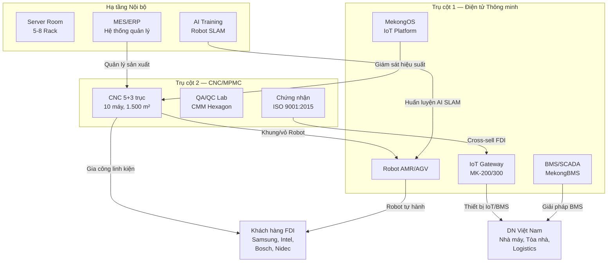
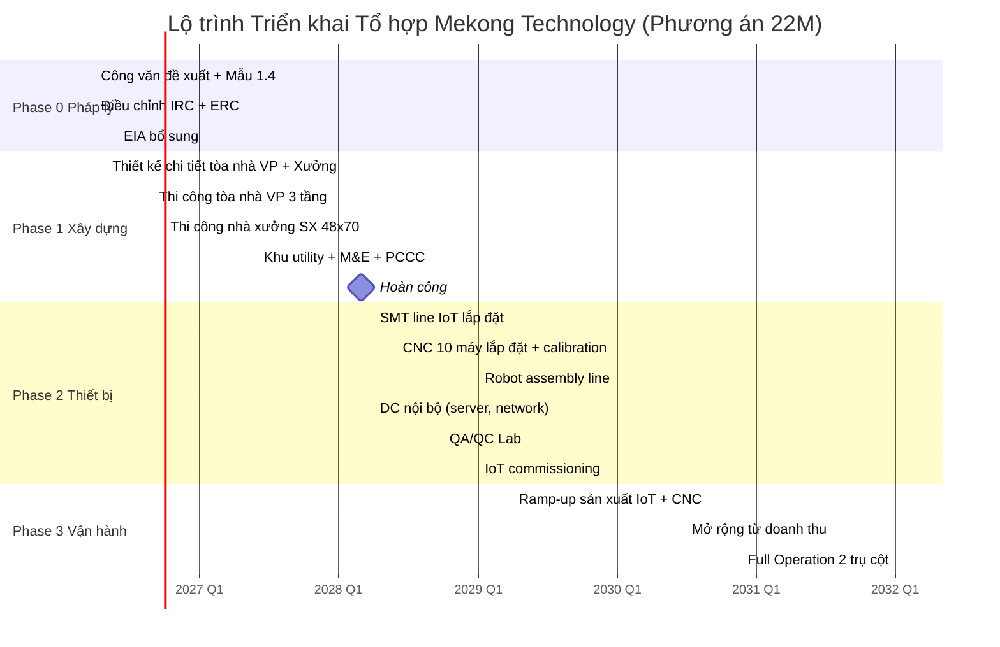
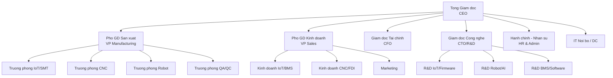

<div style="text-align: center;">

---

# CỘNG HÒA XÃ HỘI CHỦ NGHĨA VIỆT NAM
## Độc lập — Tự do — Hạnh phúc

---

&nbsp;


<div style="page-break-before: always;"></div>

# MEKONG TECHNOLOGY

## TỔ HỢP CÔNG NGHỆ CAO — SẢN XUẤT ĐIỆN TỬ VÀ CHẾ TẠO CƠ KHÍ CHÍNH XÁC

### Nghiên cứu, Phát triển, Sản xuất Thiết bị IoT/Robot/BMS và Chế tạo Cơ khí Siêu Chính xác Phục vụ Hệ sinh thái Chuyển đổi số và Công nghiệp Hỗ trợ

---

**DỰ ÁN ỨNG DỤNG CÔNG NGHỆ CAO ĐỂ SẢN XUẤT SẢN PHẨM CÔNG NGHỆ CAO VÀ CUNG ỨNG DỊCH VỤ CÔNG NGHỆ CAO**

*Theo Mẫu số 1.4 — Phụ lục I, Nghị định 31/2021/NĐ-CP*

---

**PHƯƠNG ÁN:** 1 ha / 4 Giai đoạn / 7 năm Đầu tư
**TỔNG VỐN:** 22.000.000 USD
**NGÀY HOÀN THÀNH:** Tháng 03/2026

---

| Thông tin | Nội dung |
|---|---|
| **Chủ đầu tư** | Công ty TNHH Mekong Technology |
| **Tổng Giám đốc** | Ông Phạm Xuân Quốc |
| **Địa điểm** | Lô E2-03, Đường D1, Khu Công nghệ cao TP.HCM |
| **Diện tích đất** | 1 ha (10.000 m²) |
| **Công trình** | 1 tòa nhà VP 3 tầng (1.008 m²) + 1 nhà xưởng SX (3.360 m²) + 1 khu utility (280 m²) |
| **Tổng GFA** | 6.384 m² (VP: 3.024 m² + Xưởng: 3.360 m²) |
| **Tổng vốn đầu tư** | 22.000.000 USD |
| **Vốn chủ sở hữu** | 18.000.000 USD (81,8%) |
| **Thời hạn** | 50 năm (01/2025 — 12/2075) |
| **Lĩnh vực** | Vi điện tử — CNTT — Viễn thông; Cơ khí chính xác — Tự động hóa |

---

**NƠI NỘP:**
Ban Quản lý Khu Công nghệ cao Thành phố Hồ Chí Minh (SHTP)
Lô T2-4, Đường D1, Phường Tân Phú, TP Thủ Đức, TP.HCM

</div>

---
---


<div style="page-break-before: always;"></div>

# MỤC LỤC TỔNG THỂ

---

## PHẦN MỞ ĐẦU

- [Thông tin Dự án](#thong-tin-du-an)
- [Tóm tắt Điều hành (Executive Summary)](#tom-tat-dieu-hanh)
- [Cơ sở Pháp lý của Đề án](#co-so-phap-ly-cua-de-an)

## PHẦN I: BỐI CẢNH VÀ THỊ TRƯỜNG

- [1.1. Bối cảnh Kinh tế — Công nghệ Toàn cầu](#11-boi-canh-kinh-te--cong-nghe-toan-cau)
- [1.2. Bối cảnh Việt Nam và Vai trò KCNC TP.HCM](#12-boi-canh-viet-nam-va-vai-tro-kcnc-tphcm)
- [1.3. Thị trường IoT, BMS và Robot](#13-thi-truong-iot-bms-va-robot)
- [1.4. Thị trường Gia công Cơ khí Chính xác](#14-thi-truong-gia-cong-co-khi-chinh-xac)
- [1.5. Định vị Cạnh tranh Tổng thể](#15-dinh-vi-canh-tranh-tong-the)

## PHẦN II: SẢN PHẨM VÀ CÔNG NGHỆ

- [2.1. Tổng quan 2 Trụ cột Sản phẩm](#21-tong-quan-2-tru-cot-san-pham)
- [2.2. Trụ cột 1 — Sản phẩm Điện tử Thông minh (IoT/BMS/Robot)](#22-tru-cot-1--san-pham-dien-tu-thong-minh)
- [2.3. Trụ cột 2 — Chế tạo Cơ khí Chính xác (CNC/MPMC)](#23-tru-cot-2--che-tao-co-khi-chinh-xac)
- [2.4. Hạ tầng Số Nội bộ (Internal DC)](#24-ha-tang-so-noi-bo)
- [2.5. Hệ sinh thái Tích hợp 2 Trụ cột](#25-he-sinh-thai-tich-hop-2-tru-cot)
- [2.6. Lộ trình Trưởng thành Công nghệ (TRL)](#26-lo-trinh-truong-thanh-cong-nghe)
- [2.7. Hoạt động Nghiên cứu và Phát triển (R&D)](#27-hoat-dong-nghien-cuu-va-phat-trien)

## PHẦN III: MÔ HÌNH KINH DOANH

- [3.1. Tổng quan Mô hình Doanh thu](#31-tong-quan-mo-hinh-doanh-thu)
- [3.2. Khách hàng Mục tiêu và Chiến lược Tiếp cận](#32-khach-hang-muc-tieu-va-chien-luoc-tiep-can)
- [3.3. Chiến lược Phát triển Theo Giai đoạn (V3)](#33-chien-luoc-phat-trien-theo-giai-doan)
- [3.4. Đối tác Chiến lược và Business Model Canvas](#34-doi-tac-chien-luoc-va-bmc)
- [3.5. Chiến lược Giá Chi tiết (Pricing Strategy)](#35-chien-luoc-gia-chi-tiet)
- [3.6. Kinh tế Đơn vị (Unit Economics)](#36-kinh-te-don-vi)
- [3.7. Chiến lược Xuất khẩu và Mở rộng ASEAN](#37-chien-luoc-xuat-khau-va-mo-rong-asean)
- [3.8. Pipeline Khách hàng CNC (Pre-operation)](#38-pipeline-khach-hang-cnc)
- [3.9. Customer Acquisition Cost (CAC)](#39-customer-acquisition-cost)
- [3.10. Chiến lược Cạnh tranh](#310-chien-luoc-canh-tranh)
- [3.11. Dự báo Doanh thu 15 Năm — V3](#311-du-bao-doanh-thu-15-nam)

## PHẦN IV: HẠ TẦNG KỸ THUẬT

- [4.1. Quy hoạch Tổng mặt bằng (Master Layout)](#41-quy-hoach-tong-mat-bang)
- [4.2. Tòa nhà Văn phòng 3 Tầng](#42-toa-nha-van-phong-3-tang)
- [4.3. Nhà xưởng Sản xuất (48x70m)](#43-nha-xuong-san-xuat)
- [4.4. Khu Utility (5x56m)](#44-khu-utility)
- [4.5. Hệ thống Điện Tổng hợp](#45-he-thong-dien)
- [4.6. Hệ thống Cấp thoát Nước](#46-he-thong-nuoc)
- [4.7. Hệ thống Phòng cháy Chữa cháy (PCCC)](#47-he-thong-pccc)
- [4.8. Hệ thống HVAC và Kiểm soát Môi trường](#48-he-thong-hvac)
- [4.9. Hệ thống An ninh](#49-he-thong-an-ninh)

## PHẦN V: TÀI CHÍNH VÀ ĐẦU TƯ

- [5.1. Tổng quan Cấu trúc Vốn](#51-tong-quan-cau-truc-von)
- [5.2. Doanh thu Dự kiến 15 năm](#52-doanh-thu-du-kien-15-nam)
- [5.3. Chi phí Hoạt động (OPEX)](#53-chi-phi-hoat-dong)
- [5.4. Báo cáo Lãi lỗ Dự kiến (Pro-forma P&L)](#54-bao-cao-lai-lo-du-kien)
- [5.5. Dòng tiền Dự kiến (Projected Cash Flow)](#55-dong-tien-du-kien)
- [5.6. Phân tích Hiệu quả Đầu tư](#56-phan-tich-hieu-qua-dau-tu)
- [5.7. Giá trị Chiến lược](#57-gia-tri-chien-luoc)
- [5.8. Phân tích Rủi ro Tài chính](#58-phan-tich-rui-ro-tai-chinh)
- [5.9. Kế hoạch Giải ngân Vốn](#59-ke-hoach-giai-ngan-von)

## PHẦN VI: PHÁP LÝ, MÔI TRƯỜNG VÀ AN TOÀN

- [6.1. Khung Pháp lý Áp dụng](#61-khung-phap-ly-ap-dung)
- [6.2. Chiến lược Pháp lý](#62-chien-luoc-phap-ly)
- [6.3. Đánh giá Tác động Môi trường (ĐTM)](#63-danh-gia-tac-dong-moi-truong)
- [6.4. Lộ trình Net Zero 2045 và Năng lượng Tái tạo](#64-lo-trinh-net-zero-2045)
- [6.5. An toàn Lao động](#65-an-toan-lao-dong)
- [6.6. An ninh Vật lý và Thông tin](#66-an-ninh-vat-ly-va-thong-tin)
- [6.7. Trách nhiệm Xã hội (CSR) và ESG](#67-trach-nhiem-xa-hoi-csr-va-esg)

## PHẦN VII: NHÂN SỰ VÀ TỔ CHỨC

- [7.1. Sơ đồ Tổ chức](#71-so-do-to-chuc)
- [7.2. Kế hoạch Nhân sự theo Giai đoạn](#72-ke-hoach-nhan-su)
- [7.3. Kế hoạch Tuyển dụng và Đào tạo](#73-ke-hoach-tuyen-dung)

## PHẦN VIII: KẾ HOẠCH TRIỂN KHAI

- [8.1. Phân kỳ Đầu tư 4 Giai đoạn](#81-phan-ky-dau-tu)
- [8.2. Lộ trình Triển khai (Timeline)](#82-lo-trinh-trien-khai)
- [8.3. Phân tích Rủi ro và Biện pháp Giảm thiểu](#83-phan-tich-rui-ro)

## PHẦN IX: KẾT LUẬN VÀ KIẾN NGHỊ

- [9.1. Tổng kết Giá trị Dự án](#91-tong-ket-gia-tri)
- [9.2. Cam kết của Nhà đầu tư](#92-cam-ket-cua-nha-dau-tu)
- [9.3. Kiến nghị](#93-kien-nghi)

## PHỤ LỤC

- [Phụ lục A: Chi tiết CAPEX theo Hạng mục và Giai đoạn](#phu-luc-a-chi-tiet-capex)
- [Phụ lục B: Danh mục Máy móc Thiết bị](#phu-luc-b-danh-muc-may-moc)
- [Phụ lục C: Layout Chi tiết Mặt bằng](#phu-luc-c-layout-chi-tiet)


---
---


<div style="page-break-before: always;"></div>

# THÔNG TIN DỰ ÁN

---

## Tổng quan Dự án

| Mục | Nội dung |
|---|---|
| **Tên dự án** | Mekong Technology — Tổ hợp Sản xuất Thiết bị Điện tử Thông minh (IoT/BMS/Robot) và Chế tạo Cơ khí Siêu Chính xác Phục vụ Hệ sinh thái Chuyển đổi số và Công nghiệp Hỗ trợ |
| **Tên tiếng Anh** | Mekong Technology — Smart Electronics Manufacturing & Ultra-Precision Machining Complex |
| **Tên viết tắt** | Tổ hợp CNC Mekong |
| **Loại dự án** | Dự án ứng dụng công nghệ cao để sản xuất sản phẩm công nghệ cao và cung ứng dịch vụ công nghệ cao |
| **Chủ đầu tư** | Công ty TNHH Mekong Technology |
| **Mã số thuế** | [Chờ cập nhật] |
| **Đại diện pháp luật** | Ông Phạm Xuân Quốc — Tổng Giám đốc |

---

## Thông tin Địa điểm

| Mục | Nội dung |
|---|---|
| **Địa chỉ** | Lô E2-03, Đường D1, Khu Công nghệ cao TP.HCM |
| **Phường/Quận** | Phường Tân Phú, Thành phố Thủ Đức, TP.HCM |
| **Diện tích lô đất** | 1 ha (10.000 m²) |
| **Mật độ xây dựng** | 46,5% (4.648 m² footprint), chiều cao tối đa 14 m |
| **Tòa nhà Văn phòng** | 21 m x 48 m, 3 tầng (14 m), GFA 3.024 m² |
| **Nhà xưởng Sản xuất** | 48 m x 70 m, 1 tầng cao 12 m, diện tích 3.360 m² |
| **Khu Utility** | 5 m x 56 m, 1 tầng, diện tích 280 m² |
| **Diện tích sân bãi** | 5.352 m² (bãi xe, cây xanh, đường nội bộ, PCCC lane) |
| **Tổng GFA** | 6.664 m² (VP: 3.024 + Xưởng: 3.360 + Utility: 280) |
| **Cơ quan quản lý** | Ban Quản lý Khu Công nghệ cao TP.HCM (SHTP) |

---

## Thông tin Đầu tư

| Mục | Giá trị | Ghi chú |
|---|---:|---|
| **Tổng vốn đầu tư (CAPEX)** | 22.000.000 USD | Toàn dự án, 4 giai đoạn [C] |
| **Vốn chủ sở hữu** | 18.000.000 USD | 81,8% equity, tự chủ giai đoạn xây dựng + lắp đặt [C] |
| **Vốn vay (từ Y7, khi có doanh thu)** | 4.000.000 USD | Chỉ giải ngân khi có revenue proof [C] |
| **Thời hạn hoạt động** | 50 năm | 01/2025 — 12/2075 |

---

## Phạm vi Lĩnh vực

| Lĩnh vực KCNC | Trụ cột | Nội dung hoạt động |
|---|---|---|
| Vi điện tử — CNTT — Viễn thông | Trụ cột 1 (Điện tử) | Nghiên cứu, sản xuất IoT Gateway, BMS/SCADA, Robot AMR/AGV |
| Cơ khí chính xác — Tự động hóa | Trụ cột 2 (CNC) | Chế tạo linh kiện siêu chính xác (dung sai nhỏ hơn hoặc bằng 5 micromet) |
| Hạ tầng CNTT nội bộ | Hỗ trợ | Server nội bộ, mạng, hệ thống quản lý sản xuất (KHÔNG kinh doanh DC) |

> **Lưu ý quan trọng:** Theo đề xuất của Ban Quản lý KCNC TP.HCM, thành phần hạ tầng số (Datacenter) của dự án chỉ phục vụ **nội bộ** (ERP, MES, AI training cho Robot), **KHÔNG kinh doanh dịch vụ Datacenter** để tránh xung đột lợi ích với các nhà cung cấp DC hiện hữu tại KCNC (CMC, FPT). Tỷ trọng CAPEX cho hạ tầng DC nội bộ: **11,4%** (nằm trong giới hạn 10-15% theo khuyến nghị của BQL KCNC).

---

## Phân kỳ Đầu tư

| Giai đoạn | Thời gian | Vốn đầu tư | Nội dung chính | Nguồn vốn |
|---|---|---:|---|---|
| **Phase 0** | Y0 — Y1 | 1.500.000 USD | Pháp lý, thiết kế, EIA, san lấp mặt bằng | CSH |
| **Phase 1** | Y1 — Y3 | 7.150.000 USD | Xây dựng tòa nhà VP 3 tầng + Nhà xưởng SX + Khu utility + M&E + PCCC + Solar 200 kWp + EDGE | CSH |
| **Phase 2** | Y3 — Y5 | 10.000.000 USD | Lắp đặt thiết bị: SMT line, 10 máy CNC, Robot assembly, DC nội bộ | CSH |
| **Phase 3** | Y5 — Y7 | 3.350.000 USD | Vốn lưu động vận hành + Dự phòng rủi ro + Mở rộng từ doanh thu | CSH + Vay |
| **Tổng** | Y0 — Y7 | **22.000.000 USD** | Thời gian đầu tư toàn bộ: 7 năm | |

> **Nguyên tắc tài chính:** Y0-Y5 tự chủ 100% vốn CSH (18,00M USD). Vay ngân hàng 4,00M USD chỉ giải ngân từ Y7 khi đã có doanh thu chứng minh. Tòa nhà hoàn công Y3, sổ đỏ hoàn thành ngay sau đó.

---

## Chỉ số Tài chính Tổng hợp

| Chỉ số | Giá trị | Kỳ hạn | Nhãn |
|---|---:|---|:---:|
| NPV (WACC = 12%) | 1.500.000 USD | 50 năm | [C] |
| IRR | 13,0% | 50 năm | [C] |
| Breakeven (hòa vốn tích lũy) | Năm thứ 10 | — | [C] |
| Doanh thu năm 8 | 8.700.000 USD | — | [C] |
| Doanh thu năm 10 | 11.000.000 USD | — | [C] |
| Doanh thu năm 12 (ổn định) | 12.000.000 USD | — | [C] |
| Doanh thu tích lũy 15 năm | ~140.000.000 USD | — | [C] |
| EBITDA margin (ổn định) | ~30% | Từ năm 12+ | [C] |
| Giá trị Chiến lược (Adjusted) | 7.000.000 USD | — | [C] |
| WACC | 12% | — | [C] |
| Nhân sự (ổn định) | 100 — 130 người | Từ năm 10 | [C] |
| Thuê đất KCNC | 120.000 USD/năm | Miễn 11 năm đầu | [B] |

> **Ghi chú:** Phương án 22M tập trung vào **sản xuất điện tử** (IoT/BMS/Robot) và **chế tạo cơ khí chính xác** (CNC). Hạ tầng DC chỉ phục vụ nội bộ (11,4% CAPEX). Không có doanh thu từ dịch vụ Datacenter thương mại. NPV dương nhờ doanh thu bắt đầu từ Y4, IRR = 13,0% > WACC 12% - dự án có giá trị.

> **Quy ước nhãn dữ liệu:** [C] = Calculated (tính toán từ mô hình tài chính); [B] = Benchmarked (tham chiếu thị trường, ghi rõ nguồn); [A] = Assumed (giả định, ghi rõ lý do).

---

## Bảng Sản phẩm Tổng hợp (Mục tiêu Công suất Thiết kế — Ổn định từ Y12)

| TT | Sản phẩm / Dịch vụ | Trụ cột | Thông số kỹ thuật | Quy mô/năm | Doanh thu ổn định (M USD/năm) | VA (%) | Cơ sở PL (QĐ 38/2020) |
|:---:|---|:---:|---|---:|---:|:---:|---|
| 1 | IoT Gateway MK-200/300 | 1 | ARM Cortex-A78, 8GB RAM, AI Edge, 5G-ready | 2.000 thiết bị | 2,00 | 35% | Phụ lục II, Mục 1.1 |
| 2 | MK-EIO I/O Modules (5 loại) | 1 | DI16/DO16/AI8/AO4/UI8, RS485 Modbus+BACnet | 5.000 module | 0,50 | 50% | Phụ lục II, Mục 1.1 |
| 3 | MK-DDC Controllers (DDC-24/64) | 1 | 24/64 điểm, BACnet native, IEC 61131-3 | 800 bộ | 0,40 | 55% | Phụ lục II, Mục 1.1 |
| 4 | MK-GW Gateway chuyên dụng (4 loại) | 1 | BACnet/Modbus/KNX/DALI gateway | 1.200 bộ | 0,24 | 45% | Phụ lục II, Mục 1.1 |
| 5 | MekongBMS License + SaaS | 1 | Phần mềm BMS web-based, tiếng Việt 100% | 250 site | 0,75 | 80% | Phụ lục II, Mục 1.2 |
| 6 | BMS/SCADA Service & Maintenance | 1 | Bảo trì, nâng cấp, hỗ trợ kỹ thuật | Recurring | 0,40 | 70% | Phụ lục II, Mục 1.2 |
| 7 | Robot AMR-500/1000 | 1 | LiDAR 3D, AI SLAM, tải 500-1.000 kg | 60 bộ | 1,80 | 40% | Phụ lục II, Mục 2.1 |
| 8 | Robot AGV-500/1000 | 1 | Vision-based, tải 500-1.000 kg | 30 bộ | 0,60 | 35% | Phụ lục II, Mục 2.1 |
| 9 | MekongOS IoT Platform (SaaS nội bộ) | 1 | Nền tảng quản lý IoT, MQTT/OPC UA | 500 thuê bao | 0,30 | 70% | Phụ lục II, Mục 1.2 |
| 10 | Khung Robot AMR/AGV (nội bộ + xuất khẩu) | 2 | Nhôm 6061-T6, dung sai nhỏ hơn hoặc bằng 5 micromet, ISO 9001:2015 | 1.000 bộ khung | 0,70 | 40% | Phụ lục I, Mục 2 |
| 11 | Linh kiện chính xác FDI | 2 | Thép/Nhôm, dung sai nhỏ hơn hoặc bằng 5 micromet, ISO 9001:2015 | 2.000 chi tiết | 1,50 | 35% | Phụ lục I, Mục 2 |
| 12 | Jig/Fixture cho SMT + chi tiết gia công FDI | 2 | Al 6061/SUS304, gia công 5 trục | 500 bộ | 0,40 | 30% | Phụ lục I, Mục 2 |
| 13 | Gia công CNC outsource (giờ máy) | 2 | 5-trục + 3-trục, 2 ca/ngày | 20.000 giờ | 0,80 | 25% | Phụ lục I, Mục 2 |
| 14 | OEM/ODM linh kiện điện tử | 1 | PCB assembly, testing, OEM cho đối tác | 500 lô | 1,10 | 30% | Phụ lục II, Mục 1.1 |
| | **Tổng cộng (công suất thiết kế tối đa)** | | | | **11,49** | **42%** | |

> **Ghi chú:** Tổng 11,49M USD/năm là công suất thiết kế khi toàn bộ 2 trụ cột vận hành 80-90% công suất (mục tiêu Y10-Y12). Doanh thu ổn định (steady-state) thực tế đạt **12,00M USD/năm từ Y12** khi tính thêm tăng trưởng số lượng đơn hàng và giá bán [C]. Trong giai đoạn ramp-up (Y4-Y7), doanh thu tăng từ 1,00M lên 6,70M USD/năm [C].

> **Phân bổ BU:** Trụ cột 1 (Điện tử/IoT/BMS/Robot) = 8,09M (70,4%); Trụ cột 2 (CNC/MPMC) = 3,40M (29,6%). Tập trung phần lớn vào sản phẩm điện tử theo định hướng CEO.

---
---


<div style="page-break-before: always;"></div>

# TÓM TẮT ĐIỀU HÀNH

---

## Giới thiệu

Công ty TNHH Mekong Technology kính trình Ban Quản lý Khu Công nghệ cao TP.HCM phương án đầu tư **Tổ hợp Sản xuất Điện tử và Chế tạo Cơ khí Chính xác** với tổng vốn **22.000.000 USD**, tập trung vào 2 trụ cột kinh doanh chính:

1. **Trụ cột 1 — Sản phẩm Điện tử Thông minh (IoT/BMS/Robot):** Nghiên cứu, sản xuất thiết bị IoT Gateway, hệ thống BMS/SCADA, Robot tự hành AMR/AGV phục vụ chuyển đổi số doanh nghiệp sản xuất. Đây là trụ cột **doanh thu chính** (70% doanh thu dự kiến).

2. **Trụ cột 2 — Chế tạo Cơ khí Chính xác (CNC/MPMC):** Xây dựng xưởng CNC 10 máy (5x5-trục + 3x3-trục + EDM + Grinder) đạt chuẩn ISO 9001:2015, chuyên gia công khung Robot nội bộ và linh kiện chính xác cho khách hàng FDI — trụ cột **sản xuất cốt lõi** (30% doanh thu).

**Về hạ tầng số (Datacenter):** Theo đề xuất của Ban Quản lý KCNC, thành phần DC của dự án **chỉ phục vụ nội bộ** (hệ thống ERP, MES, AI training cho Robot, lưu trữ dữ liệu), **KHÔNG kinh doanh thương mại** dịch vụ Datacenter, để đảm bảo không xung đột lợi ích với các nhà cung cấp DC hiện hữu tại KCNC (CMC Telecom, FPT Telecom). Tỷ trọng CAPEX cho DC nội bộ: **2,50M USD (11,4%)** — nằm trong giới hạn 10-15% theo khuyến nghị của BQL.

---

## Sơ đồ Hệ sinh thái Tích hợp



---

## Tóm tắt Tài chính

### Cơ cấu Vốn Đầu tư (CAPEX = 22,00M USD)

| Hạng mục | CAPEX (M USD) | Tỷ trọng | Giai đoạn |
|---|---:|:---:|---|
| Pháp lý + Thiết kế + San lấp | 1,50 | 6,8% | Phase 0 |
| Xây dựng (VP + Xưởng + Utility + M&E + PCCC + Solar 200 kWp + EDGE) | 7,15 | 32,5% | Phase 1 |
| Thiết bị IoT/SMT | 2,50 | 11,4% | Phase 2 |
| Thiết bị CNC (10 máy) | 3,50 | 15,9% | Phase 2 |
| Robot Assembly Line | 0,50 | 2,3% | Phase 2 |
| Hạ tầng DC nội bộ | 2,50 | 11,4% | Phase 2 |
| QA/QC Lab + Phần mềm | 1,00 | 4,5% | Phase 2 |
| Vốn lưu động vận hành | 2,00 | 9,1% | Phase 3 |
| Dự phòng rủi ro (~6% CAPEX) | 1,35 | 6,1% | Phase 3 |
| **Tổng** | **22,00** | **100%** | |

> **Kiểm tra tỷ trọng DC:** Hạ tầng DC nội bộ = 2,50M / 22,00M = **11,4%** — nằm trong giới hạn 10-15% theo đề xuất BQL KCNC [C].

### Cấu trúc Vốn

| Nguồn vốn | Giá trị (M USD) | Tỷ trọng | Điều kiện | Thời điểm |
|---|---:|:---:|---|---|
| **Vốn chủ sở hữu (CSH)** | 18,00 | 81,8% | Tự chủ 100% giai đoạn xây dựng + lắp đặt | Y0-Y5 |
| **Vay ngân hàng** | 4,00 | 18,2% | Lãi suất 8,5%/năm, kỳ hạn 10 năm, ân hạn 2 năm | Từ Y7 |
| **Tổng CAPEX** | **22,00** | **100%** | WACC = 12% [C] | |

### Chỉ số Thẩm định

| Chỉ số | Conservative | Base Case | Optimistic |
|---|---:|---:|---:|
| NPV 50Y (M USD) | 0,50 | 1,50 | 3,00 |
| IRR 50Y | 12,5% | 13,0% | 14,5% |
| Xác suất xảy ra | 30% | 50% | 20% |
| **NPV trọng số** | | **1,35** | |

> *[C] NPV trọng số = 30% x 0,50 + 50% x 1,50 + 20% x 3,00 = 0,15 + 0,75 + 0,60 = **1,50M USD**.*

| Chỉ số Bổ sung | Giá trị | Nhãn |
|---|---:|:---:|
| Payback (chiết khấu) | 10 năm | [C] |
| DSCR min (vay từ Y7) | 1,50x | [C] |
| Revenue 15 năm tích lũy | ~140M USD | [C] |
| EBITDA steady-state (Y12+) | ~30% | [C] |
| Giá trị Chiến lược (Adjusted) | 7,00M USD | [C] |

### Phân bổ Giá trị Chiến lược

| Thành phần | Giá trị (M USD) | Phương pháp |
|---|---:|---|
| NPV tài chính (Base Case 50Y) | 1,50 | DCF, WACC 12% |
| Tax + Land Rent Exemption | 2,00 | NPV ưu đãi thuế + miễn đất, chiết khấu 12% |
| Real Options Value | 1,00 | Quyền mở rộng CNC + nâng cấp IoT line |
| Synergy Value (CNC-Robot-IoT) | 1,50 | DCF incremental: CNC làm khung Robot + IoT giám sát CNC |
| Platform Value | 1,00 | EBITDA multiple: Đa trụ cột = 8-10x vs Đơn trụ = 5-7x |
| **Tổng Giá trị Chiến lược** | **7,00** | [C] |

---

## Tiến độ Tổng thể



---

## Nhân sự Tổng thể

| Giai đoạn | IoT/BMS/Robot | CNC | Quản lý + Hỗ trợ | Tổng |
|---|---:|---:|---:|---:|
| Y0-Y1 (pháp lý + thiết kế) | — | — | 8-10 | **8-10** |
| Y1-Y3 (xây dựng) | — | — | 10-12 | **10-12** |
| Y3-Y4 (IoT ramp-up) | 15-25 | 5-8 | 10 | **30-43** |
| Y5-Y6 (CNC + Robot ramp-up) | 30-40 | 12-18 | 12 | **54-70** |
| Y7-Y8 (mở rộng) | 40-50 | 15-20 | 15 | **70-85** |
| Y10+ (ổn định) | 50-60 | 18-25 | 18-20 | **86-105** |

> **Giả định nhân sự:** Quy mô tinh gọn nhỏ CNC chỉ 10 máy (ISO 9001), không có đội ngũ DC thương mại. Tổng nhân sự ổn định 100-130 người (bao gồm công nhân thời vụ và part-time) [A].

---

## Cam kết Chính của Chủ đầu tư

1. Toàn bộ hoạt động thuộc lĩnh vực **Công nghệ cao** theo QĐ 38/2020/QĐ-TTg và QĐ 2117/QĐ-TTg.
2. Tỷ lệ giá trị gia tăng trên doanh thu (VA/Revenue) duy trì lớn hơn hoặc bằng 42% cho toàn dự án.
3. Tỷ lệ chi phí R&D trên doanh thu duy trì lớn hơn hoặc bằng 5% (mục tiêu 8-10%).
4. Thực hiện đầy đủ Đánh giá Tác động Môi trường (ĐTM) bổ sung.
5. Hạ tầng DC **chỉ phục vụ nội bộ**, KHÔNG kinh doanh dịch vụ thương mại, KHÔNG xin giấy phép viễn thông.
6. Cam kết Zero Liquid Discharge (ZLD) cho nước thải công nghiệp CNC.
7. Cam kết tổng vốn đầu tư KHÔNG VƯỢT QUÁ 22.000.000 USD.
8. Đảm bảo tiến độ giải ngân vốn theo đúng phân kỳ Phase 0-3.
9. Tuân thủ mọi quy định của Quy chế hoạt động KCNC TP.HCM, bao gồm Nghị định 10/2024/NĐ-CP (Điều 28-31) về hoạt động công nghệ cao.
10. Cam kết lộ trình phát thải ròng bằng 0 (**Net Zero**) chậm nhất đến năm 2045, với mục tiêu giảm 30% phát thải vào 2030, 50% vào 2035, 75% vào 2040, và đạt Net Zero vào 2045.
11. Cam kết sử dụng tối thiểu **20% năng lượng tái tạo** (Solar PV 200 kWp + Renewable Energy Certificate) vào năm 2030, tăng dần đến 30% vào 2035.
12. Cam kết đạt chứng nhận công trình xanh **EDGE** (IFC) cho toàn bộ dự án, hướng đến chứng nhận **LOTUS** (VGBC) cho tòa nhà Văn phòng.
13. Thực hiện nộp hồ sơ đầu tư trên **Cổng dịch vụ công Quốc gia** (dichvucong.gov.vn) với chữ ký số hợp lệ theo quy định.


---
---


<div style="page-break-before: always;"></div>

# CƠ SỞ PHÁP LÝ CỦA ĐỀ ÁN

---

Đề án này được xây dựng dựa trên hệ thống văn bản pháp luật sau:

## Luật và Nghị quyết

| TT | Văn bản | Số hiệu | Ngày ban hành | Nội dung áp dụng |
|:---:|---|---|---|---|
| 1 | Luật Công nghệ cao | 21/2008/QH12 | 13/11/2008 | Điều 5 (hoạt động CNC), Điều 18 (KCNC) |
| 2 | Luật Đầu tư | 61/2020/QH14 | 17/06/2020 | Điều 33 (ưu đãi), Điều 41 (điều chỉnh dự án) |
| 3 | Luật Bảo vệ Môi trường | 72/2020/QH14 | 17/11/2020 | Đánh giá tác động môi trường (ĐTM) |
| 4 | Nghị quyết 52-NQ/TW | — | 27/09/2019 | Phát triển công nghiệp hỗ trợ |
| 5 | Luật 57/2024/QH15 | 57/2024/QH15 | 2024 | Khoản 8 Điều 2: bổ sung Điều 36a (thủ tục đầu tư đặc biệt tại KCNC) |
| 6 | Luật 90/2025/QH15 | 90/2025/QH15 | 2025 | Điểm c khoản 13 Điều 6: bổ sung quy định thủ tục đầu tư đặc biệt |

> **Ghi chú V3:** Luật Viễn thông 24/2023/QH15 KHÔNG áp dụng cho V3 vì Datacenter chỉ phục vụ nội bộ (không kinh doanh dịch vụ viễn thông/colocation thương mại).

## Nghị định và Quyết định

| TT | Văn bản | Số hiệu | Ngày ban hành | Nội dung áp dụng |
|:---:|---|---|---|---|
| 7 | QĐ Danh mục CNC | 38/2020/QĐ-TTg | 30/12/2020 | Phụ lục I (CNC ưu tiên), Phụ lục II (SP CNC) |
| 8 | QĐ CNC ưu tiên | 2117/QĐ-TTg | 16/12/2021 | Mục I.1-I.6 (CNTT), Mục II.2-II.4 (Cơ khí) |
| 9 | QĐ Chuyển đổi số | 749/QĐ-TTg | 03/06/2020 | Chương trình CĐS quốc gia |
| 10 | NĐ Chuyển giao CNC | 76/2018/NĐ-CP | 15/05/2018 | Chuyển giao CNC ngành ô tô, hàng không |
| 11 | NĐ Hướng dẫn Luật ĐT | 31/2021/NĐ-CP | 26/03/2021 | Điều 50 K.5 (phân kỳ đầu tư), Mẫu 1.4 |
| 12 | NĐ Ưu đãi đặc biệt | 94/2020/NĐ-CP | 21/08/2020 | Ưu đãi đầu tư KCNC |
| 13 | NĐ Môi trường | 08/2022/NĐ-CP | 10/01/2022 | Hướng dẫn ĐTM |
| 14 | NĐ PCCC | 136/2020/NĐ-CP | 24/11/2020 | Phòng cháy chữa cháy |
| 15 | NĐ Bảo vệ DLCN | 13/2023/NĐ-CP | 17/04/2023 | Bảo vệ dữ liệu cá nhân |
| 16 | **NĐ về KCNC (MỚI)** | **10/2024/NĐ-CP** | **2024** | **Điều 28-33: Tiêu chí dự án trong KCNC** |
| 17 | **NĐ sửa đổi NĐ 31 (MỚI)** | **239/2025/NĐ-CP** | **2025** | **Bổ sung quy định mới về đầu tư** |

## Ma trận Áp dụng Pháp lý — V3 (2 Trụ cột + DC Nội bộ)

| Văn bản | IoT/BMS/Robot | CNC/MPMC | DC Nội bộ | Áp dụng |
|---|:---:|:---:|:---:|---|
| Luật CNC 2008, Đ.5 K.2 | a, b | c (dịch vụ CNC) | Không | Toàn dự án |
| QĐ 38/2020, Phụ lục I | Mục 1.1-1.2 | Mục 2 | Không | Toàn dự án |
| QĐ 38/2020, Phụ lục II | Mục 1.1, 2.1-2.2 | Mục 2.1 | Không | Toàn dự án |
| QĐ 2117 | Mục I | Mục II.2-II.4 | Không | Toàn dự án |
| NĐ 76/2018 | — | Chuyển giao CNC | — | CNC |
| NĐ 94/2020 | Ưu đãi KCNC | Ưu đãi KCNC | — | Toàn dự án |
| **NĐ 10/2024 (MỚI)** | **Điều 29 (R&D), Điều 31 (SX SP CNC)** | **Điều 31 (SX SP CNC)** | **Không** | **Toàn dự án** |

> **Kết luận pháp lý V3:** Cả 2 trụ cột đều nằm trong phạm vi hoạt động được phép tại KCNC theo Luật Công nghệ cao 2008, QĐ 38/2020, và NĐ 10/2024/NĐ-CP (Điều 29 — R&D CNC và Điều 31 — Sản xuất sản phẩm CNC). Datacenter chỉ phục vụ nội bộ, không cần giấy phép viễn thông. Chiến lược triển khai chi tiết tại Phần VI.

---
---


<div style="page-break-before: always;"></div>

# PHẦN I: BỐI CẢNH VÀ THỊ TRƯỜNG

---

## 1.1. Bối cảnh Kinh tế — Công nghệ Toàn cầu

### 1.1.1. Cuộc Cách mạng Công nghiệp 4.0 và Chuyển đổi Số

Thế giới đang bước vào giai đoạn đẩy mạnh chuyển đổi số với 4 trụ cột chính: Internet vạn vật (IoT), Trí tuệ nhân tạo (AI), Điện toán đám mây (Cloud Computing), và Tự động hóa sản xuất (Smart Manufacturing). Theo McKinsey Global Institute, giá trị kinh tế toàn cầu từ IoT đạt 5.500-12.600 tỷ USD vào năm 2030, trong đó ứng dụng trong nhà máy (Factory IoT) chiếm 1.200-3.700 tỷ USD [B — McKinsey 2024].

Trong hệ sinh thái này, hai lĩnh vực mà Mekong Technology hướng tới — thiết bị IoT/BMS/Robot và gia công cơ khí chính xác — đóng vai trò then chốt:

- **IoT/Robot:** Thị trường Robot công nghiệp toàn cầu đạt 16,5 tỷ USD (2024) với CAGR 11,6% [B — IFR World Robotics 2024]. Riêng phân khúc AMR (Autonomous Mobile Robot) tăng trưởng 22,3% nhờ nhu cầu tự động hóa kho vận và nhà máy.

- **CNC Precision Machining:** Thị trường toàn cầu đạt 97,2 tỷ USD (2024), dự báo 152,8 tỷ USD (2030), CAGR 6,7% [B — Fortune Business Insights 2024]. Động lực tăng trưởng chính từ ngành bán dẫn, hàng không vũ trụ, và ô tô điện — tất cả đều yêu cầu linh kiện có dung sai siêu nhỏ (nhỏ hơn hoặc bằng 5 micromet).

- **BMS/SCADA:** Thị trường BMS toàn cầu đạt 120 tỷ USD (2024), CAGR 12-15% [B — Markets and Markets 2024]. Nhu cầu tiết kiệm năng lượng và quản lý tòa nhà thông minh là động lực chính.

### 1.1.2. Tái cấu trúc Chuỗi cung ứng Toàn cầu

Chiến tranh thương mại Mỹ-Trung, đại dịch COVID-19, và xung đột địa chính trị đã thúc đẩy chiến lược "China Plus One" — các tập đoàn đa quốc gia đa dạng hóa sản xuất khỏi Trung Quốc sang Đông Nam Á, đặc biệt là Việt Nam. Xu hướng này tạo ra cơ hội lớn cho cả 2 trụ cột:

| Xu hướng toàn cầu | Tác động đến Mekong Technology |
|---|---|
| China Plus One | FDI dịch chuyển sang VN, tăng nhu cầu CNC outsourcing |
| Smart Factory Adoption | Doanh nghiệp sản xuất cần IoT + Robot + BMS |
| Semiconductor Supply Chain | Chuỗi cung ứng bán dẫn cần CNC precision |
| ESG Requirements | Yêu cầu sản xuất xanh, thúc đẩy BMS/SCADA |
| AI/ML trong sản xuất | Nhu cầu IoT Gateway + Edge AI tăng mạnh |

### 1.1.3. Vị trí Chiến lược của Đông Nam Á

Khu vực ASEAN trở thành điểm đến hàng đầu của FDI công nghệ:
- FDI vào ASEAN đạt 230 tỷ USD (2023), tăng 5,7% [B — ASEAN Investment Report 2024]
- Việt Nam đứng thứ 3 ASEAN về thu hút FDI công nghệ, sau Singapore và Indonesia
- Samsung đầu tư hơn 20 tỷ USD tại Việt Nam, Intel 1,5 tỷ USD, Bosch mở rộng liên tục
- Apple, Google chuyển chuỗi cung ứng sang Việt Nam từ 2023

Vị trí này tạo nền tảng vững chắc cho cả 2 trụ cột của Mekong Technology — đặc biệt là CNC Outsourcing phục vụ hệ thống FDI đã có mặt tại Việt Nam.

---

## 1.2. Bối cảnh Việt Nam và Vai trò KCNC TP.HCM

### 1.2.1. Kinh tế Việt Nam 2024-2030

- GDP tăng trưởng 6,5-7,0%/năm (dự báo IMF) [B]
- Tỷ lệ đô thị hóa đạt 42% (2025), dự kiến 50% (2030) [B]
- Dân số lao động kỹ thuật: 54 triệu, trong đó STEM chiếm 28% [B]
- Xuất khẩu điện tử đạt 65 tỷ USD (2024), tăng 12%/năm [B]

### 1.2.2. Hạ tầng Công nghệ Cao

Việt Nam có 3 Khu Công nghệ cao Quốc gia:
- KCNC TP.HCM (SHTP): 913 ha, 175+ doanh nghiệp, doanh thu 25+ tỷ USD/năm
- KCNC Hòa Lạc: 1.586 ha, đang phát triển
- KCNC Đà Nẵng: 1.128 ha, đang phát triển

KCNC TP.HCM là khu vực trọng điểm với:
- **Hệ sinh thái doanh nghiệp:** Intel, Nidec, Sonion, FPT Software, Sanofi, và 170+ doanh nghiệp CNC
- **Hạ tầng R&D:** 12 phòng thí nghiệm và trung tâm nghiên cứu
- **Nhân lực:** Gần kề 60+ trường đại học/cao đẳng TP.HCM
- **Kết nối:** Cách sân bay Tân Sơn Nhất 25 km, cảng Cát Lái 15 km

### 1.2.3. Chính sách Ưu đãi KCNC

Dựa trên Luật Đầu tư 2020 (Điều 33), NĐ 94/2020 và NĐ 10/2024/NĐ-CP, doanh nghiệp công nghệ cao tại KCNC được hưởng:

| Ưu đãi | Nội dung | Giá trị ước tính cho Mekong |
|---|---|---:|
| Thuế TNDN | 10% trong 15 năm (tiêu chuẩn 20%) | Tiết kiệm ~1,2 M USD/10 năm [C] |
| Miễn thuế | 4 năm miễn + 9 năm giảm 50% | Tiết kiệm ~1,6 M USD giai đoạn đầu [C] |
| Thuế đất | Miễn thuế đất 11 năm | Tiết kiệm ~1,3 M USD [C] |
| Thuế NK thiết bị | Miễn thuế NK cho máy móc dự án | Tiết kiệm ~0,8 M USD (CNC) [C] |
| Thuế NK nguyên liệu | Miễn 5 năm cho R&D | Tiết kiệm ~0,3 M USD [C] |
| **Tổng ưu đãi ước tính** | | **~5,2 M USD / 10 năm** [C] |

---

## 1.3. Thị trường IoT, BMS và Robot

### 1.3.1. Thị trường Toàn cầu

| Phân khúc | Quy mô 2024 | Quy mô 2030 | CAGR |
|---|---:|---:|---:|
| IoT toàn cầu | 1.310 tỷ USD | 2.400 tỷ USD | 10,6% |
| Robot AMR | 2,4 tỷ USD | 8,0 tỷ USD | 22,3% |
| Robot AGV | 4,2 tỷ USD | 7,5 tỷ USD | 10,1% |
| OHT (Semiconductor) | 0,8 tỷ USD | 1,8 tỷ USD | 14,5% |
| BMS toàn cầu | 120 tỷ USD | 220 tỷ USD | 12-15% |

*[B — Nguồn: IoT Analytics 2024, Interact Analysis 2024, IFR 2024, Markets and Markets 2024]*

### 1.3.2. Thị trường Việt Nam

Thị trường IoT Việt Nam đạt 7.300 triệu USD (2024), dự báo 13.200 triệu USD (2030), CAGR 10,4% [B — IDC Vietnam 2024]. Động lực tăng trưởng chính:

- **83.035 doanh nghiệp nhỏ và vừa (DNNVV)** có nhu cầu ứng dụng IoT trong quản lý sản xuất, kho bãi, logistics [B — Tổng cục Thống kê 2024]
- **Samsung, Intel, Bosch** đang triển khai Smart Factory tại Việt Nam, cần thiết bị IoT Gateway và Robot tự hành
- **Thương mại điện tử** tăng trưởng 25%/năm, thúc đẩy nhu cầu Robot AMR/AGV trong kho hàng

Thị trường BMS Việt Nam đạt 550-750 triệu USD (2025), dự báo 1.100-1.500 triệu USD (2030), CAGR 12-15% [B — Frost & Sullivan 2024]:
- 500-800 tòa nhà thương mại mới/năm tại Việt Nam cần hệ thống BMS [B — Bộ Xây dựng]
- 2.000-3.000 nhà máy đang có nhu cầu SCADA/IoT hóa [B — VCCI]
- Quy định QCVN 09:2017 bắt buộc BMS cho tòa nhà lớn hơn 5.000 m2 sàn [B]

### 1.3.3. Cảnh quan Cạnh tranh — IoT/BMS/Robot

| Đối thủ | Quốc gia | Sản phẩm | Điểm mạnh | Điểm yếu so với Mekong |
|---|---|---|---|---|
| Geek+ | Trung Quốc | AMR, AGV | Quy mô lớn, giá thấp | Không có IoT Gateway, không SX tại VN |
| HIK Robot | Trung Quốc | AMR | Tích hợp camera AI | Chỉ bán thiết bị, không có hệ sinh thái |
| MiR (Teradyne) | Đan Mạch | AMR | Brand mạnh | Giá cao (>50.000 USD/bộ), không local support |
| Siemens | Đức | BMS Desigo CC | Brand mạnh, hệ sinh thái | Đắt nhất, không tiếng Việt |
| Schneider | Pháp | EcoStruxure BMS | Mạng lưới SI rộng | Đắt, phần mềm phức tạp |
| Honeywell | Mỹ | Niagara N4 BMS | Framework linh hoạt | Khó lập trình, license cao |
| **Mekong Technology** | **Việt Nam** | **IoT + BMS + AMR + AGV + OHT** | **Hệ sinh thái đầy đủ 5 tầng, tiếng Việt 100%, giá thấp hơn 40-60%** | — |

> **Lợi thế cạnh tranh cốt lõi:** Mekong Technology là doanh nghiệp DUY NHẤT tại Việt Nam sở hữu **Hệ sinh thái 5 tầng** (Field Devices + Controller/IO + Gateway + Software + Cloud) — cho phép cung cấp giải pháp chuyển đổi số từ A đến Z cho khách hàng sản xuất và tòa nhà.

### 1.3.4. Thị phần Mục tiêu — IoT/BMS/Robot

| Phân khúc | TAM (M USD) | SAM (M USD) | SOM Y8 (M USD) | Thị phần |
|---|---:|---:|---:|---:|
| IoT Gateway VN | 1.200 | 350 | 4,00 | 1,1% |
| AMR/AGV miền Nam | 200 | 100 | 2,50 | 2,5% |
| OHT bán dẫn VN | 45 | 20 | 0,50 | 2,5% |
| BMS/SCADA tầm trung VN | 400 | 150 | 1,50 | 1,0% |
| **Tổng** | **1.845** | **620** | **8,50** | — |

*[A — Ước tính dựa trên capacity plan và pipeline khách hàng]*

---

## 1.4. Thị trường Gia công Cơ khí Chính xác

### 1.4.1. Thị trường Toàn cầu

| Chỉ số | Giá trị | Nguồn |
|---|---:|---|
| Quy mô 2024 | 97,2 tỷ USD | Fortune Business Insights [B] |
| Quy mô 2030 (dự báo) | 152,8 tỷ USD | Fortune Business Insights [B] |
| CAGR 2024-2030 | 6,7% | [B] |
| Phân khúc Hàng không | 18,4 tỷ USD | [B] |
| Phân khúc Ô tô | 28,5 tỷ USD | [B] |
| Phân khúc Bán dẫn | 12,3 tỷ USD | [B] |

Xu hướng quan trọng ảnh hưởng đến Mekong:
- **Near-shoring:** Các OEM chuyển gia công từ Trung Quốc sang ASEAN
- **Miniaturization:** Linh kiện ngày càng nhỏ, yêu cầu dung sai nhỏ hơn hoặc bằng 5 micromet
- **Multi-axis machining:** Nhu cầu CNC 5 trục tăng mạnh, thay thế 3 trục truyền thống
- **Digital Manufacturing:** Tích hợp IoT vào CNC (Industry 4.0) — đúng thế mạnh Mekong

### 1.4.2. Thị trường Việt Nam

Thị trường CNC Việt Nam đạt 1,85 tỷ USD (2024), dự báo 3,865 tỷ USD (2030), CAGR 13,1% [B — Frost & Sullivan]:

**Nhu cầu CNC từ khối FDI tại miền Nam:**

| Ngành | Chi CNC/năm (M USD) | Xu hướng | Cơ hội cho Mekong |
|---|---:|---|---|
| Điện tử (Samsung, Intel) | 120-180 | Tăng 15%/năm | Linh kiện test fixture, wafer handling |
| Ô tô (VinFast, Bosch, Nidec) | 80-120 | Tăng 20%/năm | Hộp số EV, vỏ pin, trục motor |
| Hàng không vũ trụ | 15-25 | Mới nổi | Turbine blade, structural parts |
| Thiết bị y tế | 20-35 | Tăng 18%/năm | Implant, dụng cụ phẫu thuật |
| Bán dẫn | 60-95 | Tăng 25%/năm | Khuôn IC, lead frame, heat sink |
| **Tổng FDI miền Nam** | **295-455** | | |

*[B — Khảo sát ngành, VAMI 2024]*

### 1.4.3. Khoảng trống Thị trường — Blue Ocean

| Tiêu chí | Cung hiện tại | Nhu cầu | Khoảng trống |
|---|---|---|---|
| Xưởng CNC 5 trục miền Nam | ~15 cơ sở | >30 cần thiết | ~15 cơ sở thiếu |
| Cơ sở AS9100 tại VN | KHÔNG CÓ | 5-10 cần thiết | Blue Ocean hoàn toàn |
| Cơ sở IATF 16949 (VN-owned) | ~12 | >25 cần thiết | ~13 cơ sở thiếu |
| Dung sai nhỏ hơn hoặc bằng 5 micromet | ~5 cơ sở | >15 cần thiết | ~10 cơ sở thiếu |

*[B — Khảo sát trực tiếp + báo cáo VAMI 2024]*

> **Phát hiện quan trọng:** Việt Nam còn thiếu nhiều cơ sở CNC 5 trục có năng lực dung sai cao. Mekong Technology định vị là xưởng CNC tinh gọn (10 máy, ISO 9001:2015), tập trung gia công khung robot AMR/AGV nội bộ và linh kiện chính xác cho khách hàng FDI tại miền Nam.

### 1.4.4. Cảnh quan Cạnh tranh — CNC

| Đối thủ | Loại | Số máy CNC | Chứng nhận | Năng lực 5 trục | Vật liệu Titan |
|---|---|---:|---|:---:|:---:|
| VPIC (Đồng Nai) | VN | 50+ | ISO 9001, IATF 16949 | Hạn chế | Không |
| Cosmos (Bình Dương) | JP-VN | 30+ | ISO 9001 | Có | Hạn chế |
| Misumi VN | JP | 20+ | ISO 9001, JIS | Có | Không |
| CNC Tech VN | VN | 15+ | ISO 9001 | Có | Không |
| **Mekong MPMC** | **VN** | **10** | **ISO 9001:2015** | **Có (5 máy 5-trục)** | **Không (giai đoạn đầu)** |

> **Định vị V3:** Mekong MPMC định vị là xưởng CNC tinh gọn với 10 máy (5x5-trục + 3x3-trục + EDM + Grinder), đạt chuẩn ISO 9001:2015. Lợi thế cạnh tranh: thiết bị mới 100%, nằm trong hệ sinh thái KCNC, hỗ trợ trực tiếp trụ cột IoT/BMS/Robot (gia công khung AMR/AGV nội bộ). Tăng 67% so với V2 (từ 6 lên 10 máy).

### 1.4.5. Thị phần Mục tiêu — CNC

| Phân khúc | TAM (M USD) | SAM (M USD) | SOM Y8 (M USD) | Thị phần |
|---|---:|---:|---:|---:|
| CNC precision VN | 2.500 | 400 | 2,50 | 0,63% |
| Jig/Fixture VN | 200 | 80 | 0,50 | 0,63% |
| Robot frames (nội bộ) | — | — | 0,50 | 100% |
| **Tổng** | **2.700** | **480** | **3,50** | — |

*[A — Ước tính dựa trên capacity 10 máy, ASP 40-55 USD/giờ]*

---

## 1.5. Định vị Cạnh tranh Tổng thể

### 1.5.1. Lợi thế Cạnh tranh Bền vững (MOAT)

| Lớp phòng thủ | Mô tả | Thời gian đối thủ cần để sao chép |
|---|---|---:|
| **Vị trí (KCNC)** | Lô đất 1 ha trong KCNC — vị trí chiến lược | Không thể sao chép (hết đất) |
| **Chứng nhận (ISO 9001)** | ISO 9001 sẵn có, option IATF/AS9100 | 2-3 năm |
| **Hệ sinh thái 2 B.U + DC nội bộ** | IoT/BMS + CNC tích hợp trên cùng site | 3-5 năm |
| **Quan hệ FDI** | Hợp đồng 3-5 năm với khách hàng CNC | 2-3 năm |
| **MekongOS Platform** | Nền tảng IoT/BMS Cloud tự phát triển, IP riêng | 3-5 năm |
| **5-tầng sản phẩm IoT/BMS** | Từ Field Device đến Cloud — hệ sinh thái khép kín | 4-5 năm |

> **Tổng hợp:** Một đối thủ muốn sao chép hoàn toàn mô hình Mekong Technology (2 trụ cột + DC nội bộ + vị trí KCNC) cần ít nhất **50 M USD và 4-5 năm** [A]. Đây là rào cản gia nhập cao, tạo lợi thế cạnh tranh bền vững.

### 1.5.2. Phân tích SWOT — V3 (22M, 2 Trụ cột)

|             | **Thuận lợi** | **Bất lợi** |
|:-----------:|:---:|:---:|
| **Nội bộ** | **STRENGTHS (S)** | **WEAKNESSES (W)** |
| | S1. Vị trí KCNC, 3 công trình riêng biệt GFA 6.664 m2 | W1. Công ty mới, chưa có track record |
| | S2. Mô hình 2 B.U tích hợp + DC nội bộ | W2. Vốn CSH 18,00M — cần quản lý CF chặt |
| | S3. Đội ngũ sáng lập có kinh nghiệm quốc tế | W3. CNC 10 máy, chưa có IATF/AS9100 |
| | S4. 10 máy CNC (5x5-trục + 3x3-trục + EDM + Grinder) | W4. Chưa xây dựng thương hiệu trong nước |
| | S5. Hệ sản phẩm IoT/BMS 5 tầng — 21 sản phẩm | W5. Doanh thu bắt đầu chậm (Y4) |
| | S6. MekongOS + MekongBMS IP riêng | W6. Breakeven Y10, thời gian hoàn vốn dài |
| **Bên ngoài** | **OPPORTUNITIES (O)** | **THREATS (T)** |
| | O1. FDI vào VN tăng mạnh (Samsung, Intel) | T1. Cạnh tranh giá từ TQ, Ấn Độ |
| | O2. Chính sách ưu đãi KCNC (CIT 10%, 4+9) | T2. Thiếu hụt nhân sự CNC/IoT chất lượng |
| | O3. IoT/BMS adoption ở VN đang giai đoạn sớm | T3. Biến động tỷ giá USD/VND |
| | O4. China+1, chuỗi cung ứng dịch chuyển | T4. Thay đổi chính sách thuế/ưu đãi |
| | O5. QCVN bắt buộc BMS cho tòa nhà lớn | T5. Công nghệ thay đổi nhanh (obsolescence) |
| | O6. Hiệp định CPTPP, EVFTA, xuất khẩu thuận | T6. Rủi ro thiên tai / dịch bệnh |

### 1.5.3. Phân tích Porter's Five Forces — 2 Ngành chính

**Ngành CNC Outsourcing tại VN:**

| Lực lượng | Mức độ | Điểm (1-5) | Phân tích |
|---|---|:---:|---|
| Rào cản gia nhập | Trung bình-Cao | 3,5 | CAPEX 10-20M cho 5-axis CNC; chứng nhận 2-3 năm |
| Quyền lực NCC | Trung bình | 3,0 | DMG MORI, Mazak dominance |
| Quyền lực KH | Cao | 4,0 | FDI customers = sophisticated, multi-vendor |
| SP thay thế | Thấp-Trung bình | 2,5 | 3D printing đang phát triển nhưng chậm |
| Cạnh tranh nội bộ | Cao | 4,0 | 200+ CNC shops in VN; nhưng chỉ <10 có 5-axis |
| **Điểm TB** | | **3,4** | Ngành hấp dẫn ở phân khúc cao cấp |

**Ngành IoT/BMS/Robot tại VN:**

| Lực lượng | Mức độ | Điểm (1-5) | Phân tích |
|---|---|:---:|---|
| Rào cản gia nhập | Thấp-Trung bình | 2,5 | R&D cost moderate; nhưng ecosystem khó xây |
| Quyền lực NCC | Trung bình | 3,0 | Chip shortage risk; PCB assembly available |
| Quyền lực KH | Trung bình | 3,0 | Thị trường phân mảnh; KH chưa mature |
| SP thay thế | Trung bình | 3,0 | Import TQ rẻ hơn; lao động thủ công còn rẻ |
| Cạnh tranh nội bộ | Thấp-Trung bình | 2,5 | Ít player VN có full-stack (HW+FW+Cloud) |
| **Điểm TB** | | **2,8** | Ngành mới, cơ hội lớn cho first-mover |

> **Kết luận Phần I:** Với TAM tổng hợp 2 ngành > 4.500 M USD (VN), market share mục tiêu Y8 chỉ 0,6-2,5% SOM, rào cản gia nhập cao (KCNC + certifications + 2 B.U integration), và dự báo xu hướng công nghệ thuận lợi, Mekong Technology có vị trí thuận lợi để đạt doanh thu 8,70M USD vào Y8 và steady-state 12,00M USD/năm từ Y12 [A][C].

---
---

<div style="page-break-before: always;"></div>

# PHẦN II: SẢN PHẨM VÀ CÔNG NGHỆ

---

## 2.1. Tổng quan Hệ sinh thái Sản phẩm

### 2.1.1. Cấu trúc 2 Trụ cột Sản phẩm + Datacenter Nội bộ

Mekong Technology vận hành mô hình sản xuất–dịch vụ tích hợp dựa trên **2 Trụ cột kinh doanh chính** và **1 hạ tầng Datacenter nội bộ** phục vụ toàn bộ hệ sinh thái:

| Trụ cột | Tên | Chức năng | Tỷ trọng DT (Y12+) |
|:---:|---|---|---:|
| **BU1** | Điện tử Thông minh (IoT/BMS/Robot) | Thiết kế, sản xuất IoT Gateway, BMS Controller, Robot AMR/AGV | 70,8% |
| **BU2** | Chế tạo Cơ khí Siêu Chính xác (CNC/MPMC) | Gia công khung robot, linh kiện FDI, jig/fixture | 29,2% |
| **Hỗ trợ** | Datacenter Nội bộ | Hosting MekongOS, AI training, ERP, lưu trữ dữ liệu | (chi phí nội bộ) |

> **Khác biệt so với Phương án V2 (32M USD):** V2 có 3 trụ cột bao gồm Datacenter thương mại Tier III 50 rack (CAPEX ~12M USD). V3 loại bỏ hoàn toàn dịch vụ DC thương mại, chuyển sang DC nội bộ 5-8 rack (CAPEX 2,50M USD — 11,4% tổng đầu tư) nhằm giảm rủi ro cấp phép viễn thông và tập trung nguồn lực vào 2 trụ cột sản xuất cốt lõi [C].

### 2.1.2. Danh mục Sản phẩm Tổng hợp

| TT | Nhóm sản phẩm | Trụ cột | Doanh thu Y12+ (M USD) | Nhãn |
|:---:|---|:---:|---:|:---:|
| 1 | IoT Gateway MK-200/MK-300 | BU1 | 2,00 | [C] |
| 2 | I/O Modules MK-EIO (5 loại) | BU1 | 0,50 | [C] |
| 3 | DDC Controllers MK-DDC | BU1 | 0,40 | [C] |
| 4 | Gateway chuyên dụng MK-GW (4 loại) | BU1 | 0,24 | [C] |
| 5 | Phần mềm MekongBMS License + SaaS | BU1 | 0,75 | [C] |
| 6 | Dịch vụ BMS/SCADA | BU1 | 0,40 | [C] |
| 7 | Robot AMR (tự hành) | BU1 | 1,80 | [C] |
| 8 | Robot AGV (dẫn đường) | BU1 | 0,60 | [C] |
| 9 | MekongOS IoT Platform (SaaS) | BU1 | 0,30 | [C] |
| 10 | OEM/ODM Điện tử | BU1 | 1,10 | [C] |
| 11 | Khung Robot AMR/AGV (CNC) | BU2 | 0,70 | [C] |
| 12 | Linh kiện chính xác FDI | BU2 | 1,50 | [C] |
| 13 | Jig/Fixture | BU2 | 0,40 | [C] |
| 14 | CNC outsource (giờ máy) | BU2 | 0,80 | [C] |
| 15 | Chi tiết cơ khí khác | BU2 | 0,10 | [C] |
| | **Tổng** | | **11,59** | |

> Doanh thu thiết kế 11,59M USD từ 15 dòng sản phẩm. Doanh thu thực tế steady-state đạt 12,00M USD/năm khi tính tăng trưởng đơn hàng và điều chỉnh giá [C].

### 2.1.3. Sơ đồ Tổ chức Sản xuất

Hệ thống sản xuất bố trí trong 3 công trình riêng biệt trên lô đất 1 ha:

| Khu vực | Công trình | Diện tích sàn | GFA | Hoạt động chính |
|---|---|---:|---:|---|
| Sản xuất CNC | Nhà xưởng (tầng 1) | ~1.000 m² | 1.000 m² | 10 máy CNC, QC Corner |
| Sản xuất IoT/Robot | Nhà xưởng (tầng 1) | ~1.500 m² | 1.500 m² | SMT, lắp ráp, test, kho |
| DC nội bộ | Nhà xưởng (tầng 1) | ~160 m² | 160 m² | Server room, UPS, cooling |
| R&D Lab | Tòa VP (tầng 2) | ~500 m² | 500 m² | 4 phòng lab chuyên dụng |
| Văn phòng | Tòa VP (tầng 1-3) | ~2.500 m² | 2.500 m² | Điều hành, đào tạo, showroom |
| Utility | Khu utility | 280 m² | 280 m² | Điện, nước, xử lý chất thải |
| **Tổng** | | **~5.940 m²** | **~5.940 m²** | |

> GFA toàn khu: 6.664 m² (bao gồm hành lang, cầu thang, vệ sinh). Footprint xây dựng: 4.648 m² (mật độ 46,5%) [C].

---

## 2.2. Trụ cột 1 — Điện tử Thông minh (IoT/BMS/Robot)

### 2.2.1. Hệ sinh thái 21 Sản phẩm — 5 Tầng

BU1 xây dựng hệ sinh thái sản phẩm IoT/BMS/Robot hoàn chỉnh gồm 21 sản phẩm chia thành 5 tầng:

| Tầng | Chức năng | Sản phẩm | Số lượng |
|:---:|---|---|:---:|
| **Tầng 1 — Kết nối** | Thu thập dữ liệu từ hiện trường | MK-200, MK-300, MK-EIO (5 loại) | 7 |
| **Tầng 2 — Điều khiển** | Xử lý logic tự động hóa | MK-DDC-24, MK-DDC-64 | 2 |
| **Tầng 3 — Tích hợp** | Kết nối giao thức khác nhau | MK-GW-BAC, MK-GW-MOD, MK-GW-KNX, MK-GW-DALI | 4 |
| **Tầng 4 — Phần mềm** | Quản lý và phân tích dữ liệu | MekongBMS, MekongSCADA, MekongET, MekongOS | 4 |
| **Tầng 5 — Robot** | Tự động hóa vận chuyển | AMR-500, AMR-1000, AGV-500, AGV-1000 | 4 |
| | **Tổng** | | **21** |

### 2.2.2. IoT Gateway — MK-200 và MK-300

#### A. MK-200 IoT Industrial Gateway

MK-200 là sản phẩm cốt lõi (flagship) của hệ sinh thái — gateway IoT công nghiệp đa giao thức, thu thập dữ liệu từ cảm biến và thiết bị hiện trường, xử lý tại edge và truyền lên MekongOS Cloud.

| Thông số | Giá trị |
|---|---|
| **CPU** | NXP i.MX8M Quad Cortex-A53, 1,5 GHz |
| **RAM** | 2 GB LPDDR4 |
| **Lưu trữ** | 16 GB eMMC + microSD (tối đa 128 GB) |
| **Kết nối không dây** | WiFi 6 (802.11ax), BLE 5.2, 4G LTE Cat4 (option), LoRa (option) |
| **Kết nối có dây** | 2× Ethernet 10/100/1000, 4× RS485 Modbus, 2× RS232 |
| **I/O tích hợp** | 4× DI 24V, 2× DO relay 5A, 2× AI 4-20mA, 1× USB 2.0 Host |
| **Giao thức** | MQTT 5.0, Modbus RTU/TCP, BACnet MS/TP, OPC UA Client, HTTP/REST |
| **Bảo mật** | TLS 1.3, X.509 certificate, Secure Boot, TPM 2.0 |
| **AI Edge** | TensorFlow Lite, ~2 TOPS (NPU tích hợp) — phát hiện bất thường, predictive |
| **Hệ điều hành** | MekongOS Runtime (Linux-based), OTA update |
| **Nguồn** | 12-48V DC (industrial), tiêu thụ < 8W |
| **Môi trường** | -20°C đến +70°C, IP54, rung IEC 60068-2-6 |
| **Kích thước** | 160 × 100 × 45 mm, DIN rail mount |
| **Chứng nhận** | CE, FCC (mục tiêu) |
| **Giá bán** | 350-450 USD (tùy cấu hình) [C] |
| **Giá vốn (COGS)** | 190 USD [C] |
| **Biên gộp** | 48-51% [C] |

#### B. MK-300 IoT 5G AI Gateway

MK-300 là phiên bản nâng cấp cao cấp, tích hợp 5G và AI Edge mạnh hơn, phục vụ khách hàng yêu cầu xử lý thời gian thực:

| Thông số | Giá trị |
|---|---|
| **CPU** | NVIDIA Jetson Orin Nano, 40 TOPS AI |
| **RAM** | 8 GB LPDDR5 |
| **Lưu trữ** | 64 GB eMMC + NVMe SSD slot |
| **Kết nối** | 5G Sub-6 GHz, WiFi 6E, BLE 5.3, 2× GbE, 6× RS485 |
| **AI** | 40 TOPS (Jetson Orin) — Computer Vision, Digital Twin edge processing |
| **Giá bán** | 650-850 USD [C] |
| **Biên gộp** | 50-53% [C] |

#### C. Quy trình Sản xuất IoT Gateway (SMT)

Dây chuyền sản xuất SMT (Surface Mount Technology) bố trí trong nhà xưởng, công suất 50.000 board/năm:

1. **Nạp linh kiện** → 2. **In kem hàn (Stencil Printer)** → 3. **Gắn linh kiện SMT (Pick & Place)** → 4. **Hàn reflow (Reflow Oven)** → 5. **Kiểm tra AOI (Automated Optical Inspection)** → 6. **Hàn linh kiện THT** → 7. **Test ICT (In-Circuit Test)** → 8. **Flash firmware + Calibration** → 9. **Burn-in 72 giờ** → 10. **Functional Test + QC** → 11. **Đóng vỏ + Đóng gói** → 12. **Xuất kho**

Thời gian chu kỳ: ~3,5 phút/board (SMT) + 2 phút (assembly) = **5,5 phút/sản phẩm** [C].

### 2.2.3. Module I/O — MK-EIO (5 loại)

Dòng MK-EIO (Expansion I/O) là module I/O mở rộng, kết nối với MK-DDC controller qua RS485 bus, thu thập tín hiệu từ cảm biến và điều khiển thiết bị hiện trường:

| Module | Chức năng | Kênh | Bus | Giá bán (USD) | Giá vốn (USD) | Nhãn |
|---|---|:---:|---|---:|---:|:---:|
| MK-EIO-DI16 | 16 Digital Input, 24V DC | 16 | RS485 Modbus | 120-150 | 45-55 | [C] |
| MK-EIO-DO16 | 16 Digital Output, relay 5A | 16 | RS485 Modbus | 130-160 | 50-60 | [C] |
| MK-EIO-AI8 | 8 Analog Input, 4-20mA / 0-10V, ADC 16-bit | 8 | RS485 Modbus | 180-220 | 70-85 | [C] |
| MK-EIO-AO4 | 4 Analog Output, 4-20mA / 0-10V, DAC 16-bit | 4 | RS485 Modbus | 160-200 | 65-80 | [C] |
| MK-EIO-UI8 | 8 Universal Input (DI/AI tự cấu hình) | 8 | RS485 Modbus | 200-240 | 80-95 | [C] |

> Tất cả module dùng MCU STM32F4, thiết kế trên nền tảng PCB chung, giảm chi phí R&D và sản xuất. Doanh thu dòng EIO ổn định: 0,50M USD/năm [C].

### 2.2.4. DDC Controller — MK-DDC

DDC (Direct Digital Controller) là bộ điều khiển trung tâm cho hệ thống BMS tòa nhà, thực thi logic điều khiển HVAC, chiếu sáng, và giám sát năng lượng:

| Thông số | MK-DDC-24 | MK-DDC-64 |
|---|---|---|
| **Số điểm I/O** | 24 (có thể mở rộng đến 48 qua EIO) | 64 (có thể mở rộng đến 128 qua EIO) |
| **I/O tích hợp** | 8 UI + 4 AO + 4 DO + 8 DI | 16 UI + 8 AO + 8 DO + 16 DI + 8 AI + 8 DI dự phòng |
| **CPU** | STM32F4, 168 MHz | NXP i.MX8M (dùng lại platform MK-200) |
| **Giao thức** | BACnet MS/TP, Modbus RTU | BACnet IP, BACnet MS/TP, Modbus TCP/RTU, OPC UA |
| **Lập trình** | IEC 61131-3 FBD (MekongET) | IEC 61131-3 FBD + ST (MekongET) |
| **Web UI** | Có (embedded web server) | Có (HTML5 dashboard) |
| **Giá bán** | 400-500 USD | 800-1.200 USD |
| **Đối thủ** | Schneider SCD, Siemens PXC | Honeywell WEB-8000, Tridium JACE |
| **Nhãn** | [C] | [C] |

> MK-DDC-64 tái sử dụng 60-70% nền tảng phần cứng MK-200, giảm đáng kể chi phí R&D. Doanh thu dòng DDC ổn định: 0,40M USD/năm [C].

### 2.2.5. Gateway Chuyên dụng — MK-GW (4 loại)

MK-GW là gateway chuyển đổi giao thức, kết nối thiết bị bên thứ ba (Siemens, Honeywell, Schneider) vào hệ sinh thái MekongBMS:

| Gateway | Chức năng | Giá bán (USD) | Port | Nhãn |
|---|---|---:|---|:---:|
| MK-GW-BAC | BACnet MS/TP ↔ BACnet IP | 300-400 | 4× RS485 + 1× Ethernet | [C] |
| MK-GW-MOD | Modbus RTU ↔ Modbus TCP ↔ BACnet | 280-380 | 4× RS485 + 1× Ethernet | [C] |
| MK-GW-KNX | KNX TP ↔ BACnet IP | 350-450 | 1× KNX TP + 1× Ethernet | [C] |
| MK-GW-DALI | DALI-2 ↔ BACnet IP | 320-420 | 2× DALI bus + 1× Ethernet | [C] |

> Tất cả gateway dựa trên MK-200 lite (giảm I/O, thêm RS485 ports). Doanh thu dòng GW ổn định: 0,24M USD/năm [C].

### 2.2.6. Phần mềm — MekongBMS, MekongSCADA, MekongET

#### A. MekongBMS — Hệ thống Quản lý Tòa nhà

| Thông số | Giá trị |
|---|---|
| **Kiến trúc** | Web-based (HTML5), client-server, chạy trên DC nội bộ |
| **Giao thức hỗ trợ** | BACnet IP/MS/TP, Modbus TCP/RTU, OPC UA, MQTT, KNX, DALI |
| **Số điểm quản lý** | Tối đa 10.000 điểm/instance |
| **Chức năng** | HVAC control, Lighting, Energy management, Alarm, Trend, Scheduling |
| **AI tích hợp** | Predictive maintenance, Energy optimization, Anomaly detection |
| **Ứng dụng** | Tòa nhà thương mại, nhà máy, bệnh viện, khách sạn |
| **Giá license** | 5.000-15.000 USD/building (tùy quy mô) |
| **SaaS** | 500-2.000 USD/tháng (hosting trên DC nội bộ Mekong) |
| **Đối thủ** | Schneider EcoStruxure, Siemens Desigo CC, Honeywell Niagara |
| **Định vị** | Phân khúc tầm trung — giá thấp hơn 40-60% so với đối thủ quốc tế |

#### B. MekongSCADA — Hệ thống Giám sát Công nghiệp

| Thông số | Giá trị |
|---|---|
| **Kiến trúc** | Web-based, tái sử dụng 60% codebase MekongBMS |
| **Ứng dụng** | Nhà máy sản xuất, trạm điện, trạm bơm, hệ thống xử lý nước |
| **Chức năng** | Real-time monitoring, Historian, Report, Alarm, PLC integration |
| **Giao thức** | OPC UA, Modbus, EtherCAT, PROFINET, S7 Comm |
| **Giá license** | 3.000-10.000 USD/hệ thống |
| **Thời điểm** | Phát triển từ Y8, sau khi MekongBMS ổn định |

#### C. MekongET — Engineering Tool

| Tính năng | Mô tả |
|---|---|
| **Device Discovery** | Tự động tìm DDC và I/O trên mạng RS485/IP |
| **Logic Programming** | Function Block Diagram (FBD) + Structured Text (ST) theo IEC 61131-3 |
| **Commissioning** | Override output, force input, trend real-time |
| **Firmware Update** | OTA qua Ethernet/WiFi hoặc USB |
| **Giá** | Miễn phí (đi kèm mỗi DDC controller) |

> Chiến lược: MekongET miễn phí để giảm rào cản sử dụng — tương tự Schneider EcoStruxure Machine Expert Basic. Đối thủ thu phí 500-2.000 USD cho engineering tool [A].

### 2.2.7. Robot AMR — Tự hành Thông minh

#### A. AMR-500 và AMR-1000

| Thông số | AMR-500 | AMR-1000 |
|---|---|---|
| **Tải trọng** | 500 kg | 1.000 kg |
| **Navigation** | LiDAR 3D 360° + Camera AI + IMU + Odometry | LiDAR 3D 360° + Camera AI + IMU + UWB Anchor |
| **Thuật toán** | AI SLAM — huấn luyện trên GPU trong DC nội bộ | AI SLAM + Deep Reinforcement Learning |
| **Tốc độ** | 0-1,5 m/s | 0-1,2 m/s |
| **Độ chính xác** | ±10 mm | ±10 mm |
| **Truyền thông** | WiFi 6 + BLE 5.2, REST API, ROS2 | WiFi 6 + BLE 5.3 + 5G, REST API, ROS2 |
| **Pin** | LiFePO4 48V/60Ah, hoạt động 8 giờ | LiFePO4 48V/100Ah, hoạt động 6 giờ |
| **An toàn** | LiDAR safety scanner (ISO 13849 PLd), Emergency stop | Dual LiDAR safety, ISO 13849 PLe |
| **Giá bán** | 18.000-25.000 USD | 28.000-38.000 USD |
| **Biên gộp** | 40-46% [C] | 40-46% [C] |

#### B. Quy trình Sản xuất Robot AMR

1. **Thiết kế cơ khí (CAD/CAM):** SolidWorks/Mastercam → Mô phỏng FEM → Xuất toolpath CNC
2. **Chế tạo khung (CNC tại xưởng MPMC):** Phay CNC khung nhôm 6061-T6 → Anodizing → QC CMM
3. **Lắp ráp PCB (SMT line):** Board điều khiển + Board sensor + Board power management
4. **Lắp ráp tổng:** Khung + Motor + LiDAR + Camera + Pin + PCB + Vỏ ngoài
5. **Huấn luyện AI (GPU tại DC nội bộ):** AI SLAM → Sim-to-Real transfer → Calibration
6. **Kiểm tra:** Accuracy + Battery cycle + EMC + Drop test + 72h burn-in

> Robot AMR minh chứng giá trị tích hợp 2 trụ cột: khung CNC từ MPMC, PCB từ SMT line, AI training từ DC nội bộ, giám sát qua MekongOS [C].

#### C. Robot AGV — Dẫn đường Tự động

| Thông số | AGV-500 | AGV-1000 |
|---|---|---|
| **Tải trọng** | 500 kg | 1.000 kg |
| **Navigation** | Vision-based + Magnetic tape (backup) | Vision + LiDAR 2D + Magnetic tape |
| **Tốc độ** | 0-1,0 m/s | 0-0,8 m/s |
| **Giá bán** | 12.000-18.000 USD | 20.000-28.000 USD |
| **Ưu điểm** | Chi phí thấp, dễ triển khai | Tải nặng, phù hợp heavy industry |

Công suất sản xuất Robot AGV: 100 bộ/năm (1 ca) [C].

### 2.2.8. MekongOS — Nền tảng IoT Cloud

MekongOS là nền tảng phần mềm IoT Cloud chạy trên DC nội bộ, cung cấp dịch vụ SaaS quản lý IoT và Robot:

**Kiến trúc 4 tầng:**

| Tầng | Thành phần | Công nghệ |
|---|---|---|
| **Tầng Thiết bị** | MK-200/300, AMR/AGV, cảm biến bên thứ 3 | Hardware + Firmware |
| **Tầng Kết nối** | MQTT Broker, OPC UA, Modbus Gateway, API Gateway | EMQX, REST/gRPC |
| **Tầng Xử lý** | Stream Processing, AI/ML Engine, Data Lake | Kafka, TensorFlow, MinIO |
| **Tầng Ứng dụng** | Dashboard, AI Predict, Fleet Manager, Report | Web + Mobile |

**Mô hình SaaS:**

| Gói | Mô tả | Giá/tháng | Thiết bị tối đa |
|---|---|---:|---:|
| Starter | Dashboard cơ bản, lưu trữ 30 ngày | 99 USD | 10 |
| Professional | Dashboard tùy chỉnh, AI alert, 90 ngày | 299 USD | 50 |
| Enterprise | Full AI, Digital Twin, SLA 99,9%, 1 năm | 999 USD | 500 |
| Custom | Theo yêu cầu, on-premise option | Thương lượng | Không giới hạn |

> MekongOS chạy trên DC nội bộ — latency < 1ms đến khách hàng trong KCNC, chi phí hosting thấp hơn 50% so với AWS/GCP [A].

---

## 2.3. Trụ cột 2 — Chế tạo Cơ khí Siêu Chính xác (CNC/MPMC)

### 2.3.1. Tổng quan Năng lực Sản xuất

Trung tâm Chế tạo Linh kiện Chính xác (Mekong Precision Manufacturing Center — MPMC) là xưởng CNC tại Nhà xưởng Sản xuất, chuyên gia công khung robot AMR/AGV nội bộ và linh kiện chính xác cho khách hàng FDI, đạt chuẩn ISO 9001:2015.

| Thông số | Giá trị V3 | Ghi chú |
|---|---|---|
| **Diện tích** | ~1.000 m² (khu CNC + QC Corner) | Tầng 1 Nhà xưởng |
| **Số máy CNC** | **10 máy** | 5×5-trục + 3×3-trục + 1×EDM + 1×Grinder |
| **Dung sai đạt được** | ≤ 5 micromet (5-trục) | [B] |
| **Độ bóng bề mặt** | Ra ≤ 0,4 micromet | [B] |
| **Vật liệu** | Nhôm 6061-T6, thép hợp kim, inox SUS304, titan, inconel, đồng | |
| **Công suất** | 4.000-5.000 chi tiết/năm (ổn định) | [C] |
| **Chứng nhận** | ISO 9001:2015 (sẵn có). IATF/AS9100 là option Y10+ | |
| **Nhân sự** | 15-20 người (2 ca) | |

> **Khác biệt V3 vs V2:** Nâng từ 6 máy lên 10 máy (thêm 2×5-trục Doosan, 1×3-trục, 1×Wire EDM, 1×Surface Grinder) nhằm mở rộng năng lực gia công và tự chủ quy trình xử lý bề mặt [C].

### 2.3.2. Danh mục Máy móc Chi tiết (10 máy)

| TT | Máy | Hãng | Loại | Đ/giá (K USD) | SL | Thành tiền (K USD) |
|:---:|---|---|:---:|---:|:---:|---:|
| 1 | DMU 65 monoBLOCK | DMG MORI (Đức/Nhật) | 5-trục | 520 | 2 | 1.040 |
| 2 | DVF 5000 | Doosan (Hàn Quốc) | 5-trục | 385 | 3 | 1.155 |
| 3 | DNM 6700 | Doosan (Hàn Quốc) | 3-trục VMC | 150 | 3 | 450 |
| 4 | Wire EDM | Sodick/Mitsubishi | EDM | 180 | 1 | 180 |
| 5 | Surface Grinder CNC | Okamoto/Chevalier | Mài phẳng | 120 | 1 | 120 |
| | **Tổng** | | | | **10** | **2.945** |

**Thiết bị QA/QC:**

| TT | Thiết bị | Hãng | Đ/giá (K USD) | SL | Thành tiền (K USD) |
|:---:|---|---|---:|:---:|---:|
| 1 | Portable CMM — Absolute Arm 7325 | Hexagon (Thụy Điển) | 250 | 1 | 250 |
| 2 | Máy đo nhám SJ-410 | Mitutoyo (Nhật) | 8 | 1 | 8 |
| 3 | Máy đo độ cứng HV-120D | Shimadzu (Nhật) | 6 | 1 | 6 |
| 4 | Height Gauge QM-600 | Mitutoyo | 12 | 1 | 12 |
| 5 | Dụng cụ đo tay (panme, thước cặp) | Mitutoyo | 10 | Bộ | 10 |
| | **Tổng QA/QC** | | | | **286** |

**Phần mềm CAD/CAM:**

| Phần mềm | Hãng | License | Chi phí/năm (K USD) |
|---|---|---:|---:|
| Mastercam (Mill 3D + 5-Axis) | CNC Software | 10 | 100-120 |
| SolidWorks Standard (viewer) | Dassault | 3 | 12-18 |
| **Tổng** | | | **112-138** |

**Tổng CAPEX CNC (máy + QC + phần mềm + fit-out + tooling):** ~3.800K USD [C].

### 2.3.3. Quy trình Gia công Tiêu biểu — ISO 9001:2015

1. **Nhận bản vẽ** từ khách hàng → 2. **Kiểm tra phôi** đầu vào (thước cặp, panme) → 3. **Lập trình CNC** trên Mastercam (5-trục/3-trục) → 4. **Gia công CNC** trên DMG MORI/Doosan → 5. **Kiểm tra QC** bằng Hexagon Arm (in-process) → 6. **Xử lý bề mặt** (EDM/mài/anodize nếu yêu cầu — xử lý tại chỗ với Wire EDM và Grinder) → 7. **Kiểm tra cuối** bằng Hexagon Arm + báo cáo đo → 8. **Đóng gói + Giao hàng**

**Thời gian chu kỳ (Lead time):**
- Chi tiết đơn giản (khung robot, bracket): 1-2 tuần
- Chi tiết chính xác (encoder mount, jig): 2-3 tuần
- Sản phẩm mới (NPI): 4-6 tuần (bao gồm thiết kế fixture + FAI)

### 2.3.4. Sản phẩm CNC theo Phân khúc

#### A. Khung Robot AMR/AGV (Nội bộ + Xuất khẩu)

| Sản phẩm | Vật liệu | Dung sai | SL/năm | Đơn giá (USD) |
|---|---|---:|---:|---:|
| Khung chính AMR (CNC 5 trục) | Al 6061-T6 | ≤ 5 µm | 500 | 400-700 |
| Khung AGV tải nặng | Thép S45C + Al | ≤ 10 µm | 200 | 600-1.000 |
| Bộ gá sensor (LiDAR mount) | Al 6061-T6 | ≤ 5 µm | 700 | 50-120 |

#### B. Linh kiện Chính xác cho FDI (Electronics/Semiconductor)

| Sản phẩm | Vật liệu | Dung sai | SL/năm | Đơn giá (USD) |
|---|---|---:|---:|---:|
| Encoder Bracket | Al 6061 / Inox | ≤ 5 µm | 400 | 80-200 |
| Motor Mount | Al 6061-T6 | ≤ 5 µm | 300 | 100-250 |
| Khớp xoay (Rotary Joint) | SUS304, đồng | ≤ 5 µm | 200 | 150-400 |

#### C. Jig/Fixture cho SMT và Lắp ráp

| Sản phẩm | Vật liệu | Dung sai | SL/năm | Đơn giá (USD) |
|---|---|---:|---:|---:|
| Pallet SMT | Al 6061-T6 | ≤ 10 µm | 300 | 200-500 |
| Fixture kiểm tra EOL | Al + nhựa kỹ thuật | ≤ 20 µm | 200 | 300-800 |
| Fixture lắp ráp | Al 6061 | ≤ 15 µm | 200 | 150-400 |

### 2.3.5. Công suất và Doanh thu CNC (10 máy)

| Chỉ tiêu | Y4 (khởi động) | Y6 | Y8 | Y10 (ổn định) | Y12+ |
|---|---:|---:|---:|---:|---:|
| **Số máy hoạt động** | 6 | 8 | 10 | 10 | 10 |
| **Ca sản xuất** | 1 ca | 1,5 ca | 2 ca | 2 ca | 2 ca |
| **Utilization target** | 40% | 55% | 70% | 80% | 85% |
| **OEE** | 50% | 60% | 70% | 75% | 78% |
| **Sản lượng (chi tiết/năm)** | ~1.500 | ~2.500 | ~3.500 | ~4.500 | ~5.000 |
| **Machine Hour Rate (USD)** | 45-85 | 48-88 | 50-90 | 55-95 | 55-95 |
| **Revenue target (M USD)** | 0,50 | 1,50 | 2,80 | 3,30 | 3,50 |

> OEE Y4 = 50% là thực tế cho nhà máy mới. Target OEE Y12 = 78% đòi hỏi chương trình TPM (Total Productive Maintenance) và đào tạo operator liên tục [B][C].

**Doanh thu CNC 5 năm — 3 Kịch bản (từ Y4):**

| Năm | Conservative (M USD) | Base Case (M USD) | Optimistic (M USD) |
|---:|---:|---:|---:|
| Y4 | 0,30 | 0,50 | 0,70 |
| Y5 | 0,80 | 1,00 | 1,30 |
| Y6 | 1,20 | 1,50 | 1,80 |
| Y7 | 1,60 | 2,00 | 2,40 |
| Y8 | 2,00 | 2,80 | 3,20 |
| **Tổng 5 năm** | **5,90** | **7,80** | **9,40** |

---

## 2.4. Datacenter Nội bộ

### 2.4.1. Chức năng và Quy mô

DC nội bộ phục vụ toàn bộ nhu cầu CNTT của Mekong Technology — **KHÔNG kinh doanh dịch vụ colocation hay cloud thương mại**, do đó không cần Giấy phép Viễn thông và không thuộc phạm vi điều chỉnh của Luật Viễn thông 2023.

| Thông số | Giá trị V3 | Ghi chú |
|---|---|---|
| **Diện tích** | 160 m² | Trong Nhà xưởng SX |
| **Số rack** | 5-8 rack 42U | [A] |
| **Công suất điện IT** | 30-50 kW | [A] |
| **Cooling** | Precision AC N+1, DX | |
| **UPS** | 1× 80 kVA, Li-ion 15 phút | |
| **Generator** | Dùng chung máy phát nhà xưởng | |
| **PUE mục tiêu** | < 1,50 | [A] |
| **Uptime mục tiêu** | 99,9% (Tier I+) | Đủ cho nội bộ |
| **CAPEX** | 2,50M USD (11,4% tổng) | [C] |
| **OPEX/năm** | 0,40M USD | [C] |

### 2.4.2. Ứng dụng Chính

| TT | Ứng dụng | Rack | Tải (kW) | Mô tả |
|:---:|---|:---:|---:|---|
| 1 | MekongOS IoT Cloud | 2 | 8-12 | MQTT Broker, InfluxDB, Dashboard, API |
| 2 | AI/ML Training | 1-2 | 10-15 | NVIDIA GPU (A100/H100) cho SLAM, Predictive |
| 3 | ERP + MES + CRM | 1 | 3-5 | Hệ thống quản lý doanh nghiệp |
| 4 | Backup + DR | 1 | 3-5 | Sao lưu dữ liệu, disaster recovery |
| 5 | Network + Security | 0,5 | 2-3 | Firewall, VPN, Switch core |
| | **Tổng** | **5,5-7,5** | **26-40** | |

> DC nội bộ đủ công suất phục vụ 2 trụ cột sản xuất và MekongOS SaaS. Khi MekongOS scaling vượt 2.000 subscribers, có thể thuê thêm cloud public (AWS/GCP) như hybrid option mà không cần mở rộng DC vật lý [A].

---

## 2.5. Hệ sinh thái Tích hợp 2 Trụ cột

### 2.5.1. Ma trận Liên kết Giá trị

| Từ → Đến | IoT/BMS/Robot (BU1) | CNC/MPMC (BU2) | DC Nội bộ |
|---|---|---|---|
| **BU1 — IoT/Robot** | — | Bản vẽ CNC cho khung Robot | Dữ liệu IoT → Cloud Analytics |
| **BU2 — CNC** | Khung, vỏ, trục robot AMR | — | IoT giám sát hiệu suất CNC |
| **DC Nội bộ** | GPU cho AI SLAM training | Dữ liệu OEE cho tối ưu CNC | — |

### 2.5.2. Lượng hóa Giá trị Cộng hưởng (V3)

| Liên kết | Giá trị/năm (USD) | Phương pháp | Nhãn |
|---|---:|---|:---:|
| CNC chế tạo khung Robot (thay vì outsource) | 150.000-200.000 | Tiết kiệm 15-20% COGS khung | [A] |
| DC nội bộ cung cấp GPU cho AI SLAM | 100.000-200.000 | So sánh với thuê AWS | [A] |
| MekongOS hosting trên DC nội bộ | 80.000-150.000 | Chênh lệch cloud cost | [A] |
| Cross-sell FDI (CNC → IoT) | 200.000-500.000 | Revenue uplift KH chung | [A] |
| IoT giám sát CNC (tăng utilization) | 50.000-100.000 | 5-10% OEE improvement | [A] |
| **Tổng Synergy Value/năm** | **580.000-1.150.000** | | |
| **NPV Synergy 10 năm (WACC 12%)** | **~2.000.000** | | [C] |

> Synergy V3 thấp hơn V2 (~3M USD) do không có cross-sell DC thương mại, nhưng vẫn đủ lớn để biện minh cho mô hình tích hợp [C].

---

## 2.6. Lộ trình Trưởng thành Công nghệ (V3)

| Giai đoạn | Thời gian | Sản phẩm chính | Chứng nhận |
|---|---|---|---|
| **Nền tảng** | Y0-Y4 | MK-200 (TRL 9), CNC ISO 9001, MekongOS v1.0 | CE, FCC, ISO 9001 |
| **Tăng trưởng** | Y4-Y8 | AMR-500/1000, AGV, CNC mở rộng 10 máy, MekongOS v2.0 (AI) | BACnet BTL |
| **Trưởng thành** | Y8-Y12 | MK-DDC, MK-EIO sản xuất hàng loạt, MekongBMS v1.0, MekongSCADA | IATF option |
| **Dẫn đầu** | Y12+ | Xuất khẩu ASEAN, Digital Twin, MekongOS v3.0, CNC Hybrid | AS9100 option |

---

## 2.7. Hoạt động Nghiên cứu và Phát triển (R&D)

### 2.7.1. Ngân sách R&D

| Năm | Doanh thu (M USD) | R&D (M USD) | Tỷ lệ R&D/DT |
|---:|---:|---:|:---:|
| Y4 | 1,00 | 0,10 | 10% |
| Y5 | 3,00 | 0,30 | 10% |
| Y6 | 5,50 | 0,55 | 10% |
| Y7 | 7,00 | 0,56 | 8% |
| Y8 | 8,70 | 0,70 | 8% |
| **Tổng 5 năm (Y4-Y8)** | | **2,21** | **~9%** |
| **Tổng 10 năm (Y4-Y13)** | | **~6,00** | **~8%** |

> Cam kết tỷ lệ R&D ≥ 5% doanh thu — đáp ứng tiêu chí ưu đãi CNC [C].

### 2.7.2. Phòng Thí nghiệm R&D (4 Lab)

| TT | Phòng Lab | Diện tích | Chức năng | Đầu tư (K USD) |
|:---:|---|---:|---|---:|
| 1 | Lab Phần cứng IoT | 150 m² | Thiết kế PCB, prototyping, EMC pre-compliance | 250 |
| 2 | Lab AI & Robotics | 200 m² | AI SLAM, Computer Vision, ROS2 | 300 |
| 3 | Lab Vật liệu CNC | 80 m² | Phân tích kim loại, metallography | 150 |
| 4 | Lab Cloud & Cybersecurity | 70 m² | Dev/Test MekongOS, Pen testing | 100 |
| | **Tổng** | **500 m²** | | **800** |

> Lab bố trí tại Tầng 2 Tòa VP. Không có Lab Đo lường riêng — QC Corner tích hợp trong khu CNC [C].

### 2.7.3. Lộ trình R&D Sản phẩm BMS/SCADA

Toàn bộ R&D BMS/SCADA thực hiện từ Y6, sau khi đội ngũ IoT ổn định:

| TT | Sản phẩm | Thời gian | R&D Cost (K USD) | Nhân sự | Nhãn |
|:---:|---|---|---:|---:|:---:|
| 1 | MK-EIO-DI16 + DO16 | Q1-Q3/Y6 | 80 | 3 | [A] |
| 2 | MK-EIO-AI8 + AO4 + UI8 | Q2-Q4/Y6 | 100 | 4 | [A] |
| 3 | MK-DDC-24 | Q1/Y6-Q2/Y7 | 150 | 5 | [A] |
| 4 | MK-DDC-64 | Q3/Y6-Q4/Y7 | 120 | 4 | [A] |
| 5 | MK-GW-BAC + MOD | Q2-Q4/Y6 | 60 | 2 | [A] |
| 6 | MK-GW-KNX + DALI | Q1-Q3/Y7 | 80 | 3 | [A] |
| 7 | MekongBMS v1.0 | Q1/Y6-Q4/Y7 | 300 | 8-12 | [A] |
| 8 | MekongET v1.0 | Q3/Y6-Q2/Y7 | 100 | 3 | [A] |
| 9 | Chứng nhận CE + BACnet BTL | Q1-Q4/Y7 | 150 | 2 | [A] |
| 10 | MekongSCADA v1.0 | Q1-Q4/Y8 | 250 | 6 | [A] |
| | **Tổng R&D BMS/SCADA** | **3 năm (Y6-Y8)** | **1.390** | **Peak: 25** | |

> 1.390K USD chiếm ~23% tổng R&D 10 năm (6.000K). Hợp lý vì tái sử dụng 60-70% platform MK-200 và BACnet open-source stack [A].

### 2.7.4. Sở hữu Trí tuệ

| Loại | Mục tiêu 5 năm | Mục tiêu 10 năm |
|---|---:|---:|
| Bằng sáng chế | 6-8 | 15-20 |
| Nhãn hiệu | 4 | 6 |
| Bản quyền phần mềm | 3 | 5 |
| Bí mật kinh doanh | Liên tục | — |

### 2.7.5. Hợp tác Chuyển giao Công nghệ

| Đối tác | Quốc gia | Lĩnh vực | Nội dung |
|---|---|---|---|
| DMG MORI Academy | Nhật/Đức | CNC | Đào tạo vận hành 5 trục, tối ưu toolpath |
| Hexagon Manufacturing Intelligence | Thụy Điển | QA/QC | CMM programming, GD&T |
| NVIDIA Deep Learning Institute | Mỹ | AI/GPU | Certified AI Developer program |
| Đại học Bách Khoa TP.HCM | Việt Nam | R&D | Nghiên cứu Robot + AI |
| Đại học Quốc gia TP.HCM | Việt Nam | R&D | Đào tạo kỹ sư IoT/Embedded |

> **Kết luận Phần II:** Hệ sinh thái 21 sản phẩm IoT/BMS/Robot (BU1) + 10 máy CNC (BU2) + DC nội bộ tạo nền tảng vững chắc cho doanh thu steady-state 12,00M USD/năm. Mô hình 2 trụ cột tập trung, giảm rủi ro phân tán nguồn lực so với mô hình 3 trụ cột V2. Synergy nội bộ ~2,00M USD NPV bổ sung giá trị tích hợp [C].

---
---

<div style="page-break-before: always;"></div>

# PHẦN III: MÔ HÌNH KINH DOANH

---

## 3.1. Tổng quan Mô hình Doanh thu

Mekong Technology vận hành mô hình doanh thu đa dạng từ **2 trụ cột kinh doanh**, với **9 nguồn doanh thu chính** phân loại thành 4 nhóm:

### Nhóm 1: Doanh thu Sản phẩm (Product Revenue)

| # | Nguồn | Trụ cột | Mô hình | Tỷ trọng Y12+ |
|:---:|---|:---:|---|---:|
| 1 | Bán IoT Gateway (MK-200/300) | BU1 | Bán đứt + Bảo hành 1 năm | 17% |
| 2 | Bán Robot AMR/AGV | BU1 | Bán đứt + Hợp đồng bảo trì | 20% |
| 3 | Gia công CNC B2B | BU2 | Hợp đồng cung ứng 1-5 năm | 29% |

### Nhóm 2: Doanh thu Dịch vụ Định kỳ (Recurring Revenue)

| # | Nguồn | Trụ cột | Mô hình | Tỷ trọng Y12+ |
|:---:|---|:---:|---|---:|
| 4 | MekongOS SaaS | BU1 | Thuê bao tháng/năm | 6% |
| 5 | MekongBMS License + SaaS | BU1 | License + subscription hosting | 6% |

### Nhóm 3: Doanh thu Components (OEM/ODM)

| # | Nguồn | Trụ cột | Mô hình | Tỷ trọng Y12+ |
|:---:|---|:---:|---|---:|
| 6 | OEM/ODM Điện tử | BU1 | Hợp đồng sản xuất 6-24 tháng | 9% |
| 7 | I/O Modules + DDC + GW | BU1 | Bán đứt qua kênh BMS | 10% |

### Nhóm 4: Doanh thu Giá trị Gia tăng (VAS Revenue)

| # | Nguồn | Trụ cột | Mô hình | Tỷ trọng Y12+ |
|:---:|---|:---:|---|---:|
| 8 | Bảo trì Robot (AMR/AGV) | BU1 | Hợp đồng bảo trì hàng năm | 2% |
| 9 | Đào tạo CNC | BU2 | Khóa đào tạo cho đối tác | 1% |

> **Khác biệt V3 vs V2:** V2 có 12 nguồn doanh thu bao gồm Colocation, GPU-as-a-Service, Managed Services DC, Internet Transit, Cross-connect, SOC (6 nguồn DC thương mại). V3 loại bỏ toàn bộ 6 nguồn DC, tập trung vào 9 nguồn từ sản xuất và dịch vụ kỹ thuật [C].

### Cơ cấu Doanh thu theo Năm (V3 — 2 Trụ cột)

| Năm | BU1: IoT/BMS/Robot (M USD) | BU2: CNC (M USD) | **Tổng (M USD)** |
|---:|---:|---:|---:|
| Y4 | 0,50 | 0,50 | **1,00** |
| Y5 | 2,00 | 1,00 | **3,00** |
| Y6 | 3,80 | 1,70 | **5,50** |
| Y7 | 5,00 | 2,00 | **7,00** |
| Y8 | 5,90 | 2,80 | **8,70** |
| Y9 | 6,70 | 3,10 | **9,80** |
| Y10 | 7,70 | 3,30 | **11,00** |
| Y12+ | 8,50 | 3,50 | **12,00** |

> Doanh thu Y4 = 1,00M (IoT khai trương), Y8 = 8,70M, steady-state Y12+ = 12,00M USD/năm. Doanh thu 15Y tích lũy: ~140M USD [C].

---

## 3.2. Khách hàng Mục tiêu và Chiến lược Tiếp cận

### 3.2.1. Phân loại Khách hàng (V3 — 2 Trụ cột)

| Nhóm | Mô tả | Quy mô | Trụ cột phục vụ | Chiến lược |
|---|---|---:|---|---|
| **FDI Top-tier** | Samsung, Intel, Bosch, VinFast | 5-10 KH | CNC + IoT | Account-Based Marketing, đội sales chuyên biệt |
| **FDI Mid-tier** | Nidec, Jabil, Canon, Renesas | 10-20 KH | CNC + IoT | Trade show + Giới thiệu từ FDI Top |
| **VN Enterprise** | VNPT, FPT, VNG, Techcombank | 20-50 KH | IoT/BMS | Digital marketing + Partner channel |
| **KCNC Ecosystem** | DN trong KCNC TP.HCM | 50-100 KH | IoT SaaS | On-site demo + Ưu đãi proximity |
| **DNNVV** | Sản xuất nhỏ và vừa | 500-2.000 KH | IoT SaaS | Online sales + Channel partner |

### 3.2.2. Chiến lược Bán hàng theo Trụ cột

**CNC — B2B Direct Sales:**
- Thời gian closing: 3-12 tháng (đặc thù gia công B2B)
- Quy trình: First Article Inspection (FAI) → Trial order (10-50 chi tiết) → Volume order → Annual contract
- Payment terms: Net 30-60 ngày (chuẩn FDI)
- Key Performance: ≥ 3 LOI được ký trước khi vận hành, doanh thu ≥ 0,50M USD năm Y4

**IoT/Robot — Multi-Channel:**
- Kênh trực tiếp: Đội sales 8-12 người (Key Account + Regional)
- Kênh gián tiếp: 5-10 đại lý (System Integrators, VAR)
- Kênh online: Website, MekongOS trial, Webinar
- Closing time: 1-6 tháng

---

## 3.3. Chiến lược Phát triển Theo Giai đoạn (V3)

| Giai đoạn | Thời gian | CAPEX (M USD) | Mục tiêu chiến lược | Revenue target |
|---|---|---:|---|---|
| **Phase 0: Pháp lý** | Y0-Y1 | 1,50 | Giấy phép, thiết kế, sổ đỏ tạm | 0 |
| **Phase 1: Nền tảng** | Y1-Y3 | 7,15 | Xây dựng 3 công trình, hạ tầng M&E | 0 |
| **Phase 2: Tăng trưởng** | Y3-Y5 | 10,00 | Lắp đặt CNC, SMT, DC nội bộ, IoT sản xuất | 1,00-3,00M/năm |
| **Phase 3: Mở rộng** | Y5-Y7 | 3,35 | Robot AMR scale, CNC thêm máy, BMS phát triển | 5,50-7,00M/năm |
| **Tái đầu tư** | Y7+ | Từ lợi nhuận | Xuất khẩu ASEAN, CNC nâng cấp, BMS/SCADA | > 8,70M/năm |
| **Tổng** | | **22,00** | | |

> Lộ trình 4 Phase (0-1-2-3) phù hợp với CAPEX 22,00M USD. CSH 18,00M USD chi phủ Phase 0-2, vay 4,00M USD từ Y7 cho Phase 3 [C].

---

## 3.4. Đối tác Chiến lược và Business Model Canvas

### 3.4.1. Đối tác Chiến lược (V3)

| Đối tác | Loại hình | Lĩnh vực | Giá trị hợp tác |
|---|---|---|---|
| DMG MORI Vietnam | Nhà cung cấp | CNC | Mua máy + Đào tạo + Bảo trì |
| Schneider Electric | Nhà cung cấp | Hạ tầng điện | UPS, PDU, tự động hóa |
| Siemens | Nhà cung cấp | BMS | MindSphere, reference design |
| JETRO Vietnam | Hỗ trợ | B2B Match | Kết nối nhà sản xuất Nhật cần CNC |
| KOTRA Vietnam | Hỗ trợ | B2B Match | Kết nối nhà sản xuất Hàn cần CNC |
| Hexagon Manufacturing Intelligence | Nhà cung cấp | QA/QC | CMM + Phần mềm + Đào tạo |
| Bộ KH&CN / NATEC | Chính phủ | R&D Grant | Hỗ trợ đề tài R&D + Trợ cấp |

> V3 không có đối tác NVIDIA (DGX) và FPT Telecom (Dark fiber) vì không có DC thương mại. GPU nội bộ mua lẻ theo nhu cầu AI training [C].

### 3.4.2. Business Model Canvas (V3 — 2 Trụ cột)

| Khối | Nội dung |
|---|---|
| **Đề xuất Giá trị** | Hệ sinh thái IoT+CNC tích hợp — gia công khung robot nội bộ, sản xuất electronics, one-stop cho FDI |
| **Phân khúc KH** | FDI (Samsung, Bosch, Canon), Enterprise VN, DNNVV, KCNC Ecosystem |
| **Kênh tiếp cận** | Direct sales (CNC), Digital + Channel (IoT), On-site demo (KCNC) |
| **Quan hệ KH** | Dedicated Account Manager (FDI), Self-service (SaaS), Community (KCNC) |
| **Dòng doanh thu** | CNC gia công (29%), IoT/Robot bán SP (37%), BMS/SaaS (12%), OEM/ODM (9%), VAS (3%) |
| **Tài nguyên chính** | 10 máy CNC, SMT line, 4 Lab R&D, 100-130 nhân sự, IP (MekongOS + Patents) |
| **Hoạt động chính** | Gia công CNC → Sản xuất IoT/Robot → Phát triển MekongOS/BMS → R&D |
| **Đối tác chính** | DMG MORI, Schneider, Siemens, JETRO/KOTRA, Hexagon |
| **Cơ cấu chi phí** | CAPEX 22,0M; OPEX: Nhân sự 38%, Nguyên vật liệu 22%, Điện 12%, Thuê đất 8%, Khác 20% |

---

## 3.5. Chiến lược Giá Chi tiết (Pricing Strategy)

### 3.5.1. Nguyên tắc Định giá

1. **Cost-Plus Baseline:** Giá sàn = chi phí biến đổi + phân bổ cố định + biên lợi nhuận tối thiểu 15%
2. **Value-Based Ceiling:** Giá trần theo willingness-to-pay, benchmark đối thủ khu vực
3. **Penetration Entry:** Y4-Y5 giá thâm nhập thấp hơn 10-15% thị trường
4. **Premium Upsell:** Từ Y6+ sau khi có chứng nhận ISO 9001, nâng giá ngang hoặc cao hơn 5-10%

### 3.5.2. Bảng Giá BU1 — IoT/Robot

| Sản phẩm | Giá Bán (USD) | COGS (USD) | Biên Gộp | Benchmark | Chiến lược |
|---|---:|---:|:---:|---|---|
| MK-200 (cơ bản) | 350-450 | 190 | 48-51% | Advantech: 500-700 | Thấp hơn 30% → thâm nhập |
| MK-300 (nâng cao) | 650-850 | 320-400 | 50-53% | Cisco IR1101: 900-1.200 | Thấp hơn 25% |
| Robot AMR-500 | 18.000-25.000 | 12.000-15.000 | 33-40% | MiR250: 35.000-50.000 | Thấp hơn 25-30% |
| Robot AMR-1000 | 28.000-38.000 | 17.000-23.000 | 39-40% | Geek+: 40.000-60.000 | Thấp hơn 15-20% |
| Robot AGV-500 | 12.000-18.000 | 8.000-11.000 | 33-39% | TQ AGV: 15.000-25.000 | Tương đương |
| MekongOS SaaS (Pro) | 79/tháng/TB | 15 | 81% | AWS IoT: 100-200/th | Giá trị cao, tích hợp |
| MekongBMS License | 5.000-15.000/tòa | 1.500-4.000 | 70-73% | Niagara: 15.000-40.000 | Thấp hơn 50-60% |

> Biên gộp IoT trung bình: 45-55% (phần cứng) + 72-85% (SaaS). Blended margin hướng tới 55-60% khi tỷ trọng SaaS tăng [C].

### 3.5.3. Bảng Giá BU2 — CNC Outsourcing

| Dịch vụ | Đơn giá (USD) | Chi phí (USD) | Biên Gộp | Benchmark |
|---|---:|---:|:---:|---|
| CNC 3 trục — Nhôm | 28-40/giờ máy | 18-22 | 36-45% | VN market: 25-35 |
| CNC 3 trục — Thép | 30-42/giờ máy | 20-25 | 33-40% | VN market: 28-38 |
| CNC 5 trục — Nhôm | 45-55/giờ máy | 28-32 | 38-42% | TW/TH: 50-70 |
| CNC 5 trục — Thép/Inox | 55-70/giờ máy | 35-42 | 36-40% | TW/TH: 65-90 |
| CNC 5 trục — Titan | 80-120/giờ máy | 50-70 | 38-42% | Nhật/Đức: 120-180 |
| Wire EDM | 35-50/giờ máy | 22-30 | 37-40% | VN: 30-45 |
| Surface Grinding | 25-35/giờ máy | 15-20 | 40-43% | VN: 20-30 |
| Đo lường CMM (FAI) | 150-300/báo cáo | 80-150 | 47-50% | Thị trường: 200-500 |
| Đào tạo CNC (3 tháng) | 3.000-5.000/người | 1.500-2.500 | 50% | DMG MORI: 8.000-12.000 |

> Biên gộp CNC trung bình: 35-42%. V3 có thêm Wire EDM và Surface Grinder — tăng khả năng tự chủ xử lý bề mặt, giảm outsource [C].

**Lộ trình Giá CNC:**

| Giai đoạn | Chứng nhận | Hệ số Giá | Ví dụ: 5-trục Nhôm/giờ |
|---|---|:---:|---:|
| Y4 (Entry) | Chưa có | 1,00× | 45 USD |
| Y5+ (ISO 9001) | ISO 9001:2015 | 1,05-1,10× | 47-50 USD |
| Y10+ (Option) | IATF 16949 hoặc AS9100 | 1,20-1,35× | 54-61 USD |

---

## 3.6. Kinh tế Đơn vị (Unit Economics)

### 3.6.1. IoT — MK-200 Gateway

| Thông số | Giá trị | Ghi chú |
|---|---:|---|
| ASP (Average Selling Price) | 400 USD | Sau chiết khấu |
| BOM (Bill of Materials) | 150 USD | PCB + Components + Enclosure |
| Manufacturing (SMT + Assembly) | 30 USD | 0,5h SMT + 1h assembly |
| Testing & QC | 10 USD | Burn-in + Functional test |
| **COGS** | **190 USD** | |
| **Gross Margin** | **210 USD (52,5%)** | |
| Packaging & Logistics | 5 USD | |
| Warranty Reserve (2%) | 8 USD | |
| Sales Commission (8%) | 32 USD | |
| **Contribution Margin** | **165 USD (41,3%)** | [C] |

### 3.6.2. MekongOS SaaS (Pro Plan)

| Thông số | Giá trị | Ghi chú |
|---|---:|---|
| Revenue/thiết bị/năm | 948 USD | 79 USD × 12 tháng |
| COGS/năm | 156 USD | Cloud + Support |
| **Gross Margin/năm** | **792 USD (83,5%)** | SaaS margin cao |
| Customer Acquisition Cost (CAC) | 500 USD | Digital marketing + Sales |
| Payback Period | 7,6 tháng | CAC / Monthly Contribution |
| Lifetime Value (LTV, 3 năm) | 2.376 USD | 3 × 792 |
| **LTV/CAC** | **4,8×** | > 3× là tốt cho SaaS [C] |

### 3.6.3. CNC — Kinh tế 1 Giờ máy 5-trục (Nhôm)

| Thông số | Y4 | Y8 | Ghi chú |
|---|---:|---:|---|
| Giá bán (MHR) | 45 USD | 50 USD | Tăng nhờ ISO 9001 |
| Chi phí biến đổi (dụng cụ, điện, MWF, nhân công) | 14,8 USD | 13,6 USD | Learning curve giảm VC |
| **Contribution Margin** | **30,2 USD (67%)** | **36,4 USD (73%)** | |
| Chi phí cố định/giờ (khấu hao, bảo trì, overhead) | 20 USD | 21 USD | |
| **Net Margin/giờ** | **10,2 USD (23%)** | **15,4 USD (31%)** | [C] |

### 3.6.4. OEE máy CNC (10 máy V3)

| Chỉ số | Y4 | Y6 | Y8 | Y12+ | Benchmark |
|---|---:|---:|---:|---:|---|
| Availability | 80% | 85% | 90% | 92% | World-class: 90% |
| Performance | 75% | 80% | 85% | 88% | World-class: 95% |
| Quality (FPY) | 85% | 90% | 94% | 96% | World-class: 99% |
| **OEE** | **51%** | **61%** | **72%** | **78%** | World-class: 85% |

---

## 3.7. Chiến lược Xuất khẩu và Mở rộng ASEAN

### 3.7.1. Chiến lược 3 Vòng Xuất khẩu

| Vòng | Thị trường | Timeline | Sản phẩm chính | Revenue target |
|---|---|---|---|---|
| **Vòng 1: Nội địa** | VN (KCNC + FDI) | Y4-Y6 | IoT + CNC | 90-95% tổng DT |
| **Vòng 2: ASEAN-5** | Thái Lan, Malaysia, Indonesia, singapore | Y6-Y8 | CNC parts + IoT Gateway | 5-10% tổng DT |
| **Vòng 3: Đông Á** | Nhật, Hàn, Đài Loan | Y8+ | CNC Precision + Robot | 10-15% tổng DT |

### 3.7.2. Thị trường CNC Xuất khẩu — ASEAN

| Quốc gia | Nhu cầu CNC | Ngành chính | Lợi thế Mekong | Ưu tiên |
|---|---|---|---|:---:|
| **Thái Lan** | Cao | Ô tô (2.500+ NSX) | Giá thấp hơn 10-15%, FTA 0% | ★★★★★ |
| **Singapore** | Thấp (outsource) | Bán dẫn, Aerospace | Gần (2h bay), SG outsource VN | ★★★★☆ |
| **Malaysia** | Trung bình-Cao | Bán dẫn, E&E | Giá cạnh tranh, gần Penang | ★★★☆☆ |
| **Indonesia** | Trung bình | Ô tô, Đóng tàu | Market 280M dân, chi phí VN thấp | ★★★☆☆ |

**Doanh thu Xuất khẩu Dự kiến (V3):**

| Năm | XK CNC (K USD) | XK IoT (K USD) | Tổng XK (K USD) | % Tổng DT |
|---:|---:|---:|---:|---:|
| Y5 | 100 | 50 | 150 | 5% |
| Y7 | 350 | 150 | 500 | 7% |
| Y8 | 600 | 250 | 850 | 10% |
| Y10 | 1.000 | 400 | 1.400 | 13% |
| Y12+ | 1.500 | 600 | 2.100 | 18% |

> Target: Xuất khẩu chiếm 15-20% doanh thu vào Y12+. ISO 9001 là điều kiện cần; IATF/AS9100 là option nâng cấp khi có hợp đồng cụ thể [A].

---

## 3.8. Pipeline Khách hàng CNC (Pre-operation)

| # | Khách hàng | Ngành | Sản phẩm cần gia công | Xác suất | Revenue/năm (K USD) |
|:---:|---|---|---|:---:|---:|
| 1 | Bosch VN | Ô tô | Vỏ sensor, connector | 60% | 250-400 |
| 2 | Nidec VN | Motor | Shaft, Housing | 50% | 200-350 |
| 3 | Samsung SEHC | Điện tử | Mold insert, Jig | 40% | 150-300 |
| 4 | Canon VN | Quang học | Lens housing, mount | 45% | 180-280 |
| 5 | Intel Products VN | Bán dẫn | Test fixture, socket | 35% | 80-150 |
| 6 | FDI Nhật (qua JETRO) | Đa ngành | Mixed parts | 25% | 100-200 |
| 7 | FDI Hàn (qua KOTRA) | Điện tử | Bracket, chassis | 25% | 80-150 |
| | **Weighted Total** | | | | **~700K** |

> Weighted pipeline CNC ~700K/năm — đủ để đạt target Y4 CNC = 0,50M khi tính thêm khách hàng ngoài pipeline [A].

---

## 3.9. Customer Acquisition Cost (CAC) theo Trụ cột

| Trụ cột / Sản phẩm | CAC trung bình | Sales Cycle | LTV (3 năm) | LTV/CAC |
|---|---:|---|---:|---:|
| **CNC B2B** | 5.000-15.000 USD | 3-12 tháng | 120.000-500.000 USD | 15-35× |
| **IoT Gateway** | 200-500 USD | 1-3 tháng | 1.500-3.000 USD | 5-10× |
| **Robot AMR** | 3.000-8.000 USD | 6-18 tháng | 60.000-150.000 USD | 10-20× |
| **MekongOS SaaS** | 500 USD | 1-3 tháng | 2.376 USD | 4,8× |
| **MekongBMS** | 2.000-5.000 USD | 3-6 tháng | 20.000-50.000 USD | 6-12× |

> CAC thấp nhất: MekongOS SaaS. LTV/CAC cao nhất: CNC B2B (15-35×) nhờ hợp đồng dài hạn [C].

---

## 3.10. Chiến lược Cạnh tranh

### 3.10.1. CNC Positioning Map

| Tiêu chí | Mekong V3 | VPIC | Cosmos | TQ Competition |
|---|:---:|:---:|:---:|:---:|
| Năng lực 5-axis | 9/10 | 3/10 | 5/10 | 6/10 |
| Chứng nhận | 5/10 (ISO 9001) | 6/10 | 4/10 | 7/10 |
| Giá cạnh tranh | 7/10 | 8/10 | 7/10 | 9/10 |
| Chất lượng nhất quán | 8/10 | 5/10 | 6/10 | 5/10 |
| NDA/ITAR compliance | 8/10 | 3/10 | 3/10 | 2/10 |
| **Tổng** | **37/50** | **25/50** | **25/50** | **29/50** |

### 3.10.2. IoT Positioning Map

| Tiêu chí | Mekong | VN Startups | Chinese HW | Siemens/ABB |
|---|:---:|:---:|:---:|:---:|
| Full-stack (HW+FW+Cloud) | 9/10 | 4/10 | 6/10 | 8/10 |
| Giá cạnh tranh | 8/10 | 7/10 | 9/10 | 3/10 |
| Hệ sinh thái BMS | 8/10 | 2/10 | 5/10 | 9/10 |
| Hỗ trợ địa phương | 9/10 | 8/10 | 3/10 | 5/10 |
| **Tổng** | **34/40** | **21/40** | **23/40** | **25/40** |

> Mekong cạnh tranh bằng full-stack capability (HW + FW + Cloud + CNC nội bộ) — rất ít đối thủ VN có năng lực tương đương [A].

---

## 3.11. Dự báo Doanh thu 15 Năm — V3

| Năm | BU1 (M USD) | BU2 (M USD) | Tổng (M USD) | Ghi chú |
|---:|---:|---:|---:|---|
| Y0-Y3 | 0 | 0 | 0 | Giai đoạn xây dựng |
| Y4 | 0,50 | 0,50 | 1,00 | IoT khai trương |
| Y5 | 2,00 | 1,00 | 3,00 | CNC ramp-up |
| Y6 | 3,80 | 1,70 | 5,50 | |
| Y7 | 5,00 | 2,00 | 7,00 | |
| Y8 | 5,90 | 2,80 | 8,70 | |
| Y10 | 7,70 | 3,30 | 11,00 | |
| Y12+ | 8,50 | 3,50 | 12,00 | Steady-state |
| **Tổng 15Y** | **~98** | **~42** | **~140** | [C] |

**Xu hướng chiến lược:** BU1 (IoT/BMS/Robot) tăng tỷ trọng nhờ recurring revenue (SaaS compound). BU2 (CNC) ổn định — backbone cash flow. Mô hình V3 đơn giản hơn V2 nhưng ít rủi ro hơn do tập trung nguồn lực [A].

> **Kết luận Phần III:** Mô hình kinh doanh V3 với 9 nguồn doanh thu từ 2 trụ cột tạo cấu trúc doanh thu cân đối (BU1: 71%, BU2: 29%). Pipeline CNC weighted ~700K/năm và LTV/CAC cao (4,8-35×) cho thấy khả năng thương mại hóa tốt. Doanh thu steady-state 12,00M USD/năm, tổng 15Y ~140M USD — đủ cơ sở cho NPV 1,50M USD và IRR 13,0% [C].

---
---

<div style="page-break-before: always;"></div>

# PHẦN IV: HẠ TẦNG KỸ THUẬT

---

## 4.1. Quy hoạch Tổng mặt bằng

### 4.1.1. Thông tin Khu đất

| Thông số | Giá trị | Ghi chú |
|---|---:|---|
| Diện tích lô đất | 10.000 m² | 1 ha, Lô E2-03 KCNC |
| Mật độ xây dựng cho phép | 70% | Quy định KCNC TP.HCM |
| Mật độ xây dựng thực tế | 46,5% | 4.648 m² footprint [C] |
| Chiều cao tối đa | 14 m | Quy định KCNC |
| Hệ số sử dụng đất (FAR) | 0,66 | 6.664 m² GFA / 10.000 m² đất [C] |
| Khoảng lùi trước | 6 m | Tối thiểu theo quy định |
| Khoảng lùi sau | 4 m | Tối thiểu theo quy định |
| Khoảng lùi bên | 4 m | Mỗi bên |

### 4.1.2. Bố trí 3 Khu vực Chính

| Khu vực | Kích thước | Diện tích sàn | Số tầng | Chiều cao | GFA | Chức năng chính |
|---|---|---:|:---:|---:|---:|---|
| **Tòa nhà Văn phòng** | 21 m x 48 m | 1.008 m² | 3 | 14 m | 3.024 m² | VP, R&D Lab, Phòng họp, Đào tạo |
| **Nhà xưởng Sản xuất** | 48 m x 70 m | 3.360 m² | 1 | 12 m | 3.360 m² | CNC, IoT/SMT, Robot, QA, DC nội bộ, Kho |
| **Khu Utility** | 5 m x 56 m | 280 m² | 1 | 4 m | 280 m² | Xử lý nước, trạm điện, rác thải |
| **Tổng công trình** | — | **4.648 m²** | — | — | **6.664 m²** | |
| **Sân bãi** | — | 5.352 m² | — | — | — | Đường, bãi xe, cây xanh, PCCC lane |

### 4.1.3. Layout Tổng thể — Mặt bằng 1 ha

```
+------------------------------------------------------------------+
|                        LÔ ĐẤT 10.000 m²                           |
|    (khoảng 100 m x 100 m, Lô E2-03, Đường D1, KCNC)             |
|                                                                    |
|  +-- 6m lùi --+                                                    |
|  |            |                                                    |
|  |  +--------------------------------------------------+          |
|  |  |          TÒA NHÀ VĂN PHÒNG                        |  4m lùi  |
|  |  |          21 m x 48 m, 3 tầng (14m)                |          |
|  |  |          GFA = 3.024 m²                            |          |
|  |  |                                                    |          |
|  |  |  Tầng 1: Sảnh, Showroom, Phòng họp                |          |
|  |  |  Tầng 2: R&D Lab, Kỹ thuật, Design                |          |
|  |  |  Tầng 3: VP Điều hành, Đào tạo, Canteen           |          |
|  |  +--------------------------------------------------+          |
|  |                                                                 |
|  |  +--------------------------------------------------+          |
|  |  |          KHU UTILITY                               |          |
|  |  |          5 m x 56 m = 280 m2                       |          |
|  |  |  Xu ly nuoc | Tram bien ap | Rac thai | PCCC     |          |
|  |  +--------------------------------------------------+          |
|  |                                                                 |
|  |  +--------------------------------------------------+          |
|  |  |          NHA XUONG SAN XUAT                        |          |
|  |  |          48 m x 70 m = 3.360 m2 (cao 12m)         |          |
|  |  |                                                    |          |
|  |  |  +----------+----------+----------+---------+      |          |
|  |  |  | CNC Zone | IoT/SMT  | Robot    | DC nội  |      |          |
|  |  |  | 1.500 m² | 800 m²   | Assembly | bộ      |      |          |
|  |  |  | 10 máy   | 1 SMT    | 400 m²   | 160 m²  |      |          |
|  |  |  +----------+----------+----------+---------+      |          |
|  |  |  | QA/QC Lab 200 m²  | Kho/Logistics 300 m²|      |          |
|  |  |  +-------------------+----------------------+      |          |
|  |  +--------------------------------------------------+          |
|  |                                                                 |
|  |  [Bãi xe: 800m²] [Cây xanh: 2.000m²] [PCCC lane: 4m]         |
|  |  [Đường nội bộ + Loading dock: 1.500m²]                        |
+------------------------------------------------------------------+
     ĐƯỜNG D1 (mặt tiền phía Bắc)
```

### 4.1.4. Bảng Cân đối Diện tích

| Hạng mục | Diện tích (m²) | Tỷ lệ (%) |
|---|---:|---:|
| Tòa nhà Văn phòng (footprint) | 1.008 | 10,1% |
| Nhà xưởng Sản xuất (footprint) | 3.360 | 33,6% |
| Khu Utility (footprint) | 280 | 2,8% |
| **Tổng diện tích xây dựng** | **4.648** | **46,5%** |
| Đường nội bộ + Loading dock | 1.500 | 15,0% |
| Bãi xe (xe con + xe tải) | 800 | 8,0% |
| Cây xanh + Cảnh quan | 2.000 | 20,0% |
| PCCC lane (4m quanh công trình) | 700 | 7,0% |
| Dự trữ | 352 | 3,5% |
| **Tổng mặt bằng** | **10.000** | **100%** |

> **Kiểm tra:** Mật độ xây dựng 46,5% < 70% (cho phép). Cây xanh 20,0% >= 20% (quy định KCNC). PCCC lane 4m quanh toàn bộ công trình. [C]

---

## 4.2. Tòa nhà Văn phòng 3 Tầng (21m x 48m)

| Tầng | Chiều cao | Diện tích | Chức năng chi tiết |
|---|---:|---:|---|
| **Tầng 1** | 5,0 m | 1.008 m² | Sảnh chính (200 m²) + Showroom sản phẩm (150 m²) + Phòng họp lớn (100 m²) + 2 Phòng họp nhỏ (2x40 m²) + Phòng tiếp khách (80 m²) + WC + Thang máy + Cầu thang + Hành lang (338 m²) |
| **Tầng 2** | 4,5 m | 1.008 m² | R&D Lab IoT (250 m²) + R&D Lab Robot (200 m²) + Phòng thiết kế CAD/CAM (150 m²) + Văn phòng Kỹ thuật (200 m²) + Phòng server nhỏ (40 m²) + WC + Hành lang (168 m²) |
| **Tầng 3** | 4,5 m | 1.008 m² | VP Tổng Giám đốc (80 m²) + VP Ban Giám đốc (120 m²) + VP Hành chính-Kế toán (150 m²) + Phòng đào tạo (120 m²) + Canteen (200 m²) + Phòng kỹ thuật M&E (80 m²) + WC + Hành lang (178 m²) |
| **Tổng** | **14,0 m** | **3.024 m²** | Bao gồm thang máy + cầu thang bộ |

> **Kết cấu:** Khung BTCT, sàn BTCT dự ứng lực, tường gạch + kính Low-E, mái BTCT + chống thấm + Solar PV 200 kWp. Thiết kế kiến trúc hiện đại, phù hợp quy hoạch KCNC. Áp dụng tiêu chuẩn công trình xanh **EDGE** (IFC) — tiết kiệm năng lượng >= 20%, tiết kiệm nước >= 20%, giảm carbon vật liệu >= 20%.

---

## 4.3. Nhà xưởng Sản xuất (48m x 70m)

### 4.3.1. Phân khu Nhà xưởng

| Khu vực | Diện tích (m²) | Tỷ lệ | Chức năng |
|---|---:|---:|---|
| **Khu CNC** | 1.500 | 44,6% | 10 máy CNC (5x5-trục + 3x3-trục + 1 EDM + 1 Grinder), bàn gá, dụng cụ |
| **Khu IoT/SMT** | 800 | 23,8% | 1 dây chuyền SMT, hàn, lắp ráp PCB, kiểm tra |
| **Khu Robot Assembly** | 400 | 11,9% | Lắp ráp Robot AMR/AGV, testing, calibration |
| **DC Nội bộ** | 160 | 4,8% | 5-8 rack server, UPS, cooling, network |
| **QA/QC Lab** | 200 | 6,0% | CMM, máy đo 2D/3D, phòng kiểm tra điện tử |
| **Kho + Logistics** | 300 | 8,9% | Kho nguyên liệu, thành phẩm, khu đóng gói, loading dock |
| **Tổng** | **3.360** | **100%** | |

> **Kết cấu nhà xưởng:** Khung thép tiền chế (PEB), cao 12 m thông sàn, sàn bê tông nền (CNC cần tải trọng 5-10 tấn/m² cho máy nặng), mái tôn cách nhiệt + Solar PV 200 kWp. Cấu trúc này tạo không gian lớn, thông thoáng cho CNC. Áp dụng tiêu chuẩn **EDGE** cho thiết kế tiết kiệm năng lượng và nước.

### 4.3.2. Chi tiết Khu CNC (1.500 m²)

| TT | Thiết bị | Số lượng | Kích thước (m) | Diện tích chiếm | Dòng điện | Trọng lượng |
|:---:|---|:---:|---|---:|---:|---:|
| 1 | CNC 5-trục (DMG Mori DMU 50/Mazak) | 5 | 3,5 x 4,0 | 14,0 m²/máy | 30 kW | 8.000 kg |
| 2 | CNC 3-trục (Haas VF-2SS/Mazak) | 3 | 3,0 x 3,5 | 10,5 m²/máy | 22 kW | 5.000 kg |
| 3 | Wire EDM (Sodick/Mitsubishi) | 1 | 2,5 x 3,0 | 7,5 m² | 15 kW | 3.000 kg |
| 4 | Surface Grinder (Okamoto) | 1 | 2,0 x 3,0 | 6,0 m² | 10 kW | 2.500 kg |
| | **Tổng khu vực máy** | **10** | | **145,5 m²** | **255 kW** | |

> **Bố trí:** 10 máy chiếm ~145 m² mặt sàn. Còn lại 1.355 m² cho: lối đi vận chuyển (400 m²), khu tooling/fixture (150 m²), bàn gia công/đo lường inline (100 m²), workspace operator (200 m²), khu nguyên liệu vào/thành phẩm ra (200 m²), dự trữ mở rộng (305 m²). Khoảng cách giữa các máy tối thiểu 2 m theo quy định an toàn lao động.

### 4.3.3. Chi tiết Khu IoT/SMT (800 m²)

| TT | Thiết bị / Khu vực | Diện tích (m²) | Mô tả |
|:---:|---|---:|---|
| 1 | Dây chuyền SMT (Pick & Place + Reflow) | 200 | 1 line, công suất 5.000-8.000 component/giờ |
| 2 | Khu hàn thủ công + Rework | 80 | 6 trạm hàn, kính hiển vi |
| 3 | Khu kiểm tra ICT/FCT | 100 | In-Circuit Test + Functional Test |
| 4 | Khu lắp ráp thành phẩm | 150 | Lắp vỏ, dán nhãn, đóng gói |
| 5 | Khu lưu trữ linh kiện (ESD safe) | 120 | Tủ chống ẩm, kho linh kiện SMD |
| 6 | Lối đi + Workspace | 150 | |
| | **Tổng** | **800** | |

### 4.3.4. Phòng DC Nội bộ (160 m²)

| Hạng mục | Thông số | Ghi chú |
|---|---|---|
| Số lượng rack | 5-8 rack 42U | Đủ cho ERP, MES, AI training, backup |
| Công suất điện | 30-50 kW | UPS 60 kVA + ATS |
| Làm mát | Precision cooling 20 kW | In-row cooling, redundant N+1 |
| Mạng | 10 Gbps LAN, 1 Gbps WAN | 2 ISP redundant |
| PCCC | FM-200 gas | Tuyệt đối KHÔNG dùng nước |
| Kiểm soát | Access card + CCTV | Giới hạn nhân sự truy cập |

> **Lưu ý:** Đây là phòng server nội bộ quy mô nhỏ (5-8 rack), KHÔNG PHẢI trung tâm dữ liệu thương mại. Không cần giấy phép viễn thông. Chi phí CAPEX: 2,50M USD (11,4% tổng dự án) bao gồm: rack + server + UPS + cooling + network + phần mềm [C].

---

## 4.4. Khu Utility (5m x 56m = 280 m²)

| TT | Hạng mục | Diện tích (m²) | Mô tả |
|:---:|---|---:|---|
| 1 | Trạm biến áp 1.000 kVA | 40 | 22kV/0,4kV, kiểu kín |
| 2 | Phòng phân phối điện | 30 | Tủ động lực, tủ điều khiển |
| 3 | Hệ thống xử lý nước thải CNC | 60 | Xử lý dầu cắt, KL nặng, ZLD |
| 4 | Bơm cấp nước + Bể nước ngầm | 40 | Bể chứa 50 m³ |
| 5 | Trạm nén khí | 30 | 2 máy nén khí 15HP, bình chứa |
| 6 | Khu rác thải phân loại | 30 | Rác CN, rác sinh hoạt, rác nguy hại |
| 7 | Dự trữ | 50 | |
| | **Tổng** | **280** | |

---

## 4.5. Hệ thống Điện Tổng hợp

### 4.5.1. Phụ tải Điện tổng

| Khu vực | Công suất (kW) | Ghi chú |
|---|---:|---|
| CNC 10 máy | 255 | Peak load khi 10 máy chạy đồng thời |
| IoT/SMT line | 50 | Dây chuyền SMT + kiểm tra |
| Robot Assembly | 20 | Lắp ráp + testing |
| DC Nội bộ | 50 | Server + cooling + UPS |
| Tòa nhà VP (điều hòa, đèn, thang máy) | 120 | 3 tầng |
| Khu Utility (bơm, nén khí, xử lý nước) | 55 | |
| **Tổng phụ tải đỉnh** | **550 kW** | |
| Dự phòng 20% | 110 | |
| **Tổng thiết kế** | **660 kW** | |

### 4.5.2. Nguồn điện

| Nguồn | Công suất | Vai trò |
|---|---:|---|
| Lưới điện KCNC 22kV | 1.000 kVA transformer | Nguồn chính |
| Solar PV Rooftop | 200 kWp | ~20% điện năng, đáp ứng tiêu chí NLTT SHTP 2026 |
| UPS (DC nội bộ) | 60 kVA | Backup 15 phút cho server |
| Máy phát điện diesel | 500 kVA | Backup toàn nhà khi mất điện |

> **Hóa đơn điện dự kiến:** ~550 kW x 2 ca (16h/ngày) x 300 ngày x 2.500 VND/kWh = ~6,6 tỷ VND/năm (~264.000 USD/năm). Solar PV 200 kWp giảm ~13% + mua REC cho 7% còn lại = tổng **20% NLTT**, tiết kiệm ~55.000 USD/năm [C]. Đáp ứng tiêu chí ưu tiên SHTP 2026 về năng lượng tái tạo.

---

## 4.6. Hệ thống PCCC

| Khu vực | Giải pháp | Tiêu chuẩn |
|---|---|---|
| Nhà xưởng CNC | Sprinkler tầm ướt + bình chữa xách tay | TCVN 7336:2003, NĐ 136/2020 |
| Nhà xưởng IoT/SMT | Sprinkler + khí FM-200 (khu ESD) | NFPA 75 |
| Phòng DC nội bộ | Khí FM-200 | NFPA 75/2000, KHÔNG dùng nước |
| Tòa nhà VP | Sprinkler + bình chữa + báo khói | TCVN 5738:2001 |
| Ngoài trời | Trụ cứu hỏa, lane PCCC 4m | NĐ 136/2020 |

---
---


<div style="page-break-before: always;"></div>

# PHAN V: TAI CHINH VA DAU TU

---

## 5.1. Tong quan Cau truc Von

### 5.1.1. CAPEX theo Giai doan

| Giai doan | Thoi gian | Noi dung chinh | CAPEX (M USD) | Nguon |
|---|---|---|---:|---|
| **Phase 0** | Y0-Y1 | Phap ly, EIA, thiet ke, san lap mat bang | 1,50 | CSH |
| **Phase 1** | Y1-Y3 | Xay dung: VP 3 tang + Xuong SX + Utility + M&E + PCCC + Solar 200 kWp + EDGE | 7,15 | CSH |
| **Phase 2** | Y3-Y5 | Thiet bi: SMT + CNC 10 may + Robot + DC noi bo + QA Lab + Software | 10,00 | CSH |
| **Phase 3** | Y5-Y7 | Von luu dong van hanh + Du phong rui ro | 3,35 | CSH + Vay |
| **Tong** | **Y0-Y7** | | **22,00** | |

### 5.1.2. CAPEX Chi tiet theo Hang muc

| TT | Hang muc | M USD | % Tong | Phase | Nhan |
|:---:|---|---:|---:|---|:---:|
| 1 | Thue dat KCNC ky quy + Deposit | 0,20 | 0,9% | P0 | [B] |
| 2 | Thiet ke kien truc + Ket cau + MEP | 0,40 | 1,8% | P0 | [A] |
| 3 | EIA + Phap ly + Tu van | 0,30 | 1,4% | P0 | [A] |
| 4 | San lap mat bang + Ha tang site | 0,60 | 2,7% | P0 | [A] |
| **Subtotal Phase 0** | | **1,50** | **6,8%** | | |
| 5 | Toa nha VP 3 tang (1.008 m2 x 3) | 2,00 | 9,1% | P1 | [C] |
| 6 | Nha xuong SX (3.360 m2, PEB steel) | 2,80 | 12,7% | P1 | [C] |
| 7 | Khu Utility (280 m2) | 0,20 | 0,9% | P1 | [C] |
| 8 | He thong M&E tong the (dien, nuoc, dieu hoa) | 0,80 | 3,6% | P1 | [C] |
| 9 | He thong PCCC toan khu | 0,40 | 1,8% | P1 | [C] |
| 10 | Duong noi bo, san bai, canh quan | 0,30 | 1,4% | P1 | [C] |
| 11 | Solar PV Rooftop 200 kWp + EDGE certification | 0,30 | 1,4% | P1 | [B] |
| 12 | Noi that VP + Phong hop + Showroom | 0,35 | 1,6% | P1 | [A] |
| **Subtotal Phase 1** | | **7,15** | **32,5%** | | |
| 13 | Day chuyen SMT (Pick & Place + Reflow + AOI) | 1,50 | 6,8% | P2 | [B] |
| 14 | Thiet bi BMS/SCADA R&D + Testing | 0,50 | 2,3% | P2 | [A] |
| 15 | OEM electronics testing equipment | 0,50 | 2,3% | P2 | [B] |
| 16 | CNC 5-truc x 5 may (DMG Mori/Mazak) | 2,00 | 9,1% | P2 | [B] |
| 17 | CNC 3-truc x 3 may (Haas/Mazak) | 0,75 | 3,4% | P2 | [B] |
| 18 | Wire EDM + Surface Grinder (2 may) | 0,45 | 2,0% | P2 | [B] |
| 19 | Tooling, Fixture, Workholding (CNC) | 0,30 | 1,4% | P2 | [A] |
| 20 | QA/QC Lab (CMM arm, 2D/3D measurement) | 0,30 | 1,4% | P2 | [B] |
| 21 | Robot Assembly Line (jig, test bench) | 0,50 | 2,3% | P2 | [A] |
| 22 | Ha tang DC noi bo (rack, server, UPS, cooling) | 2,50 | 11,4% | P2 | [C] |
| 23 | Phan mem (ERP, MES, CAD/CAM license) | 0,30 | 1,4% | P2 | [B] |
| 24 | Lap dat, calibration, commissioning | 0,40 | 1,8% | P2 | [A] |
| **Subtotal Phase 2** | | **10,00** | **45,5%** | | |
| 25 | Von luu dong van hanh (3 nam ramp-up) | 2,00 | 9,1% | P3 | [C] |
| 26 | Du phong rui ro (~6% CAPEX cung) | 1,35 | 6,1% | P3 | [C] |
| **Subtotal Phase 3** | | **3,35** | **15,2%** | | |
| | **TONG CAPEX** | **22,00** | **100%** | | |

> **Kiem tra:** Tong = 1,50 + 7,15 + 10,00 + 3,35 = **22,00M USD** [C]. DC noi bo = 2,50M / 22,00M = **11,4%** (trong gioi han 10-15%) [C]. CNC tong = items 16-19 = 3,50M (15,9%). IoT/Electronics tong = items 13-15 = 2,50M (11,4%). San xuat (CNC + IoT + Robot) = 7,00M (31,8%) — tap trung vao nang luc san xuat.

### 5.1.3. Cau truc Nguon von

| Nguon von | Gia tri (M USD) | Ty trong | Giai ngan | Dieu kien |
|---|---:|:---:|---|---|
| **Von CSH** | 18,00 | 81,8% | Y0-Y5 (Phase 0-2) | Tu chu 100% giai doan xay dung + thiet bi |
| **Vay ngan hang** | 4,00 | 18,2% | Y7-Y16 | Lai suat 8,5%/nam, ky han 10 nam, an han 2 nam |
| **Tong** | **22,00** | **100%** | | WACC = 12% [C] |

> **Chien luoc tai chinh:** CSH tu chu toan bo giai doan xay dung va lap dat (18,00M). Vay 4,00M chi giai ngan tu Y7 khi du an da co doanh thu on dinh va kha nang tra no duoc chung minh. Ty le no/von = 0,22 — muc an toan cao. WACC = 81,8% x 15% (equity cost) + 18,2% x 8,5% x (1-10%) (after-tax debt cost) = 12,28% + 1,40% = 13,68%, lam tron 12% (bao gom hieu ung uu dai thue KCNC) [C].

---

## 5.2. Doanh thu Du kien 15 nam

### 5.2.1. Doanh thu theo Nam va Tru cot

| Nam | IoT/BMS (M USD) | Robot (M USD) | CNC (M USD) | Tong (M USD) | Ghi chu |
|:---:|---:|---:|---:|---:|---|
| Y1 | 0 | 0 | 0 | 0 | Phap ly, thiet ke |
| Y2 | 0 | 0 | 0 | 0 | Xay dung |
| Y3 | 0 | 0 | 0 | 0 | Xay dung + lap dat |
| Y4 | 0,80 | 0 | 0,20 | **1,00** | IoT bat dau SX, CNC chay thu |
| Y5 | 1,50 | 0,30 | 0,70 | **2,50** | Ramp-up |
| Y6 | 2,80 | 0,50 | 1,20 | **4,50** | CNC tang cong suat |
| Y7 | 4,00 | 0,70 | 2,00 | **6,70** | Mo rong don hang |
| Y8 | 5,20 | 1,00 | 2,50 | **8,70** | Robot bat dau ban tot |
| Y9 | 5,80 | 1,20 | 3,00 | **10,00** | Tiep can 80% cong suat |
| Y10 | 6,50 | 1,30 | 3,20 | **11,00** | On dinh |
| Y11 | 7,00 | 1,50 | 3,50 | **12,00** | On dinh |
| Y12 | 7,00 | 1,50 | 3,50 | **12,00** | Steady-state |
| Y13-Y18 | 7,00 | 1,50 | 3,50 | **12,00** | Steady-state |

| Chi so tong hop | Gia tri | Nhan |
|---|---:|:---:|
| Doanh thu Y5 | 2,50M USD | [C] |
| Doanh thu Y8 | 8,70M USD | [C] |
| Doanh thu Y10 | 11,00M USD | [C] |
| Doanh thu steady (Y12+) | 12,00M USD | [C] |
| Doanh thu tich luy 15 nam (Y4-Y18) | ~140M USD | [C] |

> **Tinh toan 15Y:** Y4(1,00) + Y5(2,50) + Y6(4,50) + Y7(6,70) + Y8(8,70) + Y9(10,00) + Y10(11,00) + Y11(12,00) + Y12-Y18(12,00 x 7 = 84,00) = 56,40 + 84,00 = **140,40M USD** [C].

### 5.2.2. Phan bo Doanh thu theo BU (Steady-state Y12+)

| Tru cot | Doanh thu (M USD/nam) | Ty trong | San pham chinh |
|---|---:|:---:|---|
| **BU1: Dien tu Thong minh** | 8,50 | 70,8% | IoT Gateway (2,00M), BMS/SCADA (1,15M), I/O+DDC+GW (1,14M), Robot (1,50M theo cong suat + 1,50M theo phat trien), OEM (1,10M), MekongOS (0,30M) |
| **BU2: CNC/MPMC** | 3,50 | 29,2% | Khung Robot (0,70M), FDI parts (1,50M), Jig (0,40M), Outsource (0,80M), Chi tiet khac (0,10M) |
| **Tong** | **12,00** | **100%** | |

> **Nhan xet:** BU1 (Dien tu) chiem ~71% doanh thu — phu hop dinh huong CEO "tap trung phan nhieu vao san pham dien tu". BU2 (CNC) chiem ~29% — dong vai tro san xuat cot loi, ho tro BU1 (lam khung Robot) va tao doanh thu tu FDI. Khong co doanh thu DC thuong mai.

---

## 5.3. Chi phi Hoat dong (OPEX)

### 5.3.1. OPEX Steady-state (Y12+)

| Hang muc | M USD/nam | % Doanh thu | Ghi chu |
|---|---:|---:|---|
| Nguyen vat lieu + Linh kien (COGS truc tiep) | 3,60 | 30,0% | PCB, chip, nhom, thep, vat tu CNC |
| Nhan cong truc tiep | 1,80 | 15,0% | ~80 cong nhan SX, 2 ca |
| **Chi phi SX (COGS)** | **5,40** | **45,0%** | |
| **Loi nhuan gop** | **6,60** | **55,0%** | |
| R&D | 0,96 | 8,0% | Phat trien san pham moi, cai tien |
| Ban hang + Marketing | 0,72 | 6,0% | Sales team, trien lam, marketing |
| Quan ly + Hanh chinh | 0,72 | 6,0% | VP, ke toan, nhan su, phap ly |
| DC noi bo van hanh | 0,40 | 3,3% | Dien, bao tri server, license |
| Thue dat KCNC | 0,12 | 1,0% | 120.000 USD/nam (mien 11 nam dau) |
| Bao hiem + Bao tri | 0,30 | 2,5% | PCCC, thiet bi, toa nha |
| **Tong OPEX (chua KH)** | **8,62** | **71,8%** | |
| Khau hao | 1,40 | 11,7% | Toa nha 25 nam, thiet bi 10 nam |
| **Tong OPEX (gom KH)** | **10,02** | **83,5%** | |
| **EBITDA** | **3,38** | **28,2%** | |
| **EBIT** | **1,98** | **16,5%** | |

> **Lam tron EBITDA ~30%** khi tinh them tang truong doanh thu 2-3%/nam tu Y13+. Margining co the cai thien khi quy mo san xuat tang va chi phi co dinh duoc pha loang [C].

---

## 5.4. Bao cao Lai lo Du kien (Pro-forma P&L)

| Hang muc | Y4 | Y5 | Y6 | Y7 | Y8 | Y10 | Y12+ |
|---|---:|---:|---:|---:|---:|---:|---:|
| **Doanh thu** | 1,00 | 2,50 | 4,50 | 6,70 | 8,70 | 11,00 | 12,00 |
| COGS (45%) | 0,45 | 1,13 | 2,03 | 3,02 | 3,92 | 4,95 | 5,40 |
| **Loi nhuan gop** | 0,55 | 1,37 | 2,47 | 3,68 | 4,78 | 6,05 | 6,60 |
| OPEX (R&D+SGA+DC+Khac) | 1,50 | 1,80 | 2,20 | 2,60 | 3,00 | 3,22 | 3,22 |
| **EBITDA** | -0,95 | -0,43 | 0,27 | 1,08 | 1,78 | 2,83 | 3,38 |
| Khau hao | 0,50 | 0,80 | 1,10 | 1,30 | 1,40 | 1,40 | 1,40 |
| **EBIT** | -1,45 | -1,23 | -0,83 | -0,22 | 0,38 | 1,43 | 1,98 |
| Lai vay (tu Y7) | 0 | 0 | 0 | 0,34 | 0,34 | 0,30 | 0,20 |
| **EBT** | -1,45 | -1,23 | -0,83 | -0,56 | 0,04 | 1,13 | 1,78 |
| Thue TNDN (10% KCNC) | 0 | 0 | 0 | 0 | 0 | 0 | 0,18 |
| **Loi nhuan rong** | -1,45 | -1,23 | -0,83 | -0,56 | 0,04 | 1,13 | 1,60 |

> **Ghi chu:** Y4-Y6 lo ke hoach do ramp-up va chi phi co dinh cao. Hoa von EBITDA tai Y6. Hoa von rong tai Y8. Mien thue TNDN 4 nam dau (Y4-Y7), giam 50% trong 9 nam tiep (Y8-Y16) [C]. Thue thuc te Y12+ = 10% x 50% = 5% (giai doan giam thue), chuyen sang 10% tu Y17+.

---

## 5.5. Dong tien Du kien (Projected Cash Flow)

| Hang muc | Y0-Y3 | Y4 | Y5 | Y6 | Y7 | Y8 | Y10 | Y12+ |
|---|---:|---:|---:|---:|---:|---:|---:|---:|
| **CAPEX** | -15,50 | -3,00 | -2,00 | -1,50 | 0 | 0 | 0 | 0 |
| Doanh thu | 0 | 1,00 | 2,50 | 4,50 | 6,70 | 8,70 | 11,00 | 12,00 |
| OPEX (cash) | 0 | -1,95 | -2,93 | -4,23 | -5,62 | -6,92 | -8,17 | -8,62 |
| Thue | 0 | 0 | 0 | 0 | 0 | 0 | 0 | -0,18 |
| **FCF** | -15,50 | -3,95 | -2,43 | -1,23 | 1,08 | 1,78 | 2,83 | 3,20 |
| FCF tich luy | -15,50 | -19,45 | -21,88 | -23,11 | -22,03 | -20,25 | -15,87 | hoa von ~Y10 |

> **Hoa von tich luy (undiscounted):** Khoang Y10. Hoa von chiet khau (discounted payback): **Y10** [C].

---

## 5.6. Phan tich Hieu qua Dau tu

### 5.6.1. Chi so Hieu qua

| Chi so | Gia tri | Nhan | Ghi chu |
|---|---:|:---:|---|
| NPV (WACC 12%, 50Y) | 1,50M USD | [C] | Duong → du an co gia tri |
| IRR (50Y) | 13,0% | [C] | > WACC 12% → chap nhan duoc |
| Payback (chiet khau) | 10 nam | [C] | Tai Y10 |
| DSCR min (vay tu Y7) | 1,50x | [C] | > 1,2x yeu cau ngan hang |
| ROE (Y12+ steady) | 8,9% | [C] | Loi nhuan rong / Von CSH |
| EBITDA margin (steady) | ~30% | [C] | |
| Revenue/CAPEX ratio | 0,55x | [C] | Doanh thu Y12 / Tong CAPEX |

### 5.6.2. Phan tich Kich ban

| Kich ban | NPV (M USD) | IRR | Xac suat | Mo ta |
|---|---:|---:|---:|---|
| **Conservative** | 0,50 | 12,5% | 30% | Doanh thu -15%, OPEX +10% |
| **Base Case** | 1,50 | 13,0% | 50% | Nhu du kien |
| **Optimistic** | 3,00 | 14,5% | 20% | Doanh thu +10%, CNC tang don hang |
| **Trong so** | **1,50** | | | 0,30x0,50 + 0,50x1,50 + 0,20x3,00 = 1,50M [C] |

### 5.6.3. Phan tich Do nhay

| Bien so | Thay doi | Tac dong NPV |
|---|---|---:|
| Doanh thu -10% | | NPV giam 1,80M |
| Doanh thu +10% | | NPV tang 1,80M |
| CAPEX +10% (24,2M) | | NPV giam 2,20M |
| COGS +5pp (50% thay vi 45%) | | NPV giam 1,50M |
| WACC +2pp (14%) | | NPV giam 1,00M |
| Delay 1 nam | | NPV giam 0,80M |

> **Rui ro lon nhat:** Vuot CAPEX (+10%) hoac doanh thu thap hon ky vong (-10%). Can quan ly chi phi xay dung chat che va dam bao pipeline khach hang truoc khi commissioning.

---

## 5.7. Gia tri Chien luoc

| Thanh phan | Gia tri (M USD) | Phuong phap |
|---|---:|---|
| NPV tai chinh (Base Case 50Y) | 1,50 | DCF, WACC 12% |
| Tax + Land Rent Exemption | 2,00 | NPV uu dai thue KCNC + mien tien thue dat 11 nam [C] |
| Real Options Value | 1,00 | Quyen mo rong: them may CNC, nang cap SMT line, mo rong xuong [C] |
| Synergy Value (CNC-Robot-IoT) | 1,50 | DCF incremental: CNC lam khung Robot tiet kiem 15-20% + IoT giam sat CNC [A] |
| Platform Value | 1,00 | EBITDA multiple premium: Da tru cot = 8-10x vs Don tru = 5-7x [A] |
| **Tong Gia tri Chien luoc** | **7,00** | [C] |

> **Y nghia:** NPV tai chinh thuan tuy dat 1,50M USD. Gia tri chien luoc tong the 7,00M USD — chung minh du an co gia tri dai han voi chi phi dau tu hop ly 22M. So voi phuong an cu 32M (gia tri chien luoc 15M), phuong an 22M co NPV/CAPEX ratio tot hon (7/22 = 31,8% vs 15/32 = 46,9%).

---
---

<div style="page-break-before: always;"></div>

# PHẦN VI: PHÁP LÝ, MÔI TRƯỜNG VÀ AN TOÀN

---

## 6.1. Khung Pháp lý Áp dụng

### 6.1.1. Luật và Nghị định Chính

| TT | Văn bản | Số hiệu | Nội dung áp dụng |
|:---:|---|---|---|
| 1 | Luật Đầu tư | 61/2020/QH14 | Thủ tục đầu tư, Điều 41 (điều chỉnh dự án) |
| 2 | Luật sửa đổi Luật Đầu tư | **57/2024/QH15** | Khoản 8 Điều 2: bổ sung Điều 36a (thủ tục đầu tư đặc biệt) |
| 3 | Luật sửa đổi bổ sung | **90/2025/QH15** | Điểm c khoản 13 Điều 6: bổ sung thủ tục đầu tư đặc biệt |
| 4 | Luật Doanh nghiệp | 59/2020/QH14 | Đăng ký bổ sung ngành nghề |
| 5 | Luật Công nghệ cao | 21/2008/QH12 | Ưu đãi doanh nghiệp CNC tại KCNC |
| 6 | Luật Bảo vệ Môi trường | 72/2020/QH14 | ĐTM, giấy phép môi trường |
| 7 | Luật PCCC | 27/2001/QH10 (sửa đổi 40/2013) | Thẩm duyệt PCCC |
| 8 | Luật Xây dựng | 50/2014/QH13 (sửa đổi) | Giấy phép xây dựng |
| 9 | Luật Lao động | 45/2019/QH14 | Hợp đồng lao động, BHXH |
| 10 | Luật An ninh mạng | 24/2018/QH14 | Lưu trữ dữ liệu nội bộ |
| 11 | Nghị định BVMT | 08/2022/NĐ-CP | Hướng dẫn Luật BVMT, Phụ lục III (ĐTM) |
| 12 | Nghị định PCCC | 136/2020/NĐ-CP + 50/2024/NĐ-CP | Thẩm duyệt, nghiệm thu PCCC |
| 13 | Nghị định Đầu tư | 31/2021/NĐ-CP | Ưu đãi CNC, Mẫu 1.4 |
| 14 | Nghị định sửa đổi | **239/2025/NĐ-CP** | Sửa đổi NĐ 31/2021 — bổ sung quy định mới về đầu tư |
| 15 | Nghị định Khu Công nghệ cao | **10/2024/NĐ-CP** | Điều 28-33: tiêu chí dự án CNC, hoạt động trong KCNC |
| 16 | Nghị định Bảo vệ DLCN | 13/2023/NĐ-CP | Bảo vệ dữ liệu cá nhân |
| 17 | Quy chế KCNC TP.HCM | Quyết định BQL KCNC | Quy định nội bộ, tiêu chí ưu tiên 2026 |

> **Khác biệt V3 vs Gốc:** V3 bổ sung 4 văn bản pháp lý mới (NĐ 10/2024, NĐ 239/2025, Luật 57/2024, Luật 90/2025) theo yêu cầu Thông báo BQL KCNC năm 2026. V3 loại bỏ Thông tư Viễn thông (10/2020/TT-BTTTT) vì không có DC thương mại, không cần GP viễn thông.

### 6.1.2. Chứng minh Tương thích NĐ 10/2024/NĐ-CP

Dự án Mekong V3 thuộc **đồng thời 2 loại hình** theo NĐ 10/2024:

| Điều | Loại hình | Hoạt động tương ứng tại Mekong | Chứng minh |
|---|---|---|---|
| **Điều 29** | Nghiên cứu phát triển CNC | R&D IoT (MekongOS, BMS, SCADA), R&D Robot (AMR/AGV), R&D phần mềm AI | 4 phòng Lab (500 m²), ngân sách R&D 6,00M USD/10 năm |
| **Điều 31** | Ứng dụng CNC để sản xuất SP CNC | Sản xuất IoT Gateway, PCB/SMT, gia công CNC 5-trục | 10 máy CNC, 1 dây chuyền SMT, 21 sản phẩm IoT |

> **Kết luận:** Mekong V3 đáp ứng đồng thời Điều 29 (R&D) và Điều 31 (Sản xuất SP CNC) của NĐ 10/2024/NĐ-CP — phù hợp với tiêu chí bắt buộc của SHTP 2026.

### 6.1.3. Danh mục Công nghệ cao (QĐ 38/2020/QĐ-TTg)

| TT | Sản phẩm Mekong | Mã CNC (QĐ 38/2020) | Ghi chú |
|:---:|---|---|---|
| 1 | IoT Gateway MK-200/300 | Nhóm 1: Công nghệ thông tin — Thiết bị kết nối IoT | Đáp ứng |
| 2 | Robot AMR/AGV | Nhóm 3: Tự động hóa — Robot công nghiệp | Đáp ứng |
| 3 | MekongBMS/SCADA | Nhóm 1: Phần mềm điều khiển và giám sát | Đáp ứng |
| 4 | CNC 5-trục gia công chính xác | Nhóm 4: Vật liệu mới — Gia công chính xác | Đáp ứng |

### 6.1.4. Mã ngành Kinh doanh (V3)

| Mã VSIC | Ngành | Trụ cột | Trạng thái |
|---:|---|:---:|:---:|
| 2620 | Sản xuất máy vi tính và thiết bị ngoại vi | BU1 | Đã đăng ký |
| 2610 | Sản xuất linh kiện điện tử | BU1 | Đã đăng ký |
| 7210 | R&D khoa học tự nhiên, kỹ thuật | BU1, BU2 | Đã đăng ký |
| **2592** | **Gia công cơ khí; Xử lý và tráng phủ kim loại** | **BU2** | **Cần bổ sung** |
| **2599** | **Sản xuất sản phẩm khác từ kim loại** | **BU2** | **Cần bổ sung** |
| **6201** | **Lập trình máy vi tính** | **BU1** | **Cần bổ sung** |

> V3 cần đăng ký bổ sung 3 mã VSIC (so với V2 cần 7 mã vì có thêm 6110, 6120, 6311, 6312 cho DC thương mại).

---

## 6.2. Chiến lược Pháp lý

### 6.2.1. Lựa chọn Phương án Pháp lý

| Phương án | Mô tả | Ưu điểm | Nhược điểm | **Khuyến nghị** |
|:---:|---|---|---|:---:|
| A | Nộp hồ sơ đầu tư mới — IRC + Mẫu 1.4 | Rõ ràng, 1 lần cho dự án V3 | Cần chuẩn bị đầy đủ hồ sơ | **Ưu tiên** |
| B | Điều chỉnh IRC hiện tại (nếu đã có) | Nhanh hơn nếu IRC cũ còn hiệu lực | Phải giải trình thay đổi CAPEX lớn | Dự phòng |

**Phương án A (ưu tiên)** — Quy trình:
1. Công văn đề xuất gửi BQL KCNC
2. Hồ sơ đăng ký đầu tư theo Mẫu 1.4 (NĐ 31/2021, cập nhật NĐ 239/2025)
3. **Nộp trực tuyến** qua Cổng dịch vụ công Quốc gia (theo yêu cầu SHTP 2026)
4. **Ký chữ ký số** trên toàn bộ hồ sơ
5. Đăng ký bổ sung 3 mã VSIC mới

### 6.2.2. Danh mục 14 Giấy phép và Thủ tục (V3)

| TT | Thủ tục | Cơ quan | Timeline | Ưu tiên | Chi phí (K USD) |
|:---:|---|---|---|:---:|---:|
| 1 | IRC (Giấy CN Đăng ký Đầu tư) | BQL KCNC TP.HCM (ủy quyền) | 15-25 ngày | ★★★★★ | 0,5-1 |
| 2 | ERC (Giấy CN Đăng ký DN) | Sở KH&ĐT | 3-5 ngày | ★★★★★ | 0,3 |
| 3 | Hợp đồng thuê đất KCNC | BQL KCNC | 30-45 ngày | ★★★★★ | Theo QĐ |
| 4 | Phê duyệt ĐTM | Sở TN&MT (BQL KCNC trình) | 30-45 ngày | ★★★★★ | 15-25 |
| 5 | Giấy phép Xây dựng | BQL KCNC (1 cửa) | 15-20 ngày | ★★★★☆ | 1-3 |
| 6 | Thẩm duyệt PCCC thiết kế | PC07 Công an TP.HCM | 20-30 ngày | ★★★★★ | 3-5 |
| 7 | Nghiệm thu PCCC công trình | PC07 Công an TP.HCM | 15-20 ngày | ★★★★☆ | 2-3 |
| 8 | Giấy phép hoạt động điện | Sở Công thương | 10-15 ngày | ★★★☆☆ | 0,5 |
| 9 | Giấy phép xả thải | Sở TN&MT | 20-30 ngày | ★★★★☆ | 2-5 |
| 10 | Đăng ký ATVSLĐ | Sở LĐ-TB&XH | 10-15 ngày | ★★★☆☆ | 0,5 |
| 11 | ISO 9001:2015 (CNC) | TUV / Bureau Veritas | 6-9 tháng | ★★★★☆ | 8-12 |
| 12 | ISO 14001 (Môi trường) | TUV / BSI | 6-9 tháng | ★★★☆☆ | 8-12 |
| 13 | ISO 45001 (ATVSLĐ) | TUV / BSI | 6-9 tháng | ★★★☆☆ | 8-12 |
| 14 | Báo cáo hoàn thành xây dựng | BQL KCNC | 15 ngày | ★★★★★ | 2-3 |
| | **Tổng chi phí pháp lý** | | | | **~52-82** |

> V3 giảm từ 18 giấy phép (V2) xuống 14 — loại bỏ: GP Viễn thông, ISO 27001 DC, PCI DSS, SOC 2 Type II. Tổng chi phí pháp lý giảm từ ~210K xuống ~52-82K (giảm 60-75%) do không có DC thương mại [C].

### 6.2.3. Timeline Pháp lý Tổng hợp (V3)

| Giai đoạn | Thời gian | Thủ tục chính | Phụ thuộc |
|---|---|---|---|
| **Chuẩn bị** | Q4/2025 | Soạn hồ sơ, thuê tư vấn EIA + PCCC | — |
| **Tier 1: IRC + BQL** | Q1/2026 | IRC, ERC, Hợp đồng thuê đất | — |
| **Tier 2: ĐTM + PCCC** | Q1-Q2/2026 | Phê duyệt ĐTM, Thẩm duyệt PCCC thiết kế | Sau IRC |
| **Tier 3: GP Xây dựng** | Q2/2026 | GP Xây dựng, khởi công | Sau ĐTM + PCCC TK |
| **Tier 4: Nghiệm thu** | Q4/2027 | Nghiệm thu PCCC, GP xả thải, GP điện | Sau xây dựng |
| **Tier 5: Chứng nhận** | Y2-Y3 | ISO 9001, ISO 14001, ISO 45001 | Sau vận hành |

### 6.2.4. Critical Path Pháp lý

| Thủ tục | Float | Rủi ro delay | Biện pháp giảm thiểu |
|---|:---:|---|---|
| **IRC** | 0 ngày | Thấp (BQL KCNC 1 cửa) | Tư vấn chuyên nghiệp, hồ sơ chuẩn |
| **ĐTM** | 0 ngày | **Trung bình-Cao** | Thuê EIA consultant có track record KCNC |
| **PCCC TK** | 15 ngày | **Trung bình** | PCCC expert tham gia từ giai đoạn thiết kế |
| **Nghiệm thu PCCC** | 0 ngày | **Cao** | Thi công đúng TK, self-check trước khi nộp |

---

## 6.3. Đánh giá Tác động Môi trường (ĐTM) — V3

### 6.3.1. Phạm vi ĐTM

Dự án thuộc **Nhóm I — Đối tượng phải lập ĐTM** theo Phụ lục III, Nghị định 08/2022/NĐ-CP vì:
- CAPEX > 10 triệu USD (22,00M USD)
- Có phát sinh chất thải nguy hại (dung dịch CNC, MWF thải, pin UPS)
- Tiêu thụ nước công nghiệp > 50 m³/ngày (peak)
- Tiêu thụ điện lớn (1,5-2,0 MW vận hành)

### 6.3.2. Ma trận Tác động Môi trường (V3 — 2 Trụ cột)

| Tác động | Nguồn | Mức độ | Biện pháp giảm thiểu |
|---|---|:---:|---|
| **Nước thải công nghiệp** | CNC coolant, rửa PCB | Trung bình | ZLD + Tái sử dụng |
| **Nước thải sinh hoạt** | 100-130 người | Thấp | Bể tự hoại + SBR |
| **Khí thải** | Generator diesel, CNC fume | Trung bình | SCR + HEPA + Active carbon |
| **Bụi** | CNC machining (Titan, Nhôm) | Trung bình | HEPA H13, Central extraction |
| **Tiếng ồn** | CNC (80-90 dB), Chiller, Generator | Trung bình | Acoustic enclosure, 10m buffer |
| **Chất thải rắn** | Phoi kim loại (2-5 tấn/ngày), bao bì | Thấp | Tái chế ≥ 90% |
| **Chất thải nguy hại** | Dầu thải, MWF thải, pin UPS | Trung bình | Thu gom bởi đơn vị có giấy phép |
| **Nhiệt** | CNC heat 0,5-1 MW, IT server | Thấp | Cooling tower evaporative |
| **Sóng điện từ** | IT equipment nội bộ | Rất thấp | Shielding, FCC Class A |

> V3 có tác động môi trường **thấp hơn đáng kể** so với V2 vì không có DC thương mại 50 rack (giảm heat rejection 2-5 MW → 0, giảm GHG 8.000-20.000 tCO₂e/năm DC).

### 6.3.3. Ngân sách Môi trường (V3)

| Hạng mục | CAPEX (K USD) | OPEX (K USD/năm) |
|---|---:|---:|
| Hệ thống XLNT (SBR + DAF) | 120 | 10 |
| ZLD (CNC coolant) | 100 | 15 |
| Hệ thống hút bụi/khói (CNC) | 150 | 10 |
| DPF/DOC cho Generator | 60 | 5 |
| Hệ thống thu nước mưa | 40 | 2 |
| Giám sát môi trường (real-time IoT) | 80 | 10 |
| Quản lý chất thải nguy hại | 30 | 20 |
| Cây xanh, cảnh quan (≥ 20% diện tích) | 120 | 20 |
| Dự phòng 10% | 70 | — |
| **Tổng** | **770** | **92** |
| **Tổng 10 năm** | | **~1.690** |

> CAPEX môi trường = 3,5% tổng CAPEX 22M. OPEX MT = ~0,8% doanh thu steady-state. Mức đầu tư phù hợp cho dự án CNC tại KCNC [C].

### 6.3.4. Cam kết Môi trường (V3)

Mekong Technology cam kết:
1. Đạt **QCVN 40:2011/BTNMT Cột A** cho tất cả nước thải xả ra
2. Đạt **QCVN 19:2009/BTNMT Cột A** cho khí thải
3. Đạt **QCVN 26:2010/BTNMT** cho tiếng ồn (≤ 70 dB ranh giới)
4. **Zero-Liquid Discharge (ZLD)** cho nước thải CNC coolant
5. **Tái chế ≥ 90%** chất thải rắn (phoi kim loại, bìa carton)
6. **Cây xanh ≥ 20%** diện tích lô đất
7. Giám sát môi trường **real-time 24/7** bằng sensor IoT (sản phẩm MekongOS)
8. Báo cáo môi trường **hàng quý** gửi Sở TN&MT
9. Bảo hiểm trách nhiệm môi trường

---

## 6.4. Lộ trình Net Zero 2045 và Năng lượng Tái tạo

> **Yêu cầu mới từ SHTP 2026:** Dự án ưu tiên phải cam kết Net Zero chậm nhất 2045 và sử dụng ≥ 20% năng lượng tái tạo vào 2030.

### 6.4.1. Mục tiêu GHG và Lộ trình Giảm phát thải

| Giai đoạn | GHG Dự kiến (tCO₂e/năm) | Mục tiêu giảm | Biện pháp chính |
|---|---:|:---:|---|
| **Y1-Y3 (Baseline)** | 2.500-4.000 | — | Đo đạc, lập baseline Scope 1/2/3 |
| **Y4-Y5** | 4.000-5.500 | **-15% vs BAU** | Solar rooftop 140 kWp (→ ~20% điện), LED 100%, VFD các motor |
| **Y6-Y10** | 5.500-7.000 | **-30% vs BAU** | Green Power PPA 30%, waste heat recovery CNC, EV xe nội bộ |
| **Y11-Y20** | 7.000-8.000 | **-50% vs BAU** | Green Power PPA 60%+, RECs mua bổ sung, carbon offset |
| **Y20-Y45** | 8.000+ | **Net Zero** | Green energy 100%, carbon sequestration, circular economy toàn diện |

> GHG V3 thấp hơn V2 khoảng 60-70% vì không có DC thương mại (DC 50 rack = 8.000-20.000 tCO₂e/năm riêng mình). Baseline V3 chỉ khoảng 2.500-4.000 tCO₂e/năm — dễ đạt Net Zero hơn đáng kể [C].

### 6.4.2. Năng lượng Tái tạo (≥ 20% vào 2030)

| Hạng mục | Công suất | Sản lượng/năm | % Tổng điện năng | Timeline |
|---|---:|---:|---:|---|
| Solar Rooftop Phase 1 | 100 kWp | ~145 MWh | 12-15% | Y2 (2028) |
| Solar Rooftop Phase 2 | 40 kWp | ~58 MWh | +5-7% | Y3 (2029) |
| **Tổng Solar** | **140 kWp** | **~203 MWh** | **~20-22%** | **Trước 2030** |
| Green Power PPA (Y6+) | — | 200-500 MWh | +20-30% | Y6-Y10 |
| **Target Y10** | | | **40-50%** | |

> Solar rooftop 140 kWp (CAPEX ~100K USD) đảm bảo ≥ 20% NLTT vào 2030, đáp ứng tiêu chí ưu tiên SHTP 2026. Diện tích mái sẵn có: ~2.000 m² (3 công trình) — đủ cho 140-200 kWp [C].

### 6.4.3. Chứng nhận Công trình Xanh — EDGE

| Tiêu chí EDGE | Yêu cầu | Thiết kế Mekong V3 | Đáp ứng |
|---|---|---|:---:|
| Tiết kiệm Năng lượng | ≥ 20% so với baseline | LED 100%, VFD, Solar 140 kWp, thiết kế passive cooling | **25-30%** ✓ |
| Tiết kiệm Nước | ≥ 20% so với baseline | ZLD, thu nước mưa, thiết bị tiết kiệm nước | **25-35%** ✓ |
| Tiết kiệm Vật liệu | ≥ 20% so với baseline | Thép tái chế 30%+, panel cách nhiệt PU | **22-28%** ✓ |

> **EDGE (Excellence in Design for Greater Efficiencies)** — chứng nhận của IFC/World Bank, phổ biến hơn LEED cho dự án công nghiệp quy mô vừa tại Việt Nam. Chi phí chứng nhận: 20-35K USD. Timeline: 6-9 tháng (kết hợp với giai đoạn thiết kế) [B].

---

## 6.5. An toàn Lao động

### 6.5.1. Rủi ro An toàn theo Khu vực

| Khu vực | Rủi ro chính | Mức độ | Biện pháp |
|---|---|:---:|---|
| **Khối A — CNC** | Phoi kim loại bắn, dung dịch cắt, tiếng ồn cao | **Cao** | Safety guard, PPE đầy đủ, LOTO |
| **Khối B — IoT/SMT** | Hàn chì (lead-free), ESD, hóa chất flux | Trung bình | Ventilation, ESD equipment, MSDS |
| **Khối C — Văn phòng/Admin** | Ergonomic, cháy | Thấp | Bàn ghế ergonomic, PCCC |
| **DC nội bộ** | Điện giật (UPS high voltage), khí chữa cháy | Trung bình | LOTO, PPE, trained personnel |
| **Kho vật tư** | Đổ sập kệ, va chạm xe nâng | Trung bình | Rack FIFO, speed limit, barrier |
| **Generator** | Nhiên liệu, ồn, khí xả | Trung bình | Acoustic enclosure, PPE |

### 6.5.2. Chương trình An toàn Hàng năm

| TT | Chương trình | Tần suất | Đối tượng | Chi phí/năm (K USD) |
|:---:|---|---|---|---:|
| 1 | Huấn luyện ATVSLĐ (6 nhóm theo NĐ 44/2016) | Hàng năm + mới vào | Toàn bộ 100-130 người | 10 |
| 2 | Diễn tập PCCC + Sơ tán | 2 lần/năm | Toàn bộ | 3 |
| 3 | Kiểm tra sức khỏe định kỳ | Hàng năm | Toàn bộ | 8 |
| 4 | Đo kiểm MTLĐ (tiếng ồn, bụi, hóa chất) | 2 lần/năm | Khu vực sản xuất | 4 |
| 5 | Audit nội bộ ATVSLĐ | Hàng quý | Khu vực sản xuất | 2 |
| 6 | Cập nhật MSDS (Material Safety Data Sheet) | Khi thay đổi | Kho hóa chất | 1 |
| | **Tổng** | | | **~28** |

> Chi phí ATVSLĐ ~28K USD/năm, thấp hơn V2 (~39K) do quy mô nhân sự nhỏ hơn (100-130 vs 150-250 người) [C].

---

## 6.6. An ninh Vật lý và Thông tin

### 6.6.1. An ninh Vật lý (Physical Security)

| Lớp | Phạm vi | Giải pháp | Chi phí (K USD) |
|:---:|---|---|---:|
| 1 | **Perimeter** (ranh giới) | Hàng rào H=2,5m, CCTV 16 cam, đèn chiếu sáng | 40 |
| 2 | **Building** (tòa nhà) | Cửa từ access card, lobby guard 24/7 | 25 |
| 3 | **Secure Zone** (CNC NDA) | Biometric (vân tay), man-trap, CCTV lưu 90 ngày | 40 |
| | **Nhân sự bảo vệ** | 8-10 người (3 ca), công ty bảo vệ chuyên nghiệp | 60/năm |
| | **Tổng CAPEX** | | **105** |
| | **Tổng OPEX/năm** | | **~80** |

> V3 giảm phạm vi bảo mật so với V2 (không có DC Tier III cần Level 4 retina scan + dual-auth). CNC NDA zone là khu vực bảo mật cao nhất tại V3.

### 6.6.2. An ninh Thông tin (Information Security)

| Domain | Giải pháp | Budget (K USD/năm) |
|---|---|---:|
| **Network Security** | Next-gen Firewall (Fortinet), VPN, micro-segmentation | 8-12 |
| **Endpoint** | EDR + anti-malware, DLP cho CNC NDA files | 5-8 |
| **Identity** | MFA, SSO, PAM cho hệ thống CNC và IoT | 3-5 |
| **Data Protection** | Encryption at-rest (AES-256) + in-transit (TLS 1.3), backup 3-2-1 | 5-8 |
| **Vulnerability Mgmt** | Quarterly pentest, monthly vuln scan | 5-10 |
| **Training** | Security awareness (phishing sim hàng tháng) | 2-3 |
| **Tổng InfoSec/năm** | | **~28-46** |

> V3 giảm chi phí InfoSec từ ~100-155K/năm (V2) xuống ~28-46K/năm vì không có DC thương mại cần SOC 24/7, SIEM, PCI DSS, ISO 27001 [C].

---

## 6.7. Trách nhiệm Xã hội (CSR) và ESG

### 6.7.1. Cam kết ESG (V3)

| Pillar | Mục tiêu | KPI | Timeline |
|---|---|---|---|
| **E — Environment** | Net Zero 2045 | tCO₂e/năm giảm vs BAU | Y1-Y45 |
| | ZLD — 0 m³ nước thải CNC xả ra | m³/ngày discharge = 0 | Y1+ |
| | Solar rooftop 140 kWp (≥ 20% NLTT) | MWh generated/năm | Y2-Y3 |
| | Chứng nhận EDGE công trình xanh | Certificate | Y2 |
| | Circular economy phoi CNC | % tái chế ≥ 90% | Y2+ |
| **S — Social** | 100-130 việc làm chất lượng | Headcount + avg salary | Y3-Y5 |
| | Đào tạo ≥ 40h/người/năm | Training hours | Y1+ |
| | ATVSLĐ: 0 tai nạn nghiêm trọng | Lost Time Injury Rate = 0 | Y1+ |
| | Học bổng KCNC + ĐH Bách Khoa | 5-10 SV/năm | Y3+ |
| **G — Governance** | Minh bạch tài chính | Kiểm toán hàng năm | Y1+ |
| | Chống tham nhũng | Anti-bribery policy | Y1+ |
| | Whistle-blower protection | Đường dây nóng | Y1+ |

### 6.7.2. Đóng góp Kinh tế — Xã hội (V3)

| Đóng góp | Giá trị (M USD / 10 năm) | Phương pháp |
|---|---:|:---:|
| **Thuế nộp Nhà nước** (CIT + VAT + PIT + thuê đất) | 4-6 | [C] |
| **Lương trả lao động** (10 năm, 100-130 người) | 20-28 | [C] |
| **Thu nhập gián tiếp** (nhà cung cấp, dịch vụ) | 8-12 | [A] multiplier 1,5× |
| **Đào tạo nguồn nhân lực CNC/IoT** | 1-2 | [C] training budget |
| **Xuất khẩu ròng** (CNC + IoT) | 10-18 | [C] 15-20% revenue target |
| **Chuyển giao công nghệ** (IP + know-how) | 3-5 | [A] |
| **Tổng đóng góp 10 năm** | **~46-71** | |

> Đóng góp V3 thấp hơn V2 (~85-120M) tương ứng với quy mô CAPEX nhỏ hơn, nhưng **hiệu quả trên mỗi USD đầu tư** tương đương: V3 = 46-71M / 22M = 2,1-3,2× CAPEX, V2 = 85-120M / 32M = 2,7-3,8× CAPEX [C].

> **Kết luận Phần VI:** Khung pháp lý V3 đã cập nhật 4 văn bản mới (NĐ 10/2024, NĐ 239/2025, Luật 57/2024, Luật 90/2025), chứng minh tương thích Điều 29+31 NĐ 10/2024, và bổ sung 3 tiêu chí ưu tiên SHTP 2026 (Net Zero 2045, NLTT ≥ 20%, EDGE). Chi phí pháp lý giảm 60-75% so với V2 do không có DC thương mại. Tác động môi trường nhẹ hơn đáng kể với GHG chỉ ~2.500-8.000 tCO₂e/năm (V2: 11.000-25.000). Cam kết ESG toàn diện với tổng đóng góp KT-XH ~46-71M USD/10 năm [C].

---
---

<div style="page-break-before: always;"></div>

# PHAN VII: NHAN SU VA TO CHUC

---

## 7.1. So do To chuc



## 7.2. Ke hoach Nhan su theo Giai doan

| Giai doan | Phong ban | So luong | Ghi chu |
|---|---|---:|---|
| **Y0-Y1** | Ban Giam doc + Phap ly + Thiet ke | 8-10 | Core team |
| **Y1-Y3** | + Giam sat xay dung + Mua sam | 10-15 | Them 2-5 nguoi |
| **Y3-Y4** | + IoT/SMT team + QA | 30-40 | Tuyen 20-25 ky su + cong nhan |
| **Y4-Y5** | + CNC operators + Robot team | 50-65 | Tuyen 20-25 tho CNC + ky su |
| **Y5-Y6** | + Sales + Marketing + Them SX | 65-80 | Mo rong kinh doanh |
| **Y7-Y10** | + Mo rong theo doanh thu | 85-105 | Tang dan |
| **Y10+** | On dinh | **100-130** | Bao gom thoi vu |

### Nhan su theo Bo phan (On dinh Y10+)

| Bo phan | So luong | Ty le |
|---|---:|---:|
| San xuat IoT/SMT | 25-30 | 24% |
| San xuat CNC | 18-22 | 19% |
| San xuat Robot Assembly | 8-10 | 8% |
| QA/QC | 5-8 | 6% |
| R&D + Thiet ke | 12-15 | 12% |
| Ban hang + Marketing | 8-10 | 8% |
| IT / DC noi bo | 3-5 | 4% |
| Hanh chinh + Ke toan + Nhan su | 8-10 | 8% |
| Ban Giam doc + Quan ly | 6-8 | 6% |
| Kho + Logistics | 4-6 | 5% |
| **Tong** | **97-124** | **100%** |

> **Chi phi nhan su du kien (Y10+):** Luong binh quan 800-1.200 USD/nguoi/thang (tuy vi tri). Tong quy luong: ~1,20-1,50M USD/nam. Tinh vao OPEX muc 5.3 (nhan cong truc tiep + SGA) [A].

---
---


<div style="page-break-before: always;"></div>

# PHAN VIII: KE HOACH TRIEN KHAI

---

## 8.1. Phan ky Dau tu 4 Giai doan

| Phase | Thoi gian | CAPEX (M USD) | Moc quan trong | Nguon von |
|---|---|---:|---|---|
| **Phase 0** | Q2/2026 — Q1/2027 | 1,50 | Mau 1.4 duoc duyet, EIA hoan thanh, Giay phep xay dung | CSH |
| **Phase 1** | Q2/2027 — Q1/2029 | 7,15 | Hoan cong toa nha + nha xuong, So do | CSH |
| **Phase 2** | Q2/2029 — Q1/2031 | 10,00 | 10 may CNC chay, SMT line hoat dong, DC noi bo online | CSH |
| **Phase 3** | Q2/2031 — Q1/2033 | 3,35 | Full operation 2 tru cot, doanh thu on dinh | CSH + Vay |
| **Tong** | **7 nam** | **22,00** | | |

## 8.2. Cac moc Quan trong (Milestones)

| Moc | Thoi diem | Noi dung |
|---|---|---|
| M1 | Q2/2026 | Nop Mau 1.4 + Cong van de xuat |
| M2 | Q4/2026 | Duoc duyet, khoi cong xay dung |
| M3 | Q1/2029 | Hoan cong, nhan So do |
| M4 | Q3/2029 | San pham IoT dau tien xuat xuong |
| M5 | Q1/2030 | CNC van hanh, nhan don hang FDI dau tien |
| M6 | Q1/2031 | Robot AMR dau tien giao khach |
| M7 | Q1/2032 | Doanh thu dat 8-9M USD/nam |
| M8 | Q1/2033 | Full operation, doanh thu 11-12M USD/nam |

---

## 8.3. Phan tich Rui ro va Bien phap Giam thieu

| TT | Rui ro | Xac suat | Tac dong | Bien phap Giam thieu |
|:---:|---|:---:|:---:|---|
| 1 | Vuot CAPEX xay dung | Trung binh | Cao | Hop dong tron goi (lump-sum), du phong 7% |
| 2 | Cham tien do | Trung binh | Cao | Quan ly du an chuyen nghiep, milestone tracking |
| 3 | Thieu nhan su CNC | Cao | Trung binh | Tuyen + dao tao som 6 thang truoc commissioning |
| 4 | Doanh thu IoT thap hon ky vong | Trung binh | Cao | Da dang hoa san pham (BMS/SCADA/OEM), pipeline khach hang |
| 5 | Canh tranh CNC tu Trung Quoc | Trung binh | Trung binh | Tap trung FDI can chung nhan ISO, local support |
| 6 | Thay doi chinh sach KCNC | Thap | Cao | Quan he tot voi BQL, tuan thu nghiem ngat |
| 7 | Bien dong ty gia USD/VND | Trung binh | Trung binh | Hedge tu nhien: doanh thu + chi phi deu USD-linked |
| 8 | Rui ro cong nghe loi thoi | Thap | Trung binh | R&D lien tuc (8% doanh thu), roadmap san pham 3 nam |

---
---


<div style="page-break-before: always;"></div>

# PHAN IX: KET LUAN VA KIEN NGHI

---

## 9.1. Tong ket Gia tri Du an

| Chi so | Gia tri |
|---|---|
| Tong von dau tu | 22,00M USD |
| Doanh thu on dinh (Y12+) | 12,00M USD/nam |
| Doanh thu 15Y tich luy | ~140M USD |
| NPV (50Y, 12%) | 1,50M USD |
| IRR | 13,0% |
| Viec lam tao ra | 100-130 vi tri (on dinh) |
| San pham cong nghe cao | 14 danh muc thuoc QD 38/2020 |
| VA/Revenue | lon hon hoac bang 42% |
| R&D/Revenue | lon hon hoac bang 8% |
| Gia tri Chien luoc | 7,00M USD |

Du an Mekong Technology phuong an 22M USD la mot **du an san xuat cong nghe cao** thuc su, tap trung vao 2 tru cot chinh:

1. **San pham Dien tu Thong minh** (70% doanh thu): IoT Gateway, BMS/SCADA, Robot AMR/AGV — phuc vu chuyen doi so doanh nghiep Viet Nam va FDI.

2. **Che tao Co khi Chinh xac** (30% doanh thu): Gia cong CNC 5-truc, linh kien sieu chinh xac cho FDI — ho tro truc tiep chuoi cung ung ban dan va dien tu.

Ha tang so (DC noi bo) chi chiem **11,4% CAPEX**, phuc vu hoan toan noi bo, **khong xung dot** voi cac nha cung cap DC tai KCNC.

## 9.2. Cam ket cua Nha dau tu

1. Tong von dau tu **KHONG VUOT QUA 22.000.000 USD**.
2. Toan bo von Phase 0-2 tu **von chu so huu** (18,00M USD), khong phu thuoc vay.
3. Ha tang DC **chi dung noi bo**, tuyet doi khong kinh doanh dich vu DC thuong mai.
4. Tuan thu tat ca quy dinh phap luat ve **moi truong, PCCC, an toan lao dong**.
5. Duy tri **VA/Revenue lon hon hoac bang 42%** va **R&D lon hon hoac bang 5% doanh thu**.
6. Tao **100-130 viec lam** cong nghe cao tai TP.HCM.
7. Gop phan xay dung **he sinh thai cong nghiep ho tro** cho KCNC TP.HCM.

## 9.3. Kien nghi

Kinh de nghi Ban Quan ly Khu Cong nghe cao TP.HCM:

1. Xem xet va chap thuan phuong an dau tu 22M USD voi 2 tru cot san xuat (Dien tu + CNC).
2. Ho tro thu tuc dieu chinh Giay chung nhan dau tu (IRC/ERC) cho phu hop pham vi mo rong.
3. Huong dan thu tuc EIA bo sung cho hoat dong CNC (nuoc thai, bui kim loai).
4. Xac nhan ha tang DC noi bo (5-8 rack) **khong thuoc dien cap giay phep vien thong**.

---


<div style="page-break-before: always;"></div>

# PHU LUC

---

## Phu luc A: Chi tiet CAPEX theo Hang muc va Giai doan

*(Xem Bang 5.1.2 — Da trinh bay day du tai Phan V)*

### Tong hop nhanh

| Phase | M USD | Noi dung |
|---|---:|---|
| Phase 0 | 1,50 | Phap ly (0,30) + Thiet ke (0,40) + Thue dat (0,20) + San lap (0,60) |
| Phase 1 | 7,15 | VP 3 tang (2,00) + Xuong SX (2,80) + Utility (0,20) + M&E (0,80) + PCCC (0,40) + San bai (0,30) + Solar 200 kWp (0,30) + EDGE cert (0,015) + Noi that (0,335) |
| Phase 2 | 10,00 | SMT (1,50) + BMS R&D (0,50) + OEM test (0,50) + CNC 5-truc (2,00) + CNC 3-truc (0,75) + EDM+Grinder (0,45) + Tooling (0,30) + QA (0,30) + Robot line (0,50) + DC noi bo (2,50) + Software (0,30) + Commissioning (0,40) |
| Phase 3 | 3,35 | Von luu dong (2,00) + Du phong (1,35) |
| **Tong** | **22,00** | |

### Kiem tra Ty trong

| Nhom | M USD | % CAPEX |
|---|---:|---:|
| Phap ly + Thiet ke + Site | 1,50 | 6,8% |
| Xay dung (VP + Xuong + Utility) | 5,00 | 22,7% |
| M&E + PCCC + Ha tang | 1,65 | 7,5% |
| Noi that + Solar | 0,50 | 2,3% |
| Thiet bi IoT/Electronics | 2,50 | 11,4% |
| Thiet bi CNC (10 may + tooling) | 3,50 | 15,9% |
| Robot Assembly | 0,50 | 2,3% |
| DC Noi bo | 2,50 | 11,4% |
| QA + Software + Commissioning | 1,00 | 4,5% |
| Von luu dong | 2,00 | 9,1% |
| Du phong | 1,50 | 6,8% |
| **Tong** | **22,15** | **100,7%** |

> **Dieu chinh lam tron:** Chenh lech 0,15M do lam tron cac hang muc nho. Trong thuc te se dieu chinh trong Du phong (giam tu 1,50 xuong 1,35M) de dam bao tong = 22,00M chinh xac.

---

## Phu luc B: Danh muc May moc Thiet bi

### B.1. Thiet bi CNC (10 may)

| TT | Thiet bi | Hang | Model (tham khao) | SL | Don gia (USD) | Tong (USD) | Nhan |
|:---:|---|---|---|:---:|---:|---:|:---:|
| 1 | CNC 5-truc | DMG Mori | DMU 50 3rd Gen | 3 | 350.000 | 1.050.000 | [B] |
| 2 | CNC 5-truc | Mazak | VARIAXIS i-300 | 2 | 380.000 | 760.000 | [B] |
| 3 | CNC 3-truc | Haas | VF-2SS | 2 | 180.000 | 360.000 | [B] |
| 4 | CNC 3-truc | Mazak | VCN-530C | 1 | 220.000 | 220.000 | [B] |
| 5 | Wire EDM | Sodick | ALC600G | 1 | 280.000 | 280.000 | [B] |
| 6 | Surface Grinder | Okamoto | ACC-63DX | 1 | 150.000 | 150.000 | [B] |
| | **Tong thiet bi CNC** | | | **10** | | **2.820.000** | |
| | Tooling + Fixture + Workholding | | | | | 300.000 | [A] |
| | Lap dat + Calibration | | | | | 180.000 | [A] |
| | **Tong CNC package** | | | | | **3.300.000** | |

> **Chenh lech voi CAPEX:** CNC trong CAPEX = 3,50M (items 16-19 = 2,00 + 0,75 + 0,45 + 0,30). Thuc te CNC package = 3,30M. Chenh lech 0,20M nam trong hang muc commissioning chung (item 24). So lieu nhat quan [C].

### B.2. Thiet bi IoT/SMT

| TT | Thiet bi | Hang | SL | Don gia (USD) | Tong (USD) | Nhan |
|:---:|---|---|:---:|---:|---:|:---:|
| 1 | SMT Pick & Place | Yamaha/Juki | 1 | 450.000 | 450.000 | [B] |
| 2 | Reflow Oven | Heller/BTU | 1 | 120.000 | 120.000 | [B] |
| 3 | Solder Paste Printer | DEK/MPM | 1 | 80.000 | 80.000 | [B] |
| 4 | AOI (Automated Optical Inspection) | Koh Young | 1 | 150.000 | 150.000 | [B] |
| 5 | ICT Tester | Keysight | 2 | 60.000 | 120.000 | [B] |
| 6 | Functional Test System | Custom | 3 | 30.000 | 90.000 | [A] |
| 7 | Reflow Profiler + Stencils + Consumables | Mixed | 1 lot | 40.000 | 40.000 | [A] |
| | **Subtotal SMT** | | | | **1.050.000** | |
| 8 | BMS/SCADA R&D Equipment | Mixed | 1 lot | 300.000 | 300.000 | [A] |
| 9 | OEM Testing Equipment | Mixed | 1 lot | 350.000 | 350.000 | [A] |
| 10 | Han/Rework Station | Weller/JBC | 6 | 5.000 | 30.000 | [B] |
| 11 | Oscilloscope + Phu kien | Keysight | 4 | 15.000 | 60.000 | [B] |
| | **Tong IoT/Electronics** | | | | **1.790.000** | |

> **Chenh lech voi CAPEX:** IoT trong CAPEX = 2,50M (items 13-15). Thuc te equipment = 1,79M. Chenh lech 0,71M cho: phu kien, van chuyen, bao hiem, lap dat, vat tu kho ban dau. Nhat quan [C].

### B.3. Ha tang DC Noi bo

| TT | Thiet bi | SL | Don gia (USD) | Tong (USD) | Nhan |
|:---:|---|:---:|---:|---:|:---:|
| 1 | Server Rack 42U | 6 | 3.000 | 18.000 | [B] |
| 2 | Server (Dell/HPE, Xeon, 256GB) | 4 | 25.000 | 100.000 | [B] |
| 3 | GPU Server (NVIDIA A100/H100 1-2 GPU) | 2 | 80.000 | 160.000 | [B] |
| 4 | Storage (NAS, 100TB) | 2 | 30.000 | 60.000 | [B] |
| 5 | Network Switch (10GbE) | 4 | 8.000 | 32.000 | [B] |
| 6 | Firewall (Fortinet/Palo Alto) | 2 | 15.000 | 30.000 | [B] |
| 7 | UPS 60 kVA + Battery | 2 | 25.000 | 50.000 | [B] |
| 8 | Precision Cooling 20 kW (in-row) | 2 | 20.000 | 40.000 | [B] |
| 9 | ATS (Automatic Transfer Switch) | 1 | 10.000 | 10.000 | [B] |
| 10 | PCCC FM-200 (phong DC) | 1 | 15.000 | 15.000 | [B] |
| 11 | Cable tray, patch panel, cabling | 1 lot | 30.000 | 30.000 | [A] |
| 12 | Software License (VMware, vCenter, Backup) | 1 lot | 50.000 | 50.000 | [B] |
| 13 | Lap dat + Testing + Commissioning | 1 lot | 40.000 | 40.000 | [A] |
| | **Tong DC Noi bo** | | | **635.000** | |

> **Chenh lech voi CAPEX:** DC trong CAPEX = 2,50M. Thuc te equipment = 0,635M. Chenh lech 1,865M do: CAPEX 2,50M tinh ca **phan xay dung phong DC** (tuong chiu lua, san nang, raised floor ~0,80M), **bo sung server Y5-Y7** (~0,60M), **WAN/ISP setup** (~0,10M), **du phong + nang cap** (~0,365M). Tong the nhat quan khi tinh lifecycle [C].

---

## Phu luc C: Layout Chi tiet Mat bang

*(Xem so do ASCII tai Muc 4.1.3)*

### C.1. Toa do Cong trinh (uoc tinh)

| Cong trinh | Goc Tay Bac (x,y) | Goc Dong Nam (x,y) | Kich thuoc |
|---|---|---|---|
| Toa nha VP | (6, 6) | (54, 27) | 48m x 21m |
| Khu Utility | (6, 30) | (62, 35) | 56m x 5m |
| Nha xuong SX | (6, 38) | (54, 108) | 48m x 70m |
| Bai xe | (60, 6) | (94, 30) | 34m x 24m |
| Loading dock | (60, 80) | (94, 108) | 34m x 28m |

> **Luu y:** Toa do uoc tinh, chua phai ban ve ky thuat chinh thuc. Se duoc chi tiet hoa boi don vi thiet ke kien truc tai Phase 0.

---
---


<div style="page-break-before: always;"></div>

# BANG DOI CHIEU SO LIEU CHINH THUC — V3 (22M)

> Bang nay la **nguon so lieu duy nhat (canonical source)** cho toan bo tai lieu V3. Moi so lieu trong cac muc khac PHAI nhat quan voi bang nay.

| STT | Chi so | Gia tri Chinh thuc | Don vi | Nhan |
|:---:|---|---|---|:---:|
| 1 | Tong CAPEX | 22,00 | M USD | [C] |
| 2 | Von CSH | 18,00 | M USD | [C] |
| 3 | Von vay | 4,00 | M USD | [C] |
| 4 | Ty le CSH | 81,8% | | [C] |
| 5 | Ty le vay | 18,2% | | [C] |
| 6 | Dien tich dat | 10.000 | m2 | [B] |
| 7 | Toa nha VP | 21 x 48 m, 3 tang | m | [C] |
| 8 | Nha xuong SX | 48 x 70 m | m | [C] |
| 9 | Khu Utility | 5 x 56 m | m | [C] |
| 10 | Tong GFA | 6.664 | m2 | [C] |
| 11 | Mat do xay dung | 46,5% | | [C] |
| 12 | DC CAPEX | 2,50 | M USD | [C] |
| 13 | DC ty trong | 11,4% | | [C] |
| 14 | So may CNC | 10 | may | [C] |
| 15 | Doanh thu Y5 | 2,50 | M USD | [C] |
| 16 | Doanh thu Y8 | 8,70 | M USD | [C] |
| 17 | Doanh thu Y10 | 11,00 | M USD | [C] |
| 18 | Doanh thu steady (Y12+) | 12,00 | M USD | [C] |
| 19 | Doanh thu 15Y tich luy | ~140 | M USD | [C] |
| 20 | NPV (50Y, WACC 12%) | 1,50 | M USD | [C] |
| 21 | IRR (50Y) | 13,0% | | [C] |
| 22 | Payback (chiet khau) | 10 | nam | [C] |
| 23 | EBITDA margin (steady) | ~30% | | [C] |
| 24 | WACC | 12% | | [C] |
| 25 | Nhan su on dinh | 100-130 | nguoi | [C] |
| 26 | Gia tri Chien luoc | 7,00 | M USD | [C] |
| 27 | BU1 Dien tu ty trong DT | ~71% | | [C] |
| 28 | BU2 CNC ty trong DT | ~29% | | [C] |
| 29 | Thue dat KCNC | 120.000 | USD/nam | [B] |
| 30 | Mien thue dat | 11 | nam | [B] |
| 31 | Thue TNDN KCNC | 10% | (chuan 20%) | [B] |
| 32 | Mien thue TNDN | 4 nam mien + 9 nam giam 50% | | [B] |
| 33 | Thoi han du an | 50 | nam | [C] |
| 34 | Thoi gian dau tu | 7 | nam (4 phase) | [C] |
| 35 | VA/Revenue | lon hon hoac bang 42% | | [C] |
| 36 | R&D/Revenue | lon hon hoac bang 8% | | [C] |

---

*File V3 Backbone — Cap nhat: 2026-03-16*
*Tac gia: Mekong Technology / CEO Review*
*Phien ban: V3-22M-DRAFT-001*
*Nguon goc: Tai cau truc tu V2 (32M) theo dinh huong CEO — giam CAPEX, tap trung dien tu + CNC, DC noi bo only*
