# QUY TẮC TRÌNH BÀY TÀI LIỆU V3 — MEKONG TECHNOLOGY HUB

> **Đề án:** Mekong Technology Hub — Phương án V3 (22,00M USD)
> Tài liệu này quy định CHUẨN ĐỊNH DẠNG cho tất cả file .md trong DE_AN_MEKONG_V3/.
> Mỗi Agent PHẢI đọc file này TRƯỚC khi viết bất kỳ nội dung nào.
> Mục đích: Đảm bảo nhất quán, dễ review, dễ convert sang PDF/DOCX bằng Mermaid.
> Cập nhật: 2026-03-16

---

## MỤC LỤC

1. [Cấu trúc Thư mục và Chia file](#1-cau-truc-thu-muc-va-chia-file)
2. [Quy tắc Đặt tên File](#2-quy-tac-dat-ten-file)
3. [Chuẩn Định dạng Markdown](#3-chuan-dinh-dang-markdown)
4. [Quy tắc Mermaid Diagram](#4-quy-tac-mermaid-diagram)
5. [Quy tắc Số liệu và Đơn vị](#5-quy-tac-so-lieu-va-don-vi)
6. [Quy tắc Ngôn ngữ](#6-quy-tac-ngon-ngu)
7. [Header và Footer mỗi File](#7-header-va-footer-moi-file)
8. [Tiêu chí Nghiệm thu theo Phase](#8-tieu-chi-nghiem-thu-theo-phase)
9. [Tiêu chí Nghiệm thu theo Agent](#9-tieu-chi-nghiem-thu-theo-agent)
10. [Quy tắc Cross-Reference giữa các File](#10-quy-tac-cross-reference)

---
---

# 1. CẤU TRÚC THƯ MỤC VÀ CHIA FILE

## 1.1. Nguyên tắc

> **MỖI PHẦN (Part) và MỖI NHÓM PHỤ LỤC là 1 file riêng biệt.**
> Thay vì 1 file MASTER 12.000 dòng, chia thành 23 file nội dung.
> Để mỗi Agent làm việc độc lập, dễ review từng phần, dễ merge cuối cùng.

## 1.2. Sơ đồ Cấu trúc File

```mermaid
graph TD
    ROOT["DE_AN_MEKONG_V3/"] --> GRP1["Nhóm 1: Mở đầu"]
    ROOT --> GRP2["Nhóm 2: Nội dung chính (9 Phần)"]
    ROOT --> GRP3["Nhóm 3: Phụ lục (10 file gộp nhóm)"]
    ROOT --> GRP4["Nhóm 4: File quản trị"]

    GRP1 --> F01["00_TRANG_BIA.md"]
    GRP1 --> F02["01_MUC_LUC.md"]
    GRP1 --> F03["02_TOM_TAT_DIEU_HANH.md"]
    GRP1 --> F04["03_CO_SO_PHAP_LY.md"]

    GRP2 --> F05["PHAN_I_THI_TRUONG.md"]
    GRP2 --> F06["PHAN_II_SAN_PHAM_CONG_NGHE.md"]
    GRP2 --> F07["PHAN_III_MO_HINH_KINH_DOANH.md"]
    GRP2 --> F08["PHAN_IV_HA_TANG_KY_THUAT.md"]
    GRP2 --> F09["PHAN_V_TAI_CHINH.md"]
    GRP2 --> F10["PHAN_VI_PHAP_LY_MOI_TRUONG.md"]
    GRP2 --> F11["PHAN_VII_NHAN_SU.md"]
    GRP2 --> F12["PHAN_VIII_KE_HOACH.md"]
    GRP2 --> F13["PHAN_IX_KET_LUAN.md"]

    GRP3 --> F14["PHU_LUC_A_TAI_CHINH_CHI_TIET.md"]
    GRP3 --> F15["PHU_LUC_B_THI_TRUONG.md"]
    GRP3 --> F16["PHU_LUC_C_PHAP_LY.md"]
    GRP3 --> F17["PHU_LUC_D_KY_THUAT.md"]
    GRP3 --> F18["PHU_LUC_G_TAI_CHINH_BU.md"]
    GRP3 --> F19["PHU_LUC_P_KINH_DOANH.md"]
    GRP3 --> F20["PHU_LUC_R_MOI_TRUONG.md"]
    GRP3 --> F21["PHU_LUC_U_PHAN_TICH.md"]
    GRP3 --> F22["PHU_LUC_V_QUAN_TRI.md"]
    GRP3 --> F23["PHU_LUC_KHAC.md"]

    GRP4 --> FA["QUY_TAC_TRINH_BAY_V3.md"]
    GRP4 --> FB["CHECKLIST_TIEN_DO_V3.md"]
    GRP4 --> FC["KE_HOACH_V3_IMPLEMENTATION.md"]
    GRP4 --> FD["SO_LIEU_CO_DINH_V3.md"]
    GRP4 --> FE["YEU_CAU_GOC_V3.md"]
```

## 1.3. Danh sách 23 File Nội dung

### Nhóm 1: Mở đầu (Agent 3 — Chuyên Gia Tài Liệu)

| STT | Tên file | Nội dung | Dòng MT |
|:---:|---|---|---:|
| 01 | `00_TRANG_BIA.md` | Trang bìa, thông tin dự án | 60 |
| 02 | `01_MUC_LUC.md` | Mục lục tổng thể (tạo cuối cùng) | 120 |
| 03 | `02_TOM_TAT_DIEU_HANH.md` | Executive Summary + Mermaid | 250 |
| 04 | `03_CO_SO_PHAP_LY.md` | 12 văn bản pháp lý | 50 |

### Nhóm 2: Nội dung chính (9 Phần)

| STT | Tên file | Nội dung | Agent | Dòng MT |
|:---:|---|---|---|---:|
| 05 | `PHAN_I_THI_TRUONG.md` | Bối cảnh và Thị trường | Thị Trường | 600 |
| 06 | `PHAN_II_SAN_PHAM_CONG_NGHE.md` | Sản phẩm 2 trụ cột + DC nội bộ | Công Nghệ | 1.400 |
| 07 | `PHAN_III_MO_HINH_KINH_DOANH.md` | Mô hình KD, khách hàng | Thị Trường | 550 |
| 08 | `PHAN_IV_HA_TANG_KY_THUAT.md` | Layout 3 CT, M&E, PCCC | Công Nghệ | 900 |
| 09 | `PHAN_V_TAI_CHINH.md` | CAPEX, Revenue, NPV/IRR | Tài Chính | 700 |
| 10 | `PHAN_VI_PHAP_LY_MOI_TRUONG.md` | Pháp lý, EIA, giấy phép | Pháp Lý | 350 |
| 11 | `PHAN_VII_NHAN_SU.md` | Tổ chức, tuyển dụng | Tài Liệu | 280 |
| 12 | `PHAN_VIII_KE_HOACH.md` | 4 Phase, Gantt, rủi ro | Tài Liệu | 250 |
| 13 | `PHAN_IX_KET_LUAN.md` | Tổng kết, cam kết | Tài Liệu | 220 |

### Nhóm 3: Phụ lục (10 file gộp nhóm)

| STT | Tên file | Phụ lục gộp | Agent | Dòng MT |
|:---:|---|---|---|---:|
| 14 | `PHU_LUC_A_TAI_CHINH_CHI_TIET.md` | A, F | Tài Chính | 400 |
| 15 | `PHU_LUC_B_THI_TRUONG.md` | B, H, M | Thị Trường | 500 |
| 16 | `PHU_LUC_C_PHAP_LY.md` | C, E, Z | Pháp Lý | 350 |
| 17 | `PHU_LUC_D_KY_THUAT.md` | D, L, Q, T, NN | Công Nghệ | 1.200 |
| 18 | `PHU_LUC_G_TAI_CHINH_BU.md` | G, I, J, N, O | Tài Chính | 800 |
| 19 | `PHU_LUC_P_KINH_DOANH.md` | P, W, X, GG, II, AA | Thị Trường | 700 |
| 20 | `PHU_LUC_R_MOI_TRUONG.md` | R, KK, PP | Pháp Lý | 600 |
| 21 | `PHU_LUC_U_PHAN_TICH.md` | U, EE, MM | Tài Chính | 500 |
| 22 | `PHU_LUC_V_QUAN_TRI.md` | V, FF, DD, Y | Tài Liệu + Công Nghệ | 600 |
| 23 | `PHU_LUC_KHAC.md` | BB, CC, HH, JJ, LL, OO, QQ, RR | Tài Liệu | 400 |

### Tổng hợp File

| Nhóm | Số file | Dòng mục tiêu |
|---|---:|---:|
| Mở đầu | 4 | 480 |
| Nội dung chính | 9 | 5.300 |
| Phụ lục | 10 | 6.050 |
| **TỔNG** | **23** | **~11.830** |

---
---

# 2. QUY TẮC ĐẶT TÊN FILE

## 2.1. Định dạng

```
[THU_TU]_[TEN_VIET_TAT].md
```

| Quy tắc | Chi tiết |
|---|---|
| Ký tự | Chỉ VIẾT HOA, không dấu tiếng Việt, gạch dưới `_` nối từ |
| Thứ tự | 2 chữ số (00-23) cho nhóm Mở đầu; PHAN_I-IX cho nội dung; PHU_LUC_X cho phụ lục |
| Extension | Luôn là `.md` |
| Không dùng | Dấu cách, dấu gạch ngang, ký tự đặc biệt, tiếng Việt có dấu |

## 2.2. Ví dụ

| Đúng | Sai |
|---|---|
| `PHAN_I_THI_TRUONG.md` | `Phan I - Thi truong.md` |
| `PHU_LUC_A_TAI_CHINH_CHI_TIET.md` | `phu-luc-a.md` |
| `00_TRANG_BIA.md` | `trangbia.md` |

---
---

# 3. CHUẨN ĐỊNH DẠNG MARKDOWN

## 3.1. Heading

| Cấp | Dùng cho | Ví dụ |
|---|---|---|
| `#` (H1) | Tiêu đề file — chỉ 1 lần/file | `# PHẦN I: BỐI CẢNH VÀ THỊ TRƯỜNG` |
| `##` (H2) | Section chính | `## 1.1. Bối cảnh Kinh tế Toàn cầu` |
| `###` (H3) | Sub-section | `### 1.1.1. Xu hướng Công nghiệp 4.0` |
| `####` (H4) | Tiểu mục nhỏ (hạn chế) | `#### a) IoT trong Sản xuất` |

**Bắt buộc:**
- KHÔNG nhảy cấp (không dùng H3 ngay sau H1)
- Mỗi heading có 1 dòng trống trước và sau
- Heading KHÔNG có dấu chấm cuối

## 3.2. Bảng

```markdown
| Cột text | Cột số | STT |
|---|---:|:---:|
| Dữ liệu | 1.234 | 1 |
```

- `---:` cho cột số (căn phải)
- `---` cho cột text (căn trái)
- `:---:` cho cột STT (căn giữa)
- Mỗi bảng có tiêu đề phía trên và dòng trống trước/sau

## 3.3. Danh sách

- Dùng `-` cho unordered list (KHÔNG dùng `*`)
- Dùng `1. 2. 3.` cho ordered list
- Indent 2 spaces cho sub-list
- Tối đa 3 cấp nested

## 3.4. Định dạng Text

- **Bold**: Từ khóa, tên công ty, số liệu nổi bật
- *Italic*: Ghi chú, tham khảo
- KHÔNG dùng underline
- KHÔNG dùng strikethrough trong tài liệu chính thức

## 3.5. Blockquote

```markdown
> Ghi chú quan trọng hoặc cảnh báo
```

Chỉ dùng cho ghi chú, cảnh báo. KHÔNG dùng cho nội dung chính.

## 3.6. Đường kẻ ngang

```markdown
---
```

Chỉ dùng giữa 2 Section lớn (H2). Tối đa 1 giữa 2 section.

## 3.7. Page Break (PDF)

```markdown
<div style="page-break-after: always;"></div>
```

Đặt cuối mỗi Section lớn (H2) trong file dài hơn 500 dòng.

---
---

# 4. QUY TẮC MERMAID DIAGRAM

## 4.1. Khi nào Dùng Mermaid

| Nội dung | Dùng Mermaid | Loại |
|---|---|---|
| Cấu trúc tổ chức | Có | `graph TD` |
| Quy trình sản xuất | Có | `flowchart LR` |
| Phân kỳ đầu tư | Có | `gantt` |
| Phân bổ ngân sách | Có | `pie` |
| Hệ sinh thái | Có | `mindmap` |
| So sánh số liệu | Không | Dùng bảng |
| Danh sách chi tiết | Không | Dùng bảng |

## 4.2. Quy tắc Bắt buộc

### 4.2.1. Node ID không dấu tiếng Việt

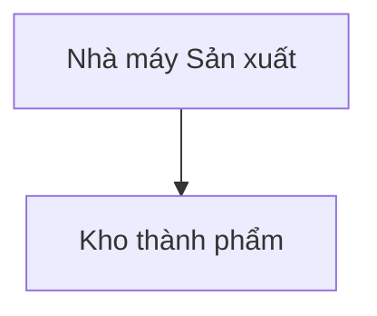

```
%% SAI — Node ID có dấu tiếng Việt → lỗi render
graph TD
    NhàMáy["Nhà máy"] --> Kho["Kho"]
```

**Node ID chỉ dùng:** `[A-Z, a-z, 0-9, _]`
**Text hiển thị:** Trong `[" "]` có thể dùng tiếng Việt đầy đủ dấu.

### 4.2.2. Mỗi diagram phải có tiêu đề và ghi chú nguồn

```markdown
### Sơ đồ X.Y: [Mô tả]

` ` `mermaid
graph TD
    ...
` ` `

*Nguồn: Thiết kế V3, 2026*
```

### 4.2.3. Giới hạn

- Tối đa **15 node** trong 1 diagram (quá nhiều → tách 2)
- Tối đa **5 mermaid block** trong 1 file (quá nhiều → chậm render)
- KHÔNG dùng icon/emoji trong Mermaid
- KHÔNG dùng HTML trong Mermaid

## 4.3. Mẫu Mermaid Chuẩn cho V3

### Mẫu 1: Flowchart — Hệ sinh thái 2 Trụ cột

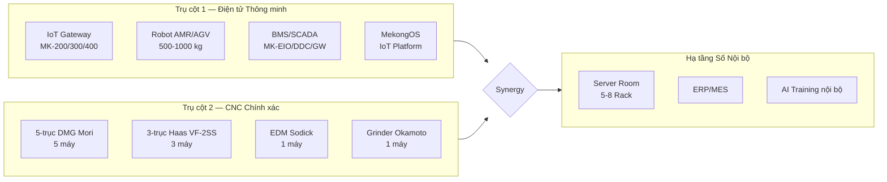

### Mẫu 2: Gantt — Phân kỳ 4 Phase

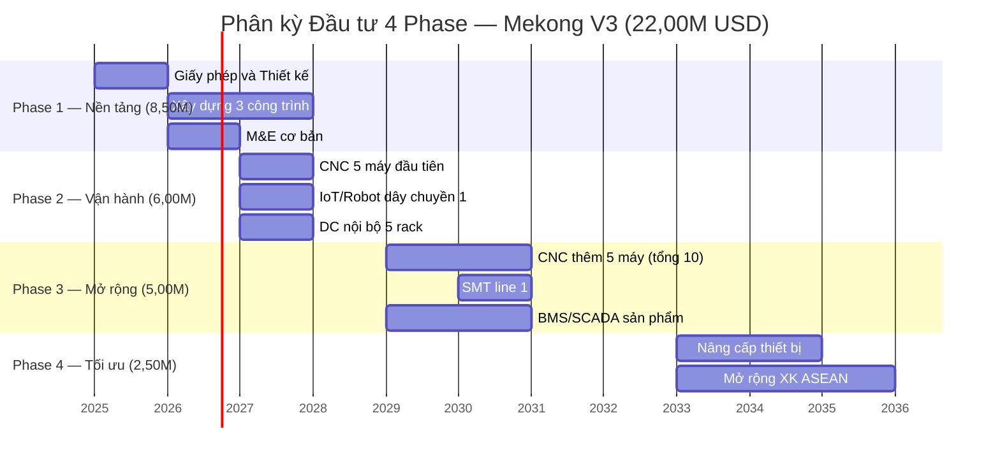

### Mẫu 3: Pie — Phân bổ CAPEX

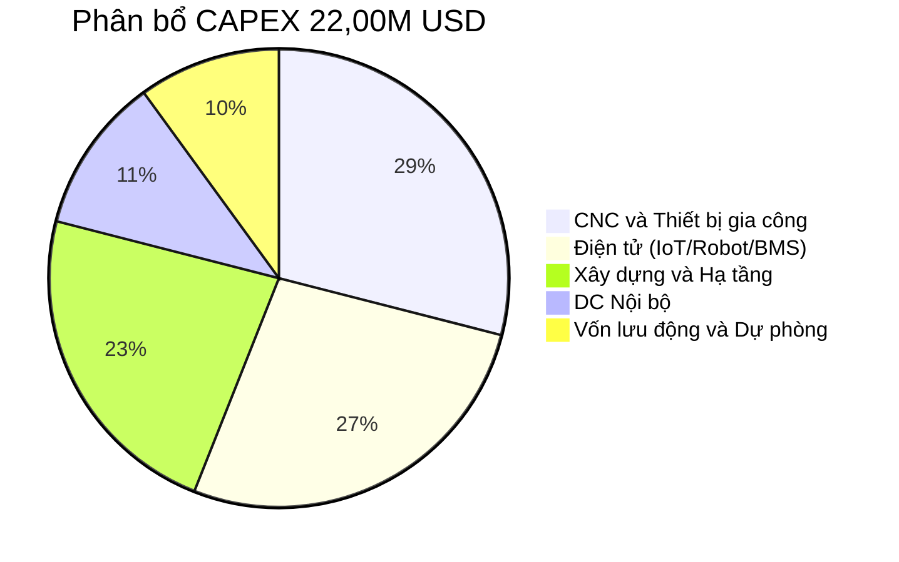

### Mẫu 4: Mindmap — Sản phẩm V3

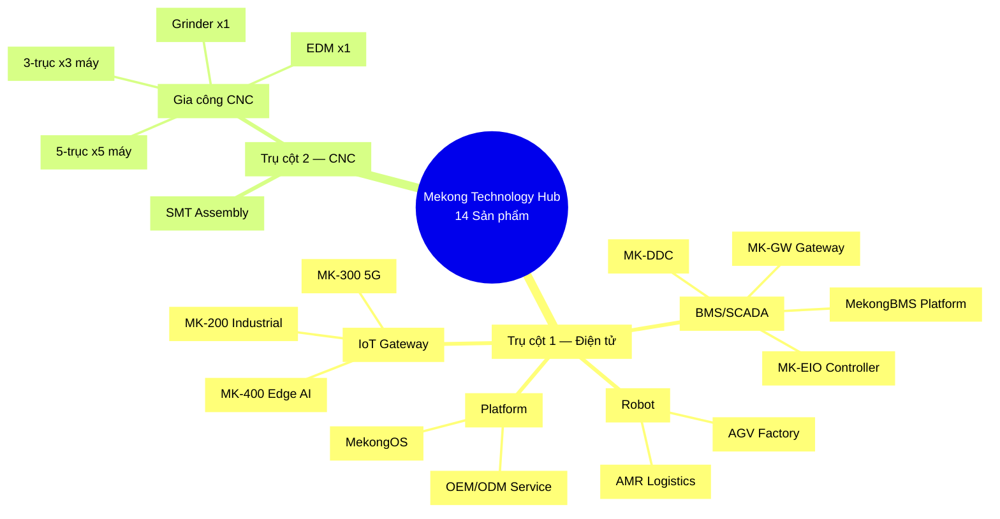

### Mẫu 5: Graph — Layout 3 Công trình

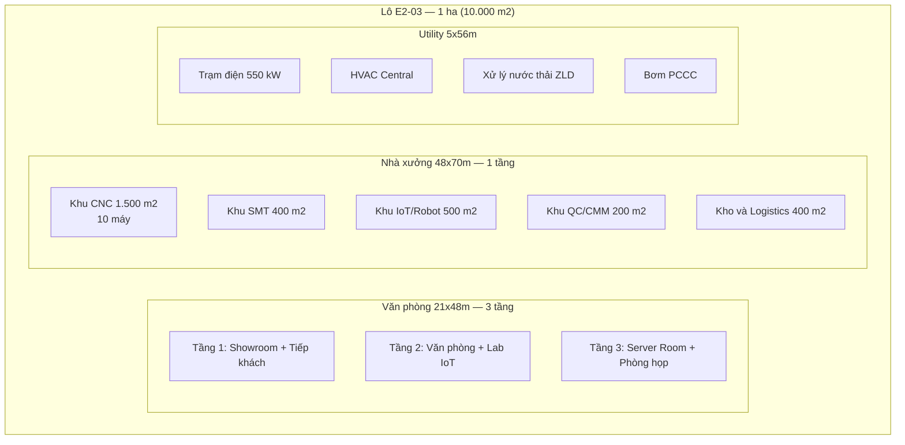

### Mẫu 6: Flowchart — Quy trình Giấy phép

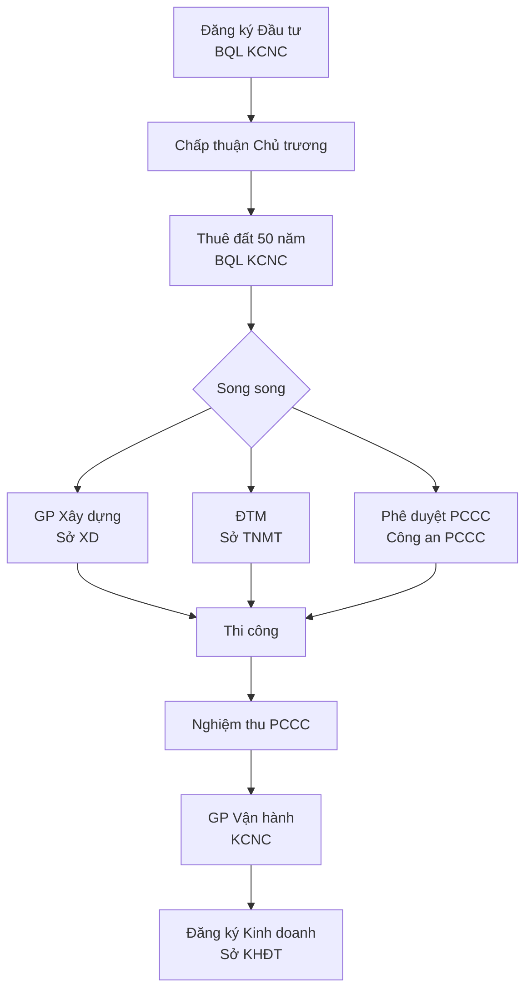

---
---

# 5. QUY TẮC SỐ LIỆU VÀ ĐƠN VỊ

## 5.1. Định dạng Số

| Loại | Đúng | Sai |
|---|---|---|
| Tiền (triệu USD) | 22,00M USD | 22.00M USD / $22M |
| Tiền (nghìn USD) | 150,0K USD | 150K$ |
| Diện tích | 10.000 m2 | 10000 m2 / 1 ha |
| Tỷ lệ | 73,6% | 73.6% |
| Công suất | 550 kW | 550kW |
| Đơn giá | 85 USD/m2/tháng | $85/sqm |

**Quy tắc:**
- Dấu phẩy thập phân kiểu Việt: `22,00` (KHÔNG dùng `22.00`)
- Dấu chấm ngăn cách hàng nghìn: `10.000` (KHÔNG dùng `10,000`)
- LUÔN ghi đơn vị sau số: USD, m2, kW, MW, kWh, kg, tấn

## 5.2. Nhãn Dữ liệu

| Nhãn | Ý nghĩa | Ví dụ |
|---|---|---|
| **[C]** | Calculated — tính từ công thức | NPV = 1,50M USD [C] |
| **[B]** | Benchmarked — tham chiếu thị trường | CAGR IoT VN = 25% [B] |
| **[A]** | Assumed — giả định | Tỷ lệ tồn kho = 5% doanh thu [A] |

Áp dụng cho TẤT CẢ số liệu trong các file tài chính và kỹ thuật.

## 5.3. 20 Số liệu Cố định

> Tham chiếu canonical: `SO_LIEU_CO_DINH_V3.md`

| # | Chỉ tiêu | Giá trị |
|:---:|---|---|
| 1 | CAPEX tổng | 22,00M USD |
| 2 | Vốn CSH | 18,00M USD (81,8%) |
| 3 | Nợ vay | 4,00M USD @ 8,5%/năm |
| 4 | NPV (50Y, WACC 12%) | 1,50M USD |
| 5 | IRR (50Y) | 13,0% |
| 6 | WACC | 12,0% |
| 7 | Doanh thu Y10 | 11,00M USD |
| 8 | Doanh thu Y15 | 12,00M USD |
| 9 | Revenue 15Y tích lũy | ~105M USD |
| 10 | Giá trị Chiến lược | 7,00M USD |
| 11 | P(NPV>0) Monte Carlo | 62% |
| 12 | Diện tích | 10.000 m2 (1 ha) |
| 13 | Máy CNC | 10 máy |
| 14 | Nhân sự ổn định | 100-130 người |
| 15 | DC Rack | 5-8 rack |
| 16 | CAPEX DC | 2,50M USD (11,4%) |
| 17 | Sản phẩm | 14 sản phẩm |
| 18 | Số công trình | 3 công trình riêng biệt |
| 19 | Phân kỳ | 4 Phase / 15 năm |
| 20 | Thời hạn | 50 năm (2025-2075) |

---
---

# 6. QUY TẮC NGÔN NGỮ

## 6.1. Phong cách

- Tiếng Việt **trang trọng**, phong cách văn bản trình cơ quan nhà nước
- KHÔNG văn nói, tiếng lóng, viết tắt không chính thức
- Câu văn đầy đủ chủ — vị
- **TUYỆT ĐỐI KHÔNG EMOJI** trong bất kỳ file nội dung nào

## 6.2. Thuật ngữ Chuẩn

| Chuẩn | Không dùng |
|---|---|
| Công ty TNHH Mekong Technology | Mekong, cty, CTY |
| Khu Công nghệ cao TP.HCM | KCNC, khu CNC |
| Datacenter nội bộ | DC, trung tâm dữ liệu |
| Gia công chính xác CNC | gia công cơ khí |
| Internet vạn vật (IoT) | IoT (không giải thích lần đầu) |
| Hệ thống Quản lý Tòa nhà (BMS) | BMS (không giải thích lần đầu) |
| Robot Tự hành (AMR/AGV) | robot, xe tự động |

## 6.3. Viết tắt Được phép (sau khi giải thích lần đầu)

CAPEX, OPEX, NPV, IRR, WACC, DSCR, P&L, IoT, BMS, SCADA, CNC, ERP, MES, BU, DC, SMT, PCCC, EIA, DTM, BVMT, KCNC

---
---

# 7. HEADER VÀ FOOTER MỖI FILE

## 7.1. Header bắt buộc (dòng 1-10)

```markdown
# [TÊN PHẦN VIẾT HOA]

> **Đề án:** Mekong Technology Hub — Phương án V3 (22,00M USD)
> **Địa điểm:** Lô E2-03, Đường D1, Khu Công nghệ cao TP.HCM
> **Phiên bản:** V3-DRAFT
> **Agent phụ trách:** [Tên Agent]
> **Ngày tạo:** [YYYY-MM-DD]
> **Trạng thái:** DRAFT | REVIEW | APPROVED

---
```

## 7.2. Footer bắt buộc (3 dòng cuối)

```markdown
---

*Phiên bản: V3-DRAFT | Agent: [Tên] | Cập nhật: [YYYY-MM-DD]*
*Đề án Mekong Technology Hub V3 (22,00M USD) | Tham chiếu: SO_LIEU_CO_DINH_V3.md*
```

## 7.3. Page Break cho PDF

```markdown
<div style="page-break-after: always;"></div>
```

Đặt cuối mỗi Section lớn (H2) trong file > 500 dòng.

---
---

# 8. TIÊU CHÍ NGHIỆM THU THEO PHASE

## 8.1. Sơ đồ Nghiệm thu

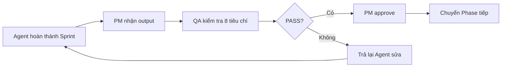

## 8.2. Phase A — Nền tảng

| # | Tiêu chí | Ngưỡng PASS | Kiểm tra |
|:---:|---|---|---|
| A1 | File đúng tên, đúng folder | 100% | `ls` folder |
| A2 | Header + Footer đúng format | 100% | Review |
| A3 | Không nội dung DC thương mại | 0 kết quả | `grep "GPU-aaS\|colocation\|Tier III"` |
| A4 | 20 số cố định khớp | 100% | grep SO_LIEU_CO_DINH |
| A5 | Dòng output >= 60% input | >= 60% | `wc -l` |
| A6 | 0 emoji | 0 | grep emoji |
| A7 | Mermaid render đúng | 100% | Preview |
| A8 | Tiếng Việt trang trọng | 100% | Review |

## 8.3. Phase B — Hạ tầng + Tài chính

| # | Tiêu chí | Ngưỡng PASS | Kiểm tra |
|:---:|---|---|---|
| B1-B8 | Kế thừa Phase A | PASS | |
| B9 | Cross-ref số liệu TC vs Hạ tầng | Nhất quán | grep |
| B10 | CNC = 10 máy mọi vị trí | Khớp | grep |
| B11 | CAPEX = 22,00M mọi vị trí | Khớp | grep |
| B12 | Mermaid Gantt 4 phase đúng | Correct | Preview |

## 8.4. Phase C — Phụ lục

| # | Tiêu chí | Ngưỡng PASS | Kiểm tra |
|:---:|---|---|---|
| C1-C12 | Kế thừa Phase A + B | PASS | |
| C13 | Mỗi phụ lục có trong mục lục | 100% | Cross-check |
| C14 | Phụ lục S → DC nội bộ (không thương mại) | Đúng | Review |
| C15 | Tổng dòng phụ lục >= 5.000 | >= 5.000 | wc -l |

## 8.5. Phase D — Tổng hợp

| # | Tiêu chí | Ngưỡng PASS | Kiểm tra |
|:---:|---|---|---|
| D1 | 23/23 file nội dung tồn tại | 23 | ls |
| D2 | Tổng dòng >= 10.000 | >= 10.000 | wc -l |
| D3 | Mục lục khớp heading | 100% | Cross-check |
| D4 | Final QC 15 hạng mục PASS | 15/15 | Checklist |

---
---

# 9. TIÊU CHÍ NGHIỆM THU THEO AGENT

## 9.1. Sơ đồ Phân công

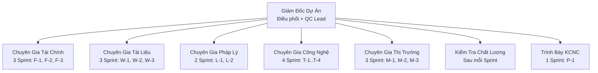

## 9.2. Agent 2: Chuyên Gia Tài Chính

| # | Tiêu chí | Chi tiết |
|:---:|---|---|
| F1 | Nhãn [C]/[B]/[A] cho mọi số | 100% |
| F2 | Công thức ghi rõ | NPV = sum(CF_t/(1+r)^t) |
| F3 | 20 số cố định khớp | grep |
| F4 | Dấu phẩy thập phân Việt | 22,00M |
| F5 | Mermaid pie chart CAPEX | Tối thiểu 1 |
| F6 | P&L và CF cân bằng | Kiểm tra công thức |

## 9.3. Agent 3: Chuyên Gia Tài Liệu

| # | Tiêu chí | Chi tiết |
|:---:|---|---|
| W1 | Header/Footer đúng format | Mỗi file |
| W2 | Heading không nhảy cấp | H1 > H2 > H3 |
| W3 | Mục lục khớp nội dung | 01_MUC_LUC phản ánh đúng |
| W4 | 0 emoji | grep |
| W5 | Tiếng Việt trang trọng | Review |

## 9.4. Agent 4: Chuyên Gia Pháp Lý

| # | Tiêu chí | Chi tiết |
|:---:|---|---|
| L1 | Mọi luật có số hiệu + năm | Luật CNC 21/2008/QH12 |
| L2 | Không GP Viễn thông | grep → 0 |
| L3 | EIA không DC thương mại | grep → 0 |
| L4 | Giấy phép có trạng thái | Đã có / Đang xin / Chưa xin |
| L5 | Mermaid flowchart GP | Tối thiểu 1 |

## 9.5. Agent 5: Chuyên Gia Công Nghệ

| # | Tiêu chí | Chi tiết |
|:---:|---|---|
| T1 | Thông số KT chính xác | Trích datasheet |
| T2 | CNC = 10 máy nhất quán | 5x5-trục + 3x3-trục + EDM + Grinder |
| T3 | BMS có 4 module | MK-EIO, MK-DDC, MK-GW, MekongBMS |
| T4 | Layout 3 CT chi tiết | VP 21x48, Xưởng 48x70, Utility 5x56 |
| T5 | DC nội bộ = 5-8 rack | Không 50 rack |
| T6 | Mermaid flowchart SX | Tối thiểu 2 (IoT + CNC) |

## 9.6. Agent 6: Chuyên Gia Thị Trường

| # | Tiêu chí | Chi tiết |
|:---:|---|---|
| M1 | Dữ liệu TT có nhãn [B] + nguồn | Báo cáo, năm |
| M2 | Không TT DC thương mại | grep → 0 |
| M3 | Đối thủ cạnh tranh cụ thể | 3-5 đối thủ |
| M4 | Mô hình DT 2 BU | Không BU3 DC |
| M5 | Mermaid kênh phân phối | Tối thiểu 1 |

---
---

# 10. QUY TẮC CROSS-REFERENCE GIỮA CÁC FILE

## 10.1. Cách tham chiếu

```markdown
> Tham chiếu: Xem chi tiết tại [PHAN_V_TAI_CHINH.md](PHAN_V_TAI_CHINH.md), Mục 5.3
```

- Dùng **relative link** (không absolute path)
- Ghi rõ **tên file VÀ mục** (section number)
- KHÔNG copy nội dung từ file khác, chỉ tham chiếu

## 10.2. 6 Vùng Nguy hiểm

| # | Vùng | File liên quan | Số liệu cần khớp |
|:---:|---|---|---|
| 1 | CAPEX tổng | PHAN_V, PHU_LUC_A, TOM_TAT, PHAN_VIII | 22,00M USD |
| 2 | DT per BU | PHAN_V, PHAN_III, PHU_LUC_G, PHU_LUC_P | IoT 70% + CNC 30% |
| 3 | Số máy CNC | PHAN_II, PHAN_IV, PHU_LUC_D, PHU_LUC_Q | 10 máy |
| 4 | Layout | PHAN_IV, PHAN_II, PHU_LUC_D | 3 công trình |
| 5 | Nhân sự | PHAN_VII, TOM_TAT, PHAN_V | 100-130 người |
| 6 | DC nội bộ | PHAN_II, PHAN_IV, PHU_LUC_D | 5-8 rack, 2,50M |

## 10.3. Thứ tự Merge cho PDF/DOCX

```mermaid
graph LR
    A["00_TRANG_BIA"] --> B["01_MUC_LUC"]
    B --> C["02_TOM_TAT"]
    C --> D["03_CO_SO_PHAP_LY"]
    D --> E["PHAN_I"]
    E --> F["PHAN_II"]
    F --> G["PHAN_III"]
    G --> H["PHAN_IV"]
    H --> I["PHAN_V"]
    I --> J["PHAN_VI"]
    J --> K["PHAN_VII"]
    K --> L["PHAN_VIII"]
    L --> M["PHAN_IX"]
    M --> N["10 file PHU_LUC<br/>theo thứ tự A→KHÁC"]
```

---

*Phiên bản: V3-DRAFT | Tác giả: Giám Đốc Dự Án | Cập nhật: 2026-03-16*
*Đề án Mekong Technology Hub V3 (22,00M USD) | Tham chiếu: KE_HOACH_V3_IMPLEMENTATION.md*
