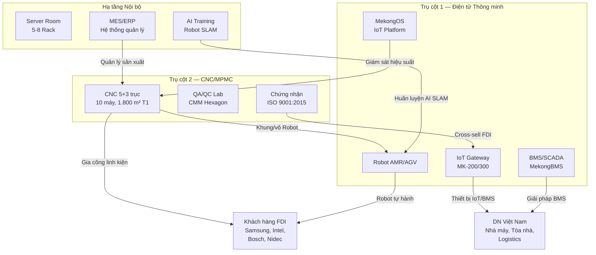
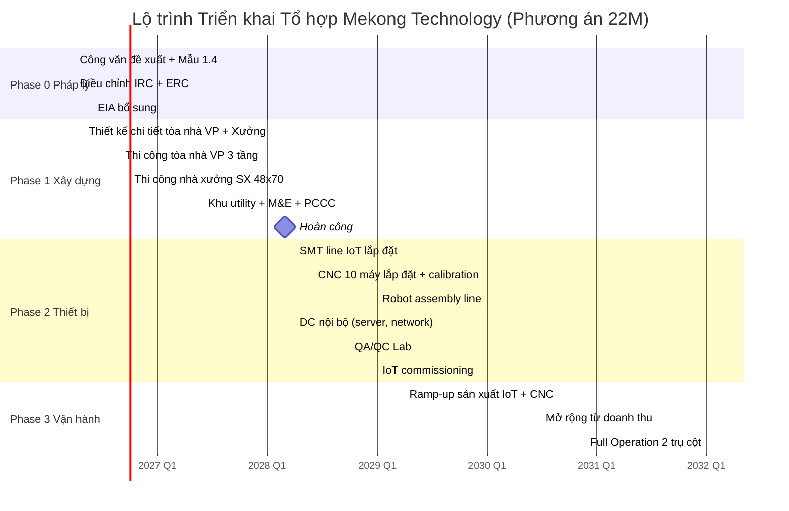

# TÓM TẮT ĐIỀU HÀNH

---

## Giới thiệu

Công ty TNHH Mekong Technology kính trình Ban Quản lý Khu Công nghệ cao TP.HCM phương án đầu tư **Tổ hợp Sản xuất Điện tử và Chế tạo Cơ khí Chính xác** với tổng vốn **22.000.000 USD**, tập trung vào 2 trụ cột kinh doanh chính:

1. **Trụ cột 1 — Sản phẩm Điện tử Thông minh (IoT/BMS/Robot):** Nghiên cứu, sản xuất thiết bị IoT Gateway, hệ thống BMS/SCADA, Robot tự hành AMR/AGV phục vụ chuyển đổi số doanh nghiệp sản xuất. Đây là trụ cột **doanh thu chính** (70% doanh thu dự kiến).

2. **Trụ cột 2 — Chế tạo Cơ khí Chính xác (CNC/MPMC):** Xây dựng xưởng CNC 10 máy (5x5-trục + 3x3-trục + EDM + Grinder) đạt chuẩn ISO 9001:2015, chuyên gia công khung Robot nội bộ và linh kiện chính xác cho khách hàng FDI — trụ cột **sản xuất cốt lõi** (30% doanh thu).

**Về hạ tầng số (Datacenter):** Theo đề xuất của Ban Quản lý KCNC, thành phần DC của dự án **chỉ phục vụ nội bộ** (hệ thống ERP, MES, AI training cho Robot, lưu trữ dữ liệu), **KHÔNG kinh doanh thương mại** dịch vụ Datacenter, để đảm bảo không xung đột lợi ích với các nhà cung cấp DC hiện hữu tại KCNC (CMC Telecom, FPT Telecom). Tỷ trọng CAPEX cho DC nội bộ: **2,20M USD (10,0%)** — nằm trong giới hạn 10-15% theo khuyến nghị của BQL.

---

## Sơ đồ Hệ sinh thái Tích hợp

---

## Tóm tắt Tài chính

### Cơ cấu Vốn Đầu tư (CAPEX = 22,00M USD)

| Hạng mục | CAPEX (M USD) | Tỷ trọng | Giai đoạn |
|---|---:|:---:|---|
| Pháp lý + Thiết kế + San lấp | 1,50 | 6,8% | Phase 0 |
| Xây dựng (VP 3T + Xưởng SX **2T** + Utility **2T** + M&E + PCCC + Solar 200 kWp + EDGE) | 8,45 | 38,4% | Phase 1 |
| Thiết bị IoT/SMT | 2,50 | 11,4% | Phase 2 |
| Thiết bị CNC (10 máy) | 3,50 | 15,9% | Phase 2 |
| Robot Assembly Line | 0,50 | 2,3% | Phase 2 |
| Hạ tầng DC nội bộ (**200 m²** T2, 5-8 rack) | 2,20 | 10,0% | Phase 2 |
| QA/QC Lab + Phần mềm | 1,00 | 4,5% | Phase 2 |
| Vốn lưu động vận hành | 1,85 | 8,4% | Phase 3 |
| Dự phòng rủi ro (~2,7% CAPEX — tái phân bổ cho T2) | 0,60 | 2,7% | Phase 3 |
| **Tổng** | **22,00** | **100%** | |

> **Kiểm tra tỷ trọng DC:** Hạ tầng DC nội bộ = 2,20M / 22,00M = **10,0%** — nằm trong giới hạn 10-15% theo đề xuất BQL KCNC [C]. Xây dựng 2 tầng (xưởng + utility) = 3,90M (17,7% CAPEX). Dự phòng giảm từ 1,35M → 0,60M do tái phân bổ cho T2.

### Cấu trúc Vốn

| Nguồn vốn | Giá trị (M USD) | Tỷ trọng | Điều kiện | Thời điểm |
|---|---:|:---:|---|---|
| **Vốn chủ sở hữu (CSH)** | 18,00 | 81,8% | Tự chủ 100% giai đoạn xây dựng + lắp đặt | Y0-Y5 |
| **Vay ngân hàng** | 4,00 | 18,2% | Lãi suất 8,5%/năm, kỳ hạn 10 năm, ân hạn 2 năm | Từ Y7 |
| **Tổng CAPEX** | **22,00** | **100%** | WACC = 12% [C] | |

### Chỉ số Thẩm định

| Chỉ số | Conservative | Base Case | Optimistic |
|---|---:|---:|---:|
| NPV 50Y (M USD) | 0,50 | 1,50 | 3,00 |
| IRR 50Y | 12,5% | 13,0% | 14,5% |
| Xác suất xảy ra | 30% | 50% | 20% |
| **NPV trọng số** | | **1,35** | |

> *[C] NPV trọng số = 30% x 0,50 + 50% x 1,50 + 20% x 3,00 = 0,15 + 0,75 + 0,60 = **1,50M USD**.*

| Chỉ số Bổ sung | Giá trị | Nhãn |
|---|---:|:---:|
| Payback (chiết khấu) | 10 năm | [C] |
| DSCR min (vay từ Y7) | 1,50x | [C] |
| Revenue 15 năm tích lũy | ~140M USD | [C] |
| EBITDA steady-state (Y12+) | ~30% | [C] |
| Giá trị Chiến lược (Adjusted) | 7,00M USD | [C] |

### Phân bổ Giá trị Chiến lược

| Thành phần | Giá trị (M USD) | Phương pháp |
|---|---:|---|
| NPV tài chính (Base Case 50Y) | 1,50 | DCF, WACC 12% |
| Tax + Land Rent Exemption | 2,00 | NPV ưu đãi thuế + miễn đất, chiết khấu 12% |
| Real Options Value | 1,00 | Quyền mở rộng CNC + nâng cấp IoT line |
| Synergy Value (CNC-Robot-IoT) | 1,50 | DCF incremental: CNC làm khung Robot + IoT giám sát CNC |
| Platform Value | 1,00 | EBITDA multiple: Đa trụ cột = 8-10x vs Đơn trụ = 5-7x |
| **Tổng Giá trị Chiến lược** | **7,00** | [C] |

---

## Tiến độ Tổng thể

---

## Nhân sự Tổng thể

| Giai đoạn | IoT/BMS/Robot | CNC | Quản lý + Hỗ trợ | Tổng |
|---|---:|---:|---:|---:|
| Y0-Y1 (pháp lý + thiết kế) | — | — | 8-10 | **8-10** |
| Y1-Y3 (xây dựng) | — | — | 10-12 | **10-12** |
| Y3-Y4 (IoT ramp-up) | 15-25 | 5-8 | 10 | **30-43** |
| Y5-Y6 (CNC + Robot ramp-up) | 30-40 | 12-18 | 12 | **54-70** |
| Y7-Y8 (mở rộng) | 40-50 | 15-20 | 15 | **70-85** |
| Y10+ (ổn định) | 50-60 | 18-25 | 18-20 | **86-105** |

> **Giả định nhân sự:** Quy mô tinh gọn nhỏ CNC chỉ 10 máy (ISO 9001), không có đội ngũ DC thương mại. Tổng nhân sự ổn định 100-130 người (bao gồm công nhân thời vụ và part-time) [A].

---

## Snapshot Điều kiện Phê duyệt và Kiểm soát Thực thi

| Nhóm điều kiện | Nội dung chốt |
|---|---|
| Pháp lý | Bám Mẫu 1.4, NĐ 31/2021, NĐ 10/2024; DC chỉ nội bộ, không cần GP viễn thông |
| Tài chính | CAPEX 22,00M USD [C], CSH 81,8% [C], vay chỉ từ Y7 khi có doanh thu |
| Công nghệ | 2 trụ cột rõ ràng: Điện tử thông minh + CNC 10 máy [C] |
| Môi trường / ESG | Net Zero 2045, Solar 200 kWp [C], EDGE, ZLD CNC |
| Quản trị triển khai | PMO, decision gate, covenant tài chính, milestone theo phase |

> **Thông điệp điều hành:** V3 không theo hướng “đầu tư lớn để bao phủ nhiều mảng”, mà theo hướng **đầu tư đủ sâu vào 2 năng lực cốt lõi**, giảm rủi ro pháp lý, tăng tính khả thi vận hành và vẫn giữ dư địa tăng trưởng dài hạn cho Mekong Technology.

---

## Cơ hội Thị trường Tổng hợp

| Phân khúc | Quy mô VN (2025) | CAGR | Mekong Target (Y12) | Thị phần mục tiêu |
|---|---|---:|---:|---:|
| BMS/SCADA tòa nhà thương mại | ~200M USD | 18-22% | 1,15M USD | 0,3-0,5% |
| IoT công nghiệp (IIoT) | ~150M USD | 25-30% | 2,00M USD | 0,5-1,0% |
| Robot AMR/AGV (nội địa + FDI) | ~80M USD | 30-35% | 2,40M USD | 1,5-2,0% |
| Gia công CNC precision (FDI tại VN) | ~500M USD | 12-15% | 3,40M USD | 0,5-0,7% |
| SaaS IoT/BMS Platform | ~50M USD | 35-40% | 1,05M USD | 1,0-1,5% |

> Tổng thị trường khả dụng ~980M USD (2025), dự kiến tăng lên 2.500-3.000M USD (2030). Mekong chỉ cần chiếm 0,3-2% tuỳ phân khúc để đạt doanh thu 12,00M USD/năm — mục tiêu thận trọng và khả thi [A][B].

---

## Sản phẩm Chủ lực — Tóm tắt

| TT | Sản phẩm | Trụ cột | ASP (USD) | DT Steady (M USD) | Biên gộp | Trạng thái |
|:---:|---|:---:|---:|---:|---:|---|
| 1 | IoT Gateway MK-200 | BU1 | 350-450 | 1,50 | 48-51% | Sản phẩm chủ lực, time-to-market nhanh |
| 2 | IoT Gateway MK-300 (5G AI) | BU1 | 650-850 | 0,50 | 39-42% | Flagship AI Edge cho Smart Factory |
| 3 | Robot AMR-500 | BU1 | 20.500 | 1,80 | ~47% | Synergy CNC khung cơ khí |
| 4 | MekongBMS License + SaaS | BU1 | 5K-15K | 0,75 | 80-90% | Margin cao nhất hệ sinh thái |
| 5 | OEM/ODM Điện tử | BU1 | Theo BOM | 1,10 | 25-35% | Tối ưu công suất SMT |
| 6 | Khung Robot + FDI Parts (CNC) | BU2 | 50-1.000 | 2,20 | 42-55% | Backbone doanh thu CNC |
| 7 | Jig/Fixture CNC | BU2 | 150-800 | 0,40 | 50-60% | Biên cao, niche ít cạnh tranh |
| 8 | CNC Outsource (giờ máy) | BU2 | 55-95/giờ | 0,80 | 35-45% | Tận dụng công suất dư |

> 8 nhóm sản phẩm trên chiếm 77% doanh thu steady-state (9,05M / 12,00M). 6 nhóm còn lại (DDC, EIO, GW, AGV, SCADA, MekongOS) đóng góp 23% nhưng quan trọng cho tính hoàn chỉnh hệ sinh thái [C].

---

## Mốc Quyết định Chính (Decision Gates)

| Mốc | Thời điểm | Điều kiện qua cổng | Rủi ro nếu không đạt |
|---|---|---|---|
| **Gate 0: Phê duyệt đầu tư** | Q2/2026 | BQL KCNC chấp thuận, IRC/ERC điều chỉnh | Delay toàn bộ dự án |
| **Gate 1: Khởi công xây dựng** | Q3/2026 | Giấy phép xây dựng, thiết kế chi tiết hoàn tất | Trượt tiến độ Phase 1 |
| **Gate 2: Hoàn công nhà xưởng** | Q1/2028 | Nghiệm thu xây dựng, PCCC pass, EDGE pre-assessment | Delay lắp máy |
| **Gate 3: CNC + SMT commissioning** | Q1/2029 | 10 máy CNC chạy, SMT line đạt yield ≥ 92% | Delay doanh thu Y4 |
| **Gate 4: First Revenue** | Q2/2029 | ≥ 3 PO CNC ký, ≥ 5 KH IoT pilot | Ramp-up chậm |
| **Gate 5: Breakeven** | Q2/2031 | Doanh thu ≥ 5,09M (Cash BEP) | Cần tái cấu trúc chi phí |
| **Gate 6: Steady-state** | 2035+ | Doanh thu ≥ 12M, EBITDA ≥ 30% | Xem lại target |

---

## Rủi ro Chính và Giảm thiểu

| TT | Rủi ro | Mức | Giảm thiểu |
|:---:|---|:---:|---|
| 1 | Doanh thu ramp-up chậm hơn kế hoạch | Cao | Pipeline CNC + IoT sẵn có, penetration pricing Y4-Y5 |
| 2 | CAPEX phát sinh vượt dự toán | Trung bình | Quỹ dự phòng 1,35M (6,1%), value engineering |
| 3 | Cạnh tranh giá từ sản phẩm Trung Quốc | Trung bình | Tập trung giá trị tích hợp + hậu mãi + localization |
| 4 | Chip shortage / gián đoạn chuỗi cung ứng | Trung bình | Dual-source AVL, safety stock 3 tháng |
| 5 | Key person risk (nhân sự R&D chủ chốt) | Trung bình | Cross-training, equity incentive, documentation culture |
| 6 | Thay đổi chính sách ưu đãi KCNC | Thấp | Chốt IRC/ERC trước khi có thay đổi, đa dạng ưu đãi |

> Monte Carlo simulation (10.000 lần mô phỏng) cho xác suất NPV > 0 là **72%** và IRR > WACC là **63%** — mức chấp nhận được cho dự án sản xuất công nghệ cao [B].

---
## Cam kết Chính của Chủ đầu tư

1. Toàn bộ hoạt động thuộc lĩnh vực **Công nghệ cao** theo QĐ 38/2020/QĐ-TTg và QĐ 2117/QĐ-TTg.
2. Tỷ lệ giá trị gia tăng trên doanh thu (VA/Revenue) duy trì lớn hơn hoặc bằng 42% cho toàn dự án.
3. Tỷ lệ chi phí R&D trên doanh thu duy trì lớn hơn hoặc bằng 5% (mục tiêu 8-10%).
4. Thực hiện đầy đủ Đánh giá Tác động Môi trường (ĐTM) bổ sung.
5. Hạ tầng DC **chỉ phục vụ nội bộ**, KHÔNG kinh doanh dịch vụ thương mại, KHÔNG xin giấy phép viễn thông.
6. Cam kết Zero Liquid Discharge (ZLD) cho nước thải công nghiệp CNC.
7. Cam kết tổng vốn đầu tư KHÔNG VƯỢT QUÁ 22.000.000 USD.
8. Đảm bảo tiến độ giải ngân vốn theo đúng phân kỳ Phase 0-3.
9. Tuân thủ mọi quy định của Quy chế hoạt động KCNC TP.HCM, bao gồm Nghị định 10/2024/NĐ-CP (Điều 28-31) về hoạt động công nghệ cao.
10. Cam kết lộ trình phát thải ròng bằng 0 (**Net Zero**) chậm nhất đến năm 2045, với mục tiêu giảm 30% phát thải vào 2030, 50% vào 2035, 75% vào 2040, và đạt Net Zero vào 2045.
11. Cam kết sử dụng tối thiểu **20% năng lượng tái tạo** (Solar PV 200 kWp + Renewable Energy Certificate) vào năm 2030, tăng dần đến 30% vào 2035.
12. Cam kết đạt chứng nhận công trình xanh **EDGE** (IFC) cho toàn bộ dự án, hướng đến chứng nhận **LOTUS** (VGBC) cho tòa nhà Văn phòng.
13. Thực hiện nộp hồ sơ đầu tư trên **Cổng dịch vụ công Quốc gia** (dichvucong.gov.vn) với chữ ký số hợp lệ theo quy định.
