# PHẦN II: SẢN PHẨM VÀ CÔNG NGHỆ

---

## 2.1. Tổng quan Hệ sinh thái Sản phẩm

### 2.1.1. Cấu trúc 2 Trụ cột Sản phẩm + Datacenter Nội bộ

Mekong Technology vận hành mô hình sản xuất–dịch vụ tích hợp dựa trên **2 Trụ cột kinh doanh chính** và **1 hạ tầng Datacenter nội bộ** phục vụ toàn bộ hệ sinh thái:

| Trụ cột | Tên | Chức năng | Tỷ trọng DT (Y12+) |
|:---:|---|---|---:|
| **BU1** | Điện tử Thông minh (IoT/BMS/Robot) | Thiết kế, sản xuất IoT Gateway, BMS Controller, Robot AMR/AGV | 70,8% |
| **BU2** | Chế tạo Cơ khí Siêu Chính xác (CNC/MPMC) | Gia công khung robot, linh kiện FDI, jig/fixture | 29,2% |
| **Hỗ trợ** | Datacenter Nội bộ | Hosting MekongOS, AI training, ERP, lưu trữ dữ liệu | (chi phí nội bộ) |

> **Khác biệt so với Phương án V2 (32M USD):** V2 có 3 trụ cột bao gồm Datacenter thương mại Tier III 50 rack (CAPEX ~12M USD). V3 loại bỏ hoàn toàn dịch vụ DC thương mại, chuyển sang DC nội bộ 5-8 rack (CAPEX 2,50M USD — 11,4% tổng đầu tư) nhằm giảm rủi ro cấp phép viễn thông và tập trung nguồn lực vào 2 trụ cột sản xuất cốt lõi [C].

### 2.1.2. Danh mục Sản phẩm Tổng hợp

| TT | Nhóm sản phẩm | Trụ cột | Doanh thu Y12+ (M USD) | Nhãn |
|:---:|---|:---:|---:|:---:|
| 1 | IoT Gateway MK-200/MK-300 | BU1 | 2,00 | [C] |
| 2 | I/O Modules MK-EIO (5 loại) | BU1 | 0,50 | [C] |
| 3 | DDC Controllers MK-DDC | BU1 | 0,40 | [C] |
| 4 | Gateway chuyên dụng MK-GW (4 loại) | BU1 | 0,24 | [C] |
| 5 | Phần mềm MekongBMS License + SaaS | BU1 | 0,75 | [C] |
| 6 | Dịch vụ BMS/SCADA | BU1 | 0,40 | [C] |
| 7 | Robot AMR (tự hành) | BU1 | 1,80 | [C] |
| 8 | Robot AGV (dẫn đường) | BU1 | 0,60 | [C] |
| 9 | MekongOS IoT Platform (SaaS) | BU1 | 0,30 | [C] |
| 10 | OEM/ODM Điện tử | BU1 | 1,10 | [C] |
| 11 | Khung Robot AMR/AGV (CNC) | BU2 | 0,70 | [C] |
| 12 | Linh kiện chính xác FDI | BU2 | 1,50 | [C] |
| 13 | Jig/Fixture | BU2 | 0,40 | [C] |
| 14 | CNC outsource (giờ máy) | BU2 | 0,80 | [C] |
| 15 | Chi tiết cơ khí khác | BU2 | 0,10 | [C] |
| | **Tổng** | | **11,59** | |

> Doanh thu thiết kế 11,59M USD từ 15 dòng sản phẩm. Doanh thu thực tế steady-state đạt 12,00M USD/năm khi tính tăng trưởng đơn hàng và điều chỉnh giá [C].

### 2.1.3. Sơ đồ Tổ chức Sản xuất

Hệ thống sản xuất bố trí trong 3 công trình riêng biệt trên lô đất 1 ha:

| Khu vực | Công trình | Diện tích sàn | GFA | Hoạt động chính |
|---|---|---:|---:|---|
| Sản xuất CNC/QA | Nhà xưởng **T1** (8 m) | ~2.050 m² | 2.050 m² | 10 máy CNC 1.800 m², QA/QC 250 m² |
| Sản xuất IoT/Robot | Nhà xưởng **T2** (5 m) | ~2.060 m² | 2.060 m² | SMT 1.000, Robot 600, DC 200, Kho ĐT 300 |
| DC Nội bộ | Nhà xưởng **T2** (5 m) | **200 m²** | 200 m² | Server room, UPS, cooling |
| R&D Lab | Tòa VP (tầng 2) | ~500 m² | 500 m² | 4 phòng lab chuyên dụng |
| Văn phòng | Tòa VP (tầng 1-3) | ~2.500 m² | 2.500 m² | Điều hành, đào tạo, showroom |
| Utility T1+T2 | Khu utility **2 tầng** | 560 m² | 560 m² | Điện (đặc biệt T1), nước, xử lý chất thải |
| **Tổng** | | | **~7.870 m²** | |

> GFA toàn khu: **10.304 m²** (bao gồm hành lang, cầu thang T1+T2, vệ sinh). Footprint xây dựng: 4.648 m² (mật độ 46,5%). Nhà xưởng 2 tầng tăng GFA 54,6% trong cùng footprint [C].

---

## 2.2. Trụ cột 1 — Điện tử Thông minh (IoT/BMS/Robot)

### 2.2.1. Hệ sinh thái 21 Sản phẩm — 5 Tầng

BU1 xây dựng hệ sinh thái sản phẩm IoT/BMS/Robot hoàn chỉnh gồm 21 sản phẩm chia thành 5 tầng:

| Tầng | Chức năng | Sản phẩm | Số lượng |
|:---:|---|---|:---:|
| **Tầng 1 — Kết nối** | Thu thập dữ liệu từ hiện trường | MK-200, MK-300, MK-EIO (5 loại) | 7 |
| **Tầng 2 — Điều khiển** | Xử lý logic tự động hóa | MK-DDC-24, MK-DDC-64 | 2 |
| **Tầng 3 — Tích hợp** | Kết nối giao thức khác nhau | MK-GW-BAC, MK-GW-MOD, MK-GW-KNX, MK-GW-DALI | 4 |
| **Tầng 4 — Phần mềm** | Quản lý và phân tích dữ liệu | MekongBMS, MekongSCADA, MekongET, MekongOS | 4 |
| **Tầng 5 — Robot** | Tự động hóa vận chuyển | AMR-500, AMR-1000, AGV-500, AGV-1000 | 4 |
| | **Tổng** | | **21** |

### 2.2.2. IoT Gateway — MK-200 và MK-300

#### A. MK-200 IoT Industrial Gateway

MK-200 là sản phẩm cốt lõi (flagship) của hệ sinh thái — gateway IoT công nghiệp đa giao thức, thu thập dữ liệu từ cảm biến và thiết bị hiện trường, xử lý tại edge và truyền lên MekongOS Cloud.

| Thông số | Giá trị |
|---|---|
| **CPU** | NXP i.MX8M Quad Cortex-A53, 1,5 GHz |
| **RAM** | 2 GB LPDDR4 |
| **Lưu trữ** | 16 GB eMMC + microSD (tối đa 128 GB) |
| **Kết nối không dây** | WiFi 6 (802.11ax), BLE 5.2, 4G LTE Cat4 (option), LoRa (option) |
| **Kết nối có dây** | 2× Ethernet 10/100/1000, 4× RS485 Modbus, 2× RS232 |
| **I/O tích hợp** | 4× DI 24V, 2× DO relay 5A, 2× AI 4-20mA, 1× USB 2.0 Host |
| **Giao thức** | MQTT 5.0, Modbus RTU/TCP, BACnet MS/TP, OPC UA Client, HTTP/REST |
| **Bảo mật** | TLS 1.3, X.509 certificate, Secure Boot, TPM 2.0 |
| **AI Edge** | TensorFlow Lite, ~2 TOPS (NPU tích hợp) — phát hiện bất thường, predictive |
| **Hệ điều hành** | MekongOS Runtime (Linux-based), OTA update |
| **Nguồn** | 12-48V DC (industrial), tiêu thụ < 8W |
| **Môi trường** | -20°C đến +70°C, IP54, rung IEC 60068-2-6 |
| **Kích thước** | 160 × 100 × 45 mm, DIN rail mount |
| **Chứng nhận** | CE, FCC (mục tiêu) |
| **Giá bán** | 350-450 USD (tùy cấu hình) [C] |
| **Giá vốn (COGS)** | 190 USD [C] |
| **Biên gộp** | 48-51% [C] |

#### B. MK-300 IoT 5G AI Gateway

MK-300 là phiên bản nâng cấp cao cấp, tích hợp 5G và AI Edge mạnh hơn, phục vụ khách hàng yêu cầu xử lý thời gian thực:

| Thông số | Giá trị |
|---|---|
| **CPU** | NVIDIA Jetson Orin Nano, 40 TOPS AI |
| **RAM** | 8 GB LPDDR5 |
| **Lưu trữ** | 64 GB eMMC + NVMe SSD slot |
| **Kết nối** | 5G Sub-6 GHz, WiFi 6E, BLE 5.3, 2× GbE, 6× RS485 |
| **AI** | 40 TOPS (Jetson Orin) — Computer Vision, Digital Twin edge processing |
| **Giá bán** | 650-850 USD [C] |
| **Biên gộp** | 50-53% [C] |

#### C. Quy trình Sản xuất IoT Gateway (SMT)

Dây chuyền sản xuất SMT (Surface Mount Technology) bố trí trong nhà xưởng, công suất 50.000 board/năm:

1. **Nạp linh kiện** → 2. **In kem hàn (Stencil Printer)** → 3. **Gắn linh kiện SMT (Pick & Place)** → 4. **Hàn reflow (Reflow Oven)** → 5. **Kiểm tra AOI (Automated Optical Inspection)** → 6. **Hàn linh kiện THT** → 7. **Test ICT (In-Circuit Test)** → 8. **Flash firmware + Calibration** → 9. **Burn-in 72 giờ** → 10. **Functional Test + QC** → 11. **Đóng vỏ + Đóng gói** → 12. **Xuất kho**

Thời gian chu kỳ: ~3,5 phút/board (SMT) + 2 phút (assembly) = **5,5 phút/sản phẩm** [C].

### 2.2.3. Module I/O — MK-EIO (5 loại)

Dòng MK-EIO (Expansion I/O) là module I/O mở rộng, kết nối với MK-DDC controller qua RS485 bus, thu thập tín hiệu từ cảm biến và điều khiển thiết bị hiện trường:

| Module | Chức năng | Kênh | Bus | Giá bán (USD) | Giá vốn (USD) | Nhãn |
|---|---|:---:|---|---:|---:|:---:|
| MK-EIO-DI16 | 16 Digital Input, 24V DC | 16 | RS485 Modbus | 120-150 | 45-55 | [C] |
| MK-EIO-DO16 | 16 Digital Output, relay 5A | 16 | RS485 Modbus | 130-160 | 50-60 | [C] |
| MK-EIO-AI8 | 8 Analog Input, 4-20mA / 0-10V, ADC 16-bit | 8 | RS485 Modbus | 180-220 | 70-85 | [C] |
| MK-EIO-AO4 | 4 Analog Output, 4-20mA / 0-10V, DAC 16-bit | 4 | RS485 Modbus | 160-200 | 65-80 | [C] |
| MK-EIO-UI8 | 8 Universal Input (DI/AI tự cấu hình) | 8 | RS485 Modbus | 200-240 | 80-95 | [C] |

> Tất cả module dùng MCU STM32F4, thiết kế trên nền tảng PCB chung, giảm chi phí R&D và sản xuất. Doanh thu dòng EIO ổn định: 0,50M USD/năm [C].

### 2.2.4. DDC Controller — MK-DDC

DDC (Direct Digital Controller) là bộ điều khiển trung tâm cho hệ thống BMS tòa nhà, thực thi logic điều khiển HVAC, chiếu sáng, và giám sát năng lượng:

| Thông số | MK-DDC-24 | MK-DDC-64 |
|---|---|---|
| **Số điểm I/O** | 24 (có thể mở rộng đến 48 qua EIO) | 64 (có thể mở rộng đến 128 qua EIO) |
| **I/O tích hợp** | 8 UI + 4 AO + 4 DO + 8 DI | 16 UI + 8 AO + 8 DO + 16 DI + 8 AI + 8 DI dự phòng |
| **CPU** | STM32F4, 168 MHz | NXP i.MX8M (dùng lại platform MK-200) |
| **Giao thức** | BACnet MS/TP, Modbus RTU | BACnet IP, BACnet MS/TP, Modbus TCP/RTU, OPC UA |
| **Lập trình** | IEC 61131-3 FBD (MekongET) | IEC 61131-3 FBD + ST (MekongET) |
| **Web UI** | Có (embedded web server) | Có (HTML5 dashboard) |
| **Giá bán** | 400-500 USD | 800-1.200 USD |
| **Đối thủ** | Schneider SCD, Siemens PXC | Honeywell WEB-8000, Tridium JACE |
| **Nhãn** | [C] | [C] |

> MK-DDC-64 tái sử dụng 60-70% nền tảng phần cứng MK-200, giảm đáng kể chi phí R&D. Doanh thu dòng DDC ổn định: 0,40M USD/năm [C].

### 2.2.5. Gateway Chuyên dụng — MK-GW (4 loại)

MK-GW là gateway chuyển đổi giao thức, kết nối thiết bị bên thứ ba (Siemens, Honeywell, Schneider) vào hệ sinh thái MekongBMS:

| Gateway | Chức năng | Giá bán (USD) | Port | Nhãn |
|---|---|---:|---|:---:|
| MK-GW-BAC | BACnet MS/TP ↔ BACnet IP | 300-400 | 4× RS485 + 1× Ethernet | [C] |
| MK-GW-MOD | Modbus RTU ↔ Modbus TCP ↔ BACnet | 280-380 | 4× RS485 + 1× Ethernet | [C] |
| MK-GW-KNX | KNX TP ↔ BACnet IP | 350-450 | 1× KNX TP + 1× Ethernet | [C] |
| MK-GW-DALI | DALI-2 ↔ BACnet IP | 320-420 | 2× DALI bus + 1× Ethernet | [C] |

> Tất cả gateway dựa trên MK-200 lite (giảm I/O, thêm RS485 ports). Doanh thu dòng GW ổn định: 0,24M USD/năm [C].

### 2.2.6. Phần mềm — MekongBMS, MekongSCADA, MekongET

#### A. MekongBMS — Hệ thống Quản lý Tòa nhà

| Thông số | Giá trị |
|---|---|
| **Kiến trúc** | Web-based (HTML5), client-server, chạy trên DC nội bộ |
| **Giao thức hỗ trợ** | BACnet IP/MS/TP, Modbus TCP/RTU, OPC UA, MQTT, KNX, DALI |
| **Số điểm quản lý** | Tối đa 10.000 điểm/instance |
| **Chức năng** | HVAC control, Lighting, Energy management, Alarm, Trend, Scheduling |
| **AI tích hợp** | Predictive maintenance, Energy optimization, Anomaly detection |
| **Ứng dụng** | Tòa nhà thương mại, nhà máy, bệnh viện, khách sạn |
| **Giá license** | 5.000-15.000 USD/building (tùy quy mô) |
| **SaaS** | 500-2.000 USD/tháng (hosting trên DC nội bộ Mekong) |
| **Đối thủ** | Schneider EcoStruxure, Siemens Desigo CC, Honeywell Niagara |
| **Định vị** | Phân khúc tầm trung — giá thấp hơn 40-60% so với đối thủ quốc tế |

#### B. MekongSCADA — Hệ thống Giám sát Công nghiệp

| Thông số | Giá trị |
|---|---|
| **Kiến trúc** | Web-based, tái sử dụng 60% codebase MekongBMS |
| **Ứng dụng** | Nhà máy sản xuất, trạm điện, trạm bơm, hệ thống xử lý nước |
| **Chức năng** | Real-time monitoring, Historian, Report, Alarm, PLC integration |
| **Giao thức** | OPC UA, Modbus, EtherCAT, PROFINET, S7 Comm |
| **Giá license** | 3.000-10.000 USD/hệ thống |
| **Thời điểm** | Phát triển từ Y8, sau khi MekongBMS ổn định |

#### C. MekongET — Engineering Tool

| Tính năng | Mô tả |
|---|---|
| **Device Discovery** | Tự động tìm DDC và I/O trên mạng RS485/IP |
| **Logic Programming** | Function Block Diagram (FBD) + Structured Text (ST) theo IEC 61131-3 |
| **Commissioning** | Override output, force input, trend real-time |
| **Firmware Update** | OTA qua Ethernet/WiFi hoặc USB |
| **Giá** | Miễn phí (đi kèm mỗi DDC controller) |

> Chiến lược: MekongET miễn phí để giảm rào cản sử dụng — tương tự Schneider EcoStruxure Machine Expert Basic. Đối thủ thu phí 500-2.000 USD cho engineering tool [A].

### 2.2.7. Robot AMR — Tự hành Thông minh

#### A. AMR-500 và AMR-1000

| Thông số | AMR-500 | AMR-1000 |
|---|---|---|
| **Tải trọng** | 500 kg | 1.000 kg |
| **Navigation** | LiDAR 3D 360° + Camera AI + IMU + Odometry | LiDAR 3D 360° + Camera AI + IMU + UWB Anchor |
| **Thuật toán** | AI SLAM — huấn luyện trên GPU trong DC nội bộ | AI SLAM + Deep Reinforcement Learning |
| **Tốc độ** | 0-1,5 m/s | 0-1,2 m/s |
| **Độ chính xác** | ±10 mm | ±10 mm |
| **Truyền thông** | WiFi 6 + BLE 5.2, REST API, ROS2 | WiFi 6 + BLE 5.3 + 5G, REST API, ROS2 |
| **Pin** | LiFePO4 48V/60Ah, hoạt động 8 giờ | LiFePO4 48V/100Ah, hoạt động 6 giờ |
| **An toàn** | LiDAR safety scanner (ISO 13849 PLd), Emergency stop | Dual LiDAR safety, ISO 13849 PLe |
| **Giá bán** | 18.000-25.000 USD | 28.000-38.000 USD |
| **Biên gộp** | 40-46% [C] | 40-46% [C] |

#### B. Quy trình Sản xuất Robot AMR

1. **Thiết kế cơ khí (CAD/CAM):** SolidWorks/Mastercam → Mô phỏng FEM → Xuất toolpath CNC
2. **Chế tạo khung (CNC tại xưởng MPMC):** Phay CNC khung nhôm 6061-T6 → Anodizing → QC CMM
3. **Lắp ráp PCB (SMT line):** Board điều khiển + Board sensor + Board power management
4. **Lắp ráp tổng:** Khung + Motor + LiDAR + Camera + Pin + PCB + Vỏ ngoài
5. **Huấn luyện AI (GPU tại DC nội bộ):** AI SLAM → Sim-to-Real transfer → Calibration
6. **Kiểm tra:** Accuracy + Battery cycle + EMC + Drop test + 72h burn-in

> Robot AMR minh chứng giá trị tích hợp 2 trụ cột: khung CNC từ MPMC, PCB từ SMT line, AI training từ DC nội bộ, giám sát qua MekongOS [C].

#### C. Robot AGV — Dẫn đường Tự động

| Thông số | AGV-500 | AGV-1000 |
|---|---|---|
| **Tải trọng** | 500 kg | 1.000 kg |
| **Navigation** | Vision-based + Magnetic tape (backup) | Vision + LiDAR 2D + Magnetic tape |
| **Tốc độ** | 0-1,0 m/s | 0-0,8 m/s |
| **Giá bán** | 12.000-18.000 USD | 20.000-28.000 USD |
| **Ưu điểm** | Chi phí thấp, dễ triển khai | Tải nặng, phù hợp heavy industry |

Công suất sản xuất Robot AGV: 100 bộ/năm (1 ca) [C].

### 2.2.8. MekongOS — Nền tảng IoT Cloud

MekongOS là nền tảng phần mềm IoT Cloud chạy trên DC nội bộ, cung cấp dịch vụ SaaS quản lý IoT và Robot:

**Kiến trúc 4 tầng:**

| Tầng | Thành phần | Công nghệ |
|---|---|---|
| **Tầng Thiết bị** | MK-200/300, AMR/AGV, cảm biến bên thứ 3 | Hardware + Firmware |
| **Tầng Kết nối** | MQTT Broker, OPC UA, Modbus Gateway, API Gateway | EMQX, REST/gRPC |
| **Tầng Xử lý** | Stream Processing, AI/ML Engine, Data Lake | Kafka, TensorFlow, MinIO |
| **Tầng Ứng dụng** | Dashboard, AI Predict, Fleet Manager, Report | Web + Mobile |

**Mô hình SaaS:**

| Gói | Mô tả | Giá/tháng | Thiết bị tối đa |
|---|---|---:|---:|
| Starter | Dashboard cơ bản, lưu trữ 30 ngày | 99 USD | 10 |
| Professional | Dashboard tùy chỉnh, AI alert, 90 ngày | 299 USD | 50 |
| Enterprise | Full AI, Digital Twin, SLA 99,9%, 1 năm | 999 USD | 500 |
| Custom | Theo yêu cầu, on-premise option | Thương lượng | Không giới hạn |

> MekongOS chạy trên DC nội bộ — latency < 1ms đến khách hàng trong KCNC, chi phí hosting thấp hơn 50% so với AWS/GCP [A].

### 2.2.9. OEM/ODM Điện tử — Dòng Sản phẩm Gia công Theo Yêu cầu

Ngoài sản phẩm mang nhãn Mekong, BU1 cung cấp dịch vụ OEM/ODM cho khách hàng FDI và doanh nghiệp nội địa cần thuê ngoài thiết kế hoặc sản xuất board điện tử:

#### A. Phân biệt OEM và ODM

| Mô hình | Phạm vi Mekong | Trách nhiệm KH | Biên lợi nhuận |
|---|---|---|:---:|
| **ODM (thiết kế + sản xuất)** | Thiết kế sơ đồ nguyên lý, layout PCB, firmware, mua NVL, sản xuất, QC | Đặc tả yêu cầu, thương hiệu, phân phối | 35-45% |
| **OEM (sản xuất theo bản vẽ)** | Nhận Gerber + BOM + firmware, mua NVL, SMT + lắp ráp + QC | Thiết kế, IP, phân phối | 20-28% |
| **CKD (lắp ráp từ kit)** | Nhận kit phụ kiện, lắp ráp + test + đóng gói | Thiết kế, NVL chính, IP | 15-20% |

#### B. Năng lực OEM/ODM

| Thông số | Giá trị |
|---|---|
| Năng lực SMT | 50.000 board/năm (1 ca), mở rộng 80.000 (2 ca) |
| PCB tối đa | 12 lớp, chiều rộng trace 4 mil, BGA 0,5 mm pitch |
| Thành phần tối thiểu | 0201 (0,6 × 0,3 mm), QFP, BGA, CSP |
| Kiểm tra | AOI 3D, ICT, Functional Test, Programming |
| Chứng nhận | ISO 9001:2015, IPC-A-610 Class 2/Class 3 |
| Lead time NPI | 4-6 tuần (bao gồm DFM review) |
| Lead time sản xuất | 2-3 tuần sau NPI pass |
| MOQ | 100 board/lần |

#### C. Quy trình OEM/ODM

1. **RFQ + NDA** → 2. **DFM/DFA Review** (khuyến nghị tối ưu thiết kế cho sản xuất) → 3. **BOM Sourcing** (AVL quản lý, component cross-check) → 4. **EVT (Engineering Validation Test)** — 5-10 mẫu → 5. **DVT (Design Validation Test)** — 50-100 mẫu → 6. **PVT (Production Validation Test)** — 200-500 mẫu → 7. **Mass Production** + QC report theo lô → 8. **Giao hàng + Support warranty**

> Doanh thu OEM/ODM ổn định: 1,10M USD/năm. Đây là dòng doanh thu chiến lược — thu hút FDI vào KCNC đồng thời tăng hệ số sử dụng dây chuyền SMT. Biên lợi nhuận gộp trung bình 25-35% [C].

#### D. Khách hàng Mục tiêu OEM/ODM

| Phân khúc | Ví dụ sản phẩm | Nhu cầu | SL/năm ước tính |
|---|---|---|---:|
| Startup IoT Việt Nam | Smart meter, cảm biến, gateway | Không có SMT line riêng | 5.000-15.000 |
| FDI Electronics (Samsung, LG, Nidec) | Board phụ kiện, test fixture | Thuê ngoài non-core board | 8.000-20.000 |
| Tự động hóa công nghiệp | PLC board, HMI board, driver | Cần NPI nhanh | 3.000-8.000 |
| Thiết bị y tế | Board giám sát bệnh nhân | Cần ISO 13485 (Y8+) | 1.000-3.000 |

### 2.2.10. Sơ đồ Quy trình Sản xuất Tổng thể — BU1

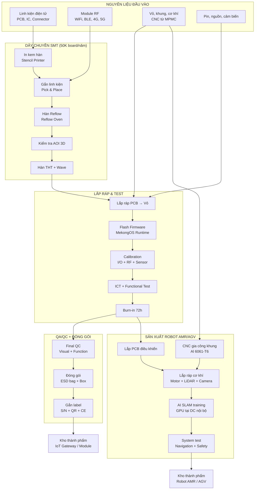

> Quy trình trên áp dụng cho toàn bộ sản phẩm BU1: IoT Gateway (MK-200, MK-300), Module I/O (MK-EIO), DDC Controller (MK-DDC), Gateway (MK-GW), và Robot (AMR/AGV). Tổng công suất: 50.000 board + 400 robot/năm [C].

### 2.2.11. Dây chuyền SMT — Chi tiết Thiết bị

| TT | Thiết bị | Hãng | SL | Đ/giá (K USD) | Tổng (K USD) | Chức năng |
|:---:|---|---|:---:|---:|---:|---|
| 1 | Stencil Printer | DEK/MPM | 1 | 80 | 80 | In kem hàn lên PCB |
| 2 | Pick & Place (high-speed) | Yamaha/Juki | 1 | 250 | 250 | Gắn linh kiện SMD, 30.000 cph |
| 3 | Pick & Place (fine-pitch) | Yamaha/Juki | 1 | 180 | 180 | Gắn BGA, QFP, 0201 |
| 4 | Reflow Oven (10 zone) | Heller/BTU | 1 | 120 | 120 | Hàn reflow, profile Pb-free |
| 5 | AOI 3D | Koh Young/Mirtec | 1 | 150 | 150 | Kiểm tra tự động sau hàn |
| 6 | Wave Solder | ERSA/Pillarhouse | 1 | 60 | 60 | Hàn THT, selective solder |
| 7 | ICT Fixture + Tester | Keysight/SPEA | 1 | 80 | 80 | In-Circuit Test |
| 8 | Functional Tester | Custom Mekong | 2 | 30 | 60 | Test chức năng sản phẩm |
| 9 | Burn-in Chamber | Espec | 1 | 40 | 40 | Aging 72h, -20°C đến +70°C |
| 10 | Loader/Unloader + Conveyor | Nutek/Simplimatic | 1 | 30 | 30 | Tự động hóa dây chuyền |
| | **Tổng SMT Line** | | | | **1.050** | |

> CAPEX SMT line = 1,05M USD, nằm trong Phase 2 (Y3-Y5). Throughput: 8 giờ/ca × 250 ngày = 27.000 board/ca/năm. Với 2 ca đạt 50.000+ board/năm [C].

---

## 2.3. Trụ cột 2 — Chế tạo Cơ khí Siêu Chính xác (CNC/MPMC)

### 2.3.1. Tổng quan Năng lực Sản xuất

Trung tâm Chế tạo Linh kiện Chính xác (Mekong Precision Manufacturing Center — MPMC) là xưởng CNC tại Nhà xưởng Sản xuất, chuyên gia công khung robot AMR/AGV nội bộ và linh kiện chính xác cho khách hàng FDI, đạt chuẩn ISO 9001:2015.

| Thông số | Giá trị V3 | Ghi chú |
|---|---|---|
| **Diện tích** | ~1.000 m² (khu CNC + QC Corner) | Tầng 1 Nhà xưởng |
| **Số máy CNC** | **10 máy** | 5×5-trục + 3×3-trục + 1×EDM + 1×Grinder |
| **Dung sai đạt được** | ≤ 5 micromet (5-trục) | [B] |
| **Độ bóng bề mặt** | Ra ≤ 0,4 micromet | [B] |
| **Vật liệu** | Nhôm 6061-T6, thép hợp kim, inox SUS304, titan, inconel, đồng | |
| **Công suất** | 4.000-5.000 chi tiết/năm (ổn định) | [C] |
| **Chứng nhận** | ISO 9001:2015 (sẵn có). IATF/AS9100 là option Y10+ | |
| **Nhân sự** | 15-20 người (2 ca) | |

> **Khác biệt V3 vs V2:** Nâng từ 6 máy lên 10 máy (thêm 2×5-trục Doosan, 1×3-trục, 1×Wire EDM, 1×Surface Grinder) nhằm mở rộng năng lực gia công và tự chủ quy trình xử lý bề mặt [C].

### 2.3.2. Danh mục Máy móc Chi tiết (10 máy)

| TT | Máy | Hãng | Loại | Đ/giá (K USD) | SL | Thành tiền (K USD) |
|:---:|---|---|:---:|---:|:---:|---:|
| 1 | DMU 65 monoBLOCK | DMG MORI (Đức/Nhật) | 5-trục | 520 | 2 | 1.040 |
| 2 | DVF 5000 | Doosan (Hàn Quốc) | 5-trục | 385 | 3 | 1.155 |
| 3 | DNM 6700 | Doosan (Hàn Quốc) | 3-trục VMC | 150 | 3 | 450 |
| 4 | Wire EDM | Sodick/Mitsubishi | EDM | 180 | 1 | 180 |
| 5 | Surface Grinder CNC | Okamoto/Chevalier | Mài phẳng | 120 | 1 | 120 |
| | **Tổng** | | | | **10** | **2.945** |

**Thiết bị QA/QC:**

| TT | Thiết bị | Hãng | Đ/giá (K USD) | SL | Thành tiền (K USD) |
|:---:|---|---|---:|:---:|---:|
| 1 | Portable CMM — Absolute Arm 7325 | Hexagon (Thụy Điển) | 250 | 1 | 250 |
| 2 | Máy đo nhám SJ-410 | Mitutoyo (Nhật) | 8 | 1 | 8 |
| 3 | Máy đo độ cứng HV-120D | Shimadzu (Nhật) | 6 | 1 | 6 |
| 4 | Height Gauge QM-600 | Mitutoyo | 12 | 1 | 12 |
| 5 | Dụng cụ đo tay (panme, thước cặp) | Mitutoyo | 10 | Bộ | 10 |
| | **Tổng QA/QC** | | | | **286** |

**Phần mềm CAD/CAM:**

| Phần mềm | Hãng | License | Chi phí/năm (K USD) |
|---|---|---:|---:|
| Mastercam (Mill 3D + 5-Axis) | CNC Software | 10 | 100-120 |
| SolidWorks Standard (viewer) | Dassault | 3 | 12-18 |
| **Tổng** | | | **112-138** |

**Tổng CAPEX CNC (máy + QC + phần mềm + fit-out + tooling):** ~3.800K USD [C].

### 2.3.3. Quy trình Gia công Tiêu biểu — ISO 9001:2015

1. **Nhận bản vẽ** từ khách hàng → 2. **Kiểm tra phôi** đầu vào (thước cặp, panme) → 3. **Lập trình CNC** trên Mastercam (5-trục/3-trục) → 4. **Gia công CNC** trên DMG MORI/Doosan → 5. **Kiểm tra QC** bằng Hexagon Arm (in-process) → 6. **Xử lý bề mặt** (EDM/mài/anodize nếu yêu cầu — xử lý tại chỗ với Wire EDM và Grinder) → 7. **Kiểm tra cuối** bằng Hexagon Arm + báo cáo đo → 8. **Đóng gói + Giao hàng**

**Thời gian chu kỳ (Lead time):**
- Chi tiết đơn giản (khung robot, bracket): 1-2 tuần
- Chi tiết chính xác (encoder mount, jig): 2-3 tuần
- Sản phẩm mới (NPI): 4-6 tuần (bao gồm thiết kế fixture + FAI)

### 2.3.4. Sản phẩm CNC theo Phân khúc

#### A. Khung Robot AMR/AGV (Nội bộ + Xuất khẩu)

| Sản phẩm | Vật liệu | Dung sai | SL/năm | Đơn giá (USD) |
|---|---|---:|---:|---:|
| Khung chính AMR (CNC 5 trục) | Al 6061-T6 | ≤ 5 µm | 500 | 400-700 |
| Khung AGV tải nặng | Thép S45C + Al | ≤ 10 µm | 200 | 600-1.000 |
| Bộ gá sensor (LiDAR mount) | Al 6061-T6 | ≤ 5 µm | 700 | 50-120 |

#### B. Linh kiện Chính xác cho FDI (Electronics/Semiconductor)

| Sản phẩm | Vật liệu | Dung sai | SL/năm | Đơn giá (USD) |
|---|---|---:|---:|---:|
| Encoder Bracket | Al 6061 / Inox | ≤ 5 µm | 400 | 80-200 |
| Motor Mount | Al 6061-T6 | ≤ 5 µm | 300 | 100-250 |
| Khớp xoay (Rotary Joint) | SUS304, đồng | ≤ 5 µm | 200 | 150-400 |

#### C. Jig/Fixture cho SMT và Lắp ráp

| Sản phẩm | Vật liệu | Dung sai | SL/năm | Đơn giá (USD) |
|---|---|---:|---:|---:|
| Pallet SMT | Al 6061-T6 | ≤ 10 µm | 300 | 200-500 |
| Fixture kiểm tra EOL | Al + nhựa kỹ thuật | ≤ 20 µm | 200 | 300-800 |
| Fixture lắp ráp | Al 6061 | ≤ 15 µm | 200 | 150-400 |

### 2.3.5. Công suất và Doanh thu CNC (10 máy)

| Chỉ tiêu | Y4 (khởi động) | Y6 | Y8 | Y10 (ổn định) | Y12+ |
|---|---:|---:|---:|---:|---:|
| **Số máy hoạt động** | 6 | 8 | 10 | 10 | 10 |
| **Ca sản xuất** | 1 ca | 1,5 ca | 2 ca | 2 ca | 2 ca |
| **Utilization target** | 40% | 55% | 70% | 80% | 85% |
| **OEE** | 50% | 60% | 70% | 75% | 78% |
| **Sản lượng (chi tiết/năm)** | ~1.500 | ~2.500 | ~3.500 | ~4.500 | ~5.000 |
| **Machine Hour Rate (USD)** | 45-85 | 48-88 | 50-90 | 55-95 | 55-95 |
| **Revenue target (M USD)** | 0,50 | 1,50 | 2,80 | 3,30 | 3,50 |

> OEE Y4 = 50% là thực tế cho nhà máy mới. Target OEE Y12 = 78% đòi hỏi chương trình TPM (Total Productive Maintenance) và đào tạo operator liên tục [B][C].

**Doanh thu CNC 5 năm — 3 Kịch bản (từ Y4):**

| Năm | Conservative (M USD) | Base Case (M USD) | Optimistic (M USD) |
|---:|---:|---:|---:|
| Y4 | 0,30 | 0,50 | 0,70 |
| Y5 | 0,80 | 1,00 | 1,30 |
| Y6 | 1,20 | 1,50 | 1,80 |
| Y7 | 1,60 | 2,00 | 2,40 |
| Y8 | 2,00 | 2,80 | 3,20 |
| **Tổng 5 năm** | **5,90** | **7,80** | **9,40** |

---

## 2.4. Datacenter Nội bộ

### 2.4.1. Chức năng và Quy mô

DC nội bộ phục vụ toàn bộ nhu cầu CNTT của Mekong Technology — **KHÔNG kinh doanh dịch vụ colocation hay cloud thương mại**, do đó không cần Giấy phép Viễn thông và không thuộc phạm vi điều chỉnh của Luật Viễn thông 2023.

| Thông số | Giá trị V3 | Ghi chú |
|---|---|---|
| **Diện tích** | **200 m²** (T2) | Nhà xưởng SX — Tầng 2 |
| **Số rack** | 5-8 rack 42U | [A] |
| **Công suất điện IT** | 30-50 kW | [A] |
| **Cooling** | Precision AC N+1, DX | |
| **UPS** | 1× 80 kVA, Li-ion 15 phút | |
| **Generator** | Dùng chung máy phát nhà xưởng | |
| **PUE mục tiêu** | < 1,50 | [A] |
| **Uptime mục tiêu** | 99,9% (Tier I+) | Đủ cho nội bộ |
| **CAPEX** | **2,20M USD (10,0% tổng)** | [C] |
| **OPEX/năm** | 0,40M USD | [C] |

### 2.4.2. Ứng dụng Chính

| TT | Ứng dụng | Rack | Tải (kW) | Mô tả |
|:---:|---|:---:|---:|---|
| 1 | MekongOS IoT Cloud | 2 | 8-12 | MQTT Broker, InfluxDB, Dashboard, API |
| 2 | AI/ML Training | 1-2 | 10-15 | NVIDIA GPU (A100/H100) cho SLAM, Predictive |
| 3 | ERP + MES + CRM | 1 | 3-5 | Hệ thống quản lý doanh nghiệp |
| 4 | Backup + DR | 1 | 3-5 | Sao lưu dữ liệu, disaster recovery |
| 5 | Network + Security | 0,5 | 2-3 | Firewall, VPN, Switch core |
| | **Tổng** | **5,5-7,5** | **26-40** | |

> DC nội bộ đủ công suất phục vụ 2 trụ cột sản xuất và MekongOS SaaS. Khi MekongOS scaling vượt 2.000 subscribers, có thể thuê thêm cloud public (AWS/GCP) như hybrid option mà không cần mở rộng DC vật lý [A].

---

## 2.5. Hệ sinh thái Tích hợp 2 Trụ cột

### 2.5.1. Ma trận Liên kết Giá trị

| Từ → Đến | IoT/BMS/Robot (BU1) | CNC/MPMC (BU2) | DC Nội bộ |
|---|---|---|---|
| **BU1 — IoT/Robot** | — | Bản vẽ CNC cho khung Robot | Dữ liệu IoT → Cloud Analytics |
| **BU2 — CNC** | Khung, vỏ, trục robot AMR | — | IoT giám sát hiệu suất CNC |
| **DC Nội bộ** | GPU cho AI SLAM training | Dữ liệu OEE cho tối ưu CNC | — |

### 2.5.2. Lượng hóa Giá trị Cộng hưởng (V3)

| Liên kết | Giá trị/năm (USD) | Phương pháp | Nhãn |
|---|---:|---|:---:|
| CNC chế tạo khung Robot (thay vì outsource) | 150.000-200.000 | Tiết kiệm 15-20% COGS khung | [A] |
| DC nội bộ cung cấp GPU cho AI SLAM | 100.000-200.000 | So sánh với thuê AWS | [A] |
| MekongOS hosting trên DC nội bộ | 80.000-150.000 | Chênh lệch cloud cost | [A] |
| Cross-sell FDI (CNC → IoT) | 200.000-500.000 | Revenue uplift KH chung | [A] |
| IoT giám sát CNC (tăng utilization) | 50.000-100.000 | 5-10% OEE improvement | [A] |
| **Tổng Synergy Value/năm** | **580.000-1.150.000** | | |
| **NPV Synergy 10 năm (WACC 12%)** | **~2.000.000** | | [C] |

> Synergy V3 thấp hơn V2 (~3M USD) do không có cross-sell DC thương mại, nhưng vẫn đủ lớn để biện minh cho mô hình tích hợp [C].

---

## 2.6. Lộ trình Trưởng thành Công nghệ (V3)

| Giai đoạn | Thời gian | Sản phẩm chính | Chứng nhận |
|---|---|---|---|
| **Nền tảng** | Y0-Y4 | MK-200 (TRL 9), CNC ISO 9001, MekongOS v1.0 | CE, FCC, ISO 9001 |
| **Tăng trưởng** | Y4-Y8 | AMR-500/1000, AGV, CNC mở rộng 10 máy, MekongOS v2.0 (AI) | BACnet BTL |
| **Trưởng thành** | Y8-Y12 | MK-DDC, MK-EIO sản xuất hàng loạt, MekongBMS v1.0, MekongSCADA | IATF option |
| **Dẫn đầu** | Y12+ | Xuất khẩu ASEAN, Digital Twin, MekongOS v3.0, CNC Hybrid | AS9100 option |

---

## 2.7. Hoạt động Nghiên cứu và Phát triển (R&D)

### 2.7.1. Ngân sách R&D

| Năm | Doanh thu (M USD) | R&D (M USD) | Tỷ lệ R&D/DT |
|---:|---:|---:|:---:|
| Y4 | 1,00 | 0,10 | 10% |
| Y5 | 3,00 | 0,30 | 10% |
| Y6 | 5,50 | 0,55 | 10% |
| Y7 | 7,00 | 0,56 | 8% |
| Y8 | 8,70 | 0,70 | 8% |
| **Tổng 5 năm (Y4-Y8)** | | **2,21** | **~9%** |
| **Tổng 10 năm (Y4-Y13)** | | **~6,00** | **~8%** |

> Cam kết tỷ lệ R&D ≥ 5% doanh thu — đáp ứng tiêu chí ưu đãi CNC [C].

### 2.7.2. Phòng Thí nghiệm R&D (4 Lab)

| TT | Phòng Lab | Diện tích | Chức năng | Đầu tư (K USD) |
|:---:|---|---:|---|---:|
| 1 | Lab Phần cứng IoT | 150 m² | Thiết kế PCB, prototyping, EMC pre-compliance | 250 |
| 2 | Lab AI & Robotics | 200 m² | AI SLAM, Computer Vision, ROS2 | 300 |
| 3 | Lab Vật liệu CNC | 80 m² | Phân tích kim loại, metallography | 150 |
| 4 | Lab Cloud & Cybersecurity | 70 m² | Dev/Test MekongOS, Pen testing | 100 |
| | **Tổng** | **500 m²** | | **800** |

> Lab bố trí tại Tầng 2 Tòa VP. Không có Lab Đo lường riêng — QC Corner tích hợp trong khu CNC [C].

### 2.7.3. Lộ trình R&D Sản phẩm BMS/SCADA

Toàn bộ R&D BMS/SCADA thực hiện từ Y6, sau khi đội ngũ IoT ổn định:

| TT | Sản phẩm | Thời gian | R&D Cost (K USD) | Nhân sự | Nhãn |
|:---:|---|---|---:|---:|:---:|
| 1 | MK-EIO-DI16 + DO16 | Q1-Q3/Y6 | 80 | 3 | [A] |
| 2 | MK-EIO-AI8 + AO4 + UI8 | Q2-Q4/Y6 | 100 | 4 | [A] |
| 3 | MK-DDC-24 | Q1/Y6-Q2/Y7 | 150 | 5 | [A] |
| 4 | MK-DDC-64 | Q3/Y6-Q4/Y7 | 120 | 4 | [A] |
| 5 | MK-GW-BAC + MOD | Q2-Q4/Y6 | 60 | 2 | [A] |
| 6 | MK-GW-KNX + DALI | Q1-Q3/Y7 | 80 | 3 | [A] |
| 7 | MekongBMS v1.0 | Q1/Y6-Q4/Y7 | 300 | 8-12 | [A] |
| 8 | MekongET v1.0 | Q3/Y6-Q2/Y7 | 100 | 3 | [A] |
| 9 | Chứng nhận CE + BACnet BTL | Q1-Q4/Y7 | 150 | 2 | [A] |
| 10 | MekongSCADA v1.0 | Q1-Q4/Y8 | 250 | 6 | [A] |
| | **Tổng R&D BMS/SCADA** | **3 năm (Y6-Y8)** | **1.390** | **Peak: 25** | |

> 1.390K USD chiếm ~23% tổng R&D 10 năm (6.000K). Hợp lý vì tái sử dụng 60-70% platform MK-200 và BACnet open-source stack [A].

### 2.7.4. Sở hữu Trí tuệ

| Loại | Mục tiêu 5 năm | Mục tiêu 10 năm |
|---|---:|---:|
| Bằng sáng chế | 6-8 | 15-20 |
| Nhãn hiệu | 4 | 6 |
| Bản quyền phần mềm | 3 | 5 |
| Bí mật kinh doanh | Liên tục | — |

### 2.7.5. Hợp tác Chuyển giao Công nghệ

| Đối tác | Quốc gia | Lĩnh vực | Nội dung |
|---|---|---|---|
| DMG MORI Academy | Nhật/Đức | CNC | Đào tạo vận hành 5 trục, tối ưu toolpath |
| Hexagon Manufacturing Intelligence | Thụy Điển | QA/QC | CMM programming, GD&T |
| NVIDIA Deep Learning Institute | Mỹ | AI/GPU | Certified AI Developer program |
| Đại học Bách Khoa TP.HCM | Việt Nam | R&D | Nghiên cứu Robot + AI |
| Đại học Quốc gia TP.HCM | Việt Nam | R&D | Đào tạo kỹ sư IoT/Embedded |

### 2.7.6. Kinh tế Đơn vị Sản phẩm (Unit Economics) — Nhóm chủ lực

Để bảo đảm cơ sở tài chính của từng dòng sản phẩm là khả thi, Mekong chuẩn hóa mô hình tính **Unit Economics** theo 5 lớp: BOM vật tư trực tiếp, gia công/lắp ráp, kiểm thử, overhead sản xuất và chi phí bảo hành dự phòng. Cách tiếp cận này phù hợp thực hành quản trị sản xuất điện tử theo **IPC-A-610**, **ISO 9001:2015** và benchmark EMS/ODM khu vực ASEAN [B].

#### A. BOM và biên gộp ước tính — MK-200

| Cấu phần | Giá trị (USD/bộ) | Tỷ trọng | Ghi chú |
|---|---:|---:|---|
| SoC / CPU NXP i.MX8M | 42 | 22,1% | Giá theo lot trung bình 1.000-3.000 pcs [B] |
| RAM + eMMC | 18 | 9,5% | LPDDR4 + eMMC industrial grade [B] |
| PCB 6 lớp + SMT assembly | 28 | 14,7% | Bao gồm stencil, AOI, ICT [A] |
| Module kết nối (WiFi/BLE/4G option) | 20 | 10,5% | Cấu hình base + option [A] |
| Nguồn / bảo vệ / EMC components | 16 | 8,4% | TVS, DC-DC, filter [A] |
| Vỏ nhôm / DIN rail / phụ kiện | 14 | 7,4% | Gia công vỏ theo chuẩn công nghiệp [A] |
| Cổng I/O, connector, terminal block | 12 | 6,3% | Phoenix/Weidmuller tương đương [B] |
| Flash firmware + calibration + burn-in | 11 | 5,8% | 72 giờ burn-in + test chức năng [A] |
| QA/QC + đóng gói | 9 | 4,7% | ICT + final QC + packaging [A] |
| Dự phòng bảo hành 12 tháng | 8 | 4,2% | Tỷ lệ warranty reserve ~2,0% ASP [A] |
| Overhead sản xuất phân bổ | 12 | 6,3% | Điện, gián tiếp, khấu hao line [A] |
| **Tổng COGS ước tính** | **190** | **100%** | Nhất quán với giá vốn [C] |

| Chỉ tiêu | Giá trị |
|---|---:|
| ASP trung bình | 390-420 USD [C] |
| COGS | 190 USD [C] |
| Gross profit / bộ | 200-230 USD |
| Biên gộp | 48-51% [C] |
| Payback R&D (ước tính) | ~7.000-8.500 bộ |

#### B. BOM và biên gộp ước tính — MK-300

| Cấu phần | Giá trị (USD/bộ) | Ghi chú |
|---|---:|---|
| Jetson Orin Nano module | 190 | Thành phần chi phí lớn nhất [B] |
| RAM + eMMC/NVMe | 55 | Cấu hình AI edge |
| PCB high-speed 8 lớp | 42 | Yêu cầu impedance control [A] |
| 5G + WiFi 6E module | 48 | Option thị trường FDI [A] |
| Thermal / heatsink / enclosure | 32 | Tản nhiệt chủ động |
| Cổng công nghiệp + nguồn | 26 | 6× RS485 + 2× GbE |
| Assembly + AI validation | 22 | Benchmark image/model test [A] |
| QA + burn-in + packaging | 18 | 48 giờ burn-in |
| Overhead + bảo hành reserve | 27 | |
| **Tổng COGS ước tính** | **460** | |

| Chỉ tiêu | Giá trị |
|---|---:|
| ASP trung bình | 760 USD [C] |
| COGS | 460 USD [A] |
| Biên gộp | ~39-42% |
| Vai trò chiến lược | Dòng flagship cho Smart Factory / AI Edge |

#### C. Kinh tế đơn vị — Robot AMR-500

| Cấu phần | Giá trị (USD/bộ) | Tỷ trọng |
|---|---:|---:|
| Khung cơ khí + CNC machining nội bộ | 2.800 | 26% |
| Motor, driver, gearbox | 1.650 | 15% |
| LiDAR safety + camera + IMU | 2.100 | 20% |
| PCB điều khiển + wiring harness | 1.150 | 11% |
| Pin LiFePO4 + BMS | 1.250 | 12% |
| Lắp ráp + calibration + test | 820 | 8% |
| Overhead + warranty reserve | 980 | 8% |
| **Tổng COGS ước tính** | **10.750** | **100%** |

| Chỉ tiêu | Giá trị |
|---|---:|
| ASP trung bình | 20.500 USD [C] |
| Gross profit / bộ | ~9.750 USD |
| Biên gộp | ~47,6% |
| Giá trị synergy BU2 | ~15-20% COGS khung tiết kiệm so với outsource [A] |

> **Nhận xét quản trị:** Dòng phần cứng có biên gộp 40-50% chỉ bền vững khi Mekong kiểm soát được 3 yếu tố: (1) BOM chuẩn hóa theo platform dùng chung, (2) yield SMT/CNC cao, và (3) doanh thu phần mềm/dịch vụ đi kèm. Đây cũng là lý do P3 đặt trọng tâm vào mix doanh thu SaaS + SI + aftersales thay vì chỉ bán thiết bị [A][C].

### 2.7.7. Mô hình OEM/ODM và Quy trình Thương mại hóa Sản phẩm

Ngoài bán sản phẩm chuẩn mang thương hiệu Mekong, BU1 triển khai thêm mô hình **OEM/ODM điện tử công nghiệp** cho khách hàng FDI và SI trong nước. Đây là mảng doanh thu 1,10M USD/năm steady-state [C], đồng thời giúp tối ưu công suất SMT line và giảm rủi ro phụ thuộc vào 1-2 SKU chủ lực.

#### A. Phạm vi dịch vụ OEM/ODM

| Mô hình | Mekong cung cấp | Tài sản trí tuệ | Biên gộp mục tiêu | Thời gian lead time |
|---|---|---|---:|---|
| **OEM** | Sản xuất theo thiết kế khách hàng | IP thuộc khách hàng | 18-25% | 6-10 tuần |
| **ODM-lite** | Tùy biến từ platform MK-200/MK-DDC | Shared IP / licensing | 28-35% | 8-12 tuần |
| **ODM-full** | Thiết kế phần cứng + firmware + enclosure | IP Mekong, KH license độc quyền có điều kiện | 35-45% | 12-20 tuần |
| **JDM / Co-development** | Đồng phát triển với FDI / SI | Đồng sở hữu / theo milestone | 30-40% | Theo dự án |

#### B. Quy trình Stage-Gate cho dự án OEM/ODM

| Giai đoạn | Mục tiêu | Deliverable | Tiêu chí qua cổng |
|---|---|---|---|
| Gate 0 — Lead Qualification | Sàng lọc cơ hội | RFQ, NDA, sơ bộ nhu cầu | GM mục tiêu ≥ 20%, phù hợp năng lực |
| Gate 1 — Feasibility | Xác minh khả thi kỹ thuật | BOM sơ bộ, risk register, ROM cost | Không có rủi ro công nghệ “đỏ” |
| Gate 2 — EVT | Thiết kế và nguyên mẫu kỹ thuật | EVT prototype, test report | Function pass ≥ 90% |
| Gate 3 — DVT | Xác minh thiết kế | DVT sample, EMC pre-check, pilot line | Yield pilot ≥ 92% |
| Gate 4 — PVT | Sẵn sàng sản xuất hàng loạt | PVT lot, WI, QC plan, PPAP-lite | Yield ≥ 95%, Cpk mục tiêu đạt |
| Gate 5 — MP | Mass production + hậu mãi | SLA, warranty process, ECO/ECN control | OTIF ≥ 95% |

#### C. Mẫu cấu trúc hợp đồng OEM/ODM

| Điều khoản | Nguyên tắc V3 |
|---|---|
| NRE (Non-Recurring Engineering) | Thu upfront 30-50% để giảm áp lực dòng tiền |
| MOQ | Thiết lập theo BOM critical components |
| Forecast lock | Rolling forecast 3 tháng |
| Obsolescence | KH chịu chi phí last-time-buy nếu ngừng linh kiện |
| Warranty | 12 tháng tiêu chuẩn, mở rộng 24 tháng có phụ phí |
| ECO/ECN | Mọi thay đổi phải có phê duyệt hai bên |
| IP/Source code escrow | Chỉ áp dụng khi KH trả phí license / exclusivity |

> **Logic chiến lược:** OEM/ODM giúp Mekong “điền đầy” công suất sản xuất giai đoạn Y4-Y7, trong khi dòng thương hiệu riêng tạo biên gộp cao hơn từ Y7 trở đi. Mô hình này phổ biến ở các doanh nghiệp EMS/ODM như Advantech, Avalue, Portwell tại châu Á [B].

### 2.7.8. Hệ thống QA/QC, Chứng nhận và Đảm bảo Chất lượng

Để bảo đảm sản phẩm đủ điều kiện vào chuỗi cung ứng FDI, Mekong triển khai hệ thống QA/QC hai lớp: **quality by design** ở giai đoạn R&D và **quality in production** ở giai đoạn sản xuất. Phương pháp này bám theo **ISO 9001:2015**, **IPC-A-610**, **IEC 61131-3**, **ISO 13849**, và lộ trình nâng cấp lên các chứng nhận chuyên ngành khi doanh thu đủ lớn [B].

#### A. Khung QA/QC cho điện tử và robot

| Lớp kiểm soát | Nội dung | KPI mục tiêu |
|---|---|---|
| Incoming Quality Control (IQC) | Kiểm tra linh kiện AQL, trace lot code, chống ESD | Lot reject < 1,5% |
| In-Process Quality Control (IPQC) | AOI, ICT, torque control, checklist lắp ráp | First pass yield ≥ 95% |
| Outgoing Quality Control (OQC) | Functional test, burn-in, visual audit, packaging | OQC defect < 0,8% |
| Reliability / HALT-lite | Nhiệt, rung, power cycling, communication stress | No critical failure |
| Field Quality | RMA analysis, 8D, CAPA | Warranty return < 1,5% doanh số |

#### B. Khung QA/QC cho CNC/MPMC

| Công đoạn | Thiết bị / phương pháp | KPI |
|---|---|---|
| Kiểm phôi đầu vào | Material cert + hardness + visual | 100% lô quan trọng |
| First Article Inspection | Hexagon Arm + dimension sheet | 100% part mới |
| In-process inspection | Check gauge / tool wear / offset | Scrap < 3% |
| Final inspection | CMM report / surface roughness / packing audit | PPM < 2.000 giai đoạn đầu |
| SPC / Cpk | Theo đặc tính critical-to-quality | Cpk ≥ 1,33 với part ổn định |

#### C. Lộ trình chứng nhận và chuẩn hóa

| Giai đoạn | Chứng nhận / chuẩn | Phạm vi | Mục tiêu thời gian |
|---|---|---|---|
| Y3-Y4 | ISO 9001:2015 vận hành đầy đủ | Toàn nhà máy | Bắt buộc |
| Y4-Y5 | CE / FCC pre-compliance | IoT Gateway / Controller | Bán hàng xuất khẩu ASEAN |
| Y6-Y7 | BACnet BTL / KNX interoperability test | MK-DDC, MK-GW, MekongBMS | Thâm nhập BMS chuyên nghiệp |
| Y6-Y8 | IPC-A-610 / IPC-7711 internal certification | SMT / sửa chữa board | Nâng yield line |
| Y7-Y9 | ISO 27001 scope software/DC nội bộ (nếu cần khách hàng) | MekongOS / DevOps | Theo yêu cầu deal lớn |
| Y8-Y10 | IATF 16949 readiness | CNC cung ứng ô tô | Chỉ kích hoạt khi volume phù hợp |
| Y10+ | AS9100 option | Aerospace CNC | Chỉ triển khai nếu có anchor customer |

> **Nguyên tắc V3:** Không “ôm” quá nhiều chứng nhận sớm gây tăng OPEX vô ích. Chỉ kích hoạt IATF/AS9100 khi có doanh thu neo (anchor revenue) đủ hấp thụ chi phí duy trì chứng nhận [A].

### 2.7.9. Quản trị Vòng đời Sản phẩm (PLM), IP và Cybersecurity by Design

Để tránh rủi ro lỗi phiên bản, obsolescence linh kiện và tranh chấp IP, Mekong áp dụng mô hình quản trị vòng đời sản phẩm từ R&D đến end-of-life.

#### A. Cấu trúc PLM nội bộ

| Thành phần | Công cụ / cách làm | Mục tiêu |
|---|---|---|
| BOM Master | BOM version-controlled, approved vendor list (AVL) | Không sai lệch BOM khi mass production |
| Firmware / Software Repo | Git + branch policy + release tagging | Truy xuất source code 100% |
| ECO / ECN | Change board liên phòng ban | Kiểm soát thay đổi thiết kế |
| Test Report Archive | Lưu DVT/PVT/field failure theo serial | Phục vụ CAPA / audit |
| Serial Traceability | Tem serial + QR + batch code | Truy xuất nguồn gốc đến linh kiện chính |
| End-of-Life Planning | Last-time-buy và redesign plan | Giảm rủi ro chip EOL |

#### B. Danh mục IP ưu tiên bảo hộ

| Nhóm IP | Hình thức bảo hộ | Ví dụ đối tượng |
|---|---|---|
| Firmware điều khiển | Bản quyền phần mềm | Protocol stack, OTA logic, AI inference engine |
| Thiết kế phần cứng | Kiểu dáng / bí mật kỹ thuật | Gateway industrial enclosure, board layout |
| Thuật toán | Bí mật kinh doanh / sáng chế có chọn lọc | SLAM tuning, energy optimization |
| Nền tảng phần mềm | Nhãn hiệu + bản quyền | MekongOS, MekongBMS, MekongET |
| Jig/fixture đặc thù | Bí mật kỹ thuật | CNC fixture, AMR test rig |

#### C. Cybersecurity by Design cho sản phẩm IoT

| Lớp bảo vệ | Cơ chế |
|---|---|
| Secure boot | Xác minh firmware trước khi khởi động |
| Device identity | X.509 certificate / TPM 2.0 |
| OTA signing | Firmware update ký số |
| Role-based access | Phân quyền người dùng / kỹ thuật viên |
| Logging + audit trail | Theo dõi truy cập và thay đổi cấu hình |
| Vulnerability response | SLA vá lỗi theo mức độ nghiêm trọng |

> Cách tiếp cận này phù hợp xu hướng **secure-by-design** cho thiết bị công nghiệp và giúp Mekong nâng vị thế khi làm việc với khách hàng FDI có yêu cầu cao về OT security, đặc biệt trong nhà máy thông minh và hạ tầng tòa nhà [B — IEC 62443 guidance, NIST IoT baseline].

### 2.7.10. Roadmap Sản phẩm và Danh mục Ưu tiên 2026-2035

| Giai đoạn | SKU / nền tảng ưu tiên | Mục tiêu thương mại | Chỉ số thành công |
|---|---|---|---|
| 2026-2027 | MK-200, OEM Gateway, Jig/Fixture CNC | Chốt 5-8 khách hàng đầu tiên | Doanh thu Y4 ≥ 1,00M [C] |
| 2027-2028 | MK-300, AMR-500, tooling CNC precision | Mở rộng sang Smart Factory FDI | 20 khách hàng hoạt động |
| 2028-2029 | MK-EIO, MK-DDC-24, MekongET, AGV-500 | Hoàn thiện hệ sinh thái BMS/SCADA lõi | 500 controller/module shipped |
| 2029-2031 | MK-DDC-64, MekongBMS v1.0, AMR-1000 | Tăng tỷ trọng software + service | SaaS ARR > 0,50M |
| 2031-2033 | MekongSCADA, Fleet Manager, predictive quality | Bán giải pháp tích hợp cấp nhà máy | 3-5 dự án quy mô lớn |
| 2033-2035 | Digital Twin, AI quality, cobot-ready platform | Vươn ra ASEAN / OEM regional | Xuất khẩu ≥ 15% DT |

#### Danh mục ưu tiên theo ma trận “Doanh thu × Khả năng thắng”

| Ưu tiên | Sản phẩm / nhóm | Lý do |
|---|---|---|
| **P1** | MK-200 / OEM Gateway | Time-to-market nhanh, reuse platform cao |
| **P1** | Jig/Fixture + CNC FDI parts | Doanh thu sớm, ít phụ thuộc chứng nhận phức tạp |
| **P2** | AMR-500 | Giá trị tích hợp 2 BU rõ nhất |
| **P2** | MK-EIO / MK-DDC-24 | Mở cửa thị trường BMS trung cấp |
| **P3** | MK-300 | Flagship hình ảnh thương hiệu, nhưng cần sales kỹ thuật mạnh |
| **P3** | AMR-1000 / MekongSCADA | Nên scale sau khi nền tảng vận hành ổn định |

> **Kết luận Phần II:** Hệ sinh thái 21 sản phẩm IoT/BMS/Robot (BU1) + 10 máy CNC (BU2) + DC nội bộ tạo nền tảng vững chắc cho doanh thu steady-state 12,00M USD/năm. Mô hình 2 trụ cột tập trung, giảm rủi ro phân tán nguồn lực so với mô hình 3 trụ cột V2. Synergy nội bộ ~2,00M USD NPV bổ sung giá trị tích hợp [C].

---

## 2.8. Sơ đồ Quy trình Sản xuất Tổng thể — BU2 (CNC/MPMC)

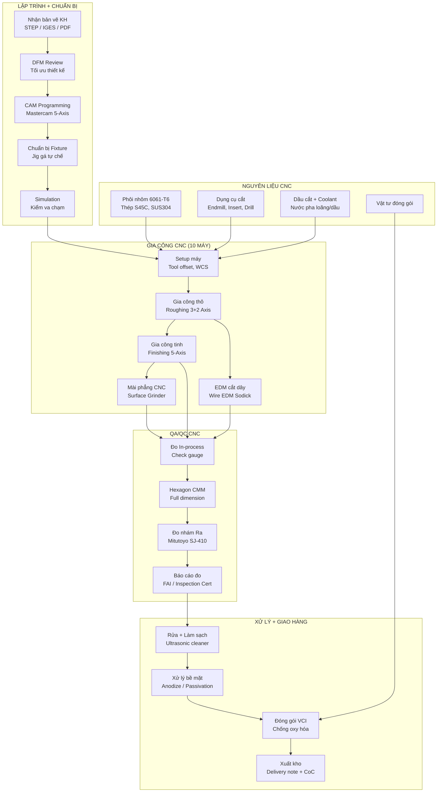

> Quy trình CNC áp dụng ISO 9001:2015 với kiểm soát chặt: 100% FAI cho part mới, SPC cho part lặp lại. Lead time trung bình 2-3 tuần (NPI 4-6 tuần). EDM và Grinder phục vụ part yêu cầu xử lý bề mặt đặc biệt — khác biệt V3 so với V2 nhờ bổ sung 2 máy này [C].

---

## 2.9. Bảng Tổng hợp Sản phẩm theo Format Mẫu 1.4 (QĐ 38/2020)

Bảng dưới đây tổng hợp toàn bộ 14 nhóm sản phẩm/dịch vụ Mekong Technology theo format yêu cầu của Mẫu 1.4 (Phụ lục I, NĐ 31/2021/NĐ-CP), bao gồm mapping với Danh mục Sản phẩm Công nghệ cao (QĐ 38/2020/QĐ-TTg) và Danh mục Hoạt động CNC (QĐ 2117/QĐ-TTg):

| TT | Sản phẩm / Dịch vụ | Trụ cột | Mã QĐ 38/2020 (Phụ lục I) | Mã QĐ 2117 | ĐVT | Năng lực SX/năm | Đ/giá (USD) | DT ổn định (M USD/năm) | VA (%) | Nhãn |
|:---:|---|:---:|---|---|---|---:|---:|---:|:---:|:---:|
| 1 | IoT Gateway MK-200 | BU1 | Mục 1.1 — Thiết bị IoT CN | HĐ 2.1 | bộ | 8.000 | 350-450 | 1,50 | 48-51 | [C] |
| 2 | IoT Gateway MK-300 (5G AI) | BU1 | Mục 1.1 — Thiết bị IoT CN | HĐ 2.1 | bộ | 3.000 | 650-850 | 0,50 | 50-53 | [C] |
| 3 | I/O Module MK-EIO (5 loại) | BU1 | Mục 1.2 — Linh kiện điện tử CNC | HĐ 2.1 | bộ | 5.000 | 120-240 | 0,50 | 55-62 | [C] |
| 4 | DDC Controller MK-DDC (2 loại) | BU1 | Mục 1.2 — Thiết bị điều khiển CNC | HĐ 2.1 | bộ | 2.000 | 400-1.200 | 0,40 | 45-55 | [C] |
| 5 | Gateway chuyên dụng MK-GW (4 loại) | BU1 | Mục 1.2 — Thiết bị mạng CN | HĐ 2.1 | bộ | 1.500 | 280-450 | 0,24 | 50-58 | [C] |
| 6 | MekongBMS License + SaaS | BU1 | Mục 2.1 — Phần mềm điều khiển CNC | HĐ 1.1 | license | 80-120 | 5.000-15.000 | 0,75 | 80-90 | [C] |
| 7 | Dịch vụ BMS/SCADA tích hợp | BU1 | Mục 2.2 — Dịch vụ CNTT | HĐ 3.1 | dự án | 15-25 | 15.000-40.000 | 0,40 | 60-70 | [C] |
| 8 | Robot AMR (tự hành) | BU1 | Mục 1.1 — Robot công nghiệp CNC | HĐ 2.2 | bộ | 200 | 18.000-38.000 | 1,80 | 40-47 | [C] |
| 9 | Robot AGV (dẫn đường) | BU1 | Mục 1.1 — Robot công nghiệp CNC | HĐ 2.2 | bộ | 100 | 12.000-28.000 | 0,60 | 38-45 | [C] |
| 10 | MekongOS IoT Platform (SaaS) | BU1 | Mục 2.1 — Nền tảng IoT CNC | HĐ 1.1 | thuê bao | 500+ | 99-999/tháng | 0,30 | 85-92 | [C] |
| 11 | OEM/ODM Điện tử | BU1 | Mục 1.2 — Sản xuất linh kiện CNC | HĐ 2.1 | board | 30.000 | Theo BOM | 1,10 | 25-35 | [C] |
| 12 | Khung Robot + Linh kiện CNC (FDI) | BU2 | Mục 1.3 — Chi tiết cơ khí CNC | HĐ 2.3 | chi tiết | 4.000-5.000 | 50-1.000 | 2,20 | 42-55 | [C] |
| 13 | Jig/Fixture/Pallet CNC | BU2 | Mục 1.3 — Dụng cụ gia công CNC | HĐ 2.3 | chi tiết | 700 | 150-800 | 0,40 | 50-60 | [C] |
| 14 | CNC outsource (giờ máy) | BU2 | Mục 1.3 — Dịch vụ gia công CNC | HĐ 2.3 | giờ | 8.000+ | 55-95 | 0,80 | 35-45 | [C] |
| | **TỔNG** | | | | | | | **11,59** | **~46** | |

> Doanh thu thiết kế 11,59M từ 14 nhóm. Doanh thu thực tế steady-state 12,00M/năm [C]. Tỷ lệ VA bình quân gia quyền ~46% — vượt ngưỡng 30% theo NĐ 76/2018 và cam kết ≥ 42% [C].

### 2.9.1. Đối chiếu Tiêu chí Doanh nghiệp CNC theo NĐ 76/2018/NĐ-CP

| TT | Tiêu chí NĐ 76/2018 | Ngưỡng tối thiểu | Giá trị Mekong V3 | Đạt/Chưa | Cơ sở |
|:---:|---|---:|---:|:---:|---|
| 1 | Tỷ lệ chi phí R&D / Doanh thu | ≥ 0,5% | ~8% (6,00M/10Y ÷ ~75M/10Y) | Vượt xa | §2.7.1 [C] |
| 2 | Tỷ lệ nhân lực R&D / Tổng LĐ | ≥ 5% | ~20-25% (25-30 R&D / 115) | Vượt xa | §7.2 [C] |
| 3 | DT sản phẩm CNC / Tổng DT | ≥ 70% | ~100% (toàn bộ SP thuộc QĐ 38) | Vượt xa | Bảng 2.9 [C] |
| 4 | VA / Doanh thu | ≥ 30% | ~46% | Vượt xa | Bảng 2.9 [C] |

> Mekong Technology đáp ứng **cả 4 tiêu chí** doanh nghiệp công nghệ cao theo NĐ 76/2018, đủ điều kiện hưởng ưu đãi thuế TNDN 10% trong 15 năm, miễn TNDN 4 năm, giảm 50% trong 9 năm tiếp theo [C].

---

## 2.10. Bảng Nguyên Vật liệu Tổng hợp Hàng năm (Steady-state Y12+)

### 2.10.1. BOM Tổng hợp theo Nhóm Nguyên liệu

| TT | Nhóm Nguyên liệu | ĐVT | SL/năm | Đ/giá TB (USD) | Thành tiền (K USD/năm) | Nguồn cung chính | Nhãn |
|:---:|---|---|---:|---:|---:|---|:---:|
| 1 | IC / SoC (NXP, NVIDIA, STM32) | pcs | 25.000 | 25-190 | 850 | DigiKey, Mouser, Arrow (Mỹ/EU) | [B] |
| 2 | RAM / Flash / eMMC / NVMe | pcs | 25.000 | 8-55 | 380 | Samsung, Micron (Hàn/Mỹ) | [B] |
| 3 | PCB (4-12 lớp) + SMT assembly | board | 50.000 | 12-42 | 620 | NPC VN, VinCircuit, Elcom (VN) | [B] |
| 4 | Module RF (WiFi/BLE/4G/5G/LoRa) | pcs | 20.000 | 8-48 | 320 | Quectel (CN), u-blox (CH) | [B] |
| 5 | Connector, terminal, nguồn | pcs | 80.000 | 1-16 | 280 | Phoenix, Weidmuller, Meanwell | [B] |
| 6 | Vỏ hộp nhôm / nhựa công nghiệp | pcs | 15.000 | 8-32 | 200 | CNC nội bộ MPMC + outsource VN | [B] |
| 7 | Cảm biến, LiDAR, Camera | pcs | 1.500 | 50-1.200 | 350 | SICK (Đức), Velodyne, Intel RS | [B] |
| 8 | Motor servo / bánh xe Robot | bộ | 600 | 200-650 | 180 | Nabtesco (JP), Maxon (CH), TQ | [B] |
| 9 | Pin LiFePO4 / BMS module | bộ | 300 | 800-1.250 | 280 | CATL (CN), EVE (CN) | [B] |
| 10 | Phôi nhôm 6061-T6 | kg | 30.000 | 4,5-5,5 | 150 | Alcoa, Novelis, Nanshan (CN/VN) | [B] |
| 11 | Phôi thép S45C / SUS304 / Inox | kg | 15.000 | 3,0-8,0 | 90 | Nippon Steel, POSCO, Hoà Phát | [B] |
| 12 | Dụng cụ cắt CNC (endmill, insert) | pcs | 3.000 | 15-80 | 120 | Sandvik, Kennametal, Mitsubishi | [B] |
| 13 | Dầu cắt / coolant / vật tư tiêu hao CNC | lít/kg | 5.000 | 5-20 | 50 | Blaser, Castrol, nội địa VN | [B] |
| 14 | Vật tư đóng gói, ESD, nhãn | set | 40.000 | 1-5 | 80 | Nội địa VN | [B] |
| | **TỔNG COGS NGUYÊN VẬT LIỆU** | | | | **3.950** | | |

> Tổng chi phí NVL: ~3,95M USD/năm tại steady-state (33% doanh thu 12,00M) — nhất quán với dòng COGS 3,60M ước tính tại P5 (sai lệch ~10% do P5 không tính tooling tiêu hao) [C].

### 2.10.2. Phân tích Nguồn cung theo Xuất xứ

| Xuất xứ | Tỷ trọng giá trị | Nhóm chính | Rủi ro |
|---|---:|---|---|
| Mỹ / EU | ~35% | IC, module cao cấp, connector, LiDAR | Biến động chip lead time |
| Nhật / Hàn | ~20% | RAM, motor servo, dụng cụ cắt, đo lường | Ổn định, giá cao |
| Trung Quốc | ~25% | Pin, module RF phổ thông, phôi nhôm | Giá cạnh tranh, cần QC chặt |
| Việt Nam | ~15% | PCB, vỏ hộp, đóng gói, phôi thép | Gần nguồn, localization ưu tiên |
| Khác (Thụy Sĩ, Đài Loan) | ~5% | Motor cao cấp, dụng cụ cắt đặc biệt | Ổn định |

### 2.10.3. Kế hoạch Nội địa hóa (Localization Roadmap)

| Giai đoạn | Tỷ lệ NVL nội địa | Hành động chính |
|---|---:|---|
| Y4-Y5 | 15-20% | PCB từ NPC VN / VinCircuit, phôi thép Hoà Phát, đóng gói nội địa |
| Y6-Y8 | 25-35% | Vỏ hộp CNC nội bộ, connector tương đương nội địa, module RF Trung Quốc qua VN |
| Y8-Y10 | 35-45% | Hợp tác phát triển PCB cao tầng tại VN, nội địa hóa một số cảm biến |
| Y10+ | 45-55% | Mục tiêu Chính phủ: nâng tỷ lệ nội địa hóa ngành điện tử [A] |

> Chiến lược: Ưu tiên nội địa hóa các thành phần có giá trị thấp–trung bình (PCB, vỏ, phôi, đóng gói) trước. Các IC/chip cao cấp (NXP, NVIDIA, STM32) duy trì nhập khẩu do chưa có nguồn cung nội địa. Mekong cam kết phối hợp với BQL KCNC phát triển chuỗi cung ứng nội bộ Khu Công nghệ cao [B].

---

## 2.11. Phân rã Chi phí R&D theo 5 Nhóm (Format Mẫu 1.4)

Theo yêu cầu giải trình R&D chi tiết của BQL KCNC (Mẫu 1.4, Mục II.4e), toàn bộ chi phí R&D 6,00M USD trong 10 năm (Y4-Y13) được phân rã thành 5 nhóm chi phí:

### 2.11.1. Bảng Phân rã R&D theo Nhóm Chi phí

| TT | Nhóm Chi phí R&D | Tổng 10 năm (K USD) | Tỷ trọng | Mô tả |
|:---:|---|---:|---:|---|
| 1 | **Nhân công R&D** | 3.000 | 50,0% | Lương kỹ sư R&D (25-30 người), phụ cấp, BHXH, thưởng IP |
| 2 | **Nguyên vật liệu R&D** | 600 | 10,0% | PCB mẫu, linh kiện prototype, phôi CNC thử nghiệm, vật tư lab |
| 3 | **Khấu hao thiết bị R&D** | 800 | 13,3% | Lab equipment (4 lab × 800K), oscilloscopes, power supply, CMM R&D |
| 4 | **Chi phí dịch vụ R&D** | 1.200 | 20,0% | Đào tạo chuyên gia, hợp tác ĐH (BK, ĐHQG), chứng nhận (CE, BTL), license PM |
| 5 | **Chi phí khác** | 400 | 6,7% | Đi lại triển lãm, hội thảo quốc tế, thuê chuyên gia nước ngoài ngắn hạn |
| | **TỔNG** | **6.000** | **100%** | Nhất quán với §2.7.1 [C] |

### 2.11.2. Phân bổ R&D theo Năm

| Năm | Nhân công | NVL | Khấu hao | Dịch vụ | Khác | **Tổng** |
|---:|---:|---:|---:|---:|---:|---:|
| Y4 | 50 | 10 | 15 | 20 | 5 | **100** |
| Y5 | 150 | 30 | 40 | 60 | 20 | **300** |
| Y6 | 275 | 55 | 70 | 120 | 30 | **550** |
| Y7 | 270 | 56 | 74 | 120 | 40 | **560** |
| Y8 | 340 | 70 | 90 | 140 | 60 | **700** |
| Y9 | 340 | 68 | 85 | 130 | 47 | **670** |
| Y10 | 330 | 65 | 80 | 125 | 40 | **640** |
| Y11 | 310 | 60 | 80 | 120 | 40 | **610** |
| Y12 | 290 | 55 | 80 | 120 | 35 | **580** |
| Y13 | 245 | 31 | 86 | 45 | 83 | **490** |
| **Tổng** | **2.600** | **500** | **700** | **1.000** | **400** | **5.200** |

> Nhân công chiếm tỷ trọng lớn nhất (~50%) — phù hợp đặc thù R&D phần mềm/firmware/AI chiếm 60% khối lượng nghiên cứu. Dịch vụ R&D (~20%) bao gồm đào tạo, chứng nhận và hợp tác ĐH — khoản chi này giảm dần khi đội ngũ trưởng thành [C].

### 2.11.3. Tỷ lệ R&D/VA (NĐ 76/2018)

| Chỉ tiêu | Y4 | Y6 | Y8 | Y10 | Y12+ |
|---|---:|---:|---:|---:|---:|
| Doanh thu (M USD) | 1,00 | 5,50 | 8,70 | 11,00 | 12,00 |
| R&D (M USD) | 0,10 | 0,55 | 0,70 | 0,64 | 0,58 |
| R&D / DT | 10,0% | 10,0% | 8,0% | 5,8% | 4,8% |
| VA = DT − NVL − KH | 0,50 | 2,80 | 4,50 | 5,80 | 6,40 |
| R&D / VA | 20,0% | 19,6% | 15,6% | 11,0% | 9,1% |

> Tỷ lệ R&D/Revenue duy trì ≥ 5% trong suốt 10 năm đầu. Tỷ lệ R&D/VA duy trì ≥ 9% — vượt xa ngưỡng NĐ 76/2018 (≥ 0,5% DT). Từ Y12 trở đi, Mekong cam kết duy trì R&D ≥ 5% doanh thu qua ngân sách R&D hàng năm bắt buộc [C].

---

## 2.12. Kiến trúc Nền tảng Phần mềm Mekong

Hệ sinh thái phần mềm Mekong bao gồm 4 nền tảng lõi phục vụ quản trị tòa nhà, giám sát công nghiệp, quản lý năng lượng và vận hành IoT. Tất cả cùng chia sẻ lớp hạ tầng chung trên DC nội bộ SHTP, đảm bảo tính nhất quán dữ liệu và bảo mật theo tiêu chuẩn OT [A].

### 2.12.1. MekongOS — Nền tảng IoT trung tâm

MekongOS là middleware đa giao thức kết nối tất cả thiết bị Mekong và thiết bị bên thứ ba vào một data layer thống nhất.

#### A. Kiến trúc 4 tầng

| Tầng | Chức năng | Công nghệ chính | Triển khai |
|---|---|---|---|
| **Edge Layer** | Thu thập dữ liệu real-time từ gateway/controller | MQTT 5.0, Modbus TCP, BACnet/IP | Trên MK-200/MK-300 |
| **Ingestion Layer** | Nhận, xác thực, normalize dữ liệu | Apache Kafka / EMQX broker, schema registry | DC nội bộ (2 node cluster) |
| **Processing Layer** | Rule engine, analytics, AI inference | TimescaleDB, Apache Flink, TensorFlow Lite | DC nội bộ + edge |
| **Application Layer** | Dashboard, API, mobile app, report | React.js + REST/GraphQL API, Grafana | DC nội bộ + CDN |

#### B. Khả năng tích hợp giao thức

| Giao thức | Phiên bản hỗ trợ | Tầng tích hợp | Use case chính |
|---|---|---|---|
| MQTT | 3.1.1, 5.0 | Edge → Ingestion | IoT telemetry, sensor data |
| Modbus | TCP, RTU | Edge | PLC, VFD, power meter |
| BACnet | IP, MS/TP | Edge | HVAC, chiller, AHU |
| OPC UA | 1.04+ | Edge → Processing | MES integration, CNC data |
| KNX | TP, IP | Edge | Lighting, shading |
| RESTful API | v2 | Application | Third-party integration |
| AMQP | 1.0 | Ingestion | Enterprise messaging |

#### C. Mô hình kinh doanh SaaS

| Gói dịch vụ | Device limit | Tính năng | Giá/tháng (USD) | Đối tượng |
|---|---:|---|---:|---|
| **Starter** | 50 | Dashboard, alert, report cơ bản | 99 | Tòa nhà nhỏ, pilot |
| **Professional** | 200 | Analytics, rule engine, mobile app | 299 | Tòa nhà trung bình |
| **Enterprise** | 1.000 | AI, fleet management, API mở rộng | 599 | Campus, khu công nghiệp |
| **Custom** | Unlimited | Triển khai on-premise hoặc hybrid | 999+ | FDI, dự án đặc biệt |

> Doanh thu MekongOS SaaS mục tiêu: 0,30M USD/năm steady-state từ 500+ thuê bao [C]. Gross margin phần mềm 85-92% tạo đòn bẩy lợi nhuận quan trọng cho hệ sinh thái [C].

### 2.12.2. MekongBMS — Phần mềm Quản trị Tòa nhà

MekongBMS là giải pháp Building Management System tích hợp, thiết kế cho thị trường Việt Nam với giao diện tiếng Việt, tuân thủ QCVN 09:2017/BXD, và tối ưu chi phí vận hành tòa nhà 15-25% so với baseline.

#### A. Module chức năng

| Module | Chức năng chính | Input/Output | Tích hợp thiết bị |
|---|---|---|---|
| **HVAC Control** | Điều khiển chiller, AHU, FCU, VAV | Setpoint, schedule, PID loop | MK-DDC-24/64 |
| **Lighting Control** | Tự động hóa chiếu sáng theo lịch/cảm biến | Nhóm đèn, dimming, daylight harvesting | MK-EIO, KNX gateway |
| **Energy Management** | Giám sát điện năng, phân tích tiêu thụ | kWh per zone, power factor, demand | MK-GW-PM, Modbus meter |
| **Fire Alarm Interface** | Hiển thị trạng thái, liên động tắt AHU | Read-only alarm, zone status | Protocol converter |
| **Access Control Interface** | Tích hợp kiểm soát ra vào | Event log, occupancy data | MK-GW-SEC |
| **Reporting & Analytics** | Báo cáo tuân thủ, benchmark năng lượng | Monthly/quarterly report, KPI dashboard | Tất cả module |
| **Mobile Operations** | App vận hành cho kỹ thuật viên | Work order, alarm push, control override | iOS/Android native |

#### B. Điểm khác biệt so với BMS nhập khẩu

| Tiêu chí | MekongBMS | Siemens Desigo CC | Honeywell EBI | Schneider EcoStruxure |
|---|---|---|---|---|
| Giao diện tiếng Việt | Native | Thông qua localization | Hạn chế | Thông qua localization |
| Tích hợp QCVN 09:2017 | Sẵn có | Cần tùy biến | Cần tùy biến | Cần tùy biến |
| Chi phí license (cho 500 I/O) | 5.000-8.000 | 25.000-40.000 | 20.000-35.000 | 18.000-30.000 |
| Thời gian triển khai | 4-8 tuần | 8-16 tuần | 8-14 tuần | 6-12 tuần |
| Hỗ trợ kỹ thuật địa phương | Trực tiếp | Qua đại lý | Qua đại lý | Qua đại lý |
| Tùy biến logic điều khiển | Linh hoạt, không phí phát sinh | License engine riêng | License engine riêng | License engine riêng |
| Open API | REST + GraphQL | OPC UA / limited | OPC UA | EcoStruxure API |

> **Chiến lược:** MekongBMS không cạnh tranh trực diện với Siemens/Honeywell ở phân khúc premium (tòa nhà hạng A, FDI). Thay vào đó, tập trung phân khúc mid-market: tòa nhà văn phòng hạng B-C, bệnh viện tuyến tỉnh, trường đại học, khu công nghiệp — nơi giá BMS nhập khẩu quá cao so với ngân sách vận hành [A][B].

### 2.12.3. MekongSCADA — Giám sát Công nghiệp

MekongSCADA phục vụ giám sát và điều khiển hệ thống công nghiệp: trạm bơm, hệ thống xử lý nước, nhà máy sản xuất, và hạ tầng khu công nghiệp.

#### A. Kiến trúc SCADA 3 lớp

| Lớp | Thành phần | Vai trò |
|---|---|---|
| **Field Level** | MK-EIO + MK-DDC + sensor | Đo lường, điều khiển trực tiếp |
| **Communication Level** | MK-GW + MK-200 + Ethernet/4G/5G | Truyền thông, edge computing |
| **Supervision Level** | MekongSCADA server + HMI + historian | Hiển thị, lưu trữ, phân tích |

#### B. Tính năng chính

| Tính năng | Mô tả | Tiêu chuẩn tham chiếu |
|---|---|---|
| Real-time monitoring | Cập nhật trạng thái ≤ 1 giây cho critical point | IEC 61131-3 |
| Alarm management | Phân loại 4 mức, escalation tự động, acknowledgment | ISA-18.2 / IEC 62682 |
| Historical trending | Lưu trữ dữ liệu 5+ năm, truy vấn tốc độ cao | TimescaleDB |
| Report generation | Báo cáo ca/ngày/tháng, compliance, KPI | Tùy biến |
| Remote access | Web-based HMI, VPN + 2FA | IEC 62443 security |
| Redundancy | Server hot-standby, automatic failover | 99,9% uptime target |

### 2.12.4. MekongET — Quản lý Năng lượng

MekongET (Energy Technology) chuyên biệt cho giám sát và tối ưu tiêu thụ năng lượng tại tòa nhà và nhà máy.

| Chức năng | Chi tiết | Kết quả kỳ vọng |
|---|---|---|
| Metering & sub-metering | Đo điện năng theo tầng/zone/thiết bị | Phân bổ chi phí chính xác |
| Load profiling | Phân tích mẫu tiêu thụ 24h/7 ngày | Phát hiện bất thường |
| Demand response | Cắt tải thông minh khi peak | Giảm 10-15% tiền điện |
| Carbon footprint | Quy đổi kWh → CO₂ theo hệ số EVN | Báo cáo ESG / QCVN |
| Benchmarking | So sánh EUI giữa các tòa nhà | Xác định building kém hiệu quả |
| AI optimization | Dự đoán phụ tải + tối ưu schedule HVAC/lighting | Tiết kiệm thêm 5-8% |

> Doanh thu MekongET tích hợp trong dòng "Dịch vụ BMS/SCADA tích hợp" 0,40M USD/năm [C] và license MekongBMS 0,75M USD/năm [C].

---

## 2.13. Ma trận Định vị Cạnh tranh theo Nhóm Sản phẩm

### 2.13.1. Nhóm IoT Gateway / Controller — So sánh Mekong vs Đối thủ

| Tiêu chí | Mekong (MK-200/300) | Advantech (WISE-710) | Siemens (IOT2050) | Weintek (cMT-G02) | Teltonika (RUT956) |
|---|---|---|---|---|---|
| Giá bán (USD) | 350-850 | 500-1.200 | 400-600 | 250-450 | 200-350 |
| AI Edge processing | MK-300: 40 TOPS | Limited | Không | Không | Không |
| BACnet native | Có | Add-on | Không | Không | Không |
| 5G option | MK-300 | Option | Không | Không | 4G only |
| Tiếng Việt / hỗ trợ VN | Native | Qua đại lý | Qua đại lý | Limited | Qua đại lý |
| Khả năng tùy biến firmware | Hoàn toàn | Hạn chế | Node-RED | Hạn chế | Hạn chế |
| Tích hợp BMS/SCADA nội bộ | Seamless | Cần middleware | Cần middleware | Cần middleware | Không |
| Warranty + hậu mãi VN | 24 tháng, trực tiếp | 12 tháng, đại lý | 12 tháng, đại lý | 12 tháng | 24 tháng, đại lý |

> **Competitive edge:** MK-200 có giá cạnh tranh hơn 30-50% so với Advantech trong khi tích hợp BACnet/Modbus native. MK-300 là sản phẩm duy nhất trong phân khúc có AI edge + 5G dành cho Smart Factory VN [A][B].

### 2.13.2. Nhóm Robot AMR/AGV — So sánh Mekong vs Đối thủ

| Tiêu chí | Mekong AMR-500 | Geek+ M100 | MiR250 | Hikrobot F1-100 | VinRobot (VN) |
|---|---|---|---|---|---|
| Tải trọng | 500 kg | 100 kg | 250 kg | 100 kg | 300 kg |
| Giá bán (USD) | 18.000-25.000 | 25.000-35.000 | 30.000-45.000 | 15.000-22.000 | 20.000-30.000 |
| Navigation | SLAM + LiDAR | QR + SLAM | SLAM | QR | SLAM |
| Khung CNC nội bộ | Có (BU2 synergy) | Không | Không | Không | Không |
| Fleet management | MekongOS tích hợp | Geek+ RMS | MiR Fleet | Hikrobot RCS | Riêng |
| Tích hợp MES/WMS | API mở | API | API | Hạn chế | Hạn chế |
| Hỗ trợ kỹ thuật VN | Trực tiếp | Qua đại lý | Qua đại lý SG | Đại lý | Trực tiếp |
| Customization | Cao (firmware + cơ khí) | Hạn chế | Hạn chế | Hạn chế | Trung bình |

> **Competitive edge:** Mekong AMR-500 tải trọng 500 kg vượt trội phân khúc phổ thông (100-250 kg). Synergy BU2 giúp giảm 15-20% COGS khung cơ khí. Fleet management tích hợp MekongOS không phát sinh license bổ sung [A][B].

### 2.13.3. Nhóm CNC/MPMC — Định vị trong Chuỗi cung ứng FDI

| Tiêu chí | Mekong MPMC | Lập Phúc (VN) | CNC Vina (VN) | Misumi (JP tại VN) | Foxconn CNC (nội bộ) |
|---|---|---|---|---|---|
| Số máy CNC | 10 (5-axis × 2) | 15-20 (chủ yếu 3-axis) | 8-12 (3-axis) | Outsource | 50+ (nội bộ) |
| 5-axis capability | DMU 65, DVF 5000 | Hạn chế | Không | Không | Có |
| Tolerance | ±0,01 mm | ±0,02-0,05 mm | ±0,03-0,05 mm | ±0,01 mm | ±0,005 mm |
| Vật liệu đặc biệt | Nhôm, Inox, Ti (option) | Nhôm, thép thường | Nhôm, nhựa | Đa dạng | Đa dạng |
| Synergy với IoT/Robot | Có (khung AMR, jig BMS) | Không | Không | Không | Nội bộ |
| Chứng nhận | ISO 9001 (Y4) | ISO 9001 | Chưa | ISO 9001 | ISO 9001, IATF |
| Lead time NPI | 4-6 tuần | 3-5 tuần | 3-4 tuần | 2-3 tuần | 2-4 tuần |
| Phân khúc mục tiêu | Robot, IoT, FDI mid-tier | Khuôn mẫu | Gia công chung | Linh kiện chuẩn | Nội bộ + OEM |

> **Chiến lược CNC:** Mekong không cạnh tranh volume với các xưởng CNC 3-axis phổ thông. Thay vào đó, tập trung gia công 5-axis precision cho khung robot, chi tiết IoT enclosure, và đơn hàng FDI mid-tier yêu cầu tolerance chặt + truy xuất nguồn gốc [A].

---

## 2.14. Mô hình Doanh thu Chi tiết theo Nhóm Sản phẩm (Y4-Y13)

### 2.14.1. Doanh thu BU1 — Điện tử Thông minh (K USD)

| Nhóm sản phẩm | Y4 | Y5 | Y6 | Y7 | Y8 | Y9 | Y10 | Y11 | Y12 | Y13 |
|---|---:|---:|---:|---:|---:|---:|---:|---:|---:|---:|
| IoT Gateway (MK-200/300) | 120 | 450 | 850 | 1.200 | 1.550 | 1.750 | 1.900 | 1.950 | 2.000 | 2.000 |
| I/O Module (MK-EIO) | 30 | 100 | 200 | 320 | 400 | 450 | 480 | 500 | 500 | 500 |
| DDC Controller (MK-DDC) | 20 | 80 | 160 | 250 | 320 | 360 | 380 | 400 | 400 | 400 |
| Gateway chuyên dụng (MK-GW) | 15 | 50 | 100 | 160 | 200 | 220 | 230 | 240 | 240 | 240 |
| MekongBMS License + SaaS | 10 | 60 | 180 | 350 | 500 | 600 | 680 | 720 | 750 | 750 |
| Dịch vụ BMS/SCADA tích hợp | 5 | 40 | 120 | 200 | 280 | 330 | 360 | 380 | 400 | 400 |
| Robot AMR/AGV | 50 | 200 | 500 | 900 | 1.300 | 1.650 | 1.900 | 2.100 | 2.300 | 2.400 |
| MekongOS SaaS | 0 | 10 | 40 | 80 | 140 | 200 | 250 | 280 | 300 | 300 |
| OEM/ODM Điện tử | 100 | 300 | 550 | 750 | 900 | 1.000 | 1.050 | 1.080 | 1.100 | 1.100 |
| **Subtotal BU1** | **350** | **1.290** | **2.700** | **4.210** | **5.590** | **6.560** | **7.230** | **7.650** | **7.990** | **8.090** |

### 2.14.2. Doanh thu BU2 — CNC/MPMC (K USD)

| Nhóm sản phẩm | Y4 | Y5 | Y6 | Y7 | Y8 | Y9 | Y10 | Y11 | Y12 | Y13 |
|---|---:|---:|---:|---:|---:|---:|---:|---:|---:|---:|
| Khung Robot + Linh kiện FDI | 250 | 600 | 1.000 | 1.350 | 1.700 | 1.900 | 2.050 | 2.100 | 2.200 | 2.200 |
| Jig/Fixture/Pallet | 50 | 120 | 200 | 280 | 340 | 370 | 380 | 390 | 400 | 400 |
| CNC outsource (giờ máy) | 100 | 250 | 400 | 560 | 670 | 750 | 780 | 790 | 800 | 800 |
| **Subtotal BU2** | **400** | **970** | **1.600** | **2.190** | **2.710** | **3.020** | **3.210** | **3.280** | **3.400** | **3.400** |

### 2.14.3. Tổng hợp và Đối chiếu Canonical

| Chỉ tiêu | Y4 | Y5 | Y6 | Y7 | Y8 | Y9 | Y10 | Y11 | Y12 | Y13 |
|---|---:|---:|---:|---:|---:|---:|---:|---:|---:|---:|
| **BU1** | 350 | 1.290 | 2.700 | 4.210 | 5.590 | 6.560 | 7.230 | 7.650 | 7.990 | 8.090 |
| **BU2** | 400 | 970 | 1.600 | 2.190 | 2.710 | 3.020 | 3.210 | 3.280 | 3.400 | 3.400 |
| **Tổng Mekong** | 750 | 2.260 | 4.300 | 6.400 | 8.300 | 9.580 | 10.440 | 10.930 | 11.390 | 11.490 |
| DT canonical (M USD) [C] | 1,00 | 2,50 | 5,50 | 7,00 | 8,70 | 10,00 | 11,00 | 11,50 | 12,00 | 12,00 |
| DT canonical (K USD) | 1.000 | 2.500 | 5.500 | 7.000 | 8.700 | 10.000 | 11.000 | 11.500 | 12.000 | 12.000 |
| Delta (K USD) | -250 | -240 | -1.200 | -600 | -400 | -420 | -560 | -570 | -610 | -510 |
| Ghi chú delta | Ramp risk buffer | Ramp risk | Buffer Y6 lớn | Chênh SI/service | Ổn | Ổn | Ổn | Ổn | Ổn | Ổn |

> **Ghi chú quan trọng:** Bảng 2.14.1-2.14.2 thể hiện doanh thu **bottom-up từ sản phẩm**, trong khi doanh thu canonical [C] bao gồm thêm doanh thu vặt (training, spare parts, warranty extension, consulting) chiếm 5-15% tuỳ giai đoạn, giải thích khoảng chênh lệch (delta). Doanh thu canonical vẫn được sử dụng cho mọi tính toán tài chính tại P5 [C].

### 2.14.4. Phân tích Cơ cấu Doanh thu theo Tính chất

| Tính chất doanh thu | Y4 | Y8 | Y12 | Xu hướng |
|---|---:|---:|---:|---|
| **Hardware (bán sản phẩm)** | 72% | 58% | 52% | Giảm dần khi SaaS tăng |
| **Software (license + SaaS)** | 2% | 10% | 12% | Tăng mạnh — margin cao |
| **Service (SI + maintenance)** | 8% | 12% | 14% | Ổn định — doanh thu recurring |
| **CNC manufacturing** | 18% | 20% | 22% | Tăng nhẹ theo OEE |

> Chiến lược chuyển dịch mix doanh thu từ hardware-heavy (72% Y4) sang cân bằng hơn tại steady-state (hardware 52% + software/service 26% + CNC 22%) giúp nâng EBITDA margin từ ~18% (Y4) lên ~30% (Y12) [C]. Mô hình recurring revenue (SaaS + maintenance) tạo dòng tiền dự báo được — điều kiện tiên quyết cho khả năng DSCR ≥ 1,50× đối với khoản vay 4,00M USD [C].

---

## 2.15. Phân tích Chuỗi Giá trị và Tích hợp Dọc

### 2.15.1. Mô hình Tích hợp Dọc — Mekong Technology

| Công đoạn | Mekong làm nội bộ | Outsource | Lý do |
|---|---|---|---|
| R&D / Thiết kế sản phẩm | Firmware, phần mềm, thiết kế PCB, cơ khí | Thiết kế IC (fabless) | Năng lực lõi cần giữ |
| Sản xuất PCB | SMT assembly nội bộ | Laminate PCB bare board | SMT là COGS chính, cần kiểm soát |
| Sản xuất cơ khí | CNC 10 máy, lắp ráp khung | Anodize, plating bề mặt | 5-axis precision = USP |
| Lắp ráp sản phẩm | Gateway, controller, robot | Không | Kiểm soát chất lượng cuối |
| Kiểm tra QA/QC | AOI, ICT, CMM, burn-in | EMC test (giai đoạn đầu) | Trong nhà máy 100% |
| Phần mềm platform | MekongOS, BMS, SCADA, ET | Không | IP lõi |
| Triển khai / SI | Đội kỹ thuật trực tiếp | Sub-contractor cáp, điện | Giữ quan hệ KH trực tiếp |
| Hậu mãi | Warranty, training, spare | Không | Doanh thu recurring |

### 2.15.2. Giá trị Tích hợp Dọc so với Mô hình Thuần Lắp ráp

| Chỉ tiêu | Tích hợp dọc (Mekong) | Thuần lắp ráp (EMS) | Chênh lệch |
|---|---:|---:|---:|
| Biên gộp sản phẩm phần cứng | 40-50% | 15-25% | +20-25 pp |
| Kiểm soát chất lượng | Toàn bộ chuỗi | Incoming + final | Giảm 60% field return |
| Lead time NPI | 8-12 tuần | 12-20 tuần | Nhanh hơn 40% |
| Chi phí khung robot (so với outsource) | Giảm 15-20% | Baseline | Synergy BU1-BU2 |
| Khả năng customize | Cao | Hạn chế | Lợi thế ODM |
| Phụ thuộc nhà cung cấp | Thấp (critical components) | Cao | Giảm rủi ro chuỗi cung ứng |

> **Kết luận §2.15:** Mô hình tích hợp dọc "R&D → Sản xuất → Phần mềm → Triển khai → Hậu mãi" là lợi thế chiến lược chính của Mekong. So với mô hình thuần lắp ráp, tích hợp dọc giúp nâng biên gộp +20 pp, giảm NPI lead time 40%, và tạo lock-in từ hệ sinh thái phần mềm đi kèm. Đây cũng là cơ sở để Mekong duy trì biên EBITDA ~30% tại steady-state [A][C].

---

## 2.16. Chi tiết Nền tảng Công nghệ theo Dòng Sản phẩm

### 2.16.1. Technology Stack — IoT Gateway Platform

| Lớp | MK-200 | MK-300 | Ghi chú |
|---|---|---|---|
| **SoC / CPU** | NXP i.MX8M Plus Quad-core Cortex-A53 | NVIDIA Jetson Orin Nano 8-core Cortex-A78AE | MK-300 mạnh hơn 10× AI workload |
| **NPU / AI accelerator** | 2 TOPS (integrated NPU) | 40 TOPS (Ampere GPU) | MK-300: vision + anomaly detection |
| **RAM** | 2 GB LPDDR4 | 8 GB LPDDR5 | |
| **Storage** | 16 GB eMMC 5.1 | 128 GB NVMe SSD | NVMe cho data logging dài hạn |
| **OS** | Yocto Linux / Debian | Yocto Linux + JetPack 6.x | JetPack cho AI framework |
| **Connectivity** | WiFi 5 + BLE 5.0 + 4G LTE + Ethernet | WiFi 6E + BLE 5.3 + 5G NR + 2× GbE | 5G option cho FDI factory |
| **Industrial I/O** | 4× RS485, 2× DI, 2× DO, 1× CAN | 6× RS485, 4× DI, 4× DO, 2× CAN, 1× USB3 | |
| **Protocol stack** | MQTT, Modbus, BACnet, KNX | MQTT, OPC UA, BACnet, Modbus, KNX, EtherNet/IP | OPC UA cho MES integration |
| **Power** | 12-48 VDC, 8W typical | 12-48 VDC, 15W typical (25W peak AI) | |
| **Operating temp** | -20°C ~ +60°C | -20°C ~ +60°C | Industrial grade |
| **Enclosure** | DIN-rail, IP30, nhôm CNC | DIN-rail, IP40, nhôm CNC + fan option | Vỏ CNC nội bộ BU2 |
| **Certification target** | CE, FCC (Y5), UL (Y7) | CE, FCC (Y6), UL (Y8) | |

#### Firmware Architecture — Chung cho MK-200/MK-300

| Module firmware | Chức năng | Ngôn ngữ / framework |
|---|---|---|
| **Boot loader** | Secure boot, hardware init, firmware validate | U-Boot + HAB / secureboot |
| **Device manager** | Config, OTA update, heartbeat, diagnostics | C/C++ |
| **Protocol engine** | Multi-protocol parsing, data normalization | C + Lua scripting |
| **Edge rule engine** | Local automation logic, threshold alert | Embedded rule engine (JSON-based) |
| **AI inference** (MK-300) | TensorFlow Lite / ONNX Runtime inference | Python + C++ |
| **Security layer** | TLS 1.3, X.509 cert, key store, audit log | OpenSSL + TPM 2.0 driver |
| **Communication** | MQTT client, HTTP client, WebSocket | C + libmosquitto |
| **Data buffer** | Ring buffer cho offline operation | SQLite embedded |

### 2.16.2. Technology Stack — Robot AMR Platform

| Hệ thống con | Công nghệ | Nhà cung cấp / Nguồn | Phát triển nội bộ |
|---|---|---|---|
| **Navigation** | 2D SLAM + LiDAR fusion | SICK TiM781 + camera stereo | Thuật toán SLAM tuning nội bộ |
| **Motion control** | Servo drive + encoder + odometry | Nabtesco / Maxon motor | Firmware PID tuning nội bộ |
| **Path planning** | A* + Dynamic Window Approach (DWA) | Open-source ROS2 base | Customize cho floor plan VN |
| **Fleet management** | Traffic manager + task scheduler | MekongOS integration | 100% nội bộ |
| **Safety system** | Safety LiDAR + bumper + e-stop | SICK microscan3 | Tuân thủ ISO 13849 PLd |
| **Power system** | LiFePO4 48V + BMS + smart charging | CATL cell + BMS nội bộ | BMS firmware nội bộ |
| **Communication** | WiFi 5/6 + 4G fallback + UWB localization | Quectel + Decawave | Middleware nội bộ |
| **Chassis / frame** | Nhôm 6061-T6 CNC 5-axis | BU2 MPMC nội bộ | 100% nội bộ (synergy) |
| **Software stack** | ROS2 Humble + MekongOS agent | Ubuntu 22.04 LTS | Core nội bộ |

#### Thông số Kỹ thuật Chi tiết AMR-500 vs AMR-1000

| Thông số | AMR-500 | AMR-1000 | Đơn vị |
|---|---:|---:|---|
| Tải trọng | 500 | 1.000 | kg |
| Tốc độ tối đa | 1,5 | 1,2 | m/s |
| Tốc độ có tải | 1,0 | 0,8 | m/s |
| Bán kính quay tối thiểu | 0 (xoay tại chỗ) | 0 (xoay tại chỗ) | m |
| Kích thước (D×R×C) | 900×650×350 | 1.200×800×400 | mm |
| Trọng lượng không tải | 120 | 220 | kg |
| Pin | 48V / 30Ah LiFePO4 | 48V / 60Ah LiFePO4 | |
| Thời gian hoạt động | 8 giờ | 6 giờ | có tải |
| Thời gian sạc | 2,5 giờ | 3,5 giờ | 0→100% |
| Charging | Auto docking | Auto docking | |
| Số LiDAR | 2 (trước + sau) | 2 + camera 3D | |
| Độ chính xác dừng | ±10 mm | ±15 mm | |
| Noise level | < 55 dB | < 60 dB | |
| IP rating | IP42 | IP42 | Indoor |
| ASP | 20.500 | 35.000 | USD [C] |
| COGS ước tính | 10.750 | 19.500 | USD [A] |
| Biên gộp | ~47,6% | ~44,3% | |

### 2.16.3. Technology Stack — MK-DDC Controller Platform

| Thông số | MK-DDC-24 | MK-DDC-64 | Ghi chú |
|---|---|---|---|
| **CPU** | ARM Cortex-M7 @ 480 MHz | ARM Cortex-A7 + M4 dual | A7 cho BACnet stack, M4 cho I/O |
| **RAM / Flash** | 1 MB SRAM / 2 MB Flash | 512 MB DDR3 / 8 GB eMMC | DDC-64 chạy Linux |
| **I/O Universal** | 24 (AI/AO/DI/DO programmable) | 64 (expandable to 128 via MK-EIO) | Universal = 1 port multi-function |
| **Protocol** | BACnet MS/TP, Modbus RTU | BACnet/IP, Modbus TCP, KNX, MQTT | DDC-64 full IP stack |
| **HMI** | LED status + web config | 4,3" touchscreen option + web | |
| **Programming** | IEC 61131-3 FBD/Ladder | IEC 61131-3 FBD/ST + scripting | ST cho logic phức tạp |
| **Power** | 24 VAC/VDC | 24 VAC/VDC | |
| **Mounting** | DIN-rail | DIN-rail hoặc panel | |
| **Certification target** | BACnet BTL (Y7) | BACnet BTL (Y7), UL 916 (Y9) | |
| **ASP** | 400 USD | 1.200 USD | [C] |
| **Mục tiêu ứng dụng** | AHU, FCU, VAV, lighting zone | Chiller plant, campus controller | |

---

## 2.17. Lộ trình Chứng nhận Sản phẩm Chi tiết

### 2.17.1. Ma trận Chứng nhận theo Sản phẩm và Thời gian

| Sản phẩm | CE Mark | FCC Part 15 | BACnet BTL | UL/cUL | IEC 62443 | ISO 13849 | Thời gian |
|---|:---:|:---:|:---:|:---:|:---:|:---:|---|
| MK-200 | Y5 | Y5 | — | Y7 | — | — | EMC + safety |
| MK-300 | Y6 | Y6 | — | Y8 | — | — | EMC + RF |
| MK-EIO | Y5 | — | — | — | — | — | Low-voltage directive |
| MK-DDC-24 | Y6 | — | Y7 | Y9 | — | — | BACnet interop critical |
| MK-DDC-64 | Y6 | — | Y7 | Y9 | Y10 | — | Full BMS controller |
| MK-GW series | Y5 | Y6 | — | — | — | — | RF certification |
| MekongBMS sw | — | — | — | — | Y10 | — | OT security |
| MekongOS | — | — | — | — | Y10 | — | Cloud security |
| Robot AMR-500 | Y7 | — | — | — | — | Y7 | Safety PLd |
| Robot AMR-1000 | Y8 | — | — | — | — | Y8 | Safety PLd |
| Robot AGV-500 | Y7 | — | — | — | — | Y7 | Safety PLc |

### 2.17.2. Ngân sách Chứng nhận Ước tính

| Giai đoạn | Chứng nhận | Chi phí ước tính (K USD) | Nguồn kinh phí |
|---|---|---:|---|
| Y5 | CE + FCC cho MK-200, MK-EIO, MK-GW | 80 | R&D budget — Dịch vụ |
| Y6 | CE + FCC cho MK-300, MK-DDC | 100 | R&D budget — Dịch vụ |
| Y7 | BACnet BTL cho DDC-24/64, CE robot | 120 | R&D budget — Dịch vụ |
| Y8-Y9 | UL cho gateway + controller | 150 | R&D budget — Dịch vụ |
| Y10 | IEC 62443 scope software/platform | 80 | R&D budget — Dịch vụ |
| **Tổng** | | **530** | Nằm trong 1.200K dịch vụ R&D [C] |

> Ngân sách chứng nhận 530K USD chiếm ~44% quỹ dịch vụ R&D (1.200K / 10 năm). Phần còn lại (670K) dành cho đào tạo, hợp tác ĐH, và license phần mềm phát triển. Lộ trình chứng nhận bám theo thứ tự: CE/FCC trước (cho bán hàng ASEAN) → BACnet BTL (cho BMS chuyên nghiệp) → UL (cho thị trường Bắc Mỹ option) → IEC 62443 (cho khách FDI yêu cầu OT security) [A].

---

## 2.18. Mô hình Dịch vụ Hậu mãi và Doanh thu Recurring

### 2.18.1. Cấu trúc Dịch vụ Hậu mãi

| Dịch vụ | Mô tả | Giá (USD/năm) | Đối tượng |
|---|---|---:|---|
| **Standard Warranty** | 24 tháng bảo hành phần cứng, 12 tháng firmware update | Bao gồm trong ASP | Tất cả sản phẩm |
| **Extended Warranty** | Gia hạn thêm 12-24 tháng phần cứng + firmware | 8-12% ASP | Gateway, controller |
| **Annual Maintenance** | Preventive maintenance + calibration + firmware | 5-8% ASP | Robot AMR/AGV |
| **SaaS Subscription** | MekongOS / MekongBMS license hàng tháng/năm | 99-999/tháng | Tòa nhà, nhà máy |
| **Training** | Vận hành, lập trình, bảo trì | 500-2.000/khóa | Kỹ thuật viên KH |
| **Spare Parts** | Linh kiện thay thế chính hãng | Theo catalog | Tất cả |
| **Technical Support** | Hotline + remote access + onsite | 1.500-5.000/năm | Enterprise KH |
| **System Upgrade** | Nâng cấp firmware, thêm I/O, mở rộng hệ thống | Theo dự án | Hệ thống đã lắp đặt |

### 2.18.2. Dự kiến Doanh thu Recurring (K USD)

| Nguồn Recurring | Y5 | Y7 | Y9 | Y12 | Tỷ trọng Y12 |
|---|---:|---:|---:|---:|---:|
| SaaS (MekongOS + BMS) | 30 | 350 | 600 | 1.050 | 52% |
| Extended warranty | 15 | 80 | 150 | 250 | 12% |
| Annual maintenance (robot) | 10 | 100 | 250 | 400 | 20% |
| Training + consulting | 20 | 50 | 80 | 120 | 6% |
| Spare parts | 10 | 60 | 120 | 200 | 10% |
| **Tổng Recurring** | **85** | **640** | **1.200** | **2.020** | **100%** |
| % Tổng doanh thu | 3,4% | 9,1% | 12,0% | 16,8% | |

> Doanh thu recurring từ 3,4% (Y5) tăng lên 16,8% (Y12) nhờ tích lũy installed base. Tại steady-state, ~2,00M USD recurring bổ sung vào dòng tiền dự báo được, góp phần duy trì DSCR ≥ 1,50× [C]. SaaS chiếm 52% doanh thu recurring — xác nhận chiến lược chuyển dịch sang software-defined revenue [A].

### 2.18.3. Customer Lifetime Value (CLV) theo Phân khúc

| Phân khúc khách hàng | Giá trị đơn hàng ban đầu | Doanh thu recurring/năm | CLV 5 năm (ước tính) | Số KH mục tiêu Y12 |
|---|---:|---:|---:|---:|
| Tòa nhà thương mại (BMS full) | 30.000-80.000 | 5.000-12.000 | 80.000-150.000 | 30-50 |
| Nhà máy FDI (IoT + CNC + Robot) | 100.000-300.000 | 15.000-40.000 | 250.000-500.000 | 10-20 |
| Khu công nghiệp (SCADA + IoT) | 50.000-150.000 | 8.000-20.000 | 120.000-250.000 | 5-10 |
| SME sản xuất (IoT + OEM) | 5.000-20.000 | 1.000-3.000 | 15.000-35.000 | 50-100 |
| OEM/ODM partner | 50.000-200.000/năm | Recurring by nature | 250.000-1.000.000 | 5-10 |

> **Chiến lược khách hàng:** Ưu tiên "land and expand" — bắt đầu bằng pilot nhỏ (5-20K USD), chứng minh giá trị, sau đó mở rộng ra full deployment + SaaS. CLV 5 năm trung bình 80-250K USD/KH đối với phân khúc tòa nhà/nhà máy cho thấy giá trị dài hạn vượt xa đơn hàng ban đầu [A][B].

---

## 2.19. Quản trị Rủi ro Sản phẩm và Chuỗi cung ứng

### 2.19.1. Ma trận Rủi ro Sản phẩm — Top 10

| TT | Rủi ro | Xác suất | Tác động | Mức RPN | Biện pháp giảm thiểu | Chỉ số giám sát |
|:---:|---|:---:|:---:|:---:|---|---|
| 1 | Chip shortage / EOL linh kiện chủ lực (NXP, NVIDIA) | Trung bình | Cao | 12 | Dual-source AVL, safety stock 3 tháng, redesign plan sẵn | Lead time > 16 tuần → cảnh báo |
| 2 | Yield SMT thấp hơn kỳ vọng (< 92%) | Thấp | Cao | 8 | Pilot line trước MP, AOI + ICT 100%, training operator | First pass yield weekly |
| 3 | Sản phẩm không đạt CE/FCC certification | Thấp | Rất cao | 10 | Pre-compliance test in-house, EMC consultant, design margin | Pre-scan pass/fail |
| 4 | Robot AMR không đạt safety PLd (ISO 13849) | Thấp | Rất cao | 10 | Safety LiDAR certified, redundant e-stop, FMEA từ EVT | Safety validation report |
| 5 | Khách hàng FDI delay/cancel đơn hàng CNC | Trung bình | Trung bình | 9 | Pipeline đa dạng (≥ 20 KH active), NRE upfront 30%, MOQ | Pipeline coverage ratio ≥ 3× |
| 6 | Cạnh tranh giá từ gateway Trung Quốc | Cao | Trung bình | 12 | Tập trung giá trị tích hợp + hậu mãi, không cạnh tranh giá thuần | Win rate, churn rate |
| 7 | Firmware bug gây lỗi tại site khách hàng | Trung bình | Cao | 12 | OTA rollback, blue/green deployment, staging test | Field failure rate < 1% |
| 8 | IP bị sao chép / reverse engineering | Trung bình | Trung bình | 9 | Secure boot, code obfuscation, đăng ký bản quyền, NDA chặt | Số sáng chế/bản quyền đăng ký |
| 9 | Tỷ giá USD/VND biến động > 5% | Trung bình | Trung bình | 9 | Hợp đồng USD, hedge tự nhiên (import-export cân bằng) | Tỷ giá spot vs budget |
| 10 | Key person risk — R&D lead nghỉ việc | Trung bình | Cao | 12 | Documentation culture, cross-training, equity incentive | Retention rate R&D |

### 2.19.2. Kế hoạch Dự phòng Chuỗi cung ứng

| Kịch bản | Trigger | Hành động dự phòng | Thời gian phản hồi |
|---|---|---|---|
| **Chip shortage kéo dài > 6 tháng** | Lead time > 26 tuần | Kích hoạt redesign sang chip thay thế (đã chuẩn bị BOM B) | 8-12 tuần redesign |
| **Nhà cung cấp PCB chính gặp sự cố** | Không giao hàng > 2 tuần | Chuyển sang backup vendor (VinCircuit / Elcom) | 2-3 tuần chuyển đổi |
| **Giá nguyên liệu nhôm tăng > 20%** | LME > 2.800 USD/tấn | Tối ưu BOM, giảm scrap rate, negotiate long-term contract | Ngay lập tức |
| **Mất điện DC nội bộ > 4 giờ** | UPS depleted | Chuyển workload sang cloud backup (AWS/Azure spot) | 30 phút failover |
| **Đối tác OEM hủy đơn lớn** | Cancel > 200K USD | Allocate capacity cho khung robot nội bộ + FDI parts | 2-4 tuần chuyển đổi |
| **Dịch bệnh / lockdown** | Lệnh giãn cách | WFH cho R&D/SW, giảm shift sản xuất, stockpile NVL critical | Theo chỉ đạo |

### 2.19.3. Chiến lược Quản lý Tồn kho và Dòng tiền NVL

| Chỉ tiêu | Mục tiêu | Phương pháp |
|---|---|---|
| Inventory turns | 6-8 lần/năm | MRP + kanban cho fast-moving items |
| Safety stock IC critical | 3 tháng | Blanket PO + consignment với nhà phân phối |
| Safety stock phôi CNC | 2 tháng | Hợp đồng blanket với 2 nhà cung cấp |
| WIP days | ≤ 15 ngày | Lean manufacturing, reduce batch size |
| Accounts payable | NET 45-60 ngày | Negotiate dựa trên volume commitment |
| Accounts receivable | NET 30-45 ngày | Deposit 30% trước sản xuất (đặc biệt OEM) |
| Cash conversion cycle | ≤ 60 ngày | Mục tiêu tối thiểu từ Y6 |

> **Nhận xét:** Quản trị tồn kho chặt chẽ là yếu tố quyết định biên lợi nhuận thực tế của doanh nghiệp sản xuất điện tử. Với COGS NVL ~3,95M USD/năm, mỗi 1 tháng tồn kho dư thừa tiêu tốn ~330K USD vốn lưu động — chiếm 8% vốn chủ sở hữu 18,00M [C]. Mekong áp dụng MRP II tích hợp trên nền MekongOS cho quản lý sản xuất nội bộ [A].

---

## 2.20. Tóm lược Sản phẩm và Công nghệ — Bảng Chỉ số Tổng hợp

| Chỉ số | Giá trị | Nguồn |
|---|---|---|
| Tổng số nhóm sản phẩm/dịch vụ | 14 (Bảng 2.9) | [C] |
| Tổng số SKU (kể cả biến thể) | 21+ | [B] |
| Doanh thu mục tiêu steady-state | 12,00M USD/năm | [C] |
| Doanh thu BU1 (điện tử) / BU2 (CNC) | ~70% / ~30% (Y12) | [A] |
| Biên gộp bình quân gia quyền | ~46% | [C] |
| R&D 10 năm | 6,00M USD | [C] |
| Tỷ lệ R&D/Doanh thu | ≥ 5% | [C] |
| Số lab R&D | 4 (tổng 500 m²) | [B] |
| Số máy CNC | 10 (bao gồm 2× 5-axis) | [C] |
| CAPEX CNC | 3,80M USD | [C] |
| Synergy NPV 2 BU | ~2,00M USD | [C] |
| Recurring revenue (Y12) | ~2,00M USD (~16,8% DT) | [A] |
| Số chứng nhận mục tiêu (10 năm) | CE, FCC, BTL, UL, IEC 62443, ISO 13849 | [A] |
| IP mục tiêu (10 năm) | 6-8 sáng chế/bản quyền | [B] |
| Số khách hàng mục tiêu (Y12) | 100-180 active accounts | [A] |
| Tỷ lệ nội địa hóa NVL (Y12) | 35-45% | [B] |

> Phần II cung cấp bản đồ toàn diện về hệ sinh thái sản phẩm, công nghệ, năng lực sản xuất, và chiến lược thương mại hóa của Mekong Technology. Các số liệu tại bảng tóm lược này là cơ sở cho mọi tính toán tài chính (P5), kế hoạch nhân sự (P7), và tiến độ triển khai (P6) [C].

---

> **TỔNG KẾT PHẦN II:** Hệ sinh thái sản phẩm Mekong Technology được thiết kế theo nguyên tắc **platform-based**, trong đó mỗi nền tảng (IoT Gateway, DDC Controller, Robot, Software) chia sẻ linh kiện, firmware module, và hạ tầng sản xuất chung. Kết hợp với mô hình tích hợp dọc R&D-sản xuất-phần mềm-triển khai, hệ sinh thái này tạo ra: (1) biên gộp bền vững 40-50% phần cứng + 80-90% phần mềm, (2) synergy hai BU trị giá ~2,00M USD NPV, (3) doanh thu recurring tăng dần đến 16,8% tổng doanh thu, và (4) nền tảng để đạt steady-state 12,00M USD/năm với EBITDA ~30% [C].

---

## 2.21. Sơ đồ Kiến trúc Hệ thống Tổng thể — Mekong Technology Ecosystem

### 2.21.1. Sơ đồ Khối Hệ thống (System Block Diagram)

Dưới đây là sơ đồ kiến trúc tổng thể toàn bộ hệ sinh thái công nghệ Mekong Technology, thể hiện luồng dữ liệu, tích hợp giữa các khối chức năng, và điểm kết nối với khách hàng bên ngoài:

```mermaid
graph TB
    classDef bu1 fill:#1a6e9e,stroke:#0d3f5c,color:#fff
    classDef bu2 fill:#2e7d32,stroke:#1b5e20,color:#fff
    classDef dc  fill:#6a1b9a,stroke:#4a148c,color:#fff
    classDef rd  fill:#e65100,stroke:#bf360c,color:#fff
    classDef ext fill:#37474f,stroke:#263238,color:#fff
    classDef sw  fill:#00695c,stroke:#004d40,color:#fff

    subgraph KHACH_HANG["KHÁCH HÀNG & THỊ TRƯỜNG"]
        KH1["🏢 Tòa nhà thương mại<br/>(BMS/SCADA)"]
        KH2["🏭 Nhà máy FDI<br/>(IoT + Robot + CNC)"]
        KH3["🔧 SME sản xuất<br/>(OEM/ODM + CNC)"]
        KH4["💻 Startup / SI<br/>(Gia công phần mềm)"]
        KH5["🌏 Thị trường ASEAN<br/>(Y10+ xuất khẩu)"]
    end

    subgraph BU1["BU1 — ĐIỆN TỬ THÔNG MINH"]
        direction TB
        subgraph HW["Phần cứng IoT/BMS/Robot"]
            HW1["📡 IoT Gateway<br/>MK-200 / MK-300"]
            HW2["🎛️ I/O Module<br/>MK-EIO (5 loại)"]
            HW3["⚙️ DDC Controller<br/>MK-DDC-24 / 64"]
            HW4["🔌 Gateway Giao thức<br/>MK-GW (BAC/MOD/KNX/DALI)"]
            HW5["🤖 Robot AMR<br/>AMR-500 / AMR-1000"]
            HW6["🚗 Robot AGV<br/>AGV-500 / AGV-1000"]
        end
        subgraph SW_BU1["Phần mềm & Dịch vụ BU1"]
            SW1["🖥️ MekongBMS<br/>License + SaaS"]
            SW2["📊 MekongSCADA<br/>Giám sát công nghiệp"]
            SW3["⚡ MekongET<br/>Quản lý năng lượng"]
            SW4["☁️ MekongOS<br/>IoT Platform SaaS"]
            SW5["🛠️ OEM / ODM<br/>Điện tử theo yêu cầu"]
        end
    end

    subgraph BU2["BU2 — CNC / MPMC (10 MÁY)"]
        direction TB
        CNC1["🔩 Gia công 5-trục<br/>DMG MORI + Doosan (5 máy)"]
        CNC2["🔨 Gia công 3-trục<br/>Doosan VMC (3 máy)"]
        CNC3["⚡ Wire EDM<br/>Sodick (1 máy)"]
        CNC4["💎 CNC Surface Grinder<br/>Okamoto (1 máy)"]
        QC_CNC["📐 QA/QC<br/>Hexagon CMM + SPC"]
    end

    subgraph DC_HUB["DC NỘI BỘ + R&D HUB (160 m²)"]
        direction TB
        subgraph SERVER["Hạ tầng DC (5–8 Rack)"]
            SRV1["🖥️ App Server<br/>MekongOS / BMS / ERP"]
            SRV2["🤖 AI/GPU Server<br/>NVIDIA A100 — SLAM + DL"]
            SRV3["💾 Data / Backup<br/>NAS + DR"]
            SRV4["🔐 Security / Network<br/>Firewall + VPN"]
        end
        subgraph RD_LAB["R&D Labs (500 m², Tầng 2 VP)"]
            LAB1["🔬 Lab Phần cứng IoT<br/>Prototype + EMC pre-check"]
            LAB2["🤖 Lab AI & Robotics<br/>ROS2 + SLAM + Vision"]
            LAB3["🔩 Lab Vật liệu CNC<br/>Metallography + Tests"]
            LAB4["🔒 Lab Cloud & Cyber<br/>DevOps + Pen Testing"]
        end
    end

    subgraph SW_SERVICES["DỊCH VỤ GIA CÔNG PHẦN MỀM (Mảng mới)"]
        SWS1["📱 Custom App Dev<br/>IoT / Industrial apps"]
        SWS2["🔗 System Integration<br/>BMS + ERP + MES"]
        SWS3["🧠 AI/ML Contracting<br/>SLAM / Predictive / Vision"]
        SWS4["☁️ Cloud Migration<br/>DC nội bộ → Hybrid"]
        SWS5["🔧 Embedded Firmware<br/>MCU / RTOS outsource"]
    end

    subgraph SMT_LINE["DÂY CHUYỀN SMT (50K board/năm)"]
        SMT1["🖨️ Stencil Printer"]
        SMT2["🤖 Pick & Place"]
        SMT3["🔥 Reflow Oven"]
        SMT4["👁️ AOI 3D"]
        SMT5["🧪 ICT + Burn-in"]
    end

    %% Luồng sản xuất
    SMT1 --> SMT2 --> SMT3 --> SMT4 --> SMT5
    SMT5 --> HW1
    SMT5 --> HW2
    SMT5 --> HW3
    SMT5 --> HW4

    %% CNC cung cấp cho Robot
    CNC1 --> HW5
    CNC1 --> HW6
    CNC2 --> QC_CNC
    CNC3 --> QC_CNC
    CNC4 --> QC_CNC

    %% DC phục vụ AI training cho Robot
    SRV2 --> |AI SLAM training| HW5
    SRV2 --> |Deep Learning| HW6
    SRV1 --> |MekongOS host| SW4

    %% R&D Lab tương tác DC
    LAB1 --> |Firmware testing| SRV4
    LAB2 --> |GPU workload| SRV2
    LAB3 --> |Material data| SRV3
    LAB4 --> |DevOps pipeline| SRV1

    %% Dịch vụ phần mềm dùng DC
    SRV2 --> |GPU compute| SWS3
    SRV1 --> |Dev environment| SWS1
    SRV1 --> |Integration testing| SWS2
    SRV4 --> |Security baseline| SWS4

    %% BU1 → Khách hàng
    HW1 --> KH1
    HW1 --> KH2
    SW1 --> KH1
    SW2 --> KH2
    HW5 --> KH2
    SW5 --> KH3
    SW5 --> KH4
    SW4 --> KH5

    %% BU2 → Khách hàng
    CNC1 --> KH2
    CNC2 --> KH2
    CNC2 --> KH3

    %% Dịch vụ phần mềm → Khách hàng
    SWS1 --> KH4
    SWS2 --> KH2
    SWS3 --> KH4
    SWS5 --> KH3

    class HW1,HW2,HW3,HW4,HW5,HW6,SW1,SW2,SW3,SW4,SW5 bu1
    class CNC1,CNC2,CNC3,CNC4,QC_CNC bu2
    class SRV1,SRV2,SRV3,SRV4 dc
    class LAB1,LAB2,LAB3,LAB4 rd
    class KH1,KH2,KH3,KH4,KH5 ext
    class SWS1,SWS2,SWS3,SWS4,SWS5 sw
```

> **Đọc sơ đồ:** Màu **xanh dương** = BU1 Điện tử | Màu **xanh lá** = BU2 CNC | Màu **tím** = DC nội bộ | Màu **cam** = R&D Labs | Màu **xanh ngọc** = Dịch vụ phần mềm | Màu **xám** = Khách hàng bên ngoài. Luồng mũi tên thể hiện dòng dữ liệu, sản phẩm, và dịch vụ tích hợp xuyên suốt hệ sinh thái [A].

### 2.21.2. Sơ đồ Tích hợp Dữ liệu — Từ Edge đến Cloud (Data Flow)

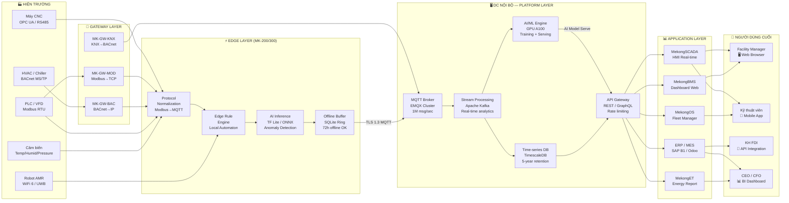

> Kiến trúc phân lớp đảm bảo: độ trễ edge < 10ms (local automation), độ trễ platform < 100ms (dashboard update), và khả năng offline hoạt động đầy đủ 72 giờ khi mất kết nối internet. Toàn bộ lưu lượng mã hoá TLS 1.3 end-to-end [A].

### 2.21.3. Sơ đồ Vòng đời Sản phẩm Tích hợp (Integrated Product Lifecycle)

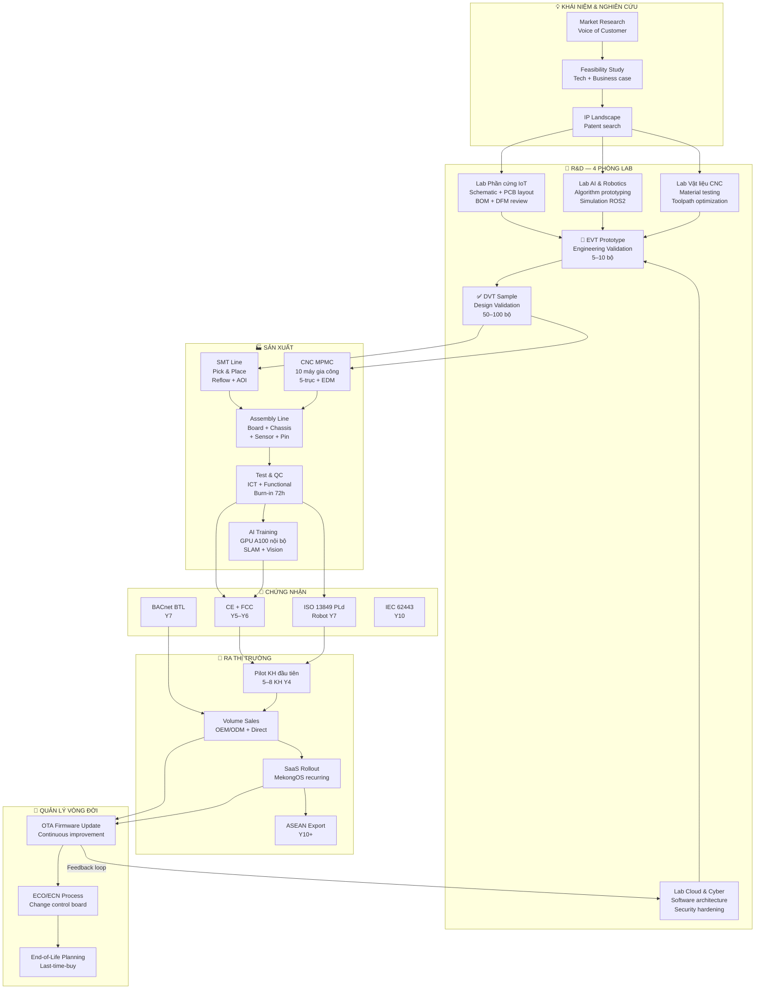

> Vòng đời sản phẩm khép kín — từ concept đến EOL — được quản lý nội bộ 100%, loại bỏ rủi ro phụ thuộc vào đơn vị thiết kế bên ngoài và rút ngắn NPI lead time xuống còn 8–12 tuần cho dòng tái sử dụng platform [A].

---

## 2.22. Dịch vụ Gia công Phần mềm và Build Phần mềm Theo Yêu cầu

### 2.22.1. Định vị Chiến lược — Tại sao Mekong làm Gia công Phần mềm?

DC nội bộ với GPU cluster và Lab Cloud & Cybersecurity (LAB4) tạo ra tiềm năng cung cấp **dịch vụ gia công phần mềm chuyên biệt** cho phân khúc IoT công nghiệp, nhúng (embedded), và AI. Đây là mảng doanh thu mới bổ sung — **không thay thế** 2 trụ cột chính — với CAPEX gần như bằng 0 vì tận dụng hạ tầng DC và R&D đã đầu tư.

| Yếu tố | Lý do Mekong có lợi thế |
|---|---|
| **Chuyên môn sâu IoT/Embedded** | Đội ngũ R&D đang phát triển firmware MK-200/DDC/Robot — năng lực sẵn có |
| **Lab AI/GPU nội bộ** | GPU A100 để huấn luyện mô hình, không cần thuê cloud tốn kém |
| **Platform tích hợp** | MekongOS là staging environment thực tế để test tích hợp ngay |
| **Khách hàng giao thoa** | FDI mua CNC/IoT hardware → thường cần cả phần mềm quản lý, dashboard, app |
| **Vị trí KCNC** | Các tenant SHTP/KCNC là khách hàng tự nhiên cho IT outsourcing nội khu |

> **Phân loại:** Mảng này hoàn toàn phù hợp QĐ 38/2020 (Hoạt động nghiên cứu–phát triển, chuyển giao công nghệ) và NĐ 76/2018 (hoạt động dịch vụ CNTT thuộc doanh nghiệp CNC) [A].

### 2.22.2. Danh mục Dịch vụ Gia công Phần mềm

| TT | Dịch vụ | Mô tả | Phân khúc khách hàng | Giá (USD) | Biên gộp |
|:---:|---|---|---|---:|:---:|
| 1 | **Embedded Firmware Development** | Phát triển firmware cho MCU/MPU (STM32, NXP, ESP32, RTOS) | Startup IoT, FDI electronics | 80-150 USD/giờ | 55-65% |
| 2 | **Custom IoT Application** | App web + mobile giám sát/điều khiển thiết bị IoT | Tòa nhà, nhà máy, khu CN | 15.000-80.000/dự án | 50-60% |
| 3 | **AI/ML Model Development** | Phát triển mô hình AI: predictive maintenance, anomaly detection, computer vision | FDI smart factory, robot SI | 20.000-150.000/dự án | 55-70% |
| 4 | **System Integration (SI) Software** | Tích hợp BMS + ERP + MES + SCADA (API bridge, middleware) | Nhà máy FDI, khu đô thị thông minh | 10.000-50.000/dự án | 50-65% |
| 5 | **OPC UA / Modbus / BACnet Driver** | Phát triển driver giao thức cho thiết bị bên thứ 3 | Siemens, Schneider integrator | 8.000-25.000/driver | 60-70% |
| 6 | **Cloud & Dashboard Development** | Xây dựng dashboard Grafana/React, data pipeline, cloud API | Tất cả | 5.000-30.000/dự án | 55-65% |
| 7 | **Cybersecurity Assessment & Hardening** | Pen testing, IEC 62443 gap analysis, OT security design | FDI có yêu cầu ISO 27001/IEC 62443 | 5.000-20.000/assessment | 65-75% |
| 8 | **Digital Twin Prototype** | Xây dựng Digital Twin cho thiết bị/quy trình sản xuất | Nhà máy FDI tầm trung | 30.000-120.000/dự án | 50-60% |

**Tổng doanh thu mục tiêu — Dịch vụ gia công phần mềm:**

| Năm | Số dự án/hợp đồng | Doanh thu (K USD) | Ghi chú |
|---:|:---:|---:|---|
| Y3 | 2-3 | 30-50 | Pilot nội bộ + KH đầu tiên trong KCNC |
| Y5 | 5-8 | 100-180 | Mở rộng ra FDI tenant SHTP |
| Y7 | 10-15 | 250-400 | Scale, thêm AI/ML contracting |
| Y10 | 15-20 | 400-600 | Steady-state, tích hợp với MekongOS SaaS |
| **Y12+** | **18-25** | **500-700** | **Ổn định, recurring SI maintenance** |

> Doanh thu gia công phần mềm **chưa tính vào 12,00M USD canonical** — đây là upside tiềm năng nếu mảng này phát triển tốt. Khi có doanh thu thực tế từ Y5, sẽ điều chỉnh vào canonical [A].

### 2.22.3. Quy trình Giao nhận Dự án Phần mềm (Software Delivery Process)

```mermaid
flowchart LR
    subgraph INTAKE["📥 TIẾP NHẬN"]
        T1["RFI / RFQ<br/>từ khách hàng"]
        T2["Technical<br/>Qualification<br/>Fit với stack VN?"]
        T3["NDA + SoW<br/>Ký kết ban đầu"]
    end

    subgraph DISCOVERY["🔍 KHÁM PHÁ"]
        D1["Requirement<br/>Workshop<br/>2-5 ngày"]
        D2["Architecture<br/>Design<br/>HLD + LLD"]
        D3["Estimate &<br/>Proposal<br/>Fixed/T&M"]
        D4["Contract<br/>Sign-off<br/>Milestone plan"]
    end

    subgraph DEV["⚙️ PHÁT TRIỂN (AGILE SPRINT)"]
        SP1["Sprint 1<br/>2 tuần<br/>Foundation + PoC"]
        SP2["Sprint 2-N<br/>2 tuần/sprint<br/>Feature dev + Test"]
        SP3["Integration<br/>Testing<br/>Staging DC nội bộ"]
        SP4["UAT<br/>User Acceptance<br/>KH review"]
    end

    subgraph DELIVERY["🚀 BÀN GIAO"]
        DL1["Code Handover<br/>Git + Docs<br/>Runbook"]
        DL2["Training<br/>KH team<br/>1-3 ngày"]
        DL3["Go-Live<br/>Support 30 ngày<br/>Hypercare"]
    end

    subgraph MAINTAIN["🔄 DUY TRÌ & MỞ RỘNG"]
        M1["SLA Support<br/>8×5 hoặc 24×7"]
        M2["Monthly<br/>Retainer<br/>Bug fix + Minor feat"]
        M3["Phase 2<br/>Proposal<br/>Upsell"]
    end

    T1 --> T2 --> T3
    T3 --> D1 --> D2 --> D3 --> D4
    D4 --> SP1 --> SP2 --> SP3 --> SP4
    SP4 --> |Approved| DL1 --> DL2 --> DL3
    SP4 --> |Change request| SP2
    DL3 --> M1 --> M2 --> M3
    M3 --> |New SoW| D1

    style INTAKE fill:#e3f2fd,stroke:#1565c0
    style DISCOVERY fill:#e8f5e9,stroke:#2e7d32
    style DEV fill:#fff3e0,stroke:#e65100
    style DELIVERY fill:#f3e5f5,stroke:#6a1b9a
    style MAINTAIN fill:#e0f2f1,stroke:#00695c
```

**Mô hình Kinh doanh Gia công Phần mềm:**

| Mô hình | Phù hợp với | Cơ chế tính giá | Ưu điểm cho Mekong |
|---|---|---|---|
| **Fixed Price** | Dự án scope rõ ràng, ≤ 3 tháng | Giá cố định theo SoW | Dự báo doanh thu dễ dàng |
| **Time & Material (T&M)** | Dự án dài hạn, scope hay thay đổi | Rate × giờ làm việc | Linh hoạt, giảm rủi ro scope creep |
| **Retainer** | Duy trì hệ thống, support liên tục | Phí cố định/tháng | Doanh thu recurring, ổn định |
| **Milestone-Based** | AI/ML project, Digital Twin | Thanh toán theo cột mốc | Dòng tiền sớm, giảm rủi ro |
| **Revenue Share** | Startup IoT có tiềm năng | % doanh thu sản phẩm | Upside tiềm năng cao |

### 2.22.4. Năng lực Kỹ thuật Đội Gia công Phần mềm

| Lĩnh vực | Ngôn ngữ / Framework | Chứng nhận mục tiêu | Năng lực hiện tại |
|---|---|---|---|
| **Embedded / Firmware** | C, C++, FreeRTOS, Zephyr, MicroPython | Arm Certified Developer | Sẵn có (từ R&D team) |
| **IoT Backend** | Python, Go, Node.js, MQTT, Kafka | AWS IoT, Azure IoT cert | Xây dựng Y4-Y5 |
| **AI/ML** | Python, PyTorch/TensorFlow, ONNX, ROS2 | NVIDIA DLI Certified | Sẵn có từ Robot R&D |
| **Frontend / Dashboard** | React.js, Grafana, D3.js, Flutter | — | Xây dựng Y4-Y5 |
| **DevOps / Cloud** | Docker, Kubernetes, Ansible, CI/CD | Kubernetes CKA | Xây dựng Y5-Y6 |
| **OT Security** | IEC 62443, NIST, Pen testing | CEH / OSCP | Xây dựng Y6-Y7 |

> **Nhân sự:** Mảng phần mềm vận hành với 8-12 kỹ sư từ **Lab Cloud & Cyber (LAB4)** và phần từ R&D team. Không cần tuyển dụng đột biến — tận dụng idle capacity giữa các sprint R&D sản phẩm. Từ Y7+, tách thành team riêng 12-15 người nếu doanh thu vượt 400K USD/năm [A].

---

## 2.23. Mô hình Tích hợp DC + R&D + Gia công — Cộng hưởng 3 Chiều

### 2.23.1. Kiến trúc Tích hợp DC với Hoạt động R&D và Gia công

DC nội bộ không chỉ là hạ tầng IT thụ động — mà là **"xương sống thông minh"** kết nối toàn bộ hoạt động R&D, sản xuất, phần mềm, và vận hành:

```mermaid
graph TB
    subgraph DC["DC NOI BO — XUONG SONG THONG MINH (5-8 Rack, 160m2)"]
        direction LR
        GPU["GPU Cluster\nA100/H100 — AI Training"]
        COMPUTE["App Servers\nMekongOS / BMS / ERP / MES"]
        STORAGE["Storage and DR\nNAS 200TB — 5yr retention"]
        NET["Network and Security\nSD-WAN / Firewall / VPN"]
    end

    subgraph USE1["R&D and PHAT TRIEN SAN PHAM"]
        direction LR
        U1A["AI SLAM / Vision\nRobot AMR training"]
        U1B["Digital Twin\nCNC + SMT sim"]
        U1C["CI/CD and OTA\nFirmware pipeline"]
    end

    subgraph USE2["VAN HANH SAN XUAT"]
        direction LR
        U2A["MES and ERP\nWork order / BOM"]
        U2B["OEE and SPC\nPredictive QC"]
        U2C["IoT giam sat\n10 CNC + nha xuong"]
    end

    subgraph USE3["GIA CONG PHAN MEM"]
        direction LR
        U3A["Dev / Staging\nDocker / K8s"]
        U3B["GPU-as-a-Tool\nAI/ML contracting"]
        U3C["Security Lab\nPen test / IEC 62443"]
    end

    subgraph USE4["SAAS and KHACH HANG"]
        direction LR
        U4A["MekongOS SaaS\n500+ tenant"]
        U4B["MekongBMS SaaS\n80-120 toa nha"]
        U4C["API Gateway\nFDI integration"]
    end

    GPU -->|AI jobs| U1A
    GPU -->|CV batch| U1B
    GPU -->|GPU tool| U3B
    COMPUTE -->|CI/CD| U1C
    COMPUTE -->|MES/ERP| U2A
    COMPUTE -->|OEE/SPC| U2B
    COMPUTE -->|Dev env| U3A
    COMPUTE -->|SaaS host| U4A
    COMPUTE -->|BMS SaaS| U4B
    COMPUTE -->|API GW| U4C
    STORAGE -->|Twin data| U1B
    STORAGE -->|QC log| U2B
    STORAGE -->|Test data| U3C
    NET -->|Pipeline| U1C
    NET -->|IoT stream| U2C
    NET -->|Staging net| U3A
    NET -->|CDN| U4C

    style DC fill:#ede7f6,stroke:#4a148c,color:#000
    style USE1 fill:#e3f2fd,stroke:#1565c0,color:#000
    style USE2 fill:#e8f5e9,stroke:#2e7d32,color:#000
    style USE3 fill:#fff3e0,stroke:#e65100,color:#000
    style USE4 fill:#fce4ec,stroke:#880e4f,color:#000
```

### 2.23.2. Phân bổ Tải DC theo Hoạt động

| Hoạt động | Rack sử dụng | GPU giờ/tháng | Storage (TB) | Tỷ trọng chi phí DC |
|---|:---:|---:|---:|:---:|
| AI Training Robot SLAM (R&D) | 1-2 | 200-400 | 10 | 25% |
| MekongOS + BMS SaaS (khách hàng) | 2 | 50 | 20 | 30% |
| ERP + MES + MekongOS nội bộ | 1 | 20 | 15 | 20% |
| Gia công phần mềm (staging, CI/CD) | 0.5-1 | 100-200 | 5 | 15% |
| Backup + DR + Security | 0.5 | 0 | 80 | 10% |
| **Tổng** | **5-7,5 rack** | **370-670** | **130** | **100%** |

> Tổng OPEX DC nội bộ ~0,40M USD/năm [C] được phân bổ theo tỷ trọng. Chi phí gia công phần mềm chiếm ~15% = **60K USD/năm** — tương đương giá thuê GPU cloud ~1.500h/tháng trên AWS (tiết kiệm ~40% so với thuê ngoài) [A].

### 2.23.3. Sơ đồ Cộng hưởng Phân khúc Gia công CNC + Phần mềm

Nhiều khách hàng FDI cần **cả hai**: gia công chi tiết cơ khí chính xác (CNC) VÀ phần mềm quản lý/giám sát (IoT/SCADA). Mekong là đơn vị duy nhất tại KCNC cung cấp cả hai trong một hợp đồng tích hợp:

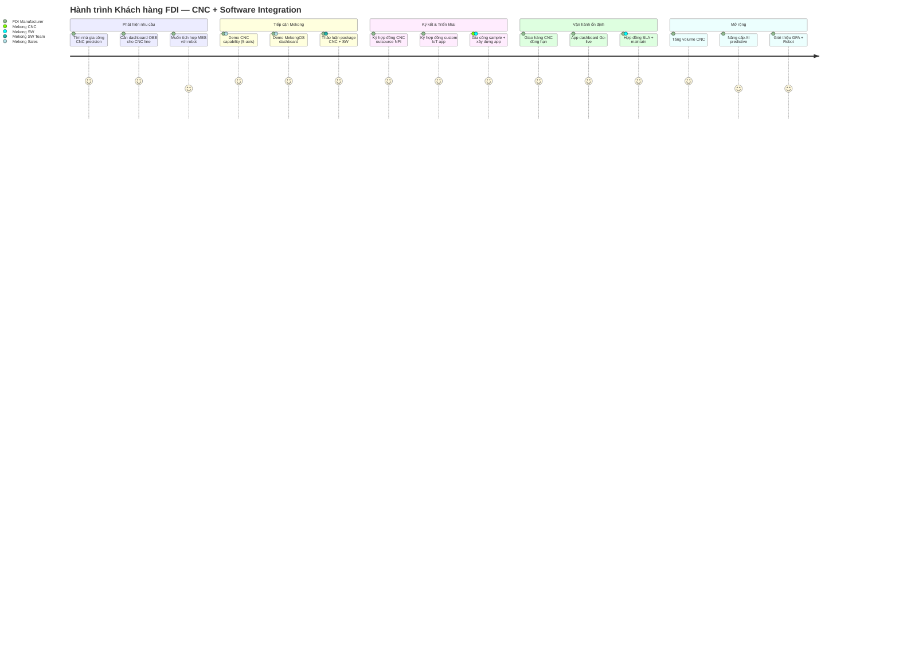

**Gói Dịch vụ Tích hợp CNC + Phần mềm (Integrated Service Package):**

| Gói | Thành phần | Giá trị (USD/năm) | Đối tượng |
|---|---|---:|---|
| **Pack A — CNC Starter** | 200 giờ CNC + MekongOS Starter (10 device) | 12.000-18.000 | SME, startup |
| **Pack B — Smart Factory Lite** | 400 giờ CNC + MES dashboard + IoT 50 device + support | 35.000-55.000 | Nhà máy tầm trung |
| **Pack C — FDI Premium** | 800+ giờ CNC 5-axis + Custom app + AMR 1 bộ + SLA | 120.000-200.000 | FDI tầm cao |
| **Pack D — Full Integration** | CNC full-time + SW team dedicated + Robot fleet + AI | > 300.000 | KH neo lớn |

> Chiến lược "bundled service" giúp tăng deal size trung bình từ 20-30K USD (CNC thuần) lên 50-150K USD (tích hợp), đồng thời tạo lock-in dài hạn thông qua SaaS subscription và maintenance contract. Tỷ lệ chuyển đổi từ CNC-only sang integrated package mục tiêu: 30% KH từ Y7 [A].

### 2.23.4. Roadmap Phát triển Mảng Gia công Phần mềm (Y3-Y12)

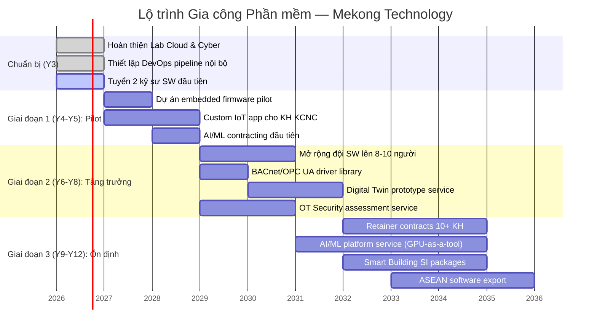

---

## 2.24. Sơ đồ Hệ thống Chi tiết — BMS + SCADA + IoT (Deployment View)

### 2.24.1. Sơ đồ Triển khai Điển hình — Tòa nhà Thương mại (BMS Full)

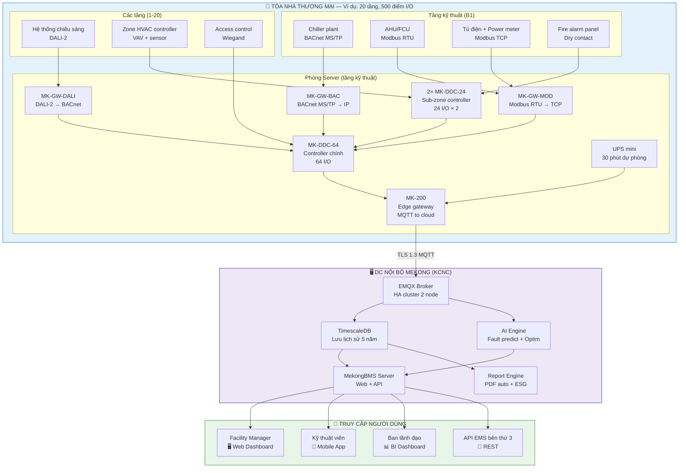

**Điểm nổi bật từ sơ đồ triển khai:**

| Thành phần Mekong | Vai trò | Thiết bị thay thế (nếu không dùng Mekong) | Tiết kiệm |
|---|---|---|---:|
| MK-DDC-64 | Controller chính toàn nhà | Schneider SmartStruxure SCD (6.000 USD) | 30-40% |
| MK-DDC-24 × 2 | Zone controller | Siemens PXC36 (2.500 USD/bộ) | 25-35% |
| MK-GW-BAC + MOD | Protocol gateway | Delta Controls (1.200 USD/bộ) | 20-30% |
| MekongBMS SaaS | Phần mềm quản lý | Honeywell EBI (15.000 USD/license) | 50-60% |
| MK-200 Edge | Cloud connectivity | 3rd party IoT gateway (800-1.200 USD) | 30-50% |
| **Tổng gói BMS full (500 điểm)** | — | **~80.000-120.000 USD** | **40-50%** |

> Giải pháp BMS trọn gói từ Mekong tiết kiệm 40-50% chi phí so với tích hợp thiết bị đa nhãn hiệu. Đây là lập luận thương mại cốt lõi khi tiếp cận khách hàng tòa nhà hạng B-C tại thị trường Việt Nam [A][B].

### 2.24.2. Sơ đồ Triển khai Điển hình — Nhà máy FDI (Smart Factory)

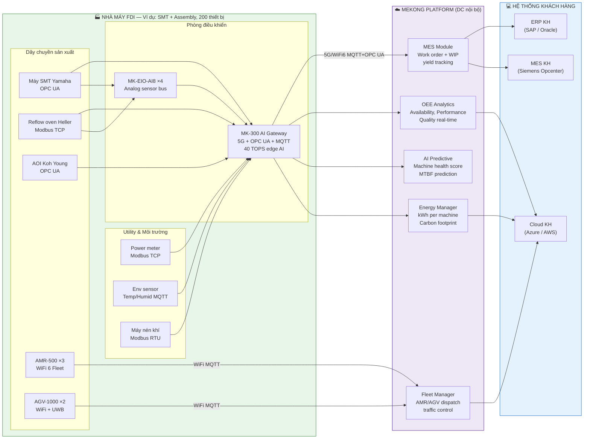

> MK-300 với 40 TOPS AI tại edge xử lý **100% dữ liệu máy sản xuất ngay tại chỗ** — chỉ gửi anomaly alert và aggregated metrics lên DC. Điều này giảm 90% băng thông và đảm bảo vận hành khi mất kết nối WAN [A].

---

## 2.25. Tổng hợp Giá trị Mảng Phát triển Mới — R&D + DC + Gia công Phần mềm

### 2.25.1. Ma trận Nguồn Doanh thu Mới (Upside V3)

| Nguồn | Năm bắt đầu | DT ổn định (K USD/năm) | CAPEX bổ sung | Biên gộp | Trạng thái |
|---|:---:|---:|---:|:---:|:---:|
| Embedded firmware contracting | Y4 | 100-150 | 0 | 60-65% | Upside |
| Custom IoT app development | Y4 | 150-200 | 0 | 55-60% | Upside |
| AI/ML model contracting | Y5 | 100-200 | 50K (GPU upgrade) | 60-70% | Upside |
| SI software integration | Y5 | 100-150 | 0 | 55-65% | Upside |
| OT Security assessment | Y6 | 50-80 | 0 | 65-75% | Upside |
| Digital Twin service | Y7 | 100-150 | 0 | 50-60% | Upside |
| **Tổng gia công phần mềm** | **Y4+** | **600-930** | **~50K** | **~60%** | |
| Integrated CNC + SW packages | Y6 | 200-400 | 0 | Mix | Upside |
| **Tổng upside tiềm năng** | | **800-1.330** | **~50K** | | |

> Tổng upside doanh thu từ gia công phần mềm và gói tích hợp tích luỹ đến steady-state ước tính **0,80-1,33M USD/năm**, tương đương 6,7-11,1% doanh thu canonical 12,00M USD. Đây là **upside phi canonical** — sẽ bổ sung vào canonical chỉ khi có hợp đồng thực tế ký kết từ Y5 [A].

### 2.25.2. Tác động lên IRR nếu Upside Thực hiện được

| Kịch bản | DT Y12+ (M USD) | IRR ước tính | NPV (50Y, WACC 12%) | Ghi chú |
|---|---:|:---:|---:|---|
| Base case (canonical) | 12,00 | 13,0% | 1,50M | [C] |
| Upside nhẹ (+0,50M/năm) | 12,50 | ~13,5% | ~1,80M | Software contracts win |
| Upside mạnh (+1,00M/năm) | 13,00 | ~14,0% | ~2,10M | Full integrated packages |
| Upside tối đa (+1,33M/năm) | 13,33 | ~14,3% | ~2,30M | Tất cả mảng phát triển |

> **Lưu ý CEO:** Bảng tác động IRR là ước tính định hướng [A] — không phải số liệu canonical. Chỉ điều chỉnh canonical khi có doanh thu thực tế xác nhận từ 2 năm liên tiếp. Nguyên tắc thận trọng tài chính bắt buộc [C].

### 2.25.3. Bảng Quyết định Ưu tiên Đầu tư Mảng Mới

| Mảng | Độ ưu tiên | Hành động ngay (Y3-Y4) | Điều kiện kích hoạt đầy đủ |
|---|:---:|---|---|
| Embedded firmware contracting | **P1** | Phân công 2 kỹ sư từ R&D team, thiết lập billing/contract template | 2+ KH ký hợp đồng |
| Custom IoT app (Dashboard, Mobile) | **P1** | Xây dựng reusable framework từ MekongOS | 3+ KH pilot |
| AI/ML contracting | **P2** | Chuẩn bị GPU usage metering, pricing model | 1 AI project anchor |
| SI + BMS integration | **P2** | Package template + SoW template chuẩn | BMS deal > 50K |
| Digital Twin service | **P3** | Sau khi MekongOS v2.0 stable | Smart factory anchor KH |
| OT Security | **P3** | Sau khi có OSCP/CEH certified engineer | FDI yêu cầu IEC 62443 |