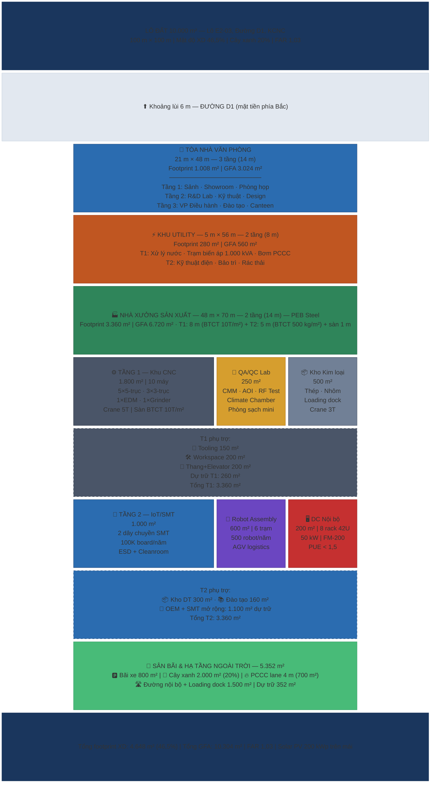

# PHẦN IV: HẠ TẦNG KỸ THUẬT

---

## 4.1. Quy hoạch Tổng mặt bằng

### 4.1.1. Thông tin Khu đất

| Thông số | Giá trị | Ghi chú |
|---|---:|---|
| Diện tích lô đất | 10.000 m² | 1 ha, Lô E2-03 KCNC |
| Mật độ xây dựng cho phép | 70% | Quy định KCNC TP.HCM |
| Mật độ xây dựng thực tế | 46,5% | 4.648 m² footprint [C] |
| Chiều cao tối đa | 14 m | Quy định KCNC |
| Hệ số sử dụng đất (FAR) | 1,03 | 10.304 m² GFA / 10.000 m² đất [C] |
| Khoảng lùi trước | 6 m | Tối thiểu theo quy định |
| Khoảng lùi sau | 4 m | Tối thiểu theo quy định |
| Khoảng lùi bên | 4 m | Mỗi bên |

### 4.1.2. Bố trí 3 Khu vực Chính

| Khu vực | Kích thước | Footprint | Số tầng | Chiều cao | GFA | Chức năng chính |
|---|---|---:|:---:|---:|---:|---|
| **Tòa nhà Văn phòng** | 21 m x 48 m | 1.008 m² | 3 | 14 m | 3.024 m² | VP, R&D Lab, Phòng họp, Đào tạo |
| **Nhà xưởng Sản xuất** | 48 m x 70 m | 3.360 m² | **2** | **14 m** | **6.720 m²** | T1: CNC, QA, Kho KL — T2: IoT/SMT, Robot, DC, OEM |
| **Khu Utility** | 5 m x 56 m | 280 m² | **2** | **8 m** | **560 m²** | T1: Nước, điện, rác — T2: KT điện, bảo trì |
| **Tổng công trình** | — | **4.648 m²** | — | — | **10.304 m²** | |
| **Sân bãi** | — | 5.352 m² | — | — | — | Đường, bãi xe, cây xanh, PCCC lane |

> **Tăng tầng (CEO 2026-03-18):** KCNC cho phép chiều cao tối đa 14 m. Nhà xưởng tăng từ 1 tầng (12 m) lên **2 tầng (14 m)**: Tầng 1 cao 8 m (khu nặng — CNC, crane 5T) + Tầng 2 cao 5 m (khu nhẹ — SMT, Robot) + 1 m kết cấu sàn. Khu Utility tăng lên 2 tầng (8 m). Tổng GFA tăng từ 6.664 → **10.304 m²** (+54,6%) mà **footprint không đổi** (4.648 m², 46,5%). CAPEX giữ 22,00M USD bằng tái phân bổ nội bộ [C].

### 4.1.3. Layout Tổng thể — Mặt bằng 1 ha



### 4.1.4. Bảng Cân đối Diện tích

**A. Cân đối Footprint (mặt đất):**

| Hạng mục | Diện tích (m²) | Tỷ lệ (%) |
| --- | ---: | ---: |
| Tòa nhà Văn phòng (footprint) | 1.008 | 10,1% |
| Nhà xưởng Sản xuất (footprint) | 3.360 | 33,6% |
| Khu Utility (footprint) | 280 | 2,8% |
| **Tổng diện tích xây dựng** | **4.648** | **46,5%** |
| Đường nội bộ + Loading dock | 1.500 | 15,0% |
| Bãi xe (xe con + xe tải) | 800 | 8,0% |
| Cây xanh + Cảnh quan | 2.000 | 20,0% |
| PCCC lane (4m quanh công trình) | 700 | 7,0% |
| Dự trữ | 352 | 3,5% |
| **Tổng mặt bằng** | **10.000** | **100%** |

**B. Tổng hợp GFA (tổng diện tích sàn xây dựng):**

| Công trình | Footprint (m²) | Số tầng | GFA (m²) | Ghi chú |
| --- | ---: | :---: | ---: | --- |
| Tòa nhà Văn phòng | 1.008 | 3 | 3.024 | BTCT, 14 m |
| Nhà xưởng Sản xuất | 3.360 | **2** | **6.720** | PEB Steel, 14 m (T1: 8 m + T2: 5 m + sàn 1 m) |
| Khu Utility | 280 | **2** | **560** | Kết cấu nhẹ, 8 m |
| **Tổng** | **4.648** | — | **10.304** | FAR = 1,03 |

> **Kiểm tra:** Mật độ xây dựng 46,5% < 70% (cho phép). Cây xanh 20,0% >= 20% (quy định KCNC). PCCC lane 4m quanh toàn bộ công trình. FAR = 10.304 / 10.000 = 1,03. Chiều cao tất cả công trình <= 14 m [C].

---

## 4.2. Tòa nhà Văn phòng 3 Tầng (21m x 48m)

| Tầng | Chiều cao | Diện tích | Chức năng chi tiết |
|---|---:|---:|---|
| **Tầng 1** | 5,0 m | 1.008 m² | Sảnh chính (200 m²) + Showroom sản phẩm (150 m²) + Phòng họp lớn (100 m²) + 2 Phòng họp nhỏ (2x40 m²) + Phòng tiếp khách (80 m²) + WC + Thang máy + Cầu thang + Hành lang (338 m²) |
| **Tầng 2** | 4,5 m | 1.008 m² | R&D Lab IoT (250 m²) + R&D Lab Robot (200 m²) + Phòng thiết kế CAD/CAM (150 m²) + Văn phòng Kỹ thuật (200 m²) + Phòng server nhỏ (40 m²) + WC + Hành lang (168 m²) |
| **Tầng 3** | 4,5 m | 1.008 m² | VP Tổng Giám đốc (80 m²) + VP Ban Giám đốc (120 m²) + VP Hành chính-Kế toán (150 m²) + Phòng đào tạo (120 m²) + Canteen (200 m²) + Phòng kỹ thuật M&E (80 m²) + WC + Hành lang (178 m²) |
| **Tổng** | **14,0 m** | **3.024 m²** | Bao gồm thang máy + cầu thang bộ |

> **Kết cấu:** Khung BTCT, sàn BTCT dự ứng lực, tường gạch + kính Low-E, mái BTCT + chống thấm + Solar PV 200 kWp. Thiết kế kiến trúc hiện đại, phù hợp quy hoạch KCNC. Áp dụng tiêu chuẩn công trình xanh **EDGE** (IFC) — tiết kiệm năng lượng >= 20%, tiết kiệm nước >= 20%, giảm carbon vật liệu >= 20%.

### 4.2.2. Chi tiết R&D Lab — Tầng 2 (1.008 m2)

R&D Lab là khu vực chiến lược phục vụ phát triển sản phẩm IoT/BMS/Robot, đặt tại Tầng 2 cùng khu kỹ thuật thiết kế:

| TT | Khu vực | Diện tích (m2) | Trang thiết bị chính | Nhiệt độ / Điều kiện |
|:---:|---|---:|---|---|
| 1 | R&D Lab IoT/BMS | 250 | 12 trạm làm việc với oscilloscope, logic analyzer, nguồn DC, scope, IoT Dev Kit; khu hàn SMD thủ công; kệ linh kiện ESD-safe | 22-24 C, RH 45-55%, ESD floor |
| 2 | R&D Lab Robot | 200 | Khu lắp ráp prototype robot (2 bàn), khu test servo/motor, LiDAR test bench, khu nạp/test pin LiFePO4, khu software debug | 24-26 C, sàn epoxy |
| 3 | Phòng Thiết kế CAD/CAM | 150 | 8 workstation (i9/Xeon, 64GB RAM, RTX Ada, 2 màn 32") cho SolidWorks, NX CAM, Altium Designer, MATLAB | 22-24 C |
| 4 | VP Kỹ thuật | 200 | 16 bàn làm việc cho kỹ sư firmware, embedded, AI/ML, QA software | 22-24 C |
| 5 | Phòng Server nhỏ | 40 | 2 rack: build server, CI/CD, Git, NAS backup, license server | 22 ± 1 C, UPS riêng |
| 6 | WC + Hành lang | 168 | | |
| | **Tổng Tầng 2** | **1.008** | | |

**Trang thiết bị R&D Lab chính:**

| TT | Thiết bị | Số lượng | Chi phí (K USD) | Phục vụ |
|:---:|---|:---:|---:|---|
| 1 | Workstation CAD/CAM (SolidWorks/NX) | 8 | 40 | Thiết kế sản phẩm CNC + PCB |
| 2 | Oscilloscope 4-ch 500 MHz (Keysight/Tektronix) | 6 | 30 | Debug IoT firmware |
| 3 | Logic Analyzer 16-ch | 4 | 8 | Debug protocol SPI/I2C/UART |
| 4 | Nguồn DC programmable (0-60V, 0-10A) | 6 | 6 | Power testing |
| 5 | IoT Dev Kit (ESP32, STM32, nRF52, Jetson) | 20 | 5 | Prototype nhanh |
| 6 | 3D Printer (FDM + SLA) | 2 | 10 | Prototype vỏ/jig nhanh |
| 7 | PCB CNC router (ProtoMat) | 1 | 25 | Prototype PCB nội bộ 24h |
| 8 | RF Test Equipment (Vector Network Analyzer) | 1 | 20 | Antenna design IoT |
| 9 | Software License (SolidWorks, Altium, NX, MATLAB) | — | 50 | Annual subscription |
| 10 | Hệ thống CI/CD + Git Server + NAS | 1 set | 15 | Build automation, backup |
| | **Tổng R&D Equipment** | | **209** | Nằm trong CAPEX Phase 2 |

> R&D Lab phục vụ nhóm 20-30 kỹ sư R&D (mục tiêu Y5-Y8, xem P7 §7.3). Năng lực prototype: từ ý tưởng → schematic → PCB prototype → firmware → functional test trong **4-6 tuần** nội bộ, không cần outsource. Đây là lợi thế speed-to-market quan trọng so với đối thủ phải gửi PCB ra ngoài (lead time 2-4 tuần chỉ riêng fab) [A].

---

## 4.3. Nhà xưởng Sản xuất (48m x 70m — 2 tầng, 14 m)

> **Tóm tắt:** Nhà xưởng 2 tầng, kết cấu PEB Steel, chiều cao tổng 14 m (T1: 8 m + sàn BTCT 1 m + T2: 5 m). Footprint 3.360 m², GFA 6.720 m². Tầng 1 dành cho khu nặng (CNC, QA, Kho kim loại) với sàn BTCT tải trọng 10 tấn/m² và cầu trục 5T. Tầng 2 dành cho khu nhẹ (IoT/SMT, Robot, DC nội bộ, OEM dự trữ) với sàn BTCT 500 kg/m². Mái tôn cách nhiệt + Solar PV 200 kWp. Áp dụng tiêu chuẩn **EDGE** cho thiết kế tiết kiệm năng lượng và nước [C].

### 4.3.1. Phân khu Tầng 1 — Khu nặng (cao 8 m, sàn BTCT 10T/m²)

| Khu vực | Diện tích (m²) | Tỷ lệ T1 | Chức năng |
|---|---:|---:|---|
| **Khu CNC** | 1.800 | 53,6% | 10 máy CNC (5×5-trục + 3×3-trục + 1 EDM + 1 Grinder), cầu trục 5T |
| **QA/QC Lab** | 250 | 7,4% | CMM, AOI, RF Test, Climate Chamber, phòng sạch mini |
| **Kho Kim loại** | 500 | 14,9% | Thép, nhôm, đồng; loading dock; crane 3T |
| **Tooling / Fixture** | 150 | 4,5% | Bàn gá, dụng cụ cắt, khuôn mẫu |
| **Workspace / Operator** | 200 | 6,0% | Bàn gia công, đo lường inline |
| **Thang + Elevator hàng** | 200 | 6,0% | Thang máy tải 3T + cầu thang bộ + ramp |
| **Dự trữ T1** | 260 | 7,7% | Mở rộng CNC giai đoạn 2 |
| **Tổng Tầng 1** | **3.360** | **100%** | |

### 4.3.2. Phân khu Tầng 2 — Khu nhẹ (cao 5 m, sàn BTCT 500 kg/m²)

| Khu vực | Diện tích (m²) | Tỷ lệ T2 | Chức năng |
|---|---:|---:|---|
| **Khu IoT/SMT** | 1.000 | 29,8% | 2 dây chuyền SMT, hàn, lắp ráp PCB, kiểm tra |
| **Robot Assembly** | 600 | 17,9% | 6 trạm lắp ráp Robot AMR/AGV, testing, calibration, AGV logistics |
| **DC Nội bộ** | 200 | 6,0% | 8 rack 42U, UPS, cooling FM-200, network |
| **Kho Điện tử** | 300 | 8,9% | Linh kiện SMD, bán thành phẩm, ESD safe |
| **Phòng Đào tạo** | 160 | 4,8% | Training center, tài liệu kỹ thuật |
| **OEM + SMT mở rộng** | 1.100 | 32,7% | Dự trữ: OEM gia công + mở rộng SMT line 3-4 (giai đoạn 2) |
| **Tổng Tầng 2** | **3.360** | **100%** | |

### 4.3.3. Chi tiết Khu CNC — T1 (1.800 m²)

| TT | Thiết bị | Số lượng | Kích thước (m) | Diện tích chiếm | Dòng điện | Trọng lượng |
|:---:|---|:---:|---|---:|---:|---:|
| 1 | CNC 5-trục (DMG Mori DMU 50/Mazak) | 5 | 3,5 x 4,0 | 14,0 m²/máy | 30 kW | 8.000 kg |
| 2 | CNC 3-trục (Haas VF-2SS/Mazak) | 3 | 3,0 x 3,5 | 10,5 m²/máy | 22 kW | 5.000 kg |
| 3 | Wire EDM (Sodick/Mitsubishi) | 1 | 2,5 x 3,0 | 7,5 m² | 15 kW | 3.000 kg |
| 4 | Surface Grinder (Okamoto) | 1 | 2,0 x 3,0 | 6,0 m² | 10 kW | 2.500 kg |
| | **Tổng khu vực máy** | **10** | | **145,5 m²** | **255 kW** | |

> **Bố trí T1:** 10 máy chiếm ~145 m² mặt sàn. Còn lại 1.655 m² cho: lối đi vận chuyển + crane lane (500 m²), khu tooling/fixture (150 m²), bàn đo lường inline (100 m²), workspace operator (200 m²), khu NVL vào/thành phẩm ra (350 m²), hành lang an toàn (95 m²), dự trữ CNC giai đoạn 2 (260 m²). Cầu trục 5T phủ toàn bộ khu CNC. Khoảng cách giữa các máy tối thiểu 2 m theo quy định an toàn lao động [C].

### 4.3.4. Chi tiết Khu QA/QC — T1 (250 m²)

| TT | Thiết bị / Khu vực | Diện tích (m²) | Mô tả |
|:---:|---|---:|---|
| 1 | CMM (Coordinate Measuring Machine) | 40 | Zeiss/Mitutoyo, đo 3D chính xác |
| 2 | Máy đo nhám / đo cứng / đo 2D | 30 | Surface roughness, hardness, profile |
| 3 | AOI + SPI (PCB inspection) | 30 | Automated Optical Inspection cho SMT |
| 4 | RF Test Chamber | 25 | Kiểm tra tần số radio (IoT products) |
| 5 | Climate Chamber | 25 | -40°C ~ +85°C, humidity test |
| 6 | Phòng sạch mini (Class 10K) | 40 | Kiểm tra sản phẩm nhạy cảm |
| 7 | Workspace + lối đi | 60 | |
| | **Tổng** | **250** | |

> **Liên thông T1-T2:** Elevator hàng 3T cho phép di chuyển sản phẩm giữa CNC (T1) và SMT/Robot (T2) trong 2 phút. QA Lab đặt tại T1 gần khu CNC — nơi yêu cầu đo lường chính xác nhất [A].

### 4.3.5. Chi tiết Khu IoT/SMT — T2 (1.000 m²)

| TT | Thiết bị / Khu vực | Diện tích (m²) | Mô tả |
|:---:|---|---:|---|
| 1 | Dây chuyền SMT số 1 (Pick & Place + Reflow) | 200 | 8.000 CPH, sản phẩm IoT chính |
| 2 | Dây chuyền SMT số 2 (Pick & Place + Reflow) | 200 | 8.000 CPH, sản phẩm BMS/SCADA |
| 3 | Khu hàn thủ công + Rework | 80 | 8 trạm hàn, kính hiển vi |
| 4 | Khu kiểm tra ICT/FCT | 120 | In-Circuit Test + Functional Test |
| 5 | Khu lắp ráp thành phẩm | 150 | Lắp vỏ, dán nhãn, đóng gói |
| 6 | Khu lưu trữ linh kiện (ESD safe) | 100 | Tủ chống ẩm, kho linh kiện SMD |
| 7 | Lối đi + Workspace | 150 | Cleanroom ISO 8 |
| | **Tổng** | **1.000** | Công suất: 100K board/năm (2 line) |

### 4.3.6. Chi tiết Khu Robot Assembly — T2 (600 m²)

| TT | Thiết bị / Khu vực | Diện tích (m²) | Mô tả |
|:---:|---|---:|---|
| 1 | Trạm lắp ráp Robot (6 trạm) | 240 | Mỗi trạm 40 m², lắp AMR/AGV |
| 2 | Khu testing + Calibration | 120 | Đường test 15 m, calibration sensor |
| 3 | Khu lập trình + Nạp firmware | 60 | 4 trạm lập trình, debug station |
| 4 | Khu đóng gói + Xuất hàng | 80 | Đóng kiện, vận chuyển qua elevator |
| 5 | AGV logistics lane | 60 | Đường AGV nội bộ T2 |
| 6 | Lối đi + Workspace | 40 | |
| | **Tổng** | **600** | Công suất: 500 robot/năm |

### 4.3.7. Phòng DC Nội bộ — T2 (200 m²)

| Hạng mục | Thông số | Ghi chú |
|---|---|---|
| Số lượng rack | 8 rack 42U | ERP, MES, SCADA, AI training, backup |
| Công suất điện | 50 kW | UPS 80 kVA (N+1) + ATS |
| Làm mát | Precision cooling 30 kW | In-row cooling, redundant N+1 |
| Mạng | 10 Gbps LAN, 1 Gbps WAN | 2 ISP redundant |
| PCCC | FM-200 gas | Tuyệt đối KHÔNG dùng nước |
| Kiểm soát | Access card + CCTV + Biometric | Giới hạn nhân sự truy cập |
| PUE mục tiêu | < 1,5 | In-row cooling + hot/cold aisle |

> **Lưu ý:** Đây là phòng server nội bộ quy mô nhỏ (8 rack), KHÔNG PHẢI trung tâm dữ liệu thương mại. Không cần giấy phép viễn thông. Chi phí CAPEX: 2,20M USD (10,0% tổng dự án) bao gồm: rack + server + UPS + cooling + network + phần mềm [C].

---

## 4.4. Khu Utility (5m x 56m — 2 tầng, 8 m | GFA 560 m²)

> Khu Utility tăng từ 1 tầng (4 m) lên **2 tầng (8 m)**, GFA 560 m² (footprint 280 m²). Tầng 1: hệ thống năng lượng, xử lý nước, PCCC. Tầng 2: kỹ thuật điện T2, bảo trì, phụ trợ [C].

### 4.4.1. Tầng 1 — Năng lượng và Xử lý (280 m²)

| TT | Hạng mục | Diện tích (m²) | Mô tả |
|:---:|---|---:|---|
| 1 | Trạm biến áp 1.000 kVA | 40 | 22kV/0,4kV, kiểu kín |
| 2 | Phòng phân phối điện | 30 | Tủ động lực, tủ điều khiển |
| 3 | Hệ thống xử lý nước thải CNC | 60 | Xử lý dầu cắt, KL nặng, ZLD |
| 4 | Bơm cấp nước + Bể nước ngầm | 40 | Bể chứa 50 m³ |
| 5 | Trạm nén khí | 30 | 2 máy nén khí 15HP, bình chứa |
| 6 | Khu rác thải phân loại | 30 | Rác CN, rác sinh hoạt, rác nguy hại |
| 7 | Bơm PCCC + Bể nước PCCC | 50 | Bể 100 m³, 2 bơm N+1 |
| | **Tổng T1** | **280** | |

### 4.4.2. Tầng 2 — Kỹ thuật điện và Bảo trì (280 m²)

| TT | Hạng mục | Diện tích (m²) | Mô tả |
|:---:|---|---:|---|
| 1 | Phòng kỹ thuật điện T2 | 60 | Tủ phân phối cho T2 xưởng, ATS |
| 2 | Xưởng bảo trì cơ khí | 80 | Bàn nguội, máy tiện nhỏ, dụng cụ |
| 3 | Kho phụ tùng / vật tư | 60 | Phụ tùng thay thế, vật tư tiêu hao |
| 4 | Phòng AHU (HVAC central) | 40 | AHU cho T2 xưởng, ESD area |
| 5 | Lối đi + cầu thang | 40 | |
| | **Tổng T2** | **280** | |

---

## 4.5. Hệ thống Điện Tổng hợp

### 4.5.1. Phụ tải Điện tổng

| Khu vực | Công suất (kW) | Ghi chú |
|---|---:|---|
| CNC 10 máy — Tầng 1 | 255 | Peak load khi 10 máy chạy đồng thời |
| IoT/SMT line (1.000 m²) — Tầng 2 | 65 | AHU + SMT line + kiểm tra (tăng do AHU lớn hơn) |
| Robot Assembly (600 m²) — Tầng 2 | 30 | Lắp ráp + testing + AC bổ sung |
| DC Nội bộ (200 m²) — Tầng 2 | 60 | Server + precision cooling + UPS (8 rack) |
| Tòa nhà VP (điều hòa, đèn, thang máy) | 120 | 3 tầng |
| Khu Utility — 2 tầng (bơm, nén khí, xử lý nước, bảo trì) | 65 | +10 kW T2 kỹ thuật điện |
| Thang hàng + Thang bộ T2 (điện) | 15 | 1 thang hàng 2T + chiếu sáng hành lang |
| **Tổng phụ tải đỉnh** | **610 kW** | |
| Dự phòng 20% | 122 | |
| **Tổng thiết kế** | **732 kW** | |

### 4.5.2. Nguồn điện

| Nguồn | Công suất | Vai trò |
|---|---:|---|
| Lưới điện KCNC 22kV | **1.250 kVA transformer** | Nguồn chính (tăng từ 1.000 kVA do T2 +82 kW) |
| Solar PV Rooftop | 200 kWp | ~20% điện năng, đáp ứng tiêu chí NLTT SHTP 2026 |
| UPS (DC nội bộ) | 80 kVA | Backup 15 phút cho server (tăng theo DC 200 m²) |
| Máy phát điện diesel | 500 kVA | Backup toàn nhà khi mất điện |

> **Hóa đơn điện dự kiến:** ~610 kW x 2 ca (16h/ngày) x 300 ngày x 2.500 VND/kWh = ~7,3 tỷ VND/năm (~293.000 USD/năm). Solar PV 200 kWp giảm ~11% + mua REC cho 9% còn lại = tổng **20% NLTT**, tiết kiệm ~59.000 USD/năm [C]. Đáp ứng tiêu chí ưu tiên SHTP 2026 về năng lượng tái tạo.

### 4.5.3. Sơ đồ Nguyên lý Cấp Điện (Single-Line Diagram)

```
       LƯỚI KCNC 22kV
            |
     [Máy biến áp 1.000 kVA]
     22kV / 0,4kV (Dyn11)
            |
     +------+------+
     |             |
  [ATS]     [Solar Inverter]
     |        200 kWp
     |             |
  [MDB - Tủ Phân phối Chính 0,4kV]
     |
     +----+----+----+----+----+----+
     |    |    |    |    |    |    |
   DB-CNC DB-SMT DB-VP DB-DC DB-UT DB-PV DB-PCCC
   255kW  50kW 120kW 50kW 55kW  20kW  Bơm
     |                   |
   10 máy            [UPS 60kVA]
   CNC                   |
                      Server DC
                      +MES+BMS
            |
     [Generator 500 kVA - Diesel]
     (Backup qua ATS khi mất lưới)
```

**Phân bổ tải theo thanh cái (busbar):**

| Thanh cái | Phụ tải chính | Công suất (kW) | Priority |
|---|---|---:|---|
| DB-CNC | 10 máy CNC + Coolant + Mist (T1) | 275 | Essential |
| DB-SMT | SMT line + AHU T2 + ICT/FCT | 65 | Essential |
| DB-ROBOT | Robot Assembly T2 + Kho DT + Đào tạo | 30 | Normal |
| DB-VP | VP 3 tầng (VRV/VRF + đèn + ổ cắm) | 120 | Normal |
| DB-DC | UPS + Server + Precision AC (T2) | 60 | Critical |
| DB-UT | Bơm + Nén khí + ZLD + T2 kỹ thuật | 65 | Essential |
| DB-T2 | Thang hàng + chiếu sáng hành lang T2 | 15 | Normal |
| DB-PV | Solar PV inverter (regenerative) | -200 peak | — |
| DB-PCCC | Bơm chữa cháy (diesel backup riêng) | 30 | Life-safety |

> Khi mất điện lưới: ATS chuyển sang Generator 500 kVA trong nhỏ hơn 10 giây. UPS DC bridge server trong 15 phút. Tải Life-safety (PCCC) có diesel backup riêng. Solar PV chuyển anti-islanding tự ngắt [B].

---

## 4.6. Hệ thống PCCC

| Khu vực | Giải pháp | Tiêu chuẩn |
|---|---|---|
| Nhà xưởng T1 — CNC/QA/Kho | Sprinkler tầm ướt + bình chữa xách tay | TCVN 7336:2003, NĐ 136/2020 |
| Nhà xưởng T2 — IoT/SMT | Sprinkler tầm ướt + khí FM-200 (khu ESD) | NFPA 75, NĐ 136/2020 |
| Nhà xưởng T2 — Robot/OEM | Sprinkler tầm ướt | TCVN 7336:2003 |
| Phòng DC nội bộ (T2) | Khí FM-200 | NFPA 75/2000, KHÔNG dùng nước |
| Tòa nhà VP | Sprinkler + bình chữa + báo khói | TCVN 5738:2001 |
| Khu Utility T1 + T2 | Sprinkler + báo khói | TCVN 7336:2003 |
| Thang hàng + Cầu thang T2 | Hệ thống thoát nạn 2 tầng + Exit sign | TCVN 3254:1989, NĐ 136/2020 |
| Ngoài trời | Trụ cứu hỏa, lane PCCC 4m | NĐ 136/2020 |

### 4.6.1. Chi tiết Thiết bị PCCC

| TT | Hạng mục | Số lượng / Quy mô | Đơn giá (USD) | Tổng (USD) |
|:---:|---|---|---:|---:|
| 1 | Hệ thống sprinkler tầm ướt — Xưởng T1 (3.360 m², ~120 đầu phun) | 1 hệ thống | — | 80.000 |
| 2 | Hệ thống sprinkler tầm ướt — Xưởng T2 (3.360 m², ~120 đầu phun) | 1 hệ thống | — | 80.000 |
| 3 | Hệ thống FM-200 — DC T2 (200 m²) + khu ESD SMT (120 m²) | 2 zone | — | 50.000 |
| 4 | Hệ thống sprinkler VP 3 tầng (3.024 m²) | 1 hệ thống, ~100 đầu phun | — | 60.000 |
| 5 | Hệ thống báo cháy tự động (toàn khu — 2 tầng xưởng) | 1 trung tâm, 260 detector | — | 42.000 |
| 6 | Hệ thống thoát nạn T2 — 2 cầu thang + Exit sign + Emergency light | 1 bộ | — | 18.000 |
| 7 | Bình chữa cháy xách tay | 55 bình (CO₂ + bột) | 150 | 8.250 |
| 8 | Trụ cứu hỏa ngoài trời | 6 trụ | 2.000 | 12.000 |
| 9 | Bơm chữa cháy (điện + diesel backup) | 2 bộ | — | 40.000 |
| 10 | Bể nước PCCC | 100 m³ | — | 15.000 |
| 11 | Tủ vòi chữa cháy trong nhà (T1 + T2) | 18 tủ | 800 | 14.400 |
| 12 | Đường ống + Lắp đặt + Nghiệm thu (2 tầng) | — | — | 80.350 |
| | **Tổng PCCC** | | | **500.000** |

> Chi phí PCCC = 0,50M USD = 2,3% CAPEX. Đã điều chỉnh trong Phase 1 (item 9 CAPEX, từ 0,40M → 0,50M do bổ sung sprinkler T2, hệ thống thoát nạn 2 tầng và thêm 60 detector). Toàn bộ hệ thống thiết kế theo TCVN 7336:2003 + NĐ 136/2020/NĐ-CP. Nghiệm thu bởi Cảnh sát PCCC TP.HCM trước khi vận hành [C].

---

## 4.7. Hệ thống Cấp thoát Nước và Xử lý Nước thải

### 4.7.1. Nhu cầu Nước

| Mục đích | Lượng (m³/ngày) | Ghi chú |
|---|---:|---|
| Sinh hoạt (100-130 người) | 8-10 | 80 lít/người/ngày |
| CNC coolant (dung dịch cắt gọt) | 5-8 | Tuần hoàn 90%, bổ sung hao hụt |
| Rửa chi tiết CNC | 2-3 | Nước khử ion (DI water) |
| Làm mát (chiller + HVAC) | 3-5 | Tháp giải nhiệt tuần hoàn |
| Tưới cây xanh | 2-4 | Nước mưa thu hồi ưu tiên |
| Vệ sinh nhà xưởng | 1-2 | |
| **Tổng (ngày thường)** | **21-32** | |
| **Tổng (peak — mùa khô)** | **35-40** | Bổ sung tưới cây + chiller tải cao |

### 4.7.2. Hệ thống ZLD cho CNC (Zero Liquid Discharge)

Toàn bộ nước thải CNC (dầu cắt, kim loại nặng, mạt sắt) được xử lý theo quy trình khép kín, **KHÔNG xả ra môi trường**.

| Bước | Công đoạn | Thiết bị | Công suất |
|:---:|---|---|---|
| 1 | Thu gom dung dịch cắt gọt đã dùng | Bể thu gom inox 2 m³ | 500 lít/mẻ |
| 2 | Tách dầu/nước (oil skimmer) | Oil skimmer belt type | 200 lít/giờ |
| 3 | Lắng kim loại + Keo tụ tạo bông | Bể lắng 2 ngăn + PAC/polymer | 1 m³/giờ |
| 4 | Lọc áp lực (sand + activated carbon) | Bộ lọc 2 cột DN200 | 1 m³/giờ |
| 5 | Khử trùng UV | Đèn UV 40W | Liên tục |
| 6 | Tái sử dụng (rửa chi tiết, tưới cây) | Bể chứa nước tái chế 5 m³ | — |
| 7 | Cô đặc bùn/cặn | Máy ép bùn khung bản | 50 kg bùn khô/ngày |

> **Hiệu quả ZLD:** Tái sử dụng ~85-90% nước CNC. Bùn kim loại nặng (chất thải nguy hại) thu gom bởi đơn vị có giấy phép theo NĐ 08/2022/NĐ-CP. Chi phí hệ thống ZLD: ~60.000 USD (nằm trong M&E budget). Đáp ứng tiêu chí Thông báo SHTP 2026 về quản lý tài nguyên nước [C].

### 4.7.3. Thu Nước mưa

| Thông số | Giá trị | Ghi chú |
|---|---:|---|
| Diện tích mái thu nước | ~4.500 m² | VP + Xưởng + Utility |
| Lượng mưa trung bình TP.HCM | 1.800 mm/năm | 6 tháng mùa mưa (tháng 5-11) |
| Sản lượng thu hồi (hiệu suất 70%) | ~5.670 m³/năm | ~15,5 m³/ngày trung bình |
| Bể chứa nước mưa | 30 m³ | Ngầm, bê tông cốt thép |
| Mục đích sử dụng | — | Tưới cây xanh, vệ sinh sân bãi |

> Nước mưa thu hồi ước tính tiết kiệm ~30% nhu cầu nước không sinh hoạt. Phù hợp tiêu chí công trình xanh **EDGE** về tiết kiệm nước >= 20% [C].

### 4.7.4. Thoát Nước

| Loại | Hệ thống | Đấu nối |
|---|---|---|
| Nước mưa | Ống HDPE DN300, hố ga, hố thu | Hệ thống thoát nước mưa KCNC |
| Nước thải sinh hoạt | Bể tự hoại 3 ngăn → XLNT tập trung KCNC | Hệ thống thoát nước KCNC |
| Nước thải CNC | ZLD → Tái sử dụng (không xả) | Không đấu nối — khép kín |
| Nước thải DC nội bộ | Ngưng tụ từ precision cooling → Thu hồi | Lượng nhỏ (~5 lít/ngày) |

---

## 4.8. Hệ thống Điều hòa Không khí (HVAC)

### 4.8.1. Tòa nhà Văn phòng

| Tầng | Diện tích (m²) | Giải pháp | Công suất | Ghi chú |
|---|---:|---|---:|---|
| Tầng 1 | 1.008 | VRV/VRF (Daikin/Mitsubishi) | 80 kW (~28 HP) | Sảnh + Showroom + Phòng họp |
| Tầng 2 | 1.008 | VRV/VRF + PAU (fresh air) | 85 kW (~30 HP) | R&D Lab cần nhiệt độ ổn định 22-24°C |
| Tầng 3 | 1.008 | VRV/VRF | 75 kW (~26 HP) | VP + Đào tạo + Canteen |
| **Tổng VP** | **3.024** | | **240 kW** | Efficiency COP >= 3,5 |

### 4.8.2. Nhà xưởng Sản xuất — Tầng 1 (Khu nặng, 8 m)

| Khu vực | Diện tích (m²) | Giải pháp | Ghi chú |
|---|---:|---|---|
| Khu CNC (T1) | 1.800 | Quạt công nghiệp Ø1.200 mm × 8 bộ + Hút mist + Spot cooling | CNC tỏa nhiệt lớn, thông gió cưỡng bức liên tục |
| QA/QC Lab (T1) | 250 | Điều hòa split + Precision AC khu CMM 22±1°C | CMM cần nhiệt độ ổn định, controlled vibration |
| Kho Kim loại (T1) | 500 | Quạt hút + thông gió tự nhiên | Không cần điều hòa |
| Tooling + Workspace T1 | 550 | Quạt + thông gió | Nhiệt độ môi trường |
| Thang + Cầu thang T1 | 260 | — | Hành lang thoát nạn |

### 4.8.3. Nhà xưởng Sản xuất — Tầng 2 (Khu nhẹ, 5 m)

| Khu vực | Diện tích (m²) | Giải pháp | Thông số |
|---|---:|---|---|
| Khu IoT/SMT (T2) | 1.000 | **AHU trung tâm 45 kW** (Daikin/Carrier) + HEPA pre-filter | 22-26°C, RH 40-60%, ESD anti-static floor |
| Khu Robot Assembly (T2) | 600 | VRV/VRF 30 kW + PAU fresh air | 24-26°C, yêu cầu trung bình |
| DC Nội bộ (T2) | 200 | **Precision cooling in-row 25 kW**, N+1 redundant | 22±1°C, RH 45-55% theo ASHRAE TC9.9 |
| Kho Linh kiện ĐT (T2) | 300 | Split AC 10 kW + dehumidifier | 20-25°C, RH < 50% (bảo quản linh kiện) |
| Phòng Đào tạo SX (T2) | 160 | VRV/VRF 12 kW | 22-24°C |
| Dự phòng OEM (T2) | 1.100 | Duct AC ready (lắp sau khi kích hoạt) | Chờ bổ sung khi có tenant/expansion |

> **Tổng công suất HVAC nhà xưởng (T1 + T2):** ~195 kW (điện). T1: ~40 kW (spot cooling CNC + QA). T2: ~125 kW (AHU SMT + VRV Robot + Precision AC DC + Kho ĐT + Đào tạo). Thiết kế passive cho T1: mái cách nhiệt PU 50 mm, cửa thông gió 2 đầu hồi, quạt hút Ø1.200 mm × 8 bộ — giảm tải điều hòa ~25%. Đáp ứng tiêu chí **EDGE** [C].

### 4.8.3. Khu Utility

| Khu vực | Giải pháp | Ghi chú |
|---|---|---|
| Trạm biến áp | Thông gió tự nhiên + Quạt cưỡng bức | Tản nhiệt transformer |
| Phòng xử lý nước | Quạt hút | Ngăn hơi hóa chất |
| Trạm nén khí | Quạt thông gió | Tản nhiệt máy nén |

---

## 4.9. Hệ thống Khí nén và Tiện ích CNC

### 4.9.1. Hệ thống Khí nén (Compressed Air)

| Thông số | Giá trị | Ghi chú |
|---|---:|---|
| Nhu cầu khí nén (CNC + SMT + Robot) | 2.500 lít/phút (2,5 m³/phút) | 10 máy CNC × 200 lít/phút + SMT + Robot |
| Áp suất làm việc | 6-8 bar | Chuẩn CNC |
| Máy nén khí trục vít (oil-free) | 2 × 22 kW (30 HP) | N+1 redundant, VFD |
| Bình chứa khí | 2 × 1.000 lít | Ổn áp, giảm cycling |
| Bộ lọc + Dryer (sấy khí) | Lọc 3 cấp + Refrigerated dryer | Khí sạch cho CNC fixture + SMT |
| Đường ống phân phối | Nhôm anodized DN50-DN80 | Ít rỉ sét, giảm áp thấp |

> Chi phí hệ thống khí nén: ~30.000 USD. Đã tính trong Khu Utility (item 5 trong bảng 4.4). Khí nén oil-free cần thiết cho SMT (tránh nhiễm dầu PCB) và CNC pneumatic fixture [B].

### 4.9.2. Hệ thống Dung dịch Cắt gọt Trung tâm (Central Coolant)

| Thông số | Giá trị | Ghi chú |
|---|---:|---|
| Dung tích bể trung tâm | 5.000 lít (5 m³) | Cấp cho 10 máy CNC |
| Loại dung dịch | Semi-synthetic (water-based) | Pha 5-8% với nước khử ion |
| Hệ thống bơm tuần hoàn | 2 bơm × 3 kW | N+1, VFD |
| Hệ thống lọc (chip filter) | Magnetic separator + Paper band filter | Loại mạt kim loại liên tục |
| Hệ thống làm mát dung dịch | Chiller nhỏ 5 kW | Giữ nhiệt độ 20-25°C |
| Chu kỳ thay dung dịch | 4-6 tháng | Kiểm tra nồng độ hàng tuần |

> Chi phí Central Coolant: ~40.000 USD (bể + bơm + lọc + chiller). OPEX dung dịch: ~8.000-12.000 USD/năm. Hệ thống trung tâm tiết kiệm 30-40% so với coolant riêng lẻ từng máy [B].

### 4.9.3. Hệ thống Hút Mist/Dust CNC

| Thông số | Giá trị | Ghi chú |
|---|---:|---|
| Loại | Oil mist collector (electrostatic + HEPA) | Hút sương dầu từ CNC |
| Số lượng | 10 bộ (1 bộ/máy) + 1 central backup | |
| Công suất hút | 1.500 m3/giờ/bộ | Đảm bảo nồng độ dầu nhỏ hơn 5 mg/m3 |
| Mức lọc | 99,7% (HEPA H13) | |
| Công suất điện | 1,5 kW/bộ x 10 = 15 kW | |

> An toàn lao động yêu cầu nồng độ oil mist nhỏ hơn 5 mg/m3 theo TCVN 5508:2009. Hệ thống này đảm bảo môi trường làm việc sạch trong khu CNC 1.800 m2 (T1) [B].

### 4.9.4. Chi tiết Khu Robot Assembly — T2 (600 m²)

| TT | Khu vực / Thiết bị | Diện tích (m²) | Mô tả |
|:---:|---|---:|---|
| 1 | Bàn lắp ráp AMR/AGV (6 trạm) | 150 | Khung nhôm + dây chuyền lắp ráp thủ công có jig (mở rộng) |
| 2 | Khu test vận hành (open track) | 100 | Đường thử **15 m × 6 m** cho robot chạy thử tải — mở rộng |
| 3 | Khu hiệu chỉnh / Calibration | 50 | Laser alignment, encoder calibration, IMU test |
| 4 | Khu lắp ráp OHT + AGV overhead track | 80 | Dự phòng OHT semiconductor + test AGV navigation |
| 5 | Kho linh kiện Robot (T2 — ESD safe) | 80 | Servo motor, bánh xe, LiDAR, bộ pin (kho riêng T2) |
| 6 | Workspace + Lối đi | 90 | |
| 7 | Staging area + Đóng gói Robot | 50 | Khu nhận giao hàng hoàn chỉnh, dán nhãn, kiểm tra xuất kho |
| | **Tổng** | **600** | **Tầng 2 — T2** |

**Quy trình Lắp ráp Robot AMR/AGV:**

| Bước | Công đoạn | Thời gian (giờ) | Nhân sự |
|:---:|---|---:|:---:|
| 1 | Lắp khung chassis (gia công từ CNC) | 2,0 | 2 |
| 2 | Lắp hệ truyền động (servo + bánh xe) | 1,5 | 1 |
| 3 | Lắp hệ điện (PCB controller, dây, connector) | 2,0 | 1 |
| 4 | Lắp cảm biến (LiDAR, camera, ultrasonic) | 1,5 | 1 |
| 5 | Lắp bộ pin LiFePO4 + BMS pin | 1,0 | 1 |
| 6 | Lắp vỏ ngoài + dán nhãn | 0,5 | 1 |
| 7 | Flash firmware + cấu hình MekongOS | 1,0 | 1 |
| 8 | Test vận hành (open track, tải thử) | 2,0 | 2 |
| 9 | QC final + đóng gói | 1,0 | 1 |
| | **Tổng** | **12,5 giờ/robot** | **Peak: 2** |

> Công suất: 6 trạm × 1 ca/ngày = **3-4 robot/tuần** (cycle time 12,5 giờ/robot). Năm sản xuất ~150-200 robot Y5-Y8, tăng lên 300+ robot/năm từ Y10 với T2 mở rộng (600 m² so với 400 m² ban đầu). Khung chassis do BU2 CNC gia công (T1) chuyển lên T2 qua thang hàng — synergy nội bộ. Track test 15 m cho phép kiểm thử AGV tải thực tế trước xuất xưởng [A].

### 4.9.5. Chi tiết Khu QA/QC Lab — T1 (250 m²)

| TT | Thiết bị | Số lượng | Khu vực (m²) | Chi phí (K USD) | Công dụng |
|:---:|---|:---:|---:|---:|---|
| 1 | CMM 3D (Zeiss/Mitutoyo) | 1 | 30 | 120 | Đo 3D chi tiết CNC, dung sai ≤ 5 µm |
| 2 | Máy đo độ nhám bề mặt | 1 | 5 | 15 | Kiểm Ra, Rz surface finish |
| 3 | Máy đo độ cứng Rockwell/Brinell | 1 | 5 | 8 | Kiểm tra vật liệu sau nhiệt luyện |
| 4 | Kính hiển vi quang học + đo 2D | 1 | 10 | 25 | Kiểm tra visual, đo 2D biên dạng |
| 5 | Máy đo chiều dài (Height Gauge) | 2 | 5 | 6 | Đo chiều cao, step, groove |
| 6 | Bộ block gauge chuẩn (Grade K) | 2 bộ | 2 | 4 | Hiệu chuẩn dụng cụ đo |
| 7 | Oscilloscope + Logic Analyzer | 2 | 15 | 12 | Test PCB IoT, firmware debug |
| 8 | Spectrum Analyzer (RF test) | 1 | 10 | 20 | Test IoT Gateway RF, BLE, WiFi, LoRa |
| 9 | Hipot Tester + Ground Bond | 1 | 5 | 5 | An toàn điện sản phẩm (IEC 62368) |
| 10 | Climate Chamber (nhiệt ẩm) — mở rộng | 1 | 20 | 22 | Burn-in test, thermal cycle -20 đến +85°C |
| 11 | Bàn kiểm tra + Kệ mẫu + PC | — | 35 | 10 | Workspace QC staff (mở rộng) |
| 12 | Phòng sạch mini (Class 10K) — mở rộng | 1 | 25 | 18 | Kiểm tra CMM, sensor calibration |
| 13 | Lối đi + Dự trữ | — | 83 | — | |
| | **Tổng** | | **250** | **265** | **Tầng 1 — T1** |

> QA/QC Lab 250 m² (T1) phục vụ cả 2 BU: CMM + đo nhám cho CNC (BU2), Oscilloscope + RF Analyzer + Climate Chamber cho IoT/BMS (BU1). Chi phí thiết bị QC = 265K USD, nằm trong CAPEX Phase 2. Khu CMM đặt T1 (sàn BTCT ổn định, controlled vibration) — quan trọng cho độ lặp lại đo ≤ 5 µm. Phòng sạch mini Class 10K mở rộng lên 25 m² phục vụ sensor calibration và incoming QC linh kiện nhập [B].

---

## 4.10. Hệ thống Mạng và Hạ tầng IT

### 4.10.1. Kiến trúc Mạng

| Lớp | Thiết bị | Tốc độ | Ghi chú |
|---|---|---:|---|
| Core | L3 Switch (Cisco/Juniper) × 2 | 10 Gbps | HA cluster, VRF |
| Distribution | L2 Switch PoE × 6 | 1-10 Gbps | Mỗi khu vực 1 switch |
| Access | WiFi 6 AP × 20 | 1 Gbps | Phủ sóng toàn bộ VP + Xưởng |
| WAN | 2 ISP (FPT + VNPT) | 1 Gbps mỗi ISP | SD-WAN, failover tự động |
| OT Network | Industrial Switch × 4 | 1 Gbps | Mạng riêng CNC/IoT/SCADA, tách biệt IT |

### 4.10.2. Phân vùng Mạng (Network Segmentation)

| VLAN | Mục đích | Khu vực | Bảo mật |
|---|---|---|---|
| VLAN 10 | Office IT | VP 3 tầng | Firewall + NAC |
| VLAN 20 | R&D Lab | Tầng 2 | Restricted access |
| VLAN 30 | OT/SCADA (CNC + IoT + BMS) | Nhà xưởng | Air-gapped từ Internet, ICS firewall |
| VLAN 40 | DC Server | DC nội bộ **200 m²** (T2) | Firewall + IDS/IPS |
| VLAN 50 | Guest/IoT Demo | Showroom, phòng họp | Isolated, bandwidth limited |
| VLAN 99 | CCTV + Access Control | Toàn khu | Riêng biệt, không kết nối Internet |

> **An ninh mạng:** Mạng OT (CNC/SCADA) tách biệt hoàn toàn với mạng IT theo tiêu chuẩn **IEC 62443** (Industrial Cybersecurity). Không cho phép truy cập Internet trực tiếp từ OT network. Data transfer qua DMZ server trong DC nội bộ [B].

### 4.10.3. Hệ thống An ninh Vật lý (CCTV + Access Control)

**CCTV:**

| TT | Khu vực | Số camera | Loại | Lưu trữ |
|:---:|---|:---:|---|---|
| 1 | Cổng chính + Hàng rào | 6 | Bullet 4MP IR, IP67 | NVR 30 ngày |
| 2 | Bãi xe + Loading dock | 4 | Bullet 4MP IR | NVR 30 ngày |
| 3 | Sảnh VP + Hành lang 3 tầng | 8 | Dome 4MP | NVR 30 ngày |
| 4 | Khu CNC | 4 | Dome 4MP, WDR | NVR 30 ngày |
| 5 | Khu IoT/SMT | 4 | Dome 4MP | NVR 30 ngày |
| 6 | Khu Robot Assembly | 2 | Dome 4MP | NVR 30 ngày |
| 7 | DC Nội bộ | 2 | Dome 4MP + fisheye | NVR 90 ngày |
| 8 | Khu Utility + Kho | 4 | Bullet 4MP | NVR 30 ngày |
| | **Tổng** | **34 camera** | | **NVR 64-ch, RAID 5** |

**Access Control:**

| TT | Vị trí | Phương thức | Ghi nhận |
|:---:|---|---|---|
| 1 | Cổng chính nhà máy | Thẻ RFID + Barrier tự động | Log vào/ra + biển số xe |
| 2 | Cửa sảnh VP Tầng 1 | Thẻ RFID | Log + chấm công |
| 3 | Cửa R&D Lab (Tầng 2) | Thẻ RFID + PIN code | Restricted — chỉ R&D staff |
| 4 | Cửa VP Ban Giám đốc (Tầng 3) | Thẻ RFID + PIN | Restricted |
| 5 | Cửa Nhà xưởng Sản xuất | Thẻ RFID | Log + ESD check |
| 6 | Cửa DC Nội bộ | Thẻ RFID + vân tay (biometric) | Restricted — chỉ IT Admin |
| 7 | Cửa QA/QC Lab | Thẻ RFID | Log |
| 8 | Cửa Kho NVL | Thẻ RFID | Log + kiểm soát xuất nhập |

> Chi phí hệ thống an ninh: ~45.000 USD (34 camera + NVR + 8 đầu đọc access control + phần mềm quản lý). Tích hợp vào BMS qua VLAN 99 riêng biệt, không kết nối Internet. Tuân thủ Luật An ninh mạng 2018 về lưu trữ dữ liệu hình ảnh tại Việt Nam [B].

---

## 4.11. BMS/SCADA Giám sát Tích hợp

### 4.11.1. Kiến trúc BMS Tổng thể (MekongBMS)

| Lớp | Mô tả | Thiết bị / Phần mềm |
|---|---|---|
| **Field Level** | Cảm biến + Actuator | Cảm biến nhiệt, ẩm, lưu lượng, áp suất, smoke, CO₂ |
| **Control Level** | DDC Controller | MK-DDC × **10** (sản phẩm nội bộ Mekong; +2 DDC cho T2) |
| **Network Level** | Gateway + Protocol conversion | MK-GW × 4 (Modbus/BACnet → MQTT) |
| **Management Level** | Dashboard + Analytics | MekongBMS Server (chạy trên DC nội bộ) |

### 4.11.2. Điểm Giám sát

| Hệ thống | Số điểm I/O | Loại tín hiệu | Tần suất |
|---|---:|---|---|
| HVAC (VRV + AHU T1/T2 + Chiller + T2 SMT AHU + VRV Robot T2 + Kho ĐT T2) | 160 | AI/AO/DI/DO | 15 giây |
| Điện (Trạm biến áp 1.250 kVA + UPS + Solar) | 80 | AI/DI | 5 giây |
| Nước (bơm, bể, ZLD) | 40 | AI/DI | 30 giây |
| PCCC (báo cháy T1+T2, sprinkler T1+T2, FM-200, thoát nạn T2) | 85 | DI | Event-driven |
| CNC/OT (trạng thái máy, OEE, SMT MQTT) | 50 | DI/AI (OPC-UA) | 1 giây |
| DC nội bộ (nhiệt độ, ẩm, UPS, leak detect — T2, 200 m²) | 30 | AI/DI | 10 giây |
| An ninh (CCTV T1+T2, access control T1+T2) | 60 | DI | Event-driven |
| Hạ tầng T2 (thang hàng, hành lang, chiếu sáng khẩn cấp, cảm biến sàn) | 25 | DI/AI | Event-driven |
| **Tổng** | **~550 điểm I/O** | | |

> **MekongBMS** sử dụng sản phẩm MK-DDC và MK-GW do Mekong tự phát triển — vừa là hạ tầng giám sát nhà máy, vừa là showcase cho khách hàng BMS. Nhà xưởng 2 tầng tăng điểm I/O từ 420 lên **~550**. Tổng CAPEX BMS: ~110.000 USD (10 DDC × 3.000 + 4 GW × 5.000 + cảm biến + cáp T2 + phần mềm). Nằm trong M&E budget [B].

### 4.11.3. Bảng Chi tiết Điểm I/O BMS — ~550 Điểm (T1+T2)

**HVAC — 120 điểm I/O:**

| Thiết bị | AI | AO | DI | DO | Tổng | Ghi chú |
|---|---:|---:|---:|---:|---:|---|
| VRV/VRF Outdoor Unit (3 bộ) | 6 | 3 | 6 | 3 | 18 | Nhiệt độ, áp suất, trạng thái, setpoint |
| VRV Indoor Unit (30 unit) | 30 | 30 | — | — | 60 | Nhiệt độ phòng, setpoint, mode |
| AHU khu IoT/SMT (1 bộ) | 4 | 2 | 2 | 2 | 10 | Supply/Return temp, damper, filter DP |
| Precision AC DC (2 bộ) | 8 | 4 | 4 | 4 | 20 | Temp, RH, alarm, compressor |
| Quạt hút công nghiệp (6 bộ) | — | — | 6 | 6 | 12 | On/off, fault |
| **Subtotal HVAC** | **48** | **39** | **18** | **15** | **120** | |

**Hệ thống Điện — 80 điểm I/O:**

| Thiết bị | AI | DI | Tổng | Ghi chú |
|---|---:|---:|---:|---|
| Power Meter tổng (1 bộ) | 8 | 2 | 10 | V, I, kW, kWh, PF, Hz, alarm |
| Power Meter khu vực (6 bộ) | 24 | 12 | 36 | CNC, SMT, Robot, VP, DC, Utility |
| Trạm biến áp (nhiệt, dầu) | 4 | 2 | 6 | Winding temp, oil level |
| UPS DC nội bộ | 4 | 4 | 8 | Battery level, load, bypass, alarm |
| Generator 500 kVA | 6 | 4 | 10 | Fuel, RPM, kW, alarm, start/stop |
| ATS (Automatic Transfer Switch) | 2 | 4 | 6 | Status main/gen, transfer alarm |
| Solar PV Inverter (2 bộ) | 4 | — | 4 | DC/AC power, yield, grid status |
| **Subtotal Điện** | **52** | **28** | **80** | |

**Hệ thống Nước — 40 điểm I/O:**

| Thiết bị | AI | DI | DO | Tổng | Ghi chú |
|---|---:|---:|---:|---:|---|
| Bể nước ngầm (level) | 2 | 2 | — | 4 | Mực nước, alarm mức cao/thấp |
| Bể nước mưa (level) | 2 | 2 | — | 4 | Mực nước, alarm |
| Bơm cấp nước (2 bộ) | 2 | 4 | 2 | 8 | Áp suất, trạng thái, auto/manual |
| ZLD (pH, TDS, mực bể) | 4 | 4 | 2 | 10 | pH, TDS, mức bùn, bơm cặn |
| Bể coolant trung tâm | 2 | 2 | 2 | 6 | Nồng độ, nhiệt độ, bơm tuần hoàn |
| Flowmeter (2 bộ) | 4 | — | — | 4 | Lưu lượng nước cấp + nước tái chế |
| Bể PCCC (level) | 2 | 2 | — | 4 | Mực nước, alarm |
| **Subtotal Nước** | **18** | **16** | **6** | **40** | |

**PCCC — 60 điểm I/O:**

| Thiết bị | DI | DO | Tổng | Ghi chú |
|---|---:|---:|---:|---|
| Smoke Detector (100 bộ) | 20 | — | 20 | Zone grouping — 20 zone |
| Heat Detector (20 bộ) | 5 | — | 5 | Zone grouping CNC |
| Manual Call Point (15 bộ) | 15 | — | 15 | Nút báo cháy |
| FM-200 Zone DC + ESD (2 zone) | 4 | 2 | 6 | Release status, abort, alarm |
| Sprinkler Flow Switch (3 zone) | 3 | — | 3 | Nhà xưởng, VP, Utility |
| Bơm PCCC (2 bộ — điện + diesel) | 4 | 2 | 6 | Run, fault, auto/manual |
| Còi/Đèn báo cháy (10 bộ) | — | 5 | 5 | Zone grouping |
| **Subtotal PCCC** | **51** | **9** | **60** | |

**CNC/OT — 50 điểm I/O:**

| Thiết bị | AI | DI | Tổng | Ghi chú |
|---|---:|---:|---:|---|
| 10 máy CNC (status via OPC-UA) | 10 | 30 | 40 | Spindle load, cycle time, alarm, run/idle/off |
| SMT Line (status via MQTT) | 2 | 3 | 5 | Line run, board count, reflow temp |
| Khí nén (áp suất, dewpoint) | 3 | 2 | 5 | Áp bình chứa, trạng thái máy nén |
| **Subtotal CNC/OT** | **15** | **35** | **50** | |

**DC Nội bộ — 30 điểm I/O:**

| Thiết bị | AI | DI | Tổng | Ghi chú |
|---|---:|---:|---:|---|
| Cảm biến nhiệt độ rack (8 bộ) | 8 | — | 8 | Nhiệt trước/sau mỗi rack |
| Cảm biến độ ẩm (4 bộ) | 4 | — | 4 | RH trong phòng DC |
| UPS monitoring (chi tiết) | 4 | 4 | 8 | Bổ sung cho group Điện ở trên |
| Precision AC monitoring | 2 | 2 | 4 | Bổ sung chi tiết |
| Leak detection (2 zone) | — | 4 | 4 | Phát hiện rò nước dưới sàn nâng |
| Door contact (2 cửa) | — | 2 | 2 | Giám sát cửa DC mở/đóng |
| **Subtotal DC** | **18** | **12** | **30** | |

**An ninh — 40 điểm I/O:**

| Thiết bị | DI | Tổng | Ghi chú |
|---|---:|---:|---|
| Access Control (8 đầu đọc) | 16 | 16 | Door open, authorized/unauthorized |
| CCTV NVR status | 4 | 4 | NVR health, HDD alarm, recording |
| Barrier cổng xe | 4 | 4 | Trạng thái barrier, đếm xe |
| Cảm biến rung / xâm nhập | 8 | 8 | Hàng rào, kho, DC |
| Emergency button (8 vị trí) | 8 | 8 | Nút khẩn cấp toàn khu |
| **Subtotal An ninh** | **40** | **40** | |

**Tổng hợp ~550 điểm I/O (nhà xưởng 2 tầng — V3):**

| Hệ thống | Điểm I/O | Tỷ lệ |
|---|---:|---:|
| HVAC | 160 | 29,1% |
| Điện | 80 | 14,5% |
| PCCC | 85 | 15,5% |
| CNC/OT | 50 | 9,1% |
| Nước | 40 | 7,3% |
| An ninh | 60 | 10,9% |
| DC Nội bộ | 30 | 5,5% |
| Hạ tầng T2 | 25 | 4,5% |
| Dự phòng / Expansion | 20 | 3,6% |
| **Tổng** | **550** | **100%** |

> Chi tiết ~550 điểm I/O trên cho thấy MekongBMS đạt mức giám sát toàn diện cho nhà máy quy mô GFA **10.304 m²** (2 tầng, tăng từ 420 điểm ở V3 1-tầng). Mỗi MK-DDC-16 hỗ trợ 16 AI + 16 DI + 8 AO + 8 DO = 48 điểm/DDC. Với **10 DDC**: tổng năng lực = 480 vật lý + mở rộng qua 4 MK-GW MQTT/OPC-UA cho OT data. Thiết kế đủ cho toàn bộ Phase 1-2-3 không cần bổ sung DDC [A].

---

## 4.12. An toàn Lao động và Vệ sinh Công nghiệp

### 4.12.1. Phân loại Rủi ro theo Khu vực

| Khu vực | Mức rủi ro | Rủi ro chính | Biện pháp |
|---|:---:|---|---|
| CNC | **Cao** | Cắt, kẹp, phoi văng, dầu trơn, tiếng ồn 75-85 dB | Rào chắn, interlock, PPE bắt buộc, đào tạo vận hành |
| IoT/SMT | **Trung bình** | ESD, hút chì hàn, bỏng nhiệt (reflow 250°C) | Vòng tay ESD, hút khói hàn, găng tay cách nhiệt |
| Robot Assembly | **Trung bình** | Va chạm robot trong testing, điện | Hàng rào an toàn, E-stop, lockout/tagout |
| DC Nội bộ | **Thấp** | Điện giật, hệ thống FM-200 | Access restricted, đào tạo FM-200, PPE |
| VP | **Thấp** | Cháy nổ, trượt ngã | Diễn tập PCCC, sơ tán định kỳ |

### 4.12.2. Trang bị PPE (Personal Protective Equipment)

| TT | PPE | Khu vực | Tiêu chuẩn | Số lượng/năm |
|:---:|---|---|---|---:|
| 1 | Giày bảo hộ chống trượt | CNC, Xưởng, Utility | ISO 20345 | 80 đôi |
| 2 | Kính bảo hộ chống phoi | CNC | EN 166 | 40 cái |
| 3 | Nút tai chống ồn | CNC (>80 dB) | EN 352 | 200 bộ |
| 4 | Găng tay chống cắt | CNC (gá phôi) | EN 388 Level 5 | 100 đôi |
| 5 | Vòng tay ESD | IoT/SMT | IEC 61340-5-1 | 30 bộ |
| 6 | Quần áo bảo hộ | Toàn xưởng | TCVN 2608:1978 | 120 bộ |
| 7 | Mũ bảo hộ | Khu xây dựng, Utility | EN 397 | 40 cái |

### 4.12.3. Chương trình Đào tạo ATLĐ

| Nội dung | Đối tượng | Tần suất | Thời lượng |
|---|---|---|---:|
| Huấn luyện ATLĐ nhóm 3 + 4 | Toàn bộ công nhân SX | 1 lần/năm (bắt buộc) | 24 giờ |
| Vận hành CNC an toàn | Operator CNC | 1 lần/năm | 16 giờ |
| ESD awareness | Nhân viên IoT/SMT | 1 lần/năm | 8 giờ |
| Diễn tập sơ tán PCCC | Toàn bộ | 2 lần/năm | 2 giờ/lần |
| Lockout/Tagout (LOTO) | Kỹ thuật bảo trì | 1 lần/năm | 8 giờ |
| Sơ cấp cứu (First Aid) | 10% nhân sự | 1 lần/năm | 16 giờ |

> **KPI An toàn mục tiêu:** Zero Fatal Accident. Lost Time Injury Rate (LTIR) < 1,0. Near-miss reporting: >= 10 báo cáo/tháng. Chi phí ATLĐ hàng năm: ~15.000-20.000 USD (PPE + đào tạo + kiểm định) [B].

### 4.12.4. Kế hoạch Ứng phó Khẩn cấp (Emergency Response Plan)

| Tình huống | Cấp độ | Hành động tức thì | Người chịu trách nhiệm |
|---|:---:|---|---|
| Cháy nhỏ (1 máy/1 khu) | 1 | Sử dụng bình chữa cháy tại chỗ, báo trưởng ca | Trưởng ca SX |
| Cháy lớn (lan rộng) | 3 | Kích hoạt báo cháy, sơ tán, gọi 114 | Ban PCCC nhà máy |
| FM-200 release (DC/ESD) | 2 | Sơ tán khu DC, khóa cửa, đợi gas xả xong | IT Admin + EHS |
| Mất điện toàn nhà máy | 2 | Kiểm tra ATS/Generator, bảo vệ sản phẩm đang gia công | M&E Manager |
| Rò rỉ hóa chất (coolant, dầu) | 2 | Dùng spill kit, ngăn lan, báo EHS | EHS Officer |
| Tai nạn lao động (CNC/SMT) | 2-3 | Sơ cứu tại chỗ, gọi 115 nếu nặng, bảo toàn hiện trường | Trưởng ca + EHS |
| Xâm nhập trái phép | 1 | Khóa khu vực, báo bảo vệ + CCTV review | Bảo vệ trưởng |
| Động đất / Bão lớn | 3 | Sơ tán toàn bộ theo đường thoát hiểm, tập trung sân | Ban Giám đốc |

**Sơ đồ Sơ tán:**

| Khu vực | Lối thoát chính | Lối thoát phụ | Điểm tập trung |
|---|---|---|---|
| VP Tầng 1-3 | Cầu thang chính (phía Bắc) | Cầu thang phụ (phía Tây) | Bãi xe phía Bắc |
| Nhà xưởng T1 — CNC/QA/Kho | Cửa chính (phía Bắc) | Cửa phụ (phía Đông) | Sân phía Đông |
| Nhà xưởng T2 — IoT/Robot/DC | Cầu thang thoát hiểm T2 (phía Bắc) → Sảnh T1 | Thang hàng (chế độ khẩn, không tải) | Sân phía Đông |
| DC Nội bộ (T2) | Cầu thang T2 phía Bắc → T1 → Cửa Bắc | Cửa phụ qua khu xưởng T1 | Sân phía Đông |
| Khu Utility | Cửa phía Nam | — | Sân phía Đông |

> Diễn tập sơ tán PCCC: **2 lần/năm** (bắt buộc theo NĐ 136/2020). Thời gian sơ tán mục tiêu: dưới 5 phút cho toàn bộ 100-130 người. **Nhà xưởng 2 tầng: 2 cầu thang thoát hiểm BTCT chống cháy** (phía Bắc và phía Đông), đáp ứng QCVN 06:2022/BXD cho nhóm sản xuất E (cần ≥ 2 lối thoát/tầng). Thang hàng không dùng làm lối thoát hiểm chính, chỉ dự phòng không tải. Bản đồ sơ tán dán tại mỗi tầng/khu vực. Hệ thống đèn EXIT + đèn chiếu sáng sự cố (emergency lighting) hoạt động bằng pin dưới 3 giây khi mất điện [B].

---

## 4.13. Hệ thống MES — Manufacturing Execution System

### 4.13.1. Kiến trúc MES Tổng thể

Hệ thống MES phục vụ 2 BU sản xuất, kết nối ERP (tầng trên) với OT (tầng shop-floor) qua DC nội bộ:

| Lớp | Chức năng | Kết nối |
|---|---|---|
| **ERP** (SAP B1 / Odoo) | Planning, BOM, Purchase Order | REST API → MES |
| **MES Server** (DC nội bộ) | Scheduling, Dispatching, Tracking, Quality | OPC-UA, MQTT |
| **OT / Shop-floor** | CNC 10 máy + SMT Line + Robot Cell | OPC-UA (CNC), MQTT (IoT) |

### 4.13.2. Chức năng MES Chính (ISA-95)

| TT | Module ISA-95 | Mô tả V3 | Phạm vi |
|:---:|---|---|---|
| 1 | Production Scheduling | Lập lịch sản xuất từ ERP work order | 10 CNC + SMT |
| 2 | Dispatching | Phân công lệnh sản xuất đến máy/cell | Tự động |
| 3 | Data Collection / Acquisition | Thu thập OEE, cycle time, năng lượng, phế phẩm | Real-time 1s |
| 4 | Performance Analysis (OEE) | OEE = Availability × Performance × Quality | Mục tiêu ≥ 80% |
| 5 | Quality Management | SPC (Cp, Cpk), First-pass yield, NonConformance | CMM auto-log |
| 6 | Maintenance Management | Predictive (vibration + spindle load) | 10 CNC |
| 7 | Product Tracking / Genealogy | Truy xuất lô/mẻ/phôi → sản phẩm | QR/RFID |
| 8 | Document Control | Bản vẽ CNC (DXF/STEP), WI, Recipe | Version control |
| 9 | Energy Management | KWh per part, per cell | Dashboard |

### 4.13.3. Tích hợp MES và BMS/SCADA

- **OPC-UA Gateway:** 10 CNC (Fanuc/Siemens) → OPC-UA Server → MES Server.
- **MQTT Broker:** IoT sensors (BU2) + BMS points → MQTT → MES Dashboard.
- **Dữ liệu tổng hợp:** MES + BMS đổ vào BI dashboard trên DC nội bộ — hiển thị OEE, năng lượng, môi trường, chất lượng trên 1 màn hình.
- **Lộ trình:** Phase 2 — triển khai MES core (module 1–4); Phase 3 — mở rộng module 5–9 + AI predictive.

> **Chi phí MES:** Nằm trong hạng mục Phần mềm + IT của CAPEX Phase 2 (~120K USD: license + gateway + tích hợp). Phần mềm MES có thể dùng open-source (Apache 2.0) hoặc Ignition SCADA/MES như PoC trong Phase 1 [B].

### 4.13.4. Triết lý Dự phòng (Redundancy Philosophy) cho Hạ tầng Sản xuất

Do V3 không vận hành Datacenter thương mại, triết lý thiết kế hạ tầng không đi theo Tier III/IV mà theo nguyên tắc **"fit-for-purpose redundancy"**: chỉ áp dụng N+1 hoặc dual-path ở các hệ thống có tác động trực tiếp đến an toàn, chất lượng sản xuất hoặc dữ liệu vận hành cốt lõi. Cách tiếp cận này tối ưu CAPEX nhưng vẫn bảo đảm uptime nội bộ ở mức phù hợp [B].

| Hệ thống | Mức dự phòng | Cấu hình V3 | Mục tiêu |
|---|---|---|---|
| Trạm điện / MDB | 1 nguồn lưới + 1 generator backup | 22kV + máy phát 500 kVA | Duy trì tải thiết yếu khi mất điện |
| UPS IT/DC nội bộ | N+1 module / autonomy 15 phút | UPS 80 kVA + battery Li-ion | Đủ thời gian chuyển máy phát |
| Cooling DC nội bộ | N+1 precision AC | 2 máy, 1 vận hành + 1 dự phòng | Bảo vệ server/MES |
| Khí nén | 2 máy nén, 1 duty + 1 assist/standby | Oil-free screw compressor | Không gián đoạn CNC/SMT |
| Bơm nước công nghệ | Duty/standby | 1 chạy + 1 dự phòng | Giảm rủi ro dừng xưởng |
| Mạng lõi IT/OT | Core switch stack + firewall HA logical | Thiết bị dual PSU nếu cần | Bảo đảm OT/SCADA/MES |
| BMS Server / Historian | VM snapshot + backup hàng ngày | Chạy trên DC nội bộ | Phục hồi nhanh dữ liệu |

> **Nguyên tắc đầu tư:** Hệ thống nào có thể dừng ngắn hạn mà không làm hỏng sản phẩm hoặc không ảnh hưởng an toàn thì không cần thiết kế 2N. Đây là khác biệt căn bản giữa V3 nội bộ và mô hình DC thương mại ở phương án cũ [C].

### 4.13.5. Quy trình Commissioning, FAT/SAT và Nghiệm thu Hệ thống

Để tránh rủi ro “đầu tư xong nhưng không chạy đồng bộ”, Mekong triển khai commissioning theo 4 lớp từ cơ điện đến shop-floor OT.

| Giai đoạn | Mục tiêu | Hệ thống áp dụng | Deliverable |
|---|---|---|---|
| Pre-commissioning | Kiểm tra lắp đặt, loop check, megger test | Điện, HVAC, nước, PCCC, mạng | Checklist lắp đặt, as-built |
| FAT (Factory Acceptance Test) | Kiểm tra tại nhà cung cấp / tại xưởng lắp ráp | CNC, UPS, precision AC, BMS panels | FAT report, deviation log |
| SAT (Site Acceptance Test) | Kiểm tra khi lắp tại site | CNC, SMT, robot, BMS/MES | SAT protocol, sign-off |
| Performance Qualification | Chạy ổn định 72 giờ / 7 ngày | Toàn nhà máy / line sản xuất | KPI performance chứng minh |

#### Bài test tối thiểu cho từng nhóm hệ thống

| Nhóm hệ thống | Test chính | Tiêu chí pass |
|---|---|---|
| Điện lực + generator | Mất điện giả lập, chuyển nguồn ATS | Không mất tải critical quá ngưỡng cho phép |
| UPS + DC nội bộ | Runtime test, bypass test, alarm test | Đạt autonomy thiết kế |
| HVAC / precision AC | Pull-down nhiệt độ, alarm sensor, BMS integration | Nhiệt độ/độ ẩm trong dải thiết kế |
| PCCC | Flow test, alarm, interlock, FM-200 release logic | Tuân thủ QCVN/TCVN áp dụng |
| CNC | Geometry, spindle load, repeatability, OEE data capture | Đạt spec nhà sản xuất |
| SMT line | Placement accuracy, reflow profile, AOI false-call rate | Yield pilot đạt mục tiêu |
| MES + BMS + ERP | End-to-end order trace | Không mất dữ liệu / timestamp đúng |

#### Lộ trình commissioning theo phase

| Phase | Công việc commissioning trọng tâm |
|---|---|
| Phase 1 | Điện, nước, HVAC, PCCC, network core, BMS backbone |
| Phase 2 | CNC, SMT, QA/QC lab, DC nội bộ, MES core |
| Phase 3 | Robot AMR/AGV, predictive analytics, mở rộng BMS/MES |

> **KPI bàn giao:** Chỉ nghiệm thu cuối khi có đủ biên bản FAT/SAT, bản vẽ as-built, hướng dẫn O&M, training vận hành và danh mục spare-part khởi tạo. Đây là điều kiện bắt buộc để tránh đội chi phí bảo trì sau đầu tư [A].

### 4.13.6. Kế hoạch Vận hành và Bảo trì Hạ tầng Utility

| Hệ thống | Công việc PM | Tần suất | Đơn vị phụ trách |
|---|---|---|---|
| Trạm điện / MDB / ATS | Xiết đầu cốt, vệ sinh, thermography | Hàng quý / hàng năm | M&E nội bộ + nhà thầu điện |
| Generator 500 kVA | Chạy thử không tải/có tải, thay dầu, kiểm ắc quy | Hàng tháng / 250 giờ | OEM / FM team |
| UPS / battery | Health check, firmware, battery impedance test | Hàng quý / 6 tháng | OEM |
| Precision AC / VRV / AHU | Vệ sinh coil, thay filter, kiểm gas, calibration sensor | Hàng tháng / quý | HVAC contractor |
| Khí nén | Xả nước, thay lọc, oil/air separator, leak audit | Hàng tuần / tháng / quý | Utility team |
| ZLD / nước công nghệ | Kiểm pH, TDS, bơm, van, màng lọc | Hàng ngày / tuần | EHS + Utility team |
| BMS / network / firewall | Backup config, patching, alarm review | Hàng tuần / tháng | IT/OT team |

#### Danh mục spare parts khởi tạo

| Nhóm | Mức tồn kho khuyến nghị | Lý do |
|---|---|---|
| Filter HVAC / Precision AC | 3-6 tháng | Lead time ngắn nhưng thay thường xuyên |
| Contactor / MCCB / relay | 2 bộ critical | Tránh downtime kéo dài |
| Cảm biến nhiệt / áp / lưu lượng | 5-10% installed base | Thiết bị trường dễ hỏng |
| Switch / transceiver mạng | 1-2 bộ critical | Bảo vệ backbone IT/OT |
| Linh kiện UPS tiêu hao | Theo khuyến nghị OEM | Bảo vệ tải số liệu |
| Coolant / mist collector consumables | 2-3 tháng | Ảnh hưởng trực tiếp CNC |

> **Nguyên tắc O&M:** Bảo trì phòng ngừa phải rẻ hơn nhiều so với downtime. Với V3, downtime 1 ngày ở khu CNC + SMT có thể làm trễ giao hàng, ảnh hưởng RFQ/renewal của khách FDI và chi phí cơ hội lớn hơn chi phí PM thường kỳ [A].

### 4.13.7. Bộ KPI Vận hành Hạ tầng Kỹ thuật

| KPI | Mục tiêu Y4-Y6 | Mục tiêu Y8+ | Ghi chú |
|---|---:|---:|---|
| Uptime điện khu sản xuất | ≥ 99,5% | ≥ 99,7% | Không tính dừng bảo trì kế hoạch |
| Uptime DC nội bộ / MES | ≥ 99,0% | ≥ 99,5% | Phù hợp hạ tầng nội bộ |
| Nhiệt độ khu SMT | 23 ± 2°C | 23 ± 1,5°C | Phục vụ chất lượng hàn |
| Độ ẩm khu SMT | 45-60%RH | 45-55%RH | Giảm rủi ro ESD |
| Rò rỉ khí nén | < 15% | < 10% | Energy efficiency |
| Điện năng / doanh thu | Theo baseline Y4 | Giảm 8-12% đến Y10 | Nhờ BMS + Solar + OEE |
| Tỷ lệ bảo trì đúng hạn PM compliance | ≥ 90% | ≥ 95% | Tất cả asset critical |
| Mean Time To Repair (MTTR) tài sản critical | < 8 giờ | < 4 giờ | Với spare và SOP sẵn |
| Số sự cố P1 (mức nghiêm trọng cao) / quý | ≤ 2 | ≤ 1 | Theo incident classification |

> Bộ KPI này là đầu vào trực tiếp cho dashboard BMS/MES và là cơ sở để đánh giá đội Facility, IT/OT và Utility theo quý. Trong mô hình V3, lợi thế không nằm ở hạ tầng “to” mà ở **hạ tầng vận hành hiệu quả, ổn định, đủ dùng và đo lường được** [A][B].

---

## 4.14. Nguyên Vật Liệu và Chuỗi Cung Ứng

### 4.14.1. Tổng quan Nguyên Vật Liệu theo Trụ cột

| Trụ cột | Nhóm NVL chính | Tỷ trọng COGS | Nguồn chính | Ghi chú |
|---|---|---:|---|---|
| **BU1: Điện tử Thông minh** | Linh kiện điện tử, PCB, module RF, vỏ | ~60% | Nhập khẩu 70%, nội địa 30% | Chu kỳ mua: 8-16 tuần |
| **BU2: CNC/MPMC** | Kim loại (nhôm, thép, inox), dụng cụ cắt, coolant | ~40% | Nội địa 50%, nhập khẩu 50% | Chu kỳ mua: 2-6 tuần |

> **Chi phí NVL steady-state (Y12+):** 3,60M USD/năm = 30% doanh thu 12,00M [C]. Quản lý NVL hiệu quả là yếu tố quyết định biên lợi nhuận gộp 55% mục tiêu.

### 4.14.2. Nguyên Vật Liệu — Trụ cột CNC/MPMC

#### A. Kim loại và Phôi Gia công

| TT | Vật liệu | Tiêu chuẩn | Ứng dụng chính | Tỷ trọng (%) | Nguồn cung | Đơn giá tham chiếu |
|:---:|---|---|---|---:|---|---|
| 1 | **Nhôm 6061-T6** | ASTM B209/AMS-QQ-A-250 | Khung Robot AMR/AGV, bracket, jig | 45% | Nội địa (NALCO, FBA) + Nhập (Alcoa, Korea) | 3,5-4,5 USD/kg |
| 2 | **Thép hợp kim S45C** | JIS G4051 / AISI 1045 | Motor mount, trục, linh kiện chịu lực | 20% | Nội địa (Hòa Phát, Pomina) + Nhập (JIS Nhật) | 1,2-2,0 USD/kg |
| 3 | **Inox SUS304** | JIS G4303 / ASTM A276 | Linh kiện chống ăn mòn, Y tế | 15% | Nội địa (Tấm Inox Bảo Nguyên) + Nhập (POSCO) | 4,0-5,5 USD/kg |
| 4 | **Đồng C1100** | JIS H3100 | Connector, electrode, heat sink | 8% | Nhập (Mitsubishi Materials, Korea) | 8,5-10,0 USD/kg |
| 5 | **Titan Grade 5 (Ti-6Al-4V)** | ASTM B348/AMS 4928 | Linh kiện y tế, hàng không (option Y8+) | 5% | Nhập (TIMET, Baoji) | 30-50 USD/kg |
| 6 | **Inconel 718** | AMS 5662/5663 | Linh kiện chịu nhiệt (option Y10+) | 2% | Nhập (Special Metals, VDM) | 45-70 USD/kg |
| 7 | **Nhựa kỹ thuật (POM, PEEK)** | — | Jig, fixture, cách điện | 5% | Nhập (Ensinger, Mitsubishi Chemical) | 15-80 USD/kg |

> **Khối lượng kim loại ước tính (Y12+ steady-state):** ~80-100 tấn/năm (chủ yếu nhôm 6061-T6: ~50 tấn, thép S45C: ~20 tấn, inox: ~10 tấn, còn lại: ~10 tấn). Chi phí NVL kim loại: ~0,50-0,70M USD/năm [A].

#### B. Dụng cụ Cắt gọt (Cutting Tools)

| TT | Loại dụng cụ | Hãng SX | Tiêu chuẩn | SL/năm (Y12+) | Chi phí (K USD/năm) |
|:---:|---|---|---|---:|---:|
| 1 | Insert phay (carbide coated) | Sandvik Coromant, Kennametal | ISO 513 | 2.000-3.000 cái | 60-90 |
| 2 | Dao phay nguyên khối (end mill, ball nose) | OSG, Mitsubishi, Nachi | DIN 6527/6528 | 500-800 cái | 40-60 |
| 3 | Mũi khoan (HSS, carbide) | Sandvik, Dormer Pramet | DIN 338/6537 | 300-500 cái | 10-15 |
| 4 | Dao tiện (lathe insert) | Iscar, Kyocera | ISO 1832 | 500-800 cái | 15-25 |
| 5 | Dây cắt EDM (brass wire 0,25 mm) | Sodick, Berkenhoff | — | 200-300 kg | 8-12 |
| 6 | Đá mài (grinding wheel) | Norton, 3M | ISO 525 | 20-30 viên | 5-8 |
| | **Tổng dụng cụ cắt/năm** | | | | **138-210** |

> **Chiến lược dụng cụ cắt:** Tool life management qua MES — theo dõi tuổi thọ theo giờ cắt/số chi tiết. Tool vending machine (Sandvik Matrix hoặc Kennametal ToolBOSS) đặt tại khu CNC — nhân viên quét thẻ lấy tool, tự động reorder khi tồn kho xuống mức tối thiểu. Giảm 15-20% chi phí tool so với quản lý thủ công [A].

#### C. Dung dịch Gia công và Vật tư Phụ trợ CNC

| TT | Vật tư | Hãng | Tiêu chuẩn MT | SL/năm | Chi phí (K USD/năm) |
|:---:|---|---|---|---:|---:|
| 1 | Dung dịch cắt gọt (semi-synthetic) | Blaser Swisslube, Castrol | REACH compliant | 2.000-3.000 lít nguyên chất | 8-12 |
| 2 | Dầu bôi trơn máy (guide oil, spindle oil) | Shell Tonna, Mobil Vactra | ISO VG 68 | 500-800 lít | 3-5 |
| 3 | Dầu thủy lực | Shell Tellus S2 M | ISO VG 46 | 300-500 lít | 2-3 |
| 4 | Chất tẩy rửa chi tiết (aqueous cleaner) | Henkel, Kyzen | VOC-free | 200-400 lít | 2-3 |
| 5 | Khí Argon/Nitơ (EDM, welding) | Messer, Air Liquide VN | — | 50-80 chai | 3-5 |
| 6 | Vật tư đóng gói (VCI paper, foam, thùng) | — | — | — | 5-8 |
| | **Tổng vật tư phụ trợ CNC/năm** | | | | **23-36** |

> Dung dịch cắt gọt sau sử dụng được xử lý qua hệ thống ZLD (xem §4.7.2). Dầu thải thu gom bởi đơn vị có giấy phép theo NĐ 08/2022/NĐ-CP. Chi phí xử lý chất thải nguy hại: ~5.000-8.000 USD/năm [B].

### 4.14.3. Nguyên Vật Liệu — Trụ cột Điện tử Thông minh

#### A. Linh kiện Điện tử Chính (BOM Tiêu biểu)

| TT | Nhóm linh kiện | Nhà cung cấp chính | Thay thế (dual source) | Lead time | Tỷ trọng BOM |
|:---:|---|---|---|---:|---:|
| 1 | **MCU/SoC** (NXP i.MX8M, STM32F4) | NXP, STMicroelectronics | Microchip (SAM-series) | 12-16 tuần | 15-20% |
| 2 | **AI Module** (NVIDIA Jetson Orin Nano) | NVIDIA | Google Coral (Edge TPU) | 8-12 tuần | 10-15% (MK-300) |
| 3 | **RF Module** (WiFi 6/BLE/4G/5G/LoRa) | u-blox, Quectel, Espressif | Sierra Wireless, Murata | 8-12 tuần | 8-12% |
| 4 | **Passive** (R, C, L — 0201/0402/0603) | Samsung EM, Murata, Yageo | TDK, Vishay | 4-8 tuần | 3-5% |
| 5 | **Connector** (RJ45, USB, Terminal block) | TE Connectivity, Molex | Phoenix Contact, Weidmuller | 6-10 tuần | 5-8% |
| 6 | **Power** (DCDC, LDO, POE) | Texas Instruments, MPS | Analog Devices, Rohm | 8-12 tuần | 4-6% |
| 7 | **Memory** (eMMC, LPDDR4/5) | Samsung, SK Hynix | Micron, Kingston | 6-10 tuần | 3-5% |
| 8 | **PCB** (4-12 lớp, FR4/Rogers) | PCBWay, JLCPCB (Trung Quốc) | KingBoard (HK), VN PCB | 5-10 ngày (proto), 3-4 tuần (production) | 8-12% |
| 9 | **Vỏ & Cơ khí** (nhôm CNC, nhựa ép) | CNC nội bộ (BU2), nhựa outsource | Foxconn VN, local injection | 2-4 tuần | 5-8% |
| 10 | **Quang điện** (LiDAR, camera, lens) | Livox, Intel RealSense | Velodyne, Ouster | 6-10 tuần | 10-15% (Robot) |

> **Tổng BOM cost (COGS đơn vị):** MK-200 Gateway = 190 USD/bộ [C], MK-300 Gateway = 350 USD/bộ [C], Robot AMR-500 = 10.800-14.000 USD/bộ [C]. BOM chiếm 55-65% COGS, phần còn lại là nhân công trực tiếp + overhead.

#### B. Danh sách Nhà cung cấp Chiến lược (Approved Vendor List — AVL)

| Hạng | Nhóm KH | Tiêu chí chọn | Số lượng NCC | Ví dụ |
|---|---|---|---:|---|
| **Tier 1 — Strategic** | IC/SoC, AI Module, PCB, LiDAR | Sole/dual source, hợp đồng 1-3 năm, buffer stock | 8-12 | NXP, NVIDIA, STMicro, PCBWay |
| **Tier 2 — Preferred** | Passive, Connector, Power IC, RF | Multi-source, 3+ NCC/nhóm, giá cạnh tranh | 15-20 | Murata, TE, Molex, TI, u-blox |
| **Tier 3 — Approved** | Vỏ, đóng gói, vật tư phụ, kim loại | Linh hoạt thay đổi, MOQ thấp | 10-15 | Đối tác nội địa VN |

> **Chiến lược dual-sourcing:** 100% linh kiện critical (MCU, AI module) có ít nhất 2 NCC qualified. Tránh rủi ro đứt gãy chuỗi cung ứng (bài học COVID-19 và thiếu chip 2021-2023). AVL review hàng quý bởi Procurement + R&D [A].

#### C. Vật liệu Đóng gói và Bao bì

| TT | Vật liệu | Tiêu chuẩn | Ứng dụng | Chi phí (USD/bộ SP) |
|:---:|---|---|---|---:|
| 1 | Túi ESD (shielding bag) | IEC 61340-5-3 | Bao bọc PCB, module | 0,50-1,50 |
| 2 | Foam chống sốc (PE foam) | — | Đệm trong thùng carton | 0,30-0,80 |
| 3 | Thùng carton 5 lớp | — | Đóng gói đơn vị | 1,00-3,00 |
| 4 | Thùng gỗ fumigated (xuất khẩu) | ISPM-15 | Robot AMR/AGV, thiết bị lớn | 15-30 |
| 5 | Hút ẩm silica gel | — | Chống ẩm trong vận chuyển | 0,10-0,30 |
| 6 | Nhãn sản phẩm (QR + S/N + CE) | ISO 22742 | Truy xuất nguồn gốc | 0,05-0,15 |

### 4.14.4. Tổng hợp Chi phí Nguyên Vật Liệu (Steady-state Y12+)

| Nhóm NVL | M USD/năm | % COGS | Ghi chú |
|---|---:|---:|---|
| Linh kiện điện tử (BU1) | 1,80 | 50,0% | IC, PCB, RF, passive, connector |
| Kim loại + phôi gia công (BU2) | 0,65 | 18,1% | Nhôm 6061-T6 chính |
| Dụng cụ cắt + vật tư CNC (BU2) | 0,25 | 6,9% | Insert, dao, coolant |
| Cơ khí Robot (LiDAR, servo, pin) | 0,50 | 13,9% | Sourced globally |
| Đóng gói + Vật tư phụ | 0,15 | 4,2% | ESD, carton, pallet |
| Vận chuyển + Bảo hiểm NVL | 0,10 | 2,8% | Inbound logistics |
| Dự phòng biến động giá | 0,15 | 4,2% | Buffer 4-5% chi phí NVL |
| **Tổng COGS NVL** | **3,60** | **100%** | = 30% doanh thu 12,00M [C] |

> **Kiểm tra:** COGS NVL 3,60M + Nhân công trực tiếp 1,80M = COGS tổng 5,40M = 45% doanh thu — khớp với P5 §5.3.1 [C].

### 4.14.5. Chiến lược Quản lý Tồn kho và Mua hàng

| Nhóm NVL | Mức tồn kho mục tiêu | Phương pháp | Lý do |
|---|---|---|---|
| IC/SoC critical | 8-12 tuần safety stock | MRP + Buffer stock | Lead time dài, single-source risk |
| Passive/Connector | 4-6 tuần | Kanban + VMI | Multi-source, dễ bổ sung |
| PCB | 3-4 tuần (production), JIT (proto) | MRP | Cân đối cost vs. lead time |
| Kim loại (nhôm, thép) | 2-4 tuần | Hợp đồng khung quý | Nội địa, lead time ngắn |
| Dụng cụ cắt | 4-6 tuần | Tool vending machine | Tự động reorder |
| LiDAR/Camera | 6-8 tuần | PO theo lô, dual-source | Công nghệ cao, ít NCC |
| Thành phẩm | 2-3 tuần | Make-to-order (CNC), ATO (IoT) | Giảm vốn lưu động |

> **Giá trị tồn kho trung bình (Y12+):** ~0,50-0,70M USD = ~14-19% COGS/năm. Quay vòng tồn kho mục tiêu: 5-7 vòng/năm. ERP (SAP B1/Odoo) quản lý MRP, BOM explosion, AVL, và PO approval workflow [B].

### 4.14.6. Tỷ lệ Nội địa hóa và Lộ trình Localization

| Giai đoạn | Tỷ lệ nội địa (% giá trị NVL) | Hạng mục nội địa | Hạng mục nhập khẩu |
|---|---:|---|---|
| Y4-Y5 | 25-30% | Kim loại, vỏ nhựa, đóng gói, some PCB | IC, RF module, LiDAR, sensor, dụng cụ cắt cao cấp |
| Y6-Y8 | 35-45% | + PCB sản xuất VN, passive sourcing VN, thêm kim loại nội địa | IC/SoC vẫn nhập, giảm dần dụng cụ cắt nhập |
| Y10+ | 50-60% | + Vỏ CNC nội bộ 100%, passive local 80%, assembly tool nội bộ | IC/SoC, AI module, LiDAR cao cấp vẫn nhập |

> **Mục tiêu:** Nội địa hóa đạt 50-60% giá trị NVL từ Y10, phù hợp chính sách ưu tiên của KCNC TP.HCM về phát triển chuỗi cung ứng nội địa. Vỏ sản phẩm IoT do BU2 CNC gia công nội bộ — synergy giữa 2 trụ cột [B].

---

## 4.15. Quy Trình Công Nghệ Tổng Hợp

### 4.15.1. Tổng quan Quy trình theo 2 Trụ cột

Mekong vận hành **2 quy trình sản xuất song song** trong cùng nhà xưởng 3.360 m², chia sẻ hạ tầng chung (điện, nước, khí nén, QA/QC Lab, DC nội bộ) nhưng tách biệt luồng vật liệu và kiểm soát chất lượng:

| Quy trình | Trụ cột | Khu vực | Diện tích | Công nghệ cốt lõi | Tiêu chuẩn áp dụng |
|---|---|---|---:|---|---|
| **QT-1: Gia công CNC** | BU2 | Khu CNC | 1.500 m² | Phay 5-trục, 3-trục, EDM, mài | ISO 9001:2015, ISO 2768 |
| **QT-2: Sản xuất điện tử SMT** | BU1 | Khu IoT/SMT | 800 m² | SMT, Wave solder, ICT/FCT | IPC-A-610 Class 2/3, IEC 61340 |
| **QT-3: Lắp ráp Robot** | BU1+BU2 | Khu Robot Assembly | 400 m² | Lắp ráp cơ-điện-phần mềm | ISO 13849, ROS2 |

### 4.15.2. QT-1: Quy Trình Gia công CNC Chi tiết

```
┌──────────────────────────────────────────────────────────────────┐
│                QUY TRÌNH GIA CÔNG CNC — ISO 9001:2015            │
├──────────────────────────────────────────────────────────────────┤
│                                                                  │
│  [1] TIẾP NHẬN ĐƠN HÀNG                                        │
│   │  · Nhận RFQ/PO + bản vẽ kỹ thuật (STEP/DXF/PDF)            │
│   │  · Review DFM (Design for Manufacturability)                │
│   │  · Xác nhận vật liệu, dung sai, số lượng, thời hạn        │
│   ▼                                                              │
│  [2] LẬP TRÌNH CAD/CAM                                          │
│   │  · Import 3D model vào Mastercam/SolidWorks CAM             │
│   │  · Lập toolpath: gia công thô → bán tinh → tinh            │
│   │  · Mô phỏng va chạm (collision check)                      │
│   │  · Xuất G-code cho Fanuc/Siemens CNC                       │
│   │  · ★ QC Gate 1: Xác nhận toolpath bởi Lead Programmer      │
│   ▼                                                              │
│  [3] CHUẨN BỊ PHÔI                                              │
│   │  · Kiểm tra chứng chỉ vật liệu (Mill Certificate)         │
│   │  · Đo kích thước phôi đầu vào (IQC)                        │
│   │  · Cắt phôi trên máy cưa nếu cần                           │
│   │  · ★ QC Gate 2: IQC — chấp nhận/từ chối phôi              │
│   ▼                                                              │
│  [4] GÁ ĐẶT & SETUP MÁY                                        │
│   │  · Chọn máy (5-trục cho phức tạp, 3-trục cho đơn giản)     │
│   │  · Gá phôi lên đồ gá (vise/chuck/fixture chuyên dụng)      │
│   │  · Cân chỉnh gốc tọa độ (work offset G54-G59)             │
│   │  · Nạp dụng cụ cắt + đo tool length offset                 │
│   │  · Dry run (chạy không cắt) kiểm tra quỹ đạo               │
│   ▼                                                              │
│  [5] GIA CÔNG THÔ (ROUGHING)                                    │
│   │  · Bóc tách phần lớn vật liệu thừa                         │
│   │  · Tốc độ cắt cao, dung sai lỏng (±0,1 mm)                │
│   │  · Coolant tưới trực tiếp (central coolant system §4.9.2)  │
│   ▼                                                              │
│  [6] GIA CÔNG TINH (FINISHING)                                   │
│   │  · Đạt dung sai yêu cầu (≤ 5 µm cho 5-trục) [B]          │
│   │  · Đạt độ bóng bề mặt (Ra ≤ 0,4 µm) [B]                  │
│   │  · Tốc độ trục chính 12.000-20.000 RPM                     │
│   │  · ★ QC Gate 3: Đo in-process bằng CMM Hexagon Arm         │
│   ▼                                                              │
│  [7] XỬ LÝ BỀ MẶT (nếu yêu cầu)                               │
│   │  · Wire EDM — cắt biên dạng phức tạp, dung sai ≤ 3 µm     │
│   │  · Surface Grinder — mài phẳng Ra ≤ 0,2 µm                │
│   │  · Anodize — outsource (nhà thầu chứng nhận KCNC)          │
│   │  · Mạ Ni-Cr / Tẩy gỉ — outsource                          │
│   ▼                                                              │
│  [8] KIỂM TRA CUỐI (OQC)                                        │
│   │  · CMM 3D — báo cáo đo kích thước vs bản vẽ                │
│   │  · Đo độ nhám bề mặt (Mitutoyo SJ-410)                     │
│   │  · Đo độ cứng (Shimadzu HV-120D) nếu vật liệu nhiệt luyện │
│   │  · Kiểm tra visual (kính hiển vi quang học)                 │
│   │  · ★ QC Gate 4: OQC Report — Pass/Fail/Concession          │
│   ▼                                                              │
│  [9] VỆ SINH & LÀM SẠCH                                        │
│   │  · Rửa chi tiết bằng dung dịch tẩy rửa (aqueous cleaner)  │
│   │  · Sấy khô                                                  │
│   │  · Bọc VCI paper chống gỉ (nếu thép/inox)                 │
│   ▼                                                              │
│  [10] ĐÓNG GÓI & GIAO HÀNG                                     │
│       · Đóng gói theo tiêu chuẩn khách hàng                    │
│       · Gắn nhãn lot/serial + QR truy xuất nguồn gốc           │
│       · Kèm báo cáo QC (Dimensional Report, CoC)               │
│       · ★ QC Gate 5: Final Release — ký bởi QC Manager         │
│       · Giao hàng (nội bộ Robot Assembly / xuất cho KH)         │
│                                                                  │
└──────────────────────────────────────────────────────────────────┘
```

**Bảng tóm tắt QC Gates — QT-1 CNC:**

| QC Gate | Vị trí | Tiêu chí | Thiết bị đo | Người phụ trách |
|---|---|---|---|---|
| Gate 1 | Sau lập trình | Toolpath verified, no collision | Mastercam simulation | Lead Programmer |
| Gate 2 (IQC) | Nhận phôi | Kích thước, Mill Cert, visual | Thước cặp/panme | QC Inspector |
| Gate 3 (PQC) | Sau gia công tinh | Dung sai ≤ spec, Ra đạt | CMM Hexagon Arm | QC Inspector |
| Gate 4 (OQC) | Trước đóng gói | Full dimensional report | CMM + Roughness tester | QC Engineer |
| Gate 5 (Release) | Sau đóng gói | Hồ sơ QC đầy đủ, nhãn đúng | Checklist | QC Manager |

> **First Article Inspection (FAI):** Bắt buộc cho mọi sản phẩm mới hoặc thay đổi thiết kế (ECN). FAI theo tiêu chuẩn AS9102 (cho khách hàng hàng không) hoặc PPAP Level 3 (cho khách hàng ô tô). Kết quả FAI lưu trên MES, truy xuất theo lot number [B].

### 4.15.3. QT-2: Quy Trình Sản xuất Điện tử SMT Chi tiết

```
┌──────────────────────────────────────────────────────────────────┐
│          QUY TRÌNH SẢN XUẤT ĐIỆN TỬ SMT — IPC-A-610             │
├──────────────────────────────────────────────────────────────────┤
│                                                                  │
│  [1] NHẬN ĐƠN HÀNG & NPI                                        │
│   │  · Nhận BOM + Gerber/ODB++ + Assembly drawing               │
│   │  · DFM/DFA Review (tối ưu cho sản xuất)                    │
│   │  · Tạo stencil + lập trình Pick & Place                    │
│   │  · Reflow profile optimization (Pb-free SAC305)             │
│   │  · ★ QC Gate 1: NPI Review sign-off                        │
│   ▼                                                              │
│  [2] CHUẨN BỊ VẬT TƯ (KITTING)                                 │
│   │  · Xuất linh kiện từ kho ESD-safe (theo BOM)               │
│   │  · Kiểm tra IQC linh kiện (moisture sensitivity, date code)│
│   │  · Bake linh kiện MSL ≥ 3 nếu quá floor life              │
│   │  · Nạp feeder cho Pick & Place machine                     │
│   │  · ★ QC Gate 2: IQC — xác nhận linh kiện đúng AVL         │
│   ▼                                                              │
│  [3] IN KEM HÀN (SOLDER PASTE PRINTING)                         │
│   │  · Stencil printer (DEK/MPM) — in kem hàn SAC305           │
│   │  · Kiểm tra SPI (Solder Paste Inspection) — 100%           │
│   │  · Tiêu chí: khối lượng kem hàn ±25%, alignment ±50 µm    │
│   ▼                                                              │
│  [4] GẮN LINH KIỆN SMT (PICK & PLACE)                           │
│   │  · High-speed P&P: gắn passive 0201/0402 (30.000 cph)     │
│   │  · Fine-pitch P&P: gắn BGA/QFP/CSP (±25 µm accuracy)     │
│   │  · Thời gian: ~3,5 phút/board [C]                         │
│   ▼                                                              │
│  [5] HÀN REFLOW (REFLOW SOLDERING)                              │
│   │  · Reflow oven 10 zone (Heller/BTU)                        │
│   │  · Profile: Preheat → Soak → Reflow (peak 245±5°C) → Cool │
│   │  · Atmosphere: N₂ (nitrogen) cho sản phẩm cao cấp         │
│   ▼                                                              │
│  [6] KIỂM TRA AOI (AUTOMATED OPTICAL INSPECTION)                │
│   │  · AOI 3D (Koh Young/Mirtec) — kiểm 100% board sau reflow │
│   │  · Phát hiện: thiếu linh kiện, lệch, tombstone, bridge    │
│   │  · ★ QC Gate 3: AOI Pass/Fail — tỷ lệ pass ≥ 98%         │
│   ▼                                                              │
│  [7] HÀN THT + SELECTIVE SOLDER                                 │
│   │  · Gắn linh kiện THT (connector, relay, transformer)       │
│   │  · Wave solder hoặc selective solder (ERSA/Pillarhouse)    │
│   ▼                                                              │
│  [8] ICT — IN-CIRCUIT TEST                                       │
│   │  · Test fixture (bed of nails) — kiểm tra short, open,     │
│   │    giá trị R/C/L, diode, IC power rail                     │
│   │  · Tỷ lệ pass mục tiêu: ≥ 99,5%                          │
│   │  · ★ QC Gate 4: ICT Pass/Fail                              │
│   ▼                                                              │
│  [9] FLASH FIRMWARE + CALIBRATION                                │
│   │  · Flash MekongOS Runtime / firmware sản phẩm qua JTAG/USB │
│   │  · Calibration: I/O analog (4-20mA, 0-10V), RF (RSSI),    │
│   │    sensor (nhiệt độ, độ ẩm offset)                         │
│   │  · Ghi serial number + MAC address vào OTP memory          │
│   ▼                                                              │
│  [10] FUNCTIONAL TEST (FCT)                                     │
│   │  · Test chức năng end-to-end trên custom test fixture      │
│   │  · Kiểm tra: giao tiếp (RS485, Ethernet, WiFi, BLE),     │
│   │    I/O hoạt động, LED, buzzer, button                      │
│   │  · ★ QC Gate 5: FCT Pass/Fail — tỷ lệ pass ≥ 99%         │
│   ▼                                                              │
│  [11] BURN-IN (AGING TEST)                                      │
│   │  · 72 giờ trong Climate Chamber (Espec)                    │
│   │  · Điều kiện: nhiệt độ -20°C đến +70°C, cycle 8 giờ/chu kỳ│
│   │  · Sản phẩm phải hoạt động liên tục, log lỗi tự động     │
│   │  · ★ QC Gate 6: Burn-in Pass — 0 failure/72h              │
│   ▼                                                              │
│  [12] OQC + ĐÓNG GÓI + XUẤT KHO                                │
│       · Visual inspection cuối cùng                             │
│       · Đóng vỏ (nếu chưa lắp), dán nhãn CE/S/N/QR           │
│       · Đóng gói ESD bag + foam + carton                       │
│       · Scan lot vào MES/ERP → xuất phiếu giao hàng           │
│       · ★ QC Gate 7: Final Release — ký bởi QC Manager         │
│                                                                  │
└──────────────────────────────────────────────────────────────────┘
```

**Bảng tóm tắt QC Gates — QT-2 SMT:**

| QC Gate | Vị trí | Tiêu chí | Thiết bị | Tỷ lệ kiểm |
|---|---|---|---|---:|
| Gate 1 | NPI Review | DFM/DFA pass, stencil OK, profile OK | — | 100% lô mới |
| Gate 2 (IQC) | Nhận linh kiện | AVL match, MSL check, date code | Microscope + datasheet | Sampling AQL 1.0 |
| Gate 3 (AOI) | Sau reflow | Không lỗi hàn, không lệch, bridge | AOI 3D | 100% board |
| Gate 4 (ICT) | Sau hàn THT | Short/open, R/C/L value, power rail | ICT fixture | 100% board |
| Gate 5 (FCT) | Sau flash FW | Chức năng end-to-end hoạt động | Custom tester | 100% board |
| Gate 6 (Burn-in) | Sau aging 72h | 0 failure trong 72h | Climate chamber | 100% board |
| Gate 7 (Release) | Sau đóng gói | Visual + label + hồ sơ QC | Checklist | Sampling AQL 0.65 |

> **Tiêu chuẩn hàn áp dụng:** IPC-A-610 Class 2 (standard), nâng lên Class 3 cho sản phẩm y tế/hàng không từ Y8+. IPC J-STD-001 cho quy trình hàn. IEC 61340-5-1 cho kiểm soát ESD toàn khu vực SMT [B].

### 4.15.4. QT-3: Quy Trình Lắp ráp Robot AMR/AGV

| Bước | Công đoạn | Thời gian (giờ) | Đầu vào | QC Gate |
|:---:|---|---:|---|---|
| 1 | Nhận khung CNC từ BU2 + IQC | 0,5 | Khung Al 6061-T6, CMM report | IQC — dimensional check |
| 2 | Lắp hệ truyền động (servo motor + bánh xe + belt) | 1,5 | Servo Yaskawa/Siemens, encoder | Torque test |
| 3 | Lắp hệ điện (PCB controller + dây + connector) | 2,0 | PCB từ SMT line, harness | Continuity test |
| 4 | Lắp cảm biến (LiDAR + camera + ultrasonic + IMU) | 1,5 | Livox/Intel RealSense | Alignment laser |
| 5 | Lắp bộ pin LiFePO4 + BMS pin | 1,0 | Pin module + BMS board | Voltage + capacity check |
| 6 | Lắp vỏ ngoài + dán nhãn | 0,5 | Vỏ nhựa/nhôm, nhãn | Visual |
| 7 | Flash firmware MekongOS + cấu hình | 1,0 | Firmware image, config file | Boot test |
| 8 | AI SLAM training + calibration | 2,0 | GPU tại DC nội bộ, map data | Navigation accuracy ±10 mm |
| 9 | Test vận hành (open track 10m × 6m) | 2,0 | Tải thử (500 kg/1.000 kg) | Speed, accuracy, E-stop |
| 10 | QC cuối + đóng gói | 0,5 | Checklist QC, thùng gỗ ISPM-15 | Final release |
| | **Tổng** | **12,5 giờ/robot** | | **5 QC gates** |

> Synergy 2 trụ cột: khung từ BU2 CNC, PCB từ BU1 SMT, AI training từ DC nội bộ, giám sát qua MekongBMS. Đây là minh chứng giá trị tích hợp của hệ sinh thái Mekong [C].

### 4.15.5. Tiêu chuẩn Chất lượng và Chứng nhận

| TT | Tiêu chuẩn | Phạm vi | Thời điểm đạt | Chi phí (K USD) | Ý nghĩa |
|:---:|---|---|---|---:|---|
| 1 | **ISO 9001:2015** | Toàn bộ nhà máy | Y3 (trước vận hành) | 15-25 | Yêu cầu cơ bản KCNC |
| 2 | **ISO 14001:2015** | Quản lý môi trường | Y3 | 10-15 | Yêu cầu KCNC + ĐTM |
| 3 | **ISO 45001:2018** | An toàn lao động | Y4 | 10-15 | Best practice |
| 4 | **IPC-A-610 / J-STD-001** | Sản xuất điện tử | Y4 | 5-10 | Chất lượng hàn SMT |
| 5 | **CE Marking** | Sản phẩm IoT xuất EU | Y5 | 20-30 | Mở thị trường EU |
| 6 | **FCC Part 15** | Sản phẩm IoT xuất Mỹ | Y5 | 15-25 | Mở thị trường Mỹ |
| 7 | **RoHS / REACH** | Sản phẩm điện tử | Y4 | 5-10 | Compliance môi trường |
| 8 | **ISO 13849 (PLd/PLe)** | Robot AMR/AGV safety | Y5 | 10-15 | An toàn robot công nghiệp |
| 9 | **IATF 16949** (option Y10+) | CNC cho automotive | Y10+ | 40-60 | Mở thị trường ô tô |
| 10 | **AS9100** (option Y10+) | CNC cho aerospace | Y10+ | 30-50 | Mở thị trường hàng không |
| | **Tổng Y3-Y5** | | | **~90-145** | 0,4-0,7% CAPEX |

> Chi phí chứng nhận nằm trong OPEX giai đoạn ramp-up (Y3-Y5), không phải CAPEX. Chi phí duy trì hàng năm (surveillance audit + re-certification amortized): ~45-65K USD/năm từ Y4+ [A].

### 4.15.6. Kiểm soát Chất lượng Thống kê (SPC) và Truy xuất Nguồn gốc

**SPC — Statistical Process Control:**

| Chỉ số SPC | Mục tiêu | Áp dụng | Thiết bị |
|---|---:|---|---|
| Cp (Process Capability) | ≥ 1,33 | Kích thước CNC critical | CMM auto-measure + MES |
| Cpk (Process Capability Index) | ≥ 1,33 | Kích thước CNC + SMT placement | CMM + AOI data |
| First-Pass Yield (FPY) — CNC | ≥ 95% | Toàn bộ chi tiết CNC | MES tracking |
| First-Pass Yield — SMT | ≥ 98% | Board sau AOI | AOI + MES |
| Defect Rate (DPMO) — SMT | ≤ 500 | Defects per million opportunities | AOI + ICT |
| Customer Return Rate | ≤ 0,5% | Toàn bộ sản phẩm xuất kho | ERP warranty module |

**Truy xuất Nguồn gốc (Traceability):**

| Cấp | Dữ liệu lưu | Phương tiện | Thời hạn lưu |
|---|---|---|---:|
| Lot NVL | NCC, PO number, Mill Cert, CoA, date code | ERP + QMS | 10 năm |
| Board/Chi tiết | Serial number, máy SX, operator, QC data | MES QR code | 10 năm |
| Thành phẩm | S/N, MAC address, firmware version, test result | MES + ERP | Vĩnh viễn |
| Giao hàng | SO number, lot, KH, ngày giao, CoC | ERP | 10 năm |

> Truy xuất nguồn gốc end-to-end từ NVL → sản xuất → giao hàng. Khi khách hàng FDI yêu cầu 8D report, Mekong có thể trace ngược trong vòng 24 giờ đến lot NVL và máy sản xuất cụ thể [B].

---

## 4.16. Năng Lực Sản Xuất và Công Suất Thiết Kế

### 4.16.1. Công Suất Thiết Kế theo Khu vực

| Khu vực | Thiết bị chính | Công suất thiết kế (1 ca) | Công suất thiết kế (2 ca) | Đơn vị | Nhãn |
|---|---|---:|---:|---|:---:|
| **Khu CNC** | 10 máy CNC | 2.500 | 5.000 | chi tiết/năm | [C] |
| **Khu SMT** | 1 dây chuyền SMT | 27.000 | 50.000 | board/năm | [C] |
| **Khu Robot Assembly** | 6 trạm lắp ráp | 150 | 300 | robot/năm | [A] |
| **QA/QC Lab** | CMM + AOI + ICT | — | — | Phục vụ CNC + SMT | — |
| **DC Nội bộ** | 5-8 rack | — | — | Hạ tầng phục vụ SX | [C] |

### 4.16.2. Lộ trình Vận hành Công Suất

| Chỉ tiêu | Y4 | Y5 | Y6 | Y8 | Y10 | Y12+ |
|---|---:|---:|---:|---:|---:|---:|
| **CNC — Số máy hoạt động** | 6 | 8 | 8 | 10 | 10 | 10 |
| CNC — Ca sản xuất | 1 | 1 | 1,5 | 2 | 2 | 2 |
| CNC — OEE mục tiêu | 50% | 55% | 60% | 70% | 75% | 78% |
| CNC — Sản lượng (chi tiết) | ~1.500 | ~2.000 | ~2.500 | ~3.500 | ~4.500 | ~5.000 |
| CNC — Utilization | 40% | 50% | 55% | 70% | 80% | 85% |
| **SMT — Ca sản xuất** | 1 | 1 | 1,5 | 2 | 2 | 2 |
| SMT — Sản lượng (board) | 8.000 | 15.000 | 22.000 | 35.000 | 45.000 | 50.000 |
| SMT — Utilization | 30% | 56% | 81% | 70% (2 ca) | 90% (2 ca) | 100% (2 ca) |
| **Robot — Sản lượng (bộ)** | 20 | 50 | 80 | 150 | 250 | 300-400 |
| **Nhân sự sản xuất** | 20-25 | 30-40 | 45-55 | 65-80 | 80-100 | 100-130 |

> **Điểm mở rộng (expansion trigger):** Khi SMT utilization đạt 85% (2 ca) ~ Y10, cần xem xét thêm dây chuyền SMT thứ 2. Khi CNC utilization đạt 85% (2 ca) ~ Y12, xem xét thêm máy hoặc chuyển sang 3 ca. Đây là quyết định Phase 3+, tài trợ từ dòng tiền vận hành hoặc vay bổ sung [A].

### 4.16.3. Machine Hour Rate và Giá thành Sản xuất

**CNC Machine Hour Rate:**

| Thành phần | USD/giờ | Ghi chú |
|---|---:|---|
| Khấu hao máy (10 năm, 2 ca × 250 ngày × 8h = 4.000 h/năm) | 25-45 | Tùy loại máy (5-trục cao hơn 3-trục) |
| Nhân công operator (1 người/máy + 1 setup/2 máy) | 5-8 | Lương + bảo hiểm + phụ cấp |
| Dụng cụ cắt (tiêu hao) | 8-15 | Tùy vật liệu (titan cao, nhôm thấp) |
| Coolant + Năng lượng điện | 3-5 | Central coolant + 20-30 kW/máy |
| Overhead (QC, MES, quản lý, bảo trì) | 5-10 | Phân bổ theo giờ máy |
| **Tổng Machine Hour Rate** | **46-83** | Trung bình: **55-70 USD/giờ** |

> Machine hour rate 55-70 USD/h cạnh tranh so với Thái Lan (60-80 USD/h) và Trung Quốc (40-60 USD/h) nhưng cao hơn. Lợi thế cạnh tranh của Mekong nằm ở chất lượng (dung sai ≤ 5 µm), tốc độ giao hàng (proximity FDI trong KCNC), và khả năng R&D tích hợp [B].

**SMT Board Cost Breakdown (MK-200 IoT Gateway — 190 USD COGS [C]):**

| Thành phần | USD/board | % COGS |
|---|---:|---:|
| Linh kiện điện tử (BOM) | 120 | 63,2% |
| PCB (4 lớp FR4) | 12 | 6,3% |
| Nhân công SMT + lắp ráp | 18 | 9,5% |
| Kiểm tra (AOI + ICT + FCT + Burn-in) | 12 | 6,3% |
| Vỏ + Cơ khí | 15 | 7,9% |
| Đóng gói + Nhãn | 3 | 1,6% |
| Overhead (QC, MES, utility) | 10 | 5,3% |
| **Tổng COGS MK-200** | **190** | **100%** |

> Giá bán MK-200: 350-450 USD → Biên gộp 48-51% [C]. Khi sản lượng tăng từ 8.000 (Y4) lên 50.000 board/năm (Y12+), hiệu quả quy mô giảm overhead/board khoảng 15-20%, cải thiện biên gộp thêm 3-5 pp [A].

### 4.16.4. Tổng hợp Năng Lực Sản Xuất so với Doanh thu Mục tiêu

| Trụ cột | Doanh thu Y12+ (M USD) | Sản lượng cần | Công suất thiết kế (2 ca) | % Utilization | Đủ/Thiếu |
|---|---:|---|---:|---:|---|
| BU1 IoT (Gateway + Module) | 3,14 | ~8.000-12.000 bộ | 50.000 board | 2 ca, ~60-70% | **Đủ** |
| BU1 Robot (AMR + AGV) | 2,40 | ~100-150 bộ | 300 robot | 6 trạm, ~50% | **Đủ** |
| BU1 Software/SaaS | 1,05 | License | DC nội bộ | — | **Đủ** |
| BU1 OEM/ODM | 1,10 | ~15.000-20.000 board | Chia sẻ SMT line | 2 ca, còn ~30% | **Đủ** |
| BU1 Dịch vụ BMS | 0,81 | Man-hour | Đội kỹ thuật | — | **Đủ** |
| BU2 CNC (tổng hợp) | 3,50 | ~4.000-5.000 chi tiết | 5.000 chi tiết | 2 ca, ~85% | **Vừa đủ** |
| **Tổng** | **12,00** | | | | **Cân đối** |

> **Kết luận:** Công suất thiết kế (10 CNC + 1 SMT line + 6 trạm Robot) đáp ứng doanh thu mục tiêu 12,00M USD/năm Y12+ [C]. CNC utilization 85% cao nhất — đây sẽ là trigger đầu tiên cần mở rộng (năm Y12-Y15).

---

## 4.17. Tổng hợp M&E BOQ (Bill of Quantities)

| TT | Hạng mục M&E | Chi phí (K USD) | Phase | Ghi chú |
|:---:|---|---:|---|---|
| 1 | Hệ thống điện (trạm biến áp **1.250 kVA** + phân phối T1+T2 + đường dây) | 280 | P1 | 22kV/0,4kV; nâng từ 1.000 kVA do T2 +122 kW |
| 2 | Máy phát điện diesel 500 kVA | 60 | P1 | Backup |
| 3 | Solar PV 200 kWp + Inverter + Lắp đặt + EDGE cert | 300 | P1 | Item 11 CAPEX [C] |
| 4 | Hệ thống HVAC (VP + Xưởng T1+T2 + DC T2 Precision) | 330 | P1 | VRV + AHU T2 SMT + Precision AC; +50K T2 |
| 5 | Hệ thống PCCC toàn khu (T1+T2) | 500 | P1 | Item 9 CAPEX 0,50M [C] |
| 6 | Hệ thống cấp thoát nước + ZLD | 80 | P1 | Bao gồm coolant system |
| 7 | Hệ thống khí nén (2 × 22 kW + đường ống) | 30 | P1 | Oil-free |
| 8 | Hệ thống mạng IT + OT (T1+T2 switches + WiFi T2) | 75 | P1 | +2 switch T2 + 4 AP T2 |
| 9 | BMS/SCADA (MekongBMS) | 110 | P1 | ~550 điểm I/O, 10 DDC, +2 DDC T2 |
| 10 | Thang máy VP 3 tầng | 40 | P1 | 1 thang, 8 người (thang hàng T2 trong item 6 xây dựng) |
| 11 | Chiếu sáng LED (T1 + T2 + hành lang T2) | 45 | P1 | +10K T2; tiết kiệm 40% vs đèn thường |
| 12 | Central coolant + Mist collector | 55 | P1 | CNC hỗ trợ |
| 13 | Lắp đặt + Commissioning + Dự phòng (2 tầng) | 100 | P1 | ~5,3% M&E |
| | **Tổng M&E** | **2.005** | | Nằm trong CAPEX Phase 1 |

> **Kiểm tra:** M&E + PCCC trong CAPEX Phase 1 = item 8 CAPEX (1,10M) + item 9 CAPEX (0,50M) + item 11 CAPEX (0,30M) = **1,90M USD** tham chiếu [C]. Tổng BOQ chi tiết 2.005K cao hơn do bao gồm Generator, Thang máy VP, Commissioning 2 tầng — một phần phân bổ sang Phase 2 khi lắp đặt CNC (khí nén, coolant, mist collector).

---

## 4.18. Tiểu kết Phần IV

Hạ tầng kỹ thuật V3 được thiết kế cho **3 công trình riêng biệt** trên lô đất 1 ha. Tổng GFA **10.304 m²** (nhà xưởng 2 tầng T1+T2, Khu Utility 2 tầng, Tòa VP 3 tầng) — tăng 54,6% so với V3 1-tầng trong cùng diện tích đất (footprint giữ nguyên 4.648 m²). Mật độ xây dựng 46,5% (< 70% cho phép), cây xanh 20% (đạt yêu cầu KCNC), FAR = 1,03. Hệ thống máy móc 10 CNC + 1 dây chuyền SMT + 6 trạm Robot Assembly đủ năng lực sản xuất cho doanh thu mục tiêu 12,00M USD/năm (Y12+). Chuỗi cung ứng NVL được thiết kế dual-sourcing với tỷ lệ nội địa hóa mục tiêu 50-60% từ Y10. Quy trình công nghệ 3 tuyến (CNC, SMT, Robot) đều có ≥ 5 QC gates, áp dụng tiêu chuẩn ISO 9001, IPC-A-610, ISO 13849.

**Tổng hợp các chỉ tiêu kỹ thuật chính:**

| Chỉ tiêu | Giá trị V3 | So sánh V2/Gốc | Ghi chú |
|---|---|---|---|
| Tổng GFA | **10.304 m²** (2T xưởng + 2T Utility + 3T VP) | 21.000 m² (Gốc) | -50,9% vs Gốc; +54,6% vs V3-1T; 3 CT [C] |
| Phụ tải điện | **732 kW** (dự phòng 20%) | 3+ MVA (Gốc) | Tăng từ 660 kW V3-1T do bổ sung T2 |
| Solar PV | 200 kWp (~20% NLTT) | 500 kWp (Gốc) | Tỷ lệ NLTT tương đương [C] |
| Nước | 25-45 m³/ngày | 60-133 m³/ngày (Gốc) | Giảm 65%+ (bỏ cooling tower DC) |
| CNC | 10 máy, **1.800 m²** (T1) | 6 máy, 800 m² (Gốc) | +125% diện tích, +67% số máy [C] |
| DC | 5-8 rack, **200 m²** (T2), nội bộ | 50 rack, 1.500 m², thương mại | -87% quy mô DC |
| PCCC | **0,50M USD** | 1,55M USD (Gốc) | -68%: T1+T2 sprinkler, FM-200, thoát nạn T2 |
| Điểm I/O BMS | **~550** | ~2.000 (Gốc, gồm DCIM) | +31% vs V3-1T; đủ cho 10.304 m² [B] |

> V3 2-tầng tăng GFA 54,6% trong cùng diện tích đất (footprint không đổi), duy trì CAPEX 22,00M USD nhờ tái phân bổ ngân sách từ DC và dự phòng. Tổng chi phí hạ tầng Phase 1 = **8,45M USD** (38,4% CAPEX), phù hợp với quy mô nhà máy công nghệ cao 2 tầng trong KCNC TP.HCM [C].

**Bổ sung V3 — Nguyên vật liệu, Quy trình công nghệ, Năng lực sản xuất:**

| Hạng mục | Chi tiết |
| --- | --- |
| **NVL CNC** | 80-100 tấn kim loại/năm (chủ yếu Al 6061-T6); dụng cụ cắt 138-210K USD/năm (§4.14.2) |
| **NVL Điện tử** | 50.000 board/năm BOM; dual-sourcing 100% linh kiện critical (§4.14.3) |
| **COGS NVL steady-state** | 3,60M USD/năm = 30% doanh thu 12,00M [C] (§4.14.4) |
| **Nội địa hóa** | 25-30% (Y4) → 50-60% (Y10+) (§4.14.6) |
| **Quy trình CNC** | 10 bước, 5 QC gates, ISO 9001:2015, dung sai ≤ 5 µm (§4.15.2) |
| **Quy trình SMT** | 12 bước, 7 QC gates, IPC-A-610, yield ≥ 98% (§4.15.3) |
| **Quy trình Robot** | 10 bước, 5 QC gates, ISO 13849, 12,5 giờ/robot (§4.15.4) |
| **Chứng nhận Y3-Y5** | ISO 9001/14001/45001, IPC, CE, FCC, RoHS — 90-145K USD (§4.15.5) |
| **Công suất CNC** | 5.000 chi tiết/năm (2 ca) — đủ 3,50M USD DT BU2 [C] (§4.16.1) |
| **Công suất SMT** | 50.000 board/năm (2 ca) — đủ BU1 + OEM/ODM [C] (§4.16.1) |
| **Công suất Robot** | 300 robot/năm (2 ca) (§4.16.1) |
| **Machine Hour Rate CNC** | 55-70 USD/giờ — cạnh tranh khu vực (§4.16.3) |
