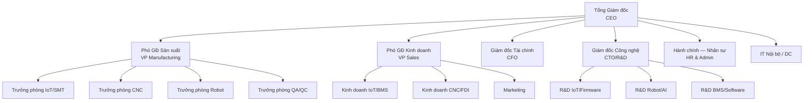

# PHẦN VII: NHÂN SỰ VÀ TỔ CHỨC

---

## 7.1. Sơ đồ Tổ chức

## 7.2. Kế hoạch Nhân sự theo Giai đoạn

| Giai đoạn | Phòng ban | Số lượng | Ghi chú |
|---|---|---:|---|
| **Y0–Y1** | Ban Giám đốc + Pháp lý + Thiết kế | 8–10 | Core team |
| **Y1–Y3** | + Giám sát xây dựng + Mua sắm | 10–15 | Thêm 2–5 người |
| **Y3–Y4** | + IoT/SMT team + QA | 30–40 | Tuyển 20–25 kỹ sư + công nhân |
| **Y4–Y5** | + CNC operators + Robot team | 50–65 | Tuyển 20–25 thợ CNC + kỹ sư |
| **Y5–Y6** | + Sales + Marketing + Thêm SX | 65–80 | Mở rộng kinh doanh |
| **Y7–Y10** | + Mở rộng theo doanh thu | 85–105 | Tăng dần |
| **Y10+** | Ổn định | **100–130** | Bao gồm thời vụ |

### Nhân sự theo Bộ phận (Ổn định Y10+)

| Bộ phận | Số lượng | Tỷ lệ |
|---|---:|---:|
| Sản xuất IoT/SMT | 25–30 | 24% |
| Sản xuất CNC | 18–22 | 19% |
| Sản xuất Robot Assembly | 8–10 | 8% |
| QA/QC | 5–8 | 6% |
| R&D + Thiết kế | 12–15 | 12% |
| Bán hàng + Marketing | 8–10 | 8% |
| IT / DC nội bộ | 3–5 | 4% |
| Hành chính + Kế toán + Nhân sự | 8–10 | 8% |
| Ban Giám đốc + Quản lý | 6–8 | 6% |
| Kho + Logistics | 4–6 | 5% |
| **Tổng** | **97–124** | **100%** |

### 7.2.1. Chuyên gia Nước ngoài

| Vị trí | Quốc tịch | Số lượng | Thời gian | Mục đích |
|---|---|---:|---|---|
| CNC Application Engineer | Nhật/Đức | 2 | 2 năm | Đào tạo vận hành DMG MORI 5-trục |
| AI/ML Lead | Hàn Quốc/Mỹ | 1 | Dài hạn | Phát triển AI SLAM, Computer Vision cho AMR |
| Quality Manager (ISO 9001) | Nhật/Đức | 1 | 2 năm | Thiết lập QMS, nâng cấp IATF/AS9100 khi có nhu cầu |
| **Tổng** | | **4** | | Giảm từ 5 (Gốc) do không cần DC Commissioning Engineer |

---

## 7.3. Kế hoạch Tuyển dụng và Đào tạo

### 7.3.1. Tuyển dụng theo Nhóm (Y3–Y5 — Giai đoạn Tuyển chính)

| Nhóm | Số lượng | Nguồn tuyển | Mức lương (USD/tháng) |
|---|---:|---|---:|
| Kỹ sư CNC (vận hành 5-trục) | 8–10 | Trường CĐ nghề + FDI chuyển việc | 800–1.500 |
| Kỹ sư CNC (CAM Programmer) | 3–4 | ĐH Bách Khoa + Recruitment agency | 1.200–2.000 |
| Kỹ sư IoT (Firmware/HW) | 8–10 | ĐH Bách Khoa, HCMUT, UIT | 1.000–2.000 |
| Kỹ sư Robot (AI/SLAM) | 3–4 | UIT, VGU, Returnee | 1.500–2.500 |
| Kỹ sư phần mềm BMS/SCADA | 4–5 | ĐH CNTT, Recruitment agency | 1.200–2.000 |
| QC Inspector | 3–5 | Trường CĐ + Đào tạo nội bộ | 700–1.200 |
| SMT Operator | 6–8 | CĐ Công nghệ + Training | 600–1.000 |
| Sales Engineer (B2B) | 4–5 | Kinh nghiệm manufacturing B2B | 1.000–2.000 + Commission |
| Hành chính + Kế toán | 4–5 | Đa dạng | 500–1.000 |

### 7.3.2. Chương trình Đào tạo

| Chương trình | Đối tượng | Thời lượng | Đối tác | Chi phí (K USD) |
|---|---|---|---|---:|
| CNC 5-Axis Operation | Kỹ sư CNC | 3 tháng | DMG MORI Academy | 50–80 |
| CMM Programming (PC-DMIS) | QC Inspector | 1 tháng | Hexagon MI | 15–25 |
| Robot AI/SLAM Development | Kỹ sư Robot | 2 tháng | NVIDIA DLI | 15–25 |
| ISO 9001 Internal Auditor | QA team | 1 tuần | TUV/BSI | 5–10 |
| PCCC + ATVSLĐ | Toàn bộ | 2 ngày/năm | Đơn vị được cấp phép | 5 |
| Tiếng Anh kỹ thuật | Toàn bộ kỹ thuật | Ongoing | Trung tâm ngoại ngữ | 10–15 |
| **Tổng ngân sách đào tạo Y3–Y5** | | | | **100–160** |

> Ngân sách đào tạo trung bình ~40–50K USD/năm giai đoạn vận hành ổn định. Tương đương ~400–500 USD/người/năm, đạt chuẩn 40 giờ đào tạo/năm/người [A].

### 7.3.3. Chính sách Nhân sự

| Chính sách | Chi tiết |
|---|---|
| **Lương** | Cạnh tranh top 25% thị trường TP.HCM, review hàng năm |
| **Thưởng** | KPI quarterly + Thưởng cuối năm (1–3 tháng lương) |
| **BHXH + BHYT** | Đầy đủ theo luật + Bảo hiểm sức khỏe premium cho nhân sự chủ chốt |
| **ESOP** | 5% vốn điều lệ cho nhân sự chủ chốt (vesting 4 năm, cliff 1 năm) |
| **Đào tạo** | 40 giờ/năm/người tối thiểu |
| **Nghỉ phép** | 15 ngày/năm (cao hơn luật 3 ngày) |
| **Shuttle bus** | Tuyến Quận 1/Bình Thạnh → KCNC |
| **Bữa ăn** | Cơm trưa miễn phí tại canteen |

---

## 7.4. Chi phí Nhân sự

### 7.4.1. Bảng Chi phí Nhân sự theo Năm

| Năm | Headcount | Lương TB (USD/tháng) | Tổng Lương/Năm (M USD) | BHXH + Phúc lợi (M USD) | **Tổng (M USD)** |
|---:|---:|---:|---:|---:|---:|
| Y3–Y4 | 35 | 900 | 0,38 | 0,12 | **0,50** |
| Y5–Y6 | 70 | 950 | 0,80 | 0,25 | **1,05** |
| Y7–Y10 | 95 | 1.000 | 1,14 | 0,36 | **1,50** |
| Y10+ (ổn định) | 110 | 1.050 | 1,39 | 0,41 | **1,80** |

> Chi phí nhân sự Y10+ = 1,80M USD/năm. Tỷ trọng nhân sự trong OPEX tổng (~8,40M): ~21,4%. Lương tăng trung bình 5%/năm. BHXH = 23,5% phía công ty. Phúc lợi bổ sung ~8% lương [A].

---

## 7.5. Phát triển Tổ chức và Quản lý

### 7.5.1. Mô hình Phát triển 3 Giai đoạn

| Giai đoạn | Cơ cấu | Số cấp quản lý | Quyết định | KPI quản lý |
|---|---|:---:|---|---|
| **Startup (Y0–Y3)** | Phẳng (flat) | 2–3 | Tập trung CEO | Revenue, First customer |
| **Growth (Y3–Y7)** | Ma trận | 3–4 | Phân quyền Trưởng phòng | Profit by BU, OEE |
| **Mature (Y7+)** | 2 BU tự chủ P&L | 4 | BU autonomy | EBITDA margin, ROE |

### 7.5.2. Đội ngũ Quản lý Chủ chốt

| Vị trí | Thời điểm tuyển | Profile yêu cầu | Lương (K USD/năm) |
|---|---|---|---:|
| **CEO** | Đã có | Founder, 15+ năm kinh nghiệm CNC/Tech | 96–144 |
| **CTO** | Y1 Q1 | MS/PhD kỹ thuật, 10+ năm IoT/AI | 72–108 |
| **CFO** | Y1 Q1 | CPA/CFA, 10+ năm, kinh nghiệm FDI | 60–96 |
| **Phó GĐ Sản xuất** | Y2 Q1 | 10+ năm manufacturing, Lean/Six Sigma | 60–84 |
| **Phó GĐ Kinh doanh** | Y3 Q1 | 8+ năm B2B tech sales ASEAN | 60–84 + Commission |
| **Trưởng phòng CNC** | Y3 Q1 | 10+ năm CNC 5-trục, ISO 9001 | 48–72 |
| **Trưởng phòng IoT** | Y3 Q1 | MS Embedded + 8 năm IoT/Robotics | 48–72 |
| **Trưởng phòng QA/QC** | Y3 Q2 | CQE, kinh nghiệm ISO 9001 → IATF | 48–60 |

### 7.5.3. Chương trình ESOP

| Thông số | Giá trị |
|---|---|
| Tổng Pool ESOP | 5% vốn điều lệ |
| Vesting Schedule | 4 năm, cliff 1 năm (25% vest sau năm 1, 6,25%/quý sau đó) |
| Đối tượng | C-Level (2,0%), Trưởng phòng (1,5%), Key Engineer (1,0%), Outstanding (0,5%) |
| Strike Price | Mệnh giá tại thời điểm cấp |
| Lock-up | 6 tháng sau mỗi đợt vest |

---

## 7.6. Chiến lược Giữ chân Nhân tài

### 7.6.1. Phân tích Rủi ro Mất Nhân sự Chủ chốt

| Vị trí | Turnover Risk | Tác động | Thời gian thay thế | Cost Replacement |
|---|:---:|:---:|---|---:|
| CNC 5-Axis Operator (Lv3) | Cao | Rất cao | 6–12 tháng | 15–25 K USD |
| AI/ML Lead (Robot SLAM) | Rất cao | Cao | 6–9 tháng | 20–40 K USD |
| CAM Programmer Sr | Cao | Rất cao | 9–15 tháng | 20–30 K USD |
| Quality Manager (ISO 9001) | Trung bình-Cao | Rất cao | 12–18 tháng | 25–40 K USD |
| Sales Director (FDI B2B) | Trung bình | Cao | 3–6 tháng | 15–20 K USD |

> Turnover rate mục tiêu: < 10%/năm toàn công ty, < 5% cho Key Position. Benchmark FDI tại KCNC TP.HCM: 12–18% turnover [A].

### 7.6.2. Chương trình Giữ chân

| Chương trình | Đối tượng | Chi tiết | Budget/năm (K USD) |
|---|---|---|---:|
| ESOP 5% | C-Level + Trưởng phòng + Key | Vesting 4 năm | Equity |
| Retention Bonus | Top 20% performance | 1–3 tháng lương thêm | 80 |
| Career Path (Dual Track) | Tất cả | Management vs Technical Expert | — |
| Đào tạo quốc tế | Key Engineer | DMG MORI Japan, Hexagon | 50 |
| Cải thiện môi trường | Tất cả | Canteen + Gym + Recreation + Shuttle | 30 |
| Health + Wellness | Tất cả | Premium health insurance + Annual checkup | 25 |
| Recognition Program | Tất cả | Employee of Month/Quarter + Small rewards | 10 |

### 7.6.3. Career Path — Dual Track

| Level | Technical Track | Management Track | Lương Range (K USD/năm) |
|---|---|---|---:|
| L1 | Engineer | — | 10–18 |
| L2 | Engineer II | — | 14–24 |
| L3 | Senior Engineer | Team Lead | 20–36 |
| L4 | Technical Lead | Manager/Trưởng phòng | 30–48 |
| L5 | Principal Engineer | Phó GĐ | 48–84 |

> **Dual Track** đảm bảo kỹ sư giỏi không bị ép làm quản lý — giảm turnover kỹ thuật và giữ chuyên gia CNC/AI/IoT lâu dài [A].

---

## 7.7. Quản lý Tri thức và Kế thừa

### 7.7.1. Knowledge Management System

| Tầng | Nội dung | Công cụ | Trách nhiệm |
|---|---|---|---|
| KM-1: SOP & Work Instruction | Quy trình vận hành CNC, SMT, QC, xử lý lỗi | Wiki nội bộ (Confluence/Notion) | QA Manager |
| KM-2: Training Material | Video hướng dẫn, bản vẽ mẫu, G-code library | LMS nội bộ | HR + CTO |
| KM-3: Design IP Repository | Firmware source, PCB schematics, CAD models | Git + PLM (Windchill/Teamcenter) | CTO |
| KM-4: Lesson Learned | Post-mortem dự án, root cause CNC scrap, field failure | Jira Knowledge Base | Trưởng phòng chức năng |
| KM-5: Customer Knowledge | Profile KH FDI, buying criteria, complaint history | CRM (HubSpot/Odoo) | VP Sales |

> Mục tiêu: **Bus Factor ≥ 2** cho mọi vị trí chủ chốt — nghĩa là luôn có ít nhất 2 người biết làm mỗi việc quan trọng. Số hóa 100% SOP trước khi vận hành (Y3) [A].

### 7.7.2. Succession Planning — Vị trí Chủ chốt

| Vị trí | Người giữ (dự kiến) | Backup-1 | Backup-2 | Thời gian chuẩn bị |
|---|---|---|---|---|
| CEO | Founder | CTO hoặc VP Sales | Board member | — |
| CTO | Tuyển Y1 | R&D Lead IoT | R&D Lead Robot | 2 năm |
| Trưởng phòng CNC | Tuyển Y3 | Senior CAM Programmer | CNC Application Engineer (JP) | 18 tháng |
| Quality Manager | Tuyển Y3 | QC Lead | External auditor consultant | 12 tháng |
| AI/ML Lead | Tuyển Y3 | Senior Robot Engineer | Returnee/Partner | 18 tháng |

> Succession plan review: **hàng năm** bởi CEO + HR Director. Cập nhật khi có thay đổi nhân sự hoặc tổ chức.

---

## 7.8. Tuân thủ Pháp luật Lao động

### 7.8.1. Checklist Tuân thủ

| TT | Yêu cầu pháp lý | Văn bản | Biện pháp Mekong | Timeline |
|:---:|---|---|---|---|
| 1 | Đăng ký nội quy lao động | Bộ Luật LĐ 2019, Điều 119 | Soạn và đăng ký tại Sở LĐ-TBXH | Trước tuyển dụng (Y2) |
| 2 | Thỏa ước lao động tập thể | Bộ Luật LĐ 2019, Điều 75 | Đàm phán với đại diện NLĐ | Y3-Y4 |
| 3 | BHXH, BHYT, BHTN | Luật BHXH 2014, Luật BHYT 2008 (sửa đổi) | Đóng đầy đủ: 23,5% phía công ty | Từ ngày ký HĐLĐ |
| 4 | Huấn luyện ATVSLĐ 6 nhóm | NĐ 44/2016/NĐ-CP | Thuê đơn vị được cấp phép | Hàng năm + mới vào |
| 5 | Khai báo tai nạn lao động | Bộ Luật LĐ 2019, Điều 142 | Quy trình báo cáo 24h | Khi xảy ra sự cố |
| 6 | Bảo vệ lao động nữ | Bộ Luật LĐ 2019, Chương X | Phòng vắt/trữ sữa, không ca đêm khi mang thai | Từ khi có lao động nữ |
| 7 | Lao động nước ngoài (4 chuyên gia) | NĐ 152/2020/NĐ-CP | Xin giấy phép lao động, miễn nếu < 30 ngày | Trước khi chuyên gia nhận việc |
| 8 | Thang bảng lương | NĐ 38/2022/NĐ-CP | Xây dựng và đăng ký | Y2 (trước tuyển dụng đại trà) |

### 7.8.2. Ngân sách Tuân thủ Lao động

| Hạng mục | Chi phí/năm (K USD) |
|---|---:|
| BHXH + BHYT + BHTN (phần công ty ~23,5%) | 280–350 |
| Huấn luyện ATVSLĐ | 10 |
| Khám sức khỏe định kỳ | 8 |
| Bảo hiểm tai nạn 24/7 bổ sung | 12 |
| Tư vấn pháp lý lao động | 5 |
| **Tổng** | **~315–385** |

> Chiếm ~17-21% tổng chi phí nhân sự 1,80M USD/năm. Phù hợp benchmark ngành sản xuất CNC tại Việt Nam [B — Navigos Salary Survey 2024].

---

## 7.7. Kế hoạch Kế nhiệm

### 7.7.1. Ma trận Kế nhiệm Vị trí Chủ chốt

| Vị trí hiện tại | Kế nhiệm #1 | Kế nhiệm #2 | Gap Analysis | Timeline |
|---|---|---|---|---|
| CEO | CTO | Phó GĐ SX | Cần kinh nghiệm tài chính | 3–5 năm |
| CTO | Trưởng phòng IoT | AI/ML Lead | Cần kinh nghiệm quản lý broad | 2–3 năm |
| Trưởng phòng CNC | Sr CAM Programmer | Quality Manager | Cần leadership training | 2–3 năm |
| Trưởng phòng IoT | Firmware Lead | Robot Mech Lead | Cần business acumen | 2–3 năm |

### 7.7.2. Cơ chế Chuyển giao Tri thức

| Hoạt động | Tần suất | Trách nhiệm | Deliverable |
|---|---|---|---|
| Tài liệu hóa quy trình (SOP) | Liên tục | Mỗi bộ phận | SOP library trên Wiki nội bộ |
| Cross-training (2 người/vị trí key) | Hàng quý | HR + Bộ phận | Training log, Skill matrix |
| Mentoring program | 1:1 hàng tháng | Senior → Junior | Mentoring record |
| Technical sharing sessions | 2 tuần/lần | Luân phiên | Slide deck + Recording |
| Exit interview + Knowledge capture | Khi nghỉ việc | HR | Knowledge transfer document |
| CNC Process Notes | Mỗi job mới | CAM Programmer | Job folder (CAM file + Tool list + QC report) |

### 7.7.3. Bộ KPI Nhân sự và Năng lực Tổ chức

| KPI | Mục tiêu Y4-Y6 | Mục tiêu Y10+ | Ghi chú |
|---|---:|---:|---|
| Time-to-fill vị trí kỹ thuật | < 60 ngày | < 45 ngày | CNC / IoT / QA |
| Tỷ lệ nghỉ việc toàn công ty | < 12% | < 10% | Benchmark FDI KCNC 12-18% |
| Tỷ lệ nghỉ việc vị trí key | < 8% | < 5% | Theo danh sách critical role |
| Giờ đào tạo / người / năm | ≥ 32 giờ | ≥ 40 giờ | Bao gồm kỹ thuật + an toàn |
| Tỷ lệ vị trí key có người kế nhiệm sẵn sàng | ≥ 50% | ≥ 80% | Succession readiness |
| Tỷ lệ nhân sự đa kỹ năng (cross-trained) | ≥ 25% | ≥ 40% | Đặc biệt ở CNC / QA / SMT |
| Năng suất doanh thu / nhân sự | > 45K USD | > 90K USD | Theo ramp-up và steady-state |

> Bộ KPI này giúp gắn quản trị nhân sự với hiệu quả vận hành thực tế: tuyển đúng, giữ đúng người, đào tạo đúng kỹ năng và luôn có phương án kế nhiệm cho các vị trí trọng yếu, trên cơ sở giả định vận hành và chỉ tiêu quy mô đã nêu trong đề án.

---

## 7.8. Tiểu kết Phần VII

| Chỉ tiêu | Giá trị V3 |
|---|---|
| Tổng nhân sự ổn định (Y10+) | 100–130 người [C] |
| Tổng quỹ lương + phúc lợi (Y10+) | ~1,80M USD/năm [A] |
| Turnover mục tiêu | < 10%/năm, Key < 5% [A] |
| Chuyên gia nước ngoài | 4 người (2 CNC + 1 AI + 1 QM) |
| ESOP pool | 5% vốn điều lệ |
| Ngân sách đào tạo /năm | ~40–50K USD [A] |
| Career path | Dual Track (Technical + Management) |

> **Kết luận:** Kế hoạch nhân sự V3 tối ưu cho quy mô 22,00M USD với 100–130 nhân sự ổn định, tập trung vào 2 trụ cột sản xuất. Chi phí nhân sự chiếm ~21% OPEX — hợp lý cho ngành sản xuất công nghệ cao. Chương trình giữ chân (ESOP + Dual Track + Retention Bonus) giúp giảm turnover dưới benchmark FDI tại KCNC [A].
