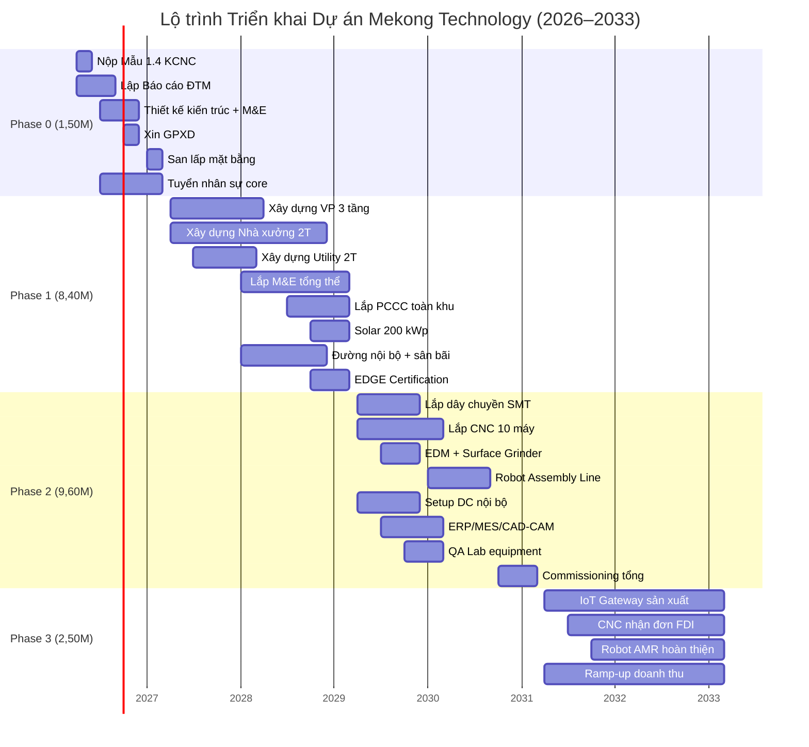
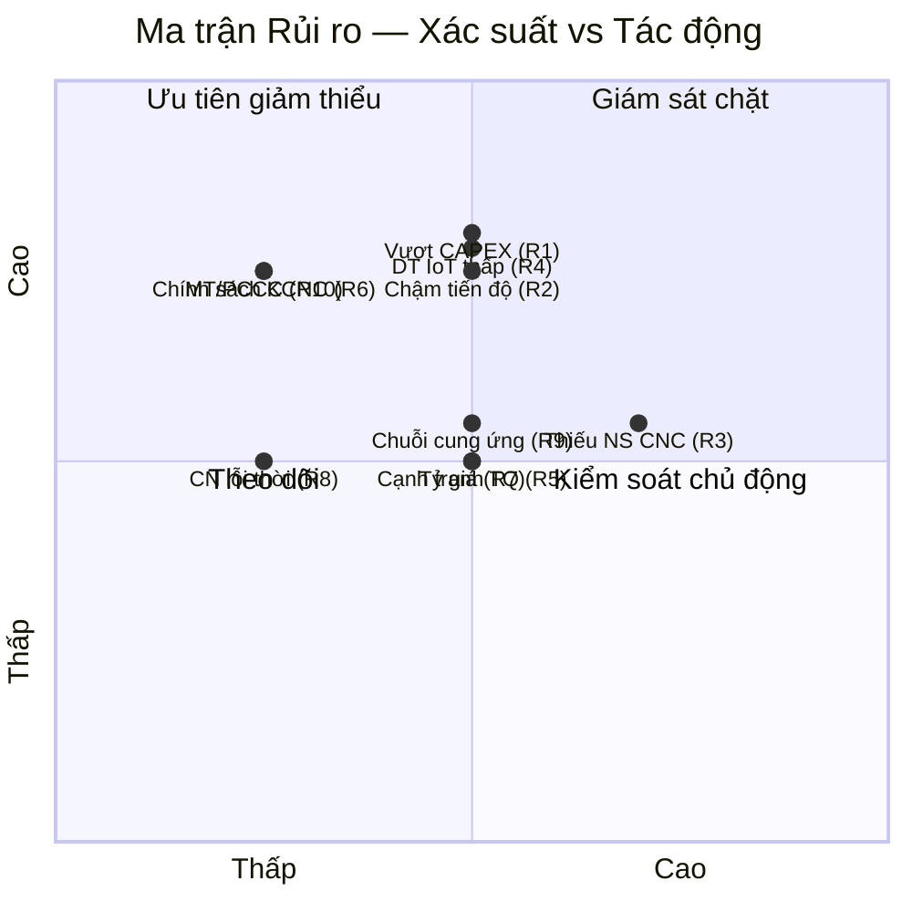
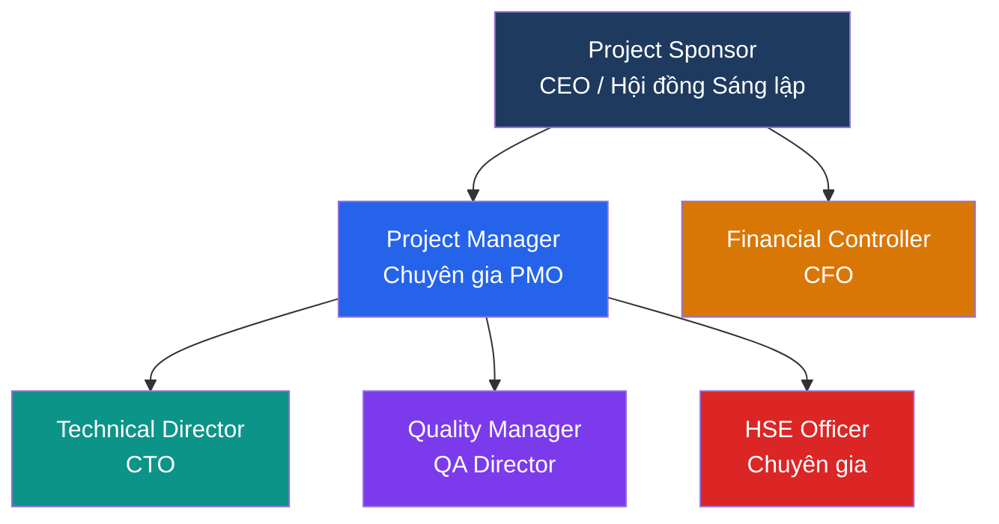

# PHẦN VIII: KẾ HOẠCH TRIỂN KHAI

---

## 8.1. Phân kỳ Đầu tư 4 Giai đoạn

| Phase | Thời gian | CAPEX (M USD) | Mốc quan trọng | Nguồn vốn |
|---|---|---:|---|---|
| **Phase 0** | Q2/2026 — Q1/2027 | 1,50 | Mẫu 1.4 được duyệt, EIA hoàn thành, Giấy phép xây dựng | CSH |
| **Phase 1** | Q2/2027 — Q1/2029 | 8,40 | Hoàn công tòa nhà + nhà xưởng **2 tầng**, Sổ đỏ | CSH |
| **Phase 2** | Q2/2029 — Q1/2031 | 9,60 | 10 máy CNC chạy, SMT line hoạt động, DC nội bộ online | CSH |
| **Phase 3** | Q2/2031 — Q1/2033 | 2,50 | Full operation 2 trụ cột, doanh thu ổn định | CSH + Vay |
| **Tổng** | **7 năm** | **22,00** | | |

> **Ghi chú:** Tổng CAPEX = 1,50 + 8,40 + 9,60 + 2,50 = **22,00M USD** [C]. Vốn CSH tự chủ toàn bộ Phase 0–2 (18,50M). Vay 4,00M chỉ từ Y7 trong Phase 3 khi đã có doanh thu [C]. Nhà xưởng 2 tầng (GFA 6.720 m²) nằm trong ngân sách Phase 1.

### 8.1.1. Chi tiết Hoạt động theo Phase

**Phase 0 — Chuẩn bị (12 tháng)**

| TT | Hoạt động | Thời gian | Người phụ trách | Đầu ra |
|:---:|---|---|---|---|
| 1 | Nộp Mẫu 1.4 KCNC | Q2/2026 | CEO + Ban Pháp lý | Mẫu 1.4 hoàn chỉnh |
| 2 | Lập Báo cáo ĐTM | Q2–Q3/2026 | Tư vấn môi trường | Quyết định phê duyệt ĐTM |
| 3 | Thiết kế kiến trúc + M&E | Q3–Q4/2026 | Nhà thầu thiết kế | Hồ sơ thiết kế kỹ thuật |
| 4 | Xin Giấy phép xây dựng | Q4/2026 | Ban Pháp lý | GPXD |
| 5 | San lấp mặt bằng | Q1/2027 | Nhà thầu | Mặt bằng sẵn sàng |
| 6 | Tuyển dụng nhân sự cốt lõi | Q3/2026–Q1/2027 | HR | 8-10 nhân sự core team |

**Phase 1 — Xây dựng (24 tháng)**

| TT | Hoạt động | Thời gian | Người phụ trách | Đầu ra |
|:---:|---|---|---|---|
| 1 | Xây dựng Tòa nhà VP 3 tầng (21×48m) | Q2/2027–Q2/2028 | Nhà thầu xây dựng | VP hoàn công |
| 2 | Xây dựng Nhà xưởng SX (48×70m, PEB) | Q2/2027–Q4/2028 | Nhà thầu xây dựng | Xưởng hoàn công |
| 3 | Xây dựng Khu Utility (5×56m) | Q3/2027–Q1/2028 | Nhà thầu xây dựng | Utility hoàn công |
| 4 | Lắp đặt M&E tổng thể | Q1/2028–Q1/2029 | Nhà thầu M&E | Hệ thống điện/nước/HVAC |
| 5 | Lắp đặt PCCC toàn khu | Q3/2028–Q1/2029 | Nhà thầu PCCC | Nghiệm thu PCCC |
| 6 | Lắp đặt Solar 200 kWp | Q4/2028–Q1/2029 | Nhà thầu năng lượng | Solar vận hành |
| 7 | Đường nội bộ, sân bãi, cảnh quan | Q1–Q4/2028 | Nhà thầu | Hạ tầng ngoài hoàn chỉnh |
| 8 | Xin EDGE Certification | Q4/2028–Q1/2029 | Tư vấn ESG | Chứng chỉ EDGE |

**Phase 2 — Lắp đặt Thiết bị (24 tháng)**

| TT | Hoạt động | Thời gian | Người phụ trách | Đầu ra |
|:---:|---|---|---|---|
| 1 | Lắp đặt SMT line | Q2–Q4/2029 | Nhà cung cấp SMT | Dây chuyền SMT hoạt động |
| 2 | Lắp đặt CNC 10 máy (DMG Mori, Haas, Mazak) | Q2/2029–Q1/2030 | Nhà cung cấp CNC | 10 máy calibrated |
| 3 | Lắp đặt EDM + Surface Grinder | Q3–Q4/2029 | Sodick/Okamoto | 2 máy hoạt động |
| 4 | Setup Robot Assembly Line | Q1–Q3/2030 | Đội R&D | Dây chuyền Robot MVP |
| 5 | Setup DC nội bộ (5–8 rack) | Q2–Q4/2029 | IT Team | DC vận hành |
| 6 | Cài đặt ERP/MES/CAD-CAM | Q3/2029–Q1/2030 | IT + Vendor | Hệ thống quản lý SX |
| 7 | QA Lab equipment | Q4/2029–Q1/2030 | QA Team | Lab đo lường hoạt động |
| 8 | BMS/SCADA R&D equipment | Q2–Q4/2029 | R&D IoT | Lab R&D BMS hoạt động |
| 9 | Calibration + Commissioning tổng | Q4/2030–Q1/2031 | PM | Nghiệm thu toàn bộ |

**Phase 3 — Vận hành và Mở rộng (24 tháng)**

| TT | Hoạt động | Thời gian | Người phụ trách | Đầu ra |
|:---:|---|---|---|---|
| 1 | Sản xuất loạt IoT Gateway đầu tiên | Q2/2031 | BU1 Director | Sản phẩm thương mại |
| 2 | Nhận đơn hàng CNC FDI đầu tiên | Q3/2031 | BU2 Director | Hợp đồng gia công |
| 3 | Robot AMR prototype hoàn thiện | Q4/2031 | R&D Robot | Robot v1 |
| 4 | Tuyển dụng nhân sự mở rộng (lên 65–80) | Q2–Q4/2031 | HR | Đủ nhân sự |
| 5 | Giải ngân vay 4,00M (nếu cần) | Q1/2032 | CFO | Bổ sung vốn lưu động |
| 6 | Đạt doanh thu 8–9M USD/năm | Q4/2032 | CEO | Mốc tiến độ tài chính |

---

## 8.2. Các mốc Quan trọng (Các mốc tiến độ)

| Mốc | Thời điểm | Nội dung | Chỉ số Đo lường | Trách nhiệm |
|---|---|---|---|---|
| M1 | Q2/2026 | Nộp Mẫu 1.4 + Công văn đề xuất | Hồ sơ đầy đủ, nộp đúng hạn | CEO, Ban Pháp lý |
| M2 | Q4/2026 | Được duyệt, khởi công xây dựng | QĐ phê duyệt từ BQL KCNC | CEO |
| M3 | Q1/2029 | Hoàn công, nhận Sổ đỏ | Biên bản nghiệm thu hoàn công | PM, Nhà thầu |
| M4 | Q3/2029 | Sản phẩm IoT đầu tiên xuất xưởng | Sample lot pass QC 100% | BU1 Director |
| M5 | Q1/2030 | CNC vận hành, nhận đơn hàng FDI đầu tiên | ≥ 1 hợp đồng FDI signed | BU2 Director |
| M6 | Q1/2031 | Robot AMR đầu tiên giao khách | Robot v1 giao + nghiệm thu | R&D Director |
| M7 | Q1/2032 | Doanh thu đạt 8–9M USD/năm | Báo cáo tài chính kiểm toán | CFO |
| M8 | Q1/2033 | Full operation, doanh thu 11–12M USD/năm | Ổn định confirmed | CEO |

### 8.2.1. Gantt Chart Tổng quát

---

## 8.3. Phân tích Rủi ro và Biện pháp Giảm thiểu

### 8.3.1. Ma trận Rủi ro Tổng hợp

| TT | Rủi ro | Xác suất | Tác động | Mức rủi ro | Biện pháp Giảm thiểu |
|:---:|---|:---:|:---:|:---:|---|
| 1 | Vượt CAPEX xây dựng | Trung bình | Cao | **Cao** | Hợp đồng trọn gói (lump-sum), dự phòng 0,65M (3,0%) [C] |
| 2 | Chậm tiến độ thi công | Trung bình | Cao | **Cao** | PM chuyên nghiệp, mốc tiến độ tracking hàng tháng |
| 3 | Thiếu nhân sự CNC lành nghề | Cao | Trung bình | **Cao** | Tuyển + đào tạo sớm 6 tháng, hợp tác trường nghề |
| 4 | Doanh thu IoT thấp hơn kỳ vọng | Trung bình | Cao | **Cao** | Đa dạng hóa SP (BMS/SCADA/OEM), chốt chuỗi đơn hàng trước vận hành |
| 5 | Cạnh tranh CNC từ Trung Quốc | Trung bình | Trung bình | Trung bình | Tập trung FDI cần ISO/AS9100, local support 24/7 |
| 6 | Thay đổi chính sách ưu đãi KCNC | Thấp | Cao | Trung bình | NĐ 94/2020 bảo đảm 15 năm, quan hệ tốt BQL |
| 7 | Biến động tỷ giá USD/VND > 5% | Trung bình | Trung bình | Trung bình | Hedge tự nhiên (thu USD, chi VND) |
| 8 | Rủi ro công nghệ lỗi thời | Thấp | Trung bình | Thấp | R&D ≥ 8% doanh thu, lộ trình SP 3 năm |
| 9 | Rủi ro chuỗi cung ứng (chip, NVL) | Trung bình | Trung bình | Trung bình | Multiple supplier, tồn kho chiến lược 2-3 tháng |
| 10 | Rủi ro môi trường/PCCC | Thấp | Cao | Trung bình | Tuân thủ NĐ 136/2020, ZLD CNC, FM-200 DC |

### 8.3.2. Kế hoạch Ứng phó Chi tiết

| Ngưỡng kích hoạt | Hành động | Thời gian phản hồi | Người quyết định |
|---|---|---|---|
| CAPEX Phase 1 vượt 10% | Rà soát scope Phase 2, đàm phán nhà thầu | 2 tuần | CEO + CFO |
| Chậm tiến độ > 3 tháng | Tăng cường nhà thầu, làm thêm ca | 1 tuần | PM |
| Chuỗi đơn hàng CNC < 300K USD/năm (sau Y5) | Chuyển máy sang thuê ngoài giờ, tăng marketing FDI | 1 tháng | BU2 Director |
| Doanh thu Year 5 < 1,75M (< 70% mục tiêu) | Rà soát định giá, mở rộng OEM, cắt OPEX 15% | 1 tháng | Ban Giám đốc |
| DSCR < 2,0× trong 2 quý liên tiếp | Tạm dừng mở rộng Phase 3, cơ cấu nợ | 2 tuần | CFO |
| Sự cố môi trường/PCCC | Dừng hoạt động liên quan, báo cáo BQL KCNC | Ngay lập tức | CEO + HSE |

---

## 8.4. Quản lý Dự án (PMO)

### 8.4.1. Tổ chức Quản lý Dự án

| Vai trò | Người đảm nhiệm | Trách nhiệm |
|---|---|---|
| Project Sponsor | CEO / Hội đồng Sáng lập | Phê duyệt ngân sách, quyết định chiến lược |
| Project Manager (PM) | Thuê chuyên gia PMO | Điều phối thi công, theo dõi mốc tiến độ, báo cáo |
| Technical Director | CTO | Giám sát thiết kế kỹ thuật, M&E, commissioning |
| Financial Controller | CFO | Theo dõi ngân sách, giải ngân, cost control |
| Quality Manager | QA Director | Nghiệm thu chất lượng xây dựng và lắp đặt |
| HSE Officer | Thuê chuyên gia | An toàn lao động, môi trường thi công |

### 8.4.2. Cơ chế Báo cáo

| Loại báo cáo | Tần suất | Nội dung | Người nhận |
|---|---|---|---|
| Báo cáo tiến độ tuần | Hàng tuần | % hoàn thành, vấn đề, rủi ro | PM → CEO |
| Báo cáo tài chính tháng | Hàng tháng | Chi tiêu vs ngân sách, dòng tiền | CFO → CEO |
| Báo cáo mốc tiến độ | Tại mỗi mốc tiến độ | Đạt/Không đạt, hành động tiếp | PM → Hội đồng |
| Báo cáo BQL KCNC | Hàng quý | Tiến độ tổng thể, tuân thủ cam kết | CEO → BQL KCNC |

### 8.4.3. Phần mềm Quản lý

| Giai đoạn | Công cụ | Mục đích |
|---|---|---|
| Xây dựng (Phase 0-1) | MS Project / Primavera | Gantt chart, Critical Path, Resource leveling |
| Lắp đặt (Phase 2) | Jira / Asana | Task tracking, commissioning checklist |
| Vận hành (Phase 3+) | ERP (SAP B1 / Odoo) | Quản lý SX, tài chính, kho, CRM |

### 8.4.4. Chiến lược Procurement và Decision Gate

| Gói thầu / hạng mục | Hình thức mua sắm | Tiêu chí chọn | Decision Gate |
|---|---|---|---|
| Xây dựng 3 công trình | Đấu thầu cạnh tranh / EPC tách phần | Giá, năng lực, tiến độ, an toàn | Không ký nếu chênh > ngân sách 7,5% |
| CNC / EDM / Grinder | Đàm phán trực tiếp + so sánh 2-3 OEM | TCO, service, thời gian dẫn, đào tạo | Chỉ chốt khi có FAT plan + spare list |
| SMT / QA Lab | RFQ nhiều nhà cung cấp | Yield, hỗ trợ local, compatibility | Pilot demo trước PO |
| ERP / MES / BMS software | PoC + phased rollout | Tính mở, tích hợp, chi phí license | Gate theo module |
| Solar / M&E / Utility | Turnkey package | Hiệu suất, warranty, O&M | Chỉ nghiệm thu khi có performance test |

| Gate | Điều kiện qua cổng | Người phê duyệt |
|---|---|---|
| Gate A — Pháp lý | IRC / đất / ĐTM / GPXD sẵn sàng | CEO + Pháp lý |
| Gate B — Xây dựng | Thiết kế khóa, BOQ, ngân sách được chốt | CEO + PM + CFO |
| Gate C — Thiết bị | Site ready, utility ready, FAT approved | CTO + PM |
| Gate D — Vận hành | SAT pass, training hoàn tất, SOP sẵn sàng | CEO + BU Heads |

### 8.4.5. Change Management Protocol

| Loại thay đổi | Ví dụ | Quyền phê duyệt | Quy trình |
|---|---|---|---|
| **Minor** (chi phí < 50K, tiến độ < 2 tuần) | Thay NCC phụ kiện, điều chỉnh BOM | PM + Technical Director | Change Request → Review 48h → Approve/Reject |
| **Major** (chi phí 50K–500K, tiến độ 2-8 tuần) | Thay đổi thiết kế M&E, thêm thiết bị CNC | CEO + CFO + PM | CR → Impact Analysis → Board Review 1 tuần → Approve |
| **Critical** (chi phí > 500K hoặc scope change) | Thay đổi layout nhà xưởng, giảm/tăng Phase | Hội đồng Sáng lập | CR → Full Impact + Risk → Board Meeting → Vote |

| Bước | Hành động | Responsibility | Timeline |
|:---:|---|---|---|
| 1 | Initiate Change Request (CR) | Bất kỳ thành viên | Ngay khi phát hiện |
| 2 | Impact Assessment (cost, schedule, quality, risk) | PM + Affected Team | 2–5 ngày |
| 3 | Review & Decision | Theo cấp phê duyệt | 2–7 ngày |
| 4 | Implement Change | Responsible Team | Theo plan |
| 5 | Verify & Close | QA + PM | 1–3 ngày |

> Tổng số CR dự kiến: 15–30 trong Phase 0–2 (theo chuẩn ngành dự án xây dựng nhà máy quy mô tương đương). Mục tiêu: ≤ 5 Major, 0 Critical [A].

### 8.4.6. Các bên liên quan Communication Plan

| Các bên liên quan | Nhu cầu thông tin | Kênh | Tần suất | Trách nhiệm |
|---|---|---|---|---|
| BQL KCNC TP.HCM | Tiến độ tổng thể, tuân thủ cam kết | Báo cáo + Họp trực tiếp | Hàng quý | CEO |
| Sở TN&MT | ĐTM, giám sát môi trường | Báo cáo chính thức | Hàng quý | HSE Officer |
| PC07 (PCCC) | Tiến độ thi công PCCC, nghiệm thu | Báo cáo + Kiểm tra | Theo mốc tiến độ | PM + PCCC consultant |
| Nhà thầu xây dựng | Bản vẽ, tiến độ, thanh toán | Họp site hàng tuần | Hàng tuần | PM |
| NCC thiết bị (DMG, Haas) | Delivery schedule, FAT, SAT | Email + Họp online | Hàng tháng | Procurement + CTO |
| Nhân viên / Công đoàn | Lịch tuyển dụng, quyền lợi, đào tạo | Email nội bộ + Town Hall | Hàng tháng | HR Director |
| Ngân hàng (khi vay Y7) | Tiến độ, doanh thu, DSCR | Báo cáo tài chính | Hàng quý | CFO |
| Cộng đồng lân cận | Ồn, bụi trong thi công | Thông báo + Hotline | Khi cần | HSE Officer |

### 8.4.7. Permit-to-Operate Checklist

Trước khi vận hành chính thức (Phase 3, Q2/2031), tất cả hạng mục sau PHẢI hoàn tất:

| TT | Hạng mục | Cơ quan xác nhận | Bằng chứng | Trạng thái |
|:---:|---|---|---|:---:|
| 1 | Nghiệm thu hoàn công 3 công trình | BQL KCNC + Sở XD | Biên bản nghiệm thu | — |
| 2 | Nghiệm thu PCCC công trình | PC07 Công an TP.HCM | QĐ nghiệm thu PCCC | — |
| 3 | Giấy phép xả thải | Sở TN&MT | GP xả thải | — |
| 4 | Giấy phép hoạt động điện | Sở Công thương | GP điện | — |
| 5 | Đăng ký máy CNC (thiết bị áp lực) | Sở LĐ-TBXH | Sổ đăng ký | — |
| 6 | ISO 9001:2015 certified | TUV/BSI | Chứng chỉ ISO | — |
| 7 | ERP/MES go-live | IT Team | User Acceptance Test pass | — |
| 8 | BMS toàn nhà máy hoạt động | R&D IoT | Commissioning report | — |
| 9 | Đào tạo ATVSLĐ hoàn tất | Đơn vị được cấp phép | Chứng chỉ 100% nhân sự | — |
| 10 | Insurance policies active | Broker bảo hiểm | Chứng thư bảo hiểm | — |

> **Gate D (Permit-to-Operate):** Chỉ khi 10/10 hạng mục trên đạt "Hoàn tất" mới được phê duyệt vận hành thương mại. CEO ký quyết định vận hành sau khi QA Director xác nhận toàn bộ checklist.

### 8.4.5. KPI Kiểm soát Triển khai

| KPI | Ngưỡng mục tiêu | Chủ sở hữu |
|---|---:|---|
| SPI (Schedule Performance Index) | ≥ 0,95 | PM |
| CPI (Cost Performance Index) | ≥ 0,95 | CFO + PM |
| % mốc tiến độ đúng hạn | ≥ 90% | PMO |
| % commissioning checklist hoàn tất | 100% trước go-live | CTO |
| % hồ sơ as-built / O&M manual bàn giao | 100% | Nhà thầu + PM |

> Bộ KPI này giúp Phase 0-3 được điều hành như một chương trình đầu tư thật sự, không chỉ là danh sách công việc nối tiếp nhau. Nếu SPI hoặc CPI xuống dưới 0,95 trong 2 kỳ liên tiếp, PMO phải trình phương án hiệu chỉnh trong vòng 10 ngày làm việc [A].

### 8.4.6. Các bên liên quan Plan và Go-Live Readiness

| Nhóm các bên liên quan | Nhu cầu thông tin | Tần suất | Chủ trì |
|---|---|---|---|
| BQL KCNC | Pháp lý, tiến độ, cam kết môi trường | Hàng quý | CEO + Pháp lý |
| Ngân hàng / đối tác vốn | CAPEX, DSCR, mốc tiến độ doanh thu | Hàng quý / khi giải ngân | CFO |
| Nhà thầu / OEM | Scope, schedule, FAT/SAT, thay đổi | Hàng tuần | PM |
| BU vận hành | Site readiness, SOP, training, spare-part | Hàng tuần giai đoạn go-live | CTO + PM |

| Tiêu chí go-live | Mục tiêu pass |
|---|---|
| Pháp lý vận hành sẵn sàng | 100% |
| Utility available theo thiết kế | 100% |
| FAT/SAT sign-off | 100% |
| SOP và đào tạo vận hành hoàn tất | ≥ 95% |
| Spare-part critical đã nhập kho | ≥ 90% danh mục |

> Go-live chỉ được phê duyệt khi cả 5 nhóm điều kiện trên đạt ngưỡng. Cách tiếp cận này giúp tránh tình trạng “đã lắp xong nhưng chưa vận hành được” — một rủi ro rất thường gặp ở các dự án công nghiệp có nhiều interface kỹ thuật [B].

### 8.4.7. Permit-to-Operate Checklist

| Nhóm kiểm tra | Điều kiện tối thiểu trước vận hành |
|---|---|
| Pháp lý | Hồ sơ môi trường, PCCC, điện lực, ATLĐ đã sẵn sàng theo giai đoạn |
| Kỹ thuật | Tài sản critical đã test pass và có hồ sơ FAT/SAT |
| Vận hành | SOP, WI, spare list, vendor contact list đầy đủ |
| Nhân sự | Ca trưởng, operator, QA, utility team đã đào tạo |
| Thương mại | Có chuỗi đơn hàng/LOI đủ để hấp thụ công suất khởi động |

> Checklist này là “cửa cuối” trước khi chuyển từ trạng thái dự án sang trạng thái nhà máy vận hành. Nếu một trong 5 nhóm chưa đạt, PMO không được đề xuất go-live chính thức [A].

---

## 8.5. Tiểu kết Phần VIII

> **Tổng kết:** Dự án triển khai qua 4 Phase trong 7 năm (Q2/2026 – Q1/2033), CAPEX 22,00M USD phân bổ hợp lý theo từng giai đoạn. 8 mốc tiến độ chính đảm bảo kiểm soát tiến độ. 10 rủi ro đã được nhận diện với biện pháp giảm thiểu cụ thể. Cơ chế PMO chuyên nghiệp với báo cáo đa tầng đảm bảo minh bạch và trách nhiệm [C].
