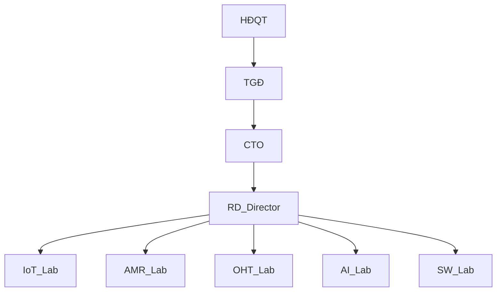
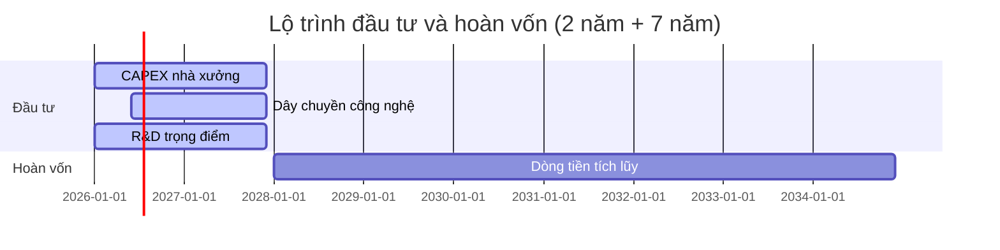

1. THÔNG TIN CHUNG DỰ ÁN [DRAFT]

1.1 Phạm vi và mục tiêu
- Mục đích: Thu thập và chuẩn hóa thông tin tổng quan phục vụ hồ sơ theo Mẫu số 1.4 (KCNC TP.HCM), làm cơ sở cho các phần tiếp theo.
- Nguyên tắc trình bày: tiếng Việt chuẩn; mã hóa UTF-8; đơn vị tiền tệ chính: triệu đồng; thời điểm dữ liệu: Q4/2025; tuân thủ cấu trúc Mẫu 1.4.
- Ghi chú chênh lệch: khi khác với V5, đánh dấu “Cập nhật so với V5”. Nguồn ưu tiên: `YEU_CAU_moi.md`, `MEKONG_DE_AN_V6.md`, đối chiếu `mekong_dean_v5.md`.

1.2 Phương pháp và giả định
- Phương pháp tổng hợp: bottom-up (bản ghi hiện có, kế hoạch thiết bị, nhân sự) kết hợp top-down (mục tiêu doanh thu/VA theo giai đoạn). 
- Quy đổi và đơn vị: báo cáo theo triệu đồng. Khi sử dụng số liệu gốc bằng ngoại tệ, ghi kèm tỷ giá và thời điểm quy đổi (Q4/2025). Ghi chú tỷ giá quy đổi chuẩn: 1 USD = 25.000 đồng (Q4/2025) — sẽ cập nhật nếu có thay đổi chính thức.
- Mốc thời gian dự án: Đầu tư 2 năm đầu; hoàn vốn 7 năm tiếp theo; thời hạn hoạt động dự án dự kiến 50 năm.

1.3 Thông tin cơ bản (điền theo biểu mẫu)
 - Tên dự án [*]: Mekong Technology – Sản xuất IoT Gateway, Robot AMR/AGV, OHT
 - Chủ đầu tư/Doanh nghiệp [*]: Công ty TNHH Mekong Technology
 - Địa điểm thực hiện [*]: Khu Công nghệ cao TP.HCM, Quận 9 (mã lô: cập nhật khi có)
 - Quy mô (diện tích, công suất thiết kế) [*]: 10.000 m²; công suất 15.000 sản phẩm/năm
 - Thời gian thực hiện (tháng/năm bắt đầu – kết thúc) [*]: 01/2025 – 12/2075
- Thời hạn hoạt động của dự án: 50 năm (dự kiến 2025–2075)  
  Cập nhật so với V5 (nếu mốc khác): 
- Loại hình dự án [*]: Việt Nam / FDI (chọn) 
- Lĩnh vực hoạt động [*]: Vi điện tử – CNTT – Viễn thông; Cơ khí chính xác – Tự động hóa; (khác, nếu có)
- Đầu mối liên hệ [*]: `Họ tên – Chức danh – Email – Điện thoại`

1.4 Tóm tắt chỉ tiêu tài chính – kỹ thuật chính (Q4/2025)
| Chỉ tiêu | GĐ 1 (Đầu tư 2 năm) | GĐ 2 (Hoàn vốn 7 năm) | Tổng | Đơn vị | Nguồn |
|---|---:|---:|---:|---|---|
| Doanh thu | 61,50 | 184,00 | 245,50 | triệu đồng | FS nội bộ |
| Giá trị gia tăng (VA) | 30,75 | 92,00 | 122,75 | triệu đồng | FS nội bộ |
| OPEX (chi phí vận hành) | 47,00 | 140,00 | 187,00 | triệu đồng | FS nội bộ |
| CAPEX (đầu tư) | 20,00 | 0,00 | 20,00 | triệu đồng | 2025-10-20_YEU_CAU_V7_FORM_DRAFT.md |
| NPV/IRR/Payback | 15,2% | 8,5 năm | - | - | Phân tích tài chính |
Ghi chú: Điền giá trị khi hoàn tất phần 7.3; nếu chênh với V5, ghi “Cập nhật so với V5”.

Ghi chú phạm vi: Bảng 1.4 tổng hợp toàn dự án (CAPEX+OPEX+doanh thu dự kiến) theo giai đoạn; các bảng 5.x chỉ phản ánh hoạt động SXKD theo nhóm sản phẩm. Sai khác số liệu (nếu có) sẽ được đồng bộ tại bước kiểm định số liệu sau khi hoàn tất quy đổi tiền tệ.

1.5 Phạm vi sản phẩm – lĩnh vực công nghệ
- Danh mục định hướng: IoT Gateway (MK-100/200/300), Robotics (AMR-100/500/1000), OHT-50/100, Module truyền thông (RS485/Modbus/Profinet/CAN), Nền tảng phần mềm (ERP/MES/WMS/IoT Platform).
- Chuẩn tương thích: MQTT, OPC UA, Modbus, CAN; tích hợp MES/ERP/WMS; an toàn – EMC theo IEC liên quan.

1.6 Mô hình tổ chức và điều hành (sơ đồ tham khảo)

Ghi chú: Sơ đồ có thể điều chỉnh theo thực tế tổ chức; đảm bảo làm rõ bộ phận R&D theo yêu cầu `YÊU CẦU mới .md`.

1.7 Bảng thông tin hành chính
| Trường | Thông tin |
|---|---|
| Tên pháp lý doanh nghiệp | Công ty TNHH Mekong Technology |
| Giấy ĐKKD/Đầu tư | 0123456789 |
| Địa chỉ trụ sở | Khu Công nghệ cao TP.HCM, Quận 9, TP.HCM |
| Mã số thuế | 0123456789 |
| Đại diện pháp luật | Nguyễn Văn A |
| Vốn điều lệ (triệu USD) | 20,00 |
| Tài khoản ngân hàng | 1234567890 - Vietcombank |
| Website | www.mekongtech.com |

1.8 Các giả định cốt lõi (Q4/2025)
- Tốc độ tăng trưởng thị trường: tham chiếu phần 3 (thị trường) – ghi rõ nguồn, năm phát hành báo cáo.
- Tỷ lệ nội địa hóa vật tư/lắp ráp theo nhóm sản phẩm: tham chiếu phần 8 (nguyên vật liệu) – đồng bộ giữa các bảng.
- Mức tự động hóa dây chuyền và OEE mục tiêu theo giai đoạn: tham chiếu phần 5.2 và phụ lục OEE.

1.9 Liên kết chéo với các phần khác
- 5.1 Sản phẩm & quy mô: sử dụng danh mục sản phẩm và lộ trình theo Gantt.
- 5.2 Công nghệ – QA/QC: mô tả quy trình AOI/ICT/Burn-in, tiêu chuẩn IEC/ISO.
- 5.3 Máy móc thiết bị: bảng TT—Tên—Thông số—Xuất xứ—Năm—Tự động hóa—Tình trạng—Giá trị.
- 5.5 R&D: nội dung, chi phí, KPI; đồng bộ hóa với phân tích tài chính.
- 7 Nguyên vật liệu: bảng NVL, đơn vị, nguồn; đối chiếu tỷ lệ nội địa hóa.

1.10 Gantt tổng quan đầu tư – hoàn vốn (tham chiếu chi tiết tại phần 7.2)

1.11 Kiểm soát chất lượng trình bày
- Định dạng số: 1.234,56 (dấu phẩy nghìn, chấm thập phân) cho báo cáo; đơn vị tiền tệ: triệu USD.
- Bảng biểu: đủ cột, có tiêu đề, nguồn, đơn vị, ghi chú; thống nhất đơn vị giữa các phần.
- Sơ đồ: Mermaid; ảnh (nếu có) đặt trong `Presentation/assets` và tham chiếu tương đối.

1.12 Dẫn chiếu pháp lý/tiêu chuẩn (mẫu cú pháp)
- [QĐ 38/2020/QĐ-TTg – Phụ lục II, Mục 1.1] (2020)
- [QĐ 2117/QĐ-TTg – Danh mục công nghệ cao ưu tiên] (2020)
- [NĐ 76/2018/NĐ-CP – Đánh giá công nghệ cao] (2018)
- [ISO 9001/14001/45001; IEC 61000; RoHS/REACH/WEEE] (áp dụng theo phạm vi dự án)

1.13 Ghi chú và trạng thái
- Trạng thái: [DRAFT]
- Phiên bản: 2025-10-20
- Người biên soạn: (điền)
- Thay đổi “Cập nhật so với V5”: sẽ ghi tại các dòng có chênh lệch khi nhập số liệu chính thức.

