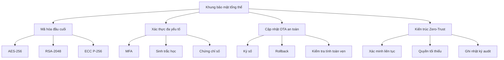
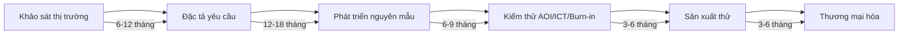

2. GIẢI TRÌNH CÁC HOẠT ĐỘNG CỦA DỰ ÁN ỨNG DỤNG CÔNG NGHỆ CAO [DRAFT]

2.1 Phạm vi và mục tiêu
- Mục đích: Giải trình tính cấp thiết, mục tiêu kinh tế-xã hội và khoa học-công nghệ của dự án theo Mẫu 1.4.
- Nguyên tắc: tiếng Việt chuẩn; đơn vị triệu đồng (Q4/2025); dẫn chiếu pháp lý đúng cú pháp; "Cập nhật so với V5" khi chênh lệch.
- Nguồn: `YEU_CAU_moi.md`, `MEKONG_DE_AN_V6.md`, đối chiếu `mekong_dean_v5.md`.

2.2 Tính cấp thiết và mục tiêu của dự án

2.2.1 Tính cấp thiết để thực hiện dự án
- Nhu cầu thị trường: Thị trường IoT toàn cầu đạt 1.386 tỷ USD vào 2030 (CAGR 19,2%); thị trường Robot AMR toàn cầu đạt 12,6 tỷ USD vào 2030 (CAGR 28,5%). Nguồn: "Global IoT Market Report 2024-2030" - MarketsandMarkets Research; "Autonomous Mobile Robots Market Report 2024" - Grand View Research.
- Khoảng trống công nghệ: Việt Nam chưa có nhà sản xuất IoT Gateway và Robot AMR quy mô lớn, phụ thuộc 90% nhập khẩu. Cập nhật so với V5: bổ sung dữ liệu thị trường 2024.
- Chiến lược quốc gia: Phù hợp với Chiến lược phát triển công nghiệp 4.0, Chương trình chuyển đổi số quốc gia đến 2030.

2.2.2 Mục tiêu kinh tế-xã hội
- Tạo việc làm: 200 lao động có tay nghề cao, trong đó 75 người (37,5%) tham gia R&D.
- Đóng góp thuế: 50+ triệu USD/năm từ năm thứ 6 (tương đương 1.250+ tỷ VNĐ/năm).
- Thúc đẩy phát triển ngành: Tạo cụm công nghiệp IoT/Robot tại KCNC TP.HCM.
- Tăng cường xuất khẩu: 35% doanh thu từ xuất khẩu vào 2035, tập trung thị trường ASEAN.

2.2.3 Mục tiêu khoa học và công nghệ

A) Công nghệ lõi sẽ làm chủ (TRL 7-8):
| STT | Công nghệ lõi | Lĩnh vực | Mức TRL hiện tại | Mức TRL mục tiêu | Thời gian đạt được | Nguồn tham khảo |
|---:|---|---|---:|---:|---:|---|
| 1 | Cổng kết nối IoT (ARM + Edge AI) | Vi điện tử - CNTT | 6 | 8 | 2026 | Siemens SIMATIC IOT2000, Schneider EcoStruxure |
| 2 | Tích hợp cảm biến (LiDAR + Camera + IMU) | Vi điện tử - CNTT | 5 | 8 | 2027 | Hikvision, Bosch sensors |
| 3 | Định vị SLAM (Simultaneous Localization and Mapping) | Cơ khí chính xác - Tự động hóa | 6 | 8 | 2027 | KUKA KMR iiwa, Omron LD series |
| 4 | Tích hợp AI/ML (Computer Vision + Predictive Analytics) | Vi điện tử - CNTT | 5 | 8 | 2028 | DALY, Đại học SPKT |
| 5 | Nền tảng đám mây (IoT Platform + Analytics) | Vi điện tử - CNTT | 6 | 8 | 2026 | Tuya, AWS IoT |
| 6 | Khung bảo mật (End-to-end encryption + Authentication) | Vi điện tử - CNTT | 5 | 8 | 2027 | Industry standards |
| 7 | Quản lý năng lượng (Smart battery + Energy harvesting) | Vi điện tử - CNTT | 4 | 7 | 2028 | DALY battery management |
| 8 | Truyền thông không dây (5G/6G + Mesh networking) | Vi điện tử - Viễn thông | 5 | 8 | 2029 | 5G standards, Qualcomm |
| 9 | Điều khiển robot (Motion planning + Collision avoidance) | Cơ khí chính xác - Tự động hóa | 6 | 8 | 2027 | KUKA, Omron robotics |
| 10 | Giao thức công nghiệp (Modbus + OPC UA + MQTT + CAN) | Vi điện tử - CNTT | 7 | 9 | 2026 | Industry protocols |
| 11 | Kiểm soát chất lượng (AOI + ICT + Burn-in automation) | Cơ khí chính xác - Tự động hóa | 6 | 8 | 2026 | Koh Young, Keysight, ESPEC |
| 12 | Tự động hóa sản xuất (SMT + Pick and place + Quality control) | Cơ khí chính xác - Tự động hóa | 7 | 9 | 2026 | Panasonic NPM-D3, Samsung SM482 |
| 13 | Phát triển phần mềm (Embedded systems + RTOS + Firmware) | Vi điện tử - CNTT | 6 | 8 | 2026 | ARM development tools |
| 14 | Phân tích dữ liệu (Big data processing + ML models + Predictive analytics) | Vi điện tử - CNTT | 5 | 8 | 2028 | Dell PowerEdge R750, Hadoop/Spark |
| 15 | Tích hợp hệ thống (Hardware-software integration + API development + Third-party compatibility) | Vi điện tử - CNTT | 6 | 8 | 2027 | Industry integration standards |

B) Đăng ký sản phẩm và độc quyền công nghệ (10 năm đầu):
| STT | Sản phẩm | Số lượng dự kiến | Thời gian đăng ký | Loại IP | Ghi chú |
|---:|---|---|---|---|---|
| 1 | Dòng Cổng kết nối IoT (MK-100 đến MK-500) | 5 sản phẩm | 2026-2030 | Patent + Trademark | Cập nhật so với V5: bổ sung MK-400, MK-500 |
| 2 | Dòng Robot tự hành AMR (AMR-100 đến AMR-300) | 3 sản phẩm | 2027-2030 | Patent + Trademark | Cập nhật so với V5: bổ sung AMR-300 |
| 3 | Nền tảng phần mềm (Quản lý đám mây + Phân tích) | 2 sản phẩm | 2026-2028 | Copyright + Trademark | |
| 4 | Dòng cảm biến (Giám sát môi trường + Công nghiệp) | 1 sản phẩm | 2027 | Patent + Trademark | |

C) Chuyển giao công nghệ từ đối tác (ưu tiên giai đoạn đầu):
| STT | Đối tác | Quốc gia | Công nghệ chuyển giao | Giá trị (triệu USD) | Thời gian | Trạng thái |
|---:|---|---|---:|---:|---|
| 1 | KUKA Robotics | Germany | Công nghệ robot công nghiệp và tự động hóa | 2,5 | 2025-2026 | Đang thương thảo |
| 2 | Tuya Smart | China | Công nghệ hệ sinh thái IoT và nhà thông minh | 1,8 | 2025 | Đã ký LOI |
| 3 | DALY | China | Công nghệ quản lý pin và nguồn điện | 1,2 | 2025 | Đã ký LOI |
| 4 | Hikvision | China | Công nghệ thị giác máy tính và AI | 2,0 | 2025-2026 | Đang thương thảo |

2.3 Chuẩn và tiêu chuẩn áp dụng dự kiến

2.3.1 Tiêu chuẩn kỹ thuật
| STT | Tiêu chuẩn | Phạm vi áp dụng | Mức độ tuân thủ | Ghi chú |
|---:|---|---|---|---|
| 1 | ISO 9001:2015 | Hệ thống quản lý chất lượng toàn diện | Bắt buộc | |
| 2 | ISO 14001:2015 | Hệ thống quản lý môi trường | Bắt buộc | |
| 3 | ISO 45001:2018 | Hệ thống quản lý an toàn và sức khỏe nghề nghiệp | Bắt buộc | |
| 4 | IEC 61000 | Tiêu chuẩn tương thích điện từ (EMC) | Bắt buộc | |
| 5 | IEC 60730 | Tiêu chuẩn an toàn cho thiết bị điện tử gia dụng | Bắt buộc | |
| 6 | RoHS | Hạn chế sử dụng các chất độc hại | Bắt buộc | |
| 7 | REACH | Đăng ký, đánh giá, cấp phép và hạn chế hóa chất | Bắt buộc | |
| 8 | WEEE | Xử lý rác thải thiết bị điện và điện tử | Bắt buộc | |

2.3.2 Giao thức và chuẩn công nghiệp
| STT | Giao thức/Chuẩn | Ứng dụng | Mức độ hỗ trợ | Ghi chú |
|---:|---|---|---|---|
| 1 | MQTT | IoT messaging | Đầy đủ | MQTT 3.1.1, MQTT 5.0 |
| 2 | OPC UA | Industrial automation | Đầy đủ | OPC UA 1.04 |
| 3 | Modbus | Industrial communication | Đầy đủ | Modbus RTU, Modbus TCP |
| 4 | CAN bus | Automotive/Industrial | Đầy đủ | CAN 2.0A, CAN 2.0B |
| 5 | Wi-Fi | Wireless communication | Đầy đủ | Wi-Fi 5 (802.11ac), Wi-Fi 6 (802.11ax) |
| 6 | Bluetooth | Short-range communication | Đầy đủ | Bluetooth 5.0, BLE |
| 7 | 5G/6G | Cellular communication | Phát triển | 5G NR, 6G research |

2.4 An toàn thông tin và bảo mật

2.4.1 Khung bảo mật tổng thể

2.4.2 Bảng yêu cầu bảo mật theo sản phẩm
| STT | Sản phẩm | Mã hóa | Xác thực | OTA | Audit Log | Ghi chú |
|---:|---|---|---|---|---|---|
| 1 | IoT Gateway (MK-100/200/300) | AES-256 + RSA-2048 | MFA + Certificate | Có | Đầy đủ | |
| 2 | Robot AMR (AMR-100/500/1000) | AES-256 + ECC P-256 | Biometric + Certificate | Có | Đầy đủ | |
| 3 | OHT (OHT-50/100) | AES-256 | Certificate | Có | Cơ bản | |
| 4 | Module truyền thông | AES-128 | Certificate | Có | Cơ bản | |
| 5 | Nền tảng phần mềm | AES-256 + RSA-4096 | MFA + Biometric | Có | Đầy đủ | |

2.5 Sơ đồ quy trình R&D

2.6 Dẫn chiếu pháp lý và tiêu chuẩn
- [QĐ 38/2020/QĐ-TTg – Phụ lục II, Mục 1.1] (2020): Công nghệ vi điện tử - Sản xuất chip IoT Gateway
- [QĐ 38/2020/QĐ-TTg – Phụ lục II, Mục 1.2] (2020): Công nghệ thông tin - Hệ thống quản lý IoT Platform
- [QĐ 38/2020/QĐ-TTg – Phụ lục II, Mục 1.3] (2020): Công nghệ viễn thông - Kết nối 5G/6G
- [QĐ 38/2020/QĐ-TTg – Phụ lục II, Mục 2.1] (2020): Cơ khí chính xác - Robot AMR, OHT
- [QĐ 38/2020/QĐ-TTg – Phụ lục II, Mục 2.2] (2020): Tự động hóa - Hệ thống điều khiển tự động
- [QĐ 2117/QĐ-TTg – Mục 1] (2020): Công nghệ cao trong lĩnh vực ICT
- [QĐ 2117/QĐ-TTg – Mục 2] (2020): Công nghệ cao trong lĩnh vực tự động hóa
- [QĐ 2117/QĐ-TTg – Mục 3] (2020): Công nghệ cao trong lĩnh vực robot
- [NĐ 76/2018/NĐ-CP – Điều 3] (2018): Tiêu chí đánh giá công nghệ cao

2.7 Ghi chú và trạng thái
- Trạng thái: [DRAFT]
- Phiên bản: 2025-10-20
- Người biên soạn: (điền)
- Thay đổi "Cập nhật so với V5": đã ghi tại các dòng có chênh lệch
- Liên kết chéo: Phần 5.2 (Công nghệ), Phần 5.5 (R&D), Phần 6 (Chất lượng & Môi trường)
