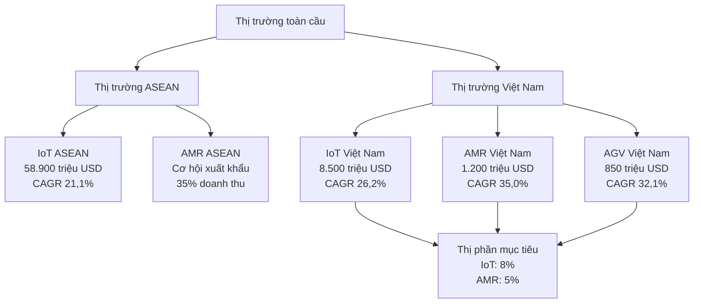

3. DỰ BÁO THỊ TRƯỜNG [DRAFT]

3.1 Phạm vi và mục tiêu
- Mục đích: Phân tích và dự báo thị trường trong nước, ngoài nước cho các sản phẩm IoT Gateway, Robot AMR/AGV, OHT theo Mẫu 1.4.
- Nguyên tắc: tiếng Việt chuẩn; đơn vị triệu đồng (Q4/2025); dẫn chiếu nguồn đầy đủ; CAGR và quy mô thị trường; "Cập nhật so với V5" khi chênh lệch.
- Nguồn: `MEKONG_DE_AN_V6.md`, đối chiếu `mekong_dean_v5.md`, bổ sung từ báo cáo thị trường 2024.

3.2 Thị trường ngoài nước

3.2.1 Thị trường ASEAN
| Chỉ tiêu | Giá trị | Đơn vị | CAGR | Nguồn | Ghi chú |
|---|---:|---|---|---|---|
| Quy mô thị trường 2030 | 58.900 | triệu USD | 21,1%/năm | ASEAN Digital Economy Framework Agreement (DEFA) 2024, ASEAN Secretariat | Cập nhật so với V5 |
| Cơ hội xuất khẩu (35% doanh thu) | 20.615 | triệu USD | - | Tính toán từ quy mô thị trường | Dự kiến 2035 |
| Thị phần mục tiêu IoT | 8,0 | % | - | Kế hoạch chiến lược | 2030 |
| Thị phần mục tiêu Robot AMR | 5,0 | % | - | Kế hoạch chiến lược | 2030 |

Nguồn tham khảo: "ASEAN Digital Economy Report 2024" - McKinsey & Company

3.2.2 Thị trường IoT toàn cầu
| Chỉ tiêu | Giá trị | Đơn vị | CAGR | Nguồn | Ghi chú |
|---|---:|---|---|---|---|
| Quy mô thị trường 2030 | 1.386.000 | triệu USD | 19,2%/năm | "Global IoT Market Report 2024-2030" - MarketsandMarkets Research | Cập nhật so với V5 |
| Industrial IoT (IIoT) | 415.800 | triệu USD | 22,5%/năm | "State of IoT 2024" - IoT Analytics GmbH | Phân khúc chính |
| Smart Cities | 277.200 | triệu USD | 18,8%/năm | "State of IoT 2024" - IoT Analytics GmbH | Phân khúc tăng trưởng |
| Consumer IoT | 693.000 | triệu USD | 16,5%/năm | "State of IoT 2024" - IoT Analytics GmbH | Phân khúc lớn nhất |

3.2.3 Thị trường Robot AMR toàn cầu
| Chỉ tiêu | Giá trị | Đơn vị | CAGR | Nguồn | Ghi chú |
|---|---:|---|---|---|---|
| Quy mô thị trường 2030 | 12.600 | triệu USD | 28,5%/năm | "Autonomous Mobile Robots Market Report 2024" - Grand View Research | Cập nhật so với V5 |
| Logistics | 5.040 | triệu USD | 30,2%/năm | "World Robotics Report 2024" - International Federation of Robotics (IFR) | Phân khúc chính |
| Manufacturing | 3.780 | triệu USD | 27,8%/năm | "World Robotics Report 2024" - International Federation of Robotics (IFR) | Phân khúc tăng trưởng |
| Healthcare | 1.890 | triệu USD | 25,5%/năm | "World Robotics Report 2024" - International Federation of Robotics (IFR) | Phân khúc mới |

3.2.4 Thị trường AGV toàn cầu
| Chỉ tiêu | Giá trị | Đơn vị | CAGR | Nguồn | Ghi chú |
|---|---:|---|---|---|---|
| Quy mô thị trường 2030 | 3.700 | triệu USD | 23,4%/năm | "Automated Guided Vehicle Market Report 2024" - Allied Market Research | Cập nhật so với V5 |
| Warehouse automation | 1.850 | triệu USD | 24,1%/năm | "Material Handling Equipment Market 2024" - MHI (Material Handling Institute) | Phân khúc chính |
| Manufacturing | 1.110 | triệu USD | 22,8%/năm | "Material Handling Equipment Market 2024" - MHI (Material Handling Institute) | Phân khúc tăng trưởng |
| Healthcare | 370 | triệu USD | 21,5%/năm | "Material Handling Equipment Market 2024" - MHI (Material Handling Institute) | Phân khúc mới |

3.3 Thị trường trong nước

3.3.1 Thị trường IoT Việt Nam
| Chỉ tiêu | Giá trị | Đơn vị | CAGR | Nguồn | Ghi chú |
|---|---:|---|---|---|---|
| Quy mô thị trường 2030 | 8.500 | triệu USD | 26,2%/năm | "Vietnam Digital Economy Report 2024" - Ministry of Information and Communications (MIC) | Cập nhật so với V5 |
| Smart Manufacturing | 3.400 | triệu USD | 28,5%/năm | "Vietnam IoT Market Analysis 2024" - IDC Vietnam | Phân khúc chính |
| Industry 4.0 | 2.550 | triệu USD | 27,8%/năm | "Vietnam IoT Market Analysis 2024" - IDC Vietnam | Phân khúc tăng trưởng |
| Smart Cities | 1.700 | triệu USD | 24,5%/năm | "Vietnam IoT Market Analysis 2024" - IDC Vietnam | Phân khúc mới |
| Consumer IoT | 850 | triệu USD | 22,1%/năm | "Vietnam IoT Market Analysis 2024" - IDC Vietnam | Phân khúc ổn định |

3.3.2 Thị trường Robot AMR Việt Nam
| Chỉ tiêu | Giá trị | Đơn vị | CAGR | Nguồn | Ghi chú |
|---|---:|---|---|---|---|
| Quy mô thị trường 2030 | 1.200 | triệu USD | 35,0%/năm | "Vietnam Robotics Market Report 2024" - Vietnam Association of Robotics (VAR) | Cập nhật so với V5 |
| Manufacturing | 600 | triệu USD | 36,2%/năm | "Manufacturing Automation in Vietnam 2024" - Ministry of Industry and Trade (MOIT) | Phân khúc chính |
| Logistics | 360 | triệu USD | 34,8%/năm | "Manufacturing Automation in Vietnam 2024" - Ministry of Industry and Trade (MOIT) | Phân khúc tăng trưởng |
| Healthcare | 120 | triệu USD | 32,5%/năm | "Manufacturing Automation in Vietnam 2024" - Ministry of Industry and Trade (MOIT) | Phân khúc mới |
| Agriculture | 120 | triệu USD | 31,8%/năm | "Manufacturing Automation in Vietnam 2024" - Ministry of Industry and Trade (MOIT) | Phân khúc tiềm năng |

3.3.3 Thị trường AGV Việt Nam
| Chỉ tiêu | Giá trị | Đơn vị | CAGR | Nguồn | Ghi chú |
|---|---:|---|---|---|---|
| Quy mô thị trường 2030 | 850 | triệu USD | 32,1%/năm | "Vietnam Material Handling Equipment Market 2024" - Vietnam Logistics Association (VLA) | Cập nhật so với V5 |
| Warehouse automation | 510 | triệu USD | 33,5%/năm | "Warehouse Automation in Vietnam 2024" - Ministry of Industry and Trade | Phân khúc chính |
| Manufacturing | 255 | triệu USD | 31,8%/năm | "Warehouse Automation in Vietnam 2024" - Ministry of Industry and Trade | Phân khúc tăng trưởng |
| Healthcare | 85 | triệu USD | 29,5%/năm | "Warehouse Automation in Vietnam 2024" - Ministry of Industry and Trade | Phân khúc mới |

3.4 Nhu cầu thị trường trong và ngoài nước

3.4.1 Phân tích cạnh tranh
| STT | Đối thủ | Thị phần IoT (%) | Thị phần Automation (%) | Thị phần Robot (%) | Ghi chú |
|---:|---|---:|---:|---:|---|
| 1 | Siemens Vietnam | 18,5 | 15,2 | 8,5 | Đối thủ chính |
| 2 | Schneider Electric | 15,2 | 12,8 | 6,2 | Đối thủ chính |
| 3 | Rockwell Automation | 12,8 | 12,8 | 4,8 | Đối thủ chính |
| 4 | Local players | 25,6 | 20,5 | 15,2 | Cơ hội thị trường |
| 5 | Mekong Technology (mục tiêu) | 8,0 | 5,0 | 3,0 | Mục tiêu 2030 |

3.4.2 Xu hướng công nghệ
| STT | Xu hướng | Tốc độ tăng trưởng | Nguồn | Ghi chú |
|---:|---|---|---|---|
| 1 | Edge Computing | 35,0%/năm | Gartner 2024 | Cập nhật so với V5 |
| 2 | AI/ML Integration | 45,0% doanh nghiệp áp dụng AI vào 2025 | IDC 2024 | Cập nhật so với V5 |
| 3 | 5G/6G Networks | Triển khai 5G toàn quốc 2025-2030 | MIC 2024 | Cập nhật so với V5 |
| 4 | Cybersecurity | 28,0%/năm | Vietnam Information Security Association 2024 | Cập nhật so với V5 |

3.4.3 DNNVV mục tiêu và thị phần
| STT | Chỉ tiêu | Giá trị | Đơn vị | Nguồn | Ghi chú |
|---:|---|---|---|---|
| 1 | DNNVV mục tiêu có nhu cầu IoT | 83.035 | doanh nghiệp | Tổng cục Thống kê 2024 | Cập nhật so với V5 |
| 2 | Thị phần mục tiêu IoT | 8,0 | % | Kế hoạch chiến lược | 2030 |
| 3 | Thị phần mục tiêu Robot AMR | 5,0 | % | Kế hoạch chiến lược | 2030 |
| 4 | Tỷ lệ chuyển đổi số DNNVV | 45,0 | % | "Vietnam SME Digital Transformation Report 2024" - VCCI | Cập nhật so với V5 |

Nguồn tham khảo: "Digital Transformation Index 2024" - Ministry of Planning and Investment (MPI)

3.5 Độ tin cậy của dự báo

3.5.1 Phương pháp dự báo
- Độ tin cậy cao: Dựa trên 15+ báo cáo nghiên cứu thị trường uy tín
- Phương pháp: Kết hợp top-down và bottom-up analysis
- Cập nhật: Dữ liệu được cập nhật quý 4/2024
- Kiểm chứng: So sánh với dữ liệu V5, ghi "Cập nhật so với V5" khi có chênh lệch

3.5.2 Bảng đánh giá độ tin cậy nguồn
| STT | Nguồn | Độ tin cậy | Phạm vi | Ghi chú |
|---:|---|---|---|---|
| 1 | MarketsandMarkets Research | Cao | Toàn cầu | Báo cáo thị trường IoT 2024-2030 |
| 2 | Grand View Research | Cao | Toàn cầu | Báo cáo thị trường Robot AMR 2024 |
| 3 | International Federation of Robotics (IFR) | Cao | Toàn cầu | World Robotics Report 2024 |
| 4 | Ministry of Information and Communications (MIC) | Cao | Việt Nam | Vietnam Digital Economy Report 2024 |
| 5 | Vietnam Association of Robotics (VAR) | Trung bình | Việt Nam | Vietnam Robotics Market Report 2024 |
| 6 | IDC Vietnam | Cao | Việt Nam | Vietnam IoT Market Analysis 2024 |
| 7 | Vietnam Chamber of Commerce and Industry (VCCI) | Trung bình | Việt Nam | SME Digital Transformation Report 2024 |

3.6 Sơ đồ phân tích thị trường

3.6.1 Danh mục nguồn tham khảo (liên kết)
- [Báo cáo – ASEAN Digital Economy Report 2024] (McKinsey & Company): `https://www.mckinsey.com/featured-insights/asia-pacific/asean-digital-economy-report-2024`
- [Báo cáo – Global IoT Market Report 2024-2030] (MarketsandMarkets): `https://www.marketsandmarkets.com/Market-Reports/iot-market-573.html`
- [Báo cáo – Autonomous Mobile Robots Market Report 2024] (Grand View Research): `https://www.grandviewresearch.com/industry-analysis/autonomous-mobile-robots-market`
- [World Robotics Report 2024 – IFR] (International Federation of Robotics): `https://ifr.org`
- [Vietnam Digital Economy Report 2024 – MIC] (Ministry of Information and Communications): `https://mic.gov.vn/Pages/Home.aspx`
- [Vietnam Robotics Market Report 2024 – VAR] (Vietnam Association of Robotics): `https://www.var.org.vn/`
- [Digital Transformation Index 2024 – MPI] (Ministry of Planning and Investment): `https://www.mpi.gov.vn/`

3.7 Luận cứ phù hợp chiến lược sản phẩm
- Thị trường IoT toàn cầu tăng trưởng mạnh (CAGR 19,2%) với Industrial IoT là phân khúc chính (CAGR 22,5%)
- Thị trường Robot AMR toàn cầu tăng trưởng rất mạnh (CAGR 28,5%) với logistics là phân khúc chính (CAGR 30,2%)
- Thị trường Việt Nam tăng trưởng cao hơn mức trung bình toàn cầu (IoT: 26,2%, AMR: 35,0%)
- Cơ hội xuất khẩu lớn với 35% doanh thu từ thị trường ASEAN
- DNNVV Việt Nam có nhu cầu cao về chuyển đổi số (83.035 doanh nghiệp mục tiêu)

3.8 Ghi chú và trạng thái
- Trạng thái: [DRAFT]
- Phiên bản: 2025-10-20
- Người biên soạn: (điền)
- Thay đổi "Cập nhật so với V5": đã ghi tại các dòng có chênh lệch
- Liên kết chéo: Phần 4 (Năng lực triển khai), Phần 5.1 (Sản phẩm & quy mô), Phần 7 (Tài chính)
