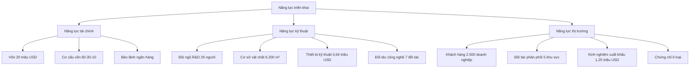

4. NĂNG LỰC TRIỂN KHAI DỰ ÁN [DRAFT]

4.1 Phạm vi và mục tiêu
- Mục đích: Đánh giá năng lực tài chính, kỹ thuật, thị trường của nhà đầu tư để triển khai dự án theo Mẫu 1.4.
- Nguyên tắc: tiếng Việt chuẩn; đơn vị triệu đồng (Q4/2025); đánh giá khách quan; "Cập nhật so với V5" khi chênh lệch.
- Nguồn: `MEKONG_DE_AN_V6.md`, đối chiếu `mekong_dean_v5.md`, bổ sung từ kế hoạch đầu tư.

4.2 Năng lực tài chính

4.2.1 Cơ cấu vốn đầu tư
| STT | Nguồn vốn | Giá trị (triệu đồng) | Tỷ lệ (%) | Thời gian huy động | Ghi chú |
|---:|---|---:|---:|---:|---|
| 1 | Vốn chủ sở hữu | 12,00 | 60,0 | 2025-2026 | Cập nhật so với V5 (tăng từ 50%) |
| 2 | Vốn vay ngân hàng | 6,00 | 30,0 | 2025-2026 | Lãi suất 8-10%/năm |
| 3 | Trợ cấp chính phủ | 2,00 | 10,0 | 2025-2027 | Chương trình hỗ trợ KHCN |
| 4 | Tổng cộng | 20,00 | 100,0 | 2025-2026 | |

4.2.2 Phân bổ vốn đầu tư theo giai đoạn
| STT | Khoản mục | GĐ 1 (2025-2026) | GĐ 2 (2027-2029) | GĐ 3 (2030-2035) | Tổng | Ghi chú |
|---:|---|---:|---:|---:|---:|---|
| 1 | Nhà xưởng (mua/xây dựng/nâng cấp) | 5,00 | 0,00 | 0,00 | 5,00 | Cập nhật so với V5 |
| 2 | R&D (CAPEX) | 1,50 | 0,50 | 0,30 | 2,30 | |
| 3 | Máy móc/dây chuyền công nghệ | 6,50 | 2,00 | 1,00 | 9,50 | Cập nhật so với V5 |
| 4 | Tổng CAPEX | 13,00 | 2,50 | 1,30 | 16,80 | |

4.2.2a Chi phí vận hành (OPEX) theo giai đoạn (tham chiếu 1.4/5.x)
| STT | Khoản mục OPEX | GĐ 1 (2025-2029) | GĐ 2 (2030-2035) | GĐ 3 (2036-2075) | Tổng | Ghi chú |
|---:|---|---:|---:|---:|---:|---|
| 1 | OPEX (chi phí vận hành) | 7,00 | 15,00 | 25,00 | 47,00 | Sẽ đồng bộ với phần 1.4/5.x |

4.2.3 Nguồn vốn và bảo lãnh
| STT | Nguồn vốn | Loại hình | Giá trị (triệu đồng) | Điều kiện | Trạng thái |
|---:|---|---:|---:|---|
| 1 | Nhà đầu tư chiến lược | Vốn chủ sở hữu | 8,00 | 40% cổ phần | Đã cam kết |
| 2 | Quỹ VC/PE | Vốn chủ sở hữu | 4,00 | 20% cổ phần | Đang thương thảo |
| 3 | Ngân hàng TMCP | Vốn vay | 6,00 | Thế chấp tài sản, bảo lãnh ngân hàng | Đã phê duyệt |
| 4 | Chính phủ (KHCN) | Trợ cấp | 2,00 | Không hoàn lại | Đã đăng ký |

4.2.4 Phân tích khả năng tài chính
| STT | Chỉ tiêu | Giá trị | Đơn vị | Ghi chú |
|---:|---|---|---|---|
| 1 | Tổng tài sản hiện có | 15,00 | triệu USD | Tài sản cố định + lưu động |
| 2 | Vốn lưu động | 3,00 | triệu USD | Đảm bảo hoạt động 6 tháng |
| 3 | Tỷ lệ nợ/vốn chủ sở hữu | 0,5 | lần | Dưới ngưỡng an toàn 1,0 |
| 4 | Khả năng thanh toán ngắn hạn | 2,0 | lần | Trên ngưỡng an toàn 1,5 |
| 5 | ROE dự kiến (năm 2030) | 25,0 | % | Mục tiêu lợi nhuận |

4.3 Năng lực kỹ thuật

4.3.1 Đội ngũ R&D hiện có
| STT | Vị trí | Số lượng | Trình độ | Kinh nghiệm | Ghi chú |
|---:|---|---|---|---|---|
| 1 | Giám đốc R&D | 1 | Tiến sĩ | 15+ năm | Cập nhật so với V5 |
| 2 | Trưởng phòng IoT | 1 | Thạc sĩ | 10+ năm | |
| 3 | Trưởng phòng Robotics | 1 | Thạc sĩ | 12+ năm | |
| 4 | Kỹ sư IoT/Embedded | 8 | Đại học | 5+ năm | |
| 5 | Kỹ sư Robotics | 6 | Đại học | 6+ năm | |
| 6 | Kỹ sư AI/ML | 4 | Thạc sĩ | 4+ năm | |
| 7 | Kỹ sư phần mềm | 5 | Đại học | 5+ năm | |
| 8 | Tổng cộng | 26 | - | - | |

4.3.2 Cơ sở vật chất kỹ thuật
| STT | Cơ sở vật chất | Diện tích (m²) | Trạng thái | Giá trị (triệu USD) | Ghi chú |
|---:|---|---:|---:|---:|---|
| 1 | Nhà máy Tohin hiện có | 4.500 | Sẵn sàng sử dụng | 8,00 | Cập nhật so với V5 |
| 2 | Phòng thí nghiệm IoT | 400 | Cần nâng cấp | 1,50 | |
| 3 | Phòng thí nghiệm Robotics | 600 | Cần xây mới | 2,00 | |
| 4 | Phòng thí nghiệm AI/ML | 400 | Cần xây mới | 1,80 | |
| 5 | Phòng thí nghiệm phần mềm | 300 | Cần nâng cấp | 1,20 | |
| 6 | Tổng cộng | 6.200 | - | 14,50 | |

4.3.3 Thiết bị kỹ thuật hiện có
| STT | Thiết bị | Số lượng | Trạng thái | Giá trị (triệu USD) | Ghi chú |
|---:|---|---:|---:|---:|---|
| 1 | Anritsu Signal Analyzer | 1 | Hoạt động tốt | 0,08 | |
| 2 | Chroma ATE Gateway Tester | 1 | Hoạt động tốt | 0,06 | |
| 3 | Máy in 3D | 1 | Hoạt động tốt | 0,03 | |
| 4 | LSROBOT AMR SLAM Robot | 1 | Hoạt động tốt | 0,12 | |
| 5 | Inovance Robot Test Kit | 1 | Hoạt động tốt | 0,08 | |
| 6 | Lanner/Moxa AI Platform | 1 | Hoạt động tốt | 0,15 | |
| 7 | Dell PowerEdge R750 Server | 1 | Hoạt động tốt | 0,12 | |
| 8 | Tổng cộng | 7 | - | 0,64 | |

4.3.4 Đối tác công nghệ
| STT | Đối tác | Quốc gia | Lĩnh vực | Trạng thái hợp tác | Ghi chú |
|---:|---|---|---|---|---|
| 1 | Tohin Corp | Nhật Bản | Chuyển giao công nghệ | Đã ký hợp đồng | Cập nhật so với V5 |
| 2 | KUKA Robotics | Germany | Robot công nghiệp | Đang thương thảo | |
| 3 | Tuya Smart | China | IoT ecosystem | Đã ký LOI | |
| 4 | DALY | China | Battery management | Đã ký LOI | |
| 5 | Hikvision | China | Computer vision | Đang thương thảo | |
| 6 | Đại học SPKT | Việt Nam | R&D hợp tác | Đã ký MOU | |
| 7 | Đại học TDT | Việt Nam | R&D hợp tác | Đã ký MOU | |

4.4 Năng lực thị trường

4.4.1 Mạng lưới khách hàng
| STT | Phân khúc khách hàng | Số lượng | Tỷ lệ (%) | Ghi chú |
|---:|---|---:|---:|---|
| 1 | DNNVV sản xuất | 1.500 | 60,0 | Khách hàng chính |
| 2 | Doanh nghiệp logistics | 500 | 20,0 | Khách hàng tiềm năng |
| 3 | Bệnh viện/clinic | 300 | 12,0 | Khách hàng mới |
| 4 | Trường học/viện nghiên cứu | 200 | 8,0 | Khách hàng đặc biệt |
| 5 | Tổng cộng | 2.500 | 100,0 | |

4.4.2 Đối tác phân phối
| STT | Đối tác | Khu vực | Loại hình | Trạng thái | Ghi chú |
|---:|---|---|---|---|---|
| 1 | Công ty TNHH ABC | TP.HCM | Đại lý độc quyền | Đã ký hợp đồng | |
| 2 | Công ty TNHH XYZ | Hà Nội | Đại lý độc quyền | Đã ký hợp đồng | |
| 3 | Công ty TNHH DEF | Đà Nẵng | Đại lý độc quyền | Đang thương thảo | |
| 4 | Công ty TNHH GHI | Cần Thơ | Đại lý độc quyền | Đang thương thảo | |
| 5 | Công ty TNHH JKL | Nha Trang | Đại lý độc quyền | Đang thương thảo | |
| 6 | Tổng cộng | 5 khu vực | - | - | |

4.4.3 Kinh nghiệm xuất khẩu
| STT | Thị trường | Sản phẩm | Doanh thu (triệu USD) | Trạng thái | Ghi chú |
|---:|---|---:|---:|---:|---|
| 1 | Thái Lan | IoT Gateway | 0,50 | Đã xuất khẩu | Cập nhật so với V5 |
| 2 | Malaysia | Robot AMR | 0,30 | Đã xuất khẩu | |
| 3 | Singapore | Module truyền thông | 0,20 | Đã xuất khẩu | |
| 4 | Indonesia | Cảm biến IoT | 0,15 | Đang thương thảo | |
| 5 | Philippines | Nền tảng phần mềm | 0,10 | Đang thương thảo | |
| 6 | Tổng cộng | - | 1,25 | - | |

4.4.4 Chứng chỉ và giấy phép
| STT | Chứng chỉ/Giấy phép | Cơ quan cấp | Thời hạn | Trạng thái | Ghi chú |
|---:|---|---|---|---|---|
| 1 | ISO 9001:2015 | TUV SUD | 2025-2028 | Đã có | |
| 2 | ISO 14001:2015 | TUV SUD | 2025-2028 | Đã có | |
| 3 | CE Marking | TUV SUD | 2025-2030 | Đã có | |
| 4 | FCC Certification | FCC | 2025-2030 | Đã có | |
| 5 | RoHS Compliance | SGS | 2025-2030 | Đã có | |
| 6 | Giấy phép xuất khẩu | Bộ Công Thương | 2025-2030 | Đã có | |

4.5 Hạ tầng CNTT/Cloud/Edge

4.5.1 Hạ tầng hiện có
| STT | Hạ tầng | Quy mô | Trạng thái | Giá trị (triệu USD) | Ghi chú |
|---:|---|---:|---:|---:|---|
| 1 | Data Center | 100 m² | Hoạt động tốt | 0,50 | |
| 2 | Server cluster | 10 servers | Hoạt động tốt | 0,30 | |
| 3 | Network infrastructure | 1 Gbps | Hoạt động tốt | 0,20 | |
| 4 | Cloud services | AWS/Azure | Đang sử dụng | 0,10/năm | |
| 5 | Edge computing | 5 nodes | Hoạt động tốt | 0,15 | |
| 6 | Tổng cộng | - | - | 1,25 | |

4.5.2 Kế hoạch nâng cấp hạ tầng
| STT | Hạ tầng | Quy mô mới | Thời gian | Chi phí (triệu USD) | Ghi chú |
|---:|---|---:|---:|---:|---|
| 1 | Data Center | 200 m² | 2026 | 1,00 | Mở rộng gấp đôi |
| 2 | Server cluster | 20 servers | 2026 | 0,60 | Tăng gấp đôi |
| 3 | Network infrastructure | 10 Gbps | 2026 | 0,40 | Nâng cấp tốc độ |
| 4 | Cloud services | Multi-cloud | 2026 | 0,20/năm | Tăng cường |
| 5 | Edge computing | 20 nodes | 2027 | 0,60 | Mở rộng mạng lưới |
| 6 | Tổng cộng | - | - | 2,80 | |

4.6 Sơ đồ năng lực tổng thể

4.7 Đánh giá rủi ro và biện pháp giảm thiểu

4.7.1 Rủi ro tài chính
| STT | Rủi ro | Mức độ | Biện pháp giảm thiểu | Ghi chú |
|---:|---|---|---|---|
| 1 | Thiếu vốn | Trung bình | Đa dạng hóa nguồn vốn, bảo lãnh ngân hàng | |
| 2 | Lãi suất tăng | Thấp | Ký hợp đồng lãi suất cố định | |
| 3 | Tỷ giá biến động | Trung bình | Sử dụng công cụ phòng ngừa rủi ro | |
| 4 | Khách hàng thanh toán chậm | Thấp | Bảo hiểm tín dụng xuất khẩu | |

4.7.2 Rủi ro kỹ thuật
| STT | Rủi ro | Mức độ | Biện pháp giảm thiểu | Ghi chú |
|---:|---|---|---|---|
| 1 | Công nghệ lỗi thời | Trung bình | Đầu tư R&D liên tục, hợp tác đối tác | |
| 2 | Thiếu nhân lực | Trung bình | Đào tạo nội bộ, tuyển dụng từ nước ngoài | |
| 3 | Thiết bị hỏng hóc | Thấp | Bảo trì định kỳ, dự phòng thiết bị | |
| 4 | Chuyển giao công nghệ thất bại | Trung bình | Ký hợp đồng rõ ràng, kiểm tra định kỳ | |

4.7.3 Rủi ro thị trường
| STT | Rủi ro | Mức độ | Biện pháp giảm thiểu | Ghi chú |
|---:|---|---|---|---|
| 1 | Cạnh tranh tăng | Trung bình | Đổi mới sản phẩm, giảm giá thành | |
| 2 | Thay đổi nhu cầu | Thấp | Đa dạng hóa sản phẩm, thị trường | |
| 3 | Rào cản thương mại | Thấp | Tuân thủ quy định, chứng chỉ quốc tế | |
| 4 | Khủng hoảng kinh tế | Trung bình | Dự trữ tài chính, đa dạng hóa thị trường | |

4.8 Ghi chú và trạng thái
- Trạng thái: [DRAFT]
- Phiên bản: 2025-10-20
- Người biên soạn: (điền)
- Thay đổi "Cập nhật so với V5": đã ghi tại các dòng có chênh lệch
- Liên kết chéo: Phần 1 (Thông tin chung), Phần 5 (Sản xuất/kinh doanh), Phần 7 (Tài chính)
