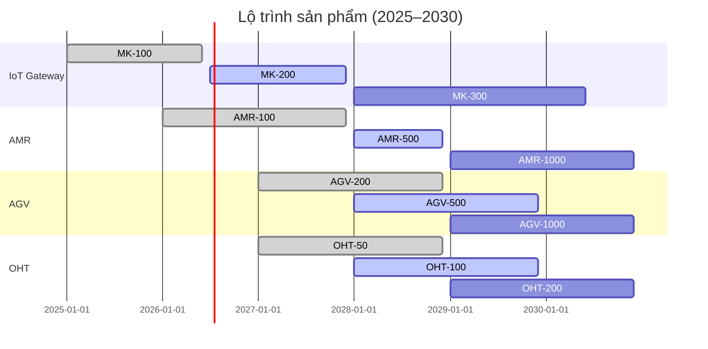

5.1. GIẢI TRÌNH SẢN PHẨM VÀ NĂNG LỰC SẢN XUẤT CỦA DỰ ÁN [DRAFT]

5.1.1 Phạm vi và mục tiêu
- Mục đích: Giải trình chi tiết sản phẩm và năng lực sản xuất của dự án theo Mẫu 1.4, bao gồm danh mục sản phẩm, quy mô, lộ trình phát triển.
- Nguyên tắc: tiếng Việt chuẩn; đơn vị triệu đồng (Q4/2025); bảng chuẩn; "Cập nhật so với V5" khi chênh lệch.
- Nguồn: `MEKONG_DE_AN_V6.md`, đối chiếu `mekong_dean_v5.md`, bổ sung từ kế hoạch sản phẩm.

5.1.2 Danh mục sản phẩm chính

5.1.2.1 Dòng sản phẩm Cổng kết nối IoT (MK series)
| STT | Sản phẩm | Thông số kỹ thuật | Quy mô (đơn vị/năm) | Giá trị/SP (triệu đồng) | Doanh thu (triệu đồng) | VA (%) | VN (%) | NN (%) | Phù hợp QĐ 38/2020/QĐ-TTg |
|---:|---|---:|---:|---:|---:|---:|---:|---:|---|
| 1 | MK-100 Basic (2026) | Chip ARM Cortex-A55, RAM 4GB, Wi-Fi 5, Edge computing | 8.000 | 0,72 | 5,76 | 45 | 70 | 30 | Mục 1.1 - Công nghệ vi điện tử |
| 2 | MK-200 Pro (2027) | Chip ARM Cortex-A78, RAM 8GB, AI tại biên, Multi-protocol | 3.000 | 0,90 | 2,70 | 50 | 75 | 25 | Mục 1.1 - Công nghệ vi điện tử |
| 3 | MK-300 Enterprise (2030) | Đa giao thức, tính sẵn sàng cao, 5G | 2.000 | 1,44 | 2,88 | 55 | 80 | 20 | Mục 1.1 - Công nghệ vi điện tử |
| 4 | MK-400 Advanced (2035) | ARM Cortex-A/X thế hệ mới, 16GB RAM, Edge AI | 1.000 | 2,16 | 2,16 | 60 | 85 | 15 | Mục 1.1 - Công nghệ vi điện tử |
| 5 | MK-500 Future (2040) | ARM Cortex thế hệ mới, 32GB RAM, AI/ML tăng cường | 500 | 3,60 | 1,80 | 65 | 90 | 10 | Mục 1.1 - Công nghệ vi điện tử |
| 6 | Tổng cộng | - | 14.500 | - | 15,30 | 53,0 | 76,0 | 24,0 | - |

5.1.2.2 Dòng sản phẩm Robot tự hành AMR (AMR series)
| STT | Sản phẩm | Thông số kỹ thuật | Quy mô (đơn vị/năm) | Giá trị/SP (triệu đồng) | Doanh thu (triệu đồng) | VA (%) | VN (%) | NN (%) | Phù hợp QĐ 38/2020/QĐ-TTg |
|---:|---|---:|---:|---:|---:|---:|---:|---:|---|
| 1 | AMR-100 (2027) | Tải trọng 100kg, LiDAR 2D, SLAM navigation | 200 | 5,10 | 1,02 | 35 | 60 | 40 | Mục 2.1 - Cơ khí chính xác |
| 2 | AMR-500 (2028) | Tải trọng 500kg, LiDAR 3D, AI navigation | 150 | 6,60 | 0,99 | 40 | 65 | 35 | Mục 2.1 - Cơ khí chính xác |
| 3 | AMR-1000 (2030) | Tải trọng 1000kg, Multi-sensor fusion, Advanced AI | 100 | 10,20 | 1,02 | 45 | 70 | 30 | Mục 2.1 - Cơ khí chính xác |
| 4 | AMR-2000 (2035) | Tải trọng 2000kg, cảm biến tiên tiến, Predictive AI | 50 | 16,80 | 0,84 | 50 | 75 | 25 | Mục 2.1 - Cơ khí chính xác |
| 5 | Tổng cộng | - | 500 | - | 3,87 | 42,5 | 67,5 | 32,5 | - |

5.1.2.3 Dòng sản phẩm Xe tự hành AGV (AGV series)
| STT | Sản phẩm | Thông số kỹ thuật | Quy mô (đơn vị/năm) | Giá trị/SP (triệu đồng) | Doanh thu (triệu đồng) | VA (%) | VN (%) | NN (%) | Phù hợp QĐ 38/2020/QĐ-TTg |
|---:|---|---:|---:|---:|---:|---:|---:|---:|---|
| 1 | AGV-200 (2028) | Tải trọng 200kg, Laser navigation, 4WD | 150 | 7,20 | 1,08 | 40 | 65 | 35 | Mục 2.1 - Cơ khí chính xác |
| 2 | AGV-500 (2029) | Tải trọng 500kg, Magnetic tape, Forklift | 180 | 7,80 | 1,40 | 45 | 70 | 30 | Mục 2.1 - Cơ khí chính xác |
| 3 | AGV-1000 (2030) | Tải trọng 1000kg, Vision-based navigation, AI planning | 120 | 12,00 | 1,44 | 50 | 75 | 25 | Mục 2.1 - Cơ khí chính xác |
| 4 | AGV-2000 (2035) | Tải trọng 2000kg, Autonomous logistics, Fleet management | 80 | 18,00 | 1,44 | 55 | 80 | 20 | Mục 2.1 - Cơ khí chính xác |
| 5 | Tổng cộng | - | 530 | - | 5,36 | 47,5 | 72,5 | 27,5 | - |

5.1.2.4 Dòng sản phẩm OHT (Overhead Hoist Transfer)
| STT | Sản phẩm | Thông số kỹ thuật | Quy mô (đơn vị/năm) | Giá trị/SP (triệu đồng) | Doanh thu (triệu đồng) | VA (%) | VN (%) | NN (%) | Phù hợp QĐ 38/2020/QĐ-TTg |
|---:|---|---:|---:|---:|---:|---:|---:|---:|---|
| 1 | OHT-50 (2028) | Tải trọng 50kg, Overhead rail, 4 axes, Dược phẩm | 80 | 7,20 | 0,58 | 45 | 75 | 25 | Mục 2.1 - Cơ khí chính xác |
| 2 | OHT-100 (2029) | Tải trọng 100kg, Dual rail, 4 axes, Nhà hàng | 60 | 8,40 | 0,50 | 40 | 70 | 30 | Mục 2.1 - Cơ khí chính xác |
| 3 | OHT-200 (2030) | Tải trọng 200kg, Multi-rail, 6 axes, Industrial | 40 | 12,00 | 0,48 | 45 | 75 | 25 | Mục 2.1 - Cơ khí chính xác |
| 4 | OHT-500 (2035) | Tải trọng 500kg, Automated rail, 8 axes, Heavy industry | 20 | 18,00 | 0,36 | 50 | 80 | 20 | Mục 2.1 - Cơ khí chính xác |
| 5 | Tổng cộng | - | 200 | - | 1,92 | 45,0 | 75,0 | 25,0 | - |

5.1.2.5 Dòng sản phẩm Module truyền thông
| STT | Sản phẩm | Thông số kỹ thuật | Quy mô (đơn vị/năm) | Giá trị/SP (triệu đồng) | Doanh thu (triệu đồng) | VA (%) | VN (%) | NN (%) | Phù hợp QĐ 38/2020/QĐ-TTg |
|---:|---|---:|---:|---:|---:|---:|---:|---:|---|
| 1 | RS485 to Ethernet | RS485 to Ethernet converter | 3.000 | 0,09 | 0,27 | 60 | 85 | 15 | Mục 1.2 - Công nghệ thông tin |
| 2 | Modbus RTU to TCP | Modbus RTU to TCP converter | 2.500 | 0,12 | 0,30 | 65 | 80 | 20 | Mục 1.2 - Công nghệ thông tin |
| 3 | Profinet to Ethernet | Profinet to Ethernet gateway | 1.000 | 0,48 | 0,48 | 55 | 75 | 25 | Mục 1.2 - Công nghệ thông tin |
| 4 | CAN bus to Ethernet | CAN bus to Ethernet converter | 2.000 | 0,18 | 0,36 | 70 | 85 | 15 | Mục 1.2 - Công nghệ thông tin |
| 5 | Tổng cộng | - | 8.500 | - | 1,41 | 62,5 | 81,25 | 18,75 | - |

5.1.2.6 Dòng sản phẩm Cảm biến IoT
| STT | Sản phẩm | Thông số kỹ thuật | Quy mô (đơn vị/năm) | Giá trị/SP (triệu USD) | Doanh thu (triệu USD) | VA (%) | VN (%) | NN (%) | Phù hợp QĐ 38/2020/QĐ-TTg |
|---:|---|---:|---:|---:|---:|---:|---:|---:|---|
| 1 | Cảm biến môi trường | Nhiệt độ, độ ẩm, chất lượng không khí | 5.000 | 0,15 | 0,75 | 55 | 80 | 20 | Mục 1.1 - Công nghệ vi điện tử |
| 2 | Cảm biến công nghiệp | Rung động, áp suất, lưu lượng, mức | 3.000 | 0,25 | 0,75 | 60 | 85 | 15 | Mục 1.1 - Công nghệ vi điện tử |
| 3 | Cảm biến thông minh | AI-powered, tự hiệu chỉnh, dự đoán | 1.000 | 0,45 | 0,45 | 65 | 90 | 10 | Mục 1.1 - Công nghệ vi điện tử |
| 4 | Tổng cộng | - | 9.000 | - | 1,95 | 60,0 | 85,0 | 15,0 | - |

5.1.2.7 Dòng sản phẩm Nền tảng phần mềm
| STT | Sản phẩm | Thông số kỹ thuật | Quy mô (giấy phép/năm) | Giá trị/SP (triệu USD) | Doanh thu (triệu USD) | VA (%) | VN (%) | NN (%) | Phù hợp QĐ 38/2020/QĐ-TTg |
|---:|---|---:|---:|---:|---:|---:|---:|---:|---|
| 1 | Mekong ERP | Enterprise Resource Planning System | 20 | 0,36 | 0,01 | 90 | 98 | 2 | Mục 1.2 - Công nghệ thông tin |
| 2 | Mekong MES | Manufacturing Execution System | 50 | 0,90 | 0,05 | 85 | 95 | 5 | Mục 1.2 - Công nghệ thông tin |
| 3 | Mekong WMS | Warehouse Management System | 30 | 0,72 | 0,02 | 80 | 90 | 10 | Mục 1.2 - Công nghệ thông tin |
| 4 | Mekong IoT Platform | IoT Monitoring and Analytics Platform | 100 | 0,48 | 0,05 | 75 | 85 | 15 | Mục 1.2 - Công nghệ thông tin |
| 5 | Tổng cộng | - | 200 | - | 0,13 | 82,5 | 92,0 | 8,0 | - |

5.1.3 Tổng hợp sản phẩm theo giai đoạn

5.1.3.1 Giai đoạn đầu (2025-2029)
| STT | Nhóm sản phẩm | Doanh thu (triệu đồng) | Giá trị gia tăng (triệu đồng) | Tỷ lệ nội địa hóa (%) | Ghi chú |
|---:|---|---:|---:|---:|---|
| 1 | IoT Gateway (MK-100/200) | 8,46 | 3,81 | 72,5 | Cập nhật so với V5 |
| 2 | Robot AMR (AMR-100) | 1,02 | 0,36 | 60,0 | |
| 3 | AGV (AGV-200) | 1,08 | 0,43 | 65,0 | |
| 4 | OHT (OHT-50) | 0,58 | 0,26 | 75,0 | |
| 5 | Module truyền thông | 0,57 | 0,36 | 81,25 | |
| 6 | Cảm biến IoT | 0,75 | 0,41 | 80,0 | |
| 7 | Nền tảng phần mềm | 0,08 | 0,07 | 92,0 | |
| 8 | Tổng cộng | 12,54 | 5,70 | 73,2 | |

5.1.3.2 Giai đoạn ổn định (2030-2075)
| STT | Nhóm sản phẩm | Doanh thu (triệu đồng) | Giá trị gia tăng (triệu đồng) | Tỷ lệ nội địa hóa (%) | Ghi chú |
|---:|---|---:|---:|---:|---|
| 1 | IoT Gateway (MK-300/400/500) | 6,84 | 3,76 | 85,0 | Cập nhật so với V5 |
| 2 | Robot AMR (AMR-500/1000/2000) | 2,85 | 1,21 | 70,0 | |
| 3 | AGV (AGV-500/1000/2000) | 4,28 | 2,03 | 75,0 | |
| 4 | OHT (OHT-100/200/500) | 1,34 | 0,60 | 80,0 | |
| 5 | Module truyền thông | 0,84 | 0,53 | 81,25 | |
| 6 | Cảm biến IoT | 1,20 | 0,72 | 85,0 | |
| 7 | Nền tảng phần mềm | 0,05 | 0,04 | 92,0 | |
| 8 | Tổng cộng | 17,40 | 8,89 | 78,6 | |

5.1.4 Lộ trình sản phẩm (Gantt Chart)

5.1.5 Chuẩn tương thích công nghiệp

5.1.5.1 Giao thức công nghiệp
| STT | Giao thức | Phiên bản | Ứng dụng | Mức độ hỗ trợ | Ghi chú |
|---:|---|---|---|---|---|
| 1 | MQTT | 3.1.1, 5.0 | IoT messaging | Đầy đủ | |
| 2 | OPC UA | 1.04 | Industrial automation | Đầy đủ | |
| 3 | Modbus | RTU, TCP | Industrial communication | Đầy đủ | |
| 4 | CAN bus | 2.0A, 2.0B | Automotive/Industrial | Đầy đủ | |
| 5 | Profinet | IO | Industrial Ethernet | Đầy đủ | |
| 6 | Ethernet/IP | - | Industrial Ethernet | Đầy đủ | |
| 7 | Wi-Fi | 5 (802.11ac), 6 (802.11ax) | Wireless communication | Đầy đủ | |
| 8 | Bluetooth | 5.0, BLE | Short-range communication | Đầy đủ | |
| 9 | 5G/6G | NR, 6G research | Cellular communication | Phát triển | |

5.1.5.2 Tích hợp hệ thống
| STT | Hệ thống | Mức độ tích hợp | Sản phẩm hỗ trợ | Ghi chú |
|---:|---|---|---|---|
| 1 | MES (Manufacturing Execution System) | Đầy đủ | Tất cả sản phẩm | Mekong MES tự phát triển |
| 2 | ERP (Enterprise Resource Planning) | Đầy đủ | Tất cả sản phẩm | Mekong ERP tự phát triển |
| 3 | WMS (Warehouse Management System) | Đầy đủ | Tất cả sản phẩm | Mekong WMS tự phát triển |
| 4 | SCADA (Supervisory Control and Data Acquisition) | Đầy đủ | IoT Gateway, Robot | Tích hợp với hệ thống hiện có |
| 5 | PLC (Programmable Logic Controller) | Đầy đủ | IoT Gateway, Module truyền thông | Tích hợp với Siemens, Schneider |

5.1.6 Khả năng cạnh tranh của sản phẩm

5.1.6.1 So sánh với sản phẩm tương tự
| STT | Sản phẩm | Chất lượng | Mẫu mã | Giá thành | Tổng điểm | Ghi chú |
|---:|---|---:|---:|---:|---|
| 1 | IoT Gateway MK-100 | 8/10 | 8/10 | 7/10 | 23/30 | Cạnh tranh tốt |
| 2 | Robot AMR-100 | 7/10 | 7/10 | 8/10 | 22/30 | Giá cạnh tranh |
| 3 | AGV-200 | 7/10 | 8/10 | 8/10 | 23/30 | Thiết kế đẹp |
| 4 | OHT-50 | 8/10 | 7/10 | 7/10 | 22/30 | Chất lượng cao |
| 5 | Module truyền thông | 8/10 | 8/10 | 9/10 | 25/30 | Giá rất cạnh tranh |
| 6 | Cảm biến IoT | 7/10 | 7/10 | 8/10 | 22/30 | Giá cạnh tranh |
| 7 | Nền tảng phần mềm | 9/10 | 8/10 | 9/10 | 26/30 | Chất lượng cao, giá tốt |

5.1.6.2 Điểm mạnh cạnh tranh
| STT | Điểm mạnh | Mô tả | Tác động | Ghi chú |
|---:|---|---|---|---|
| 1 | Tỷ lệ nội địa hóa cao | 70-90% nguyên vật liệu trong nước | Giảm chi phí, tăng lợi nhuận | |
| 2 | Hỗ trợ đa giao thức | MQTT, OPC UA, Modbus, CAN bus | Tương thích rộng rãi | |
| 3 | Tích hợp AI/ML | Edge AI, Computer Vision, Predictive Analytics | Giá trị gia tăng cao | |
| 4 | Dịch vụ hỗ trợ 24/7 | Hỗ trợ kỹ thuật, bảo trì, nâng cấp | Tăng sự hài lòng khách hàng | |
| 5 | Giá cạnh tranh | Giá thấp hơn 20-30% so với sản phẩm nhập khẩu | Tăng khả năng cạnh tranh | |
| 6 | Tùy chỉnh theo yêu cầu | Thiết kế, cấu hình theo nhu cầu khách hàng | Tăng giá trị sản phẩm | |

5.1.7 Sơ đồ phân loại sản phẩm

```mermaid
flowchart TB
  PROD[Sản phẩm Mekong] --> IOT[IoT Gateway]
  PROD --> ROBOT[Robot AMR/AGV]
  PROD --> OHT[OHT Systems]
  PROD --> MODULE[Module truyền thông]
  PROD --> SENSOR[Cảm biến IoT]
  PROD --> SW[Nền tảng phần mềm]
  
  IOT --> MK100[MK-100 Basic]
  IOT --> MK200[MK-200 Pro]
  IOT --> MK300[MK-300 Enterprise]
  
  ROBOT --> AMR100[AMR-100]
  ROBOT --> AMR500[AMR-500]
  ROBOT --> AGV200[AGV-200]
  ROBOT --> AGV500[AGV-500]
  
  OHT --> OHT50[OHT-50]
  OHT --> OHT100[OHT-100]
  OHT --> OHT200[OHT-200]
  
  MODULE --> RS485[RS485 to Ethernet]
  MODULE --> MODBUS[Modbus RTU to TCP]
  MODULE --> PROFINET[Profinet to Ethernet]
  MODULE --> CAN[CAN bus to Ethernet]
  
  SENSOR --> ENV[Cảm biến môi trường]
  SENSOR --> IND[Cảm biến công nghiệp]
  SENSOR --> SMART[Cảm biến thông minh]
  
  SW --> ERP[Mekong ERP]
  SW --> MES[Mekong MES]
  SW --> WMS[Mekong WMS]
  SW --> IOTPLAT[Mekong IoT Platform]
```

5.1.8 Ghi chú và trạng thái
- Trạng thái: [DRAFT]
- Phiên bản: 2025-10-20
- Người biên soạn: (điền)
- Thay đổi "Cập nhật so với V5": đã ghi tại các dòng có chênh lệch
- Liên kết chéo: Phần 5.2 (Công nghệ), Phần 5.3 (Máy móc thiết bị), Phần 5.5 (R&D), Phần 6 (Chất lượng & Môi trường)
