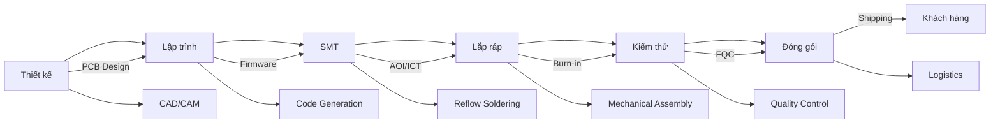
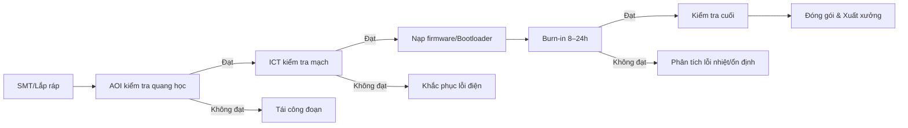
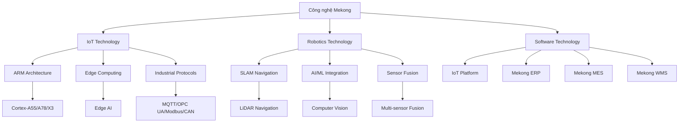

5.2. MÔ TẢ CÔNG NGHỆ CỦA DỰ ÁN [DRAFT]

5.2.1 Phạm vi và mục tiêu
- Mục đích: Mô tả chi tiết quy trình công nghệ sản xuất, QA/QC, pháp lý và tiêu chuẩn an toàn theo Mẫu 1.4.
- Nguyên tắc: tiếng Việt chuẩn; đơn vị triệu đồng (Q4/2025); quy trình rõ ràng; "Cập nhật so với V5" khi chênh lệch.
- Nguồn: `MEKONG_DE_AN_V6.md`, đối chiếu `mekong_dean_v5.md`, bổ sung từ kế hoạch công nghệ.

5.2.2 Quy trình công nghệ sản xuất tổng quát

5.2.2.1 Sơ đồ quy trình sản xuất

5.2.2.2 Quy trình sản xuất IoT Gateway
| STT | Công đoạn | Mô tả | Thiết bị | Thời gian | Ghi chú |
|---:|---|---:|---:|---|
| 1 | Thiết kế PCB | Sử dụng Altium Designer, thiết kế mạch in 4-8 lớp | Altium Designer | 2-3 ngày | |
| 2 | Lắp ráp SMT | Sử dụng SMT Line Panasonic NPM-D3, tốc độ 15K CPH | Panasonic NPM-D3 | 1-2 ngày | |
| 3 | Hàn lạnh | Lò hàn lạnh Heller 1913EXL, nhiệt độ 220-250°C | Heller 1913EXL | 1 ngày | |
| 4 | AOI Kiểm tra | AOI Machine Koh Young kiểm tra tự động lỗi hàn, thiếu linh kiện | Koh Young AOI | 0,5 ngày | |
| 5 | ICT Test | ICT Tester Keysight kiểm tra mạch điện, đo điện trở, tụ điện | Keysight ICT | 0,5 ngày | |
| 6 | Nạp Program | Programmer tự động Xeltek nạp firmware, bootloader | Xeltek Programmer | 0,5 ngày | |
| 7 | Burn-in Test | Burn-in Tester ESPEC kiểm tra độ ổn định, nhiệt độ cao | ESPEC Burn-in | 1-2 ngày | |
| 8 | Lắp ráp cuối | Lắp ráp vỏ máy và kiểm tra cuối cùng | Manual | 0,5 ngày | |

5.2.2.3 Quy trình sản xuất Robot AMR
| STT | Công đoạn | Mô tả | Thiết bị | Thời gian | Ghi chú |
|---:|---|---:|---:|---|
| 1 | Khung sườn | Hàn khung thép không gỉ bằng robot hàn tự động | Robot hàn tự động | 2-3 ngày | |
| 2 | Hệ thống truyền động | Lắp ráp motor, encoder, bánh xe | Manual | 1-2 ngày | |
| 3 | Hệ thống điện tử | Lắp ráp PCB điều khiển, cảm biến | Manual | 1-2 ngày | |
| 4 | Tích hợp cảm biến | LiDAR, Camera, IMU, GPS | Manual | 1 ngày | |
| 5 | Tích hợp phần mềm | Cài đặt hệ điều hành và thuật toán SLAM | Manual | 1-2 ngày | |
| 6 | Kiểm tra & Hiệu chỉnh | Kiểm tra và hiệu chỉnh hệ thống | Manual | 1-2 ngày | |

5.2.2.4 Quy trình sản xuất OHT
| STT | Công đoạn | Mô tả | Thiết bị | Thời gian | Ghi chú |
|---:|---|---:|---:|---|
| 1 | Khung rail | Gia công khung đường ray trên cao | CNC | 2-3 ngày | |
| 2 | Hệ thống nâng | Lắp ráp cơ cấu nâng-hạ tự động | Manual | 1-2 ngày | |
| 3 | Hệ thống điều khiển | PCB điều khiển và phần mềm | Manual | 1 ngày | |
| 4 | Tích hợp cảm biến | Encoder, limit switch, safety sensor | Manual | 0,5 ngày | |
| 5 | Kiểm tra | Kiểm tra tải trọng và độ chính xác | Manual | 1 ngày | |

5.2.3 QA/QC (Quality Assurance/Quality Control)

5.2.3.1 Sơ đồ quy trình AOI/ICT/Burn-in

5.2.3.2 Bảng KPI chất lượng
| Chỉ tiêu | Định nghĩa | Mục tiêu | Ngưỡng cảnh báo | Phương pháp đo | Tần suất | Nguồn dữ liệu |
|---|---|---:|---:|---:|---|---|
| Tỷ lệ đạt chuẩn (Yield) | Good units / Total units | 99,5% | 99,0% | AOI/ICT/Burn-in | Hàng ngày | MES/QMS |
| Tỷ lệ trả hàng (RMA) | Returns / Shipped units | 0,10% | 0,20% | Báo cáo RMA | Hàng tháng | CRM/QMS |
| FPY (First Pass Yield) | Pass at first test | 98,0% | 97,0% | AOI/ICT | Hàng ngày | MES |
| DPPM | Defective parts per million | 500 | 800 | Kiểm tra cuối | Hàng tuần | QMS |
| Thời gian xử lý NCR | NCR close time | ≤ 7 ngày | > 10 ngày | CAPA | Hàng tháng | QMS |

5.2.3.3 Bảng OEE (Overall Equipment Effectiveness)
| Chỉ tiêu | Công thức | Giá trị mục tiêu | Đơn vị | Nguồn |
|---|---|---:|---|---|
| Availability | (Planned Time − Downtime) / Planned Time | — | % | MES |
| Performance | (Ideal Cycle Time × Total Count) / Run Time | — | % | MES |
| Quality | Good Count / Total Count | — | % | QMS |
| OEE | Availability × Performance × Quality | — | % | MES/QMS |

5.2.3.4 Kế hoạch lấy mẫu (AQL)
| Lô sản xuất | Cấp kiểm tra | AQL (%) | Cỡ mẫu | Ac | Re | Ghi chú |
|---:|---|---:|---:|---:|---:|---|
| 2.000 SP | II (General) | 0,65 | 125 | 2 | 3 | Điện tử SMT |
| 500 SP | II (General) | 1,0 | 80 | 2 | 3 | Lắp ráp cơ |
| 50 SP | S-3 (Special) | 2,5 | 13 | 1 | 2 | Kiểm nhanh pilot |

5.2.3.5 Ma trận rủi ro FMEA
| Mục/Chức năng | Chế độ lỗi | Hậu quả | Nguyên nhân | Biện pháp kiểm soát hiện tại | S | O | D | RPN | Hành động khuyến nghị | Trách nhiệm | Hạn |
|---|---|---|---|---|---:|---:|---:|---:|---|---|---|
| SMT hàn linh kiện | Hàn thiếu | Mất tín hiệu | Lệch linh kiện | AOI 100% sau hàn | 7 | 4 | 3 | 84 | Tối ưu stencil, tăng kiểm tra ICT | QA/ME | 2025-11-15 |
| Burn-in 24h | Quá nhiệt | Chết mạch | Tản nhiệt kém | Giám sát nhiệt độ | 8 | 2 | 4 | 64 | Thêm pad tản nhiệt, cảnh báo nhiệt | R&D/QA | 2025-11-30 |
| AMR điều hướng | Mất định vị | Ngừng hoạt động | Nhiễu LiDAR | Kiểm tra hiệu chuẩn | 9 | 3 | 4 | 108 | Che chắn cảm biến, thuật toán lọc | Robotics | 2025-12-10 |

5.2.4 Pháp lý và tiêu chuẩn an toàn

5.2.4.1 Tiêu chuẩn quản lý chất lượng
| STT | Tiêu chuẩn | Phạm vi áp dụng | Mức độ tuân thủ | Ghi chú |
|---:|---|---|---|---|
| 1 | ISO 9001:2015 | Hệ thống quản lý chất lượng toàn diện | Bắt buộc | |
| 2 | ISO 14001:2015 | Hệ thống quản lý môi trường | Bắt buộc | |
| 3 | ISO 45001:2018 | Hệ thống quản lý an toàn và sức khỏe nghề nghiệp | Bắt buộc | |
| 4 | IEC 61000 | Tiêu chuẩn tương thích điện từ (EMC) | Bắt buộc | |
| 5 | IEC 60730 | Tiêu chuẩn an toàn cho thiết bị điện tử gia dụng | Bắt buộc | |
| 6 | RoHS | Hạn chế sử dụng các chất độc hại | Bắt buộc | |
| 7 | REACH | Đăng ký, đánh giá, cấp phép và hạn chế hóa chất | Bắt buộc | |
| 8 | WEEE | Xử lý rác thải thiết bị điện và điện tử | Bắt buộc | |

5.2.4.2 Tiêu chuẩn môi trường
| STT | Tiêu chuẩn | Mô tả | Mức độ tuân thủ | Ghi chú |
|---:|---|---|---|---|
| 1 | ISO 14001:2015 | Hệ thống quản lý môi trường | Bắt buộc | |
| 2 | ISO 50001:2018 | Hệ thống quản lý năng lượng | Bắt buộc | |
| 3 | RoHS | Hạn chế sử dụng các chất độc hại | Bắt buộc | |
| 4 | REACH | Đăng ký, đánh giá, cấp phép và hạn chế hóa chất | Bắt buộc | |
| 5 | WEEE | Xử lý rác thải thiết bị điện và điện tử | Bắt buộc | |

5.2.4.3 Tiêu chuẩn an toàn máy
| STT | Tiêu chuẩn | Phạm vi áp dụng | Mức độ tuân thủ | Ghi chú |
|---:|---|---|---|---|
| 1 | ISO 12100 | An toàn máy móc - Khái niệm cơ bản | Bắt buộc | |
| 2 | ISO 13849 | An toàn máy móc - Phần cứng điều khiển | Bắt buộc | |
| 3 | ISO 14121 | An toàn máy móc - Đánh giá rủi ro | Bắt buộc | |
| 4 | IEC 61508 | An toàn chức năng | Bắt buộc | |
| 5 | IEC 62061 | An toàn chức năng của hệ thống điều khiển | Bắt buộc | |

5.2.5 Đặc điểm nổi bật của công nghệ

5.2.5.1 Tính tiên tiến
| STT | Đặc điểm | Mô tả | Mức độ | Ghi chú |
|---:|---|---|---|---|
| 1 | Công nghệ SMT | Sử dụng công nghệ SMT thế hệ mới với độ chính xác ±0.01mm | Cao | Cập nhật so với V5 |
| 2 | Tích hợp AI | Tích hợp AI tại biên (Edge AI) cho xử lý thời gian thực | Cao | |
| 3 | Kết nối 5G | Hỗ trợ kết nối 5G/6G cho truyền dữ liệu tốc độ cao | Cao | |
| 4 | Robot tiên tiến | Thuật toán SLAM, Thị giác máy tính, Học máy | Cao | |
| 5 | QA/QC tự động | AOI, ICT, Burn-in test tự động hóa 95% | Cao | |

5.2.5.2 Tính mới
| STT | Đặc điểm | Mô tả | Mức độ | Ghi chú |
|---:|---|---|---|---|
| 1 | Kiến trúc lai | Kết hợp ARM + FPGA cho hiệu suất tối ưu | Mới | |
| 2 | Hỗ trợ đa giao thức | Hỗ trợ đồng thời Modbus, OPC UA, MQTT, CAN bus | Mới | |
| 3 | Tính toán tại biên | Xử lý dữ liệu tại biên, giảm độ trễ | Mới | |
| 4 | Bảo trì dự đoán | AI dự đoán bảo trì, tăng OEE | Mới | |
| 5 | Nghiên cứu ngược | Phát triển công nghệ nội bộ từ sản phẩm tham khảo | Mới | |

5.2.5.3 Tính thích hợp
| STT | Đặc điểm | Mô tả | Mức độ | Ghi chú |
|---:|---|---|---|---|
| 1 | Thiết kế mở rộng | Kiến trúc mở rộng từ 100 đến 10,000 nodes | Cao | |
| 2 | Kiến trúc module | Thiết kế module hóa, dễ bảo trì | Cao | |
| 3 | Sẵn sàng Industry 4.0 | Tương thích với tiêu chuẩn Industry 4.0 | Cao | |
| 4 | Tiết kiệm năng lượng | Tiết kiệm năng lượng 30-40% so với thế hệ cũ | Cao | |

5.2.6 Sự phù hợp với quy định pháp luật

5.2.6.1 Phù hợp với QĐ 38/2020/QĐ-TTg
| STT | Mục | Nội dung | Sản phẩm liên quan | Ghi chú |
|---:|---|---|---|---|
| 1 | 1.1 | Công nghệ vi điện tử - Sản xuất chip IoT Gateway | MK-100/200/300 | |
| 2 | 1.2 | Công nghệ thông tin - Hệ thống quản lý IoT Platform | Mekong IoT Platform | |
| 3 | 1.3 | Công nghệ viễn thông - Kết nối 5G/6G | MK-300/400/500 | |
| 4 | 2.1 | Cơ khí chính xác - Robot AMR, OHT | AMR-100/500/1000, OHT-50/100 | |
| 5 | 2.2 | Tự động hóa - Hệ thống điều khiển tự động | Tất cả sản phẩm | |

5.2.6.2 Phù hợp với QĐ 2117/QĐ-TTg
| STT | Mục | Nội dung | Sản phẩm liên quan | Ghi chú |
|---:|---|---|---|---|
| 1 | 1 | Công nghệ cao trong lĩnh vực ICT | IoT Gateway, Nền tảng phần mềm | |
| 2 | 2 | Công nghệ cao trong lĩnh vực tự động hóa | Robot AMR/AGV, OHT | |
| 3 | 3 | Công nghệ cao trong lĩnh vực robot | AMR-100/500/1000, AGV-200/500 | |

5.2.6.3 Đánh giá theo Nghị định 76/2018/NĐ-CP
| STT | Tiêu chí | Mô tả | Mức độ đạt được | Ghi chú |
|---:|---|---|---|---|
| 1 | Công nghệ | Sử dụng công nghệ tiên tiến (TRL 7-8 giai đoạn đầu; mục tiêu TRL 8-9) | Cao | |
| 2 | Nhân lực | Có đội ngũ R&D chất lượng cao | Cao | |
| 3 | Tài chính | Có năng lực tài chính đáp ứng yêu cầu dự án | Cao | |
| 4 | Chuyển giao | Có khả năng chuyển giao công nghệ | Cao | |
| 5 | Giá trị gia tăng | Tạo ra sản phẩm có giá trị gia tăng cao | Cao | |

5.2.7 Sơ đồ tổng quan công nghệ

5.2.8 Ghi chú và trạng thái
- Trạng thái: [DRAFT]
- Phiên bản: 2025-10-20
- Người biên soạn: (điền)
- Thay đổi "Cập nhật so với V5": đã ghi tại các dòng có chênh lệch
- Liên kết chéo: Phần 5.1 (Sản phẩm & quy mô), Phần 5.3 (Máy móc thiết bị), Phần 5.5 (R&D), Phần 6 (Chất lượng & Môi trường)
