5.3. GIẢI TRÌNH VỀ MÁY MÓC THIẾT BỊ CỦA DỰ ÁN [DRAFT]

5.3.1 Phạm vi và mục tiêu
- Mục đích: Giải trình chi tiết các thiết bị chính trong dây chuyền công nghệ dự án theo Mẫu 1.4.
- Nguyên tắc: tiếng Việt chuẩn; đơn vị triệu USD (Q4/2025); bảng chuẩn; "Cập nhật so với V5" khi chênh lệch.
- Nguồn: `MEKONG_DE_AN_V6.md`, đối chiếu `mekong_dean_v5.md`, bổ sung từ kế hoạch thiết bị.

5.3.2 Thiết bị sản xuất IoT Gateway

5.3.2.1 Bảng máy móc thiết bị chính phục vụ sản xuất IoT Gateway
| STT | Tên thiết bị | Thông số kỹ thuật | Xuất xứ | Năm | Mức tự động hóa (%) | Tình trạng | Số lượng | Giá trị (triệu USD) |
|---:|---|---:|---:|---:|---:|---:|---:|---:|
| 1 | SMT Line 1 | Panasonic NPM-D3, 15K CPH, độ chính xác ±0.01mm | Japan | 2025 | 90 | Mới 100% | 1 line | 0,34 |
| 2 | SMT Line 2 | Samsung SM482, 12K CPH, độ chính xác ±0.01mm | Korea | 2025 | 90 | Mới 100% | 1 line | 0,30 |
| 3 | Lò hàn lạnh | Heller 1913EXL, nhiệt độ 220-250°C, 8 zones | USA | 2025 | 95 | Mới 100% | 1 unit | 0,34 |
| 4 | Dây chuyền lắp ráp | Bán tự động, tốc độ 204 đơn vị/ngày | Vietnam | 2025 | 70 | Mới 100% | 1 line | 0,20 |
| 5 | Thiết bị kiểm tra | Kiểm tra tự động, 255 đơn vị/ngày | USA | 2025 | 95 | Mới 100% | 5 sets | 1,00 |
| 6 | AOI Machine | Koh Young, kiểm tra PCB tự động, phát hiện lỗi hàn | Korea | 2025 | 95 | Mới 100% | 2 units | 0,32 |
| 7 | ICT Tester | Keysight, kiểm tra mạch điện, đo điện trở, tụ điện | USA | 2025 | 90 | Mới 100% | 3 units | 0,24 |
| 8 | Programmer tự động | Xeltek, nạp firmware, bootloader tự động | USA | 2025 | 95 | Mới 100% | 5 units | 0,12 |
| 9 | Burn-in Tester | ESPEC, kiểm tra độ ổn định, nhiệt độ cao | Japan | 2025 | 90 | Mới 100% | 2 units | 0,16 |
| 10 | Tổng cộng | - | - | - | - | - | - | 3,02 |

5.3.3 Thiết bị sản xuất Robot AMR/AGV

5.3.3.1 Bảng máy móc thiết bị chính phục vụ sản xuất Robot AMR/AGV
| STT | Tên thiết bị | Thông số kỹ thuật | Xuất xứ | Năm | Mức tự động hóa (%) | Tình trạng | Số lượng | Giá trị (triệu USD) |
|---:|---|---:|---:|---:|---:|---:|---:|---:|
| 11 | Trạm hàn khung | Robot hàn tự động, tốc độ 10 đơn vị/ngày | Japan | 2025 | 85 | Mới 100% | 2 stations | 0,48 |
| 12 | Trạm lắp ráp truyền động | Hệ thống lắp ráp, tốc độ 16 đơn vị/ngày | Germany | 2025 | 80 | Mới 100% | 2 stations | 0,32 |
| 13 | Trạm tích hợp điện tử | Lắp ráp PCB, tốc độ 8 đơn vị/ngày | Korea | 2025 | 75 | Mới 100% | 3 stations | 0,60 |
| 14 | Trạm tích hợp cảm biến | LiDAR, Camera, tốc độ 12 đơn vị/ngày | USA | 2025 | 90 | Mới 100% | 2 stations | 0,72 |
| 15 | Trạm kiểm tra cuối | Kiểm tra & xác thực, tốc độ 5.3 đơn vị/ngày | Germany | 2025 | 95 | Mới 100% | 1 station | 0,48 |
| 16 | Tổng cộng | - | - | - | - | - | - | 2,60 |

5.3.4 Thiết bị R&D và phòng thí nghiệm

5.3.4.1 Bảng máy móc thiết bị chính phục vụ nghiên cứu phát triển
| STT | Tên thiết bị | Thông số kỹ thuật | Xuất xứ | Năm | Mức tự động hóa (%) | Tình trạng | Số lượng | Giá trị (triệu USD) |
|---:|---|---:|---:|---:|---:|---:|---:|---:|---|
| 17 | Anritsu Signal Analyzer | MS2850A & MT8821C, phân tích giao thức Wi-Fi/5G, IoT | Đài Loan | 2021-2024 | 85 | Mới 100% | 1-2 units | 0,03 |
| 18 | Chroma ATE Gateway Tester | Hệ ATE cơ bản, thử throughput, latency, packet loss | Đài Loan | 2020-2023 | 90 | Mới 100% | 1 unit | 0,02 |
| 19 | Máy in 3D | Ultimaker, in 3D, nguyên mẫu PCB, kiểm thử | Netherlands | 2025 | 80 | Mới 100% | 1 unit | 0,01 |
| 20 | LSROBOT AMR SLAM Robot | LXAMR-J300 / LXK12-B, Navigation SLAM, tránh vật thể | Trung Quốc | 2022-2025 | 90 | Mới 100% | 1 unit | 0,05 |
| 21 | Inovance Robot Test Kit | Kiểm tra payload, điều khiển robot | Trung Quốc | 2021-2024 | 85 | Mới 100% | 1 unit | 0,03 |
| 22 | Lanner/Moxa AI Platform | SPC embedded edge system, GPU/FPGA xử lý AI/ML, realtime | Đài Loan | 2020-2023 | 80 | Mới 100% | 1 cluster | 0,06 |
| 23 | Dell PowerEdge R750 Server | Hadoop cluster, Spark, data analytics | USA | 2025 | 85 | Mới 100% | 1 cluster | 0,05 |
| 24 | LiDAR Calibration Kit | Tangram + Velodyne clone, hiệu chỉnh độ chính xác LiDAR | China | 2021-2024 | 85 | Mới 100% | 1 unit | 0,02 |
| 25 | Camera Calibration Kit | Thiết bị giá mềm, hiệu chuẩn màu, focus, distortion | China | 2020-2022 | 80 | Mới 100% | 1 unit | 0,01 |
| 26 | Máy hiệu chỉnh cảm biến IMU | IMU-CAL-2025, hiệu chỉnh gyroscope, accelerometer | Germany | 2025 | 85 | Mới 100% | 1 unit | 0,02 |
| 27 | Máy hiệu chỉnh cảm biến Ultrasonic | US-CAL-2025, hiệu chỉnh range, accuracy, sensitivity | Germany | 2025 | 80 | Mới 100% | 1 unit | 0,01 |
| 28 | Tổng cộng | - | - | - | - | - | - | 0,31 |

5.3.5 Hệ thống IT và tự động hóa (Phát triển nội bộ bởi Mekong)

5.3.5.1 Bảng máy móc thiết bị phụ trợ khác
| STT | Tên thiết bị | Thông số kỹ thuật | Xuất xứ | Năm | Mức tự động hóa (%) | Tình trạng | Số lượng | Giá trị (triệu USD) |
|---:|---|---:|---:|---:|---:|---:|---:|---:|---|
| 29 | Hệ thống ERP | Mekong Enterprise Resource Planning System | Vietnam | 2025 | 95 | Mới 100% | 1 system | 0,10 |
| 30 | Hệ thống MES | Mekong Manufacturing Execution System | Vietnam | 2025 | 90 | Mới 100% | 1 system | 0,08 |
| 31 | Hệ thống WMS | Mekong Warehouse Management System | Vietnam | 2025 | 85 | Mới 100% | 1 system | 0,06 |
| 32 | Hệ thống IoT Platform | Mekong IoT Monitoring Platform | Vietnam | 2025 | 95 | Mới 100% | 1 platform | 0,08 |
| 33 | Tổng cộng | - | - | - | - | - | - | 0,32 |

5.3.6 Tổng hợp thiết bị

5.3.6.1 Tổng cộng thiết bị theo loại
| STT | Loại thiết bị | Số lượng | Giá trị (triệu USD) | Tỷ lệ (%) | Ghi chú |
|---:|---|---:|---:|---:|---|
| 1 | Máy móc, thiết bị chính phục vụ sản xuất | 19 | 5,62 | 67,3 | Cập nhật so với V5 |
| 2 | Máy móc, thiết bị chính phục vụ nghiên cứu phát triển | 12 | 0,31 | 3,7 | |
| 3 | Máy móc, thiết bị phụ trợ khác | 4 | 0,32 | 3,8 | |
| 4 | Tổng cộng | 35 | 6,25 | 100,0 | |

5.3.7 Lộ trình đầu tư thiết bị theo giai đoạn

5.3.7.1 Giai đoạn 1 (2025-2029): Thiết lập nền tảng sản xuất
| STT | Nhóm thiết bị | Giá trị (triệu USD) | Tỷ lệ (%) | Ghi chú |
|---:|---|---:|---:|---|
| 1 | Thiết bị IoT | 2,02 | 32,3 | SMT Line 1, Lò hàn lạnh, Thiết bị kiểm tra cơ bản |
| 2 | Thiết bị QA/QC | 0,84 | 13,4 | AOI Machine, ICT Tester, Programmer tự động, Burn-in Tester |
| 3 | Thiết bị Robot | 1,12 | 17,9 | Trạm hàn khung, Trạm lắp ráp truyền động |
| 4 | R&D | 0,06 | 1,0 | Anritsu Signal Analyzer, Chroma ATE Gateway Tester, Máy in 3D |
| 5 | IT | 0,18 | 2,9 | Hệ thống ERP, Hệ thống MES cơ bản |
| 6 | Tổng đầu tư | 4,22 | 67,5 | Cập nhật so với V5 |

5.3.7.2 Giai đoạn 2 (2030-2035): Mở rộng và nâng cấp
| STT | Nhóm thiết bị | Giá trị (triệu USD) | Tỷ lệ (%) | Ghi chú |
|---:|---|---:|---:|---|
| 1 | Thiết bị IoT | 0,50 | 8,0 | SMT Line 2, Dây chuyền lắp ráp tự động |
| 2 | Thiết bị Robot | 1,32 | 21,1 | Trạm tích hợp điện tử, Trạm tích hợp cảm biến |
| 3 | R&D | 0,19 | 3,0 | LSROBOT AMR SLAM Robot, Inovance Robot Test Kit, Lanner/Moxa AI Platform, Máy xử lý dữ liệu lớn |
| 4 | IT | 0,06 | 1,0 | Hệ thống WMS, Nâng cấp IoT Platform |
| 5 | Tổng đầu tư | 2,07 | 33,1 | |

5.3.7.3 Giai đoạn 3 (2036-2075): Tối ưu hóa và đổi mới
| STT | Nhóm thiết bị | Giá trị (triệu USD) | Tỷ lệ (%) | Ghi chú |
|---:|---|---:|---:|---|
| 1 | Thiết bị Robot | 0,48 | 7,7 | Trạm kiểm tra cuối |
| 2 | R&D | 0,06 | 1,0 | LiDAR Calibration Kit, Camera Calibration Kit, Máy hiệu chỉnh cảm biến IMU, Máy hiệu chỉnh cảm biến Ultrasonic |
| 3 | IT | 0,08 | 1,3 | Hệ thống AI/ML nâng cao, Blockchain, Digital Twin |
| 4 | Tổng đầu tư | 0,62 | 9,9 | |

5.3.8 Công suất sản xuất và hiệu suất thiết bị theo giai đoạn

5.3.8.1 Giai đoạn 1 (2025-2029): Thiết lập nền tảng
| STT | Sản phẩm | Công suất (đơn vị/năm) | OEE mục tiêu (%) | Ghi chú |
|---:|---|---:|---:|---|
| 1 | IoT Gateway | 2.000 | 75 | SMT Line 1 + Lò hàn lạnh |
| 2 | Robot AMR | 200 | 75 | Trạm hàn khung + Trạm lắp ráp |
| 3 | OHT | 80 | 75 | Trạm lắp ráp cơ bản |

5.3.8.2 Giai đoạn 2 (2030-2035): Mở rộng sản xuất
| STT | Sản phẩm | Công suất (đơn vị/năm) | OEE mục tiêu (%) | Ghi chú |
|---:|---|---:|---:|---|
| 1 | IoT Gateway | 8.000 | 80 | SMT Line 1 + SMT Line 2 + Dây chuyền lắp ráp |
| 2 | Robot AMR | 800 | 80 | Tất cả trạm sản xuất |
| 3 | OHT | 320 | 80 | Trạm sản xuất mở rộng |

5.3.8.3 Giai đoạn 3 (2036-2075): Tối ưu hóa
| STT | Sản phẩm | Công suất (đơn vị/năm) | OEE mục tiêu (%) | Ghi chú |
|---:|---|---:|---:|---|
| 1 | IoT Gateway | 15.000 | 85 | Tối ưu hóa toàn bộ dây chuyền |
| 2 | Robot AMR | 1.500 | 85 | Tự động hóa toàn diện |
| 3 | OHT | 640 | 85 | Tự động hóa toàn diện |

5.3.9 Kế hoạch bảo trì và nâng cấp thiết bị

5.3.9.1 Bảo trì dự đoán
| STT | Thiết bị | Cảm biến giám sát | Thuật toán AI | Độ chính xác (%) | Tiết kiệm (%) | Ghi chú |
|---:|---|---:|---:|---:|---|
| 1 | SMT Line | Rung động, nhiệt độ, áp suất | Random Forest, SVM | 92 | 35 | Cập nhật so với V5 |
| 2 | Thiết bị kiểm tra | Rung động, nhiệt độ | Random Forest, SVM | 89 | 25 | |
| 3 | Robot AMR | Rung động, nhiệt độ, dòng điện | Random Forest, SVM | 91 | 30 | |

5.3.9.2 Lịch trình nâng cấp thiết bị
| STT | Năm | Thiết bị | Nâng cấp | Chi phí (triệu USD) | Ghi chú |
|---:|---|---:|---:|---:|---|
| 1 | 2025 | SMT Line 1 | +30% công suất | 0,10 | |
| 2 | 2026 | Thiết bị kiểm tra | +50% khả năng xử lý | 0,20 | |
| 3 | 2028 | SMT Line 2 | +25% công suất | 0,08 | |
| 4 | 2030 | Hệ thống tự động hóa | Tự động hóa toàn diện | 0,30 | |
| 5 | 2035 | Thiết bị AI/ML | Thiết bị AI/ML tiên tiến | 0,40 | |

5.3.9.3 Đầu tư bảo trì hàng năm
| STT | Loại bảo trì | Tỷ lệ (%) | Chi phí (triệu USD/năm) | Ghi chú |
|---:|---|---:|---:|---|
| 1 | Bảo trì ngăn ngừa | 60 | 0,19 | |
| 2 | Bảo trì dự đoán | 25 | 0,08 | |
| 3 | Bảo trì khắc phục | 15 | 0,05 | |
| 4 | Tổng cộng | 100 | 0,32 | 3-5% giá trị thiết bị/năm |

5.3.10 Sơ đồ bố trí máy móc thiết bị

5.3.10.1 Sơ đồ tổng quan bố trí thiết bị

```mermaid
flowchart TB
  FACTORY[Nhà máy Mekong] --> IOT_AREA[Khu vực IoT Gateway]
  FACTORY --> ROBOT_AREA[Khu vực Robot AMR/AGV]
  FACTORY --> OHT_AREA[Khu vực OHT]
  FACTORY --> RD_AREA[Khu vực R&D]
  FACTORY --> IT_AREA[Khu vực IT]
  
  IOT_AREA --> SMT1[SMT Line 1]
  IOT_AREA --> SMT2[SMT Line 2]
  IOT_AREA --> REFLOW[Lò hàn lạnh]
  IOT_AREA --> ASSY[Dây chuyền lắp ráp]
  IOT_AREA --> TEST[Thiết bị kiểm tra]
  
  ROBOT_AREA --> WELD[Trạm hàn khung]
  ROBOT_AREA --> DRIVE[Trạm lắp ráp truyền động]
  ROBOT_AREA --> ELECTRONICS[Trạm tích hợp điện tử]
  ROBOT_AREA --> SENSOR[Trạm tích hợp cảm biến]
  ROBOT_AREA --> FINAL[Trạm kiểm tra cuối]
  
  OHT_AREA --> RAIL[Khung rail]
  OHT_AREA --> HOIST[Hệ thống nâng]
  OHT_AREA --> CONTROL[Hệ thống điều khiển]
  
  RD_AREA --> LAB1[Phòng thí nghiệm IoT]
  RD_AREA --> LAB2[Phòng thí nghiệm Robotics]
  RD_AREA --> LAB3[Phòng thí nghiệm AI/ML]
  
  IT_AREA --> ERP_SYS[Hệ thống ERP]
  IT_AREA --> MES_SYS[Hệ thống MES]
  IT_AREA --> WMS_SYS[Hệ thống WMS]
  IT_AREA --> IOT_SYS[Hệ thống IoT Platform]
```

5.3.11 Ghi chú và trạng thái
- Trạng thái: [DRAFT]
- Phiên bản: 2025-10-20
- Người biên soạn: (điền)
- Thay đổi "Cập nhật so với V5": đã ghi tại các dòng có chênh lệch
- Liên kết chéo: Phần 5.1 (Sản phẩm & quy mô), Phần 5.2 (Công nghệ), Phần 5.5 (R&D), Phần 7 (Tài chính)
