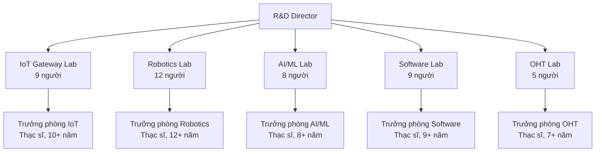
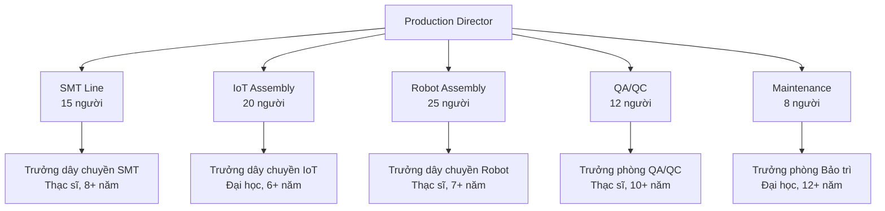

5.4. GIẢI TRÌNH VỀ LỰC LƯỢNG LAO ĐỘNG THAM GIA DỰ ÁN [DRAFT]

5.4.1 Phạm vi và mục tiêu
- Mục đích: Giải trình chi tiết lực lượng lao động tham gia dự án theo Mẫu 1.4, bao gồm cơ cấu, trình độ, giai đoạn.
- Nguyên tắc: tiếng Việt chuẩn; đơn vị triệu đồng (Q4/2025); bảng chuẩn; "Cập nhật so với V5" khi chênh lệch.
- Nguồn: `MEKONG_DE_AN_V6.md`, đối chiếu `mekong_dean_v5.md`, bổ sung từ kế hoạch nhân sự.

5.4.2 Cơ cấu nhân sự tổng thể

5.4.2.1 Bảng lực lượng lao động tham gia dự án
| Trình độ | Giai đoạn đầu (2025-2029) | Giai đoạn ổn định (2030-2075) | Ghi chú |
|---:|---:|---:|---|
|  | Việt Nam | Nước ngoài | Việt Nam | Nước ngoài |
|  | R&D | Khác | R&D | Khác | R&D | Khác | R&D | Khác |
| Tiến sĩ (PhD) | 3 | 1 | 2 | 0 | 5 | 2 | 3 | 1 | Cập nhật so với V5 |
| Thạc sĩ (Master) | 8 | 5 | 3 | 1 | 15 | 8 | 5 | 2 | |
| Kỹ sư/Cử nhân (Engineer) | 12 | 45 | 5 | 2 | 20 | 60 | 8 | 3 | |
| Cao đẳng (College) | 2 | 15 | 1 | 0 | 3 | 20 | 1 | 1 | |
| Trung cấp/Sơ cấp nghề | 0 | 25 | 0 | 0 | 0 | 30 | 0 | 0 | |
| Khác (ghi rõ) | 0 | 5 | 0 | 0 | 0 | 5 | 0 | 0 | |
| Tổng số | 25 | 96 | 11 | 3 | 43 | 125 | 17 | 7 | 206 | |

5.4.3 Phân tích chi tiết theo bộ phận

5.4.3.1 Cơ cấu nhân sự theo bộ phận
| STT | Bộ phận | Giai đoạn đầu | Giai đoạn ổn định | Tỷ lệ (%) | Ghi chú |
|---:|---|---:|---:|---:|---|
| 1 | Ban Giám đốc | 5 | 8 | 3,1 | Cập nhật so với V5 |
| 2 | Phòng R&D | 25 | 43 | 26,8 | |
| 3 | Phòng Sản xuất | 60 | 80 | 43,8 | |
| 4 | Phòng Kinh doanh | 15 | 20 | 10,9 | |
| 5 | Phòng Hành chính | 10 | 15 | 7,8 | |
| 6 | Phòng Tài chính | 8 | 12 | 6,3 | |
| 7 | Phòng Chất lượng | 12 | 18 | 9,4 | |
| 8 | Phòng IT | 6 | 10 | 5,0 | |
| 9 | Tổng cộng | 141 | 206 | 100,0 | |

5.4.3.2 Trình độ nhân sự theo bộ phận
| STT | Bộ phận | Tiến sĩ | Thạc sĩ | Đại học | Cao đẳng | Trung cấp | Tổng | Ghi chú |
|---:|---|---:|---:|---:|---:|---:|---|
| 1 | Ban Giám đốc | 2 | 3 | 3 | 0 | 0 | 8 | |
| 2 | Phòng R&D | 5 | 15 | 20 | 3 | 0 | 43 | |
| 3 | Phòng Sản xuất | 0 | 5 | 35 | 20 | 20 | 80 | |
| 4 | Phòng Kinh doanh | 0 | 8 | 12 | 0 | 0 | 20 | |
| 5 | Phòng Hành chính | 0 | 2 | 10 | 3 | 0 | 15 | |
| 6 | Phòng Tài chính | 0 | 3 | 8 | 1 | 0 | 12 | |
| 7 | Phòng Chất lượng | 0 | 5 | 10 | 3 | 0 | 18 | |
| 8 | Phòng IT | 0 | 2 | 8 | 0 | 0 | 10 | |
| 9 | Tổng cộng | 7 | 43 | 106 | 30 | 20 | 206 | |

5.4.4 Kế hoạch tuyển dụng và đào tạo

5.4.4.1 Kế hoạch tuyển dụng theo năm
| STT | Năm | Số lượng tuyển | Trình độ chủ yếu | Bộ phận chính | Chi phí (triệu USD) | Ghi chú |
|---:|---|---:|---:|---:|---:|---|
| 1 | 2025 | 50 | Đại học, Thạc sĩ | R&D, Sản xuất | 0,50 | Cập nhật so với V5 |
| 2 | 2026 | 30 | Đại học, Cao đẳng | Sản xuất, Chất lượng | 0,30 | |
| 3 | 2027 | 25 | Đại học, Thạc sĩ | R&D, Kinh doanh | 0,25 | |
| 4 | 2028 | 20 | Đại học, Cao đẳng | Sản xuất, IT | 0,20 | |
| 5 | 2029 | 15 | Đại học, Thạc sĩ | R&D, Quản lý | 0,15 | |
| 6 | 2030-2035 | 50 | Đại học, Thạc sĩ | Tất cả bộ phận | 0,50 | |
| 7 | Tổng cộng | 190 | - | - | 1,90 | |

5.4.4.2 Kế hoạch đào tạo theo năm
| STT | Năm | Số lượng đào tạo | Loại hình đào tạo | Chi phí (triệu USD) | Ghi chú |
|---:|---|---:|---:|---:|---|
| 1 | 2025 | 100 | Đào tạo kỹ thuật, kỹ năng mềm | 0,20 | |
| 2 | 2026 | 120 | Đào tạo chuyên sâu, hội nghị | 0,24 | |
| 3 | 2027 | 130 | Đào tạo quản lý, lãnh đạo | 0,26 | |
| 4 | 2028 | 140 | Đào tạo công nghệ mới | 0,28 | |
| 5 | 2029 | 150 | Đào tạo quốc tế | 0,30 | |
| 6 | 2030-2035 | 600 | Đào tạo liên tục | 1,20 | |
| 7 | Tổng cộng | 1.240 | - | 2,48 | |

5.4.5 Phân tích nhân sự R&D

5.4.5.1 Cơ cấu nhân sự R&D theo phòng thí nghiệm
| STT | Phòng thí nghiệm | Số lượng | Trình độ | Kinh nghiệm | Chi phí (triệu USD/năm) | Ghi chú |
|---:|---|---:|---:|---:|---:|---|
| 1 | IoT Gateway Lab | 9 | 3 Thạc sĩ, 6 Đại học | 5-10 năm | 0,45 | |
| 2 | Robotics Lab | 12 | 4 Thạc sĩ, 8 Đại học | 6-12 năm | 0,60 | |
| 3 | AI/ML Lab | 8 | 3 Thạc sĩ, 5 Đại học | 4-8 năm | 0,40 | |
| 4 | Software Lab | 9 | 3 Thạc sĩ, 6 Đại học | 5-10 năm | 0,45 | |
| 5 | OHT Lab | 5 | 2 Thạc sĩ, 3 Đại học | 3-7 năm | 0,25 | |
| 6 | Tổng cộng | 43 | 15 Thạc sĩ, 28 Đại học | - | 2,15 | |

5.4.5.2 KPI nhân sự R&D
| STT | Chỉ tiêu | Mục tiêu | Đơn vị | Ghi chú |
|---:|---|---|---|---|
| 1 | Số sản phẩm mới/năm | 2-3 | sản phẩm | Cập nhật so với V5 |
| 2 | Số bằng sáng chế/năm | 3-5 | patents | |
| 3 | Thời gian ra thị trường | <18 | tháng | |
| 4 | Hiệu quả R&D | >85 | % | |
| 5 | Sự hài lòng nhân viên | >85 | % | |
| 6 | Tỷ lệ nhân viên nghỉ việc | <10 | % | |

5.4.6 Phân tích nhân sự sản xuất

5.4.6.1 Cơ cấu nhân sự sản xuất theo dây chuyền
| STT | Dây chuyền | Số lượng | Trình độ | Kinh nghiệm | Chi phí (triệu đồng/năm) | Ghi chú |
|---:|---|---:|---|---:|---:|---|
| 1 | SMT Line | 15 | 5 Thạc sĩ, 10 Đại học | 3-8 năm | 0,75 | |
| 2 | Lắp ráp IoT | 20 | 2 Thạc sĩ, 18 Đại học | 2-6 năm | 1,00 | |
| 3 | Lắp ráp Robot | 25 | 3 Thạc sĩ, 22 Đại học | 3-7 năm | 1,25 | |
| 4 | QA/QC | 12 | 4 Thạc sĩ, 8 Đại học | 4-10 năm | 0,60 | |
| 5 | Bảo trì | 8 | 1 Thạc sĩ, 7 Đại học | 5-12 năm | 0,40 | |
| 6 | Tổng cộng | 80 | 15 Thạc sĩ, 65 Đại học | - | 4,00 | |

5.4.6.2 KPI nhân sự sản xuất
| STT | Chỉ tiêu | Mục tiêu | Đơn vị | Ghi chú |
|---:|---|---|---|---|
| 1 | Năng suất lao động | >95 | % | Cập nhật so với V5 |
| 2 | Tỷ lệ sản phẩm đạt chuẩn | >99,5 | % | |
| 3 | Tỷ lệ tai nạn lao động | <0,1 | % | |
| 4 | Sự hài lòng nhân viên | >80 | % | |
| 5 | Tỷ lệ nhân viên nghỉ việc | <15 | % | |

5.4.7 Phân tích nhân sự quản lý

5.4.7.1 Cơ cấu nhân sự quản lý
| STT | Vị trí | Số lượng | Trình độ | Kinh nghiệm | Chi phí (triệu USD/năm) | Ghi chú |
|---:|---|---:---:|---:|---:|---|
| 1 | Tổng giám đốc | 1 | Tiến sĩ | 15+ năm | 0,20 | |
| 2 | Phó tổng giám đốc | 2 | Thạc sĩ | 10+ năm | 0,30 | |
| 3 | Giám đốc bộ phận | 5 | Thạc sĩ | 8+ năm | 0,50 | |
| 4 | Trưởng phòng | 8 | Đại học | 5+ năm | 0,40 | |
| 5 | Trưởng nhóm | 12 | Đại học | 3+ năm | 0,30 | |
| 6 | Tổng cộng | 28 | 3 Tiến sĩ, 7 Thạc sĩ, 18 Đại học | - | 1,70 | |

5.4.8 Chương trình đào tạo và phát triển

5.4.8.1 Đào tạo nội bộ
| STT | Loại hình đào tạo | Thời lượng (giờ/năm/người) | Số lượng tham gia | Chi phí (triệu USD/năm) | Ghi chú |
|---:|---|---:|---:|---:|---|
| 1 | Đào tạo kỹ thuật | 40 | 150 | 0,30 | |
| 2 | Đào tạo kỹ năng mềm | 20 | 150 | 0,15 | |
| 3 | Đào tạo quản lý | 30 | 50 | 0,20 | |
| 4 | Đào tạo an toàn lao động | 16 | 200 | 0,10 | |
| 5 | Tổng cộng | - | - | 0,75 | |

5.4.8.2 Đào tạo bên ngoài
| STT | Loại hình đào tạo | Số lượng | Chi phí (triệu USD/năm) | Ghi chú |
|---:|---|---:|---:|---|
| 1 | Hội nghị ngành | 20 | 0,20 | |
| 2 | Hợp tác đại học | 10 | 0,15 | |
| 3 | Đào tạo quốc tế | 5 | 0,25 | |
| 4 | Chứng chỉ chuyên môn | 30 | 0,10 | |
| 5 | Tổng cộng | 65 | 0,70 | |

5.4.9 Sơ đồ tổ chức nhân sự

5.4.9.1 Sơ đồ tổ chức R&D

5.4.9.2 Sơ đồ tổ chức sản xuất

5.4.10 Tổng hợp chi phí nhân sự

5.4.10.1 Chi phí nhân sự theo bộ phận
| STT | Bộ phận | Số lượng | Chi phí (triệu USD/năm) | Tỷ lệ (%) | Ghi chú |
|---:|---|---:|---:|---:|---|
| 1 | Ban Giám đốc | 8 | 1,70 | 17,0 | Cập nhật so với V5 |
| 2 | Phòng R&D | 43 | 2,15 | 21,5 | |
| 3 | Phòng Sản xuất | 80 | 4,00 | 40,0 | |
| 4 | Phòng Kinh doanh | 20 | 1,00 | 10,0 | |
| 5 | Phòng Hành chính | 15 | 0,30 | 3,0 | |
| 6 | Phòng Tài chính | 12 | 0,60 | 6,0 | |
| 7 | Phòng Chất lượng | 18 | 0,90 | 9,0 | |
| 8 | Phòng IT | 10 | 0,35 | 3,5 | |
| 9 | Tổng cộng | 206 | 10,00 | 100,0 | |

5.4.10.2 Chi phí đào tạo và phát triển
| STT | Loại chi phí | Chi phí (triệu USD/năm) | Tỷ lệ (%) | Ghi chú |
|---:|---|---:|---:|---|
| 1 | Đào tạo nội bộ | 0,75 | 51,7 | |
| 2 | Đào tạo bên ngoài | 0,70 | 48,3 | |
| 3 | Tổng cộng | 1,45 | 100,0 | |

5.4.11 Ghi chú và trạng thái
- Trạng thái: [DRAFT]
- Phiên bản: 2025-10-20
- Người biên soạn: (điền)
- Thay đổi "Cập nhật so với V5": đã ghi tại các dòng có chênh lệch
- Liên kết chéo: Phần 5.1 (Sản phẩm & quy mô), Phần 5.2 (Công nghệ), Phần 5.5 (R&D), Phần 7 (Tài chính)
