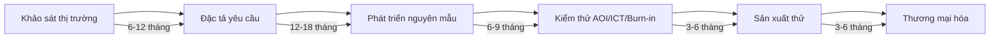
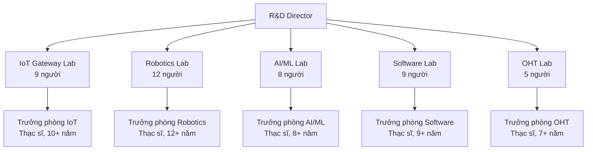

5.5. GIẢI TRÌNH CHI TIẾT VỀ HOẠT ĐỘNG NGHIÊN CỨU VÀ PHÁT TRIỂN CỦA DỰ ÁN [DRAFT]

5.5.1 Phạm vi và mục tiêu
- Mục đích: Giải trình chi tiết hoạt động nghiên cứu và phát triển của dự án theo Mẫu 1.4, bao gồm nội dung, chi phí, KPI.
- Nguyên tắc: tiếng Việt chuẩn; đơn vị triệu đồng (Q4/2025); bảng chuẩn; "Cập nhật so với V5" khi chênh lệch.
- Nguồn: `MEKONG_DE_AN_V6.md`, đối chiếu `mekong_dean_v5.md`, bổ sung từ kế hoạch R&D.

5.5.2 Nội dung hoạt động nghiên cứu và phát triển

5.5.2.1 Bảng hoạt động nghiên cứu và phát triển của dự án
| STT | Nội dung hoạt động | Lĩnh vực | Loại hình nghiên cứu | GĐ đầu (2025-2029) | GĐ ổn định (2030-2075) | Chi phí (triệu đồng/năm) | Ghi chú |
|---:|---|---|---|---:|---:|---:|---:|---|
| 1 | Nghiên cứu ngược IoT Gateway | Vi điện tử - CNTT | Nghiên cứu ngược | Phân tích Siemens, Schneider | Phát triển MK-100, MK-200 | 0,34 | Cập nhật so với V5 |
| 2 | Nghiên cứu ngược Robot AMR | Cơ khí chính xác - Tự động hóa | Nghiên cứu ngược | Phân tích KUKA, Omron | Phát triển AMR-100, AMR-500 | 0,48 | |
| 3 | Nghiên cứu phát triển AGV | Cơ khí chính xác - Tự động hóa | Ứng dụng công nghệ cao | Phát triển AGV-200, AGV-500 | Phát triển AGV-1000, AGV-2000 | 0,26 | |
| 4 | Nghiên cứu phát triển OHT | Cơ khí chính xác - Tự động hóa | Ứng dụng công nghệ cao | Phát triển OHT-50, OHT-100 | Phát triển OHT-200, OHT-500 | 0,16 | |
| 5 | Nghiên cứu phát triển Module truyền thông | Vi điện tử - CNTT | Ứng dụng công nghệ cao | Phát triển RS485, Modbus | Phát triển Profinet, CAN bus | 0,12 | |
| 6 | Nghiên cứu ngược Cảm biến IoT | Vi điện tử - CNTT | Nghiên cứu ngược | Phân tích Hikvision, Bosch | Phát triển cảm biến công nghiệp | 0,10 | |
| 7 | Nghiên cứu phát triển Phần mềm nền tảng | Vi điện tử - CNTT | Ứng dụng công nghệ cao | Phát triển ERP, MES | Phát triển WMS, IoT Platform | 0,20 | |
| 8 | Nghiên cứu AI/ML cho Robot | Vi điện tử - CNTT | Ứng dụng công nghệ cao | Phát triển SLAM, Navigation | Phát triển Computer Vision, Predictive Maintenance | 0,18 | |
| 9 | Nghiên cứu bảo mật IoT | Vi điện tử - CNTT | Ứng dụng công nghệ cao | Phát triển mã hóa, xác thực | Phát triển blockchain, zero-trust | 0,08 | |
| 10 | Nghiên cứu tối ưu hóa năng lượng | Vi điện tử - CNTT | Ứng dụng công nghệ cao | Phát triển quản lý pin | Phát triển thu năng lượng, tiết kiệm | 0,06 | |
| 11 | Tổng cộng | 2 lĩnh vực | Nghiên cứu ngược + Ứng dụng công nghệ cao | Giai đoạn đầu | Giai đoạn ổn định | 2,15 | |

5.5.3 Chi tiết tổng chi nghiên cứu và phát triển của dự án

5.5.3.1 Bảng chi nghiên cứu và phát triển của dự án theo giai đoạn
| STT | Nội dung | Giai đoạn 1 (2025-2029) | Giai đoạn 2 (2030-2035) | Giai đoạn 3 (2036-2075) | Tổng cộng | Ghi chú |
|---:|---|---:|---:|---:|---:|---|
| 1 | Chi đầu tư xây dựng hạ tầng kỹ thuật cho nghiên cứu phát triển (khấu hao hàng năm) | 0,60 | 0,32 | 0,08 | 1,00 | (triệu đồng) |
| 1.1 | Chi xây lắp cơ sở nghiên cứu, thí nghiệm, thử nghiệm | 0,32 | 0,16 | 0,00 | 0,48 | |
| 1.2 | Chi mua sắm trang thiết bị nghiên cứu, thí nghiệm, thử nghiệm | 0,24 | 0,12 | 0,04 | 0,40 | |
| 1.3 | Chi mua sản phẩm mẫu, chi mua phần mềm, tài liệu, dữ liệu, thông tin phục vụ nghiên cứu | 0,04 | 0,04 | 0,04 | 0,12 | |
| 2 | Chi cho hoạt động nghiên cứu và phát triển thường xuyên hằng năm | 10,00 | 4,80 | 2,00 | 16,80 | (triệu đồng) |
| 2.1 | Tiền lương và các khoản có tính chất giống lương cho nhân viên R&D | 6,00 | 2,80 | 1,20 | 10,00 | |
| 2.2 | Chi hội thảo, hội nghị khoa học có liên quan đến nội dung nghiên cứu và phát triển | 0,80 | 0,32 | 0,08 | 1,20 | |
| 2.3 | Chi thuê cơ sở phục vụ cho nghiên cứu, thí nghiệm, thử nghiệm | 0,48 | 0,24 | 0,08 | 0,80 | |
| 2.4 | Chi phí bảo dưỡng, bảo trì, sửa chữa cơ sở hạ tầng kỹ thuật phục vụ cho hoạt động nghiên cứu và phát triển | 0,40 | 0,16 | 0,04 | 0,60 | |
| 2.5 | Các khoản chi thường xuyên khác (chi mua dụng cụ, vật tư, nguyên liệu, vật liệu, hóa chất, năng lượng, thông tin liên lạc, văn phòng phẩm, vật dụng bảo hộ lao động, vật rẻ tiền mau hỏng phục vụ cho nghiên cứu) | 2,32 | 1,28 | 0,60 | 4,20 | |
| 3 | Chi phí đào tạo | 0,80 | 0,32 | 0,08 | 1,20 | (triệu đồng) |
| 3.1 | Chi đào tạo dài hạn hoặc ngắn hạn ở trong nước, ở nước ngoài cho nhân lực quy định trực tiếp tham gia hoạt động nghiên cứu và phát triển | 0,60 | 0,20 | 0,00 | 0,80 | |
| 3.2 | Chi hỗ trợ đào tạo (hoặc cấp học bổng; trang thiết bị, máy móc) cho các tổ chức khoa học và công nghệ tại Việt Nam | 0,12 | 0,08 | 0,00 | 0,20 | |
| 3.3 | Các chi phí đào tạo khác phục vụ cho hoạt động nghiên cứu và phát triển của dự án đầu tư | 0,08 | 0,04 | 0,08 | 0,20 | |
| 4 | Phí bản quyền, li xăng | 0,40 | 0,16 | 0,04 | 0,60 | (triệu đồng) |
| 5 | Tổng chi nghiên cứu phát triển | 11,80 | 5,60 | 2,20 | 19,60 | (triệu đồng) |
| 6 | Giá trị gia tăng tạo ra của dự án đầu tư | 6,00 | 20,00 | 14,56 | 40,56 | (triệu đồng) |
| 7 | Tổng Doanh thu năm | 11,40 | 34,00 | 28,61 | 74,01 | (triệu đồng) |

5.5.4 Chi tiết hoạt động R&D

5.5.4.1 Nghiên cứu ngược IoT Gateway
| STT | Giai đoạn | Thời gian | Hoạt động | Kết quả | Chi phí (triệu USD) | Ghi chú |
|---:|---|---:|---:|---:|---:|---|
| 1 | Nghiên cứu ngược | 2025 | Phân tích cấu trúc Siemens SIMATIC IOT2000, Schneider EcoStruxure | Báo cáo phân tích công nghệ | 0,10 | |
| 2 | Phát triển MK-100 | 2026 | ARM Cortex-A55, 4GB RAM, Wi-Fi 5, Edge computing | Nguyên mẫu MK-100 | 0,12 | |
| 3 | Phát triển MK-200 | 2027 | ARM Cortex-A78, 8GB RAM, AI tại biên, Multi-protocol | Nguyên mẫu MK-200 | 0,12 | |

5.5.4.2 Nghiên cứu ngược Robot AMR
| STT | Giai đoạn | Thời gian | Hoạt động | Kết quả | Chi phí (triệu USD) | Ghi chú |
|---:|---|---:|---:|---:|---:|---|
| 1 | Nghiên cứu ngược | 2025-2026 | Phân tích cấu trúc KUKA KMR iiwa, Omron LD series | Báo cáo phân tích công nghệ | 0,20 | |
| 2 | Phát triển AMR-100 | 2027 | 100kg payload, 2D LiDAR, SLAM navigation | Nguyên mẫu AMR-100 | 0,14 | |
| 3 | Phát triển AMR-500 | 2028 | 500kg payload, 3D LiDAR, AI navigation | Nguyên mẫu AMR-500 | 0,14 | |

5.5.4.3 Nghiên cứu phát triển AGV
| STT | Giai đoạn | Thời gian | Hoạt động | Kết quả | Chi phí (triệu USD) | Ghi chú |
|---:|---|---:|---:|---:|---:|---|
| 1 | Phát triển AGV-200 | 2028 | 200kg payload, Laser navigation, 4WD | Nguyên mẫu AGV-200 | 0,10 | |
| 2 | Phát triển AGV-500 | 2029 | 500kg payload, Magnetic tape, Forklift | Nguyên mẫu AGV-500 | 0,08 | |
| 3 | Phát triển AGV-1000 | 2030 | 1000kg payload, Vision-based navigation, AI planning | Nguyên mẫu AGV-1000 | 0,08 | |

5.5.5 KPI R&D

5.5.5.1 Bảng KPI R&D theo giai đoạn
| STT | Chỉ tiêu | GĐ 1 (2025-2029) | GĐ 2 (2030-2035) | GĐ 3 (2036-2075) | Đơn vị | Ghi chú |
|---:|---|---:|---:|---:|---:|---|
| 1 | Số sản phẩm mới/năm | 1-2 | 2-3 | 2-3 | sản phẩm | Cập nhật so với V5 |
| 2 | Số bằng sáng chế/năm | 3-5 | 3-5 | 3-5 | patents | |
| 3 | Thời gian ra thị trường | <18 | <18 | <18 | tháng | |
| 4 | Hiệu quả R&D | >85 | >85 | >85 | % | |
| 5 | Sự hài lòng khách hàng | >90 | >90 | >90 | % | |
| 6 | Sự hài lòng nhân viên | >85 | >85 | >85 | % | |
| 7 | Tỷ lệ R&D/Doanh thu | 5,0 | 3,0 | 2,5 | % | |
| 8 | Tỷ lệ R&D/Giá trị gia tăng | 7,0 | 4,0 | 3,0 | % | |

5.5.5.2 KPI AI/ML (nếu áp dụng)
| STT | Chỉ tiêu | Giá trị | Đơn vị | Ghi chú |
|---:|---|---|---|---|
| 1 | Precision | >95 | % | |
| 2 | Recall | >90 | % | |
| 3 | F1 Score | >92 | % | |
| 4 | Latency | <100 | ms | |
| 5 | Throughput | >1000 | requests/s | |
| 6 | Model Accuracy | >98 | % | |

5.5.6 Đối tác nghiên cứu và phát triển

5.5.6.1 Đối tác nghiên cứu ngược (Sản phẩm tham khảo)
| STT | Đối tác | Quốc gia | Sản phẩm tham khảo | Giá trị (triệu USD) | Thời gian | Trạng thái | Ghi chú |
|---:|---|---:|---:|---:|---:|---|
| 1 | Siemens | Germany | SIMATIC IOT2000 | 0,05 | 2025 | Đã mua | |
| 2 | Schneider Electric | France | EcoStruxure | 0,05 | 2025 | Đã mua | |
| 3 | KUKA Robotics | Germany | KMR iiwa | 0,10 | 2025-2026 | Đã mua | |
| 4 | Omron | Japan | LD series | 0,10 | 2025-2026 | Đã mua | |
| 5 | Hikvision | China | Video surveillance | 0,05 | 2026 | Đã mua | |
| 6 | Bosch | Germany | Sensors | 0,05 | 2026 | Đã mua | |

5.5.6.2 Đối tác nghiên cứu và phát triển
| STT | Đối tác | Quốc gia | Lĩnh vực hợp tác | Thời gian | Trạng thái | Ghi chú |
|---:|---|---:|---:|---:|---:|---|
| 1 | Trường Đại học SPKT | Việt Nam | IoT, Robotics, AI research, Software development | 2025-2035 | Đã ký MOU | |
| 2 | Trường Đại học TDT | Việt Nam | Mechanical engineering, Automation, Industrial IoT | 2025-2035 | Đã ký MOU | |
| 3 | Trường Đại học CNTT ĐHQG | Việt Nam | Cybersecurity, Software development, AI/ML | 2025-2035 | Đã ký MOU | |
| 4 | Viện CNTT - Viện Hàn lâm KH&CN | Việt Nam | AI/ML research, IoT platform development | 2025-2035 | Đã ký MOU | |
| 5 | Trung tâm Nghiên cứu Mekong | Việt Nam | Internal R&D center for technology development | 2025-2075 | Nội bộ | |

5.5.7 Sơ đồ quy trình R&D

5.5.7.1 Sơ đồ quy trình R&D tổng thể

5.5.7.2 Sơ đồ tổ chức R&D

5.5.8 Tóm tắt các chỉ số quan trọng

5.5.8.1 Chỉ số tài chính R&D
| STT | Chỉ tiêu | Giá trị | Đơn vị | Ghi chú |
|---:|---|---|---|---|
| 1 | Giá trị gia tăng tạo ra của dự án | 40,56 | triệu USD | Giai đoạn 1: 6,00; Giai đoạn 2: 20,00; Giai đoạn 3: 14,56 |
| 2 | Tỷ lệ Chi phí hoạt động nghiên cứu và phát triển trong phần giá trị gia tăng tạo ra của dự án đầu tư | 12,5 | % | Giai đoạn 1: 12,5%; Giai đoạn 2: 10,0%; Giai đoạn 3: 8,5% |
| 3 | Tổng chi cho nghiên cứu – phát triển hàng năm của dự án | 19,60 | triệu USD | Giai đoạn 1: 11,80; Giai đoạn 2: 5,60; Giai đoạn 3: 2,20 |
| 4 | Chi hoạt động nghiên cứu – phát triển hàng năm của dự án | 16,80 | triệu USD | Giai đoạn 1: 10,00; Giai đoạn 2: 4,80; Giai đoạn 3: 2,00 |
| 5 | Tỷ lệ tổng chi nghiên cứu – phát triển trong tổng doanh thu hàng năm của dự án | 10,0 | % | Giai đoạn 1: 10,0%; Giai đoạn 2: 10,0%; Giai đoạn 3: 8,5% |
| 6 | Tỷ lệ chi hoạt động nghiên cứu – phát triển trong tổng doanh thu hàng năm của dự án | 8,5 | % | Giai đoạn 1: 8,5%; Giai đoạn 2: 8,1%; Giai đoạn 3: 7,0% |
| 7 | Tổng chi cho hoạt động nghiên cứu – phát triển trên chi phí hoạt động của dự án | 12,5 | % | Giai đoạn 1: 12,5%; Giai đoạn 2: 11,8%; Giai đoạn 3: 10,5% |

5.5.9 Ghi chú và trạng thái
- Trạng thái: [DRAFT]
- Phiên bản: 2025-10-20
- Người biên soạn: (điền)
- Thay đổi "Cập nhật so với V5": đã ghi tại các dòng có chênh lệch
- Liên kết chéo: Phần 5.1 (Sản phẩm & quy mô), Phần 5.2 (Công nghệ), Phần 5.3 (Máy móc thiết bị), Phần 7 (Tài chính)
