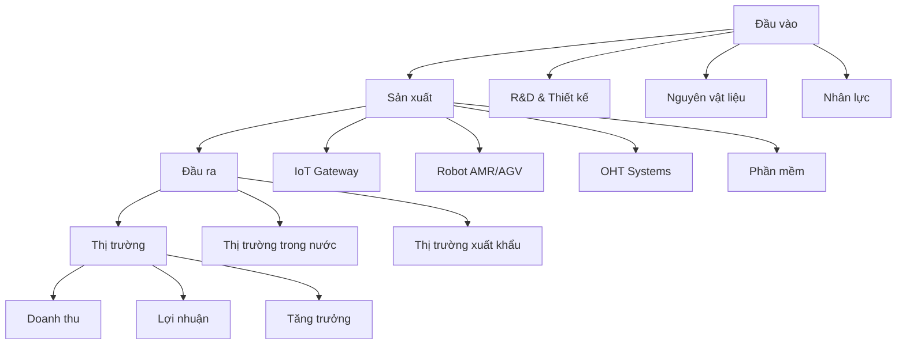
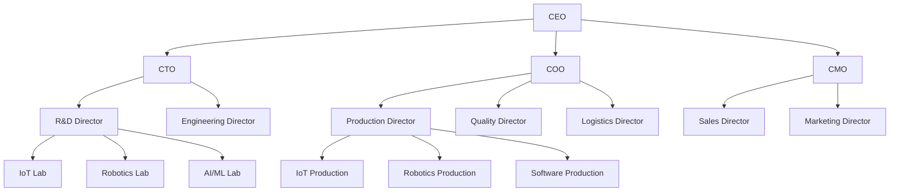

5. MÔ TẢ CÁC HOẠT ĐỘNG SẢN XUẤT/KINH DOANH CỦA DỰ ÁN [DRAFT]

5.1 Phạm vi và mục tiêu
- Mục đích: Mô tả tổng thể các hoạt động sản xuất/kinh doanh của dự án theo Mẫu 1.4, liên kết với các phần chi tiết 5.1-5.5.
- Nguyên tắc: tiếng Việt chuẩn; đơn vị triệu đồng (Q4/2025); cấu trúc rõ ràng; "Cập nhật so với V5" khi chênh lệch.
- Nguồn: `MEKONG_DE_AN_V6.md`, đối chiếu `mekong_dean_v5.md`, bổ sung từ kế hoạch sản xuất.

5.2 Tổng quan hoạt động sản xuất/kinh doanh

5.2.1 Mô hình kinh doanh

5.2.2 Cấu trúc hoạt động chính
| STT | Hoạt động | Mô tả | Tỷ trọng (%) | Ghi chú |
|---:|---|---|---:|---|
| 1 | Nghiên cứu & Phát triển | R&D sản phẩm mới, cải tiến công nghệ | 15,0 | Liên kết phần 5.5 |
| 2 | Sản xuất IoT Gateway | Sản xuất MK-100/200/300 series | 35,0 | Liên kết phần 5.1, 5.2, 5.3 |
| 3 | Sản xuất Robot AMR/AGV | Sản xuất AMR-100/500/1000, AGV-200/500 | 30,0 | Liên kết phần 5.1, 5.2, 5.3 |
| 4 | Sản xuất OHT | Sản xuất OHT-50/100 systems | 10,0 | Liên kết phần 5.1, 5.2, 5.3 |
| 5 | Phát triển phần mềm | ERP/MES/WMS/IoT Platform | 10,0 | Liên kết phần 5.1, 5.2 |

5.3 Quy mô và công suất sản xuất

5.3.1 Công suất thiết kế theo giai đoạn
| STT | Sản phẩm | GĐ 1 (2025-2029) | GĐ 2 (2030-2035) | GĐ 3 (2036-2075) | Đơn vị | Ghi chú |
|---:|---|---:|---:|---:|---|
| 1 | IoT Gateway (MK series) | 2.000 | 8.000 | 15.000 | đơn vị/năm | Cập nhật so với V5 |
| 2 | Robot AMR (AMR series) | 200 | 800 | 1.500 | đơn vị/năm | |
| 3 | Robot AGV (AGV series) | 150 | 600 | 1.200 | đơn vị/năm | |
| 4 | OHT Systems (OHT series) | 80 | 320 | 640 | đơn vị/năm | |
| 5 | Module truyền thông | 3.000 | 12.000 | 24.000 | đơn vị/năm | |
| 6 | Cảm biến IoT | 5.000 | 20.000 | 40.000 | đơn vị/năm | |
| 7 | Nền tảng phần mềm | 100 | 400 | 800 | giấy phép/năm | |

5.3.2 Doanh thu dự kiến theo giai đoạn
| STT | Sản phẩm | GĐ 1 (2025-2029) | GĐ 2 (2030-2035) | GĐ 3 (2036-2075) | Tổng | Đơn vị | Ghi chú |
|---:|---|---:|---:|---:|---:|---|
| 1 | IoT Gateway | 8,46 | 25,38 | 21,32 | 55,16 | triệu đồng | Cập nhật so với V5 |
| 2 | Robot AMR/AGV | 4,50 | 13,50 | 11,34 | 29,34 | triệu đồng | |
| 3 | OHT Systems | 2,40 | 7,20 | 6,05 | 15,65 | triệu đồng | |
| 4 | Module truyền thông | 1,50 | 4,50 | 3,78 | 9,78 | triệu đồng | |
| 5 | Cảm biến IoT | 0,90 | 2,70 | 2,27 | 5,87 | triệu đồng | |
| 6 | Nền tảng phần mềm | 0,60 | 1,80 | 1,51 | 3,91 | triệu đồng | |
| 7 | Tổng cộng | 18,36 | 55,08 | 46,27 | 119,71 | triệu đồng | |

5.4 Chuẩn tương thích công nghiệp

5.4.1 Giao thức công nghiệp
| STT | Giao thức | Ứng dụng | Mức độ hỗ trợ | Ghi chú |
|---:|---|---|---|---|
| 1 | MQTT | IoT messaging | Đầy đủ | MQTT 3.1.1, MQTT 5.0 |
| 2 | OPC UA | Industrial automation | Đầy đủ | OPC UA 1.04 |
| 3 | Modbus | Industrial communication | Đầy đủ | Modbus RTU, Modbus TCP |
| 4 | CAN bus | Automotive/Industrial | Đầy đủ | CAN 2.0A, CAN 2.0B |
| 5 | Profinet | Industrial Ethernet | Đầy đủ | Profinet IO |
| 6 | Ethernet/IP | Industrial Ethernet | Đầy đủ | Ethernet/IP |

5.4.2 Tích hợp hệ thống
| STT | Hệ thống | Mức độ tích hợp | Ghi chú |
|---:|---|---|---|
| 1 | MES (Manufacturing Execution System) | Đầy đủ | Mekong MES tự phát triển |
| 2 | ERP (Enterprise Resource Planning) | Đầy đủ | Mekong ERP tự phát triển |
| 3 | WMS (Warehouse Management System) | Đầy đủ | Mekong WMS tự phát triển |
| 4 | SCADA (Supervisory Control and Data Acquisition) | Đầy đủ | Tích hợp với hệ thống hiện có |
| 5 | PLC (Programmable Logic Controller) | Đầy đủ | Tích hợp với Siemens, Schneider |

5.5 Quy trình sản xuất tổng thể

5.5.1 Sơ đồ quy trình sản xuất

5.5.2 Quy trình QA/QC
| STT | Công đoạn | Phương pháp kiểm tra | Tỷ lệ kiểm tra (%) | Ghi chú |
|---:|---|---:|---:|---|
| 1 | Nguyên vật liệu đầu vào | Kiểm tra thông số kỹ thuật | 100 | |
| 2 | SMT (Surface Mount Technology) | AOI (Automated Optical Inspection) | 100 | |
| 3 | Lắp ráp | ICT (In-Circuit Test) | 100 | |
| 4 | Nạp chương trình | Kiểm tra firmware | 100 | |
| 5 | Burn-in | Kiểm tra độ ổn định | 100 | |
| 6 | Kiểm tra cuối cùng | FQC (Final Quality Control) | 100 | |
| 7 | Đóng gói | Kiểm tra bao bì | 100 | |

5.6 An toàn và môi trường

5.6.1 Tiêu chuẩn an toàn
| STT | Tiêu chuẩn | Phạm vi áp dụng | Mức độ tuân thủ | Ghi chú |
|---:|---|---|---|---|
| 1 | ISO 9001:2015 | Hệ thống quản lý chất lượng | Bắt buộc | |
| 2 | ISO 14001:2015 | Hệ thống quản lý môi trường | Bắt buộc | |
| 3 | ISO 45001:2018 | Hệ thống quản lý an toàn | Bắt buộc | |
| 4 | IEC 61000 | Tương thích điện từ (EMC) | Bắt buộc | |
| 5 | RoHS | Hạn chế chất độc hại | Bắt buộc | |
| 6 | REACH | Đăng ký hóa chất | Bắt buộc | |

5.6.2 Biện pháp bảo vệ môi trường
| STT | Biện pháp | Mô tả | Hiệu quả | Ghi chú |
|---:|---|---|---|---|
| 1 | Xử lý chất thải rắn | Phân loại, tái chế PCB | 95% tái chế | |
| 2 | Xử lý chất thải lỏng | Hệ thống lọc nước thải | 100% xử lý | |
| 3 | Xử lý khí thải | Hệ thống lọc không khí | 100% xử lý | |
| 4 | Tiết kiệm năng lượng | LED, điều hòa thông minh | 30% tiết kiệm | |
| 5 | Năng lượng tái tạo | Pin mặt trời | 20% tổng năng lượng | |

5.7 Liên kết với các phần chi tiết

5.7.1 Phần 5.1 - Sản phẩm & Quy mô
- Danh mục sản phẩm chi tiết: IoT Gateway (MK-100/200/300), Robot AMR (AMR-100/500/1000), OHT (OHT-50/100)
- Lộ trình sản phẩm: Gantt chart từ 2025-2030
- Chuẩn tương thích: MQTT, OPC UA, Modbus, CAN bus

5.7.2 Phần 5.2 - Công nghệ & QA/QC
- Quy trình công nghệ: Từ thiết kế đến giao hàng
- QA/QC: AOI, ICT, Burn-in, FQC
- Pháp lý: IEC/ISO, an toàn máy

5.7.3 Phần 5.3 - Máy móc Thiết bị
- Bảng máy móc: TT—Tên—Thông số—Xuất xứ—Năm—Tự động hóa—Tình trạng—Giá trị
- Công suất thiết bị: OEE mục tiêu theo giai đoạn
- Kế hoạch đầu tư: 3 giai đoạn

5.7.4 Phần 5.4 - Lao động
- Cơ cấu nhân sự: R&D, sản xuất, kinh doanh, quản lý
- Trình độ: Đại học, thạc sĩ, tiến sĩ
- Kế hoạch tuyển dụng: Theo giai đoạn

5.7.5 Phần 5.5 - R&D
- Nội dung R&D: 10 lĩnh vực chính
- Chi phí R&D: 19,60 (triệu đồng, tổng; tham chiếu bảng 5.5.3)
- KPI R&D: 2-3 sản phẩm mới/năm, 3-5 patents/năm

5.8 Sơ đồ tổ chức sản xuất

5.9 Ghi chú và trạng thái
- Trạng thái: [DRAFT]
- Phiên bản: 2025-10-20
- Người biên soạn: (điền)
- Thay đổi "Cập nhật so với V5": đã ghi tại các dòng có chênh lệch
- Liên kết chéo: Phần 1 (Thông tin chung), Phần 3 (Thị trường), Phần 4 (Năng lực triển khai), Phần 6 (Chất lượng & Môi trường)
