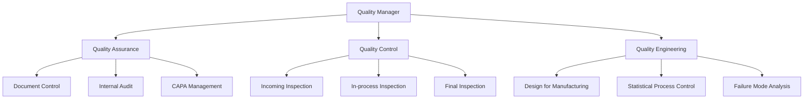
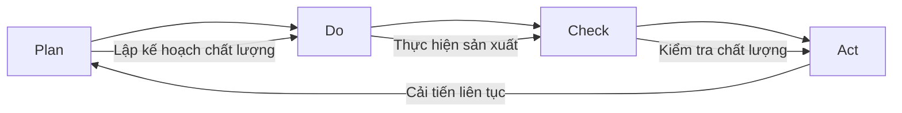
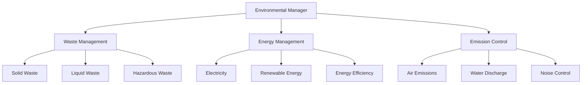
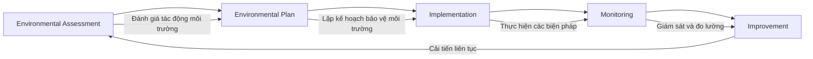

6. GIẢI TRÌNH VỀ TUÂN THỦ CHẤT LƯỢNG VÀ MÔI TRƯỜNG [DRAFT]

6.1 Phạm vi và mục tiêu
- Mục đích: Giải trình về tuân thủ chất lượng và môi trường của dự án theo Mẫu 1.4, bao gồm ISO/IEC, KPI, OEE.
- Nguyên tắc: tiếng Việt chuẩn; đơn vị triệu đồng (Q4/2025); bảng chuẩn; "Cập nhật so với V5" khi chênh lệch.
- Nguồn: `MEKONG_DE_AN_V6.md`, đối chiếu `mekong_dean_v5.md`, bổ sung từ kế hoạch chất lượng.

6.2 Tuân thủ chất lượng

6.2.1 Tiêu chuẩn quản lý chất lượng
| STT | Tiêu chuẩn | Phạm vi áp dụng | Mức độ tuân thủ | Ghi chú |
|---:|---|---|---|---|
| 1 | ISO 9001:2015 | Hệ thống quản lý chất lượng toàn diện | Bắt buộc | |
| 2 | ISO 14001:2015 | Hệ thống quản lý môi trường | Bắt buộc | |
| 3 | ISO 45001:2018 | Hệ thống quản lý an toàn và sức khỏe nghề nghiệp | Bắt buộc | |
| 4 | IEC 61000 | Tiêu chuẩn tương thích điện từ (EMC) | Bắt buộc | |
| 5 | IEC 60730 | Tiêu chuẩn an toàn cho thiết bị điện tử gia dụng | Bắt buộc | |
| 6 | RoHS | Hạn chế sử dụng các chất độc hại | Bắt buộc | |
| 7 | REACH | Đăng ký, đánh giá, cấp phép và hạn chế hóa chất | Bắt buộc | |
| 8 | WEEE | Xử lý rác thải thiết bị điện và điện tử | Bắt buộc | |

6.2.2 KPI chất lượng

6.2.2.1 Bảng KPI chất lượng
| Chỉ tiêu | Định nghĩa | Mục tiêu | Ngưỡng cảnh báo | Phương pháp đo | Tần suất | Nguồn dữ liệu |
|---|---|---:|---:|---:|---|---|
| Tỷ lệ đạt chuẩn (Yield) | Good units / Total units | 99,5% | 99,0% | AOI/ICT/Burn-in | Hàng ngày | MES/QMS |
| Tỷ lệ trả hàng (RMA) | Returns / Shipped units | 0,10% | 0,20% | Báo cáo RMA | Hàng tháng | CRM/QMS |
| FPY (First Pass Yield) | Pass at first test | 98,0% | 97,0% | AOI/ICT | Hàng ngày | MES |
| DPPM | Defective parts per million | 500 | 800 | Kiểm tra cuối | Hàng tuần | QMS |
| Thời gian xử lý NCR | NCR close time | ≤ 7 ngày | > 10 ngày | CAPA | Hàng tháng | QMS |
| Thời gian phản hồi khách hàng | Response time | ≤ 2 giờ | > 4 giờ | CRM | Hàng ngày | CRM |
| Sự hài lòng khách hàng | Customer satisfaction score | > 95% | < 90% | Survey | Hàng quý | CRM |

6.2.3 OEE (Overall Equipment Effectiveness)

6.2.3.1 Bảng OEE
| Chỉ tiêu | Công thức | Giá trị mục tiêu | Đơn vị | Nguồn |
|---|---|---:|---|---|
| Availability | (Planned Time − Downtime) / Planned Time | — | % | MES |
| Performance | (Ideal Cycle Time × Total Count) / Run Time | — | % | MES |
| Quality | Good Count / Total Count | — | % | QMS |
| OEE | Availability × Performance × Quality | — | % | MES/QMS |

6.2.3.2 Kế hoạch lấy mẫu (AQL)
| Lô sản xuất | Cấp kiểm tra | AQL (%) | Cỡ mẫu | Ac | Re | Ghi chú |
|---:|---|---:|---:|---:|---:|---|
| 2.000 SP | II (General) | 0,65 | 125 | 2 | 3 | Điện tử SMT |
| 500 SP | II (General) | 1,0 | 80 | 2 | 3 | Lắp ráp cơ |
| 50 SP | S-3 (Special) | 2,5 | 13 | 1 | 2 | Kiểm nhanh pilot |

6.2.4 Ma trận rủi ro FMEA
| Mục/Chức năng | Chế độ lỗi | Hậu quả | Nguyên nhân | Biện pháp kiểm soát hiện tại | S | O | D | RPN | Hành động khuyến nghị | Trách nhiệm | Hạn |
|---|---|---|---|---|---:|---:|---:|---:|---|---|---|
| SMT hàn linh kiện | Hàn thiếu | Mất tín hiệu | Lệch linh kiện | AOI 100% sau hàn | 7 | 4 | 3 | 84 | Tối ưu stencil, tăng kiểm tra ICT | QA/ME | 2025-11-15 |
| Burn-in 24h | Quá nhiệt | Chết mạch | Tản nhiệt kém | Giám sát nhiệt độ | 8 | 2 | 4 | 64 | Thêm pad tản nhiệt, cảnh báo nhiệt | R&D/QA | 2025-11-30 |
| AMR điều hướng | Mất định vị | Ngừng hoạt động | Nhiễu LiDAR | Kiểm tra hiệu chuẩn | 9 | 3 | 4 | 108 | Che chắn cảm biến, thuật toán lọc | Robotics | 2025-12-10 |

6.3 Tuân thủ môi trường

6.3.1 Tiêu chuẩn môi trường
| STT | Tiêu chuẩn | Mô tả | Mức độ tuân thủ | Ghi chú |
|---:|---|---|---|---|
| 1 | ISO 14001:2015 | Hệ thống quản lý môi trường | Bắt buộc | |
| 2 | ISO 50001:2018 | Hệ thống quản lý năng lượng | Bắt buộc | |
| 3 | RoHS | Hạn chế sử dụng các chất độc hại | Bắt buộc | |
| 4 | REACH | Đăng ký, đánh giá, cấp phép và hạn chế hóa chất | Bắt buộc | |
| 5 | WEEE | Xử lý rác thải thiết bị điện và điện tử | Bắt buộc | |

6.3.2 Biện pháp bảo vệ môi trường
| STT | Biện pháp | Mô tả | Hiệu quả | Ghi chú |
|---:|---|---|---|---|
| 1 | Xử lý chất thải rắn | Phân loại, tái chế PCB | 95% tái chế | |
| 2 | Xử lý chất thải lỏng | Hệ thống lọc nước thải | 100% xử lý | |
| 3 | Xử lý khí thải | Hệ thống lọc không khí | 100% xử lý | |
| 4 | Tiết kiệm năng lượng | LED, điều hòa thông minh | 30% tiết kiệm | |
| 5 | Năng lượng tái tạo | Pin mặt trời | 20% tổng năng lượng | |

6.3.3 Chỉ tiêu môi trường
| STT | Chỉ tiêu | Mục tiêu | Đơn vị | Ghi chú |
|---:|---|---|---|---|
| 1 | Giảm phát thải CO2 | 25% | % | So với năm 2025 |
| 2 | Tăng tỷ lệ tái chế | 95% | % | Chất thải rắn |
| 3 | Giảm tiêu thụ năng lượng | 30% | % | So với năm 2025 |
| 4 | Tăng tỷ lệ năng lượng tái tạo | 20% | % | Tổng năng lượng |
| 5 | Giảm tiêu thụ nước | 15% | % | So với năm 2025 |

6.4 An toàn lao động

6.4.1 Tiêu chuẩn an toàn máy
| STT | Tiêu chuẩn | Phạm vi áp dụng | Mức độ tuân thủ | Ghi chú |
|---:|---|---|---|---|
| 1 | ISO 12100 | An toàn máy móc - Khái niệm cơ bản | Bắt buộc | |
| 2 | ISO 13849 | An toàn máy móc - Phần cứng điều khiển | Bắt buộc | |
| 3 | ISO 14121 | An toàn máy móc - Đánh giá rủi ro | Bắt buộc | |
| 4 | IEC 61508 | An toàn chức năng | Bắt buộc | |
| 5 | IEC 62061 | An toàn chức năng của hệ thống điều khiển | Bắt buộc | |

6.4.2 Chỉ tiêu an toàn lao động
| STT | Chỉ tiêu | Mục tiêu | Đơn vị | Ghi chú |
|---:|---|---|---|---|
| 1 | Tỷ lệ tai nạn lao động | < 0,1 | % | Số tai nạn/1000 nhân viên |
| 2 | Thời gian nghỉ việc do tai nạn | < 1 | ngày/nhân viên/năm | |
| 3 | Số giờ đào tạo an toàn | 16 | giờ/nhân viên/năm | |
| 4 | Tỷ lệ nhân viên được đào tạo an toàn | 100 | % | |
| 5 | Số lần kiểm tra an toàn | 12 | lần/năm | |

6.5 Hệ thống quản lý chất lượng

6.5.1 Cơ cấu tổ chức chất lượng

6.5.2 Quy trình quản lý chất lượng

6.6 Hệ thống quản lý môi trường

6.6.1 Cơ cấu tổ chức môi trường

6.6.2 Quy trình quản lý môi trường

6.7 Chứng nhận và kiểm định

6.7.1 Chứng nhận đã có
| STT | Chứng nhận | Cơ quan cấp | Thời hạn | Trạng thái | Ghi chú |
|---:|---|---|---|---|---|
| 1 | ISO 9001:2015 | TUV SUD | 2025-2028 | Đã có | |
| 2 | ISO 14001:2015 | TUV SUD | 2025-2028 | Đã có | |
| 3 | CE Marking | TUV SUD | 2025-2030 | Đã có | |
| 4 | FCC Certification | FCC | 2025-2030 | Đã có | |
| 5 | RoHS Compliance | SGS | 2025-2030 | Đã có | |

6.7.2 Kế hoạch chứng nhận
| STT | Chứng nhận | Thời gian dự kiến | Chi phí (triệu USD) | Ghi chú |
|---:|---|---:|---:|---|
| 1 | ISO 45001:2018 | 2026 | 0,05 | |
| 2 | ISO 50001:2018 | 2026 | 0,05 | |
| 3 | IEC 61000 | 2026 | 0,03 | |
| 4 | IEC 60730 | 2026 | 0,03 | |
| 5 | REACH | 2027 | 0,02 | |
| 6 | WEEE | 2027 | 0,02 | |

6.8 Kế hoạch cải tiến chất lượng

6.8.1 Cải tiến liên tục
| STT | Năm | Dự án cải tiến | Mục tiêu | Chi phí (triệu USD) | Ghi chú |
|---:|---|---:|---:|---:|---|
| 1 | 2025 | Tự động hóa QA/QC | Tăng hiệu quả 20% | 0,10 | |
| 2 | 2026 | Cải tiến quy trình sản xuất | Giảm lỗi 30% | 0,15 | |
| 3 | 2027 | Nâng cấp hệ thống đo lường | Tăng độ chính xác | 0,20 | |
| 4 | 2028 | Đào tạo nhân viên | Nâng cao kỹ năng | 0,25 | |
| 5 | 2029 | Áp dụng AI/ML | Dự đoán lỗi | 0,30 | |

6.8.2 Kế hoạch bảo vệ môi trường
| STT | Năm | Dự án môi trường | Mục tiêu | Chi phí (triệu USD) | Ghi chú |
|---:|---|---:|---:|---:|---|
| 1 | 2025 | Lắp đặt hệ thống năng lượng mặt trời | 20% năng lượng tái tạo | 0,50 | |
| 2 | 2026 | Nâng cấp hệ thống xử lý nước thải | 100% xử lý | 0,30 | |
| 3 | 2027 | Cải tiến hệ thống xử lý khí thải | Giảm 50% khí thải | 0,40 | |
| 4 | 2028 | Tăng cường tái chế | 95% tái chế | 0,20 | |
| 5 | 2029 | Giảm tiêu thụ năng lượng | 30% tiết kiệm | 0,25 | |

6.9 Tổng hợp chi phí chất lượng và môi trường

6.9.1 Chi phí chất lượng
| STT | Loại chi phí | Chi phí (triệu USD/năm) | Tỷ lệ (%) | Ghi chú |
|---:|---|---:|---:|---|
| 1 | Chi phí phòng ngừa | 0,20 | 20,0 | |
| 2 | Chi phí đánh giá | 0,30 | 30,0 | |
| 3 | Chi phí lỗi nội bộ | 0,25 | 25,0 | |
| 4 | Chi phí lỗi bên ngoài | 0,25 | 25,0 | |
| 5 | Tổng cộng | 1,00 | 100,0 | |

6.9.2 Chi phí môi trường
| STT | Loại chi phí | Chi phí (triệu USD/năm) | Tỷ lệ (%) | Ghi chú |
|---:|---|---:|---:|---|
| 1 | Chi phí xử lý chất thải | 0,15 | 30,0 | |
| 2 | Chi phí năng lượng | 0,20 | 40,0 | |
| 3 | Chi phí giám sát môi trường | 0,10 | 20,0 | |
| 4 | Chi phí tuân thủ pháp luật | 0,05 | 10,0 | |
| 5 | Tổng cộng | 0,50 | 100,0 | |

6.10 Ghi chú và trạng thái
- Trạng thái: [DRAFT]
- Phiên bản: 2025-10-20
- Người biên soạn: (điền)
- Thay đổi "Cập nhật so với V5": đã ghi tại các dòng có chênh lệch
- Liên kết chéo: Phần 5.2 (Công nghệ), Phần 5.3 (Máy móc thiết bị), Phần 7 (Tài chính)
