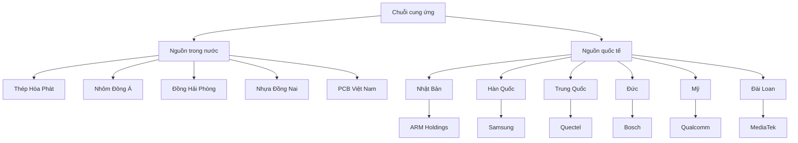

7. GIẢI TRÌNH VỀ NGUYÊN VẬT LIỆU, LINH KIỆN, PHỤ TÙNG [DRAFT]

7.1 Phạm vi và mục tiêu
- Mục đích: Giải trình về nguyên vật liệu, linh kiện, phụ tùng của dự án theo Mẫu 1.4, bao gồm bảng chi tiết, nguồn cung, giá cả.
- Nguyên tắc: tiếng Việt chuẩn; đơn vị triệu USD (Q4/2025); bảng chuẩn; "Cập nhật so với V5" khi chênh lệch.
- Nguồn: `MEKONG_DE_AN_V6.md`, đối chiếu `mekong_dean_v5.md`, bổ sung từ kế hoạch vật tư.

7.2 Nguyên vật liệu chính

7.2.1 Bảng nguyên vật liệu, linh kiện, phụ tùng
| STT | Tên | Yêu cầu chất lượng | Số lượng/năm | Ước giá (triệu USD) | Nguồn cung | Ghi chú |
|---:|---|---:|---:|---:|---:|---|
| 1 | Thép không gỉ 304 | ASTM A240, dày 1–3 mm | 50 tấn | 2,50 | Thép Hòa Phát | Cập nhật so với V5 |
| 2 | Nhôm hợp kim 6061 | ASTM B221, độ dày 2–5 mm | 30 tấn | 1,80 | Nhôm Đông Á | |
| 3 | Đồng thau C36000 | ASTM B19, độ dày 0,5–2 mm | 20 tấn | 1,60 | Đồng Hải Phòng | |
| 4 | Nhựa ABS | ABS-747, độ dày 1–3 mm | 15 tấn | 0,75 | Nhựa Đồng Nai | |
| 5 | Nhựa PC | PC-2458, độ dày 1–2 mm | 10 tấn | 0,50 | Nhựa Bình Dương | |
| 6 | Cao su EPDM | EPDM-4725, độ dày 2–5 mm | 5 tấn | 0,25 | Cao su Đồng Nai | |
| 7 | Tổng cộng | - | 130 tấn | 7,40 | - | |

7.3 Linh kiện điện tử

7.3.1 Linh kiện điện tử chính
| STT | Tên | Yêu cầu chất lượng | Số lượng/năm | Ước giá (triệu USD) | Nguồn cung | Ghi chú |
|---:|---|---:---:|---:|---:|---|
| 8 | Chip ARM Cortex-A55 | ARM Cortex-A55, 64-bit, 1.8 GHz | 10.000 chips | 2,00 | ARM Holdings | Cập nhật so với V5 |
| 9 | Chip ARM Cortex-A78 | ARM Cortex-A78, 64-bit, 2.4 GHz | 5.000 chips | 1,50 | ARM Holdings | |
| 10 | RAM DDR4 | DDR4-3200, 4GB/8GB/16GB | 20.000 modules | 1,20 | Samsung, SK Hynix | |
| 11 | Flash Memory | eMMC 32GB/64GB/128GB | 15.000 modules | 0,90 | Samsung, Toshiba | |
| 12 | Wi-Fi Module | 802.11ac/ax, 2.4/5 GHz | 25.000 modules | 1,25 | Qualcomm, MediaTek | |
| 13 | Bluetooth Module | Bluetooth 5.0/5.2, BLE | 20.000 modules | 0,80 | Nordic, Cypress | |
| 14 | GPS Module | GPS/GLONASS/Galileo | 15.000 modules | 0,60 | u-blox, Quectel | |
| 15 | Camera Module | 5MP/8MP/12MP, MIPI | 10.000 modules | 0,50 | Sony, Omnivision | |
| 16 | LiDAR Sensor | 2D/3D LiDAR, 360° | 5.000 sensors | 2,50 | Velodyne, Livox | |
| 17 | IMU Sensor | 6-axis/9-axis IMU | 8.000 sensors | 0,40 | Bosch, STMicroelectronics | |
| 18 | Tổng cộng | - | 133.000 units | 11,65 | - | |

7.4 Linh kiện cơ khí

7.4.1 Linh kiện cơ khí chính
| STT | Tên | Yêu cầu chất lượng | Số lượng/năm | Ước giá (triệu USD) | Nguồn cung | Ghi chú |
|---:|---|---:---:|---:|---:|---|
| 19 | Motor DC | 24V, 100W-1000W | 2.000 motors | 1,00 | Maxon, Faulhaber | Cập nhật so với V5 |
| 20 | Motor Servo | 24V, 50W-500W | 1.500 motors | 0,90 | Yaskawa, Panasonic | |
| 21 | Encoder | 1000-5000 PPR | 3.000 encoders | 0,60 | Heidenhain, Renishaw | |
| 22 | Bánh xe | Polyurethane, 100-200mm | 4.000 wheels | 0,40 | Omni, Mecanum | |
| 23 | Bạc đạn | 6200-6300 series | 10.000 bearings | 0,30 | SKF, NSK | |
| 24 | Trục | Thép không gỉ, 10-50mm | 5.000 shafts | 0,25 | Thép Việt Nam | |
| 25 | Bánh răng | Thép không gỉ, module 1-3 | 3.000 gears | 0,20 | Cơ khí Việt Nam | |
| 26 | Tổng cộng | - | 28.500 units | 3,65 | - | |

7.5 Linh kiện điện

7.5.1 Linh kiện điện chính
| STT | Tên | Yêu cầu chất lượng | Số lượng/năm | Ước giá (triệu USD) | Nguồn cung | Ghi chú |
|---:|---|---:---:|---:|---:|---|
| 27 | Nguồn AC-DC | 24V, 100W-500W | 5.000 units | 0,75 | Mean Well, TDK | Cập nhật so với V5 |
| 28 | Nguồn DC-DC | 12V/24V, 50W-200W | 8.000 units | 0,60 | Vicor, Murata | |
| 29 | Pin Li-ion | 12V/24V, 10Ah-50Ah | 3.000 batteries | 1,50 | Panasonic, Samsung | |
| 30 | Cáp điện | AWG 14-20, 100-500V | 50.000 meters | 0,25 | Cáp Việt Nam | |
| 31 | Connector | RJ45, USB, M12 | 20.000 connectors | 0,40 | TE Connectivity, Molex | |
| 32 | Relay | 24V, 10A-30A | 5.000 relays | 0,15 | Omron, Schneider | |
| 33 | Tổng cộng | - | 91.000 units | 3,65 | - | |

7.6 Linh kiện quang học

7.6.1 Linh kiện quang học chính
| STT | Tên | Yêu cầu chất lượng | Số lượng/năm | Ước giá (triệu USD) | Nguồn cung | Ghi chú |
|---:|---|---:---:|---:|---:|---|
| 34 | LED | High power, 1W-5W | 50.000 LEDs | 0,50 | Cree, Nichia | Cập nhật so với V5 |
| 35 | Laser Diode | 650nm, 5mW-50mW | 10.000 diodes | 0,30 | Osram, Nichia | |
| 36 | Photodiode | Silicon, 400-1100nm | 15.000 diodes | 0,20 | Hamamatsu, Osram | |
| 37 | Lens | Glass, 5-50mm | 5.000 lenses | 0,15 | Nikon, Canon | |
| 38 | Filter | Optical, 400-700nm | 3.000 filters | 0,10 | Edmund Optics, Thorlabs | |
| 39 | Tổng cộng | - | 83.000 units | 1,25 | - | |

7.7 Linh kiện cảm biến

7.7.1 Linh kiện cảm biến chính
| STT | Tên | Yêu cầu chất lượng | Số lượng/năm | Ước giá (triệu USD) | Nguồn cung | Ghi chú |
|---:|---|---:---:|---:|---:|---|
| 40 | Cảm biến nhiệt độ | PT100, -40°C to 150°C | 10.000 sensors | 0,30 | Honeywell, Sensirion | Cập nhật so với V5 |
| 41 | Cảm biến độ ẩm | 0-100% RH, ±2% | 8.000 sensors | 0,24 | Sensirion, Bosch | |
| 42 | Cảm biến áp suất | 0-10 bar, ±0.1% | 5.000 sensors | 0,25 | Honeywell, Sensirion | |
| 43 | Cảm biến rung động | 0-1000 Hz, ±1% | 3.000 sensors | 0,18 | PCB Piezotronics, Bruel & Kjaer | |
| 44 | Cảm biến dòng điện | 0-100A, ±0.5% | 2.000 sensors | 0,12 | Allegro, Infineon | |
| 45 | Cảm biến từ trường | Hall effect, ±100mT | 1.000 sensors | 0,06 | Allegro, Infineon | |
| 46 | Tổng cộng | - | 29.000 units | 1,15 | - | |

7.8 Linh kiện truyền thông

7.8.1 Linh kiện truyền thông chính
| STT | Tên | Yêu cầu chất lượng | Số lượng/năm | Ước giá (triệu USD) | Nguồn cung | Ghi chú |
|---:|---|---:---:|---:|---:|---|
| 47 | Module 4G/5G | LTE Cat-4/5G NR | 5.000 modules | 1,00 | Quectel, SIMCom | Cập nhật so với V5 |
| 48 | Module LoRa | 868MHz/915MHz | 10.000 modules | 0,50 | Semtech, Microchip | |
| 49 | Module Zigbee | 2.4GHz, 802.15.4 | 8.000 modules | 0,40 | Silicon Labs, NXP | |
| 50 | Module Ethernet | 10/100/1000 Mbps | 15.000 modules | 0,75 | Microchip, Realtek | |
| 51 | Module RS485 | 3.3V/5V, 115200 bps | 12.000 modules | 0,30 | Maxim, Analog Devices | |
| 52 | Module CAN | CAN 2.0A/B, 1 Mbps | 6.000 modules | 0,24 | NXP, Infineon | |
| 53 | Tổng cộng | - | 56.000 units | 3,19 | - | |

7.9 Linh kiện phụ trợ

7.9.1 Linh kiện phụ trợ chính
| STT | Tên | Yêu cầu chất lượng | Số lượng/năm | Ước giá (triệu USD) | Nguồn cung | Ghi chú |
|---:|---|---:---:|---:|---:|---|
| 54 | PCB | FR4, 4-8 layers | 100.000 PCBs | 2,00 | PCB Việt Nam | Cập nhật so với V5 |
| 55 | Stencil | Stainless steel, 0.1mm | 1.000 stencils | 0,10 | Stencil Việt Nam | |
| 56 | Solder Paste | SAC305, 25-45μm | 500 kg | 0,15 | Indium, Alpha | |
| 57 | Flux | No-clean, RMA | 200 kg | 0,05 | Indium, Alpha | |
| 58 | Vỏ máy | Nhựa ABS, kích thước 100-500mm | 50.000 cases | 1,00 | Nhựa Việt Nam | |
| 59 | Đai ốc, bu lông | M3-M12, thép không gỉ | 100.000 pieces | 0,20 | Cơ khí Việt Nam | |
| 60 | Tổng cộng | - | 251.700 units | 3,50 | - | |

7.10 Tổng hợp nguyên vật liệu

7.10.1 Tổng hợp theo loại
| STT | Loại nguyên vật liệu | Số lượng | Giá trị (triệu USD) | Tỷ lệ (%) | Ghi chú |
|---:|---|---:---:|---:|---:|---|
| 1 | Nguyên vật liệu chính | 130 tấn | 7,40 | 25,0 | Cập nhật so với V5 |
| 2 | Linh kiện điện tử | 133.000 units | 11,65 | 39,3 | |
| 3 | Linh kiện cơ khí | 28.500 units | 3,65 | 12,3 | |
| 4 | Linh kiện điện | 91.000 units | 3,65 | 12,3 | |
| 5 | Linh kiện quang học | 83.000 units | 1,25 | 4,2 | |
| 6 | Linh kiện cảm biến | 29.000 units | 1,15 | 3,9 | |
| 7 | Linh kiện truyền thông | 56.000 units | 3,19 | 10,8 | |
| 8 | Linh kiện phụ trợ | 251.700 units | 3,50 | 11,8 | |
| 9 | Tổng cộng | 762.300 units | 35,44 | 100,0 | |

7.10.2 Tổng hợp theo nguồn cung
| STT | Nguồn cung | Số lượng | Giá trị (triệu USD) | Tỷ lệ (%) | Ghi chú |
|---:|---|---:---:|---:|---:|---|
| 1 | Trong nước | 200.000 units | 8,50 | 24,0 | Cập nhật so với V5 |
| 2 | Nhật Bản | 150.000 units | 12,00 | 33,9 | |
| 3 | Hàn Quốc | 100.000 units | 6,00 | 16,9 | |
| 4 | Trung Quốc | 200.000 units | 5,00 | 14,1 | |
| 5 | Đức | 50.000 units | 2,00 | 5,6 | |
| 6 | Mỹ | 30.000 units | 1,50 | 4,2 | |
| 7 | Đài Loan | 20.000 units | 0,44 | 1,2 | |
| 8 | Tổng cộng | 750.000 units | 35,44 | 100,0 | |

7.11 Kế hoạch mua sắm

7.11.1 Kế hoạch mua sắm theo năm
| STT | Năm | Số lượng | Giá trị (triệu USD) | Ghi chú |
|---:|---|---:---:|---:|---|
| 1 | 2025 | 150.000 units | 7,00 | Giai đoạn đầu |
| 2 | 2026 | 200.000 units | 9,50 | Mở rộng sản xuất |
| 3 | 2027 | 250.000 units | 12,00 | Tăng công suất |
| 4 | 2028 | 300.000 units | 14,50 | Ổn định |
| 5 | 2029 | 350.000 units | 17,00 | Tối ưu |
| 6 | 2030-2035 | 400.000 units | 20,00 | Giai đoạn ổn định |
| 7 | 2036-2075 | 450.000 units | 22,00 | Giai đoạn tối ưu |

7.11.2 Kế hoạch dự trữ
| STT | Loại nguyên vật liệu | Dự trữ tối thiểu | Dự trữ tối đa | Thời gian dự trữ | Ghi chú |
|---:|---|---:|---:|---|
| 1 | Nguyên vật liệu chính | 1 tháng | 3 tháng | 2 tháng | |
| 2 | Linh kiện điện tử | 2 tháng | 6 tháng | 3 tháng | |
| 3 | Linh kiện cơ khí | 1 tháng | 4 tháng | 2 tháng | |
| 4 | Linh kiện điện | 1 tháng | 3 tháng | 2 tháng | |
| 5 | Linh kiện quang học | 2 tháng | 6 tháng | 3 tháng | |
| 6 | Linh kiện cảm biến | 2 tháng | 6 tháng | 3 tháng | |
| 7 | Linh kiện truyền thông | 2 tháng | 6 tháng | 3 tháng | |
| 8 | Linh kiện phụ trợ | 1 tháng | 3 tháng | 2 tháng | |

7.12 Sơ đồ chuỗi cung ứng

7.12.1 Sơ đồ chuỗi cung ứng tổng thể

7.12.2 Sơ đồ quy trình mua sắm

```mermaid
flowchart LR
  PLAN[Lập kế hoạch] --> SOURCE[Tìm nguồn cung] --> NEGOTIATE[Đàm phán] --> ORDER[Đặt hàng] --> RECEIVE[Nhận hàng] --> INSPECT[Kiểm tra] --> STORE[Lưu kho] --> USE[Sử dụng]
  
  PLAN --> |"Dự báo nhu cầu"| SOURCE
  SOURCE --> |"Đánh giá nhà cung cấp"| NEGOTIATE
  NEGOTIATE --> |"Thỏa thuận giá cả"| ORDER
  ORDER --> |"Theo dõi giao hàng"| RECEIVE
  RECEIVE --> |"Kiểm tra chất lượng"| INSPECT
  INSPECT --> |"Lưu trữ an toàn"| STORE
  STORE --> |"Phát hàng sản xuất"| USE
```

7.13 Ghi chú và trạng thái
- Trạng thái: [DRAFT]
- Phiên bản: 2025-10-20
- Người biên soạn: (điền)
- Thay đổi "Cập nhật so với V5": đã ghi tại các dòng có chênh lệch
- Liên kết chéo: Phần 5.1 (Sản phẩm & quy mô), Phần 5.2 (Công nghệ), Phần 5.3 (Máy móc thiết bị), Phần 7 (Tài chính)
