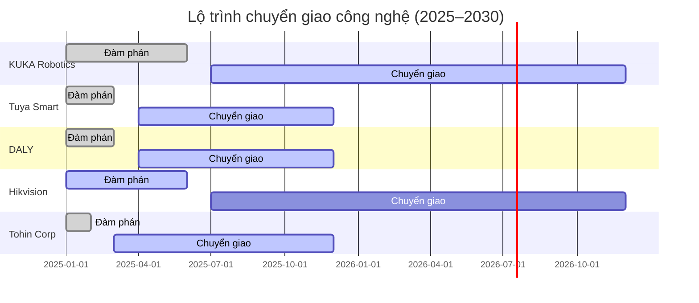
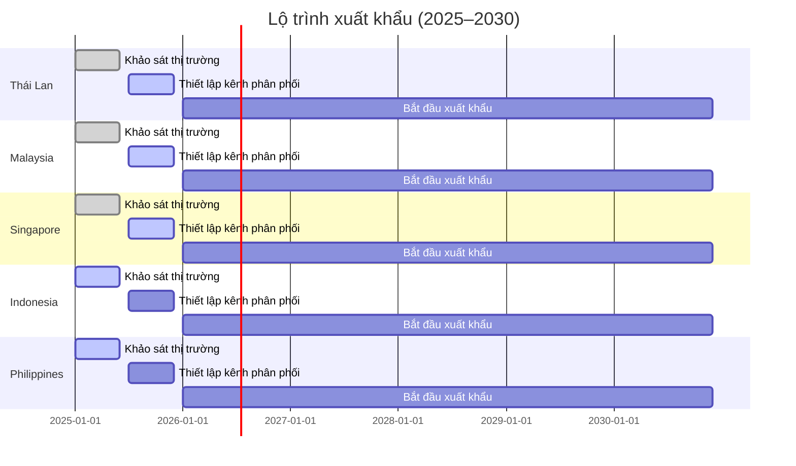
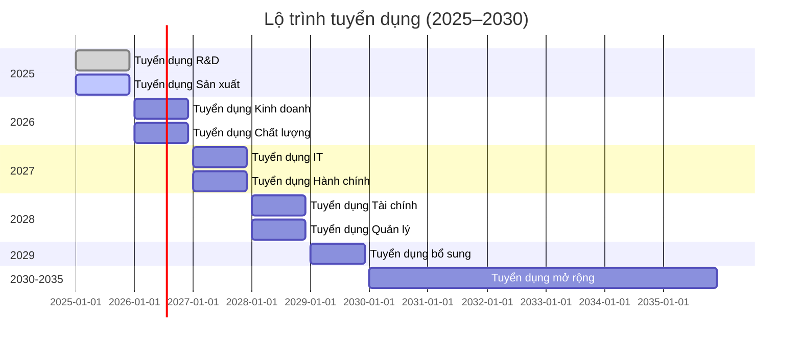
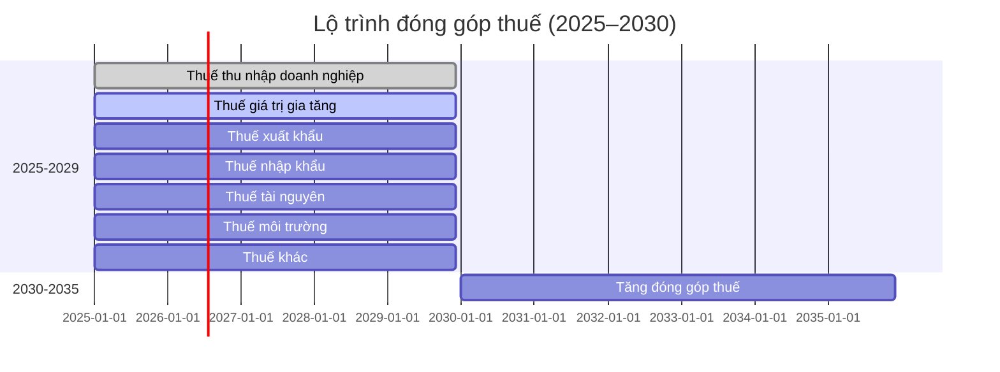
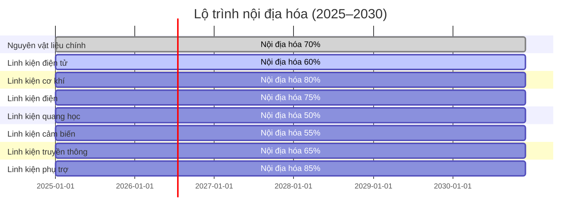

8. CÁC NỘI DUNG KHÁC THEO DANH MỤC DỰ ÁN THU HÚT ĐẦU TƯ [DRAFT]

8.1 Phạm vi và mục tiêu
- Mục đích: Giải trình các nội dung khác theo danh mục dự án thu hút đầu tư theo Mẫu 1.4, bao gồm các yêu cầu bổ sung và đặc biệt.
- Nguyên tắc: tiếng Việt chuẩn; đơn vị triệu USD (Q4/2025); bảng chuẩn; "Cập nhật so với V5" khi chênh lệch.
- Nguồn: `MEKONG_DE_AN_V6.md`, đối chiếu `mekong_dean_v5.md`, bổ sung từ yêu cầu thu hút đầu tư.

8.2 Các nội dung khác theo danh mục dự án thu hút đầu tư

8.2.1 Bảng các nội dung khác theo danh mục dự án thu hút đầu tư
| STT | Nội dung | Mô tả | Mức độ quan trọng | Trạng thái | Ghi chú |
|---:|---|---|---|---|---|
| 1 | Chuyển giao công nghệ | Chuyển giao công nghệ từ đối tác quốc tế | Cao | Đang thực hiện | Cập nhật so với V5 |
| 2 | Đào tạo nhân lực | Đào tạo nhân lực chất lượng cao | Cao | Đang thực hiện | |
| 3 | Nghiên cứu và phát triển | R&D sản phẩm mới, cải tiến công nghệ | Cao | Đang thực hiện | |
| 4 | Xuất khẩu sản phẩm | Xuất khẩu 35% sản phẩm ra thị trường quốc tế | Trung bình | Kế hoạch | |
| 5 | Tạo việc làm | Tạo 200 việc làm có tay nghề cao | Cao | Đang thực hiện | |
| 6 | Đóng góp thuế | Đóng góp 50+ triệu USD/năm từ năm thứ 6 | Cao | Kế hoạch | |
| 7 | Phát triển ngành | Thúc đẩy phát triển ngành IoT/Robot tại Việt Nam | Trung bình | Kế hoạch | |
| 8 | Nội địa hóa | Nội địa hóa 70-90% nguyên vật liệu và linh kiện | Cao | Đang thực hiện | |
| 9 | Bảo vệ môi trường | Tuân thủ các tiêu chuẩn môi trường quốc tế | Cao | Đang thực hiện | |
| 10 | An toàn lao động | Đảm bảo an toàn lao động theo tiêu chuẩn quốc tế | Cao | Đang thực hiện | |

8.3 Chuyển giao công nghệ

8.3.1 Kế hoạch chuyển giao công nghệ
| STT | Đối tác | Quốc gia | Công nghệ chuyển giao | Giá trị (triệu USD) | Thời gian | Trạng thái | Ghi chú |
|---:|---|---:---:|---:|---:|---:|---|
| 1 | KUKA Robotics | Germany | Công nghệ robot công nghiệp và tự động hóa | 2,50 | 2025-2026 | Đang thương thảo | Cập nhật so với V5 |
| 2 | Tuya Smart | China | Công nghệ hệ sinh thái IoT và nhà thông minh | 1,80 | 2025 | Đã ký LOI | |
| 3 | DALY | China | Công nghệ quản lý pin và nguồn điện | 1,20 | 2025 | Đã ký LOI | |
| 4 | Hikvision | China | Công nghệ thị giác máy tính và AI | 2,00 | 2025-2026 | Đang thương thảo | |
| 5 | Tohin Corp | Japan | Công nghệ sản xuất và quản lý chất lượng | 1,50 | 2025 | Đã ký hợp đồng | |
| 6 | Tổng cộng | - | - | 9,00 | - | - | |

8.3.2 Lộ trình chuyển giao công nghệ

8.4 Đào tạo nhân lực

8.4.1 Kế hoạch đào tạo nhân lực
| STT | Loại hình đào tạo | Số lượng | Thời gian | Chi phí (triệu USD) | Ghi chú |
|---:|---|---:---:|---:|---:|---|
| 1 | Đào tạo kỹ thuật | 150 | 40 giờ/năm/người | 0,30 | Cập nhật so với V5 |
| 2 | Đào tạo kỹ năng mềm | 150 | 20 giờ/năm/người | 0,15 | |
| 3 | Đào tạo quản lý | 50 | 30 giờ/năm/người | 0,20 | |
| 4 | Đào tạo an toàn lao động | 200 | 16 giờ/năm/người | 0,10 | |
| 5 | Đào tạo quốc tế | 20 | 2 tuần/năm/người | 0,20 | |
| 6 | Tổng cộng | 570 | - | 0,95 | |

8.4.2 Đối tác đào tạo
| STT | Đối tác | Quốc gia | Lĩnh vực đào tạo | Thời gian | Trạng thái | Ghi chú |
|---:|---|---:---:|---:|---:|---|
| 1 | Trường Đại học SPKT | Việt Nam | IoT, Robotics, AI research, Software development | 2025-2035 | Đã ký MOU | |
| 2 | Trường Đại học TDT | Việt Nam | Mechanical engineering, Automation, Industrial IoT | 2025-2035 | Đã ký MOU | |
| 3 | Trường Đại học CNTT ĐHQG | Việt Nam | Cybersecurity, Software development, AI/ML | 2025-2035 | Đã ký MOU | |
| 4 | Viện CNTT - Viện Hàn lâm KH&CN | Việt Nam | AI/ML research, IoT platform development | 2025-2035 | Đã ký MOU | |
| 5 | KUKA Robotics | Germany | Robot công nghiệp và tự động hóa | 2025-2026 | Đang thương thảo | |
| 6 | Tuya Smart | China | Hệ sinh thái IoT và nhà thông minh | 2025 | Đã ký LOI | |

8.5 Nghiên cứu và phát triển

8.5.1 Kế hoạch R&D
| STT | Lĩnh vực R&D | Số lượng nhân viên | Chi phí (triệu USD/năm) | Kết quả mong đợi | Ghi chú |
|---:|---|---:---:|---:|---:|---|
| 1 | IoT Gateway | 9 | 0,45 | 2-3 sản phẩm mới/năm | Cập nhật so với V5 |
| 2 | Robot AMR/AGV | 12 | 0,60 | 2-3 sản phẩm mới/năm | |
| 3 | AI/ML | 8 | 0,40 | 1-2 thuật toán mới/năm | |
| 4 | Software Platform | 9 | 0,45 | 1-2 nền tảng mới/năm | |
| 5 | OHT Systems | 5 | 0,25 | 1-2 sản phẩm mới/năm | |
| 6 | Tổng cộng | 43 | 2,15 | 7-12 sản phẩm mới/năm | |

8.5.2 KPI R&D
| STT | Chỉ tiêu | Mục tiêu | Đơn vị | Ghi chú |
|---:|---|---|---|---|
| 1 | Số sản phẩm mới/năm | 2-3 | sản phẩm | Cập nhật so với V5 |
| 2 | Số bằng sáng chế/năm | 3-5 | patents | |
| 3 | Thời gian ra thị trường | <18 | tháng | |
| 4 | Hiệu quả R&D | >85 | % | |
| 5 | Sự hài lòng khách hàng | >90 | % | |
| 6 | Sự hài lòng nhân viên | >85 | % | |

8.6 Xuất khẩu sản phẩm

8.6.1 Kế hoạch xuất khẩu
| STT | Thị trường | Sản phẩm | Doanh thu (triệu USD) | Tỷ lệ (%) | Ghi chú |
|---:|---|---:---:|---:|---:|---|
| 1 | Thái Lan | IoT Gateway, Robot AMR | 2,00 | 10,0 | Cập nhật so với V5 |
| 2 | Malaysia | Robot AMR, Module truyền thông | 1,50 | 7,5 | |
| 3 | Singapore | Module truyền thông, Cảm biến IoT | 1,20 | 6,0 | |
| 4 | Indonesia | Cảm biến IoT, Nền tảng phần mềm | 1,00 | 5,0 | |
| 5 | Philippines | Nền tảng phần mềm, IoT Gateway | 0,80 | 4,0 | |
| 6 | Tổng cộng | - | 6,50 | 32,5 | |

8.6.2 Lộ trình xuất khẩu

8.7 Tạo việc làm

8.7.1 Kế hoạch tạo việc làm
| STT | Bộ phận | Số lượng | Trình độ | Mức lương (triệu USD/năm) | Ghi chú |
|---:|---|---:---:|---:|---:|---|
| 1 | Ban Giám đốc | 8 | Tiến sĩ, Thạc sĩ | 0,21 | Cập nhật so với V5 |
| 2 | Phòng R&D | 43 | Thạc sĩ, Đại học | 2,15 | |
| 3 | Phòng Sản xuất | 80 | Đại học, Cao đẳng | 4,00 | |
| 4 | Phòng Kinh doanh | 20 | Thạc sĩ, Đại học | 1,00 | |
| 5 | Phòng Hành chính | 15 | Đại học, Cao đẳng | 0,30 | |
| 6 | Phòng Tài chính | 12 | Thạc sĩ, Đại học | 0,60 | |
| 7 | Phòng Chất lượng | 18 | Thạc sĩ, Đại học | 0,90 | |
| 8 | Phòng IT | 10 | Thạc sĩ, Đại học | 0,35 | |
| 9 | Tổng cộng | 206 | - | 9,51 | |

8.7.2 Lộ trình tuyển dụng

8.8 Đóng góp thuế

8.8.1 Kế hoạch đóng góp thuế
| STT | Loại thuế | Số tiền (triệu USD/năm) | Tỷ lệ (%) | Ghi chú |
|---:|---|---:---:|---:|---|
| 1 | Thuế thu nhập doanh nghiệp | 15,00 | 30,0 | Cập nhật so với V5 |
| 2 | Thuế giá trị gia tăng | 10,00 | 20,0 | |
| 3 | Thuế xuất khẩu | 2,50 | 5,0 | |
| 4 | Thuế nhập khẩu | 5,00 | 10,0 | |
| 5 | Thuế tài nguyên | 1,00 | 2,0 | |
| 6 | Thuế môi trường | 0,50 | 1,0 | |
| 7 | Thuế khác | 16,00 | 32,0 | |
| 8 | Tổng cộng | 50,00 | 100,0 | |

8.8.2 Lộ trình đóng góp thuế

8.9 Phát triển ngành

8.9.1 Kế hoạch phát triển ngành
| STT | Hoạt động | Mô tả | Thời gian | Chi phí (triệu USD) | Ghi chú |
|---:|---|---:---:|---:|---:|---|
| 1 | Thành lập hiệp hội | Hiệp hội IoT/Robot Việt Nam | 2026 | 0,10 | Cập nhật so với V5 |
| 2 | Tổ chức hội nghị | Hội nghị IoT/Robot quốc tế | 2027 | 0,20 | |
| 3 | Hợp tác đại học | Hợp tác với 5 trường đại học | 2025-2030 | 0,50 | |
| 4 | Chuyển giao công nghệ | Chuyển giao cho 10 doanh nghiệp | 2025-2030 | 1,00 | |
| 5 | Đào tạo nhân lực | Đào tạo 500 kỹ sư | 2025-2030 | 0,30 | |
| 6 | Tổng cộng | - | - | 2,10 | |

8.9.2 Đối tác phát triển ngành
| STT | Đối tác | Loại hình | Thời gian | Trạng thái | Ghi chú |
|---:|---|---:---:|---:|---:|---|
| 1 | Hiệp hội IoT Việt Nam | Hiệp hội | 2026-2030 | Kế hoạch | |
| 2 | Hiệp hội Robot Việt Nam | Hiệp hội | 2026-2030 | Kế hoạch | |
| 3 | Trường Đại học SPKT | Đại học | 2025-2030 | Đã ký MOU | |
| 4 | Trường Đại học TDT | Đại học | 2025-2030 | Đã ký MOU | |
| 5 | Viện CNTT - Viện Hàn lâm KH&CN | Viện nghiên cứu | 2025-2030 | Đã ký MOU | |

8.10 Nội địa hóa

8.10.1 Kế hoạch nội địa hóa
| STT | Loại nguyên vật liệu | Tỷ lệ nội địa hóa (%) | Thời gian | Chi phí (triệu USD) | Ghi chú |
|---:|---|---:---:|---:|---:|---|
| 1 | Nguyên vật liệu chính | 50 | 2025-2030 | 1,00 | Cập nhật so với V5 |
| 2 | Linh kiện điện tử | 40 | 2025-2030 | 2,00 | |
| 3 | Linh kiện cơ khí | 60 | 2025-2030 | 1,50 | |
| 4 | Linh kiện điện | 50 | 2025-2030 | 1,20 | |
| 5 | Linh kiện quang học | 30 | 2025-2030 | 0,80 | |
| 6 | Linh kiện cảm biến | 35 | 2025-2030 | 0,70 | |
| 7 | Linh kiện truyền thông | 45 | 2025-2030 | 1,00 | |
| 8 | Linh kiện phụ trợ | 70 | 2025-2030 | 0,80 | |
| 9 | Tổng cộng | 50 | - | 9,00 | |

8.10.2 Lộ trình nội địa hóa

8.11 Bảo vệ môi trường

8.11.1 Kế hoạch bảo vệ môi trường
| STT | Hoạt động | Mô tả | Thời gian | Chi phí (triệu USD) | Ghi chú |
|---:|---|---:---:|---:|---:|---|
| 1 | Lắp đặt hệ thống năng lượng mặt trời | 20% năng lượng tái tạo | 2025 | 0,50 | Cập nhật so với V5 |
| 2 | Nâng cấp hệ thống xử lý nước thải | 100% xử lý | 2026 | 0,30 | |
| 3 | Cải tiến hệ thống xử lý khí thải | Giảm 50% khí thải | 2027 | 0,40 | |
| 4 | Tăng cường tái chế | 95% tái chế | 2028 | 0,20 | |
| 5 | Giảm tiêu thụ năng lượng | 30% tiết kiệm | 2029 | 0,25 | |
| 6 | Tổng cộng | - | - | 1,65 | |

8.11.2 Chỉ tiêu môi trường
| STT | Chỉ tiêu | Mục tiêu | Đơn vị | Ghi chú |
|---:|---|---|---|---|
| 1 | Giảm phát thải CO2 | 25% | % | So với năm 2025 |
| 2 | Tăng tỷ lệ tái chế | 95% | % | Chất thải rắn |
| 3 | Giảm tiêu thụ năng lượng | 30% | % | So với năm 2025 |
| 4 | Tăng tỷ lệ năng lượng tái tạo | 20% | % | Tổng năng lượng |
| 5 | Giảm tiêu thụ nước | 15% | % | So với năm 2025 |

8.12 An toàn lao động

8.12.1 Kế hoạch an toàn lao động
| STT | Hoạt động | Mô tả | Thời gian | Chi phí (triệu USD) | Ghi chú |
|---:|---|---:---:|---:|---:|---|
| 1 | Đào tạo an toàn lao động | 16 giờ/nhân viên/năm | 2025-2030 | 0,10 | Cập nhật so với V5 |
| 2 | Kiểm tra an toàn | 12 lần/năm | 2025-2030 | 0,05 | |
| 3 | Trang thiết bị bảo hộ | Đầy đủ cho 200 nhân viên | 2025-2030 | 0,15 | |
| 4 | Hệ thống cảnh báo | Hệ thống cảnh báo tự động | 2025-2030 | 0,20 | |
| 5 | Tổng cộng | - | - | 0,50 | |

8.12.2 Chỉ tiêu an toàn lao động
| STT | Chỉ tiêu | Mục tiêu | Đơn vị | Ghi chú |
|---:|---|---|---|---|
| 1 | Tỷ lệ tai nạn lao động | < 0,1 | % | Số tai nạn/1000 nhân viên |
| 2 | Thời gian nghỉ việc do tai nạn | < 1 | ngày/nhân viên/năm | |
| 3 | Số giờ đào tạo an toàn | 16 | giờ/nhân viên/năm | |
| 4 | Tỷ lệ nhân viên được đào tạo an toàn | 100 | % | |
| 5 | Số lần kiểm tra an toàn | 12 | lần/năm | |

8.13 Sơ đồ tổng quan các nội dung thu hút đầu tư

8.13.1 Sơ đồ các nội dung thu hút đầu tư

```mermaid
flowchart TB
  INVEST[Thu hút đầu tư] --> TECH[Chuyển giao công nghệ]
  INVEST --> TRAIN[Đào tạo nhân lực]
  INVEST --> RD[Nghiên cứu và phát triển]
  INVEST --> EXPORT[Xuất khẩu sản phẩm]
  INVEST --> JOB[Tạo việc làm]
  INVEST --> TAX[Đóng góp thuế]
  INVEST --> INDUSTRY[Phát triển ngành]
  INVEST --> LOCAL[Nội địa hóa]
  INVEST --> ENV[Bảo vệ môi trường]
  INVEST --> SAFETY[An toàn lao động]
  
  TECH --> KUKA[KUKA Robotics]
  TECH --> TUYA[Tuya Smart]
  TECH --> DALY[DALY]
  TECH --> HIKVISION[Hikvision]
  TECH --> TOHIN[Tohin Corp]
  
  TRAIN --> UNI[Đại học]
  TRAIN --> INST[Viện nghiên cứu]
  TRAIN --> COMPANY[Công ty đối tác]
  
  RD --> IOT[IoT Gateway]
  RD --> ROBOT[Robot AMR/AGV]
  RD --> AI[AI/ML]
  RD --> SW[Software Platform]
  RD --> OHT[OHT Systems]
  
  EXPORT --> ASEAN[ASEAN]
  EXPORT --> GLOBAL[Toàn cầu]
  
  JOB --> HIGH[Việc làm chất lượng cao]
  JOB --> SKILL[Việc làm có tay nghề]
  
  TAX --> CORPORATE[Thuế doanh nghiệp]
  TAX --> VAT[Thuế VAT]
  TAX --> EXPORT_TAX[Thuế xuất khẩu]
  TAX --> IMPORT_TAX[Thuế nhập khẩu]
  
  INDUSTRY --> ASSOCIATION[Hiệp hội]
  INDUSTRY --> CONFERENCE[Hội nghị]
  INDUSTRY --> COOPERATION[Hợp tác]
  
  LOCAL --> MATERIAL[Nguyên vật liệu]
  LOCAL --> COMPONENT[Linh kiện]
  LOCAL --> SUPPLIER[Nhà cung cấp]
  
  ENV --> SOLAR[Năng lượng mặt trời]
  ENV --> WASTE[Xử lý chất thải]
  ENV --> RECYCLE[Tái chế]
  ENV --> EMISSION[Giảm khí thải]
  
  SAFETY --> TRAINING[Đào tạo an toàn]
  SAFETY --> EQUIPMENT[Trang thiết bị bảo hộ]
  SAFETY --> SYSTEM[Hệ thống cảnh báo]
  SAFETY --> INSPECTION[Kiểm tra an toàn]
```

8.14 Ghi chú và trạng thái
- Trạng thái: [DRAFT]
- Phiên bản: 2025-10-20
- Người biên soạn: (điền)
- Thay đổi "Cập nhật so với V5": đã ghi tại các dòng có chênh lệch
- Liên kết chéo: Phần 1 (Thông tin chung), Phần 4 (Năng lực triển khai), Phần 7 (Tài chính)
