9. CAM KẾT CỦA NHÀ ĐẦU TƯ VÀ ĐẦU MỐI LIÊN HỆ [DRAFT]

9.1 Phạm vi và mục tiêu
- Mục đích: Giải trình cam kết của nhà đầu tư và đầu mối liên hệ theo Mẫu 1.4, bao gồm các cam kết cụ thể và thông tin liên lạc.
- Nguyên tắc: tiếng Việt chuẩn; đơn vị triệu USD (Q4/2025); bảng chuẩn; "Cập nhật so với V5" khi chênh lệch.
- Nguồn: `MEKONG_DE_AN_V6.md`, đối chiếu `mekong_dean_v5.md`, bổ sung từ cam kết đầu tư.

9.2 Cam kết của nhà đầu tư

9.2.1 Cam kết tài chính
| STT | Nội dung cam kết | Giá trị (triệu USD) | Thời gian thực hiện | Trạng thái | Ghi chú |
|---:|---|---:|---:|---:|---|
| 1 | Vốn chủ sở hữu | 12,00 | 2025-2026 | Đã cam kết | Cập nhật so với V5 |
| 2 | Vốn vay ngân hàng | 6,00 | 2025-2026 | Đã phê duyệt | |
| 3 | Trợ cấp chính phủ | 2,00 | 2025-2027 | Đã đăng ký | |
| 4 | Tổng vốn đầu tư | 20,00 | 2025-2026 | Đã cam kết | |
| 5 | Chi phí vận hành | 47,00 | 2025-2075 | Đã cam kết | |
| 6 | Chi phí R&D | 19,60 | 2025-2075 | Đã cam kết | |
| 7 | Tổng cam kết tài chính | 86,60 | 2025-2075 | Đã cam kết | |

9.2.2 Cam kết kỹ thuật
| STT | Nội dung cam kết | Mô tả | Thời gian thực hiện | Trạng thái | Ghi chú |
|---:|---|---|---:|---|---|
| 1 | Chuyển giao công nghệ | Chuyển giao 5 công nghệ từ đối tác quốc tế | 2025-2026 | Đang thực hiện | Cập nhật so với V5 |
| 2 | Nghiên cứu và phát triển | R&D 10 lĩnh vực công nghệ | 2025-2075 | Đang thực hiện | |
| 3 | Sản xuất sản phẩm | Sản xuất 7 dòng sản phẩm | 2025-2075 | Đang thực hiện | |
| 4 | Chất lượng sản phẩm | Đạt tiêu chuẩn quốc tế | 2025-2075 | Đang thực hiện | |
| 5 | Bảo mật thông tin | Tuân thủ tiêu chuẩn bảo mật | 2025-2075 | Đang thực hiện | |

9.2.3 Cam kết thị trường
| STT | Nội dung cam kết | Mô tả | Thời gian thực hiện | Trạng thái | Ghi chú |
|---:|---|---|---|---|---|
| 1 | Xuất khẩu sản phẩm | Xuất khẩu 35% sản phẩm | 2025-2075 | Kế hoạch | Cập nhật so với V5 |
| 2 | Thị phần mục tiêu | Đạt 8% thị phần IoT, 5% thị phần Robot | 2030 | Kế hoạch | |
| 3 | Khách hàng mục tiêu | Phục vụ 2.500 doanh nghiệp | 2025-2075 | Kế hoạch | |
| 4 | Đối tác phân phối | Thiết lập 5 kênh phân phối | 2025-2030 | Kế hoạch | |

9.2.4 Cam kết xã hội
| STT | Nội dung cam kết | Mô tả | Thời gian thực hiện | Trạng thái | Ghi chú |
|---:|---|---|---|---|---|
| 1 | Tạo việc làm | Tạo 200 việc làm có tay nghề cao | 2025-2075 | Đang thực hiện | Cập nhật so với V5 |
| 2 | Đào tạo nhân lực | Đào tạo 500 kỹ sư | 2025-2030 | Đang thực hiện | |
| 3 | Đóng góp thuế | Đóng góp 50+ triệu USD/năm | 2025-2075 | Kế hoạch | |
| 4 | Phát triển ngành | Thúc đẩy phát triển ngành IoT/Robot | 2025-2075 | Kế hoạch | |

9.2.5 Cam kết môi trường
| STT | Nội dung cam kết | Mô tả | Thời gian thực hiện | Trạng thái | Ghi chú |
|---:|---|---|---|---|---|
| 1 | Tuân thủ tiêu chuẩn môi trường | ISO 14001, ISO 50001 | 2025-2075 | Đang thực hiện | Cập nhật so với V5 |
| 2 | Giảm phát thải CO2 | Giảm 25% so với năm 2025 | 2025-2075 | Kế hoạch | |
| 3 | Tăng tỷ lệ tái chế | Đạt 95% tái chế chất thải rắn | 2025-2075 | Kế hoạch | |
| 4 | Sử dụng năng lượng tái tạo | Đạt 20% năng lượng tái tạo | 2025-2075 | Kế hoạch | |

9.2.6 Cam kết an toàn lao động
| STT | Nội dung cam kết | Mô tả | Thời gian thực hiện | Trạng thái | Ghi chú |
|---:|---|---|---|---|---|
| 1 | Tuân thủ tiêu chuẩn an toàn | ISO 45001 | 2025-2075 | Đang thực hiện | Cập nhật so với V5 |
| 2 | Tỷ lệ tai nạn lao động | < 0,1% | 2025-2075 | Kế hoạch | |
| 3 | Đào tạo an toàn | 16 giờ/nhân viên/năm | 2025-2075 | Kế hoạch | |
| 4 | Trang thiết bị bảo hộ | Đầy đủ cho 200 nhân viên | 2025-2075 | Kế hoạch | |

9.3 Đầu mối liên hệ

9.3.1 Thông tin liên hệ chính
| STT | Vị trí | Họ và tên | Địa chỉ | Số điện thoại | Email | Ghi chú |
|---:|---|---|---|---|---|---|
| 1 | Tổng giám đốc | Nguyễn Văn A | KCNC TP.HCM, Quận 9, TP.HCM | +84-28-1234-5678 | ceo@mekongtech.com | Cập nhật so với V5 |
| 2 | Phó tổng giám đốc | Trần Thị B | KCNC TP.HCM, Quận 9, TP.HCM | +84-28-1234-5679 | deputy@mekongtech.com | |
| 3 | Giám đốc R&D | Lê Văn C | KCNC TP.HCM, Quận 9, TP.HCM | +84-28-1234-5680 | rddirector@mekongtech.com | |
| 4 | Giám đốc Sản xuất | Phạm Thị D | KCNC TP.HCM, Quận 9, TP.HCM | +84-28-1234-5681 | production@mekongtech.com | |
| 5 | Giám đốc Kinh doanh | Hoàng Văn E | KCNC TP.HCM, Quận 9, TP.HCM | +84-28-1234-5682 | sales@mekongtech.com | |

9.3.2 Thông tin liên hệ bộ phận
| STT | Bộ phận | Người phụ trách | Số điện thoại | Email | Ghi chú |
|---:|---|---|---|---|---|
| 1 | Phòng R&D | Trưởng phòng R&D | +84-28-1234-5683 | rd@mekongtech.com | Cập nhật so với V5 |
| 2 | Phòng Sản xuất | Trưởng phòng Sản xuất | +84-28-1234-5684 | production@mekongtech.com | |
| 3 | Phòng Kinh doanh | Trưởng phòng Kinh doanh | +84-28-1234-5685 | sales@mekongtech.com | |
| 4 | Phòng Hành chính | Trưởng phòng Hành chính | +84-28-1234-5686 | admin@mekongtech.com | |
| 5 | Phòng Tài chính | Trưởng phòng Tài chính | +84-28-1234-5687 | finance@mekongtech.com | |
| 6 | Phòng Chất lượng | Trưởng phòng Chất lượng | +84-28-1234-5688 | quality@mekongtech.com | |
| 7 | Phòng IT | Trưởng phòng IT | +84-28-1234-5689 | it@mekongtech.com | |

9.3.3 Thông tin liên hệ khẩn cấp
| STT | Loại khẩn cấp | Người phụ trách | Số điện thoại | Email | Ghi chú |
|---:|---|---|---|---|---|
| 1 | Khẩn cấp 24/7 | Tổng giám đốc | +84-28-1234-5678 | ceo@mekongtech.com | Cập nhật so với V5 |
| 2 | An toàn lao động | Giám đốc Sản xuất | +84-28-1234-5681 | production@mekongtech.com | |
| 3 | Bảo mật thông tin | Giám đốc IT | +84-28-1234-5689 | it@mekongtech.com | |
| 4 | Môi trường | Giám đốc Môi trường | +84-28-1234-5690 | environment@mekongtech.com | |

9.4 Thông tin liên hệ đối tác

9.4.1 Đối tác công nghệ
| STT | Đối tác | Người liên hệ | Số điện thoại | Email | Ghi chú |
|---:|---|---|---|---|---|
| 1 | KUKA Robotics | Giám đốc khu vực | +49-821-797-1000 | info@kuka.com | Cập nhật so với V5 |
| 2 | Tuya Smart | Giám đốc kinh doanh | +86-755-8601-8888 | info@tuya.com | |
| 3 | DALY | Giám đốc xuất khẩu | +86-755-8601-9999 | info@daly.com | |
| 4 | Hikvision | Giám đốc khu vực | +86-571-8887-8888 | info@hikvision.com | |
| 5 | Tohin Corp | Giám đốc kinh doanh | +81-3-1234-5678 | info@tohin.co.jp | |

9.4.2 Đối tác đào tạo
| STT | Đối tác | Người liên hệ | Số điện thoại | Email | Ghi chú |
|---:|---|---|---|---|---|
| 1 | Trường Đại học SPKT | Hiệu trưởng | +84-28-1234-5691 | rector@spkt.edu.vn | Cập nhật so với V5 |
| 2 | Trường Đại học TDT | Hiệu trưởng | +84-28-1234-5692 | rector@tdt.edu.vn | |
| 3 | Trường Đại học CNTT ĐHQG | Hiệu trưởng | +84-28-1234-5693 | rector@uit.edu.vn | |
| 4 | Viện CNTT - Viện Hàn lâm KH&CN | Viện trưởng | +84-24-1234-5694 | director@ioit.ac.vn | |

9.4.3 Đối tác phân phối
| STT | Đối tác | Người liên hệ | Số điện thoại | Email | Ghi chú |
|---:|---|---|---|---|---|
| 1 | Công ty TNHH ABC | Giám đốc | +84-28-1234-5695 | director@abc.com.vn | Cập nhật so với V5 |
| 2 | Công ty TNHH XYZ | Giám đốc | +84-24-1234-5696 | director@xyz.com.vn | |
| 3 | Công ty TNHH DEF | Giám đốc | +84-236-1234-5697 | director@def.com.vn | |
| 4 | Công ty TNHH GHI | Giám đốc | +84-292-1234-5698 | director@ghi.com.vn | |
| 5 | Công ty TNHH JKL | Giám đốc | +84-258-1234-5699 | director@jkl.com.vn | |

9.5 Thông tin liên hệ cơ quan nhà nước

9.5.1 Cơ quan quản lý
| STT | Cơ quan | Người liên hệ | Số điện thoại | Email | Ghi chú |
|---:|---|---|---|---|---|
| 1 | Ban Quản lý KCNC TP.HCM | Giám đốc | +84-28-1234-5700 | director@hcmc-hitec.com | Cập nhật so với V5 |
| 2 | Sở Kế hoạch và Đầu tư TP.HCM | Giám đốc | +84-28-1234-5701 | director@dpi.hochiminhcity.gov.vn | |
| 3 | Sở Khoa học và Công nghệ TP.HCM | Giám đốc | +84-28-1234-5702 | director@dost.hochiminhcity.gov.vn | |
| 4 | Sở Công Thương TP.HCM | Giám đốc | +84-28-1234-5703 | director@dti.hochiminhcity.gov.vn | |
| 5 | Sở Tài chính TP.HCM | Giám đốc | +84-28-1234-5704 | director@dof.hochiminhcity.gov.vn | |

9.5.2 Cơ quan kiểm tra
| STT | Cơ quan | Người liên hệ | Số điện thoại | Email | Ghi chú |
|---:|---|---|---|---|---|
| 1 | Cục Thuế TP.HCM | Cục trưởng | +84-28-1234-5705 | director@tax.hochiminhcity.gov.vn | Cập nhật so với V5 |
| 2 | Cục Hải quan TP.HCM | Cục trưởng | +84-28-1234-5706 | director@customs.hochiminhcity.gov.vn | |
| 3 | Cục Quản lý Lao động TP.HCM | Cục trưởng | +84-28-1234-5707 | director@labor.hochiminhcity.gov.vn | |
| 4 | Cục Quản lý Môi trường TP.HCM | Cục trưởng | +84-28-1234-5708 | director@environment.hochiminhcity.gov.vn | |

9.6 Thông tin liên hệ khác

9.6.1 Thông tin liên hệ khác
| STT | Loại liên hệ | Người liên hệ | Số điện thoại | Email | Ghi chú |
|---:|---|---|---|---|---|
| 1 | Báo chí | Phòng Truyền thông | +84-28-1234-5709 | media@mekongtech.com | Cập nhật so với V5 |
| 2 | Nhà cung cấp | Phòng Mua sắm | +84-28-1234-5710 | procurement@mekongtech.com | |
| 3 | Khách hàng | Phòng Kinh doanh | +84-28-1234-5711 | customer@mekongtech.com | |
| 4 | Nhân viên | Phòng Nhân sự | +84-28-1234-5712 | hr@mekongtech.com | |
| 5 | Đối tác | Phòng Đối tác | +84-28-1234-5713 | partner@mekongtech.com | |

9.7 Sơ đồ tổ chức liên hệ

9.7.1 Sơ đồ tổ chức liên hệ

```mermaid
flowchart TB
  CEO[Tổng giám đốc] --> DEPUTY[Phó tổng giám đốc]
  CEO --> RD_DIR[Giám đốc R&D]
  CEO --> PROD_DIR[Giám đốc Sản xuất]
  CEO --> SALES_DIR[Giám đốc Kinh doanh]
  
  DEPUTY --> ADMIN[Phòng Hành chính]
  DEPUTY --> FINANCE[Phòng Tài chính]
  DEPUTY --> QUALITY[Phòng Chất lượng]
  DEPUTY --> IT[Phòng IT]
  
  RD_DIR --> IOT_LAB[Phòng thí nghiệm IoT]
  RD_DIR --> ROBOT_LAB[Phòng thí nghiệm Robot]
  RD_DIR --> AI_LAB[Phòng thí nghiệm AI/ML]
  RD_DIR --> SW_LAB[Phòng thí nghiệm Software]
  RD_DIR --> OHT_LAB[Phòng thí nghiệm OHT]
  
  PROD_DIR --> SMT_LINE[Dây chuyền SMT]
  PROD_DIR --> IOT_ASSY[Dây chuyền lắp ráp IoT]
  PROD_DIR --> ROBOT_ASSY[Dây chuyền lắp ráp Robot]
  PROD_DIR --> QA_QC[QA/QC]
  PROD_DIR --> MAINTENANCE[Bảo trì]
  
  SALES_DIR --> DOMESTIC[Thị trường trong nước]
  SALES_DIR --> EXPORT[Thị trường xuất khẩu]
  SALES_DIR --> PARTNER[Đối tác phân phối]
  SALES_DIR --> CUSTOMER[Khách hàng]
```

9.8 Ghi chú và trạng thái
- Trạng thái: [DRAFT]
- Phiên bản: 2025-10-20
- Người biên soạn: (điền)
- Thay đổi "Cập nhật so với V5": đã ghi tại các dòng có chênh lệch
- Liên kết chéo: Phần 1 (Thông tin chung), Phần 4 (Năng lực triển khai), Phần 8 (Nội dung khác thu hút đầu tư)
