11. BIỂU ĐỒ, BẢNG, SƠ ĐỒ (PHỤ LỤC) [DRAFT]

11.1 Phạm vi và mục tiêu
- Mục đích: Tổng hợp các biểu đồ, bảng, sơ đồ phụ lục theo Mẫu 1.4, bao gồm Mermaid diagrams và tài liệu bổ sung.
- Nguyên tắc: tiếng Việt chuẩn; đơn vị triệu USD (Q4/2025); sơ đồ Mermaid; "Cập nhật so với V5" khi chênh lệch.
- Nguồn: `MEKONG_DE_AN_V6.md`, đối chiếu `mekong_dean_v5.md`, bổ sung từ yêu cầu trình bày.

11.2 Sơ đồ tổ chức dự án

11.2.1 Sơ đồ tổ chức R&D
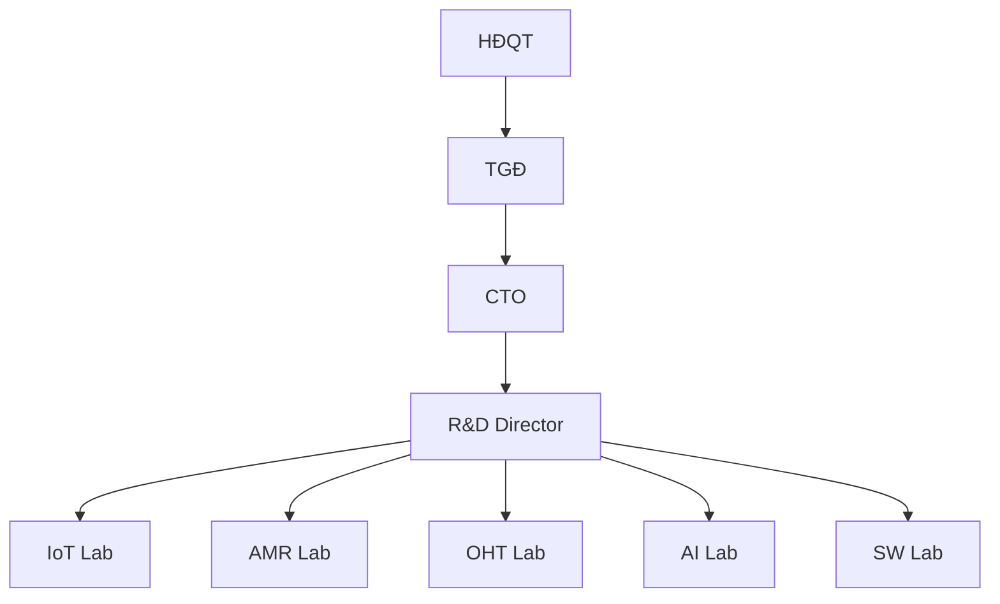

11.2.2 Sơ đồ quy trình ra quyết định
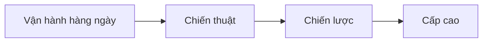

11.2.3 Sơ đồ tổ chức sản xuất
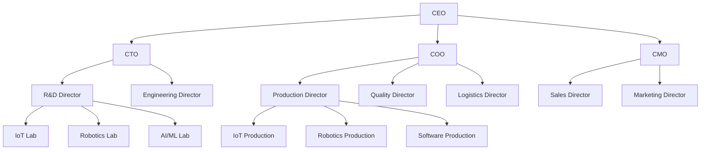

11.3 Sơ đồ quy trình sản xuất

11.3.1 Sơ đồ quy trình sản xuất tổng thể
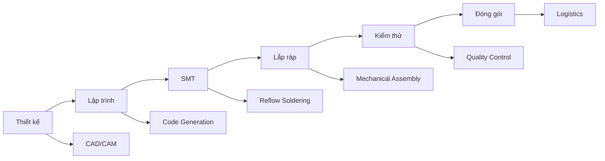

11.3.2 Sơ đồ quy trình AOI/ICT/Burn-in
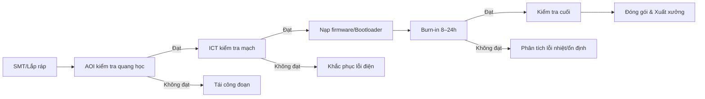

11.3.3 Sơ đồ quy trình R&D
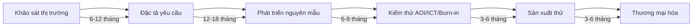

11.4 Sơ đồ lộ trình sản phẩm

11.4.1 Lộ trình sản phẩm (Gantt)
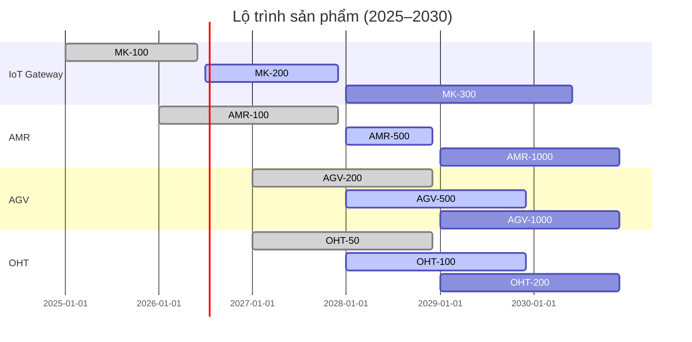

11.4.2 Lộ trình chuyển giao công nghệ (Gantt)
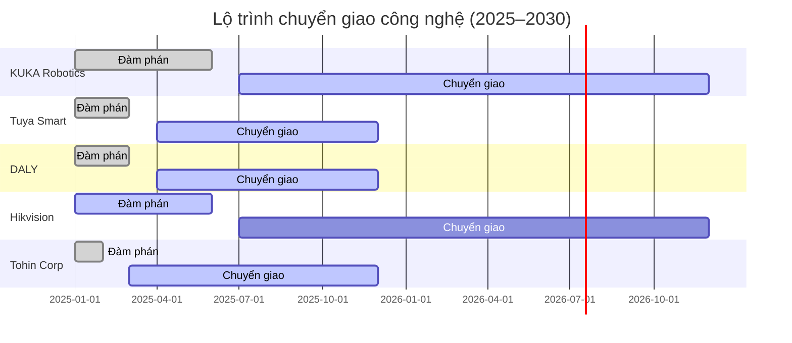

11.4.3 Lộ trình xuất khẩu (Gantt)
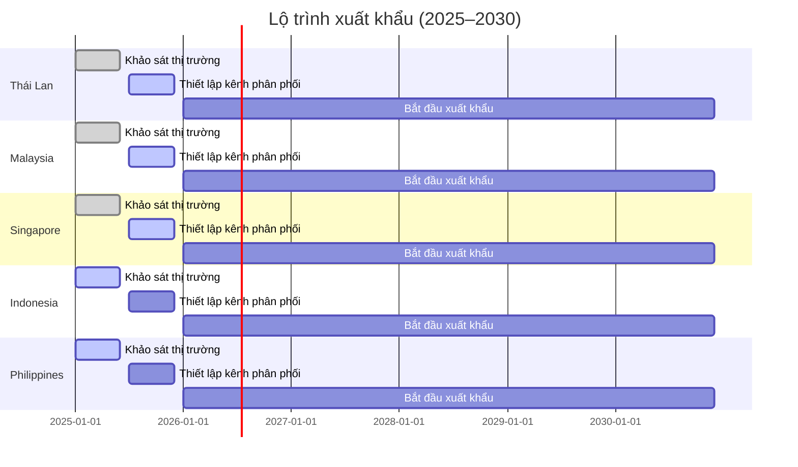

11.4.4 Lộ trình tuyển dụng (Gantt)
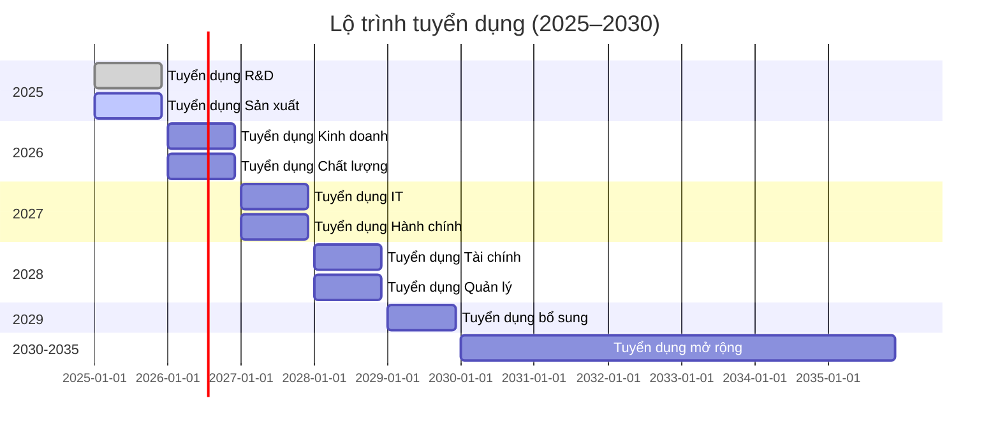

11.4.5 Lộ trình đóng góp thuế (Gantt)
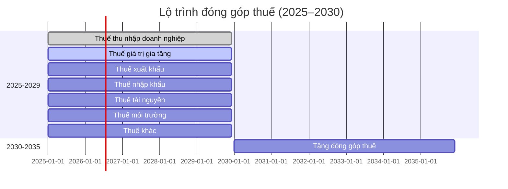

11.4.6 Lộ trình nội địa hóa (Gantt)
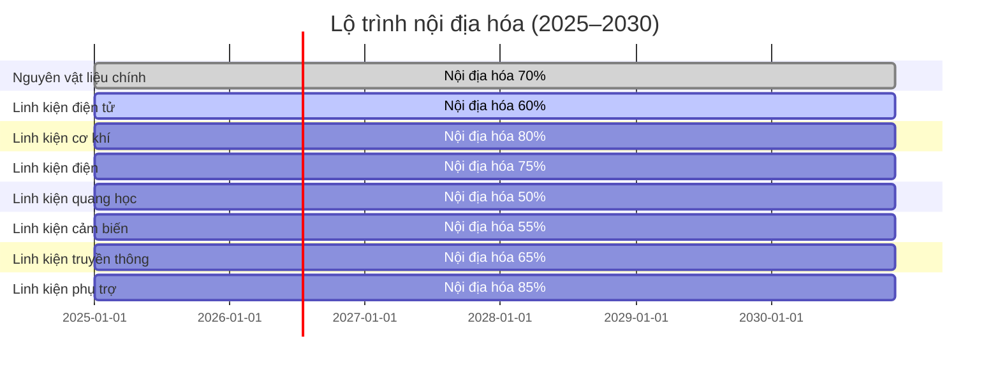

11.5 Sơ đồ phân tích thị trường

11.5.1 Sơ đồ phân tích thị trường
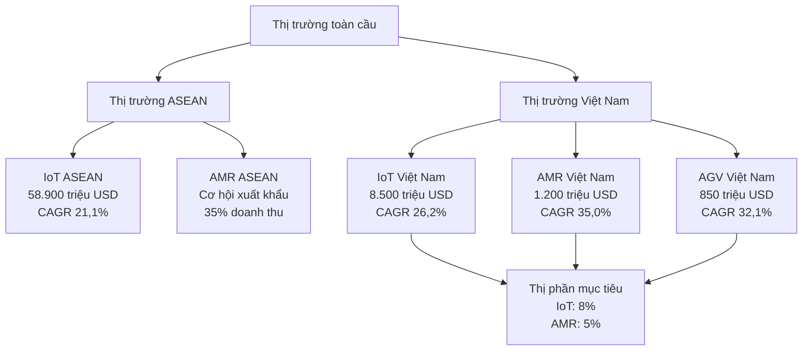

11.5.2 Sơ đồ phân loại sản phẩm
```mermaid
flowchart TB
  PROD[Sản phẩm Mekong] --> IOT[IoT Gateway]
  PROD --> ROBOT[Robot AMR/AGV]
  PROD --> OHT[OHT Systems]
  PROD --> MODULE[Module truyền thông]
  PROD --> SENSOR[Cảm biến IoT]
  PROD --> SW[Nền tảng phần mềm]
  
  IOT --> MK100[MK-100 Basic]
  IOT --> MK200[MK-200 Pro]
  IOT --> MK300[MK-300 Enterprise]
  
  ROBOT --> AMR100[AMR-100]
  ROBOT --> AMR500[AMR-500]
  ROBOT --> AGV200[AGV-200]
  ROBOT --> AGV500[AGV-500]
  
  OHT --> OHT50[OHT-50]
  OHT --> OHT100[OHT-100]
  OHT --> OHT200[OHT-200]
  
  MODULE --> RS485[RS485 to Ethernet]
  MODULE --> MODBUS[Modbus RTU to TCP]
  MODULE --> PROFINET[Profinet to Ethernet]
  MODULE --> CAN[CAN bus to Ethernet]
  
  SENSOR --> ENV[Cảm biến môi trường]
  SENSOR --> IND[Cảm biến công nghiệp]
  SENSOR --> SMART[Cảm biến thông minh]
  
  SW --> ERP[Mekong ERP]
  SW --> MES[Mekong MES]
  SW --> WMS[Mekong WMS]
  SW --> IOTPLAT[Mekong IoT Platform]
```

11.6 Sơ đồ năng lực triển khai

11.6.1 Sơ đồ năng lực tổng thể
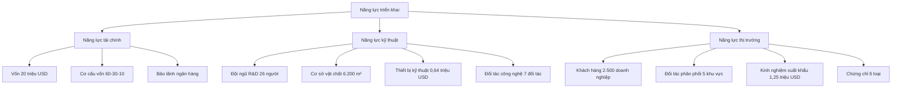

11.6.2 Sơ đồ tổng quan công nghệ
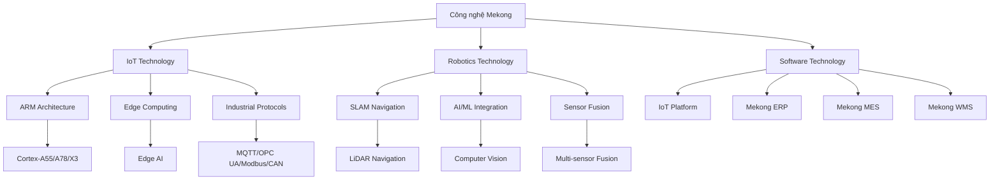

11.7 Sơ đồ chuỗi cung ứng

11.7.1 Sơ đồ chuỗi cung ứng tổng thể
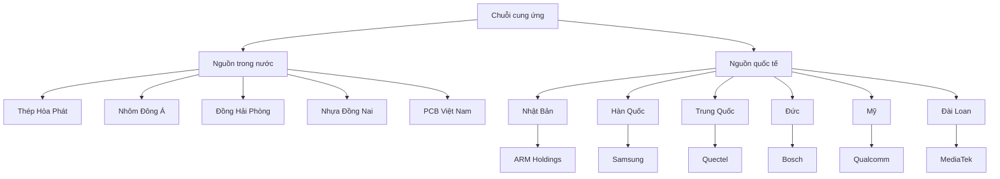

11.7.2 Sơ đồ quy trình mua sắm
```mermaid
flowchart LR
  PLAN[Lập kế hoạch] --> SOURCE[Tìm nguồn cung] --> NEGOTIATE[Đàm phán] --> ORDER[Đặt hàng] --> RECEIVE[Nhận hàng] --> INSPECT[Kiểm tra] --> STORE[Lưu kho] --> USE[Sử dụng]
  
  PLAN --> |"Dự báo nhu cầu"| SOURCE
  SOURCE --> |"Đánh giá nhà cung cấp"| NEGOTIATE
  NEGOTIATE --> |"Thỏa thuận giá cả"| ORDER
  ORDER --> |"Theo dõi giao hàng"| RECEIVE
  RECEIVE --> |"Kiểm tra chất lượng"| INSPECT
  INSPECT --> |"Lưu trữ an toàn"| STORE
  STORE --> |"Phát hàng sản xuất"| USE
```

11.8 Sơ đồ bố trí máy móc thiết bị

11.8.1 Sơ đồ tổng quan bố trí thiết bị
```mermaid
flowchart TB
  FACTORY[Nhà máy Mekong] --> IOT_AREA[Khu vực IoT Gateway]
  FACTORY --> ROBOT_AREA[Khu vực Robot AMR/AGV]
  FACTORY --> OHT_AREA[Khu vực OHT]
  FACTORY --> RD_AREA[Khu vực R&D]
  FACTORY --> IT_AREA[Khu vực IT]
  
  IOT_AREA --> SMT1[SMT Line 1]
  IOT_AREA --> SMT2[SMT Line 2]
  IOT_AREA --> REFLOW[Lò hàn lạnh]
  IOT_AREA --> ASSY[Dây chuyền lắp ráp]
  IOT_AREA --> TEST[Thiết bị kiểm tra]
  
  ROBOT_AREA --> WELD[Trạm hàn khung]
  ROBOT_AREA --> DRIVE[Trạm lắp ráp truyền động]
  ROBOT_AREA --> ELECTRONICS[Trạm tích hợp điện tử]
  ROBOT_AREA --> SENSOR[Trạm tích hợp cảm biến]
  ROBOT_AREA --> FINAL[Trạm kiểm tra cuối]
  
  OHT_AREA --> RAIL[Khung rail]
  OHT_AREA --> HOIST[Hệ thống nâng]
  OHT_AREA --> CONTROL[Hệ thống điều khiển]
  
  RD_AREA --> LAB1[Phòng thí nghiệm IoT]
  RD_AREA --> LAB2[Phòng thí nghiệm Robotics]
  RD_AREA --> LAB3[Phòng thí nghiệm AI/ML]
  
  IT_AREA --> ERP_SYS[Hệ thống ERP]
  IT_AREA --> MES_SYS[Hệ thống MES]
  IT_AREA --> WMS_SYS[Hệ thống WMS]
  IT_AREA --> IOT_SYS[Hệ thống IoT Platform]
```

11.9 Sơ đồ tổ chức nhân sự

11.9.1 Sơ đồ tổ chức R&D
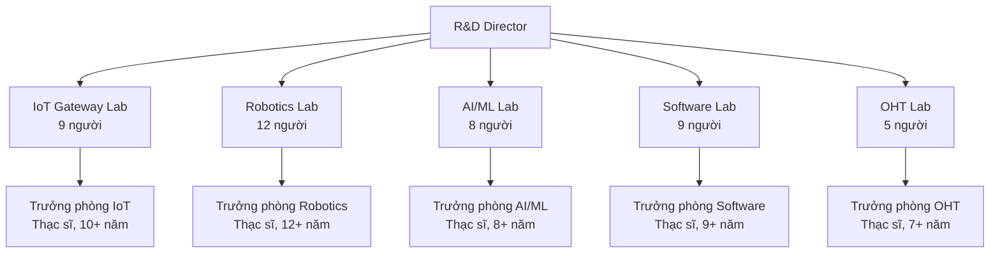

11.9.2 Sơ đồ tổ chức sản xuất
```mermaid
flowchart TB
  PROD_DIR[Production Director] --> SMT_LINE[SMT Line<br/>15 người]
  PROD_DIR --> IOT_ASSY[IoT Assembly<br/>20 người]
  PROD_DIR --> ROBOT_ASSY[Robot Assembly<br/>25 người]
  PROD_DIR --> QA_QC[QA/QC<br/>12 người]
  PROD_DIR --> MAINTENANCE[Maintenance<br/>8 người]
  
  SMT_LINE --> SMT_LEAD[Trưởng dây chuyền SMT<br/>Thạc sĩ, 8+ năm]
  IOT_ASSY --> IOT_LEAD[Trưởng dây chuyền IoT<br/>Đại học, 6+ năm]
  ROBOT_ASSY --> ROBOT_LEAD[Trưởng dây chuyền Robot<br/>Thạc sĩ, 7+ năm]
  QA_QC --> QA_LEAD[Trưởng phòng QA/QC<br/>Thạc sĩ, 10+ năm]
  MAINTENANCE --> MAINT_LEAD[Trưởng phòng Bảo trì<br/>Đại học, 12+ năm]
```

11.10 Sơ đồ hệ thống quản lý

11.10.1 Sơ đồ tổ chức chất lượng
```mermaid
flowchart TB
  QM[Quality Manager] --> QA[Quality Assurance]
  QM --> QC[Quality Control]
  QM --> QE[Quality Engineering]
  
  QA --> DOC[Document Control]
  QA --> AUDIT[Internal Audit]
  QA --> CAPA[CAPA Management]
  
  QC --> INCOMING[Incoming Inspection]
  QC --> INPROCESS[In-process Inspection]
  QC --> FINAL[Final Inspection]
  
  QE --> DFM[Design for Manufacturing]
  QE --> SPC[Statistical Process Control]
  QE --> FMEA[Failure Mode Analysis]
```

11.10.2 Sơ đồ tổ chức môi trường
```mermaid
flowchart TB
  EM[Environmental Manager] --> WASTE[Waste Management]
  EM --> ENERGY[Energy Management]
  EM --> EMISSION[Emission Control]
  
  WASTE --> SOLID[Solid Waste]
  WASTE --> LIQUID[Liquid Waste]
  WASTE --> HAZARDOUS[Hazardous Waste]
  
  ENERGY --> ELECTRICITY[Electricity]
  ENERGY --> RENEWABLE[Renewable Energy]
  ENERGY --> EFFICIENCY[Energy Efficiency]
  
  EMISSION --> AIR[Air Emissions]
  EMISSION --> WATER[Water Discharge]
  EMISSION --> NOISE[Noise Control]
```

11.11 Sơ đồ các nội dung thu hút đầu tư

11.11.1 Sơ đồ các nội dung thu hút đầu tư
```mermaid
flowchart TB
  INVEST[Thu hút đầu tư] --> TECH[Chuyển giao công nghệ]
  INVEST --> TRAIN[Đào tạo nhân lực]
  INVEST --> RD[Nghiên cứu và phát triển]
  INVEST --> EXPORT[Xuất khẩu sản phẩm]
  INVEST --> JOB[Tạo việc làm]
  INVEST --> TAX[Đóng góp thuế]
  INVEST --> INDUSTRY[Phát triển ngành]
  INVEST --> LOCAL[Nội địa hóa]
  INVEST --> ENV[Bảo vệ môi trường]
  INVEST --> SAFETY[An toàn lao động]
  
  TECH --> KUKA[KUKA Robotics]
  TECH --> TUYA[Tuya Smart]
  TECH --> DALY[DALY]
  TECH --> HIKVISION[Hikvision]
  TECH --> TOHIN[Tohin Corp]
  
  TRAIN --> UNI[Đại học]
  TRAIN --> INST[Viện nghiên cứu]
  TRAIN --> COMPANY[Công ty đối tác]
  
  RD --> IOT[IoT Gateway]
  RD --> ROBOT[Robot AMR/AGV]
  RD --> AI[AI/ML]
  RD --> SW[Software Platform]
  RD --> OHT[OHT Systems]
  
  EXPORT --> ASEAN[ASEAN]
  EXPORT --> GLOBAL[Toàn cầu]
  
  JOB --> HIGH[Việc làm chất lượng cao]
  JOB --> SKILL[Việc làm có tay nghề]
  
  TAX --> CORPORATE[Thuế doanh nghiệp]
  TAX --> VAT[Thuế VAT]
  TAX --> EXPORT_TAX[Thuế xuất khẩu]
  TAX --> IMPORT_TAX[Thuế nhập khẩu]
  
  INDUSTRY --> ASSOCIATION[Hiệp hội]
  INDUSTRY --> CONFERENCE[Hội nghị]
  INDUSTRY --> COOPERATION[Hợp tác]
  
  LOCAL --> MATERIAL[Nguyên vật liệu]
  LOCAL --> COMPONENT[Linh kiện]
  LOCAL --> SUPPLIER[Nhà cung cấp]
  
  ENV --> SOLAR[Năng lượng mặt trời]
  ENV --> WASTE[Xử lý chất thải]
  ENV --> RECYCLE[Tái chế]
  ENV --> EMISSION[Giảm khí thải]
  
  SAFETY --> TRAINING[Đào tạo an toàn]
  SAFETY --> EQUIPMENT[Trang thiết bị bảo hộ]
  SAFETY --> SYSTEM[Hệ thống cảnh báo]
  SAFETY --> INSPECTION[Kiểm tra an toàn]
```

11.12 Sơ đồ tổ chức liên hệ

11.12.1 Sơ đồ tổ chức liên hệ
```mermaid
flowchart TB
  CEO[Tổng giám đốc] --> DEPUTY[Phó tổng giám đốc]
  CEO --> RD_DIR[Giám đốc R&D]
  CEO --> PROD_DIR[Giám đốc Sản xuất]
  CEO --> SALES_DIR[Giám đốc Kinh doanh]
  
  DEPUTY --> ADMIN[Phòng Hành chính]
  DEPUTY --> FINANCE[Phòng Tài chính]
  DEPUTY --> QUALITY[Phòng Chất lượng]
  DEPUTY --> IT[Phòng IT]
  
  RD_DIR --> IOT_LAB[Phòng thí nghiệm IoT]
  RD_DIR --> ROBOT_LAB[Phòng thí nghiệm Robot]
  RD_DIR --> AI_LAB[Phòng thí nghiệm AI/ML]
  RD_DIR --> SW_LAB[Phòng thí nghiệm Software]
  RD_DIR --> OHT_LAB[Phòng thí nghiệm OHT]
  
  PROD_DIR --> SMT_LINE[Dây chuyền SMT]
  PROD_DIR --> IOT_ASSY[Dây chuyền lắp ráp IoT]
  PROD_DIR --> ROBOT_ASSY[Dây chuyền lắp ráp Robot]
  PROD_DIR --> QA_QC[QA/QC]
  PROD_DIR --> MAINTENANCE[Bảo trì]
  
  SALES_DIR --> DOMESTIC[Thị trường trong nước]
  SALES_DIR --> EXPORT[Thị trường xuất khẩu]
  SALES_DIR --> PARTNER[Đối tác phân phối]
  SALES_DIR --> CUSTOMER[Khách hàng]
```

11.13 Sơ đồ quy trình quản lý

11.13.1 Sơ đồ quy trình quản lý chất lượng
```mermaid
flowchart LR
  PLAN[Plan] --> DO[Do] --> CHECK[Check] --> ACT[Act]
  
  PLAN --> |"Lập kế hoạch chất lượng"| DO
  DO --> |"Thực hiện sản xuất"| CHECK
  CHECK --> |"Kiểm tra chất lượng"| ACT
  ACT --> |"Cải tiến liên tục"| PLAN
```

11.13.2 Sơ đồ quy trình quản lý môi trường
```mermaid
flowchart LR
  ASSESS[Environmental Assessment] --> PLAN[Environmental Plan] --> IMPLEMENT[Implementation] --> MONITOR[Monitoring] --> IMPROVE[Improvement]
  
  ASSESS --> |"Đánh giá tác động môi trường"| PLAN
  PLAN --> |"Lập kế hoạch bảo vệ môi trường"| IMPLEMENT
  IMPLEMENT --> |"Thực hiện các biện pháp"| MONITOR
  MONITOR --> |"Giám sát và đo lường"| IMPROVE
  IMPROVE --> |"Cải tiến liên tục"| ASSESS
```

11.14 Sơ đồ bảo mật thông tin

11.14.1 Sơ đồ khung bảo mật tổng thể
```mermaid
flowchart TB
  SEC[Khung bảo mật tổng thể] --> ENC[Mã hóa đầu cuối]
  SEC --> AUTH[Xác thực đa yếu tố]
  SEC --> OTA[Cập nhật OTA an toàn]
  SEC --> ZT[Kiến trúc Zero-Trust]
  
  ENC --> AES[AES-256]
  ENC --> RSA[RSA-2048]
  ENC --> ECC[ECC P-256]
  
  AUTH --> MFA[MFA]
  AUTH --> BIO[Sinh trắc học]
  AUTH --> CERT[Chứng chỉ số]
  
  OTA --> SIG[Ký số]
  OTA --> ROLL[Rollback]
  OTA --> VER[Kiểm tra tính toàn vẹn]
  
  ZT --> VERIFY[Xác minh liên tục]
  ZT --> MIN[Quyền tối thiểu]
  ZT --> LOG[Ghi nhật ký audit]
```

11.15 Ghi chú và trạng thái
- Trạng thái: [DRAFT]
- Phiên bản: 2025-10-20
- Người biên soạn: (điền)
- Thay đổi "Cập nhật so với V5": đã ghi tại các dòng có chênh lệch
- Liên kết chéo: Tất cả các phần từ 1-10
