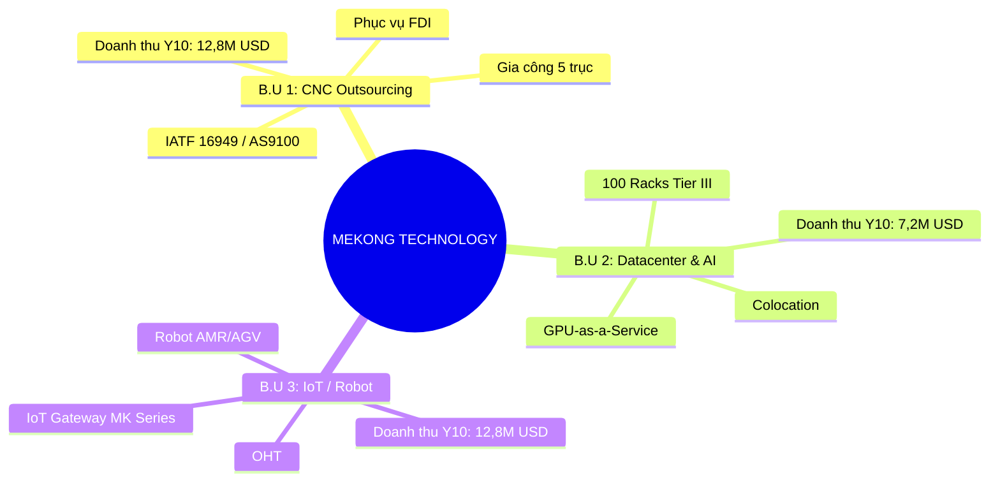
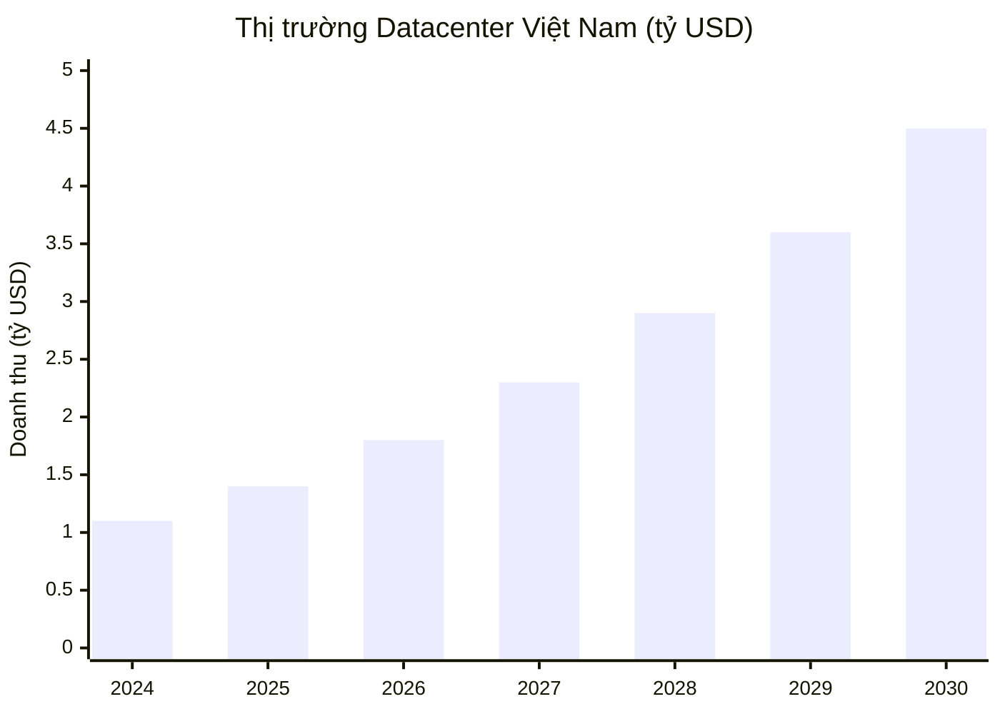
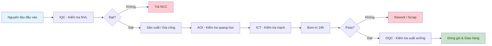
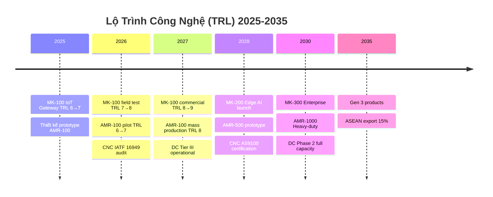
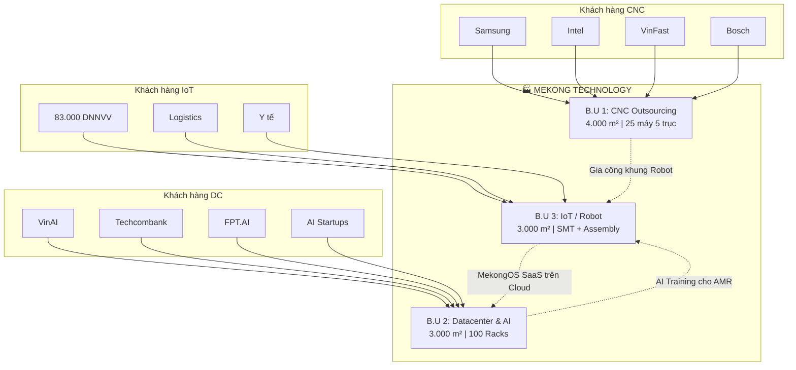
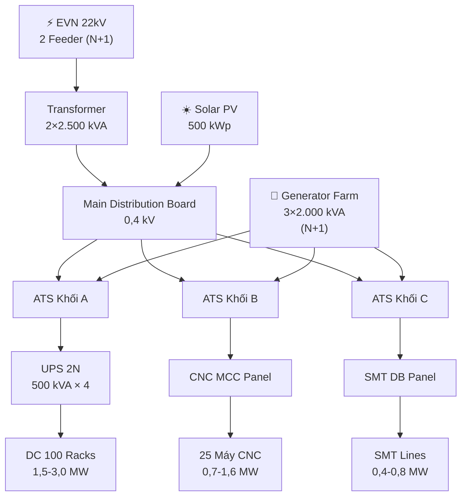
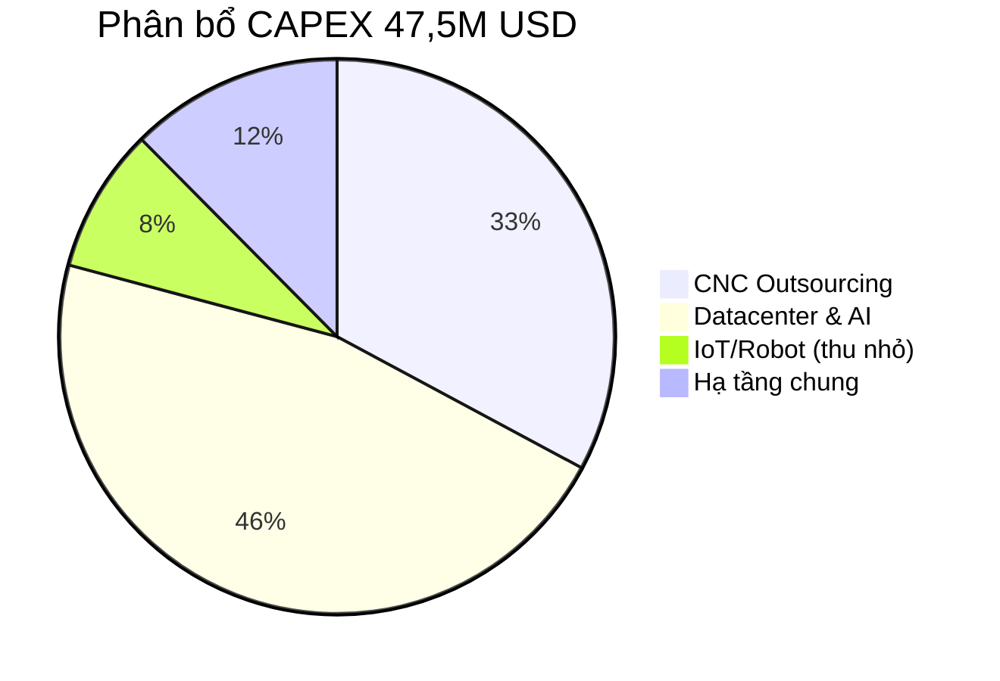
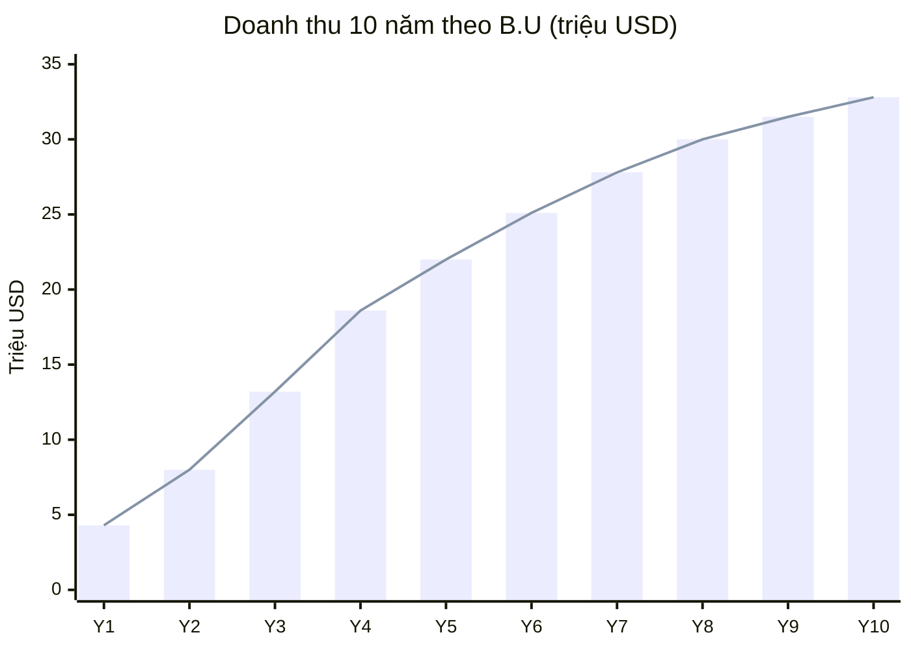
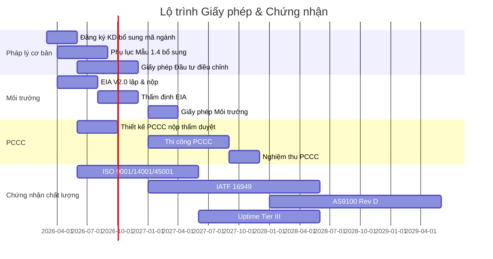
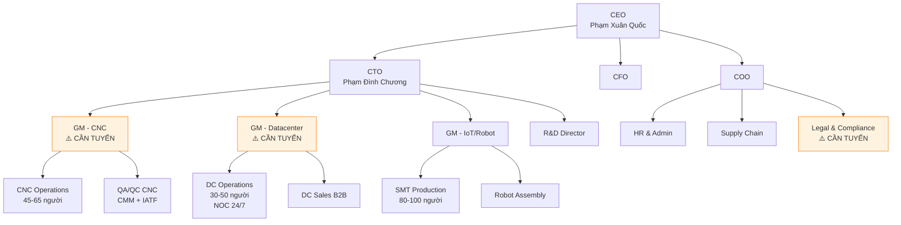

# PHƯƠNG ÁN TRÌNH BÀY ĐỀ ÁN VERSION 2
## Mekong Technology — Tổ hợp Công nghệ cao Đa ngành (47,5M USD)

**Ngày lập:** 04/03/2026  
**Mục đích:** Phương án cấu trúc tổng thể cho Đề án V2 — hợp nhất đề án gốc 20M + phương án mở rộng B2B  
**Người đánh giá:** Chuyên gia rà soát tổng hợp  

---

# I. PHÂN TÍCH ĐỀ ÁN V1 — BÀI HỌC RÚT RA

## 1.1. Cấu trúc V1 (File gốc: `1-MEKONG DE AN.md` — 11.524 dòng)

| Phần | Nội dung | Số trang ước | Đánh giá |
|------|----------|:---:|:---:|
| Tóm tắt Điều hành | Executive Summary 6 mục | ~20 | ★★★★☆ — Khá dài, cần gọn hơn |
| Phần I | Bối cảnh & Tính cấp thiết (I.1→I.4) | ~40 | ★★★★★ — Rất chi tiết |
| Phần II | Phân tích Thị trường (II.1→II.5) | ~50 | ★★★★★ — SWOT, Porter, Risk Register đầy đủ |
| Phần III | Chiến lược Công nghệ & Sản phẩm (III.1→III.4) | ~45 | ★★★★☆ — Tốt nhưng chưa có Mermaid |
| Phần IV | Năng lực Triển khai & Mô hình KD (IV.1→IV.3) | ~30 | ★★★☆☆ — Tài chính cần cập nhật lại |
| Phụ lục | Máy móc, NVL, Tổ chức, CV, Pháp lý | ~15 | ★★★☆☆ — Thiếu nhiều bằng chứng |

## 1.2. Công cụ trình bày V1 sử dụng

| Công cụ | Hiện trạng V1 | Đánh giá |
|---------|---------------|----------|
| **Bảng Markdown** | ✅ Sử dụng nhiều (50+ bảng) | Tốt, giữ lại |
| **Mermaid Diagram** | ❌ KHÔNG CÓ — chỉ đề cập "Sơ đồ Gantt" bằng text | **Thiếu nghiêm trọng** |
| **ASCII Art / Text Diagram** | ❌ Không có | Nên bổ sung cho layout |
| **Bullet point phân cấp** | ✅ Sử dụng rộng rãi | Tốt |
| **Icon/Emoji** | ✅ Có dùng ❖, ⚠️ | Giữ lại |
| **Callout/Quote block** | ✅ Có dùng (`>`) | Giữ lại |
| **Footnote/Source** | ✅ Có ghi nguồn (McKinsey, IFR, IDC) | Tốt |

## 1.3. Điểm yếu V1 cần khắc phục ở V2

| # | Điểm yếu | Mức độ | Giải pháp V2 |
|---|----------|:---:|---|
| 1 | **Không có biểu đồ Mermaid** — toàn bộ đề án 200 trang chỉ là text + bảng | 🔴 | Thêm 15-20 Mermaid diagrams |
| 2 | **Quá dài** — 11.524 dòng trong 1 file duy nhất | 🔴 | Chia thành 8-10 file theo chương |
| 3 | **Thiếu sơ đồ tổ chức trực quan** | 🟡 | Dùng Mermaid org chart |
| 4 | **Thiếu flowchart quy trình** | 🟡 | Thêm flowchart sản xuất, QA/QC |
| 5 | **Thiếu Gantt chart thực sự** | 🟡 | Dùng Mermaid Gantt |
| 6 | **Số liệu tài chính V1 đã lỗi thời** — nay pivot sang 47,5M | 🔴 | Dùng mô hình tài chính mới từ P2 |
| 7 | **Thiếu sơ đồ mặt bằng** | 🟡 | Dùng ASCII art từ P4 (M&E) |
| 8 | **Thiếu phần Datacenter & CNC** | 🔴 | Thêm 2 chương mới |

---

# II. ĐỀ XUẤT CẤU TRÚC ĐỀ ÁN VERSION 2

## 2.1. Cấu trúc File — Chia thành 10 file

```
DE_AN_MEKONG_V2/
├── 00_MUC_LUC_TONG_THE.md          ← Mục lục + Hướng dẫn đọc
├── 01_TOM_TAT_DIEU_HANH.md          ← Executive Summary (MAX 10 trang)
├── 02_BOI_CANH_THI_TRUONG.md        ← Phần I: Bối cảnh + Thị trường (3 ngành)
├── 03_SAN_PHAM_CONG_NGHE.md         ← Phần II: 3 B.U sản phẩm/dịch vụ
├── 04_MO_HINH_KINH_DOANH.md         ← Phần III: Chiến lược GTM, khách hàng
├── 05_HA_TANG_KY_THUAT.md           ← Phần IV: Layout, M&E, PCCC
├── 06_TAI_CHINH_DAU_TU.md           ← Phần V: CAPEX, P&L, NPV/IRR, 3 kịch bản
├── 07_PHAP_LY_MOI_TRUONG.md         ← Phần VI: Pháp lý, EIA, Giấy phép
├── 08_NHAN_SU_TO_CHUC.md            ← Phần VII: Tổ chức, nhân sự, đào tạo
├── 09_KET_LUAN_HANH_DONG.md         ← Phần VIII: Kết luận + Kêu gọi hành động
└── PHU_LUC/
    ├── A_BANG_CAPEX_CHI_TIET.md
    ├── B_DANH_SACH_MAY_MOC.md
    ├── C_MAU_VAN_BAN_PHAP_LY.md
    ├── D_CV_CHUYEN_GIA.md
    └── E_GLOSSARY.md
```

## 2.2. Chi tiết từng File — Nội dung & Mermaid Diagrams

---

### FILE 01: TÓM TẮT ĐIỀU HÀNH (Max 10 trang)

**Mục tiêu:** Gây ấn tượng ngay, trình bày ALL-IN-ONE cho lãnh đạo KCNC chỉ đọc phần này.

| Mục | Nội dung | Công cụ trực quan |
|-----|----------|-------------------|
| 1.1 | Tổng quan dự án (Tên, Vốn, Diện tích, 3 B.U) | **Bảng tóm tắt** |
| 1.2 | Tầm nhìn & Sứ mệnh | Quote block |
| 1.3 | 3 trụ cột kinh doanh | **Mermaid: Mindmap** |
| 1.4 | Cơ hội thị trường (IoT + DC + CNC) | **Mermaid: Pie chart** doanh thu dự kiến |
| 1.5 | Điểm mạnh & Lợi thế cạnh tranh | Bảng SWOT rút gọn |
| 1.6 | Chỉ số tài chính then chốt | **Bảng**: NPV, IRR, Payback, Doanh thu Y10 |
| 1.7 | Lộ trình tổng quát 2 Phase | **Mermaid: Gantt chart** |
| 1.8 | Kêu gọi hành động | Callout box |

**Mermaid mẫu cho mục 1.3:**


**Mermaid mẫu cho mục 1.7:**
```mermaid
gantt
    title Lộ trình Đầu tư 2 Giai đoạn
    dateFormat  YYYY-Q
    axisFormat  %Y

    section Phase 1 (25M USD)
    Thiết kế & Xin phép       :2026-Q1, 2026-Q4
    Xây dựng nhà xưởng        :2026-Q3, 2027-Q2
    Lắp đặt máy CNC Phase 1   :2027-Q1, 2027-Q3
    Lắp đặt DC Phase 1        :2027-Q1, 2027-Q4
    SMT Line + Robot Assembly  :2027-Q2, 2027-Q4
    Vận hành thử               :2027-Q3, 2028-Q1

    section Phase 2 (22,5M USD)
    Mở rộng CNC (25 máy)      :2028-Q1, 2028-Q4
    Mở rộng DC (100 racks)    :2028-Q2, 2029-Q2
    GPU SuperPOD Phase 2       :2029-Q1, 2029-Q3
```

---

### FILE 02: BỐI CẢNH & THỊ TRƯỜNG (Cập nhật cho 3 ngành)

| Mục | Nội dung | Nguồn dữ liệu | Công cụ trực quan |
|-----|----------|----------------|-------------------|
| 2.1 | Bối cảnh Industry 4.0 toàn cầu | Giữ từ V1 + cập nhật 2026 | Văn bản |
| 2.2 | Thị trường IoT VN & ASEAN | V1 + update | **Mermaid: Pie** phân khúc thị trường |
| 2.3 | **MỚI** — Thị trường Datacenter VN | Từ file `06_PHAN_TICH_THI_TRUONG_DATACENTER_VN.md` | **Mermaid: Bar chart** (xychart-beta) |
| 2.4 | **MỚI** — Thị trường CNC Outsourcing VN | Từ file `06_PHAN_TICH_CHUYEN_GIA_CNC_OUTSOURCING.md` | **Bảng** + competitive landscape |
| 2.5 | Phân tích cạnh tranh tổng hợp | Merge V1 SWOT + P5 + P6 | **Mermaid: Quadrant chart** |
| 2.6 | Porter's Five Forces (3 ngành) | V1 + mở rộng DC/CNC | **Mermaid: Mindmap** |
| 2.7 | Khoảng trống công nghệ & Cơ hội | V1 + P5 + P6 gap analysis | Callout boxes |

**Mermaid mẫu cho mục 2.3:**


**Mermaid mẫu cho mục 2.5 (Quadrant):**
```mermaid
quadrantChart
    title Positioning — Mekong vs Đối thủ
    x-axis "Giá thấp" --> "Giá cao"
    y-axis "Chất lượng thấp" --> "Chất lượng cao"
    quadrant-1 Premium (Siemens, NTT)
    quadrant-2 Mekong Target Zone
    quadrant-3 Low-cost local
    quadrant-4 Value trap
    Siemens: [0.8, 0.85]
    Schneider: [0.7, 0.75]
    Viettel IDC: [0.35, 0.55]
    FPT DC: [0.45, 0.65]
    Misumi VN: [0.5, 0.6]
    MEKONG: [0.4, 0.75]
```

---

### FILE 03: SẢN PHẨM & CÔNG NGHỆ (3 B.U)

| Mục | Nội dung | Công cụ trực quan |
|-----|----------|-------------------|
| 3.1 | B.U #1 — CNC Outsourcing: Danh mục dịch vụ, vật liệu, dung sai | Bảng chi tiết |
| 3.2 | B.U #2 — Datacenter: 3 tầng dịch vụ (Colo/HD/GPU) | **Mermaid: Flowchart** kiến trúc |
| 3.3 | B.U #3 — IoT/Robot: 7 dòng sản phẩm (giữ từ V1, thu gọn) | Bảng + **Mermaid: Timeline** TRL |
| 3.4 | Công nghệ lõi & TRL Roadmap | **Mermaid: Timeline** |
| 3.5 | Chuyển giao công nghệ (6 đối tác) | Bảng |
| 3.6 | Nội địa hóa 50-60% | **Mermaid: Pie** |
| 3.7 | QA/QC 3 lớp | **Mermaid: Flowchart** quy trình |
| 3.8 | Chứng nhận IATF / AS9100 / ISO timeline | **Mermaid: Gantt** |

**Mermaid mẫu — Quy trình QA/QC:**


**Mermaid mẫu — TRL Timeline:**


---

### FILE 04: MÔ HÌNH KINH DOANH

| Mục | Nội dung | Công cụ trực quan |
|-----|----------|-------------------|
| 4.1 | Chiến lược tổng thể (3 B.U synergy) | **Mermaid: Flowchart** hệ sinh thái |
| 4.2 | Khách hàng mục tiêu theo B.U | Bảng Top 20 KH tiềm năng |
| 4.3 | Go-to-Market 3 tầng | **Mermaid: Flowchart** |
| 4.4 | Chiến lược giá (CNC, DC, IoT) | Bảng so sánh giá khu vực |
| 4.5 | Mạng lưới đối tác | **Mermaid: Mindmap** |
| 4.6 | Revenue Mix & Dự kiến doanh thu | **Mermaid: Pie chart** |

**Mermaid mẫu — Hệ sinh thái B2B:**


---

### FILE 05: HẠ TẦNG KỸ THUẬT

| Mục | Nội dung | Nguồn | Công cụ trực quan |
|-----|----------|-------|-------------------|
| 5.1 | Master Layout 10.000 m² | P4 (12_THIET_KE_HA_TANG_ME.md) | **ASCII Art** layout (đã có) |
| 5.2 | Khối A — Datacenter M&E | P4 Chương II + P7 Chương II | Bảng thông số |
| 5.3 | Khối B — Nhà máy CNC M&E | P4 Chương III + P7 Chương III | Bảng thông số |
| 5.4 | Khối C — Nhà máy SMT M&E | P4 Chương IV + P7 Chương IV | Bảng thông số |
| 5.5 | Hệ thống Điện tổng hợp | P4 Chương V | **Mermaid: Flowchart** SLD đơn giản |
| 5.6 | Hệ thống Nước | P4 Chương VI | **Mermaid: Flowchart** water balance |
| 5.7 | PCCC thiết kế 3 khối | P7 | Bảng + ASCII art |
| 5.8 | Solar PV 500 kWp | P4 | Bảng |

**Mermaid mẫu — Single Line Diagram đơn giản:**


---

### FILE 06: TÀI CHÍNH & ĐẦU TƯ

| Mục | Nội dung | Nguồn | Công cụ trực quan |
|-----|----------|-------|-------------------|
| 6.1 | Tổng quan CAPEX 47,5M (2 Phase) | P2 Mục 2 | **Mermaid: Pie** phân bổ CAPEX |
| 6.2 | CAPEX chi tiết từng B.U | P2 Mục 2.2-2.5 | Bảng |
| 6.3 | P&L 10 năm | P2 Mục 3 | Bảng + **Mermaid: xychart** doanh thu |
| 6.4 | Cash Flow 10 năm | P2 Mục 5 | Bảng |
| 6.5 | Chỉ số thẩm định (NPV, IRR, Payback, DSCR) | P2 Mục 6 | **Bảng highlight** |
| 6.6 | Sensitivity Analysis 7 chiều | P2 Mục 7 | **Mermaid: xychart** Tornado |
| 6.7 | 3 Kịch bản (Conservative/Base/Optimistic) | P2 Mục 8 | Bảng so sánh |
| 6.8 | Cấu trúc vốn & Huy động | P2 Mục 9 | **Mermaid: Pie** |
| 6.9 | So sánh V1 (20M) vs V2 (47,5M) | P2 Mục 10 | Bảng |

**Mermaid mẫu — Phân bổ CAPEX:**


**Mermaid mẫu — Doanh thu dự kiến:**


---

### FILE 07: PHÁP LÝ & MÔI TRƯỜNG

| Mục | Nội dung | Nguồn | Công cụ trực quan |
|-----|----------|-------|-------------------|
| 7.1 | Khung pháp lý 3 B.U | P1 Phần A | **Bảng ma trận** |
| 7.2 | Chiến lược định vị ngôn ngữ pháp lý | P1 Phần B | Bảng chuyển đổi thuật ngữ |
| 7.3 | Lộ trình giấy phép 18 hạng mục | P1 Phần C | **Mermaid: Gantt** |
| 7.4 | EIA V2.0 tóm tắt (3 khối) | P3 | Bảng tổng hợp tác động |
| 7.5 | Cam kết môi trường | P3 Chương VIII | Danh sách cam kết |
| 7.6 | Phân loại dự án & Cơ quan thẩm định | P3 Chương I | Bảng |

**Mermaid mẫu — Lộ trình giấy phép:**  


---

### FILE 08: NHÂN SỰ & TỔ CHỨC

| Mục | Nội dung | Công cụ trực quan |
|-----|----------|-------------------|
| 8.1 | Sơ đồ tổ chức tập đoàn | **Mermaid: Org chart** |
| 8.2 | Đội ngũ lãnh đạo (CEO, CTO, CFO, COO) | Bảng CV tóm tắt |
| 8.3 | **MỚI** — Nhân sự chủ chốt cần tuyển thêm | Bảng 3 vị trí critical |
| 8.4 | Kế hoạch tuyển dụng 190-270 người | **Mermaid: Gantt** |
| 8.5 | Đào tạo & Phát triển năng lực | Bảng chương trình đào tạo |

**Mermaid mẫu — Sơ đồ tổ chức:**


---

### FILE 09: KẾT LUẬN & KÊU GỌI HÀNH ĐỘNG

| Mục | Nội dung | Công cụ trực quan |
|-----|----------|-------------------|
| 9.1 | Tóm tắt 10 điểm mạnh cốt lõi | Numbered list + icon |
| 9.2 | Bảng so sánh: Tại sao 47,5M tốt hơn 20M? | Bảng đối chiếu |
| 9.3 | Đề nghị phê duyệt (Phase 1 trước) | Callout box |
| 9.4 | Cam kết của nhà đầu tư | Danh sách 5 cam kết |
| 9.5 | Lời mời hợp tác | Quote block |
| 9.6 | Thông tin liên hệ | Bảng |

---

# III. TỔNG HỢP MERMAID DIAGRAMS CẦN TẠO

| # | Loại Mermaid | Nằm trong File | Mô tả |
|---|-------------|-----------------|-------|
| 1 | `mindmap` | 01_TOM_TAT | 3 trụ cột kinh doanh |
| 2 | `gantt` | 01_TOM_TAT | Lộ trình đầu tư 2 Phase |
| 3 | `pie` | 01_TOM_TAT | Phân bổ doanh thu theo B.U |
| 4 | `xychart-beta` | 02_BOI_CANH | Thị trường DC VN 2024-2030 |
| 5 | `quadrantChart` | 02_BOI_CANH | Vị thế cạnh tranh |
| 6 | `mindmap` | 02_BOI_CANH | Porter's Five Forces |
| 7 | `pie` | 02_BOI_CANH | Thị phần IoT VN |
| 8 | `flowchart` | 03_SAN_PHAM | Quy trình QA/QC 3 lớp |
| 9 | `timeline` | 03_SAN_PHAM | TRL Roadmap 2025-2035 |
| 10 | `gantt` | 03_SAN_PHAM | Chứng nhận IATF/AS9100 |
| 11 | `pie` | 03_SAN_PHAM | Nội địa hóa |
| 12 | `flowchart` | 04_MO_HINH | Hệ sinh thái B2B |
| 13 | `pie` | 04_MO_HINH | Revenue Mix by B.U |
| 14 | `flowchart` | 05_HA_TANG | Single Line Diagram điện |
| 15 | `flowchart` | 05_HA_TANG | Water balance diagram |
| 16 | `pie` | 06_TAI_CHINH | CAPEX breakdown |
| 17 | `xychart-beta` | 06_TAI_CHINH | Doanh thu 10 năm |
| 18 | `pie` | 06_TAI_CHINH | Cấu trúc vốn |
| 19 | `gantt` | 07_PHAP_LY | Lộ trình giấy phép |
| 20 | `graph TD` | 08_NHAN_SU | Sơ đồ tổ chức |

---

# IV. MAPPING: NỘI DUNG CŨ → MỚI

## 4.1. Nội dung V1 giữ lại (chỉnh sửa)

| V1 (1-MEKONG DE AN.md) | V2 File | Thay đổi |
|---|---|---|
| Executive Summary mục 1-6 | 01_TOM_TAT | Thu gọn 50%, thêm B.U 2+3, thêm Mermaid |
| Phần I: Bối cảnh | 02_BOI_CANH | Giữ 70%, bổ sung DC+CNC market |
| Phần II: Thị trường | 02_BOI_CANH | Merge + thêm 2 thị trường mới |
| Phần III: Công nghệ | 03_SAN_PHAM | Thu nhỏ IoT/Robot, thêm CNC+DC service |
| Phần IV.1: Năng lực tài chính | 06_TAI_CHINH | **VIẾT LẠI HOÀN TOÀN** từ P2 |
| Phần IV.2: Mô hình KD | 04_MO_HINH | Mở rộng cho 3 B.U |
| Phần IV.3: Kết luận | 09_KET_LUAN | Cập nhật |
| Phụ lục A-F | PHU_LUC/ | Cập nhật + bổ sung |

## 4.2. Nội dung MỚI HOÀN TOÀN (từ HO_SO_MO_RONG_REVIEW)

| Nguồn trong HO_SO_MO_RONG_REVIEW | Đi vào V2 File | Nội dung |
|---|---|---|
| `06_PHAN_TICH_THI_TRUONG_DATACENTER_VN.md` | 02_BOI_CANH | Chương 2.3 |
| `06_PHAN_TICH_CHUYEN_GIA_CNC_OUTSOURCING.md` | 02_BOI_CANH + 03_SAN_PHAM | Chương 2.4 + 3.1 |
| `06_PHAP_LY/` (5 file) | 07_PHAP_LY | Chương 7.1-7.3 |
| `08_MO_HINH_TAI_CHINH_MO_RONG.md` | 06_TAI_CHINH | Toàn bộ chương 6 |
| `09_BAO_CAO_EIA_TONG_HOP_3_KHOI.md` | 07_PHAP_LY | Chương 7.4-7.6 |
| `10_PCCC_AN_TOAN_LAO_DONG.md` | 05_HA_TANG | Chương 5.7 |
| `12_THIET_KE_HA_TANG_ME.md` | 05_HA_TANG | Toàn bộ chương 5 |

---

# V. CHECKLIST VẤN ĐỀ CẦN GIẢI QUYẾT TRƯỚC KHI VIẾT V2

## 5.1. Vấn đề 🔴 CRITICAL — Phải sửa trước

| # | Vấn đề | File nguồn | Trách nhiệm |
|---|--------|-----------|-------------|
| 1 | **Mâu thuẫn Equity** (23,1M vs 34,97M) | P2-1 | Chuyên gia Tài chính |
| 2 | **DSCR không đạt covenant** suốt 10 năm | P2-3 | Chuyên gia Tài chính |
| 3 | **PCCC CAPEX thiếu 1,48M** trong P2 | P7-1 × P2-4 | Chuyên gia Tài chính |
| 4 | **MT CAPEX 2,87M** chưa rõ phân bổ trong P2 | P3 × P2-4 | Chuyên gia Tài chính |
| 5 | **Nước cấp** DC cooling gần hết quota KCNC | P3-1 | Chuyên gia M&E |
| 6 | **So sánh V1 vs V2 bất lợi** — thiếu giải thích strategic value | P2-5 | Chuyên gia Chiến lược |

## 5.2. Vấn đề 🟡 HIGH — Nên sửa

| # | Vấn đề | Trách nhiệm |
|---|--------|-------------|
| 7 | PM2.5 baseline vượt ngưỡng — cần dispersion modeling | Chuyên gia Môi trường |
| 8 | Chi phí pháp lý ongoing (retainer, gia hạn) chưa vào P&L | Chuyên gia Tài chính |
| 9 | Nhân sự chủ chốt (GM DC, GM CNC, Legal) chưa có JD chi tiết | Chuyên gia HR |
| 10 | GPU lease vs buy — chưa có bảng NPV so sánh | Chuyên gia Tài chính |

---

# VI. TIMELINE DỰ KIẾN HOÀN THÀNH V2

| Tuần | Hoạt động | Output |
|------|-----------|--------|
| Tuần 1 | Sửa 6 vấn đề CRITICAL (bằng prompt chuyên gia) | Bản sửa P2, P3, P7 |
| Tuần 2 | Viết File 01 (Tóm tắt) + File 02 (Bối cảnh) | 2 file + Mermaid |
| Tuần 3 | Viết File 03 (Sản phẩm) + File 04 (Mô hình KD) | 2 file + Mermaid |
| Tuần 4 | Viết File 05 (Hạ tầng) + File 06 (Tài chính) | 2 file + Mermaid |
| Tuần 5 | Viết File 07 (Pháp lý) + File 08 (Nhân sự) + File 09 (Kết luận) | 3 file |
| Tuần 6 | Review tổng thể + Phụ lục + Consistency check | Bản V2 hoàn chỉnh |

---

**KẾT LUẬN:**  
Đề án V2 sẽ là bản **chuyên nghiệp hơn hẳn V1** nhờ:
1. Chia file logic, dễ đọc dễ review  
2. 20 biểu đồ Mermaid trực quan  
3. Tích hợp 3 B.U thay vì chỉ 1  
4. Mô hình tài chính cập nhật 47,5M với [A]/[B]/[C] tagging  
5. Hồ sơ pháp lý hoàn chỉnh (Mẫu 1.4 mới + EIA V2.0 + PCCC)  
6. Giải quyết 10 vấn đề phát hiện từ review quality  
