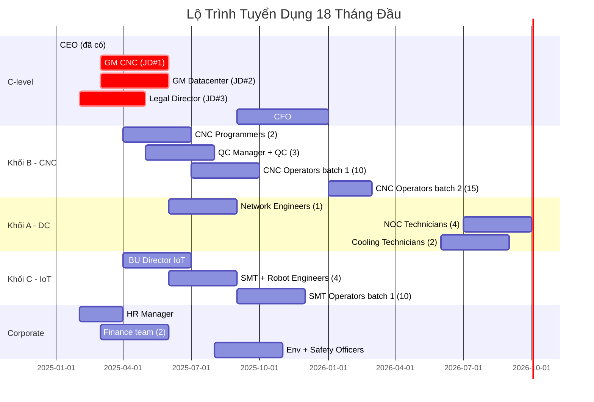

# BẢN MÔ TẢ CÔNG VIỆC (JD) & KẾ HOẠCH TUYỂN DỤNG
## Chuyên gia Nhân sự Ngành Công nghệ cao — Prompt D Output

**Ngày:** 04/03/2026  
**Vai trò:** Chuyên gia Nhân sự Ngành Công nghệ cao (HR Business Partner)  
**Phân loại:** CONFIDENTIAL  
**Tham chiếu:** EIA Mục 1.3.4 (190–270 nhân sự), P2 Mục 2.2–2.5, V1.1 Mục 3.2

---

# TÓM TẮT

| Chỉ tiêu | Giá trị |
|---|---|
| **Tổng headcount (full operation Y4+)** | 190–270 người |
| **Khối A — Datacenter & AI** | 30–50 người |
| **Khối B — CNC Outsourcing** | 80–120 người |
| **Khối C — IoT/Robot (SMT)** | 80–100 người |
| **JD chi tiết** | 3 vị trí C-level/Director |
| **Tổng quỹ lương ước tính (Y4+)** | 3,2–4,8M USD/năm |

---

# PHẦN 1: BẢN MÔ TẢ CÔNG VIỆC (JD) — 3 VỊ TRÍ THEN CHỐT

---

## JD #1: GENERAL MANAGER — CNC OUTSOURCING (Khối B)

### Thông Tin Chung

| Hạng mục | Chi tiết |
|---|---|
| **Chức danh** | General Manager — CNC Outsourcing Division |
| **Báo cáo cho** | CEO (Ông Phạm Xuân Quốc) |
| **Quản lý trực tiếp** | Production Manager, Quality Manager, Engineering Manager, Business Development |
| **Headcount quản lý** | 80–120 người (khi full operation) |
| **Địa điểm** | Lô E2-03, KCNC TP.HCM, Quận 9 |
| **Mức lương** | 6.000–10.000 USD/tháng gross + KPI bonus 20–30% |
| **Phân loại** | Full-time, Expat hoặc Việt kiều ưu tiên |

### Mô Tả Công Việc

**Mục tiêu vị trí:** Xây dựng và vận hành nhà máy CNC outsourcing 25 máy CNC 5 trục từ con số 0, đạt doanh thu 6,8M USD/năm (Y6) với utilization ≥ 75% và chất lượng đạt tiêu chuẩn IATF 16949 + AS9100.

**Trách nhiệm chính:**

1. **Chiến lược & P&L (30%)**
   - Chịu trách nhiệm P&L toàn khối B, mục tiêu EBITDA ≥ 15% revenue
   - Xây dựng kế hoạch kinh doanh 3 năm (customer pipeline, pricing, capacity planning)
   - Phát triển khách hàng tier-1 (automotive OEM Nhật/Hàn, aerospace, medical device)
   - Quản lý portfolio sản phẩm: Aerospace 40%, Automotive 35%, Medical 15%, General 10%

2. **Vận hành sản xuất (30%)**
   - Giám sát vận hành 25 máy CNC 5 trục (DMG MORI, Doosan, Makino)
   - Đảm bảo OEE ≥ 75% (Availability × Performance × Quality)
   - Triển khai hệ thống quản lý sản xuất (MES) tích hợp ERP
   - Quản lý kho nguyên liệu (Nhôm 6061/7075, Titan Ti-6Al-4V, Inox 316L)
   - Giám sát hệ thống coolant, chip conveyor, CMM đo lường

3. **Chất lượng & Chứng nhận (20%)**
   - Lãnh đạo quá trình lấy chứng nhận: ISO 9001, IATF 16949, AS9100, ISO 14001, ISO 45001
   - Thiết lập QMS (Quality Management System) từ đầu
   - Đảm bảo tỷ lệ reject < 0,5% (PPM < 5.000)
   - Quản lý CMM room (nhiệt độ ±0,5°C, độ ẩm 45±5%)

4. **Nhân sự & Đào tạo (20%)**
   - Tuyển dụng và đào tạo đội ngũ 80–120 người (CNC operators, QC, engineers)
   - Xây dựng chương trình đào tạo CNC 5 trục (3–6 tháng per operator)
   - Quản lý 3 ca sản xuất (24 giờ vận hành, 300 ngày/năm)
   - Thiết lập KPI cá nhân và team

### Yêu Cầu

| Hạng mục | Yêu cầu tối thiểu | Ưu tiên |
|---|---|---|
| **Học vấn** | Kỹ sư Cơ khí / Sản xuất (BSc) | MBA hoặc MSc |
| **Kinh nghiệm** | ≥ 10 năm CNC/Precision machining | ≥ 15 năm, có KN quản lý nhà máy |
| **Chứng nhận** | IATF 16949 Lead Implementer | AS9100 + Lean Six Sigma Black Belt |
| **Ngôn ngữ** | Tiếng Anh thành thạo (IELTS ≥ 7.0) | + Tiếng Nhật hoặc Hàn |
| **Kỹ năng CNC** | CAM (MasterCAM, Siemens NX) | 5-axis programming experience |
| **Quản lý** | Đã quản lý ≥ 50 người | Đã setup greenfield factory |
| **Ngành** | Automotive hoặc Aerospace tier-1/2 | Cả hai |

### KPI Năm Đầu Tiên

| KPI | Target Y1 | Ghi chú |
|---|---|---|
| Lấy chứng nhận ISO 9001 | Q4/2026 | Tiền đề cho IATF |
| Lấy chứng nhận IATF 16949 | Q2/2027 | Bắt buộc cho automotive |
| Machine utilization | ≥ 35% | Giai đoạn setup |
| Tuyển dụng operators | ≥ 30 người | Ca 1 + Ca 2 |
| Khách hàng pilot | ≥ 3 LOI | Nhất 1 automotive tier-1 |
| Revenue Y1 | ≥ 0,22M USD | Theo model V1.1 |

---

## JD #2: GENERAL MANAGER — DATACENTER & AI COMPUTE (Khối A)

### Thông Tin Chung

| Hạng mục | Chi tiết |
|---|---|
| **Chức danh** | General Manager — Datacenter & AI Compute Division |
| **Báo cáo cho** | CEO |
| **Quản lý trực tiếp** | DC Operations Manager, Network/Security Manager, AI Platform Manager, Sales |
| **Headcount quản lý** | 30–50 người |
| **Địa điểm** | Lô E2-03, KCNC TP.HCM |
| **Mức lương** | 7.000–12.000 USD/tháng gross + KPI bonus 25–35% |
| **Phân loại** | Full-time, Expat ưu tiên |

### Mô Tả Công Việc

**Mục tiêu vị trí:** Xây dựng và vận hành Datacenter Tier III + AI Compute platform từ con số 0, đạt 100 racks, occupancy ≥ 75%, doanh thu 2,6M USD/năm (Y6), uptime ≥ 99,982%.

**Trách nhiệm chính:**

1. **Xây dựng & Commissioning DC (40% — Y1–Y2)**
   - Giám sát thi công Khối A: Power (2N UPS, Generator), Cooling (Hybrid + Liquid), Network (Meet-me room)
   - Commissioning theo chuẩn Uptime Institute Tier III
   - Thiết kế topology mạng: Core → Aggregation → ToR (Spine-Leaf)
   - Triển khai hệ thống BMS/DCIM tích hợp

2. **Vận hành DC & AI Platform (30%)**
   - Quản lý 100 racks (60 Colo + 40 AI/HPC) với PUE < 1,35
   - Vận hành GPU cluster (DGX H100/B100) cho GPU-as-a-Service
   - Quản lý SLA: Uptime ≥ 99,982%, latency < 1ms (internal), ticket response < 15 min
   - Giám sát hệ thống cooling (Hybrid + Rear-door Liquid Cooling)
   - Quản lý nước cooling theo 4 Giải pháp (tham chiếu 13_PHAN_TICH_RUI_RO_CAP_NUOC.md)

3. **Kinh doanh & Khách hàng (20%)**
   - Phát triển khách hàng: Ngân hàng, Fintech, AI startup, Enterprise
   - Giá bán: Colocation 1.250 USD/Rack/tháng, AI/HPC 3.800 USD/Rack/tháng
   - GPU-aaS pricing: 3,50 USD/GPU-hour (H100 equivalent)
   - Đàm phán hợp đồng dài hạn (3–5 năm) với đặt cọc

4. **An ninh & Compliance (10%)**
   - Chứng nhận: ISO 27001, SOC 2 Type II, PCI-DSS (nếu có banking)
   - Quản lý access control: biometric + badge + mantrap
   - Tuân thủ NĐ 13/2023/NĐ-CP (Bảo vệ dữ liệu cá nhân)

### Yêu Cầu

| Hạng mục | Yêu cầu tối thiểu | Ưu tiên |
|---|---|---|
| **Học vấn** | BSc IT / Electrical Engineering | MBA hoặc MSc |
| **Kinh nghiệm** | ≥ 8 năm DC operations | ≥ 12 năm, có KN xây DC greenfield |
| **Chứng nhận** | CDCP (Certified DC Professional) | CDCS + AWS/Azure SA Professional |
| **Ngôn ngữ** | Tiếng Anh thành thạo | + Tiếng Trung (khách hàng TQ-mainland) |
| **Kỹ thuật** | DC power, cooling, network design | GPU cluster management (NVIDIA DGX) |
| **Compliance** | ISO 27001 Lead Auditor | SOC 2 + PCI-DSS |
| **Quản lý** | Đã quản lý DC ≥ 50 racks | ≥ 200 racks |

### KPI Năm Đầu Tiên

| KPI | Target Y1 | Ghi chú |
|---|---|---|
| Commissioning Tier III | Q1/2027 | Power + Cooling + Network |
| PUE đạt mục tiêu | < 1,40 | Chấp nhận cao hơn giai đoạn đầu |
| Uptime | ≥ 99,95% | Mục tiêu dần lên 99,982% |
| Occupancy | ≥ 15 racks | 15% capacity |
| Certification | ISO 27001 initiated | Audit Q4/2027 |
| Revenue Y1 | ≥ 0,08M USD | Theo model V1.1 |

---

## JD #3: LEGAL DIRECTOR — COMPLIANCE & REGULATORY

### Thông Tin Chung

| Hạng mục | Chi tiết |
|---|---|
| **Chức danh** | Legal Director — Compliance & Regulatory Affairs |
| **Báo cáo cho** | CEO + Board of Directors |
| **Quản lý trực tiếp** | Legal Officer, Compliance Officer (2 người) |
| **Headcount quản lý** | 3–5 người |
| **Địa điểm** | Lô E2-03, KCNC TP.HCM + TP.HCM (linh hoạt) |
| **Mức lương** | 5.000–8.000 USD/tháng gross + bonus 15–20% |
| **Phân loại** | Full-time |

### Mô Tả Công Việc

**Mục tiêu vị trí:** Quản lý toàn bộ rủi ro pháp lý cho tổ hợp 3 khối, đảm bảo 18 giấy phép/chứng nhận đúng hạn, tuân thủ pháp luật VN + quốc tế, bảo vệ quyền lợi công ty trong 50 năm hoạt động.

**Trách nhiệm chính:**

1. **Giấy phép & Thủ tục (40%)**
   - Quản lý lộ trình 18 giấy phép (tham chiếu 06_PHAP_LY/PHAN_C_LO_TRINH_THU_TUC.md)
   - Soạn thảo và nộp hồ sơ: Giấy CNĐKKD, Giấy phép đầu tư, ĐTM, PCCC, Xây dựng
   - Đảm bảo timeline: 100% giấy phép trước khi khởi công (Q2/2026)
   - Gia hạn định kỳ các chứng nhận (ISO, IATF, AS9100)

2. **Hợp đồng & Đàm phán (25%)**
   - Soạn thảo/review hợp đồng: Thuê đất KCNC, EPC contractor, Equipment suppliers, Customer contracts
   - Đàm phán điều khoản: SLA, IP ownership, non-compete, warranty
   - Quản lý hợp đồng vay (Senior Debt 9,5M–14,7M): covenants, DSCR conditions, collateral
   - Hỗ trợ đàm phán quota nước với Ban Quản lý KCNC (GP4 — Water)

3. **Tuân thủ & Rủi ro (25%)**
   - Tuân thủ: Luật Đầu tư, Luật Doanh nghiệp, Luật BVMT, Luật Xây dựng, NĐ 13 BVDLCN
   - Quản lý IP: Patent, trademark, trade secret (đặc biệt cho IoT/Robot IP)
   - Tuân thủ xuất khẩu: EAR (US), Dual-use (EU) cho thiết bị CNC precision
   - Insurance: D&O, Professional liability, Property, Workers' comp
   - Anti-bribery & anti-corruption compliance (FCPA nếu có đối tác Mỹ)

4. **Tranh chấp & Litigation (10%)**
   - Quản lý tranh chấp với contractor, landlord, customer
   - Đại diện công ty tại trọng tài (VIAC) hoặc tòa án
   - Contingency planning cho rủi ro pháp lý (environmental liability, IP infringement)

### Yêu Cầu

| Hạng mục | Yêu cầu tối thiểu | Ưu tiên |
|---|---|---|
| **Học vấn** | Cử nhân Luật (ĐH Luật TP.HCM, ĐH Quốc gia) | LL.M (nước ngoài) |
| **Kinh nghiệm** | ≥ 8 năm corporate law tại VN | ≥ 12 năm, có KN manufacturing/tech |
| **Chuyên ngành** | Luật Đầu tư + Luật Doanh nghiệp | + Luật SHTT + Luật Môi trường |
| **Ngôn ngữ** | Tiếng Anh pháp lý (IELTS ≥ 7.0 hoặc tương đương) | + Tiếng Nhật (hợp đồng với đối tác Nhật) |
| **Chứng chỉ** | Thẻ Luật sư VN | + Admitted to Bar (nước ngoài) |
| **Mạng lưới** | Quan hệ với Sở KH&ĐT, Ban Quản lý KCNC | + Bộ TN&MT, Cục PCCC |

### KPI Năm Đầu Tiên

| KPI | Target Y1 | Ghi chú |
|---|---|---|
| 18 giấy phép đúng hạn | 100% on-time | Tham chiếu Phần C |
| Hợp đồng EPC signed | Q1/2026 | Trước khởi công |
| Chi phí pháp lý ≤ budget | ≤ 62.000 USD (Y1) | Theo V1.1 Mục 3.2 |
| Hợp đồng vay signed | Q2/2026 | Senior Debt finalize |
| IP protection filed | ≥ 3 trademark + 1 patent | IoT/Robot products |
| Training compliance | 100% nhân viên | Anti-bribery + Safety |

---

# PHẦN 2: KẾ HOẠCH TUYỂN DỤNG TỔNG THỂ

## 2.1. Cơ Cấu Nhân Sự Theo Khối & Giai Đoạn

### Khối A — Datacenter & AI (30–50 người)

| Vị trí | Y1 | Y2 | Y3+ | Mức lương (USD/tháng) | Ghi chú |
|---|---:|---:|---:|---:|---|
| GM Datacenter | 1 | 1 | 1 | 7.000–12.000 | JD #2 |
| DC Operations Manager | 1 | 1 | 1 | 3.500–5.000 | |
| Network Engineer (Sr) | 1 | 2 | 2 | 2.500–4.000 | CCIE/CCNP |
| Security Engineer | 0 | 1 | 2 | 2.500–3.500 | ISO 27001 |
| NOC Technician (24/7) | 4 | 6 | 8 | 1.000–1.500 | 4 ca × 2 người |
| Cooling/MEP Technician | 2 | 3 | 4 | 1.200–1.800 | Vận hành chiller, UPS |
| AI Platform Engineer | 0 | 2 | 4 | 3.000–5.000 | NVIDIA DGX, K8s, MLOps |
| Sales / Account Manager | 1 | 2 | 3 | 2.000–3.500 + commission | |
| Admin / Support | 1 | 2 | 3 | 800–1.200 | |
| **TỔNG Khối A** | **11** | **20** | **28–50** | | |

### Khối B — CNC Outsourcing (80–120 người)

| Vị trí | Y1 | Y2 | Y3+ | Mức lương (USD/tháng) | Ghi chú |
|---|---:|---:|---:|---:|---|
| GM CNC | 1 | 1 | 1 | 6.000–10.000 | JD #1 |
| Production Manager | 1 | 1 | 1 | 3.000–5.000 | |
| Quality Manager (QMS) | 1 | 1 | 1 | 2.500–4.000 | IATF Lead |
| CNC Programmer (CAM) | 2 | 4 | 5 | 2.000–3.500 | MasterCAM, Siemens NX |
| CNC Operator (5-axis) | 10 | 25 | 40–60 | 800–1.500 | 3 ca, 300 ngày |
| QC Inspector (CMM) | 2 | 4 | 6 | 1.000–1.800 | Zeiss/Hexagon CMM |
| Tool/Fixture Engineer | 1 | 2 | 3 | 1.500–2.500 | |
| Maintenance Tech | 2 | 3 | 5 | 1.200–2.000 | CNC preventive maint. |
| Supply Chain / Logistics | 1 | 2 | 3 | 1.200–2.000 | |
| Business Dev. | 1 | 2 | 3 | 2.000–3.000 + commission | |
| Safety / Environment | 1 | 1 | 2 | 1.000–1.500 | Tham chiếu EIA |
| Admin / HR | 1 | 2 | 3 | 800–1.200 | |
| **TỔNG Khối B** | **24** | **48** | **73–120** | | |

### Khối C — IoT/Robot SMT (80–100 người)

| Vị trí | Y1 | Y2 | Y3+ | Mức lương (USD/tháng) | Ghi chú |
|---|---:|---:|---:|---:|---|
| BU Director IoT/Robot | 1 | 1 | 1 | 5.000–8.000 | |
| Production Manager | 1 | 1 | 1 | 2.500–4.000 | |
| SMT Engineer | 2 | 3 | 4 | 2.000–3.000 | Panasonic NPM-D3 |
| Robot Programmer | 2 | 3 | 5 | 2.000–3.500 | Fanuc/Yaskawa |
| SMT Operator | 10 | 25 | 35–45 | 600–1.000 | 2 ca |
| Robot Assembly Tech | 5 | 10 | 15–20 | 800–1.200 | |
| QC / Testing | 2 | 4 | 6 | 1.000–1.500 | AOI, ICT, FCT |
| R&D Engineer | 2 | 4 | 6 | 2.500–4.000 | Firmware, PCB design |
| Supply Chain | 1 | 2 | 3 | 1.200–2.000 | |
| Sales / Marketing | 1 | 2 | 3 | 1.500–2.500 + commission | |
| Admin / Support | 1 | 2 | 3 | 800–1.200 | |
| **TỔNG Khối C** | **28** | **57** | **82–100** | | |

### Corporate / Shared Services

| Vị trí | Y1 | Y2 | Y3+ | Mức lương (USD/tháng) | Ghi chú |
|---|---:|---:|---:|---:|---|
| CEO | 1 | 1 | 1 | 10.000–15.000 | Ông Phạm Xuân Quốc |
| CFO | 0 | 1 | 1 | 6.000–10.000 | |
| Legal Director | 1 | 1 | 1 | 5.000–8.000 | JD #3 |
| Legal / Compliance Officer | 1 | 2 | 2 | 1.500–2.500 | |
| HR Manager | 1 | 1 | 1 | 2.500–4.000 | |
| IT Manager (Internal) | 1 | 1 | 1 | 2.000–3.500 | ERP, MES |
| Finance / Accounting | 2 | 3 | 4 | 1.200–2.000 | |
| Environment Officer | 1 | 1 | 2 | 1.500–2.500 | Tham chiếu EIA |
| PCCC / Safety Officer | 1 | 1 | 2 | 1.200–1.800 | Tham chiếu P7 |
| Receptionist / GA | 1 | 2 | 3 | 600–1.000 | |
| Driver / Cleaner | 2 | 3 | 4 | 400–700 | |
| **TỔNG Corporate** | **12** | **17** | **22–30** | | |

## 2.2. Tổng Hợp Headcount & Quỹ Lương

| | Y1 (2025) | Y2 (2026) | Y3 (2027) | Y4+ (2028+) |
|---|---:|---:|---:|---:|
| **Khối A** | 11 | 20 | 28 | 28–50 |
| **Khối B** | 24 | 48 | 73 | 73–120 |
| **Khối C** | 28 | 57 | 82 | 82–100 |
| **Corporate** | 12 | 17 | 22 | 22–30 |
| **TỔNG** | **75** | **142** | **205** | **205–300** |
| **Quỹ lương ước tính (M USD/năm)** | **1,28** | **2,35** | **3,25** | **3,50–5,20** |
| **% Revenue** | 173% | 83% | 59% | 22–32% |

> **Lưu ý:** Quỹ lương Y1 = 173% Revenue → **giai đoạn burn cash**, cần Equity operational buffer (11,87M trong Bridging Table V1.1 Mục 1.3).

## 2.3. Lộ Trình Tuyển Dụng — 18 Tháng Đầu

## 2.4. Chiến Lược Tuyển Dụng

| Nhóm | Kênh tuyển | Thời gian tuyển | Chi phí/người |
|---|---|---|---:|
| **C-level / GM** | Headhunter (Navigos, Robert Walters) + Network | 3–6 tháng | 15.000–30.000 |
| **Engineer (Sr)** | LinkedIn + VietnamWorks + Campus | 1–3 tháng | 2.000–5.000 |
| **Technician / Operator** | Trường nghề (Cao Thắng, Lý Tự Trọng) + Job fair | 1–2 tháng | 500–1.500 |
| **Admin / Support** | Facebook Jobs + VietnamWorks | 2–4 tuần | 200–500 |

**Tổng chi phí tuyển dụng ước tính (Y1+Y2):** ~150.000–200.000 USD

## 2.5. Đào Tạo & Phát Triển

| Chương trình | Đối tượng | Thời gian | Chi phí | Ghi chú |
|---|---|---|---:|---|
| CNC 5-axis training | CNC Operators | 3–6 tháng/người | 3.000/người | DMG MORI Academy / In-house |
| IATF 16949 awareness | Khối B (all) | 2 ngày | 15.000 total | Tư vấn bên ngoài |
| ISO 27001 awareness | Khối A (all) | 1 ngày | 5.000 total | |
| Safety & PCCC training | All (190–270) | 1 ngày/năm | 8.000/năm | Bắt buộc theo P7 |
| EIA / Environment training | Relevant staff | 0,5 ngày/năm | 3.000/năm | Theo EIA cam kết |
| Leadership program | Managers (10) | 12 tháng | 5.000/người | Đối tác MBA hoặc FPT |

---

# PHẦN 3: KẾT NỐI VỚI MÔ HÌNH TÀI CHÍNH V1.1

| Hạng mục HR | Trong V1.1? | Mục tham chiếu |
|---|:---:|---|
| Quỹ lương | ✅ | Nằm trong COGS + Opex (62% COGS cho CNC bao gồm labor) |
| Chi phí tuyển dụng | ✅ | Nằm trong Corporate overhead (0,35–0,66M/năm) |
| Chi phí đào tạo | ✅ | Nằm trong Opex (SGA per BU) |
| Chi phí Safety/PCCC nhân sự | ✅ | Nằm trong OPEX PCCC 101K/năm (V1.1 Mục 3.2) |
| Chi phí Legal nhân sự | ✅ | Nằm trong Legal & Compliance 80K/năm (V1.1 Mục 3.2) |

---

# PHẦN 4: KIỂM TRA NỘI BỘ (SELF-AUDIT)

| Kiểm tra | Kết quả | ✅ |
|---|---|:---:|
| Tổng headcount khớp EIA 1.3.4 | 205–300 vs 190–270 → ⚠️ Corporate thêm 15–30 | ⚠️ |
| JD #1 yêu cầu khớp CNC specs (P2) | IATF, AS9100, 25 máy 5-axis ✅ | ✅ |
| JD #2 yêu cầu khớp DC specs (P2) | Tier III, 100 racks, PUE 1,35, ISO 27001 ✅ | ✅ |
| JD #3 scope khớp 06_PHAP_LY | 18 giấy phép, 170–340K budget ✅ | ✅ |
| Quỹ lương Y4+ ≤ 35% Revenue | 22–32% ✅ (Industry avg: 25–35%) | ✅ |
| Chi phí tuyển dụng trong budget | ~175K / 5,43M overhead = 3,2% ✅ | ✅ |

> **⚠️ Ghi chú:** Tổng headcount full operation (205–300) cao hơn EIA estimate (190–270) do bổ sung Corporate/Shared Services. Được giải thích bởi việc EIA chỉ đếm nhân sự sản xuất trực tiếp tại 3 khối, không tính corporate.

---

**Người lập:** Chuyên gia Nhân sự Ngành Công nghệ cao  
**Ngày:** 04/03/2026  
**Phiên bản:** V1.0  
**Bảo mật:** CONFIDENTIAL
