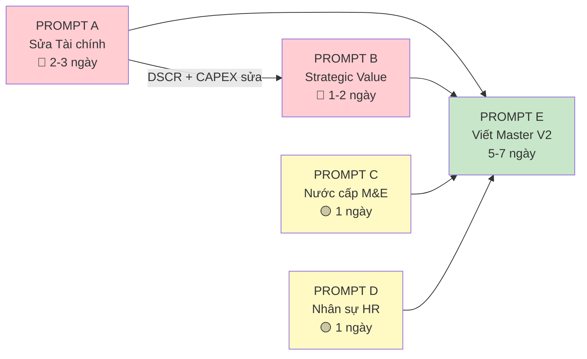

# PROMPT YÊU CẦU CHUYÊN GIA BỔ SUNG NỘI DUNG CHO ĐỀ ÁN V2
## Danh sách Prompt giao việc cho các chuyên gia chuyên ngành

**Ngày lập:** 04/03/2026  
**Mục đích:** Sửa 6 vấn đề CRITICAL + 4 vấn đề HIGH trước khi tổng hợp Đề án V2  
**Ưu tiên thực hiện:** Prompt A → B → C → D → E (tuần tự, có phụ thuộc)

---

# MỤC LỤC PROMPT

| # | Prompt | Chuyên gia | Mức độ | Thời gian | Output |
|---|--------|-----------|:---:|:---:|---|
| A | Sửa Mô hình Tài chính | Chuyên gia Tài chính | 🔴 CRITICAL | 2-3 ngày | File `08_MO_HINH_TAI_CHINH_V1.1.md` |
| B | Phân tích Strategic Value | Chuyên gia Chiến lược | 🔴 CRITICAL | 1-2 ngày | Bổ sung vào P2 mục 10 |
| C | Giải quyết Nước cấp KCNC | Chuyên gia M&E | 🟡 HIGH | 1 ngày | Bổ sung vào P3 + P4 |
| D | Bổ sung JD Nhân sự chủ chốt | Chuyên gia HR | 🟡 HIGH | 1 ngày | File mới hoặc bổ sung P8 |
| E | Viết Master Document V2 | Chuyên gia Tổng hợp | — | 5-7 ngày | 10 file V2 hoàn chỉnh |

---

# PROMPT A: CHUYÊN GIA TÀI CHÍNH — SỬA 6 VẤN ĐỀ TRONG MÔ HÌNH TÀI CHÍNH

---

```
=== BẮT ĐẦU PROMPT ===

BỐI CẢNH:
Bạn là Chuyên gia Phân tích Tài chính Dự án Đầu tư (CFA/ACCA level), 
có kinh nghiệm lập mô hình tài chính cho dự án greenfield manufacturing 
và datacenter quy mô 30-100M USD tại Đông Nam Á.

TÀI LIỆU ĐÃ CÓ:
1. Mô hình tài chính hiện tại: `08_MO_HINH_TAI_CHINH_MO_RONG.md` (1.206 dòng)
2. Báo cáo EIA: `09_BAO_CAO_EIA_TONG_HOP_3_KHOI.md` — có CAPEX MT = 2.870.000 USD, OPEX MT = 425.000 USD/năm
3. Báo cáo PCCC: `10_PCCC_AN_TOAN_LAO_DONG.md` — có CAPEX PCCC = 2.084.000 USD, OPEX PCCC = 100.900 USD/năm
4. Báo cáo kiểm tra chất lượng: `11_KIEM_TRA_CHAT_LUONG_P2_P3_P4_P7.md` — liệt kê 6 vấn đề P2

YÊU CẦU: Sửa chữa 6 vấn đề dưới đây trong mô hình tài chính. 
Output: File mới `08_MO_HINH_TAI_CHINH_V1.1.md` với các phần đã sửa được đánh dấu [V1.1 SỬA].

─────────────────────────────────────────────────
VẤN ĐỀ 1 — MÂU THUẪN EQUITY (23,1M vs 34,97M) [CRITICAL]
─────────────────────────────────────────────────
Hiện tại:
- Cấu trúc vốn (Mục 9.1): Tổng Equity = 23,10M (49% × 47,50M)
- Cash Flow 10 năm (Mục 5.2): Tổng Equity injection = 34,97M
- Chênh lệch 11,87M không được giải thích

Yêu cầu:
a) Thêm mục giải thích rõ ràng: 23,1M là CAPEX equity ban đầu, 11,87M là operational 
   equity bổ sung (working capital + bù lỗ ramp-up). Viết thành bảng bridging:
   
   | Khoản mục | Giá trị (M USD) | Ghi chú |
   |---|---:|---|
   | Equity CAPEX ban đầu | 23,10 | Phase 1: 14,2M + Phase 2: 8,9M |
   | Working Capital injection | 5,50 | Để tài trợ AR/AP trong 3 năm đầu |
   | Bù lỗ ramp-up Y1-Y2 | 4,20 | Cash burn trước breakeven |
   | Buffer/Contingency | 2,17 | 10% contingency |
   | **Tổng Equity cần huy động** | **34,97** | |

b) Cập nhật bảng Cấu trúc vốn (Mục 9.1) thêm cột "Equity bổ sung operational" 
   để nhà đầu tư thấy rõ tổng cam kết vốn chủ = 35M (không phải 23M).
c) Kiểm tra lại bảng Cash Flow Mục 5.2 — đảm bảo tổng equity rót = 34,97M khớp 
   dòng "Equity injection" cộng lại.

─────────────────────────────────────────────────
VẤN ĐỀ 2 — CAPEX CASH FLOW ≠ TỔNG CAPEX (48,27M vs 47,50M) [TRUNG BÌNH]  
─────────────────────────────────────────────────
Hiện tại: Chênh lệch 0,77M không giải thích.

Yêu cầu:
a) Xác định 0,77M là gì (Replacement CAPEX? Contingency? Rounding?)
b) Nếu là Replacement CAPEX: Thêm dòng ghi chú trong Cash Flow "Replacement CAPEX 
   Y5: 0,50M (thay thế server đã khấu hao), Y7: 0,27M (dao cắt CNC)"
c) Nếu là lỗi tính: Sửa cho khớp 47,50M

─────────────────────────────────────────────────
VẤN ĐỀ 3 — DSCR KHÔNG ĐẠT COVENANT (max 1,18x < 1,2x) [CRITICAL]
─────────────────────────────────────────────────
Hiện tại: DSCR suốt 10 năm không bao giờ đạt 1,2x (covenant tiêu chuẩn ngân hàng VN).

Yêu cầu:
a) Tính toán 3 phương án cơ cấu trả nợ thay thế:
   - Option 1: Grace period 3 năm (chỉ trả lãi), sau đó trả gốc đều 7 năm
   - Option 2: Balloon payment — trả 20% gốc/năm trong 5 năm đầu, balloon 50% cuối Y10
   - Option 3: Step-up — Y1-3 trả 5% gốc/năm, Y4-7 trả 10%, Y8-10 trả 15%

b) Cho mỗi Option, tính DSCR từng năm Y1→Y10, đánh dấu năm nào đạt/không đạt 1,2x.

c) Khuyến nghị Option nào tối ưu nhất (DSCR đạt + tổng lãi thấp nhất).

d) Nếu không Option nào đạt: Đề xuất giảm tỷ lệ vay (từ 31% xuống 25%) và tính lại 
   WACC, NPV, IRR tương ứng.

─────────────────────────────────────────────────
VẤN ĐỀ 4 — THIẾU CHI PHÍ MÔI TRƯỜNG + PCCC TRONG P&L [CRITICAL]
─────────────────────────────────────────────────
Hiện tại: P&L không nêu rõ chi phí MT + PCCC.

Yêu cầu:
a) CAPEX — Bổ sung 2 dòng trong bảng CAPEX tổng hợp (Mục 2.1):
   
   | Hạng mục | Phase 1 | Phase 2 | Tổng | Nguồn |
   |---|---:|---:|---:|---|
   | CAPEX Môi trường | 2,15M | 0,72M | 2,87M | P3 Chương VII |
   | CAPEX PCCC | 1,60M | 0,48M | 2,08M | P7 Chương VIII |
   
   → Kiểm tra: 47,50M hiện tại đã bao gồm 4,95M này chưa? 
     Nếu CHƯA: Tổng CAPEX thực tế = 52,45M → cần điều chỉnh toàn bộ mô hình.
     Nếu ĐÃ (nằm trong "Hạ tầng chung 5,90M"): Ghi chú rõ ràng.

b) OPEX — Thêm 2 dòng trong P&L hàng năm:
   
   | Chi phí | Giá trị/năm | Từ năm |
   |---|---:|---|
   | OPEX Môi trường (quan trắc, xử lý, vật tư) | 425.000 USD | Y1 |
   | OPEX PCCC (bảo trì, bảo hiểm, đào tạo, nhân sự) | 100.900 USD | Y1 |
   | **Tổng** | **525.900 USD** | |

c) Tính lại NPV, IRR sau khi bổ sung 525.900 USD/năm OPEX.

─────────────────────────────────────────────────
VẤN ĐỀ 5 — GPU LEASE vs BUY chưa có NPV so sánh [HIGH]
─────────────────────────────────────────────────
Hiện tại: Khuyến nghị lease GPU nhưng không có phân tích định lượng.

Yêu cầu:
a) Lập bảng so sánh NPV 5 năm cho 2 kịch bản:
   - Kịch bản A (Mua): CAPEX 5,6M (Phase 1) + 7,5M (Phase 2) = 13,1M. 
     Khấu hao 3,5 năm. Residual value = 10% sau 4 năm.
   - Kịch bản B (Lease): OPEX 3,2M/năm (ước tính dựa trên NVIDIA DGX-as-a-Service 
     pricing). Không CAPEX upfront. Linh hoạt scale up/down.

b) Tính NPV 5 năm mỗi kịch bản (WACC 12%).
c) Phân tích ưu/nhược:
   - Buy: Tax shield từ khấu hao, nhưng rủi ro obsolescence cao (GPU cycle 2-3 năm)
   - Lease: Flexibility, nhưng tổng chi phí cao hơn nếu utilization > 60%
d) Khuyến nghị: Hybrid (Lease Phase 1, Buy Phase 2 khi có revenue visibility)

─────────────────────────────────────────────────
VẤN ĐỀ 6 — CHI PHÍ PHÁP LÝ ONGOING CHƯA VÀO P&L [NHẸ]
─────────────────────────────────────────────────
Yêu cầu:
Thêm dòng OPEX "Legal & Compliance" = 80.000 USD/năm (bao gồm):
- Luật sư retainer: 36.000 USD/năm
- Gia hạn giấy phép/chứng nhận: 24.000 USD/năm  
- Audit ISO/IATF/AS9100 annual surveillance: 20.000 USD/năm

FORMAT OUTPUT:
- Giữ nguyên cấu trúc file hiện tại
- Mỗi phần sửa đánh dấu: > **[V1.1 SỬA — Vấn đề #X]**
- Giữ quy ước [A]/[B]/[C] cho mọi số liệu mới

=== KẾT THÚC PROMPT ===
```

---

# PROMPT B: CHUYÊN GIA CHIẾN LƯỢC — PHÂN TÍCH STRATEGIC VALUE

---

```
=== BẮT ĐẦU PROMPT ===

BỐI CẢNH:
Bạn là Chuyên gia Tư vấn Chiến lược Kinh doanh (BCG/McKinsey caliber), 
chuyên về định giá chiến lược (Strategic Valuation) và pitching đầu tư 
cho dự án công nghiệp/công nghệ tại Đông Nam Á.

VẤN ĐỀ CẦN GIẢI QUYẾT:
Mô hình tài chính (P2) cho thấy việc mở rộng từ 20M → 47,5M dẫn đến:
- Doanh thu 10 năm GIẢM 14% (119,71M → 103,52M)
- EBITDA margin giảm từ 32% → 14%
- NPV giảm 77% (15,2M → 3,48M)

Nhà đầu tư / BQL KCNC SẼ HỎI: "Tại sao đầu tư gấp 2,4× mà lợi nhuận kém hơn?"

YÊU CẦU: Viết phân tích "Strategic Value Beyond NPV" (5-8 trang), bao gồm:

1. PHÂN TÍCH REAL OPTIONS VALUE
   - Option 1: Quyền mở rộng DC lên 500 Racks khi thị trường đủ lớn (2030+)
   - Option 2: Quyền chuyển đổi CNC → Aerospace tier (AS9100) giúp x3 giá gia công
   - Option 3: Quyền IPO/Exit khi đã có 3 B.U diversified (attractive hơn single B.U)
   - Ước tính giá trị mỗi option bằng Black-Scholes hoặc Decision Tree đơn giản

2. BARRIER TO ENTRY VALUATION
   - Sở hữu Tier III certified DC + AS9100 CNC trong KCNC = barrier cực cao
   - Ước tính chi phí 1 đối thủ mới phải bỏ ra để replicate: >100M + 5 năm
   - Giá trị brand equity + customer lock-in (3Y contracts DC, IATF audit lock-in)

3. SYNERGY REVENUE
   - CNC cung cấp khung/vỏ cho Robot AMR nội bộ → tiết kiệm 15-20% chi phí
   - DC cung cấp AI training cho AMR navigation → tiết kiệm 200-500K USD/năm outsource
   - MekongOS IoT Cloud chạy trên DC → 100% margin (vs thuê AWS 30-40% chi phí)
   - Khách hàng CNC (FDI) cũng cần DC → cross-sell potential

4. ECOSYSTEM VALUE
   - So sánh với mô hình Foxconn (sản xuất + logistics + cloud)
   - So sánh với mô hình Flex (EMS + robotics + industry 4.0)
   - Valuation multiple: Single B.U = 5-8x EBITDA, Diversified Industrial = 10-15x EBITDA

5. BẢNG TÓM TẮT ADJUSTED VALUATION

   | Thành phần | Giá trị (M USD) | Phương pháp |
   |---|---:|---|
   | NPV tài chính (Base Case) | 3,48 | DCF |
   | Real Options Value | [Tính] | Black-Scholes/DT |
   | Synergy Value | [Tính] | DCF incremental |
   | Barrier-to-entry premium | [Tính] | Replacement cost |
   | **Adjusted Strategic Value** | **[Tổng]** | |

→ Mục tiêu: Chứng minh Adjusted Strategic Value > 15M (vượt NPV của Đề án gốc 20M)

FORMAT: Markdown, có bảng, có callout quotes cho key insights.
Ngôn ngữ: Tiếng Việt, thuật ngữ tài chính giữ tiếng Anh trong ngoặc.

=== KẾT THÚC PROMPT ===
```

---

# PROMPT C: CHUYÊN GIA M&E — GIẢI QUYẾT VẤN ĐỀ NƯỚC CẤP KCNC

---

```
=== BẮT ĐẦU PROMPT ===

BỐI CẢNH:
Bạn là Kỹ sư Thiết kế Hạ tầng MEP (M&E), chuyên về Datacenter cooling 
và water management cho khu công nghiệp tại Việt Nam.

VẤN ĐỀ:
Tổ hợp Mekong Technology (10.000 m², 3 khối) có nhu cầu nước cấp rất lớn:

| Nguồn nhu cầu | Lượng nước (m³/ngày) | Ghi chú |
|---|---:|---|
| DC Cooling (make-up water) | 60-80 | Sau hybrid cooling (-40%) |
| CNC (coolant, rửa máy) | 15-25 | MWF treatment + top-up |
| SMT (PCB wash, clean room) | 10-15 | IPA recovery |
| Sinh hoạt (270 người) | 12-15 | 50 L/người/ngày |
| Blowdown & Drift loss | 22-44 | Cooling tower evaporation |
| **TỔNG** | **119-179** | **Vượt quota KCNC 150 m³/ngày** |

Quota nước KCNC TP.HCM cấp cho Lô E2-03 = 150 m³/ngày.
→ Ở tải cao (Phase 2 full), nhu cầu có thể VƯỢT quota 20-30%.

YÊU CẦU: Viết phân tích kỹ thuật (3-5 trang) với 4 giải pháp:

1. GIẢI PHÁP A: Tối ưu hóa cooling system
   - Tăng tỷ lệ Direct-to-Chip Liquid Cooling (CDU) → giảm chiller load
   - Nâng Cycles of Concentration (CoC) từ 5 → 8 cycle → giảm blowdown 40%
   - Dùng adiabatic pre-cooling thay vì evaporative cooling hoàn toàn
   - Ước tính nước tiết kiệm: X m³/ngày, chi phí bổ sung: Y USD

2. GIẢI PHÁP B: Tái chế nước
   - Hệ thống xử lý nước thải tuần hoàn (Grey Water Recycling) cho CNC + SMT
   - RO (Reverse Osmosis) cho nước blowdown → tái sử dụng cho make-up
   - Ước tính tỷ lệ thu hồi 70-80%, investment: Z USD

3. GIẢI PHÁP C: Nguồn nước bổ sung
   - Thu nước mưa (Rainwater Harvesting) — diện tích mái 3.000 m², 
     lượng mưa TB HCM ~1.800mm/năm → ước tính X m³/ngày (trung bình hóa)
   - Giếng khoan bổ sung (nếu KCNC cho phép)
   - Mua nước xe bồn (emergency only)

4. GIẢI PHÁP D: Đàm phán KCNC
   - Văn bản đề xuất tăng quota lên 200 m³/ngày
   - Đính kèm cam kết PUE < 1,35 + Water Usage Effectiveness (WUE) < 1,8 L/kWh
   - Cam kết lắp đặt water metering IoT (dùng sản phẩm MK-100 của chính Mekong)
   - Cam kết báo cáo nước sử dụng online real-time cho BQL KCNC

5. BẢNG TÓM TẮT

   | Giải pháp | Nước tiết kiệm | CAPEX | OPEX/năm | Khả thi |
   |---|---:|---:|---:|:---:|
   | A: Tối ưu cooling | ? m³/ngày | ? USD | ? USD | ✅ |
   | B: Tái chế nước | ? m³/ngày | ? USD | ? USD | ✅ |
   | C: Rainwater | ? m³/ngày | ? USD | ? USD | ⚠️ |
   | D: Tăng quota | +50 m³/ngày | 0 | 0 | ⚠️ |
   | **Tổng** | **? m³/ngày** | | | |

→ Mục tiêu: Chứng minh tổ hợp có thể vận hành full load trong quota 150 m³/ngày 
   (hoặc 200 m³/ngày nếu có quota mới).

FORMAT: Markdown, bảng kỹ thuật, có sơ đồ water balance (text-based).

=== KẾT THÚC PROMPT ===
```

---

# PROMPT D: CHUYÊN GIA HR — JD NHÂN SỰ CHỦ CHỐT

---

```
=== BẮT ĐẦU PROMPT ===

BỐI CẢNH:
Bạn là Chuyên gia Tuyển dụng & Quản trị Nhân sự Cấp cao, có kinh nghiệm 
tuyển dụng cho Datacenter operations và CNC manufacturing tại Việt Nam.

DỰ ÁN: Mekong Technology — Tổ hợp 3 B.U (CNC + DC + IoT/Robot), 190-270 nhân sự.

VẤN ĐỀ: Đội ngũ hiện tại (CEO, CTO, CFO, COO) có background IoT/Robot, 
CHƯA CÓ 3 vị trí then chốt:

YÊU CẦU: Viết JD (Job Description) chi tiết cho 3 vị trí + phân tích thị trường lao động.

─────────────────────────────────────────────────
VỊ TRÍ 1: GENERAL MANAGER — CNC BUSINESS UNIT
─────────────────────────────────────────────────
a) JD chi tiết:
   - Title, Report to, Location, Salary range (benchmark VN), Start date
   - Trách nhiệm: Vận hành xưởng 25 máy CNC 5 trục, đạt IATF 16949 &
     AS9100, quản lý 45-65 nhân viên, phát triển kinh doanh FDI
   - Yêu cầu: Kinh nghiệm CNC ≥10 năm, đã quản lý xưởng ≥20 máy, 
     hiểu IATF/AS9100 audit, tiếng Anh thành thạo (giao tiếp FDI)
   - Ưu tiên: Từng làm ở Misumi/VPIC/Cosmos/xưởng FDI Nhật
   - Đánh giá thị trường:
     + Số lượng ứng viên tiềm năng tại VN: ước ≤50 người
     + Salary benchmark: 3.000-5.000 USD/tháng (gross)
     + Headhunter fee: 15-25% lương năm
     + Thời gian tuyển: 3-6 tháng

─────────────────────────────────────────────────
VỊ TRÍ 2: GENERAL MANAGER — DATACENTER BUSINESS UNIT
─────────────────────────────────────────────────
a) JD chi tiết:
   - Trách nhiệm: Vận hành DC Tier III (100 Racks), quản lý NOC 24/7,
     30-50 nhân sự, sales B2B (Colo + GPU-aaS), đạt Uptime 99,982%
   - Yêu cầu: Kinh nghiệm DC operations ≥8 năm, CDCDP/CDCEP certified 
     (Uptime Institute), đã vận hành DC ≥50 racks, tiếng Anh thành thạo
   - Ưu tiên: Từng làm ở Viettel IDC/FPT DC/CMC/NTT Vietnam
   - Đánh giá thị trường:
     + Số lượng ứng viên tiềm năng: ≤30 người (rất hiếm)
     + Salary benchmark: 4.000-7.000 USD/tháng (gross)
     + Thời gian tuyển: 4-8 tháng (rất khó)
     + Phương án thay thế: Thuê expatriate từ Singapore/Malaysia (8-12K USD/tháng)

─────────────────────────────────────────────────
VỊ TRÍ 3: LEGAL & COMPLIANCE DIRECTOR
─────────────────────────────────────────────────
a) JD chi tiết:
   - Trách nhiệm: Quản lý toàn bộ hồ sơ pháp lý 3 B.U (18 giấy phép),
     liên hệ BQL KCNC, Sở KH&ĐT, Sở TNMT, đàm phán hợp đồng FDI
   - Yêu cầu: Luật sư hành nghề, kinh nghiệm pháp lý doanh nghiệp ≥5 năm,
     hiểu biết Luật Đầu tư 2020, Luật CNC 2008, Luật BVMT 2020
   - Ưu tiên: Từng xử lý hồ sơ đầu tư tại KCNC/KCN
   - Salary: 2.000-4.000 USD/tháng

b) Kế hoạch tuyển dụng tổng thể 190-270 nhân sự:
   - Phase 1 (Q1-Q4/2026): 50 người (core team + construction supervision)
   - Phase 2 (Q1-Q4/2027): 120 người (production ramp-up)
   - Phase 3 (2028+): 100 người (full operation)
   - Gantt chart tuyển dụng theo quý
   - Kênh tuyển dụng: LinkedIn, VietnamWorks, Headhunter chuyên ngành
   - Budget tuyển dụng/đào tạo: ước tính

FORMAT: Markdown, bảng JD chuẩn, bảng benchmark salary, Gantt tuyển dụng.

=== KẾT THÚC PROMPT ===
```

---

# PROMPT E: CHUYÊN GIA TỔNG HỢP — VIẾT MASTER DOCUMENT V2

---

```
=== BẮT ĐẦU PROMPT ===

BỐI CẢNH:
Bạn là Chuyên gia Viết Hồ sơ Dự án Đầu tư Công nghệ cao, có kinh nghiệm 
soạn thảo Mẫu 1.4 cho KCNC TP.HCM. Bạn thành thạo Markdown và Mermaid diagrams.

MỤC TIÊU: 
Tổng hợp toàn bộ tài liệu đã có thành Đề án V2 — 10 file Markdown chuyên nghiệp.

TÀI LIỆU INPUT (đọc theo thứ tự):
1. Đề án V1: `TAI_LIEU_GOC/01_DE_AN_CHINH_THUC/1-MEKONG DE AN.md` (11.524 dòng)
2. Phương án trình bày V2: `HO_SO_MO_RONG_REVIEW/00_PHUONG_AN_TRINH_BAY_VER2.md`
3. Tổng quan mở rộng: `HO_SO_MO_RONG_REVIEW/01_TONG_QUAN_MO_RONG.md`
4. Yêu cầu kỹ thuật: `HO_SO_MO_RONG_REVIEW/02_YEU_CAU_REQUIREMENTS.md`
5. Thiết kế giải pháp: `HO_SO_MO_RONG_REVIEW/03_THIET_KE_SOLUTION.md`
6. Kế hoạch hành động: `HO_SO_MO_RONG_REVIEW/04_KE_HOACH_CONG_VIEC_PLAN.md`
7. Pháp lý (5 file): `HO_SO_MO_RONG_REVIEW/06_PHAP_LY/`
8. Phân tích CNC: `HO_SO_MO_RONG_REVIEW/06_PHAN_TICH_CHUYEN_GIA_CNC_OUTSOURCING.md`
9. Phân tích DC: `HO_SO_MO_RONG_REVIEW/06_PHAN_TICH_THI_TRUONG_DATACENTER_VN.md`
10. Mô hình tài chính V1.1: `HO_SO_MO_RONG_REVIEW/08_MO_HINH_TAI_CHINH_V1.1.md` (đã sửa)
11. EIA V2.0: `HO_SO_MO_RONG_REVIEW/09_BAO_CAO_EIA_TONG_HOP_3_KHOI.md`
12. PCCC: `HO_SO_MO_RONG_REVIEW/10_PCCC_AN_TOAN_LAO_DONG.md`
13. M&E: `HO_SO_MO_RONG_REVIEW/12_THIET_KE_HA_TANG_ME.md`
14. Strategic Value (từ Prompt B): Phân tích giá trị chiến lược
15. Nước cấp (từ Prompt C): Giải pháp water management
16. Nhân sự (từ Prompt D): JD 3 vị trí chủ chốt

QUY TẮC VIẾT:
1. Theo đúng cấu trúc 10 file trong `00_PHUONG_AN_TRINH_BAY_VER2.md` (Mục II.2)
2. Mỗi file CÓ ÍT NHẤT 2-3 biểu đồ Mermaid (tổng 20 biểu đồ theo danh sách Mục III)
3. Giữ ngôn ngữ chính thức, phù hợp nộp BQL KCNC (không dùng ngôn ngữ "dân dã" 
   như trong các file review)
4. Số liệu lấy từ P2/P3/P5/P6/P7 (nguồn chuyên gia), KHÔNG bịa số liệu mới
5. Mọi giả định đánh dấu [A], benchmark [B], cam kết [C]
6. Bảng Markdown gọn gàng, align right cho số liệu
7. Tổng chiều dài V2: ~4.000-5.000 dòng (gọn hơn V1 11.524 dòng nhưng đầy đủ hơn)
8. Trang bìa mỗi file: Logo placeholder + "CỘNG HÒA XÃ HỘI CHỦ NGHĨA VIỆT NAM" + 
   thông tin dự án

OUTPUT: 10 file Markdown + 5 file Phụ lục, đặt trong thư mục `DE_AN_MEKONG_V2/`

LƯU Ý ĐẶC BIỆT — GIẢI THÍCH V1 vs V2:
Trong File 09 (Kết luận), PHẢI có section giải thích tại sao mở rộng từ 20M → 47,5M 
là quyết định đúng đắn, dùng Strategic Value Analysis từ Prompt B. Đây là câu hỏi 
#1 mà BQL KCNC sẽ đặt ra.

=== KẾT THÚC PROMPT ===
```

---

# PHỤ LỤC: THỨ TỰ THỰC HIỆN & PHỤ THUỘC



**Tổng timeline: 2-3 tuần** (Prompt A→B tuần 1, Prompt C+D song song tuần 1-2, Prompt E tuần 2-3)

---

**LƯU Ý QUAN TRỌNG CHO NGƯỜI THỰC HIỆN:**
- Mỗi Prompt copy nguyên văn block `=== BẮT ĐẦU PROMPT ===` đến `=== KẾT THÚC PROMPT ===`
- Gửi kèm file tài liệu liên quan (liệt kê trong phần "TÀI LIỆU ĐÃ CÓ")  
- Output của Prompt A là INPUT bắt buộc cho Prompt B và E
- Prompt C và D có thể chạy SONG SONG với A+B
- Prompt E chạy SAU KHI có output của cả 4 prompt trước
