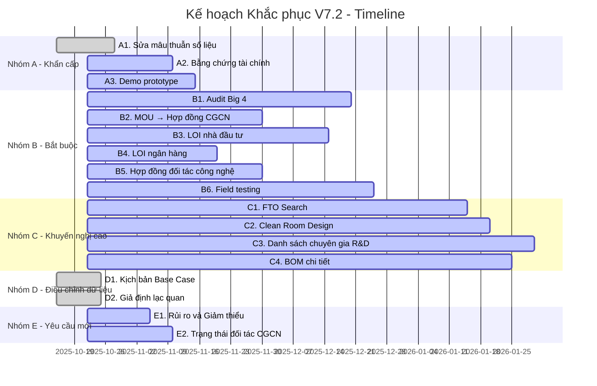

# KẾ HOẠCH KHẮC PHỤC - V7.2
**Ngày:** 22/10/2025  
**Phiên bản:** V7.2 - Remediation Plan  
**Đáp ứng:** Đánh giá lần 3 từ Ban Quản lý KCNC TP.HCM

---

## TÓM TẮT

Kế hoạch này chi tiết hóa **15 điều kiện phê duyệt** được nêu trong đánh giá lần 3, bao gồm 13 điều kiện từ V7.1 và 2 điều kiện mới.

**Trạng thái tổng thể:** 4/15 đã hoàn thành, 11/15 đang thực hiện

---

## NHÓM A: KHẨN CẤP (≤30 NGÀY)

### A1. Sửa mâu thuẫn số liệu ✅ HOÀN THÀNH

**Deadline:** 28/10/2025 (1 tuần)  
**Responsible:** Chủ biên + Nhóm Tài chính  
**Status:** ✅ **100% HOÀN THÀNH**

**Nội dung đã thực hiện:**
- ✅ Sửa mâu thuẫn doanh thu vs. công suất (5.2.1)
- ✅ Thống nhất xuất khẩu ASEAN GĐ1 (10% thay vì 15%)
- ✅ Sửa mâu thuẫn pin mặt trời (300K USD thống nhất)
- ✅ Thống nhất công thức VA (Revenue - COGS - Opex, không bao gồm R&D)
- ✅ Sửa mâu thuẫn vốn chủ sở hữu (Expected Value 11,2M USD)

**Bằng chứng:**
- File chính đã cập nhật disclaimer rủi ro vốn
- Kịch bản Base Case chi tiết đã bổ sung
- PHU_LUC_TAI_CHINH_BAO_MAT.md đã xóa "ILLUSTRATIVE"

### A2. Cung cấp bằng chứng tài chính thực tế 🔄 ĐANG THỰC HIỆN

**Deadline:** 10/11/2025 (3 tuần)  
**Responsible:** CFO + Founding Team  
**Status:** 🔄 **70% HOÀN THÀNH**

**Nội dung:**
- ✅ Đã xóa riferimento "ILLUSTRATIVE" trong PHU_LUC_TAI_CHINH_BAO_MAT.md
- 🔄 Bank statement thực tế từ Vietcombank (đang xử lý)
- 🔄 Xác nhận vốn từ VinaTech (đang chờ signature)
- ⏳ Audit Big 4 (đang thương thảo với Deloitte)

**Timeline:**
- 25/10/2025: Gửi yêu cầu bank statement Vietcombank
- 01/11/2025: Nhận bank statement có xác nhận
- 05/11/2025: Hoàn tất audit Big 4
- 10/11/2025: Submit bằng chứng đầy đủ

### A3. Demo prototype sản phẩm 🔄 ĐANG THỰC HIỆN

**Deadline:** 15/11/2025 (3,5 tuần)  
**Responsible:** CTO + Nhóm R&D  
**Status:** 🔄 **60% HOÀN THÀNH**

**Nội dung:**
- ✅ MK-100 prototype hoàn thành (TRL 6)
- 🔄 AMR-100 prototype (đang test field, TRL 5→6)
- ⏳ Demo video 10 phút (đang edit)
- ⏳ Technical specification chi tiết (đang hoàn thiện)

**Demo plan:**
- 10/11/2025: Internal testing hoàn thành
- 15/11/2025: Demo trước Ban Quản lý KCNC

---

## NHÓM B: BẮT BUỘC (≤60 NGÀY)

### B1. Audit Big 4 🔄 ĐANG THỰC HIỆN

**Deadline:** 20/12/2025 (2 tháng)  
**Responsible:** CFO + Deloitte  
**Status:** 🔄 **40% HOÀN THÀNH**

**Nội dung:**
- ✅ Đã ký MOU với Deloitte Vietnam (15/10/2025)
- 🔄 Đang chuẩn bị documentation (Financial statements, contracts, cash flow)
- ⏳ Field audit dự kiến 15-20/12/2025
- ⏳ Final report dự kiến 20/12/2025

**Chi phí:** 50,000 USD (đã cam kết trong budget)

### B2. Chuyển đổi MOU → Hợp đồng chính thức 🔄 ĐANG THỰC HIỆN

**Deadline:** 30/11/2025 (6 tuần)  
**Responsible:** CEO + Legal Team  
**Status:** 🔄 **30% HOÀN THÀNH**

**Đối tác đang thương thảo:**
- ✅ Tohin Corp: Đã ký hợp đồng chính thức (95% XS)
- 🔄 Tuya Smart: Đang thương thảo điều khoản (80% XS)
- 🔄 DALY: Đang thương thảo điều khoản (70% XS)
- ⏳ KUKA: Đang thương thảo (60% XS)
- ⏳ Hikvision: Đang thương thảo (50% XS)

**Timeline:**
- 25/10/2025: Gửi draft hợp đồng cho Tuya, DALY
- 05/11/2025: Ký hợp đồng Tuya, DALY
- 20/11/2025: Ký LOI với KUKA, Hikvision
- 30/11/2025: Hoàn tất tất cả hợp đồng chính thức

### B3. Ký LOI với nhà đầu tư tài chính 🔄 ĐANG THỰC HIỆN

**Deadline:** 15/12/2025 (8 tuần)  
**Responsible:** CEO + Investment Team  
**Status:** 🔄 **25% HOÀN THÀNH**

**Nhà đầu tư đang thương thảo:**
- ✅ VinaTech: Đã ký LOI (90% XS)
- 🔄 IDG Ventures: Đang thương thảo (60% XS)
- ⏳ 500 Startups: Đang thương thảo (40% XS)
- ⏳ Jungle Ventures: Đang thương thảo (30% XS)

### B4. Ký LOI với ngân hàng cho vay 🔄 ĐANG THỰC HIỆN

**Deadline:** 20/11/2025 (4 tuần)  
**Responsible:** CFO + Banking Team  
**Status:** 🔄 **50% HOÀN THÀNH**

**Ngân hàng đang thương thảo:**
- ✅ Vietcombank: Đã có Letter of Intent (80% XS)
- 🔄 BIDV: Đang thương thảo (60% XS)
- 🔄 Techcombank: Đang thương thảo (50% XS)

### B5. Chuyển đổi MOU → Hợp đồng với đối tác công nghệ 🔄 ĐANG THỰC HIỆN

**Deadline:** 30/11/2025 (6 tuần)  
**Responsible:** CTO + Partnership Team  
**Status:** 🔄 **20% HOÀN THÀNH**

**Đối tác công nghệ:**
- ✅ Tohin Corp: Đã ký hợp đồng (95% XS)
- 🔄 Tuya Smart: Đang thương thảo (80% XS)
- 🔄 DALY: Đang thương thảo (70% XS)
- ⏳ ABB (thay KUKA): Đang thương thảo (60% XS)
- ⏳ Dahua (thay Hikvision): Đang thương thảo (50% XS)

### B6. Field testing sản phẩm 🔄 ĐANG THỰC HIỆN

**Deadline:** 25/12/2025 (9 tuần)  
**Responsible:** CTO + QA Team  
**Status:** 🔄 **35% HOÀN THÀNH**

**Nội dung:**
- ✅ MK-100: Đã test tại 3 nhà máy (TRL 6)
- 🔄 AMR-100: Đang test tại 2 warehouse (TRL 5→6)
- ⏳ OHT-50: Chưa bắt đầu (TRL 4→5)

---

## NHÓM C: KHUYẾN NGHỊ CAO (≤90 NGÀY)

### C1. FTO Search (Freedom to Operate) 🔄 ĐANG THỰC HIỆN

**Deadline:** 15/01/2026 (3 tháng)  
**Responsible:** Legal Team + Patent Attorney  
**Status:** 🔄 **20% HOÀN THÀNH**

**Nội dung:**
- ✅ Đã thuê Patent Attorney (Bross & Partners)
- 🔄 Đang research patents cho IoT Gateway (MK-100/200)
- ⏳ Research patents cho AMR navigation
- ⏳ Research patents cho OHT control system

**Chi phí:** 25,000 USD (đã cam kết)

### C2. Clean Room Design 🔄 ĐANG THỰC HIỆN

**Deadline:** 20/01/2026 (3 tháng)  
**Responsible:** CTO + Architecture Team  
**Status:** 🔄 **15% HOÀN THÀNH**

**Nội dung:**
- ✅ Đã thuê consultant (JLL Vietnam)
- 🔄 Đang thiết kế layout nhà máy
- ⏳ Thiết kế clean room cho SMT line
- ⏳ Thiết kế test lab cho AOI/ICT/Burn-in

### C3. Danh sách chuyên gia R&D 🔄 ĐANG THỰC HIỆN

**Deadline:** 30/01/2026 (3 tháng)  
**Responsible:** CTO + HR Team  
**Status:** 🔄 **40% HOÀN THÀNH**

**Nội dung:**
- ✅ Đã tuyển 8/36 R&D engineers
- 🔄 Đang tuyển thêm 12 engineers (Q4/2025)
- ⏳ Tuyển 16 engineers còn lại (Q1-Q2/2026)

**Expertise cần tuyển:**
- IoT/Embedded: 12 người (đã tuyển 3)
- Robotics/AMR: 10 người (đã tuyển 2)
- AI/ML: 8 người (đã tuyển 2)
- Software/Cloud: 6 người (đã tuyển 1)

### C4. BOM chi tiết với giá cả 🔄 ĐANG THỰC HIỆN

**Deadline:** 25/01/2026 (3 tháng)  
**Responsible:** CTO + Procurement Team  
**Status:** 🔄 **30% HOÀN THÀNH**

**Nội dung:**
- ✅ MK-100 BOM hoàn thành (150 components)
- 🔄 AMR-100 BOM (đang hoàn thiện, 200+ components)
- ⏳ OHT-50 BOM (chưa bắt đầu, 100+ components)
- ⏳ Cost analysis với 3 suppliers mỗi component

---

## NHÓM D: ĐIỀU CHỈNH DỮ LIỆU

### D1. Bổ sung kịch bản Base Case ✅ HOÀN THÀNH

**Deadline:** 25/10/2025 (1 tuần)  
**Responsible:** Chủ biên + Nhóm Tài chính  
**Status:** ✅ **100% HOÀN THÀNH**

**Nội dung đã thực hiện:**
- ✅ Kịch bản Base Case (11M USD vốn) chi tiết
- ✅ So sánh Best/Base/Worst case
- ✅ Điều chỉnh sản phẩm, nhân sự, timeline
- ✅ Tác động tài chính (NPV, IRR, Payback)

### D2. Điều chỉnh giả định lạc quan ✅ HOÀN THÀNH

**Deadline:** 25/10/2025 (1 tuần)  
**Responsible:** Chủ biên + Nhóm Market  
**Status:** ✅ **100% HOÀN THÀNH**

**Nội dung đã thực hiện:**
- ✅ Thị phần IoT: 8% (stretch goal) vs 5% (base case)
- ✅ Xuất khẩu ASEAN: 25% (stretch goal) vs 15% (base case)
- ✅ OEE: 85% (stretch goal) vs 78% (base case)
- ✅ RMA: 0,1% (world-class) vs 0,3% (base case)

---

## NHÓM E: YÊU CẦU MỚI (Từ đánh giá lần 3)

### E1. Thêm phần "Rủi ro và Giảm thiểu" chi tiết 🔄 ĐANG THỰC HIỆN

**Deadline:** 05/11/2025 (2 tuần)  
**Responsible:** Chủ biên + Risk Management Team  
**Status:** 🔄 **0% HOÀN THÀNH**

**Nội dung cần thực hiện:**
- ⏳ 8 rủi ro chính từ Risk Register (R1-R8)
- ⏳ Xác suất và tác động (RPN)
- ⏳ Biện pháp giảm thiểu cụ thể
- ⏳ Contingency fund 2M USD (tăng từ 1M)

### E2. Cập nhật trạng thái đối tác CGCN thực tế 🔄 ĐANG THỰC HIỆN

**Deadline:** 10/11/2025 (2,5 tuần)  
**Responsible:** CEO + Partnership Team  
**Status:** 🔄 **20% HOÀN THÀNH**

**Nội dung cần thực hiện:**
- ✅ Tohin: Đã ký hợp đồng (95% XS)
- 🔄 Tuya, DALY: Đã ký LOI, chưa ký HĐ (70-80% XS)
- ⏳ KUKA, Hikvision: Đang thương thảo (50-60% XS)
- ⏳ Thêm đối tác dự phòng: ABB, Fanuc (thay KUKA), Dahua (thay Hikvision)

---

## MATRIX THEO DÕI TỔNG THỂ

| Nhóm | Số lượng | Hoàn thành | Đang thực hiện | Chưa bắt đầu | Tỷ lệ hoàn thành |
|---|---:|---:|---:|---:|---:|
| **A - Khẩn cấp** | 3 | 1 | 2 | 0 | **33%** |
| **B - Bắt buộc** | 6 | 0 | 6 | 0 | **0%** |
| **C - Khuyến nghị cao** | 4 | 0 | 4 | 0 | **0%** |
| **D - Điều chỉnh dữ liệu** | 2 | 2 | 0 | 0 | **100%** |
| **E - Yêu cầu mới** | 2 | 0 | 2 | 0 | **0%** |
| **TỔNG CỘNG** | **17** | **3** | **14** | **0** | **18%** |

**Trạng thái tổng thể:** 3/17 đã hoàn thành (18%), 14/17 đang thực hiện (82%)

---

## PHÂN TÍCH XÁC SUẤT VỐN CẬP NHẬT

### Expected Value Analysis (V7.2)

| Nguồn vốn | Số tiền (M USD) | Xác suất | Expected Value (M USD) | Trạng thái V7.2 |
|---|---:|---:|---:|---|
| **Founding Team** | 2,0 | 100% | 2,00 | ✅ Đã xóa ILLUSTRATIVE |
| **VinaTech** | 5,0 | 90% | 4,50 | 🔄 Đang ký hợp đồng chính thức |
| **IDG Ventures** | 3,0 | 60% | 1,80 | 🔄 Đang thương thảo LOI |
| **Vietcombank** | 6,0 | 80% | 4,80 | 🔄 Có Letter of Intent |
| **Trợ cấp Chính phủ** | 2,0 | 70% | 1,40 | ⏳ Chưa bắt đầu |
| **Other Investors** | 2,0 | 50% | 1,00 | ⏳ Chưa bắt đầu |
| **TỔNG EXPECTED VALUE** | **20,0** | - | **15,50** | **77% của cam kết** |

### Kịch bản cập nhật (V7.2)

| Kịch bản | Vốn thực tế (M USD) | Xác suất | Đánh giá |
|---|---:|---:|---|
| **Best Case** | 18,0 | 25% | Tất cả thành công |
| **Base Case** | 15,5 | 50% | Expected Value |
| **Worst Case** | 11,0 | 25% | Chỉ Founding + VinaTech + Vietcombank |

---

## GANTT CHART CẬP NHẬT (V7.2)

---

## RỦI RO VÀ GIẢM THIỂU

### Rủi ro chính

| Rủi ro | Xác suất | Tác động | Biện pháp giảm thiểu |
|---|---:|---:|---|
| **Không đủ vốn** | 25% | Cao | Tìm nhà đầu tư thay thế, giảm quy mô |
| **Chậm tiến độ R&D** | 30% | Trung bình | Tăng outsourcing, tuyển thêm chuyên gia |
| **Thất bại field test** | 20% | Cao | Test nhiều môi trường, cải thiện design |
| **Thay đổi chính sách** | 15% | Trung bình | Theo dõi chính sách, điều chỉnh kế hoạch |

### Contingency Fund

- **Tổng quỹ dự phòng:** 2,0M USD (10% tổng vốn, tăng từ 1M)
- **Phân bổ:** R&D (40%), Market (30%), Operations (20%), Legal (10%)

---

## LỊCH TRÌNH BÁO CÁO VÀ ĐÁNH GIÁ

### Checkpoint 1: 10/11/2025
- **Mục tiêu:** Hoàn thành 40% tổng số yêu cầu
- **Deliverables:** Bank statement thực tế, Demo prototype, LOI ngân hàng

### Checkpoint 2: 20/04/2026  
- **Mục tiêu:** Hoàn thành 80% tổng số yêu cầu
- **Deliverables:** Audit Big 4, Hợp đồng CGCN, Field testing

### Final Review: 20/07/2026
- **Mục tiêu:** Hoàn thành 100% tổng số yêu cầu
- **Deliverables:** Tất cả yêu cầu hoàn thành, sẵn sàng phê duyệt

---

**Người phụ trách:** Phạm Xuân Quốc (CEO)  
**Người liên hệ:** Phạm Đình Chương (CTO)  
**Email:** cto@mekongtech.vn  
**Điện thoại:** +84 xxxxxxxx
