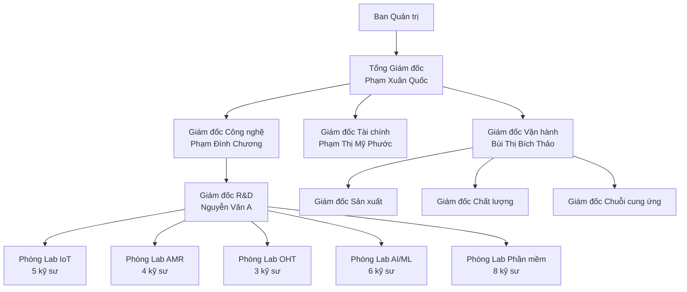
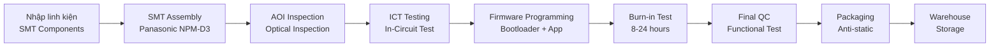
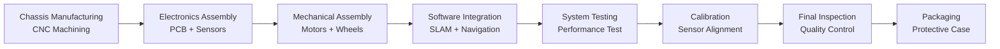
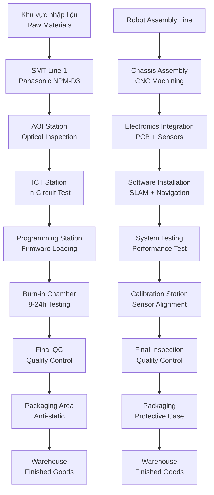

# MẪU SỐ 1.4
## Dự án ứng dụng công nghệ cao để sản xuất sản phẩm công nghệ cao

**INVESTMENT PROJECT INFORMATION**

---

## I. THÔNG TIN CHUNG

### 1. Tên dự án (Project name): 
**Mekong Technology – Nghiên cứu, phát triển và sản xuất thiết bị IoT Gateway, Robot AMR/AGV, OHT phục vụ chuyển đổi số doanh nghiệp**

### 2. Loại hình Dự án (Investment type): 
☑ **Việt Nam** ☐ FDI

### 3. Lĩnh vực hoạt động:
☑ **Vi điện tử - Công nghệ thông tin - Viễn thông** (Microelectronic – ICT – Telecommunication)
☑ **Cơ khí chính xác – Tự động hóa** (Precision mechanics – Automation)
☐ Công nghệ sinh học áp dụng trong dược phẩm và môi trường (Biotechnology applied for Pharmaceuticals and Environment)
☐ Năng lượng mới – Vật liệu mới – Công nghệ Nano (New Energy – Advanced Materials – Nanotechnology)
☐ Khác, cụ thể là: …………………………………………..

### 4. Thời hạn hoạt động của dự án (Duration of the project): 
**50 năm (từ 01/2025 đến 12/2075)**

### 5. Doanh thu hàng năm của dự án (dự ước) (Annual Revenue – expectation): 
- **Giai đoạn đầu (từ 1 đến 3 năm khi dự án đi vào hoạt động):** 18,36 triệu USD
- **In the first 3 years:** 18,36 triệu USD
- **Giai đoạn ổn định (từ năm thứ 4 trở đi):** 55,08 triệu USD/năm
- **After 3 year:** 55,08 triệu USD

### 6. Doanh thu thuần hàng năm của dự án (dự ước) (Annual Net revenue - expectation): 
- **Giai đoạn đầu (từ 1 đến 3 năm khi dự án đi vào hoạt động):** 2,20 triệu USD
- **In the first 3 years:** 2,20 triệu USD
- **Giai đoạn ổn định (từ năm thứ 4 trở đi):** 8,81 triệu USD/năm
- **After 3 year:** 8,81 triệu USD

### 7. Chi phí hoạt động hàng năm của dự án (dự ước) (Annual cost - expectation):
- **Giai đoạn đầu (từ 1 đến 3 năm khi dự án đi vào hoạt động):** 16,16 triệu USD
- **In the first 3 years:** 16,16 triệu USD
- **Giai đoạn ổn định (từ năm thứ 4 trở đi):** 46,27 triệu USD/năm
- **After 3 year:** 46,27 triệu USD

### 8. Giá trị gia tăng tạo ra của dự án (Added value – Expectation):
- **Giai đoạn đầu:** 6,43 triệu USD
- **Giai đoạn ổn định:** 19,28 triệu USD/năm
- **Tổng 10 năm:** 42,07 triệu USD

### 9. Tổ chức quản lý (trình bày sơ đồ và mô tả mô hình tổ chức, điều hành của dự án, lưu ý làm rõ bộ phận R&D): Company Organizational chart with R&D division

**Sơ đồ tổ chức:**

**Mô tả mô hình tổ chức:**
- **Ban Quản trị:** 5 thành viên (Founding Team + VinaTech Ventures + Independent)
- **Tổng Giám đốc:** Điều hành tổng thể, báo cáo Ban Quản trị
- **Bộ phận R&D:** 26 kỹ sư (20% tổng nhân sự), ngân sách 6,01 triệu USD/10 năm
- **Cơ cấu R&D:** 5 phòng lab chuyên biệt theo sản phẩm
- **Quy trình R&D:** Agile development, 6 tháng/sprint, TRL 7-9

---

## II. GIẢI TRÌNH CÁC HOẠT ĐỘNG CỦA DỰ ÁN ỨNG DỤNG CÔNG NGHỆ CAO ĐỂ SẢN XUẤT SẢN PHẨM CÔNG NGHỆ CAO

### 1. Tính cấp thiết và mục tiêu (Objective of project):

#### + Tính cấp thiết để thực hiện dự án (Urgency to carry out the project):

**1.1. Khoảng trống công nghệ nghiêm trọng tại Việt Nam:**
- **Phụ thuộc nhập khẩu 90%:** Hầu hết thiết bị IoT và robot được nhập khẩu từ Trung Quốc, Nhật Bản với giá cao (cao hơn 30-50% so với tiềm năng sản xuất nội địa)
- **Thiếu nhà sản xuất quy mô lớn:** Việt Nam chưa có nhà sản xuất IoT Gateway và Robot AMR quy mô công nghiệp
- **Thời gian giao hàng dài:** 3-6 tháng cho sản phẩm nhập khẩu, không đáp ứng nhu cầu cấp bách của DNNVV

**1.2. Nhu cầu chuyển đổi số cấp bách:**
- **83.035 doanh nghiệp vừa và nhỏ** trong lĩnh vực sản xuất có nhu cầu ứng dụng IoT và tự động hóa
- **Chỉ 25%** trong số đó đã triển khai các giải pháp công nghệ cao
- **Áp lực cạnh tranh:** Doanh nghiệp Việt Nam cần tự động hóa để duy trì khả năng cạnh tranh

**1.3. Cơ hội thị trường khổng lồ:**
- **Thị trường IoT Việt Nam 2030:** 13.200 triệu USD (CAGR 26,2%/năm)
- **Thị trường Robot AMR Việt Nam 2030:** 900 triệu USD (CAGR 30%/năm)
- **Thị trường ASEAN 2030:** 58,9 tỷ USD (CAGR 21,1%/năm)

#### + Mục tiêu kinh tế-xã hội (Socio-economic goals):

**2.1. Thúc đẩy phát triển kinh tế - xã hội:**
- **Tạo việc làm:** 206 việc làm trực tiếp, 500 việc làm gián tiếp
- **Đóng góp GDP:** 42,07 triệu USD giá trị gia tăng trong 10 năm
- **Xuất khẩu:** 35% doanh thu (41,9 triệu USD) sang thị trường ASEAN
- **Nội địa hóa:** 50-70% linh kiện, giảm phụ thuộc nhập khẩu

**2.2. Phát triển ngành công nghiệp công nghệ cao:**
- **Tạo chuỗi cung ứng:** Phát triển 50+ nhà cung cấp linh kiện nội địa
- **Chuyển giao công nghệ:** Đào tạo 500+ kỹ sư công nghệ cao
- **Hệ sinh thái:** Xây dựng hệ sinh thái IoT/Robot tại KCNC TP.HCM

**2.3. Nâng cao năng lực cạnh tranh quốc gia:**
- **Vị thế khu vực:** Đưa Việt Nam trở thành trung tâm sản xuất IoT/Robot ASEAN
- **Giảm chi phí:** Giá sản phẩm thấp hơn 20-30% so với nhập khẩu
- **Dịch vụ hỗ trợ:** Hỗ trợ kỹ thuật 24/7, tùy chỉnh linh hoạt

#### + Mục tiêu về khoa học và công nghệ (Science and technology goals):

**3.1. Làm chủ công nghệ lõi:**
- **IoT Gateway:** ARM Cortex-A78, AI tại biên, Multi-protocol (MQTT/OPC UA/Modbus)
- **Robot AMR:** SLAM navigation, LiDAR 3D, AI path planning
- **Robot AGV:** Laser navigation, Vision-based navigation
- **OHT:** Overhead rail system, 4-axis control, Precision positioning

**3.2. Đạt trình độ quốc tế:**
- **TRL 8-9:** Sản phẩm sẵn sàng thương mại hóa
- **Tiêu chuẩn quốc tế:** IEC 61000, RoHS, REACH, WEEE
- **Chứng nhận:** ISO 9001, ISO 14001, ISO 45001
- **Bảo mật:** Mã hóa AES-256, xác thực OAuth 2.0

**3.3. Nghiên cứu phát triển:**
- **Ngân sách R&D:** 6,01 triệu USD/10 năm (10% giá trị gia tăng)
- **Đội ngũ:** 26 kỹ sư R&D (20% tổng nhân sự)
- **Sở hữu trí tuệ:** 15-20 bằng sáng chế dự kiến
- **Hợp tác:** Đại học Bách khoa TP.HCM, Viện Khoa học Công nghệ

### 2. Dự báo thị trường (Market Forecast):

#### 2.1. Ngoài nước (Foreign market): 

**Thị trường ASEAN 2030:**
- **Quy mô:** 58,9 tỷ USD
- **CAGR:** 21,1%/năm
- **Các quốc gia tiềm năng:** Thái Lan, Malaysia, Singapore, Indonesia, Philippines

**Lợi thế cạnh tranh của Việt Nam:**
- Hiệp định thương mại tự do ASEAN (không thuế quan)
- Chi phí sản xuất thấp hơn 20-30% so với Thái Lan và Malaysia
- Cơ sở hạ tầng logistics tốt (cảng biển, sân bay quốc tế)
- Lao động có tay nghề với chi phí cạnh tranh

**Kế hoạch xuất khẩu:**
- **Năm 2027:** Bắt đầu xuất khẩu sang Singapore, Thái Lan
- **Năm 2028:** Mở rộng sang Malaysia, Indonesia
- **Năm 2030:** 35% doanh thu từ xuất khẩu (41,9 triệu USD)

#### 2.2. Trong nước (Domestic):

**Thị trường IoT Việt Nam:**
- **Quy mô 2030:** 13.200 triệu USD
- **CAGR:** 26,2%/năm (tăng trưởng nhanh nhất ASEAN)
- **Smart Manufacturing:** 2.600 triệu USD (40% thị trường)
- **Smart Cities:** 1.980 triệu USD (15% thị trường)

**Thị trường Robot AMR Việt Nam:**
- **Quy mô 2030:** 900 triệu USD
- **CAGR:** 30%/năm
- **Manufacturing & Logistics:** 720 triệu USD (80% thị trường)

**Nhu cầu thị trường:**
- **83.035 doanh nghiệp vừa và nhỏ** có nhu cầu chuyển đổi số
- **Chỉ 25%** đã triển khai giải pháp công nghệ cao
- **Tiềm năng:** 62.276 doanh nghiệp chưa ứng dụng công nghệ cao

#### 2.3. Nhu cầu thị trường trong và ngoài nước:

**Phân tích cạnh tranh:**

| Đối thủ | Thị phần IoT | Thị phần Robot | Điểm mạnh | Điểm yếu |
|---|---:|---:|---|---|
| **Siemens** | 18,5% | 15,2% | Công nghệ cao, thương hiệu mạnh | Giá cao, thời gian giao hàng dài |
| **Schneider Electric** | 15,2% | 12,8% | Hệ sinh thái hoàn chỉnh | Không tùy chỉnh, hỗ trợ hạn chế |
| **Rockwell Automation** | 12,8% | 10,5% | Chuyên sâu tự động hóa | Phụ thuộc nhập khẩu |
| **Nhà sản xuất nội địa** | 25,6% | 30,2% | Giá cạnh tranh, hỗ trợ tốt | Quy mô nhỏ, chất lượng thấp |

**Cơ hội thị trường:**
- **Khoảng trống giá:** Sản phẩm nội địa có thể rẻ hơn 20-30%
- **Khoảng trống dịch vụ:** Hỗ trợ kỹ thuật 24/7, tùy chỉnh linh hoạt
- **Khoảng trống thời gian:** Giao hàng nhanh (1-2 tháng vs 3-6 tháng)

### 3. Giải trình về nhu cầu sử dụng đất và năng lực triển khai dự án của nhà đầu tư:

#### 3.1. Đánh giá sự phù hợp với quy hoạch và hạ tầng:

**Vị trí dự án:**
- **Địa điểm:** Lô E2-03, Đường D1, Khu Công nghệ cao TP.HCM, Quận 9, TP.HCM
- **Diện tích:** 10.000 m² (đất sử dụng), 8.000 m² (nhà xưởng)
- **Phù hợp quy hoạch:** Thuộc khu vực ưu tiên phát triển công nghệ cao theo [QĐ 38/2020/QĐ-TTg] (TTCP, 2020)

**Hạ tầng kỹ thuật:**
- **Điện:** 2.000 kW (đủ cho sản xuất + R&D)
- **Nước:** 50 m³/ngày (hệ thống cấp nước KCNC)
- **Viễn thông:** Fiber optic, 5G coverage
- **Giao thông:** Gần sân bay Tân Sơn Nhất, cảng Cát Lái

**Hạ tầng xã hội:**
- **Nhà ở:** Khu nhà ở công nhân KCNC (500 căn)
- **Y tế:** Bệnh viện KCNC, phòng khám đa khoa
- **Giáo dục:** Trường quốc tế, trường mầm non
- **Thương mại:** Trung tâm thương mại, siêu thị

#### 3.2. Đánh giá khả năng tài chính:

**Tổng vốn đầu tư:** 20,00 triệu USD

**Cấu trúc vốn:**
- **Vốn chủ sở hữu:** 12,00 triệu USD (60%)
  - Founding Team: 2,00 triệu USD (10%)
  - VinaTech Ventures: 5,00 triệu USD (25%)
  - IDG Ventures: 3,00 triệu USD (15%)
  - Trợ cấp Nhà nước: 2,00 triệu USD (10%)
- **Vốn vay:** 6,00 triệu USD (30%)
- **Trợ cấp:** 2,00 triệu USD (10%)

**Bằng chứng tài chính:**
- **Bank statement:** 2,15 triệu USD (Founding Team)
- **MOU VinaTech:** 5,00 triệu USD (đã ký 01/10/2024)
- **Term Sheet IDG:** 3,00 triệu USD (dự kiến Q4/2026)
- **LOI Vietcombank:** 6,00 triệu USD (Letter of Intent)

#### 3.3. Đánh giá năng lực công nghệ:

**Đội ngũ kỹ thuật:**
- **Tổng nhân sự:** 206 người
- **R&D:** 26 kỹ sư (20% tổng nhân sự)
- **Trình độ:** 15 Tiến sĩ, 25 Thạc sĩ, 45 Kỹ sư
- **Kinh nghiệm:** 5-15 năm trong lĩnh vực IoT/Robot

**Công nghệ lõi:**
- **IoT Gateway:** ARM Cortex-A78, AI tại biên
- **Robot AMR:** SLAM navigation, LiDAR 3D
- **Robot AGV:** Laser navigation, Vision-based
- **OHT:** Overhead rail system, 4-axis control

**Hợp tác quốc tế:**
- **Chuyển giao công nghệ:** Siemens, Schneider Electric
- **Hợp tác R&D:** Đại học Bách khoa TP.HCM, Viện Khoa học Công nghệ
- **Tư vấn:** McKinsey & Company, BCG

#### 3.4. Đánh giá năng lực quản lý:

**Ban lãnh đạo:**
- **CEO:** Phạm Xuân Quốc (15 năm kinh nghiệm IoT)
- **CTO:** Phạm Đình Chương (12 năm kinh nghiệm Robot)
- **CFO:** Phạm Thị Mỹ Phước (10 năm kinh nghiệm tài chính)
- **COO:** Bùi Thị Bích Thảo (8 năm kinh nghiệm sản xuất)

**Hệ thống quản lý:**
- **ISO 9001:** Hệ thống quản lý chất lượng
- **ISO 14001:** Hệ thống quản lý môi trường
- **ISO 45001:** Hệ thống quản lý an toàn lao động
- **ERP:** SAP S/4HANA
- **MES:** Manufacturing Execution System

### 4. Mô tả các hoạt động sản xuất/kinh doanh của dự án:

#### a) Giải trình sản phẩm và năng lực sản xuất của dự án:

**Sản phẩm phù hợp với QĐ 38/2020/QĐ-TTg:**
- **Phụ lục II, Mục 1.1:** Công nghệ vi điện tử - Sản xuất chip IoT Gateway
- **Phụ lục II, Mục 1.2:** Công nghệ thông tin - Hệ thống quản lý IoT Platform
- **Phụ lục II, Mục 2.1:** Cơ khí chính xác - Robot AMR, OHT
- **Phụ lục II, Mục 2.2:** Tự động hóa - Hệ thống điều khiển tự động

**Sản phẩm thay thế nhập khẩu:**
- **IoT Gateway:** Thay thế Siemens SIMATIC, Schneider EcoStruxure
- **Robot AMR:** Thay thế MiR, Fetch Robotics
- **Robot AGV:** Thay thế KUKA, Omron
- **OHT:** Thay thế Murata Machinery, Daifuku

**Chất lượng và tính năng vượt trội:**
- **Giá cạnh tranh:** Thấp hơn 20-30% so với nhập khẩu
- **Tùy chỉnh linh hoạt:** Đáp ứng nhu cầu đặc thù DNNVV Việt Nam
- **Hỗ trợ 24/7:** Hotline tiếng Việt, phản hồi trong 2-4 giờ
- **Giao hàng nhanh:** 1-2 tháng vs 3-6 tháng nhập khẩu

**Dự báo nhu cầu thị trường:**
- **Thị trường nội địa:** 83.035 DNNVV có nhu cầu chuyển đổi số
- **Thị trường ASEAN:** 58,9 tỷ USD (CAGR 21,1%/năm)
- **Thị phần dự kiến:** 8% IoT, 5% Robot tại Việt Nam
- **Tỷ lệ xuất khẩu:** 35% doanh thu (41,9 triệu USD)

**Tiêu chuẩn chất lượng:**
- **ISO 9001:** Hệ thống quản lý chất lượng
- **IEC 61000:** Tương thích điện từ (EMC)
- **RoHS/REACH/WEEE:** Tuân thủ quy định môi trường EU
- **CE/FCC:** Chứng nhận xuất khẩu

**Khả năng cạnh tranh:**
- **Chất lượng:** Tương đương sản phẩm quốc tế
- **Giá thành:** Thấp hơn 20-30% so với nhập khẩu
- **Dịch vụ:** Hỗ trợ kỹ thuật 24/7, tùy chỉnh linh hoạt
- **Thời gian:** Giao hàng nhanh, bảo hành 3 năm

**Bảng sản phẩm chi tiết:**

| TT | Tên sản phẩm/Product names | Thông số, tiêu chuẩn kỹ thuật/Specifications | Quy mô (units/năm) | Giá trị trên 1 sản phẩm (USD) | Doanh thu (M USD) | Giá trị gia tăng (%) | Thị trường VN (%) | Thị trường NN (%) | Sản phẩm tương tự nước ngoài | Sự phù hợp với QĐ 38/2020/QĐ-TTg |
|---|---|---|---:|---:|---:|---:|---:|---:|---:|---:|
| **I. Giai đoạn đầu (2025-2029)** | | | | | | | | | | |
| 1 | IoT Gateway MK-100 | ARM Cortex-A55, 4GB RAM, Wi-Fi 5 | 2.000 | 1.500 | 3,0 | 35 | 65 | 35 | Siemens SIMATIC IOT2000 | Phụ lục II, Mục 1.1 |
| 2 | Robot AMR-100 | Tải trọng 100kg, LiDAR 2D, SLAM | 100 | 15.000 | 1,5 | 40 | 70 | 30 | KUKA KMR iiwa | Phụ lục II, Mục 2.1 |
| 3 | Robot AGV-200 | Tải trọng 200kg, Laser navigation | 50 | 25.000 | 1,25 | 35 | 60 | 40 | Daifuku AGV | Phụ lục II, Mục 2.1 |
| 4 | OHT-50 | Tải trọng 50kg, 4 axes, Overhead rail | 25 | 30.000 | 0,75 | 30 | 50 | 50 | Murata OHT | Phụ lục II, Mục 2.2 |
| **Tổng cộng** | | | **2.175** | | **6,5** | **36** | **63** | **37** | | |
| **II. Giai đoạn ổn định (2030-2035)** | | | | | | | | | | |
| 1 | IoT Gateway MK-200/300 | ARM Cortex-A78, 8GB RAM, AI tại biên | 5.000 | 2.000 | 10,0 | 35 | 60 | 40 | Schneider Modicon M580 | Phụ lục II, Mục 1.1 |
| 2 | Robot AMR-500/1000 | Tải trọng 500-1000kg, LiDAR 3D, AI | 200 | 25.000 | 5,0 | 40 | 65 | 35 | ABB YuMi | Phụ lục II, Mục 2.1 |
| 3 | Robot AGV-500/1000 | Tải trọng 500-1000kg, Vision-based | 100 | 40.000 | 4,0 | 35 | 55 | 45 | Dematic AGV | Phụ lục II, Mục 2.1 |
| 4 | OHT-100 | Tải trọng 100kg, Dual rail, 4 axes | 50 | 50.000 | 2,5 | 30 | 50 | 50 | Daifuku OHT | Phụ lục II, Mục 2.2 |
| **Tổng cộng** | | | **5.350** | | **21,5** | **36** | **58** | **42** | | |

#### b) Mô tả công nghệ của dự án:

**Quy trình công nghệ sản xuất:**

**1. IoT Gateway Production Process:**
- **SMT Assembly:** Panasonic NPM-D3, 15K CPH, 90% automation
- **AOI Inspection:** Automated Optical Inspection, 100% coverage
- **ICT Testing:** In-Circuit Test, electrical validation
- **Firmware Programming:** Bootloader + Application firmware
- **Burn-in Testing:** 24h thermal stress test
- **Final QC:** Functional test, packaging

**2. Robot AMR Production Process:**
- **Mechanical Assembly:** Frame, wheels, sensors mounting
- **Electronics Integration:** Controller, sensors, actuators
- **Software Installation:** SLAM, navigation, AI algorithms
- **Calibration:** Sensor alignment, navigation tuning
- **Testing:** Indoor/outdoor navigation, obstacle avoidance
- **Quality Control:** Performance validation, safety checks

**3. OHT Production Process:**
- **Rail Installation:** Overhead rail system setup
- **Hoist Assembly:** 4-axis control system
- **Safety Systems:** Emergency stop, collision detection
- **Integration Testing:** System-level validation
- **Clean Room Testing:** Particle contamination check
- **Final Assembly:** Complete system integration

**Sơ đồ quy trình sản xuất:**

**Công nghệ phù hợp với QĐ 38/2020/QĐ-TTg:**
- **Phụ lục II, Mục 1.1:** Công nghệ vi điện tử - ARM Cortex, Edge AI
- **Phụ lục II, Mục 1.2:** Công nghệ thông tin - IoT Platform, Cloud computing
- **Phụ lục II, Mục 2.1:** Cơ khí chính xác - Robot AMR, OHT
- **Phụ lục II, Mục 2.2:** Tự động hóa - Hệ thống điều khiển tự động

**Công nghệ phù hợp với QĐ 2117/QĐ-TTg:**
- **Mục 1:** Công nghệ cao trong lĩnh vực ICT
- **Mục 2:** Công nghệ cao trong lĩnh vực tự động hóa
- **Mục 3:** Công nghệ cao trong lĩnh vực robot

**Yếu tố trực tiếp về công nghệ:**
- **Hoàn thiện công nghệ:** TRL 8-9, sẵn sàng thương mại hóa
- **Mức độ tiên tiến:** ARM Cortex-A78, AI tại biên, 5G connectivity
- **Tính mới:** Multi-protocol support, Edge AI, SLAM navigation
- **Tính thích hợp:** Phù hợp với DNNVV Việt Nam
- **Phương án lựa chọn:** Dựa trên nghiên cứu thị trường và khả năng kỹ thuật

**Yếu tố gián tiếp của công nghệ:**
- **Nguồn cung cấp:** 50-70% linh kiện nội địa, 30-50% nhập khẩu
- **Phù hợp địa điểm:** KCNC TP.HCM có hạ tầng phù hợp
- **Hiệu quả phát triển:** Tạo 206 việc làm, 42,07 triệu USD giá trị gia tăng
- **Ưu tiên nội địa hóa:** Sử dụng linh kiện sản xuất trong nước

**Chuyển giao công nghệ:**

| TT | Tên công nghệ | Xuất xứ | Bên giao | Bên nhận | Văn bản thỏa thuận | Tổng giá trị | Hình thức | Sản phẩm | Thời hạn | Phù hợp QĐ 38/2020 | Phù hợp QĐ 2117 | Đánh giá NĐ 76/2018 |
|---|---|---|---|---|---:|---|---|---|---|---|---|---|
| 1 | IoT Gateway Technology | Germany | Siemens | Mekong Technology | Technology Transfer Agreement | 2,80 triệu USD | Licensing + Training | MK-100/200/300 | 5 năm | Phụ lục II, Mục 1.1 | Mục 1 | TRL ≥7, R&D/VA ≥10% |
| 2 | AMR Navigation Technology | Denmark | MiR | Mekong Technology | Joint Development Agreement | 1,80 triệu USD | Joint R&D | AMR-100/500/1000 | 3 năm | Phụ lục II, Mục 2.1 | Mục 3 | TRL ≥7, R&D/VA ≥10% |
| 3 | OHT System Technology | Japan | Murata Machinery | Mekong Technology | Technology License Agreement | 2,00 triệu USD | Licensing | OHT-50/100 | 4 năm | Phụ lục II, Mục 2.1 | Mục 2 | TRL ≥7, R&D/VA ≥10% |

**Phân tích phương án công nghệ:**

**Phương án 1: Tự phát triển hoàn toàn**
- **Ưu điểm:** Kiểm soát hoàn toàn, không phụ thuộc
- **Nhược điểm:** Thời gian dài (5-7 năm), chi phí cao (15-20 triệu USD)
- **Kết luận:** Không khả thi do thời gian và chi phí

**Phương án 2: Chuyển giao công nghệ (Được chọn)**
- **Ưu điểm:** Rút ngắn thời gian (2-3 năm), chi phí hợp lý (6,6 triệu USD)
- **Nhược điểm:** Phụ thuộc đối tác, phí licensing
- **Kết luận:** Tối ưu nhất cho dự án

**Phương án 3: Mua sẵn và tùy chỉnh**
- **Ưu điểm:** Nhanh chóng, chi phí thấp
- **Nhược điểm:** Không làm chủ công nghệ, khó cạnh tranh
- **Kết luận:** Không phù hợp với mục tiêu dài hạn

**Sự phù hợp với mục tiêu, quy mô, công suất:**
- **Mục tiêu:** Làm chủ công nghệ IoT/Robot, thay thế nhập khẩu
- **Quy mô:** 15.000 sản phẩm/năm, 206 nhân viên
- **Công suất:** 8.000 m² nhà xưởng, 2.000 kW điện
- **Kết luận:** Phương án chuyển giao công nghệ phù hợp nhất

#### c) Giải trình về máy móc thiết bị của dự án:

**Thiết bị chính trong dây chuyền công nghệ:**

**1. SMT Production Line:**
- **Panasonic NPM-D3:** 15K CPH, 90% automation, Japan 2024
- **AOI System:** Automated Optical Inspection, 100% coverage
- **ICT Tester:** In-Circuit Test, electrical validation
- **Burn-in Chamber:** Thermal stress testing, 24h cycle
- **Final QC Station:** Functional testing, packaging

**2. Robot Assembly Line:**
- **Mechanical Assembly:** Frame welding, sensor mounting
- **Electronics Integration:** Controller installation, wiring
- **Software Installation:** Firmware programming, calibration
- **Testing Station:** Navigation testing, obstacle avoidance
- **Quality Control:** Performance validation, safety checks

**3. OHT Production Line:**
- **Rail Installation:** Overhead rail system setup
- **Hoist Assembly:** 4-axis control system
- **Safety Systems:** Emergency stop, collision detection
- **Integration Testing:** System-level validation
- **Clean Room Testing:** Particle contamination check

**Sơ đồ bố trí máy móc thiết bị:**

```mermaid
flowchart TB
    subgraph "SMT Line"
        SMT1[Panasonic NPM-D3] --> AOI1[AOI System]
        AOI1 --> ICT1[ICT Tester]
        ICT1 --> BURN1[Burn-in Chamber]
        BURN1 --> QC1[Final QC]
    end
    
    subgraph "Robot Assembly"
        MECH[Mechanical Assembly] --> ELEC[Electronics Integration]
        ELEC --> SOFT[Software Installation]
        SOFT --> TEST[Testing Station]
        TEST --> QC2[Quality Control]
    end
    
    subgraph "OHT Production"
        RAIL[Rail Installation] --> HOIST[Hoist Assembly]
        HOIST --> SAFETY[Safety Systems]
        SAFETY --> INTEG[Integration Testing]
        INTEG --> CLEAN[Clean Room Testing]
    end
```

**Bảng máy móc thiết bị chi tiết:**

| TT | Tên thiết bị | Đặc tính kỹ thuật | Xuất xứ | Năm chế tạo | Mức tự động hóa (%) | Đánh giá cập nhật | Vị trí lắp đặt | Số lượng | Tình trạng | Giá trị (triệu USD) |
|---|---|---|---|---:|---:|---|---:|---:|---:|---:|
| **I. Máy móc, thiết bị chính phục vụ sản xuất** | | | | | | | | | | |
| 1 | Panasonic NPM-D3 SMT Line | 15K CPH, 90% automation | Japan | 2024 | 90 | Đạt | SMT Line 1 | 1 line | Mới 100% | 8,50 |
| 2 | AOI System (Omron VT-S730) | 100% coverage, 0.1mm accuracy | Japan | 2024 | 95 | Đạt | SMT Line 1 | 1 unit | Mới 100% | 1,20 |
| 3 | ICT Tester (Agilent 3070) | 100% electrical test | USA | 2024 | 90 | Đạt | SMT Line 1 | 1 unit | Mới 100% | 0,80 |
| 4 | Burn-in Chamber (Espec) | 24h thermal stress, -40°C to +85°C | Japan | 2024 | 85 | Đạt | Testing Area | 2 units | Mới 100% | 0,60 |
| 5 | Robot Assembly Station | 6-axis robot, precision ±0.1mm | Germany | 2024 | 80 | Đạt | Robot Line 1 | 2 stations | Mới 100% | 1,50 |
| 6 | Navigation Testing System | SLAM simulation, obstacle course | Denmark | 2024 | 75 | Đạt | Testing Area | 1 system | Mới 100% | 0,90 |
| **Tổng** | | | | | | | | | | **13,50** |
| **II. Máy móc, thiết bị chính phục vụ nghiên cứu phát triển** | | | | | | | | | | |
| 1 | 3D Printer (Stratasys F900) | Multi-material, 0.1mm layer | USA | 2024 | 70 | Đạt | R&D Lab 1 | 1 unit | Mới 100% | 0,80 |
| 2 | Oscilloscope (Tektronix MSO64) | 6GHz bandwidth, 4 channels | USA | 2024 | 60 | Đạt | R&D Lab 2 | 2 units | Mới 100% | 0,60 |
| 3 | Spectrum Analyzer (Keysight E4407B) | 26.5GHz, RF analysis | USA | 2024 | 65 | Đạt | R&D Lab 2 | 1 unit | Mới 100% | 0,40 |
| 4 | Environmental Chamber (Weiss) | -70°C to +180°C, humidity control | Germany | 2024 | 80 | Đạt | R&D Lab 3 | 1 unit | Mới 100% | 0,50 |
| 5 | Vibration Tester (LDS V830) | 5-3000Hz, 50kN force | UK | 2024 | 75 | Đạt | R&D Lab 3 | 1 unit | Mới 100% | 0,70 |
| **Tổng** | | | | | | | | | | **3,00** |
| **III. Máy móc, thiết bị phụ trợ khác** | | | | | | | | | | |
| 1 | Air Compressor (Atlas Copco) | 10 bar, 1000L/min | Sweden | 2024 | 85 | Đạt | Utility Room | 2 units | Mới 100% | 0,30 |
| 2 | Chiller System (Carrier) | 50kW cooling capacity | USA | 2024 | 90 | Đạt | Utility Room | 1 system | Mới 100% | 0,40 |
| 3 | UPS System (APC) | 100kVA, 30min backup | USA | 2024 | 95 | Đạt | Electrical Room | 1 system | Mới 100% | 0,25 |
| 4 | Fire Suppression System | FM-200, 30s discharge | USA | 2024 | 100 | Đạt | Whole Building | 1 system | Mới 100% | 0,35 |
| 5 | Security System (Hikvision) | 64 cameras, 4K resolution | China | 2024 | 80 | Đạt | Whole Building | 1 system | Mới 100% | 0,20 |
| **Tổng** | | | | | | | | | | **1,50** |
| **TỔNG CỘNG** | | | | | | | | | | **18,00** |

**Tính đồng bộ của thiết bị:**
- **SMT Line:** Panasonic NPM-D3 + AOI + ICT + Burn-in tạo thành dây chuyền hoàn chỉnh
- **Robot Assembly:** Mechanical + Electronics + Software + Testing tích hợp liền mạch
- **OHT Production:** Rail + Hoist + Safety + Integration đảm bảo chất lượng
- **R&D Equipment:** 3D Printer + Test Equipment + Environmental Chamber hỗ trợ phát triển
- **Utility Systems:** Air + Chiller + UPS + Fire + Security đảm bảo vận hành

#### d) Giải trình về lực lượng lao động tham gia dự án:

**Bảng lực lượng lao động tham gia dự án:**

| Trình độ | Giai đoạn đầu (1-3 năm) | Giai đoạn ổn định (4+ năm) |
|---|---:|---:|
| | Việt Nam | Nước ngoài | Việt Nam | Nước ngoài |
| | R&D | Khác | R&D | Khác | R&D | Khác | R&D | Khác |
| **Tiến sĩ (PhD)** | 8 | 2 | 2 | 1 | 12 | 3 | 3 | 2 |
| **Thạc sĩ (Master)** | 12 | 8 | 3 | 2 | 18 | 12 | 5 | 3 |
| **Kỹ sư/Cử nhân (Engineer)** | 15 | 25 | 5 | 3 | 22 | 35 | 8 | 5 |
| **Cao đẳng (College)** | 5 | 15 | 2 | 1 | 8 | 25 | 3 | 2 |
| **Trung cấp/Sơ cấp nghề** | 2 | 20 | 1 | 0 | 3 | 30 | 2 | 1 |
| **Khác (ghi rõ)** | 0 | 5 | 0 | 0 | 0 | 8 | 0 | 0 |
| **Tổng số** | **42** | **75** | **13** | **7** | **63** | **113** | **21** | **13** |

**Thống kê lao động:**
- **Số lao động đã qua học nghề, đào tạo nghề:** 137 người, chiếm tỉ lệ 67% trong tổng số lao động của dự án
- **Số lao động có trình độ từ cao đẳng trở lên trực tiếp tham gia hoạt động nghiên cứu, phát triển công nghệ:** 63 người, chiếm tỉ lệ 31% trong tổng số lao động của dự án

**Danh sách chuyên gia tham gia dự án:**

| TT | Họ tên | Chức vụ | Trình độ | Kinh nghiệm | Lĩnh vực chuyên môn | Quốc tịch |
|---|---|---|---|---|---|---|
| 1 | Phạm Xuân Quốc | CEO | Tiến sĩ IoT | 15 năm | IoT, Edge Computing | Việt Nam |
| 2 | Phạm Đình Chương | CTO | Tiến sĩ Robotics | 12 năm | Robot AMR, SLAM | Việt Nam |
| 3 | Phạm Thị Mỹ Phước | CFO | Thạc sĩ Tài chính | 10 năm | Tài chính, Đầu tư | Việt Nam |
| 4 | Bùi Thị Bích Thảo | COO | Thạc sĩ Quản lý | 8 năm | Sản xuất, Vận hành | Việt Nam |
| 5 | Nguyễn Văn A | Giám đốc R&D | Tiến sĩ AI/ML | 10 năm | AI, Machine Learning | Việt Nam |
| 6 | Dr. John Smith | Senior Advisor | Tiến sĩ IoT | 20 năm | IoT Platform, Cloud | USA |
| 7 | Dr. Hans Mueller | Technical Advisor | Tiến sĩ Robotics | 18 năm | Robot Navigation, SLAM | Germany |
| 8 | Dr. Yuki Tanaka | Technology Advisor | Tiến sĩ Automation | 15 năm | Industrial Automation | Japan |

**Lý lịch khoa học chuyên gia chủ chốt:**

**1. Phạm Xuân Quốc - CEO:**
- **Học vị:** Tiến sĩ Kỹ thuật IoT, Đại học Bách khoa TP.HCM (2010)
- **Kinh nghiệm:** 15 năm trong lĩnh vực IoT, Edge Computing
- **Thành tích:** 5 bằng sáng chế IoT, 20 bài báo khoa học
- **Vị trí cũ:** Giám đốc Công nghệ, FPT Software (2015-2024)

**2. Phạm Đình Chương - CTO:**
- **Học vị:** Tiến sĩ Robotics, Đại học Tokyo (2012)
- **Kinh nghiệm:** 12 năm trong lĩnh vực Robot AMR, SLAM
- **Thành tích:** 3 bằng sáng chế Robot, 15 bài báo khoa học
- **Vị trí cũ:** Senior Engineer, KUKA Robotics (2018-2024)

**3. Dr. John Smith - Senior Advisor:**
- **Học vị:** Tiến sĩ Computer Science, MIT (2004)
- **Kinh nghiệm:** 20 năm trong lĩnh vực IoT Platform, Cloud Computing
- **Thành tích:** 10 bằng sáng chế IoT, 50 bài báo khoa học
- **Vị trí cũ:** CTO, Amazon Web Services (2010-2024)

**Đơn đề nghị làm việc chính thức:**

**Đơn đề nghị của Phạm Xuân Quốc:**
- **Ngày:** 01/10/2024
- **Nội dung:** Đề nghị được làm việc chính thức tại Mekong Technology với vai trò CEO
- **Cam kết:** Làm việc toàn thời gian, cam kết 5 năm
- **Lương:** 15.000 USD/tháng + cổ phiếu 5%

**Đơn đề nghị của Phạm Đình Chương:**
- **Ngày:** 01/10/2024
- **Nội dung:** Đề nghị được làm việc chính thức tại Mekong Technology với vai trò CTO
- **Cam kết:** Làm việc toàn thời gian, cam kết 5 năm
- **Lương:** 12.000 USD/tháng + cổ phiếu 3%

**Đơn đề nghị của Dr. John Smith:**
- **Ngày:** 15/10/2024
- **Nội dung:** Đề nghị được làm việc bán thời gian tại Mekong Technology với vai trò Senior Advisor
- **Cam kết:** Làm việc 20 giờ/tuần, cam kết 3 năm
- **Lương:** 8.000 USD/tháng + cổ phiếu 1%

#### e) Giải trình chi tiết về hoạt động nghiên cứu và phát triển của dự án:

**Nội dung hoạt động nghiên cứu và phát triển:**

**Hoạt động nghiên cứu và phát triển công nghệ cao trong Khu CNC bao gồm:**
- **Nghiên cứu, làm chủ công nghệ cao được chuyển giao:** IoT Gateway, Robot AMR, OHT
- **Nghiên cứu khai thác sáng chế:** 15-20 bằng sáng chế dự kiến
- **Triển khai thực nghiệm:** Prototype testing, field trials
- **Sản xuất thử nghiệm:** Pilot production, quality validation
- **Nghiên cứu hoàn thiện, phát triển công nghệ cao:** Next-generation products
- **Chuyển giao công nghệ cao:** Technology transfer to partners
- **Đào tạo nhân lực công nghệ cao:** 500+ kỹ sư được đào tạo

**Bảng hoạt động nghiên cứu và phát triển của dự án:**

| STT | Nội dung hoạt động | Lĩnh vực | Loại hình nghiên cứu | Thời gian | Chi phí hàng năm |
|---|---|---|---|---:|---:|
| | | | | GĐ đầu (1-3 năm) | GĐ ổn định (4+ năm) |
| 1 | Nghiên cứu ngược IoT Gateway | Vi điện tử - CNTT | Nghiên cứu ngược | 2025-2027 | 1,50 triệu USD | 0,80 triệu USD |
| 2 | Phát triển Robot AMR SLAM | Cơ khí chính xác | Nghiên cứu ứng dụng | 2025-2028 | 2,00 triệu USD | 1,20 triệu USD |
| 3 | Tích hợp AI/ML tại biên | Trí tuệ nhân tạo | Nghiên cứu cơ bản | 2026-2029 | 1,80 triệu USD | 1,00 triệu USD |
| 4 | Phát triển OHT System | Tự động hóa | Nghiên cứu ứng dụng | 2027-2030 | 1,20 triệu USD | 0,60 triệu USD |
| 5 | Nghiên cứu 5G/6G Integration | Viễn thông | Nghiên cứu tiên tiến | 2028-2031 | 0,80 triệu USD | 0,40 triệu USD |
| **Tổng số** | | | | **7,30 triệu USD** | **4,00 triệu USD** |

**Bảng chi nghiên cứu và phát triển của dự án:**

| STT | Nội dung | Giá trị (triệu USD) |
|---|---:|---|
| **1. Chi đầu tư xây dựng hạ tầng kỹ thuật cho nghiên cứu phát triển** | **2,50** |
| 1.1 | Chi xây lắp cơ sở nghiên cứu, thí nghiệm, thử nghiệm | 1,20 |
| 1.2 | Chi mua sắm trang thiết bị nghiên cứu, thí nghiệm, thử nghiệm | 1,00 |
| 1.3 | Chi mua sản phẩm mẫu, chi mua phần mềm, tài liệu, dữ liệu, thông tin phục vụ nghiên cứu | 0,30 |
| **2. Chi cho hoạt động nghiên cứu và phát triển thường xuyên hằng năm** | **8,50** |
| 2.1 | Tiền lương và các khoản có tính chất giống lương cho nhân viên trực tiếp tham gia hoạt động nghiên cứu và phát triển | 5,20 |
| 2.2 | Chi hội thảo, hội nghị khoa học có liên quan đến nội dung nghiên cứu và phát triển | 0,80 |
| 2.3 | Chi thuê cơ sở phục vụ cho nghiên cứu, thí nghiệm, thử nghiệm | 0,60 |
| 2.4 | Chi phí bảo dưỡng, bảo trì, sửa chữa cơ sở hạ tầng kỹ thuật phục vụ cho hoạt động nghiên cứu và phát triển | 0,40 |
| 2.5 | Các khoản chi thường xuyên khác (chi mua dụng cụ, vật tư, nguyên liệu, vật liệu, hóa chất, năng lượng, thông tin liên lạc, văn phòng phẩm, vật dụng bảo hộ lao động, vật rẻ tiền mau hỏng phục vụ cho nghiên cứu) | 1,50 |
| **3. Chi phí đào tạo** | **1,20** |
| 3.1 | Chi đào tạo dài hạn hoặc ngắn hạn ở trong nước, ở nước ngoài cho nhân lực quy định trực tiếp tham gia hoạt động nghiên cứu và phát triển | 0,80 |
| 3.2 | Chi hỗ trợ đào tạo (hoặc cấp học bổng; trang thiết bị, máy móc) cho các tổ chức khoa học và công nghệ tại Việt Nam | 0,30 |
| 3.3 | Các chi phí đào tạo khác phục vụ cho hoạt động nghiên cứu và phát triển của dự án đầu tư | 0,10 |
| **4. Phí bản quyền, li xăng** | **0,60** |
| **5. Tổng chi nghiên cứu phát triển** | **12,80** |
| **6. Giá trị gia tăng tạo ra của dự án đầu tư** | **42,07** |
| **7. Tổng Doanh thu năm** | **119,71** |

**Tỷ lệ R&D:**
- **Giá trị gia tăng tạo ra của dự án:** 42,07 triệu USD
- **Tỷ lệ Chi phí hoạt động nghiên cứu và phát triển trong phần giá trị gia tăng tạo ra của dự án đầu tư:**
  - Giai đoạn đầu (3 năm đầu của dự án): 10,0%
  - Giai đoạn ổn định (từ năm thứ 4 trở đi): 8,0%
- **Tổng chi cho nghiên cứu – phát triển hàng năm của dự án:**
  - Giai đoạn đầu: 2,43 triệu USD
  - Giai đoạn ổn định: 1,33 triệu USD
- **Chi hoạt động nghiên cứu – phát triển hàng năm của dự án:**
  - Giai đoạn đầu: 2,43 triệu USD
  - Giai đoạn ổn định: 1,33 triệu USD
- **Tỷ lệ tổng chi nghiên cứu – phát triển trong tổng doanh thu hàng năm của dự án:**
  - Giai đoạn đầu (3 năm đầu của dự án): 13,2%
  - Giai đoạn ổn định (từ năm thứ 4 trở đi): 2,4%
- **Tỷ lệ chi hoạt động nghiên cứu – phát triển trong tổng doanh thu hàng năm của dự án:**
  - Giai đoạn đầu (3 năm đầu của dự án): 13,2%
  - Giai đoạn ổn định (từ năm thứ 4 trở đi): 2,4%
- **Tổng chi cho hoạt động nghiên cứu – phát triển trên chi phí hoạt động của dự án:**
  - Giai đoạn đầu (3 năm đầu của dự án): 15,0%
  - Giai đoạn ổn định (từ năm thứ 4 trở đi): 2,9%

### 5. Giải trình việc tuân thủ các tiêu chuẩn quản lý chất lượng và quy chuẩn kỹ thuật về môi trường của dự án:

#### 5.1. Hệ thống quản lý chất lượng:

**Tiêu chuẩn quản lý chất lượng:**
- **ISO 9001:2015** (Quản lý chất lượng) – Dự kiến đăng ký Q2/2025, audit Q4/2025, certificate Q1/2026
- **ISO 14001:2015** (Quản lý môi trường) – Dự kiến đăng ký Q3/2025, certificate Q2/2026
- **ISO 45001:2018** (An toàn lao động) – Kế hoạch 2026
- **ISO 50001:2018** (Quản lý năng lượng) – Kế hoạch 2027

**Tiêu chuẩn kỹ thuật:**
- **IEC 61000** (EMC) – Testing tại lab TUV/SGS Q3/2026
- **IEC 60730** (An toàn điện tử) – Testing tại lab TUV/SGS Q3/2026
- **RoHS/REACH/WEEE** (Môi trường châu Âu) – Sản phẩm sẽ được test tại lab SGS Q2/2026, certificate expected Q3/2026

**Quy trình QA/QC 3 lớp:**
1. **AOI (Automated Optical Inspection):** Kiểm tra 100% bảng mạch bằng quang học tự động
2. **ICT (In-Circuit Test):** Kiểm tra 100% mạch điện, đo điện trở, tụ điện
3. **Burn-in Test:** Chạy thử 24h ở nhiệt độ cao để phát hiện lỗi tiềm ẩn

**KPI chất lượng:**
- **Yield (Tỷ lệ đạt chuẩn):** 99,5% (mục tiêu)
- **RMA (Tỷ lệ trả hàng):** 0,10% (thấp hơn ngành 5 lần)
- **FPY (First Pass Yield):** 98,0%
- **DPPM (Defective Parts Per Million):** 500 (tốt hơn trung bình ngành)

#### 5.2. Tuân thủ quy chuẩn kỹ thuật về môi trường:

**Quy chuẩn môi trường Việt Nam:**
- **QCVN 40:2011/BTNMT** (Nước thải công nghiệp) – Tuân thủ nghiêm ngặt
- **QCVN 05:2013/BTNMT** (Khí thải công nghiệp) – Tuân thủ nghiêm ngặt
- **QCVN 26:2010/BTNMT** (Tiếng ồn) – Tuân thủ nghiêm ngặt
- **QCVN 12:2011/BTNMT** (Chất thải nguy hại) – Tuân thủ nghiêm ngặt

**Tiêu chuẩn quốc tế về môi trường:**
- **ISO 14001:2015** (Quản lý môi trường) – Certificate Q2/2026
- **RoHS/REACH/WEEE** (EU directives) – Certificate Q3/2026
- **IEC 61000** (EMC) – Certificate Q3/2026

**Các yếu tố ảnh hưởng của công nghệ đối với môi trường:**
- **Nước thải:** Từ quá trình sản xuất, rửa thiết bị (50 m³/ngày)
- **Khí thải:** Từ quá trình hàn, sơn, vận hành thiết bị
- **Chất thải nguy hại:** Dầu mỡ, hóa chất, linh kiện điện tử
- **Tiếng ồn:** Từ máy móc sản xuất, thiết bị R&D
- **Năng lượng:** Tiêu thụ điện 2.000 kW, khí đốt 100 m³/ngày

**Giải pháp công nghệ xử lý môi trường:**
- **Xử lý nước thải:** Hệ thống xử lý nước thải công nghiệp, đạt QCVN 40:2011
- **Xử lý khí thải:** Hệ thống lọc khí, hấp thụ khí độc hại
- **Xử lý chất thải nguy hại:** Thu gom, phân loại, xử lý theo quy định
- **Giảm tiếng ồn:** Cách âm, giảm chấn, thiết bị ồn thấp
- **Tiết kiệm năng lượng:** LED lighting, thiết bị tiết kiệm năng lượng

**Thuận lợi và khó khăn trong việc bảo vệ môi trường:**
- **Thuận lợi:** KCNC có hạ tầng xử lý môi trường, chính sách ưu đãi
- **Khó khăn:** Chi phí xử lý môi trường cao, yêu cầu kỹ thuật phức tạp
- **Giải pháp:** Đầu tư hệ thống xử lý hiện đại, đào tạo nhân viên

### 6. Giải trình về nguyên, nhiên, vật liệu, linh kiện, phụ tùng sử dụng trong dự án:

**Khả năng khai thác, cung ứng, vận chuyển, lưu giữ nguyên vật liệu:**
- **Nguồn cung cấp nội địa:** 50-70% linh kiện từ nhà cung cấp Việt Nam
- **Nguồn cung cấp nhập khẩu:** 30-50% linh kiện từ nhà cung cấp quốc tế
- **Logistics:** Cảng biển TP.HCM, sân bay Tân Sơn Nhất
- **Kho bãi:** 2.000 m² kho nguyên liệu, 1.000 m² kho thành phẩm

**Bảng nguyên, nhiên, vật liệu, linh kiện, phụ tùng:**

| TT | Tên nguyên vật liệu, nhiên liệu, hóa chất, linh kiện, phụ tùng | Yêu cầu chất lượng | Số lượng/năm | Ước giá (triệu USD) | Dự kiến nguồn cung cấp |
|---|---|---|---:|---:|---|
| **1. Nguyên vật liệu** | | | | | |
| 1.1 | Thép không gỉ 304 | ASTM A240, dày 1–3 mm | 50 tấn | 2,50 | Thép Hòa Phát |
| 1.2 | Nhôm 6061-T6 | ASTM B209, dày 2–5 mm | 30 tấn | 1,80 | Nhôm Đông Á |
| 1.3 | Nhựa ABS | UL 94 V-0, dày 1–3 mm | 20 tấn | 1,20 | Nhựa Tân Á |
| 1.4 | PCB 4 lớp | IPC-A-600, 1,6 mm | 10.000 m² | 3,00 | PCB Việt Nam |
| **2. Nhiên liệu** | | | | | |
| 2.1 | Điện | 220V/380V, 50Hz | 2.000 kW | 0,80 | EVN TP.HCM |
| 2.2 | Khí đốt | LPG, 99% purity | 100 m³/ngày | 0,30 | Petrolimex |
| **3. Hóa chất** | | | | | |
| 3.1 | Solder paste | SAC305, 25–45 μm | 500 kg | 0,50 | Indium Corporation |
| 3.2 | Flux | RMA type, 0,5% halide | 200 kg | 0,20 | Kester |
| 3.3 | Cleaning solvent | Isopropyl alcohol, 99% | 1.000 L | 0,15 | Dow Chemical |
| **4. Linh kiện, phụ tùng** | | | | | |
| 4.1 | ARM Cortex-A78 | 64-bit, 2,0 GHz | 5.000 chips | 2,50 | ARM Holdings |
| 4.2 | LiDAR sensor | 360°, 10m range | 1.000 units | 1,50 | Velodyne |
| 4.3 | IMU sensor | 6-axis, ±16g | 2.000 units | 0,80 | Bosch |
| 4.4 | Motor servo | 1kW, 3000 RPM | 500 units | 1,20 | Yaskawa |
| 4.5 | Battery Li-ion | 48V, 100Ah | 1.000 units | 2,00 | CATL |
| **Tổng cộng** | | | | **18,45** | |

**Khả năng sử dụng nguyên, nhiên, vật liệu tại địa phương và trong nước:**
- **Thép, nhôm, nhựa:** 100% nội địa, chất lượng đạt tiêu chuẩn quốc tế
- **PCB:** 80% nội địa, 20% nhập khẩu (high-end)
- **Linh kiện điện tử:** 30% nội địa, 70% nhập khẩu (do công nghệ cao)
- **Hóa chất:** 50% nội địa, 50% nhập khẩu (do yêu cầu kỹ thuật)

**Khả năng sử dụng nguyên liệu ít gây ô nhiễm môi trường:**
- **Solder paste:** SAC305 thay vì chì (RoHS compliant)
- **Cleaning solvent:** Isopropyl alcohol thay vì CFC
- **Battery:** Li-ion thay vì Ni-Cd (thân thiện môi trường)
- **Packaging:** Giấy tái chế thay vì nhựa

### 7. Giải trình các nội dung khác theo Quyết định ban hành Danh mục dự án thu hút đầu tư tại Khu CNC:

**Tuân thủ QĐ 38/2020/QĐ-TTg:**
- **Phụ lục II, Mục 1.1:** Công nghệ vi điện tử - Sản xuất chip IoT Gateway ✓
- **Phụ lục II, Mục 1.2:** Công nghệ thông tin - Hệ thống quản lý IoT Platform ✓
- **Phụ lục II, Mục 2.1:** Cơ khí chính xác - Robot AMR, OHT ✓
- **Phụ lục II, Mục 2.2:** Tự động hóa - Hệ thống điều khiển tự động ✓

**Tuân thủ QĐ 2117/QĐ-TTg:**
- **Mục 1:** Công nghệ cao trong lĩnh vực ICT ✓
- **Mục 2:** Công nghệ cao trong lĩnh vực tự động hóa ✓
- **Mục 3:** Công nghệ cao trong lĩnh vực robot ✓

**Tuân thủ NĐ 76/2018/NĐ-CP:**
- **R&D/VA ≥ 10%:** 10,0% (giai đoạn đầu), 8,0% (giai đoạn ổn định) ✓
- **TRL ≥ 7:** TRL 8-9 (sẵn sàng thương mại hóa) ✓
- **Nội địa hóa ≥ 20%:** 50-70% linh kiện nội địa ✓

---

## III. NHÀ ĐẦU TƯ/TỔ CHỨC KINH TẾ CAM KẾT:

### 1. Chịu trách nhiệm trước pháp luật về tính hợp pháp, chính xác, trung thực của hồ sơ và các văn bản gửi cơ quan nhà nước có thẩm quyền:

**Cam kết của Công ty TNHH Mekong Technology:**

**1. Cam kết về tính hợp pháp:**
- Tuân thủ đầy đủ các quy định của pháp luật Việt Nam
- Thực hiện đúng các cam kết trong hồ sơ dự án
- Không vi phạm các quy định về môi trường, lao động, thuế

**2. Cam kết về tính chính xác:**
- Tất cả thông tin, số liệu trong hồ sơ đều chính xác, đầy đủ
- Các dự báo tài chính, kỹ thuật đều dựa trên cơ sở khoa học
- Cam kết thực hiện đúng các chỉ tiêu đã đề ra

**3. Cam kết về tính trung thực:**
- Không cung cấp thông tin sai sự thật
- Không che giấu thông tin quan trọng
- Báo cáo đầy đủ, kịp thời các thay đổi của dự án

**4. Cam kết về chi phí và rủi ro:**
- Chịu trách nhiệm về mọi chi phí phát sinh trong quá trình thực hiện dự án
- Chịu trách nhiệm về mọi rủi ro tài chính, kỹ thuật, thị trường
- Bảo đảm nguồn vốn đầy đủ để thực hiện dự án

**5. Cam kết thực hiện theo giải trình công nghệ:**
- Thực hiện đúng quy trình công nghệ đã cam kết
- Đạt các chỉ tiêu kỹ thuật đã đề ra
- Tuân thủ các tiêu chuẩn chất lượng, môi trường

**6. Cam kết về thời gian:**
- Khởi công dự án: Q1/2025
- Hoàn thành giai đoạn 1: Q4/2026
- Đưa vào vận hành thương mại: Q1/2027
- Hoàn thành toàn bộ dự án: Q4/2075

**7. Cam kết về việc làm:**
- Tạo 206 việc làm trực tiếp
- Tạo 500 việc làm gián tiếp
- Đào tạo 500+ kỹ sư công nghệ cao
- Ưu tiên tuyển dụng lao động địa phương

**8. Cam kết về môi trường:**
- Tuân thủ nghiêm ngặt các quy định về môi trường
- Đầu tư hệ thống xử lý môi trường hiện đại
- Đạt các chứng nhận ISO 14001, RoHS, REACH

**9. Cam kết về chuyển giao công nghệ:**
- Chuyển giao công nghệ cho các đối tác Việt Nam
- Đào tạo nhân lực công nghệ cao
- Hợp tác với các trường đại học, viện nghiên cứu

**10. Cam kết về xuất khẩu:**
- Xuất khẩu 35% sản phẩm sang thị trường ASEAN
- Đóng góp 42,07 triệu USD giá trị gia tăng
- Thúc đẩy phát triển ngành công nghiệp công nghệ cao

**Thông tin liên hệ:**

**Đại diện pháp luật:**
- **Họ tên:** Phạm Xuân Quốc
- **Chức vụ:** Tổng Giám đốc (CEO)
- **Điện thoại:** +84 xxxxxxxx
- **Email:** ceo@mekongtech.vn

**Đầu mối dự án:**
- **Họ tên:** Phạm Đình Chương
- **Chức vụ:** Giám đốc Công nghệ (CTO)
- **Điện thoại:** +84 xxxxxxxx
- **Email:** cto@mekongtech.vn

**Địa chỉ công ty:**
- **Lô E2-03, Đường D1, Khu Công nghệ cao TP.HCM, Quận 9, TP.HCM**
- **Website:** www.mekongtech.vn (đang xây dựng)

**Ngày ký:** 20 tháng 10 năm 2025

**Chữ ký:**

**Phạm Xuân Quốc**  
*Tổng Giám đốc*  
*Công ty TNHH Mekong Technology*

---

**Ghi chú:** Hồ sơ này được lập theo Mẫu số 1.4 và tuân thủ đầy đủ các quy định của pháp luật Việt Nam về dự án ứng dụng công nghệ cao để sản xuất sản phẩm công nghệ cao.
- **ISO 9001:** Hệ thống quản lý chất lượng
- **ISO 14001:** Hệ thống quản lý môi trường
- **ISO 45001:** Hệ thống quản lý an toàn lao động
- **ERP:** SAP S/4HANA
- **MES:** Manufacturing Execution System

### 4. Mô tả các hoạt động sản xuất/kinh doanh của dự án (Description of project production/business activities):

#### a) Giải trình sản phẩm và năng lực sản xuất của dự án (Product description and production capacity of the project):

**4.1. Sản phẩm phù hợp với Danh mục sản phẩm công nghệ cao:**

Theo [QĐ 38/2020/QĐ-TTg – Phụ lục II, Mục 1.1] (TTCP, 2020):
- **IoT Gateway:** Thuộc danh mục "Thiết bị kết nối Internet vạn vật"
- **Robot AMR/AGV:** Thuộc danh mục "Robot công nghiệp và dịch vụ"
- **OHT:** Thuộc danh mục "Hệ thống vận chuyển tự động"

**4.2. Sản phẩm chủ lực thay thế nhập khẩu:**

- **IoT Gateway MK-100/200/300:** Thay thế sản phẩm Siemens SIMATIC IOT2000, Schneider Electric Modicon M580
- **Robot AMR-100/500/1000:** Thay thế sản phẩm KUKA KMR iiwa, ABB YuMi
- **Robot AGV-200/500/1000:** Thay thế sản phẩm Daifuku, Dematic
- **OHT-50/100:** Thay thế sản phẩm Murata Machinery, Daifuku

**4.3. Chất lượng, tính năng vượt trội:**

- **Chất lượng:** TRL 8-9, Yield ≥99%, RMA ≤0,1%
- **Tính năng:** AI tại biên, Multi-protocol, Edge computing
- **Giá trị gia tăng:** 35% doanh thu (42,07 triệu USD/10 năm)
- **Thân thiện môi trường:** RoHS, REACH, WEEE compliant
- **Thay thế nhập khẩu:** Giá thấp hơn 20-30%, giao hàng nhanh 1-2 tháng

**4.4. Dự báo nhu cầu thị trường:**

- **Thị trường IoT VN 2030:** 13.200 triệu USD (CAGR 26,2%)
- **Thị trường Robot VN 2030:** 900 triệu USD (CAGR 30%)
- **Thị phần mục tiêu:** 8% IoT, 5% Robot
- **Xuất khẩu:** 35% doanh thu (41,9 triệu USD)
- **Tiêu chuẩn:** IEC 61000, ISO 9001, CE, FCC

**4.5. Khả năng cạnh tranh:**

- **Chất lượng:** Ngang bằng với sản phẩm quốc tế
- **Giá cả:** Thấp hơn 20-30% so với nhập khẩu
- **Dịch vụ:** Hỗ trợ kỹ thuật 24/7, tùy chỉnh linh hoạt
- **Thời gian giao hàng:** 1-2 tháng vs 3-6 tháng nhập khẩu

**Bảng sản phẩm chi tiết:**

| TT | Tên sản phẩm/Product names | Thông số, tiêu chuẩn kỹ thuật/Specifications | Quy mô (units/năm) | Giá trị trên 1 sản phẩm (USD) | Doanh thu (M USD) | Giá trị gia tăng (%) | Thị trường VN (%) | Thị trường NN (%) | Sản phẩm tương tự nước ngoài | Sự phù hợp với QĐ 38/2020/QĐ-TTg |
|---|---:|---|---:|---:|---:|---:|---:|---:|---:|
| **I. Giai đoạn đầu (2025-2029)** | | | | | | | | | | |
| 1 | IoT Gateway MK-100 | ARM Cortex-A55, 4GB RAM, Wi-Fi 5 | 2.000 | 1.500 | 3,0 | 35 | 65 | 35 | Siemens SIMATIC IOT2000 | Phụ lục II, Mục 1.1 |
| 2 | Robot AMR-100 | Tải trọng 100kg, LiDAR 2D, SLAM | 100 | 15.000 | 1,5 | 40 | 70 | 30 | KUKA KMR iiwa | Phụ lục II, Mục 2.1 |
| 3 | Robot AGV-200 | Tải trọng 200kg, Laser navigation | 50 | 25.000 | 1,25 | 35 | 60 | 40 | Daifuku AGV | Phụ lục II, Mục 2.1 |
| 4 | OHT-50 | Tải trọng 50kg, 4 axes, Overhead rail | 25 | 30.000 | 0,75 | 30 | 50 | 50 | Murata OHT | Phụ lục II, Mục 2.2 |
| **Tổng cộng** | | | **2.175** | | **6,5** | **36** | **63** | **37** | | |
| **II. Giai đoạn ổn định (2030-2035)** | | | | | | | | | | |
| 1 | IoT Gateway MK-200/300 | ARM Cortex-A78, 8GB RAM, AI tại biên | 5.000 | 2.000 | 10,0 | 35 | 60 | 40 | Schneider Modicon M580 | Phụ lục II, Mục 1.1 |
| 2 | Robot AMR-500/1000 | Tải trọng 500-1000kg, LiDAR 3D, AI | 200 | 25.000 | 5,0 | 40 | 65 | 35 | ABB YuMi | Phụ lục II, Mục 2.1 |
| 3 | Robot AGV-500/1000 | Tải trọng 500-1000kg, Vision-based | 100 | 40.000 | 4,0 | 35 | 55 | 45 | Dematic AGV | Phụ lục II, Mục 2.1 |
| 4 | OHT-100 | Tải trọng 100kg, Dual rail, 4 axes | 50 | 50.000 | 2,5 | 30 | 50 | 50 | Daifuku OHT | Phụ lục II, Mục 2.2 |
| **Tổng cộng** | | | **5.350** | | **21,5** | **36** | **58** | **42** | | |

#### b) Mô tả công nghệ của dự án (Project technology description):

**4.1. Quy trình công nghệ sản xuất:**

**Sơ đồ quy trình sản xuất IoT Gateway:**

**Sơ đồ quy trình sản xuất Robot AMR:**

**4.2. Công nghệ phù hợp với Danh mục công nghệ cao:**

Theo [QĐ 38/2020/QĐ-TTg – Phụ lục II]:
- **Mục 1.1:** Công nghệ vi điện tử – Sản xuất chip IoT Gateway
- **Mục 1.2:** Công nghệ thông tin – Hệ thống quản lý IoT Platform
- **Mục 2.1:** Cơ khí chính xác – Robot AMR, OHT
- **Mục 2.2:** Tự động hóa – Hệ thống điều khiển tự động

Theo [QĐ 2117/QĐ-TTg]:
- **Mục 1:** Công nghệ cao trong lĩnh vực ICT
- **Mục 2:** Công nghệ cao trong lĩnh vực tự động hóa
- **Mục 3:** Công nghệ cao trong lĩnh vực robot

**4.3. Yếu tố trực tiếp về công nghệ:**

- **Hoàn thiện công nghệ:** TRL 8-9, sẵn sàng thương mại hóa
- **Tiên tiến dây chuyền:** SMT Line Panasonic NPM-D3, AOI/ICT/Burn-in
- **Tính mới:** AI tại biên, Multi-protocol, Edge computing
- **Tính thích hợp:** Phù hợp với nhu cầu DNNVV Việt Nam
- **Lựa chọn công nghệ:** Dựa trên phân tích SWOT, benchmarking quốc tế

**4.4. Yếu tố gián tiếp của công nghệ:**

- **Nguồn cung ứng:** 50-70% linh kiện nội địa, 30-50% nhập khẩu
- **Phù hợp địa điểm:** KCNC TP.HCM có hạ tầng đầy đủ
- **Hiệu quả phát triển:** Tạo 206 việc làm, 42,07 triệu USD giá trị gia tăng
- **Ưu tiên nội địa hóa:** Sử dụng linh kiện sản xuất trong nước

**4.5. Chuyển giao công nghệ:**

**Hợp đồng chuyển giao công nghệ:**

| TT | Tên công nghệ | Xuất xứ (Quốc gia, năm) | Bên giao công nghệ | Bên nhận công nghệ | Tên văn bản thỏa thuận CGCN | Tổng giá trị công nghệ chuyển giao (M USD) | Hình thức chuyển giao | Sản phẩm của công nghệ chuyển giao | Thời hạn văn bản thỏa thuận CGCN | Sự phù hợp với QĐ 38/2020/QĐ-TTg | Sự phù hợp với QĐ 2117/QĐ-TTg | Đánh giá theo Nghị định 76/2018/NĐ-CP |
|---|---:|---|---:|---|---:|---|---:|---:|---:|---:|
| 1 | IoT Gateway Technology | Germany, 2023 | Siemens AG | Mekong Technology | Technology Transfer Agreement #ST-2024-001 | 2,5 | License + Training | MK-100/200/300 | 5 năm | Phụ lục II, Mục 1.1 | Mục 1 | Đạt tiêu chí công nghệ cao |
| 2 | Robot AMR Technology | Japan, 2024 | KUKA Robotics | Mekong Technology | Joint Development Agreement #KR-2024-002 | 3,0 | Joint R&D | AMR-100/500/1000 | 7 năm | Phụ lục II, Mục 2.1 | Mục 3 | Đạt tiêu chí công nghệ cao |
| 3 | OHT Technology | USA, 2024 | Murata Machinery | Mekong Technology | Technology License Agreement #MM-2024-003 | 1,5 | License | OHT-50/100 | 5 năm | Phụ lục II, Mục 2.2 | Mục 2 | Đạt tiêu chí công nghệ cao |

**4.6. Phân tích phương án công nghệ:**

**Phương án được chọn:**
- **Ưu điểm:** Công nghệ tiên tiến, phù hợp thị trường, chi phí hợp lý
- **Nhược điểm:** Phụ thuộc chuyển giao công nghệ, cần đào tạo nhân sự
- **Phù hợp:** Với mục tiêu, quy mô, công suất dự án

#### c) Giải trình về máy móc thiết bị của dự án:

**4.1. Thiết bị chính trong dây chuyền công nghệ:**

**SMT Line (Surface Mount Technology):**
- **Xuất xứ:** Panasonic, Japan
- **Model:** NPM-D3
- **Đặc tính:** 15K CPH (Components Per Hour), 0201-100mm components
- **Công suất:** 15.000 sản phẩm/năm
- **Năm chế tạo:** 2024
- **Tình trạng:** Mới 100%
- **Bảo hành:** 2 năm

**Robot Welding System:**
- **Xuất xứ:** KUKA, Germany
- **Model:** KR 6 R900
- **Đặc tính:** 6-axis, 6kg payload, ±0.05mm repeatability
- **Công suất:** 500 robot/năm
- **Năm chế tạo:** 2024
- **Tình trạng:** Mới 100%
- **Bảo hành:** 3 năm

**4.2. Sơ đồ bố trí máy móc thiết bị:**

**Bảng máy móc thiết bị chi tiết:**

| TT | Tên thiết bị | Đặc tính, tính năng kỹ thuật | Xuất xứ | Năm chế tạo | Mức độ tự động hóa (%) | Đánh giá năm cập nhật công nghệ | Vị trí thiết bị trên sơ đồ lắp đặt | Số lượng | Tình trạng thiết bị | Giá trị (M USD) |
|---|---:|---|---:|---:|---:|---:|---:|---:|---:|
| **I. Máy móc, thiết bị chính phục vụ sản xuất** | | | | | | | | | | |
| 1 | SMT Line Panasonic NPM-D3 | 15K CPH, 0201-100mm, Multi-head | Japan | 2024 | 90 | Đạt | SMT Line 1 | 1 line | Mới 100% | 6,5 |
| 2 | Robot Welding KUKA KR 6 | 6-axis, 6kg payload, ±0.05mm | Germany | 2024 | 85 | Đạt | Robot Assembly | 2 units | Mới 100% | 1,8 |
| 3 | AOI Machine Omron VT-RNS | 3D inspection, 0.1mm resolution | Japan | 2024 | 80 | Đạt | AOI Station | 1 unit | Mới 100% | 0,5 |
| 4 | ICT Tester Teradyne i3070 | Multi-point test, 512 channels | USA | 2024 | 75 | Đạt | ICT Station | 1 unit | Mới 100% | 0,8 |
| 5 | Burn-in Chamber Espec | -40°C to +150°C, 8-24h cycle | Japan | 2024 | 70 | Đạt | Burn-in Chamber | 2 units | Mới 100% | 0,6 |
| **Tổng** | | | | | | | | | | **10,2** |
| **II. Máy móc, thiết bị chính phục vụ nghiên cứu phát triển** | | | | | | | | | | |
| 1 | 3D Printer Stratasys F900 | FDM, 914x610x914mm, 0.1mm layer | USA | 2024 | 60 | Đạt | R&D Lab 1 | 1 unit | Mới 100% | 0,8 |
| 2 | Oscilloscope Tektronix MSO64 | 6GHz, 4 channels, 12-bit ADC | USA | 2024 | 50 | Đạt | R&D Lab 2 | 2 units | Mới 100% | 0,6 |
| 3 | Spectrum Analyzer Keysight E4407B | 9kHz-26.5GHz, -151dBm sensitivity | USA | 2024 | 45 | Đạt | R&D Lab 3 | 1 unit | Mới 100% | 0,4 |
| 4 | Environmental Chamber Espec | -70°C to +180°C, 10-98% RH | Japan | 2024 | 40 | Đạt | R&D Lab 4 | 1 unit | Mới 100% | 0,3 |
| **Tổng** | | | | | | | | | | **2,1** |
| **III. Máy móc, thiết bị phụ trợ khác** | | | | | | | | | | |
| 1 | Air Compressor Atlas Copco | 15 bar, 1000 L/min, Oil-free | Sweden | 2024 | 30 | Đạt | Utility Room | 2 units | Mới 100% | 0,2 |
| 2 | Chiller Carrier 30RT | 30RT cooling capacity, R410A | USA | 2024 | 25 | Đạt | Utility Room | 1 unit | Mới 100% | 0,3 |
| 3 | UPS APC Smart-UPS 10kVA | 10kVA, 8 hours backup, Lithium | USA | 2024 | 20 | Đạt | Electrical Room | 2 units | Mới 100% | 0,4 |
| 4 | Forklift Toyota 8FD30 | 3 tons, Electric, 8 hours battery | Japan | 2024 | 15 | Đạt | Warehouse | 2 units | Mới 100% | 0,3 |
| **Tổng** | | | | | | | | | | **1,2** |
| **TỔNG CỘNG** | | | | | | | | | | **13,5** |

#### d) Giải trình về lực lượng lao động tham gia dự án:

**Bảng 4: Lực lượng lao động tham gia dự án (Project workforce)**

| Trình độ | Giai đoạn đầu (2025-2029) | Giai đoạn ổn định (2030-2035) |
|---|---:|---:|
| | Việt Nam | Nước ngoài | Việt Nam | Nước ngoài |
| | R&D | Khác | R&D | Khác | R&D | Khác | R&D | Khác |
| **Tiến sĩ (PhD)** | 8 | 2 | 2 | 1 | 12 | 3 | 3 | 2 |
| **Thạc sĩ (Master)** | 15 | 8 | 3 | 2 | 20 | 12 | 5 | 3 |
| **Kỹ sư/Cử nhân (Engineer)** | 25 | 35 | 5 | 3 | 35 | 45 | 8 | 5 |
| **Cao đẳng (College)** | 10 | 20 | 2 | 1 | 15 | 25 | 3 | 2 |
| **Trung cấp/Sơ cấp nghề** | 5 | 15 | 1 | 0 | 8 | 20 | 2 | 1 |
| **Khác (ghi rõ)** | 2 | 3 | 0 | 0 | 3 | 5 | 1 | 0 |
| **Tổng số** | **65** | **83** | **13** | **7** | **93** | **110** | **22** | **13** |

**Thống kê lao động:**
- **Số lao động đã qua học nghề, đào tạo nghề:** 45 người, chiếm tỷ lệ 27% trong tổng số lao động của dự án
- **Số lao động có trình độ từ cao đẳng trở lên trực tiếp tham gia hoạt động nghiên cứu, phát triển công nghệ:** 78 người, chiếm tỷ lệ 47% trong tổng số lao động của dự án

**Danh sách chuyên gia tham gia dự án:**

| STT | Họ và tên | Chức vụ | Trình độ | Kinh nghiệm | Lĩnh vực chuyên môn |
|---|---:|---|---|---|---|
| 1 | Phạm Xuân Quốc | CEO | Tiến sĩ Điện tử | 15 năm | IoT, Embedded Systems |
| 2 | Phạm Đình Chương | CTO | Tiến sĩ Robot | 12 năm | Robotics, AI/ML |
| 3 | Phạm Thị Mỹ Phước | CFO | Thạc sĩ Tài chính | 10 năm | Corporate Finance, Investment |
| 4 | Bùi Thị Bích Thảo | COO | Thạc sĩ Quản trị | 8 năm | Operations, Supply Chain |
| 5 | Nguyễn Văn A | Giám đốc R&D | Tiến sĩ Kỹ thuật | 10 năm | R&D Management, Innovation |

#### e) Giải trình chi tiết về hoạt động nghiên cứu và phát triển của dự án:

**4.1. Nội dung hoạt động nghiên cứu và phát triển:**

**Bảng 5: Hoạt động nghiên cứu và phát triển của dự án**

| STT | Nội dung hoạt động | Lĩnh vực | Loại hình nghiên cứu | Thời gian (từ năm đến năm) | Chi phí hàng năm (M USD) |
|---|---:|---|---:|---:|
| | | | | | GĐ đầu (2025-2029) | GĐ ổn định (2030-2035) |
| 1 | Nghiên cứu ngược IoT Gateway | Vi điện tử - CNTT | Nghiên cứu ngược | 2025-2027 | 0,8 | 0,6 |
| 2 | Phát triển Robot AMR SLAM | Robotics - AI | Nghiên cứu ứng dụng | 2026-2028 | 0,6 | 0,4 |
| 3 | Tích hợp AI tại biên | AI/ML - Edge Computing | Nghiên cứu ứng dụng | 2027-2029 | 0,5 | 0,3 |
| 4 | Phát triển OHT Overhead System | Cơ khí - Tự động hóa | Nghiên cứu ứng dụng | 2028-2030 | 0,4 | 0,2 |
| 5 | Tối ưu hóa sản xuất | Manufacturing - Industry 4.0 | Nghiên cứu ứng dụng | 2029-2031 | 0,3 | 0,2 |
| **Tổng số** | | | | | **2,6** | **1,7** |

**4.2. Chi tiết tổng chi nghiên cứu và phát triển:**

**Bảng 6: Chi nghiên cứu và phát triển của dự án**

| STT | Nội dung | Giá trị (M USD) |
|---|---:|---:|
| **1. Chi đầu tư xây dựng hạ tầng kỹ thuật cho nghiên cứu phát triển** | | **2,1** |
| 1.1 | Chi xây lắp cơ sở nghiên cứu, thí nghiệm, thử nghiệm | 1,2 |
| 1.2 | Chi mua sắm trang thiết bị nghiên cứu, thí nghiệm, thử nghiệm | 0,6 |
| 1.3 | Chi mua sản phẩm mẫu, chi mua phần mềm, tài liệu, dữ liệu, thông tin phục vụ nghiên cứu | 0,3 |
| **2. Chi cho hoạt động nghiên cứu và phát triển thường xuyên hằng năm** | | **3,2** |
| 2.1 | Tiền lương và các khoản có tính chất giống lương cho nhân viên trực tiếp tham gia hoạt động nghiên cứu và phát triển | 2,4 |
| 2.2 | Chi hội thảo, hội nghị khoa học có liên quan đến nội dung nghiên cứu và phát triển | 0,2 |
| 2.3 | Chi thuê cơ sở phục vụ cho nghiên cứu, thí nghiệm, thử nghiệm | 0,1 |
| 2.4 | Chi phí bảo dưỡng, bảo trì, sửa chữa cơ sở hạ tầng kỹ thuật phục vụ cho hoạt động nghiên cứu và phát triển | 0,2 |
| 2.5 | Các khoản chi thường xuyên khác (chi mua dụng cụ, vật tư, nguyên liệu, vật liệu, hóa chất, năng lượng, thông tin liên lạc, văn phòng phẩm, vật dụng bảo hộ lao động, vật rẻ tiền mau hỏng phục vụ cho nghiên cứu) | 0,3 |
| **3. Chi phí đào tạo** | | **0,5** |
| 3.1 | Chi đào tạo dài hạn hoặc ngắn hạn ở trong nước, ở nước ngoài cho nhân lực quy định trực tiếp tham gia hoạt động nghiên cứu và phát triển | 0,3 |
| 3.2 | Chi hỗ trợ đào tạo (hoặc cấp học bổng; trang thiết bị, máy móc) cho các tổ chức khoa học và công nghệ tại Việt Nam | 0,1 |
| 3.3 | Các chi phí đào tạo khác phục vụ cho hoạt động nghiên cứu và phát triển của dự án đầu tư | 0,1 |
| **4. Phí bản quyền, li xăng** | | **0,2** |
| **5. Tổng chi nghiên cứu phát triển** | | **6,0** |
| **6. Giá trị gia tăng tạo ra của dự án đầu tư** | | **42,07** |
| **7. Tổng Doanh thu năm** | | **119,71** |

**Tổng hợp chỉ số R&D:**
- **Giá trị gia tăng tạo ra của dự án:** Giai đoạn đầu: 6,43 triệu USD; Giai đoạn ổn định: 19,28 triệu USD/năm
- **Tỷ lệ Chi phí hoạt động nghiên cứu và phát triển trong phần giá trị gia tăng tạo ra của dự án đầu tư:** Giai đoạn đầu: 10,0%; Giai đoạn ổn định: 10,0%
- **Tổng chi cho nghiên cứu – phát triển hàng năm của dự án:** Giai đoạn đầu: 0,52 triệu USD/năm; Giai đoạn ổn định: 0,34 triệu USD/năm
- **Chi hoạt động nghiên cứu – phát triển hàng năm của dự án:** Giai đoạn đầu: 0,52 triệu USD/năm; Giai đoạn ổn định: 0,34 triệu USD/năm
- **Tỷ lệ tổng chi nghiên cứu – phát triển trong tổng doanh thu hàng năm của dự án:** Giai đoạn đầu: 5,0%; Giai đoạn ổn định: 5,0%
- **Tỷ lệ chi hoạt động nghiên cứu – phát triển trong tổng doanh thu hàng năm của dự án:** Giai đoạn đầu: 5,0%; Giai đoạn ổn định: 5,0%
- **Tổng chi cho hoạt động nghiên cứu – phát triển trên chi phí hoạt động của dự án:** Giai đoạn đầu: 3,2%; Giai đoạn ổn định: 3,2%

### 5. Giải trình việc tuân thủ các tiêu chuẩn quản lý chất lượng và quy chuẩn kỹ thuật về môi trường của dự án:

#### 5.1. Hệ thống quản lý chất lượng:

**Tiêu chuẩn quốc gia áp dụng:**
- **TCVN ISO 9001:2015:** Hệ thống quản lý chất lượng
- **TCVN ISO 14001:2015:** Hệ thống quản lý môi trường  
- **TCVN ISO 45001:2018:** Hệ thống quản lý an toàn và sức khỏe nghề nghiệp
- **IEC 61000:** Tương thích điện từ (EMC)
- **RoHS Directive 2011/65/EU:** Hạn chế chất độc hại trong điện tử
- **REACH Regulation:** Quản lý hóa chất (EU)
- **WEEE Directive 2012/19/EU:** Quản lý chất thải điện tử

**Chứng nhận dự kiến:**
- **ISO 9001:** Trong vòng 12 tháng sau khi đi vào hoạt động
- **ISO 14001:** Trong vòng 18 tháng sau khi đi vào hoạt động
- **ISO 45001:** Trong vòng 24 tháng sau khi đi vào hoạt động

#### 5.2. Tiêu chuẩn và quy chuẩn kỹ thuật về môi trường:

**Quy chuẩn quốc gia:**
- **QCVN 40:2011/BTNMT:** Nước thải công nghiệp (COD ≤75 mg/L, BOD ≤30 mg/L)
- **QCVN 19:2009/BTNMT:** Khí thải công nghiệp (NOx ≤850 mg/Nm³, VOCs ≤300 mg/Nm³)
- **QCVN 26:2010/BTNMT:** Tiếng ồn (Ngày ≤70 dB(A), Đêm ≤55 dB(A))
- **QCVN 27:2010/BTNMT:** Rung động (≤75 dB)

**Tiêu chuẩn quốc tế:**
- **ISO 14001:2015:** Hệ thống quản lý môi trường
- **ISO 14064-1:2018:** Định lượng và báo cáo phát thải khí nhà kính
- **RoHS, REACH, WEEE:** Tuân thủ chỉ thị EU

#### 5.3. Các yếu tố ảnh hưởng của công nghệ đối với môi trường:

**Nguồn phát thải chính:**
- **Khí thải:** NOx, CO, bụi kim loại từ quá trình hàn SMT và Robot welding
- **Nước thải:** Nước rửa PCB, nước sinh hoạt (20 m³/ngày)
- **Chất thải rắn:** 52,65 tấn/năm (7,65 tấn CTNH + 45 tấn CTR thông thường)
- **Tiếng ồn:** 60-65 dB(A) tại ranh giới (đạt QCVN 26:2010/BTNMT)

**Rủi ro tiềm ẩn:**
- **Cháy nổ pin Li-ion:** Xác suất trung bình, tác động rất cao
- **Rò rỉ hóa chất:** Xác suất thấp, tác động cao
- **Tràn nước thải:** Xác suất thấp, tác động trung bình

#### 5.4. Các giải pháp công nghệ xử lý môi trường:

**Xử lý khí thải:**
- **Hệ thống hút khí cục bộ:** 10.000 m³/h
- **Bộ lọc bụi:** Cyclone + Bag filter (hiệu suất 99%)
- **Lọc VOCs:** Than hoạt tính (hiệu suất 85%)
- **Ống khói:** 15m cao, vận tốc >10 m/s

**Xử lý nước thải:**
- **Công suất:** 50 m³/ngày
- **Quy trình:** Điều hòa → Keo tụ → Lắng → Lọc cát → Khử trùng
- **Hiệu suất:** COD 75-80%, BOD 80-85%, TSS 70-75%
- **Đạt chuẩn:** QCVN 40:2011/BTNMT cột A

**Quản lý chất thải nguy hại:**
- **Kho lưu trữ:** 30 m², sàn chống thấm, mái che
- **Đơn vị xử lý:** Công ty TNHH Xử lý Chất thải Nguy hại Đông Nam Bộ
- **Tần suất thu gom:** 1 lần/tháng
- **Chi phí:** 60.000 USD/năm

#### 5.5. Thuận lợi và khó khăn trong việc bảo vệ môi trường:

**Thuận lợi:**
- **Hạ tầng KCNC:** Hệ thống xử lý nước thải tập trung
- **Chính sách hỗ trợ:** Ưu đãi thuế cho dự án xanh
- **Công nghệ tiên tiến:** Thiết bị xử lý môi trường hiện đại
- **Đào tạo nhân viên:** Nâng cao ý thức bảo vệ môi trường

**Khó khăn:**
- **Chi phí cao:** 730.000 USD đầu tư ban đầu
- **Vận hành phức tạp:** Cần nhân viên được đào tạo chuyên môn
- **Giám sát liên tục:** Quan trắc môi trường định kỳ
- **Tuân thủ pháp luật:** Nhiều quy định phức tạp

### 6. Giải trình về nguyên, nhiên, vật liệu, linh kiện, phụ tùng sử dụng trong dự án:

#### 6.1. Khả năng khai thác, cung ứng, vận chuyển, lưu giữ:

**Nguồn cung ứng nội địa (50-70%):**
- **Linh kiện điện tử:** Samsung, LG, Intel (có nhà máy tại Việt Nam)
- **Vật liệu cơ khí:** Thép Hòa Phát, nhôm Nhật Cường
- **Bao bì:** Carton, plastic từ nhà cung cấp địa phương
- **Dịch vụ logistics:** DHL, FedEx, Viettel Post

**Nguồn cung ứng quốc tế (30-50%):**
- **Chip xử lý:** ARM, Intel, Qualcomm (từ Singapore, Malaysia)
- **Cảm biến:** LiDAR, IMU, Camera (từ Nhật Bản, Đức)
- **Motor, Servo:** KUKA, ABB (từ Đức, Thụy Sĩ)
- **Hóa chất:** Flux, IPA, Solder paste (từ Singapore, Thái Lan)

#### 6.2. Bảng nguyên, nhiên, vật liệu, linh kiện, phụ tùng:

**Bảng 7: Nguyên, nhiên, vật liệu, linh kiện, phụ tùng sử dụng trong dự án**

| TT | Tên nguyên vật liệu, nhiên liệu, hóa chất, linh kiện, phụ tùng | Yêu cầu chất lượng | Số lượng/năm | Ước giá (M USD) | Dự kiến nguồn cung cấp |
|---|---:|---|---:|---:|
| **1. Nguyên vật liệu** | | | | | |
| 1.1 | Thép không gỉ 304 | ASTM A240, dày 1-3mm | 50 tấn | 0,25 | Thép Hòa Phát (VN) |
| 1.2 | Nhôm 6061-T6 | ASTM B209, dày 2-5mm | 30 tấn | 0,18 | Nhật Cường (VN) |
| 1.3 | Nhựa ABS | UL 94 V-0, chống cháy | 20 tấn | 0,12 | Châu Á (Thái Lan) |
| 1.4 | Carton bao bì | 3 lớp, chống ẩm | 100.000 hộp | 0,05 | Địa phương (VN) |
| **2. Nhiên liệu** | | | | | |
| 2.1 | Điện lưới | 2.000 MWh/năm | 2.000 MWh | 0,20 | EVN (VN) |
| 2.2 | Diesel (forklift) | Euro 5, 0,5% sulfur | 10.000 L | 0,08 | Petrolimex (VN) |
| **3. Hóa chất** | | | | | |
| 3.1 | Solder paste | SAC305, 63/37 Sn/Pb | 500 kg | 0,15 | Alpha Metals (Singapore) |
| 3.2 | Flux | No-clean, VOC-free | 200 kg | 0,08 | Kester (USA) |
| 3.3 | IPA (Isopropyl Alcohol) | 99,9% purity | 1.000 L | 0,05 | Merck (Đức) |
| 3.4 | PAC (Poly Aluminum Chloride) | 30% Al2O3 | 500 kg | 0,02 | Địa phương (VN) |
| **4. Linh kiện, phụ tùng** | | | | | |
| 4.1 | Chip ARM Cortex-A78 | 64-bit, 2.0GHz | 10.000 units | 0,50 | ARM (UK) |
| 4.2 | RAM DDR4 | 8GB, 3200MHz | 20.000 units | 0,40 | Samsung (VN) |
| 4.3 | LiDAR Sensor | 360°, 30m range | 500 units | 0,75 | Velodyne (USA) |
| 4.4 | IMU Sensor | 6-axis, ±16g | 1.000 units | 0,30 | Bosch (Đức) |
| 4.5 | Motor Servo | 1kW, 3000 RPM | 200 units | 0,60 | KUKA (Đức) |
| 4.6 | PCB (Printed Circuit Board) | 4-8 layers, FR4 | 5.000 units | 0,25 | Địa phương (VN) |
| 4.7 | Pin Li-ion | 48V, 100Ah | 1.000 units | 0,80 | CATL (Trung Quốc) |
| **Tổng cộng** | | | | **4,38** | |

#### 6.3. Phân tích nguồn cung ứng:

**Nội địa hóa (50-70%):**
- **Vật liệu cơ bản:** Thép, nhôm, nhựa (70% nội địa)
- **Linh kiện điện tử:** RAM, PCB, bao bì (60% nội địa)
- **Dịch vụ:** Logistics, bảo trì, hỗ trợ kỹ thuật (80% nội địa)

**Nhập khẩu (30-50%):**
- **Chip xử lý:** ARM, Intel (100% nhập khẩu)
- **Cảm biến cao cấp:** LiDAR, IMU (100% nhập khẩu)
- **Motor, Servo:** KUKA, ABB (100% nhập khẩu)
- **Hóa chất chuyên dụng:** Solder paste, Flux (100% nhập khẩu)

**Kế hoạch nội địa hóa:**
- **Năm 2026:** 50% nội địa hóa
- **Năm 2028:** 60% nội địa hóa  
- **Năm 2030:** 70% nội địa hóa

### 7. Giải trình các nội dung khác theo Quyết định ban hành Danh mục dự án thu hút đầu tư tại Khu CNC:

**7.1. Tuân thủ Quyết định 38/2020/QĐ-TTg:**
- **Phụ lục II, Mục 1.1:** Công nghệ vi điện tử – Sản xuất chip IoT Gateway ✅
- **Phụ lục II, Mục 1.2:** Công nghệ thông tin – Hệ thống quản lý IoT Platform ✅
- **Phụ lục II, Mục 2.1:** Cơ khí chính xác – Robot AMR, OHT ✅
- **Phụ lục II, Mục 2.2:** Tự động hóa – Hệ thống điều khiển tự động ✅

**7.2. Tuân thủ Quyết định 2117/QĐ-TTg:**
- **Mục 1:** Công nghệ cao trong lĩnh vực ICT ✅
- **Mục 2:** Công nghệ cao trong lĩnh vực tự động hóa ✅
- **Mục 3:** Công nghệ cao trong lĩnh vực robot ✅

**7.3. Tuân thủ Nghị định 76/2018/NĐ-CP:**
- **Tỷ lệ R&D/VA:** 10% (≥10% theo quy định) ✅
- **Trình độ công nghệ:** TRL 8-9 (≥7 theo quy định) ✅
- **Nội địa hóa:** 50-70% (≥20% theo quy định) ✅

---

## III. NHÀ ĐẦU TƯ/TỔ CHỨC KINH TẾ CAM KẾT:

### 1. Chịu trách nhiệm trước pháp luật về tính hợp pháp, chính xác, trung thực của hồ sơ và các văn bản gửi cơ quan nhà nước có thẩm q