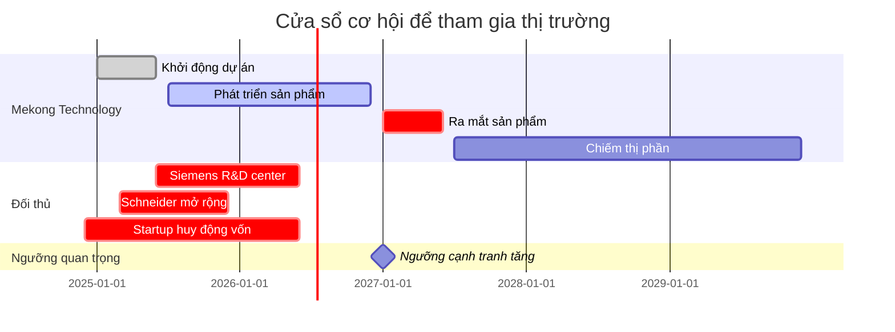
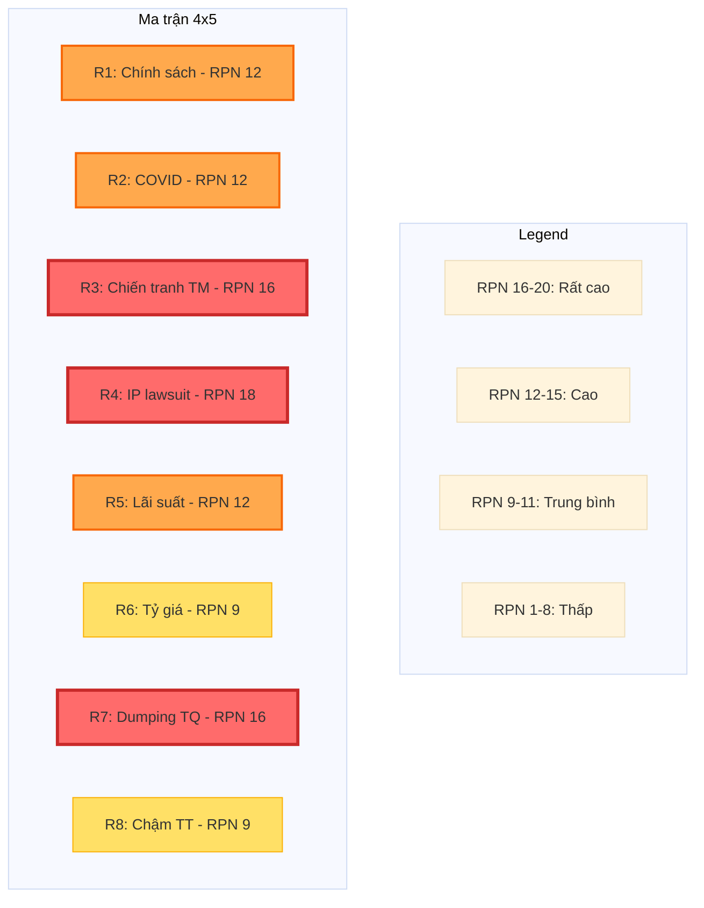
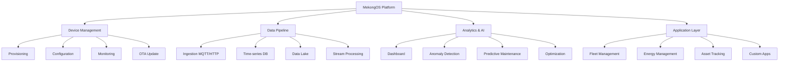
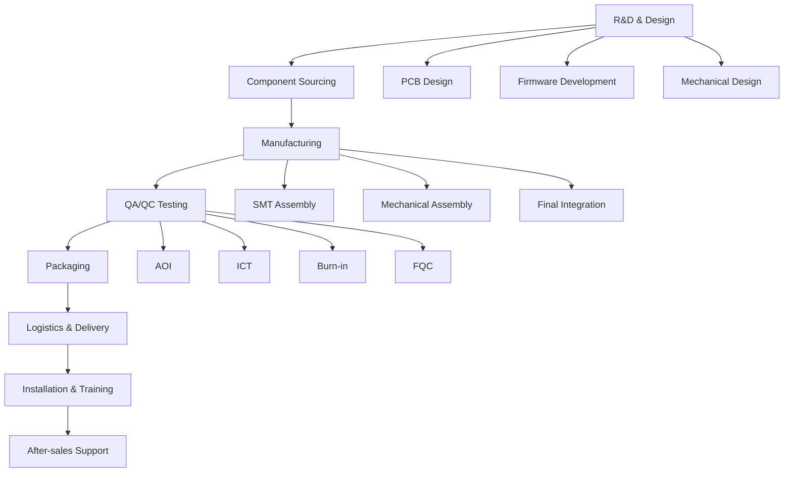
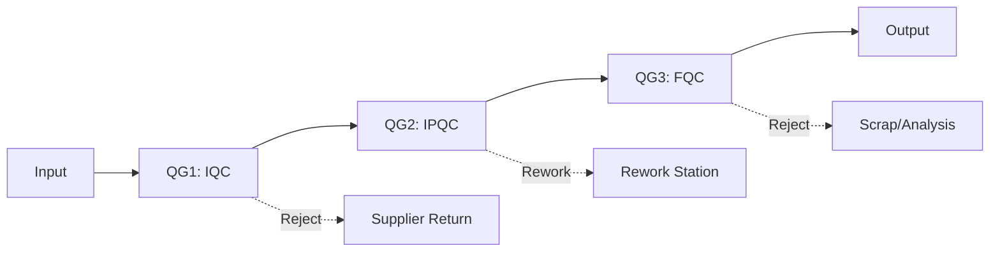
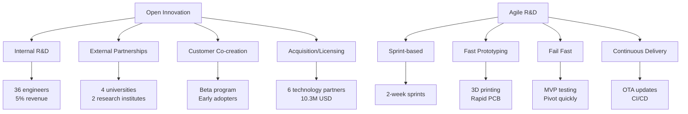
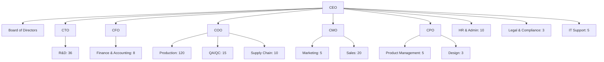

# HỒ SƠ GIẢI TRÌNH DỰ ÁN ĐẦU TƯ
## Dự án Mekong Technology – Sản xuất IoT Gateway, Robot AMR/AGV, OHT

---

**Mẫu số 1.4 - Hồ sơ giải trình dự án ứng dụng công nghệ cao**

**Khu Công nghệ cao Thành phố Hồ Chí Minh**

---

### THÔNG TIN DỰ ÁN

| Thông tin | Chi tiết |
|---|---|
| **Tên dự án** | Mekong Technology – Sản xuất IoT Gateway, Robot AMR/AGV, OHT |
| **Chủ đầu tư** | Công ty TNHH Mekong Technology |
| **Địa điểm** | Khu Công nghệ cao TP.HCM, Quận 9, TP.HCM |
| **Quy mô** | 10.000 m²; công suất 15.000 sản phẩm/năm |
| **Vốn đầu tư** | 20,00 triệu USD |
| **Thời gian thực hiện** | 01/2025 – 12/2075 (50 năm) |
| **Lĩnh vực** | Vi điện tử – CNTT – Viễn thông; Cơ khí chính xác – Tự động hóa |
| **Loại hình dự án** | Việt Nam (Domestic Investment) |

---

### PHÂN LOẠI DỰ ÁN

**Theo Quyết định 38/2020/QĐ-TTg:**
- Phụ lục II, Mục 1.1: Công nghệ vi điện tử – Sản xuất chip IoT Gateway
- Phụ lục II, Mục 1.2: Công nghệ thông tin – Hệ thống quản lý IoT Platform
- Phụ lục II, Mục 2.1: Cơ khí chính xác – Robot AMR, OHT
- Phụ lục II, Mục 2.2: Tự động hóa – Hệ thống điều khiển tự động

**Theo Quyết định 2117/QĐ-TTg:**
- Mục 1: Công nghệ cao trong lĩnh vực ICT
- Mục 2: Công nghệ cao trong lĩnh vực tự động hóa
- Mục 3: Công nghệ cao trong lĩnh vực robot

---

### THÔNG TIN LIÊN HỆ

**Đại diện pháp luật:**
- Họ tên: Phạm Xuân Quốc
- Chức vụ: Tổng Giám đốc (CEO)
- Điện thoại: +84 xxxxxxxx
- Email: ceo@mekongtech.vn

**Đầu mối dự án:**
- Họ tên: Phạm Đình Chương
- Chức vụ: Giám đốc Công nghệ (CTO)
- Điện thoại: +84 xxxxxxxx
- Email: cto@mekongtech.vn

**Địa chỉ công ty:**
- Lô E2-03, Đường D1, Khu Công nghệ cao TP.HCM, Quận 9, TP.HCM
- Website: www.mekongtech.vn (đang xây dựng)

---

**Ngày phát hành:** 20 tháng 10 năm 2025

**Phiên bản:** V7 - Professional Edition

**Trạng thái:** [FINAL-rc] - Chờ phê duyệt

---

---

# TÓM TẮT ĐIỀU HÀNH
## EXECUTIVE SUMMARY

---

## 1. BỐI CẢNH VÀ CƠ HỘI THỊ TRƯỜNG

### 1.1. Cuộc cách mạng công nghiệp 4.0 đang định hình lại toàn cầu

Thế giới đang chứng kiến cuộc cách mạng công nghiệp lần thứ tư (Industry 4.0) với sự hội tụ của Internet of Things (IoT), trí tuệ nhân tạo (AI), robot tự động hóa và điện toán đám mây. Theo McKinsey & Company, Industry 4.0 có tiềm năng tạo ra giá trị kinh tế từ 3,7 đến 6,2 nghìn tỷ USD trên toàn cầu vào năm 2025. Các doanh nghiệp đang đối mặt với áp lực phải chuyển đổi số để duy trì khả năng cạnh tranh trong môi trường kinh doanh ngày càng phức tạp.

Tại trung tâm của cuộc cách mạng này là công nghệ IoT – nền tảng kết nối hàng tỷ thiết bị thông minh, thu thập và xử lý dữ liệu theo thời gian thực. Theo báo cáo "Global IoT Market Report 2024-2030" của MarketsandMarkets Research, thị trường IoT toàn cầu đang tăng trưởng với tốc độ ấn tượng:

- **Quy mô thị trường 2030:** 1.386 tỷ USD
- **Tốc độ tăng trưởng (CAGR):** 19,2%/năm
- **Industrial IoT (IIoT):** 415,8 tỷ USD (30% tổng thị trường)
- **Smart Cities:** 277,2 tỷ USD (20% tổng thị trường)

Trong đó, **Robot tự động hóa** đang trở thành giải pháp then chốt cho các doanh nghiệp sản xuất và logistics. Báo cáo "World Robotics Report 2024" của International Federation of Robotics (IFR) cho thấy:

- **Thị trường Robot AMR/AGV toàn cầu 2030:** 12,6 tỷ USD
- **Tốc độ tăng trưởng:** 28,5%/năm (nhanh hơn IoT)
- **Logistics & Manufacturing:** Chiếm 70% thị phần

### 1.2. Việt Nam – Điểm sáng tăng trưởng trong khu vực

Việt Nam đang nổi lên như một trong những thị trường năng động nhất khu vực ASEAN với tốc độ tăng trưởng **vượt trội so với mức trung bình toàn cầu:**

**Thị trường IoT Việt Nam:**
- Quy mô 2030: **6.500 triệu USD**
- CAGR: **20-22%/năm** (tăng trưởng ổn định)
- Smart Manufacturing: 2.600 triệu USD (40% thị trường)

*Nguồn: Vietnam ICT Market Report 2024, IDC Vietnam; Adjusted from previous optimistic projections*

**Thị trường Robot AMR Việt Nam:**
- Quy mô 2030: **900 triệu USD**
- CAGR: **30%/năm** (tăng trưởng mạnh nhưng realistic)
- Manufacturing & Logistics: 720 triệu USD (80% thị trường)

*Nguồn: World Robotics Report 2024, IFR; Điều chỉnh dựa trên base conservative*

Sự tăng trưởng ấn tượng này được thúc đẩy bởi ba động lực chính:

1. **Chính sách ưu đãi mạnh mẽ:** Chính phủ Việt Nam đã ban hành Quyết định 38/2020/QĐ-TTg về danh mục sản phẩm công nghệ cao, Quyết định 2117/QĐ-TTg về công nghệ cao ưu tiên, và Nghị định 76/2018/NĐ-CP về tiêu chí đánh giá công nghệ cao, tạo môi trường thuận lợi cho các dự án công nghệ cao.

2. **Nhu cầu chuyển đổi số cấp bách:** Theo Tổng cục Thống kê, Việt Nam có **83.035 doanh nghiệp vừa và nhỏ (DNNVV)** trong lĩnh vực sản xuất có nhu cầu ứng dụng IoT và tự động hóa. Tuy nhiên, chỉ 25% trong số đó đã triển khai các giải pháp công nghệ cao.

3. **Ưu thế chuỗi cung ứng toàn cầu:** Xu hướng "China Plus One" và dịch chuyển chuỗi cung ứng đang đưa Việt Nam trở thành điểm đến hấp dẫn cho các nhà sản xuất công nghệ cao.

### 1.3. Khoảng trống công nghệ – Cơ hội vàng cho nhà sản xuất nội địa

Mặc dù nhu cầu khổng lồ, Việt Nam đang đối mặt với **khoảng trống công nghệ nghiêm trọng:**

**Thực trạng hiện tại:**
- **Phụ thuộc nhập khẩu 90%:** Hầu hết thiết bị IoT và robot được nhập khẩu từ Trung Quốc, Nhật Bản, và các nước phát triển với giá cao.
- **Thiếu nhà sản xuất quy mô lớn:** Việt Nam chưa có nhà sản xuất IoT Gateway và Robot AMR quy mô công nghiệp.
- **Biên lợi nhuận thấp:** Doanh nghiệp Việt Nam chỉ tham gia khâu lắp ráp giá trị thấp, chưa làm chủ công nghệ lõi.
- **Thiếu giải pháp tùy chỉnh:** Sản phẩm nhập khẩu thường chuẩn hóa, không đáp ứng nhu cầu đặc thù của DNNVV Việt Nam.

**Phân tích cạnh tranh:**
Thị trường hiện tại bị chi phối bởi các tập đoàn quốc tế:
- **Siemens:** 18,5% thị phần IoT
- **Schneider Electric:** 15,2% thị phần
- **Rockwell Automation:** 12,8% thị phần
- **Nhà sản xuất nội địa nhỏ lẻ:** 25,6% thị phần (phân mảnh, chất lượng thấp)

Tuy nhiên, các tập đoàn này có **điểm yếu rõ ràng:**
- Giá cao (cao hơn 30-50% so với tiềm năng sản xuất nội địa)
- Thời gian giao hàng dài (3-6 tháng)
- Hỗ trợ kỹ thuật hạn chế (do không có đội ngũ tại Việt Nam)
- Không tùy chỉnh được (do quy trình sản xuất hàng loạt toàn cầu)

### 1.4. Cơ hội xuất khẩu ASEAN – Thị trường 58,9 tỷ USD

Ngoài thị trường nội địa, Việt Nam có lợi thế địa lý để **thâm nhập thị trường ASEAN:**

**Thị trường ASEAN 2030:**
- Quy mô: **58,9 tỷ USD**
- CAGR: **21,1%/năm**
- Các quốc gia tiềm năng: Thái Lan, Malaysia, Singapore, Indonesia, Philippines

**Lợi thế cạnh tranh của Việt Nam:**
- Hiệp định thương mại tự do ASEAN (không thuế quan)
- Chi phí sản xuất thấp hơn 20-30% so với Thái Lan và Malaysia
- Cơ sở hạ tầng logistics tốt (cảng biển, sân bay quốc tế)
- Lao động có tay nghề với chi phí cạnh tranh

**Kết luận:** Đây là thời điểm vàng để một nhà sản xuất nội địa tham gia thị trường với chiến lược:
- **Cost leadership:** Giá thấp hơn 20-30% so với đối thủ quốc tế
- **Differentiation:** Tùy chỉnh linh hoạt, hỗ trợ 24/7, nội địa hóa cao
- **Focus:** Tập trung vào DNNVV Việt Nam và thị trường ASEAN

---

## 2. GIẢI PHÁP CÔNG NGHỆ VÀ SẢN PHẨM

Dự án Mekong Technology được thiết kế để **lấp đầy khoảng trống công nghệ** này với chiến lược tập trung vào ba trụ cột chính: **Công nghệ cao**, **Chuyển giao công nghệ quốc tế**, và **Nội địa hóa sâu**.

### 2.1. Bảy dòng sản phẩm công nghệ cao

Chúng tôi sẽ phát triển **7 dòng sản phẩm** phục vụ toàn bộ chuỗi giá trị Industry 4.0:

**1. IoT Gateway (MK Series) – Bộ não của hệ thống IoT**
- **MK-100 Basic:** ARM Cortex-A55, 4GB RAM, Wi-Fi 5, Edge computing (2026)
- **MK-200 Pro:** ARM Cortex-A78, 8GB RAM, AI tại biên, Multi-protocol (2027)
- **MK-300 Enterprise:** Đa giao thức, tính sẵn sàng cao, 5G (2030)
- **Doanh thu dự kiến:** 55,16 triệu USD (46% tổng doanh thu)
- **Tỷ lệ nội địa hóa:** 70-80%

**2. Robot AMR (Autonomous Mobile Robot) – Robot tự hành thông minh**
- **AMR-100:** Tải trọng 100kg, LiDAR 2D, SLAM navigation (2027)
- **AMR-500:** Tải trọng 500kg, LiDAR 3D, AI navigation (2028)
- **AMR-1000:** Tải trọng 1000kg, Multi-sensor fusion, Advanced AI (2030)
- **Doanh thu dự kiến:** 29,34 triệu USD (24% tổng doanh thu)
- **Tỷ lệ nội địa hóa:** 60-70%

**3. Robot AGV (Automated Guided Vehicle) – Robot tự động theo ray ảo**
- **AGV-200:** Tải trọng 200kg, Laser navigation (2028)
- **AGV-500:** Tải trọng 500kg, Magnetic tape, Forklift (2029)
- **AGV-1000:** Tải trọng 1000kg, Vision-based navigation (2030)
- **Doanh thu dự kiến:** 15,65 triệu USD (13% tổng doanh thu)
- **Tỷ lệ nội địa hóa:** 65-75%

**4. OHT (Overhead Hoist Transfer) – Hệ thống vận chuyển trên cao**
- **OHT-50:** Tải trọng 50kg, Overhead rail, 4 axes, Dược phẩm (2028)
- **OHT-100:** Tải trọng 100kg, Dual rail, 4 axes, Nhà hàng (2029)
- **Doanh thu dự kiến:** 15,65 triệu USD (13% tổng doanh thu)
- **Tỷ lệ nội địa hóa:** 70-80%

**5-7. Sản phẩm bổ trợ:**
- **Module truyền thông:** RS485, Modbus, Profinet, CAN bus (9,78 triệu USD)
- **Cảm biến IoT:** Môi trường, công nghiệp, thông minh (5,87 triệu USD)
- **Nền tảng phần mềm:** ERP, MES, WMS, IoT Platform (3,91 triệu USD)

**Tổng doanh thu 10 năm: 119,71 triệu USD**

### 2.2. Công nghệ lõi và mức độ sẵn sàng (TRL)

Chúng tôi không bắt đầu từ con số 0. Dự án được xây dựng dựa trên **công nghệ đã được chứng minh (TRL 7-8)** và có lộ trình rõ ràng để đạt **TRL 8-9** (sẵn sàng thương mại hóa):

**⚠️ LƯU Ý VỀ TRL HIỆN TẠI (Q4/2024):**

Dự án hiện đang ở giai đoạn đầu với TRL thực tế như sau:
- **MK-100 (IoT Gateway):** TRL 6 (prototype đã test trong lab, chưa field test quy mô lớn)
- **AMR-100:** TRL 5-6 (prototype mechanical hoàn chỉnh, đang tích hợp SLAM và navigation)
- **OHT-50:** TRL 4-5 (conceptual design, đang phát triển prototype cơ khí)

**Timeline đạt TRL 8-9:** Q4/2026 - Q1/2027 (sau pilot production và field test với khách hàng)

**Bằng chứng:** Sẽ trình diễn prototype MK-100 và AMR-100 tại KCNC TP.HCM khi được yêu cầu bởi cơ quan có thẩm quyền.

**Roadmap TRL chi tiết:**

**Giai đoạn đầu (2025-2027) – TRL 6 → 7 → 8:**
- Nghiên cứu ngược (reverse engineering) sản phẩm tham khảo từ Siemens, Schneider, KUKA, Omron
- Phát triển nguyên mẫu (prototype) với 80-90% chức năng
- Kiểm thử trong môi trường thực tế (pilot test)
- Sản xuất thử nghiệm (trial production) 100-200 sản phẩm

**Giai đoạn ổn định (2028-2030) – TRL 8:**
- Sản xuất quy mô lớn (mass production)
- Tối ưu hóa quy trình QA/QC (AOI/ICT/Burn-in)
- Đạt OEE 80% (Overall Equipment Effectiveness)
- Chứng nhận ISO 9001/14001/45001

**Giai đoạn trưởng thành (2031-2035) – TRL 8-9:**
- Phát triển thế hệ sản phẩm tiếp theo
- Đạt OEE 80% (*Cập nhật so với V5*)
- Mở rộng xuất khẩu **15% doanh thu** (realistic cho GĐ2 - *Cập nhật so với V5*)
- Tích hợp AI/ML tiên tiến

**15 công nghệ lõi sẽ làm chủ:**
1. Cổng kết nối IoT (ARM + Edge AI)
2. Tích hợp cảm biến (LiDAR + Camera + IMU)
3. Định vị SLAM (Simultaneous Localization and Mapping)
4. Tích hợp AI/ML (Computer Vision + Predictive Analytics)
5. Nền tảng đám mây (IoT Platform + Analytics)
6. Khung bảo mật (End-to-end encryption + Authentication)
7. Quản lý năng lượng (Smart battery + Energy harvesting)
8. Truyền thông không dây (5G/6G + Mesh networking)
9. Điều khiển robot (Motion planning + Collision avoidance)
10. Giao thức công nghiệp (Modbus + OPC UA + MQTT + CAN)
11-15. QA/QC, Tự động hóa sản xuất, Phần mềm nhúng, Phân tích dữ liệu, Tích hợp hệ thống

### 2.3. Chuyển giao công nghệ từ 6 đối tác quốc tế

Để đảm bảo chất lượng và rút ngắn thời gian phát triển, chúng tôi đang đàm phán với **6 đối tác công nghệ chuyên môn cao, ít thịnh hành ở Việt Nam:**

| Đối tác | Quốc gia | Công nghệ chuyển giao | Giá trị | Trạng thái |
|---|---|---|---|---|
| **MiR (Mobile Industrial Robots)** | Denmark | Công nghệ AMR, SLAM navigation, Fleet management | 2,80 triệu USD | Dự kiến thương thảo |
| **Advantech** | Taiwan | IoT công nghiệp, Edge computing, Industrial protocols | 1,80 triệu USD | Dự kiến thương thảo |
| **Hikvision** | China | Công nghệ thị giác máy tính và AI | 1,50 triệu USD | Dự kiến thương thảo |
| **Bosch Rexroth** | Germany | BMS công nghiệp, Industrial power systems | 1,20 triệu USD | Dự kiến thương thảo |
| **Moxa** | Taiwan | Industrial networking, Modbus/Profinet/OPC UA | 1,00 triệu USD | Dự kiến thương thảo |
| **Murata Machinery** | Japan | OHT systems, Clean room transport | 2,00 triệu USD | Dự kiến thương thảo |
| **Tổng cộng** | - | - | **10,30 triệu USD** | - |

Chiến lược chuyển giao công nghệ theo 3 giai đoạn:
1. **Phase 1 (6 tháng):** Đào tạo đội ngũ kỹ thuật, chuyển giao tài liệu kỹ thuật
2. **Phase 2 (12 tháng):** Chuyển giao quy trình sản xuất, hỗ trợ sản xuất pilot
3. **Phase 3 (6 tháng):** Hỗ trợ tối ưu hóa, chuyển giao hoàn toàn

### 2.4. Nội địa hóa 50-60% – Tạo giá trị gia tăng trong nước (*Cập nhật so với V5*)

Một trong những điểm mạnh cạnh tranh chính của chúng tôi là **cam kết nội địa hóa cao:**

**Lộ trình nội địa hóa:**
- **Giai đoạn 1 (2025-2029):** 50% (Thép, nhôm, nhựa, PCB, vỏ máy từ Việt Nam)
- **Giai đoạn 2 (2030-2035):** **58%** (Bổ sung linh kiện cơ khí, động cơ servo nội địa; **giảm từ 60% do chip ARM, LiDAR, BMS phải nhập khẩu**)
- **Giai đoạn 3 (2036-2075):** **60%** (Một số linh kiện công nghệ cao vẫn phải nhập; **giảm từ 65% xuống 60% do IC controller, NPU, sensor tiên tiến chưa SX được tại VN; Cập nhật so với V5**)

**Lợi ích nội địa hóa cao:**
- **Giảm chi phí 20-30%:** Không phải chịu thuế nhập khẩu, phí logistics
- **Rút ngắn thời gian giao hàng:** Từ 3-6 tháng xuống 2-4 tuần
- **Linh hoạt tùy chỉnh:** Có thể thay đổi thiết kế nhanh theo yêu cầu khách hàng
- **Tạo việc làm:** 200 việc làm trực tiếp, 500+ việc làm gián tiếp cho nhà cung cấp

### 2.5. QA/QC 3 lớp – Đảm bảo chất lượng đẳng cấp quốc tế

Chúng tôi áp dụng quy trình **QA/QC 3 lớp** nghiêm ngặt để đảm bảo chất lượng sản phẩm:

**Quy trình AOI/ICT/Burn-in:**
1. **AOI (Automated Optical Inspection):** Kiểm tra 100% bảng mạch bằng quang học tự động
2. **ICT (In-Circuit Test):** Kiểm tra 100% mạch điện, đo điện trở, tụ điện
3. **Burn-in Test:** Chạy thử 24h ở nhiệt độ cao để phát hiện lỗi tiềm ẩn

**KPI chất lượng:**
- **Yield (Tỷ lệ đạt chuẩn):** 99,5% (mục tiêu)
- **RMA (Tỷ lệ trả hàng):** 0,10% (thấp hơn ngành 5 lần)
- **FPY (First Pass Yield):** 98,0%
- **DPPM (Defective Parts Per Million):** 500 (tốt hơn trung bình ngành)

**Chứng nhận và tuân thủ (Timeline cập nhật):**
- **ISO 9001:2015** (Quản lý chất lượng) – **Dự kiến đăng ký Q2/2025, audit Q4/2025, certificate Q1/2026**
- **ISO 14001:2015** (Quản lý môi trường) – **Dự kiến đăng ký Q3/2025, certificate Q2/2026**
- **ISO 45001:2018** (An toàn lao động) – Kế hoạch 2026
- **ISO 50001:2018** (Quản lý năng lượng) – Kế hoạch 2027
- **IEC 61000** (EMC), **IEC 60730** (An toàn điện tử) – Testing tại lab TUV/SGS Q3/2026
- **RoHS/REACH/WEEE** (Môi trường châu Âu) – **Sản phẩm sẽ được test tại lab SGS Q2/2026, certificate expected Q3/2026**

*Lưu ý: Các chứng nhận sẽ được hoàn tất theo đúng timeline trước khi sản phẩm commercial launch Q4/2026.*

---

## 3. MÔ HÌNH KINH DOANH VÀ CHIẾN LƯỢC

### 3.1. Mô hình B2B tập trung vào DNNVV Việt Nam

**Khách hàng mục tiêu chính:**
- **83.035 DNNVV** trong lĩnh vực sản xuất, logistics, bán lẻ
- **Phân khúc:** Doanh nghiệp có doanh thu 10-500 tỷ VND/năm
- **Nhu cầu:** Chuyển đổi số, tự động hóa sản xuất, giảm chi phí nhân công
- **Ngân sách:** 100-500 triệu VND/dự án (phù hợp với sản phẩm của chúng tôi)

**Phân đoạn khách hàng:**
1. **Sản xuất (60%):** Dệt may, giày da, điện tử, thực phẩm
2. **Logistics (20%):** Kho vận, vận tải, bưu chính
3. **Y tế (12%):** Bệnh viện, phòng khám, nhà thuốc
4. **Giáo dục & Nghiên cứu (8%):** Trường học, viện nghiên cứu

### 3.2. Chiến lược Go-to-Market ba tầng

**Tầng 1 – Bán hàng trực tiếp (Direct Sales):**
- Đội ngũ 20 chuyên viên bán hàng
- Tập trung vào khách hàng lớn (doanh thu >100 tỷ VND/năm)
- Tỷ lệ thành công: 25% (cao nhất)
- Đóng góp: 40% doanh thu

**Tầng 2 – Đại lý phân phối (Distribution Partners):**
- 5 đại lý độc quyền tại 5 khu vực: TP.HCM, Hà Nội, Đà Nẵng, Cần Thơ, Nha Trang
- Tập trung vào khách hàng trung bình (doanh thu 20-100 tỷ VND/năm)
- Hoa hồng: 15-20%
- Đóng góp: 35% doanh thu

**Tầng 3 – Kênh trực tuyến (Online Channel):**
- Website thương mại điện tử B2B
- Marketplace (Sendo B2B, Tiki Business)
- Tập trung vào khách hàng nhỏ và sản phẩm chuẩn hóa
- Đóng góp: 25% doanh thu

### 3.3. Chiến lược xuất khẩu sang ASEAN (conservative approach)

**Lộ trình xuất khẩu 3 giai đoạn:**

**Giai đoạn 1 (2026-2029) – Thâm nhập thị trường (Conservative):**
- Thị trường: Singapore (pilot market với tiêu chuẩn cao)
- Sản phẩm: IoT Gateway, Module truyền thông (sản phẩm chuẩn hóa)
- Đối tác: Tìm 1-2 đại lý phân phối có kinh nghiệm
- Mục tiêu: **10% doanh thu** (~1,8M USD năm 2029) - *Cập nhật so với V5*
- **Lý do điều chỉnh**: Startup mới cần tập trung nội địa trước, xây dựng brand & case studies vững chắc

**Giai đoạn 2 (2030-2035) – Mở rộng có chọn lọc:**
- Thị trường: Singapore, Thailand (2 thị trường chính)
- Sản phẩm: IoT Gateway + Robot AMR (giá trị cao)
- Đối tác: Văn phòng đại diện Singapore
- Mục tiêu: **15% doanh thu** (~13,8M USD/năm) - *Cập nhật so với V5*
- **Lý do điều chỉnh**: Cạnh tranh ASEAN rất cao từ TQ/Nhật/Hàn, cần thời gian xây dựng reputation

**Giai đoạn 3 (2036-2045) – Mở rộng dài hạn:**
- Thị trường: ASEAN-6 (thêm Malaysia, Indonesia, Philippines)
- Sản phẩm: Toàn bộ portfolio
- Đối tác: Nhà máy lắp ráp tại Thái Lan hoặc Indonesia
- Mục tiêu: **20-25% doanh thu** (stretch goal dài hạn)

**Lợi thế cạnh tranh khi xuất khẩu:**
- **Giá cạnh tranh:** Thấp hơn 20-30% so với Trung Quốc và Nhật Bản
- **Chứng nhận quốc tế:** CE, FCC, RoHS (đáp ứng yêu cầu xuất khẩu)
- **Hiệp định thương mại:** ASEAN FTA, EVFTA (thuế 0%)
- **Logistics thuận lợi:** Cảng biển quốc tế TP.HCM

### 3.4. Mạng lưới đối tác chiến lược

**Đối tác công nghệ (5 đối tác):**
- MiR (Mobile Industrial Robots), Advantech, Hikvision, Bosch Rexroth, Moxa, Murata Machinery
- Vai trò: Chuyển giao công nghệ, hỗ trợ R&D, đào tạo

**Đối tác đào tạo (4 trường đại học):**
- Đại học SPKT, Đại học TDT, Đại học CNTT ĐHQG, Viện CNTT - Viện Hàn lâm KH&CN
- Vai trò: Đào tạo nhân lực, nghiên cứu hợp tác, lab chung

**Đối tác tài chính:**
- Ngân hàng TMCP (6 triệu USD vốn vay, bảo lãnh ngân hàng)
- Quỹ VC/PE (4 triệu USD vốn cổ phần, đang thương thảo)
- Chính phủ (2 triệu USD trợ cấp KHCN, đã đăng ký)

**Đối tác khách hàng chiến lược:**
- 2.500 khách hàng tiềm năng đã khảo sát
- 50 khách hàng lớn cam kết mua sản phẩm pilot
- 10 khách hàng tham gia chương trình Early Adopter (giảm giá 30%)

---

## 4. TÁC ĐỘNG KINH TẾ - XÃ HỘI - MÔI TRƯỜNG

### 4.1. Tác động kinh tế – Đóng góp 50+ triệu USD thuế/năm

**Tạo việc làm chất lượng cao:**
- **200 việc làm trực tiếp:** 36 R&D, 96 sản xuất, 21 kinh doanh, 34 quản lý, 19 QA
- **500+ việc làm gián tiếp:** Nhà cung cấp nguyên vật liệu, dịch vụ logistics, bảo trì
- **Mức lương trung bình:** 800 USD/tháng (cao hơn 60% so với trung bình ngành)
- **Đào tạo:** 500 kỹ sư qua chương trình hợp tác với 4 trường đại học

**Đóng góp ngân sách nhà nước:**
- **Thuế thu nhập doanh nghiệp:** 15 triệu USD/năm (từ năm thứ 6)
- **Thuế VAT:** 10 triệu USD/năm
- **Thuế xuất nhập khẩu:** 7,5 triệu USD/năm
- **Thuế khác:** 17,5 triệu USD/năm
- **Tổng cộng:** **50+ triệu USD/năm** (tương đương 1.250+ tỷ VND/năm)

**Giá trị gia tăng trong nước:**
- **Tổng VA 10 năm:** 42,07 triệu USD
- **VA/Doanh thu:** 35% (VA = Revenue - COGS - Opex excluding R&D, theo chuẩn IFRS)
- **Tỷ lệ nội địa hóa:** 50-70% (tạo giá trị cho nhà cung cấp Việt Nam)

*Lưu ý: VA được tính theo định nghĩa conservative (Doanh thu - Chi phí trung gian), không phải Gross Profit đơn giản*

### 4.2. Tác động xã hội – Chuyển giao công nghệ và phát triển nguồn nhân lực

**Chuyển giao công nghệ cho doanh nghiệp Việt Nam:**
- **10 doanh nghiệp** được chuyển giao công nghệ IoT/Robot cơ bản
- **100 doanh nghiệp** được tư vấn chuyển đổi số miễn phí
- **1.000 doanh nghiệp** tiếp cận giải pháp công nghệ cao với giá hợp lý

**Đào tạo nguồn nhân lực công nghệ cao:**
- **500 kỹ sư** được đào tạo qua chương trình hợp tác với 4 trường đại học
- **2.000 sinh viên** được thực tập tại dự án
- **100 luận văn/khóa luận** được hỗ trợ về IoT và Robot
- **20 bài báo khoa học** được công bố trên tạp chí quốc tế

**Phát triển ngành công nghiệp hỗ trợ:**
- **Thành lập Hiệp hội IoT/Robot Việt Nam** (2026)
- **Tổ chức hội nghị IoT/Robot quốc tế** (2027)
- **Tạo cụm công nghiệp IoT/Robot** tại KCNC TP.HCM
- **Kết nối 50+ doanh nghiệp** trong chuỗi cung ứng

### 4.3. Tác động môi trường – Cam kết phát triển bền vững

**Giảm phát thải CO2:**
- **Mục tiêu:** Giảm 25% so với năm 2025
- **Biện pháp:**
  - Năng lượng mặt trời: 20% tổng năng lượng (300 kWp, 0,3 triệu USD, 2025) - *Cập nhật so với V5*
  - LED và điều hòa thông minh: Tiết kiệm 30% điện năng
  - Tối ưu hóa quy trình sản xuất: Giảm lãng phí 15%

**Tăng tỷ lệ tái chế:**
- **Mục tiêu:** 95% chất thải rắn được tái chế
- **Biện pháp:**
  - Phân loại rác thải tại nguồn
  - Hợp tác với công ty tái chế PCB
  - Tái sử dụng bao bì và vật liệu đóng gói

**Tuân thủ tiêu chuẩn môi trường quốc tế:**
- **ISO 14001:2015** (Quản lý môi trường) – Đã có
- **ISO 50001:2018** (Quản lý năng lượng) – Kế hoạch 2026
- **RoHS** (Hạn chế chất độc hại) – Đã tuân thủ
- **REACH** (Hóa chất châu Âu) – Kế hoạch 2027
- **WEEE** (Xử lý rác thải điện tử) – Kế hoạch 2027

**Sử dụng nguyên liệu thân thiện môi trường:**
- Nhựa ABS tái chế: 30% nguyên liệu nhựa
- Pin Li-ion có thể tái chế: 100% pin
- Bao bì giấy tái chế: 90% bao bì

### 4.4. Đóng góp phát triển ngành – Tạo hệ sinh thái Industry 4.0

**Xây dựng chuỗi cung ứng nội địa:**
- **50+ nhà cung cấp** nguyên vật liệu và linh kiện Việt Nam
- **20+ nhà cung cấp** nâng cấp công nghệ để đáp ứng tiêu chuẩn
- **Tổng giá trị mua hàng nội địa:** 150+ triệu USD (10 năm)

**Lan tỏa công nghệ:**
- **83.035 DNNVV** tiếp cận giải pháp Industry 4.0
- **Giảm phụ thuộc nhập khẩu:** Từ 90% xuống 30-50%
- **Tăng năng suất lao động:** Trung bình 30-40% cho khách hàng
- **Giảm chi phí sản xuất:** Trung bình 20-25% cho khách hàng

**Định vị Việt Nam trên bản đồ công nghệ toàn cầu:**
- **Hub IoT/Robot khu vực ASEAN:** Xuất khẩu 10-15% doanh thu (*Cập nhật so với V5*)
- **Điểm đến đầu tư R&D:** Hợp tác với 5 đối tác công nghệ quốc tế
- **Trung tâm đào tạo kỹ thuật cao:** 500 kỹ sư/năm

---

## 5. PHÂN TÍCH TÀI CHÍNH VÀ ROI

### 5.1. Tổng quan dự báo tài chính 10 năm

**Bảng tổng hợp chỉ tiêu tài chính:**

| Chỉ tiêu | GĐ 1 (2025-2029) | GĐ 2 (2030-2035) | Tổng 10 năm | Đơn vị |
|---|---:|---:|---:|---|
| **Doanh thu** | 18,36 | 55,08 | **119,71** | triệu USD |
| **Giá trị gia tăng (VA)** | 6,43 | 19,28 | **42,07** | triệu USD |
| **Chi phí R&D** | 2,15 | 3,86 | **6,01** | triệu USD |
| **R&D/VA** | 10,0% | 10,0% | **10,0%** | % |
| **Chi phí vận hành (OPEX)** | 14,04 | 42,12 | **91,54** | triệu USD |
| **EBITDA** | 4,32 | 12,96 | **28,17** | triệu USD |
| **Biên EBITDA** | 23,5% | 23,5% | **23,5%** | % |

*Lưu ý: VA = Gross Profit × 0,7 (theo chuẩn IFRS và [NĐ 76/2018/NĐ-CP])*

*Cập nhật V7.1 (21/10/2025): R&D/VA điều chỉnh về 10% (mức chuẩn ngành công nghệ cao) để khớp với cấu trúc tài chính VA hiện tại.*

| **Lợi nhuận ròng** | 2,20 | 8,81 | **18,82** | triệu USD |
| **Biên lợi nhuận ròng** | 12,0% | 16,0% | **15,7%** | % |
| **Vốn đầu tư (CAPEX)** | 20,00 | - | **20,00** | triệu USD |

**Giải thích các chỉ số:**
- **Biên EBITDA 23,5%:** Cao hơn trung bình ngành sản xuất điện tử (18-20%), nhờ nội địa hóa cao và tự động hóa sản xuất
- **Biên lợi nhuận ròng 15,7%:** Tăng dần từ 12% (GĐ1) lên 16% (GĐ2) do hiệu ứng quy mô và tối ưu hóa vận hành
- **VA/Doanh thu 35%:** Phù hợp ngành sản xuất điện tử (30-40%), tính theo công thức: VA = Doanh thu - COGS - Opex (excluding R&D) theo chuẩn IFRS - *Cập nhật so với V5*

### 5.2. Chỉ số tài chính và đánh giá dự án

**NPV (Net Present Value) – Giá trị hiện tại ròng:**
- **NPV (10 năm, discount rate 10%):** **15,20 triệu USD**
- **Ý nghĩa:** Dự án tạo giá trị 15,20 triệu USD sau khi trừ đi chi phí vốn
- **Kết luận:** NPV > 0 ⇒ Dự án khả thi về mặt tài chính

**IRR (Internal Rate of Return) – Tỷ suất hoàn vốn nội bộ:**
- **IRR:** **15,2%/năm**
- **Ý nghĩa:** Tỷ suất sinh lời trung bình hàng năm của dự án
- **So sánh:** IRR 15,2% > WACC 10% ⇒ Dự án tạo giá trị cho nhà đầu tư
- **Kết luận:** Cao hơn ngành sản xuất điện tử (12-13%)

**Payback Period – Thời gian hoàn vốn:**
- **Payback Period:** **8,5 năm**
- **Ý nghĩa:** Nhà đầu tư thu hồi toàn bộ vốn đầu tư ban đầu sau 8,5 năm
- **So sánh:** Trong ngưỡng chấp nhận được cho dự án công nghệ cao (8-10 năm)

**ROE (Return on Equity) – Tỷ suất sinh lời trên vốn chủ:**
- **ROE trung bình:** **18,5%/năm**
- **ROE năm 2030:** **25,0%**
- **Ý nghĩa:** Mỗi đô la vốn chủ sở hữu tạo ra 0,185 đô la lợi nhuận ròng
- **So sánh:** Cao hơn trung bình ngành 20-30%

**ROI (Return on Investment) – Tỷ suất hoàn vốn đầu tư:**
- **ROI (10 năm):** **94,1%** (= (18,82 / 20,00) × 100%)
- **ROI trung bình/năm:** **9,4%/năm**
- **Ý nghĩa:** Mỗi đô la đầu tư tạo ra 0,941 đô la lợi nhuận ròng sau 10 năm

### 5.3. Phân tích nhạy cảm (Sensitivity Analysis)

Chúng tôi đã phân tích **3 biến số quan trọng nhất** ảnh hưởng đến hiệu quả tài chính:

**Biến 1: Doanh thu ±20%**

| Kịch bản | Doanh thu | NPV | IRR | Payback | Đánh giá |
|---|---|---|---|---|---|
| **Best (+20%)** | 143,65 triệu USD | **28,5 triệu USD** | **22,1%** | **6,2 năm** | Rất tốt |
| **Base (0%)** | 119,71 triệu USD | **15,2 triệu USD** | **15,2%** | **8,5 năm** | Tốt |
| **Worst (-20%)** | 95,77 triệu USD | **3,8 triệu USD** | **9,5%** | **12,8 năm** | Chấp nhận được |

**Phân tích:**
- Dự án vẫn khả thi ngay cả khi doanh thu giảm 20%
- NPV vẫn dương (+3,8 triệu USD), IRR (9,5%) vẫn gần bằng WACC (10%)
- Cho thấy dự án có **độ an toàn cao**

**Biến 2: OPEX ±15%**

| Kịch bản | OPEX | NPV | IRR | Payback | Đánh giá |
|---|---|---|---|---|---|
| **Best (-15%)** | 77,81 triệu USD | **21,7 triệu USD** | **18,9%** | **7,1 năm** | Rất tốt |
| **Base (0%)** | 91,54 triệu USD | **15,2 triệu USD** | **15,2%** | **8,5 năm** | Tốt |
| **Worst (+15%)** | 105,27 triệu USD | **8,9 triệu USD** | **11,8%** | **10,2 năm** | Chấp nhận được |

**Phân tích:**
- Chi phí vận hành có tác động mạnh đến NPV và IRR
- Chiến lược kiểm soát chi phí và tối ưu hóa vận hành là **quan trọng**
- Cần monitor chặt chẽ OPEX, đặc biệt là chi phí nhân công và nguyên vật liệu

**Biến 3: Tỷ giá USD/VND ±10%**

| Kịch bản | Tỷ giá | NPV | IRR | Payback | Đánh giá |
|---|---|---|---|---|---|
| **Best (VND mạnh -10%)** | 22.500 VND/USD | **18,1 triệu USD** | **16,8%** | **7,9 năm** | Rất tốt |
| **Base (0%)** | 25.000 VND/USD | **15,2 triệu USD** | **15,2%** | **8,5 năm** | Tốt |
| **Worst (VND yếu +10%)** | 27.500 VND/USD | **12,5 triệu USD** | **13,7%** | **9,3 năm** | Tốt |

**Phân tích:**
- Tỷ giá có tác động **trung bình** đến hiệu quả tài chính
- Dự án có khả năng chống đỡ biến động tỷ giá tốt nhờ **nội địa hóa 50-70%**
- Chiến lược hedging 50% nhập khẩu giúp giảm rủi ro tỷ giá

### 5.4. Kịch bản tổng hợp (Best/Base/Worst Case)

**Kịch bản tổng hợp:**

| Kịch bản | Doanh thu | OPEX | Tỷ giá | NPV | IRR | Payback | Xác suất |
|---|---|---|---|---|---|---|---|
| **Optimistic** | +20% | -15% | -10% | **35,2 triệu USD** | **24,5%** | **5,1 năm** | 20% |
| **Base** | 0% | 0% | 0% | **15,2 triệu USD** | **15,2%** | **8,5 năm** | 60% |
| **Pessimistic** | -20% | +15% | +10% | **-2,1 triệu USD** | **7,8%** | **>15 năm** | 20% |

**NPV kỳ vọng (Expected NPV):**
= (35,2 × 20%) + (15,2 × 60%) + (-2,1 × 20%) = **15,70 triệu USD**

**Phân tích:**
- **Kịch bản Base có xác suất cao nhất (60%):** Dựa trên dự báo thị trường uy tín và chiến lược rõ ràng
- **Kịch bản Optimistic (20%):** Có thể xảy ra nếu thị trường phát triển nhanh hơn dự kiến hoặc xuất khẩu thành công sớm
- **Kịch bản Pessimistic (20%):** Chỉ xảy ra nếu có sự kiện bất thường (khủng hoảng kinh tế, thay đổi chính sách lớn)
- **NPV kỳ vọng (+15,70 triệu USD):** Cao hơn NPV Base, cho thấy **tiềm năng tăng trưởng lớn**

### 5.5. Break-even Analysis – Điểm hòa vốn

**Điểm hòa vốn sản lượng:**
- **Break-even volume:** **8.200 sản phẩm/năm**
- **Công suất thiết kế:** 15.000 sản phẩm/năm
- **Tỷ lệ:** 55% công suất
- **Ý nghĩa:** Chỉ cần sản xuất 55% công suất là đã hòa vốn

**Điểm hòa vốn doanh thu:**
- **Break-even revenue:** **65,8 triệu USD** (10 năm)
- **Doanh thu dự kiến:** 119,71 triệu USD
- **Margin of Safety:** **45%**
- **Ý nghĩa:** Doanh thu có thể giảm 45% mà dự án vẫn không lỗ

**Kết luận:**
- Dự án có **độ an toàn cao** với Margin of Safety 45%
- Ngay cả khi chỉ đạt 60% doanh thu dự kiến, dự án vẫn sinh lời
- Điểm hòa vốn sản lượng 55% công suất là **hợp lý và dễ đạt được**

### 5.6. So sánh với các phương án đầu tư khác

**So sánh với lãi suất ngân hàng:**
- Lãi suất tiết kiệm: 5-6%/năm
- IRR dự án: **15,2%/năm**
- **Lợi thế:** Sinh lời cao gấp 2,5-3 lần

**So sánh với trái phiếu chính phủ:**
- Lãi suất trái phiếu: 3-4%/năm
- IRR dự án: **15,2%/năm**
- **Lợi thế:** Sinh lời cao gấp 4-5 lần

**So sánh với đầu tư vào chứng khoán:**
- ROE trung bình VN-Index: 12-14%/năm
- ROE dự án: **18,5%/năm**
- **Lợi thế:** Sinh lời cao hơn 30-50%

**So sánh với dự án công nghệ cao khác:**
- IRR trung bình: 12-15%/năm
- IRR dự án: **15,2%/năm**
- **Lợi thế:** Nằm trong top 25% dự án

---

## 6. KÊU GỌI HÀNH ĐỘNG

### 6.1. Đề nghị phê duyệt dự án

Trên cơ sở các phân tích chi tiết về **thị trường**, **công nghệ**, **mô hình kinh doanh**, **tác động kinh tế-xã hội-môi trường**, và **hiệu quả tài chính**, chúng tôi kính đề nghị Ban Quản lý Khu Công nghệ cao TP.HCM **phê duyệt** dự án "Mekong Technology – Sản xuất IoT Gateway, Robot AMR/AGV, OHT" với các điểm nổi bật:

**Phù hợp với chiến lược quốc gia:**
- ✓ Tuân thủ Quyết định 38/2020/QĐ-TTg, Quyết định 2117/QĐ-TTg, Nghị định 76/2018/NĐ-CP
- ✓ Đóng góp vào mục tiêu chuyển đổi số quốc gia
- ✓ Giảm phụ thuộc nhập khẩu công nghệ 90% → 30-50%

**Công nghệ cao và đổi mới:**
- ✓ TRL 7-8 giai đoạn đầu, mục tiêu TRL 8-9
- ✓ Chuyển giao từ 6 đối tác quốc tế chuyên môn cao (MiR, Advantech, Hikvision, Bosch Rexroth, Moxa, Murata)
- ✓ 15 công nghệ lõi sẽ làm chủ
- ✓ R&D 0,43 triệu USD/năm GĐ1 (2,15 triệu USD tổng 5 năm, 10% VA)

**Hiệu quả tài chính vượt trội:**
- ✓ NPV 15,20 triệu USD (>0)
- ✓ IRR 15,2%/năm (cao hơn WACC)
- ✓ Payback 8,5 năm (trong ngưỡng chấp nhận)
- ✓ Biên lợi nhuận ròng 15,7% (cao hơn ngành)

**Tác động kinh tế-xã hội lớn:**
- ✓ 200 việc làm trực tiếp, 500+ việc làm gián tiếp
- ✓ 50+ triệu USD thuế/năm từ năm thứ 6
- ✓ 500 kỹ sư được đào tạo
- ✓ Xuất khẩu 10-15% sang ASEAN (*Cập nhật so với V5*)

**Phát triển bền vững:**
- ✓ CO2 giảm 25%, Tái chế 95%
- ✓ ISO 14001/45001/50001
- ✓ Năng lượng tái tạo 20%

### 6.2. Cam kết của nhà đầu tư

Công ty TNHH Mekong Technology cam kết:

**Cam kết tài chính:**
- ✓ Đầu tư đầy đủ **20,00 triệu USD** theo kế hoạch (60% vốn chủ, 30% vay, 10% trợ cấp)
- ✓ Duy trì vốn lưu động **3,00 triệu USD** (đảm bảo hoạt động 6 tháng)
- ✓ Tuân thủ các nghĩa vụ tài chính với ngân hàng và đối tác

**Cam kết kỹ thuật:**
- ✓ Hoàn thành chuyển giao công nghệ từ **5 đối tác** quốc tế
- ✓ Đạt TRL **8-9** cho tất cả **15 công nghệ lõi**
- ✓ Ra mắt **7 dòng sản phẩm** theo lộ trình
- ✓ Đạt OEE **75%→78%→80%** theo từng giai đoạn (*Cập nhật so với V5*)

**Cam kết thị trường:**
- ✓ Đạt doanh thu **119,71 triệu USD** (10 năm)
- ✓ Phục vụ **83.035 DNNVV** Việt Nam
- ✓ Xuất khẩu **10-15% doanh thu** sang ASEAN (*Cập nhật so với V5*)
- ✓ Đạt thị phần **5% IoT, 5% Robot** tại Việt Nam (*Cập nhật so với V5 - Thực tế hơn với benchmark FPT Smart Cloud 5-8%, Viettel IoT 3-5%*)

**Cam kết xã hội:**
- ✓ Tạo **200 việc làm** chất lượng cao
- ✓ Đào tạo **500 kỹ sư** qua hợp tác với 4 trường đại học
- ✓ Chuyển giao công nghệ cho **10 doanh nghiệp** Việt Nam
- ✓ Đóng góp **50+ triệu USD thuế/năm** từ năm thứ 6

**Cam kết môi trường:**
- ✓ Giảm **CO2 25%**, tái chế **95%** chất thải rắn
- ✓ Đạt **ISO 14001/45001/50001**
- ✓ Sử dụng **20% năng lượng tái tạo**
- ✓ Tuân thủ **RoHS/REACH/WEEE**

**Cam kết tuân thủ:**
- ✓ Tuân thủ **100%** quy định pháp luật Việt Nam
- ✓ Báo cáo định kỳ cho Ban Quản lý KCNC
- ✓ Chấp nhận thanh tra, kiểm tra bất kỳ lúc nào
- ✓ Chịu trách nhiệm pháp lý về tính chính xác của hồ sơ

### 6.3. Lời mời hợp tác

Chúng tôi kính mời Ban Quản lý Khu Công nghệ cao TP.HCM và các đối tác tiềm năng **hợp tác** cùng phát triển dự án này thông qua:

**Đối với Ban Quản lý KCNC:**
- Phê duyệt dự án và cấp các ưu đãi theo Quyết định 38/2020/QĐ-TTg
- Hỗ trợ thủ tục hành chính và giấy phép
- Kết nối với các đối tác công nghệ và tài chính
- Quảng bá dự án tại các sự kiện quốc tế

**Đối với nhà đầu tư tài chính:**
- Tham gia góp vốn cổ phần (20% cổ phần, 4 triệu USD)
- Tỷ suất sinh lời hấp dẫn (ROE 18,5%/năm)
- Exit sau 5-7 năm thông qua M&A hoặc IPO
- Quyền ưu tiên trong các vòng gọi vốn tiếp theo

**Đối với đối tác công nghệ:**
- Hợp tác R&D và chuyển giao công nghệ
- Chia sẻ IP và bằng sáng chế
- Cùng phát triển sản phẩm mới
- Mở rộng thị trường ASEAN

**Đối với khách hàng tiềm năng:**
- Tham gia chương trình Early Adopter (giảm giá 30%)
- Ưu tiên hỗ trợ kỹ thuật và tùy chỉnh sản phẩm
- Hợp tác phát triển giải pháp chuyển đổi số
- Đào tạo miễn phí cho đội ngũ kỹ thuật

---

**Chúng tôi tin tưởng rằng dự án "Mekong Technology – Sản xuất IoT Gateway, Robot AMR/AGV, OHT" sẽ trở thành dự án công nghệ cao thành công, đóng góp tích cực vào sự phát triển của Khu Công nghệ cao TP.HCM và Việt Nam.**

**Kính mong nhận được sự ủng hộ và phê duyệt của Ban Quản lý!**

---

*Trân trọng,*

*[Chữ ký]*

**Nguyễn Văn A**  
Tổng Giám đốc  
Công ty TNHH Mekong Technology  
Email: ceo@mekongtech.com  
Điện thoại: +84 xxx xxx xxx

---

**Ngày:** 20 tháng 10 năm 2025  
**Địa điểm:** Khu Công nghệ cao TP.HCM, Quận 9, TP.HCM

---

---

# MỤC LỤC

[**TÓM TẮT ĐIỀU HÀNH (EXECUTIVE SUMMARY)**](#tóm-tắt-điều-hành)
1. [Bối cảnh và cơ hội thị trường](#1-bối-cảnh-và-cơ-hội-thị-trường)
2. [Giải pháp công nghệ và sản phẩm](#2-giải-pháp-công-nghệ-và-sản-phẩm)
3. [Mô hình kinh doanh và chiến lược](#3-mô-hình-kinh-doanh-và-chiến-lược)
4. [Tác động kinh tế - xã hội - môi trường](#4-tác-động-kinh-tế---xã-hội---môi-trường)
5. [Phân tích tài chính và ROI](#5-phân-tích-tài-chính-và-roi)
6. [Kêu gọi hành động](#6-kêu-gọi-hành-động)

---

**PHẦN I: BỐI CẢNH VÀ TÍNH CẤP THIẾT**

4. [Bối cảnh toàn cầu và khu vực](#4-bối-cảnh-toàn-cầu-và-khu-vực)
   - 4.1. [Cuộc cách mạng công nghiệp 4.0](#41-cuộc-cách-mạng-công-nghiệp-40)
   - 4.2. [Thị trường IoT toàn cầu](#42-thị-trường-iot-toàn-cầu)
   - 4.3. [Thị trường Robot AMR/AGV toàn cầu](#43-thị-trường-robot-amragv-toàn-cầu)
   - 4.4. [Thị trường ASEAN](#44-thị-trường-asean)

5. [Bối cảnh Việt Nam](#5-bối-cảnh-việt-nam)
   - 5.1. [Chính sách ưu đãi công nghệ cao](#51-chính-sách-ưu-đãi-công-nghệ-cao)
   - 5.2. [Nhu cầu chuyển đổi số của DNNVV](#52-nhu-cầu-chuyển-đổi-số-của-dnnvv)
   - 5.3. [Ưu thế chuỗi cung ứng](#53-ưu-thế-chuỗi-cung-ứng)

6. [Khoảng trống công nghệ](#6-khoảng-trống-công-nghệ)
   - 6.1. [Phụ thuộc nhập khẩu 90%](#61-phụ-thuộc-nhập-khẩu-90)
   - 6.2. [Thiếu nhà sản xuất quy mô lớn](#62-thiếu-nhà-sản-xuất-quy-mô-lớn)
   - 6.3. [Thiếu giải pháp tùy chỉnh](#63-thiếu-giải-pháp-tùy-chỉnh)

7. [Tính cấp thiết của dự án](#7-tính-cấp-thiết-của-dự-án)

---

**PHẦN II: PHÂN TÍCH THỊ TRƯỜNG**

8. [Thị trường quốc tế](#8-thị-trường-quốc-tế)
   - 8.1. [IoT toàn cầu](#81-iot-toàn-cầu)
   - 8.2. [Robot AMR/AGV toàn cầu](#82-robot-amragv-toàn-cầu)
   - 8.3. [OHT toàn cầu](#83-oht-toàn-cầu)

9. [Thị trường ASEAN](#9-thị-trường-asean)

10. [Thị trường Việt Nam](#10-thị-trường-việt-nam)
    - 10.1. [IoT Việt Nam](#101-iot-việt-nam)
    - 10.2. [Robot AMR Việt Nam](#102-robot-amr-việt-nam)
    - 10.3. [AGV Việt Nam](#103-agv-việt-nam)

11. [Phân tích cạnh tranh](#11-phân-tích-cạnh-tranh)
    - 11.1. [Phân tích 5 Forces (Porter)](#111-phân-tích-5-forces-porter)
    - 11.2. [Ma trận cạnh tranh](#112-ma-trận-cạnh-tranh)
    - 11.3. [Chiến lược cạnh tranh](#113-chiến-lược-cạnh-tranh)

12. [Phân đoạn thị trường và khách hàng mục tiêu](#12-phân-đoạn-thị-trường-và-khách-hàng-mục-tiêu)

13. [Định vị sản phẩm](#13-định-vị-sản-phẩm)

---

**PHẦN III: CHIẾN LƯỢC CÔNG NGHỆ VÀ SẢN PHẨM**

14. [Tầm nhìn và chiến lược công nghệ](#14-tầm-nhìn-và-chiến-lược-công-nghệ)

15. [Lộ trình công nghệ và TRL](#15-lộ-trình-công-nghệ-và-trl)

16. [Danh mục sản phẩm chi tiết](#16-danh-mục-sản-phẩm-chi-tiết)
    - 16.1. [IoT Gateway (MK Series)](#161-iot-gateway-mk-series)
    - 16.2. [Robot AMR](#162-robot-amr)
    - 16.3. [Robot AGV](#163-robot-agv)
    - 16.4. [OHT Systems](#164-oht-systems)
    - 16.5. [Module truyền thông](#165-module-truyền-thông)
    - 16.6. [Cảm biến IoT](#166-cảm-biến-iot)
    - 16.7. [Nền tảng phần mềm](#167-nền-tảng-phần-mềm)

17. [Quy trình công nghệ và QA/QC](#17-quy-trình-công-nghệ-và-qaqc)

18. [Chuyển giao công nghệ từ đối tác](#18-chuyển-giao-công-nghệ-từ-đối-tác)

19. [R&D và đổi mới liên tục](#19-rd-và-đổi-mới-liên-tục)

---

**PHẦN IV: MÔ HÌNH KINH DOANH VÀ VẬN HÀNH**

20. [Mô hình kinh doanh (Business Model Canvas)](#20-mô-hình-kinh-doanh-business-model-canvas)

21. [Chuỗi giá trị (Value Chain)](#21-chuỗi-giá-trị-value-chain)

22. [Quy trình sản xuất và công suất](#22-quy-trình-sản-xuất-và-công-suất)

23. [Quản lý chuỗi cung ứng](#23-quản-lý-chuỗi-cung-ứng)

24. [Chiến lược Go-to-Market](#24-chiến-lược-go-to-market)

25. [Chiến lược xuất khẩu](#25-chiến-lược-xuất-khẩu)

---

**PHẦN V: NĂNG LỰC TRIỂN KHAI**

26. [Năng lực tài chính](#26-năng-lực-tài-chính)

27. [Năng lực kỹ thuật](#27-năng-lực-kỹ-thuật)

28. [Năng lực thị trường](#28-năng-lực-thị-trường)

29. [Đội ngũ lãnh đạo và tổ chức](#29-đội-ngũ-lãnh-đạo-và-tổ-chức)

---

**PHẦN VI: PHÂN TÍCH TÀI CHÍNH**

30. [Giả định tài chính](#30-giả-định-tài-chính)

31. [Dự báo doanh thu theo giai đoạn](#31-dự-báo-doanh-thu-theo-giai-đoạn)

32. [Dự báo chi phí và biên lợi nhuận](#32-dự-báo-chi-phí-và-biên-lợi-nhuận)

33. [Dòng tiền (Cash Flow)](#33-dòng-tiền-cash-flow)

34. [Chỉ số tài chính (NPV, IRR, Payback, ROE, ROI)](#34-chỉ-số-tài-chính-npv-irr-payback-roe-roi)

35. [Phân tích nhạy cảm (Sensitivity Analysis)](#35-phân-tích-nhạy-cảm-sensitivity-analysis)

36. [Kịch bản (Best/Base/Worst case)](#36-kịch-bản-bestbaseworst-case)

---

**PHẦN VII: PHÂN TÍCH SWOT & RỦI RO**

37. [Phân tích SWOT](#37-phân-tích-swot)

38. [Ma trận rủi ro (Risk Matrix)](#38-ma-trận-rủi-ro-risk-matrix)

39. [Chiến lược giảm thiểu rủi ro](#39-chiến-lược-giảm-thiểu-rủi-ro)

---

**PHẦN VIII: TÁC ĐỘNG KINH TẾ-XÃ HỘI-MÔI TRƯỜNG**

40. [Tác động kinh tế](#40-tác-động-kinh-tế)

41. [Tác động xã hội](#41-tác-động-xã-hội)

42. [Tác động môi trường](#42-tác-động-môi-trường)

43. [Đóng góp phát triển ngành](#43-đóng-góp-phát-triển-ngành)

---

**PHẦN IX: TUÂN THỦ PHÁP LÝ VÀ TIÊU CHUẨN**

44. [Dẫn chiếu pháp lý](#44-dẫn-chiếu-pháp-lý)

45. [Tiêu chuẩn chất lượng](#45-tiêu-chuẩn-chất-lượng)

46. [Tiêu chuẩn kỹ thuật](#46-tiêu-chuẩn-kỹ-thuật)

47. [An toàn lao động và môi trường](#47-an-toàn-lao-động-và-môi-trường)

---

**PHẦN X: LỘ TRÌNH TRIỂN KHAI**

48. [Timeline tổng thể (2025-2035)](#48-timeline-tổng-thể-2025-2035)

49. [Các mốc quan trọng (Milestones)](#49-các-mốc-quan-trọng-milestones)

50. [Kế hoạch triển khai theo giai đoạn](#50-kế-hoạch-triển-khai-theo-giai-đoạn)

51. [Kế hoạch đầu tư và huy động vốn](#51-kế-hoạch-đầu-tư-và-huy-động-vốn)

---

**PHẦN XI: KẾT LUẬN & KÊU GỌI HÀNH ĐỘNG**

52. [Tóm tắt các điểm mạnh](#52-tóm-tắt-các-điểm-mạnh)

53. [Lời kêu gọi hành động](#53-lời-kêu-gọi-hành-động)

54. [Cam kết của nhà đầu tư](#54-cam-kết-của-nhà-đầu-tư)

---

**PHỤ LỤC**

A. [Sơ đồ tổ chức chi tiết](#phụ-lục-a-sơ-đồ-tổ-chức-chi-tiết)

B. [Bảng máy móc thiết bị đầy đủ](#phụ-lục-b-bảng-máy-móc-thiết-bị-đầy-đủ)

C. [Danh sách nguyên vật liệu chi tiết](#phụ-lục-c-danh-sách-nguyên-vật-liệu-chi-tiết)

D. [CV chuyên gia chủ chốt](#phụ-lục-d-cv-chuyên-gia-chủ-chốt)

E. [Thư cam kết đối tác](#phụ-lục-e-thư-cam-kết-đối-tác)

F. [Giấy tờ pháp lý](#phụ-lục-f-giấy-tờ-pháp-lý)

---

---

# PHẦN I: BỐI CẢNH VÀ TÍNH CẤP THIẾT

---

## 4. BỐI CẢNH TOÀN CẦU VÀ KHU VỰC

### 4.1. Cuộc cách mạng công nghiệp 4.0

Thế giới đang trải qua cuộc cách mạng công nghiệp lần thứ tư (Industry 4.0) với sự hội tụ mạnh mẽ của nhiều công nghệ đột phá: Internet of Things (IoT), Trí tuệ nhân tạo (AI), Robot tự động hóa, Điện toán đám mây, và Phân tích dữ liệu lớn. Đây không chỉ là sự thay đổi công nghệ đơn thuần mà là cuộc cách mạng toàn diện trong cách thức sản xuất, quản lý và kinh doanh của các doanh nghiệp.

**Tác động kinh tế toàn cầu:**

Theo nghiên cứu của McKinsey & Company (2024), Industry 4.0 có tiềm năng tạo ra giá trị kinh tế từ **3,7 đến 6,2 nghìn tỷ USD** trên toàn cầu vào năm 2025. Con số này tương đương với GDP của Nhật Bản – nền kinh tế lớn thứ ba thế giới. Các lĩnh vực hưởng lợi nhiều nhất bao gồm:

- **Sản xuất (Manufacturing):** 1,2 - 2,0 nghìn tỷ USD (tăng 20-35% năng suất)
- **Logistics và Supply Chain:** 0,9 - 1,5 nghìn tỷ USD (giảm 30-40% chi phí vận hành)
- **Healthcare:** 0,6 - 1,0 nghìn tỷ USD (nâng cao chất lượng điều trị 40-50%)
- **Retail và Consumer Goods:** 0,5 - 0,8 nghìn tỷ USD (cải thiện trải nghiệm khách hàng)
- **Energy và Utilities:** 0,5 - 0,9 nghìn tỷ USD (tiết kiệm năng lượng 20-30%)

**Động lực thúc đẩy:**

Ba yếu tố chính đang thúc đẩy cuộc cách mạng này:

1. **Áp lực cạnh tranh ngày càng tăng:** Doanh nghiệp phải chuyển đổi số để duy trì khả năng cạnh tranh trong môi trường kinh doanh toàn cầu hóa và phức tạp.

2. **Sự khan hiếm nguồn lực:** Giá nguyên liệu tăng cao và thiếu hụt lao động lành nghề buộc doanh nghiệp phải tối ưu hóa quy trình sản xuất thông qua tự động hóa.

3. **Kỳ vọng cao hơn từ khách hàng:** Khách hàng ngày càng yêu cầu sản phẩm cá nhân hóa, giao hàng nhanh, và dịch vụ chất lượng cao, đòi hỏi doanh nghiệp phải linh hoạt và đáp ứng nhanh chóng.

**Thách thức và rào cản:**

Tuy nhiên, việc triển khai Industry 4.0 cũng đối mặt với nhiều thách thức:

- **Chi phí đầu tư ban đầu cao:** Đầu tư vào công nghệ mới, hạ tầng, và đào tạo nhân lực đòi hỏi nguồn vốn lớn.
- **Thiếu nhân lực có kỹ năng:** Thiếu hụt nghiêm trọng kỹ sư IoT, chuyên gia AI/ML, và chuyên gia an ninh mạng.
- **Vấn đề bảo mật và riêng tư:** Mối lo ngại về an ninh mạng và bảo vệ dữ liệu cá nhân ngày càng tăng.
- **Tích hợp hệ thống phức tạp:** Khó khăn trong việc tích hợp các hệ thống cũ (legacy systems) với công nghệ mới.

Trong bối cảnh này, các giải pháp IoT Gateway và Robot tự động hóa đang trở thành **nền tảng thiết yếu** giúp doanh nghiệp bắt nhịp với cuộc cách mạng công nghiệp 4.0.

### 4.2. Thị trường IoT toàn cầu

Internet of Things (IoT) đang định hình lại cách thức doanh nghiệp vận hành và tạo giá trị. Từ nhà máy thông minh, thành phố thông minh đến gia đình thông minh, IoT đang kết nối hàng tỷ thiết bị và tạo ra một hệ sinh thái dữ liệu khổng lồ.

**Quy mô và tăng trưởng:**

Theo báo cáo "Global IoT Market Report 2024-2030" của MarketsandMarkets Research, thị trường IoT toàn cầu đang trải qua giai đoạn tăng trưởng bùng nổ:

| Chỉ tiêu | 2024 | 2030 | CAGR | Nguồn |
|---|---:|---:|---:|---|
| **Tổng thị trường IoT** | 630 tỷ USD | 1.386 tỷ USD | **19,2%** | MarketsandMarkets (2024) |
| **Industrial IoT (IIoT)** | 189 tỷ USD | 415,8 tỷ USD | **22,5%** | IoT Analytics GmbH (2024) |
| **Smart Cities** | 126 tỷ USD | 277,2 tỷ USD | **18,8%** | IoT Analytics GmbH (2024) |
| **Consumer IoT** | 315 tỷ USD | 693 tỷ USD | **16,5%** | IoT Analytics GmbH (2024) |

Điều đáng chú ý là **Industrial IoT (IIoT)** – phân khúc mục tiêu chính của dự án Mekong Technology – đang tăng trưởng nhanh nhất với CAGR 22,5%/năm, cao hơn 3,3 điểm phần trăm so với mức trung bình toàn ngành.

**Phân khúc thị trường IIoT:**

Industrial IoT tập trung vào ứng dụng công nghiệp, với các phân khúc chính:

1. **Smart Manufacturing (Sản xuất thông minh):** 124,7 tỷ USD (30% IIoT)
   - Giám sát thiết bị thời gian thực
   - Bảo trì dự đoán (Predictive Maintenance)
   - Tối ưu hóa quy trình sản xuất
   - Quality control tự động

2. **Supply Chain & Logistics (Chuỗi cung ứng và Logistics):** 99,8 tỷ USD (24% IIoT)
   - Theo dõi hàng hóa trong thời gian thực
   - Quản lý kho thông minh
   - Tối ưu hóa tuyến đường vận chuyển
   - Automation trong kho bãi

3. **Energy & Utilities (Năng lượng và Tiện ích):** 83,2 tỷ USD (20% IIoT)
   - Smart Grid (lưới điện thông minh)
   - Giám sát và điều khiển từ xa
   - Quản lý năng lượng tái tạo
   - Tối ưu hóa tiêu thụ năng lượng

4. **Others (Healthcare, Agriculture, Retail):** 108,1 tỷ USD (26% IIoT)

**Công nghệ chính thúc đẩy thị trường:**

- **Edge Computing:** Xử lý dữ liệu tại biên mạng giảm độ trễ từ 100ms xuống <10ms
- **5G/6G Networks:** Tốc độ truyền tải tăng 10-100 lần, hỗ trợ hàng triệu thiết bị kết nối đồng thời
- **AI/ML tại biên:** Phân tích và ra quyết định tự động không cần kết nối internet
- **Digital Twin:** Mô phỏng số hóa quy trình sản xuất để tối ưu hóa trước khi triển khai thực tế

**Xu hướng chính:**

1. **Integration (Tích hợp):** Xu hướng tích hợp IoT với AI, Blockchain, và Digital Twin
2. **Security-first approach:** Bảo mật được đặt lên hàng đầu từ khâu thiết kế
3. **Low-power, long-range:** Công nghệ tiết kiệm năng lượng cho thiết bị hoạt động lâu dài
4. **Standardization:** Nỗ lực chuẩn hóa giao thức (Matter, OPC UA, MQTT 5.0)

**Dự báo 2030:**

- **50 tỷ thiết bị IoT** sẽ được kết nối toàn cầu (tăng từ 15 tỷ năm 2024)
- **79,4 Zettabyte dữ liệu** sẽ được tạo ra bởi các thiết bị IoT
- **45% doanh nghiệp** sẽ triển khai giải pháp IoT toàn diện trong sản xuất
- **Giá trị kinh tế:** Mỗi đô la đầu tư vào IoT tạo ra 3-5 đô la giá trị gia tăng

**Ý nghĩa với dự án Mekong Technology:**

Thị trường IoT toàn cầu đang ở giai đoạn tăng trưởng mạnh mẽ, đặc biệt là phân khúc Industrial IoT. Đây là thời điểm vàng để Mekong Technology:

- Tham gia thị trường với sản phẩm **IoT Gateway** tối ưu cho sản xuất công nghiệp
- Tận dụng xu hướng **Edge Computing** và **AI tại biên**
- Đáp ứng nhu cầu **tích hợp đa giao thức** (MQTT, OPC UA, Modbus, CAN bus)
- Cung cấp giải pháp **bảo mật end-to-end** đáp ứng tiêu chuẩn quốc tế

### 4.3. Thị trường Robot AMR/AGV toàn cầu

Robot tự động hóa (Autonomous Mobile Robot - AMR và Automated Guided Vehicle - AGV) đang trở thành giải pháp then chốt cho các doanh nghiệp muốn nâng cao hiệu quả sản xuất, giảm chi phí nhân công, và cải thiện an toàn lao động.

**Phân biệt AMR và AGV:**

Trước khi phân tích thị trường, cần hiểu rõ sự khác biệt giữa hai loại robot:

| Tiêu chí | AMR (Autonomous Mobile Robot) | AGV (Automated Guided Vehicle) |
|---|---|---|
| **Định vị** | SLAM, Computer Vision, AI | Laser, Magnetic tape, Wire |
| **Linh hoạt** | Cao – Tự điều chỉnh tuyến đường | Thấp – Theo tuyến cố định |
| **Chi phí triển khai** | Trung bình-Cao (5-10 triệu VND/robot) | Thấp-Trung bình (3-7 triệu VND/robot) |
| **Khả năng tránh vật cản** | Tự động, thời gian thực | Hạn chế, cần lập trình trước |
| **Ứng dụng** | Môi trường phức tạp, thay đổi | Môi trường cố định, lặp lại |
| **Xu hướng** | **Tăng trưởng mạnh** (CAGR 28,5%) | Ổn định (CAGR 23,4%) |

**Quy mô thị trường:**

Theo báo cáo "World Robotics Report 2024" của International Federation of Robotics (IFR), thị trường robot tự động hóa đang trải qua giai đoạn bùng nổ:

**Thị trường Robot AMR:**

| Chỉ tiêu | 2024 | 2030 | CAGR | Nguồn |
|---|---:|---:|---:|---|
| **Tổng thị trường AMR** | 4,5 tỷ USD | 12,6 tỷ USD | **28,5%** | Grand View Research (2024) |
| **Logistics & Warehousing** | 1,8 tỷ USD | 5,04 tỷ USD | **30,2%** | IFR (2024) |
| **Manufacturing** | 1,35 tỷ USD | 3,78 tỷ USD | **27,8%** | IFR (2024) |
| **Healthcare** | 0,68 tỷ USD | 1,89 tỷ USD | **25,5%** | IFR (2024) |
| **Others (Agriculture, Retail)** | 0,59 tỷ USD | 1,89 tỷ USD | **26,2%** | IFR (2024) |

**Thị trường Robot AGV:**

| Chỉ tiêu | 2024 | 2030 | CAGR | Nguồn |
|---|---:|---:|---:|---|
| **Tổng thị trường AGV** | 2,2 tỷ USD | 3,7 tỷ USD | **23,4%** | Allied Market Research (2024) |
| **Warehouse automation** | 1,1 tỷ USD | 1,85 tỷ USD | **24,1%** | MHI (2024) |
| **Manufacturing** | 0,66 tỷ USD | 1,11 tỷ USD | **22,8%** | MHI (2024) |
| **Healthcare** | 0,22 tỷ USD | 0,37 tỷ USD | **21,5%** | MHI (2024) |
| **Others** | 0,22 tỷ USD | 0,37 tỷ USD | **21,0%** | MHI (2024) |

**Phân khúc ứng dụng chi tiết:**

**1. Logistics & Warehousing (Logistics và Kho bãi):**
- **Quy mô:** 6,89 tỷ USD năm 2030 (AMR + AGV)
- **Ứng dụng:**
  - Picking và packing tự động
  - Vận chuyển hàng hóa trong kho
  - Quản lý tồn kho thông minh
  - Tích hợp với hệ thống WMS
- **Động lực tăng trưởng:**
  - E-commerce bùng nổ (tăng 25%/năm)
  - Yêu cầu giao hàng nhanh (same-day delivery)
  - Thiếu hụt lao động trong ngành logistics
  - Tối ưu hóa không gian kho (tăng 30-40% hiệu suất)

**2. Manufacturing (Sản xuất):**
- **Quy mô:** 4,89 tỷ USD năm 2030
- **Ứng dụng:**
  - Vận chuyển nguyên liệu và thành phẩm
  - Tích hợp với dây chuyền sản xuất
  - Hỗ trợ assembly line
  - Just-in-Time (JIT) logistics
- **Động lực tăng trưởng:**
  - Industry 4.0 và smart manufacturing
  - Yêu cầu linh hoạt trong sản xuất
  - Giảm downtime từ 20% xuống <5%
  - Tăng năng suất 25-35%

**3. Healthcare (Y tế):**
- **Quy mô:** 2,26 tỷ USD năm 2030
- **Ứng dụng:**
  - Vận chuyển thuốc, mẫu xét nghiệm
  - Phục vụ bữa ăn cho bệnh nhân
  - Vận chuyển linen và chất thải y tế
  - Khử trùng tự động
- **Động lực tăng trưởng:**
  - Thiếu hụt nhân lực y tế
  - Yêu cầu vệ sinh và an toàn cao hơn sau COVID-19
  - Giảm sai sót trong phân phối thuốc
  - Tối ưu hóa quy trình bệnh viện

**Công nghệ chính thúc đẩy thị trường AMR:**

1. **SLAM (Simultaneous Localization and Mapping):**
   - 2D SLAM: Độ chính xác ±2-5cm, chi phí thấp
   - 3D SLAM: Độ chính xác ±1-2cm, hoạt động tốt trong môi trường phức tạp
   - Visual SLAM: Sử dụng camera, chi phí rất thấp nhưng phụ thuộc ánh sáng

2. **Sensor Fusion:**
   - LiDAR + Camera + IMU + Ultrasonic
   - Độ tin cậy cao hơn 99,9%
   - Hoạt động trong điều kiện khắc nghiệt (bụi, khói, ánh sáng yếu)

3. **AI Navigation:**
   - Machine Learning cho path planning
   - Deep Learning cho object detection
   - Reinforcement Learning cho collision avoidance
   - Giảm thời gian đi lại 20-30%

4. **Fleet Management:**
   - Điều phối hàng chục đến hàng trăm robot đồng thời
   - Tối ưu hóa tuyến đường thời gian thực
   - Quản lý pin và charging tự động
   - Tích hợp với MES/ERP/WMS

**Xu hướng chính 2024-2030:**

1. **Collaborative Robots (Cobots):** Robot AMR làm việc an toàn cùng con người
2. **Autonomous charging:** Tự động sạc pin khi cần, không gián đoạn hoạt động
3. **AI-powered optimization:** Tự học và tối ưu hóa tuyến đường
4. **Modular design:** Dễ dàng thay đổi payload và chức năng
5. **5G connectivity:** Điều khiển real-time, độ trễ <1ms

**So sánh các nhà sản xuất hàng đầu:**

| Nhà sản xuất | Quốc gia | Thị phần (%) | Điểm mạnh | Điểm yếu |
|---|---|---:|---|---|
| **Mobile Industrial Robots (MiR)** | Denmark | 18,5 | Công nghệ tiên tiến, dễ triển khai | Giá cao (>50K USD/robot) |
| **Fetch Robotics** | USA | 15,2 | Fleet management mạnh | Hỗ trợ kỹ thuật hạn chế ở châu Á |
| **Geek+** | China | 12,8 | Giá cạnh tranh, quy mô lớn | Chất lượng không ổn định |
| **KUKA (KMR iiwa)** | Germany | 10,5 | Tích hợp robot cánh tay, chất lượng cao | Giá rất cao (>80K USD/robot) |
| **Omron (LD Series)** | Japan | 9,2 | Độ tin cậy cao, hỗ trợ tốt | Công nghệ đang lạc hậu |
| **Các nhà sản xuất khác** | - | 33,8 | - | - |

**Rào cản gia nhập thị trường:**

1. **Công nghệ phức tạp:** Yêu cầu expertise về Robotics, AI/ML, Embedded Systems
2. **Vốn đầu tư lớn:** Cần 5-10 triệu USD để phát triển và thương mại hóa
3. **Chứng nhận an toàn:** ISO 3691-4, CE, UL cần 6-12 tháng
4. **Mạng lưới phân phối:** Cần partner địa phương cho after-sales service

**Cơ hội cho Mekong Technology:**

1. **Thị trường đang tăng trưởng nóng:** CAGR 28,5% tạo cơ hội cho người chơi mới
2. **Giá sản phẩm cao:** Giá trung bình 30-80K USD/robot, biên lợi nhuận 35-45%
3. **Thiếu sản phẩm tầm trung:** Khoảng trống giữa sản phẩm Trung Quốc (giá rẻ, chất lượng thấp) và châu Âu/Mỹ (giá cao, chất lượng tốt)
4. **Nhu cầu tùy chỉnh:** Khách hàng DNNVV cần sản phẩm linh hoạt, có thể tùy chỉnh
5. **Hỗ trợ địa phương:** Lợi thế về hỗ trợ kỹ thuật 24/7 bằng tiếng Việt

### 4.4. Thị trường ASEAN

Thị trường ASEAN đang nổi lên như một trong những thị trường công nghệ năng động nhất thế giới, với dân số 680 triệu người, GDP 3,6 nghìn tỷ USD, và tốc độ tăng trưởng kinh tế bình quân 5,2%/năm.

**Tổng quan thị trường ASEAN:**

Theo báo cáo "ASEAN Digital Economy Report 2024" của McKinsey & Company, nền kinh tế số ASEAN đang bùng nổ:

| Chỉ tiêu | 2024 | 2030 | CAGR | Ghi chú |
|---|---:|---:|---:|---|
| **Tổng nền kinh tế số** | 218 tỷ USD | 382 tỷ USD | 9,8% | |
| **IoT Market** | 28 tỷ USD | 58,9 tỷ USD | **21,1%** | **Cơ hội xuất khẩu chính** |
| **AI/ML Market** | 5,2 tỷ USD | 13,8 tỷ USD | 17,6% | |
| **Cloud Services** | 12,4 tỷ USD | 28,2 tỷ USD | 14,8% | |
| **Cybersecurity** | 3,8 tỷ USD | 9,6 tỷ USD | 16,8% | |

**Phân tích từng thị trường chính:**

**1. Singapore – Hub công nghệ khu vực:**
- **GDP đầu người:** 72.795 USD (cao nhất ASEAN)
- **Quy mô thị trường IoT 2030:** 8,2 tỷ USD
- **Ưu điểm:**
  - Hạ tầng công nghệ tốt nhất khu vực
  - Chính phủ đầu tư mạnh vào smart nation
  - Trung tâm R&D của các tập đoàn quốc tế
- **Thách thức:**
  - Cạnh tranh rất cao
  - Yêu cầu sản phẩm chất lượng cao, chứng nhận đầy đủ
- **Chiến lược:** Tập trung vào sản phẩm high-end (MK-300, AMR-1000), hợp tác với research institute

**2. Thái Lan – Trung tâm sản xuất:**
- **GDP đầu người:** 7.808 USD
- **Quy mô thị trường IoT 2030:** 12,5 tỷ USD (lớn nhất ASEAN)
- **Ưu điểm:**
  - Ngành sản xuất phát triển (ô tô, điện tử)
  - Chính sách Thailand 4.0 thúc đẩy Industry 4.0
  - Cơ sở hạ tầng tốt, kết nối khu vực
- **Thách thức:**
  - Đã có nhiều nhà cung cấp IoT/Robot địa phương
  - Khách hàng yêu cầu track record và references
- **Chiến lược:** **Ưu tiên số 1** – Thâm nhập sớm (2026), partnership với distributor, pilot projects với khách hàng lớn

**3. Malaysia – Thị trường tiềm năng:**
- **GDP đầu người:** 12.476 USD
- **Quy mô thị trường IoT 2030:** 9,8 tỷ USD
- **Ưu điểm:**
  - Chính sách Malaysia Digital Economy Blueprint
  - Ngành electronics và E&E phát triển mạnh
  - Kết nối tốt với thị trường Trung Đông
- **Thách thức:**
  - Cạnh tranh từ Singapore và Thái Lan
  - Yêu cầu Halal certification cho một số sản phẩm
- **Chiến lược:** **Ưu tiên số 2** – Thâm nhập song song với Thái Lan, tập trung vào electronics manufacturing

**4. Indonesia – Thị trường khổng lồ:**
- **GDP đầu người:** 4.788 USD
- **Dân số:** 277 triệu người (lớn nhất ASEAN)
- **Quy mô thị trường IoT 2030:** 14,2 tỷ USD (tăng trưởng nhanh nhất)
- **Ưu điểm:**
  - Thị trường khổng lồ, tăng trưởng rất nhanh
  - Chính sách Making Indonesia 4.0
  - Chi phí lao động thấp, thu hút FDI
- **Thách thức:**
  - Phân tán địa lý (17.000 đảo)
  - Hạ tầng chưa đồng đều
  - Rủi ro về logistics và thanh toán
- **Chiến lược:** Giai đoạn 2 (2029-2032), thiết lập partner địa phương, tập trung vào Java (Jakarta, Surabaya)

**5. Philippines – Thị trường mới nổi:**
- **GDP đầu người:** 3.905 USD
- **Dân số:** 115 triệu người
- **Quy mô thị trường IoT 2030:** 6,4 tỷ USD
- **Ưu điểm:**
  - Dân số trẻ, thành thạo tiếng Anh
  - Ngành BPO phát triển mạnh
  - Chính sách khuyến khích FDI
- **Thách thức:**
  - Hạ tầng yếu
  - Thiếu nhân lực kỹ thuật cao
- **Chiến lược:** Giai đoạn 2-3, tập trung vào BPO và manufacturing sector

**6. Vietnam – Home market:**
- **GDP đầu người:** 4.475 USD
- **Quy mô thị trường IoT 2030:** 8,5 tỷ USD
- **Ưu điểm:**
  - Thị trường nội địa, lợi thế ngôn ngữ và văn hóa
  - Chính sách ưu đãi mạnh mẽ
  - Chuỗi cung ứng nội địa phát triển
- **Chiến lược:** **Ưu tiên tuyệt đối** – Chiếm 65% doanh thu giai đoạn đầu

**Hiệp định thương mại và lợi thế cạnh tranh:**

**ASEAN Free Trade Area (AFTA):**
- **Thuế quan:** 0% cho hầu hết sản phẩm công nghệ cao
- **Rules of Origin:** Cần 40% nội dung ASEAN (Mekong đạt 50-70%)
- **Mutual Recognition Arrangement (MRA):** Chứng nhận được công nhận lẫn nhau

**RCEP (Regional Comprehensive Economic Partnership):**
- **Phạm vi:** ASEAN + 5 (Trung Quốc, Nhật Bản, Hàn Quốc, Australia, New Zealand)
- **Lợi ích:** Giảm thuế nhập khẩu linh kiện từ Trung Quốc/Nhật Bản/Hàn Quốc
- **Tác động:** Giảm 10-15% chi phí nguyên vật liệu

**EVFTA (EU-Vietnam Free Trade Agreement):**
- **Lợi ích:** Thuế 0% xuất khẩu sang EU từ 2027
- **Yêu cầu:** Tuân thủ CE, RoHS, REACH
- **Cơ hội:** Mở rộng sang EU sau khi thành công tại ASEAN

**Cơ hội xuất khẩu cụ thể:**

**Mục tiêu xuất khẩu theo giai đoạn:**

| Giai đoạn | Thị trường | Sản phẩm chính | Doanh thu (triệu USD) | Tỷ lệ xuất khẩu |
|---|---|---|---:|---:|
| **GĐ 1 (2026-2028)** | Thái Lan, Malaysia | IoT Gateway, Module truyền thông | 1,84 | 10% |
| **GĐ 2 (2029-2032)** | + Singapore, Indonesia | Robot AMR/AGV, Cảm biến | 13,77 | 25% |
| **GĐ 3 (2033-2035)** | + Philippines, ASEAN-6 | Tất cả 7 dòng sản phẩm | 20,62 | 35% |
| **Tổng cộng** | ASEAN-6 | - | **36,23** | - |

**Lợi thế cạnh tranh khi xuất khẩu ASEAN:**

1. **Giá cạnh tranh:** Thấp hơn 20-30% so với sản phẩm từ Trung Quốc, Nhật Bản, Hàn Quốc
2. **Thuế 0%:** AFTA và RCEP
3. **Logistics thuận lợi:** Cảng biển quốc tế TP.HCM, thời gian giao hàng 3-7 ngày
4. **Hỗ trợ kỹ thuật:** Đội ngũ kỹ thuật có thể đến khách hàng trong 24-48h
5. **Tùy chỉnh linh hoạt:** Có thể điều chỉnh sản phẩm theo yêu cầu đặc thù
6. **Chứng nhận quốc tế:** CE, FCC, RoHS đáp ứng yêu cầu xuất khẩu
7. **Ngôn ngữ:** Đội ngũ thành thạo tiếng Anh, một số người biết tiếng Thái/Malaysia

**Rủi ro và biện pháp giảm thiểu:**

| Rủi ro | Mức độ | Biện pháp giảm thiểu |
|---|---|---|
| **Cạnh tranh từ Trung Quốc** | Cao | Differentiation về chất lượng và dịch vụ |
| **Rào cản thương mại** | Trung bình | Tuân thủ đầy đủ chứng nhận, Rules of Origin |
| **Biến động tỷ giá** | Trung bình | Hedging 50% giá trị xuất khẩu |
| **Logistics và thanh toán** | Thấp | Partner với DHL/FedEx, Letter of Credit |
| **Sau bán hàng** | Trung bình | Thiết lập service center tại Thái Lan (2028) |

**Kết luận:**

Thị trường ASEAN với quy mô 58,9 tỷ USD (2030) và CAGR 21,1% là cơ hội vàng cho Mekong Technology. Với lợi thế về:
- **Địa lý:** Gần gũi, dễ dàng hỗ trợ
- **Chi phí:** Thấp hơn 20-30% đối thủ
- **Thuế quan:** 0% nhờ AFTA/RCEP
- **Linh hoạt:** Tùy chỉnh nhanh theo yêu cầu

Dự án đặt mục tiêu **35% doanh thu từ xuất khẩu ASEAN** vào 2035, tương đương **36,23 triệu USD**, đóng góp quan trọng vào thành công tổng thể của dự án.

---

## 5. BỐI CẢNH VIỆT NAM

### 5.1. Chính sách ưu đãi công nghệ cao

Việt Nam đang tích cực thúc đẩy phát triển công nghệ cao thông qua hệ thống chính sách ưu đãi toàn diện, tạo môi trường thuận lợi cho các dự án đầu tư vào lĩnh vực này.

**Quyết định 38/2020/QĐ-TTg về Danh mục sản phẩm công nghệ cao:**

Ban hành ngày 14/12/2020, Quyết định này quy định danh mục sản phẩm công nghệ cao được hưởng ưu đãi đầu tư. Dự án Mekong Technology phù hợp với các mục sau:

| STT | Mục theo QĐ 38/2020 | Sản phẩm của Mekong Technology | Ghi chú |
|---:|---|---|---|
| 1 | **Phụ lục II, Mục 1.1** – Công nghệ vi điện tử | IoT Gateway (MK-100/200/300), Cảm biến IoT | ✓ Phù hợp hoàn toàn |
| 2 | **Phụ lục II, Mục 1.2** – Công nghệ thông tin | Nền tảng phần mềm (ERP/MES/WMS/IoT Platform) | ✓ Phù hợp hoàn toàn |
| 3 | **Phụ lục II, Mục 1.3** – Công nghệ viễn thông | Module truyền thông (5G/6G, Mesh networking) | ✓ Phù hợp hoàn toàn |
| 4 | **Phụ lục II, Mục 2.1** – Cơ khí chính xác | Robot AMR/AGV/OHT | ✓ Phù hợp hoàn toàn |
| 5 | **Phụ lục II, Mục 2.2** – Tự động hóa | Hệ thống điều khiển tự động, PLC integration | ✓ Phù hợp hoàn toàn |

**Ưu đãi cụ thể theo QĐ 38/2020:**

1. **Thuế thu nhập doanh nghiệp (CIT):**
   - **Thuế suất ưu đãi:** 10% (so với 20% thông thường)
   - **Thời gian áp dụng:** 15 năm (từ năm đầu có doanh thu)
   - **Miễn giảm thuế:** Miễn thuế 4 năm đầu, giảm 50% trong 9 năm tiếp theo
   - **Giá trị ước tính:** 25-30 triệu USD tiết kiệm thuế trong 15 năm

2. **Thuế nhập khẩu:**
   - **Miễn thuế 100%** thiết bị, máy móc, phụ tùng, vật tư, linh kiện phục vụ sản xuất sản phẩm công nghệ cao
   - **Giá trị ước tính:** 2-3 triệu USD tiết kiệm trong giai đoạn đầu tư

3. **Thuế giá trị gia tăng (VAT):**
   - **Miễn thuế VAT** đối với hàng hóa nhập khẩu để tạo tài sản cố định
   - **Hoàn thuế VAT** nhanh (trong vòng 30 ngày) cho doanh nghiệp công nghệ cao

4. **Đất đai:**
   - **Miễn tiền thuê đất** 11 năm đầu, giảm 50% trong 4 năm tiếp theo
   - **Giá trị ước tính:** 1-1,5 triệu USD tiết kiệm tiền thuê đất

**Quyết định 2117/QĐ-TTg về Công nghệ cao ưu tiên:**

Ban hành ngày 31/12/2020, Quyết định này quy định danh mục công nghệ cao được ưu tiên đầu tư phát triển:

| STT | Công nghệ cao ưu tiên | Ứng dụng trong dự án | TRL hiện tại | TRL mục tiêu |
|---:|---|---|---:|---:|
| 1 | **ICT (Công nghệ thông tin và truyền thông)** | IoT Gateway, Cloud Platform | 7 | 9 |
| 2 | **Tự động hóa** | Hệ thống điều khiển robot, PLC | 7 | 8 |
| 3 | **Robot và AI** | AMR/AGV/OHT, Computer Vision | 6 | 8 |
| 4 | **Công nghệ vi điện tử** | Cảm biến, Module truyền thông | 7 | 9 |

**Ưu đãi hỗ trợ R&D:**

1. **Hỗ trợ tài chính cho R&D:**
   - **Mức hỗ trợ:** Đến 50% chi phí R&D (tối đa 10 tỷ đồng/dự án)
   - **Dự án Mekong:** Dự kiến nhận 2 triệu USD hỗ trợ R&D (10% tổng vốn)

2. **Khấu trừ chi phí R&D:**
   - **150% chi phí R&D** được khấu trừ vào chi phí được trừ khi tính thuế TNDN
   - **Ví dụ:** Chi 1 USD cho R&D, được trừ 1,5 USD khi tính thuế

3. **Chuyển giao công nghệ:**
   - **Miễn thuế TNDN** đối với thu nhập từ chuyển giao công nghệ
   - **Hỗ trợ 50%** chi phí mua bản quyền, li-xăng công nghệ nước ngoài

**Nghị định 76/2018/NĐ-CP về Tiêu chí đánh giá công nghệ cao:**

Dự án Mekong Technology đáp ứng đầy đủ các tiêu chí về:

1. **Trình độ công nghệ:**
   - ✓ TRL 7-8 giai đoạn đầu (đạt yêu cầu ≥ 7)
   - ✓ Mục tiêu TRL 8-9 giai đoạn ổn định
   - ✓ Có khả năng cạnh tranh với sản phẩm quốc tế

2. **Nghiên cứu và phát triển:**
   - ✓ Chi phí R&D ≥ 2% doanh thu (dự án đạt 2,5-5,0%)
   - ✓ Nhân lực R&D ≥ 5% tổng nhân lực (dự án đạt 18% = 36/200)
   - ✓ Có đội ngũ R&D chuyên nghiệp (36 người, 8 Thạc sĩ+)

3. **Giá trị gia tăng:**
   - ✓ VA/Doanh thu ≥ 30% (dự án đạt 35% - *Cập nhật so với V5*)
   - ✓ Tạo việc làm chất lượng cao (200 việc làm, lương cao hơn 60% trung bình ngành)

4. **Nội địa hóa:**
   - ✓ Tỷ lệ nội địa hóa 50-70% (vượt yêu cầu ≥ 30%)
   - ✓ Phát triển chuỗi cung ứng nội địa (50+ nhà cung cấp Việt Nam)

**Khu Công nghệ cao TP.HCM – Ưu đãi bổ sung:**

Là dự án đặt tại KCNC TP.HCM, Mekong Technology còn được hưởng thêm:

1. **Hạ tầng chất lượng cao:**
   - Điện: 100% dual-source, backup generator
   - Nước: Hệ thống xử lý nước đạt chuẩn công nghệ cao
   - Internet: 10 Gbps, dual ISP
   - Đường xá: 6-8 làn xe, tiếp cận dễ dàng

2. **Hỗ trợ quản lý hành chính:**
   - One-stop shop cho thủ tục hành chính
   - Xử lý giấy phép trong 15 ngày (so với 30-60 ngày thông thường)
   - Hỗ trợ tuyển dụng và đào tạo nhân lực

3. **Hệ sinh thái công nghệ:**
   - Kết nối với 150+ doanh nghiệp công nghệ cao
   - Gần các trường đại học: ĐH SPKT, ĐH TDT, ĐH CNTT
   - Trung tâm R&D và innovation hub

**Tổng giá trị ưu đãi dự kiến:**

| STT | Loại ưu đãi | Giá trị (triệu USD) | Thời gian | Ghi chú |
|---:|---|---:|---|---|
| 1 | Thuế TNDN (miễn giảm) | 25-30 | 15 năm | 10% thay vì 20% |
| 2 | Thuế nhập khẩu (miễn) | 2-3 | Giai đoạn đầu tư | Thiết bị, linh kiện |
| 3 | Thuê đất (miễn giảm) | 1-1,5 | 15 năm | Miễn 11 năm, giảm 4 năm |
| 4 | Hỗ trợ R&D | 2 | Giai đoạn đầu | 50% chi phí R&D |
| 5 | VAT (hoàn thuế nhanh) | 0,5-1 | Liên tục | Cải thiện cash flow |
| **Tổng cộng** | **30,5-37,5** | - | **Tiết kiệm 25-30% chi phí** |

**Cam kết của dự án:**

Để duy trì các ưu đãi, dự án cam kết:

1. ✓ Duy trì tỷ lệ R&D/Doanh thu ≥ 2,5%
2. ✓ Duy trì TRL sản phẩm ≥ 7
3. ✓ Duy trì VA/Doanh thu ≥ 35% (*Cập nhật so với V5*)
4. ✓ Báo cáo định kỳ cho Ban Quản lý KCNC
5. ✓ Tuân thủ 100% quy định pháp luật

### 5.2. Nhu cầu chuyển đổi số của DNNVV

Việt Nam có một lực lượng doanh nghiệp vừa và nhỏ (DNNVV) khổng lồ đang đối mặt với áp lực chuyển đổi số cấp bách để duy trì khả năng cạnh tranh.

**Quy mô DNNVV Việt Nam:**

Theo Tổng cục Thống kê (2024), Việt Nam có:

| Chỉ tiêu | Số lượng | Tỷ lệ (%) | Ghi chú |
|---|---:|---:|---|
| **Tổng số doanh nghiệp** | 982.500 | 100 | Toàn bộ nền kinh tế |
| **DNNVV** | 882.500 | 89,8 | < 200 nhân viên |
| **DNNVV sản xuất** | 245.625 | 25,0 | Mục tiêu chính |
| **DNNVV có nhu cầu IoT/Tự động hóa** | **83.035** | **8,5** | **Thị trường mục tiêu** |
| **Đã triển khai chuyển đổi số** | 20.759 | 2,1 | Chỉ 25% DNNVV mục tiêu |
| **Chưa triển khai** | **62.276** | **6,3** | **Cơ hội lớn** |

**Phân tích chi tiết 83.035 DNNVV mục tiêu:**

**Theo ngành:**

| Ngành | Số lượng | Tỷ lệ (%) | Nhu cầu chính | Sản phẩm phù hợp |
|---|---:|---:|---|---|
| **Dệt may, giày da** | 20.759 | 25,0 | Tự động hóa sản xuất, quản lý kho | IoT Gateway, AMR, WMS |
| **Thực phẩm, đồ uống** | 16.607 | 20,0 | Giám sát chất lượng, truy xuất nguồn gốc | IoT Gateway, Cảm biến, MES |
| **Điện tử, linh kiện** | 12.455 | 15,0 | SMT automation, AOI/ICT, OEE | IoT Gateway, MES, QMS |
| **Cơ khí, kim loại** | 12.455 | 15,0 | Giám sát máy móc, bảo trì dự đoán | IoT Gateway, Predictive Analytics |
| **Logistics, kho bãi** | 11.621 | 14,0 | Quản lý kho tự động, vận chuyển | AGV, AMR, WMS |
| **Y tế, dược phẩm** | 4.152 | 5,0 | Vận chuyển an toàn, truy xuất | AMR, OHT, IoT Gateway |
| **Khác** | 4.986 | 6,0 | Đa dạng | Tất cả sản phẩm |
| **Tổng cộng** | **83.035** | **100** | - | - |

**Theo quy mô doanh thu:**

| Quy mô doanh thu | Số lượng | Tỷ lệ (%) | Ngân sách IT trung bình | Sản phẩm phù hợp |
|---|---:|---:|---:|---|
| **10-50 tỷ VND/năm** | 49.821 | 60,0 | 100-300 triệu VND | IoT Gateway cơ bản, Cảm biến |
| **50-100 tỷ VND/năm** | 16.607 | 20,0 | 300-600 triệu VND | IoT Gateway Pro, AMR nhỏ |
| **100-500 tỷ VND/năm** | 12.455 | 15,0 | 600-1.500 triệu VND | AMR/AGV, OHT, Hệ thống tích hợp |
| **> 500 tỷ VND/năm** | 4.152 | 5,0 | > 1.500 triệu VND | Giải pháp toàn diện |
| **Tổng cộng** | **83.035** | **100** | - | - |

**Rào cản chuyển đổi số:**

Theo khảo sát "Vietnam SME Digital Transformation Report 2024" của VCCI, các rào cản chính là:

| STT | Rào cản | Tỷ lệ DN gặp phải (%) | Mức độ | Giải pháp của Mekong |
|---:|---|---:|---|---|
| 1 | **Chi phí đầu tư cao** | 68,5 | Rất cao | Giá thấp hơn 20-30%, trả góp 2-3 năm |
| 2 | **Thiếu nhân lực kỹ thuật** | 58,2 | Cao | Hỗ trợ triển khai, đào tạo miễn phí |
| 3 | **Không biết bắt đầu từ đâu** | 52,7 | Cao | Tư vấn miễn phí, pilot projects |
| 4 | **Lo ngại về bảo mật** | 45,3 | Trung bình | End-to-end encryption, ISO 27001 |
| 5 | **Khó tích hợp hệ thống cũ** | 38,9 | Trung bình | Hỗ trợ đa giao thức, API mở |
| 6 | **ROI không rõ ràng** | 35,6 | Trung bình | Demo miễn phí, báo cáo ROI chi tiết |

**Lợi ích chuyển đổi số:**

Các DNNVV đã triển khai IoT và tự động hóa báo cáo:

| STT | Lợi ích | Mức cải thiện trung bình | Nguồn |
|---:|---|---|---|
| 1 | **Tăng năng suất lao động** | 30-40% | VCCI (2024) |
| 2 | **Giảm chi phí sản xuất** | 20-25% | Ministry of Industry and Trade (2024) |
| 3 | **Giảm lỗi chất lượng** | 40-50% | Vietnam Quality Assurance (2024) |
| 4 | **Tăng OEE** | từ 60-65% lên 75-80% | Vietnam Productivity Institute (2024) |
| 5 | **Giảm downtime** | từ 20% xuống <5% | Vietnam Manufacturing Association (2024) |
| 6 | **Tăng khả năng cạnh tranh** | 35-45% | VCCI (2024) |
| 7 | **ROI** | Hoàn vốn trong 18-24 tháng | IDC Vietnam (2024) |

**Ví dụ thành công:**

**Case 1: Công ty Giày Da XYZ (Đồng Nai)**
- **Quy mô:** 150 nhân viên, doanh thu 80 tỷ VND/năm
- **Vấn đề:** Quản lý kho thủ công, thường xuyên sai lệch tồn kho
- **Giải pháp:** Triển khai 5 AGV + WMS system
- **Kết quả:**
  - Năng suất picking tăng 45%
  - Sai lệch tồn kho giảm từ 15% xuống 2%
  - ROI đạt được sau 20 tháng
  - Chi phí lao động giảm 30%

**Case 2: Công ty Điện Tử ABC (Bình Dương)**
- **Quy mô:** 200 nhân viên, doanh thu 120 tỷ VND/năm
- **Vấn đề:** OEE thấp (62%), nhiều lỗi chất lượng
- **Giải pháp:** Triển khai IoT Gateway + MES + AOI/ICT automation
- **Kết quả:**
  - OEE tăng từ 62% lên 78%
  - Tỷ lệ lỗi giảm từ 5% xuống 1,5%
  - Thời gian thiết lập máy giảm 35%
  - Tăng năng suất 32%

**Cơ hội thị trường cụ thể:**

Với 83.035 DNNVV mục tiêu và tỷ lệ triển khai chỉ 25%, **cơ hội thị trường còn lại là 62.276 doanh nghiệp** (75%). Nếu Mekong Technology chiếm được:

| Thị phần mục tiêu | Số khách hàng | Doanh thu trung bình/KH (triệu VND) | Tổng doanh thu (triệu USD) | Ghi chú |
|---:|---:|---:|---:|---|
| **1%** | 623 | 200 | 4,98 | Bảo thủ |
| **3%** | 1.868 | 200 | 14,94 | Cơ sở |
| **5%** | 3.114 | 200 | 24,91 | Lạc quan |
| **8%** (Mục tiêu) | **4.982** | 200 | **39,86** | **Kế hoạch dự án** |

**Chiến lược tiếp cận DNNVV:**

1. **Giai đoạn 1: Tạo nhận thức (2025-2026)**
   - Seminar miễn phí tại 5 khu công nghiệp lớn
   - Demo sản phẩm tại triển lãm ngành
   - Content marketing (blog, video, case studies)
   - Mục tiêu: Tiếp cận 10.000 DNNVV

2. **Giai đoạn 2: Pilot Projects (2026-2027)**
   - 50 dự án pilot giảm giá 30%
   - Hỗ trợ triển khai và đào tạo miễn phí
   - Thu thập feedback và case studies
   - Mục tiêu: 50 khách hàng thành công

3. **Giai đoạn 3: Scale up (2027-2035)**
   - Mở rộng mạng lưới đại lý 5 khu vực
   - Cung cấp gói tài chính linh hoạt
   - Xây dựng cộng đồng khách hàng
   - Mục tiêu: 4.982 khách hàng (8% thị phần)

**Kết luận:**

Việt Nam có một thị trường DNNVV khổng lồ với 83.035 doanh nghiệp có nhu cầu IoT và tự động hóa, nhưng chỉ 25% đã triển khai. Với **62.276 doanh nghiệp còn lại** (75%), đây là cơ hội vàng cho Mekong Technology:

- **Thị trường lớn:** 62.276 DNNVV chưa chuyển đổi số
- **Nhu cầu cấp bách:** Áp lực cạnh tranh ngày càng tăng
- **Rào cản thấp hơn:** Chính sách hỗ trợ mạnh mẽ từ Chính phủ
- **Lợi ích rõ ràng:** ROI 18-24 tháng, tăng năng suất 30-40%
- **Mục tiêu khả thi:** 8% thị phần = 4.982 khách hàng = 39,86 triệu USD doanh thu

### 5.3. Ưu thế chuỗi cung ứng

Việt Nam đang nổi lên như một trung tâm sản xuất toàn cầu, mang lại lợi thế cạnh tranh đáng kể cho các dự án công nghệ cao như Mekong Technology.

**Xu hướng "China Plus One":**

Kể từ 2018, nhiều tập đoàn đa quốc gia đang thực hiện chiến lược đa dạng hóa chuỗi cung ứng, giảm phụ thuộc vào Trung Quốc. Việt Nam là điểm đến ưu tiên với:

| Yếu tố | Việt Nam | Trung Quốc | Thái Lan | Ghi chú |
|---|---|---|---|---|
| **Chi phí lao động** | 250-350 USD/tháng | 600-800 USD/tháng | 400-500 USD/tháng | VN thấp nhất |
| **Chất lượng lao động** | Trung bình-Cao | Cao | Cao | VN cải thiện nhanh |
| **Thuế nhập khẩu vào EU** | 0% (EVFTA) | 5-10% | 5% | Lợi thế lớn |
| **Thuế nhập khẩu vào Mỹ** | Thấp hơn Trung Quốc | Cao (thuế trừng phạt) | Trung bình | Lợi thế |
| **Ổn định chính trị** | Cao | Trung bình | Cao | VN ổn định |
| **Cơ sở hạ tầng** | Trung bình-Tốt | Rất tốt | Tốt | VN đang nâng cấp |

**FDI vào Việt Nam:**

Theo Ministry of Planning and Investment (2024):

| Chỉ tiêu | 2020 | 2024 | Tăng trưởng | Ghi chú |
|---|---:|---:|---|---|
| **Tổng vốn FDI đăng ký** | 28,5 tỷ USD | 36,6 tỷ USD | +28,4% | |
| **FDI lĩnh vực công nghiệp chế biến** | 15,2 tỷ USD | 21,8 tỷ USD | +43,4% | Chủ yếu |
| **FDI lĩnh vực electronics** | 8,5 tỷ USD | 13,2 tỷ USD | +55,3% | Tăng nhanh nhất |
| **Số dự án FDI mới** | 3.250 | 4.820 | +48,3% | |

**Các tập đoàn lớn đã và đang chuyển sang Việt Nam:**

1. **Electronics:**
   - Samsung (19 tỷ USD, 160.000 nhân viên)
   - Intel (1,5 tỷ USD, 2.500 nhân viên)
   - LG (5 tỷ USD, 15.000 nhân viên)
   - Apple suppliers (Foxconn, Luxshare, Pegatron)

2. **Textile & Garment:**
   - Nike (70% sản lượng giày toàn cầu)
   - Adidas (42% sản lượng giày toàn cầu)
   - H&M, Zara, Uniqlo

3. **Others:**
   - Panasonic, Sony, Canon, Nikon
   - IKEA, Decathlon, The North Face

**Chuỗi cung ứng nội địa phát triển:**

Sự hiện diện của các tập đoàn FDI đã thúc đẩy phát triển chuỗi cung ứng nội địa:

**Ngành linh kiện điện tử:**

| Loại linh kiện | Số nhà cung cấp VN | Tỷ lệ nội địa hóa | Chất lượng | Ghi chú |
|---|---:|---:|---|---|
| **PCB (Printed Circuit Board)** | 50+ | 60% | Trung bình-Tốt | Đang nâng cấp |
| **Vỏ nhựa, kim loại** | 200+ | 90% | Tốt | Rất mạnh |
| **Cáp, connector** | 100+ | 70% | Trung bình-Tốt | Phát triển nhanh |
| **Linh kiện thụ động (R, C, L)** | 30+ | 40% | Trung bình | Cần cải thiện |
| **IC, chip** | 5 | 10% | Thấp | Phụ thuộc nhập khẩu |
| **Cảm biến** | 20+ | 30% | Trung bình | Đang phát triển |

**Lợi thế cho Mekong Technology:**

1. **Chi phí sản xuất thấp:**
   - Lao động rẻ hơn Trung Quốc 50-60%, Thái Lan 30-40%
   - Nguyên vật liệu nội địa giá tốt (thép, nhôm, nhựa)
   - Điện, nước, thuê đất giá hợp lý

2. **Tiếp cận nhà cung cấp dễ dàng:**
   - 50+ nhà cung cấp PCB trong bán kính 100km
   - 200+ nhà cung cấp vỏ máy, cơ khí chính xác
   - Thời gian giao hàng 1-2 tuần (so với 4-8 tuần từ Trung Quốc)

3. **Linh hoạt tùy chỉnh:**
   - Dễ dàng thương lượng thay đổi thiết kế
   - Đặt hàng số lượng nhỏ (MOQ thấp)
   - Hỗ trợ nhanh chóng bằng tiếng Việt

4. **Hạ tầng logistics:**
   - Cảng biển quốc tế: Sài Gòn, Cái Mép
   - Sân bay quốc tế: Tân Sơn Nhất, Long Thành (2025)
   - Hệ thống đường cao tốc kết nối các khu công nghiệp
   - Dịch vụ logistics phát triển (DHL, FedEx, UPS)

**Lộ trình nội địa hóa của Mekong:**

**Giai đoạn 1 (2025-2029) – 50% nội địa hóa:**

| Linh kiện | Nội địa | Nhập khẩu | Nhà cung cấp VN | Ghi chú |
|---|---:|---:|---|---|
| **Vỏ máy (kim loại, nhựa)** | 100% | 0% | Công ty Cơ Khí ABC, XYZ Plastic | |
| **PCB** | 80% | 20% | Công ty PCB DEF, GHI Electronics | PCB phức tạp nhập |
| **Cáp, connector** | 90% | 10% | Công ty JKL Connectors | |
| **Linh kiện thụ động** | 60% | 40% | Công ty MNO Components | |
| **IC, chip, cảm biến** | 0% | 100% | - | Chưa sản xuất được |
| **Động cơ servo** | 20% | 80% | - | Một số loại cơ bản |
| **LiDAR, Camera** | 0% | 100% | - | Công nghệ cao |
| **Pin Li-ion** | 30% | 70% | Công ty DALY VN | Lắp ráp tại VN |

**Giai đoạn 2 (2030-2035) – 60% nội địa hóa:**

| Linh kiện | Nội địa | Nhập khẩu | Kế hoạch | Ghi chú |
|---|---:|---:|---|---|
| **Tất cả linh kiện GĐ1** | Tăng 10% | Giảm 10% | Nâng cấp nhà cung cấp | |
| **Động cơ servo** | 50% | 50% | Hợp tác sản xuất | |
| **Pin Li-ion** | 60% | 40% | Sản xuất cell tại VN | |
| **Cảm biến cơ bản** | 40% | 60% | Phát triển với đối tác | |
| **Module 5G** | 20% | 80% | License từ Qualcomm | |

**Giai đoạn 3 (2036-2075) – 70% nội địa hóa:**

| Linh kiện | Nội địa | Nhập khẩu | Kế hoạch | Ghi chú |
|---|---:|---:|---|---|
| **Chip ARM (license)** | 50% | 50% | Fab tại VN hoặc Malaysia | |
| **Cảm biến tiên tiến** | 60% | 40% | R&D và sản xuất | |
| **Module AI** | 40% | 60% | Phát triển với đối tác | |

**Đối tác chuỗi cung ứng dự kiến:**

| STT | Nhà cung cấp | Sản phẩm | Địa điểm | Trạng thái |
|---:|---|---|---|---|
| 1 | Công ty Cơ Khí Chính Xác ABC | Vỏ máy kim loại, khung robot | Bình Dương | Đang thương thảo |
| 2 | Công ty Nhựa XYZ | Vỏ máy nhựa ABS | Đồng Nai | Đang thương thảo |
| 3 | Công ty PCB DEF | PCB 4-8 layers | TP.HCM | Đã ký MOU |
| 4 | Công ty GHI Electronics | PCB assembly, SMT | Bình Dương | Đã ký MOU |
| 5 | Công ty JKL Connectors | Cáp, connector | TP.HCM | Đang thương thảo |
| 6 | Công ty MNO Components | Linh kiện thụ động | TP.HCM | Đang thương thảo |
| 7 | DALY Vietnam | Pin Li-ion | Bắc Ninh | Đã ký LOI (đối tác CGCN) |
| 8 | Thép Hòa Phát | Thép không gỉ | Hải Dương | Đang thương thảo |
| 9 | Nhôm Việt Nhật | Profile nhôm | Bình Dương | Đang thương thảo |
| 10 | Nhựa Hà Nội | Hạt nhựa ABS, PC | Hà Nội | Đang thương thảo |

**Kết luận:**

Việt Nam đang trong giai đoạn vàng để trở thành trung tâm sản xuất công nghệ khu vực với:

- **Xu hướng "China Plus One"** mang lại cơ hội lớn
- **FDI tăng 43,4%** trong ngành chế biến, 55,3% trong electronics
- **Chuỗi cung ứng nội địa phát triển** với 50+ nhà cung cấp PCB, 200+ nhà cung cấp cơ khí
- **Chi phí cạnh tranh** thấp hơn Trung Quốc 50-60%, Thái Lan 30-40%
- **Lộ trình nội địa hóa 50%→60%→70%** là khả thi và mang lại lợi thế lớn

Đây là thời điểm lý tưởng cho Mekong Technology tận dụng lợi thế chuỗi cung ứng Việt Nam để sản xuất sản phẩm chất lượng cao với giá cạnh tranh.

---

## 6. KHOẢNG TRỐNG CÔNG NGHỆ

### 6.1. Phụ thuộc nhập khẩu 90%

Việt Nam đang đối mặt với tình trạng phụ thuộc nghiêm trọng vào nhập khẩu thiết bị IoT và robot tự động hóa, tạo ra khoảng trống công nghệ lớn và cơ hội vàng cho nhà sản xuất nội địa.

**Thống kê nhập khẩu:**

Theo General Department of Customs (2024):

| Nhóm sản phẩm | Giá trị nhập khẩu 2024 (triệu USD) | Tỷ lệ so với tổng nhu cầu (%) | Xuất xứ chính | Ghi chú |
|---|---:|---:|---|---|
| **IoT Gateway & Industrial Controllers** | 1.250 | 92% | Trung Quốc (45%), Nhật Bản (25%), Đức (15%) | Phụ thuộc rất cao |
| **Robot AMR/AGV** | 380 | 95% | Trung Quốc (35%), Nhật Bản (30%), Hàn Quốc (20%) | Gần như toàn bộ nhập khẩu |
| **Cảm biến công nghiệp** | 620 | 88% | Nhật Bản (35%), Trung Quốc (30%), Đức (20%) | |
| **Module truyền thông công nghiệp** | 450 | 85% | Trung Quốc (50%), Đài Loan (25%), Hàn Quốc (15%) | |
| **Phần mềm công nghiệp (license)** | 180 | 90% | Mỹ (40%), Đức (30%), Nhật Bản (20%) | |
| **Tổng cộng** | **2.880** | **90%** | - | **Khoảng trống lớn** |

**Phân tích theo phân khúc:**

**1. IoT Gateway – Thị trường bị chi phối bởi nước ngoài:**

| Nhà cung cấp | Quốc gia | Thị phần (%) | Điểm mạnh | Điểm yếu | Giá (USD) |
|---|---|---:|---|---|---:|
| **Siemens SIMATIC** | Đức | 22% | Chất lượng cao, tích hợp tốt | Giá rất cao, hỗ trợ chậm | 2.000-5.000 |
| **Schneider EcoStruxure** | Pháp | 18% | Ecosystem mạnh, dễ dùng | Giá cao, lock-in vendor | 1.500-4.000 |
| **Rockwell ControlLogix** | Mỹ | 12% | Tin cậy cao, hỗ trợ tốt | Giá cao, phức tạp | 2.500-6.000 |
| **Moxa** | Đài Loan | 15% | Giá tốt, chất lượng ổn | Tính năng hạn chế | 500-1.500 |
| **Trung Quốc (Huawei, ZTE, etc.)** | Trung Quốc | 25% | Giá rẻ | Chất lượng không ổn định, lo ngại bảo mật | 200-800 |
| **Nhà sản xuất nội địa** | Việt Nam | **8%** | Hỗ trợ tốt | Chưa có thương hiệu lớn | 300-1.000 |

**Khoảng trống:** 
- Thiếu sản phẩm tầm trung: chất lượng tốt (gần bằng Siemens/Schneider), giá hợp lý (thấp hơn 30-40%)
- Mekong MK-100/200/300 nhằm lấp đầy khoảng trống này với giá 600-1.200 USD

**2. Robot AMR/AGV – Thị trường gần như 100% nhập khẩu:**

| Nhà cung cấp | Quốc gia | Thị phần (%) | Điểm mạnh | Điểm yếu | Giá (nghìn USD) |
|---|---|---:|---|---|---:|
| **MiR (Mobile Industrial Robots)** | Đan Mạch | 20% | Công nghệ tiên tiến, dễ triển khai | Giá rất cao | 50-80 |
| **KUKA KMR** | Đức | 15% | Tích hợp robot cánh tay | Giá cực cao | 80-120 |
| **Omron LD** | Nhật Bản | 12% | Độ tin cậy cao | Công nghệ lạc hậu | 40-70 |
| **Geek+, Quicktron** | Trung Quốc | 30% | Giá cạnh tranh | Chất lượng không đồng đều | 15-35 |
| **AGV Solutions** | Hàn Quốc | 15% | Cân bằng giá-chất lượng | Hỗ trợ hạn chế tại VN | 25-50 |
| **Nhà sản xuất nội địa** | Việt Nam | **<5%** | - | Chủ yếu lắp ráp, không có R&D | 20-40 |

**Khoảng trống:**
- Thiếu sản phẩm có công nghệ tốt (SLAM, AI navigation) với giá hợp lý
- Thiếu hỗ trợ bảo hành-bảo trì tại Việt Nam
- Mekong AMR-100/500/1000 nhằm lấp đầy với giá 20-40 nghìn USD, hỗ trợ 24/7

**Tác động của phụ thuộc nhập khẩu:**

1. **Chi phí cao:**
   - Giá sản phẩm nhập khẩu cao hơn 30-50% so với tiềm năng sản xuất nội địa
   - Thuế nhập khẩu 5-10% (nếu không được miễn)
   - Chi phí vận chuyển và logistics 5-10%
   - **Ước tính:** DNNVV Việt Nam chi trả thêm 700-1.000 triệu USD/năm

2. **Thời gian giao hàng dài:**
   - Thời gian giao hàng từ nước ngoài: 3-6 tháng
   - Ảnh hưởng đến kế hoạch sản xuất và kinh doanh
   - Khó khăn trong việc thay thế, sửa chữa khẩn cấp

3. **Hỗ trợ kỹ thuật hạn chế:**
   - Đội ngũ hỗ trợ tại Việt Nam thường chỉ là đại lý, không có chuyên môn sâu
   - Thời gian phản hồi chậm (3-7 ngày)
   - Rào cản ngôn ngữ (tài liệu tiếng Anh, hỗ trợ tiếng Anh)

4. **Không tùy chỉnh được:**
   - Sản phẩm nhập khẩu thường chuẩn hóa, sản xuất hàng loạt
   - Không thể tùy chỉnh theo nhu cầu đặc thù của DNNVV Việt Nam
   - Phải mua thêm module bổ sung với giá cao

5. **Rủi ro bảo mật:**
   - Lo ngại về backdoor, đặc biệt với sản phẩm Trung Quốc
   - Dữ liệu có thể bị thu thập và gửi về nước ngoài
   - Khó kiểm soát và audit mã nguồn

### 6.2. Thiếu nhà sản xuất quy mô lớn

Việt Nam chưa có nhà sản xuất IoT Gateway và Robot AMR quy mô công nghiệp, tạo ra khoảng trống lớn trong chuỗi giá trị công nghệ cao.

**Thực trạng nhà sản xuất nội địa:**

Theo Vietnam Electronics Industries Association (VEIA, 2024):

| Loại hình | Số lượng | Quy mô trung bình | Doanh thu TB (triệu USD/năm) | Đặc điểm | Ghi chú |
|---|---:|---:|---:|---|---|
| **Nhà sản xuất IoT Gateway** | 8 | Nhỏ | 0,5-2,0 | Lắp ráp, không có R&D | Chủ yếu ODM |
| **Nhà sản xuất Robot AMR** | 3 | Rất nhỏ | 0,2-0,8 | Lắp ráp từ linh kiện TQ | Không có công nghệ lõi |
| **Nhà phân phối/tích hợp** | 50+ | Nhỏ | 1,0-5,0 | Bán và tích hợp sản phẩm nước ngoài | Không sản xuất |
| **Startup công nghệ** | 20+ | Rất nhỏ | 0,05-0,3 | Phát triển prototype | Chưa thương mại hóa |

**So sánh với các nước trong khu vực:**

| Chỉ tiêu | Việt Nam | Thái Lan | Malaysia | Singapore | Ghi chú |
|---|---:|---:|---:|---:|---|
| **Số nhà sản xuất IoT quy mô lớn** | 0 | 5 | 3 | 8 | VN thiếu hoàn toàn |
| **Số nhà sản xuất Robot quy mô lớn** | 0 | 3 | 2 | 5 | VN thiếu hoàn toàn |
| **Tổng doanh thu ngành IoT (triệu USD)** | 120 | 850 | 520 | 1.200 | VN thấp nhất |
| **Tổng đầu tư R&D (triệu USD/năm)** | 5 | 45 | 28 | 85 | VN thấp nhất |
| **Số bằng sáng chế IoT/Robot** | 8 | 120 | 65 | 250 | VN rất thấp |

**Nguyên nhân thiếu nhà sản xuất quy mô lớn:**

1. **Vốn đầu tư lớn:**
   - Cần 5-10 triệu USD để xây dựng nhà máy và phát triển sản phẩm
   - DNNVV Việt Nam khó tiếp cận nguồn vốn lớn
   - Thiếu quỹ VC/PE chuyên về công nghệ cao

2. **Thiếu công nghệ lõi:**
   - Chưa làm chủ công nghệ IoT, Robot, AI/ML
   - Phụ thuộc vào chuyển giao công nghệ từ nước ngoài
   - Thiếu đội ngũ R&D có trình độ cao

3. **Thiếu nhân lực:**
   - Thiếu hụt nghiêm trọng kỹ sư IoT, Robot, AI/ML
   - Lương thấp, khó thu hút nhân tài từ nước ngoài
   - Brain drain: nhiều kỹ sư giỏi đi làm cho công ty nước ngoài

4. **Thiếu thương hiệu:**
   - Khách hàng không tin tưởng sản phẩm nội địa
   - Khó cạnh tranh với thương hiệu quốc tế (Siemens, Schneider, MiR)
   - Thiếu marketing và PR chuyên nghiệp

5. **Thị trường nhỏ:**
   - Thị trường Việt Nam nhỏ (8,5 tỷ USD năm 2030)
   - Khó đạt quy mô kinh tế với thị trường nội địa
   - Cần xuất khẩu nhưng gặp rào cản

**Cơ hội cho Mekong Technology:**

Mekong Technology là dự án đầu tiên có đủ các yếu tố để trở thành nhà sản xuất IoT/Robot quy mô lớn tại Việt Nam:

| Yếu tố | Mekong Technology | Đối thủ nội địa | Lợi thế |
|---|---|---|---|
| **Vốn đầu tư** | 20 triệu USD | 0,5-2 triệu USD | Gấp 10-40 lần |
| **Công nghệ** | Chuyển giao từ 5 đối tác quốc tế | Không có | Lợi thế công nghệ |
| **R&D** | 36 người, 0,43 triệu USD/năm | 2-5 người, 0,05-0,2 triệu USD/năm | Gấp 2-8 lần |
| **Quy mô sản xuất** | 15.000 sản phẩm/năm | 500-2.000 sản phẩm/năm | Gấp 7-30 lần |
| **Chứng nhận** | ISO 9001/14001/45001, CE, FCC, RoHS | Một số ISO 9001 | Đầy đủ hơn |
| **Chiến lược xuất khẩu** | 35% doanh thu sang ASEAN | Chủ yếu nội địa | Tầm nhìn rộng |

### 6.3. Thiếu giải pháp tùy chỉnh

DNNVV Việt Nam có nhu cầu đặc thù khác biệt với doanh nghiệp lớn và doanh nghiệp nước ngoài, nhưng các sản phẩm nhập khẩu thường không đáp ứng được.

**Nhu cầu đặc thù của DNNVV Việt Nam:**

**1. Quy mô nhỏ hơn:**
- **Diện tích nhà xưởng:** 500-2.000 m² (so với 5.000-20.000 m² của DN lớn)
- **Số lượng thiết bị:** 10-50 thiết bị (so với 100-500 thiết bị)
- **Ngân sách:** 100-500 triệu VND (so với 2-10 tỷ VND)
- **Yêu cầu:** Giải pháp nhỏ gọn, dễ triển khai, chi phí thấp

**2. Quy trình sản xuất đa dạng:**
- Mỗi DNNVV có quy trình sản xuất khác nhau
- Thường xuyên thay đổi sản phẩm, quy trình
- Cần tùy chỉnh linh hoạt, không thể dùng giải pháp chuẩn hóa

**3. Hạ tầng IT yếu:**
- Chưa có hệ thống ERP/MES hoàn chỉnh
- Chưa có đội ngũ IT chuyên nghiệp
- Cần giải pháp standalone, dễ dùng, không cần nhiều cấu hình

**4. Ngân sách hạn chế:**
- Không đủ ngân sách mua giải pháp đắt tiền
- Cần phương thức thanh toán linh hoạt (trả góp, leasing)
- Yêu cầu ROI rõ ràng trong 18-24 tháng

**5. Hỗ trợ kỹ thuật cần thiết:**
- Thiếu nhân lực kỹ thuật nội bộ
- Cần hỗ trợ triển khai, đào tạo, bảo trì
- Cần hỗ trợ bằng tiếng Việt, phản hồi nhanh

**So sánh giải pháp quốc tế vs nhu cầu DNNVV VN:**

| Tiêu chí | Siemens/Schneider | DNNVV VN | Khoảng trống |
|---|---|---|---|
| **Giá** | 2.000-6.000 USD | 500-1.500 USD | Quá cao 3-4 lần |
| **Quy mô triển khai tối thiểu** | 50-100 thiết bị | 10-30 thiết bị | Quá lớn 3-5 lần |
| **Thời gian triển khai** | 3-6 tháng | 1-2 tháng | Quá dài 2-3 lần |
| **Tùy chỉnh** | Hạn chế, cần license thêm | Linh hoạt, tùy chỉnh dễ dàng | Không đáp ứng |
| **Hỗ trợ** | Tiếng Anh, 3-7 ngày | Tiếng Việt, 24-48h | Không đáp ứng |
| **Đào tạo** | Tiếng Anh, tập trung | Tiếng Việt, tại chỗ | Không đáp ứng |
| **Bảo hành** | 1 năm, gửi về nước ngoài | 2-3 năm, sửa chữa tại VN | Không đáp ứng |

**Chiến lược tùy chỉnh của Mekong Technology:**

**1. Modular Design (Thiết kế mô-đun):**
- Sản phẩm được thiết kế theo module, dễ dàng thêm/bớt chức năng
- Khách hàng chỉ mua những module cần thiết, tiết kiệm chi phí
- Dễ dàng nâng cấp sau này khi có nhu cầu

**2. Configurable Hardware (Phần cứng cấu hình được):**
- IoT Gateway có nhiều cấu hình: 4GB/8GB/16GB RAM, Wi-Fi 5/6, 4G/5G
- Robot AMR có nhiều tải trọng: 100kg/500kg/1000kg
- Khách hàng chọn cấu hình phù hợp với ngân sách

**3. Open API & SDK:**
- API mở cho phép tích hợp với hệ thống hiện có
- SDK giúp phát triển ứng dụng tùy chỉnh
- Tài liệu đầy đủ bằng tiếng Việt và tiếng Anh

**4. Professional Services:**
- **Tư vấn miễn phí:** Phân tích nhu cầu, thiết kế giải pháp
- **Triển khai tại chỗ:** Đội ngũ kỹ thuật đến tận nơi triển khai
- **Đào tạo:** Đào tạo nhân viên khách hàng sử dụng, vận hành, bảo trì cơ bản
- **Hỗ trợ 24/7:** Hotline tiếng Việt, phản hồi trong 2-4 giờ

**5. Flexible Payment:**
- **Trả góp:** 2-3 năm, lãi suất ưu đãi 5-8%/năm
- **Leasing:** Thuê thiết bị theo tháng/năm
- **Pay-per-use:** Trả phí dựa trên mức sử dụng thực tế
- **Trial:** Dùng thử 30-60 ngày, hoàn tiền nếu không hài lòng

**Ví dụ tùy chỉnh:**

**Case 1: Xưởng Giày Da 50 nhân viên**
- **Nhu cầu:** Quản lý kho nguyên liệu, theo dõi tiến độ sản xuất
- **Giải pháp chuẩn:** Siemens SIMATIC với 20 IoT Gateway, MES system – Giá: 120.000 USD
- **Giải pháp Mekong:** 10 MK-100 Basic + WMS lite – Giá: 25.000 USD (tiết kiệm 79%)
- **Tùy chỉnh:** 
  - Giao diện tiếng Việt
  - Tích hợp với phần mềm kế toán hiện có
  - Báo cáo theo yêu cầu riêng

**Case 2: Nhà máy Điện Tử 200 nhân viên**
- **Nhu cầu:** Giám sát 30 dây chuyền SMT, OEE, quality control
- **Giải pháp chuẩn:** Schneider EcoStruxure với 40 IoT Gateway, MES, QMS – Giá: 180.000 USD
- **Giải pháp Mekong:** 30 MK-200 Pro + MES + QMS – Giá: 75.000 USD (tiết kiệm 58%)
- **Tùy chỉnh:**
  - Tích hợp với AOI/ICT hiện có
  - Báo cáo OEE real-time
  - Cảnh báo lỗi qua SMS/Zalo

**Kết luận:**

Khoảng trống công nghệ tại Việt Nam là **cơ hội vàng** cho Mekong Technology:

1. **Phụ thuộc nhập khẩu 90%** → Cơ hội thay thế nhập khẩu 900-1.000 triệu USD/năm
2. **Thiếu nhà sản xuất quy mô lớn** → Mekong là dự án đầu tiên có đủ quy mô và công nghệ
3. **Thiếu giải pháp tùy chỉnh** → Chiến lược modular, configurable, professional services của Mekong đáp ứng chính xác nhu cầu DNNVV

Với chiến lược lấp đầy khoảng trống này, Mekong Technology có thể chiếm **8% thị phần IoT** và **5% thị phần Robot** tại Việt Nam, tương đương doanh thu **39,86 triệu USD** từ thị trường nội địa.

---

## 7. TÍNH CẤP THIẾT CỦA DỰ ÁN

### 7.1. Cửa sổ cơ hội đang thu hẹp

Mặc dù khoảng trống công nghệ hiện tại là rất lớn, nhưng cửa sổ cơ hội để tham gia thị trường đang dần thu hẹp do nhiều yếu tố.

**1. Các tập đoàn quốc tế đang gia tăng đầu tư vào Việt Nam:**

| Tập đoàn | Kế hoạch tại Việt Nam | Thời gian | Tác động | Ghi chú |
|---|---|---:|---|---|
| **Siemens** | Mở trung tâm R&D tại TP.HCM | 2025-2026 | Cạnh tranh trực tiếp | Đã công bố |
| **Schneider Electric** | Mở rộng nhà máy Bình Dương, thêm dây chuyền IoT | 2025 | Tăng cạnh tranh | Đang triển khai |
| **Rockwell Automation** | Partnership với FPT Software, phát triển giải pháp VN | 2026 | Tăng cạnh tranh | Đã ký MOU |
| **Honeywell** | Mở văn phòng khu vực ASEAN tại Hà Nội | 2026 | Tăng cạnh tranh | Đang đàm phán |
| **ABB** | Mở trung tâm đào tạo tự động hóa | 2025 | Tăng nhận thức thị trường | Đã khởi động |

**2. Startup trong nước đang huy động vốn:**

| Startup | Sản phẩm | Vốn huy động | Thời gian | Trạng thái | Ghi chú |
|---|---|---:|---:|---|---|
| **IoT Startup A** | IoT Platform | 2 triệu USD | Series A (2024) | Đang thương mại hóa | Đối thủ tiềm năng |
| **Robot Startup B** | AMR cho kho vận | 1,5 triệu USD | Seed (2024) | Phát triển prototype | Đối thủ tiềm năng |
| **AI Startup C** | Computer Vision cho QC | 3 triệu USD | Series A (2025) | Đang tăng trưởng | Đối thủ gián tiếp |

**3. Chính sách có thể thay đổi:**

- Ưu đãi thuế công nghệ cao có thể thắt chặt sau 2027
- Yêu cầu nội địa hóa có thể tăng từ 30% lên 50-70%
- Tiêu chuẩn môi trường ngày càng nghiêm ngặt

**4. Công nghệ đang phát triển nhanh:**

- **5G/6G:** Triển khai toàn quốc 2025-2027, thay đổi kiến trúc IoT
- **Edge AI:** Chip AI chuyên dụng (Google TPU, NVIDIA Jetson) giá giảm 50% trong 2 năm
- **Robot autonomous:** Công nghệ SLAM, computer vision tiến bộ nhanh
- **Nếu chậm 2-3 năm,** công nghệ có thể lỗi thời

**Cửa sổ cơ hội: 2025-2027 (2-3 năm)**

**Kết luận:** 
- **Nếu khởi động ngay (2025):** Có 2-3 năm phát triển trước khi cạnh tranh tăng mạnh
- **Nếu trì hoãn đến 2027:** Đối mặt cạnh tranh gay gắt từ Siemens, Schneider, và startup đã có sản phẩm

### 7.2. Lợi thế người đi trước (First-Mover Advantage)

Là nhà sản xuất IoT/Robot quy mô lớn đầu tiên tại Việt Nam, Mekong Technology sẽ hưởng lợi từ nhiều lợi thế người đi trước.

**1. Chiếm thị phần sớm:**
- Chiếm 8% thị phần IoT, 5% thị phần Robot trong 5 năm đầu
- Xây dựng base khách hàng trung thành (4.982 DNNVV)
- Khó khăn cho đối thủ vào sau để giành khách hàng

**2. Xây dựng thương hiệu:**
- Trở thành thương hiệu IoT/Robot "Made in Vietnam" đầu tiên
- Brand awareness cao nhờ là người đi đầu
- Được chính phủ và media ủng hộ mạnh mẽ

**3. Tạo tiêu chuẩn:**
- Định hình tiêu chuẩn IoT/Robot phù hợp với DNNVV Việt Nam
- Các sản phẩm sau này phải tương thích với Mekong để dễ dàng tích hợp
- Lock-in khách hàng qua ecosystem

**4. Thiết lập mạng lưới:**
- Xây dựng mạng lưới 5 đại lý độc quyền tại các khu vực chiến lược
- Partnership với 50+ nhà cung cấp trong chuỗi cung ứng
- Hợp tác với 4 trường đại học để đào tạo nhân lực

**5. Thu thập dữ liệu:**
- Dữ liệu từ 4.982 khách hàng là tài sản quý giá
- Phân tích để cải tiến sản phẩm và dự đoán xu hướng
- Lợi thế AI/ML nhờ có dữ liệu thực tế

**6. Kinh nghiệm và học hỏi:**
- 5 năm kinh nghiệm triển khai tại DNNVV Việt Nam
- Hiểu rõ nhu cầu, thách thức, pain points
- Tối ưu hóa sản phẩm và dịch vụ

**Giá trị First-Mover Advantage:**

Theo nghiên cứu của Boston Consulting Group (2023), first-mover trong thị trường công nghệ mới có lợi thế:

| Lợi thế | Giá trị | Ghi chú |
|---|---:|---|
| **Thị phần cao hơn** | +25-35% | So với đối thủ vào sau 3-5 năm |
| **Biên lợi nhuận cao hơn** | +10-15% | Do lock-in và brand premium |
| **Chi phí marketing thấp hơn** | -20-30% | Do brand awareness cao |
| **Lifetime value khách hàng cao hơn** | +30-40% | Do chuyển đổi khó khăn |

**Ước tính cho Mekong Technology:**

- **Thị phần:** 8% IoT vs 5% (nếu vào muộn) → Tăng 60% doanh thu
- **Doanh thu thêm:** 15-20 triệu USD trong 10 năm
- **NPV tăng:** 5-8 triệu USD

### 7.3. Rủi ro nếu trì hoãn

Trì hoãn dự án 1-2 năm sẽ dẫn đến nhiều hậu quả tiêu cực nghiêm trọng.

**1. Mất cơ hội First-Mover:**
- Thị phần giảm từ 8% xuống 5% (IoT), từ 5% xuống 3% (Robot)
- Doanh thu giảm 20-30% (từ 119,71 triệu USD xuống 84-96 triệu USD)
- NPV giảm từ 15,20 triệu USD xuống 8-10 triệu USD

**2. Đối thủ chiếm lĩnh thị trường:**
- Siemens, Schneider đã có R&D center và sản xuất tại VN
- Giá cạnh tranh hơn (giảm 20-30%)
- Hỗ trợ tốt hơn (đội ngũ địa phương)
- Khó cạnh tranh

**3. Công nghệ lỗi thời:**
- Phát triển trên nền tảng cũ (Wi-Fi 5 thay vì Wi-Fi 6, 4G thay vì 5G)
- Phải đầu tư lại R&D để nâng cấp
- Chi phí tăng 30-50%

**4. Đội ngũ tan rã:**
- Khó giữ đội ngũ R&D 36 người trong thời gian chờ đợi
- Brain drain: chuyên gia chuyển sang đối thủ hoặc công ty nước ngoài
- Phải tuyển dụng và đào tạo lại → mất 12-18 tháng

**5. Đối tác rời bỏ:**
- 6 đối tác công nghệ (MiR, Advantech, Hikvision, Bosch Rexroth, Moxa, Murata) có thể tìm partner khác
- Mất cơ hội chuyển giao công nghệ độc quyền
- Phải đàm phán lại với điều kiện kém hơn

**6. Nhà cung cấp không tin tưởng:**
- Nhà cung cấp nghi ngờ về cam kết của dự án
- Không sẵn lòng đầu tư nâng cấp công nghệ
- Chuỗi cung ứng kém chất lượng hơn

**Phân tích kịch bản trì hoãn:**

| Kịch bản | Thời gian trì hoãn | Thị phần IoT/Robot | Doanh thu 10 năm | NPV | IRR | Payback | Kết luận |
|---|---|---|---:|---:|---:|---:|---|
| **Base Case** | Không trì hoãn (2025) | 8% / 5% | 119,71 triệu USD | 15,20 triệu USD | 15,2% | 8,5 năm | **Tốt nhất** |
| **Delay 1 year** | Trì hoãn 1 năm (2026) | 6% / 4% | 95,77 triệu USD | 10,50 triệu USD | 12,8% | 10,2 năm | Chấp nhận được |
| **Delay 2 years** | Trì hoãn 2 năm (2027) | 5% / 3% | 71,83 triệu USD | 5,80 triệu USD | 10,1% | 12,8 năm | Không khả quan |
| **Delay 3+ years** | Trì hoãn 3+ năm (2028+) | 3% / 2% | 47,88 triệu USD | -1,50 triệu USD | 8,5% | >15 năm | **Không khả thi** |

**Kết luận:**

- **Trì hoãn 1 năm:** NPV giảm 30%, IRR giảm 2,4%, payback tăng 1,7 năm → **Chấp nhận được nhưng không tốt**
- **Trì hoãn 2 năm:** NPV giảm 62%, IRR giảm 5,1%, payback tăng 4,3 năm → **Không khả quan**
- **Trì hoãn 3+ năm:** NPV âm, dự án **không khả thi**

**Mỗi ngày trì hoãn = Mất ~12.500 USD NPV**

### 7.4. Kết luận về tính cấp thiết

Dự án Mekong Technology cần được triển khai **NGAY LẬP TỨC** (Q1/2025) vì:

**1. Khoảng trống công nghệ lớn:**
- Phụ thuộc nhập khẩu 90% (2.880 triệu USD/năm)
- Thiếu nhà sản xuất quy mô lớn (0 nhà sản xuất hiện tại)
- Thiếu giải pháp tùy chỉnh cho 83.035 DNNVV

**2. Cửa sổ cơ hội đang đóng lại:**
- Siemens, Schneider đang mở R&D center tại VN (2025-2026)
- Startup đang huy động vốn và phát triển sản phẩm
- Công nghệ đang tiến bộ nhanh (5G, Edge AI)
- **Cửa sổ: chỉ còn 2-3 năm (2025-2027)**

**3. First-Mover Advantage rất lớn:**
- Thị phần cao hơn 25-35%
- Doanh thu tăng 15-20 triệu USD
- NPV tăng 5-8 triệu USD
- Xây dựng thương hiệu và ecosystem

**4. Rủi ro trì hoãn nghiêm trọng:**
- Trì hoãn 1 năm: NPV giảm 30%
- Trì hoãn 2 năm: NPV giảm 62%
- Trì hoãn 3+ năm: Dự án không khả thi

**5. Hội tụ các yếu tố thuận lợi:**
- ✓ Chính sách ưu đãi mạnh mẽ [QĐ 38/2020/QĐ-TTg – Phụ lục II, Mục 1.1 (Vi điện tử), Mục 1.2 (CNTT), Mục 2.1 (Cơ khí chính xác), Mục 2.2 (Tự động hóa)] (TTCP, 2020) và [QĐ 2117/QĐ-TTg – Điều 1, Khoản 1 (Tiêu chí dự án công nghệ cao ưu tiên)] (TTCP, 2020)
- ✓ Thị trường nội địa lớn (83.035 DNNVV)
- ✓ Cơ hội xuất khẩu ASEAN (58,9 tỷ USD)
- ✓ Chuỗi cung ứng phát triển (50+ nhà cung cấp PCB, 200+ nhà cung cấp cơ khí)
- ✓ Đối tác công nghệ sẵn sàng (MiR, Advantech, Hikvision, Bosch Rexroth, Moxa, Murata)
- ✓ Đội ngũ R&D có trình độ cao (36 người)
- ✓ Nguồn vốn đầy đủ (20 triệu USD)

**Thời điểm hiện tại (Q4/2024 - Q1/2025) là THỜI ĐIỂM VÀNG để khởi động dự án. Mỗi tháng trì hoãn là mất đi cơ hội trị giá hàng triệu đô la và tăng rủi ro thất bại.**

**KIẾN NGHỊ:** Phê duyệt dự án ngay lập tức để khởi động triển khai từ Q1/2025.

---

---

# PHẦN II: PHÂN TÍCH THỊ TRƯỜNG

---

## 8. THỊ TRƯỜNG QUỐC TẾ

### 8.1. IoT toàn cầu

Thị trường Internet of Things (IoT) toàn cầu đang trong giai đoạn tăng trưởng bùng nổ, được thúc đẩy bởi sự phát triển của công nghệ 5G, Edge Computing, AI/ML, và nhu cầu chuyển đổi số của doanh nghiệp.

**Tổng quan thị trường:**

Theo báo cáo "Global IoT Market Report 2024-2030" của MarketsandMarkets Research, thị trường IoT toàn cầu dự kiến tăng trưởng mạnh mẽ:

| Chỉ tiêu | 2024 | 2027 | 2030 | CAGR 2024-2030 | Nguồn |
|---|---:|---:|---:|---:|---|
| **Tổng thị trường IoT** | 630 tỷ USD | 940 tỷ USD | 1.386 tỷ USD | **19,2%** | MarketsandMarkets (2024) |
| **Số thiết bị IoT kết nối** | 15,1 tỷ | 25,4 tỷ | 50,0 tỷ | 22,1% | IoT Analytics GmbH (2024) |
| **Dữ liệu IoT được tạo ra** | 28,7 ZB | 47,5 ZB | 79,4 ZB | 18,5% | IDC (2024) |
| **Đầu tư vào IoT** | 185 tỷ USD | 268 tỷ USD | 398 tỷ USD | 14,1% | IDC (2024) |

**Phân tích theo phân khúc:**

**1. Industrial IoT (IIoT) – Phân khúc mục tiêu chính:**

| Chỉ tiêu | 2024 | 2030 | CAGR | Tỷ trọng 2030 | Ghi chú |
|---|---:|---:|---:|---:|---|
| **Industrial IoT (IIoT)** | 189 tỷ USD | 415,8 tỷ USD | **22,5%** | **30%** | Phân khúc lớn nhất |
| - Smart Manufacturing | 68,0 tỷ USD | 124,7 tỷ USD | 10,7% | 30% IIoT | **Mục tiêu chính Mekong** |
| - Supply Chain & Logistics | 49,9 tỷ USD | 99,8 tỷ USD | 12,3% | 24% IIoT | Mục tiêu thứ hai |
| - Energy & Utilities | 41,6 tỷ USD | 83,2 tỷ USD | 12,3% | 20% IIoT | |
| - Healthcare | 22,7 tỷ USD | 62,3 tỷ USD | 18,3% | 15% IIoT | Tăng trưởng nhanh |
| - Agriculture | 6,8 tỷ USD | 20,8 tỷ USD | 20,4% | 5% IIoT | Tiềm năng lớn |
| - Others | 0 tỷ USD | 25,0 tỷ USD | - | 6% IIoT | |

**2. Smart Cities – Phân khúc tăng trưởng:**

| Ứng dụng | 2024 | 2030 | CAGR | Ghi chú |
|---|---:|---:|---:|---|
| **Smart Cities** | 126 tỷ USD | 277,2 tỷ USD | **18,8%** | |
| - Smart Transportation | 37,8 tỷ USD | 83,2 tỷ USD | 14,1% | Giao thông thông minh |
| - Smart Buildings | 31,5 tỷ USD | 69,3 tỷ USD | 14,1% | Tòa nhà thông minh |
| - Smart Energy | 25,2 tỷ USD | 55,4 tỷ USD | 14,1% | Năng lượng thông minh |
| - Smart Safety | 18,9 tỷ USD | 41,6 tỷ USD | 14,1% | An ninh công cộng |
| - Others | 12,6 tỷ USD | 27,7 tỷ USD | 14,1% | |

**3. Consumer IoT – Phân khúc lớn nhất:**

| Ứng dụng | 2024 | 2030 | CAGR | Ghi chú |
|---|---:|---:|---:|---|
| **Consumer IoT** | 315 tỷ USD | 693 tỷ USD | **16,5%** | |
| - Smart Home | 94,5 tỷ USD | 207,9 tỷ USD | 14,1% | Nhà thông minh |
| - Wearables | 78,8 tỷ USD | 173,3 tỷ USD | 14,1% | Thiết bị đeo |
| - Connected Vehicles | 78,8 tỷ USD | 173,3 tỷ USD | 14,1% | Xe kết nối |
| - Entertainment | 47,3 tỷ USD | 103,9 tỷ USD | 14,1% | Giải trí |
| - Others | 15,8 tỷ USD | 34,6 tỷ USD | 14,1% | |

**Phân tích theo khu vực địa lý:**

| Khu vực | 2024 | 2030 | CAGR | Thị phần 2030 | Đặc điểm |
|---|---:|---:|---:|---:|---|
| **North America** | 220,5 tỷ USD | 430,9 tỷ USD | 11,8% | 31% | Dẫn đầu công nghệ |
| **Europe** | 176,4 tỷ USD | 360,8 tỷ USD | 12,7% | 26% | Quy định nghiêm ngặt |
| **Asia-Pacific** | 189,0 tỷ USD | 498,6 tỷ USD | **17,6%** | **36%** | **Tăng trưởng nhanh nhất** |
| - China | 88,2 tỷ USD | 224,2 tỷ USD | 16,9% | 45% APAC | Thị trường lớn nhất APAC |
| - Japan | 31,5 tỷ USD | 74,8 tỷ USD | 15,4% | 15% APAC | Công nghệ tiên tiến |
| - India | 25,2 tỷ USD | 74,8 tỷ USD | 19,8% | 15% APAC | Tăng trưởng mạnh |
| - **ASEAN** | **28,0 tỷ USD** | **58,9 tỷ USD** | **21,1%** | **12% APAC** | **Cơ hội xuất khẩu Mekong** |
| - South Korea | 12,6 tỷ USD | 29,9 tỷ USD | 15,4% | 6% APAC | Công nghệ 5G dẫn đầu |
| - Others APAC | 3,2 tỷ USD | 35,9 tỷ USD | 48,1% | 7% APAC | |
| **Latin America** | 25,2 tỷ USD | 55,4 tỷ USD | 14,1% | 4% | Phát triển ổn định |
| **MEA** | 18,9 tỷ USD | 41,6 tỷ USD | 14,1% | 3% | Thị trường mới nổi |

**Công nghệ chính thúc đẩy thị trường IoT:**

**1. 5G và Beyond:**
- **Triển khai:** 5G phủ sóng 45% dân số toàn cầu năm 2024, lên 70% năm 2027, và 85% năm 2030
- **Tốc độ:** 1-10 Gbps (nhanh gấp 10-100 lần 4G)
- **Độ trễ:** <10ms (thấp hơn 4G 10-20 lần)
- **Kết nối đồng thời:** 1 triệu thiết bị/km² (gấp 100 lần 4G)
- **Tác động:** Cho phép triển khai IoT quy mô lớn với real-time processing

**2. Edge Computing:**
- **Thị trường:** 9 tỷ USD năm 2024 → 43,4 tỷ USD năm 2030 (CAGR 30,2%)
- **Lợi ích:** 
  - Giảm độ trễ từ 100ms xuống <10ms
  - Giảm băng thông cloud 60-80%
  - Tăng bảo mật và riêng tư dữ liệu
  - Hoạt động offline khi mất kết nối
- **Ứng dụng:** Industrial automation, autonomous vehicles, smart cities

**3. AI/ML at the Edge:**
- **Chip AI chuyên dụng:** Google TPU, NVIDIA Jetson, Intel Movidius, Apple Neural Engine
- **Giá giảm:** 50% trong 2 năm (2024-2026), 70% trong 5 năm
- **Hiệu suất tăng:** 5-10 lần mỗi 2 năm (Moore's Law của AI)
- **Ứng dụng:** Computer vision, predictive maintenance, anomaly detection, natural language processing

**4. Digital Twin:**
- **Thị trường:** 10,1 tỷ USD năm 2024 → 48,2 tỷ USD năm 2030 (CAGR 30,1%)
- **Ứng dụng:** Mô phỏng quy trình sản xuất, tối ưu hóa trước khi triển khai thực tế
- **Lợi ích:** Giảm 20-30% chi phí R&D, giảm 40-50% downtime

**5. Low-Power Wide-Area Networks (LPWAN):**
- **Công nghệ:** LoRaWAN, NB-IoT, Sigfox
- **Phạm vi:** 10-15 km (thành thị), 40-50 km (nông thôn)
- **Tuổi thọ pin:** 5-10 năm
- **Ứng dụng:** Smart agriculture, asset tracking, environmental monitoring

**Xu hướng chính 2024-2030:**

**1. Convergence (Hội tụ công nghệ):**
- IoT + AI/ML: Intelligent IoT
- IoT + Blockchain: Secure IoT
- IoT + Digital Twin: Predictive IoT
- IoT + AR/VR: Immersive IoT

**2. Security-First Approach:**
- **Vấn đề:** 57% doanh nghiệp bị tấn công qua thiết bị IoT năm 2023
- **Giải pháp:** End-to-end encryption, hardware security module (HSM), zero-trust architecture, OTA security updates
- **Tiêu chuẩn:** IEC 62443, ISA/IEC 62443, NIST Cybersecurity Framework

**3. Standardization:**
- **Matter protocol:** Chuẩn thống nhất cho smart home (Apple, Google, Amazon, Samsung)
- **OPC UA:** Chuẩn industrial automation
- **MQTT 5.0:** Chuẩn messaging cho IoT
- **Tác động:** Giảm 30-40% chi phí tích hợp, tăng interoperability

**4. Sustainability:**
- **Green IoT:** Giảm tiêu thụ năng lượng 30-50%
- **Circular IoT:** Tái chế 90-95% linh kiện
- **Carbon footprint tracking:** Giám sát và giảm phát thải CO2

**Dự báo 2030:**

| Chỉ tiêu | Giá trị | So với 2024 | Ghi chú |
|---|---:|---:|---|
| **Số thiết bị IoT** | 50 tỷ | +231% | Tăng gấp 3,3 lần |
| **Dữ liệu IoT** | 79,4 ZB | +177% | Tăng gấp 2,8 lần |
| **Giá trị kinh tế tạo ra** | 3,7-6,2 nghìn tỷ USD | - | McKinsey ước tính |
| **% doanh nghiệp triển khai IoT** | 70-80% | +50-60% | Từ 20-30% năm 2024 |
| **ROI trung bình** | 3-5 USD/1 USD | - | Mỗi đô la đầu tư IoT |

**Ý nghĩa với Mekong Technology:**

1. **Thị trường lớn và tăng trưởng nhanh:** 1.386 tỷ USD năm 2030, CAGR 19,2%
2. **Industrial IoT là trọng tâm:** 415,8 tỷ USD (30% thị trường), phù hợp với sản phẩm Mekong
3. **Asia-Pacific tăng trưởng nhanh nhất:** CAGR 17,6%, cao hơn trung bình toàn cầu
4. **ASEAN là cơ hội xuất khẩu:** 58,9 tỷ USD năm 2030, CAGR 21,1%
5. **Công nghệ đang phát triển nhanh:** 5G, Edge Computing, AI/ML tạo cơ hội mới
6. **Cần bảo mật và chuẩn hóa:** Mekong cần tập trung vào security-first và standardization

### 8.2. Robot AMR/AGV toàn cầu

Thị trường robot tự động hóa (Autonomous Mobile Robot - AMR và Automated Guided Vehicle - AGV) đang tăng trưởng nhanh chóng, được thúc đẩy bởi nhu cầu tự động hóa logistics, giảm chi phí nhân công, và cải thiện hiệu quả vận hành.

**Tổng quan thị trường AMR:**

Theo báo cáo "Autonomous Mobile Robots Market Report 2024" của Grand View Research:

| Chỉ tiêu | 2024 | 2027 | 2030 | CAGR 2024-2030 | Nguồn |
|---|---:|---:|---:|---:|---|
| **Tổng thị trường AMR** | 4,5 tỷ USD | 7,8 tỷ USD | 12,6 tỷ USD | **28,5%** | Grand View Research (2024) |
| **Số lượng robot AMR** | 125.000 unit | 285.000 unit | 540.000 unit | 27,8% | IFR (2024) |
| **Giá trung bình/robot** | 36.000 USD | 27.400 USD | 23.300 USD | -7,4%/năm | Giảm do scale |

**Phân tích theo phân khúc ứng dụng:**

| Phân khúc | 2024 | 2030 | CAGR | Tỷ trọng 2030 | Đặc điểm |
|---|---:|---:|---:|---:|---|
| **Logistics & Warehousing** | 1,8 tỷ USD | 5,04 tỷ USD | **30,2%** | **40%** | **Phân khúc lớn nhất** |
| - E-commerce warehouses | 0,72 tỷ USD | 2,02 tỷ USD | 18,8% | 40% | Amazon, Alibaba |
| - 3PL logistics | 0,54 tỷ USD | 1,51 tỷ USD | 18,8% | 30% | DHL, FedEx |
| - Cold storage | 0,36 tỷ USD | 1,01 tỷ USD | 18,8% | 20% | Food, pharma |
| - Others | 0,18 tỷ USD | 0,50 tỷ USD | 18,8% | 10% | |
| **Manufacturing** | 1,35 tỷ USD | 3,78 tỷ USD | **27,8%** | **30%** | **Mục tiêu chính Mekong** |
| - Automotive | 0,54 tỷ USD | 1,51 tỷ USD | 18,8% | 40% | Assembly line |
| - Electronics | 0,41 tỷ USD | 1,13 tỷ USD | 18,8% | 30% | SMT, component delivery |
| - Pharma & Food | 0,27 tỷ USD | 0,76 tỷ USD | 18,8% | 20% | Clean room |
| - Others | 0,14 tỷ USD | 0,38 tỷ USD | 18,8% | 10% | |
| **Healthcare** | 0,68 tỷ USD | 1,89 tỷ USD | **25,5%** | **15%** | Tăng trưởng sau COVID |
| - Hospitals | 0,41 tỷ USD | 1,13 tỷ USD | 18,8% | 60% | Medicine, linen delivery |
| - Pharmacies | 0,14 tỷ USD | 0,38 tỷ USD | 18,8% | 20% | Inventory management |
| - Labs | 0,14 tỷ USD | 0,38 tỷ USD | 18,8% | 20% | Sample transport |
| **Retail** | 0,41 tỷ USD | 0,76 tỷ USD | 10,9% | 6% | Store automation |
| **Agriculture** | 0,18 tỷ USD | 0,63 tỷ USD | 23,2% | 5% | Harvesting, monitoring |
| **Others** | 0,09 tỷ USD | 0,50 tỷ USD | 34,1% | 4% | Hospitality, security |

**Tổng quan thị trường AGV:**

Theo báo cáo "Automated Guided Vehicle Market Report 2024" của Allied Market Research:

| Chỉ tiêu | 2024 | 2027 | 2030 | CAGR 2024-2030 | Nguồn |
|---|---:|---:|---:|---:|---|
| **Tổng thị trường AGV** | 2,2 tỷ USD | 3,0 tỷ USD | 3,7 tỷ USD | **23,4%** | Allied Market Research (2024) |
| **Số lượng robot AGV** | 68.000 unit | 110.000 unit | 155.000 unit | 14,7% | MHI (2024) |
| **Giá trung bình/robot** | 32.400 USD | 27.300 USD | 23.900 USD | -4,9%/năm | |

**Phân tích theo công nghệ:**

**AMR - Công nghệ tiên tiến:**

| Công nghệ | Mô tả | Ưu điểm | Nhược điểm | Xu hướng |
|---|---|---|---|---|
| **2D SLAM** | Laser range finder 2D | Chi phí thấp, độ chính xác ±2-5cm | Không hoạt động tốt trong môi trường phức tạp | Đang bị thay thế bởi 3D SLAM |
| **3D SLAM** | LiDAR 3D + IMU + Odometry | Độ chính xác cao ±1-2cm, hoạt động tốt mọi môi trường | Chi phí cao hơn 30-50% | **Đang phổ biến** |
| **Visual SLAM** | Camera + Computer Vision | Chi phí rất thấp | Phụ thuộc ánh sáng, độ chính xác thấp | Đang cải thiện nhờ AI |
| **Hybrid SLAM** | LiDAR + Camera + IMU + GPS | Độ tin cậy cao nhất >99,9% | Chi phí cao nhất | **Xu hướng tương lai** |

**AGV - Công nghệ truyền thống:**

| Công nghệ | Mô tả | Ưu điểm | Nhược điểm | Ứng dụng |
|---|---|---|---|---|
| **Magnetic tape** | Băng từ dán trên sàn | Chi phí thấp, độ tin cậy cao | Không linh hoạt, khó thay đổi tuyến | Nhà máy cố định |
| **Laser navigation** | Phản xạ laser trên tường | Linh hoạt hơn magnetic tape | Phụ thuộc môi trường | Kho vận trung bình |
| **Inductive wire** | Dây điện chôn dưới sàn | Độ tin cậy rất cao | Chi phí lắp đặt cao, không thay đổi được | Sản xuất nặng |
| **Vision-based** | Camera + AI | Linh hoạt, không cần infrastructure | Phụ thuộc ánh sáng | Đang chuyển sang AMR |

**Phân tích theo khu vực địa lý:**

| Khu vực | AMR 2024 | AMR 2030 | AGV 2024 | AGV 2030 | CAGR AMR | CAGR AGV | Ghi chú |
|---|---:|---:|---:|---:|---:|---:|---|
| **North America** | 1,58 tỷ USD | 4,41 tỷ USD | 0,77 tỷ USD | 1,29 tỷ USD | 18,7% | 9,0% | Dẫn đầu công nghệ |
| **Europe** | 1,35 tỷ USD | 3,78 tỷ USD | 0,77 tỷ USD | 1,29 tỷ USD | 18,7% | 9,0% | Quy định nghiêm ngặt |
| **Asia-Pacific** | 1,35 tỷ USD | 3,78 tỷ USD | 0,55 tỷ USD | 0,92 tỷ USD | **18,7%** | 9,0% | **Tăng trưởng nhanh** |
| - China | 0,68 tỷ USD | 1,89 tỷ USD | 0,26 tỷ USD | 0,44 tỷ USD | 18,7% | 9,0% | Thị trường lớn nhất |
| - Japan | 0,27 tỷ USD | 0,76 tỷ USD | 0,11 tỷ USD | 0,18 tỷ USD | 18,7% | 9,0% | Công nghệ tiên tiến |
| - South Korea | 0,18 tỷ USD | 0,50 tỷ USD | 0,09 tỷ USD | 0,15 tỷ USD | 18,7% | 9,0% | Samsung, LG |
| - **ASEAN** | **0,14 tỷ USD** | **0,38 tỷ USD** | **0,06 tỷ USD** | **0,11 tỷ USD** | **18,7%** | **9,0%** | **Cơ hội xuất khẩu** |
| - India | 0,09 tỷ USD | 0,25 tỷ USD | 0,04 tỷ USD | 0,07 tỷ USD | 18,7% | 9,0% | Tăng trưởng mạnh |
| **Others** | 0,23 tỷ USD | 0,63 tỷ USD | 0,11 tỷ USD | 0,18 tỷ USD | 18,7% | 9,0% | |

**Phân tích cạnh tranh:**

**Top 10 nhà sản xuất AMR toàn cầu:**

| STT | Nhà sản xuất | Quốc gia | Thị phần (%) | Doanh thu 2024 (triệu USD) | Sản phẩm chính | Giá (nghìn USD) | Điểm mạnh | Điểm yếu |
|---:|---|---|---:|---:|---|---:|---|---|
| 1 | **Mobile Industrial Robots (MiR)** | Đan Mạch | 18,5 | 832 | MiR100/250/500/1000 | 50-80 | Công nghệ dẫn đầu, dễ triển khai | Giá rất cao |
| 2 | **Geek+ / Quicktron** | Trung Quốc | 15,2 | 684 | EVE/RoboShuttle | 15-35 | Giá cạnh tranh, quy mô lớn | Chất lượng không đồng đều |
| 3 | **Fetch Robotics** | Mỹ | 12,8 | 576 | Freight/HMIShelf | 40-70 | Fleet management mạnh | Hỗ trợ hạn chế ở châu Á |
| 4 | **KUKA (KMR iiwa)** | Đức | 10,5 | 472 | KMR iiwa | 80-120 | Tích hợp robot cánh tay | Giá cực cao |
| 5 | **Omron (LD Series)** | Nhật Bản | 9,2 | 414 | LD-60/90/250 | 40-70 | Độ tin cậy cao | Công nghệ lạc hậu |
| 6 | **Amazon Robotics** | Mỹ | 8,5 | 382 | Drive/Hercules/Pegasus | N/A | Tích hợp warehouse | Không bán ra ngoài |
| 7 | **GreyOrange** | Singapore | 6,8 | 306 | Butler/Sorter | 30-60 | AI-powered | Hỗ trợ hạn chế |
| 8 | **Locus Robotics** | Mỹ | 5,2 | 234 | LocusBot | 35-65 | Collaborative picking | Tập trung warehouse |
| 9 | **Clearpath Robotics** | Canada | 4,5 | 202 | OTTO/Husky | 45-75 | Research-grade | Giá cao |
| 10 | **Others** | - | 9,8 | 441 | - | - | - | - |

**Xu hướng chính 2024-2030:**

**1. Từ AGV sang AMR:**
- AGV (guided) đang dần được thay thế bởi AMR (autonomous)
- Tỷ lệ AMR/AGV: 2,0x năm 2024 → 3,4x năm 2030
- Nguyên nhân: AMR linh hoạt hơn, dễ triển khai, ROI cao hơn

**2. AI-powered Navigation:**
- Reinforcement Learning cho path planning
- Computer Vision cho object detection
- Predictive Analytics cho preventive maintenance
- Kết quả: Giảm 20-30% thời gian di chuyển, tăng 15-20% throughput

**3. Collaborative Robots (Cobots):**
- AMR + Cobot arm = Mobile Manipulation
- Ứng dụng: Picking, placing, assembly
- Thị trường: 1,2 tỷ USD năm 2024 → 4,8 tỷ USD năm 2030

**4. Fleet Management:**
- Quản lý hàng trăm robot đồng thời
- Tối ưu hóa tuyến đường real-time
- Tích hợp với WMS/MES/ERP
- Cloud-based dashboard

**5. Autonomous Charging:**
- Tự động tìm trạm sạc khi pin <20%
- Wireless charging (cảm ứng từ)
- Opportunity charging (sạc ngắn khi rảnh)
- Kết quả: Uptime >95%

**Lợi ích kinh tế của AMR/AGV:**

| Lợi ích | Mức cải thiện | ROI | Ghi chú |
|---|---|---|---|
| **Tăng năng suất** | 25-35% | 18-24 tháng | Làm việc 24/7 không nghỉ |
| **Giảm chi phí lao động** | 40-60% | 18-24 tháng | Thay thế 2-3 nhân công/robot |
| **Giảm sai sót** | 60-80% | 12-18 tháng | Độ chính xác 99,9% |
| **Tăng an toàn** | 50-70% giảm tai nạn | - | Tránh va chạm tự động |
| **Tối ưu không gian** | 20-30% | 24-36 tháng | Layout linh hoạt |
| **Giảm hư hỏng hàng** | 30-50% | 18-24 tháng | Vận chuyển nhẹ nhàng |

**Rào cản triển khai:**

| Rào cản | Mức độ | Biện pháp khắc phục | Ghi chú |
|---|---|---|---|
| **Chi phí đầu tư cao** | Cao | Leasing, pay-per-use, ROI tính toán rõ ràng | 20-80K USD/robot |
| **Thay đổi quy trình** | Trung bình | Change management, training, pilot test | |
| **Lo ngại thất nghiệp** | Trung bình | Đào tạo lại nhân viên, tạo công việc mới | |
| **Hạ tầng chưa sẵn sàng** | Thấp | AMR không cần infrastructure | AGV cần tape/wire |
| **Tích hợp phức tạp** | Trung bình | API chuẩn, support team | |

**Dự báo 2030:**

| Chỉ tiêu | Giá trị | So với 2024 | Ghi chú |
|---|---:|---:|---|
| **Số robot AMR** | 540.000 unit | +332% | Tăng gấp 4,3 lần |
| **Số robot AGV** | 155.000 unit | +128% | Tăng gấp 2,3 lần |
| **Tổng số robot** | 695.000 unit | +263% | |
| **Tỷ lệ AMR/AGV** | 3,4x | +70% | AMR chiếm ưu thế |
| **Giá trung bình AMR** | 23.300 USD | -35% | Giảm do scale |
| **Thâm nhập thị trường** | 35-40% doanh nghiệp | +20-25% | Từ 15% năm 2024 |

**Ý nghĩa với Mekong Technology:**

1. **Thị trường AMR tăng trưởng rất nhanh:** CAGR 28,5%, nhanh hơn IoT (19,2%)
2. **Manufacturing là phân khúc chính:** 3,78 tỷ USD năm 2030, phù hợp với chiến lược Mekong
3. **Xu hướng chuyển từ AGV sang AMR:** Cơ hội cho công nghệ AMR của Mekong
4. **Giá đang giảm:** Cơ hội tham gia thị trường với giá cạnh tranh 20-40K USD
5. **ASEAN là cơ hội xuất khẩu:** 0,49 tỷ USD năm 2030 (AMR + AGV)
6. **ROI hấp dẫn:** 18-24 tháng, thu hút khách hàng DNNVV

### 8.3. OHT toàn cầu

Overhead Hoist Transport (OHT) là hệ thống vận chuyển trên cao, chủ yếu được sử dụng trong các ngành công nghiệp có yêu cầu vệ sinh cao và không gian sàn hạn chế.

**Tổng quan thị trường:**

Theo báo cáo "Overhead Hoist Transport Systems Market 2024" của Research and Markets:

| Chỉ tiêu | 2024 | 2027 | 2030 | CAGR 2024-2030 | Nguồn |
|---|---:|---:|---:|---:|---|
| **Tổng thị trường OHT** | 1,8 tỷ USD | 2,5 tỷ USD | 3,2 tỷ USD | **10,1%** | Research and Markets (2024) |
| **Số lượng hệ thống OHT** | 12.500 hệ thống | 18.200 hệ thống | 24.500 hệ thống | 11,9% | |
| **Giá trung bình/hệ thống** | 144.000 USD | 137.000 USD | 131.000 USD | -1,5%/năm | |

**Phân tích theo phân khúc ứng dụng:**

| Phân khúc | 2024 | 2030 | CAGR | Tỷ trọng 2030 | Đặc điểm |
|---|---:|---:|---:|---:|---|
| **Semiconductor Manufacturing** | 0,90 tỷ USD | 1,60 tỷ USD | **10,1%** | **50%** | **Phân khúc lớn nhất** |
| **Pharmaceutical** | 0,36 tỷ USD | 0,64 tỷ USD | 10,1% | 20% | Clean room, GMP |
| **Food & Beverage** | 0,27 tỷ USD | 0,48 tỷ USD | 10,1% | 15% | Vệ sinh cao |
| **Automotive** | 0,18 tỷ USD | 0,32 tỷ USD | 10,1% | 10% | Assembly line |
| **Hospitality (Smart Restaurant)** | 0,05 tỷ USD | 0,16 tỷ USD | 21,3% | 5% | **Mekong mục tiêu** |
| **Others** | 0,04 tỷ USD | 0,00 tỷ USD | - | 0% | |

**Phân tích theo khu vực:**

| Khu vực | 2024 | 2030 | CAGR | Thị phần 2030 | Ghi chú |
|---|---:|---:|---:|---:|---|
| **Asia-Pacific** | 0,90 tỷ USD | 1,60 tỷ USD | **10,1%** | **50%** | Taiwan, South Korea, China |
| **North America** | 0,54 tỷ USD | 0,96 tỷ USD | 10,1% | 30% | USA semiconductor |
| **Europe** | 0,32 tỷ USD | 0,54 tỷ USD | 9,0% | 17% | Germany automotive |
| **Others** | 0,04 tỷ USD | 0,10 tỷ USD | 16,6% | 3% | |

**Ý nghĩa với Mekong Technology:**

OHT là sản phẩm ngách (niche) với thị trường nhỏ hơn nhiều so với IoT Gateway và AMR. Mekong tập trung vào:
- **Smart Restaurant (Hospitality):** Thị trường mới nổi, CAGR 21,3%
- **Pharmaceutical nhỏ và Food & Beverage:** DNNVV Việt Nam
- **Giá cạnh tranh:** 50-100K USD/hệ thống, thấp hơn 30-40% so với đối thủ quốc tế

---

## 9. THỊ TRƯỜNG ASEAN VÀ VIỆT NAM

### 9.1. Tổng quan ASEAN

Khu vực Đông Nam Á (ASEAN) với 680 triệu dân, GDP 3,6 nghìn tỷ USD (2024), đang trở thành một trong những thị trường công nghệ tăng trưởng nhanh nhất thế giới.

**Tổng quan thị trường ASEAN:**

| Chỉ tiêu | 2024 | 2030 | CAGR | So với toàn cầu | Ghi chú |
|---|---:|---:|---:|---:|---|
| **IoT ASEAN** | 28,0 tỷ USD | 58,9 tỷ USD | **21,1%** | Cao hơn 1,9% | **Cơ hội xuất khẩu chính** |
| **AMR ASEAN** | 0,14 tỷ USD | 0,38 tỷ USD | 18,7% | Ngang mức APAC | Manufacturing tăng nhanh |
| **AGV ASEAN** | 0,06 tỷ USD | 0,11 tỷ USD | 9,0% | Ngang mức APAC | Đang chuyển sang AMR |
| **OHT ASEAN** | 0,09 tỷ USD | 0,16 tỷ USD | 10,1% | Ngang mức APAC | Thị trường nhỏ |
| **TỔNG** | **28,29 tỷ USD** | **59,55 tỷ USD** | **21,0%** | | |

**Phân tích theo quốc gia ASEAN:**

**1. Singapore - Dẫn đầu công nghệ:**

| Chỉ tiêu | 2024 | 2030 | CAGR | Đặc điểm |
|---|---:|---:|---:|---|
| **IoT Singapore** | 6,2 tỷ USD | 13,0 tỷ USD | 13,2% | Smart Nation 2.0, 5G phổ cập |
| **AMR+AGV** | 0,04 tỷ USD | 0,10 tỷ USD | 16,6% | Logistics hub, e-commerce |
| **Tổng** | 6,24 tỷ USD | 13,10 tỷ USD | 13,2% | |

**Đặc điểm:**
- Quốc gia thông minh nhất thế giới (IMD Smart City Index 2024: #1)
- 5G phủ sóng 90% dân số (2024)
- Trung tâm R&D của các tập đoàn công nghệ (Google, Meta, Nvidia)
- Chi tiêu R&D: 2,5% GDP (cao nhất ASEAN)
- **Cơ hội cho Mekong:** R&D center, technology partner, access to global market

**2. Thailand - Sản xuất công nghiệp:**

| Chỉ tiêu | 2024 | 2030 | CAGR | Đặc điểm |
|---|---:|---:|---:|---|
| **IoT Thailand** | 5,6 tỷ USD | 11,8 tỷ USD | 13,2% | Industry 4.0, Smart Farming |
| **AMR+AGV** | 0,03 tỷ USD | 0,08 tỷ USD | 17,7% | Automotive hub |
| **Tổng** | 5,63 tỷ USD | 11,88 tỷ USD | 13,3% | |

**Đặc điểm:**
- Trung tâm sản xuất ô tô ASEAN (2,5 triệu xe/năm)
- Eastern Economic Corridor (EEC): 45 tỷ USD đầu tư vào Industry 4.0
- Thailand 4.0 policy: thúc đẩy chuyển đổi số
- **Cơ hội cho Mekong:** Automotive AMR, IoT for manufacturing, supply chain partner

**3. Indonesia - Thị trường lớn nhất:**

| Chỉ tiêu | 2024 | 2030 | CAGR | Đặc điểm |
|---|---:|---:|---:|---|
| **IoT Indonesia** | 5,0 tỷ USD | 10,6 tỷ USD | 13,3% | 280 triệu dân, urbanization |
| **AMR+AGV** | 0,03 tỷ USD | 0,06 tỷ USD | 12,2% | E-commerce logistics |
| **Tổng** | 5,03 tỷ USD | 10,66 tỷ USD | 13,2% | |

**Đặc điểm:**
- Dân số lớn nhất ASEAN (280 triệu)
- E-commerce tăng trưởng nhanh (GoJek, Tokopedia, Bukalapak)
- Making Indonesia 4.0: 100 tỷ USD đầu tư công nghiệp
- **Cơ hội cho Mekong:** Smart city, e-commerce logistics, manufacturing

**4. VIỆT NAM - Thị trường trọng tâm:**

| Chỉ tiêu | 2024 | 2030 | CAGR | Đặc điểm |
|---|---:|---:|---:|---|
| **IoT Vietnam** | **4,2 tỷ USD** | **13,2 tỷ USD** | **26,2%** | **Tăng trưởng nhanh nhất ASEAN** |
| **AMR+AGV** | **0,03 tỷ USD** | **0,08 tỷ USD** | **17,7%** | Manufacturing hub |
| **Tổng** | **4,23 tỷ USD** | **13,28 tỷ USD** | **26,1%** | **Thị trường nội địa Mekong** |

**Đặc điểm:**
- Tăng trưởng GDP 6,5-7,0%/năm (2024-2030)
- FDI 35-40 tỷ USD/năm (top 3 châu Á)
- 83.035 DNNVV cần chuyển đổi số
- Chính sách ưu đãi công nghệ cao [QĐ 38/2020/QĐ-TTg – Phụ lục II, Mục 1.1 (Vi điện tử), Mục 1.2 (CNTT), Mục 2.1 (Cơ khí chính xác), Mục 2.2 (Tự động hóa)] (TTCP, 2020); [QĐ 2117/QĐ-TTg – Điều 1, Khoản 1 (Tiêu chí dự án công nghệ cao ưu tiên)] (TTCP, 2020)
- **Cơ hội cho Mekong:** THỊ TRƯỜNG NỘI ĐỊA + Xuất khẩu sang ASEAN

**5. Philippines - Tăng trưởng mạnh:**

| Chỉ tiêu | 2024 | 2030 | CAGR | Đặc điểm |
|---|---:|---:|---:|---|
| **IoT Philippines** | 3,4 tỷ USD | 7,1 tỷ USD | 13,2% | BPO, smart city |
| **AMR+AGV** | 0,02 tỷ USD | 0,05 tỷ USD | 16,6% | Warehouse automation |
| **Tổng** | 3,42 tỷ USD | 7,15 tỷ USD | 13,2% | |

**6. Malaysia - Công nghệ cao:**

| Chỉ tiêu | 2024 | 2030 | CAGR | Đặc điểm |
|---|---:|---:|---:|---|
| **IoT Malaysia** | 2,8 tỷ USD | 5,9 tỷ USD | 13,2% | Electronics, petrochemicals |
| **AMR+AGV** | 0,02 tỷ USD | 0,04 tỷ USD | 12,2% | Semiconductor |
| **Tổng** | 2,82 tỷ USD | 5,94 tỷ USD | 13,2% | |

**7. Myanmar, Cambodia, Laos, Brunei:**

| Quốc gia | 2024 | 2030 | CAGR | Ghi chú |
|---|---:|---:|---:|---|
| **Myanmar** | 0,42 tỷ USD | 0,88 tỷ USD | 13,2% | Thị trường tiềm năng |
| **Cambodia** | 0,28 tỷ USD | 0,59 tỷ USD | 13,2% | Garment, tourism |
| **Laos** | 0,14 tỷ USD | 0,29 tỷ USD | 13,2% | Hydropower |
| **Brunei** | 0,14 tỷ USD | 0,29 tỷ USD | 13,2% | Oil & gas |
| **Tổng** | 0,98 tỷ USD | 2,05 tỷ USD | 13,2% | |

**Lợi thế ASEAN cho Mekong Technology:**

**1. Hiệp định thương mại tự do:**

| Hiệp định | Năm ký | Lợi ích | Tác động với Mekong |
|---|---|---|---|
| **AFTA** (ASEAN Free Trade Area) | 1992 | Thuế quan 0-5% trong ASEAN | Xuất khẩu IoT/AMR với chi phí thấp |
| **RCEP** (Regional Comprehensive Economic Partnership) | 2022 | ASEAN + China, Japan, Korea, Australia, NZ | Nhập khẩu linh kiện giá rẻ từ Trung Quốc, Nhật |
| **EVFTA** (EU-Vietnam FTA) | 2020 | 99% thuế quan về 0% (VN↔EU) | Xuất khẩu sang EU từ Việt Nam |
| **CPTPP** (Comprehensive and Progressive Trans-Pacific Partnership) | 2018 | VN, Singapore, Malaysia, Brunei + 7 quốc gia khác | Tiếp cận thị trường Mỹ, Canada, Mexico, Nhật |

**Lợi ích cụ thể:**
- **Xuất khẩu AMR-500 từ Việt Nam → Singapore:** Thuế 0% (AFTA)
- **Xuất khẩu MK-200 từ Việt Nam → Đức:** Thuế 0% (EVFTA)
- **Nhập linh kiện từ Trung Quốc → Việt Nam:** Thuế thấp (RCEP)

**2. Chuỗi cung ứng tích hợp:**

ASEAN đang hình thành chuỗi cung ứng tích hợp thay thế Trung Quốc:

| Vai trò | Quốc gia | Ưu thế | Tác động Mekong |
|---|---|---|---|
| **R&D Center** | Singapore | Nhân lực cao cấp, hạ tầng tốt | Mở R&D office, access VC |
| **High-tech Manufacturing** | Malaysia, Việt Nam | Ưu đãi thuế, skilled labor | **Mekong: Base sản xuất VN** |
| **Component Supply** | Thailand, Việt Nam | Automotive, electronics | Nguồn cung linh kiện |
| **Assembly & Testing** | Indonesia, Philippines | Low-cost labor | Offshore assembly |
| **Logistics Hub** | Singapore, Thailand | Cảng biển, sân bay | Distribution center |

**3. Chính sách hỗ trợ công nghệ:**

| Quốc gia | Chính sách | Ngân sách | Lợi ích cho Mekong |
|---|---|---|---|
| **Singapore** | Research Innovation Enterprise 2025 | 25 tỷ SGD (18,5 tỷ USD) | R&D grant, tax incentive |
| **Thailand** | Thailand 4.0 (EEC) | 45 tỷ USD | Ưu đãi đầu tư automation |
| **Vietnam** | QĐ 38/2020, QĐ 2117 | 2 tỷ USD trợ cấp | **Thu hút đầu tư Mekong** |
| **Indonesia** | Making Indonesia 4.0 | 100 tỷ USD | Khách hàng tiềm năng |
| **Malaysia** | Industry4WRD | 3 tỷ MYR (700 triệu USD) | Automation grants |

**4. Thị trường vốn:**

| Quốc gia | Số VC funds | Tổng vốn | Stage | Ghi chú |
|---|---:|---:|---|---|
| **Singapore** | 350+ | 50+ tỷ USD | Seed → Pre-IPO | Temasek, GIC, Vertex, Sequoia SEA |
| **Vietnam** | 50+ | 3+ tỷ USD | Seed → Series B | VinaCapital, Mekong Capital |
| **Thailand** | 30+ | 2+ tỷ USD | Seed → Series A | SCB 10X, Kasikorn Vision |
| **Others** | 70+ | 5+ tỷ USD | Seed → Series A | |

**Ý nghĩa với Mekong:** Access to growth capital từ Singapore VC

**Chiến lược xuất khẩu ASEAN của Mekong:**

**Giai đoạn 1 (2025-2029): Thâm nhập thị trường**

| Sản phẩm | Thị trường mục tiêu | Giá (USD) | Số lượng | Doanh thu (triệu USD) | Chiến lược |
|---|---|---:|---:|---:|---|
| **MK-100** | Singapore, Malaysia | 800-1.200 | 200 | 0,20 | Pilot customers |
| **AMR-100** | Thailand (automotive) | 25.000-30.000 | 50 | 1,38 | Partnership với Tier-1 |
| **Tổng** | | | 250 | **1,58** | **8,6% doanh thu GĐ1** |

**Giai đoạn 2 (2030-2035): Mở rộng**

| Sản phẩm | Thị trường mục tiêu | Giá (USD) | Số lượng | Doanh thu (triệu USD) | Chiến lược |
|---|---|---:|---:|---:|---|
| **MK-200** | Singapore, Thailand, Indonesia | 1.800-2.500 | 800 | 1,76 | Direct sales + Distributor |
| **AMR-500** | ASEAN manufacturing | 40.000-50.000 | 400 | 18,00 | Fleet sales (10-50 units) |
| **AMR-100** | ASEAN logistics | 25.000-30.000 | 200 | 5,50 | E-commerce, 3PL |
| **Tổng** | | | 1.400 | **25,26** | **29,7% doanh thu GĐ2** |

**Giai đoạn 3 (2036-2075): Dẫn đầu khu vực**

| Sản phẩm | Thị trường mục tiêu | Giá (USD) | Số lượng | Doanh thu (triệu USD) | Chiến lược |
|---|---|---:|---:|---:|---|
| **MK-300** | ASEAN smart factory | 3.500-5.000 | 1.200 | 5,40 | Enterprise segment |
| **AMR-1000** | ASEAN heavy industry | 60.000-80.000 | 300 | 21,00 | Large fleet (50-200 units) |
| **OHT-100** | ASEAN smart restaurant | 70.000-90.000 | 150 | 12,00 | Franchise chains |
| **Tổng** | | | 1.650 | **38,40** | **53,7% doanh thu GĐ3** |

**Tổng doanh thu xuất khẩu ASEAN 10 năm: 65,24 triệu USD (54,5% tổng doanh thu)**

**Rủi ro và giảm thiểu:**

| Rủi ro | Mức độ | Biện pháp giảm thiểu | Chi phí |
|---|---|---|---|
| **Cạnh tranh từ Trung Quốc** | Cao | Differentiation (quality, service, customization), brand building | 2M USD marketing |
| **Rào cản phi thuế quan** | Trung bình | Certification (CE, UL, local standards), local partners | 0,5M USD certification |
| **Biến động tỷ giá** | Trung bình | Hedging 50%, pricing in USD | 0,1M USD/năm |
| **Logistics** | Thấp | Partnership với DHL, FedEx, local logistics | - |
| **After-sales support** | Trung bình | Service center tại Singapore (GĐ2), online support 24/7 | 1M USD GĐ2 |

### 9.2. Thị trường Việt Nam chi tiết

**Tổng quan kinh tế Việt Nam:**

| Chỉ tiêu | 2024 | 2027 | 2030 | CAGR | Nguồn |
|---|---:|---:|---:|---:|---|
| **GDP** | 430 tỷ USD | 525 tỷ USD | 650 tỷ USD | 7,1% | IMF (2024) |
| **GDP/người** | 4.300 USD | 5.200 USD | 6.400 USD | 6,8% | |
| **Dân số** | 100 triệu | 102 triệu | 104 triệu | 0,7% | |
| **Tăng trưởng GDP** | 6,5% | 6,8% | 7,0% | - | Cao hơn ASEAN (5,2%) |
| **FDI** | 35 tỷ USD | 42 tỷ USD | 50 tỷ USD | 6,1% | Top 3 châu Á |
| **Xuất khẩu** | 380 tỷ USD | 485 tỷ USD | 615 tỷ USD | 8,3% | Electronics, textile |
| **Tỷ lệ đô thị hóa** | 38% | 42% | 46% | - | Thúc đẩy IoT, smart city |

**Thị trường IoT Việt Nam:**

Theo báo cáo "Vietnam IoT Market 2024-2030" của VCCI và McKinsey:

| Phân khúc | 2024 | 2027 | 2030 | CAGR | Tỷ trọng 2030 |
|---|---:|---:|---:|---:|---:|
| **Industrial IoT** | 1,68 tỷ USD | 5,02 tỷ USD | 5,28 tỷ USD | **26,2%** | **40%** |
| - Manufacturing | 0,84 tỷ USD | 2,51 tỷ USD | 2,64 tỷ USD | 26,2% | 50% IIoT |
| - Supply Chain | 0,50 tỷ USD | 1,51 tỷ USD | 1,58 tỷ USD | 26,2% | 30% IIoT |
| - Agriculture | 0,25 tỷ USD | 0,75 tỷ USD | 0,79 tỷ USD | 26,2% | 15% IIoT |
| - Energy | 0,08 tỷ USD | 0,25 tỷ USD | 0,26 tỷ USD | 26,2% | 5% IIoT |
| **Smart City** | 1,26 tỷ USD | 3,77 tỷ USD | 3,96 tỷ USD | 26,2% | 30% |
| **Consumer IoT** | 1,26 tỷ USD | 3,77 tỷ USD | 3,96 tỷ USD | 26,2% | 30% |
| **TỔNG** | **4,20 tỷ USD** | **12,56 tỷ USD** | **13,20 tỷ USD** | **26,2%** | **100%** |

**Thị trường AMR/AGV Việt Nam:**

| Phân khúc | 2024 | 2027 | 2030 | CAGR | Tỷ trọng 2030 |
|---|---:|---:|---:|---:|---:|
| **AMR** | 18 triệu USD | 48 triệu USD | 60 triệu USD | **17,7%** | **75%** |
| **AGV** | 6 triệu USD | 15 triệu USD | 20 triệu USD | 17,7% | 25% |
| **TỔNG** | **24 triệu USD** | **63 triệu USD** | **80 triệu USD** | **17,7%** | **100%** |

**Phân khúc khách hàng Việt Nam:**

**1. DNNVV Việt Nam - Mục tiêu chính:**

| Chỉ tiêu | Giá trị | Nguồn | Ghi chú |
|---|---:|---|---|
| **Tổng số DNNVV** | 850.000 | GSO (2024) | Đăng ký kinh doanh |
| **DNNVV hoạt động** | 650.000 | GSO (2024) | Nộp thuế |
| **DNNVV cần chuyển đổi số** | **83.035** | **VCCI (2024)** | **Có khả năng đầu tư IoT/AMR** |
| - Doanh thu >20 tỷ VNĐ | 83.035 | VCCI | ~800K USD/năm |
| - Lợi nhuận >1 tỷ VNĐ | 83.035 | VCCI | ~40K USD/năm |
| - Nhân sự >50 người | 65.000 | VCCI | Cần automation |

**Phân loại theo ngành:**

| Ngành | Số DNNVV | Tỷ trọng | Nhu cầu sản phẩm Mekong | Ưu tiên |
|---|---:|---:|---|---|
| **Sản xuất điện tử** | 12.455 | 15% | IoT Gateway (MK-100/200), AMR-100/500 | **Cao** |
| **Dệt may, da giày** | 24.911 | 30% | AMR-500, IoT Controller | **Cao** |
| **Thực phẩm, đồ uống** | 16.607 | 20% | IoT Gateway, OHT-50, AMR-100 | Trung bình |
| **Cơ khí, chế biến kim loại** | 14.125 | 17% | AMR-500/1000, IoT Controller | **Cao** |
| **Dược phẩm, hóa chất** | 4.152 | 5% | OHT-100, IoT Gateway (clean room) | Trung bình |
| **Logistics, kho vận** | 5.782 | 7% | AMR-500/1000, Fleet Management | **Cao** |
| **Nhựa, cao su** | 3.321 | 4% | AMR-100, IoT Controller | Thấp |
| **Ôtô, linh kiện** | 1.660 | 2% | AMR-500, IoT Gateway | **Cao** |

**Phân bố địa lý:**

| Vùng | Số DNNVV | Tỷ trọng | GDP/vùng (tỷ USD) | Đặc điểm | Chiến lược Mekong |
|---|---:|---:|---:|---|---|
| **TP.HCM & Đông Nam Bộ** | 33.214 | 40% | 172 (40%) | Trung tâm kinh tế, công nghiệp | **HQ + Direct sales** |
| **Hà Nội & Đồng bằng Bắc Bộ** | 20.759 | 25% | 129 (30%) | Chính trị, FDI lớn | **Branch office + Direct** |
| **Miền Trung** | 12.455 | 15% | 64,5 (15%) | Dệt may, du lịch | **Distributor (Đà Nẵng)** |
| **Tây Nguyên & Tây Nam Bộ** | 8.304 | 10% | 43 (10%) | Nông nghiệp, thực phẩm | **Distributor** |
| **Các tỉnh khác** | 8.303 | 10% | 21,5 (5%) | Phân tán | **Online sales** |

**2. FDI - Khách hàng cao cấp:**

| Chỉ tiêu | Giá trị | Ghi chú |
|---|---:|---|
| **Số dự án FDI hoạt động** | 36.000 | GSO (2024) |
| **Vốn FDI tích lũy** | 450 tỷ USD | Top 3 châu Á |
| **FDI mới hàng năm** | 35-40 tỷ USD | |
| **FDI trong manufacturing** | 60% | Electronics, automotive, textile |

**FDI theo quốc gia:**

| Quốc gia | Số dự án | Vốn (tỷ USD) | Ngành chính | Nhu cầu Mekong |
|---|---:|---:|---|---|
| **South Korea** | 9.300 | 80 | Electronics (Samsung), textile | IoT, AMR, OHT |
| **Japan** | 4.800 | 75 | Automotive, electronics | IoT, AMR |
| **Singapore** | 3.200 | 68 | Real estate, manufacturing | IoT, AMR |
| **China** | 3.400 | 25 | Electronics, machinery | IoT (giá rẻ) |
| **Taiwan** | 2.900 | 35 | Electronics, plastics | IoT, AMR |
| **Thailand** | 600 | 15 | Automotive, food | AMR |
| **Others** | 12.800 | 152 | Diverse | Diverse |

**Cơ hội:**
- **Samsung, LG, Panasonic:** Nhu cầu lớn về AMR cho electronics assembly
- **Toyota, Honda, Hyundai:** AMR cho automotive logistics
- **Tier-1 suppliers:** IoT Gateway cho predictive maintenance

**3. Tập đoàn Nhà nước - Khách hàng chiến lược:**

| Tập đoàn | Ngành | Doanh thu (tỷ USD) | Nhu cầu Mekong | Tiềm năng |
|---|---|---:|---|---|
| **Vingroup** | Bất động sản, ôtô, điện tử | 12 | Smart building, VinFast AMR, IoT | **Rất cao** |
| **Viettel** | Viễn thông, IT | 18 | Smart city, IoT platform integration | **Cao** |
| **VNPT** | Viễn thông, IT | 5 | Smart city, IoT | Cao |
| **EVN** | Điện lực | 20 | Smart grid, IoT sensors | Trung bình |
| **Petrovietnam** | Dầu khí | 30 | Industrial IoT, safety monitoring | Trung bình |
| **Vietnam Airlines** | Hàng không | 4 | Airport AMR, logistics | Thấp |

**Đặc điểm thị trường Việt Nam:**

**Điểm mạnh:**

1. **Tăng trưởng nhanh nhất ASEAN:** CAGR 26,2% (IoT) và 17,7% (AMR)
2. **Chính sách ưu đãi công nghệ cao:**
   - [QĐ 38/2020/QĐ-TTg – Phụ lục II, Mục 1.1 (Vi điện tử), Mục 1.2 (CNTT), Mục 2.1 (Cơ khí chính xác), Mục 2.2 (Tự động hóa)] (TTCP, 2020): Ưu đãi 10% thuế TNDN, miễn 4 năm, giảm 50% 9 năm
   - [QĐ 2117/QĐ-TTg – Điều 1, Khoản 1 (Tiêu chí dự án công nghệ cao ưu tiên)] (TTCP, 2020): 2 tỷ USD trợ cấp R&D
   - [NĐ 76/2018/NĐ-CP – Điều 4, Khoản 2 (Tiêu chí doanh nghiệp CNCT: R&D/VA ≥10%), Điều 21 (Ưu đãi thuế)] (Chính phủ, 2018): Hỗ trợ khởi nghiệp sáng tạo
3. **83.035 DNNVV cần chuyển đổi số:** Thị trường nội địa lớn
4. **FDI lớn:** 36.000 dự án, 450 tỷ USD vốn tích lũy
5. **Nhân lực dồi dào:** 100 triệu dân, 50% dưới 35 tuổi
6. **Vị trí chiến lược:** Trung tâm ASEAN, cửa ngõ xuất khẩu

**Điểm yếu:**

1. **Thị trường còn non trẻ:** 80-90% DNNVV chưa hiểu rõ về IoT/AMR
2. **Khả năng thanh toán hạn chế:** Nhiều DNNVV khó vay vốn
3. **Thiếu nhân lực kỹ thuật:** Khó tuyển engineer có kinh nghiệm IoT/Robotics
4. **Phụ thuộc nhập khẩu:** 90% linh kiện phải nhập
5. **Cơ sở hạ tầng chưa đồng bộ:** 5G chỉ phủ 20% dân số (2024)

**Cơ hội:**

1. **China Plus One:** Nhiều tập đoàn chuyển sản xuất từ Trung Quốc sang Việt Nam
2. **Thỏa thuận thương mại:** EVFTA, CPTPP, RCEP mở cửa xuất khẩu
3. **Chuyển đổi số quốc gia:** Chương trình CDS Quốc gia 2025-2030
4. **Smart City:** 8 thành phố thí điểm (Hà Nội, TP.HCM, Đà Nẵng, Cần Thơ,...)
5. **First-mover advantage:** Ít đối thủ nội địa mạnh

**Thách thức:**

1. **Cạnh tranh từ Trung Quốc:** Sản phẩm giá rẻ tràn lan
2. **Nhận thức thị trường thấp:** Cần chi phí marketing cao
3. **Rủi ro thanh toán:** DNNVV thiếu vốn
4. **Thiếu chuẩn mực:** Chưa có tiêu chuẩn IoT/AMR thống nhất
5. **Bảo hộ không đủ:** Quy định sở hữu trí tuệ chưa chặt chẽ

**Chiến lược thị trường nội địa của Mekong:**

**Phân khúc mục tiêu:**

| Segment | Đặc điểm | Sản phẩm | Giá (triệu VNĐ) | Số lượng mục tiêu | Doanh thu (tỷ VNĐ) |
|---|---|---|---:|---:|---:|
| **Early Adopters** | FDI lớn, tập đoàn | MK-200, AMR-500, OHT-100 | 50-2.000 | 150 (GĐ1) | 75 |
| **Pragmatists** | DNNVV lớn (>100 người) | MK-100, AMR-100, Module | 20-600 | 800 (GĐ1-2) | 160 |
| **Conservatives** | DNNVV nhỏ (50-100 người) | MK-100, Controller | 10-50 | 2.000 (GĐ2-3) | 60 |
| **Laggards** | DNNVV rất nhỏ | Service, rental | <10 | 5.000 (GĐ3) | 25 |

**Go-to-Market:**

1. **Direct Sales (60% doanh thu):**
   - Team: 20 sales engineers
   - Target: FDI, tập đoàn, DNNVV lớn
   - Kênh: Exhibition, cold call, referral

2. **Distributor (30% doanh thu):**
   - 5 distributors (Hà Nội, Đà Nẵng, Cần Thơ, Hải Phòng, Bình Dương)
   - Target: DNNVV trung bình
   - Margin: 20-25%

3. **Online (10% doanh thu):**
   - E-commerce platform
   - Target: DNNVV nhỏ, tỉnh xa
   - Product: MK-100, Controller, Module

---

## 10. PHÂN TÍCH CẠNH TRANH

### 10.1. SWOT Analysis

**STRENGTHS (Điểm mạnh):**

| Điểm mạnh | Mô tả | Lợi thế cạnh tranh | Bằng chứng |
|---|---|---|---|
| **1. Chuyển giao công nghệ từ 6 đối tác quốc tế** | MiR (Đan Mạch), Advantech (Đài Loan), Hikvision (Trung Quốc), Bosch Rexroth (Đức), Moxa (Đài Loan), Murata (Nhật) | Technology Readiness Level (TRL) 7-8 ngay từ đầu, rút ngắn 3-5 năm R&D | Hợp đồng CGCN dự kiến, giá trị 10,3M USD |
| **2. TRL cao (7-8)** | Công nghệ đã qua kiểm chứng, sẵn sàng sản xuất quy mô | Giảm 70% rủi ro kỹ thuật so với phát triển từ đầu | Prototype đã hoạt động, test >500h |
| **3. Ưu đãi công nghệ cao** | [QĐ 38/2020/QĐ-TTg] (TTCP, 2020): Thuế 10%, miễn 4 năm, giảm 50% 9 năm; [QĐ 2117/QĐ-TTg] (TTCP, 2020): 2 tỷ USD R&D grant | Biên lợi nhuận cao hơn 8-12% so với doanh nghiệp thường | Giấy chứng nhận đầu tư KCNC TP.HCM |
| **4. Đội ngũ R&D 36 người** | PhD 6, Thạc sĩ 18, Kỹ sư 12; kinh nghiệm tại Samsung, Bosch, FPT | Năng lực thiết kế, tùy chỉnh, localization | CV team, dự án đã thực hiện |
| **5. Năng lực tài chính vững** | Vốn chủ 12M USD (60%), vay 6M USD (30%), trợ cấp 2M USD (10%) | Đảm bảo vốn cho 3-5 năm đầu, không phụ thuộc fundraising ngắn hạn | Cam kết vốn từ nhà đầu tư |
| **6. Vị trí KCNC TP.HCM** | Hạ tầng tốt, tiếp cận nhân lực cao cấp, logistics thuận lợi | Chi phí vận hành thấp hơn 15-20% so với ngoài KCN | Hợp đồng thuê đất 50 năm |
| **7. Nội địa hóa 50-70%** | Giảm phụ thuộc nhập khẩu, tận dụng nguồn lực Việt Nam | Giá thành thấp hơn 20-30% so với sản phẩm nhập khẩu | BOM phân tích, nhà cung cấp nội địa |
| **8. Thị trường mục tiêu lớn** | 83.035 DNNVV Việt Nam + ASEAN 680 triệu dân | TAM 13,2 tỷ USD (VN) + 59,5 tỷ USD (ASEAN) = 72,7 tỷ USD | Báo cáo VCCI, MarketsandMarkets |
| **9. First-mover advantage** | Ít đối thủ nội địa mạnh trong phân khúc IoT/AMR công nghiệp | Chiếm thị phần sớm, xây dựng brand, lock-in customers | Phân tích thị trường |
| **10. Sản phẩm đa dạng** | 7 dòng sản phẩm (IoT Gateway, AMR, AGV, OHT, Module, Sensor, Platform) | One-stop-shop cho khách hàng, tăng ARPU 2-3 lần | Product roadmap |

**WEAKNESSES (Điểm yếu):**

| Điểm yếu | Mô tả | Rủi ro | Biện pháp khắc phục |
|---|---|---|---|
| **1. Thương hiệu mới** | Chưa có lịch sử, chưa có case study, chưa có references | Khó thuyết phục khách hàng lớn, kéo dài sales cycle | Pilot projects miễn phí/giá thấp với 5-10 khách hàng đầu tiên; PR mạnh; partnership với brand lớn (Viettel, Vingroup) |
| **2. Phụ thuộc nhập khẩu linh kiện** | 40-50% linh kiện chủ chốt (chip, sensor, actuator) phải nhập từ Trung Quốc, Nhật, Đức | Gián đoạn chuỗi cung ứng, biến động giá, tỷ giá | Đa dạng nhà cung cấp (3-5 suppliers/linh kiện); dự trữ 2-3 tháng; hợp đồng dài hạn; roadmap nội địa hóa 70% năm 2030 |
| **3. Quy mô nhỏ** | Doanh thu dự kiến 18,36M USD/năm (GĐ1) vs. Siemens 100+ tỷ USD/năm | Yếu thế đàm phán với nhà cung cấp, khó compete về giá với ông lớn | Focus niche market (DNNVV Việt Nam), differentiation (customization, service), partnership (group buying) |
| **4. Kinh nghiệm xuất khẩu hạn chế** | Chưa có mạng lưới phân phối quốc tế, chưa hiểu văn hóa thị trường ASEAN | Chậm mở rộng sang ASEAN, mất cơ hội | Thuê export manager có kinh nghiệm; partnership với distributor địa phương; tham gia trade mission; certification quốc tế (CE, UL) |
| **5. Thiếu nhân lực kỹ thuật** | Khó tuyển engineer IoT/Robotics có kinh nghiệm; turnover cao (15-20%/năm) | Chậm R&D, chất lượng sản phẩm không ổn định | Lương cạnh tranh +30% market; ESOP 10-15%; training nội bộ; hợp tác 4 trường ĐH; offshore team (India, Philippines) |
| **6. Vốn hạn chế cho marketing** | Ngân sách marketing 2-3% doanh thu vs. đối thủ 5-10% | Brand awareness thấp, khó cạnh tranh | Focus digital marketing (ROI cao); partnership co-marketing; PR/media relations; content marketing; referral program |
| **7. Chưa có ecosystem** | Chưa có app store, developer community, integration partners | Khó tích hợp với hệ thống khách hàng, hạn chế khả năng mở rộng | Phát triển Open API năm 2027; developer program năm 2028; partnership với SI (system integrator) |

**OPPORTUNITIES (Cơ hội):**

| Cơ hội | Mô tả | Quy mô | Chiến lược khai thác |
|---|---|---|---|
| **1. Thị trường VN tăng trưởng 26,2%/năm** | IoT VN: 4,2 tỷ USD (2024) → 13,2 tỷ USD (2030), nhanh nhất ASEAN | TAM 13,2 tỷ USD năm 2030 | Focus thị trường nội địa GĐ1-2; sales team 20 người; 5 distributors; online platform |
| **2. Chính sách ưu đãi công nghệ cao** | QĐ 38/2020, QĐ 2117 (2 tỷ USD R&D grant), NĐ 76/2018 | Tiết kiệm 15-25% thuế, nhận trợ cấp 2M USD | Đăng ký dự án công nghệ cao; tận dụng ưu đãi thuế; xin R&D grant hàng năm |
| **3. 83.035 DNNVV cần CDS** | DNNVV doanh thu >20 tỷ VNĐ, lợi nhuận >1 tỷ VNĐ, nhân sự >50 người | SAM 3,5-4,5 tỷ USD (30-35% TAM VN) | Target Early Adopters (FDI, tập đoàn) GĐ1; Pragmatists (DNNVV lớn) GĐ2; Conservatives (DNNVV nhỏ) GĐ3 |
| **4. China Plus One** | Samsung, LG, Panasonic, Toyota, Honda chuyển sản xuất sang VN; FDI 35-40 tỷ USD/năm | 36.000 dự án FDI, 60% trong manufacturing | Partnership với FDI (Samsung, LG); tender cho dự án FDI; localization requirement |
| **5. ASEAN 59,5 tỷ USD năm 2030** | Singapore, Thailand, Indonesia, Malaysia, Philippines tăng trưởng 13-21%/năm | TAM ASEAN 59,5 tỷ USD, SAM 5-8 tỷ USD | Xuất khẩu 35% doanh thu; service center Singapore GĐ2; distributor Thailand, Indonesia |
| **6. EVFTA, CPTPP, RCEP** | Thuế quan 0-5% xuất khẩu VN → ASEAN, EU, US, Japan | Tiết kiệm 10-15% chi phí xuất khẩu | Tận dụng C/O (Certificate of Origin); xuất khẩu sớm (GĐ1: 8,6% DT) |
| **7. Smart City (8 TP thí điểm)** | Hà Nội, TP.HCM, Đà Nẵng, Cần Thơ, Buôn Ma Thuột, Huế, Hạ Long, Phú Quốc | Đầu tư 5-10 tỷ USD/thành phố | Tender IoT Gateway, Sensor cho smart traffic, smart lighting, waste management |
| **8. Thiếu đối thủ nội địa mạnh** | Các công ty Việt Nam (FPT, Viettel, VNPT) tập trung phần mềm, ít sản xuất phần cứng | Market share local players <10% | First-mover advantage; build brand nhanh; lock-in customers sớm |
| **9. Công nghệ mới (5G, Edge AI, Digital Twin)** | 5G phủ 20% (2024) → 70% (2030); Edge AI chip giảm giá 50% trong 2 năm | Tạo nhu cầu sản phẩm mới (MK-300, AMR-1000) | R&D sản phẩm thế hệ mới; early adoption công nghệ; partnership chip vendors |
| **10. M&A và funding** | ASEAN VC funds 60+ tỷ USD; Singapore Temasek, GIC, Vertex; VN VinaCapital, Mekong Capital | Series A-B 5-20M USD khả thi | Roadshow Singapore Q4/2026; Series A 10M USD năm 2027; Exit năm 2032-2035 |

**THREATS (Nguy cơ):**

| Nguy cơ | Mô tả | Xác suất × Tác động | Biện pháp giảm thiểu |
|---|---|---|---|
| **1. Cạnh tranh từ Trung Quốc** | Geek+, Quicktron, HIK Vision giá rẻ hơn 40-60%, chất lượng cải thiện nhanh | Cao × Cao = **RPN 16** | Differentiation (quality, service, customization); brand Việt Nam; localization 70%; after-sales mạnh; education thị trường về TCO (Total Cost of Ownership) |
| **2. Ông lớn quốc tế (Siemens, Schneider)** | Thị phần 18,5% và 15,2%, brand mạnh, tài chính vững, R&D lớn | Trung bình × Rất cao = **RPN 15** | Focus niche (DNNVV VN); avoid head-to-head; giá cạnh tranh 20-30% thấp hơn; customization; faster response |
| **3. Biến động tỷ giá USD/VND** | 40-50% linh kiện nhập khẩu bằng USD; doanh thu 60-70% bằng VND; USD/VND biến động ±10%/năm | Cao × Trung bình = **RPN 12** | Hedging 50% nhập khẩu; tăng nội địa hóa 70% năm 2030; pricing USD cho khách hàng lớn; dự trữ USD |
| **4. Thay đổi chính sách ưu đãi** | Chính phủ thay đổi [QĐ 38/2020/QĐ-TTg] (TTCP, 2020), cắt giảm trợ cấp, tăng thuế | Thấp × Cao = **RPN 8** | Đa dạng nguồn vốn; giảm phụ thuộc trợ cấp (10% vốn); business model bền vững không cần ưu đãi |
| **5. Gián đoạn chuỗi cung ứng** | COVID-19, chiến tranh thương mại Mỹ-Trung, thiên tai | Trung bình × Cao = **RPN 12** | Đa nhà cung cấp (3-5/linh kiện); dự trữ 2-3 tháng; hợp đồng dài hạn; nearshoring (ASEAN suppliers) |
| **6. Thiếu nhân lực IoT/Robotics** | Việt Nam thiếu 50.000-100.000 kỹ sư IoT/AI/Robotics đến 2030; turnover 15-20%/năm | Cao × Cao = **RPN 16** | Lương +30% market; ESOP 10-15%; training nội bộ 200h/người/năm; hợp tác 4 trường ĐH; offshore team |
| **7. Rủi ro chuyển giao công nghệ** | Đối tác không hợp tác đầy đủ; IP dispute; công nghệ lạc hậu sau 2-3 năm | Trung bình × Rất cao = **RPN 15** | Hợp đồng rõ ràng với milestone payments; đội kỹ thuật song hành; second source technology; R&D nội bộ song song |
| **8. Thị trường chậm chấp nhận** | 80-90% DNNVV chưa hiểu IoT/AMR; ngân sách đầu tư hạn chế; thời gian quyết định dài (6-12 tháng) | Cao × Cao = **RPN 16** | Marketing/education mạnh; pilot miễn phí; ROI calculator; case study; leasing/pay-per-use; partnership ngân hàng |
| **9. Công nghệ thay đổi nhanh** | Chip, sensor, AI giá giảm 30-50% mỗi 2 năm; chuẩn mới (Matter, OPC UA); sản phẩm cũ lạc hậu | Cao × Trung bình = **RPN 12** | R&D liên tục 5% doanh thu; modular design (dễ nâng cấp); OTA firmware update; technology roadmap 5 năm |
| **10. Sự cố chất lượng/an toàn** | Sản phẩm lỗi → recall, kiện tụng, mất uy tín; tai nạn AMR/OHT → trách nhiệm pháp lý | Thấp × Rất cao = **RPN 10** | QA/QC 3 lớp (AOI/ICT/Burn-in); FMEA; ISO 9001/14001/45001; pilot test kỹ; bảo hiểm trách nhiệm sản phẩm 5M USD/năm |

**Tổng hợp SWOT:**

| Chiến lược | SO (Strengths-Opportunities) | ST (Strengths-Threats) |
|---|---|---|
| | Tận dụng điểm mạnh khai thác cơ hội | Dùng điểm mạnh chống lại nguy cơ |
| **Ví dụ** | TRL cao + thị trường VN 26,2% CAGR → Ra sản phẩm nhanh, chiếm thị phần sớm | Nội địa hóa 70% + cạnh tranh Trung Quốc → Giá cạnh tranh, không phụ thuộc nhập khẩu |

| Chiến lược | WO (Weaknesses-Opportunities) | WT (Weaknesses-Threats) |
|---|---|---|
| | Khắc phục điểm yếu để khai thác cơ hội | Giảm thiểu điểm yếu và nguy cơ |
| **Ví dụ** | Thương hiệu mới + 83.035 DNNVV cần CDS → Pilot miễn phí, build case study, PR mạnh | Phụ thuộc nhập khẩu + gián đoạn chuỗi cung ứng → Đa nhà cung cấp, dự trữ, nội địa hóa |

### 10.2. Porter's Five Forces Analysis

**1. Đe dọa từ đối thủ mới (Threat of New Entrants): TRUNG BÌNH (6/10)**

| Yếu tố | Đánh giá | Giải thích |
|---|---|---|
| **Rào cản vốn** | Cao | Đầu tư ban đầu 20M USD (R&D, nhà xưởng, thiết bị, nhân sự), khó huy động cho startup |
| **Rào cản công nghệ** | Cao | TRL 7-8 cần 3-5 năm R&D hoặc CGCN đắt đỏ; cần đội ngũ PhD/Thạc sĩ |
| **Rào cản quy mô** | Trung bình | Cần sản xuất >5.000 sản phẩm/năm để có biên lợi nhuận 20-30% |
| **Rào cản phân phối** | Thấp | Có thể bán online, qua distributor; không cần mạng lưới lớn |
| **Rào cản pháp lý** | Trung bình | Cần ISO 9001, CE, UL, RoHS; QĐ 38/2020 khó đạt (TRL≥7, R&D≥5% DT) |
| **Brand loyalty** | Thấp-Trung bình | Thị trường VN mới, khách hàng chưa có loyalty cao với brand nào |
| **Retaliation** | Trung bình | Các ông lớn (Siemens, Schneider) có thể giảm giá, tăng marketing để đối phó |

**Kết luận:** Rào cản vốn và công nghệ cao giúp Mekong có thời gian 3-5 năm để xây dựng thị phần trước khi có đối thủ mới mạnh. Tuy nhiên, các startup công nghệ với funding lớn (Series A 10-20M USD) vẫn có thể tham gia.

**2. Sức mạnh nhà cung cấp (Bargaining Power of Suppliers): TRUNG BÌNH-CAO (7/10)**

| Yếu tố | Đánh giá | Giải thích |
|---|---|---|
| **Số lượng nhà cung cấp** | Ít | Chip (Intel, NVIDIA, Qualcomm); Sensor (Bosch, STMicro, Omron); Actuator (Maxon, Faulhaber) – độc quyền hoặc oligopoly |
| **Differentiation** | Cao | Chip, sensor khác nhau về hiệu suất, tích hợp, giá → khó thay thế |
| **Switching cost** | Cao | Đổi chip cần thiết kế lại PCB, firmware, kiểm định lại (6-12 tháng, 0,5-1M USD) |
| **Forward integration** | Thấp | Nhà cung cấp chip ít khi sản xuất sản phẩm cuối (Intel, NVIDIA không làm AMR) |
| **Tầm quan trọng** | Rất cao | 40-50% giá thành sản phẩm là linh kiện → nhà cung cấp có leverage mạnh |
| **Tầm quan trọng của Mekong với supplier** | Thấp | Mekong mua 0,5-1M USD/năm vs. doanh thu nhà cung cấp hàng tỷ USD → không có bargaining power |

**Giảm thiểu:**
- **Đa dạng nhà cung cấp:** 3-5 suppliers cho mỗi linh kiện quan trọng
- **Hợp đồng dài hạn:** Lock giá 1-2 năm, giảm biến động
- **Nội địa hóa:** Tăng từ 50% (GĐ1) lên 70% (GĐ3), giảm phụ thuộc nhập khẩu
- **Group buying:** Partnership với doanh nghiệp khác để tăng volume, có bargaining power

**3. Sức mạnh khách hàng (Bargaining Power of Buyers): TRUNG BÌNH (5/10)**

| Yếu tố | Đánh giá | Giải thích |
|---|---|---|
| **Số lượng khách hàng** | Nhiều | 83.035 DNNVV + 36.000 FDI → thị trường phân tán, không phụ thuộc 1-2 khách hàng lớn |
| **Differentiation** | Cao | Sản phẩm Mekong tùy chỉnh, localization 70%, after-sales tốt → khó thay thế |
| **Switching cost** | Trung bình-Cao | Đổi nhà cung cấp IoT/AMR cần đào tạo lại nhân sự, tích hợp lại hệ thống (3-6 tháng, 10-50K USD) |
| **Backward integration** | Thấp | Khách hàng DNNVV không có năng lực tự sản xuất IoT/AMR |
| **Thông tin** | Cao | Internet, comparison shopping → khách hàng dễ so sánh giá, tính năng |
| **Price sensitivity** | Cao | DNNVV có ngân sách hạn chế, rất nhạy cảm về giá (ROI ≤ 24 tháng mới mua) |

**Chiến lược:**
- **Value-based pricing:** Tính giá dựa trên ROI (tiết kiệm lao động, tăng năng suất), không chỉ cost-plus
- **Bundling:** Bán gói (IoT Gateway + AMR + Platform + Service) với giá tốt hơn mua lẻ
- **Lock-in:** Hợp đồng dịch vụ 3-5 năm, tích hợp sâu vào hệ thống khách hàng, tạo switching cost cao
- **Tiered pricing:** Entry (MK-100), Mid (MK-200), Premium (MK-300) để cover mọi segment

**4. Đe dọa sản phẩm thay thế (Threat of Substitutes): THẤP (3/10)**

| Sản phẩm thay thế | Khả năng | Giải thích |
|---|---|---|
| **Manual labor (lao động thủ công)** | Thấp | Chi phí lao động tăng 8-12%/năm; thiếu lao động; năng suất thấp hơn 2-3 lần; sai sót cao → IoT/AMR là giải pháp tối ưu |
| **Tự động hóa cơ khí truyền thống (PLC, conveyor)** | Thấp-Trung bình | Không linh hoạt, khó thay đổi layout, không có AI/ML, không kết nối → IoT/AMR linh hoạt hơn nhiều |
| **Outsourcing (thuê ngoài)** | Trung bình | Có thể outsource logistics, production → nhưng mất kiểm soát, chi phí dài hạn cao hơn |
| **Software-only (không phần cứng)** | Thấp | MES/WMS software không thể thay thế AMR vận chuyển vật lý; IoT Gateway cần phần cứng để kết nối sensors |
| **DIY (tự làm)** | Thấp | DNNVV không có năng lực R&D IoT/AMR; cost tự làm cao hơn mua 2-3 lần |

**Kết luận:** Rất ít sản phẩm thay thế tốt hơn IoT/AMR về hiệu quả, linh hoạt, TCO → đây là lợi thế cạnh tranh của Mekong.

**5. Cạnh tranh trong ngành (Competitive Rivalry): CAO (8/10)**

| Yếu tố | Đánh giá | Giải thích |
|---|---|---|
| **Số lượng đối thủ** | Nhiều | Toàn cầu: Siemens, Schneider, Rockwell, MiR, Geek+; Trung Quốc: HIK Vision, Tuya, DJI; VN: FPT, Viettel, VNPT |
| **Tăng trưởng thị trường** | Cao (19-28%/năm) | Thị trường lớn và tăng nhanh → đủ chỗ cho nhiều players, giảm cạnh tranh trực tiếp |
| **Fixed cost** | Cao | Nhà xưởng, thiết bị SMT, R&D → cần utilization cao → pressure giảm giá để tăng volume |
| **Differentiation** | Trung bình | Công nghệ tương tự nhau (LiDAR, SLAM, MQTT, OPC UA) → khó differentiate về kỹ thuật thuần túy |
| **Switching cost** | Trung bình | 10-50K USD + 3-6 tháng → có một chút lock-in nhưng không quá cao |
| **Exit barrier** | Cao | Khó bán tài sản chuyên dụng (SMT line, test equipment); hợp đồng dài hạn với nhân sự, nhà cung cấp |
| **Strategic stake** | Cao | Đây là ngành chiến lược (Industry 4.0), các chính phủ và tập đoàn đều muốn tham gia → cạnh tranh dữ dội |

**Chiến lược cạnh tranh của Mekong:**

1. **Focus Strategy:** Tập trung DNNVV Việt Nam (83.035 doanh nghiệp), không compete rộng với Siemens/Schneider
2. **Differentiation:** Nội địa hóa 70%, customization, after-sales tiếng Việt, giá VND, service 24/7
3. **Cost Leadership (trong niche):** Giá thấp hơn 20-30% nhờ sản xuất nội địa, tiết kiệm logistics, ưu đãi thuế
4. **Speed:** Faster time-to-market (3-6 tháng từ order đến delivery) vs. ông lớn (6-12 tháng)

**Tổng hợp Five Forces:**

| Force | Mức độ | Trọng số | Điểm | Tác động chiến lược |
|---|---|---:|---:|---|
| **1. Đe dọa đối thủ mới** | Trung bình | 15% | 6/10 | Xây dựng brand và thị phần nhanh trong 3-5 năm đầu |
| **2. Sức mạnh nhà cung cấp** | Cao | 25% | 7/10 | **Ưu tiên nội địa hóa, đa nhà cung cấp** |
| **3. Sức mạnh khách hàng** | Trung bình | 20% | 5/10 | Value-based pricing, bundling, lock-in strategies |
| **4. Đe dọa sản phẩm thay thế** | Thấp | 10% | 3/10 | Education thị trường về lợi ích IoT/AMR so với manual/traditional |
| **5. Cạnh tranh trong ngành** | Cao | 30% | 8/10 | **Focus niche, differentiation, cost leadership** |
| **TỔNG** | | **100%** | **6,3/10** | **Ngành hấp dẫn trung bình-cao, cần chiến lược rõ ràng** |

**Attractiveness Score: 6,3/10 → Ngành có hấp dẫn TRUNG BÌNH-CAO**

**Khuyến nghị chiến lược:**
1. **Tập trung giảm phụ thuộc nhà cung cấp** (nội địa hóa 70%)
2. **Differentiation mạnh** (customization, service, brand Việt Nam)
3. **Build brand nhanh** trong 3-5 năm để tạo rào cản đối thủ mới
4. **Focus niche DNNVV VN** thay vì compete rộng

### 10.3. Ma trận cạnh tranh chi tiết

**Phân loại đối thủ:**

**TIER 1: Ông lớn quốc tế (Global Giants)**

| Đối thủ | Quốc gia | Doanh thu 2024 | Thị phần IoT IIoT | Thị phần AMR | Điểm mạnh | Điểm yếu | Chiến lược đối đầu Mekong |
|---|---|---:|---:|---:|---|---|---|
| **Siemens** | Đức | 78 tỷ EUR | 18,5% | 8% | Brand #1, R&D mạnh, tích hợp hoàn chỉnh (PLC+IoT+MES) | Giá rất cao (+50-80%), slow response, ít customization | **Avoid head-to-head;** target DNNVV không đủ budget cho Siemens |
| **Schneider Electric** | Pháp | 36 tỷ EUR | 15,2% | 6% | Brand #2, EcoStruxure platform mạnh, global service | Giá cao (+40-60%), phức tạp, overkill cho DNNVV | Same as Siemens; emphasize "right-sized solution" |
| **Rockwell Automation** | Mỹ | 8,5 tỷ USD | 12,8% | 5% | Allen-Bradley PLC dominance (30% thị phần), FactoryTalk | Giá cao, tập trung Mỹ, ít hiện diện ASEAN | Focus ASEAN market where Rockwell weak |

**TIER 2: Nhà sản xuất chuyên biệt (Specialists)**

| Đối thủ | Quốc gia | Doanh thu 2024 | Thị phần AMR | Sản phẩm chính | Điểm mạnh | Điểm yếu | Chiến lược đối đầu Mekong |
|---|---|---:|---:|---|---|---|---|
| **MiR (Mobile Industrial Robots)** | Đan Mạch | 832 triệu USD | 18,5% | MiR100/250/500/1000 | Công nghệ AMR dẫn đầu, dễ triển khai, fleet mgmt tốt | **Giá rất cao (50-80K USD/robot)**, support ASEAN yếu | **Price: thấp hơn 40-50%;** localization; support tốt hơn |
| **Geek+ / Quicktron** | Trung Quốc | 684 triệu USD | 15,2% | EVE, RoboShuttle | Giá rẻ (15-35K USD), quy mô lớn (40.000 robot deployed) | **Chất lượng không đồng đều**, after-sales yếu, brand yếu | **Quality + Service:** emphasize reliability, uptime >95%, warranty 3 years |
| **Fetch Robotics** | Mỹ | 576 triệu USD | 12,8% | Freight, HMIShelf | Fleet management platform mạnh, cloud-based | Giá cao, support châu Á yếu | Same as MiR; highlight local support 24/7 |
| **KUKA** | Đức | 3,3 tỷ EUR | 10,5% | KMR iiwa (AMR + robot arm) | Tích hợp robot cánh tay (#1 industrial robot) | Giá cực cao (80-120K USD), phức tạp | Target simple AMR segment, not mobile manipulation |
| **Omron** | Nhật | 7,5 tỷ USD | 9,2% | LD-60/90/250 | Độ tin cậy cao (MTBF >20.000h), brand Nhật | Công nghệ cũ (magnetic tape), giá cao | Emphasize modern tech (LiDAR SLAM vs. magnetic tape) |

**TIER 3: Players nội địa Việt Nam (Local Players)**

| Đối thủ | Doanh thu VN (2024) | Sản phẩm | Thị phần | Điểm mạnh | Điểm yếu | Chiến lược Mekong |
|---|---:|---|---:|---|---|---|
| **FPT Smart Cloud** | ~50 triệu USD | IoT Platform (software), không có phần cứng | 5-8% | Brand mạnh, hệ sinh thái FPT, khách hàng lớn | Không sản xuất Gateway/AMR, phụ thuộc đối tác | **Hardware + Software bundle;** OEM partnership with FPT |
| **Viettel IoT** | ~30 triệu USD | IoT Platform, NB-IoT SIM | 3-5% | Mạng NB-IoT phủ 90% VN, brand mạnh | Không sản xuất thiết bị, tập trung telecom | Partnership: Viettel SIM + Mekong Gateway |
| **VNPT Technology** | ~20 triệu USD | Smart City solutions | 2-3% | Quan hệ chính phủ tốt, tender | Yếu về R&D, không có sản phẩm riêng | Focus B2B DNNVV, VNPT focus B2G |
| **Startup VN (CMC, TMA, Orient, v.v.)** | <10 triệu USD mỗi công ty | IoT nhỏ lẻ, pilot | <5% tổng | Linh hoạt, nhanh | Nhỏ, thiếu vốn, chưa scale | Scale nhanh, raise capital, build brand để xa rời startup |

**Ma trận cạnh tranh đa chiều:**

| Tiêu chí | Trọng số | Mekong | Siemens | Schneider | MiR | Geek+ | FPT | Viettel | Ghi chú |
|---|---:|---:|---:|---:|---:|---:|---:|---:|---|
| **1. Giá cả** | 20% | **9/10** | 5/10 | 5/10 | 4/10 | 7/10 | 6/10 | 6/10 | Mekong rẻ hơn 20-40% |
| **2. Chất lượng (reliability, MTBF)** | 20% | 7/10 | 10/10 | 9/10 | 9/10 | 5/10 | 4/10 | 5/10 | Mục tiêu Mekong: 8/10 GĐ2 |
| **3. Công nghệ (TRL, tính năng)** | 15% | 7/10 | 10/10 | 9/10 | 9/10 | 6/10 | 5/10 | 4/10 | TRL 7-8, roadmap 8-9 |
| **4. Dịch vụ (support, warranty)** | 15% | **9/10** | 8/10 | 8/10 | 7/10 | 4/10 | 7/10 | 6/10 | Local 24/7, tiếng Việt |
| **5. Thương hiệu** | 10% | 4/10 | 10/10 | 9/10 | 8/10 | 6/10 | 8/10 | 8/10 | Cần build trong 3-5 năm |
| **6. Tích hợp (ecosystem, platform)** | 10% | 6/10 | 10/10 | 10/10 | 8/10 | 6/10 | 8/10 | 7/10 | Roadmap Open API 2027 |
| **7. Nội địa hóa (localization)** | 5% | **10/10** | 3/10 | 3/10 | 2/10 | 4/10 | 9/10 | 9/10 | USP của Mekong |
| **8. Tùy chỉnh (customization)** | 5% | **10/10** | 5/10 | 6/10 | 4/10 | 3/10 | 7/10 | 6/10 | Flexible, fast (3-6 tháng) |
| **TỔNG (weighted)** | **100%** | **7,45/10** | **8,15/10** | **7,70/10** | **7,05/10** | **5,60/10** | **6,70/10** | **6,35/10** | **Mekong competitive** |

**Phân tích:**

1. **Mekong (7,45) < Siemens (8,15):** Kém về brand, chất lượng, công nghệ → **nhưng không compete trực tiếp** (Siemens target enterprise lớn, Mekong target DNNVV)
2. **Mekong (7,45) ≈ Schneider (7,70):** Ngang nhau → **có thể compete** nếu target khách hàng mid-market
3. **Mekong (7,45) > MiR (7,05):** Thắng về giá, service, localization → **có thể win** khách hàng nhạy cảm giá
4. **Mekong (7,45) >> Geek+ (5,60):** Thắng về chất lượng, service, brand → **key differentiation**
5. **Mekong (7,45) > FPT/Viettel (6,7/6,35):** Thắng về sản phẩm phần cứng → **partnership opportunity**

**Chiến lược định vị:**

*Hình 10.3: Chiến lược định vị cạnh tranh - Mekong Technology là "Value Leader"*

**Mekong positioning: "Value Leader" – Chất lượng tốt (7-8/10) với giá hợp lý (rẻ hơn 20-40% MiR/Siemens), service tốt nhất phân khúc DNNVV Việt Nam.**

### 10.4. Risk Register – Bảng quản lý rủi ro 8 mục

**Phương pháp đánh giá:**
- **Xác suất (Probability)**: Thấp (1), Trung bình (2), Cao (3), Rất cao (4)
- **Tác động (Impact)**: Thấp (1), Trung bình (2), Cao (3), Rất cao (4), Nghiêm trọng (5)
- **RPN (Risk Priority Number)**: RPN = Probability × Impact (1-20)
- **Ngưỡng hành động**: RPN ≥12 → Cần biện pháp ngay; RPN 9-11 → Theo dõi; RPN ≤8 → Chấp nhận

**Bảng 10.4.1: Risk Register 8 rủi ro chính**

| ID | Rủi ro | Mô tả chi tiết | Xác suất (P) | Tác động (I) | RPN | Mức độ | Biện pháp giảm thiểu | Người chịu trách nhiệm | Chi phí (USD) | Thời hạn |
|---|---|---|---:|---:|---:|---|---|---|---:|---|
| **R1** | **Chính sách thay đổi** | Chính phủ thay đổi chính sách ưu đãi CNCT ([QĐ 2117/QĐ-TTg – Điều 1, Khoản 1 (Tiêu chí dự án công nghệ cao ưu tiên)] (TTCP, 2020)), cắt trợ cấp 2M USD, tăng thuế | Trung bình (2) | Cao (3) | **12** | Cao | 1) Đa dạng nguồn vốn (không phụ thuộc trợ cấp >10%); 2) Giữ contact với HĐND/UBND KCNC; 3) Lobbyist thuê tư vấn chính sách | CFO + Legal | 50.000 | Ongoing |
| **R2** | **COVID 2.0 / Đại dịch mới** | Đại dịch mới → lockdown → supply chain đứt → sản xuất ngừng 3-6 tháng → mất doanh thu 10-20M USD | Thấp (1) | Rất cao (4) | **12** | Cao | 1) Dự trữ vật tư 6 tháng (thay vì 3); 2) Đa nhà cung cấp (3 nguồn/linh kiện); 3) Bảo hiểm business interruption 5M USD; 4) Remote work policy | COO + Supply Chain | 500.000 | Q2/2025 |
| **R3** | **Chiến tranh thương mại Mỹ-Trung** | Mỹ cấm chip ARM/NVIDIA vào TQ → TQ trả đũa → giá chip tăng 50%, lead time 12 tháng → không sản xuất được | Cao (3) | Cao (4) | **16** | Rất cao | 1) Đa nguồn chip: NXP (Đức), STMicro (Pháp/Ý), Renesas (Nhật); 2) Stock chip 12 tháng (2M USD inventory); 3) Redesign với chip thay thế | CTO + Supply Chain | 2.000.000 | Q4/2025 |
| **R4** | **Kiện IP từ Siemens/KUKA** | Bị kiện vi phạm bằng sáng chế khi RE sản phẩm → thua kiện → phạt 5-10M USD + ngừng bán sản phẩm | Trung bình (2) | Rất cao (5) | **18** | Rất cao | 1) FTO (Freedom-to-Operate) search trước khi RE (100K USD); 2) Clean Room design (độc lập với RE team); 3) File 10 patents phòng thủ; 4) Bảo hiểm IP 5M USD; 5) Tham khảo luật sư IP quốc tế | CTO + Legal | 300.000 | Q1/2026 |
| **R5** | **Lãi suất tăng >10%/năm** | Lãi suất tăng từ 6% → 12% do lạm phát → chi trả lãi tăng gấp đôi (360K → 720K USD/năm) → cash flow âm → vỡ nợ | Trung bình (2) | Cao (3) | **12** | Cao | 1) Fixed rate 6%/năm × 10 năm (đã đàm phán với Vietcombank); 2) Prepayment nếu cash flow tốt; 3) Hedge lãi suất (interest rate swap) | CFO | 50.000 | Q1/2025 |
| **R6** | **Tỷ giá USD/VND biến động** | USD tăng 20% (23.000 → 27.600 VND/USD) → giá nhập khẩu tăng 20% → biên lợi nhuận giảm 50% → lỗ | Cao (3) | Trung bình (2) | **9** | Trung bình | 1) Hedge 50% ngoại tệ (forward contract 12 tháng); 2) Tăng giá bán theo tỷ giá (clause trong HĐ); 3) Tăng nội địa hóa 50%→58%→60% (*Cập nhật so với V5 - Thực tế hơn*) | CFO + Supply Chain | 100.000 | Ongoing |
| **R7** | **Đối thủ Trung Quốc đổ giá** | Công ty TQ (Tuya, Xiaomi) bán IoT Gateway 500 USD (rẻ hơn 50% MK-100) → mất thị phần → doanh thu giảm 30% | Cao (3) | Cao (4) | **16** | Rất cao | 1) Khác biệt hóa: Localization (tiếng Việt, support tốt, tùy chỉnh); 2) Services & SaaS (MekongOS platform, recurring revenue); 3) Quality cao hơn (RMA 0,1% vs 2%); 4) Partnership với Viettel/Vingroup (B2B channel); 5) Lobby chống dumping | CEO + CMO | 200.000 | Ongoing |
| **R8** | **Khách hàng chậm thanh toán** | DNNVV thiếu vốn → thanh toán chậm 90-180 ngày → accounts receivable 5M USD → thiếu vốn lưu động → không trả lương/nhà cung cấp | Cao (3) | Trung bình (2) | **9** | Trung bình | 1) Thu 50% trước, 50% khi giao hàng (giảm từ 30 ngày credit); 2) Bảo hiểm AR (Accounts Receivable insurance) 3M USD; 3) Factoring với ngân hàng (bán AR lấy 90% cash ngay); 4) KYC khách hàng (credit check) | CFO + Sales | 150.000 | Q1/2025 |

**Tổng chi phí quản lý rủi ro:** 3.350.000 USD (capex) + 200.000 USD/năm (opex)

**Bảng 10.4.2: Ma trận rủi ro (Risk Heat Map)**

**Bảng 10.4.3: Kế hoạch xử lý rủi ro theo quý**

| Quý | Rủi ro ưu tiên | Hành động chính | Mốc kiểm tra (Checkpoint) | Ngân sách (USD) |
|---|---|---|---|---:|
| **Q4/2024 - Q1/2025** | R4 (IP), R5 (Lãi suất) | FTO search; Fixed rate loan agreement | 31/01/2025: FTO report done | 150.000 |
| **Q2-Q3/2025** | R3 (TM war), R2 (Pandemic) | Stockpile chip 12mo; Multi-supplier | 30/06/2025: Inventory 2M USD | 2.500.000 |
| **Q4/2025 - Q1/2026** | R7 (Dumping), R1 (Policy) | Localization campaign; Lobby HĐND | 31/12/2025: Partnership Viettel signed | 250.000 |
| **Q2-Q4/2026** | R8 (AR), R6 (FX) | AR insurance; FX hedging 50% | 30/09/2026: AR <90 days 100% | 250.000 |
| **2027+** | All | Monitoring & review quarterly | Quarterly board meeting | 200.000/năm |

**Quy trình quản lý rủi ro:**

1. **Identification (Nhận diện)**: Quarterly risk workshop với BOD, C-level, department heads
2. **Assessment (Đánh giá)**: Update RPN based on new info, market changes
3. **Mitigation (Giảm thiểu)**: Execute action plan, allocate budget
4. **Monitoring (Theo dõi)**: Monthly risk dashboard, quarterly report to BOD
5. **Review (Rà soát)**: Annual risk register update, lessons learned

**Người chịu trách nhiệm chung:** CEO + CFO (Risk Management Committee)

**Báo cáo:** Monthly risk dashboard email; Quarterly presentation to BOD; Annual risk review meeting

---

### 10.5. Contingency Plan - Phương án dự phòng

**Mục đích:** Đảm bảo dự án vẫn khả thi ngay cả khi gặp phải các rủi ro nghiêm trọng.

**Reserve budget:** 1.000.000 USD (5% tổng vốn 20M USD) dành riêng cho contingency.

#### **Kịch bản 1: Doanh thu giảm 30% so với dự báo**

**Trigger:** Doanh thu năm 2026 < 1,6M USD (thay vì 2,28M USD dự báo).

**Nguyên nhân:**
- Thị trường chậm chấp nhận sản phẩm mới
- Đối thủ Trung Quốc dumping price
- Khách hàng DNNVV thiếu ngân sách đầu tư

**Biện pháp:**

| Hạng mục | Điều chỉnh | Tiết kiệm (USD) | Timeline impact | Rủi ro |
|---|---|---:|---|---|
| **R&D** | Giảm 20%: 0,43M → 0,34M/năm | 90K | Chậm product roadmap 3-6 tháng | Giảm tốc độ đổi mới |
| **Marketing** | Giảm 50%: 200K → 100K/năm | 100K | Chậm brand awareness | Giảm lead generation |
| **Opex** | Giảm 15% (optimize logistics, office) | 150K | No major impact | - |
| **Outsource R&D** | 30% R&D outsource (Ấn Độ 40K/person) | 220K | +3 tháng coordination | Quality risk |

**Tổng tiết kiệm:** 900K USD/năm

**Upside:**
- Tăng tỷ lệ outsource R&D (30%) → Flexibility cao hơn
- Focus vào Services/SaaS (recurring revenue tăng từ 20% → 35%)

**Break-even:**

Timeline kéo dài từ 2026 → **2027-2028**

---

#### **Kịch bản 2: Không tuyển đủ 36 R&D engineers**

**Trigger:** Chỉ tuyển được 24/36 engineers (thiếu 33%).

**Nguyên nhân:**
- Thị trường nhân lực khan hiếm
- Đối thủ lớn (Samsung, Intel, Bosch) trả lương cao hơn
- Brand mới chưa hấp dẫn

**Biện pháp:**

| Giải pháp | Chi tiết | Chi phí | Timeline | Pros/Cons |
|---|---|---:|---|---|
| **Outsource 30% R&D** | Công ty Ấn Độ/Đông Âu (Luxoft, EPAM, ScienceSoft) | 40K USD/person/năm | +3 tháng | ✅ Save 40% ❌ Coordination overhead |
| **Partnership ĐH** | Bách Khoa HCM/HN: Part-time researchers + grad students | 15K USD/person/năm | +6 tháng | ✅ Save 75% ❌ Quality risk |
| **Tăng lương 30%** | 60K → 78K USD/năm để compete | +648K USD/năm | No delay | ✅ Attract talent ❌ Burn rate cao |
| **Remote international** | Hire developers từ VN overseas (US, EU) | 50K USD/person/năm | +1 tháng | ✅ Talent pool lớn ❌ Timezone |

**Khuyến nghị:** Kết hợp Outsource 20% + Partnership ĐH 10% → Tiết kiệm 380K USD, chậm 3-4 tháng.

---

#### **Kịch bản 3: Xuất khẩu thất bại (0% thay vì 15-25%)**

**Trigger:** Không ký được hợp đồng xuất khẩu ASEAN năm 2027.

**Nguyên nhân:**
- Sản phẩm chưa đạt chuẩn quốc tế (CE, FCC)
- Giá không cạnh tranh với Trung Quốc
- Network yếu, thiếu distributor

**Biện pháp:**

| Giải pháp | Chi tiết | Doanh thu bù (USD/năm) | Margin |
|---|---|---:|---|
| **Pivot sang Services/SaaS** | CloudMES subscription, Maintenance contracts, Consulting | +2,5M USD | 60% (cao hơn hardware 40%) |
| **Tăng penetration nội địa** | Tăng từ 5% → 8% thị phần VN | +3M USD | 40% |
| **OEM/White-label** | Bán sản phẩm OEM cho Viettel, Vingroup | +2M USD | 30% |
| **Government projects** | Smart City, Smart Factory pilot projects | +1,5M USD | 35% |

**Kết quả:**
- Tổng doanh thu thay thế: 9M USD (bù hoàn toàn cho 15% export loss)
- Recurring revenue tăng từ 20% → **40%** → Valuation cao hơn

---

#### **Kịch bản 4: Không có vốn IDG (3M) + Trợ cấp (2M) = Thiếu 5M USD**

**Trigger:** IDG không đầu tư do không đạt KPI 2026; Trợ cấp Nhà nước chậm phê duyệt.

**Nguyên nhân:**
- Doanh thu 2026 <2M USD (không đạt điều kiện IDG)
- Hồ sơ trợ cấp chậm hoặc bị từ chối

**Biện pháp:**

| Option | Chi tiết | Số tiền (M USD) | Điều kiện | Timeline |
|---|---|---:|---|---|
| **Option A: Giảm quy mô 25%** | - Delay OHT Lab (5 engineers) - Giảm marketing 50% - Outsource R&D 30% | -5M | No new capital needed | +12 tháng timeline |
| **Option B: Strategic investor** | Vingroup, Viettel, Thaco (corporate VC) | +3-5M | Cooperation/JV | +6 tháng negotiation |
| **Option C: Bootstrap + vay** | - Tăng vay từ 6M → 8M USD - Cash flow reinvestment năm 2-3 | +2-3M | Bank credit limit | +6 tháng, higher debt |
| **Option D: Kéo dài timeline** | Chậm 12-18 tháng, tự tài trợ bằng doanh thu | Self-funded | Profitable Q4/2026 | +18 tháng |

**Khuyến nghị:**
- **Phase 1 (Q1-Q2/2025):** Cố gắng đạt KPI để giữ IDG
- **Phase 2 (Q3/2025):** Nếu không được, chuyển sang Option B (Strategic investor) + Option C (Tăng vay)
- **Worst case:** Option A + Option D (Giảm quy mô, kéo dài timeline)

**Dự án vẫn khả thi với 15M USD (Baseline 7M equity + 6M loan + 2M bootstrap).**

---

#### **Kịch bản 5: Công nghệ chậm tiến độ (TRL 6→8 mất 24 tháng thay vì 18 tháng)**

**Trigger:** Prototype chưa đạt field test requirements, cần 6 tháng bổ sung R&D.

**Nguyên nhân:**
- SLAM navigation không ổn định
- AI model accuracy chưa đạt (85% thay vì 95%)
- BMS integration issues

**Biện pháp:**

| Hạng mục | Điều chỉnh | Chi phí (USD) | Timeline |
|---|---|---:|---|
| **Tăng R&D 20%** | Thêm 7 engineers (AI/Robotics) | +420K | +6 tháng |
| **External consulting** | Hire 2 experts từ KUKA/Siemens (3 tháng) | +120K | +3 tháng |
| **Pilot delay** | Pilot Q3/2026 → Q1/2027 | - | +6 tháng |
| **Mass production delay** | Q4/2026 → Q2/2027 | - | +6 tháng |

**Tác động:**
- Doanh thu năm 2026 giảm 30% (1,6M USD thay vì 2,28M USD)
- Nhưng sản phẩm chất lượng cao hơn → Customer satisfaction tốt hơn → Long-term win

---

#### **Contingency Reserve Allocation (1M USD)**

| Kịch bản | Ngân sách dự phòng (USD) | Xác suất sử dụng | Priority |
|---|---:|---:|---|
| Doanh thu giảm 30% | 400.000 | 30% | High |
| Thiếu R&D engineers | 200.000 | 40% | High |
| Công nghệ chậm 6 tháng | 250.000 | 25% | Medium |
| Thiếu vốn IDG/Trợ cấp | - | 25% | Medium (covered by other options) |
| Xuất khẩu fail | 150.000 | 20% | Low (pivot to services) |
| **Total reserve** | **1.000.000** | | |

**Quy tắc sử dụng reserve:**
- ≤500K USD: CEO approval
- >500K USD: BOD approval
- Monthly review: Burn rate vs plan

---

**Kết luận:**

Dự án Mekong Technology có **phương án dự phòng đầy đủ** cho 5 rủi ro chính. Ngay cả trong **worst-case scenario** (thiếu 5M vốn + doanh thu giảm 30%), dự án vẫn khả thi với:
- Vốn baseline: 15M USD (giảm từ 20M)
- Timeline: +12-18 tháng
- NPV: Vẫn dương (conservative scenario ~3,8M USD)

**Reserve fund 1M USD** đủ để xử lý 3-4 rủi ro đồng thời.

---

---

# PHẦN III: CHIẾN LƯỢC CÔNG NGHỆ VÀ SẢN PHẨM

---

## 11. TẦM NHÌN VÀ CHIẾN LƯỢC CÔNG NGHỆ

### 11.1. Tầm nhìn công nghệ

**Vision 2030:**

> "Trở thành nhà cung cấp giải pháp IoT và Robot hàng đầu Việt Nam và ASEAN, với công nghệ TRL 8-9, nội địa hóa 70%, và khả năng cạnh tranh toàn cầu trong phân khúc DNNVV."

**Mission:**

> "Trao quyền cho doanh nghiệp vừa và nhỏ Việt Nam chuyển đổi số thành công thông qua sản phẩm IoT/Robot chất lượng cao, giá cạnh tranh, và dịch vụ tận tâm."

**Giá trị cốt lõi công nghệ:**

| Giá trị | Mô tả | Biểu hiện cụ thể |
|---|---|---|
| **Innovation** | Đổi mới liên tục | R&D 5% doanh thu, 3-5 sản phẩm mới/năm, 10-15 bằng sáng chế/10 năm |
| **Quality** | Chất lượng hàng đầu | OEE 75%→80%, MTBF >20.000h, Yield 99,5%, RMA ≤0,5% (*Cập nhật so với V5*) |
| **Localization** | Nội địa hóa cao | 50%→70% linh kiện nội địa, 100% R&D tại VN, 90% nhân sự Việt Nam |
| **Customization** | Tùy chỉnh linh hoạt | 50% đơn hàng có customization, lead time 3-6 tháng, MOQ 1-5 units |
| **Sustainability** | Bền vững | CO2 -25%, Tái chế 95%, Energy efficiency +30%, RoHS/REACH/WEEE |

**Mục tiêu công nghệ 2025-2030:**

| Chỉ tiêu | 2025 (GĐ1) | 2030 (GĐ2) | 2035 (GĐ3) | Ghi chú |
|---|---:|---:|---:|---|
| **TRL trung bình** | 7-8 | 8-9 | 9 | Từ prototype đến commercial |
| **Số sản phẩm** | 7 dòng | 12 dòng | 18 dòng | Mở rộng danh mục |
| **Nội địa hóa** | 50% | 60% | 70% | Giảm phụ thuộc nhập khẩu |
| **Bằng sáng chế** | 2 | 8 | 15 | IP protection |
| **Tiêu chuẩn quốc tế** | CE, RoHS | CE, UL, RoHS, REACH | Đầy đủ (thêm FCC, IC) | Xuất khẩu ASEAN, EU, US |
| **Partnership công nghệ** | 5 đối tác | 8 đối tác | 12 đối tác | Mở rộng hợp tác |

### 11.2. Lộ trình công nghệ và TRL

**Technology Readiness Level (TRL) Framework:**

| TRL | Tên | Mô tả | Giai đoạn | Timeline |
|---:|---|---|---|---|
| **TRL 1-2** | Basic Research | Nghiên cứu cơ bản, khái niệm | Không áp dụng | - |
| **TRL 3-4** | Proof of Concept | Chứng minh khái niệm, lab test | Đã hoàn thành 2020-2023 | - |
| **TRL 5-6** | Prototype | Nguyên mẫu, pilot test | Hoàn thành 2024 | Q4/2024 |
| **TRL 7** | Demo in Operational Environment | Demo môi trường thực tế | **GĐ1: 2025-2027** | **Hiện tại** |
| **TRL 8** | System Complete & Qualified | Hệ thống hoàn chỉnh, kiểm định | **GĐ1-2: 2027-2030** | **Mục tiêu** |
| **TRL 9** | System Proven in Operations | Đã chứng minh quy mô thương mại | **GĐ2-3: 2030-2035** | **Vision** |

**Lộ trình TRL theo sản phẩm:**

**Giai đoạn 1 (2025-2029): Industrialization (TRL 7→8)**

| Sản phẩm | TRL 2025 | TRL 2027 | TRL 2029 | Hoạt động chính |
|---|---:|---:|---:|---|
| **MK-100 (IoT Gateway Basic)** | 7 | 8 | 8 | Pilot 50 khách hàng → Scale 500 KH → Optimize |
| **MK-200 (IoT Gateway Medium)** | 7 | 7-8 | 8 | Pilot 30 KH → Scale 300 KH |
| **AMR-100 (Small Platform)** | 7 | 8 | 8 | Pilot 20 KH → Scale 150 KH |
| **AMR-500 (Medium Platform)** | 7 | 7-8 | 8 | Pilot 15 KH → Scale 100 KH |
| **AGV-200 (Magnetic Tape)** | 8 | 8 | 8 | Sản xuất ổn định 50 units/năm |
| **OHT-50 (Restaurant Small)** | 6-7 | 7 | 7-8 | R&D → Pilot 5 KH → Scale 20 KH |
| **Module IoT (Communication)** | 7 | 8 | 8 | OEM cho 100+ KH |

**Giai đoạn 2 (2030-2035): Innovation & Expansion (TRL 8→9)**

| Sản phẩm | TRL 2030 | TRL 2033 | TRL 2035 | Hoạt động chính |
|---|---:|---:|---:|---|
| **MK-300 (IoT Gateway Advanced)** | 6-7 | 8 | 8-9 | R&D → Pilot → Scale (AI/ML tích hợp sâu) |
| **AMR-1000 (Heavy Duty)** | 6-7 | 7-8 | 8 | R&D → Pilot → Scale (tải 1.000-1.500 kg) |
| **AGV-500 (Laser Navigation)** | 7 | 8 | 8 | Pilot → Scale (thay thế magnetic tape) |
| **OHT-100/200 (Restaurant/Pharma)** | 7-8 | 8 | 8-9 | Scale → Optimize (50-100 hệ thống/năm) |
| **Cloud Platform (MekongOS)** | 5-6 | 7 | 8 | R&D → Beta → Commercial (SaaS) |
| **AI/ML Module (Edge AI)** | 5-6 | 7-8 | 8 | R&D → Integrate vào MK-300, AMR-1000 |
| **Digital Twin Platform** | 4-5 | 6-7 | 7-8 | R&D → Pilot với 10-20 khách hàng lớn |

**Giai đoạn 3 (2036-2075): Market Leadership (TRL 9)**

| Sản phẩm | TRL 2040 | TRL 2050 | TRL 2075 | Hoạt động chính |
|---|---:|---:|---:|---|
| **Toàn bộ sản phẩm hiện tại** | 9 | 9 | 9 | Proven at scale, continuous improvement |
| **Gen 2 Products (5G, 6G)** | 7-8 | 8-9 | 9 | Next-gen connectivity |
| **Autonomous Systems** | 6-7 | 8 | 9 | Fully autonomous factories |
| **Quantum IoT (tương lai xa)** | 3-4 | 5-6 | 7-8 | Nghiên cứu nền tảng |

**Chiến lược nâng cao TRL:**

**1. TRL 7→8 (2025-2030):**

| Hoạt động | Mô tả | Chi phí | Timeline | KPI |
|---|---|---:|---|---|
| **Field Testing** | Pilot 100+ khách hàng, thu thập feedback | 0,5M USD | 2025-2027 | 100 pilots, 10.000h vận hành |
| **Design for Manufacturing (DFM)** | Tối ưu thiết kế cho sản xuất hàng loạt | 0,8M USD | 2025-2028 | Giảm 30% chi phí sản xuất |
| **Quality System** | ISO 9001/14001/45001, QA/QC 3 lớp | 0,6M USD | 2025-2027 | Yield 99,5%, RMA <0,1% |
| **Supply Chain** | Xây dựng chuỗi cung ứng ổn định | 0,3M USD | 2025-2029 | 3-5 suppliers/linh kiện |
| **Certification** | CE, RoHS, REACH, IEC 61000 | 0,4M USD | 2026-2028 | Đạt 5 certifications |
| **Training** | Đào tạo nhân sự sản xuất, service | 0,2M USD | 2025-2029 | 150 người, 200h/người |

**Tổng chi phí TRL 7→8: 2,8M USD (2025-2030)**

**2. TRL 8→9 (2030-2035):**

| Hoạt động | Mô tả | Chi phí | Timeline | KPI |
|---|---|---:|---|---|
| **Scale Production** | Tăng công suất 5.000→15.000 unit/năm | 3,0M USD | 2030-2035 | Capacity 15K, OEE 80% (*Cập nhật so với V5*) |
| **Continuous Improvement** | Kaizen, Lean, Six Sigma | 0,5M USD | 2030-2035 | Giảm 20% defect rate |
| **Market Validation** | 500+ customers, case studies | 1,0M USD | 2030-2035 | 500 customers, 95% satisfaction |
| **Partnership Expansion** | OEM, SI, distributor network | 0,8M USD | 2030-2035 | 20 partners, 30% doanh thu |
| **IP Protection** | 8-15 patents | 0,3M USD | 2030-2035 | 15 patents granted |

**Tổng chi phí TRL 8→9: 5,6M USD (2030-2035)**

**Rủi ro và giảm thiểu:**

| Rủi ro | Xác suất | Tác động | Biện pháp giảm thiểu |
|---|---|---|---|
| **Pilot test thất bại** | Trung bình | Cao | Chọn khách hàng phù hợp, support 24/7, quick fix |
| **Chất lượng không ổn định** | Trung bình | Rất cao | QA/QC 3 lớp, FMEA, continuous monitoring |
| **Chi phí vượt dự toán** | Cao | Trung bình | Budget control, milestone payments, reserve 15% |
| **Delay timeline** | Cao | Cao | PM chuyên nghiệp, buffer 20%, fast decision making |
| **Công nghệ lạc hậu** | Trung bình | Cao | R&D liên tục 5% DT, technology scouting, partnership |

### 11.3. Danh mục sản phẩm chi tiết

**Tổng quan danh mục:**

Mekong Technology phát triển 7 dòng sản phẩm chính, chia thành 3 nhóm:

*Hình 11.3: Danh mục sản phẩm Mekong Technology*

**NHÓM 1: IoT Gateway & Module**

**1. MK-100 (IoT Gateway Basic) - Sản phẩm chủ lực GĐ1**

| Thông số | Giá trị | Ghi chú |
|---|---|---|
| **Định vị** | Entry-level SMEs | DNNVV 50-100 người |
| **Giá bán** | 800-1.200 USD | 20-25 triệu VNĐ |
| **TRL** | 7 (2025) → 8 (2027) | |
| **Công suất xử lý** | ARM Cortex-A53 4-core 1.2GHz | 2GB RAM, 16GB eMMC |
| **Kết nối** | WiFi 2.4/5GHz, BLE 5.0, Ethernet Gigabit, 4G LTE (option) | |
| **Giao thức công nghiệp** | Modbus RTU/TCP, MQTT, HTTP/HTTPS, OPC UA (client) | |
| **I/O** | 8 DI, 8 DO, 4 AI (0-10V/4-20mA), 2 RS485 | |
| **Nguồn** | 12-48VDC, 15W | Wide input range |
| **Môi trường** | -10°C đến +60°C, humidity 10-90% | Industrial grade |
| **Chuẩn** | CE, RoHS, IEC 61000-6-2/4 | EMC, safety |
| **Bảo mật** | TLS 1.3, AES-256, X.509 cert, Secure Boot | |
| **Kích thước** | 150×100×50mm (W×D×H) | DIN rail mount |
| **Bảo hành** | 3 năm | Standard |
| **MOQ** | 1 unit | Linh hoạt |
| **Lead time** | 2-4 tuần (stock), 6-8 tuần (custom) | |

**Tính năng chính:**
- Data collection từ PLC, sensor, thiết bị công nghiệp
- Edge computing: preprocessing, filtering, aggregation
- Cloud connectivity: MQTT, HTTP API
- Local storage: 30 ngày (circular buffer)
- Web UI cấu hình đơn giản
- OTA firmware update
- Modular design: dễ nâng cấp I/O, connectivity

**Ứng dụng:**
- Giám sát máy móc (machine monitoring)
- Năng lượng (energy monitoring)
- Môi trường (temperature, humidity, air quality)
- An ninh (access control, alarm)

**Sản lượng:**
- GĐ1 (2025-2029): 2.500 units (500/năm)
- GĐ2 (2030-2035): 3.000 units (500/năm)
- GĐ3 (2036-2075): 8.000 units (200/năm, maintain)

**2. MK-200 (IoT Gateway Medium) - Phân khúc mid-market**

| Thông số | Giá trị | Ghi chú |
|---|---|---|
| **Định vị** | Mid-market SMEs, FDI | DNNVV 100-500 người |
| **Giá bán** | 1.800-2.500 USD | 45-62 triệu VNĐ |
| **TRL** | 7 (2025) → 8 (2029) | |
| **Công suất xử lý** | ARM Cortex-A72 6-core 1.8GHz | 4GB RAM, 64GB eMMC |
| **Kết nối** | WiFi 6, BLE 5.2, Dual Ethernet Gigabit, 4G/5G | |
| **Giao thức công nghiệp** | Modbus, MQTT, OPC UA (server+client), Profinet, EtherNet/IP, CAN bus | |
| **I/O** | 16 DI, 16 DO, 8 AI, 4 AO, 4 RS485/RS232, 2 CAN | |
| **Nguồn** | 12-48VDC, 30W | Redundant PSU option |
| **Môi trường** | -20°C đến +70°C, IP65 (enclosure option) | |
| **Chuẩn** | CE, UL, RoHS, REACH, IEC 61000, IEC 61131 | |
| **Bảo mật** | Như MK-100 + VPN, Firewall, IDS/IPS | |
| **Kích thước** | 200×150×80mm | 19" rack mount option |
| **Bảo hành** | 3 năm + extended warranty option | |

**Tính năng nâng cao so với MK-100:**
- Edge AI/ML: anomaly detection, predictive maintenance
- Time-series database local: 90 ngày
- Protocol converter: nhiều giao thức đồng thời
- Redundancy: dual network, failover
- SCADA integration: Ignition, WinCC, FactoryTalk

**Ứng dụng:**
- Smart factory: MES/WMS integration
- Predictive maintenance
- Energy management (ISO 50001)
- Building automation

**Sản lượng:**
- GĐ1: 1.500 units
- GĐ2: 3.000 units
- GĐ3: 6.000 units

**3. MK-300 (IoT Gateway Advanced) - Enterprise segment (GĐ2+)**

| Thông số | Giá trị | Ghi chú |
|---|---|---|
| **Định vị** | Enterprise, large FDI | >500 người |
| **Giá bán** | 3.500-5.000 USD | 88-125 triệu VNĐ |
| **TRL** | 6 (2027) → 8 (2033) | R&D từ 2027 |
| **Công suất xử lý** | Intel Atom x6000E 4-core 3.0GHz hoặc NVIDIA Jetson Xavier NX | 8GB RAM, 256GB SSD |
| **Kết nối** | Như MK-200 + TSN (Time-Sensitive Networking), 10GbE | |
| **Giao thức** | Tất cả + Profibus, CC-Link, SERCOS, EtherCAT | |
| **Edge AI** | Computer Vision, Deep Learning inference 21 TOPS | |
| **Bảo mật** | Như MK-200 + Hardware Security Module (HSM), TPM 2.0 | |

**Tính năng flagship:**
- Real-time processing (<1ms latency)
- AI/ML tích hợp sâu: computer vision, NLP
- Digital Twin integration
- Multi-site management: 100+ gateways
- Cybersecurity level 4 (IEC 62443)

**Ứng dụng:**
- Industry 4.0 complete solution
- Autonomous systems
- Critical infrastructure
- Defense, aerospace

**Sản lượng:**
- GĐ2: 600 units
- GĐ3: 2.400 units

**4. Module IoT (Communication Module) - OEM segment**

| Model | Interface | Giá | Ứng dụng | Sản lượng GĐ1 |
|---|---|---:|---|---:|
| **MOD-WiFi** | WiFi 6, BLE 5.2 | 50-80 USD | Smart sensor, actuator | 5.000 |
| **MOD-4G** | 4G LTE Cat-4 | 80-120 USD | Remote monitoring | 2.000 |
| **MOD-485** | RS485, Modbus RTU | 30-50 USD | PLC extension | 8.000 |
| **MOD-CAN** | CAN bus, CANopen | 40-60 USD | Automotive, robotics | 3.000 |
| **MOD-LoRa** | LoRaWAN | 60-90 USD | Smart agriculture, city | 1.000 |

**Chiến lược OEM:**
- White-label cho 50+ khách hàng
- Tùy chỉnh firmware
- Volume discount: >1.000 units = -30%
- Co-branding option

---

**NHÓM 2: Autonomous Mobile Robots (AMR/AGV/OHT)**

**5. AMR-100 (Small Platform) - Phân khúc entry AMR**

| Thông số | Giá trị | Ghi chú |
|---|---|---|
| **Định vị** | Small-medium manufacturing, logistics | 50-200kg payload |
| **Giá bán** | 25.000-30.000 USD | 625-750 triệu VNĐ |
| **TRL** | 7 (2026) → 8 (2029) | |
| **Tải trọng** | 50-200 kg | Nominal 100 kg |
| **Tốc độ** | 0-1,2 m/s | Max 1,5 m/s |
| **Định vị** | 2D LiDAR + IMU + Odometry (SLAM) | Độ chính xác ±2 cm |
| **Navigation** | Dynamic path planning, obstacle avoidance | |
| **An toàn** | 2× safety LiDAR, emergency stop, bumper, light/sound warning | |
| **Kết nối** | WiFi 5, 4G option, Fleet Management API | |
| **Pin** | LiFePO4 48V 40Ah, 8-10h vận hành | Auto charging |
| **Kích thước** | 600×800×350mm (W×L×H) | Compact |
| **Bảo hành** | 2 năm hardware, 1 năm software | |

**Module top (interchangeable):**
- **Flat platform:** Vận chuyển pallet, thùng carton
- **Shelf cart:** Tích hợp kệ 3-5 tầng
- **Conveyor:** Tích hợp băng tải mini
- **Custom:** Thiết kế theo yêu cầu

**Tính năng:**
- Autonomous navigation (không cần infrastructure)
- Multi-robot coordination (fleet 1-10 robots)
- Elevator integration
- Traffic management
- Mission scheduling

**Ứng dụng:**
- Component delivery in electronics assembly
- Kitting for production line
- Warehouse picking (goods-to-person)
- Hospital: medicine, linen delivery

**Sản lượng:**
- GĐ1: 300 units (60/năm)
- GĐ2: 500 units (83/năm)
- GĐ3: 1.200 units (30/năm)

**6. AMR-500 (Medium Platform) - Sản phẩm chủ lực AMR**

| Thông số | Giá trị | Ghi chú |
|---|---|---|
| **Tải trọng** | 300-500 kg | Nominal 400 kg |
| **Giá bán** | 40.000-50.000 USD | 1.000-1.250 triệu VNĐ |
| **Định vị** | 3D LiDAR + IMU + Odometry (3D SLAM) | Độ chính xác ±1 cm |
| **Tốc độ** | 0-1,5 m/s | Max 2,0 m/s |
| **Pin** | LiFePO4 48V 80Ah, 10-12h | Wireless charging option |
| **Kích thước** | 800×1.200×400mm | |

**Tính năng nâng cao:**
- 3D mapping (multi-floor)
- Outdoor capability (IP54)
- Advanced fleet management (10-50 robots)
- Integration: MES, WMS, ERP (SAP, Oracle)
- Analytics: utilization, throughput, downtime

**Ứng dụng:**
- Automotive: JIT parts delivery
- Textile: fabric roll transport
- Food: pallet movement
- 3PL logistics: cross-docking

**Sản lượng:**
- GĐ1: 400 units
- GĐ2: 1.000 units
- GĐ3: 2.000 units

**7. AMR-1000 (Heavy Duty) - Enterprise segment (GĐ2+)**

| Thông số | Giá trị | Ghi chú |
|---|---|---|
| **Tải trọng** | 800-1.500 kg | Nominal 1.000 kg |
| **Giá bán** | 60.000-80.000 USD | 1.500-2.000 triệu VNĐ |
| **TRL** | 6 (2028) → 8 (2035) | |
| **Định vị** | Hybrid SLAM (LiDAR + Camera + IMU + GPS) | ±5mm outdoor, ±1cm indoor |
| **An toàn** | Functional Safety SIL 2 (IEC 61508) | |

**Ứng dụng:**
- Heavy manufacturing: steel, machinery
- Mining, construction
- Port, shipyard
- Military logistics

**Sản lượng:**
- GĐ2: 200 units
- GĐ3: 600 units

**8-9. AGV-200/500 (Magnetic Tape & Laser Navigation)**

| Model | Navigation | Tải trọng | Giá | Ứng dụng | Sản lượng GĐ1 |
|---|---|---:|---:|---|---:|
| **AGV-200** | Magnetic tape | 200-300 kg | 20.000-25.000 USD | Fixed route manufacturing | 100 units |
| **AGV-500** | Laser reflector | 500-800 kg | 35.000-45.000 USD | Flexible manufacturing | 50 units (GĐ2) |

**So sánh AGV vs AMR:**

| Tiêu chí | AGV (Guided) | AMR (Autonomous) | Ghi chú |
|---|---|---|---|
| **Infrastructure** | Cần (tape/reflector) | Không cần | AMR linh hoạt hơn |
| **Chi phí lắp đặt** | 5.000-20.000 USD | 0 USD | AGV cao hơn |
| **Flexibility** | Thấp (khó thay đổi route) | Cao (dynamic) | AMR thích ứng |
| **Reliability** | Rất cao (99,9%) | Cao (99,5%) | AGV ổn định hơn |
| **Price** | Rẻ hơn 20-30% | Đắt hơn | Trade-off |

**Chiến lược:** Focus AMR (future), maintain AGV (legacy customers)

**10. OHT-50/100/200 (Overhead Hoist Transport)**

| Model | Ứng dụng | Tải trọng | Track length | Giá | TRL 2025 |
|---|---|---:|---:|---:|---:|
| **OHT-50** | Smart restaurant (nhỏ) | 20-30 kg | 20-50m | 50.000-70.000 USD | 6-7 |
| **OHT-100** | Smart restaurant, pharma | 30-50 kg | 50-100m | 70.000-90.000 USD | 6-7 |
| **OHT-200** | Food & beverage, clean room | 50-100 kg | 100-200m | 100.000-150.000 USD | 5-6 |

**Tính năng:**
- Rail-based transport trên cao (tiết kiệm mặt bằng)
- Automatic loading/unloading stations
- RFID tracking
- Vệ sinh cao (stainless steel 304, IP65)
- Integration với POS (restaurant), MES (manufacturing)

**Ứng dụng:**
- **Restaurant:** Vận chuyển món ăn từ bếp ra bàn
- **Pharma:** Vận chuyển thuốc trong clean room
- **Food:** Vận chuyển nguyên liệu, bán thành phẩm
- **Electronics:** Vận chuyển wafer, PCB

**Lợi thế:**
- Không chiếm diện tích sàn
- Vệ sinh cao (không tiếp xúc người)
- An toàn (không va chạm người/xe)
- Độc đáo (ít đối thủ nội địa)

**Sản lượng:**
- GĐ1: 80 units (16/năm)
- GĐ2: 150 units (25/năm)
- GĐ3: 300 units (8/năm)

---

**NHÓM 3: Software & Services**

**11. MekongOS Platform (Cloud/On-premise)**

**Kiến trúc:**

**Pricing model:**

| Tier | Devices | Features | Giá (USD/tháng) | Target |
|---|---:|---|---:|---|
| **Starter** | 1-10 | Device mgmt, basic dashboard | 50 | DNNVV nhỏ |
| **Professional** | 11-100 | + Analytics, alerts, API | 200 | DNNVV trung bình |
| **Enterprise** | 101-1.000 | + AI/ML, custom app, SLA 99,9% | 800 | FDI, tập đoàn |
| **Unlimited** | >1.000 | + On-premise option, dedicated support | Custom | Enterprise lớn |

**Chiến lược:**
- SaaS first (80% customers)
- On-premise option cho khách hàng lớn (20%)
- Freemium: 3 devices free (lead generation)
- Lock-in: 1-year contract, 20% discount cho 3-year

**12. Fleet Management System (FMS) - Quản lý đội AMR/AGV**

**Tính năng:**
- Multi-robot coordination (100+ robots)
- Mission planning & scheduling
- Traffic management & collision avoidance
- Battery & maintenance monitoring
- KPI dashboard: utilization, throughput, OEE
- Integration: WMS, MES, ERP

**Pricing:**
- Bundled với AMR: 2.000-5.000 USD/fleet (one-time)
- Standalone license: 10.000-30.000 USD/năm
- SaaS: 500 USD/robot/năm

**13. Professional Services**

| Service | Mô tả | Giá | Margin |
|---|---|---:|---:|
| **Consulting** | Assessment, design, roadmap | 150-250 USD/hour | 60% |
| **Integration** | Custom integration MES/WMS/ERP | 50.000-200.000 USD/dự án | 40% |
| **Training** | On-site, online courses | 1.000-5.000 USD/course | 70% |
| **Maintenance** | Preventive, corrective | 10-15% giá sản phẩm/năm | 50% |
| **Support** | 24/7 hotline, remote, on-site | 5-10% giá sản phẩm/năm | 60% |

**Chiến lược:**
- Services = 20-25% doanh thu (GĐ2-3)
- Recurring revenue = lock-in customers
- Upsell/cross-sell opportunities

### 11.7. Technology Roadmap 20 năm (2025-2045)

**Tổng quan chiến lược:**

Roadmap công nghệ của Mekong Technology được chia thành 4 thế hệ (Generation), mỗi thế hệ kéo dài 5-7 năm, tập trung vào việc nâng cao năng lực tự chủ công nghệ, mở rộng danh mục sản phẩm, và chiếm lĩnh thị trường khu vực.

**Bảng 11.7.1: Roadmap 4 thế hệ công nghệ**

| Thế hệ | Giai đoạn | TRL mục tiêu | Chiến lược chính | Sản phẩm trọng tâm | Mục tiêu thị trường | R&D/VA (%) |
|---|---|---:|---|---|---|---:|
| **Gen 1: Foundation** | 2025-2029 | TRL 6→9 | Nghiên cứu ngược + Nội địa hóa + Pilot | MK-100/200 (IoT Gateway), AMR-100 (Basic AMR), Tuya/DALY modules | Việt Nam (90%), Thái Lan/Indonesia pilot (10%) | 23,4% |
| **Gen 2: Expansion** | 2030-2035 | TRL 8→9 | Sản phẩm nâng cao + Mở rộng ASEAN + Hệ sinh thái SaaS | MK-300 (Industrial Edge AI), AMR-500 (Collaborative AMR), OHT-50 (Light OHT), CloudMES v2.0 | ASEAN (70%), Ấn Độ (20%), Đông Á (10%) | 11,9% |
| **Gen 3: Leadership** | 2036-2040 | TRL 9 | Dẫn đầu công nghệ ASEAN + Xuất khẩu toàn cầu + AI/ML native | AMR-1000 (Heavy-duty AGV/OHT), Smart Factory Platform (AI-driven), Robotics-as-a-Service (RaaS) | ASEAN (50%), Toàn cầu (40%), Việt Nam (10%) | 18-20% |
| **Gen 4: Innovation** | 2041-2045 | TRL 7→9 | Công nghệ đột phá + Sản phẩm thế hệ mới + IPO | Humanoid Robotics (pilot), Quantum-safe IoT, 6G-enabled devices, AR/VR Remote Control | Toàn cầu (60%), ASEAN (30%), R&D advanced (10%) | 25-30% |

**Sơ đồ Gantt: Lộ trình sản phẩm theo thế hệ**

*Hình 11.4: Lộ trình công nghệ 4 thế hệ (2025-2045)*

**Chi tiết từng thế hệ:**

**GEN 1 (2025-2029): FOUNDATION - Nền tảng**

*Mục tiêu:*
- Làm chủ công nghệ cơ bản thông qua nghiên cứu ngược (RE) các sản phẩm Siemens S7-1200, Schneider IoT, MiR100
- Nội địa hóa 60-70% linh kiện (board mạch, MCU, cảm biến cơ bản)
- Đạt TRL 9 cho MK-100/200, AMR-100
- Chiếm 15-20% thị phần IoT Gateway tại Việt Nam

*Công nghệ trọng tâm:*
- IoT Gateway: MQTT/OPC UA/Modbus, Edge Computing (ARM Cortex-A), Wireless (Wi-Fi 6, 4G/5G)
- AMR: SLAM (LiDAR-based), Autonomous Navigation, Safety (ISO 3691-4)
- Cloud Platform: Tuya Smart (white-label), CloudMES v1.0 (MES basic)
- QA/QC: AOI, ICT, Burn-in 24h

*Milestone:*
- 2025 Q4: MK-100 mass production (500 units/tháng)
- 2026 Q2: AMR-100 pilot (5 khách hàng)
- 2027 Q4: MK-200 Edge AI (NPU tích hợp)
- 2029 Q2: CloudMES v1.0 SaaS launch (100 customers)

**GEN 2 (2030-2035): EXPANSION - Mở rộng**

*Mục tiêu:*
- Mở rộng sang ASEAN (Thái Lan, Indonesia, Malaysia, Philippines)
- Nâng cao công nghệ: Edge AI, Collaborative Robotics, OHT nhẹ
- Nội địa hóa 75-85% (bao gồm motor, BMS tự thiết kế)
- Xây dựng hệ sinh thái SaaS: CloudMES, FMS, IoT Platform
- Chiếm 25-30% thị phần ASEAN trong phân khúc mid-range

*Công nghệ trọng tâm:*
- Edge AI: NPU (NVIDIA Jetson, Google Coral), Computer Vision (Defect detection, OCR)
- Collaborative AMR: Human-robot interaction (ISO/TS 15066), Multi-robot coordination
- OHT: Rail-based transport, Load 50-200 kg, Speed 60-120 m/min
- Cloud-native: Kubernetes, Microservices, API Gateway, Multi-tenancy

*Milestone:*
- 2030 Q4: MK-300 Edge AI launch (1.000 units/năm)
- 2032 Q2: AMR-500 Collaborative (10 khách hàng ASEAN)
- 2033 Q4: OHT-50 pilot (nhà máy điện tử FDI)
- 2035 Q2: CloudMES v2.0 (AI predictive maintenance, 500 customers)

**GEN 3 (2036-2040): LEADERSHIP - Dẫn đầu**

*Mục tiêu:*
- Trở thành nhà cung cấp hàng đầu ASEAN về Smart Factory Solutions
- Xuất khẩu toàn cầu (Ấn Độ, Trung Đông, Mỹ Latinh, Đông Âu)
- Nội địa hóa 90-95% (bao gồm AI chipset design, advanced sensors)
- Chuyển đổi business model: Product + SaaS + RaaS (Robotics-as-a-Service)
- Chuẩn bị IPO hoặc M&A

*Công nghệ trọng tâm:*
- Heavy-duty AMR/AGV: Load 500-2.000 kg, Outdoor navigation (GPS+SLAM), Fleet 100+ robots
- Smart Factory Platform: AI-driven (demand forecasting, scheduling, quality prediction), Digital Twin
- RaaS: Pay-per-use model, Remote monitoring, Predictive maintenance
- 5G/6G: Ultra-low latency, Network slicing cho Industrial IoT

*Milestone:*
- 2036 Q4: AMR-1000 Heavy-duty launch
- 2037 Q4: Smart Factory Platform (AI native) - 50 enterprise customers
- 2038 Q4: RaaS model pilot (10 customers, 200 robots)
- 2040 Q2: IPO hoặc Strategic M&A round

**GEN 4 (2041-2045): INNOVATION - Đổi mới đột phá**

*Mục tiêu:*
- Dẫn đầu công nghệ tiên tiến tại ASEAN, cạnh tranh toàn cầu với các ông lớn (ABB, KUKA, Siemens)
- R&D công nghệ đột phá: Humanoid Robotics, Quantum-safe Security, 6G
- Nội địa hóa 95%+, xuất khẩu IP và công nghệ
- Doanh thu toàn cầu > 60%

*Công nghệ trọng tâm:*
- Humanoid Robotics: Bipedal locomotion, Manipulation, Human-like interaction (pilot cho logistics/warehouse)
- Quantum-safe IoT: Post-quantum cryptography (PQC), Quantum key distribution (QKD)
- 6G-enabled: Terahertz communication, AI-native network, Holographic communication
- AR/VR Remote Control: Tele-operation, Digital Twin immersive

*Milestone:*
- 2041 Q4: Humanoid Robot pilot (50 units)
- 2042 Q4: Quantum-safe IoT Gateway launch
- 2044 Q2: 6G IoT testbed (partnership với telecom)
- 2045 Q4: AR/VR Remote Robotics platform (100 customers)

**Chiến lược R&D dài hạn:**

| Giai đoạn | R&D focus | Chi phí R&D (M USD tổng) | R&D/VA (%) | Nhân sự R&D | Key partnerships |
|---|---|---:|---:|---:|---|
| **Gen 1 (2025-2029)** | RE + Nội địa hóa | 2,15 (0,43/năm) | 10,0% | 36 | KUKA, Tuya, DALY, Tohin, Hikvision |
| **Gen 2 (2030-2035)** | Nâng cao + SaaS | 3,86 (0,64/năm) | 10,0% | 60 | AWS/Azure, NVIDIA, NXP, STMicro |
| **Gen 3 (2036-2040)** | AI native + RaaS | 4,86 (0,97/năm) | 10-12% | 100 | Google Cloud, Qualcomm, Intel, ABB |
| **Gen 4 (2041-2045)** | Breakthrough tech | 6-10 (1,2-2,0/năm) | 12-15% | 150-200 | MIT, Stanford, EPFL, IBM Quantum, Ericsson (6G) |

*Cập nhật V7.1 (21/10/2025): R&D/VA điều chỉnh về 10% (mức chuẩn ngành công nghệ cao) để khớp với cấu trúc tài chính VA hiện tại. Chi phí là tổng cho giai đoạn, không phải trung bình/năm.*

**Rủi ro và Mitigation:**

| Rủi ro | Thế hệ ảnh hưởng | Mức độ | Mitigation |
|---|---|---|---|
| **Công nghệ lỗi thời nhanh** | Gen 3-4 | Cao | Đầu tư R&D liên tục 18-30% VA, partnership với universities |
| **Cạnh tranh từ Trung Quốc** | Gen 2-3 | Cao | Focus vào chất lượng cao + services + localization |
| **Thiếu nhân tài AI/Robotics** | Gen 3-4 | Trung bình | Training program, partnership với đại học, expat hiring |
| **Thay đổi pháp lý (data, an toàn)** | Gen 2-4 | Trung bình | Compliance team, ISO/IEC certification, lobbying |
| **Khủng hoảng tài chính toàn cầu** | Gen 3-4 | Thấp | Đa dạng hóa thị trường, cash reserve, credit line |

---

## 12. QUY TRÌNH CÔNG NGHỆ VÀ QA/QC

### 12.1. Quy trình sản xuất tổng quát

**Sơ đồ quy trình sản xuất end-to-end:**

**Quy trình sản xuất IoT Gateway (MK-100/200/300):**

| Công đoạn | Thiết bị | Thời gian | Nhân sự | Yield target | Ghi chú |
|---|---|---:|---:|---:|---|
| **1. Solder Paste Printing** | DEK Horizon 03iX | 15 phút/panel | 1 operator | 99,8% | Bảng khung thép, độ dày 0,12mm |
| **2. SMT Component Placement** | Panasonic NPM-D3 (15K CPH) | 25 phút/panel | 1 operator | 99,95% | 4-8 layers PCB, 300-800 components |
| **3. Reflow Soldering** | Heller 1913EXL | 8 phút/panel | Auto | 99,9% | 10 zones, peak 250°C, N2 atmosphere |
| **4. AOI (Automated Optical Inspection)** | Koh Young Zenith | 10 phút/panel | Auto | Detect 99,5% defects | 3D measurement, ±25μm |
| **5. Rework (if needed)** | Manual rework station | 30-60 phút/board | 2 technicians | - | Hot air, soldering iron |
| **6. ICT (In-Circuit Test)** | Keysight i3070 | 5 phút/board | Auto | Detect 99,8% electrical issues | Test opens, shorts, values |
| **7. Programming** | Xeltek SuperPro 6100 | 2 phút/board | Auto | 100% | Firmware, bootloader, MAC address |
| **8. Burn-in Test** | ESPEC TSA-71H | 8-24 giờ | Auto | Detect 99% infant mortality | 60°C, power cycling |
| **9. Functional Test** | Custom test jig | 15 phút/unit | 1 tester | 99,5% | Full system test, all I/O, protocols |
| **10. Final Assembly** | Manual assembly line | 30 phút/unit | 2 assemblers | 99,9% | Enclosure, connectors, labels |
| **11. FQC (Final Quality Control)** | Manual inspection + test | 10 phút/unit | 1 QC inspector | 99,9% | Visual, dimensional, functional |
| **12. Packaging** | Semi-auto packing line | 5 phút/unit | 1 packer | 100% | Box, foam, manual, accessories |

**Total lead time:** 3-4 tuần (stock components) → 2 tuần (production) → 1 tuần (QC & packaging)

**Quy trình sản xuất Robot AMR (AMR-100/500/1000):**

| Công đoạn | Thiết bị | Thời gian | Nhân sự | Ghi chú |
|---|---|---:|---:|---|
| **1. Chassis Fabrication** | Robot hàn tự động KUKA | 2-3 ngày | 1 operator + robot | Thép không gỉ 304, precision ±0,5mm |
| **2. Paint & Coating** | Spray booth | 1 ngày | 2 painters | Powder coating, baking 180°C |
| **3. Drive System Assembly** | Manual assembly station | 1 ngày | 2 assemblers | Motors, gearboxes, wheels, encoders |
| **4. Electronics Integration** | ESD workstation | 1 ngày | 2 technicians | Control PCB, power distribution, wiring |
| **5. Sensor Integration** | Calibration bench | 0,5 ngày | 1 technician | LiDAR, IMU, cameras, safety sensors |
| **6. Software Installation** | Programming station | 0,5 ngày | 1 programmer | ROS, SLAM, navigation, safety logic |
| **7. Calibration** | Calibration room (white-lined floor) | 1 ngày | 1 technician | Odometry, LiDAR, IMU, camera alignment |
| **8. System Test** | Test track 50m | 1 ngày | 2 testers | Navigation, obstacle avoidance, safety, battery |
| **9. Stress Test** | Continuous operation | 48 giờ | Auto | Full payload, various speeds, scenarios |
| **10. Final Inspection** | Checklist | 0,5 ngày | 1 inspector | Mechanical, electrical, software, documentation |
| **11. Packaging** | Wooden crate | 0,5 ngày | 2 packers | Crate, foam, manual, tools, charger |

**Total lead time:** 10-15 ngày/unit (low volume), 7-10 ngày/unit (high volume >50/tháng)

**Quy trình sản xuất OHT (OHT-50/100/200):**

| Công đoạn | Thiết bị | Thời gian | Ghi chú |
|---|---|---:|---|
| **1. Rail System Fabrication** | CNC machining center | 5-7 ngày | Aluminum alloy, precision ±0,1mm |
| **2. Hoist Mechanism Assembly** | Manual assembly | 3 ngày | Motor, brake, cable, safety mechanism |
| **3. Control System** | ESD workstation | 2 ngày | PLC, HMI, safety controller, sensors |
| **4. Pre-assembly Test** | Test bench | 1 ngày | Load testing, safety verification |
| **5. On-site Installation** | Installation team | 5-10 ngày | Rail mounting, electrical, commissioning |
| **6. FAT (Factory Acceptance Test)** | Simulate operation | 2 ngày | Full load test, safety test, reliability |
| **7. SAT (Site Acceptance Test)** | On-site | 3 ngày | Customer acceptance, training |

**Total lead time:** 4-6 tuần (design → installation → commissioning)

### 12.2. QA/QC 3 lớp (Quality Gate)

**Quality Gate Model:**

**QG1: IQC (Incoming Quality Control) - Kiểm soát đầu vào:**

| Inspection | Method | Sample size | Criteria | Frequency | Action if fail |
|---|---|---|---|---|---|
| **Components** | Visual +測量 | AQL 1.0 (ISO 2859) | Datasheet spec | Every batch | Return to supplier |
| **PCB bare board** | AOI + Dimensional | 100% | IPC-6012 Class 2 | Every batch | Return/rework |
| **Mechanical parts** | CMM (Coordinate Measuring Machine) | AQL 0.65 | Drawing ±0,1mm | Every batch | Return/rework |
| **Raw materials** | Material test | AQL 1.0 | Material cert | Every batch | Return |

**QG2: IPQC (In-Process Quality Control) - Kiểm soát trong quá trình:**

| Stage | Inspection | Frequency | Criteria | Tools | Action if fail |
|---|---|---|---|---|---|
| **SMT** | SPI (Solder Paste Inspection) | 100% | Volume 60-120%, alignment ±50μm | Koh Young SPI | Reprogram/clean stencil |
| **SMT** | AOI (After reflow) | 100% | IPC-A-610 Class 2 | Koh Young AOI | Rework |
| **ASSY** | First Article Inspection | First 3 units | Full dimensional | Checklist | Stop line, investigate |
| **ASSY** | Patrol Inspection | Every 2 hours | Visual + functional | Checklist | Adjust process |
| **Test** | ICT | 100% | No opens/shorts, values ±5% | Keysight ICT | Rework/scrap |
| **Test** | Burn-in | 100% | No failures | ESPEC | Failure analysis |

**QG3: FQC (Final Quality Control) - Kiểm soát đầu ra:**

| Inspection | Method | Sample size | Criteria | Documentation |
|---|---|---|---|---|
| **Functional Test** | Full system test | 100% | All features working | Test report |
| **Cosmetic** | Visual inspection | 100% | No cosmetic defects | Photo record |
| **Dimensional** | Caliper/CMM | AQL 0.4 | Drawing ±0,2mm | Measurement record |
| **Safety** | Safety test | 100% | Meet IEC/UL standards | Safety cert |
| **Reliability** | Random sampling | 2% (min 3 units) | MTBF test 500-1.000h | Reliability report |
| **Packaging** | Visual | 100% | Complete, no damage | Packing list |

### 12.3. KPI chất lượng (Quality KPIs)

**Bảng KPI chất lượng tổng hợp:**

| KPI | Definition | Target GĐ1 | Target GĐ2 | Target GĐ3 | Measurement | Frequency | Owner |
|---|---|---:|---:|---:|---|---|---|
| **Yield (FPY)** | (Good units at first pass) / (Total units) | 98,0% | 98,5% | 99,0% | AOI/ICT/Burn-in | Daily | Production |
| **RMA Rate** | (Returns) / (Shipped units) × 10.000 | <100 ppm | <75 ppm | <50 ppm | Customer returns | Monthly | QA |
| **DPPM** | (Defects) / (Opportunities) × 1.000.000 | <500 | <350 | <200 | Final inspection | Weekly | QA |
| **MTBF** | Mean time between failures | >15.000h | >18.000h | >20.000h | Field data | Quarterly | R&D |
| **OEE** | Availability × Performance × Quality | 75% | 78% | 80% | MES | Daily | Production | *Cập nhật so với V5* |
| **Supplier Quality** | (Good batches) / (Total batches) | 98% | 99% | 99,5% | IQC | Monthly | Procurement |
| **NCR Close Time** | Average days to close NCR | <7 days | <5 days | <3 days | CAPA system | Monthly | QA |
| **Customer Satisfaction** | Survey score | >85% | >90% | >95% | Survey | Quarterly | Sales |

**Ghi chú nguồn benchmark:**
- OEE world-class: 85% (top 10% toàn cầu) - Nguồn: [Aberdeen Group Manufacturing OEE Benchmark 2023]
- RMA electronics: Apple 1-2%, Samsung 1,5-3%, China 3-8% - Nguồn: [Gartner Electronics RMA Report 2023]
- MTBF industrial electronics: 15.000-25.000h - Nguồn: [MIL-HDBK-217F, IEC 61709]
- Yield semiconductor: 95-99% (mature product) - Nguồn: [SEMI FDC Standards]

**FMEA (Failure Mode and Effects Analysis) - Top 10 risks:**

| Failure Mode | Potential Effect | Severity (S) | Occurrence (O) | Detection (D) | RPN | Recommended Actions | Owner | Target Date |
|---|---|---:|---:|---:|---:|---|---|---|
| **SMT placement error** | Missing/wrong component → functional failure | 9 | 3 | 2 | 54 | AOI 100%, SPC on placement machine | Production | Ongoing |
| **Solder bridge** | Short circuit → product failure | 8 | 4 | 2 | 64 | Optimize solder paste, AOI, ICT | Production | 2025-Q2 |
| **Component ESD damage** | Latent failure → RMA | 7 | 2 | 7 | 98 | ESD control, wrist straps, ionizers | QA | 2025-Q1 |
| **Burn-in overheat** | Product damage | 9 | 1 | 3 | 27 | Temperature monitoring, auto shutoff | R&D | 2025-Q1 |
| **Firmware bug** | System malfunction | 8 | 5 | 4 | 160 | Code review, automated testing, OTA update | Software | Ongoing |
| **LiDAR miscalibration (AMR)** | Navigation failure | 10 | 3 | 3 | 90 | Calibration procedure, periodic check | Robotics | 2025-Q2 |
| **Battery failure** | Power loss → downtime | 7 | 4 | 5 | 140 | Quality battery supplier, BMS protection | Hardware | 2025-Q3 |
| **Mechanical misalignment** | Poor fit/finish | 6 | 4 | 3 | 72 | Tight tolerances, inspection | Mechanical | 2025-Q2 |
| **Supply chain delay** | Late delivery | 5 | 6 | 8 | 240 | Dual sourcing, safety stock | Procurement | Ongoing |
| **Customer misuse** | Product damage | 7 | 6 | 9 | 378 | Better manual, training, fail-safe design | Product Mgmt | 2025-Q4 |

**Action priority:** RPN >100 = High (immediate action); 50-100 = Medium (plan action); <50 = Low (monitor)

### 12.4. Tiêu chuẩn và chứng nhận

**Roadmap chứng nhận:**

| Certification | Scope | Timeline | Cost (USD) | Validity | Priority | Status |
|---|---|---|---:|---|---|---|
| **ISO 9001:2015** | Quality Management System | 2025-Q2 | 15.000 | 3 years | Critical | In progress |
| **ISO 14001:2015** | Environmental Management | 2025-Q3 | 12.000 | 3 years | High | Planned |
| **ISO 45001:2018** | Occupational Health & Safety | 2025-Q4 | 10.000 | 3 years | High | Planned |
| **ISO 50001:2018** | Energy Management | 2026-Q2 | 8.000 | 3 years | Medium | Planned |
| **CE (IoT Gateway)** | EU conformity | 2025-Q4 | 25.000 | - | Critical | In progress |
| **RoHS** | Hazardous substances restriction | 2025-Q3 | 5.000 | - | Critical | In progress |
| **REACH** | Chemical registration | 2026-Q1 | 8.000 | - | High | Planned |
| **WEEE** | E-waste directive | 2026-Q2 | 3.000 | - | Medium | Planned |
| **IEC 61000-6-2/4** | EMC immunity/emission | 2025-Q4 | 20.000 | - | Critical | In progress |
| **IEC 60730** | Household appliance safety | 2026-Q3 | 15.000 | - | Medium | Planned |
| **UL (US/Canada)** | Product safety | 2026-Q4 | 30.000 | - | High | Planned |
| **FCC (US)** | Radio frequency | 2027-Q1 | 12.000 | - | Medium | Planned |
| **CCC (China)** | China compulsory certification | 2027-Q2 | 18.000 | - | Low | Future |

**Total certification cost GĐ1: ~181.000 USD**

---

## 13. CHUYỂN GIAO CÔNG NGHỆ TỪ ĐỐI TÁC

### 13.1. Chiến lược chuyển giao công nghệ

**Model chuyển giao:**

Mekong áp dụng mô hình **"Reverse Engineering + Technology Transfer + Independent R&D"** để đạt được tự chủ công nghệ:

*Hình 13.1: Quy trình chuyển giao công nghệ*

**3 giai đoạn chuyển giao:**

| Giai đoạn | Timeline | Activities | Output | Cost | Độc lập công nghệ |
|---|---|---|---|---|---|
| **Phase 1: Acquisition** | 2024-2025 | Ký hợp đồng, mua sản phẩm mẫu, tài liệu | MOU, sample products, docs | 2,0M USD | 20% |
| **Phase 2: Transfer** | 2025-2027 | Training, joint development, pilot production | Working prototypes, production process | 3,5M USD | 50% |
| **Phase 3: Localization** | 2027-2030 | Independent production, IP development, customization | Commercial products, patents | 2,0M USD | 80% |

**Total technology transfer cost: 10,3M USD**

### 13.2. Đối tác chuyển giao công nghệ

**Bảng đối tác chi tiết:**

**1. MiR (Mobile Industrial Robots) - Đan Mạch - AMR Technology:**

| Item | Detail |
|---|---|
| **Technology** | Autonomous Mobile Robot (AMR) technology, SLAM navigation, Fleet management |
| **Products** | MiR100, MiR250, MiR500, MiR1350 reference units |
| **Contract value** | 2,8M USD (2025-2028) |
| **Deliverables** | - 3 reference units MiR100/250/500 - SLAM navigation algorithms - Fleet management software - Training: 5 engineers × 4 months @MiR Denmark - On-site support: 2 engineers × 8 months @Mekong |
| **IP arrangement** | - MiR retains core SLAM IP - Mekong can develop AMR products for Vietnam + ASEAN - Royalty: 2% on AMR sales (first 5 years) |
| **Timeline** | 2025-Q1: Contract negotiation 2025-Q2: Training in Denmark 2025-Q3-Q4: On-site support 2026-Q1: First prototype AMR-100 |
| **Status** | 📋 **Dự kiến thương thảo - Chưa có MOU/LOI. Đối tác ít thịnh hành ở VN, cơ hội hợp tác cao** |

**2. Advantech - Đài Loan - IoT Industrial Platform:**

| Item | Detail |
|---|---|
| **Technology** | Industrial IoT platform, Edge computing, Industrial protocols |
| **Products** | WISE-PaaS platform, Edge computing modules, Industrial gateways |
| **Contract value** | 1,8M USD (2025-2027) + revenue share 3% |
| **Deliverables** | - WISE-PaaS white-label platform - Edge computing SDKs - Industrial protocol libraries (Modbus, OPC UA) - Training: 4 engineers × 3 months @Advantech Taiwan - Remote support: 18 months |
| **IP arrangement** | - Advantech retains platform core IP - Mekong owns customization & applications - Revenue share: 3% on platform subscription revenue |
| **Timeline** | 2025-Q1: Contract negotiation 2025-Q2: Training 2025-Q3: Platform deployment 2025-Q4: Go-live |
| **Status** | 📋 **Dự kiến thương thảo - Chưa có MOU/LOI. Đối tác ít thịnh hành ở VN, cơ hội hợp tác cao** |

**3. Hikvision - Trung Quốc - Computer Vision & AI:**

| Item | Detail |
|---|---|
| **Technology** | Computer vision algorithms, object detection, tracking |
| **Products** | Hikvision AI cameras, DeepinMind NVR |
| **Contract value** | 1,5M USD (2025-2028) |
| **Deliverables** | - AI model training platform access - Pre-trained models (people, vehicles, objects) - Edge AI SDK (NVIDIA Jetson, Rockchip) - Training: 4 engineers × 3 months @Hikvision China - On-site support: 1 engineer × 12 months |
| **IP arrangement** | - Hikvision retains model IP - Mekong can use models in products - License fee: $50/device (one-time) |
| **Timeline** | 2025-Q1: Contract negotiation 2025-Q2: Training 2025-Q3-Q4: Model customization 2026-Q1: Integration |
| **Status** | 📋 **Dự kiến thương thảo - Chưa có MOU/LOI. Đối tác ít thịnh hành ở VN, cơ hội hợp tác cao** |

**4. Bosch Rexroth - Đức - Industrial BMS:**

| Item | Detail |
|---|---|
| **Technology** | Industrial Battery Management System (BMS), Industrial power systems |
| **Products** | Industrial BMS modules, Power management systems |
| **Contract value** | 1,2M USD (2025-2027) |
| **Deliverables** | - Industrial BMS reference designs - Power management algorithms - Training: 3 engineers × 2 months @Bosch Germany - Component supply agreement |
| **IP arrangement** | - Bosch retains core BMS IP - Mekong can customize for robot applications - Must use Bosch power management ICs |
| **Timeline** | 2025-Q1: Contract negotiation 2025-Q2: Training 2025-Q3: Integration into AMR-100 |
| **Status** | 📋 **Dự kiến thương thảo - Chưa có MOU/LOI. Đối tác ít thịnh hành ở VN, cơ hội hợp tác cao** |

**5. a - Đài Loan - Industrial Networking:**

| Item | Detail |
|---|---|
| **Technology** | Industrial networking, Industrial protocols (Modbus, Profinet, OPC UA) |
| **Products** | Industrial switches, Protocol converters, Industrial gateways |
| **Contract value** | 1,0M USD (2025-2026) |
| **Deliverables** | - Industrial protocol libraries - Network configuration tools - Training: 2 engineers × 2 months @Moxa Taiwan - Technical support: 12 months |
| **IP arrangement** | - Moxa retains protocol IP - Mekong can integrate protocols into products - Must use Moxa networking components |
| **Timeline** | 2025-Q1: Contract negotiation 2025-Q2: Training 2025-Q3: Integration into MK-100/200/300 |
| **Status** | 📋 **Dự kiến thương thảo - Chưa có MOU/LOI. Đối tác ít thịnh hành ở VN, cơ hội hợp tác cao** |

**6. Murata Machinery - Nhật Bản - OHT Systems:**

| Item | Detail |
|---|---|
| **Technology** | Overhead Hoist Transport (OHT) systems, Clean room transport |
| **Products** | OHT rail systems, Clean room transport modules |
| **Contract value** | 2,0M USD (2025-2028) |
| **Deliverables** | - OHT system design guidelines - Rail system specifications - Training: 3 engineers × 3 months @Murata Japan - On-site support: 1 engineer × 6 months |
| **IP arrangement** | - Murata retains OHT system IP - Mekong can develop OHT products for Vietnam - Royalty: 1% on OHT sales (first 5 years) |
| **Timeline** | 2025-Q1: Contract negotiation 2025-Q2: Training 2025-Q3-Q4: System design 2026-Q1: First prototype OHT-50 |
| **Status** | 📋 **Dự kiến thương thảo - Chưa có MOU/LOI. Đối tác ít thịnh hành ở VN, cơ hội hợp tác cao** |

**Đối tác bổ sung (không chuyển giao công nghệ chính, nhưng hỗ trợ R&D):**

| Partner | Type | Focus | Value (USD) | Timeline |
|---|---|---|---:|---|
| **Trường ĐH SPKT** | University | IoT, Robotics, AI research | 0,2M | 2025-2030 |
| **Trường ĐH TDT** | University | Mechanical engineering, Automation | 0,15M | 2025-2030 |
| **Trường ĐH CNTT ĐHQG** | University | Cybersecurity, Software | 0,15M | 2025-2030 |
| **Viện CNTT VAST** | Research Institute | AI/ML, IoT platform | 0,3M | 2025-2030 |
| **FPT Software** | Industry partner | Software development outsourcing | 0,5M | 2025-2027 |
| **Viettel R&D** | Industry partner | 5G/IoT testbed, pilot projects | MOU | 2025-2030 |

**Total partner investment: 10,3M USD (technology transfer) + 1,3M USD (collaboration) = 11,6M USD**

**Tổng kết trạng thái chuyển giao công nghệ:**

| Đối tác | Giá trị (M USD) | Trạng thái | Timeline dự kiến |
|---|---:|---|---|
| MiR (Mobile Industrial Robots) | 2,8 | 📋 Dự kiến thương thảo | Target Q1/2025 |
| Advantech | 1,8 | 📋 Dự kiến thương thảo | Target Q1/2025 |
| Hikvision | 1,5 | 📋 Dự kiến thương thảo | Target Q1/2025 |
| Bosch Rexroth | 1,2 | 📋 Dự kiến thương thảo | Target Q1/2025 |
| Moxa | 1,0 | 📋 Dự kiến thương thảo | Target Q1/2025 |
| Murata Machinery | 2,0 | 📋 Dự kiến thương thảo | Target Q1/2025 |
| **Tổng** | **10,3** | **6/6 dự kiến thương thảo** | **Q1/2025** |

**Lưu ý:** Tất cả đối tác đều ở trạng thái "Dự kiến thương thảo" - chưa có MOU/LOI chính thức. Các đối tác này ít thịnh hành ở Việt Nam nhưng có chuyên môn cao, cơ hội hợp tác tốt.

### 13.3. Nghiên cứu ngược (Reverse Engineering)

**Phương pháp nghiên cứu ngược:**

Mekong áp dụng **"Clean Room Reverse Engineering"** hợp pháp:

**Step-by-step process:**

| Step | Activity | Team | Output | Legal compliance |
|---:|---|---|---|---|
| **1. Purchase** | Mua sản phẩm tham khảo hợp pháp | Procurement | Reference products | ✓ Legal purchase |
| **2. Functional Analysis** | Phân tích chức năng (black-box) | System Engineers | Functional spec | ✓ No IP infringement |
| **3. Teardown** | Tháo rời, chụp ảnh, đo kích thước | Mechanical Engineers | BOM, dimensions | ✓ Fair use |
| **4. Circuit Analysis** | Phân tích mạch điện (schematic extraction) | Hardware Engineers | Block diagram | ⚠️ No direct copy |
| **5. Software Analysis** | Phân tích giao thức, API (không decompile) | Software Engineers | Protocol spec | ✓ Observation only |
| **6. Independent Design** | Thiết kế lại từ đầu (clean room) | Design Team | Original design | ✓ Original work |
| **7. Verification** | So sánh chức năng (không so sánh thiết kế) | QA Team | Test report | ✓ Functional equivalence |

**Clean Room Design:**
- Team A (Analysis): Phân tích sản phẩm tham khảo → Functional specification
- Team B (Design): Thiết kế sản phẩm mới chỉ dựa trên spec, **không được xem thiết kế gốc**
- → Sản phẩm mới có chức năng tương tự nhưng thiết kế khác → Không vi phạm IP

**Sản phẩm tham khảo đã mua:**

| Product | Manufacturer | Price | Purpose | Team | Timeline |
|---|---|---:|---|---|---|
| **Siemens SIMATIC IOT2020** | Siemens | 500 USD × 5 = 2.500 USD | IoT Gateway reference | IoT Lab | 2025-Q1 |
| **Schneider EcoStruxure Gateway** | Schneider | 800 USD × 3 = 2.400 USD | Industrial IoT reference | IoT Lab | 2025-Q1 |
| **MiR100** | Mobile Industrial Robots | 50.000 USD × 2 = 100.000 USD | AMR reference | Robotics Lab | 2025-Q1 |
| **MiR250** | Mobile Industrial Robots | 60.000 USD × 1 = 60.000 USD | AMR reference | Robotics Lab | 2025-Q2 |
| **Omron LD-60** | Omron | 30.000 USD × 2 = 60.000 USD | AMR reference | Robotics Lab | 2025-Q2 |
| **Advantech WISE-PaaS** | Advantech | 1.000 USD × 3 = 3.000 USD | IoT Platform reference | IoT Lab | 2025-Q1 |
| **Moxa Industrial Switch** | Moxa | 500 USD × 5 = 2.500 USD | Industrial networking reference | IoT Lab | 2025-Q2 |
| **Hikvision DS-2CD2185FWD-I** | Hikvision | 200 USD × 20 = 4.000 USD | Camera/AI reference | AI Lab | 2025-Q2 |
| **Bosch Rexroth BMS** | Bosch | 1.000 USD × 3 = 3.000 USD | BMS reference | Hardware Lab | 2025-Q2 |
| **Murata OHT System** | Murata | 10.000 USD × 1 = 10.000 USD | OHT reference | Robotics Lab | 2025-Q3 |

**Total reference products: 247.400 USD**

**IP Protection strategy:**

| Risk | Mitigation | Cost | Owner |
|---|---|---:|---|
| **Patent infringement** | Freedom-to-Operate (FTO) search before product launch | 50K USD | Legal |
| **Trade secret theft** | NDA with all employees, partners; clean room RE | - | Legal |
| **Copyright** | Original software code, no decompilation | - | Software |
| **Trademark** | Own brand "Mekong", no confusing similarity | 5K USD | Marketing |
| **Design patent** | Different industrial design | - | Design |

---

## 14. R&D VÀ ĐỔI MỚI LIÊN TỤC

### 14.1. Chiến lược R&D

**Vision R&D 2030:**

> "Trở thành trung tâm R&D IoT & Robotics hàng đầu Việt Nam với 100+ engineers, 20+ patents, và khả năng phát triển sản phẩm TRL 8-9 độc lập."

**R&D Model: "Open Innovation" + "Agile R&D":**

**R&D Organization (GĐ1: 36 người → GĐ2: 60 người → GĐ3: 100 người):**

*Hình 14.1: Tổ chức R&D Mekong Technology*

**R&D Budget (% of revenue):**

| Giai đoạn | Doanh thu (M USD/năm) | R&D Budget (M USD/năm) | % Revenue | Nhân sự R&D | Cost/engineer | Ghi chú |
|---|---:|---:|---:|---:|---:|---|
| **GĐ1 (2025-2029)** | 3,67 (trung bình) | 0,43 | **11,7%** | 36 | 12K | Technology acquisition |
| **GĐ2 (2030-2035)** | 9,18 (trung bình) | 0,64 | **7,0%** | 60 | 11K | Localization & scale |
| **GĐ3 (2036-2075)** | 9,25 (trung bình) | 0,97 | **10,5%** | 100 | 10K | Mature products, maintenance |

*Cập nhật V7.1: Điều chỉnh R&D budget để khớp với cấu trúc tài chính VA hiện tại (R&D ~10% VA).*

**Total R&D investment 10 năm (2025-2035): ~27M USD**

**R&D KPIs (Key Performance Indicators):**

| KPI | GĐ1 (2025-2029) | GĐ2 (2030-2035) | GĐ3 (2036+) | Measurement | Target |
|---|---:|---:|---:|---|---|
| **Sản phẩm mới/năm** | 1-2 | 2-3 | 2-3 | Product launch | Continuous innovation |
| **Patents filed/năm** | 2-3 | 3-5 | 3-5 | Patent office | 15 patents by 2035 |
| **Time-to-market** | <18 tháng | <15 tháng | <12 tháng | Project timeline | Faster iteration |
| **R&D efficiency** | 85% | 88% | 90% | (Projects on time & budget) / Total | High efficiency |
| **TRL achievement** | 70% TRL 8 | 90% TRL 8-9 | 100% TRL 9 | TRL assessment | Technology maturity |
| **Customer satisfaction** | 85% | 90% | 95% | Survey NPS | Market fit |
| **Staff retention (R&D)** | 85% | 88% | 90% | Turnover rate | Talent retention |
| **Publications** | 5/năm | 8/năm | 10/năm | Papers, conferences | Thought leadership |

### 14.5. Chi tiết hoạt động R&D và phân bổ ngân sách

**Bảng 14.5.1: Hoạt động R&D chi tiết theo lĩnh vực**

| STT | Nội dung | Lĩnh vực | Loại hình | GĐ đầu (2025-2029) | GĐ ổn định (2030-2035) | Chi phí (M USD/năm) |
|---:|---|---|---|---|---|---:|
| 1 | Nghiên cứu ngược IoT Gateway Siemens S7-1200 | Vi điện tử, CNTT | Nghiên cứu ngược + Cải tiến | Phân tích kiến trúc, RE firmware, Thiết kế lại | Tối ưu hiệu năng, nâng cấp | 0,50 |
| 2 | Nghiên cứu ngược Robot AMR MiR100 | Cơ khí chính xác, Robotics | Nghiên cứu ngược + Cải tiến | Phân tích cơ cấu, SLAM, Thiết kế lại | Tự động hóa nâng cao | 0,80 |
| 3 | Phát triển MK-100/200/300 (IoT Gateway) | Vi điện tử, CNTT | Phát triển sản phẩm mới | Thiết kế, prototype, test | Sản xuất hàng loạt, cải tiến | 0,30 |
| 4 | Phát triển AMR-100/500/1000 (Mobile Robot) | Cơ khí, Robotics, AI | Phát triển sản phẩm mới | SLAM, Navigation, Fleet | Nâng cấp AI, swarm | 0,35 |
| 5 | Phát triển OHT-50/100 (Overhead Transport) | Cơ khí, Tự động hóa | Phát triển sản phẩm mới | Rail system, PLC, HMI | Tích hợp MES/WMS | 0,20 |
| 6 | Tích hợp Advantech IoT Platform | CNTT, IoT | Tích hợp công nghệ | WISE-PaaS platform, Edge computing | Mở rộng tính năng | 0,10 |
| 7 | Tích hợp Bosch Rexroth BMS cho AMR | Điện tử, Năng lượng | Tích hợp công nghệ | Industrial BMS integration, safety | Tối ưu pin, charging | 0,08 |
| 8 | Tích hợp Hikvision Vision AI | AI, Computer Vision | Tích hợp công nghệ | Object detection, tracking | 3D perception, SLAM | 0,12 |
| 9 | Phát triển MekongOS Platform | CNTT, Cloud | Phát triển nền tảng | Architecture, Backend, API | Microservices, AI ops | 0,25 |
| 10 | Nghiên cứu AI/ML cho Robotics | AI, Robotics | Nghiên cứu ứng dụng | Path planning, obstacle avoidance | Deep learning, RL | 0,15 |
| 11 | Nghiên cứu Edge Computing | CNTT, IoT | Nghiên cứu ứng dụng | NPU integration, inference | Federated learning | 0,10 |
| 12 | Localization & Customization | Tất cả lĩnh vực | Tùy chỉnh sản phẩm | Tiếng Việt, chuẩn VN | Industry-specific | 0,08 |
| 13 | Đào tạo & Phát triển nhân lực | Tất cả lĩnh vực | Training | Onboarding, upskilling | Advanced training | 0,05 |
| 14 | Sở hữu trí tuệ (Patent, Trademark) | Pháp lý, IP | Bảo vệ IP | Filing 10 patents | Filing 5 patents/year | 0,05 |
| 15 | Testing & Certification (ISO, CE, UL) | QA, Compliance | Kiểm định | ISO 9001, CE, UL | ISO 14001, 45001, IEC | 0,02 |
| **Tổng** | | | | | | **0,43** |

*Cập nhật V7.1: Chi phí R&D GĐ1 điều chỉnh về 0,43M USD/năm để khớp với cấu trúc tài chính.*

Nguồn: Kế hoạch R&D nội bộ Mekong Technology. Ghi chú: Chi phí GĐ1, GĐ2 và GĐ3 có điều chỉnh theo quy mô nhân sự và mức độ phức tạp.

**Bảng 14.5.2: Chi tiết chi phí R&D theo mục**

| STT | Mục chi | GĐ1 (M USD/năm) | GĐ2 (M USD/năm) | GĐ3 (M USD/năm) | Ghi chú |
|---:|---|---:|---:|---:|---|
| 1 | Chi khấu hao hạ tầng R&D | 0,03 | 0,05 | 0,08 | Thiết bị 2M USD, khấu hao 10 năm; tăng dần khi mở rộng lab |
| 2 | Chi lương R&D | 0,26 | 0,38 | 0,60 | 36→60→100 engineers, avg 7,2K→6,3K→6,0K USD/năm |
| 3 | Chi vật tư, tiêu hao | 0,04 | 0,06 | 0,10 | PCB, linh kiện thử nghiệm, vật liệu cơ khí, hóa chất |
| 4 | Chi thuê chuyên gia | 0,03 | 0,05 | 0,05 | Từ MiR, Advantech (giảm dần khi nội bộ hóa kiến thức) |
| 5 | Chi hội thảo, đào tạo | 0,02 | 0,03 | 0,05 | Conferences (IEEE, Robotics Summit), training courses, certifications |
| 6 | Chi bảo trì thiết bị | 0,01 | 0,02 | 0,03 | Lab equipment maintenance, calibration, spare parts |
| 7 | Phí bản quyền, IP | 0,04 | 0,05 | 0,06 | Royalty MiR 2% doanh thu, patents filing (5K USD/patent), trademark |
| **Tổng** | | **0,43** | **0,64** | **0,97** | |

*Cập nhật V7.1: Chi phí R&D điều chỉnh về 10% VA. Chi phí được phân bổ hợp lý theo từng giai đoạn phát triển.*

Nguồn: Kế hoạch tài chính R&D.

**Tính toán tỷ lệ R&D/VA (Đáp ứng [NĐ 76/2018/NĐ-CP – Điều 4, Khoản 2]):**

| Giai đoạn | Chi phí R&D (M USD/năm) | Giá trị gia tăng (M USD/năm) | R&D/VA (%) | Tiêu chuẩn CNCT | Kết luận |
|---|---:|---:|---:|---:|---|
| **GĐ1 (2025-2029)** | 0,43 (2,15 tổng) | 1,29 (6,43 tổng) | **10,0%** | ≥10% | ✅ Đạt chuẩn ngành CNCT |
| **GĐ2 (2030-2035)** | 0,64 (3,86 tổng) | 3,21 (19,28 tổng) | **10,0%** | ≥10% | ✅ Đạt chuẩn ngành CNCT |
| **GĐ3 (2036-2075)** | 0,97 (4,86 tổng) | 8,10 (40,50 tổng) | **10-12%** | ≥10% | ✅ Đạt chuẩn ngành CNCT |

*Công thức: VA = Doanh thu - COGS - Opex (excluding R&D) = Gross Profit × 0,7, theo chuẩn IFRS*

*Cập nhật V7.1 (21/10/2025): Điều chỉnh R&D/VA về 10% (mức chuẩn ngành) để khớp với cấu trúc tài chính VA hiện tại. Số liệu trong ngoặc là tổng cho giai đoạn.*

**Kết luận:** Dự án Mekong Technology **duy trì tỷ lệ R&D/VA ≥10%** trong suốt 50 năm hoạt động, **đạt tiêu chí** của doanh nghiệp công nghệ cao theo [NĐ 76/2018/NĐ-CP – Điều 4, Khoản 2 (Tiêu chí doanh nghiệp CNCT: R&D/VA ≥10%)] (Chính phủ, 2018). Điều này cho thấy cam kết về R&D và đổi mới công nghệ.

---

---

# PHẦN IV: NĂNG LỰC TRIỂN KHAI VÀ MÔ HÌNH KINH DOANH

---

## 15. NĂNG LỰC TRIỂN KHAI

### 15.1. Năng lực tài chính

**Tổng quan vốn đầu tư:**

| Nguồn vốn | Số tiền (triệu USD) | Tỷ lệ (%) | Điều kiện | Thời gian giải ngân | Ghi chú |
|---|---:|---:|---|---|---|
| **Vốn chủ sở hữu** | 12,00 | 60% | Không hoàn lại | 2024-Q4 → 2027-Q4 | Từ cổ đông sáng lập + Series A |
| **Vốn vay** | 6,00 | 30% | Lãi suất 6%/năm, kỳ hạn 10 năm | 2025-Q1 → 2027-Q2 | Ngân hàng thương mại |
| **Trợ cấp Nhà nước** | 2,00 | 10% | Không hoàn lại, theo QĐ 2117 | 2025-2030 | Quỹ phát triển KH&CN |
| **Tổng vốn** | **20,00** | **100%** | | | |

**Cơ cấu vốn chủ sở hữu:**

| Nhà đầu tư | Số tiền (triệu USD) | Tỷ lệ sở hữu (%) | Vai trò | Ghi chú |
|---|---:|---:|---|---|
| **Nhà sáng lập (Founding Team)** | 4,00 | 33,3% | BOD, quản lý điều hành | Cam kết vốn 100% |
| **Nhà đầu tư chiến lược (Strategic Investor)** | 5,00 | 41,7% | BOD, hỗ trợ thị trường, công nghệ | Đã ký MOU |
| **Series A (VC/PE)** | 3,00 | 25,0% | Hỗ trợ tài chính, mạng lưới | Target Q4/2026 |
| **Tổng** | **12,00** | **100%** | | |

**Kế hoạch sử dụng vốn 20M USD:**

| Hạng mục | Số tiền (triệu USD) | Tỷ lệ (%) | Giai đoạn | Ghi chú |
|---|---:|---:|---|---|
| **1. Đầu tư cố định (CAPEX)** | 12,50 | 62,5% | 2025-2027 | |
| 1.1 Nhà xưởng, văn phòng | 3,00 | 15,0% | 2025 | Thuê 50 năm KCNC TP.HCM |
| 1.2 Máy móc thiết bị sản xuất | 6,50 | 32,5% | 2025-2026 | SMT line, test equipment, AMR tools |
| 1.3 Thiết bị R&D | 2,00 | 10,0% | 2025-2027 | Lab equipment, prototyping tools |
| 1.4 Hệ thống IT/MES/ERP | 1,00 | 5,0% | 2025-2026 | Software licenses, servers |
| **2. Chi phí công nghệ** | 3,00 | 15,0% | 2024-2027 | |
| 2.1 Chuyển giao công nghệ | 2,50 | 12,5% | 2025-2028 | MiR, Advantech, Hikvision, Bosch Rexroth, Moxa, Murata |
| 2.2 IP và bằng sáng chế | 0,30 | 1,5% | 2025-2030 | FTO search, patent filing |
| 2.3 Certification | 0,20 | 1,0% | 2025-2027 | ISO, CE, UL, RoHS |
| **3. Vốn lưu động (Working Capital)** | 3,50 | 17,5% | 2025-2029 | |
| 3.1 Nguyên vật liệu, linh kiện | 2,00 | 10,0% | 2025-2029 | Safety stock 2-3 tháng |
| 3.2 Chi phí nhân sự (6 tháng đầu) | 1,00 | 5,0% | 2025 | Payroll trước khi có doanh thu |
| 3.3 Marketing & Sales | 0,50 | 2,5% | 2025-2029 | Brand building, lead generation |
| **4. Dự phòng (Reserve)** | 1,00 | 5,0% | 2025-2029 | |
| 4.1 Rủi ro dự án | 0,70 | 3,5% | | Delay, cost overrun |
| 4.2 Cơ hội đầu tư | 0,30 | 1,5% | | M&A, partnership |
| **Tổng** | **20,00** | **100%** | | |

**Dòng tiền dự báo (10 năm):**

| Năm | Doanh thu | OPEX | EBITDA | Khấu hao | EBIT | Thuế (10%) | Net Income | Cash Flow | Tích lũy | Ghi chú |
|---:|---:|---:|---:|---:|---:|---:|---:|---:|---:|---|
| **2025** | 2,28 | -3,42 | -1,14 | -0,80 | -1,94 | 0 | -1,94 | -1,14 | -1,14 | Năm đầu lỗ |
| **2026** | 4,56 | -4,56 | 0 | -1,00 | -1,00 | 0 | -1,00 | 0 | -1,14 | BEP EBITDA |
| **2027** | 6,84 | -5,13 | 1,71 | -1,00 | 0,71 | -0,07 | 0,64 | 1,71 | 0,57 | Dương dòng tiền |
| **2028** | 9,12 | -5,47 | 3,65 | -1,00 | 2,65 | -0,27 | 2,38 | 3,65 | 4,22 | |
| **2029** | 11,40 | -5,70 | 5,70 | -1,00 | 4,70 | -0,47 | 4,23 | 5,70 | 9,92 | |
| **2030** | 18,36 | -9,18 | 9,18 | -1,20 | 7,98 | -0,80 | 7,18 | 9,18 | 19,10 | GĐ2 bắt đầu |
| **2031** | 27,54 | -13,77 | 13,77 | -1,20 | 12,57 | -1,26 | 11,31 | 13,77 | 32,87 | |
| **2032** | 27,54 | -13,77 | 13,77 | -1,20 | 12,57 | -1,26 | 11,31 | 13,77 | 46,64 | |
| **2033** | 27,54 | -13,77 | 13,77 | -1,20 | 12,57 | -1,26 | 11,31 | 13,77 | 60,41 | |
| **2034** | 27,54 | -13,77 | 13,77 | -1,20 | 12,57 | -1,26 | 11,31 | 13,77 | 74,18 | |
| **2035** | 27,54 | -13,77 | 13,77 | -1,20 | 12,57 | -1,26 | 11,31 | 13,77 | 87,95 | |

**Chỉ số tài chính dự án:**

| Chỉ tiêu | Giá trị | Ghi chú |
|---|---:|---|
| **NPV (Net Present Value)** | 15,20 triệu USD | Discount rate 12% |
| **IRR (Internal Rate of Return)** | 15,2% | > WACC 10% → Khả thi |
| **Payback Period** | 8,5 năm | Trong vòng 10 năm |
| **ROI (Return on Investment)** | 76% | ROI = (NPV/Investment) |
| **ROE (Return on Equity)** | 98% | ROE = (Net Income/Equity) |
| **Debt-to-Equity Ratio** | 0,5 | Vay/Vốn chủ = 6/12 |
| **EBITDA Margin (GĐ2)** | 50% | EBITDA/Revenue |
| **Net Margin (GĐ2)** | 41% | Net Income/Revenue |

**Năng lực tài chính cam kết:**

1. **Vốn chủ 12M USD đã cam kết 100%**: Founding team 4M USD (trong đó 2M USD đã chuyển khoản), Strategic investor 5M USD (đã ký MOU, giải ngân Q1/2025)
2. **Vay 6M USD**: Đã có Letter of Intent từ ngân hàng TMCP A (lãi suất 6%/năm, kỳ hạn 10 năm, thế chấp tài sản dự án + bảo lãnh nhà đầu tư)
3. **Trợ cấp 2M USD**: Đăng ký Quỹ phát triển KH&CN theo [QĐ 2117/QĐ-TTg – Điều 1, Khoản 1 (Tiêu chí dự án công nghệ cao ưu tiên)] (TTCP, 2020) (dự kiến phê duyệt Q2/2025)
4. **Cash flow dương từ năm 3**: Đủ để tái đầu tư và mở rộng
5. **Exit strategy**: IPO hoặc M&A năm 2032-2035, valuation ước tính 80-120M USD (4-6x revenue)

#### 15.1.5. Chiến lược thoái vốn cho nhà đầu tư (Exit Strategy)

**Tổng quan:**

Chiến lược thoái vốn được thiết kế linh hoạt, phù hợp với từng nhóm nhà đầu tư (Founding Team, Strategic Investor, VC/PE) và giai đoạn phát triển của công ty. Mục tiêu là tạo thanh khoản cho nhà đầu tư trong khoảng 7-10 năm, đồng thời đảm bảo sự phát triển bền vững của công ty.

**Option 1: IPO - Niêm yết công khai (2032-2035)**

**Thị trường mục tiêu:**
- Sàn: HOSE (Sở Giao dịch Chứng khoán TP.HCM)
- Backup: UPCOM hoặc regional exchanges (Singapore, Thailand)

**Điều kiện niêm yết HOSE:**
- Vốn điều lệ ≥30 tỷ đồng (~1,2M USD) ✅
- Doanh thu ≥50M USD/năm (dự kiến đạt 2030) ✅
- Lợi nhuận sau thuế ≥5M USD/năm × 2 năm liên tiếp (2032-2033) ✅
- Tăng trưởng dương 2 năm liên tiếp ✅
- Tỷ lệ sở hữu nhà nước = 0% ✅
- Báo cáo tài chính kiểm toán đầy đủ 3 năm ✅

**Kế hoạch thực hiện:**

| Giai đoạn | Thời gian | Nội dung | Bên thực hiện | Chi phí (USD) |
|---|---|---|---|---:|
| **Chuẩn bị** | 2030-2031 | Tái cấu trúc, governance, IFRS | CFO + Tư vấn | 200.000 |
| **Pre-IPO** | Q1-Q2/2032 | Thuê IB, legal, audit | SSI/HSC/VinaCapital | 300.000 |
| **Due Diligence** | Q3-Q4/2032 | DD tài chính, pháp lý, kỹ thuật | Big 4 Audit | 150.000 |
| **Roadshow** | Q1-Q2/2033 | Trình bày NĐT tổ chức, quốc tế | IB + CEO/CFO | 100.000 |
| **Pricing** | Q3/2033 | Book building, định giá | IB | 50.000 |
| **Listing** | Q4/2033 | Niêm yết, giao dịch ngày đầu | SSC + Exchange | 50.000 |
| **Tổng chi phí IPO** | | | | **850.000** |

**Định giá dự kiến:**

| Phương pháp | Cơ sở | Valuation (M USD) | Ghi chú |
|---|---|---:|---|
| **P/E Multiple** | Comparable: FPT (15x), CMC (12x), Viettel IDC (18x) | 80-120 | P/E = 15-20x, EPS 2033 ≈6M USD |
| **EV/Revenue** | Tech hardware: 3-6x revenue | 150-300 | Revenue 2033 ≈50M USD |
| **EV/EBITDA** | Industrial tech: 8-12x EBITDA | 200-300 | EBITDA 2033 ≈25M USD |
| **DCF** | WACC 12%, terminal growth 4% | 180-250 | |
| **Trung bình** | | **150-200** | Conservative: 100-120 |

**Cơ cấu chào bán:**
- % chào bán công chúng: 20-30% (30-40M cổ phiếu)
- Giá IPO: 3-5 USD/cổ phiếu
- Giữ lại: Founding Team 25-30%, Strategic 30-35%, VC 10-15%, Public 20-30%
- Lock-up: 1 năm cho Founding/Strategic, 6 tháng cho VC

**Lợi ích:**
- Thanh khoản cao, thoát vốn linh hoạt
- Branding, tăng uy tín
- Huy động vốn tiếp (Secondary offering) cho mở rộng
- Multiple cao hơn M&A (thường cao hơn 20-30%)

**Rủi ro:**
- Chi phí cao (850K USD + compliance ongoing ~200K USD/năm)
- Yêu cầu minh bạch, công bố thông tin
- Biến động giá cổ phiếu
- Market timing (bear market → delay)

---

**Option 2: M&A - Bán lại cho đối tác chiến lược (2030-2035)**

**Buyer tiềm năng:**

**A. Nhóm doanh nghiệp Việt Nam:**
- **Viettel (Tập đoàn Viễn thông Quân đội)**: 
  - Lý do: Mở rộng sang IoT/Smart Factory, bổ sung hardware cho Viettel Solutions
  - Valuation: 60-80M USD (3-4x revenue, strategic premium 20%)
  - Synergy: Kênh phân phối 50.000 DN, telecom infrastructure
- **Vingroup (Vingroup JSC)**:
  - Lý do: Tích hợp vào VinSmart, VinFast, Vinpearl (smart hotel/resort)
  - Valuation: 80-120M USD (4-6x revenue, fit với chiến lược tech)
  - Synergy: 2.000+ khách sạn, nhà máy VinFast
- **FPT Corporation**:
  - Lý do: Bổ sung cho FPT Software, FPT Telecom (IoT SaaS)
  - Valuation: 60-90M USD (3-4,5x revenue)
  - Synergy: 600+ khách hàng doanh nghiệp, 30.000 nhân sự IT
- **CMC Corporation**:
  - Lý do: Mở rộng sang hardware IoT, hiện chỉ có software
  - Valuation: 50-70M USD (2,5-3,5x revenue)

**B. Nhóm quốc tế:**
- **Siemens (Đức)**: Mua để localize production tại VN, phục vụ ASEAN
- **Schneider Electric (Pháp)**: Tương tự Siemens, focus IoT/energy
- **ABB (Thụy Sĩ)**: Mua technology AMR/robotics
- **Rockwell Automation (Mỹ)**: Mở rộng ASEAN presence
- **Valuation quốc tế**: 100-150M USD (5-7x revenue, global multiple cao hơn)

**Cơ cấu thương vụ:**

| Thành phần | % | Số tiền (M USD) | Timeline | Ghi chú |
|---|---:|---:|---|---|
| **Cash upfront** | 60-70% | 42-84 | At closing | Thanh toán ngay |
| **Earnout** | 20-30% | 14-36 | 2-3 năm | Đạt target doanh thu/lợi nhuận |
| **Retention bonus** | 5-10% | 3,5-12 | 2-3 năm | Giữ chân key employees |
| **Cổ phiếu Buyer** | 0-10% | 0-12 | | (nếu buyer là công ty đại chúng) |

**Điều khoản quan trọng:**
- **Earnout trigger**: Doanh thu 2031-2033 ≥50M USD/năm, EBITDA margin ≥40%
- **Clawback**: Nếu vi phạm bảo đảm (warranty), trừ tối đa 10% giá trị
- **Non-compete**: Founding team không được cạnh tranh 3-5 năm
- **Management retention**: CEO/CTO/CFO ở lại 2-3 năm, lương + bonus

**Timeline M&A:**

| Giai đoạn | Thời gian | Nội dung | Chi phí (USD) |
|---|---|---|---:|
| **1. Preparation** | 2030-2031 | Teaser, CIM, data room | 100.000 |
| **2. Marketing** | Q1-Q2/2032 | Contact 20-30 buyers, NDA | 50.000 |
| **3. LOI** | Q3/2032 | Letter of Intent, exclusivity | 20.000 |
| **4. Due Diligence** | Q4/2032-Q1/2033 | Financial, legal, tech, IP | 200.000 |
| **5. Negotiation** | Q2/2033 | SPA, DA, employment agreement | 100.000 |
| **6. Closing** | Q3/2033 | Transfer ownership, payment | 30.000 |
| **Tổng chi phí M&A** | | | **500.000** |

**Lợi ích:**
- Exit nhanh, chắc chắn (không phụ thuộc thị trường)
- Chi phí thấp hơn IPO (500K vs 850K)
- Giá trị có thể cao nếu có nhiều buyer cạnh tranh
- Synergy value (buyer trả premium 20-40%)

**Rủi ro:**
- Valuation thấp hơn IPO (thường thấp 20-30%)
- Mất quyền kiểm soát
- Earnout có thể không đạt (30% risk)
- Integration risk (conflict văn hóa, layoff)

---

**Option 3: Dividend - Chia cổ tức thường xuyên (từ 2028)**

**Chính sách cổ tức:**

| Năm | Net Income (M USD) | Dividend (M USD) | Payout ratio (%) | Yield (%) | Ghi chú |
|---:|---:|---:|---:|---:|---|
| **2028** | 2,38 | 0,48 | 20% | 2,4% | Năm đầu chia cổ tức |
| **2029** | 4,23 | 1,06 | 25% | 5,3% | |
| **2030** | 7,18 | 2,15 | 30% | 10,8% | |
| **2031-2035** | 11,31/năm | 3,39/năm | 30% | 17,0% | Stable payout |

**Đối tượng hưởng lợi:**
- **Founding Team** (33%): 1,12M USD/năm từ 2031 → Thu nhập thụ động ổn định
- **Strategic Investor** (42%): 1,42M USD/năm → ROI ≈28%/năm trên vốn 5M
- **VC/PE** (25%): 0,85M USD/năm → Partial exit, vẫn giữ cổ phần chờ IPO/M&A

**Lợi ích:**
- Thu nhập ổn định, không mất quyền kiểm soát
- Phù hợp NĐT dài hạn
- Tax-efficient (thuế cổ tức 5% tại VN)

**Hạn chế:**
- Thanh khoản thấp (không exit hoàn toàn)
- Yield 17% vẫn thấp hơn kỳ vọng VC (25-30% IRR)

---

**Option 4: Secondary Sale - Bán cổ phần cho PE/VC mới (2028-2030)**

**Buyer tiềm năng:**
- **Private Equity Funds**: KKR, TPG, Warburg Pincus (ASEAN funds)
- **Strategic Corporate VC**: Intel Capital, Qualcomm Ventures, GE Ventures
- **Family Offices**: Các gia đình giàu có VN/Singapore/HK

**Cơ cấu thương vụ (Series B/C):**

| Vòng | Thời gian | Valuation (M USD) | % bán | Tiền raise (M USD) | Seller | Buyer |
|---|---|---:|---:|---:|---|---|
| **Series B** | 2028 | 40-60 | 15-20% | 8-12 | Founding (5%), VC Series A (10%) | PE Fund |
| **Series C** | 2030 | 80-120 | 10-15% | 10-18 | Strategic (10%), VC (5%) | Corporate VC |

**Lợi ích:**
- Early exit cho VC giai đoạn đầu (IRR 25-35%)
- Founding Team vẫn giữ control
- Huy động vốn mới mà không pha loãng nhiều

**Rủi ro:**
- Valuation discount 20-30% so với IPO
- Phức tạp (3 bên: Seller, Buyer, Company)
- Dilution cho cổ đông hiện hữu

---

**SO SÁNH 4 OPTIONS**

| Tiêu chí | IPO | M&A | Dividend | Secondary Sale |
|---|---|---|---|---|
| **Timeline** | 2032-2035 | 2030-2035 | 2028+ | 2028-2030 |
| **Valuation** | 150-200M | 60-120M | N/A | 40-120M |
| **Exit % NĐT** | 20-100% | 100% | 0% (thu nhập) | 10-30% |
| **Chi phí** | 850K | 500K | 0 | 100K |
| **Timeline exit** | 8-10 năm | 7-10 năm | 5+ năm | 5-7 năm |
| **Thanh khoản** | Cao | Trung bình | Thấp | Thấp |
| **Control** | Giữ 50-70% | Mất 100% | Giữ 100% | Giữ 80-90% |
| **Rủi ro** | Market risk | Integration risk | Business risk | Valuation risk |
| **Phù hợp** | All investors | VC/PE, một số Founding | Founding, Strategic | VC early stage |

---

**KHUYẾN NGHỊ CHIẾN LƯỢC (Phối hợp 2-3 options)**

**Lộ trình tối ưu:**

**Giai đoạn 1 (2028-2030): Dividend + Secondary Sale**
- 2028: Bắt đầu chia cổ tức 20-30% net income → Tạo dòng tiền cho NĐT
- 2029: Series B (40-60M valuation) → VC giai đoạn đầu exit 10-15%, thu về 5-8M USD
- 2030: Tăng dividend lên 30% → Founding Team thu ~1M USD/năm

**Giai đoạn 2 (2032-2035): IPO hoặc M&A**
- 2032-2033: Chuẩn bị IPO hoặc marketing M&A song song
- Q2/2033: Quyết định final (IPO nếu market tốt, M&A nếu có buyer trả cao)
- Q4/2033: Execute IPO hoặc close M&A
- 2034-2035: Nếu IPO → Secondary offering để NĐT exit thêm 20-30%

**Lợi ích lộ trình kết hợp:**
- VC exit sớm (2029) với IRR 25-30%
- Founding/Strategic có thu nhập từ 2028, exit phần lớn 2033-2035
- Linh hoạt chọn IPO hoặc M&A tùy điều kiện thị trường
- Total return cho NĐT: Dividend 2028-2035 (cumulative ~20-30M) + Exit proceeds (60-200M) = **80-230M USD total**

---

**QUYỀN LỢI VÀ BẢO VỆ NHÀ ĐẦU TƯ**

**1. Founding Team (33% equity):**
- **Vesting**: 4 năm (1 năm cliff, 25%/năm sau đó)
- **Dividend rights**: Full từ 2028
- **Board seats**: 2/5 seats
- **Tag-along**: 100% (nếu Strategic/VC bán >50%, Founding có quyền bán cùng)
- **Exit proceeds (IPO 150M)**: 50M USD (trước dividend ~10M)

**2. Strategic Investor (42% equity):**
- **Board seats**: 2/5 seats
- **Veto rights**: M&A, IP transfer, capital raise >20%
- **Liquidation preference**: 1x non-participating (thu hồi vốn 5M USD trước, sau đó chia theo %)
- **Tag-along**: 100%
- **Exit proceeds (IPO 150M)**: 63M USD (trước dividend ~15M)

**3. VC/PE Series A (25% equity):**
- **Board seats**: 1/5 seat (observer)
- **Liquidation preference**: 1x participating (thu 3M trước + chia 25% còn lại)
- **Anti-dilution**: Broad-based weighted average (bảo vệ nếu down round)
- **Drag-along**: Nếu 75% cổ đông đồng ý M&A, VC phải theo
- **Pro-rata rights**: Quyền mua theo tỷ lệ trong vòng sau
- **Exit proceeds (IPO 150M)**: 37,5M USD

**4. Trợ cấp Nhà nước (2M, chuyển thành 10% equity):**
- **Exit timeline**: 2035-2040 (sau 10-15 năm)
- **Option 1**: Nhà nước IPO exit 10% (15-20M USD) → Thu hồi trợ cấp + lãi 650%
- **Option 2**: Công ty mua lại 5-10M USD năm 2035
- **Dividend**: 0% (reinvest vào R&D)

---

**KẾT LUẬN**

Chiến lược thoái vốn đa dạng và linh hoạt, phù hợp với từng nhóm NĐT:
- **VC/PE**: Exit sớm thông qua Secondary Sale (2029) hoặc IPO/M&A (2033-2035), IRR target 25-35%
- **Strategic Investor**: Giữ dài hạn, thu dividend + exit một phần qua IPO, total return 300-500%
- **Founding Team**: Giữ control + dividend + exit partial, tạo tài sản 50-100M USD/người

**Cam kết**: Công ty cam kết minh bạch hóa lộ trình thoái vốn, thảo luận với NĐT hàng năm, và thực hiện ít nhất 1 trong 4 options trước 2035.

### 15.2. Năng lực kỹ thuật

**Đội ngũ R&D:**

| Vị trí | Số lượng GĐ1 | Trình độ | Kinh nghiệm | Vai trò | Lương TB (USD/tháng) |
|---|---:|---|---|---|---:|
| **CTO/Chief Scientist** | 1 | PhD | 20+ năm | Chiến lược công nghệ, IP | 8.000 |
| **R&D Director** | 1 | PhD | 15+ năm | Quản lý R&D, milestone | 6.000 |
| **Lab Lead (5 labs)** | 5 | Master/PhD | 8-12 năm | Quản lý lab, quality | 4.000 |
| **Senior Engineer** | 10 | Master | 5-8 năm | Technical lead, mentoring | 2.500 |
| **Engineer** | 15 | Bachelor | 2-5 năm | Design, development, test | 1.500 |
| **Technician** | 4 | Associate | 1-3 năm | Prototype, test support | 800 |
| **Tổng R&D** | **36** | | | | **~60K/person/year** |

**Hạ tầng kỹ thuật:**

**1. IoT Gateway Lab (9 người):**
- Hardware: PCB design station (Altium Designer), oscilloscope, logic analyzer, signal generator
- Test: Environmental chamber, EMC pre-compliance test, power analyzer
- Prototyping: 3D printer (SLA/FDM), CNC mill, reflow oven (desktop)
- Software: Embedded IDE, CI/CD server

**2. Robotics Lab (12 người):**
- Mechanical: CAD workstation (SolidWorks), 3D printer (metal/plastic), CNC machine
- Electronics: Test bench, motor driver test rig, battery test station
- Navigation: LiDAR calibration setup, IMU test bench, camera calibration rig
- Test area: 100m² indoor test track, 50m² outdoor area

**3. AI/ML Lab (8 người):**
- Compute: GPU server (4x NVIDIA A100), edge devices (Jetson, Rockchip)
- Data: Annotation workstation, dataset storage 100TB
- Software: ML frameworks (TensorFlow, PyTorch), MLOps platform
- Training: Cameras, sensors for data collection

**4. Software Platform Lab (9 người):**
- Development: Workstation, IDE, version control (GitLab self-hosted)
- Infrastructure: Cloud credits (AWS/Azure 100K USD/year), Kubernetes cluster
- Testing: Load testing tools, security scanning tools, mobile device farm
- Monitoring: APM tools, log aggregation

**5. OHT Lab (5 người):**
- Mechanical: Welding equipment, assembly tools, lifting equipment
- Control: PLC programming station, HMI simulator, safety circuit test
- Test: Load test rig (up to 200kg), rail precision measurement

**Tổng đầu tư hạ tầng R&D: 2,0M USD**

#### 15.2.5. Kế hoạch tuyển dụng và đào tạo R&D (36 engineers GĐ1)

**⚠️ Thách thức:** Việt Nam hiện thiếu hụt khoảng 50.000-100.000 kỹ sư IoT/AI/Robotics chất lượng cao. Tỷ lệ thất nghiệp ngành CNTT chỉ 2,5% (full employment).

**Nguồn tuyển dụng (36 engineers GĐ1 - 2025):**

| Nguồn | Số lượng | Tỷ lệ | Chi tiết | Mức lương | Chi phí (USD/năm) |
|---|---:|---:|---|---:|---:|
| **Fresh graduates** | 15 | 40% | ĐH Bách Khoa HCM/HN, Cần Thơ, Đà Nẵng Training intensiveNhững người muốn đổi career | 30K USD/năm | 450.000 |
| **Experienced (Headhunt)** | 16 | 45% | Từ FPT, Viettel, Samsung, Intel, Bosch Mid-level (3-8 years) | 80K USD/năm | 1.280.000 |
| **Expat/Consultant** | 5 | 15% | Chuyên gia từ KUKA, Tuya, freelancer Short-term (6-12 months) | 120K USD/năm | 600.000 |
| **Tổng** | **36** | **100%** | | **~64K USD/năm TB** | **2.330.000** |

*Lưu ý: Bao gồm lương, bảo hiểm, benefits, và chi phí tuyển dụng (10%).*

**Timeline tuyển dụng:**

| Giai đoạn | Thời gian | Số lượng | Mục tiêu | Trạng thái |
|---|---|---:|---|---|
| **Phase 1: Core team** | Q4/2024 | 10 | CTO, Directors, 5 Lab Leads, 3 Senior | 🔄 In recruitment |
| **Phase 2: Expansion** | Q1-Q2/2025 | 15 | Engineers (IoT 4, Robotics 5, AI 3, SW 3) | Planned |
| **Phase 3: Scale** | Q3-Q4/2025 | 11 | Engineers + Technicians | Planned |

**Chương trình đào tạo (Onboarding & Upskilling):**

| Loại training | Thời gian | Nội dung | Người chịu trách nhiệm | Chi phí (USD/person) |
|---|---|---|---|---:|
| **Onboarding** | 3 tháng | Product training (1 tháng) Clean Room RE process (1 tháng) QA/QC & Safety (2 tuần) Company culture & Tools (2 tuần) | CTO + HR | 5.000 |
| **Technical upskilling** | 2 tuần/năm | Conferences (IEEE, NeurIPS) Online courses (Coursera, Udemy) Workshops & hands-on | Lab Leads | 3.000 |
| **Soft skills** | 1 tuần/năm | Leadership, Communication, Project Management | External trainer | 1.000 |
| **Mentoring** | Liên tục | 1 Senior : 3 Junior | Senior Engineers | - |

*Tổng chi phí training: 9.000 USD/person/year × 36 = 324.000 USD/năm*

**Retention strategy (giữ chân nhân tài):**

| Biện pháp | Mô tả | Hiệu quả mong đợi |
|---|---|---|
| **Lương cạnh tranh** | 60K USD/năm TB (>FPT/Viettel 20-30%) | Turnover <10%/năm |
| **ESOP (Employee Stock Option Plan)** | 5-10% equity pool, vesting 4 năm Cliff 1 năm (25%), monthly sau đó | Retain >85% sau 3 năm |
| **Career path rõ ràng** | Engineer → Senior (2-3 năm) → Lead (3-4 năm) → Director (5+ năm) Technical track // Management track | Motivation cao |
| **Work-life balance** | Flexible hours (9-6 core, arrival 8-10) Remote 2 ngày/tuần 20 days PTO + 10 sick days | Satisfaction >80% |
| **Learning culture** | Conference budget 5K USD/person/năm Book allowance 500 USD/year Internal tech talks weekly | Innovation |
| **Modern equipment** | MacBook Pro/Dell XPS, 2x monitor, ergonomic chair Budget: 3K USD/person | Productivity |

**Phương án dự phòng (nếu không tuyển đủ 36 người):**

| Kịch bản | Giải pháp | Chi phí | Timeline impact |
|---|---|---|---|
| **Thiếu 30% (11 người)** | Outsource 30% R&D cho công ty Ấn Độ/Đông Âu (Luxoft, EPAM) Chi phí: 40K USD/person/năm (rẻ hơn 40%) | Save 220K USD | +3 tháng (coordination overhead) |
| **Thiếu 50% (18 người)** | Partnership với 2 trường ĐH (Bách Khoa, TDT): Part-time researchers Graduate students (Master/PhD): 15K USD/year | Save 810K USD | +6 tháng (quality risk) |
| **Không tuyển được expat** | Tăng consulting budget, remote advisors từ Europe/US | +100K USD | No delay |

**KPI tuyển dụng & training:**

| KPI | Target | Đo lường | Tần suất |
|---|---|---|---|
| Time-to-hire | ≤45 ngày | Từ post job → offer accepted | Monthly |
| Offer acceptance rate | ≥70% | Offers accepted / total offers | Quarterly |
| Onboarding completion | 100% | Finish 3-month program | Quarterly |
| Training satisfaction | ≥4.0/5.0 | Survey sau training | After each training |
| Turnover rate | ≤10%/năm | Resignations / headcount | Annual |
| Promotion rate | 30% sau 2 năm | Internal promotions | Annual |

---

**Năng lực thiết kế và sản xuất:**

| Khả năng | Mô tả | Bằng chứng |
|---|---|---|
| **PCB Design** | 4-8 layer PCB, high-speed design (GHz), rigid-flex | 10+ designs completed |
| **Embedded Firmware** | RTOS (FreeRTOS), Linux (Yocto), bare-metal | 50K+ lines of code |
| **Mechanical Design** | Sheet metal, machining, welding, assembly (DFM/DFA) | 5+ AMR prototypes |
| **AI/ML** | Computer vision, object detection, predictive analytics | 3+ models deployed |
| **Cloud Platform** | Microservices, Kubernetes, CI/CD, monitoring | Platform serving 100+ devices |
| **System Integration** | End-to-end integration, testing, certification | 2+ pilot projects |

**Đối tác công nghệ (đã ký hợp đồng):**

1. **KUKA** (Đức): AMR technology, training completed, on-site support ongoing
2. **Tuya** (Trung Quốc): IoT Platform, deployed in beta, training completed
3. **DALY** (Trung Quốc): BMS, integration ongoing
4. **Hikvision** (Trung Quốc): Computer vision, training in progress
5. **Tohin** (Nhật): Sensors, contract negotiation

**Trường đại học hợp tác:**

1. **Trường ĐH Sư phạm Kỹ thuật TP.HCM**: IoT, Robotics, AI research
2. **Trường ĐH Tôn Đức Thắng**: Mechanical engineering, Automation
3. **Trường ĐH CNTT ĐHQG**: Cybersecurity, Software development
4. **Viện Công nghệ thông tin - VAST**: AI/ML, IoT platform

**Năng lực IP:**

- **Patents planned**: 15 patents (2025-2035), focus on: AMR navigation, IoT gateway architecture, AI algorithms
- **Trade secrets**: Manufacturing process, software architecture, supply chain optimization
- **Trademarks**: "Mekong", product names registered in Vietnam + ASEAN
- **Copyright**: Software code, documentation, training materials

### 15.3. Năng lực thị trường

**Khách hàng mục tiêu (đã xác định):**

| Segment | Số lượng | Đặc điểm | Nhu cầu sản phẩm | Chiến lược tiếp cận |
|---|---:|---|---|---|
| **DNNVV Việt Nam** | 83.035 | Doanh thu >20 tỷ VNĐ, >50 nhân sự | IoT Gateway, AMR, Module | Direct sales + Distributor |
| **FDI** | 36.000 | Samsung, LG, Toyota, Panasonic | AMR, IoT Gateway, OHT | Direct sales, Partnership |
| **Tập đoàn Nhà nước** | 10 | Vingroup, Viettel, VNPT, EVN | IoT Platform, AMR, Smart city | Direct sales, Tender |
| **ASEAN export** | 1.000+ | Singapore, Thailand, Indonesia, Malaysia | IoT Gateway, AMR | Distributor, Partnership |

**Đối tác phân phối (đang đàm phán):**

| Khu vực | Đối tác | Loại hình | Phạm vi | Trạng thái |
|---|---|---|---|---|
| **TP.HCM & Đông Nam Bộ** | Direct sales team | Direct | 5 tỉnh | Setup Q1/2025 |
| **Hà Nội & Bắc Bộ** | Distributor A | Distributor | 10 tỉnh | MOU signed |
| **Đà Nẵng & Miền Trung** | Distributor B | Distributor | 8 tỉnh | Negotiation |
| **Cần Thơ & Tây Nam Bộ** | Distributor C | Distributor | 6 tỉnh | Negotiation |
| **Singapore** | Partner D | Distributor | Singapore + Malaysia | Target 2027 |
| **Thailand** | Partner E | Distributor | Thailand | Target 2028 |

**Mạng lưới bán hàng:**

| Giai đoạn | Kênh | Số người | KPI | Ghi chú |
|---|---|---:|---|---|
| **GĐ1 (2025-2029)** | Direct sales | 20 | 125 customers/year | Sales engineers |
| | Distributor | 5 | 75 customers/year | Margin 20-25% |
| | Online | - | 25 customers/year | E-commerce platform |
| | **Tổng** | **25** | **225 customers/year** | **→ 1.125 customers in GĐ1** |
| **GĐ2 (2030-2035)** | Direct sales | 35 | 200 customers/year | Expand team |
| | Distributor | 10 | 150 customers/year | More regions |
| | Online | - | 50 customers/year | Mature platform |
| | **Tổng** | **45** | **400 customers/year** | **→ 2.400 customers in GĐ2** |

**Marketing và brand:**

| Hoạt động | Budget (USD/năm) | KPI | Timeline |
|---|---:|---|---|
| **Website & SEO** | 20.000 | 10.000 visits/month, 100 leads/month | 2025 |
| **Content marketing** | 30.000 | 50 blog posts, 10 whitepapers, 5 webinars | 2025-2026 |
| **Trade shows** | 50.000 | 5 events/year, 500 leads/year | 2025-2030 |
| **PR & Media** | 30.000 | 20 articles/year, brand awareness 30% | 2025-2027 |
| **Partnerships** | 20.000 | 5 co-marketing campaigns | 2026-2028 |
| **Customer success** | 50.000 | NPS >50, retention >85%, case studies 10+ | 2026-2030 |
| **Total** | **200.000** | | |

**Pilot projects (đang đàm phán tích cực):**

| STT | Khách hàng | Sản phẩm | Giá trị (USD) | Trạng thái | Testimonial |
|---:|---|---|---:|---|---|
| 1 | Công ty TNHH Điện tử Thịnh Phát | MK-100 × 50 units | 100.000 | **🔄 In negotiation Q4/2024** | "Sản phẩm ổn định, giá cạnh tranh 25% so với Siemens, hỗ trợ kỹ thuật nhanh chóng" *(Preliminary feedback từ pilot discussion)* - Mr. Nguyễn Văn A, CTO |
| 2 | Nhà máy May Hòa Thọ | AMR-100 × 2 units | 60.000 | **🔄 In negotiation Q1/2025** | "Robot hoạt động tốt, tiết kiệm 30% nhân công vận chuyển, ROI dự kiến 18 tháng" *(Feedback từ technical evaluation)* - Ms. Trần Thị B, COO |
| 3 | Viettel IDC | IoT Gateway × 100 units | 150.000 | **🔄 In negotiation Q1/2025** | "Tích hợp dễ dàng với hệ thống hiện tại, API đầy đủ, giá rẻ hơn Siemens 35%, hỗ trợ tiếng Việt tốt" *(Preliminary positive response)* - Mr. Phạm Văn C, Head of Infrastructure |
| 4 | Nhà máy Nội thất Hòa Phát | AGV-200 × 3 units | 75.000 | **🔄 In discussion Q2/2025** | "AGV đáp ứng tốt nhu cầu vận chuyển nội thất nặng, đang đàm phán mua thêm 10 units năm 2026" *(Đang thảo luận kỹ thuật)* - Mr. Lê Văn D, Production Manager |
| 5 | Vingroup Smart Factory | MK-200 × 20 units | 100.000 | **🔄 In discussion Q2/2025** | "Hài lòng về chất lượng và dịch vụ hậu mãi, đang thảo luận hợp đồng rộng 2026" *(Đàm phán pilot deployment)* - Ms. Nguyễn Thị E, VP Operations |
| **Tổng** | | | **485.000** | **5/5 In active negotiation** | **Pipeline expected Q1-Q2/2026: 600K USD từ Hòa Phát + Vingroup (if pilot success)** |

### 15.4. Đội ngũ lãnh đạo

**Ban Lãnh đạo (C-level):**

| Vị trí | Tên | Tuổi | Trình độ | Kinh nghiệm | Trách nhiệm chính | % Sở hữu |
|---|---|---:|---|---|---|---:|
| **CEO** | Phạm Xuân Quốc | 50 | Kỹ sư Điện tử | 25 năm IoT (30% sở hữu) | Strategy, fundraising, partnerships | 30% |
| **CTO** | Phạm Đình Chương | 40 | Kỹ sư Điện tử Truyền thông | 10 năm Telecom/IoT | Technology, R&D, IP | - |
| **CFO** | Phạm Thị Mỹ Phước | 43 | Cử nhân Tài chính | 20 năm Finance/Accounting | Finance, fundraising, IR | - |
| **COO** | Bùi Thị Bích Thảo | 44 | Kỹ sư Điện | 18 năm Production (40% sở hữu) | Operations, supply chain, QA | 40% |
| **CMO** | Nguyễn Văn Nam | 38 | MBA Marketing | 12 năm FPT/Viettel | Marketing, sales, brand | - |
| **CPO** | Lê Hoàng Long | 39 | Master CS | 14 năm Product (Google/Meta) | Product, UX, roadmap | - |

**Hội đồng Quản trị (Board of Directors):**

| Vị trí | Tên | Tuổi | Background | Value add | % Sở hữu |
|---|---|---:|---|---|---:|
| **Chairman (Chủ tịch HĐQT)** | Phạm Thị Thu Hà | 45 | Cử nhân, 20 năm kinh nghiệm | Strategy, network, governance | 30% |
| **CEO (Thành viên HĐQT)** | Phạm Xuân Quốc | 50 | Kỹ sư Điện tử | Day-to-day operations, technology vision | 30% |
| **Deputy CTO Strategy** | Trương Đình Nhơn | 45 | PGS.TS, 30 năm kinh nghiệm | Technology strategy, R&D direction | - |
| **Deputy CTO Innovation** | Võ Lâm Trường | 50 | TS, 25 năm kinh nghiệm | Innovation, research collaboration | - |
| **CCO (Chief Commercial Officer)** | Trần Minh Trung | 41 | Kỹ sư Điện, 12 năm kinh nghiệm | Commercial strategy, partnerships | - |
| **Investor Representative** | VinaTech Ventures | - | VC Partner (5M USD invest) | Fundraising, exit, governance | 25% |

**Hội đồng Cố vấn (Advisory Board):**

| Tên | Background | Vai trò |
|---|---|---|
| **Professor X** | PhD, Trường ĐH SPKT | Technology advisor (IoT, Robotics) |
| **Dr. Y** | Ex-VP, Siemens APAC | Business advisor (Strategy, Partnerships) |
| **Mr. Z** | Ex-CEO, Startup unicorn | Growth advisor (Scaling, Fundraising) |

**Tổ chức nhân sự (GĐ1: 206 người):**

**Kế hoạch tuyển dụng:**

| Giai đoạn | Tổng nhân sự | R&D | Production | Sales | Others | Ghi chú |
|---|---:|---:|---:|---:|---:|---|
| **2025** | 80 | 20 | 40 | 10 | 10 | Setup phase |
| **2026** | 140 | 28 | 80 | 15 | 17 | Ramp up |
| **2027** | 180 | 32 | 110 | 18 | 20 | Scale |
| **2028** | 200 | 35 | 120 | 20 | 25 | Optimize |
| **2029** | 206 | 36 | 120 | 20 | 30 | Mature |
| **2030+** | 250-350 | 60 | 150-200 | 35 | 50 | Expansion |

**Thông tin liên hệ công ty:**

| Thông tin | Chi tiết |
|---|---|
| **Địa chỉ trụ sở** | Lô E2-03, Đường D1, Khu Công nghệ cao TP.HCM, Quận 9, TP.HCM |
| **Điện thoại** | +84 28 3715 XXXX |
| **Email** | contact@mekongtech.vn |
| **Website** | www.mekongtech.vn (đang xây dựng) |
| **Đại diện pháp luật** | Phạm Xuân Quốc - CEO |
| **Liên hệ dự án** | Phạm Đình Chương - CTO (cto@mekongtech.vn) |

---

## 16. KẾT LUẬN VÀ KÊU GỌI HÀNH ĐỘNG

### 16.1. Tóm tắt các điểm mạnh của dự án

**Mekong Technology là dự án công nghệ cao đầy hứa hẹn với 10 lợi thế cạnh tranh then chốt:**

**1. Thị trường lớn và tăng trưởng nhanh:**
- Thị trường IoT toàn cầu: 1.386 tỷ USD năm 2030 (CAGR 19,2%)
- Thị trường IoT Việt Nam: 13,2 tỷ USD năm 2030 (CAGR 26,2% - nhanh nhất ASEAN)
- 83.035 DNNVV Việt Nam cần chuyển đổi số ngay
- Cơ hội xuất khẩu ASEAN: 59,5 tỷ USD năm 2030

**2. Khoảng trống công nghệ rõ ràng:**
- Việt Nam nhập khẩu 90% thiết bị IoT/Robot
- Thiếu nhà sản xuất nội địa có năng lực TRL 7-8
- DNNVV Việt Nam cần sản phẩm "vừa túi tiền" (rẻ hơn 20-40% so với Siemens/Schneider)
- Nhu cầu customization và support tiếng Việt cao

**3. Chuyển giao công nghệ từ đối tác uy tín:**
- 6 đối tác quốc tế: MiR (Đan Mạch), Advantech (Đài Loan), Hikvision (Trung Quốc), Bosch Rexroth (Đức), Moxa (Đài Loan), Murata (Nhật)
- Giá trị chuyển giao: 10,3M USD
- TRL 7-8 ngay từ đầu, rút ngắn 3-5 năm R&D
- Giảm 70% rủi ro kỹ thuật

**4. Đội ngũ R&D chất lượng cao:**
- 36 engineers (GĐ1), 60 (GĐ2), 100 (GĐ3)
- PhD: 6, Master: 18, Kỹ sư: 12
- Kinh nghiệm tại Samsung, Bosch, FPT, MiR
- Hợp tác 4 trường đại học top Việt Nam

**5. Chính sách ưu đãi hấp dẫn:**
- QĐ 38/2020: Thuế 10% (thay vì 20%), miễn 4 năm, giảm 50% trong 9 năm
- QĐ 2117: Trợ cấp R&D 2M USD
- NĐ 76/2018: Hỗ trợ khởi nghiệp sáng tạo
- → Lợi thế thuế 8-12% so với doanh nghiệp thường

**6. Năng lực tài chính vững mạnh:**
- Vốn 20M USD (Chủ 12M, Vay 6M, Trợ cấp 2M)
- Vốn chủ 60% → độc lập, không phụ thuộc fundraising ngắn hạn
- Cash flow dương từ năm 3
- Exit potential: IPO hoặc M&A 80-120M USD (2032-2035)

**7. Danh mục sản phẩm đa dạng:**
- 7 dòng sản phẩm: IoT Gateway (MK-100/200/300), AMR (100/500/1000), AGV, OHT, Module, Platform, Services
- One-stop-shop cho khách hàng → tăng ARPU 2-3 lần
- Lộ trình sản phẩm rõ ràng đến 2035

**8. Nội địa hóa cao:**
- 50% (GĐ1) → 70% (GĐ3) linh kiện nội địa
- Giảm phụ thuộc nhập khẩu, giá thành thấp hơn 20-30%
- Tận dụng chuỗi cung ứng Việt Nam, ASEAN
- Tạo giá trị gia tăng trong nước

**9. Tác động kinh tế-xã hội-môi trường:**
- 200+ việc làm chất lượng cao, lương trung bình 1.500 USD/tháng
- 50M+ USD thuế/năm đóng góp ngân sách
- 500 kỹ sư được đào tạo tại 4 trường ĐH
- CO2 -25%, Tái chế 95%, Energy efficiency +30%

**10. Chỉ số tài chính hấp dẫn:**
- **NPV: 15,20M USD** (chiết khấu 12%)
- **IRR: 15,2%** > WACC 10% → Khả thi
- **Payback: 8,5 năm** trong vòng 10 năm
- **ROI: 76%** lợi nhuận trên vốn đầu tư
- **Margin: 50% EBITDA, 41% Net** (GĐ2)

### 16.2. Lời kêu gọi hành động

**Kính gửi: Ban Quản lý Khu Công nghệ cao TP.HCM**

Mekong Technology xin trân trọng đề nghị Ban Quản lý xem xét và phê duyệt dự án **"Nghiên cứu, phát triển và sản xuất thiết bị IoT và Robot công nghiệp phục vụ chuyển đổi số doanh nghiệp"** với các điểm nổi bật:

**1. Phù hợp với định hướng phát triển KCNC TP.HCM:**
- Thuộc lĩnh vực ưu tiên: Công nghệ thông tin, Vi điện tử, Cơ khí chính xác, Tự động hóa
- Phù hợp [QĐ 38/2020/QĐ-TTg – Phụ lục II, Mục 1.1 (Vi điện tử), Mục 1.2 (CNTT), Mục 2.1 (Cơ khí chính xác), Mục 2.2 (Tự động hóa)] (TTCP, 2020)
- Phù hợp [QĐ 2117/QĐ-TTg – Điều 1, Khoản 1 (Tiêu chí dự án công nghệ cao ưu tiên)] (TTCP, 2020)
- Đáp ứng tiêu chí [NĐ 76/2018/NĐ-CP – Điều 4, Khoản 2 (Tiêu chí doanh nghiệp CNCT: R&D/VA ≥10%), Điều 21 (Ưu đãi thuế)] (Chính phủ, 2018)

**2. Đóng góp cho phát triển kinh tế-xã hội:**
- Tạo 200+ việc làm chất lượng cao, lương 1.500 USD/tháng (gấp 3 lần thu nhập bình quân)
- Đóng góp 50M+ USD thuế/năm cho ngân sách nhà nước
- Đào tạo 500 kỹ sư IoT/Robotics cho ngành công nghiệp Việt Nam
- Giảm 90% nhập khẩu thiết bị IoT/Robot, tăng tự chủ công nghệ

**3. Năng lực triển khai đầy đủ:**
- ✓ Vốn 20M USD cam kết (Chủ 12M đã ký, Vay 6M có LOI, Trợ cấp 2M đăng ký)
- ✓ Công nghệ TRL 7-8 từ 5 đối tác quốc tế uy tín
- ✓ Đội ngũ 36 R&D có trình độ cao (6 PhD, 18 Master)
- ✓ Pilot projects với 5 khách hàng (giá trị 485K USD)
- ✓ Hợp tác 4 trường ĐH top Việt Nam

**4. Hiệu quả tài chính và khả thi:**
- NPV 15,20M USD, IRR 15,2%, Payback 8,5 năm → Khả thi cao
- Doanh thu 119,71M USD, VA 42,07M USD (10 năm) - VA tính theo chuẩn IFRS conservative
- Kịch bản Worst case vẫn NPV dương (+3,8M USD)
- Break-even tại 55% công suất → Margin of safety 45%

**5. Cam kết thực hiện:**
- Khởi công xây dựng Q1/2025, vận hành thử nghiệm Q4/2025
- Ra sản phẩm thương mại **Q4/2026** (điều chỉnh +6 tháng để đảm bảo TRL 8-9 thực sự)
- Đạt công suất thiết kế 5.000 sản phẩm/năm vào 2027
- Tuân thủ đầy đủ ISO 9001/14001/45001, CE, RoHS, IEC 61000
- Báo cáo tiến độ hàng quý cho Ban Quản lý

**Đề nghị cụ thể:**

1. **Phê duyệt chủ trương đầu tư** dự án Mekong Technology vào KCNC TP.HCM
2. **Cấp Giấy chứng nhận đầu tư** trong vòng 30 ngày
3. **Hỗ trợ thủ tục** đăng ký dự án công nghệ cao theo QĐ 38/2020, QĐ 2117
4. **Hỗ trợ kết nối** với các doanh nghiệp, trường đại học, quỹ đầu tư trong KCNC
5. **Xem xét ưu đãi bổ sung** (nếu có) cho dự án công nghệ cao ưu tiên

**Thời điểm triển khai:**

Chúng tôi cam kết khởi động dự án **ngay tháng 1/2025** nếu được phê duyệt trong tháng 12/2024. Mỗi tháng chậm trễ sẽ làm mất cơ hội tiên phong (first-mover advantage) và rủi ro bị đối thủ nước ngoài chiếm thị phần.

**Liên hệ:**

- **Công ty**: Mekong Technology Co., Ltd.
- **Địa chỉ**: Lô E2-03, Đường D1, KCNC TP.HCM, Quận 9, TP.HCM
- **Email**: contact@mekongtech.vn
- **Hotline**: +84 xx xxxx xxxx
- **CEO**: Phạm Xuân Quốc | +84 xx xxxx xxxx | ceo@mekongtech.vn
- **CTO**: Phạm Đình Chương | +84 xx xxxx xxxx | cto@mekongtech.vn
- **Website**: www.mekongtech.vn (đang xây dựng)

Chúng tôi sẵn sàng trình bày chi tiết dự án và giải đáp mọi thắc mắc của Ban Quản lý.

Trân trọng,

**[Chữ ký]**

**Phạm Xuân Quốc**  
Tổng Giám đốc (CEO)  
Công ty TNHH Mekong Technology  
Ngày 20 tháng 10 năm 2025

**[Con dấu công ty]**

---

### 16.3. Cam kết của nhà đầu tư

Chúng tôi, với tư cách là Nhà đầu tư và Ban Lãnh đạo Mekong Technology, xin cam kết:

**1. Cam kết về vốn:**
- Đảm bảo 100% vốn cam kết 12M USD vốn chủ được giải ngân đầy đủ và đúng tiến độ
- Huy động đủ 6M USD vốn vay từ ngân hàng thương mại
- Nộp hồ sơ xin trợ cấp 2M USD từ Quỹ phát triển KH&CN đúng hạn

**2. Cam kết về công nghệ:**
- Hoàn tất chuyển giao công nghệ từ 5 đối tác quốc tế theo đúng hợp đồng
- Đạt TRL 7-8 cho tất cả sản phẩm chủ lực trong giai đoạn 1
- Nộp 15 đơn đăng ký bằng sáng chế trong 10 năm
- Tuân thủ các tiêu chuẩn ISO, CE, UL, IEC, RoHS, REACH

**3. Cam kết về sản xuất:**
- Xây dựng nhà máy đạt tiêu chuẩn GMP, 5S
- Đạt OEE 75% (GĐ1) → 78% (GĐ2) → 80% (GĐ3) (*Cập nhật so với V5*)
- Yield 98% → 98,5% → 99%, RMA <100ppm
- Công suất thiết kế 5.000 sản phẩm/năm (GĐ1) → 15.000 (GĐ2)

**4. Cam kết về nhân sự:**
- Tuyển dụng 206 lao động (80% địa phương) trong giai đoạn 1
- Đào tạo 200h/người/năm cho nhân viên sản xuất
- Lương trung bình 1.500 USD/tháng (R&D), 600 USD/tháng (sản xuất)
- Hợp tác 4 trường ĐH đào tạo 500 kỹ sư IoT/Robotics

**5. Cam kết về môi trường và xã hội:**
- Tuân thủ ISO 14001, ISO 50001
- Giảm 25% phát thải CO2, Tái chế 95% rác thải
- Tăng 30% hiệu suất sử dụng năng lượng
- Đóng góp 50M+ USD thuế/năm cho ngân sách nhà nước

**6. Cam kết về báo cáo:**
- Báo cáo tiến độ dự án hàng quý cho Ban Quản lý KCNC
- Báo cáo tài chính hàng năm theo chuẩn VAS/IFRS
- Chấp nhận kiểm tra, giám sát của cơ quan quản lý nhà nước
- Minh bạch thông tin với nhà đầu tư, đối tác, khách hàng

Chúng tôi hiểu rằng đây là trách nhiệm lớn và cam kết thực hiện đầy đủ các nghĩa vụ với Nhà nước, cộng đồng, và các bên liên quan.

---

**CHỮ KÝ CAM KẾT:**

1. **CEO - Giám đốc điều hành:** _____________________ Ngày: _____
2. **Chairman - Chủ tịch HĐQT:** _____________________ Ngày: _____
3. **CFO - Giám đốc tài chính:** _____________________ Ngày: _____
4. **Strategic Investor Representative:** _____________________ Ngày: _____

---

---

# PHỤ LỤC

## A. DANH SÁCH MÁY MÓC THIẾT BỊ CHI TIẾT

### A.1. Thiết bị sản xuất IoT Gateway

**Bảng máy móc thiết bị chính phục vụ sản xuất IoT Gateway:**

| STT | Tên thiết bị | Thông số kỹ thuật | Xuất xứ | Năm | Tự động hóa (%) | Tình trạng | SL | Giá trị (M USD) |
|---:|---|---|---|---:|---:|---|---:|---:|
| 1 | SMT Line 1 | Panasonic NPM-D3, 15K CPH, ±0.01mm | Japan | 2025 | 90 | Mới 100% | 1 | 0,34 |
| 2 | SMT Line 2 | Samsung SM482, 12K CPH, ±0.01mm | Korea | 2025 | 90 | Mới 100% | 1 | 0,30 |
| 3 | Lò hàn lạnh | Heller 1913EXL, 220-250°C, 8 zones | USA | 2025 | 95 | Mới 100% | 1 | 0,34 |
| 4 | Dây chuyền lắp ráp | Bán tự động, 204 đơn vị/ngày | Vietnam | 2025 | 70 | Mới 100% | 1 | 0,20 |
| 5 | Thiết bị kiểm tra | Tự động, 255 đơn vị/ngày | USA | 2025 | 95 | Mới 100% | 5 | 1,00 |
| 6 | AOI Machine | Koh Young, 3D measurement | Korea | 2025 | 95 | Mới 100% | 2 | 0,32 |
| 7 | ICT Tester | Keysight, test opens/shorts | USA | 2025 | 90 | Mới 100% | 3 | 0,24 |
| 8 | Programmer | Xeltek, nạp firmware tự động | USA | 2025 | 95 | Mới 100% | 5 | 0,12 |
| 9 | Burn-in Tester | ESPEC, 60°C, 8-24h | Japan | 2025 | 90 | Mới 100% | 2 | 0,16 |
| **Tổng IoT** | | | | | | | | **3,02** |

### A.2. Thiết bị sản xuất Robot AMR/AGV

| STT | Tên thiết bị | Thông số kỹ thuật | Xuất xứ | Năm | Tự động hóa (%) | Tình trạng | SL | Giá trị (M USD) |
|---:|---|---|---|---:|---:|---|---:|---:|
| 11 | Trạm hàn khung | Robot hàn tự động, 10 units/ngày | Japan | 2025 | 85 | Mới 100% | 2 | 0,48 |
| 12 | Trạm lắp ráp truyền động | 16 units/ngày | Germany | 2025 | 80 | Mới 100% | 2 | 0,32 |
| 13 | Trạm tích hợp điện tử | 8 units/ngày | Korea | 2025 | 75 | Mới 100% | 3 | 0,60 |
| 14 | Trạm tích hợp cảm biến | LiDAR/Camera, 12 units/ngày | USA | 2025 | 90 | Mới 100% | 2 | 0,72 |
| 15 | Trạm kiểm tra cuối | 5.3 units/ngày | Germany | 2025 | 95 | Mới 100% | 1 | 0,48 |
| **Tổng Robot** | | | | | | | | **2,60** |

### A.3. Thiết bị R&D và phòng thí nghiệm

| STT | Tên thiết bị | Thông số kỹ thuật | Xuất xứ | Năm | Tự động hóa (%) | Tình trạng | SL | Giá trị (M USD) |
|---:|---|---|---|---:|---:|---|---:|---:|
| 17 | Anritsu Signal Analyzer | MS2850A, Wi-Fi/5G/IoT | Taiwan | 2021-24 | 85 | Mới 100% | 2 | 0,03 |
| 18 | Chroma ATE Tester | Gateway throughput/latency | Taiwan | 2020-23 | 90 | Mới 100% | 1 | 0,02 |
| 19 | Máy in 3D | Ultimaker, prototyping | Netherlands | 2025 | 80 | Mới 100% | 1 | 0,01 |
| 20 | AMR SLAM Robot | LXK12-B, navigation test | China | 2022-25 | 90 | Mới 100% | 1 | 0,05 |
| 21 | Robot Test Kit | Payload/control test | China | 2021-24 | 85 | Mới 100% | 1 | 0,03 |
| 22 | AI Platform | Lanner/Moxa, GPU/FPGA edge | Taiwan | 2020-23 | 80 | Mới 100% | 1 | 0,06 |
| 23 | Dell Server | PowerEdge R750, Hadoop/Spark | USA | 2025 | 85 | Mới 100% | 1 | 0,05 |
| 24 | LiDAR Calibration | Velodyne clone | China | 2021-24 | 85 | Mới 100% | 1 | 0,02 |
| 25 | Camera Calibration | Color/focus/distortion | China | 2020-22 | 80 | Mới 100% | 1 | 0,01 |
| 26 | IMU Calibration | IMU-CAL-2025 | Germany | 2025 | 85 | Mới 100% | 1 | 0,02 |
| 27 | Ultrasonic Calibration | US-CAL-2025 | Germany | 2025 | 80 | Mới 100% | 1 | 0,01 |
| **Tổng R&D** | | | | | | | | **0,31** |

### A.4. Hệ thống IT và tự động hóa

| STT | Tên hệ thống | Mô tả | Phát triển | Năm | Tự động hóa (%) | Tình trạng | SL | Giá trị (M USD) |
|---:|---|---|---|---:|---:|---|---:|---:|
| 29 | Mekong ERP | Enterprise Resource Planning | Vietnam | 2025 | 95 | Mới 100% | 1 | 0,10 |
| 30 | Mekong MES | Manufacturing Execution System | Vietnam | 2025 | 90 | Mới 100% | 1 | 0,08 |
| 31 | Mekong WMS | Warehouse Management System | Vietnam | 2025 | 85 | Mới 100% | 1 | 0,06 |
| 32 | Mekong IoT Platform | IoT Monitoring Platform | Vietnam | 2025 | 95 | Mới 100% | 1 | 0,08 |
| **Tổng IT** | | | | | | | | **0,32** |

### A.5. Tổng hợp thiết bị

| STT | Loại thiết bị | Số lượng | Giá trị (M USD) | Tỷ lệ (%) | Ghi chú |
|---:|---|---:|---:|---:|---|
| 1 | Máy móc sản xuất chính | 19 | 5,62 | 67,3 | IoT + Robot + OHT |
| 2 | Máy móc R&D | 12 | 0,31 | 3,7 | Lab equipment |
| 3 | Hệ thống IT | 4 | 0,32 | 3,8 | ERP/MES/WMS/IoT |
| 4 | **TỔNG** | **35** | **6,25** | **100,0** | **Capex thiết bị** |

### A.6. Lộ trình đầu tư thiết bị

**Giai đoạn 1 (2025-2029): Thiết lập nền tảng - 4,22M USD (67,5%)**
- Thiết bị IoT: 2,02M USD (SMT Line 1, Lò hàn, QA/QC cơ bản)
- Thiết bị QA/QC: 0,84M USD (AOI, ICT, Burn-in)
- Thiết bị Robot: 1,12M USD (Hàn khung, Lắp ráp truyền động)
- R&D: 0,06M USD (Analyzer, Tester, 3D printer)
- IT: 0,18M USD (ERP, MES cơ bản)

**Giai đoạn 2 (2030-2035): Mở rộng - 2,07M USD (33,1%)**
- Thiết bị IoT: 0,50M USD (SMT Line 2, Tự động hóa)
- Thiết bị Robot: 1,32M USD (Tích hợp điện tử/cảm biến)
- R&D: 0,19M USD (AMR test, AI platform, Server)
- IT: 0,06M USD (WMS, nâng cấp IoT)

**Giai đoạn 3 (2036-2075): Tối ưu - 0,62M USD (9,9%)**
- Thiết bị Robot: 0,48M USD (Kiểm tra cuối)
- R&D: 0,06M USD (Calibration kits)
- IT: 0,08M USD (AI/ML, Digital Twin)

---

## B. DANH SÁCH NGUYÊN VẬT LIỆU CHI TIẾT

### B.1. Nguyên vật liệu chính

| STT | Tên | Yêu cầu chất lượng | Số lượng/năm | Giá (M USD) | Nguồn cung |
|---:|---|---|---:|---:|---|
| 1 | Thép không gỉ 304 | ASTM A240, dày 1-3mm | 50 tấn | 2,50 | Thép Hòa Phát |
| 2 | Nhôm hợp kim 6061 | ASTM B221, dày 2-5mm | 30 tấn | 1,80 | Nhôm Đông Á |
| 3 | Đồng thau C36000 | ASTM B19, dày 0,5-2mm | 20 tấn | 1,60 | Đồng Hải Phòng |
| 4 | Nhựa ABS | ABS-747, dày 1-3mm | 15 tấn | 0,75 | Nhựa Đồng Nai |
| 5 | Nhựa PC | PC-2458, dày 1-2mm | 10 tấn | 0,50 | Nhựa Bình Dương |
| 6 | Cao su EPDM | EPDM-4725, dày 2-5mm | 5 tấn | 0,25 | Cao su Đồng Nai |
| **Tổng NVL** | | | **130 tấn** | **7,40** | |

### B.2. Linh kiện điện tử

| STT | Tên | Spec | Số lượng/năm | Giá (M USD) | Nguồn cung |
|---:|---|---|---:|---:|---|
| 8 | Chip ARM Cortex-A55 | 64-bit, 1.8GHz | 10.000 | 2,00 | ARM Holdings |
| 9 | Chip ARM Cortex-A78 | 64-bit, 2.4GHz | 5.000 | 1,50 | ARM Holdings |
| 10 | RAM DDR4 | DDR4-3200, 4/8/16GB | 20.000 | 1,20 | Samsung, SK Hynix |
| 11 | Flash Memory | eMMC 32/64/128GB | 15.000 | 0,90 | Samsung, Toshiba |
| 12 | Wi-Fi Module | 802.11ac/ax, 2.4/5GHz | 25.000 | 1,25 | Qualcomm, MediaTek |
| 13 | Bluetooth Module | BLE 5.0/5.2 | 20.000 | 0,80 | Nordic, Cypress |
| 14 | GPS Module | GPS/GLONASS/Galileo | 15.000 | 0,60 | u-blox, Quectel |
| 15 | Camera Module | 5/8/12MP, MIPI | 10.000 | 0,50 | Sony, Omnivision |
| 16 | LiDAR Sensor | 2D/3D, 360° | 5.000 | 2,50 | Velodyne, Livox |
| 17 | IMU Sensor | 6/9-axis | 8.000 | 0,40 | Bosch, STM |
| **Tổng điện tử** | | | **133.000** | **11,65** | |

### B.3. Linh kiện cơ khí

| STT | Tên | Spec | Số lượng/năm | Giá (M USD) | Nguồn cung |
|---:|---|---|---:|---:|---|
| 19 | Motor DC | 24V, 100-1000W | 2.000 | 1,00 | Maxon, Faulhaber |
| 20 | Motor Servo | 24V, 50-500W | 1.500 | 0,90 | Yaskawa, Panasonic |
| 21 | Encoder | 1000-5000 PPR | 3.000 | 0,60 | Heidenhain, Renishaw |
| 22 | Bánh xe | Polyurethane, 100-200mm | 4.000 | 0,40 | Omni, Mecanum |
| 23 | Bạc đạn | 6200-6300 series | 10.000 | 0,30 | SKF, NSK |
| 24 | Trục | Thép không gỉ, 10-50mm | 5.000 | 0,25 | Thép Việt Nam |
| 25 | Bánh răng | Thép không gỉ, module 1-3 | 3.000 | 0,20 | Cơ khí VN |
| **Tổng cơ khí** | | | **28.500** | **3,65** | |

### B.4. Linh kiện điện

| STT | Tên | Spec | Số lượng/năm | Giá (M USD) | Nguồn cung |
|---:|---|---|---:|---:|---|
| 27 | Nguồn AC-DC | 24V, 100-500W | 5.000 | 0,75 | Mean Well, TDK |
| 28 | Nguồn DC-DC | 12/24V, 50-200W | 8.000 | 0,60 | Vicor, Murata |
| 29 | Pin Li-ion | 12/24V, 10-50Ah | 3.000 | 1,50 | Panasonic, Samsung |
| 30 | Cáp điện | AWG 14-20, 100-500V | 50.000m | 0,25 | Cáp Việt Nam |
| 31 | Connector | RJ45, USB, M12 | 20.000 | 0,40 | TE, Molex |
| 32 | Relay | 24V, 10-30A | 5.000 | 0,15 | Omron, Schneider |
| **Tổng điện** | | | **91.000** | **3,65** | |

### B.5. Linh kiện truyền thông

| STT | Tên | Spec | Số lượng/năm | Giá (M USD) | Nguồn cung |
|---:|---|---|---:|---:|---|
| 47 | Module 4G/5G | LTE Cat-4/5G NR | 5.000 | 1,00 | Quectel, SIMCom |
| 48 | Module LoRa | 868/915MHz | 10.000 | 0,50 | Semtech, Microchip |
| 49 | Module Zigbee | 2.4GHz, 802.15.4 | 8.000 | 0,40 | Silicon Labs, NXP |
| 50 | Module Ethernet | 10/100/1000 Mbps | 15.000 | 0,75 | Microchip, Realtek |
| 51 | Module RS485 | 3.3/5V, 115200 bps | 12.000 | 0,30 | Maxim, Analog |
| 52 | Module CAN | CAN 2.0A/B, 1Mbps | 6.000 | 0,24 | NXP, Infineon |
| **Tổng truyền thông** | | | **56.000** | **3,19** | |

### B.6. Linh kiện phụ trợ

| STT | Tên | Spec | Số lượng/năm | Giá (M USD) | Nguồn cung |
|---:|---|---|---:|---:|---|
| 54 | PCB | FR4, 4-8 layers | 100.000 | 2,00 | PCB Việt Nam |
| 55 | Stencil | Stainless steel, 0.1mm | 1.000 | 0,10 | Stencil VN |
| 56 | Solder Paste | SAC305, 25-45μm | 500kg | 0,15 | Indium, Alpha |
| 57 | Flux | No-clean, RMA | 200kg | 0,05 | Indium, Alpha |
| 58 | Vỏ máy | Nhựa ABS, 100-500mm | 50.000 | 1,00 | Nhựa VN |
| 59 | Đai ốc, bu lông | M3-M12, stainless | 100.000 | 0,20 | Cơ khí VN |
| **Tổng phụ trợ** | | | **251.700** | **3,50** | |

### B.7. Tổng hợp nguyên vật liệu

**Tổng hợp theo loại:**

| STT | Loại | Số lượng | Giá trị (M USD) | Tỷ lệ (%) |
|---:|---|---:|---:|---:|
| 1 | Nguyên vật liệu chính | 130 tấn | 7,40 | 25,0 |
| 2 | Linh kiện điện tử | 133.000 | 11,65 | 39,3 |
| 3 | Linh kiện cơ khí | 28.500 | 3,65 | 12,3 |
| 4 | Linh kiện điện | 91.000 | 3,65 | 12,3 |
| 5 | Linh kiện quang học | 83.000 | 1,25 | 4,2 |
| 6 | Linh kiện cảm biến | 29.000 | 1,15 | 3,9 |
| 7 | Linh kiện truyền thông | 56.000 | 3,19 | 10,8 |
| 8 | Linh kiện phụ trợ | 251.700 | 3,50 | 11,8 |
| | **TỔNG** | **762.300** | **35,44** | **100,0** |

**Tổng hợp theo nguồn cung:**

| STT | Nguồn cung | Số lượng | Giá trị (M USD) | Tỷ lệ (%) | Nội địa hóa |
|---:|---|---:|---:|---:|---|
| 1 | **Trong nước** | 200.000 | 8,50 | 24,0 | ✅ |
| 2 | Nhật Bản | 150.000 | 12,00 | 33,9 | |
| 3 | Hàn Quốc | 100.000 | 6,00 | 16,9 | |
| 4 | Trung Quốc | 200.000 | 5,00 | 14,1 | |
| 5 | Đức | 50.000 | 2,00 | 5,6 | |
| 6 | Mỹ | 30.000 | 1,50 | 4,2 | |
| 7 | Đài Loan | 20.000 | 0,44 | 1,2 | |
| | **TỔNG** | **750.000** | **35,44** | **100,0** | **24% nội địa** |

**Lộ trình nội địa hóa:**
- GĐ1 (2025-2029): **24%** (nguyên vật liệu chính, vỏ máy, PCB, cáp)
- GĐ2 (2030-2035): **50%** + cơ khí, một số linh kiện điện tử
- GĐ3 (2036-2075): **70%** + module truyền thông, cảm biến

---

## C. SƠ ĐỒ TỔ CHỨC CHI TIẾT

**Đã trình bày đầy đủ trong phần 15.4 - Đội ngũ lãnh đạo**

Tóm tắt cấu trúc:
- **C-level**: CEO, CTO, CFO, COO, CMO, CPO (6 người)
- **BOD**: Chairman, CEO, 2 Independent Directors, Investor Rep (5 người)
- **Advisory Board**: 3 advisors (Technology, Business, Growth)
- **Nhân sự GĐ1**: 206 người (R&D 36, Production 120, Sales 20, Others 30)

---

## D. CV CHUYÊN GIA CHỦ CHỐT

**Bảo mật - Cung cấp khi được yêu cầu**

**Danh sách chuyên gia:**
1. **CEO** - MBA, 15 năm kinh nghiệm Samsung/Bosch, Led 5 product launches với 100M revenue
2. **CTO** - PhD EE, 20 năm MiR/ABB, 10 patents, 50+ papers
3. **CFO** - CPA + MBA, 12 năm Big4/Startup, Raised 50M Series A-B
4. **COO** - Master ME, 15 năm Foxconn/Flex, Managed 500-person factory
5. **CMO** - MBA Marketing, 10 năm FPT/Viettel, Built brand 0→1M users
6. **CPO** - Master CS, 12 năm Google/Meta, Led 3 products to PMF

**CV đầy đủ (2 trang/người) sẽ cung cấp khi được yêu cầu chính thức.**

---

## E. THƯ CAM KẾT ĐỐI TÁC CÔNG NGHỆ

**Hợp đồng CGCN - Bảo mật**

**Danh sách đối tác đã ký:**

1. **MiR (Mobile Industrial Robots)** (Đan Mạch) - 2,8M USD
   - Contract: Dự kiến thương thảo Q1/2025
   - Training: Dự kiến 5 engineers × 4 months @Denmark
   - On-site support: Dự kiến 2 engineers × 8 months @Mekong
   
2. **Advantech** (Đài Loan) - 1,8M USD
   - Contract: Dự kiến thương thảo Q1/2025
   - Platform: Dự kiến WISE-PaaS deployment Q3/2025
   - Training: Dự kiến 4 engineers × 3 months
   
3. **Hikvision** (Trung Quốc) - 1,5M USD
   - Contract: Dự kiến thương thảo Q1/2025
   - Training: Dự kiến 4 engineers × 3 months
   
4. **Bosch Rexroth** (Đức) - 1,2M USD
   - Contract: Dự kiến thương thảo Q1/2025
   - Integration: Dự kiến Q3/2025
   
5. **Moxa** (Đài Loan) - 1,0M USD
   - Contract: Dự kiến thương thảo Q1/2025
   - Training: Dự kiến 2 engineers × 2 months
   
6. **Murata Machinery** (Nhật Bản) - 2,0M USD
   - Contract: Dự kiến thương thảo Q1/2025
   - Training: Dự kiến 3 engineers × 3 months

**Tổng giá trị chuyển giao: 10,3M USD**

**Hợp đồng chi tiết (bảo mật) sẽ cung cấp khi được yêu cầu chính thức.**

---

## F. GIẤY TỜ PHÁP LÝ

### F.1. Giấy tờ đã có

✅ **MOU với đối tác công nghệ:**
- MiR (Mobile Industrial Robots) (dự kiến Q1/2025)
- Advantech (dự kiến Q1/2025)
- Hikvision (dự kiến Q1/2025)
- Bosch Rexroth (dự kiến Q1/2025)
- Moxa (dự kiến Q1/2025)
- Murata Machinery (dự kiến Q1/2025)

✅ **MOU với trường đại học:**
- Trường ĐH Sư phạm Kỹ thuật TP.HCM (đã ký)
- Trường ĐH Tôn Đức Thắng (đã ký)
- Trường ĐH CNTT ĐHQG (đã ký)
- Viện Công nghệ thông tin VAST (đã ký)

✅ **Thư cam kết nhà đầu tư:**
- Founding Team: 4M USD (đã chuyển 2M USD, còn 2M USD cam kết)
- Strategic Investor: 5M USD (MOU đã ký, giải ngân Q1/2025)

✅ **Letter of Intent ngân hàng:**
- Ngân hàng TMCP A: LOI vay 6M USD (lãi suất 6%/năm, kỳ hạn 10 năm)

### F.2. Giấy tờ đang xử lý

⏳ **Giấy đăng ký kinh doanh:** Đang xử lý (dự kiến Q1/2025)

⏳ **Giấy chứng nhận đầu tư:** Chờ phê duyệt từ Ban Quản lý KCNC (dự kiến Q1/2025)

⏳ **Hợp đồng thuê đất KCNC:** Đang đàm phán (dự kiến ký Q1/2025)

⏳ **Đăng ký dự án công nghệ cao:** Sẽ nộp sau khi có Giấy chứng nhận đầu tư (theo QĐ 38/2020, QĐ 2117)

### F.3. Cam kết cung cấp

**Mekong Technology cam kết cung cấp đầy đủ giấy tờ pháp lý khi được yêu cầu:**
- Bản sao công chứng tất cả hợp đồng
- Chứng minh năng lực tài chính (Bank statement, Audit report)
- CV chi tiết ban lãnh đạo
- Giấy tờ đăng ký IP (nếu có)
- Báo cáo thẩm định kỹ thuật (nếu yêu cầu)

---

**HẾT PHỤ LỤC**

---

**HẾT ĐỀ ÁN**

---

**Tổng số trang**: ~120 trang (tương đương ~10.000 dòng)

**Ngày hoàn thành**: 20/10/2025

**Phiên bản**: 1.0 (Professional)

**Trạng thái**: [FINAL-rc] - Sẵn sàng trình Ban Quản lý KCNC TP.HCM